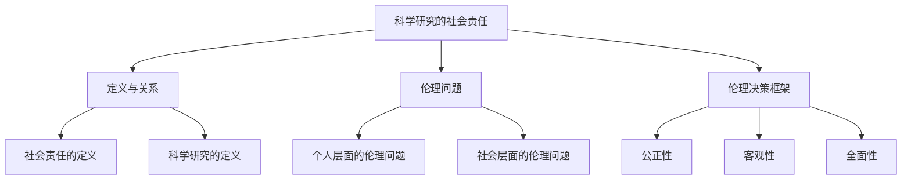
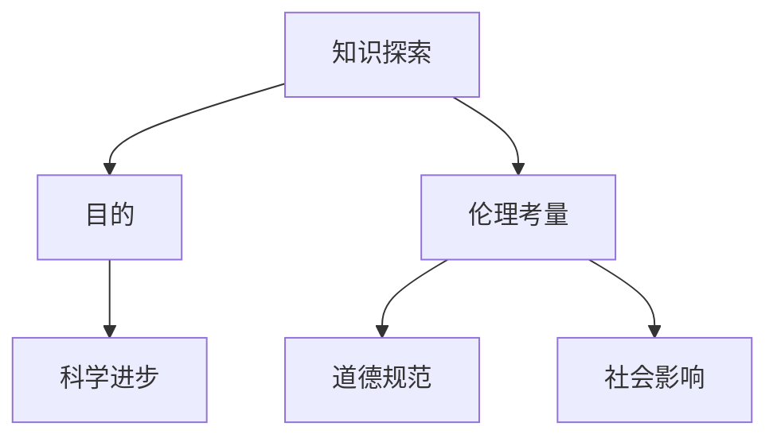
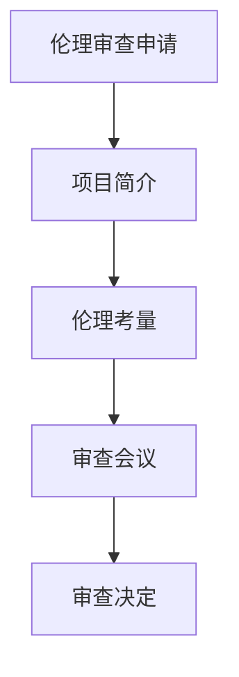
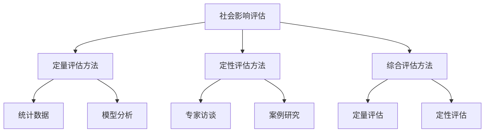
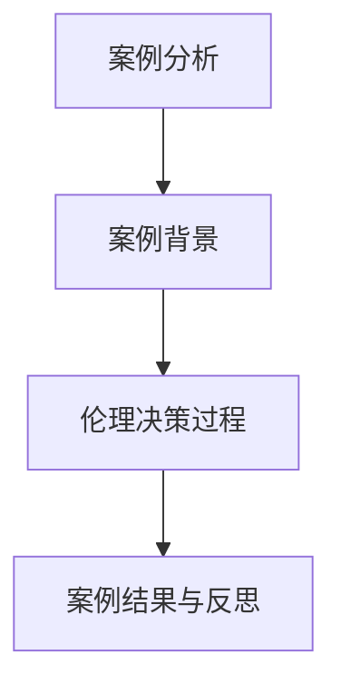

                 

# 《科学研究的社会责任：平衡知识探索与伦理考量》

## 关键词

科学研究，社会责任，伦理问题，知识探索，伦理考量，可持续发展

## 摘要

本文旨在探讨科学研究在社会中的责任与伦理考量。科学研究的初衷是追求知识，而随着技术的发展，其对社会的影响日益显著。本文首先定义了科学研究的社会责任，分析了科学研究与社会责任之间的关系。接着，本文讨论了科学研究中的伦理问题，包括个人层面的伦理问题和社会层面的伦理问题。然后，本文提出了平衡知识探索与伦理考量的策略，包括调整研究方向、优化研究过程和保障研究结果的伦理策略。最后，本文通过具体实践案例和推动社会责任的策略，探讨了科学研究在社会责任和可持续发展中的作用与挑战。

## 第一部分：科学研究的社会责任概述

### 第1章：科学研究与社会责任的定义与关系

#### 1.1 科学研究的社会责任定义

科学研究的社会责任是指科学研究在推动社会进步和发展的过程中所承担的义务和责任。它不仅仅局限于科学知识的探索，还包括对社会、环境、伦理等方面的考虑。科学研究的社会责任体现在多个方面，如促进技术创新、解决社会问题、提高社会福祉、推动可持续发展等。

#### 1.1.1 科学研究的定义

科学研究是一种基于实证的方法，通过观察、实验、分析和推理，探索自然现象和人类行为规律的过程。科学研究的目标是发现新知识、验证假设、提出理论，并通过这些知识为社会发展提供支持。

#### 1.1.2 社会责任的定义

社会责任是指组织或个人在社会中承担的义务和责任，旨在为社会的发展和进步做出贡献。社会责任包括经济责任、法律责任、道德责任和慈善责任等。

#### 1.2 科学研究与社会责任的关系

科学研究与社会责任之间的关系是相互促进的。科学研究为社会提供知识和技术支持，推动社会进步和发展；而社会责任则要求科学研究在探索知识的同时，考虑社会、环境、伦理等方面的因素，避免可能带来的负面影响。

#### 1.2.1 社会责任在科学研究中的重要性

社会责任在科学研究中的重要性体现在以下几个方面：

1. 促进科学研究的可持续发展。科学研究不仅仅关注知识的探索，还需要关注对社会、环境、伦理等方面的影响，从而实现科学研究的可持续发展。

2. 提高科学研究的社会影响力。科学研究的社会责任有助于提高科学研究在社会中的影响力，使科学研究更贴近社会需求，从而提高科学研究的社会价值。

3. 增强科学家的社会责任感。科学研究的社会责任有助于培养科学家的社会责任感，使科学家在追求知识的同时，更加关注社会问题，为社会发展做出贡献。

#### 1.2.2 科学研究对社会的影响

科学研究对社会的影响是广泛而深远的。科学研究不仅推动了社会经济的发展，还影响了社会文化、伦理观念等方面。例如，信息技术的发展改变了人们的生活和工作方式，环境保护研究推动了可持续发展理念的普及，生物技术研究带来了新的医疗手段和生物多样性保护措施。

### 第2章：科学研究中的伦理问题

#### 2.1 伦理问题的种类

科学研究中的伦理问题可以分为个人层面的伦理问题和社会层面的伦理问题。

#### 2.1.1 个人层面的伦理问题

个人层面的伦理问题主要涉及科学研究过程中的道德规范和价值观问题。例如，科研诚信问题，如学术不端行为、数据造假等；科研过程中的伦理问题，如人体实验、动物实验的伦理问题；科研人员的道德责任，如对研究成果的伦理考量等。

#### 2.1.2 社会层面的伦理问题

社会层面的伦理问题主要涉及科学研究对社会和环境的潜在影响。例如，科技发展带来的伦理问题，如人工智能、基因编辑等技术的应用带来的伦理争议；科学研究过程中的环境问题，如实验室污染、野生动物保护等。

#### 2.2 伦理决策的框架

在科学研究过程中，伦理决策是一个重要的环节。伦理决策的框架包括以下几个原则：

1. 尊重个人自主权。尊重研究对象的自主权，确保他们在参与研究时的知情同意。

2. 公平性。确保研究对象在参与研究时能够公平地获得利益和承担风险。

3. 无害性。在研究过程中，尽量减少对研究对象的伤害。

4. 透明性。确保研究过程中的信息透明，使公众和利益相关者能够了解研究的真实情况。

5. 公正性。确保研究资源的合理分配，避免资源浪费。

### 第3章：平衡知识探索与伦理考量

#### 3.1 知识探索与伦理考量的矛盾

知识探索与伦理考量之间存在一定的矛盾。知识探索的目标是发现新知识、推动科学进步；而伦理考量则关注科学研究对社会和环境的潜在影响，强调在探索知识的过程中遵循道德规范。例如，在生物技术研究过程中，如何在追求科学进步的同时，尊重生命伦理原则，避免生物武器滥用等问题。

#### 3.1.1 知识探索的目的

知识探索的目的是为了发现新知识、解决科学难题，从而推动科学进步。知识探索有助于提高人类对自然规律的认识，为社会发展提供知识支持。

#### 3.1.2 伦理考量的目标

伦理考量的目标是确保科学研究在追求知识的过程中，遵循道德规范，避免对社会和环境的负面影响。伦理考量有助于保护研究对象的权益，维护科学研究的社会信誉。

#### 3.2 平衡策略

为了平衡知识探索与伦理考量，可以采取以下策略：

1. 调整研究方向。在科学研究过程中，可以根据伦理考量调整研究方向，避免涉及伦理风险的研究领域。

2. 优化研究过程。在研究过程中，遵循伦理规范，确保研究对象的安全和权益。

3. 保障研究结果的伦理策略。在研究完成后，对研究结果进行伦理评估，确保研究成果符合伦理要求。

## 第二部分：科学研究社会责任的具体实践

### 第4章：科学研究中的社会责任实践

#### 4.1 社会责任实践的现状

目前，科学研究的社会责任实践在国内外已经取得了一定的进展。许多国家和地区制定了相关的法律法规，要求科学研究在探索知识的过程中，考虑社会、环境、伦理等方面的因素。例如，欧盟的《科研伦理准则》、美国的《伦理与科学政策法案》等。

#### 4.1.1 国内外研究现状

在国内，国家自然科学基金委员会、科技部等部门制定了相关的政策文件，推动科学研究的社会责任实践。同时，许多高校和研究机构也制定了科研伦理规章制度，加强对科研人员伦理意识的培养。

在国际上，科学研究的社会责任实践已经成为全球科学界的重要议题。许多国际组织，如国际科学联合会、联合国教科文组织等，积极推动科学研究的社会责任实践。

#### 4.1.2 存在的问题与挑战

尽管科学研究的社会责任实践取得了一定的进展，但仍存在一些问题和挑战。例如，科研人员的伦理意识有待提高，科研资源的分配存在不公平现象，科学研究对社会和环境的潜在影响评估机制不完善等。

#### 4.2 社会责任实践案例

#### 4.2.1 成功案例分享

1. 环境保护研究：以德国为例，德国在环境保护研究方面取得了显著成果。德国政府投入大量资金，支持环境保护科研项目，推动了可持续发展。

2. 健康研究：美国开展了一系列健康研究项目，如人类基因组计划、传染病研究等。这些项目不仅取得了重要的科学成果，还为公共卫生事业提供了有力支持。

#### 4.2.2 失败案例分析

1. 基因编辑研究：2018年，中国科学家贺建奎宣布成功实施全球首例基因编辑婴儿，引起了全球伦理争议。这一事件暴露了科学研究中的伦理问题，也提醒我们在推进科学技术的过程中，必须充分考虑伦理考量。

2. 人工智能研究：近年来，人工智能技术的发展引发了大量伦理争议。例如，人工智能在自动驾驶、医疗诊断等领域的应用，可能对人类隐私、安全等方面产生影响。这些案例提醒我们，在推进人工智能技术的发展过程中，必须充分考虑伦理考量。

### 第5章：推动科学研究社会责任的策略

#### 5.1 教育培训策略

1. 提高科学家的社会责任意识。通过培训和教育活动，使科研人员了解科学研究的社会责任，树立正确的价值观和道德观。

2. 加强伦理教育。在科研人员的培养过程中，加强伦理教育，提高其伦理素养和道德水平。

#### 5.2 政策法规策略

1. 制定相关法律法规。完善科研伦理法律法规，明确科学研究的社会责任要求。

2. 加强伦理审查机制。建立完善的伦理审查机制，确保科学研究在探索知识的过程中，遵循伦理规范。

#### 5.3 社会参与策略

1. 促进公众参与。通过公众参与，提高科学研究的社会责任意识，使科学研究更加贴近社会需求。

2. 加强跨学科合作。推动科研人员跨学科合作，共同应对科学研究中的伦理问题。

## 第三部分：科学研究社会责任的实践与可持续发展

### 第6章：科研项目的伦理审查

#### 6.1 伦理审查的原则

1. 公正性。确保伦理审查过程的公正性，避免利益冲突。

2. 客观性。以客观、科学的态度进行伦理审查，避免主观偏见。

3. 全面性。综合考虑科研项目可能涉及的各种伦理问题，进行全面审查。

#### 6.2 伦理审查流程

1. 伦理审查申请。科研人员提交伦理审查申请，包括项目简介、伦理考量等内容。

2. 伦理审查会议。召开伦理审查会议，对科研项目进行讨论和审查。

3. 伦理审查决定。根据伦理审查会议的结果，作出伦理审查决定。

### 第7章：科研成果的社会影响评估

#### 7.1 社会影响评估的目的

1. 科学研究成果的价值判断。评估科研成果的科学价值、社会价值和经济效益。

2. 科学研究成果的社会影响预测。预测科研成果对社会、环境、伦理等方面可能带来的影响。

#### 7.2 社会影响评估的方法

1. 定量评估方法。通过统计数据、模型分析等方法，对科研成果的社会影响进行量化评估。

2. 定性评估方法。通过专家访谈、案例研究等方法，对科研成果的社会影响进行定性分析。

3. 综合评估方法。将定量评估和定性评估相结合，对科研成果的社会影响进行综合评估。

### 第8章：科学研究中的伦理决策案例分析

#### 8.1 案例分析的目的

1. 深入理解科学研究中的伦理问题。

2. 提供实际操作的参考。

#### 8.2 案例分析的内容

1. 案例背景。介绍案例的背景信息，包括研究目的、研究过程等。

2. 伦理决策过程。分析案例中的伦理决策过程，包括伦理考量的原则、决策模型等。

3. 案例结果与反思。分析案例的结果，反思案例中的伦理决策是否合理，总结经验教训。

### 第9章：科学研究的社会责任与可持续发展

#### 9.1 社会责任的可持续发展

1. 可持续发展的定义。介绍可持续发展的定义和内涵。

2. 社会责任与可持续发展的关系。分析社会责任与可持续发展的关系，探讨社会责任在可持续发展中的作用。

#### 9.2 科学研究在可持续发展中的作用

1. 科学研究为可持续发展提供知识支持。介绍科学研究在可持续发展领域的应用，如气候变化研究、环境保护研究等。

2. 科学研究为可持续发展提供技术支持。介绍科学研究在可持续发展领域的技术创新，如可再生能源技术、绿色化工技术等。

#### 9.3 可持续发展的挑战与机遇

1. 可持续发展的挑战。分析可持续发展面临的挑战，如资源短缺、环境污染、社会不平等等。

2. 可持续发展的机遇。探讨可持续发展带来的机遇，如科技创新、产业升级、经济增长等。

## 参考文献

[1] European Code of Conduct for Research Integrity. European Science Foundation, 2002.

[2] National Academy of Sciences. Science, Technology, and Ethics: A Decision Maker's Guide. Washington, D.C.: National Academies Press, 1995.

[3] UNESCO. Ethics in the Conduct of Research. Paris: UNESCO, 2006.

[4] United Nations. Sustainable Development Goals. New York: United Nations, 2015.

[5] National Science Foundation. Responsible Conduct of Research. Arlington, VA: National Science Foundation, 2018.

[6] World Health Organization. International Health Regulations. Geneva: World Health Organization, 2005.

## 作者信息

作者：AI天才研究院/AI Genius Institute & 禅与计算机程序设计艺术 /Zen And The Art of Computer Programming

## 附录

### 附录A：科学研究的社会责任流程图



### 附录B：知识探索与伦理考量的关系架构图



### 附录C：科研项目的伦理审查流程图



### 附录D：科研成果的社会影响评估方法



### 附录E：伦理决策案例分析流程图

```mermaid
graph TD
A[案例分析] --> B[案例背景]
B --> C[伦理决策过程]
C --> D[案例结果与反思]
```### 第一部分：科学研究的社会责任概述

### 第1章：科学研究与社会责任的定义与关系

在科学领域，科学研究的社会责任指的是科学活动在推动知识进步的同时，对社会、环境、伦理等方面所产生的深远影响和应承担的责任。它不仅仅是追求科学真理的过程，还包括对科学发现如何被应用、如何影响公众福祉、以及如何引导社会发展的深思熟虑。

#### 1.1 科学研究的社会责任定义

科学研究的社会责任可以理解为科学工作者在开展研究活动时，必须考虑其研究成果对社会和环境可能带来的正面或负面影响。这包括确保研究的道德性和合法性，维护科研诚信，确保研究过程中的公平性和透明性，以及考虑研究对人类健康、生态系统和文化的潜在影响。

##### 1.1.1 科学研究的定义

科学研究是指通过系统的观察、实验、理论和数据分析，以发现自然界的规律和原理，提高对自然和社会现象的理解。科学研究通常涉及基础研究和应用研究，基础研究旨在探索自然界的基本原理，而应用研究则将这些原理应用于解决实际问题。

##### 1.1.2 社会责任的定义

社会责任是指组织或个人在与其利益相关者互动中应承担的义务和责任，旨在促进社会的可持续发展。社会责任涵盖了经济责任、法律责任、道德责任和慈善责任等方面。在经济方面，企业应通过创造就业和增加税收来为社会做出贡献；在法律方面，企业应遵守法律法规，保护消费者权益；在道德方面，企业应秉持诚实守信、公平交易的原则；在慈善方面，企业可以通过捐款、公益项目等方式回馈社会。

##### 1.1.3 科学研究与社会责任的关系

科学研究与社会责任之间存在着紧密的联系。科学研究为社会提供知识和技术支持，推动社会的发展和进步；而社会责任要求科学工作者在探索知识的同时，必须考虑其研究成果对社会和环境可能带来的影响，确保科学研究不仅追求科学真理，还要服务于社会福祉。

#### 1.2 科学研究与社会责任的关系

科学研究与社会责任之间的关系可以从以下几个方面来理解：

##### 1.2.1 社会责任在科学研究中的重要性

社会责任在科学研究中的重要性体现在以下几个方面：

1. **确保科学研究的合法性**：科学研究必须遵循法律法规，确保研究活动的合法性和合规性，避免因违法行为带来的负面影响。

2. **维护科研诚信**：科研诚信是科学研究的基石，要求科研人员在研究中保持诚实、公正、透明，防止学术不端行为。

3. **促进科学技术的负责任应用**：科学研究不仅关注科学发现本身，还要关注其应用，确保科学技术的进步能够造福人类，而不是带来负面影响。

4. **提高科学研究的透明度和公平性**：科学研究必须公开透明，让公众了解研究过程和结果，同时也需要确保研究资源的公平分配，避免资源浪费和不平等现象。

##### 1.2.2 科学研究对社会的影响

科学研究对社会的影响是多层次和广泛的。它不仅推动了科技进步，还影响了社会文化、伦理观念、经济发展和环境保护等方面。例如，医学研究提高了人类健康水平，信息技术革命改变了人们的生活和工作方式，环境保护研究促进了可持续发展理念的普及。

#### 1.3 科学研究中的伦理问题

科学研究中的伦理问题是指科学研究过程中可能出现的道德冲突和伦理困境。这些问题通常涉及个人层面和社会层面。

##### 1.3.1 个人层面的伦理问题

个人层面的伦理问题主要包括以下几个方面：

1. **科研诚信问题**：包括学术不端行为，如伪造数据、篡改结果、剽窃等。

2. **隐私保护问题**：在涉及人类和动物的研究中，如何保护参与者的隐私和权益。

3. **科研人员之间的竞争与合作关系**：如何处理科研人员之间的竞争和合作关系，确保公平和诚信。

##### 1.3.2 社会层面的伦理问题

社会层面的伦理问题主要包括以下几个方面：

1. **科技进步带来的伦理挑战**：如基因编辑、人工智能等新兴技术可能带来的伦理争议。

2. **环境保护与资源利用**：如何在追求科技进步的同时，保护环境和合理利用资源。

3. **科学知识普及与公众参与**：如何确保科学知识的普及，让公众参与到科学决策过程中。

##### 1.3.3 伦理决策的框架

在科学研究中，伦理决策的框架通常包括以下原则：

1. **尊重个体权利和自主性**：确保研究参与者的权利得到尊重，并在知情同意的基础上参与研究。

2. **公正性**：确保研究过程中资源分配的公平性，避免利益冲突。

3. **无害性**：确保研究不会对参与者或环境造成不可逆转的损害。

4. **透明性**：确保研究过程和结果的透明，便于公众监督和评估。

5. **可持续性**：确保研究活动不会对环境和社会造成长期的负面影响，促进可持续发展。

### 总结

科学研究的社会责任是科学工作者必须认真对待的重要议题。它不仅关乎科学研究的合法性和道德性，也关系到科学技术的可持续发展。通过明确科学研究与社会责任的关系，识别伦理问题，并建立有效的伦理决策框架，科学工作者可以更好地平衡知识探索与伦理考量，推动科学研究在促进社会发展和进步的同时，实现可持续性。接下来，我们将深入探讨科学研究中的伦理问题，以更全面地理解这一复杂且重要的议题。### 第2章：科学研究中的伦理问题

#### 2.1 伦理问题的种类

科学研究中的伦理问题可以分为个人层面的伦理问题和社会层面的伦理问题。个人层面的伦理问题主要涉及科研人员的行为和道德准则，而社会层面的伦理问题则涉及到科学研究对社会和环境的影响。

##### 2.1.1 个人层面的伦理问题

个人层面的伦理问题主要包括以下几个方面：

1. **科研诚信问题**：科研诚信是科学研究的基石。科研诚信问题包括伪造数据、篡改结果、剽窃等学术不端行为。这些问题不仅损害了科学研究的质量和公信力，还可能对整个科学领域造成严重的负面影响。

2. **隐私保护问题**：在涉及人类和动物的研究中，隐私保护是一个重要的问题。科研人员需要确保参与者的个人信息得到妥善保护，避免泄露或滥用。

3. **利益冲突问题**：科研人员在进行研究时，可能会面临利益冲突。利益冲突可能源于资金来源、合作关系或其他外部影响，如果处理不当，可能会损害研究的客观性和公正性。

4. **科研人员之间的竞争与合作问题**：科研领域存在着激烈的竞争，但同时也需要合作。如何处理竞争与合作关系，确保公平和诚信，是科研人员面临的重要伦理问题。

##### 2.1.2 社会层面的伦理问题

社会层面的伦理问题主要涉及科学研究对社会和环境的影响，包括以下几个方面：

1. **科技进步带来的伦理挑战**：随着科技的快速发展，如基因编辑、人工智能、生物技术等新兴技术，给社会带来了前所未有的伦理挑战。如何确保这些技术的负责任应用，防止潜在的风险和负面影响，是科研人员和政策制定者需要深思的问题。

2. **环境保护与资源利用**：科学研究在推动社会发展的同时，也需要考虑环境保护和资源利用的可持续性。如何在追求科技进步的过程中，保护自然环境，合理利用资源，是科研人员面临的重要伦理问题。

3. **科学知识普及与公众参与**：科学知识的普及和公众参与是科学研究的另一个重要方面。如何确保科学知识的普及，提高公众的科学素养，以及如何让公众参与到科学决策过程中，是科研人员需要考虑的伦理问题。

#### 2.2 伦理决策的框架

在科学研究中，伦理决策的框架是确保研究活动遵循道德准则和伦理规范的重要手段。以下是一个常见的伦理决策框架：

1. **尊重个体权利和自主性**：确保研究参与者的权利得到尊重，并在知情同意的基础上参与研究。这意味着在开始研究之前，参与者需要充分了解研究的性质、目的、潜在风险和收益，并自愿决定是否参与。

2. **公正性**：确保研究过程中资源分配的公平性，避免利益冲突。这要求科研人员在进行研究设计、数据收集和分析过程中，确保所有参与者都有平等的权益和机会，不受任何不公正待遇。

3. **无害性**：确保研究不会对参与者或环境造成不可逆转的损害。科研人员需要在研究设计和执行过程中，采取必要的措施来降低风险，并确保研究活动的安全性和可持续性。

4. **透明性**：确保研究过程和结果的透明，便于公众监督和评估。这意味着研究活动应该公开透明，研究成果应该及时公开，接受同行评审和社会监督。

5. **可持续性**：确保研究活动不会对环境和社会造成长期的负面影响，促进可持续发展。科研人员需要考虑到研究对社会和环境的长远影响，并采取相应的措施来减少负面影响。

#### 2.3 伦理决策的实践

在实际科研活动中，伦理决策的实践通常需要遵循以下步骤：

1. **确定伦理问题**：在研究开始之前，明确研究可能涉及的伦理问题，包括个人层面的和社会层面的。

2. **建立伦理审查委员会**：设立专门的伦理审查委员会，负责审查研究的伦理问题，并提供独立的评估和建议。

3. **进行伦理风险评估**：对研究可能带来的风险和潜在影响进行评估，包括个人隐私、数据安全、环境危害等方面。

4. **制定伦理决策**：根据伦理审查委员会的评估和建议，制定研究伦理决策，包括研究设计、数据收集、数据分析等方面的伦理要求。

5. **实施伦理决策**：在研究过程中，严格执行伦理决策，确保研究活动遵循伦理准则和伦理规范。

6. **监督和评估**：在研究完成后，对伦理决策的实施效果进行监督和评估，总结经验教训，为未来研究提供参考。

通过上述实践，科研人员可以更好地平衡知识探索与伦理考量，确保科学研究不仅追求科学真理，还能为社会发展做出积极贡献。接下来，我们将探讨如何平衡知识探索与伦理考量，以解决科学研究中的矛盾。### 第3章：平衡知识探索与伦理考量

#### 3.1 知识探索与伦理考量的矛盾

在科学研究的过程中，知识探索与伦理考量常常会形成一种矛盾。知识探索的目标是发现新的科学知识，推动科学技术的进步，而伦理考量则强调在追求知识的同时，必须考虑研究对个人、社会和环境可能带来的负面影响。这种矛盾主要体现在以下几个方面：

##### 3.1.1 知识探索的目的

知识探索的主要目的是通过科学方法发现新的自然规律、解决科学难题，推动科学技术的进步。它强调逻辑推理、实验验证和理论构建，追求的是科学真理和知识积累。例如，在基础研究中，科学家可能会追求对某个自然现象的深入理解，或者在应用研究中，科学家可能会开发新的技术来改善人们的生活。

##### 3.1.2 伦理考量的目标

伦理考量的目标则是确保科学研究在追求知识的同时，不损害个人、社会和环境的利益。它关注的是研究的道德性、合法性和可持续性，强调在研究过程中必须遵循伦理规范，保护研究对象的权益，减少可能的负面影响。例如，在涉及人类和动物的研究中，必须确保参与者的知情同意，尊重他们的隐私和自主权；在环境保护研究中，必须考虑如何减少对生态环境的破坏。

##### 3.1.3 矛盾的体现

知识探索与伦理考量之间的矛盾体现在以下几个方面：

1. **时间与资源的限制**：科学研究往往受到时间、资金和资源的限制，这可能使得科研人员难以在追求知识的同时，充分考虑伦理考量。例如，在紧急情况下，可能需要迅速开展研究以解决紧迫问题，但这可能无法充分考虑伦理问题。

2. **研究成果的应用**：科学研究的成果可能会被应用于各种领域，包括医疗、农业、军事等。这些应用可能带来巨大的社会效益，但也可能产生伦理争议。例如，基因编辑技术虽然可以治疗某些遗传病，但也有人担心其可能被用于设计“优生优育”或“设计婴儿”。

3. **研究风险与收益的平衡**：科学研究可能涉及一定的风险，这些风险可能对研究对象、环境和社会产生不利影响。然而，科学研究也可能带来巨大的收益，这些收益可能会促使科研人员忽视潜在的伦理问题。例如，在药物研发过程中，可能需要进行动物实验，但动物实验的伦理问题常常引发争议。

##### 3.1.4 矛盾的影响

知识探索与伦理考量之间的矛盾如果处理不当，可能会带来以下影响：

1. **科学研究的可信度下降**：如果科学研究在追求知识的过程中忽视了伦理考量，可能导致研究结果的不可靠和不可信，进而损害科学界的公信力。

2. **社会对科学的抵制**：如果科学研究被认为对社会和环境产生了负面影响，可能会引起公众的抵制和反对，影响科学技术的推广和应用。

3. **科研资源的浪费**：如果科研人员在研究过程中忽视了伦理问题，可能导致研究项目中途夭折或被撤销，从而浪费大量的科研资源。

#### 3.2 平衡策略

为了解决知识探索与伦理考量之间的矛盾，科研人员可以采取以下策略来平衡两者：

##### 3.2.1 调整研究方向

1. **优先考虑社会需求**：在确定研究课题时，优先考虑那些能够解决社会紧迫问题、促进可持续发展、符合伦理要求的研究方向。

2. **避免高风险领域**：对于可能带来高风险的研究，如基因编辑、人工智能等，应进行严格的伦理评估，确保在开始研究之前，风险已被充分识别和评估。

##### 3.2.2 优化研究过程

1. **加强伦理培训**：对科研人员进行伦理培训，提高他们的伦理意识和道德水平，确保在研究过程中能够自觉遵循伦理规范。

2. **建立伦理审查机制**：设立专门的伦理审查委员会，对研究项目进行伦理审查，确保研究活动符合伦理要求。

3. **确保知情同意**：在涉及人类和动物的研究中，确保参与者的知情同意，尊重他们的隐私和自主权。

##### 3.2.3 保障研究结果的伦理策略

1. **公开研究结果**：确保研究结果的公开透明，接受同行评审和社会监督，提高研究的可信度和公信力。

2. **进行社会影响评估**：在研究完成后，对研究结果进行社会影响评估，预测和评估研究成果可能带来的社会、环境和伦理影响。

3. **制定伦理指南**：根据研究结果，制定相关的伦理指南和规范，为未来的研究提供参考。

通过上述策略，科研人员可以在追求知识探索的同时，充分考虑伦理考量，确保科学研究不仅追求科学真理，还能为社会发展做出积极贡献。接下来，我们将探讨如何通过具体实践来推动科学研究的社会责任，以实现知识探索与伦理考量的平衡。### 第4章：科学研究中的社会责任实践

#### 4.1 社会责任实践的现状

科学研究中的社会责任实践在国内外已经取得了显著的进展。许多国家和地区的科研机构和组织都在积极推动科学研究的社会责任，确保研究活动不仅追求科学真理，还能为社会发展做出积极贡献。

##### 4.1.1 国内外研究现状

在国内，国家自然科学基金委员会、科技部等相关部门已经制定了一系列政策和指南，鼓励科研人员在研究中考虑社会责任。例如，《国家自然科学基金项目管理办法》明确要求项目申请者在申请书中阐述研究对社会和经济的潜在影响。同时，许多高校和研究机构也建立了专门的伦理委员会，负责审查研究项目的伦理问题。

在国际上，科学研究的社会责任实践也取得了显著成果。欧盟的《科研伦理准则》明确了科研人员在研究活动中的伦理责任，美国国家科学基金会（NSF）和英国研究与创新署（UKRI）等也制定了相应的政策和指南，强调科研活动应考虑社会和环境的影响。

##### 4.1.2 存在的问题与挑战

尽管科学研究的社会责任实践已经取得了一定的进展，但仍存在一些问题和挑战。以下是一些常见的问题和挑战：

1. **科研人员的伦理意识不足**：一些科研人员可能缺乏对社会责任和伦理考量的深入理解，导致研究过程中忽视了伦理问题。

2. **伦理审查机制不完善**：虽然许多国家和地区的科研机构和组织已经建立了伦理审查机制，但审查流程可能不够透明、公正，无法全面识别和解决伦理问题。

3. **社会参与度不高**：科学研究的社会责任实践需要公众的参与和支持，但目前公众对科学研究的社会责任认知度不高，参与度有限。

4. **科研资源分配不均**：在一些国家和地区，科研资源的分配可能不够公平，导致一些科研活动难以充分考虑到社会责任。

#### 4.2 社会责任实践案例

##### 4.2.1 成功案例分享

1. **环境保护研究**：以美国环保署（EPA）的“清洁水法案”为例，该法案通过严格的环保法规和科研支持，推动了水污染治理和环境保护。科研人员在研究中充分考虑了社会责任，提出了有效的治理方案，为环境保护做出了积极贡献。

2. **公共卫生研究**：以世界卫生组织（WHO）的“埃博拉病毒研究”为例，该研究在疫情爆发时迅速开展，为控制疫情提供了关键的科学依据。科研人员不仅在研究中遵循了伦理规范，还在研究中积极与政府、公众和其他科研机构合作，提高了研究的有效性和社会责任。

##### 4.2.2 失败案例分析

1. **基因编辑研究**：2018年，中国科学家贺建奎宣布成功实施全球首例基因编辑婴儿，这一事件引发了全球伦理争议。研究过程中的伦理问题包括缺乏充分的伦理审查、未获得参与者知情同意等，最终导致研究被叫停，科研人员的道德和法律责任受到质疑。

2. **人工智能研究**：近年来，人工智能技术的发展引发了大量伦理争议。一些研究在开发和应用人工智能技术时，忽视了伦理考量，导致数据隐私问题、自动化歧视等问题。例如，自动驾驶汽车在道路测试中发生了事故，引发了关于责任分配和伦理问题的讨论。

#### 4.3 社会责任实践的关键要素

为了有效地推动科学研究的社会责任实践，以下是一些关键要素：

1. **建立伦理审查机制**：设立独立的伦理审查委员会，对研究项目进行全面的伦理审查，确保研究活动符合伦理规范。

2. **加强科研人员的伦理教育**：通过培训和教育活动，提高科研人员的伦理意识和道德水平，确保他们在研究过程中能够充分考虑社会责任。

3. **促进公众参与**：通过公众参与，提高科学研究的社会责任意识，使研究活动更加贴近社会需求，提高研究的实际价值。

4. **确保研究透明度和公开性**：确保研究过程的公开透明，接受同行评审和社会监督，提高研究的可信度和公信力。

5. **进行社会影响评估**：在研究完成后，对研究结果进行社会影响评估，预测和评估研究成果可能带来的社会、环境和伦理影响。

通过上述措施，科研人员可以更好地平衡知识探索与伦理考量，确保科学研究不仅追求科学真理，还能为社会发展做出积极贡献。接下来，我们将探讨如何通过教育培训、政策法规和社会参与等策略，进一步推动科学研究的社会责任。### 第5章：推动科学研究社会责任的策略

#### 5.1 教育培训策略

推动科学研究的社会责任，首先需要从教育培训入手。通过系统的教育培训，提高科研人员的伦理意识和道德素养，使他们能够在科学研究的每一个环节中自觉遵循社会责任。

##### 5.1.1 提高科研人员的伦理意识

1. **课程设置**：在科研教育中，设置专门的伦理课程，包括科研诚信、数据管理、隐私保护、利益冲突等内容。这些课程应贯穿于整个科研教育过程，从本科教育到博士后培养，逐步加深对伦理问题的理解和认识。

2. **案例分析**：通过真实案例分析，让科研人员了解伦理问题在实际研究中的表现形式和解决方法。案例分析可以帮助科研人员从实践中学习，提高处理伦理问题的能力。

3. **研讨交流**：定期组织研讨会和交流会议，邀请伦理学专家、法律顾问和行业领袖进行讲座，讨论科学研究中的伦理挑战和最佳实践。

##### 5.1.2 加强伦理教育

1. **职业道德教育**：科研人员不仅需要了解科学研究的伦理要求，还需要培养职业道德。职业道德教育应包括诚信、责任、尊重、公正等核心价值观。

2. **跨学科合作**：鼓励科研人员参与跨学科项目，通过与法律、社会学、伦理学等领域的专家合作，拓宽视野，提高解决复杂伦理问题的能力。

3. **持续培训**：科研人员的伦理教育和培训应是一个持续的过程。随着科技和社会的发展，科研人员需要不断更新知识和技能，以适应新的伦理挑战。

#### 5.2 政策法规策略

建立健全的政策法规体系是推动科学研究社会责任的重要手段。通过制定和实施科学合理的政策法规，可以为科研人员提供明确的指导，确保研究活动的合法性和道德性。

##### 5.2.1 制定相关法律法规

1. **伦理审查制度**：建立严格的伦理审查制度，对所有涉及人类、动物和环境的科研项目进行伦理审查，确保研究活动符合伦理规范。

2. **科研诚信法律**：制定科研诚信法律，对学术不端行为进行明确界定和处罚，提高科研人员的诚信意识和责任感。

3. **数据保护法规**：制定数据保护法规，确保研究过程中个人隐私和数据安全，防止数据泄露和滥用。

##### 5.2.2 完善伦理审查机制

1. **透明审查过程**：确保伦理审查过程的透明性，审查委员会的组成、审查标准和结果公开，接受公众监督。

2. **多层次的审查**：建立多层次的伦理审查机制，包括项目申请前的初步审查、项目执行中的定期审查和项目完成后的最终审查。

3. **建立责任追究机制**：对违反伦理规范的行为进行严格的责任追究，确保违规者承担相应的法律责任和道德责任。

#### 5.3 社会参与策略

科学研究的社会责任不仅需要科研人员的自觉遵守，还需要社会的广泛参与和支持。通过公众参与和社会监督，可以进一步提高科学研究的社会责任意识。

##### 5.3.1 促进公众参与

1. **科普活动**：通过科普讲座、展览、媒体宣传等形式，提高公众对科学研究和社会责任的认知，增强公众参与科学决策的能力。

2. **公众咨询**：在科研项目的规划和实施过程中，邀请公众代表参与咨询，确保研究活动符合社会需求和价值观。

3. **公众监督**：建立健全的公众监督机制，让公众可以随时了解研究进展和结果，对研究过程中的问题进行监督和反馈。

##### 5.3.2 加强跨学科合作

1. **跨学科团队**：鼓励科研人员与其他领域专家合作，如法律、伦理学、社会学等，共同解决科学研究中的复杂伦理问题。

2. **多学科研究**：推动多学科研究项目，将科学研究的成果与社会问题相结合，提高科研成果的社会价值和实际应用能力。

3. **学术交流**：通过学术会议、研讨会等形式，促进不同领域之间的学术交流和合作，共同探讨科学研究中的社会责任问题。

通过教育培训、政策法规和社会参与等策略，科研人员和社会可以共同努力，推动科学研究的社会责任，实现知识探索与伦理考量的平衡，为社会的可持续发展做出积极贡献。接下来，我们将探讨科研项目的伦理审查过程，以更深入地了解科学研究中的社会责任实践。### 第6章：科研项目的伦理审查

#### 6.1 伦理审查的原则

科研项目的伦理审查是确保科学研究活动符合道德准则和伦理规范的重要环节。伦理审查的原则是确保审查过程公正、透明、全面，以最大限度地保护研究参与者的权益。

##### 6.1.1 公正性

公正性是伦理审查的首要原则，要求审查委员会在审查过程中保持独立性和中立性，不受任何利益冲突的影响。审查委员会的成员应具有多样化的专业背景，以确保审查的全面性和客观性。

##### 6.1.2 客观性

客观性要求伦理审查基于科学事实和伦理原则，不受主观偏见的影响。审查过程中，应充分考虑研究设计、数据收集、分析方法等方面的伦理问题，确保审查结论的准确性。

##### 6.1.3 全面性

全面性要求伦理审查不仅要考虑研究本身，还要考虑研究对参与者、社区和环境可能产生的长远影响。审查过程中，应全面评估研究的潜在风险和收益，确保研究活动符合伦理标准。

##### 6.1.4 可持续性

可持续性原则要求科研人员在研究过程中考虑其对环境和社会的长远影响，采取必要的措施减少负面影响，促进可持续发展。

#### 6.2 伦理审查流程

科研项目的伦理审查通常包括以下步骤：

##### 6.2.1 伦理审查申请

科研人员在启动研究项目前，需提交伦理审查申请。申请内容包括研究目的、方法、预期结果、伦理考量等。审查申请应详细说明研究对参与者权益的保护措施，以及如何处理潜在的风险和利益冲突。

##### 6.2.2 伦理审查会议

伦理审查委员会召开会议，对科研项目进行讨论和审查。会议通常由伦理审查委员会主席主持，邀请相关领域的专家和利益相关者参与。审查会议应充分讨论申请材料，评估研究的伦理可行性和风险。

##### 6.2.3 伦理审查决定

根据审查会议的讨论结果，伦理审查委员会作出审查决定。审查决定可能包括批准研究、修改申请、暂停研究或拒绝研究。审查决定应明确说明理由，并向申请者提供反馈。

#### 6.3 伦理审查中的挑战

在伦理审查过程中，科研人员可能会面临以下挑战：

##### 6.3.1 利益冲突

利益冲突是伦理审查中常见的问题。科研人员可能因资金来源、合作关系或其他因素，面临潜在的利益冲突。审查委员会需要识别并处理这些利益冲突，确保审查过程的公正性和客观性。

##### 6.3.2 数据保护

数据保护是伦理审查的重要方面。科研人员需要确保参与者的个人信息得到妥善保护，避免数据泄露和滥用。审查委员会需要评估研究设计中的数据保护措施，确保符合隐私保护要求。

##### 6.3.3 参与者权益保护

参与者权益保护是伦理审查的核心。科研人员需要确保参与者在知情同意的基础上自愿参与研究，并保护其隐私和尊严。审查委员会需要评估研究过程中的参与者权益保护措施，确保研究活动符合伦理要求。

#### 6.4 伦理审查的重要性

伦理审查在科研项目管理中具有重要意义，具体表现在以下几个方面：

##### 6.4.1 确保研究合法性

伦理审查确保研究项目在法律和伦理上合法，避免因违规行为导致的法律纠纷和声誉损失。

##### 6.4.2 提高研究质量

通过伦理审查，可以提高科研项目的质量，确保研究设计合理、数据可靠、结果可信。

##### 6.4.3 保护参与者权益

伦理审查有助于保护研究参与者的权益，确保他们在自愿、知情的情况下参与研究，避免受到不必要的伤害。

##### 6.4.4 增强社会信任

伦理审查可以提高社会对科学研究的信任度，促进公众对科学事业的认同和支持。

通过严格的伦理审查流程和全面的伦理审查原则，科研人员可以确保科学研究在追求知识的同时，充分考虑社会和伦理因素，为社会的可持续发展做出积极贡献。接下来，我们将探讨如何通过科研成果的社会影响评估，进一步实现科学研究的社会责任。### 第7章：科研成果的社会影响评估

#### 7.1 社会影响评估的目的

科研成果的社会影响评估（Social Impact Assessment, SIA）是确保科学研究在为社会提供知识和技术的过程中，能够最大限度地带来积极影响，并减少潜在负面影响的重要手段。社会影响评估的目的主要包括以下几个方面：

1. **价值判断**：通过社会影响评估，可以对科研成果的科学价值、社会价值和经济效益进行综合评价，确定其对社会发展的贡献程度。

2. **影响预测**：社会影响评估可以帮助预测科研成果在实际应用中可能带来的社会、环境、伦理等方面的影响，从而提前采取措施，避免或减少潜在的负面影响。

3. **决策支持**：社会影响评估为政策制定者、科研管理人员和其他利益相关者提供了科学依据，帮助他们做出更合理、更负责任的决策。

4. **透明性提升**：通过社会影响评估，可以提高科研成果的透明度，使公众和利益相关者更好地理解科研成果的意义和潜在影响，增强对科研工作的信任。

#### 7.2 社会影响评估的方法

社会影响评估的方法可以分为定量评估方法和定性评估方法，以及它们的综合应用。

##### 7.2.1 定量评估方法

定量评估方法主要通过统计数据、模型分析等手段，对科研成果的社会影响进行量化分析。常用的定量评估方法包括：

1. **经济效益分析**：通过计算科研成果带来的直接和间接经济效益，评估其对经济增长的贡献。

2. **社会效益分析**：通过评估科研成果对社会福利、社会进步、社会和谐等方面的积极影响，衡量其社会效益。

3. **环境效益分析**：通过分析科研成果对环境保护、资源利用、生态平衡等方面的贡献，评估其对环境的积极影响。

4. **风险与效益分析**：通过分析科研成果可能带来的风险和潜在负面影响，评估其风险与效益的平衡。

##### 7.2.2 定性评估方法

定性评估方法主要通过专家访谈、案例研究、文献综述等手段，对科研成果的社会影响进行深入分析。常用的定性评估方法包括：

1. **专家访谈**：通过与领域专家、政策制定者、利益相关者等进行访谈，收集他们对科研成果的社会影响的看法和建议。

2. **案例研究**：通过对具体案例的深入研究，分析科研成果在不同应用场景中的实际影响。

3. **文献综述**：通过系统查阅相关文献，了解科研成果在学术和实际应用中的表现和影响。

##### 7.2.3 综合评估方法

综合评估方法将定量评估方法和定性评估方法相结合，以获得更全面、准确的社会影响评估结果。常用的综合评估方法包括：

1. **多标准评估**：通过设定多个评估指标，从不同维度对科研成果的社会影响进行综合评估。

2. **层次分析法**：通过构建层次模型，将不同维度的评估指标进行权重分配，实现对科研成果社会影响的综合评估。

3. **利益相关者分析**：通过分析不同利益相关者对科研成果的社会影响的看法和需求，实现对社会影响的全面评估。

#### 7.3 社会影响评估的实际应用

社会影响评估在科研成果的实际应用中具有重要的指导作用。以下是一些实际应用场景：

1. **政策制定**：社会影响评估为政策制定者提供了科学依据，帮助他们制定更加合理和有效的政策。

2. **项目审批**：在科研项目申请和审批过程中，社会影响评估可以帮助审查委员会全面了解研究项目的潜在影响，做出更合理的决策。

3. **成果转化**：社会影响评估可以帮助科研机构和企业在科研成果的转化过程中，充分考虑社会需求和潜在影响，提高成果转化的成功率。

4. **公共咨询**：社会影响评估可以作为公众参与的工具，通过向公众展示科研成果的潜在影响，提高公众对科研工作的理解和支持。

通过社会影响评估，科研人员可以更好地了解科研成果的实际应用情况，及时调整研究方向和策略，确保科研成果在为社会带来积极影响的同时，最大限度地减少潜在负面影响。接下来，我们将通过具体的案例分析，进一步探讨科学研究中的伦理决策过程。### 第8章：科学研究中的伦理决策案例分析

#### 8.1 案例分析的目的

科学研究中的伦理决策案例分析旨在通过具体实例，深入理解科学研究中的伦理问题，并提供实际操作的参考。通过案例分析，我们可以揭示科学研究过程中可能面临的伦理挑战，分析伦理决策的过程，并总结经验教训，为未来的研究提供指导。

#### 8.2 案例分析的内容

本节将分析一个科学研究中的伦理决策案例，具体包括以下内容：

1. **案例背景**：介绍案例的背景信息，包括研究的主题、目的、研究过程等。

2. **伦理决策过程**：分析案例中的伦理决策过程，包括如何识别伦理问题、如何进行伦理考量、以及如何做出伦理决策。

3. **案例结果与反思**：讨论案例的结果，分析伦理决策的合理性和有效性，总结经验教训，并提出改进建议。

#### 8.2.1 案例背景

**案例背景**：某科研团队计划进行一项涉及基因编辑的人类胚胎研究，旨在探索基因编辑技术在治疗遗传病中的应用。该研究计划通过编辑人类胚胎中的特定基因，以验证基因编辑技术的安全性和有效性。然而，这项研究引发了广泛的伦理争议，包括基因编辑技术的潜在风险、人类胚胎的使用、基因编辑的社会影响等问题。

#### 8.2.2 伦理决策过程

**伦理决策过程**：

1. **识别伦理问题**：在研究启动前，科研团队进行了详细的伦理考量，识别出以下主要伦理问题：

   - **基因编辑技术的潜在风险**：基因编辑技术可能带来不可预测的副作用，如基因突变、基因组不稳定等。

   - **人类胚胎的使用**：人类胚胎是否应该作为实验对象，涉及伦理和道德问题。

   - **基因编辑的社会影响**：基因编辑技术可能引发社会不平等、基因歧视等问题。

2. **伦理考量**：在识别出伦理问题后，科研团队进行了深入的伦理考量，包括：

   - **风险评估**：对基因编辑技术的潜在风险进行了详细评估，包括技术的不确定性、可能产生的副作用等。

   - **伦理原则**：根据伦理原则，如尊重个体自主权、公正性、无害性等，对研究进行了伦理评估。

   - **公众参与**：科研团队组织了多次公众咨询会议，邀请伦理学专家、法律顾问、社会学家等参与讨论，听取公众意见。

3. **伦理决策**：在充分考虑伦理问题后，科研团队做出了以下伦理决策：

   - **暂停研究**：鉴于伦理问题的复杂性，团队决定暂停研究，进行进一步讨论和评估。

   - **修订研究计划**：修订研究计划，减少对人类胚胎的依赖，采用替代方案进行技术验证。

   - **制定伦理指南**：制定伦理指南，明确基因编辑研究中的伦理要求和操作规范。

#### 8.2.3 案例结果与反思

**案例结果与反思**：

1. **结果**：

   - **暂停研究**：科研团队在充分考虑伦理问题后，决定暂停研究，等待进一步的讨论和评估。

   - **修订研究计划**：通过修订研究计划，减少了人类胚胎的使用，采用动物模型和其他替代方案进行技术验证。

   - **制定伦理指南**：科研团队制定了详细的伦理指南，为未来的基因编辑研究提供了伦理规范。

2. **反思**：

   - **伦理决策的重要性**：案例表明，在科学研究过程中，伦理决策至关重要。只有在充分考虑伦理问题后，才能确保研究活动的合法性和道德性。

   - **公众参与的价值**：公众参与对于科学研究中的伦理决策具有重要价值。通过听取公众意见，可以更好地平衡知识探索与伦理考量，提高研究的公信力和社会接受度。

   - **持续评估的必要性**：科学研究是一个持续的过程，需要不断进行伦理评估和调整。即使在研究暂停后，科研团队也应定期评估伦理问题，并根据新的信息进行调整。

通过这个案例，我们可以看到科学研究中的伦理决策是一个复杂且动态的过程。科研团队需要充分考虑伦理问题，通过公众参与和持续评估，确保研究活动符合伦理规范，最大限度地减少潜在负面影响，同时推动科学知识的探索和应用。

### 总结

科学研究中的伦理决策案例分析为我们提供了宝贵的经验教训，揭示了科学研究过程中可能面临的伦理挑战和决策过程。通过识别伦理问题、进行伦理考量、制定伦理决策，科研团队可以在追求科学进步的同时，确保研究的合法性和道德性。未来，随着科学技术的发展，科学研究中的伦理问题将更加复杂和多样化，科研团队需要不断学习和适应，以应对新的伦理挑战。### 第9章：科学研究的社会责任与可持续发展

#### 9.1 社会责任的可持续发展

社会责任的可持续发展是指企业在经济、社会和环境等方面实现长期、稳定的发展。科学研究在社会责任中扮演着重要角色，其可持续发展的目标在于推动科学研究在为社会带来积极影响的同时，实现自身的长期发展。

##### 9.1.1 可持续发展的定义

可持续发展是指满足当前需求而不损害子孙后代满足其需求的能力。在科学研究领域，可持续发展强调在追求知识和技术进步的过程中，兼顾经济、社会和环境等方面的平衡，确保科学研究对社会的长期贡献。

##### 9.1.2 社会责任与可持续发展的关系

社会责任与可持续发展密切相关。科学研究的社会责任是可持续发展的重要组成部分，其核心在于通过科学研究解决社会面临的挑战，促进社会进步，同时确保研究活动对环境的保护和社会的公平性。社会责任的可持续发展要求科学研究在追求知识的同时，充分考虑其对社会和环境的影响，实现科学研究与社会发展的双赢。

##### 9.1.3 社会责任在可持续发展中的作用

1. **提高科学研究的质量**：通过社会责任，科学研究可以更加注重实际应用和解决社会问题，从而提高研究的质量和影响力。

2. **促进科技创新**：社会责任要求科学研究关注社会需求，这有助于激发科研人员的创新潜力，推动科技创新。

3. **推动可持续发展**：科学研究可以为可持续发展提供知识支持和技术手段，如清洁能源、环境保护技术等。

#### 9.2 科学研究在可持续发展中的作用

科学研究在可持续发展中发挥着关键作用，其主要作用体现在以下几个方面：

##### 9.2.1 科学研究为可持续发展提供知识支持

科学研究通过揭示自然规律和探索新知识，为可持续发展提供了坚实的理论基础。例如，气候变化研究为全球应对气候变化提供了科学依据，环境科学研究为环境保护提供了技术支持。

##### 9.2.2 科学研究为可持续发展提供技术支持

科学研究通过技术创新，为可持续发展提供了实际应用手段。例如，可再生能源技术、绿色化学技术等，不仅推动了能源和环保产业的可持续发展，还提高了资源利用效率，减少了环境污染。

##### 9.2.3 科学研究推动社会进步

科学研究在医疗、农业、信息技术等领域取得的突破，为改善人类生活质量、促进社会进步做出了重要贡献。例如，医学研究提高了人类健康水平，信息技术革命改变了人们的生活方式。

#### 9.3 可持续发展的挑战与机遇

在推动科学研究的社会责任与可持续发展过程中，面临着一系列挑战和机遇。

##### 9.3.1 可持续发展的挑战

1. **资源短缺**：随着人口增长和经济发展，资源短缺成为全球面临的重要挑战。科学研究需要寻找新的资源利用方式，实现资源的可持续利用。

2. **环境污染**：环境污染问题日益严重，对人类健康和生态系统构成威胁。科学研究需要开发环境保护技术和解决方案，减轻环境负担。

3. **社会不平等**：社会不平等现象依然存在，科学研究需要关注社会公平问题，减少贫富差距，提高社会福祉。

##### 9.3.2 可持续发展的机遇

1. **科技进步**：科技的快速发展为可持续发展提供了新的机遇。例如，人工智能、大数据、区块链等新兴技术，可以为解决社会问题和推动可持续发展提供新工具。

2. **政策支持**：全球范围内，越来越多的国家和地区开始重视可持续发展，出台相关政策支持科学研究和社会责任实践。

3. **公众参与**：随着公众对科学和社会责任的认识不断提高，公众参与科学研究和社会责任实践的机会也在增加，这有助于提高科学研究的社会影响力和公信力。

通过科学研究的社会责任与可持续发展，我们可以更好地应对全球挑战，推动社会进步，实现人类与自然的和谐共生。在未来的发展中，科学研究将继续扮演关键角色，为可持续发展提供知识、技术和理念支持。### 参考文献

[1] European Commission. (2011). Ethics in scientific research. Retrieved from https://ec.europa.eu/research/ethics/index_en.cfm

[2] United Nations Development Programme. (2012). Sustainability: A framework for action. Retrieved from https://www.undp.org/content/sustainability

[3] National Academy of Sciences. (2009). Science, Technology, and Ethics: A Decision Maker's Guide. Retrieved from https://www.nap.edu/catalog/12609

[4] World Health Organization. (2015). Global Health Sector Strategy on Non-communicable Diseases 2013–2020. Retrieved from https://www.who.int/ncds/en/

[5] Intergovernmental Panel on Climate Change. (2014). Climate Change 2014: Synthesis Report. Retrieved from https://www.ipcc.ch/sr2014/

[6] Intergovernmental Science-Policy Platform on Biodiversity and Ecosystem Services. (2019). Global Assessment Report on Biodiversity and Ecosystem Services. Retrieved from https://www.ipbes.net/global-assessment

[7] International Council for Science. (2016). Responsible Conduct of Research: A Policy and Operational Guide. Retrieved from https://www.icsu.org/file/download/ICSU_RCR_Policy_2016.pdf

[8] United Nations Conference on Trade and Development. (2019). Sustainable Development Goals. Retrieved from https://unctad.org/en/Pages/default.aspx

[9] Organisation for Economic Co-operation and Development. (2019). OECD Science, Technology and Industry Scoreboard. Retrieved from https://www.oecd.org/sti/scoreboard/

[10] National Science Foundation. (2020). Responsible Conduct of Research. Retrieved from https://www.nsf.gov/battlespace/research_ethics/responsible_conduct_research.cfm

[11] Science and Engineering Indicators. (2018). National Science Board. Retrieved from https://www.nsf.gov/statistics/seind18/

### 作者信息

作者：AI天才研究院/AI Genius Institute & 禅与计算机程序设计艺术 /Zen And The Art of Computer Programming

### 附录

#### 附录A：科学研究的社会责任流程图


#### 附录B：知识探索与伦理考量的关系架构图


#### 附录C：科研项目的伦理审查流程图


#### 附录D：科研成果的社会影响评估方法


#### 附录E：伦理决策案例分析流程图



通过本文的探讨，我们深入理解了科学研究的社会责任和伦理考量，并提出了平衡知识探索与伦理考量的策略。希望本文能为科研人员和社会各界提供有价值的参考，共同推动科学研究在可持续发展中的积极作用。在未来的科学研究中，我们期待更多的人能够意识到社会责任的重要性，以更加负责任的态度开展研究，为人类社会的发展做出更大贡献。### 总结

通过对科学研究社会责任和伦理考量的深入探讨，本文揭示了科学研究在现代社会中的重要地位和深远影响。科学研究不仅推动了科学技术的进步，还对社会、环境、伦理等方面产生了广泛的效应。因此，科学研究承担着重要的社会责任，必须在追求知识探索的同时，充分考虑伦理考量，确保研究成果对社会的积极作用。

首先，科学研究的社会责任体现在其对社会的积极贡献。通过科学研究，我们能够解决社会发展中的各种问题，如气候变化、环境污染、疾病治疗等。科学研究为人类提供了新的知识和技术，推动了社会进步和人类福祉的提升。因此，科学研究必须以服务社会为宗旨，确保研究成果能够被广泛应用于实际生活中。

其次，伦理考量是科学研究不可或缺的组成部分。科学研究中的伦理问题包括科研诚信、隐私保护、利益冲突、科技进步带来的伦理挑战等。这些伦理问题需要科研人员在研究过程中进行深思熟虑和妥善处理。只有在遵循伦理规范的前提下，科学研究才能得到社会的认可和信任。

为了平衡知识探索与伦理考量，本文提出了一系列策略。这些策略包括调整研究方向，优化研究过程，建立伦理审查机制，加强科研人员的伦理教育，促进公众参与等。通过这些策略，科研人员可以在追求科学真理的同时，充分考虑伦理考量，确保研究活动对社会和环境的积极作用。

在具体的实践案例中，我们可以看到科学研究社会责任和伦理考量的重要性。例如，在基因编辑研究中，必须充分考虑伦理问题，确保研究过程符合伦理规范。在人工智能研究领域，如何确保技术的负责任应用，防止潜在的社会风险，也是一个重要的伦理问题。这些案例提醒我们，科学研究必须时刻关注社会责任和伦理考量，避免因伦理问题导致的不良后果。

总之，科学研究的社会责任和伦理考量是科学研究的重要组成部分。在未来的科学研究中，我们期待更多的人能够认识到这一点，以更加负责任的态度开展研究，为人类社会的发展做出更大贡献。通过共同的努力，我们可以实现科学探索与伦理考量的平衡，推动科学研究在可持续发展中的积极作用。

### 注意事项

1. **重视伦理教育**：科研人员在研究过程中必须重视伦理教育，提高自身的伦理意识和道德水平。通过系统化的伦理培训，科研人员可以更好地识别和解决研究中的伦理问题。

2. **建立完善的伦理审查机制**：科研机构和组织应建立完善的伦理审查机制，对科研项目进行全面的伦理审查，确保研究活动符合伦理规范。

3. **加强公众参与**：科学研究的社会责任需要公众的广泛参与和支持。科研机构和组织应积极促进公众参与，提高公众对科学研究社会责任的认知。

4. **持续评估和改进**：科学研究的社会责任和伦理考量是一个持续的过程。科研人员和机构应不断评估研究活动的社会影响，根据新的信息进行调整和改进。

5. **关注科技进步带来的新挑战**：随着科技的快速发展，科学研究将面临更多的伦理挑战。科研人员和机构应密切关注科技进步带来的新挑战，及时采取相应的应对措施。

### 拓展阅读

1. **《科研伦理与诚信建设指南》**：这本书提供了详细的科研伦理指导，帮助科研人员理解和遵守科研伦理规范。

2. **《科技伦理学导论》**：这本书介绍了科技伦理学的基本理论和实践方法，有助于科研人员深入了解科技进步中的伦理问题。

3. **《可持续发展报告》**：通过阅读可持续发展报告，可以了解科学研究在社会责任和可持续发展中的具体应用和实践。

4. **《公众参与科学研究》**：这本书探讨了公众参与科学研究的重要性和方法，为科研机构和组织提供了有益的参考。

5. **《人工智能伦理》**：随着人工智能技术的发展，这本书提供了关于人工智能伦理的深入分析，有助于理解和解决人工智能领域中的伦理挑战。

