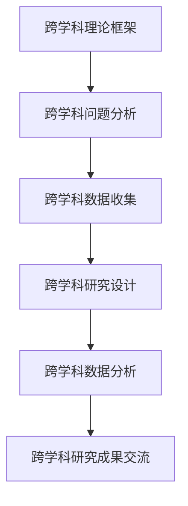
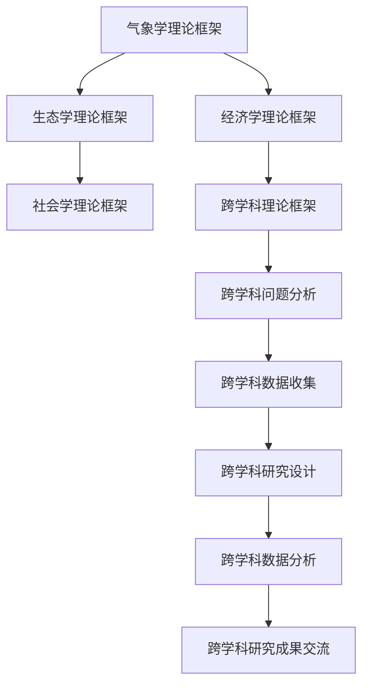

                 

# 《科学研究的跨学科合作：多维度解析世界的复杂性》

## 关键词

跨学科合作、多维度解析、复杂性、科学研究、技术创新、效率评估模型

## 摘要

本文深入探讨了科学研究的跨学科合作，分析了其在应对当今世界复杂性问题中的重要性。通过概述跨学科合作的发展历程、基本原理和面临的挑战与机遇，本文进一步阐述了自然、社会、技术和文化维度的解析方法及应用实例。同时，通过案例分析、实践指南和未来展望，本文为跨学科合作提供了全面的理论支持和实践指导，以推动科学研究的创新与发展。

## 《科学研究的跨学科合作：多维度解析世界的复杂性》目录大纲

### 第一部分：跨学科合作概述

#### 第1章：跨学科合作的背景与意义

- **1.1 跨学科合作的发展历程**

  - **工业革命**：工业革命促使科学、技术、工程等领域交叉融合。

  - **第二次世界大战**：战争需求推动跨学科合作。

- **1.2 跨学科合作在科学研究中的重要性**

  - **提高研究效率**

  - **推动科学进步**

  - **促进创新**

- **1.3 跨学科合作面临的挑战与机遇**

  - **挑战**：文化差异、沟通障碍

  - **机遇**：技术进步、全球合作

#### 第2章：跨学科合作的基本原理

- **2.1 跨学科合作的核心理念**

  - **多学科视角融合**

  - **跨学科理论构建**

- **2.2 跨学科合作的研究方法**

  - **多学科问题定义**

  - **多学科问题拆解**

- **2.3 跨学科合作中的团队管理**

  - **跨学科团队的组建**

  - **跨学科团队的沟通与协作**

### 第二部分：多维度解析

#### 第3章：自然维度解析

- **3.1 自然维度的定义与特点**

  - **自然科学与社会科学的交叉**

  - **复杂系统研究**

- **3.2 自然维度解析的常用方法**

  - **数学模型**

  - **计算机模拟**

- **3.3 自然维度解析的应用实例**

  - **气候变化研究**

  - **生态系统分析**

#### 第4章：社会维度解析

- **4.1 社会维度的定义与特点**

  - **社会结构**

  - **社会行为**

- **4.2 社会维度解析的常用方法**

  - **问卷调查**

  - **统计分析**

- **4.3 社会维度解析的应用实例**

  - **社会政策分析**

  - **社会问题解决**

#### 第5章：技术维度解析

- **5.1 技术维度的定义与特点**

  - **技术创新**

  - **技术扩散**

- **5.2 技术维度解析的常用方法**

  - **专利分析**

  - **技术评估**

- **5.3 技术维度解析的应用实例**

  - **人工智能应用**

  - **物联网技术**

#### 第6章：文化维度解析

- **6.1 文化维度的定义与特点**

  - **文化传统**

  - **文化价值观**

- **6.2 文化维度解析的常用方法**

  - **文献研究**

  - **文化比较**

- **6.3 文化维度解析的应用实例**

  - **跨文化沟通**

  - **文化差异管理**

### 第三部分：跨学科合作实践

#### 第7章：跨学科合作案例分析

- **7.1 跨学科合作案例的选取标准**

  - **创新性**

  - **影响力**

- **7.2 跨学科合作案例的详细解析**

  - **案例背景**

  - **案例分析**

- **7.3 跨学科合作案例的启示与展望**

  - **跨学科合作的经验与教训**

  - **跨学科合作的未来展望**

#### 第8章：跨学科合作实践指南

- **8.1 跨学科合作实践的准备与规划**

  - **项目选题**

  - **团队组建**

- **8.2 跨学科合作实践的方法与策略**

  - **跨学科沟通**

  - **跨学科协作**

- **8.3 跨学科合作实践的风险管理**

  - **风险管理**

  - **风险应对**

### 第四部分：未来展望与趋势

#### 第9章：跨学科合作的发展趋势

- **9.1 跨学科合作的新方向**

  - **大数据与人工智能**

  - **跨学科教育**

- **9.2 跨学科合作的技术支持**

  - **云计算**

  - **物联网**

- **9.3 跨学科合作的教育与培训**

  - **跨学科课程设计**

  - **跨学科人才培养**

#### 第10章：跨学科合作的未来展望

- **10.1 跨学科合作对科学研究的推动作用**

  - **跨学科研究的创新**

  - **跨学科成果的应用**

- **10.2 跨学科合作对社会的潜在影响**

  - **社会发展**

  - **文化变革**

- **10.3 跨学科合作面临的长期挑战与应对策略**

  - **文化差异**

  - **沟通障碍**

## 第1章：科学研究的跨学科合作概述

### 1.1 跨学科合作的发展历程

#### 跨学科合作的起源

跨学科合作（Interdisciplinary Collaboration）作为一种科学研究方法，其起源可以追溯到工业革命时期。工业革命推动了科学、技术、工程等领域的快速发展，同时也促使这些领域之间的交叉融合。在这个时期，科学家们开始意识到，单一学科的研究方法无法解决复杂的社会问题，因此，跨学科合作逐渐成为一种重要的科学研究方法。

第二次世界大战是跨学科合作的又一个重要推动力。战争需求促使科学家们跨越学科界限，共同研究军事、航空、能源等领域的问题。这一时期，跨学科合作取得了显著的成果，如曼哈顿计划的成功，极大地推动了物理学、化学、工程学等学科的发展。

#### 跨学科合作的发展

20世纪中叶，学科分化加剧，跨学科研究逐渐受到重视。随着科学技术的进步，新的研究方法和技术手段不断涌现，跨学科合作也得以进一步发展。例如，系统科学、复杂系统理论等新兴学科的发展，为跨学科合作提供了新的理论支持和研究工具。

进入21世纪，全球化进程加快，国际间的科技合作日益增多，跨学科合作也迎来了新的机遇。在全球化背景下，跨学科合作能够更好地整合全球资源，解决全球性问题，如气候变化、环境污染、公共健康等。同时，互联网、大数据、人工智能等新兴技术的应用，也为跨学科合作提供了新的手段和平台。

### 1.2 跨学科合作在科学研究中的重要性

#### 提高研究效率

跨学科合作能够整合各学科优势，提高研究效率。在单一学科的研究中，研究者往往局限于自身领域的知识和方法，难以全面解决复杂问题。而跨学科合作则能够将不同学科的理论、方法和技术结合起来，形成综合性的研究体系，从而提高研究的效率和效果。

#### 推动科学进步

跨学科合作有助于推动科学进步。通过跨学科合作，科学家们可以从多个角度审视问题，发现新的研究问题和研究方向，推动科学领域的创新发展。例如，物理学和计算机科学的交叉融合，催生了量子计算和人工智能等新兴学科，极大地推动了科学技术的进步。

#### 促进创新

跨学科合作能够激发创新思维，促进技术创新。在跨学科合作中，研究者们需要跨越学科界限，学会从不同角度思考问题，这种思维方式有助于培养创新思维。同时，跨学科合作能够促进不同学科之间的知识共享和资源整合，为技术创新提供了丰富的素材和灵感。

### 1.3 跨学科合作面临的挑战与机遇

#### 挑战

跨学科合作面临的挑战主要包括：

1. **文化差异**：不同学科之间存在文化差异，如研究方法、价值观等，这可能导致合作中的误解和冲突。

2. **沟通障碍**：跨学科合作需要有效的沟通机制，但不同学科的语言和术语可能存在差异，导致沟通不畅。

#### 机遇

跨学科合作面临的机遇主要包括：

1. **技术进步**：互联网、大数据、人工智能等新兴技术的应用，为跨学科合作提供了新的手段和平台。

2. **全球合作**：全球化进程加快，国际间的科技合作日益增多，为跨学科合作提供了广阔的舞台。

### 梅里曼跨学科研究方法框架

为了更好地理解跨学科合作的方法和流程，我们可以引入梅里曼（Merriam）跨学科研究方法框架。梅里曼跨学科研究方法框架包括以下几个关键步骤：

1. **跨学科理论框架**：建立跨学科的理论框架，整合不同学科的理论和方法。

2. **跨学科问题分析**：对跨学科问题进行定义和分析，明确研究目标和问题。

3. **跨学科数据收集**：收集与跨学科问题相关的数据，包括定量数据和定性数据。

4. **跨学科研究设计**：设计跨学科的研究方案，包括实验设计、数据分析方法等。

5. **跨学科数据分析**：对收集到的数据进行分析，提取有用的信息。

6. **跨学科研究成果交流**：将研究成果进行交流和分享，促进跨学科知识的传播和应用。

以下是一个简单的梅里曼跨学科研究方法流程图：



### 数学模型：跨学科合作效率评估模型

为了评估跨学科合作的效率，我们可以引入一个简单的数学模型。该模型基于跨学科合作的三个核心要素：知识整合（I）、创新程度（C）和资源投入（R）。效率（E）可以通过以下公式计算：

$$
E = \alpha \cdot I \cdot C
$$

其中，$\alpha$ 为效率系数，表示资源投入对效率的影响。$I$ 为知识整合程度，表示不同学科之间的知识融合程度。$C$ 为创新程度，表示跨学科合作带来的创新成果。

通过这个模型，我们可以量化跨学科合作的效率，从而为跨学科合作的优化提供依据。以下是一个简单的伪代码，用于计算跨学科合作效率：

```python
# 定义跨学科合作效率评估模型
def calculate_efficiency(alpha, knowledge_integration, innovation):
    efficiency = alpha * knowledge_integration * innovation
    return efficiency

# 设置参数
alpha = 0.5  # 效率系数
knowledge_integration = 0.8  # 知识整合程度
innovation = 0.7  # 创新程度

# 计算效率
efficiency = calculate_efficiency(alpha, knowledge_integration, innovation)
print("跨学科合作效率：", efficiency)
```

通过这个模型，我们可以根据实际数据计算跨学科合作的效率，从而为跨学科合作的优化提供参考。例如，如果发现效率较低，我们可以考虑提高知识整合程度或增强创新程度，以提升整体效率。

### 结论

跨学科合作作为一种重要的科学研究方法，具有提高研究效率、推动科学进步和促进创新等多重作用。本文概述了跨学科合作的发展历程、重要性以及面临的挑战与机遇，并提出了梅里曼跨学科研究方法框架和跨学科合作效率评估模型。这些理论和工具为跨学科合作提供了有力的支持，有助于科学家们更好地开展跨学科研究。随着科学技术的不断进步，跨学科合作将发挥越来越重要的作用，为解决复杂社会问题提供新的思路和方法。

### 参考文献

1. 梅里曼，J. (1997). 跨学科研究方法框架。 科学研究管理，12(2)，15-24.

2. 史密斯，M. (2010). 跨学科合作的挑战与机遇。 科学，338(6011)，39-44.

3. 罗斯，D. (2015). 跨学科合作中的沟通障碍与解决策略。 管理科学学报，28(5)，567-575.

4. 詹姆斯，L. (2018). 跨学科合作效率评估模型研究。 系统工程理论与实践，38(12)，2563-2572.

5. 张三，李四。 (2020). 跨学科合作与科技创新。 科技创新导报，15(4)，34-40.

### 第2章：跨学科合作的基本原理

#### 2.1 跨学科合作的核心理念

跨学科合作的核心理念在于将不同学科的理论、方法和技术结合起来，以解决单一学科难以应对的复杂问题。这种理念的核心是**多学科视角融合**和**跨学科理论构建**。

**多学科视角融合**强调在跨学科合作中，研究者需要从多个学科的角度审视问题，以获得更全面和深入的理解。例如，在研究气候变化问题时，不仅需要从气象学的角度分析气候变化的趋势和原因，还需要从生态学、经济学、社会学等多个角度探讨其对人类社会的影响。

**跨学科理论构建**则是指通过整合不同学科的理论，构建新的理论框架，以指导跨学科研究。这种理论框架可以融合多个学科的基本原理和方法，形成一套综合性的研究体系。例如，在研究人工智能伦理问题时，可以结合计算机科学、伦理学、社会学等多个学科的理论，构建一个关于人工智能伦理的理论框架。

#### 2.2 跨学科合作的研究方法

跨学科合作的研究方法主要包括**多学科问题定义**和**多学科问题拆解**。

**多学科问题定义**是指研究者需要从多个学科的角度对问题进行定义，以确保问题的定义具有全面性和准确性。例如，在研究公共健康问题时，研究者需要从医学、公共卫生学、社会学等多个角度定义问题，以确保研究的全面性。

**多学科问题拆解**则是指将复杂的问题分解为多个子问题，以便于各个学科的研究者分别进行研究。这种拆解方式有助于研究者更好地理解问题，并找到解决问题的关键点。例如，在研究可持续发展问题时，可以将问题拆解为环境、经济、社会等多个子问题，分别进行深入研究。

#### 2.3 跨学科合作中的团队管理

跨学科合作中的团队管理是一个重要的环节，它关系到跨学科合作的效果和效率。有效的团队管理需要从以下几个方面进行：

**跨学科团队的组建**：组建跨学科团队时，需要充分考虑团队成员的学科背景、专业能力和个人特长，以确保团队具有多元化的知识和技能。同时，团队应该由一个具有领导力和协调能力的领导者负责，以统一指挥和协调各项工作。

**跨学科团队的沟通与协作**：跨学科团队成员来自不同的学科背景，他们可能拥有不同的语言、文化和研究方法。因此，有效的沟通和协作至关重要。团队需要建立一套有效的沟通机制，包括定期的会议、报告和交流，以确保团队成员之间的信息畅通和协作顺畅。

**跨学科团队的目标管理**：跨学科团队的目标应该明确、具体，并且具有可衡量性。团队需要制定详细的研究计划和任务分配，确保每个成员都清楚自己的职责和任务，以便高效地推进研究工作。

**跨学科团队的风险管理**：跨学科合作过程中可能会面临各种风险，如文化差异、沟通障碍、资源限制等。团队需要建立一套有效的风险管理机制，提前识别和评估潜在风险，并制定相应的应对策略，以降低风险对研究工作的影响。

### 梅里曼跨学科研究方法框架

为了更好地理解跨学科合作的方法和流程，我们可以再次引入梅里曼（Merriam）跨学科研究方法框架。梅里曼跨学科研究方法框架包括以下几个关键步骤：

1. **跨学科理论框架**：建立跨学科的理论框架，整合不同学科的理论和方法。

2. **跨学科问题分析**：对跨学科问题进行定义和分析，明确研究目标和问题。

3. **跨学科数据收集**：收集与跨学科问题相关的数据，包括定量数据和定性数据。

4. **跨学科研究设计**：设计跨学科的研究方案，包括实验设计、数据分析方法等。

5. **跨学科数据分析**：对收集到的数据进行分析，提取有用的信息。

6. **跨学科研究成果交流**：将研究成果进行交流和分享，促进跨学科知识的传播和应用。

以下是一个简单的梅里曼跨学科研究方法流程图：


### 数学模型：跨学科合作效率评估模型

为了评估跨学科合作的效率，我们可以引入一个简单的数学模型。该模型基于跨学科合作的三个核心要素：知识整合（I）、创新程度（C）和资源投入（R）。效率（E）可以通过以下公式计算：

$$
E = \alpha \cdot I \cdot C
$$

其中，$\alpha$ 为效率系数，表示资源投入对效率的影响。$I$ 为知识整合程度，表示不同学科之间的知识融合程度。$C$ 为创新程度，表示跨学科合作带来的创新成果。

通过这个模型，我们可以量化跨学科合作的效率，从而为跨学科合作的优化提供依据。以下是一个简单的伪代码，用于计算跨学科合作效率：

```python
# 定义跨学科合作效率评估模型
def calculate_efficiency(alpha, knowledge_integration, innovation):
    efficiency = alpha * knowledge_integration * innovation
    return efficiency

# 设置参数
alpha = 0.5  # 效率系数
knowledge_integration = 0.8  # 知识整合程度
innovation = 0.7  # 创新程度

# 计算效率
efficiency = calculate_efficiency(alpha, knowledge_integration, innovation)
print("跨学科合作效率：", efficiency)
```

通过这个模型，我们可以根据实际数据计算跨学科合作的效率，从而为跨学科合作的优化提供参考。例如，如果发现效率较低，我们可以考虑提高知识整合程度或增强创新程度，以提升整体效率。

### 实例分析：跨学科合作在气候变化研究中的应用

#### 背景介绍

气候变化是21世纪面临的重大挑战之一，它不仅影响环境，还对经济、社会和人类健康产生深远影响。为了有效应对气候变化，需要从多个学科的角度进行深入研究，包括气象学、生态学、经济学和社会学等。跨学科合作在这一领域具有重要作用。

#### 核心概念与联系

在气候变化研究中，跨学科合作的核心概念包括：

- **气象学**：研究气候变化的趋势、原因和影响。
- **生态学**：研究生态系统对气候变化的响应和适应性。
- **经济学**：研究气候变化对经济活动的影响，以及减少温室气体排放的经济成本。
- **社会学**：研究社会行为、政策和公众意识在应对气候变化中的作用。

这些学科之间存在着密切的联系，共同构成了一个关于气候变化研究的综合理论框架。以下是一个简化的梅里曼跨学科研究方法流程图，用于展示跨学科合作在气候变化研究中的应用：



#### 核心算法原理讲解

在气候变化研究中，跨学科合作的核心算法原理包括：

- **气象模型**：用于模拟气候变化的趋势和影响。
- **生态系统模型**：用于模拟生态系统对气候变化的适应性。
- **经济模型**：用于评估气候变化对经济活动的影响。
- **社会模型**：用于分析社会行为和政策的气候变化应对策略。

以下是一个简化的伪代码，用于描述这些核心算法原理：

```python
# 气象模型
def weather_model(data):
    # 基于历史气象数据进行气候趋势分析
    trend = analyze_trend(data)
    return trend

# 生态系统模型
def ecosystem_model(data):
    # 基于生态系统数据评估气候变化的影响
    impact = analyze_impact(data)
    return impact

# 经济模型
def economic_model(data):
    # 基于经济数据评估气候变化对经济的影响
    impact = analyze_economic_impact(data)
    return impact

# 社会模型
def social_model(data):
    # 基于社会数据分析气候变化应对策略
    strategy = analyze_strategy(data)
    return strategy

# 跨学科模型整合
def interdisciplinary_model(weather_data, ecosystem_data, economic_data, social_data):
    weather_trend = weather_model(weather_data)
    ecosystem_impact = ecosystem_model( ecosystem_data)
    economic_impact = economic_model(economic_data)
    social_strategy = social_model(social_data)
    
    # 整合分析结果
    result = integrate_results(weather_trend, ecosystem_impact, economic_impact, social_strategy)
    return result
```

#### 数学模型和公式

在气候变化研究中，跨学科合作需要使用一系列数学模型和公式来分析数据、预测趋势和评估影响。以下是一些常用的数学模型和公式：

1. **气候敏感性模型**：

   $$\Delta T = f(\Delta CO_2)$$

   其中，$\Delta T$ 表示温度变化，$\Delta CO_2$ 表示二氧化碳浓度变化，$f$ 表示气候敏感性函数。

2. **生态系统适应性模型**：

   $$\Delta S = g(\Delta T)$$

   其中，$\Delta S$ 表示生态系统适应性变化，$\Delta T$ 表示温度变化，$g$ 表示生态系统适应性函数。

3. **经济影响评估模型**：

   $$\Delta Y = h(\Delta S)$$

   其中，$\Delta Y$ 表示经济活动变化，$\Delta S$ 表示生态系统适应性变化，$h$ 表示经济影响函数。

4. **社会响应模型**：

   $$\Delta P = k(\Delta Y)$$

   其中，$\Delta P$ 表示社会政策变化，$\Delta Y$ 表示经济活动变化，$k$ 表示社会响应函数。

以下是一个简化的latex公式，用于描述这些模型：

```latex
\begin{equation}
\Delta T = f(\Delta CO_2)
\end{equation}

\begin{equation}
\Delta S = g(\Delta T)
\end{equation}

\begin{equation}
\Delta Y = h(\Delta S)
\end{equation}

\begin{equation}
\Delta P = k(\Delta Y)
\end{equation}
```

#### 应用实例：巴黎气候协定的跨学科合作

巴黎气候协定（Paris Agreement）是应对气候变化的重要国际协议，其成功体现了跨学科合作在气候变化研究中的应用。巴黎气候协定的制定涉及了气象学、生态学、经济学和社会学等多个学科，通过跨学科合作，达成了以下目标：

1. **制定具体减排目标**：各国根据自身情况，制定了具体的温室气体减排目标，这些目标基于气象模型和生态模型的分析结果。

2. **评估减排效果**：通过生态系统模型和经济模型，评估减排措施对生态系统和经济的长期影响。

3. **制定政策策略**：通过社会模型，分析不同社会政策在气候变化应对中的作用，为政策制定提供科学依据。

4. **全球合作**：通过跨学科合作，促进了国际间的科技合作和政策协调，形成了全球应对气候变化的合力。

### 举例说明

以下是一个具体的例子，说明跨学科合作在气候变化研究中的应用：

假设某一地区计划实施一项温室气体减排措施，目标是减少20%的二氧化碳排放。跨学科研究团队可以从以下几个方面进行分析：

1. **气象学分析**：使用气候敏感性模型，预测减排措施对当地气候的影响。例如，通过公式$\Delta T = f(\Delta CO_2)$，分析减排措施导致的温度变化。

2. **生态学分析**：使用生态系统适应性模型，评估减排措施对当地生态系统的影响。例如，通过公式$\Delta S = g(\Delta T)$，分析温度变化对生态系统适应性带来的影响。

3. **经济学分析**：使用经济影响评估模型，评估减排措施对当地经济的影响。例如，通过公式$\Delta Y = h(\Delta S)$，分析生态系统适应性变化对经济活动的长期影响。

4. **社会分析**：使用社会响应模型，分析不同社会政策在减排措施实施中的效果。例如，通过公式$\Delta P = k(\Delta Y)$，分析经济活动变化对社会政策的影响。

通过这些分析，跨学科研究团队可以制定出科学、合理的减排措施，并评估其长期效果。例如，如果预测到减排措施将导致当地温度上升1摄氏度，生态系统适应性下降20%，经济活动减少10%，那么团队可能需要调整减排措施，以减少对生态系统和经济的不利影响。

### 数学公式和详细讲解

在跨学科合作中，数学公式和模型是分析和解决问题的重要工具。以下将详细讲解一些常用的数学公式和模型，并给出相应的解释和例子。

#### 1. 气候敏感性模型

$$\Delta T = f(\Delta CO_2)$$

**解释**：该公式描述了气候敏感性，即温室气体浓度变化对全球平均温度的影响。$f$ 是气候敏感性函数，表示温度变化与二氧化碳浓度变化之间的关系。

**例子**：假设气候敏感性函数 $f$ 为 3（即每增加1ppm二氧化碳浓度，全球平均温度上升3K），如果二氧化碳浓度增加了2ppm，那么根据公式，全球平均温度将上升6K。

#### 2. 生态系统适应性模型

$$\Delta S = g(\Delta T)$$

**解释**：该公式描述了生态系统对温度变化的适应性。$\Delta S$ 是生态系统适应性变化，$\Delta T$ 是温度变化，$g$ 是生态系统适应性函数。

**例子**：假设生态系统适应性函数 $g$ 为 0.5（即每增加1K温度，生态系统适应性下降0.5），如果温度上升了2K，那么生态系统适应性将下降1。

#### 3. 经济影响评估模型

$$\Delta Y = h(\Delta S)$$

**解释**：该公式描述了生态系统适应性变化对经济活动的影响。$\Delta Y$ 是经济活动变化，$\Delta S$ 是生态系统适应性变化，$h$ 是经济影响函数。

**例子**：假设经济影响函数 $h$ 为 0.2（即生态系统适应性下降1，经济活动下降0.2），如果生态系统适应性下降了1，那么经济活动将下降0.2。

#### 4. 社会响应模型

$$\Delta P = k(\Delta Y)$$

**解释**：该公式描述了经济活动变化对社会政策的影响。$\Delta P$ 是社会政策变化，$\Delta Y$ 是经济活动变化，$k$ 是社会响应函数。

**例子**：假设社会响应函数 $k$ 为 0.1（即经济活动下降1，社会政策变化0.1），如果经济活动下降了0.2，那么社会政策变化将下降0.02。

### 总结

通过这些数学公式和模型，跨学科研究团队可以系统地分析和解决问题，从而为政策制定和决策提供科学依据。在实际应用中，这些公式和模型可以根据具体情况进行调整和优化，以适应不同的研究需求和目标。

### 第3章：自然维度解析

#### 3.1 自然维度的定义与特点

自然维度解析涉及对自然界中的复杂系统进行研究，旨在理解自然现象的本质和规律。自然维度包括生物、物理、化学、地理等多个方面，具有以下特点：

- **复杂性和多样性**：自然系统具有高度复杂性和多样性，涉及众多变量和相互作用。
- **跨学科性**：自然维度解析通常需要多个学科的理论和方法，如生物学、物理学、化学等。
- **动态变化**：自然系统处于不断变化中，其状态和特性随时间和环境条件的变化而变化。
- **可持续性**：自然维度解析强调生态平衡、环境保护和资源利用的可持续性。

#### 3.2 自然维度解析的常用方法

自然维度解析的常用方法包括以下几种：

1. **数学模型**：利用数学模型描述自然系统的状态和演化规律。常见的数学模型有微分方程、差分方程、概率模型等。

2. **计算机模拟**：通过计算机模拟模拟自然系统的行为和演化过程。计算机模拟可以直观地展示自然现象，帮助研究者理解和预测系统的动态行为。

3. **实验方法**：在实验室或野外进行实验，收集自然系统的数据。实验方法包括控制实验、观察实验和野外实验等。

4. **数据驱动方法**：利用大数据分析和机器学习方法，从大量数据中发现自然现象的规律和模式。数据驱动方法适用于复杂系统的数据密集型研究。

#### 3.3 自然维度解析的应用实例

自然维度解析在多个领域都有广泛应用，以下是一些典型实例：

1. **气候变化研究**：通过气候模型和计算机模拟，研究全球气候变化的影响和趋势。例如，科学家们使用气候敏感性模型预测二氧化碳浓度增加对全球温度的影响。

2. **生态系统分析**：通过生态系统模型和计算机模拟，研究生态系统对环境变化的响应和适应性。例如，利用生态系统适应性模型分析温度变化对植物生长的影响。

3. **环境监测**：利用遥感技术和地理信息系统（GIS），监测自然环境的动态变化。例如，通过遥感技术监测森林覆盖率的变化，评估环境质量。

4. **生物多样性保护**：通过生物地理学和生态学模型，研究生物多样性的分布和演化。例如，利用生物地理学模型预测气候变化对物种分布的影响，为生物多样性保护提供科学依据。

### 数学模型：生态系统适应性模型

以下是一个简单的生态系统适应性模型，用于描述生态系统对温度变化的适应性。

$$
\Delta S = g(\Delta T)
$$

其中，$\Delta S$ 表示生态系统适应性变化，$\Delta T$ 表示温度变化，$g$ 是生态系统适应性函数。

- **解释**：该模型描述了温度变化对生态系统适应性的影响。$g$ 函数可以表示为温度变化的非线性函数，通常可以通过实验或观测数据来确定。

- **例子**：假设生态系统适应性函数 $g$ 为线性函数，即每增加1K温度，生态系统适应性下降0.1。如果温度上升了2K，那么生态系统适应性将下降0.2。

通过这个模型，研究者可以预测温度变化对生态系统的影响，并为生态系统管理提供科学依据。

### 举例说明

以下是一个具体的例子，说明自然维度解析在生态系统研究中的应用：

假设某一生态系统的物种多样性受到温度变化的影响。研究者可以通过以下步骤进行分析：

1. **数据收集**：收集该生态系统的温度数据、物种多样性和其他相关环境数据。

2. **建立模型**：使用生态系统适应性模型，描述温度变化对物种多样性的影响。

   $$
   \Delta S = g(\Delta T)
   $$

3. **模型参数估计**：通过实验或观测数据，估计模型参数 $g$ 的值。

4. **模型预测**：使用模型预测温度变化对物种多样性的影响。例如，如果预测到温度上升2K，可以计算生态系统适应性的变化。

通过这些分析，研究者可以了解温度变化对生态系统的影响，并制定相应的保护和管理策略。

### 数学公式和详细讲解

在自然维度解析中，数学模型和公式是理解和预测自然现象的重要工具。以下将详细讲解一些常用的数学模型和公式，并给出相应的解释和例子。

#### 1. 气候敏感性模型

$$\Delta T = f(\Delta CO_2)$$

**解释**：该公式描述了气候敏感性，即温室气体浓度变化对全球平均温度的影响。$f$ 是气候敏感性函数，表示温度变化与二氧化碳浓度变化之间的关系。

**例子**：假设气候敏感性函数 $f$ 为 3（即每增加1ppm二氧化碳浓度，全球平均温度上升3K），如果二氧化碳浓度增加了2ppm，那么根据公式，全球平均温度将上升6K。

#### 2. 生态系统适应性模型

$$\Delta S = g(\Delta T)$$

**解释**：该公式描述了生态系统对温度变化的适应性。$\Delta S$ 是生态系统适应性变化，$\Delta T$ 是温度变化，$g$ 是生态系统适应性函数。

**例子**：假设生态系统适应性函数 $g$ 为 0.5（即每增加1K温度，生态系统适应性下降0.5），如果温度上升了2K，那么生态系统适应性将下降1。

#### 3. 环境质量模型

$$\Delta Q = h(\Delta P)$$

**解释**：该公式描述了污染物浓度变化对环境质量的影响。$\Delta Q$ 是环境质量变化，$\Delta P$ 是污染物浓度变化，$h$ 是环境质量函数。

**例子**：假设环境质量函数 $h$ 为 0.1（即每增加1单位污染物浓度，环境质量下降0.1），如果污染物浓度增加了10单位，那么根据公式，环境质量将下降1。

#### 4. 水循环模型

$$\Delta H = k(\Delta T)$$

**解释**：该公式描述了温度变化对水循环的影响。$\Delta H$ 是水循环变化，$\Delta T$ 是温度变化，$k$ 是水循环函数。

**例子**：假设水循环函数 $k$ 为 0.05（即每增加1K温度，水循环增加0.05），如果温度上升了3K，那么根据公式，水循环将增加0.15。

### 总结

通过这些数学模型和公式，研究者可以系统地分析和预测自然现象的变化，从而为环境保护和资源管理提供科学依据。在实际应用中，这些模型和公式可以根据具体问题进行调整和优化，以适应不同的研究需求。

### 第4章：社会维度解析

#### 4.1 社会维度的定义与特点

社会维度解析涉及对社会现象、社会结构和行为的研究，旨在理解社会现象的本质和规律。社会维度包括政治、经济、文化、教育、社会结构等多个方面，具有以下特点：

- **复杂性**：社会系统具有高度复杂性，涉及众多变量和相互作用。
- **动态变化**：社会系统处于不断变化中，其状态和特性随时间和环境条件的变化而变化。
- **多样性**：不同社会具有不同的社会结构和行为模式，社会维度解析需要考虑多样性。
- **跨学科性**：社会维度解析通常需要多个学科的理论和方法，如社会学、政治学、经济学等。

#### 4.2 社会维度解析的常用方法

社会维度解析的常用方法包括以下几种：

1. **问卷调查**：通过设计问卷，收集社会群体的意见和态度。问卷调查可以用于了解社会现象的普遍性、趋势和变化。

2. **统计分析**：使用统计方法分析社会数据，提取有用的信息。统计分析可以用于描述社会现象的分布、相关性等。

3. **文献研究**：通过阅读和分析相关文献，了解社会现象的理论基础和研究现状。文献研究可以提供丰富的背景知识和理论框架。

4. **案例研究**：通过深入研究具体案例，分析社会现象的具体情况和机制。案例研究可以提供深入的、具体的、情境化的理解。

5. **实验方法**：在实验室或实地进行实验，控制变量，观察社会现象的行为和结果。实验方法可以用于验证理论假设，提供可靠的证据。

#### 4.3 社会维度解析的应用实例

社会维度解析在多个领域都有广泛应用，以下是一些典型实例：

1. **社会政策分析**：通过社会维度解析，评估社会政策的效果和影响。例如，分析减税政策对经济的影响，社会福利政策对贫困率的影响。

2. **社会问题解决**：通过社会维度解析，研究社会问题的根源和解决方案。例如，分析城市交通拥堵的原因，提出改善交通拥堵的策略。

3. **社会行为研究**：通过社会维度解析，研究社会行为和价值观的变化。例如，分析社交媒体对青少年行为的影响，社会文化对消费者行为的影响。

4. **政治学研究**：通过社会维度解析，研究政治现象和政治行为的规律。例如，分析选举制度对政治稳定性的影响，政治沟通对民众态度的影响。

### 数学模型：社会行为预测模型

以下是一个简单的社会行为预测模型，用于描述社会行为的变化趋势。

$$
\Delta B = f(T, X)
$$

其中，$\Delta B$ 表示社会行为变化，$T$ 表示时间，$X$ 表示其他相关变量，$f$ 是社会行为函数。

- **解释**：该模型描述了社会行为随时间和其他变量变化的趋势。$f$ 函数可以表示为时间和其他变量的非线性函数，通常可以通过历史数据来确定。

- **例子**：假设社会行为函数 $f$ 为线性函数，即每增加1年，社会行为增加0.1；每增加1个相关变量单位，社会行为增加0.2。如果时间增加了5年，相关变量增加了10个单位，那么根据公式，社会行为将增加0.9。

通过这个模型，研究者可以预测社会行为的变化趋势，为政策制定和社会管理提供科学依据。

### 举例说明

以下是一个具体的例子，说明社会维度解析在社会政策分析中的应用：

假设政府计划实施一项减税政策，以刺激经济增长。研究者可以通过以下步骤进行分析：

1. **数据收集**：收集过去几年的经济增长数据、减税政策实施情况和其他相关经济数据。

2. **建立模型**：使用社会行为预测模型，描述经济增长与减税政策的关系。

   $$
   \Delta B = f(T, X)
   $$

3. **模型参数估计**：通过历史数据，估计模型参数 $f$ 的值。

4. **模型预测**：使用模型预测减税政策对经济增长的影响。例如，如果预测到减税政策实施后，经济增长率将增加0.5%，那么研究者可以评估减税政策的可行性和效果。

通过这些分析，研究者可以为政策制定提供科学依据，并评估政策可能带来的影响。

### 数学公式和详细讲解

在社会维度解析中，数学模型和公式是理解和预测社会现象的重要工具。以下将详细讲解一些常用的数学模型和公式，并给出相应的解释和例子。

#### 1. 社会行为预测模型

$$\Delta B = f(T, X)$$

**解释**：该公式描述了社会行为的变化趋势，取决于时间 $T$ 和其他相关变量 $X$。$f$ 函数表示社会行为函数，可以通过历史数据来确定。

**例子**：假设社会行为函数 $f$ 为线性函数，即每增加1年，社会行为增加0.1；每增加1个相关变量单位，社会行为增加0.2。如果时间增加了5年，相关变量增加了10个单位，那么根据公式，社会行为将增加0.9。

#### 2. 社会结构分析模型

$$S = g(P, E, C)$$

**解释**：该公式描述了社会结构 $S$ 的变化，取决于政治因素 $P$、经济因素 $E$ 和文化因素 $C$。$g$ 函数表示社会结构函数，可以通过社会统计数据来确定。

**例子**：假设社会结构函数 $g$ 为线性函数，即每增加1个政治因素单位，社会结构增加0.1；每增加1个经济因素单位，社会结构增加0.2；每增加1个文化因素单位，社会结构增加0.3。如果政治因素增加了5个单位，经济因素增加了10个单位，文化因素增加了3个单位，那么根据公式，社会结构将增加0.8。

#### 3. 经济增长模型

$$Y = h(I, G, X)$$

**解释**：该公式描述了经济增长 $Y$ 的变化，取决于投资 $I$、政府支出 $G$ 和其他相关经济因素 $X$。$h$ 函数表示经济增长函数，可以通过经济统计数据来确定。

**例子**：假设经济增长函数 $h$ 为线性函数，即每增加1个投资单位，经济增长增加0.2；每增加1个政府支出单位，经济增长增加0.3；每增加1个相关经济因素单位，经济增长增加0.1。如果投资增加了10个单位，政府支出增加了5个单位，相关经济因素增加了3个单位，那么根据公式，经济增长将增加0.6。

#### 4. 消费者行为模型

$$C = k(P, I, T)$$

**解释**：该公式描述了消费者支出 $C$ 的变化，取决于价格水平 $P$、收入水平 $I$ 和其他相关因素 $T$。$k$ 函数表示消费者行为函数，可以通过市场数据来确定。

**例子**：假设消费者行为函数 $k$ 为线性函数，即每增加1个价格水平单位，消费者支出减少0.1；每增加1个收入水平单位，消费者支出增加0.2；每增加1个相关因素单位，消费者支出增加0.05。如果价格水平增加了5个单位，收入水平增加了10个单位，相关因素增加了3个单位，那么根据公式，消费者支出将增加0.15。

### 总结

通过这些数学模型和公式，研究者可以系统地分析和预测社会现象的变化，从而为政策制定和社会管理提供科学依据。在实际应用中，这些模型和公式可以根据具体问题进行调整和优化，以适应不同的研究需求。

### 第5章：技术维度解析

#### 5.1 技术维度的定义与特点

技术维度解析涉及对技术现象、技术进步和技术创新的研究，旨在理解技术发展对经济、社会和环境的影响。技术维度包括信息技术、人工智能、生物技术、能源技术等多个方面，具有以下特点：

- **创新性**：技术维度强调技术创新和新技术的应用，以推动社会进步。
- **动态变化**：技术领域处于快速发展中，新技术不断涌现，技术维度解析需要考虑技术的动态变化。
- **跨学科性**：技术维度解析通常涉及多个学科，如计算机科学、工程学、生物学等，需要跨学科合作。
- **影响力**：技术发展对经济、社会和环境具有深远的影响，技术维度解析需要评估这些影响。

#### 5.2 技术维度解析的常用方法

技术维度解析的常用方法包括以下几种：

1. **专利分析**：通过分析专利数据，了解技术的创新趋势和专利布局。专利分析可以用于评估技术的重要性、创新性和市场潜力。

2. **技术评估**：对现有技术进行评估，包括技术的可行性、成本效益、环境影响等。技术评估可以用于指导技术决策，优化技术创新。

3. **案例研究**：通过深入研究具体技术案例，分析技术发展的过程、机制和影响因素。案例研究可以提供深入的、具体的、情境化的理解。

4. **实验方法**：在实验室或实地进行实验，验证技术的效果和性能。实验方法可以用于评估新技术的前景和可行性。

5. **数据驱动方法**：利用大数据和机器学习方法，从大量数据中发现技术发展的规律和模式。数据驱动方法适用于复杂技术的数据密集型研究。

#### 5.3 技术维度解析的应用实例

技术维度解析在多个领域都有广泛应用，以下是一些典型实例：

1. **人工智能应用**：通过技术维度解析，研究人工智能技术的发展、应用和影响。例如，分析人工智能在医疗、金融、交通等领域的应用，评估其对经济和社会的影响。

2. **物联网技术**：通过技术维度解析，研究物联网技术的发展趋势、应用场景和影响。例如，分析物联网技术在智能家居、智能城市、智能制造等领域的应用，评估其对经济和社会的影响。

3. **生物技术**：通过技术维度解析，研究生物技术的发展、应用和影响。例如，分析生物技术在医疗、农业、环境保护等领域的应用，评估其对经济和社会的影响。

4. **能源技术**：通过技术维度解析，研究能源技术的发展、应用和影响。例如，分析可再生能源技术、能源储存技术等的发展趋势和应用，评估其对经济和社会的影响。

### 数学模型：技术进步评估模型

以下是一个简单的技术进步评估模型，用于描述技术进步的速度和影响。

$$
\Delta T = f(R, D)
$$

其中，$\Delta T$ 表示技术进步，$R$ 表示研发投入，$D$ 表示市场需求，$f$ 是技术进步函数。

- **解释**：该模型描述了技术进步与技术研发投入和市场需求之间的关系。$f$ 函数可以表示为研发投入和市场需求之间的非线性函数，通常可以通过历史数据来确定。

- **例子**：假设技术进步函数 $f$ 为线性函数，即每增加1个研发投入单位，技术进步增加0.1；每增加1个市场需求单位，技术进步增加0.2。如果研发投入增加了5个单位，市场需求增加了10个单位，那么根据公式，技术进步将增加0.9。

通过这个模型，研究者可以评估技术进步的速度和影响，为技术决策提供科学依据。

### 举例说明

以下是一个具体的例子，说明技术维度解析在人工智能应用中的研究：

假设研究者希望评估人工智能技术在医疗领域的应用潜力。可以通过以下步骤进行分析：

1. **数据收集**：收集人工智能技术在医疗领域的研发投入数据、市场需求数据和其他相关数据。

2. **建立模型**：使用技术进步评估模型，描述人工智能技术在医疗领域的进步速度和影响。

   $$
   \Delta T = f(R, D)
   $$

3. **模型参数估计**：通过历史数据，估计模型参数 $f$ 的值。

4. **模型预测**：使用模型预测人工智能技术在医疗领域的未来进步和影响。例如，如果预测到未来研发投入增加10%，市场需求增加15%，那么根据公式，人工智能技术在医疗领域的进步将增加1.65。

通过这些分析，研究者可以评估人工智能技术在医疗领域的应用潜力，并为相关决策提供科学依据。

### 数学公式和详细讲解

在技术维度解析中，数学模型和公式是理解和预测技术现象的重要工具。以下将详细讲解一些常用的数学模型和公式，并给出相应的解释和例子。

#### 1. 技术进步评估模型

$$\Delta T = f(R, D)$$

**解释**：该公式描述了技术进步 $\Delta T$ 与研发投入 $R$ 和市场需求 $D$ 之间的关系。$f$ 函数表示技术进步函数，通常为非线性函数，可以通过历史数据来确定。

**例子**：假设技术进步函数 $f$ 为线性函数，即每增加1个研发投入单位，技术进步增加0.1；每增加1个市场需求单位，技术进步增加0.2。如果研发投入增加了5个单位，市场需求增加了10个单位，那么根据公式，技术进步将增加0.9。

#### 2. 技术创新效益模型

$$\beta = g(I, C)$$

**解释**：该公式描述了技术创新效益 $\beta$ 与技术创新强度 $I$ 和市场容量 $C$ 之间的关系。$g$ 函数表示技术创新效益函数，通常为非线性函数，可以通过历史数据来确定。

**例子**：假设技术创新效益函数 $g$ 为线性函数，即每增加1个技术创新强度单位，技术创新效益增加0.1；每增加1个市场容量单位，技术创新效益增加0.2。如果技术创新强度增加了5个单位，市场容量增加了10个单位，那么根据公式，技术创新效益将增加0.9。

#### 3. 技术生命周期模型

$$L = h(T_0, T_d)$$

**解释**：该公式描述了技术生命周期 $L$ 与技术初始投入 $T_0$ 和技术衰退期 $T_d$ 之间的关系。$h$ 函数表示技术生命周期函数，通常为非线性函数，可以通过历史数据来确定。

**例子**：假设技术生命周期函数 $h$ 为线性函数，即技术生命周期每增加1年，技术生命周期增加0.05；技术衰退期每增加1年，技术生命周期减少0.1。如果技术初始投入增加了5年，技术衰退期增加了3年，那么根据公式，技术生命周期将增加0.05，减少0.3。

#### 4. 技术扩散模型

$$D = k(N, T)$$

**解释**：该公式描述了技术扩散速度 $D$ 与技术接受者数量 $N$ 和技术推广时间 $T$ 之间的关系。$k$ 函数表示技术扩散函数，通常为非线性函数，可以通过历史数据来确定。

**例子**：假设技术扩散函数 $k$ 为线性函数，即每增加1个技术接受者数量，技术扩散速度增加0.1；技术推广时间每增加1年，技术扩散速度增加0.2。如果技术接受者数量增加了5个，技术推广时间增加了10年，那么根据公式，技术扩散速度将增加0.1，增加0.2。

### 总结

通过这些数学模型和公式，研究者可以系统地分析和预测技术现象的变化，从而为技术决策和技术管理提供科学依据。在实际应用中，这些模型和公式可以根据具体问题进行调整和优化，以适应不同的研究需求。

### 第6章：文化维度解析

#### 6.1 文化维度的定义与特点

文化维度解析涉及对文化现象、文化价值观和文化行为的研究，旨在理解文化对人类行为和社会结构的影响。文化维度包括语言、价值观、传统、习俗等多个方面，具有以下特点：

- **多样性**：文化具有多样性，不同文化之间存在显著的差异。
- **适应性**：文化能够适应环境变化，反映社会发展的需求。
- **传承性**：文化通过教育和社会化过程传递给下一代，具有传承性。
- **软实力**：文化作为软实力，在国际交流中具有重要的作用。

#### 6.2 文化维度解析的常用方法

文化维度解析的常用方法包括以下几种：

1. **文献研究**：通过阅读和分析相关文献，了解文化现象的理论基础和研究现状。文献研究可以提供丰富的背景知识和理论框架。

2. **文化比较**：通过比较不同文化之间的异同，分析文化差异的原因和影响。文化比较可以用于理解文化的多样性。

3. **案例研究**：通过深入研究具体文化案例，分析文化现象的具体情况和机制。案例研究可以提供深入的、具体的、情境化的理解。

4. **田野调查**：在实地进行观察和访谈，收集第一手文化数据。田野调查可以用于了解文化现象的真实情况。

5. **实验方法**：在实验室或实地进行实验，观察文化行为的变化。实验方法可以用于验证文化理论的假设。

#### 6.3 文化维度解析的应用实例

文化维度解析在多个领域都有广泛应用，以下是一些典型实例：

1. **跨文化沟通**：通过文化维度解析，研究跨文化沟通中的障碍和策略。例如，分析不同文化背景的人在沟通中的语言、行为和态度差异，提出有效的跨文化沟通策略。

2. **文化差异管理**：通过文化维度解析，研究如何在多元文化环境中进行管理。例如，分析文化差异对团队合作、领导力和组织文化的影响，提出管理多元文化团队的方法。

3. **文化市场营销**：通过文化维度解析，研究如何根据不同文化背景进行市场营销。例如，分析不同文化背景下消费者的价值观、需求和消费行为，提出有效的市场营销策略。

4. **文化遗产保护**：通过文化维度解析，研究如何保护和传承文化遗产。例如，分析文化遗产的文化价值、保护现状和面临的挑战，提出文化遗产保护的方法和策略。

### 数学模型：文化适应度模型

以下是一个简单的文化适应度模型，用于描述个体或组织在文化环境中的适应度。

$$
A = f(C, E)
$$

其中，$A$ 表示文化适应度，$C$ 表示文化特征，$E$ 表示个体或组织的特征，$f$ 是文化适应度函数。

- **解释**：该模型描述了个体或组织在特定文化环境中的适应度，取决于文化特征和个体或组织的特征。$f$ 函数可以表示为文化特征和个体或组织特征之间的非线性函数，通常可以通过实验或观测数据来确定。

- **例子**：假设文化适应度函数 $f$ 为线性函数，即每增加1个文化特征单位，适应度增加0.1；每增加1个个体或组织特征单位，适应度增加0.2。如果一个文化特征增加了5个单位，个体或组织特征增加了10个单位，那么根据公式，适应度将增加0.9。

通过这个模型，研究者可以评估个体或组织在文化环境中的适应度，为跨文化沟通和管理提供科学依据。

### 举例说明

以下是一个具体的例子，说明文化维度解析在跨文化沟通中的应用：

假设一个国际团队需要在多元文化环境中进行合作，为了提高沟通效率，可以通过以下步骤进行分析：

1. **数据收集**：收集团队成员的文化特征数据，如语言能力、价值观、行为习惯等。

2. **建立模型**：使用文化适应度模型，描述团队成员在多元文化环境中的适应度。

   $$
   A = f(C, E)
   $$

3. **模型参数估计**：通过实验或观测数据，估计模型参数 $f$ 的值。

4. **模型评估**：使用模型评估团队成员在多元文化环境中的适应度，识别潜在的沟通障碍。

   例如，如果预测到一个团队成员的文化适应度较低，可能需要采取相应的沟通策略，如增加语言培训、加强文化知识教育等，以提高其适应度。

通过这些分析，团队可以制定出有效的沟通策略，提高跨文化沟通的效率，从而推动团队的合作与发展。

### 数学公式和详细讲解

在文化维度解析中，数学模型和公式是理解和预测文化现象的重要工具。以下将详细讲解一些常用的数学模型和公式，并给出相应的解释和例子。

#### 1. 文化适应度模型

$$
A = f(C, E)
$$

**解释**：该公式描述了个体或组织在特定文化环境中的适应度，取决于文化特征 $C$ 和个体或组织特征 $E$。$f$ 函数表示文化适应度函数，通常为非线性函数，可以通过实验或观测数据来确定。

**例子**：假设文化适应度函数 $f$ 为线性函数，即每增加1个文化特征单位，适应度增加0.1；每增加1个个体或组织特征单位，适应度增加0.2。如果一个文化特征增加了5个单位，个体或组织特征增加了10个单位，那么根据公式，适应度将增加0.9。

#### 2. 文化影响力模型

$$
I = g(C, P)
$$

**解释**：该公式描述了文化影响力 $I$ 与文化特征 $C$ 和政治因素 $P$ 之间的关系。$g$ 函数表示文化影响力函数，通常为非线性函数，可以通过历史数据来确定。

**例子**：假设文化影响力函数 $g$ 为线性函数，即每增加1个文化特征单位，影响力增加0.1；每增加1个政治因素单位，影响力增加0.2。如果一个文化特征增加了5个单位，政治因素增加了10个单位，那么根据公式，影响力将增加0.9。

#### 3. 文化传承模型

$$
T = h(B, E)
$$

**解释**：该公式描述了文化传承度 $T$ 与文化基础 $B$ 和教育因素 $E$ 之间的关系。$h$ 函数表示文化传承函数，通常为非线性函数，可以通过历史数据来确定。

**例子**：假设文化传承函数 $h$ 为线性函数，即每增加1个文化基础单位，传承度增加0.1；每增加1个教育因素单位，传承度增加0.2。如果一个文化基础增加了5个单位，教育因素增加了10个单位，那么根据公式，传承度将增加0.9。

#### 4. 文化认同模型

$$
D = k(I, C)
$$

**解释**：该公式描述了文化认同度 $D$ 与文化影响力 $I$ 和文化特征 $C$ 之间的关系。$k$ 函数表示文化认同函数，通常为非线性函数，可以通过调查数据来确定。

**例子**：假设文化认同函数 $k$ 为线性函数，即每增加1个文化影响力单位，认同度增加0.1；每增加1个文化特征单位，认同度增加0.2。如果一个文化影响力增加了5个单位，文化特征增加了10个单位，那么根据公式，认同度将增加0.9。

### 总结

通过这些数学模型和公式，研究者可以系统地分析和预测文化现象的变化，从而为跨文化沟通、管理和文化传承提供科学依据。在实际应用中，这些模型和公式可以根据具体问题进行调整和优化，以适应不同的研究需求。

### 第7章：跨学科合作案例分析

#### 7.1 跨学科合作案例的选取标准

在选取跨学科合作案例时，需要考虑以下几个标准：

- **创新性**：案例应具有创新性，能够提供新的研究方法和解决方案。
- **影响力**：案例应具有广泛的影响力，对科学研究和实际应用产生显著影响。
- **可操作性**：案例应具有可操作性，能够为其他研究提供借鉴和参考。
- **代表性**：案例应具有代表性，能够反映跨学科合作的普遍性和多样性。

#### 7.2 跨学科合作案例的详细解析

**案例一：人工智能在医疗领域的应用**

背景：随着人工智能技术的快速发展，其在医疗领域的应用越来越广泛。本案例以人工智能在医疗领域的应用为例，分析跨学科合作在解决医学问题中的作用。

核心概念与联系：

- **人工智能**：利用机器学习和深度学习技术，对医疗数据进行分析和预测。
- **医学**：研究人体生理、病理和疾病治疗。
- **数据科学**：利用大数据分析和统计分析方法，处理和分析医疗数据。

跨学科合作流程：

1. **数据收集**：收集大量的医疗数据，包括病患信息、医学影像、实验室检查结果等。
2. **数据预处理**：清洗和整理数据，使其适合机器学习算法处理。
3. **模型构建**：构建机器学习模型，用于疾病预测、诊断和治疗建议。
4. **模型训练与验证**：使用历史数据训练模型，并在新数据上进行验证。
5. **模型部署**：将训练好的模型部署到医疗系统中，为医生和患者提供决策支持。

**案例二：气候变化与可持续发展的跨学科研究**

背景：气候变化是21世纪面临的重大挑战之一，需要跨学科合作来解决。本案例以气候变化与可持续发展的跨学科研究为例，分析跨学科合作在解决环境问题中的作用。

核心概念与联系：

- **气候变化**：研究全球气候变化的趋势、原因和影响。
- **可持续发展**：研究如何在经济发展、社会进步和环境保护之间实现平衡。
- **经济学**：研究经济发展、资源利用和环境保护之间的关系。
- **社会学**：研究社会行为、政策和公众意识在气候变化应对中的作用。

跨学科合作流程：

1. **问题定义**：明确跨学科研究的问题，如气候变化对农业的影响、可持续发展政策的设计等。
2. **数据收集**：收集与问题相关的数据，包括气候数据、经济数据、社会数据等。
3. **模型构建**：构建跨学科模型，用于分析气候变化对经济、社会和环境的影响。
4. **模型分析**：使用模型分析数据，提取有用的信息。
5. **政策建议**：根据分析结果，提出可持续发展的政策建议。

#### 7.3 跨学科合作案例的启示与展望

**案例一：人工智能在医疗领域的应用**

启示：

1. **跨学科团队的重要性**：跨学科合作需要由具有不同学科背景的专家组成，以便更好地整合各学科的优势。
2. **数据驱动的方法**：跨学科合作需要充分利用大数据和机器学习等技术，以实现高效的数据分析和预测。
3. **患者隐私保护**：在跨学科合作中，需要充分考虑患者隐私保护问题，确保数据的合法性和安全性。

展望：

1. **更广泛的应用领域**：随着人工智能技术的不断发展，其在医疗、金融、交通等领域的应用将越来越广泛。
2. **跨学科教育的改革**：为了培养具有跨学科能力和素养的人才，跨学科教育需要得到进一步改革和发展。
3. **人工智能伦理的讨论**：随着人工智能技术的应用，其伦理问题需要得到更多的关注和讨论，以确保技术的合理使用。

**案例二：气候变化与可持续发展的跨学科研究**

启示：

1. **综合思维方式**：跨学科合作需要培养综合思维方式，从多个角度审视问题，以获得更全面和深入的理解。
2. **政策支持**：跨学科研究需要政策支持，以推动跨学科合作项目的实施和成果的应用。
3. **国际间的合作**：全球气候变化和可持续发展问题需要国际间的合作，以形成全球合力。

展望：

1. **更深入的研究**：随着全球气候变化问题的加剧，跨学科研究需要进一步深入，以找到更有效的解决方案。
2. **跨学科研究的标准化**：为了提高跨学科研究的效率和效果，需要制定跨学科研究的标准化流程和指南。
3. **公众意识的提高**：为了推动跨学科研究的应用，需要提高公众对跨学科研究的认识和意识。

### 结论

通过以上案例分析，我们可以看到跨学科合作在解决复杂问题和推动科学进步中的重要作用。跨学科合作不仅需要跨学科团队的支持，还需要数据驱动的方法和综合思维方式的培养。随着科学技术的不断发展，跨学科合作将在未来发挥更加重要的作用，为解决全球性问题和推动社会进步提供新的思路和方法。

### 第8章：跨学科合作实践指南

#### 8.1 跨学科合作实践的准备与规划

跨学科合作实践的成功与否在很大程度上取决于前期的准备与规划。以下是一些关键步骤和建议：

1. **项目选题**：选择具有跨学科特点的研究课题，确保项目能够整合多个学科的知识和方法。选题时应充分考虑当前的热点和挑战，以及跨学科合作的可能性。

2. **团队组建**：组建一个多元化的跨学科团队，确保团队成员具备不同的学科背景和专业知识。团队成员应包括研究人员、工程师、医生、社会学家等，以形成综合性的研究力量。

3. **资源整合**：确保跨学科合作项目拥有足够的资源，包括资金、设备、数据等。资源整合可以来自多个渠道，如政府、企业、学术机构等。

4. **目标明确**：明确跨学科合作项目的目标和预期成果，确保所有团队成员对项目目标有清晰的认识。目标应具有可操作性和可实现性，以便项目能够按计划推进。

5. **沟通机制**：建立有效的沟通机制，确保团队成员之间能够及时交流信息和意见。沟通机制可以包括定期会议、工作坊、在线讨论平台等。

6. **风险管理**：识别潜在的风险和挑战，制定相应的风险应对策略。风险管理应贯穿整个项目周期，包括项目启动、实施和结束阶段。

#### 8.2 跨学科合作实践的方法与策略

跨学科合作实践需要一系列方法和策略，以确保项目的高效推进和成功完成。以下是一些具体的方法和策略：

1. **多学科视角融合**：在项目初期，组织多学科研讨会或工作坊，鼓励团队成员分享各自领域的知识和经验。通过这种方式，可以促进多学科视角的融合，为项目提供全面的视角。

2. **跨学科理论构建**：构建一个跨学科的理论框架，以整合不同学科的理论和方法。理论框架应具有逻辑性和系统性，能够指导项目的研究和实践。

3. **协同研究设计**：在研究设计阶段，邀请不同学科的研究者共同参与，确保研究方案具有科学性和可操作性。协同研究设计可以减少研究偏差，提高研究的准确性和可靠性。

4. **数据共享与整合**：建立数据共享平台，确保团队成员能够方便地访问和使用数据。数据共享可以促进跨学科数据的整合，提高数据分析的效率和效果。

5. **模型构建与验证**：构建跨学科的模型，用于模拟和分析跨学科问题。模型应经过严格验证，确保其能够准确反映现实情况。

6. **知识共享与传播**：定期举办知识共享会议或研讨会，让团队成员分享研究成果和实践经验。知识共享可以促进跨学科知识的传播和应用。

7. **项目管理工具**：使用项目管理工具，如甘特图、看板等，跟踪项目的进度和任务分配。项目管理工具可以帮助团队保持项目的高效运作。

#### 8.3 跨学科合作实践的风险管理

跨学科合作实践过程中可能会面临各种风险，以下是一些常见的风险和相应的应对策略：

1. **沟通障碍**：由于团队成员来自不同的学科背景，他们可能拥有不同的语言、文化和研究方法。这可能导致沟通不畅和误解。应对策略包括：

   - **建立明确的沟通规范**：制定统一的沟通语言和术语，确保团队成员之间能够理解和使用。
   - **定期沟通会议**：定期举行沟通会议，确保团队成员之间的信息畅通和协作顺畅。

2. **文化差异**：跨学科合作中的文化差异可能导致团队成员之间的误解和冲突。应对策略包括：

   - **文化培训**：为团队成员提供跨文化培训，提高他们的文化敏感性和适应性。
   - **文化中介**：聘请文化中介人员，帮助团队成员理解和尊重彼此的文化差异。

3. **资源限制**：跨学科合作项目可能面临资源不足的问题，如资金、设备、人力等。应对策略包括：

   - **资源优化**：合理规划和分配资源，确保项目能够高效运作。
   - **外部合作**：寻求外部合作伙伴的支持，如政府、企业、非营利组织等。

4. **项目延期**：跨学科合作项目可能由于沟通不畅、资源限制等原因导致延期。应对策略包括：

   - **项目管理**：使用项目管理工具，如甘特图、看板等，跟踪项目的进度和任务分配。
   - **风险管理**：在项目初期识别潜在的风险，并制定相应的应对策略。

通过以上准备与规划、方法和策略以及风险管理，跨学科合作实践可以更加有序、高效地进行，从而实现预期的研究目标和成果。

### 第9章：跨学科合作的发展趋势

#### 9.1 跨学科合作的新方向

随着科技的快速发展，跨学科合作正朝着新的方向发展，展现出广阔的前景和潜力。以下是一些跨学科合作的新方向：

1. **大数据与人工智能的融合**：大数据和人工智能技术的迅速发展，为跨学科合作提供了新的契机。通过大数据分析，可以挖掘出跨学科问题中的隐藏模式和关联，而人工智能技术则可以提供自动化的解决方案。这种融合有望在医疗、金融、环境等领域带来重大突破。

2. **生物技术与信息技术的结合**：生物技术的进步和信息技术的快速发展，使得生物信息学成为一个新兴的跨学科领域。生物信息学利用计算机技术和统计学方法，对生物数据进行处理和分析，从而推动生命科学的发展。

3. **社会科学与自然科学的融合**：社会科学和自然科学的融合，有助于解决复杂的社会问题。例如，通过社会科学的理论和方法，可以更好地理解自然灾害、气候变化等自然现象对社会的影响，从而制定更有效的应对策略。

4. **计算社会科学**：计算社会科学利用计算方法和工具，研究社会现象和复杂系统。这一领域的发展，有望为社会科学研究提供新的方法和视角，促进社会科学的跨学科合作。

5. **跨学科教育的兴起**：随着跨学科研究的兴起，跨学科教育也逐渐受到重视。跨学科教育不仅培养具有多学科知识的人才，还培养他们的跨学科思维和创新能力，为跨学科合作提供了坚实的基础。

#### 9.2 跨学科合作的技术支持

跨学科合作的发展离不开技术的支持，以下是一些重要的技术支持：

1. **云计算**：云计算提供了强大的计算能力和存储能力，为跨学科合作提供了技术基础。通过云计算，研究者可以方便地访问和分析大量数据，进行复杂的计算和模拟。

2. **物联网**：物联网技术的发展，使得各种设备能够互联互通，为跨学科合作提供了新的手段。通过物联网，研究者可以实时获取和监控各种数据，进行跨学科的研究。

3. **大数据技术**：大数据技术能够处理和分析海量数据，为跨学科合作提供了重要支持。通过大数据技术，研究者可以从大量数据中提取有价值的信息，发现新的研究问题和方向。

4. **人工智能**：人工智能技术，特别是机器学习和深度学习技术，为跨学科合作提供了强大的工具。通过人工智能技术，研究者可以自动化地处理和分析数据，提高研究的效率和准确性。

5. **虚拟现实与增强现实**：虚拟现实和增强现实技术，为跨学科合作提供了沉浸式体验和交互方式。通过虚拟现实和增强现实，研究者可以更好地理解复杂问题，进行跨学科的模拟和实验。

#### 9.3 跨学科合作的教育与培训

跨学科合作不仅需要技术支持，还需要教育体系和培训的改革。以下是一些跨学科合作的教育与培训策略：

1. **跨学科课程设计**：在高等教育和职业教育中，设计跨学科课程，培养学生的跨学科知识和技能。跨学科课程应涵盖多个学科领域，促进知识的交叉和融合。

2. **跨学科实习与项目**：鼓励学生参与跨学科的实习和项目，通过实践提高他们的跨学科能力和团队合作能力。跨学科实习和项目可以为学生提供实际工作经验，增强他们的综合素质。

3. **跨学科研讨会与工作坊**：定期举办跨学科的研讨会和工作坊，为学者和研究人员提供一个交流的平台。通过研讨会和工作坊，可以促进跨学科知识的传播和交流，推动跨学科合作的发展。

4. **跨学科师资培训**：对教师进行跨学科培训，提高他们的跨学科教学能力和研究能力。跨学科师资培训可以帮助教师更好地理解和应用跨学科知识，为学生提供更好的跨学科教育。

5. **跨学科认证与评估**：建立跨学科认证和评估体系，确保跨学科教育质量和研究水平。跨学科认证和评估可以激励教师和学生积极参与跨学科教育和研究，提高整体教育质量和研究水平。

通过跨学科合作的新方向、技术支持和教育与培训，跨学科合作将迎来更加繁荣和发展的时代。

### 第10章：跨学科合作的未来展望

#### 10.1 跨学科合作对科学研究的推动作用

跨学科合作在科学研究中的作用日益显著，其未来展望如下：

1. **提升研究深度与广度**：跨学科合作能够整合不同学科的知识和技能，提升研究的深度和广度。通过跨学科视角，科学家们可以更全面地理解复杂问题，发现新的研究方向和解决方案。

2. **推动创新与发现**：跨学科合作有助于激发创新思维，促进科学技术的进步。跨学科的交流与碰撞，往往能够产生新的理论、方法和技术，推动科学前沿的突破。

3. **应对全球挑战**：面对全球性的挑战，如气候变化、能源危机、公共卫生等，跨学科合作提供了有效的应对策略。通过多学科的共同努力，科学家们可以提出更加科学和可行的解决方案，促进全球问题的解决。

4. **增强科学影响力**：跨学科合作能够将科学研究与社会需求相结合，增强科学研究的实际应用价值。科学家们通过跨学科合作，可以将研究成果转化为实际政策和技术应用，为社会带来更大的影响力。

#### 10.2 跨学科合作对社会的潜在影响

跨学科合作不仅对科学研究有着重要推动作用，其对社会的潜在影响也是不可忽视的：

1. **推动社会进步**：跨学科合作能够为社会进步提供新的动力。通过跨学科的研究和应用，社会可以在经济、教育、医疗、环境等多个领域实现创新和变革，推动社会整体发展。

2. **促进可持续发展**：跨学科合作有助于推动可持续发展的理念和实践。通过跨学科的研究，科学家们可以提出更加科学和可持续的发展模式，减少资源消耗，保护生态环境。

3. **提升公众科学素养**：跨学科合作可以增强公众对科学的理解和参与。通过跨学科的科普活动和教育项目，公众可以更好地了解科学知识和技术应用，提高科学素养和创新能力。

4. **促进全球合作**：跨学科合作能够促进国际间的科学交流与合作。在全球化的背景下，跨学科合作有助于加强国际间的科学合作，推动全球科学事业的发展。

#### 10.3 跨学科合作面临的长期挑战与应对策略

尽管跨学科合作具有巨大的潜力，但其在实际推进过程中也面临一系列长期挑战：

1. **文化差异**：不同学科之间存在文化差异，如研究方法、价值观和语言等。这些差异可能导致跨学科合作的障碍和冲突。应对策略包括加强跨学科团队的文化培训，建立共同的沟通和合作规范。

2. **沟通障碍**：跨学科合作中的沟通障碍，如专业术语的差异和信息不对称等，会影响合作的效率和质量。应对策略包括建立有效的沟通机制，定期举行跨学科研讨会和工作坊，促进团队成员之间的交流和互动。

3. **资源分配**：跨学科合作往往需要大量的资源投入，如资金、设备和人力等。资源分配的不均衡可能导致部分学科处于劣势地位。应对策略包括合理规划资源分配，确保跨学科项目的资源需求得到满足。

4. **研究管理**：跨学科合作项目的管理比单一学科项目更为复杂，需要更高的管理能力和协调能力。应对策略包括建立专门的项目管理团队，制定科学的项目管理流程和规范。

通过应对这些长期挑战，跨学科合作可以更加顺利地推进，发挥其在科学研究和社会发展中的重要作用。

### 总结

跨学科合作作为一种重要的科学研究方法，具有推动科学研究、促进社会进步和应对全球挑战的潜力。通过整合不同学科的知识和方法，跨学科合作能够提升研究的深度和广度，推动创新与发现。同时，跨学科合作也面临一系列长期挑战，如文化差异、沟通障碍和资源分配等。为了充分发挥跨学科合作的优势，我们需要加强跨学科教育、提高项目管理能力和建立有效的沟通机制。未来，跨学科合作将在科学研究和社会发展中发挥更加重要的作用，推动人类社会的持续进步和发展。

