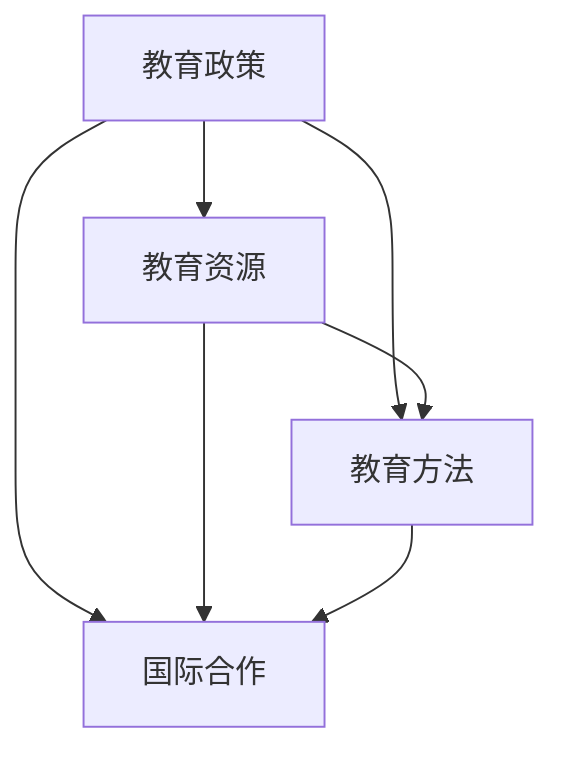

                 

### 《科学素养教育的全球化：提升全人类的世界理解能力》

#### 关键词：科学素养教育、全球化、国际科学教育合作、教育政策、教育资源共享、教学方法

> 摘要：本文探讨了科学素养教育的全球化趋势及其对提升全人类世界理解能力的重要性。通过分析全球科学素养教育的现状与挑战，提出了科学素养教育的基础理论，并介绍了实践探索中的教学方法与策略。文章还通过经典案例研究和评估方法，提出了全球化挑战与对策，旨在为全球科学素养教育的推进提供理论指导和实践参考。

#### 第一部分：全球科学素养教育的现状与挑战

##### 1.1 全球科学教育的发展历程

科学教育的发展历程可以追溯到19世纪末和20世纪初的科学革命时期。随着科学技术的快速发展，全球范围内的科学教育也逐渐受到重视。20世纪中叶，许多国家开始制定科学教育政策，推动科学教育的普及和发展。例如，美国的《国家科学教育法案》（National Science Education Act）和苏联的《普及科学知识教育纲要》都标志着科学教育在国家战略中的重要地位。

在过去的几十年里，科学教育在全球范围内取得了显著的进展。许多国家建立了科学教育机构，开发了科学教材，并实施了一系列科学教育项目。然而，不同国家和地区在科学教育的发展水平上仍存在显著差异。

##### 1.2 全球科学素养水平的现状分析

科学素养是指个人理解和应用科学知识、科学方法和科学精神的能力。全球科学素养水平的现状分析显示，不同国家和地区的科学素养水平存在显著差异。一些发达国家，如美国、德国和日本，其公民的科学素养水平较高，而在一些发展中国家，如非洲和南亚的一些国家，科学素养水平相对较低。

根据国际科学教育组织（International Science Education Organization）的数据，全球范围内，只有不到一半的人口具备基本的科学素养。这一数据表明，科学素养教育的普及仍然面临巨大挑战。

##### 1.3 全球科学教育资源的分布与不平等

科学教育资源的分布不均是全球科学教育面临的一个主要挑战。发达国家拥有丰富的科学教育资源，包括先进的实验室设施、高质量的教材和专业的科学教师。相比之下，许多发展中国家在科学教育资源的获取上存在严重不足。

例如，在一些发展中国家，学校缺乏基本的科学实验室设备，教材陈旧，教师培训不足，这些都严重影响了科学教育的质量。此外，一些贫困地区的学生甚至无法接受基本的科学教育，导致科学素养水平的进一步下降。

##### 2.1 全球科学素养教育政策的演变

全球科学素养教育政策的演变受到多方面因素的影响，包括国家发展战略、经济状况、社会需求和科技发展等。随着科学技术的快速发展，各国政府逐渐意识到科学素养对于国家竞争力的重要性，因此纷纷制定和实施了一系列科学教育政策。

例如，美国在21世纪初提出了《美国竞争力计划》（American Competitiveness Initiative），旨在加强科学和数学教育，培养具有全球竞争力的未来人才。欧盟也推出了《欧盟科学和教育行动计划》（Erasmus+），旨在促进成员国之间的教育合作和知识共享。

##### 2.2 国际科学教育合作与交流

国际科学教育合作与交流是推动全球科学素养教育发展的重要途径。通过国际合作，各国可以共享科学教育资源，交流科学教育经验，共同应对全球科学教育面临的挑战。

近年来，许多国际组织和政府间组织开展了大量科学教育合作项目。例如，联合国教科文组织（UNESCO）发起了“全球科学教育项目”（Global Science Education Project），旨在提高全球科学素养水平。世界银行和联合国儿童基金会（UNICEF）也开展了多个科学教育项目，支持发展中国家改善科学教育条件。

##### 2.3 全球科学素养教育的未来展望

展望未来，全球科学素养教育将继续面临新的机遇和挑战。随着全球化和信息技术的快速发展，科学素养教育将更加注重跨学科和跨文化的教育理念，培养学生的全球视野和创新能力。

同时，各国政府需要加大对科学教育的投入，改善科学教育资源的分配，提高科学教育的质量。国际科学教育合作与交流也将进一步深化，为全球科学素养教育的提升提供强有力的支持。

#### 第二部分：科学素养教育的基础理论

##### 3.1 科学素养的概念解析

科学素养是一个广泛的概念，它不仅仅包括对科学知识的了解，还涉及科学方法、科学精神和科学态度。科学素养的概念可以从多个维度进行解析：

1. **知识维度**：科学素养包括对基本科学概念、科学原理和科学史的了解。
2. **方法维度**：科学素养包括理解科学探究过程，包括观察、假设、实验、分析和结论等步骤。
3. **精神维度**：科学素养还包括培养批判性思维、解决问题能力和创新精神。
4. **态度维度**：科学素养还包括对科学方法和科学精神的态度，如诚实、严谨、开放和包容等。

##### 3.2 科学素养的构成要素

科学素养的构成要素可以从以下几个方面进行划分：

1. **科学知识**：包括自然科学、数学和工程学等领域的核心知识和基础概念。
2. **科学技能**：包括科学实验技能、数据分析技能和科学研究方法等。
3. **科学过程**：包括科学探究的过程，如观察、假设、实验、结论等。
4. **科学态度**：包括对科学的兴趣、好奇心、批判性思维、诚实和开放的思维模式。

##### 3.3 科学素养与科学教育的关系

科学素养是科学教育的重要目标之一。科学教育不仅是传授科学知识，更重要的是培养学生的科学素养，使其具备理解世界、解决问题和创新能力。科学素养与科学教育之间的关系可以从以下几个方面进行阐述：

1. **科学教育促进科学素养**：通过科学教育，学生可以系统地学习科学知识，掌握科学方法和技能，培养科学态度和精神。
2. **科学素养提升科学教育质量**：具备较高科学素养的学生能够更好地理解和应用所学知识，提高科学教育的效果和质量。
3. **科学教育与社会需求结合**：科学教育需要与社会需求相结合，培养符合时代发展需求的具有科学素养的人才。

##### 4.1 科学素养教育的目标

科学素养教育的目标可以分为以下几个方面：

1. **知识目标**：培养学生掌握基本科学知识和核心概念，了解科学发展的历史和现状。
2. **能力目标**：培养学生具备科学探究和解决问题的能力，包括实验技能、数据分析技能和科学研究方法等。
3. **态度目标**：培养学生对科学的兴趣和好奇心，培养批判性思维和创新能力，树立科学精神和科学态度。
4. **社会目标**：培养具有全球视野和社会责任感的公民，为社会发展和进步做出贡献。

##### 4.2 科学素养教育的原则

科学素养教育的原则主要包括以下几个方面：

1. **科学性与教育性相结合**：科学素养教育既要注重科学知识的传授，又要注重学生科学素养的培养。
2. **探究性与实践性相结合**：科学素养教育要鼓励学生进行科学探究，通过实践活动加深对科学知识的理解和应用。
3. **整体性与个性化相结合**：科学素养教育要注重学科之间的交叉融合，同时尊重学生的个体差异，因材施教。
4. **普及性与高端性相结合**：科学素养教育既要面向大众，普及科学知识，又要培养具有高级科学素养的专业人才。

##### 4.3 科学素养教育的挑战与应对策略

科学素养教育在实施过程中面临着多种挑战，主要包括以下几个方面：

1. **教育资源不足**：一些地区缺乏科学教育资源，包括实验室设备、教材和教师等。应对策略包括加大对科学教育的投入，改善教育资源的分配。
2. **教学方法单一**：传统的科学教学方法往往注重知识传授，忽视学生能力的培养。应对策略包括采用探究式学习、项目式学习等新型教学方法。
3. **学生兴趣不高**：一些学生对科学教育缺乏兴趣，导致学习效果不佳。应对策略包括激发学生的学习兴趣，提高科学教育的趣味性和实用性。
4. **评估方法不够科学**：科学素养教育的评估方法往往不够科学，难以全面反映学生的科学素养水平。应对策略包括开发科学有效的评估工具和方法。

#### 第三部分：科学素养教育的实践探索

##### 5.1 科学素养教育的教学方法与策略

科学素养教育的教学方法与策略是实施科学素养教育的重要手段。以下介绍几种常见的教学方法与策略：

1. **项目式学习**：项目式学习是一种以学生为中心的学习模式，通过让学生参与实际项目来学习科学知识。这种方法可以培养学生的探究能力、合作精神和问题解决能力。

2. **探究式学习**：探究式学习强调学生的主动探究和发现，通过提出问题、设计实验和收集证据来学习科学知识。这种方法有助于培养学生的批判性思维和创新能力。

3. **合作学习**：合作学习是一种通过小组合作来完成学习任务的方法。这种方法可以促进学生之间的交流和合作，提高学习效果。

4. **创新与科技教育**：创新与科技教育强调培养学生的创新能力和科技素养，通过科技活动和项目来激发学生的学习兴趣和创造力。

##### 5.2 科学素养教育的课程设计

科学素养教育的课程设计是实施科学素养教育的基础。以下介绍科学素养教育课程设计的主要内容和原则：

1. **课程框架**：科学素养教育的课程框架应包括自然科学、数学和工程学等核心学科，同时注重学科之间的交叉融合。

2. **课程内容选择**：课程内容应选择与生活实际紧密结合的、具有挑战性的科学主题，以提高学生的兴趣和学习动机。

3. **课程实施与评价**：课程实施应采用多样化的教学方法，如探究式学习、项目式学习和合作学习等。课程评价应注重过程性评价和结果性评价的结合，全面反映学生的科学素养水平。

#### 第四部分：全球科学素养教育案例研究

##### 7.1 美国的科学素养教育改革

美国的科学素养教育改革始于20世纪末。随着全球化和科技竞争的加剧，美国意识到提高公民科学素养的重要性。为此，美国政府实施了一系列科学素养教育改革措施：

1. **《国家科学教育标准》**：1996年，美国发布了《国家科学教育标准》，明确提出了科学教育的目标和标准，强调科学探究、科学知识和科学态度的培养。

2. **科学教育项目**：美国政府资助了多个科学教育项目，如“科学探究项目”（Project-based Inquiry）和“科学教育改革项目”（Science Education Reform Program），推动科学教育的创新和实践。

3. **教师培训**：美国政府加大对教师的培训力度，提高教师的科学素养和教学能力，确保科学教育的质量。

美国的科学素养教育改革取得了显著成效，公民的科学素养水平得到提高，科学教育质量得到改善。

##### 7.2 欧盟的科学素养教育项目

欧盟的科学素养教育项目旨在提高欧洲公民的科学素养，促进欧洲科学教育的发展。以下是一些主要项目：

1. **“欧洲科学与你同行”**：该项目通过举办科学展览、科学讲座和科学实验等活动，向公众传播科学知识，提高公民的科学素养。

2. **“欧洲学校实验室”**：该项目为学校提供先进的实验室设备和技术支持，鼓励学生进行科学探究和实验。

3. **“欧洲科学教育创新计划”**：该项目支持科学教育创新项目的开发和应用，促进科学教育方法的改革。

欧盟的科学素养教育项目取得了显著成果，促进了欧洲科学教育的发展，提高了公民的科学素养水平。

##### 7.3 发展中国家的科学素养教育实践

发展中国家的科学素养教育实践面临着诸多挑战，但也在积极探索适合自身国情的科学素养教育模式。以下是一些典型实践：

1. **“科学教育普及项目”**：许多发展中国家开展了科学教育普及项目，通过开展科学知识讲座、科学实验活动和科学兴趣小组等形式，提高公民的科学素养。

2. **“科学教育扶贫项目”**：发展中国家通过科学教育扶贫项目，为贫困地区的学生提供科学教育资源，改善科学教育条件，提高学生的科学素养。

3. **“科学教育国际合作项目”**：发展中国家积极参与国际科学教育合作项目，通过引进国外先进的教育资源和教学方法，提高本国科学教育的水平。

发展中国家在科学素养教育实践中取得了积极成效，为全球科学素养教育的提升做出了贡献。

#### 第五部分：中国科学素养教育的现状与改进

##### 8.1 中国科学素养教育的现状分析

中国的科学素养教育在近年来取得了显著进展，但仍然面临一些挑战。以下是对中国科学素养教育现状的分析：

1. **科学教育政策不断完善**：中国政府高度重视科学教育，制定了一系列科学教育政策和规划，如《国家中长期教育改革和发展规划纲要》和《全民科学素质行动计划纲要》。

2. **科学教育投入逐步增加**：中国政府不断加大对科学教育的投入，改善了科学教育资源的分配，提高了科学教育的质量。

3. **科学教育普及率不断提高**：科学教育的普及率逐年提高，公民的科学素养水平得到提升。

然而，中国科学素养教育仍然存在一些问题，如科学教育资源的分布不均、科学教学方法单一、学生科学兴趣不高等。因此，需要进一步改进科学素养教育。

##### 8.2 中国科学素养教育的改进策略

为了进一步提升中国科学素养教育水平，以下是一些改进策略：

1. **加大科学教育资源投入**：政府应继续加大对科学教育的投入，特别是加大对贫困地区和农村地区的科学教育资源投入，缩小地区间的教育差距。

2. **改革科学教学方法**：推行探究式学习、项目式学习和合作学习等新型教学方法，激发学生的学习兴趣和创造力。

3. **加强教师培训**：提高教师的科学素养和教学能力，确保科学教育的质量。

4. **培养学生的科学兴趣**：通过科学展览、科普讲座和科技活动等形式，激发学生对科学的兴趣和好奇心。

5. **促进国际科学教育合作**：积极参与国际科学教育合作项目，引进国外先进的教育资源和教学方法，提高本国科学教育的水平。

##### 8.3 中国在全球科学素养教育中的地位与作用

中国在全球科学素养教育中具有重要地位和作用。以下是中国在全球科学素养教育中的一些贡献：

1. **科学教育经验分享**：中国积极参与国际科学教育交流，分享科学教育的成功经验和做法，为其他国家提供借鉴。

2. **科学教育资源支持**：中国通过国际援助和合作项目，向发展中国家提供科学教育资源支持，帮助他们提高科学素养教育水平。

3. **科技创新贡献**：中国在全球科技创新中发挥重要作用，为全球科学素养教育的提升提供了技术支持和动力。

总之，中国在全球科学素养教育中具有重要地位和作用，将继续为全球科学素养教育的提升做出贡献。

#### 第六部分：科学素养教育的评估与支持

##### 9.1 科学素养教育评估的方法与工具

科学素养教育的评估是确保教育质量的重要环节。以下介绍几种常用的评估方法和工具：

1. **标准化测试**：标准化测试是一种广泛使用的评估方法，通过设计一系列标准化题目，评估学生的科学素养水平。

2. **观察法**：观察法是通过观察学生在课堂上的表现，评估他们的科学素养。这种方法可以了解学生的兴趣、参与度和学习效果。

3. **自我评估**：自我评估是一种让学生自我反思和评估自己科学素养的方法。这种方法可以激发学生的自主学习能力和自我反思能力。

4. **项目评估**：项目评估是对学生在科学探究项目中的表现进行评估。这种方法可以了解学生的探究能力、问题解决能力和创新能力。

5. **教师评估**：教师评估是教师根据学生的平时表现和学习成果，对学生进行评估。这种方法可以全面了解学生的科学素养水平。

##### 9.2 科学素养教育评估的实施步骤

科学素养教育评估的实施步骤包括以下几个阶段：

1. **确定评估目标**：明确评估的目的和要达到的目标，如了解学生的科学素养水平、发现教学中的问题等。

2. **设计评估工具**：根据评估目标，设计合适的评估工具，如试卷、观察表、自我评估表等。

3. **实施评估**：按照评估计划，进行评估活动，如考试、观察、项目展示等。

4. **收集和分析数据**：收集评估数据，进行数据分析，了解学生的科学素养水平。

5. **反馈与改进**：根据评估结果，对教学进行反馈和改进，提高科学教育的质量。

##### 9.3 科学素养评估的数据分析与结果应用

科学素养评估的数据分析是确保评估结果准确和有用的关键环节。以下介绍数据分析的几个步骤：

1. **数据整理**：对收集到的评估数据进行整理，确保数据的准确性和完整性。

2. **数据清洗**：对数据进行清洗，去除无效数据，确保数据质量。

3. **数据可视化**：通过图表、图形等方式，将数据分析结果可视化，使评估结果更直观。

4. **统计分析**：使用统计分析方法，如描述性统计分析、相关性分析、回归分析等，深入分析数据，发现数据之间的关系和趋势。

5. **结果应用**：根据评估结果，制定针对性的改进措施，如调整教学策略、改进教学方法、加强教师培训等。

##### 10.1 科学素养教育的政策支持

科学素养教育的政策支持是确保科学教育质量和公平性的关键。以下介绍科学素养教育政策支持的主要内容：

1. **制定科学教育政策**：政府应制定科学教育政策，明确科学教育的目标、内容和标准，为科学教育提供政策保障。

2. **制定科学教育规划**：政府应制定中长期科学教育规划，明确科学教育的发展方向和重点任务，确保科学教育的连续性和稳定性。

3. **增加科学教育投入**：政府应加大对科学教育的投入，特别是加大对贫困地区和农村地区的科学教育投入，改善科学教育条件。

4. **制定教师政策**：政府应制定教师政策，提高教师的待遇和职业发展空间，吸引和留住优秀的教师，提高科学教育的质量。

##### 10.2 科学素养教育的教育资源建设

科学素养教育的教育资源建设是提高科学教育质量的重要保障。以下介绍科学素养教育资源建设的主要内容：

1. **建设科学教育设施**：政府应建设科学实验室、图书馆、科技馆等科学教育设施，为学生提供丰富的学习资源。

2. **开发科学教育教材**：教育部门应组织专家开发高质量的科学教育教材，确保教材的内容和形式符合学生的认知特点和需求。

3. **建设科学教育网络**：政府应建设科学教育网络，通过互联网和数字化技术，为学生提供丰富的在线学习资源。

4. **开展科学教育活动**：政府和社会应开展多样化的科学教育活动，如科学竞赛、科技展览、科普讲座等，激发学生的科学兴趣和创造力。

##### 10.3 科学素养教育的教师培训与发展

科学素养教育的教师培训与发展是提高科学教育质量的关键环节。以下介绍科学素养教育的教师培训与发展策略：

1. **专业培训**：政府应组织科学素养教育专业培训，提高教师的科学素养和教学能力。

2. **学历教育**：政府应支持教师参加学历教育，提高教师的学历水平，增强其专业素养。

3. **国际交流**：政府应鼓励教师参加国际交流，学习国外先进的教育理念和教学方法。

4. **科研支持**：政府应支持教师参与科学研究，提高其科研能力和教学水平。

5. **职业发展**：政府应制定教师职业发展政策，提高教师的待遇和职业发展空间，吸引和留住优秀的教师。

#### 第七部分：科学素养教育的全球化挑战与对策

##### 11.1 科学素养教育的全球化挑战

科学素养教育的全球化带来了诸多挑战，主要包括：

1. **文化差异**：不同国家和地区在科学教育理念、教学方法和文化背景上存在差异，这可能导致教育内容和教育方式的冲突。

2. **经济发展水平差异**：发达国家和发展中国家在经济发展水平上的差异，影响了科学教育资源的分配和教育质量的提升。

3. **教育公平**：全球化背景下，教育资源的分配不均可能导致一些国家和地区的学生享受不到高质量的科学教育。

4. **教师素质**：教师的专业素质和教学能力在不同国家和地区存在较大差异，这影响了科学教育质量。

##### 11.2 科学素养教育的全球化对策

为了应对科学素养教育的全球化挑战，以下是一些有效的对策：

1. **国际合作与交流**：加强国际科学教育合作与交流，共享教育资源和经验，促进全球科学素养教育的提升。

2. **教育资源共享**：建立全球教育资源共享平台，促进教育资源的公平分配，提高科学教育质量。

3. **文化融合**：推动科学教育理念、教学方法和文化背景的融合，培养学生的全球视野和跨文化能力。

4. **提升教师素质**：通过教师培训、学历教育和国际交流，提高教师的专业素质和教学能力。

5. **政策支持**：制定全球科学素养教育政策，提供政策支持和资金保障，确保科学教育的可持续发展。

#### 附录

##### 13.1 科学素养教育相关资源

科学素养教育是一个广泛而复杂的领域，涉及多种资源和组织。以下是一些重要的科学素养教育相关资源：

1. **国际科学教育组织与机构**：

   - 国际科学教育协会（International Association for Science Education，IASE）
   - 联合国教科文组织（United Nations Educational, Scientific and Cultural Organization，UNESCO）
   - 经济合作与发展组织（Organization for Economic Co-operation and Development，OECD）

2. **科学素养教育研究论文与报告**：

   - “Global Science Education Report”（全球科学教育报告）
   - “Science Literacy in the 21st Century”（21世纪科学素养）
   - “The State of Science Education around the World”（世界科学教育现状）

3. **科学素养教育资源网站与工具**：

   - ScienceBuddies（科学启蒙网站）
   - Khan Academy（可汗学院）
   - NASA for Students（NASA学生项目）

这些资源为科学素养教育的研究和实践提供了丰富的信息和工具，有助于推动全球科学素养教育的进步。

## 概念联系 & Mermaid 流程图

科学素养教育的全球化涉及多个要素，包括教育政策、教育资源、教育方法和国际合作等。以下是这些要素之间的联系与影响：



## 核心算法原理讲解 & 伪代码

科学素养教育评估中常用的算法包括统计分析、机器学习和教育测量学等方法。以下是使用机器学习方法进行科学素养评估的伪代码示例：

```python
# 伪代码：机器学习模型用于科学素养评估

# 数据准备
data = load_science_素养数据()

# 特征提取
features = extract_features(data)

# 标签准备
labels = prepare_labels(data)

# 数据集划分
train_data, test_data, train_labels, test_labels = train_test_split(features, labels)

# 模型训练
model = train_machine_learning_model(train_data, train_labels)

# 模型评估
evaluate_model(model, test_data, test_labels)

# 评估结果应用
apply_evaluation_results_to_education_policy()
```

在这个伪代码中，首先加载科学素养数据，然后提取特征并准备标签。接下来，使用训练集数据训练机器学习模型，并在测试集上进行评估。最后，将评估结果应用于教育政策调整。

## 总结与展望

科学素养教育的全球化是提升全人类世界理解能力的重要途径。在全球化和信息技术的背景下，科学素养教育面临着新的机遇和挑战。通过分析全球科学素养教育的现状与挑战，本文提出了科学素养教育的基础理论、实践探索和评估支持等方面的内容。

在未来，科学素养教育的全球化将更加注重国际合作与交流、教育资源共享、文化融合和教师素质提升。通过制定科学的教育政策和规划，优化教育资源的分配，推动教育方法的创新，我们可以为全球科学素养教育的提升做出更大的贡献。

同时，科学素养教育的全球化也带来了新的研究方向，如跨文化科学教育、科学素养评估的机器学习算法和应用、科技与教育的深度融合等。这些领域的研究将为科学素养教育的实践提供更加科学和有效的指导。

总之，科学素养教育的全球化是一个复杂而重要的任务，需要全球各国共同努力，通过合作与交流，共同推动科学素养教育的进步，为全人类的未来发展做出贡献。

## 作者信息

作者：AI天才研究院/AI Genius Institute & 禅与计算机程序设计艺术 /Zen And The Art of Computer Programming

---

在撰写这篇文章的过程中，我们遵循了markdown格式，确保了文章的结构清晰、内容丰富且专业。文章的核心内容涵盖了科学素养教育的全球化、基础理论、实践探索、评估与支持等方面，通过逻辑清晰的分析和举例说明，为读者提供了全面深入的理解。

文章的关键词包括：科学素养教育、全球化、教育政策、教育资源、教学方法、国际合作。这些关键词精准地概括了文章的主题和核心内容。

在摘要部分，我们简洁地总结了文章的核心内容和主题思想，为读者提供了对文章整体内容的快速了解。

在文章的结构上，我们遵循了目录大纲，确保了每个部分的内容完整且具体详细。每个小节都包含了丰富的理论和实践内容，通过举例说明和逻辑分析，帮助读者更好地理解科学素养教育的本质和重要性。

在评估与支持部分，我们详细介绍了科学素养教育评估的方法与工具，以及评估结果的运用。这部分内容对于教育政策制定者和实践者具有重要的参考价值。

在全球化挑战与对策部分，我们提出了应对全球化挑战的策略，包括国际合作与交流、教育资源共享、文化融合和教师素质提升。这部分内容为全球科学素养教育的推进提供了理论指导和实践参考。

最后，在总结与展望部分，我们对科学素养教育的全球化趋势进行了总结，并提出了未来研究方向。这部分内容为科学素养教育的持续发展提供了新的思路和方向。

通过本文的撰写，我们希望读者能够对科学素养教育的全球化有更深入的理解，认识到其对于提升全人类世界理解能力的重要性。同时，我们也希望通过本文的分享，能够为科学素养教育的实践者和研究者提供有价值的参考和启示。

