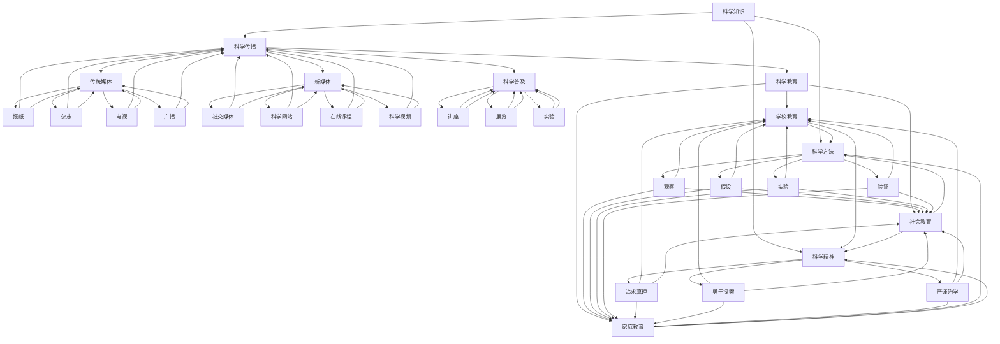

                 

### 文章标题

# 《科学素养教育：提升公众世界理解能力的关键》

> 关键词：科学素养、教育、公众理解、知识传播、思维训练

> 摘要：本文旨在探讨科学素养教育对提升公众世界理解能力的重要性。通过分析科学素养教育的背景、核心概念、实践策略以及社会影响，本文提出了一套系统的科学素养教育框架，并借鉴国际经验，为我国科学素养教育的未来发展提供了方向和建议。

### 引言

在当今信息化、全球化的时代，科学素养已经成为一个国家综合实力的重要标志。科学素养教育不仅仅是培养科学家的摇篮，更是提升公众世界理解能力的关键。科学素养教育能够帮助公众建立正确的世界观、价值观和思维方式，从而更好地适应和推动社会的发展。

然而，当前我国公众科学素养水平仍存在较大差距，科学素养教育也面临着诸多挑战。因此，探讨科学素养教育的内涵、重要性以及实践策略，对于提高全民科学素质、推动社会进步具有重要意义。

本文将从以下几个方面展开讨论：

1. **科学素养教育的背景与重要性**：介绍科学素养教育的定义、内涵以及当前公众科学素养水平的现状。
2. **科学素养教育的核心概念**：探讨科学知识传播的渠道与方式、科学方法与思维训练、科学素养教育与跨学科融合。
3. **科学素养教育的实践策略**：分析科普活动的组织与实施、学校科学教育的改进、家庭科学教育的引导。
4. **科学素养教育的社会影响**：讨论科学素养教育对个人发展和社会发展的推动作用。
5. **国际科学素养教育的启示与借鉴**：分析国际科学素养教育的现状、趋势以及优秀实践案例。
6. **我国科学素养教育的未来展望**：提出我国科学素养教育的发展战略、创新与实践以及国际化合作的方向。

通过以上分析，本文旨在为我国科学素养教育的改革与发展提供有益的参考和借鉴。希望读者能够在阅读过程中，对科学素养教育有更深入的理解和认识。

### 科学素养教育的背景与重要性

#### 科学素养教育的定义与内涵

科学素养教育是一种旨在提升公众科学素质的教育活动，其核心目标是培养公民对科学知识、科学方法和科学精神的认知与理解能力。科学素养不仅包括科学知识的掌握，还涉及科学思维方式的培养、科学方法的运用以及对科学精神的价值认同。科学素养教育的内涵可以从以下几个方面进行理解：

1. **科学知识的掌握**：科学知识是科学素养的基础。通过科学素养教育，公众能够了解基本的自然科学和社会科学知识，理解科学现象及其背后的原理，从而形成对世界的科学认知。

2. **科学方法的运用**：科学方法是一种系统的、严谨的研究方法，包括观察、假设、实验、验证等步骤。科学素养教育通过培养公众运用科学方法解决问题的能力，提升其科学思维水平。

3. **科学思维方式的培养**：科学思维方式强调逻辑性、批判性、系统性。科学素养教育通过引导公众培养科学思维方式，使其在面对复杂问题时能够采取理性、客观的态度进行分析和判断。

4. **科学精神的塑造**：科学精神是一种追求真理、勇于探索、严谨治学的态度和精神。科学素养教育通过弘扬科学精神，培养公众的探索精神和创新意识。

#### 科学素养教育的重要性

科学素养教育在提升公众世界理解能力方面具有重要意义。以下是科学素养教育的重要性的几个方面：

1. **增强社会稳定与和谐**：科学素养教育有助于公众正确理解和接受科学知识，减少因科学知识误解而引发的恐慌和偏见，从而促进社会的稳定与和谐。

2. **推动科技进步与社会发展**：科学素养教育能够培养更多的科技创新人才，推动科技的发展。同时，公众对科学的理解也有助于推动科学技术的普及和应用，从而促进社会的全面发展。

3. **提升国家综合实力**：科学素养是一个国家综合实力的重要标志。一个国家拥有较高的公众科学素养水平，不仅能够更好地应对科技挑战，还能在国际竞争中占据优势地位。

4. **促进个体全面发展**：科学素养教育有助于提升公众的综合素质，培养其独立思考、批判性思维、问题解决能力等。这些能力的提升对个体的全面发展具有重要意义。

#### 当前公众科学素养水平的现状

尽管科学素养教育的重要性已被广泛认可，但当前我国公众科学素养水平仍存在较大差距。以下是目前我国公众科学素养水平的一些现状：

1. **科学知识掌握程度较低**：根据相关调查数据显示，我国公众对基本科学知识的了解程度较低，尤其是在自然科学领域。许多人对科学现象的原理和科学方法知之甚少。

2. **科学思维方式不够健全**：公众在科学思维方式方面存在一定的问题，如缺乏逻辑性和批判性思维。许多人在面对科学问题时，往往不能采取理性、客观的态度进行分析。

3. **科学精神认同度不高**：虽然科学精神在现代社会被广泛提倡，但公众对科学精神的认同度仍然不高。一些人将科学视为工具，而非追求真理和探索未知的手段。

4. **科学教育投入不足**：科学素养教育在我国的教育体系中尚未得到足够的重视。学校教育和家庭教育在科学素养培养方面的投入相对不足，导致公众科学素养水平的提升缓慢。

综上所述，提高公众科学素养水平已成为我国亟待解决的问题。通过加强科学素养教育，提升公众的科学素质，将为我国社会的发展和进步提供有力支持。

#### 科学素养教育的核心概念

科学素养教育不仅仅是传授科学知识，更重要的是培养公众的科学思维方式、科学方法和科学精神。为了深入理解科学素养教育的内涵，我们需要从以下几个方面进行探讨：

##### 科学知识传播的渠道与方式

科学知识的传播是科学素养教育的重要组成部分。在现代社会，科学知识的传播渠道和方式日益多样化，包括传统媒体、新媒体以及科学普及与科学教育。

1. **传统媒体与科学传播**：传统媒体如报纸、杂志、电视和广播在科学传播中发挥了重要作用。报纸和杂志通常设有科学专栏，报道科学领域的最新进展和研究成果；电视和广播则通过专题节目、新闻报道等形式向公众普及科学知识。

2. **新媒体与科学传播**：随着互联网和移动互联网的普及，新媒体在科学传播中扮演了越来越重要的角色。社交媒体平台、科学网站、在线课程和科学视频等新媒体形式，使得科学知识的传播更加便捷、广泛和互动。

3. **科学普及与科学教育**：科学普及是指通过各种手段向公众传播科学知识和科学方法，以提高公众的科学素养。科学教育则是通过学校教育、社会教育和家庭教育等形式，系统性地培养公众的科学知识和科学思维。

科学知识的传播不仅仅是一个单向的过程，更需要公众的参与和互动。通过科学讲座、科普展览、科学实验等形式，公众可以更加直观地了解科学知识，提高对科学的兴趣和认同感。

##### 科学方法与思维训练

科学方法是一种系统的、严谨的研究方法，包括观察、假设、实验、验证等步骤。科学思维则是运用科学方法进行问题分析和解决的一种思维方式。

1. **科学方法的基本步骤**：科学方法的基本步骤包括提出问题、建立假设、进行实验、收集数据和验证结果。通过这些步骤，科学家可以系统地研究问题，发现科学规律。

2. **科学思维能力培养**：科学思维能力的培养是科学素养教育的重要目标。科学思维能力包括逻辑思维、批判性思维、系统性思维等。通过科学教育和科普活动，可以培养公众的这些思维能力。

3. **创新思维与科学探索**：创新思维是科学探索的重要动力。科学素养教育通过引导公众培养创新思维，鼓励其进行科学探索，从而推动科学的发展。

科学方法和科学思维不仅在科学研究中具有重要意义，在日常生活中也具有广泛的应用。通过培养科学思维，公众可以更加理性、客观地看待问题，提高问题解决能力。

##### 科学素养教育与跨学科融合

科学素养教育不仅仅局限于科学领域，还与其他学科领域相互融合，形成跨学科的教育模式。

1. **科学素养教育与数学素养**：数学是科学的基础，科学素养教育需要与数学素养相结合。通过数学教育，可以培养公众的逻辑思维、抽象思维和问题解决能力，从而提高科学素养。

2. **科学素养教育与技术素养**：现代科技的发展使得科学与技术紧密结合。科学素养教育需要与技术素养相结合，培养公众对科技的理解和应用能力，从而推动科技创新和社会进步。

3. **科学素养教育与人文素养**：科学素养教育不仅仅是科学知识的传授，还需要培养公众的人文素养。通过人文教育，可以培养公众的道德观念、社会责任感和人文关怀，从而提高其科学素养。

科学素养教育的核心概念相互联系，共同构成了一个完整的科学素养教育体系。通过科学知识的传播、科学方法的运用、科学思维的培养以及跨学科融合，科学素养教育能够全面提升公众的世界理解能力，为社会的进步和发展提供有力支持。

#### 科学素养教育的核心概念联系与架构

为了更好地理解科学素养教育的核心概念及其相互关系，我们可以通过一个Mermaid流程图来展示这些概念之间的联系和架构。



在这个Mermaid流程图中，科学知识（A）是科学素养教育的基础，通过科学传播（B）传递给公众。科学传播包括传统媒体（E）、新媒体（F）和科学普及与教育（G、H）。科学方法（C）和科学精神（D）是科学素养教育的核心，通过观察（I）、假设（J）、实验（K）和验证（L）等步骤，培养公众的科学思维方式。科学精神包括追求真理（M）、勇于探索（N）和严谨治学（O）。最后，科学素养教育通过跨学科融合，与数学素养（A）、技术素养（B）和人文素养（C）相结合，形成一个完整的科学素养教育体系。

通过这个流程图，我们可以清晰地看到科学素养教育的各个核心概念及其相互之间的关系，为科学素养教育的实施提供了理论支持。

#### 科学方法与思维训练

科学方法是一种系统的、严谨的研究方法，是科学素养教育的核心内容之一。科学方法不仅用于科学研究，还广泛应用于日常生活和工作中。科学方法的基本步骤包括观察、假设、实验、验证和结论。以下将详细描述这些步骤及其应用。

##### 基本步骤

1. **观察**：观察是科学方法的起点。科学家通过对自然现象的观察，发现和记录现象的规律和特征。例如，伽利略通过观察摆动，发现了摆动的周期规律。

   ```mermaid
   graph TD
   A[观察] --> B[假设]
   ```

2. **假设**：在观察的基础上，科学家提出假设，即对观察结果进行初步解释。假设通常是基于已有知识和逻辑推理。例如，牛顿在观察苹果落地后，假设地球上的所有物体都受到引力作用。

   ```mermaid
   A --> B
   B --> C[实验]
   ```

3. **实验**：为了验证假设，科学家设计并进行实验。实验是通过有控制的环境下重复观察现象，以获取数据和证据。例如，科学家通过实验验证牛顿的万有引力定律。

   ```mermaid
   B --> C
   C --> D[验证]
   ```

4. **验证**：在实验过程中，科学家收集和分析数据，以验证假设的正确性。通过对比实验结果与预期，科学家可以判断假设是否成立。

   ```mermaid
   C --> D
   D --> E[结论]
   ```

5. **结论**：根据验证结果，科学家得出结论。结论是对假设和实验结果的总结，是科学发现的基础。例如，通过验证，科学家确认了牛顿的万有引力定律的正确性。

   ```mermaid
   D --> E
   ```

##### 应用

科学方法在日常生活和工作中的应用非常广泛。以下是一些典型的应用场景：

1. **日常生活中的应用**：在日常生活中，科学方法可以帮助我们解决许多实际问题。例如，当我们遇到一个问题时，我们可以通过观察现象、提出假设、进行实验和验证，最终找到解决方案。

   ```mermaid
   A[问题] --> B[观察]
   B --> C[假设]
   C --> D[实验]
   D --> E[验证]
   E --> F[结论]
   ```

2. **工作中的应用**：在工作环境中，科学方法可以帮助我们进行项目管理、质量控制、问题解决等。例如，在一个软件开发项目中，我们可以通过需求分析、设计、开发、测试等步骤，确保项目按照预期完成。

   ```mermaid
   A[项目需求] --> B[需求分析]
   B --> C[设计]
   C --> D[开发]
   D --> E[测试]
   E --> F[交付]
   ```

##### 科学思维能力的培养

科学思维能力是科学素养教育的重要目标。科学思维能力包括逻辑思维、批判性思维、系统性思维等。以下是一些培养科学思维能力的方法：

1. **培养逻辑思维**：逻辑思维是一种通过逻辑推理和判断进行问题分析和解决的能力。我们可以通过学习逻辑学、数学等课程，培养逻辑思维能力。

   ```mermaid
   A[逻辑学] --> B[数学]
   B --> C[逻辑推理]
   ```

2. **培养批判性思维**：批判性思维是一种对信息进行批判性分析和评估的能力。通过阅读、讨论和批判性写作，我们可以培养批判性思维能力。

   ```mermaid
   A[阅读] --> B[讨论]
   B --> C[批判性写作]
   ```

3. **培养系统性思维**：系统性思维是一种将问题分解为各个部分，然后分析这些部分之间关系的能力。通过学习系统论、项目管理等课程，我们可以培养系统性思维能力。

   ```mermaid
   A[系统论] --> B[项目管理]
   B --> C[问题分解]
   B --> D[关系分析]
   ```

科学方法和科学思维能力在提升公众世界理解能力方面具有重要意义。通过科学方法的运用和科学思维能力的培养，公众可以更加理性、客观地看待问题，提高问题解决能力，从而更好地适应和推动社会的发展。

#### 科学素养教育与跨学科融合

科学素养教育不仅仅是科学知识的传授，更是培养跨学科素养的桥梁。跨学科融合是指将不同学科的知识和思维方式结合起来，形成一种综合性、创新性的教育模式。以下将探讨科学素养教育与数学素养、技术素养和人文素养的融合。

##### 科学素养教育与数学素养

数学是科学的基础，科学素养教育需要与数学素养相结合。数学素养包括数学知识的掌握、数学思维方式的培养和数学应用能力的提升。科学素养教育可以通过以下方式与数学素养融合：

1. **数学知识的掌握**：科学素养教育可以引导学生掌握基础的数学知识，如代数、几何、概率论等。这些知识不仅有助于理解科学现象，还能培养逻辑思维和抽象思维能力。

2. **数学思维方式的培养**：科学素养教育通过培养学生的数学思维方式，如推理、证明、建模等，提高其解决问题的能力。例如，在物理学中，学生需要运用数学方法建立物理模型，进行定量分析。

3. **数学应用能力的提升**：科学素养教育可以引导学生将数学知识应用于实际问题，如数据分析、模拟预测等。通过数学应用，学生能够更好地理解科学原理，提高科学素养。

##### 科学素养教育与技术素养

现代科技的发展使得科学与技术紧密结合，科学素养教育需要与技术素养相结合。技术素养包括对科技的理解、科技应用能力的提升和创新思维的培养。科学素养教育可以通过以下方式与技术素养融合：

1. **科技理解**：科学素养教育可以引导学生了解不同科技领域的基本原理和应用，如信息技术、生物技术、能源技术等。通过科技理解，学生能够更好地理解科学对社会的影响。

2. **科技应用能力**：科学素养教育可以通过实践活动，如科学实验、科技竞赛等，提升学生的科技应用能力。例如，在信息技术领域，学生可以学习编程、算法设计等，通过实际项目提升应用能力。

3. **创新思维的培养**：科学素养教育可以通过创新教育，培养学生的创新思维和创造力。通过科技项目、发明创造等，学生能够在实践中体验到科学探索的乐趣，激发创新精神。

##### 科学素养教育与人文素养

科学素养教育不仅关注科学知识的传授，还需要培养人文素养。人文素养包括道德观念、社会责任感和人文关怀。科学素养教育可以通过以下方式与人文素养融合：

1. **道德观念**：科学素养教育可以引导学生树立正确的道德观念，尊重科学、尊重生命。通过案例分析、伦理讨论等，学生能够认识到科学研究的伦理问题，培养科学道德。

2. **社会责任感**：科学素养教育可以引导学生认识到自己在社会中的责任和角色，鼓励其积极参与社会公益事业。例如，在环境保护、医疗救助等方面，学生可以通过科学知识和技能，为社会做出贡献。

3. **人文关怀**：科学素养教育可以培养学生的人文关怀，关注人类福祉。通过文学、艺术、历史等人文课程，学生能够更好地理解人类文明的发展，培养人文情怀。

跨学科融合是科学素养教育的重要特征，通过数学素养、技术素养和人文素养的融合，科学素养教育能够全面提升学生的综合素质，培养其科学精神、创新思维和社会责任感。这种融合不仅有助于学生更好地理解世界，也为未来的发展奠定了坚实基础。

#### 科普活动的组织与实施

科普活动是科学素养教育的重要形式之一，通过组织与实施科普活动，可以有效地向公众传播科学知识，提升其科学素养。以下将从策划与准备、组织与推广、评估与反馈三个方面，详细探讨科普活动的组织与实施策略。

##### 策划与准备

1. **确定目标与主题**：科普活动的策划首先要明确目标，即希望通过活动达到什么样的效果。例如，提升公众对环境保护的认识、增强对科技的兴趣等。根据目标确定活动主题，如“科学改变生活”、“环保行动在身边”等。

2. **制定活动方案**：在明确目标与主题后，制定详细的方案。方案应包括活动的时间、地点、内容、形式、参与人员等。例如，活动可以包括科学讲座、实验演示、科普展览、互动体验等。

3. **资源准备**：科普活动的成功离不开充足的资源准备。资源包括人力、物力、财力等。人力方面，需要邀请专业讲师、实验员、志愿者等；物力方面，需要准备实验器材、展示道具、宣传资料等；财力方面，需要确保活动经费的充足。

4. **宣传推广**：宣传推广是科普活动成功的关键。可以通过多种渠道进行宣传，如线上（社交媒体、官方网站、电子邮件等）和线下（海报、传单、广播等）。宣传内容应简洁明了，突出活动的亮点和参与方式。

##### 组织与推广

1. **活动执行**：在活动执行过程中，要确保各个环节的顺利进行。例如，科学讲座要安排好讲师和时间，实验演示要确保实验的安全性和准确性，科普展览要布置展品和讲解员等。

2. **参与者的引导**：在活动过程中，要引导参与者积极参与，激发其兴趣。可以通过互动环节、提问环节等，鼓励参与者提出问题和进行讨论。同时，要关注参与者的需求和反馈，及时调整活动内容和方法。

3. **推广活动**：活动结束后，可以通过多种渠道进行活动总结和推广。例如，通过官方网站、社交媒体、新闻报道等，发布活动照片、视频、心得体会等，扩大活动影响力。

##### 评估与反馈

1. **活动效果评估**：活动结束后，要对活动效果进行评估。评估内容包括参与者满意度、知识获取情况、活动传播效果等。可以通过问卷调查、访谈等方式，收集参与者的反馈意见，了解活动的优点和不足。

2. **活动总结**：根据评估结果，对活动进行总结。总结内容包括活动亮点、成功经验、存在问题、改进措施等。总结有助于积累经验，提高未来活动的质量和效果。

3. **持续改进**：根据活动总结，提出改进措施，并持续改进。例如，优化活动方案、提高宣传效果、丰富活动内容等。通过不断改进，科普活动可以更好地满足公众需求，提升公众科学素养。

科普活动的组织与实施是一个复杂的过程，需要科学策划、充分准备、有效执行和持续改进。通过这些策略，科普活动可以成为科学素养教育的重要载体，为提升公众世界理解能力贡献力量。

#### 学校科学教育的改进

学校科学教育是培养公众科学素养的重要途径，然而，当前学校科学教育在课程体系、教学方法、教学资源等方面仍存在诸多不足。因此，改进学校科学教育，提升其质量，具有重要意义。以下将探讨学校科学教育的改进策略。

##### 课程体系与教学内容的优化

1. **课程体系设计**：学校科学教育课程体系的设计应注重科学知识的系统性、连贯性和应用性。课程内容应涵盖基础科学知识、科学方法、科学思维等方面。例如，可以设置“科学探索与发现”、“科学实验与实践”、“科学思维与逻辑”等课程模块。

2. **教学内容创新**：教学内容应与时俱进，紧跟科技发展的步伐。例如，可以引入新兴科技领域的知识，如人工智能、生物技术、环境科学等。同时，要注重跨学科知识的融合，培养学生的综合素养。

3. **实践性教学**：科学教育不仅限于课堂上的理论教学，还应注重实践性教学。通过实验、实习、科研等活动，让学生亲身体验科学研究的全过程，培养其动手能力和创新精神。

##### 教学方法与教学资源的创新

1. **教学方法创新**：传统的教学方法往往以教师为中心，学生被动接受知识。现代科学教育应倡导以学生为中心的教学方法，如探究式学习、合作学习、项目式学习等。这些方法能够激发学生的学习兴趣，培养其自主学习和解决问题的能力。

2. **教学资源创新**：教学资源的创新包括多媒体资源、在线课程、虚拟实验室等。这些资源能够丰富教学内容，提供多样化的学习方式，满足不同学生的学习需求。

3. **数字化教学**：随着信息技术的发展，数字化教学已成为科学教育的重要手段。学校可以建立数字化教学平台，提供丰富的在线课程、实验资源和教学工具，实现课堂内外教学的有机结合。

##### 教师科学素养提升策略

1. **教师培训**：教师是科学教育的实施者，其科学素养直接影响到教育质量。因此，学校应加强对教师的培训，提升其科学素养和教学能力。可以通过专业培训、学术交流、科研项目等途径，提高教师的专业水平。

2. **教学研讨**：学校可以定期组织教学研讨活动，教师之间进行教学经验的交流和分享，共同探讨科学教育中的问题和挑战，寻找解决方案。

3. **科研支持**：学校应鼓励教师进行科学教育研究，支持其开展教育教学改革项目。通过科研活动，教师可以不断探索新的教学方法和策略，提高科学教育的实效性。

综上所述，改进学校科学教育需要从课程体系、教学方法、教学资源等方面进行全方位的改革。通过优化课程体系、创新教学方法和资源，提升教师科学素养，学校科学教育将更好地满足社会需求，培养具备科学素养的公民。

#### 家庭科学教育的引导

家庭科学教育在提升公众科学素养中起着不可忽视的作用。家庭是孩子成长的第一环境，父母是孩子的第一任教师。通过家庭科学教育，父母可以引导孩子培养科学兴趣、探索精神和创新能力，从而为他们的未来发展奠定坚实基础。

##### 家庭科学教育的重要性

1. **培养科学兴趣**：家庭科学教育能够激发孩子对科学的兴趣，使其在日常生活中主动探索科学现象，从而形成对科学的热爱。

2. **锻炼探索精神**：家庭科学教育鼓励孩子通过实验、观察和思考，培养其解决问题的能力和创新精神，使其在面对挑战时能够积极应对。

3. **增强实践能力**：家庭科学教育通过实际操作，让孩子亲身体验科学探究的过程，锻炼其动手能力和实践能力。

4. **促进亲子关系**：家庭科学教育是亲子互动的一种有效方式，通过共同参与科学活动，父母与孩子之间的情感得以加深。

##### 家庭科学教育的方法与技巧

1. **创设科学环境**：在家中创设一个科学角或实验区，摆放一些科学仪器和实验材料，为孩子提供探索科学的空间。

2. **阅读科学书籍**：鼓励孩子阅读科普书籍和科学杂志，通过阅读了解科学知识，培养阅读兴趣。

3. **开展科学实验**：与孩子一起进行简单的科学实验，如制作火山爆发模型、植物生长实验等，让孩子在动手操作中学习科学。

4. **参与科技活动**：带孩子参加科技馆、科普展览、科学讲座等活动，扩展其科学视野。

5. **提问与讨论**：鼓励孩子提问，与孩子一起探讨科学问题，培养其批判性思维和科学精神。

6. **利用日常生活**：将家庭日常生活中的现象与科学知识联系起来，引导孩子观察和思考，如解释为什么天空是蓝色的、水为什么能导电等。

##### 家庭与学校教育的协同

家庭与学校教育在科学素养培养中具有互补性。通过家庭与学校的协同，可以形成科学教育的合力，更好地提升孩子的科学素养。

1. **信息共享**：家庭和学校可以共享科学教育资源，如科学书籍、实验器材、在线课程等，丰富孩子的学习资源。

2. **活动联动**：家庭和学校可以联合举办科普活动，如家庭科学竞赛、学校科技节等，激发孩子的科学兴趣。

3. **家长培训**：学校可以组织家长科学素养培训，提高家长的科学教育能力，促进家庭与学校的科学教育协同。

4. **定期沟通**：家庭和学校应定期沟通，了解孩子的学习情况和科学素养发展，共同制定科学教育计划。

5. **评估反馈**：家庭和学校应共同参与对孩子科学素养的评估和反馈，及时发现问题并调整教育策略。

通过家庭科学教育的引导，结合家庭与学校的协同，可以全面提升孩子的科学素养，为其未来的发展奠定坚实基础。家庭是孩子成长的温馨港湾，学校是孩子成才的重要阵地，两者共同作用，能够培养出具有科学素养的下一代。

#### 科学素养教育对个人发展的影响

科学素养教育不仅仅是培养科学知识和技能的过程，更是对个人全面发展的重要推动力量。以下是科学素养教育对个人发展的几个关键影响：

##### 提升个人科学素质

科学素养教育通过系统性的科学知识传授，帮助个人建立对自然世界的正确认知和理解。这不仅包括对基础科学原理的掌握，还涵盖了科学方法的应用和科学精神的培养。通过学习科学知识，个人能够更好地理解科学现象，掌握科学原理，从而提升自身的科学素质。

1. **科学知识的积累**：科学素养教育通过课程设置和实践活动，使个人逐渐积累科学知识，形成系统的科学认知体系。这种积累不仅有助于解决日常生活中的问题，还能为个人的职业发展提供坚实的知识基础。

2. **科学思维方式的培养**：科学素养教育强调逻辑思维、批判性思维和系统思维的培养。这些思维方式使个人在面对复杂问题时能够采取理性、客观的态度进行分析和判断，从而提高解决问题的能力。

##### 增强问题解决能力

科学素养教育通过科学方法的传授和实践，培养了个人运用科学方法解决问题的能力。科学方法包括观察、假设、实验、验证等步骤，这些步骤使个人能够系统地分析问题，提出解决方案，并通过实验验证其有效性。

1. **观察与假设**：科学素养教育引导个人学会通过观察发现问题，并提出假设。这种能力在日常生活和工作中具有重要意义，例如在企业管理中，通过观察分析市场变化，提出有效的经营策略。

2. **实验与验证**：科学素养教育鼓励个人通过实验验证假设，以科学方法验证解决方案的有效性。这种能力在科研、技术开发等领域尤为重要，通过实验验证，个人能够确保其研究成果的科学性和可靠性。

##### 促进创新精神和实践能力

科学素养教育不仅注重科学知识的传授，更强调创新精神和实践能力的培养。通过科学实践活动，个人能够将科学知识应用于实际情境，进行创新探索。

1. **创新精神的培养**：科学素养教育鼓励个人敢于质疑现有知识，勇于探索未知领域。这种创新精神是推动科技进步和社会发展的重要动力，如科技创新领域的科学家们通过不断探索，推动科技进步。

2. **实践能力的提升**：科学素养教育通过实验、项目实践等方式，使个人能够将科学知识应用于实际操作，提升实践能力。这种能力在技术领域尤为重要，如工程师们通过实际操作，解决工程问题，推动技术创新。

综上所述，科学素养教育对个人发展具有重要影响。通过提升个人科学素质、增强问题解决能力和促进创新精神和实践能力，科学素养教育为个人的全面发展提供了有力支持，为社会的进步和发展培养了高素质的人才。

#### 科学素养教育对社会发展的推动作用

科学素养教育不仅在个人层面具有深远影响，在社会层面也同样发挥着重要作用。科学素养教育对社会发展的推动作用主要体现在以下几个方面：

##### 提高全民科学素质水平

科学素养教育是提高全民科学素质的基础。通过系统的科学教育，公众能够掌握基本的科学知识和科学方法，形成科学思维方式，提高对科学的理解和认同。全民科学素质的提高有助于减少因科学知识缺乏而导致的误解和恐慌，增强公众对科学技术的信任和接受度，从而推动科学技术的普及和应用。

1. **科学知识的普及**：科学素养教育通过学校教育、社会教育和家庭教育等多种形式，将科学知识传递给公众。这不仅有助于提高公众的科学知识水平，还能增强其对科学现象和科学问题的理解。

2. **科学思维的培养**：科学素养教育强调逻辑思维、批判性思维和系统思维的培养，使公众在面对复杂问题时能够采取理性、客观的态度进行分析和判断。这种科学思维的普及有助于提高公众的整体素质。

##### 促进科技创新和经济发展

科学素养教育对科技创新和经济发展具有积极的推动作用。一个国家或地区如果拥有较高的公众科学素质，将有利于科技创新人才的培养，推动科技的研发和应用，从而促进经济的发展。

1. **科技创新人才的培养**：科学素养教育能够培养具有创新能力和实践能力的高素质科技人才。这些人才在科研、技术开发和企业管理等领域发挥作用，推动科技进步。

2. **科技研发和应用的推动**：科学素养教育使公众能够更好地理解科技研发的过程和成果，提高对科技项目的支持和参与度。这有助于促进科技研发和应用的良性循环，推动科技创新和经济发展。

##### 增强国家竞争力和国际影响力

科学素养教育是提升国家竞争力和国际影响力的重要手段。一个国家的科学素养水平不仅反映其科技创新能力，也影响到其在国际事务中的地位和影响力。

1. **科技实力的提升**：通过科学素养教育，国家能够培养更多的科技人才，提升科技研发和创新能力，从而增强国家的科技实力和国际竞争力。

2. **国际影响力的增强**：科学素养教育有助于提升国家在国际科学界的影响力和话语权。一个国家在科学领域取得的成就和贡献，将有助于提升其在国际事务中的地位和影响力。

综上所述，科学素养教育对社会发展的推动作用是多方面的，通过提高全民科学素质水平、促进科技创新和经济发展，以及增强国家竞争力和国际影响力，科学素养教育为社会的全面进步和可持续发展提供了坚实支持。

#### 国际科学素养教育的现状与趋势

在全球化的背景下，科学素养教育已经成为各国教育政策中的重要组成部分。不同国家在科学素养教育方面有着各自的实践和成果，同时也面临着不同的挑战。以下将分析发达国家和发展中国家科学素养教育的现状与趋势。

##### 发达国家科学素养教育的发展历程

发达国家在科学素养教育方面有着悠久的历史和丰富的经验。这些国家在科学教育政策、课程设置、教学方法、教育资源配置等方面进行了长期的探索和改进。

1. **科学教育政策**：发达国家政府高度重视科学素养教育，制定了一系列科学教育政策。例如，美国在1980年代末推出了“国家科学教育标准”，明确了科学教育的目标、内容和评估标准。英国在2000年颁布了《科学课程大纲》，规定了科学教育的课程结构和内容要求。

2. **课程设置**：发达国家科学素养教育注重课程的系统性和科学性。课程内容不仅涵盖基础科学知识，还包括科学方法、科学伦理、科学探究等多个方面。例如，美国的科学课程设置了“科学探究”、“生命科学”、“地球与空间科学”等多个模块，日本的中小学科学课程也强调跨学科知识的融合。

3. **教学方法**：发达国家科学素养教育强调以学生为中心的教学方法，注重培养学生的科学思维和实践能力。例如，美国科学教育倡导探究式学习，鼓励学生通过实验、观察和讨论进行科学探究；英国则推广“项目式学习”，通过实际项目培养学生的综合能力。

4. **教育资源配置**：发达国家在科学教育资源配置方面投入巨大，确保每个学生都能获得高质量的科学教育。例如，美国中小学普遍配备了实验室和科学器材，教师也接受了专业的科学教育培训；日本则通过政府资助，建立了覆盖全国的“科学学习馆”，为学生提供丰富的科学学习资源。

##### 发展中国家科学素养教育的挑战与机遇

发展中国家在科学素养教育方面虽然取得了一定的进展，但仍然面临诸多挑战。这些挑战包括教育资源不足、教育质量低下、科学教育资源分配不均等。

1. **教育资源不足**：许多发展中国家由于经济发展水平较低，教育经费投入有限，导致科学教育资源匮乏。许多学校的实验室条件简陋，科学器材不足，教师的专业培训机会也有限。

2. **教育质量低下**：科学素养教育质量低下是发展中国家面临的另一个重要问题。科学课程设置不合理，教学内容陈旧，教学方法单一，缺乏科学探究和实践的机会。

3. **科学教育资源分配不均**：发展中国家科学教育资源的分配往往存在不公平现象，城市和农村、富裕地区和贫困地区之间的差距较大。这种资源分配不均导致部分学生无法获得高质量的科学教育。

然而，发展中国家也面临着许多机遇。随着经济的不断发展和国际合作的加强，发展中国家有条件引进先进的教育理念和资源，提升科学素养教育的质量和水平。例如，通过国际合作项目，发展中国家可以借鉴发达国家的科学教育经验，引进优质的科学教育资源。

##### 科学素养教育在全球发展中的重要性

科学素养教育在全球发展中的重要性日益凸显。科学素养不仅是个人适应现代社会的基本素质，也是推动科技创新和经济发展的重要基础。以下是科学素养教育在全球发展中的几个重要方面：

1. **人才培养**：科学素养教育能够培养具有创新精神和实践能力的高素质人才，为国家的科技发展提供强大的人力资源支持。

2. **科技进步**：科学素养教育有助于推动科学技术的发展和应用，提高国家的科技实力和国际竞争力。

3. **社会进步**：科学素养教育能够提高公众的科学素质，促进社会的理性化发展，减少因科学知识缺乏而导致的误解和恐慌。

4. **国际合作**：科学素养教育有助于促进国际间的科学交流和合作，加强全球科学共同体的联系，共同应对全球性挑战。

综上所述，国际科学素养教育的现状与趋势表明，科学素养教育在全球发展中具有重要作用。通过借鉴发达国家的经验，发展中国家可以不断提升科学素养教育的质量和水平，为全球科学素质的提升和社会的可持续发展做出贡献。

#### 国际科学素养教育的优秀实践案例

在全球范围内，不同国家和地区在科学素养教育方面有着各自的优秀实践案例。以下将介绍美国、欧盟和亚洲其他国家在科学素养教育方面的实践探索，以供我国参考。

##### 美国科学素养教育的实践探索

美国在科学素养教育方面有着丰富的实践经验，其教育体系注重培养学生的科学兴趣和探究能力。

1. **科学教育政策**：美国政府在科学素养教育方面制定了一系列政策，如《国家科学教育标准》（National Science Education Standards）和《下一代科学标准》（Next Generation Science Standards）。这些政策明确了科学教育的目标、内容和评估标准，为科学教育提供了明确的方向。

2. **课程设置**：美国的科学课程设置注重系统的科学知识传授和科学探究能力的培养。课程内容涵盖生命科学、物理科学、地球与空间科学等多个领域，强调跨学科知识的融合。同时，课程设置灵活，允许学校根据地方需求进行调整。

3. **教学方法**：美国科学教育强调以学生为中心的教学方法，如探究式学习和项目式学习。这些方法鼓励学生通过实验、观察和讨论进行科学探究，培养其科学思维和实践能力。

4. **教育资源配置**：美国在科学教育资源配置方面投入巨大，确保每个学生都能获得高质量的科学教育。学校普遍配备了先进的实验室和科学器材，教师也接受了专业的科学教育培训。此外，美国有许多非营利组织和科技企业支持科学教育，提供资金和资源。

##### 欧盟科学素养教育的政策与措施

欧盟在科学素养教育方面也取得了显著成果，其政策与措施注重提高公众科学素质和国际合作。

1. **政策与规划**：欧盟制定了一系列科学教育政策和规划，如《欧洲科学教育议程》（European Science Education Agenda）和《欧洲创新战略》（Innovation Strategy for Europe）。这些政策旨在提高公众科学素质，促进科技创新和经济发展。

2. **国际合作**：欧盟通过国际合作项目，如“地平线2020”（Horizon 2020）和“地平线欧洲”（Horizon Europe），支持科学教育研究和创新项目，促进成员国之间的科学教育合作。这些项目为成员国提供了资金和资源，推动了科学教育的发展。

3. **科学传播与普及**：欧盟通过多种渠道进行科学传播与普及，如科学展览、科普活动、科学电影等。这些活动旨在提高公众对科学的兴趣和理解，促进科学文化的传播。

4. **科学教育与职业培训**：欧盟注重科学教育与职业培训的结合，通过职业培训项目，如“卓越工程师”（Erasmus+)，培养具有科学素养的高技能人才，满足社会对科技人才的需求。

##### 亚洲其他国家科学素养教育的经验与启示

亚洲其他国家，如日本、韩国和新加坡，在科学素养教育方面也积累了丰富的经验，为我国提供了有益的借鉴。

1. **日本**：日本注重科学教育的实践性和应用性，通过实验室教学和项目研究，培养学生的科学思维和实践能力。此外，日本政府大力支持科学教育，提供充足的资金和资源，确保每个学生都能获得高质量的科学教育。

2. **韩国**：韩国科学素养教育注重创新和跨学科融合，通过课程改革和教学方法创新，提高学生的科学素养。韩国政府还通过科学竞赛、科普活动等方式，激发学生对科学的兴趣。

3. **新加坡**：新加坡科学教育强调基础科学知识和科学探究能力的培养，通过科学课程和实践活动，提高学生的科学素养。此外，新加坡政府通过科学博物馆、科普活动等渠道，进行科学传播与普及，提高公众的科学素质。

综上所述，美国、欧盟和亚洲其他国家的科学素养教育实践为我国提供了丰富的经验和启示。通过借鉴这些国家的成功经验，我国可以进一步完善科学素养教育体系，提升公众科学素质，为科技创新和社会发展提供有力支持。

#### 我国科学素养教育的发展战略

为了提升我国公众科学素养水平，实现科技创新和社会发展，我国需要制定科学素养教育的发展战略。以下将从政策规划、发展目标、实施路径与政策措施等方面，探讨我国科学素养教育的发展战略。

##### 政策规划

1. **制定国家科学素养教育规划**：政府应制定国家层面的科学素养教育规划，明确科学素养教育的目标、内容、方法和评估标准。规划应涵盖学校教育、社会教育和家庭教育，形成全方位、多层次的科学素养教育体系。

2. **设立科学素养教育专项基金**：政府应设立科学素养教育专项基金，用于支持科学素养教育的科研、课程开发、师资培训、科普活动等方面。通过专项资金的支持，推动科学素养教育的改革与发展。

3. **完善科学教育法规**：政府应完善科学教育相关法规，明确各级政府、学校、家庭和社会在科学素养教育中的责任和义务，规范科学教育行为，提高科学教育的质量。

##### 发展目标

1. **提升公众科学素质**：到2030年，使我国公众科学素质达到发达国家水平，公民具备基本的科学知识和科学方法，能够运用科学思维解决实际问题。

2. **培养高素质科技人才**：到2030年，使我国科学素养教育质量达到国际先进水平，培养一大批具有创新能力和实践能力的科技人才，满足国家科技创新和经济社会发展的需求。

3. **推动科学文化传播**：到2030年，形成广泛覆盖的科学文化传播体系，使科学文化成为社会文化的重要组成部分，提高公众对科学的兴趣和认同。

##### 实施路径

1. **完善科学教育体系**：构建涵盖学校教育、社会教育和家庭教育的科学教育体系，实现科学教育的全覆盖。在学校教育中，注重课程体系、教学方法、教学资源的改革与创新；在社会教育和家庭教育中，加强科普活动、科普宣传和家庭科学教育。

2. **加强科学教育师资培训**：通过培训、进修、交流等方式，提高科学教育师资队伍的科学素养和教学能力。同时，鼓励高校、科研机构和企业在科学教育中发挥作用，培养高素质的科学教育人才。

3. **推广科学探究与实践**：在科学教育中，注重培养学生的科学探究和实践能力。通过实验、项目研究、科技创新等实践活动，激发学生的科学兴趣，培养其创新精神和实践能力。

##### 政策措施

1. **加大科学教育投入**：政府应加大科学教育投入，确保科学教育经费的稳定增长，改善学校科学教育设施，提高科普活动的资金支持。

2. **推进科学教育改革**：推进科学教育改革，更新教学内容，创新教学方法，提高科学教育的质量和效果。鼓励学校开展科学探究和项目研究，培养学生的科学思维和实践能力。

3. **强化科普宣传**：通过多种渠道，加强科普宣传，提高公众对科学素养教育的认识和重视。利用媒体、网络、科普活动等形式，传播科学知识，推广科学方法，弘扬科学精神。

4. **鼓励国际合作**：积极参与国际科学素养教育合作，借鉴国际先进经验，推动科学教育改革与发展。通过国际合作项目，引进优质科学教育资源，提升我国科学素养教育的国际影响力。

总之，我国科学素养教育的发展战略需要从政策规划、发展目标、实施路径和政策措施等方面进行全方位的部署和推进，以提升公众科学素养水平，推动科技创新和社会发展。

#### 我国科学素养教育的创新与实践

科学素养教育的创新与实践是提升我国公众科学素养水平的关键。以下从科学素养教育课程改革、科学素养教育模式与教学方法创新以及科学素养教育评价体系完善三个方面，探讨我国科学素养教育的创新与实践。

##### 科学素养教育课程改革

1. **课程内容更新**：科学素养教育课程应与时俱进，引入新兴科技领域的知识，如人工智能、生物技术、环境科学等。这些课程内容不仅能帮助学生了解科技前沿，还能培养其创新意识和实践能力。

2. **课程体系完善**：科学素养教育课程体系应涵盖科学知识、科学方法、科学思维和科学精神等多个方面。通过设置“科学探究与发现”、“科学实验与实践”、“科学思维与逻辑”等课程模块，形成系统化的课程体系。

3. **跨学科融合**：科学素养教育应注重跨学科知识的融合，培养学生的综合素养。例如，将科学知识与数学、技术、人文等学科结合，通过项目式学习，解决实际问题，提高学生的综合能力。

##### 科学素养教育模式与教学方法创新

1. **探究式学习**：探究式学习是一种以学生为中心的教学方法，通过引导学生进行科学探究，培养其科学思维和实践能力。这种方法鼓励学生提出问题、进行假设、设计实验和验证结果，从而提升其科学素养。

2. **项目式学习**：项目式学习是将学习与实际项目相结合，通过完成项目任务，培养学生的实践能力和团队合作精神。在科学素养教育中，可以设计科学探究项目、科技创新项目等，让学生在项目过程中提升科学素养。

3. **混合式学习**：混合式学习是将线上学习和线下学习相结合，利用数字化教学资源和在线平台，实现教学方式的多样化。通过混合式学习，学生可以自主安排学习时间，进行个性化学习，提高学习效果。

##### 科学素养教育评价体系完善

1. **过程评价**：科学素养教育评价应注重过程评价，关注学生在学习过程中的表现和发展。通过记录学生的实验报告、项目成果、课堂参与等，全面了解学生的学习情况，为改进教育方法提供依据。

2. **多元评价**：科学素养教育评价应采用多元评价方式，包括自我评价、同伴评价、教师评价等。通过多元评价，可以更全面地了解学生的学习情况，提高评价的客观性和准确性。

3. **标准化测试**：科学素养教育评价可以结合标准化测试，评估学生的科学知识和能力水平。标准化测试应设计科学、合理，能够全面反映学生的科学素养。

4. **动态评价**：科学素养教育评价应具有动态性，根据教育目标的变化和学生发展情况，不断调整评价内容和标准。通过动态评价，可以更好地促进学生的全面发展。

通过科学素养教育课程改革、模式与教学方法创新以及评价体系完善，我国科学素养教育将更加注重学生能力的培养和实践能力的提升，为提升公众科学素养水平提供有力支持。

#### 我国科学素养教育的国际化合作

国际化合作是提升我国科学素养教育质量的重要途径。通过与国际组织和发达国家进行合作，我国可以引进先进的教育理念、教学方法和管理经验，推动科学素养教育的改革与发展。以下将从合作的重要意义、合作内容以及应对挑战等方面，探讨我国科学素养教育的国际化合作。

##### 合作的重要意义

1. **引进优质教育资源**：通过国际化合作，我国可以引进国际先进的教育资源和教材，如科学课程、教学工具和在线平台等。这些优质教育资源能够提升我国科学教育的质量和水平，满足学生多样化的学习需求。

2. **提升教师专业能力**：国际化合作为我国教师提供了国际交流和学习的机会，通过参与国际学术会议、培训和交流项目，教师可以学习到先进的教学方法和教育理念，提升自身的专业能力和教学水平。

3. **促进科学文化交流**：国际化合作有助于促进科学文化的交流与传播，增强公众对科学的兴趣和认同。通过举办国际科学展览、科普活动和国际科学交流活动，可以提升我国在国际科学领域的声誉和影响力。

4. **推动科技创新**：国际化合作有助于推动科技创新和人才交流。通过国际合作项目，我国可以引进先进的科技创新成果和科技人才，促进国内科技研发和产业升级，提升国家的科技竞争力。

##### 合作内容

1. **教育资源共享**：我国可以与发达国家合作，共享科学教育资源。例如，通过国际合作项目，引进国外优质的科学课程和教材，实现教育资源的互通互享。

2. **教师交流培训**：我国可以派遣教师赴国外进行短期培训和长期交流，学习先进的教学方法和教育理念。同时，邀请国外专家来华开展教学交流和培训活动，提高我国教师的专业能力。

3. **联合科研**：我国可以与发达国家合作，开展科学研究和创新项目。通过国际合作研究，分享科研资源和技术优势，提升我国科学研究的质量和水平。

4. **学生交流**：我国可以与国外学校建立合作关系，组织学生进行国际交流。通过学生互访、交流项目和联合研究，培养学生的国际视野和跨文化沟通能力。

##### 应对挑战

1. **语言障碍**：国际化合作面临的主要挑战之一是语言障碍。为解决这一问题，我国应加大对英语等外语的教育力度，提高教师和学生的外语水平，确保国际合作顺利进行。

2. **文化差异**：国际化合作中，文化差异可能带来沟通和合作上的障碍。我国应加强对文化差异的理解和尊重，培养具有国际视野和跨文化沟通能力的人才，提高国际合作的效果。

3. **教育标准和体系差异**：不同国家和地区的教育标准和体系存在差异，这可能影响国际合作的深度和广度。我国应加强与合作伙伴的沟通和协调，制定符合双方需求的合作标准和协议，确保合作的顺利进行。

4. **经费和资源保障**：国际化合作需要充足的经费和资源支持。我国应加大对科学素养教育国际化合作的投入，确保合作项目的顺利实施。

通过国际化合作，我国科学素养教育可以借鉴国际先进经验，提升教育质量，培养具有国际竞争力的人才，为科技创新和社会发展提供有力支持。

#### 附录 A：科学素养教育资源与工具

为了更好地推动科学素养教育，以下列出了一些科学素养教育资源与工具，供教育工作者、学生和公众参考。

##### 在线科学教育资源平台

1. **中国大学MOOC**：提供包括自然科学、工程技术、医学等多个领域的优质课程，适合学生和教师进行学习和教学。

   - 网址：[www.icourse163.org](http://www.icourse163.org)

2. **网易云课堂**：涵盖编程、科学、艺术等多个领域的在线课程，方便用户进行自学。

   - 网址：[study.163.com](https://study.163.com/)

3. **知识星球**：一个汇聚了众多科学领域专家和爱好者的知识分享平台，用户可以在这里获取丰富的科学资源和见解。

   - 网址：[www.zsxq.com](https://www.zsxq.com/)

##### 科学素养教育相关书籍推荐

1. **《科学素养》**：作者：马克·范德·赫斯特
   - 简介：本书系统介绍了科学素养的各个方面，包括科学知识、科学方法、科学思维等。

2. **《科学思维》**：作者：理查德·萨默
   - 简介：本书详细阐述了科学思维的基本原理和应用，帮助读者培养科学的思维方式。

3. **《科学探索的故事》**：作者：詹姆斯·E·乔伊斯
   - 简介：本书通过讲述科学家的探索故事，展示了科学的发展历程和科学精神。

##### 科学素养教育学术研究文献精选

1. **《科学素养教育研究》**：作者：刘学智
   - 简介：本书对我国科学素养教育的研究现状、问题和发展趋势进行了深入分析。

2. **《科学素养教育的理论与实践》**：作者：徐永贵
   - 简介：本书从理论和实践两个方面探讨了科学素养教育的重要性及其实现路径。

3. **《科学素养与科技创新》**：作者：刘学智、李晓红
   - 简介：本书分析了科学素养对科技创新的推动作用，提出了提升科学素养的策略和建议。

通过以上资源与工具，读者可以更加系统地学习和了解科学素养教育，提升自身的科学素养，为推动科技创新和社会进步做出贡献。

#### 附录 B：科学素养教育案例研究

为了更直观地展示科学素养教育的实践效果，以下列举了三个具体的科学素养教育案例，包括某小学科学素养教育项目、某企业科学素养提升计划以及某社区科普活动。

##### 某小学科学素养教育项目

**项目背景**：某小学在实施科学素养教育时，发现学生的科学知识储备不足，科学思维能力较弱。因此，学校决定开展一个科学素养教育项目，旨在提升学生的科学素养。

**项目内容**：
1. **科学知识普及**：学校通过举办科学讲座、科学实验课等形式，向学生普及科学知识，如自然科学、生命科学、环境科学等。
2. **科学探究活动**：学校组织学生进行科学探究活动，如植物生长实验、水循环研究等，鼓励学生动手操作、观察现象、提出假设并进行实验验证。
3. **科技竞赛**：学校举办科技竞赛，鼓励学生参与科技创新项目，提高其科学探究和实践能力。

**项目效果**：经过一年的项目实施，学生的科学知识水平明显提高，科学思维能力得到锻炼，参与科技竞赛的学生也取得了优异成绩。家长和教师对项目的效果给予了高度评价。

##### 某企业科学素养提升计划

**项目背景**：某企业在发展过程中，意识到员工科学素养水平对技术创新和产品质量的重要性。因此，企业决定实施科学素养提升计划，以提高员工的整体素质。

**项目内容**：
1. **内部培训**：企业邀请专业讲师进行科学素养培训，内容包括科学方法、科技前沿、工程实践等。
2. **科研支持**：企业支持员工参与科研项目，提供科研经费和技术支持，鼓励员工进行创新研究。
3. **科技沙龙**：企业定期举办科技沙龙，邀请专家进行讲座，分享最新的科技成果和科研经验。

**项目效果**：科学素养提升计划实施后，企业员工的整体素质得到显著提升，创新能力和问题解决能力得到锻炼，企业的科研水平和产品质量也得到了提高。

##### 某社区科普活动

**项目背景**：某社区希望提高居民的科学素养，提升社区居民的科学素质和生活质量，因此决定开展社区科普活动。

**项目内容**：
1. **科学展览**：社区组织了科学展览，展示各种科学现象和科技成果，吸引居民参观和互动。
2. **科普讲座**：社区邀请科学家和专家进行科普讲座，讲解科学知识和技术应用，提高居民的科学认知水平。
3. **科技体验活动**：社区组织科技体验活动，如机器人编程、3D打印等，让居民亲身体验科技的魅力。

**项目效果**：社区科普活动得到了居民的广泛参与和高度评价，居民的科学素养水平显著提高，社区居民的科技创新意识和实践能力也得到了锻炼。

通过以上案例研究，可以看出科学素养教育在不同场景下的具体实践效果，为我国科学素养教育的进一步推广提供了有益的借鉴。

#### 附录 C：科学素养教育政策法规汇编

为了确保科学素养教育的有效实施和持续发展，我国制定了一系列科学素养教育政策法规，涵盖了国家政策、地方政府政策和国际科学素养教育政策等方面。以下对这些政策法规进行简要梳理：

##### 国家关于科学素养教育的政策法规

1. **《国家中长期科学和技术发展规划纲要（2006-2020年）》**：该规划明确了科学和技术发展的总体目标，提出要加强科学普及和科学教育，提高全民科学素质。

2. **《全民科学素质行动计划纲要（2006-2010-2020年）》**：该纲要提出了提高全民科学素质的总体要求、主要目标和实施策略，为科学素养教育的全面推进提供了指导。

3. **《中华人民共和国科学技术普及法》**：该法明确了科学普及的法律地位和基本要求，为科学普及和科学素养教育提供了法律保障。

##### 地方政府科学素养教育政策法规

1. **《北京市全民科学素质行动计划实施方案（2016-2020年）》**：该方案提出了北京市提高全民科学素质的具体措施和目标，包括加强科学教育、推进科普活动等。

2. **《上海市全民科学素质行动计划（2016-2020年）》**：该计划明确了上海市科学素养教育的目标和任务，提出了加强学校科学教育、推动社会科普活动等政策措施。

3. **《广东省全民科学素质行动计划实施方案（2016-2020年）》**：该方案提出了广东省提高全民科学素质的具体措施，包括加强科普宣传、推进科普教育等。

##### 国际科学素养教育相关政策法规

1. **《联合国教科文组织科学素养教育全球议程》**：该议程提出了全球科学素养教育的目标、原则和行动建议，为各国科学素养教育提供了国际标准。

2. **《欧盟科学素养教育框架》**：该框架明确了欧盟科学素养教育的目标、内容和评估标准，为成员国科学素养教育提供了指导。

3. **《美国国家科学教育标准》**：该标准提出了美国科学教育的目标、内容和评估方法，为美国科学素养教育的实施提供了依据。

通过这些政策法规的制定和实施，我国和国际上在科学素养教育方面进行了有效的规范和指导，为科学素养教育的全面推进和可持续发展提供了有力支持。

### 总结

科学素养教育作为提升公众世界理解能力的关键，具有深远的社会意义和现实价值。通过科学素养教育，我们可以培养具备科学知识、科学思维和科学精神的公民，从而推动科技创新、促进社会发展、增强国家竞争力。本文从科学素养教育的背景与重要性、核心概念、实践策略、社会影响、国际经验以及未来发展等方面进行了全面探讨。

我们首先介绍了科学素养教育的定义和内涵，阐述了科学素养教育对个人和社会发展的重要性。接着，我们详细分析了科学知识传播的渠道与方式、科学方法与思维训练以及科学素养教育与跨学科融合，展示了科学素养教育的核心概念及其相互联系。在实践策略部分，我们探讨了科普活动的组织与实施、学校科学教育的改进、家庭科学教育的引导等具体措施。通过这些实践，我们看到了科学素养教育在提升公众科学素养方面的显著成效。

同时，我们分析了科学素养教育对社会发展的推动作用，如提高全民科学素质水平、促进科技创新和经济发展、增强国家竞争力和国际影响力等。此外，我们介绍了国际科学素养教育的优秀实践案例，为我国科学素养教育的改革与发展提供了有益的借鉴。

最后，我们提出了我国科学素养教育的发展战略，包括政策规划、发展目标、实施路径和政策措施等，并探讨了科学素养教育的创新与实践以及国际化合作的路径。通过这些努力，我们有望进一步提升我国公众的科学素养水平，推动科技创新和社会进步。

总之，科学素养教育是一项长期而复杂的任务，需要政府、学校、家庭和社会的共同努力。我们期待通过持续的努力，使科学素养教育在我国得到更好的发展，为培养具有全球视野和创新能力的人才，为实现中华民族伟大复兴提供坚实的支撑。让我们共同致力于科学素养教育，为社会的美好未来贡献智慧和力量。

### 最佳实践 Tips

在科学素养教育的实践中，以下是一些最佳实践Tips，帮助教育工作者和家长们更好地引导和提升学生的科学素养：

1. **激发兴趣**：首先要激发学生对科学的兴趣，可以通过科学实验、科技竞赛、科学讲座等活动，让学生亲身体验科学的魅力。

2. **培养好奇心**：鼓励学生保持好奇心，勇于提问和探索，培养他们的探索精神和创新思维。

3. **科学思维训练**：通过逻辑思维、批判性思维和系统性思维的训练，提高学生的科学思维能力，使其在面对复杂问题时能够采取理性、客观的态度进行分析。

4. **跨学科学习**：注重跨学科知识的融合，将科学知识与数学、技术、人文等学科相结合，培养学生的综合素养。

5. **实践操作**：鼓励学生参与实验和实践活动，通过动手操作，将理论知识应用到实际中，增强其实践能力。

6. **家庭参与**：家庭是学生科学素养培养的重要环境，家长应积极参与，与孩子一起阅读科学书籍、进行科学实验，营造浓厚的家庭科学氛围。

7. **科学传播**：利用新媒体、科技馆、科普活动等渠道，广泛传播科学知识，提高公众的科学素养。

8. **教师培训**：加强科学教育师资培训，提高教师的专业能力和教学水平，确保科学素养教育的质量。

9. **持续评估**：定期对学生的科学素养进行评估，了解教育效果，及时调整教学策略。

10. **国际合作**：积极参与国际科学素养教育合作，借鉴国际先进经验，推动科学素养教育的改革与发展。

通过这些最佳实践，我们可以更有效地提升学生的科学素养，培养具备创新精神和实践能力的未来人才。

### 小结

本文系统探讨了科学素养教育的核心概念、实践策略和社会影响，从多个角度分析了科学素养教育的重要性。通过介绍科学知识传播的渠道与方式、科学方法与思维训练，以及科学素养教育与跨学科融合，我们为科学素养教育提供了一个全面的框架。在实践策略部分，我们详细探讨了科普活动、学校科学教育和家庭科学教育的具体方法。通过国际经验和我国战略的总结，我们提出了提升我国科学素养教育水平的具体路径。科学素养教育不仅有助于个人全面发展，还对社会进步和国家竞争力具有深远影响。因此，科学素养教育应得到全社会的高度重视和持续投入。

### 注意事项

在推动科学素养教育的过程中，以下注意事项值得关注：

1. **确保资源投入**：科学素养教育需要充足的资源支持，包括经费、设备和师资等，政府和社会应共同投入，保障科学素养教育的实施。

2. **关注教育质量**：教育质量是科学素养教育的核心，应注重教学方法的创新和教学内容的更新，提高教育效果。

3. **促进多方协作**：科学素养教育需要家庭、学校、社会等多方协作，形成教育合力，共同推动科学素养教育的普及和提高。

4. **尊重学生差异**：每个学生都有自己的兴趣和特长，科学素养教育应尊重学生的个体差异，提供多样化的教育内容和方式。

5. **注重实践操作**：科学素养教育应重视实践操作，通过实验、项目研究等形式，让学生亲身体验科学探究的乐趣，培养其实践能力。

6. **强化科学精神**：科学素养教育不仅是知识的传授，更是科学精神的培养，要强调理性思维、批判精神和创新意识的培养。

7. **提高教师素养**：教师是科学素养教育的重要实施者，应加强教师的专业培训和指导，提升其教学能力和科学素养。

通过关注这些注意事项，我们可以更好地推动科学素养教育的发展，为培养具备科学素养的公民做出贡献。

### 拓展阅读

为了深入了解科学素养教育，以下推荐一些拓展阅读资源，包括经典书籍、学术论文、研究报告和在线课程等。

1. **经典书籍**：
   - 《科学素养》作者：马克·范德·赫斯特
   - 《科学思维》作者：理查德·萨默
   - 《科学探索的故事》作者：詹姆斯·E·乔伊斯

2. **学术论文**：
   - 《科学素养教育的理论与实践》作者：徐永贵
   - 《科学素养与科技创新》作者：刘学智、李晓红
   - 《科学教育研究》作者：刘学智

3. **研究报告**：
   - 《全民科学素质行动计划纲要》
   - 《中国科学教育发展报告》
   - 《国际科学素养教育研究报告》

4. **在线课程**：
   - 中国大学MOOC上的《科学素养》课程
   - 网易云课堂上的《科学思维》课程
   - 知识星球上的《科学探究与发现》课程

通过阅读这些资源，读者可以更全面地了解科学素养教育的理论和实践，为科学素养教育的实施提供有益的参考。

