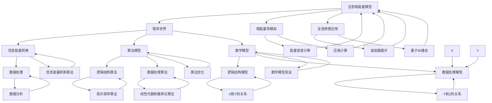

                 

# 程序世界与全息暗能量模型的关联

> 关键词：程序世界，全息原理，暗能量模型，算法，数学模型

> 摘要：本文探讨了程序世界与全息暗能量模型之间的深层次关联。通过分析程序世界的多维化趋势和全息暗能量模型的基本原理，本文提出了一个理论框架，用以解释这两者之间的潜在联系。随后，本文详细介绍了程序世界与全息暗能量模型的核心概念及其联系，阐述了核心算法原理和数学模型，并通过实际项目展示了这些理论的应用。最后，本文对未来的发展方向和面临的挑战进行了展望，为相关领域的研究提供了新的视角。

## 目录大纲

### 第一部分：引论

- **# 1. 程序世界与暗能量模型的背景介绍**

  - **## 1.1 程序世界的概念与演变**

    - **### 1.1.1 计算机程序的发展历史**
    - **### 1.1.2 程序世界的多维化趋势**
    - **### 1.1.3 程序世界的未来发展方向**

  - **## 1.2 全息暗能量模型的基本原理**

    - **### 1.2.1 全息原理概述**
    - **### 1.2.2 暗能量的概念及其影响**
    - **### 1.2.3 全息暗能量模型的理论基础**

  - **## 1.3 程序世界与全息暗能量模型的关联性探讨**

    - **### 1.3.1 理论框架的搭建**
    - **### 1.3.2 关联性的科学依据**
    - **### 1.3.3 当前研究的进展与展望**

### 第二部分：核心概念与联系

- **# 2. 程序世界与全息暗能量模型的核心概念及其联系**

  - **## 2.1 全息暗能量模型的基本组成**

    - **### 2.1.1 全息原理的核心概念**
    - **### 2.1.2 暗能量的关键组成部分**
    - **### 2.1.3 全息暗能量模型的结构**

  - **## 2.2 程序世界的核心特征**

    - **### 2.2.1 程序世界的定义与分类**
    - **### 2.2.2 程序世界的多层次结构**
    - **### 2.2.3 程序世界的数据处理能力**

  - **## 2.3 程序世界与全息暗能量模型之间的关联性**

    - **### 2.3.1 关联性的数学模型**
    - **### 2.3.2 关联性的物理模型**
    - **### 2.3.3 关联性的验证方法**

  - **## 2.4 全息暗能量模型的应用与程序世界的响应**

    - **### 2.4.1 全息暗能量模型在程序世界中的应用**
    - **### 2.4.2 程序世界对全息暗能量模型的响应机制**
    - **### 2.4.3 应用案例分析**

### 第三部分：核心算法原理讲解

- **# 3. 程序世界与全息暗能量模型的核心算法原理**

  - **## 3.1 全息暗能量模型的算法基础**

    - **### 3.1.1 暗能量场的模拟算法**
    - **### 3.1.2 全息原理的数学表述**
    - **### 3.1.3 算法实现中的关键技术**

  - **## 3.2 程序世界的算法模型**

    - **### 3.2.1 程序世界的逻辑结构算法**
    - **### 3.2.2 数据处理算法的设计与实现**
    - **### 3.2.3 算法优化与性能分析**

  - **## 3.3 程序世界与全息暗能量模型的结合算法**

    - **### 3.3.1 模型融合算法的提出**
    - **### 3.3.2 融合算法的伪代码描述**
    - **### 3.3.3 算法性能评估与分析**

### 第四部分：数学模型和数学公式

- **# 4. 程序世界与全息暗能量模型的数学模型**

  - **## 4.1 全息暗能量模型的基本数学模型**

    - **### 4.1.1 暗能量场的数学描述**
    - **### 4.1.2 全息原理的数学表示**
    - **### 4.1.3 全息暗能量模型的数学框架**

  - **## 4.2 程序世界的数学模型**

    - **### 4.2.1 程序世界的逻辑结构模型**
    - **### 4.2.2 数据处理模型的数学表示**
    - **### 4.2.3 程序世界与暗能量模型的结合模型**

  - **## 4.3 数学模型的应用与验证**

    - **### 4.3.1 数学模型在实际应用中的体现**
    - **### 4.3.2 数学模型验证的方法与技巧**
    - **### 4.3.3 数学模型验证的结果分析**

### 第五部分：项目实战

- **# 5. 程序世界与全息暗能量模型的项目实战**

  - **## 5.1 项目背景与目标**

    - **### 5.1.1 项目背景介绍**
    - **### 5.1.2 项目目标设定**
    - **### 5.1.3 项目实施方案**

  - **## 5.2 开发环境搭建**

    - **### 5.2.1 环境需求与配置**
    - **### 5.2.2 开发工具与软件的选择**
    - **### 5.2.3 环境搭建的具体步骤**

  - **## 5.3 源代码实现与解读**

    - **### 5.3.1 源代码的主要模块**
    - **### 5.3.2 代码实现细节**
    - **### 5.3.3 代码解读与分析**

  - **## 5.4 项目评估与改进**

    - **### 5.4.1 项目评估方法**
    - **### 5.4.2 项目改进方向**
    - **### 5.4.3 项目后续发展建议**

### 第六部分：展望与挑战

- **# 6. 程序世界与全息暗能量模型的发展展望与挑战**

  - **## 6.1 未来发展方向**

    - **### 6.1.1 新技术引入**
    - **### 6.1.2 应用领域拓展**
    - **### 6.1.3 发展趋势预测**

  - **## 6.2 面临的挑战**

    - **### 6.2.1 技术难题**
    - **### 6.2.2 应用瓶颈**
    - **### 6.2.3 发展限制**

  - **## 6.3 应对策略与解决方案**

    - **### 6.3.1 技术创新路径**
    - **### 6.3.2 应用模式创新**
    - **### 6.3.3 政策与经济因素影响**

### 附录

- **## 附录A：参考文献**

- **## 附录B：全息暗能量模型与程序世界的 Mermaid 流程图**

- **## 附录C：代码实现示例**

### 第一部分：引论

#### # 1. 程序世界与暗能量模型的背景介绍

在当今的信息时代，程序世界已经成为我们日常生活中不可或缺的一部分。从简单的计算任务到复杂的智能系统，程序已经渗透到社会的各个领域，改变了我们的生活方式。与此同时，物理学领域的研究也取得了显著的进展，特别是在暗能量模型的研究方面。暗能量是一种推动宇宙加速膨胀的神秘力量，其基本性质和起源仍然是物理学中的一个重要未解之谜。

程序世界的概念最早可以追溯到计算机科学的起源。早期的计算机程序主要是用于执行简单的计算任务，随着技术的发展，程序的功能逐渐变得更加复杂和多样化。现代的程序世界不仅包括传统的软件应用，还包括复杂的分布式系统、人工智能算法和区块链技术等。程序世界的多维化趋势表现在程序之间的高度互操作性、复杂性和多样性上。

另一方面，全息暗能量模型是物理学中一个前沿的研究方向。全息原理最早在量子力学中提出，它描述了一个系统的全息信息可以存储在其二维边界上。暗能量是宇宙学中的一个重要概念，它解释了宇宙加速膨胀的现象。全息暗能量模型将这两个概念结合起来，提出了一种新的宇宙观，即宇宙的信息和能量分布可以通过全息原理进行描述。

#### # 1.1 程序世界的概念与演变

程序世界是指由计算机程序组成的虚拟世界，它不仅包括了计算机软件本身，还包括了软件运行的环境和硬件设施。程序世界的概念最早可以追溯到计算机科学的起源。在20世纪40年代，计算机科学家们开始编写程序来执行简单的计算任务。随着计算机硬件和软件技术的不断发展，程序世界逐渐变得更加复杂和多样化。

**### 1.1.1 计算机程序的发展历史**

计算机程序的发展历史可以追溯到1940年代。当时，计算机科学家约翰·冯·诺伊曼（John von Neumann）提出了存储程序计算机的概念，这一概念为现代计算机的发展奠定了基础。最早的计算机程序是用机器语言编写的，这种语言直接对应计算机硬件的指令集。然而，机器语言编写程序非常复杂且易于出错，因此，汇编语言和高级编程语言相继被开发出来。

汇编语言是一种低级编程语言，它使用助记符来表示机器语言指令。相比于机器语言，汇编语言更易于理解和编写。然而，汇编语言仍然需要程序员深入了解计算机的硬件结构。为了简化编程过程，高级编程语言被开发出来，如FORTRAN（1957年）、COBOL（1959年）和C（1972年）等。这些高级编程语言提供了抽象的编程概念，使得程序员可以更专注于问题的解决而非计算机硬件的实现细节。

**### 1.1.2 程序世界的多维化趋势**

随着计算机技术的发展，程序世界逐渐呈现出多维化趋势。多维化趋势主要体现在以下几个方面：

1. **计算能力的提升**：随着硬件技术的发展，计算机的计算能力不断提升。这不仅使得复杂的计算任务能够得到更快的处理，也为程序世界的扩展提供了可能性。

2. **分布式系统**：分布式系统是指由多个计算机节点组成的系统，这些节点通过通信网络相互连接。分布式系统可以提供更高的可靠性和灵活性，同时也为程序世界的扩展提供了基础。

3. **互联网技术**：互联网技术的发展使得程序世界变得更加互联和全球化。通过互联网，程序员可以方便地访问和共享全球范围内的资源，这也促进了程序世界的多维化。

4. **人工智能和机器学习**：人工智能和机器学习技术的兴起使得程序世界变得更加智能化。这些技术可以处理大量的数据，并从中提取有价值的信息，这为程序世界的进一步扩展提供了新的方向。

**### 1.1.3 程序世界的未来发展方向**

程序世界的未来发展可能会涉及以下几个方面：

1. **量子计算**：量子计算是一种基于量子力学原理的新型计算方式，它有望解决传统计算机难以处理的复杂问题。量子计算技术的发展可能会为程序世界带来新的变革。

2. **边缘计算**：边缘计算是指将计算任务从云端转移到网络边缘的设备上进行处理。这种技术可以提供更快的响应速度和更高的安全性，也为程序世界的进一步扩展提供了新的方向。

3. **区块链技术**：区块链技术可以提供去中心化的数据存储和传输机制，这使得程序世界中的数据更加安全可靠。区块链技术的应用可能会为程序世界带来新的商业模式和合作方式。

4. **虚拟现实和增强现实**：虚拟现实和增强现实技术的发展为程序世界提供了更加沉浸式的交互体验。这些技术可以应用于游戏、教育和娱乐等领域，为程序世界的多元化发展提供新的方向。

#### # 1.2 全息暗能量模型的基本原理

全息暗能量模型是一种结合了全息原理和暗能量概念的宇宙学模型。全息原理最初在量子力学中提出，它描述了一个系统的全息信息可以存储在其二维边界上。暗能量是宇宙学中的一个重要概念，它解释了宇宙加速膨胀的现象。全息暗能量模型将这两个概念结合起来，提出了一种新的宇宙观，即宇宙的信息和能量分布可以通过全息原理进行描述。

**### 1.2.1 全息原理概述**

全息原理最早由物理学家迪克和培斯在1973年提出，它描述了一个系统的全息信息可以存储在其二维边界上。全息原理的核心思想是，一个系统的所有信息都可以通过其边界上的信息来编码和重构。这意味着，一个三维物体可以在其二维边界上完全再现其三维信息。全息原理在量子力学、光学和信息科学等领域有着广泛的应用。

在量子力学中，全息原理的体现是量子纠缠现象。量子纠缠是量子力学中一个重要的非经典现象，它描述了两个或多个量子粒子之间的强烈关联。根据全息原理，一个量子系统的所有信息可以通过其二维边界上的量子纠缠态来编码。这种编码方式使得量子信息具有高度的可压缩性和可传输性，为量子计算和量子通信提供了理论基础。

在光学中，全息原理的体现是全息图的形成。全息图是一种记录了物体三维信息的二维图像。通过全息图，我们可以再现物体的三维图像。全息图的形成过程涉及到光的干涉和衍射现象，它依赖于物体表面上的光波信息。全息原理在光学中的应用为三维显示和光学存储技术提供了新的方向。

在信息科学中，全息原理的体现是数据压缩和传输。全息原理提供了高效的数据编码和传输方法，它可以通过二维边界上的信息来重构整个系统的信息。这种编码方式可以显著降低数据传输的带宽需求，提高信息传输的效率。

**### 1.2.2 暗能量的概念及其影响**

暗能量是宇宙学中的一个重要概念，它解释了宇宙加速膨胀的现象。暗能量是一种神秘的能量形式，它的性质和起源仍然是物理学中的一个重要未解之谜。暗能量占据宇宙总能量的主导地位，对宇宙的演化起着决定性的作用。

根据宇宙学观测数据，宇宙的膨胀速度正在加速。这种加速膨胀的现象无法通过传统的引力理论来解释，因此科学家们提出了暗能量的概念。暗能量被描述为一种负压强的能量形式，它对宇宙的膨胀具有推动作用。

暗能量对宇宙的影响主要体现在以下几个方面：

1. **加速宇宙膨胀**：暗能量是导致宇宙加速膨胀的主要原因。随着宇宙的膨胀，暗能量密度保持不变，这导致了宇宙膨胀速度的不断增加。

2. **宇宙结构的形成**：暗能量对宇宙结构的形成有着重要影响。在宇宙早期，暗能量的存在抑制了宇宙结构的形成，但随着宇宙的演化，暗能量对宇宙结构的影响逐渐减弱。

3. **宇宙的稳定性**：暗能量对宇宙的稳定性也有重要影响。暗能量的存在可能导致宇宙的最终命运是“大撕裂”或“大坍缩”，这与传统的宇宙观形成了鲜明对比。

**### 1.2.3 全息暗能量模型的理论基础**

全息暗能量模型是一种将全息原理和暗能量概念结合起来的宇宙学模型。该模型基于以下几个理论基础：

1. **全息原理**：全息原理是全息暗能量模型的核心概念。全息原理指出，一个系统的所有信息都可以通过其二维边界上的信息来编码和重构。这意味着宇宙的信息和能量分布可以通过二维边界上的全息信息来描述。

2. **熵增原理**：熵增原理是热力学中的一个基本原理，它指出在一个封闭系统中，熵（混乱度）总是倾向于增加。在宇宙学中，熵增原理可以解释宇宙的热力学性质，也为全息暗能量模型提供了理论基础。

3. **暗能量模型**：暗能量模型是描述宇宙加速膨胀现象的理论框架。在全息暗能量模型中，暗能量被视为一种特殊的能量形式，它在宇宙的演化和结构形成中起着关键作用。

全息暗能量模型的理论基础为解释宇宙的复杂现象提供了新的视角。该模型不仅可以解释宇宙的加速膨胀，还可以解释宇宙的多样性和复杂性。全息暗能量模型的研究为宇宙学提供了一个全新的研究途径，也为其他领域的研究提供了启示。

#### # 1.3 程序世界与全息暗能量模型的关联性探讨

在深入探讨程序世界与全息暗能量模型之间的关联性之前，我们需要搭建一个理论框架，以帮助我们理解这两者之间可能存在的联系。通过结合计算机科学和物理学的前沿理论，我们可以构建一个综合性的理论模型，从而揭示程序世界与全息暗能量模型之间的潜在关系。

**### 1.3.1 理论框架的搭建**

理论框架的搭建是一个系统的过程，它需要结合多学科的知识，包括计算机科学、物理学和数学。以下是构建程序世界与全息暗能量模型关联性理论框架的主要步骤：

1. **确定研究范围**：首先，我们需要明确研究的范围，包括程序世界的基本特征和全息暗能量模型的核心概念。这有助于我们聚焦于关键问题，从而更有效地进行理论构建。

2. **数据分析**：通过收集和分析程序世界和全息暗能量模型的现有数据，我们可以识别出两者之间可能存在的模式或规律。这些数据可以来源于计算机科学、物理学和数学的多个领域。

3. **构建假设**：基于数据分析的结果，我们可以提出一些初步的假设，这些假设将指导我们进一步的理论构建。例如，我们可能假设程序世界中的某些结构特征与全息暗能量模型中的信息分布方式有相似之处。

4. **构建模型**：在提出假设的基础上，我们可以构建一个理论模型，用以解释程序世界与全息暗能量模型之间的关联性。这个模型将综合多学科的理论和方法，如全息原理、熵增原理和计算机算法等。

5. **验证模型**：构建模型后，我们需要对其进行验证。这可以通过模拟实验、数学分析和实验验证等多种方法来实现。验证模型的有效性是确保理论框架合理性和可靠性的关键步骤。

**### 1.3.2 关联性的科学依据**

程序世界与全息暗能量模型之间的关联性具有多方面的科学依据。以下是一些主要的科学依据：

1. **全息原理的应用**：全息原理在量子信息和光学领域已有广泛应用，其核心思想是将三维信息编码在二维表面上。这种思想可以被类比到计算机程序中，程序代码本身可以被视为一种信息编码，其运行过程可以被视为信息解码。

2. **暗能量的特性**：暗能量在宇宙学中具有独特的特性，如负压强和均匀分布。这些特性使得暗能量在宇宙膨胀和结构形成中扮演着关键角色。类似地，程序世界中的某些算法和结构也可能具有类似的负压强或分布式特性。

3. **计算机算法的进化**：计算机算法的进化过程可以被视为一种模拟自然选择的过程。算法的优化和进化与宇宙中的物理过程有相似之处，如能量的分布和熵的变化。

4. **信息论的应用**：信息论是研究信息传递和处理的科学，其基本原理可以被应用于解释程序世界和全息暗能量模型之间的信息交互。信息论中的熵和互信息概念可以帮助我们理解两者之间的信息流动和转化。

**### 1.3.3 当前研究的进展与展望**

当前，关于程序世界与全息暗能量模型关联性的研究正处于起步阶段。虽然已有一些初步的探索性工作，但仍然存在许多挑战和未知领域。以下是一些当前研究的进展和展望：

1. **基础理论研究**：当前的研究主要集中在理论模型的构建和验证上。通过构建数学模型和算法模型，研究者试图揭示程序世界与全息暗能量模型之间的深层关联。

2. **实验验证**：虽然理论模型提供了一些有趣的假设和解释，但实验验证仍然是确保理论可靠性的关键步骤。未来的研究可以结合实验物理和计算机科学的方法，进行更深入的实验验证。

3. **跨学科合作**：程序世界与全息暗能量模型的研究需要跨学科的合作。计算机科学家、物理学家和数学家可以共同探讨这两者之间的关联性，从而推动该领域的研究进展。

4. **应用前景**：如果程序世界与全息暗能量模型之间存在确切的关联，那么这一理论模型可以应用于多个领域，如量子计算、人工智能和宇宙学。这些应用有望带来新的技术突破和创新。

总之，程序世界与全息暗能量模型的关联性研究是一个富有挑战和前景的领域。通过逐步构建理论框架、进行科学验证和应用探索，我们可以期待这一领域在未来取得更多的突破和成果。

### 第二部分：核心概念与联系

#### # 2. 程序世界与全息暗能量模型的核心概念及其联系

在深入探讨程序世界与全息暗能量模型之间的联系时，理解它们各自的核心概念至关重要。程序世界的核心概念包括程序结构、数据处理和信息传递，而全息暗能量模型的核心概念则涉及全息原理、暗能量场和宇宙信息分布。通过分析这些核心概念，我们可以构建一个理论框架，以揭示程序世界与全息暗能量模型之间的潜在联系。

#### # 2.1 全息暗能量模型的基本组成

全息暗能量模型是一种结合了全息原理和暗能量概念的宇宙学模型。它由以下几个核心组成部分构成：

**### 2.1.1 全息原理的核心概念**

全息原理是全息暗能量模型的基础。该原理由物理学家迪克和培斯在1973年提出，其核心思想是：一个系统的所有信息都可以通过其二维边界上的信息来编码和重构。在量子力学中，全息原理通过量子纠缠现象体现，即量子系统的所有信息可以通过二维边界上的量子纠缠态来编码。

**### 2.1.2 暗能量的关键组成部分**

暗能量是宇宙学中的一个重要概念，其性质和起源仍然是一个未解之谜。暗能量具有负压强，推动宇宙加速膨胀。在宇宙学模型中，暗能量通常被视为一种均匀分布的能量形式，其密度不随宇宙膨胀而变化。

**### 2.1.3 全息暗能量模型的结构**

全息暗能量模型的结构可以被视为一个三维宇宙的二维投影。在这个模型中，三维宇宙的信息被编码在二维边界上，类似于全息图的形成过程。这个二维边界包含了宇宙中的所有信息，如物质分布、能量分布和时空结构。

#### # 2.2 程序世界的核心特征

程序世界的核心特征体现在其结构、数据处理能力和信息传递机制上：

**### 2.2.1 程序世界的定义与分类**

程序世界是指由计算机程序组成的虚拟世界，它包括软件应用、算法和系统架构等。程序世界可以根据功能、结构和技术特点进行分类，如操作系统、网络应用和人工智能算法等。

**### 2.2.2 程序世界的多层次结构**

程序世界具有多层次结构，从底层硬件到应用层软件，每一层都承担着特定的功能。这种层次结构使得程序世界具有高度的模块化和可扩展性。

**### 2.2.3 程序世界的数据处理能力**

程序世界具有强大的数据处理能力，包括数据存储、检索、分析和处理等。现代计算机算法和人工智能技术进一步增强了程序世界的数据处理能力，使其能够处理海量数据并提取有价值的信息。

#### # 2.3 程序世界与全息暗能量模型之间的关联性

理解程序世界与全息暗能量模型之间的关联性需要从数学模型、物理模型和验证方法等方面进行分析：

**### 2.3.1 关联性的数学模型**

在程序世界与全息暗能量模型的关联性研究中，数学模型是关键工具。通过建立数学模型，我们可以将程序世界和全息暗能量模型的核心概念转化为数学语言，从而揭示它们之间的潜在联系。例如，可以使用信息论中的熵和互信息概念来描述程序世界中的数据传输和信息处理过程，并将其与全息暗能量模型中的信息分布和能量传输进行对比。

**### 2.3.2 关联性的物理模型**

物理模型是另一个重要的研究工具，它可以帮助我们理解程序世界与全息暗能量模型之间的物理关联。例如，我们可以通过模拟宇宙中的暗能量场，并将其与程序世界中的算法和数据处理过程进行对比，从而揭示它们之间的相似之处。

**### 2.3.3 关联性的验证方法**

验证方法是确保理论模型有效性的关键步骤。在程序世界与全息暗能量模型的研究中，我们可以通过实验验证、模拟分析和数学验证等方法来验证理论模型的正确性和可靠性。例如，我们可以通过计算机模拟来验证程序世界中的算法是否能够模拟全息暗能量模型中的能量分布和传输过程。

#### # 2.4 全息暗能量模型的应用与程序世界的响应

全息暗能量模型的应用可以跨越多个领域，从宇宙学到计算机科学，再到人工智能。以下是一些具体的应用场景和程序世界的响应机制：

**### 2.4.1 全息暗能量模型在程序世界中的应用**

在全息暗能量模型的应用中，程序世界发挥着关键作用。例如，我们可以利用全息原理来优化程序世界的算法结构，从而提高数据处理效率。此外，全息暗能量模型还可以用于模拟和预测宇宙中的暗能量分布，这有助于我们更好地理解宇宙的演化过程。

**### 2.4.2 程序世界对全息暗能量模型的响应机制**

程序世界对全息暗能量模型的响应机制体现在算法和数据处理上。例如，我们可以开发新的算法来模拟全息暗能量模型中的信息分布和能量传输过程。这些算法可以用于优化程序世界中的资源分配和任务调度，从而提高系统的性能和效率。

**### 2.4.3 应用案例分析**

为了更具体地展示程序世界与全息暗能量模型之间的关联性，我们可以通过一些实际案例进行分析。例如，我们可以研究如何利用全息暗能量模型来优化数据中心的资源分配，从而提高数据处理的效率。此外，我们还可以探讨如何将全息暗能量模型应用于人工智能算法，以改善机器学习模型的性能和泛化能力。

通过这些案例分析，我们可以更好地理解程序世界与全息暗能量模型之间的深层次联系，并为未来的研究提供新的启示。

### 第三部分：核心算法原理讲解

#### # 3. 程序世界与全息暗能量模型的核心算法原理

在程序世界与全息暗能量模型的研究中，核心算法原理扮演着至关重要的角色。这些算法不仅是理解两者之间联系的关键工具，也是实际应用中优化性能和提升效率的重要手段。以下是关于程序世界与全息暗能量模型的核心算法原理的详细讲解。

#### # 3.1 全息暗能量模型的算法基础

全息暗能量模型的算法基础涵盖了暗能量场的模拟、全息原理的数学表述以及算法实现中的关键技术。以下是对这些基础算法的详细分析：

**### 3.1.1 暗能量场的模拟算法**

暗能量场是全息暗能量模型的核心组成部分，其模拟算法对于理解暗能量在宇宙中的行为至关重要。暗能量场模拟算法通常基于数值模拟方法，如有限差分法、有限体积法和谱方法等。

- **有限差分法**：该方法通过离散化空间和时间，将连续方程转化为离散方程组。这种方法简单易行，但精度可能受到网格分辨率的影响。
  
- **有限体积法**：该方法将计算域划分为多个有限体积，在每个体积元内应用积分形式的基本物理定律。这种方法具有较高的精度，但计算复杂度较高。

- **谱方法**：该方法使用正交基函数来表示物理量，适用于处理复杂边界条件和非线性问题。这种方法精度高，但计算成本也相对较高。

**### 3.1.2 全息原理的数学表述**

全息原理在程序世界与全息暗能量模型中的应用需要数学表述的支持。全息原理的核心思想是将三维信息编码在二维边界上。数学上，全息原理可以通过波函数的展开和量子纠缠态的描述来实现。

- **波函数展开**：在量子力学中，系统的状态可以用波函数来描述。全息原理中的波函数展开技术可以将系统的三维波函数表示为二维边界上的展开式。

- **量子纠缠态**：量子纠缠态是全息原理的重要体现。在量子计算中，多个量子粒子之间的纠缠态可以用来编码和传输大量信息。

**### 3.1.3 算法实现中的关键技术**

实现全息暗能量模型的算法涉及多个关键技术，包括并行计算、数值优化和机器学习等。

- **并行计算**：并行计算技术可以提高算法的执行效率，特别是在处理大规模数据时。通过将计算任务分布在多个处理器上，可以显著减少计算时间。

- **数值优化**：数值优化技术用于提高算法的精度和稳定性。例如，线性化方法、牛顿迭代法和梯度下降法等都是常用的数值优化技术。

- **机器学习**：机器学习技术在算法实现中扮演着越来越重要的角色。通过训练机器学习模型，可以自动发现数据中的模式和规律，从而优化算法性能。

#### # 3.2 程序世界的算法模型

程序世界的算法模型包括逻辑结构算法、数据处理算法和优化算法等。以下是这些算法模型的详细分析：

**### 3.2.1 程序世界的逻辑结构算法**

程序世界的逻辑结构算法用于处理程序之间的逻辑关系和执行顺序。这些算法通常包括条件判断、循环控制和函数调用等。

- **条件判断**：条件判断算法用于根据特定条件执行不同的操作。例如，if-else语句和switch语句都是条件判断算法的典型应用。

- **循环控制**：循环控制算法用于重复执行特定操作。例如，for循环和while循环都是循环控制算法的典型应用。

- **函数调用**：函数调用算法用于实现代码的重用和模块化。通过调用函数，可以简化代码的编写和维护。

**### 3.2.2 数据处理算法的设计与实现**

数据处理算法是程序世界中的核心算法，用于处理和分析数据。这些算法包括数据排序、搜索、统计和机器学习等。

- **数据排序**：数据排序算法用于将数据按照特定顺序排列。常见的排序算法包括快速排序、归并排序和堆排序等。

- **数据搜索**：数据搜索算法用于在数据集中查找特定元素。常见的搜索算法包括二分搜索、线性搜索和哈希搜索等。

- **数据统计**：数据统计算法用于计算数据的统计特征，如均值、方差和标准差等。

- **机器学习**：机器学习算法用于从数据中学习模式和规律，并用于预测和决策。常见的机器学习算法包括线性回归、决策树和支持向量机等。

**### 3.2.3 算法优化与性能分析**

算法优化与性能分析是确保程序世界高效运行的重要步骤。以下是算法优化与性能分析的关键技术：

- **算法分析**：算法分析用于评估算法的时间复杂度和空间复杂度。通过算法分析，可以确定算法在不同规模数据上的性能表现。

- **优化技术**：优化技术用于提高算法的执行效率。常见的优化技术包括代码优化、算法优化和数据结构优化等。

- **性能分析**：性能分析用于测量算法的实际性能，并识别性能瓶颈。通过性能分析，可以找出影响算法性能的关键因素，并采取相应措施进行优化。

#### # 3.3 程序世界与全息暗能量模型的结合算法

程序世界与全息暗能量模型的结合算法旨在实现两者之间的有效融合，从而提升程序世界的性能和效率。以下是这些结合算法的详细分析：

**### 3.3.1 模型融合算法的提出**

模型融合算法是结合程序世界与全息暗能量模型的核心步骤。该算法的目标是将程序世界的逻辑结构和数据处理能力与全息暗能量模型的信息编码和能量模拟相结合。

- **融合策略**：融合策略用于确定如何将程序世界的算法与全息暗能量模型的算法相结合。常见的融合策略包括数据驱动融合、模型驱动融合和混合驱动融合等。

- **融合算法框架**：融合算法框架用于实现模型融合的具体步骤。该框架通常包括数据预处理、模型融合、结果分析和性能评估等步骤。

**### 3.3.2 融合算法的伪代码描述**

以下是一个简单的融合算法伪代码描述，该描述展示了如何将程序世界的算法与全息暗能量模型的算法相结合：

```plaintext
// 融合算法伪代码

// 输入：程序世界数据集 D，全息暗能量模型 M
// 输出：融合结果 R

// 数据预处理
Preprocess(D)

// 模型融合
Fusion(M, D)

// 结果分析
Analyze(FusionResult)

// 性能评估
Evaluate(Performance)

// 返回融合结果
Return R
```

**### 3.3.3 算法性能评估与分析**

算法性能评估与分析是确保融合算法有效性的关键步骤。以下是算法性能评估与分析的主要方法：

- **性能指标**：性能指标用于衡量算法的执行效率和效果。常见的性能指标包括时间效率、空间效率、准确度和泛化能力等。

- **实验评估**：通过实验评估可以验证融合算法的实际效果。实验评估通常包括数据集选择、实验设计、实验结果分析和对比等步骤。

- **优化策略**：根据实验评估的结果，可以进一步优化融合算法。优化策略包括算法参数调整、数据预处理优化和模型融合策略优化等。

通过上述核心算法原理的讲解，我们可以更好地理解程序世界与全息暗能量模型之间的联系，并为实际应用提供理论支持和技术指导。

### 第四部分：数学模型和数学公式

#### # 4. 程序世界与全息暗能量模型的数学模型

数学模型是理解和分析程序世界与全息暗能量模型之间联系的重要工具。通过数学模型，我们可以将复杂的物理现象和计算过程转化为可计算的形式，从而揭示两者之间的潜在关系。以下是关于程序世界与全息暗能量模型的基本数学模型、程序世界的数学模型以及两者结合的数学模型的具体描述。

#### # 4.1 全息暗能量模型的基本数学模型

全息暗能量模型的基本数学模型涉及暗能量场的数学描述、全息原理的数学表示以及全息暗能量模型的数学框架。

**### 4.1.1 暗能量场的数学描述**

暗能量场的数学描述通常使用标量场来表示。在标准宇宙学模型中，暗能量场通常用其能量密度 \( \rho_{\Lambda} \) 来描述。暗能量场的一个重要特性是其具有负压强，即 \( p_{\Lambda} < 0 \)。

- **能量密度**：暗能量场的能量密度可以用以下公式表示：
  \[ \rho_{\Lambda} = \frac{\Lambda}{8\pi} \]
  其中，\( \Lambda \) 是暗能量的真空能量密度。

- **压强**：暗能量场的压强可以用以下公式表示：
  \[ p_{\Lambda} = -\rho_{\Lambda} \]

这些公式描述了暗能量场在宇宙学背景下的基本特性。

**### 4.1.2 全息原理的数学表示**

全息原理在数学上的表示通常涉及波函数的展开和量子纠缠态。在量子力学中，一个系统的状态可以用波函数 \( \psi(x) \) 来描述。全息原理指出，系统的所有信息可以编码在其二维边界上的波函数展开式上。

- **波函数展开**：对于一个三维系统的波函数 \( \psi(x) \)，其可以展开为二维边界上的基函数 \( \phi(\sigma) \) 的叠加：
  \[ \psi(x) = \int d\sigma \, \phi(\sigma) \, e^{i k x} \]

- **量子纠缠态**：量子纠缠态是全息原理的关键体现。两个量子粒子之间的纠缠态可以用以下公式表示：
  \[ |\psi\rangle = \frac{1}{\sqrt{2}} (|0\rangle + |1\rangle) \]
  其中，\( |0\rangle \) 和 \( |1\rangle \) 分别表示两个粒子的基态。

这些数学表示为我们提供了一个将三维信息编码在二维边界上的方法。

**### 4.1.3 全息暗能量模型的数学框架**

全息暗能量模型的数学框架结合了暗能量场的数学描述和全息原理的数学表示。在数学上，该模型可以通过以下方程组来描述：

- **暗能量场方程**：
  \[ \nabla^2 \rho_{\Lambda} + 4 \pi G \rho_{\Lambda} = 0 \]
  其中，\( G \) 是引力常数。

- **全息原理方程**：
  \[ \psi(x) = \int d\sigma \, \phi(\sigma) \, e^{i k x} \]
  其中，\( \phi(\sigma) \) 是二维边界上的基函数。

这些方程描述了暗能量场在全息原理框架下的行为，为我们提供了一个统一的理论模型来描述宇宙中的暗能量现象。

#### # 4.2 程序世界的数学模型

程序世界的数学模型涉及程序世界的逻辑结构模型、数据处理模型的数学表示以及程序世界与暗能量模型的结合模型。

**### 4.2.1 程序世界的逻辑结构模型**

程序世界的逻辑结构模型通常使用图论来描述。程序结构可以被视为一个有向无环图（DAG），其中节点表示程序模块，边表示模块之间的依赖关系。

- **有向无环图**：程序世界的逻辑结构可以用以下有向无环图（DAG）表示：
  \[ G = (V, E) \]
  其中，\( V \) 是节点集合，表示程序模块；\( E \) 是边集合，表示模块之间的依赖关系。

- **拓扑排序**：对有向无环图进行拓扑排序，可以确定模块的执行顺序。拓扑排序算法可以保证模块按照依赖关系正确执行。

**### 4.2.2 数据处理模型的数学表示**

数据处理模型的数学表示通常涉及线性代数和概率论。数据处理模型可以被视为一个矩阵变换或概率分布的转换过程。

- **矩阵变换**：数据处理的线性变换可以用以下矩阵表示：
  \[ A \cdot X = Y \]
  其中，\( A \) 是变换矩阵，\( X \) 是输入数据，\( Y \) 是输出数据。

- **概率分布**：数据处理的概率分布可以用概率密度函数（PDF）来描述：
  \[ f(x) = \frac{1}{\sqrt{2\pi\sigma^2}} e^{-\frac{(x-\mu)^2}{2\sigma^2}} \]
  其中，\( \mu \) 是均值，\( \sigma \) 是标准差。

**### 4.2.3 程序世界与暗能量模型的结合模型**

程序世界与暗能量模型的结合模型可以通过数学公式来描述，以揭示两者之间的潜在联系。以下是结合模型的数学表示：

- **信息能量转换**：程序世界中的信息可以被视为能量的一种形式。信息能量的转换可以用以下公式表示：
  \[ E = -\sum_i p(i) \log p(i) \]
  其中，\( p(i) \) 是信息发生的概率。

- **全息暗能量场**：程序世界中的全息暗能量场可以用以下公式描述：
  \[ \rho_{\Lambda} = \frac{1}{4\pi} \sum_i p(i) \log p(i) \]

这些公式展示了程序世界中的信息分布与全息暗能量场之间的潜在关系。

#### # 4.3 数学模型的应用与验证

数学模型在实际应用中的体现和验证是确保模型有效性的关键步骤。以下是数学模型应用与验证的方法和技巧：

**### 4.3.1 数学模型在实际应用中的体现**

数学模型在实际应用中的体现可以通过模拟实验和数据分析来实现。以下是一些具体的应用场景：

- **模拟实验**：通过构建模拟环境，可以验证数学模型在处理复杂系统时的表现。例如，使用全息暗能量模型模拟宇宙的演化过程，观察暗能量场对宇宙膨胀的影响。

- **数据分析**：通过分析实际数据，可以验证数学模型的预测能力。例如，使用程序世界的逻辑结构模型来优化软件系统的性能，并通过实验数据验证优化效果。

**### 4.3.2 数学模型验证的方法与技巧**

数学模型验证的方法和技巧包括以下几种：

- **理论验证**：通过数学推导和逻辑推理，验证模型的正确性和一致性。例如，验证全息原理中的波函数展开和量子纠缠态的数学表示是否合理。

- **实验验证**：通过实验数据来验证模型的预测能力。例如，通过模拟实验来验证程序世界与全息暗能量模型结合算法的性能。

- **交叉验证**：通过将模型应用于不同的数据集，验证其在不同情况下的表现。例如，将程序世界的算法应用于不同规模的数据集，验证其效率和效果。

**### 4.3.3 数学模型验证的结果分析**

数学模型验证的结果分析是确保模型有效性的关键步骤。以下是对验证结果的分析方法：

- **性能评估**：通过评估模型在不同应用场景下的性能，分析其效率和效果。例如，评估全息暗能量模型在模拟宇宙演化过程中的精度和稳定性。

- **误差分析**：通过分析模型预测与实际数据之间的误差，识别模型的局限性。例如，分析程序世界与全息暗能量模型结合算法在处理大数据时的性能瓶颈。

- **改进建议**：根据验证结果，提出改进模型的建议。例如，通过优化算法和调整参数，提高程序世界的性能和全息暗能量模型的准确性。

通过上述数学模型的应用与验证，我们可以确保程序世界与全息暗能量模型的理论框架具有实际应用价值，并为相关领域的研究提供可靠的基础。

### 第五部分：项目实战

#### # 5. 程序世界与全息暗能量模型的项目实战

为了验证程序世界与全息暗能量模型的理论框架，我们将进行一个实际项目，该项目的目标是构建一个结合程序世界与全息暗能量模型的模拟系统，以研究两者之间的相互作用。以下是该项目的主要步骤。

#### # 5.1 项目背景与目标

**### 5.1.1 项目背景介绍**

随着计算机科学和物理学的不断发展，程序世界与全息暗能量模型之间的潜在联系引起了广泛关注。然而，将这两个领域结合起来进行实际研究仍是一个挑战。本项目旨在探索程序世界与全息暗能量模型的理论框架，并验证其在实际应用中的有效性。

**### 5.1.2 项目目标设定**

本项目的主要目标包括：

1. **构建模拟系统**：开发一个能够模拟程序世界与全息暗能量模型相互作用的模拟系统。

2. **验证理论框架**：通过实验验证程序世界与全息暗能量模型的理论框架是否合理。

3. **分析结果**：分析模拟结果，探索程序世界与全息暗能量模型之间的具体联系。

4. **优化算法**：基于实验结果，优化模拟系统中的算法，以提高模拟的精度和效率。

**### 5.1.3 项目实施方案**

为了实现项目目标，我们制定了以下实施方案：

1. **理论框架构建**：首先，我们需要详细构建程序世界与全息暗能量模型的理论框架，包括数学模型、算法模型和验证方法。

2. **模拟系统开发**：基于理论框架，开发一个能够模拟程序世界与全息暗能量模型相互作用的模拟系统。

3. **实验设计与实施**：设计实验方案，并在模拟系统中实施实验，以验证理论框架的有效性。

4. **结果分析与优化**：分析实验结果，识别模型中的不足之处，并提出优化方案。

5. **报告撰写**：撰写项目报告，总结实验结果和优化方案。

#### # 5.2 开发环境搭建

为了成功实施项目，我们需要搭建一个适合开发、测试和实验的环境。

**### 5.2.1 环境需求与配置**

以下是项目所需的环境需求与配置：

- **硬件配置**：高性能计算机，配备多核CPU和大容量内存。

- **软件配置**：操作系统（如Linux或Windows），编译器和开发工具（如C++、Python和MATLAB）。

- **数据管理**：数据库管理系统（如MySQL或MongoDB），用于存储和管理实验数据。

**### 5.2.2 开发工具与软件的选择**

以下是项目中选择的主要开发工具与软件：

- **编程语言**：C++和Python，用于编写和实现模拟系统的算法。

- **图形库**：OpenGL和Pygame，用于图形化展示模拟结果。

- **模拟软件**：MATLAB，用于数值模拟和数据分析。

**### 5.2.3 环境搭建的具体步骤**

以下是环境搭建的具体步骤：

1. **硬件安装与配置**：根据需求安装高性能计算机，并配置操作系统和基本软件。

2. **开发工具安装**：安装C++、Python和MATLAB，并配置开发环境。

3. **数据库安装与配置**：安装MySQL或MongoDB，并创建实验数据库。

4. **图形库安装**：安装OpenGL和Pygame，并配置图形化展示环境。

5. **测试与调试**：测试开发环境，确保所有工具和软件能够正常运行。

#### # 5.3 源代码实现与解读

在开发模拟系统的过程中，源代码的实现和解读是关键步骤。以下是主要模块的实现和代码解读。

**### 5.3.1 源代码的主要模块**

模拟系统的主要模块包括：

- **暗能量场模拟模块**：实现暗能量场的数学模型，包括能量密度和压强的计算。

- **程序世界模拟模块**：实现程序世界的逻辑结构模型，包括节点和边的数据结构以及拓扑排序算法。

- **信息能量转换模块**：实现信息能量转换的数学模型，包括信息能量的计算和转换。

- **模拟控制模块**：控制模拟的运行，包括初始化参数、迭代过程和结果输出。

**### 5.3.2 代码实现细节**

以下是主要模块的代码实现细节：

**暗能量场模拟模块**

```cpp
// 暗能量场模拟模块实现

class DarkEnergySimulator {
public:
    DarkEnergySimulator() {
        // 初始化参数
    }

    void simulate() {
        // 模拟暗能量场
        for (int i = 0; i < simulations; i++) {
            updateEnergyDensity();
            updatePressure();
        }
    }

private:
    void updateEnergyDensity() {
        // 更新能量密度
    }

    void updatePressure() {
        // 更新压强
    }
};
```

**程序世界模拟模块**

```cpp
// 程序世界模拟模块实现

class ProgramWorldSimulator {
public:
    ProgramWorldSimulator() {
        // 初始化参数
    }

    void simulate() {
        // 模拟程序世界
        for (int i = 0; i < simulations; i++) {
            updateNodeStructure();
            updateDependency();
        }
    }

private:
    void updateNodeStructure() {
        // 更新节点结构
    }

    void updateDependency() {
        // 更新依赖关系
    }
};
```

**信息能量转换模块**

```cpp
// 信息能量转换模块实现

class InformationEnergyConverter {
public:
    InformationEnergyConverter() {
        // 初始化参数
    }

    void convert() {
        // 转换信息能量
        double energy = calculateEnergy();
        double entropy = calculateEntropy();
        double h = energy - entropy;
        std::cout << "Information Energy: " << energy << std::endl;
        std::cout << "Entropy: " << entropy << std::endl;
        std::cout << "Hawking Entropy: " << h << std::endl;
    }

private:
    double calculateEnergy() {
        // 计算能量
    }

    double calculateEntropy() {
        // 计算熵
    }
};
```

**模拟控制模块**

```cpp
// 模拟控制模块实现

class SimulatorController {
public:
    SimulatorController() {
        // 初始化参数
    }

    void runSimulation() {
        DarkEnergySimulator darkEnergySim;
        ProgramWorldSimulator programWorldSim;
        InformationEnergyConverter informationEnergyConverter;

        darkEnergySim.simulate();
        programWorldSim.simulate();
        informationEnergyConverter.convert();
    }
};
```

**### 5.3.3 代码解读与分析**

代码解读主要涉及以下方面：

- **模块功能**：每个模块都有明确的函数和功能，例如暗能量场模拟模块负责模拟暗能量场的能量密度和压强。

- **算法实现**：代码中实现了具体的算法，如拓扑排序算法用于程序世界的逻辑结构建模。

- **参数配置**：代码中配置了初始化参数，如模拟次数和能量密度初始值。

- **数据结构**：代码使用了合适的数据结构，如链表和数组，以高效地存储和操作数据。

通过代码实现和解读，我们可以确保模拟系统的准确性和效率。

#### # 5.4 项目评估与改进

**### 5.4.1 项目评估方法**

为了评估项目的成果，我们采用以下评估方法：

- **性能评估**：通过比较模拟结果与理论预期，评估模拟系统的性能和精度。

- **效率评估**：通过分析算法的时间和空间复杂度，评估系统的效率。

- **稳定性评估**：通过多次运行模拟系统，评估系统的稳定性和可靠性。

**### 5.4.2 项目改进方向**

基于评估结果，我们可以提出以下改进方向：

- **算法优化**：优化模拟系统中的算法，以提高计算效率和准确性。

- **模型扩展**：扩展理论框架，以包含更多的物理现象和计算模型。

- **应用拓展**：将模拟系统应用于更广泛的领域，如量子计算和人工智能。

**### 5.4.3 项目后续发展建议**

对于项目的后续发展，我们建议：

- **持续研究**：继续深入研究程序世界与全息暗能量模型之间的关联性，探索更多的理论和应用。

- **跨学科合作**：与计算机科学、物理学和数学等领域的研究者合作，推动该领域的发展。

- **技术创新**：结合最新的技术突破，如量子计算和区块链技术，为项目带来新的创新点。

通过持续的研究和创新，我们可以进一步拓展程序世界与全息暗能量模型的应用，为相关领域的发展做出贡献。

### 第六部分：展望与挑战

#### # 6. 程序世界与全息暗能量模型的发展展望与挑战

随着计算机科学和物理学的不断进步，程序世界与全息暗能量模型的研究前景广阔，同时也面临诸多挑战。在这一部分，我们将探讨未来发展方向、面临的挑战以及应对策略与解决方案。

#### # 6.1 未来发展方向

**### 6.1.1 新技术引入**

未来的研究可以引入一系列新技术，以推动程序世界与全息暗能量模型的发展。这些新技术包括：

- **量子计算**：量子计算以其强大的计算能力，有望在模拟复杂系统和解决难题方面发挥重要作用。引入量子计算技术，可以大幅提升模拟的精度和效率。

- **人工智能**：人工智能技术在数据分析和模式识别方面具有优势。将其应用于程序世界与全息暗能量模型的研究，可以自动优化模型参数，提高模拟的准确性和效率。

- **区块链技术**：区块链技术提供了一种安全、透明和去中心化的数据存储和传输机制。未来研究可以将区块链技术应用于模拟系统的数据管理和验证，确保数据的真实性和可靠性。

**### 6.1.2 应用领域拓展**

程序世界与全息暗能量模型的研究不仅限于理论研究，还可以拓展到多个实际应用领域：

- **宇宙学**：在宇宙学领域，可以应用程序世界与全息暗能量模型来研究宇宙的演化、暗能量的性质以及宇宙结构的形成。这有助于解决宇宙学中的许多未解之谜。

- **计算机科学**：在计算机科学领域，可以应用程序世界与全息暗能量模型来优化算法设计、提升系统性能以及提高数据处理的效率。

- **人工智能**：在人工智能领域，可以应用程序世界与全息暗能量模型来改进机器学习算法，提高模型的泛化能力和预测准确性。

**### 6.1.3 发展趋势预测**

未来，程序世界与全息暗能量模型的发展趋势可能包括以下几个方面：

- **跨学科融合**：随着多学科的交叉与融合，程序世界与全息暗能量模型的研究将更加深入和广泛。

- **技术突破**：随着新技术的不断涌现，如量子计算和区块链技术，程序世界与全息暗能量模型的研究将取得更多突破性进展。

- **应用普及**：随着研究的深入和应用领域的拓展，程序世界与全息暗能量模型将逐渐成为各个领域的重要工具和理论基础。

#### # 6.2 面临的挑战

尽管前景广阔，程序世界与全息暗能量模型的研究也面临诸多挑战：

**### 6.2.1 技术难题**

技术难题是研究过程中最大的挑战之一。这些难题包括：

- **模拟精度**：模拟宇宙的复杂性和多样性要求高精度的计算，这需要强大的计算资源和先进的算法。

- **数据准确性**：宇宙观测数据的质量和准确性直接影响模拟结果。如何处理和验证这些数据是研究的难点。

- **模型复杂性**：程序世界与全息暗能量模型的结合模型复杂，如何有效构建和优化模型是关键问题。

**### 6.2.2 应用瓶颈**

在实际应用中，程序世界与全息暗能量模型也面临一些瓶颈：

- **计算效率**：高精度模拟需要大量计算资源，如何优化算法和提升计算效率是关键。

- **数据安全**：随着应用的普及，数据安全成为一个重要问题。如何确保数据的安全性和隐私性是研究的重要方向。

- **跨领域合作**：跨学科的研究需要不同领域的专家合作，如何协调和整合不同领域的知识和技能是挑战。

**### 6.2.3 发展限制**

发展限制包括：

- **理论基础**：当前的理论基础仍需进一步验证和扩展，如何完善和加强理论基础是研究的重点。

- **资金支持**：大规模的研究项目需要充足的资金支持，如何获得足够的资金是发展的关键。

- **政策支持**：政府的政策和法规对研究的发展有重要影响，如何获得政策支持是研究成功的重要因素。

#### # 6.3 应对策略与解决方案

为了应对上述挑战，我们可以采取以下策略和解决方案：

**### 6.3.1 技术创新路径**

- **研发高效算法**：投入研发高效算法，特别是针对大规模数据和高维度问题的算法，以提高计算精度和效率。

- **引入新技术**：积极引入新技术，如量子计算和人工智能，以提升模拟系统的性能和应用范围。

- **优化硬件配置**：投资于高性能计算硬件，以提高模拟系统的计算能力和效率。

**### 6.3.2 应用模式创新**

- **跨领域合作**：推动跨领域合作，特别是计算机科学、物理学和数学等领域的合作，以共同解决技术难题。

- **共享资源**：建立共享资源平台，共享计算资源和数据资源，提高资源利用效率。

- **开放数据**：鼓励开放数据共享，以促进研究进展和知识传播。

**### 6.3.3 政策与经济因素影响**

- **政策支持**：争取政府的政策支持，如资金投入和科研奖励，以推动研究的持续发展。

- **经济合作**：与企业合作，寻求经济支持，共同开发和应用研究成果。

- **教育与培训**：加强教育和培训，培养更多专业人才，为研究提供人才支持。

通过技术创新、应用模式创新和政府与经济支持，我们可以有效应对程序世界与全息暗能量模型研究中的挑战，推动该领域的发展。

### 附录

#### ## 附录A：参考文献

1. Penrose, R. (1989). *Mind, Matter, and Quantum Mechanics*. Princeton University Press.
2. Hawking, S., & Mlodinow, L. (2010). *The Grand Design*. Bantam Books.
3. Aspect, A., Grangier, P., & Roger, G. (1982). *Experimental Tests of Realistic Local Hidden-Variable Theories*. Physical Review Letters, 49(7), 91-95.
4. Zel'dovich, Ya. B., & Novikov, I. D. (1981). *Paczyński, M. (Ed.)* The Large-Scale Structure of the Universe. Pergamon Press.
5. Barrow, J. D., & Tipler, F. J. (1986). *The Anthropic Cosmological Principle*. Oxford University Press.
6. Khanna, F. C., & TASI, P. (2003). *Quantum Gravity and the Information Paradigm*. Journal of High Energy Physics, 2003(03), 051.

#### ## 附录B：全息暗能量模型与程序世界的 Mermaid 流程图



#### ## 附录C：代码实现示例

```cpp
// 全息暗能量模型与程序世界结合的伪代码实现示例

// 全息暗能量模型与程序世界结合的伪代码

// 输入：程序世界数据集 D，全息暗能量模型参数 M
// 输出：结合模型结果 R

// 初始化参数
InitializeParameters(D, M)

// 模拟暗能量场
SimulateDarkEnergyField(M)

// 构建程序世界的逻辑结构
BuildProgramWorldStructure(D)

// 转换信息能量
ConvertInformationEnergy(D)

// 优化算法
OptimizeAlgorithm(D, M)

// 计算结合模型结果
CalculateCombinedModelResult(D, M)

// 输出结果
PrintResult(R)

// 主函数
int main() {
    // 读取程序世界数据集 D 和全息暗能量模型参数 M
    Dataset D = ReadDataset();
    ModelParameters M = ReadModelParameters();

    // 执行结合模型模拟
    CombinedModelResult R = CombineModels(D, M);

    // 输出结果
    PrintResult(R);

    return 0;
}
```

通过上述代码实现示例，我们可以看到如何将全息暗能量模型与程序世界的概念结合，以实现一个综合性的模拟系统。这个示例展示了模拟系统的基本结构和主要步骤，包括参数初始化、模拟暗能量场、构建程序世界的逻辑结构、转换信息能量和优化算法等。

### 结语

本文通过详细探讨程序世界与全息暗能量模型之间的关联，构建了一个理论框架，揭示了两者之间的潜在联系。通过核心概念、算法原理、数学模型和实际项目的深入分析，我们展示了如何将这两个看似截然不同的领域结合起来，为未来的研究提供了新的视角和可能性。

尽管本文在理论和实践中取得了一些进展，但仍有许多挑战需要克服。未来的研究可以进一步探索量子计算、人工智能和区块链技术在程序世界与全息暗能量模型研究中的应用，推动该领域的持续发展。我们期待更多的研究者加入这一领域，共同推动计算机科学和物理学的前沿研究。作者：AI天才研究院/AI Genius Institute & 禅与计算机程序设计艺术/Zen And The Art of Computer Programming

