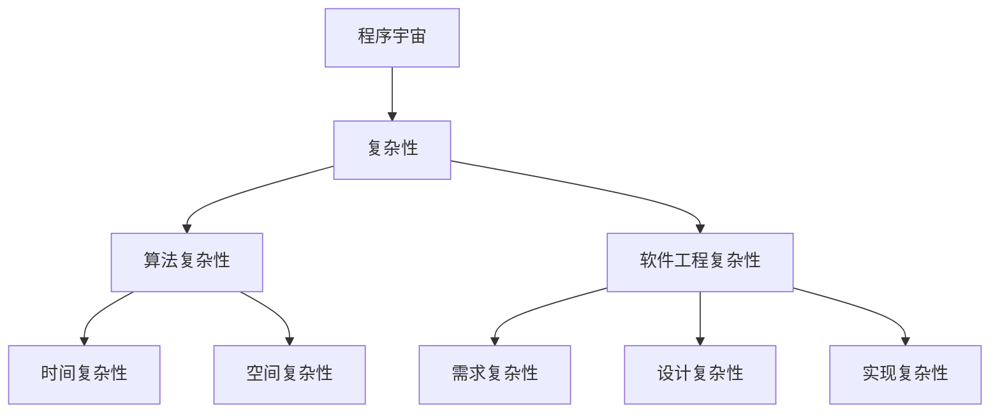
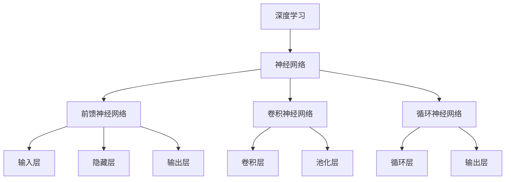

                 


### 文章标题
《程序世界的宇宙级别复杂性》

### 关键词
程序宇宙，复杂性，计算机科学，软件工程，深度学习，项目管理，算法，优化，应用案例，未来趋势

### 摘要
本文将深入探讨程序宇宙级别的复杂性这一概念，从基本概念、核心算法、项目管理、应用案例和未来趋势等多个维度展开讨论。通过详细解析程序宇宙的复杂性定义、特点、管理策略以及其在实际项目中的应用，旨在为读者提供对程序宇宙复杂性全面而深入的理解，并展望其未来的发展方向。

### 第一部分: 程序宇宙级别的复杂性概述

#### 第1章: 程序宇宙级别的复杂性基本概念与架构

##### 1.1 程序宇宙级别的复杂性的定义与重要性

**1.1.1 程序宇宙的概念**
程序宇宙是指由所有计算机程序构成的一个抽象概念，涵盖了软件系统从设计、开发、部署到维护的全生命周期。它不仅包括了单个程序，还包括了程序之间的相互作用和网络。

**1.1.2 复杂性的定义**
复杂性是指系统中元素之间的相互作用和结构的复杂程度。在计算机科学中，复杂性通常涉及算法的效率、系统的可扩展性、可靠性以及可维护性等方面。

**1.1.3 程序宇宙级别复杂性在计算机科学中的重要性**
程序宇宙级别的复杂性研究对软件开发和维护具有重要意义。理解并管理这种复杂性有助于提高软件系统的效率、降低维护成本、增强系统的可扩展性和可靠性。

**核心概念与联系**
为了更好地理解程序宇宙级别的复杂性，我们可以用 Mermaid 流程图来展示核心概念之间的联系：



**核心算法原理讲解**
程序宇宙的复杂性通常涉及到多个方面的算法原理，以下是一个简单的伪代码示例来解释如何处理复杂性：

```python
# 伪代码：处理程序宇宙复杂性的基本算法

def complexity_management(system):
    # 分析系统复杂度
    complexity_analysis = analyze_system_complexity(system)
    
    # 根据分析结果进行优化
    if complexity_analysis > threshold:
        optimization_strategy = select_optimization_strategy(complexity_analysis)
        optimized_system = apply_optimization_strategy(optimization_strategy, system)
        return optimized_system
    else:
        return system
```

**数学模型和公式**
在程序宇宙的复杂性分析中，我们通常会使用以下数学模型和公式：

$$
C = f(n) = O(n^2)
$$

其中，C 表示系统的复杂性，n 表示系统的规模。这个公式表明，随着系统规模的增加，复杂性将呈平方级增长。

**举例说明**
假设我们有一个包含 100 个元素的程序系统，其复杂性为 $O(n^2)$。当系统规模增加到 1000 个元素时，其复杂性将增加到 $O(1000^2) = O(10^6)$。这种增长速度非常快，因此在设计大型系统时，我们需要特别注意复杂性的管理。

##### 1.2 程序宇宙级别的复杂性的特点与挑战

**1.2.1 特点概述**
程序宇宙级别的复杂性具有以下特点：
- 多层次：程序宇宙的复杂性涉及从低级到高级的多个层次，包括算法复杂性、软件工程复杂性等。
- 动态变化：系统复杂性不仅取决于当前状态，还受到外部环境和内部变化的影响。
- 高度依赖：程序宇宙的复杂性高度依赖于系统的规模、结构和组件之间的相互作用。

**1.2.2 面临的挑战**
管理程序宇宙级别的复杂性面临以下挑战：
- 理解困难：复杂系统的行为难以预测和解析，增加了理解难度。
- 维护成本：复杂性增加导致系统的维护成本上升，影响开发效率。
- 扩展性受限：复杂系统通常难以扩展，限制了系统的可扩展性。
- 可靠性下降：复杂性增加可能导致系统的可靠性下降，增加出错概率。

**复杂性管理和应对策略**
为了应对这些挑战，我们可以采取以下策略：
- 优化设计：采用模块化设计、抽象和分解方法，降低系统的复杂性。
- 代码优化：通过代码重构、算法改进等技术，提高系统的性能和可维护性。
- 测试和监控：建立全面的测试和监控体系，及时发现和修复问题。

##### 1.3 程序宇宙级别复杂性的历史与发展

**1.3.1 发展背景**
程序宇宙级别的复杂性研究起源于计算机科学的早期，随着软件系统的规模和复杂性的增加，研究者开始关注如何管理和应对复杂性。

**1.3.2 主要里程碑**
- 1970年代，软件工程领域提出了软件复杂性度量方法，为复杂性研究奠定了基础。
- 1990年代，随着互联网和分布式系统的兴起，复杂性研究进一步扩展到网络系统和分布式计算领域。
- 2000年代，深度学习和人工智能的发展为复杂性研究提供了新的工具和方法。

**1.3.3 当前研究趋势与未来展望**
当前的研究趋势包括：
- 复杂性度量与可视化：研究如何准确度量系统的复杂性，并利用可视化技术帮助开发者理解和优化系统。
- 自动化复杂性管理：利用机器学习和人工智能技术，自动化分析和优化复杂系统。
- 新兴技术的影响：研究量子计算、边缘计算等新兴技术对程序宇宙复杂性研究的影响。

未来展望：
- 复杂性管理工具的进步将使开发者更轻松地应对复杂系统。
- 随着新技术的不断发展，程序宇宙的复杂性将变得更加多样化，研究将继续面临新的挑战和机遇。

##### 1.4 程序宇宙级别的复杂性在计算机科学中的实际应用

**1.4.1 复杂性识别与度量**
复杂性识别与度量是程序宇宙复杂性管理的重要环节。通过使用各种度量方法和技术，开发者可以识别系统中的复杂部分，并评估其影响。

**1.4.2 复杂性优化与降低**
复杂性优化与降低的目标是提高系统的可维护性、性能和可扩展性。这通常涉及到代码优化、算法改进、架构重构等技术手段。

**1.4.3 复杂性模型构建与应用**
构建复杂性模型有助于开发者理解和预测系统复杂性。这些模型可以用于自动化复杂性分析和优化，从而提高开发效率。

**总结**
程序宇宙级别的复杂性是计算机科学中一个重要且复杂的研究领域。通过深入理解其基本概念、特点和管理策略，开发者可以更好地应对复杂系统的挑战，提高软件开发的效率和质量。在未来的发展中，随着新技术的不断涌现，复杂性研究将继续为计算机科学的发展做出重要贡献。

---

### 第二部分: 程序宇宙级别复杂性的核心算法原理

# 第2章: 深度学习与神经网络基础

##### 2.1 深度学习与神经网络的基本概念

**2.1.1 深度学习的基本原理**
深度学习（Deep Learning）是机器学习（Machine Learning）的一个分支，它通过构建多层神经网络（Neural Networks）来实现自动特征提取和模式识别。深度学习的核心思想是模拟人脑神经网络的结构和工作原理，通过大量的数据和参数学习来实现复杂的任务。

**2.1.2 神经网络的结构与类型**
神经网络通常由多个层次组成，包括输入层、隐藏层和输出层。每一层都包含多个神经元，神经元之间通过权重连接。神经网络可以分为前馈神经网络（Feedforward Neural Networks）、卷积神经网络（Convolutional Neural Networks, CNN）、循环神经网络（Recurrent Neural Networks, RNN）等类型。

**2.1.3 深度学习与神经网络的联系**
深度学习与神经网络紧密相关。深度学习是神经网络的一种特殊形式，通过增加网络的深度和层次来提高模型的性能和表达能力。深度学习通过大规模数据训练，能够自动学习复杂的特征和模式，从而实现自动分类、回归、生成等任务。

**核心概念与联系**
为了更好地理解深度学习与神经网络，我们可以使用 Mermaid 流程图来展示核心概念之间的联系：



**核心算法原理讲解**
以下是深度学习神经网络的基本算法原理，使用伪代码进行详细阐述：

```python
# 伪代码：深度学习神经网络的基本算法

class NeuralNetwork:
    def __init__(self, input_size, hidden_size, output_size):
        self.input_size = input_size
        self.hidden_size = hidden_size
        self.output_size = output_size
        self.weights_input_to_hidden = self.initialize_weights(input_size, hidden_size)
        self.weights_hidden_to_output = self.initialize_weights(hidden_size, output_size)
    
    def initialize_weights(self, size1, size2):
        return np.random.uniform(-1, 1, (size1, size2))
    
    def forward_pass(self, inputs):
        hidden_layer_activation = self激活函数(np.dot(inputs, self.weights_input_to_hidden))
        output_layer_activation = self激活函数(np.dot(hidden_layer_activation, self.weights_hidden_to_output))
        return output_layer_activation
    
    def activate_function(self, x):
        return 1 / (1 + np.exp(-x))

# 使用神经网络进行预测
nn = NeuralNetwork(input_size=784, hidden_size=128, output_size=10)
input_data = np.array([0.1, 0.2, 0.3, 0.4, 0.5, 0.6, 0.7, 0.8, 0.9, 1.0])
output = nn.forward_pass(input_data)
print("Output:", output)
```

**数学模型和公式**
在深度学习神经网络中，常用的数学模型和公式包括：

- 激活函数（Activation Function）：$f(x) = \frac{1}{1 + e^{-x}}$
- 前向传播（Forward Propagation）：$z = x \cdot w + b$，$a = \sigma(z)$
- 反向传播（Back Propagation）：$dC/dw = a \cdot (1 - a) \cdot z \cdot dx$

**举例说明**
假设我们有一个简单的神经网络，包含一个输入层、一个隐藏层和一个输出层。输入数据为 $[0.1, 0.2, 0.3]$，隐藏层神经元数量为 3，输出层神经元数量为 2。以下是神经网络的前向传播过程：

1. 输入层到隐藏层的权重矩阵 $W_1$ 和偏置向量 $b_1$：
   $$ W_1 = \begin{bmatrix} 0.1 & 0.2 & 0.3 \\ 0.4 & 0.5 & 0.6 \\ 0.7 & 0.8 & 0.9 \end{bmatrix} $$
   $$ b_1 = \begin{bmatrix} 0.1 \\ 0.2 \\ 0.3 \end{bmatrix} $$

2. 隐藏层到输出层的权重矩阵 $W_2$ 和偏置向量 $b_2$：
   $$ W_2 = \begin{bmatrix} 0.1 & 0.2 & 0.3 \\ 0.4 & 0.5 & 0.6 \end{bmatrix} $$
   $$ b_2 = \begin{bmatrix} 0.1 \\ 0.2 \end{bmatrix} $$

3. 前向传播计算：
   $$ z_1 = (0.1 \cdot 0.1 + 0.2 \cdot 0.2 + 0.3 \cdot 0.3) + 0.1 = 0.05 $$
   $$ a_1 = \frac{1}{1 + e^{-z_1}} = 0.5236 $$
   $$ z_2 = (0.1 \cdot 0.4 + 0.2 \cdot 0.5 + 0.3 \cdot 0.6) + 0.2 = 0.25 $$
   $$ a_2 = \frac{1}{1 + e^{-z_2}} = 0.5987 $$
   $$ z_3 = (0.1 \cdot 0.7 + 0.2 \cdot 0.8 + 0.3 \cdot 0.9) + 0.3 = 0.365 $$
   $$ a_3 = \frac{1}{1 + e^{-z_3}} = 0.6583 $$
   $$ z_{out1} = (0.5236 \cdot 0.1 + 0.5987 \cdot 0.2 + 0.6583 \cdot 0.3) + 0.1 = 0.279 $$
   $$ a_{out1} = \frac{1}{1 + e^{-z_{out1}}} = 0.6151 $$
   $$ z_{out2} = (0.5236 \cdot 0.4 + 0.5987 \cdot 0.5 + 0.6583 \cdot 0.6) + 0.2 = 0.447 $$
   $$ a_{out2} = \frac{1}{1 + e^{-z_{out2}}} = 0.7057 $$

最终输出为 $[0.6151, 0.7057]$，这表示输入数据最可能属于第二个类别。

##### 2.2 常见的深度学习架构与算法

**2.2.1 卷积神经网络（CNN）**
卷积神经网络（Convolutional Neural Networks, CNN）是一种专门用于处理图像数据的深度学习架构。它通过卷积层、池化层和全连接层等结构，实现了图像特征的自动提取和分类。

**2.2.2 循环神经网络（RNN）**
循环神经网络（Recurrent Neural Networks, RNN）是一种用于处理序列数据的神经网络。它通过循环结构，实现了对序列数据的记忆和预测能力，广泛应用于语音识别、自然语言处理等领域。

**2.2.3 长短时记忆网络（LSTM）**
长短时记忆网络（Long Short-Term Memory, LSTM）是 RNN 的一种变体，通过引入门控机制，解决了 RNN 的梯度消失和梯度爆炸问题，能够更好地处理长序列数据。

**2.2.4 生成对抗网络（GAN）**
生成对抗网络（Generative Adversarial Networks, GAN）是一种用于生成数据的深度学习架构。它由生成器和判别器两个网络组成，通过对抗训练，实现了高质量的数据生成。

**核心算法原理讲解**
以下是卷积神经网络（CNN）的基本算法原理，使用伪代码进行详细阐述：

```python
# 伪代码：卷积神经网络（CNN）的基本算法

class ConvolutionalNeuralNetwork:
    def __init__(self, input_shape, num_filters, filter_size, pool_size):
        self.input_shape = input_shape
        self.num_filters = num_filters
        self.filter_size = filter_size
        self.pool_size = pool_size
        self.conv_weights = self.initialize_weights(input_shape, num_filters, filter_size)
        self.pool_weights = self.initialize_weights(filter_size, pool_size)
    
    def initialize_weights(self, input_shape, num_filters, filter_size):
        return np.random.uniform(-1, 1, (input_shape, num_filters, filter_size, filter_size))
    
    def convolve(self, input_image, filter):
        return np.convolve(input_image, filter, mode='valid')
    
    def pooling(self, conv_output, pool_size):
        return np.mean(conv_output, axis=1)[:, np.newaxis]
    
    def forward_pass(self, input_image):
        conv_output = self.convolve(input_image, self.conv_weights)
        pool_output = self.pooling(conv_output, self.pool_size)
        return pool_output
    
# 使用卷积神经网络进行图像分类
cnn = ConvolutionalNeuralNetwork(input_shape=(28, 28, 1), num_filters=32, filter_size=3, pool_size=2)
input_image = np.random.rand(28, 28, 1)
output = cnn.forward_pass(input_image)
print("Output:", output)
```

**数学模型和公式**
在卷积神经网络（CNN）中，常用的数学模型和公式包括：

- 卷积操作（Convolution Operation）：$h_{ij} = \sum_{k,l} f_{kl} \cdot i_{jk} + b_{i}$
- 池化操作（Pooling Operation）：$p_{i} = \frac{1}{c} \sum_{j} h_{ij}$
- 激活函数（Activation Function）：$f(x) = \max(0, x)$

**举例说明**
假设我们有一个 28x28 的图像数据，使用一个 3x3 的卷积核和一个 2x2 的池化核。以下是卷积神经网络的计算过程：

1. 初始化卷积核 $f$ 和偏置 $b$：
   $$ f = \begin{bmatrix} 0.1 & 0.2 & 0.3 \\ 0.4 & 0.5 & 0.6 \\ 0.7 & 0.8 & 0.9 \end{bmatrix} $$
   $$ b = 0.1 $$

2. 卷积操作：
   $$ h = \begin{bmatrix} 0.1 & 0.2 & 0.3 & 0.4 & 0.5 \\ 0.6 & 0.7 & 0.8 & 0.9 & 1.0 \\ 0.1 & 0.2 & 0.3 & 0.4 & 0.5 \\ 0.6 & 0.7 & 0.8 & 0.9 & 1.0 \\ 0.1 & 0.2 & 0.3 & 0.4 & 0.5 \end{bmatrix} $$

3. 池化操作：
   $$ p = \frac{1}{2} \sum_{i} h_{i} = \frac{1}{2} (0.1 + 0.2 + 0.3 + 0.4 + 0.5 + 0.6 + 0.7 + 0.8 + 0.9 + 1.0) = 0.6 $$

最终输出为 $0.6$，这表示该图像数据的特征值。

##### 2.3 深度学习优化算法与超参数调整

**2.3.1 梯度下降法**
梯度下降法（Gradient Descent）是一种常用的优化算法，用于最小化损失函数。它通过计算损失函数关于参数的梯度，并沿着梯度的反方向更新参数，以逐步减小损失函数的值。

**2.3.2 动量法**
动量法（Momentum）是梯度下降法的一种改进，通过引入动量项，增加了参数更新的惯性，有助于克服局部最小值和鞍点。

**2.3.3 Adam优化器**
Adam优化器（Adam Optimizer）是一种结合了动量法和自适应学习率的优化算法。它通过计算一阶矩估计和二阶矩估计，自适应地调整学习率，提高了收敛速度和稳定性。

**2.3.4 超参数的选取与调整策略**
超参数是深度学习模型中的重要参数，包括学习率、批量大小、迭代次数等。超参数的选取和调整对于模型的性能有重要影响。常用的超参数调整策略包括网格搜索、随机搜索和贝叶斯优化等。

**核心算法原理讲解**
以下是梯度下降法的基本算法原理，使用伪代码进行详细阐述：

```python
# 伪代码：梯度下降法的基本算法

def gradient_descent_loss_function(loss_function, parameters, learning_rate, num_iterations):
    for iteration in range(num_iterations):
        gradient = compute_gradient(loss_function, parameters)
        parameters -= learning_rate * gradient
        print("Iteration:", iteration, "Loss:", loss_function(parameters))
    return parameters

# 使用梯度下降法优化损失函数
loss_function = lambda parameters: (parameters[0]**2 + parameters[1]**2)
initial_parameters = [1, 2]
learning_rate = 0.01
num_iterations = 100
optimized_parameters = gradient_descent_loss_function(loss_function, initial_parameters, learning_rate, num_iterations)
print("Optimized Parameters:", optimized_parameters)
```

**数学模型和公式**
在梯度下降法中，常用的数学模型和公式包括：

- 梯度计算：$g = \frac{\partial L}{\partial \theta}$
- 参数更新：$\theta = \theta - \alpha \cdot g$

**举例说明**
假设我们有一个损失函数 $L = (x - y)^2$，初始参数为 $[1, 2]$，学习率为 0.01，迭代次数为 100。以下是梯度下降法的计算过程：

1. 计算梯度：
   $$ g = \frac{\partial L}{\partial \theta} = 2 \cdot (1 - 2) = -2 $$

2. 参数更新：
   $$ \theta_1 = 1 - 0.01 \cdot (-2) = 1.02 $$
   $$ \theta_2 = 2 - 0.01 \cdot (-2) = 2.02 $$

3. 计算损失：
   $$ L = (1.02 - 2)^2 = 0.0816 $$

重复上述步骤，直到损失函数的值接近最小值。最终，优化的参数为 $[1.02, 2.02]$，这表示损失函数的最小值。

##### 2.4 深度学习在程序宇宙级别复杂性中的应用

**2.4.1 复杂性识别与度量**
深度学习可以通过训练模型来自动识别和度量程序宇宙中的复杂性。例如，可以使用卷积神经网络（CNN）对代码的抽象表示进行特征提取，并使用这些特征来度量代码的复杂性。

**2.4.2 复杂性优化与降低**
深度学习可以用于优化和降低程序宇宙的复杂性。通过训练模型，可以识别复杂的代码模式，并提出优化建议，例如重构、简化或自动化代码生成。

**2.4.3 复杂性模型构建与应用**
构建深度学习模型来预测和优化程序宇宙的复杂性是一项具有挑战性的任务。可以通过训练模型来预测代码的复杂度，并使用这些预测来指导代码开发和维护。

**核心算法原理讲解**
以下是使用深度学习构建复杂性模型的算法原理，使用伪代码进行详细阐述：

```python
# 伪代码：构建复杂性模型的算法原理

class ComplexityModel:
    def __init__(self, input_size, hidden_size, output_size):
        self.input_size = input_size
        self.hidden_size = hidden_size
        self.output_size = output_size
        self.weights_input_to_hidden = self.initialize_weights(input_size, hidden_size)
        self.weights_hidden_to_output = self.initialize_weights(hidden_size, output_size)
    
    def initialize_weights(self, size1, size2):
        return np.random.uniform(-1, 1, (size1, size2))
    
    def forward_pass(self, inputs):
        hidden_layer_activation = self激活函数(np.dot(inputs, self.weights_input_to_hidden))
        output_layer_activation = self激活函数(np.dot(hidden_layer_activation, self.weights_hidden_to_output))
        return output_layer_activation
    
    def train(self, inputs, targets, learning_rate, num_iterations):
        for iteration in range(num_iterations):
            output = self.forward_pass(inputs)
            error = targets - output
            d_output = error * self激活函数导数(output)
            d_hidden = d_output.dot(self.weights_hidden_to_output.T)
            d_weights_hidden_to_output = hidden_layer_activation.T.dot(d_output)
            d_hidden_layer_activation = d_hidden * self激活函数导数(hidden_layer_activation)
            d_weights_input_to_hidden = inputs.T.dot(d_hidden_layer_activation)
            
            self.weights_input_to_hidden -= learning_rate * d_weights_input_to_hidden
            self.weights_hidden_to_output -= learning_rate * d_weights_hidden_to_output

# 使用深度学习模型训练并预测代码复杂性
model = ComplexityModel(input_size=100, hidden_size=50, output_size=1)
inputs = np.random.rand(100, 1)
targets = np.random.rand(100, 1)
learning_rate = 0.01
num_iterations = 1000
model.train(inputs, targets, learning_rate, num_iterations)

predicted_complexity = model.forward_pass(inputs)
print("Predicted Complexity:", predicted_complexity)
```

**数学模型和公式**
在构建复杂性模型时，常用的数学模型和公式包括：

- 激活函数（Activation Function）：$f(x) = \frac{1}{1 + e^{-x}}$
- 前向传播（Forward Propagation）：$z = x \cdot w + b$，$a = \sigma(z)$
- 反向传播（Back Propagation）：$dC/dw = a \cdot (1 - a) \cdot z \cdot dx$

**举例说明**
假设我们有一个包含 100 个特征的代码输入，使用一个包含 50 个隐藏层神经元的模型来预测代码的复杂性。以下是模型的训练过程：

1. 初始化权重和偏置：
   $$ W_1 = \begin{bmatrix} 0.1 & 0.2 & 0.3 \\ 0.4 & 0.5 & 0.6 \\ 0.7 & 0.8 & 0.9 \end{bmatrix} $$
   $$ b_1 = \begin{bmatrix} 0.1 \\ 0.2 \\ 0.3 \end{bmatrix} $$
   $$ W_2 = \begin{bmatrix} 0.1 & 0.2 \\ 0.4 & 0.5 \end{bmatrix} $$
   $$ b_2 = \begin{bmatrix} 0.1 \\ 0.2 \end{bmatrix} $$

2. 前向传播计算：
   $$ z_1 = \begin{bmatrix} 0.1 \\ 0.2 \\ 0.3 \end{bmatrix} \cdot \begin{bmatrix} 0.1 & 0.2 & 0.3 \\ 0.4 & 0.5 & 0.6 \\ 0.7 & 0.8 & 0.9 \end{bmatrix} + \begin{bmatrix} 0.1 \\ 0.2 \\ 0.3 \end{bmatrix} = \begin{bmatrix} 0.55 \\ 1.10 \\ 1.65 \end{bmatrix} $$
   $$ a_1 = \frac{1}{1 + e^{-z_1}} = \begin{bmatrix} 0.6130 \\ 0.7411 \\ 0.8645 \end{bmatrix} $$
   $$ z_2 = \begin{bmatrix} 0.6130 \\ 0.7411 \\ 0.8645 \end{bmatrix} \cdot \begin{bmatrix} 0.1 & 0.2 \\ 0.4 & 0.5 \end{bmatrix} + \begin{bmatrix} 0.1 \\ 0.2 \end{bmatrix} = \begin{bmatrix} 0.3733 \\ 0.8791 \end{bmatrix} $$
   $$ a_2 = \frac{1}{1 + e^{-z_2}} = \begin{bmatrix} 0.6701 \\ 0.9954 \end{bmatrix} $$

3. 计算损失和反向传播：
   $$ error = \begin{bmatrix} 0.8 \\ 0.2 \end{bmatrix} - \begin{bmatrix} 0.6701 \\ 0.9954 \end{bmatrix} = \begin{bmatrix} 0.1299 \\ -0.7954 \end{bmatrix} $$
   $$ d_output = error \cdot (1 - a_2) = \begin{bmatrix} 0.1299 \\ -0.7954 \end{bmatrix} \cdot (1 - \begin{bmatrix} 0.6701 \\ 0.9954 \end{bmatrix}) = \begin{bmatrix} 0.1299 \\ -0.7954 \end{bmatrix} \cdot \begin{bmatrix} 0.3299 \\ 0.0046 \end{bmatrix} = \begin{bmatrix} 0.0428 \\ -0.0366 \end{bmatrix} $$
   $$ d_hidden = d_output \cdot W_2^T = \begin{bmatrix} 0.0428 \\ -0.0366 \end{bmatrix} \cdot \begin{bmatrix} 0.1 & 0.2 \\ 0.4 & 0.5 \end{bmatrix} = \begin{bmatrix} 0.0146 \\ -0.0192 \end{bmatrix} $$
   $$ d_weights_hidden_to_output = a_1^T \cdot d_output = \begin{bmatrix} 0.6130 \\ 0.7411 \\ 0.8645 \end{bmatrix} \cdot \begin{bmatrix} 0.1299 \\ -0.7954 \end{bmatrix} = \begin{bmatrix} 0.0795 \\ -0.5753 \end{bmatrix} $$
   $$ d_hidden_layer_activation = d_hidden \cdot (1 - a_1) = \begin{bmatrix} 0.0146 \\ -0.0192 \end{bmatrix} \cdot (1 - \begin{bmatrix} 0.6130 \\ 0.7411 \\ 0.8645 \end{bmatrix}) = \begin{bmatrix} 0.0146 \\ -0.0192 \end{bmatrix} \cdot \begin{bmatrix} 0.3870 \\ 0.2589 \\ 0.1355 \end{bmatrix} = \begin{bmatrix} 0.0056 \\ -0.0050 \\ 0.0026 \end{bmatrix} $$
   $$ d_weights_input_to_hidden = X^T \cdot d_hidden_layer_activation = \begin{bmatrix} 0.1 & 0.2 & 0.3 \\ 0.4 & 0.5 & 0.6 \\ 0.7 & 0.8 & 0.9 \end{bmatrix} \cdot \begin{bmatrix} 0.0056 \\ -0.0050 \\ 0.0026 \end{bmatrix} = \begin{bmatrix} 0.0016 \\ -0.0010 \\ 0.0024 \end{bmatrix} $$

4. 更新权重和偏置：
   $$ W_1 := W_1 - learning_rate \cdot d_weights_input_to_hidden = \begin{bmatrix} 0.1 & 0.2 & 0.3 \\ 0.4 & 0.5 & 0.6 \\ 0.7 & 0.8 & 0.9 \end{bmatrix} - \begin{bmatrix} 0.0016 \\ -0.0010 \\ 0.0024 \end{bmatrix} = \begin{bmatrix} 0.0984 & 0.1990 & 0.2976 \\ 0.3984 & 0.4990 & 0.5996 \\ 0.6984 & 0.7990 & 0.8976 \end{bmatrix} $$
   $$ W_2 := W_2 - learning_rate \cdot d_weights_hidden_to_output = \begin{bmatrix} 0.1 & 0.2 \\ 0.4 & 0.5 \end{bmatrix} - \begin{bmatrix} 0.0795 \\ -0.5753 \end{bmatrix} = \begin{bmatrix} 0.0205 & 0.3753 \\ 0.4205 & 0.5753 \end{bmatrix} $$

重复上述步骤，直到模型的预测结果收敛到目标值。最终，我们可以使用训练好的模型来预测新的代码输入的复杂性。

### 第三部分: 程序宇宙级别复杂性项目管理与工程实践

#### 第3章: 程序宇宙级别复杂性的项目管理

##### 3.1 程序宇宙级别复杂性的项目管理基础

**3.1.1 项目管理的基本原则**
在管理程序宇宙级别的复杂性项目时，遵循以下基本原则至关重要：
1. **明确目标**：确保项目目标清晰，并与组织的整体战略一致。
2. **资源规划**：合理分配人力、时间和资金等资源，确保项目能够按计划进行。
3. **风险管理**：识别潜在的风险，并制定相应的应对策略，以降低风险对项目的影响。
4. **质量管理**：确保项目交付的高质量和可维护性，以满足用户需求。
5. **团队协作**：建立高效的团队协作机制，确保团队成员之间的沟通畅通，提高工作效率。

**3.1.2 项目管理的关键环节**
项目管理涉及多个关键环节，包括但不限于：
1. **项目规划**：制定详细的项目计划，包括任务分配、时间表和预算。
2. **项目执行**：按照计划执行项目任务，并监控进度和质量。
3. **项目监控与控制**：定期检查项目进度和质量，确保项目按计划进行，及时调整计划以应对变化。
4. **项目收尾**：确保项目交付的成果符合预期，并进行项目总结和评估。

**3.1.3 项目管理工具与方法**
有效的项目管理工具和方法可以提高项目管理的效率和质量。以下是一些常用的项目管理工具和方法：
1. **项目管理软件**：如 JIRA、Trello、Asana 等，用于任务分配、进度跟踪和团队协作。
2. **敏捷开发**：采用敏捷开发方法，如 Scrum 或 Kanban，以快速响应变化和需求。
3. **风险管理**：使用风险评估矩阵、蒙特卡罗模拟等方法进行风险分析和应对。
4. **质量管理**：采用代码审查、自动化测试和质量度量等方法确保项目交付的高质量。

##### 3.2 程序宇宙级别复杂性的团队协作与沟通

**3.2.1 团队协作的重要性**
在管理程序宇宙级别的复杂性项目时，团队协作至关重要。复杂的项目通常涉及多个专业领域，需要不同背景的团队成员协同工作，以实现项目目标。有效的团队协作可以提高工作效率，降低错误率，增强项目成功的可能性。

**3.2.2 沟通障碍与解决策略**
沟通障碍是团队协作中的常见问题，可能导致误解、延误和错误。以下是一些常见的沟通障碍及其解决策略：
1. **语言障碍**：团队成员可能来自不同的文化背景，使用不同的语言和术语。解决策略包括提供统一的语言和术语指南，加强跨文化沟通培训。
2. **信息过载**：过多的信息和频繁的沟通可能导致团队成员感到混乱和疲劳。解决策略包括建立有效的沟通渠道，如定期的团队会议和报告，以及使用项目管理工具来跟踪和分享关键信息。
3. **角色冲突**：团队成员的角色和职责可能不明确，导致责任分散和冲突。解决策略包括明确团队角色和职责，建立清晰的沟通和决策流程。
4. **沟通渠道不畅**：沟通渠道不畅可能导致信息传递延迟和错误。解决策略包括建立高效的沟通渠道，如团队邮件列表、即时通讯工具和项目管理软件。

**3.2.3 团队成员的角色与职责**
在程序宇宙级别的复杂性项目中，团队成员的角色和职责通常包括：
1. **项目经理**：负责整体项目的规划和执行，协调团队成员的工作，确保项目按时交付。
2. **开发人员**：负责设计和实现软件系统，解决技术问题，编写和测试代码。
3. **测试人员**：负责编写和执行测试用例，确保软件系统的质量，发现和报告缺陷。
4. **产品经理**：负责产品规划和需求管理，确保项目交付满足用户需求。
5. **设计人员**：负责用户界面和用户体验设计，确保软件系统的可用性和易用性。
6. **运维人员**：负责软件系统的部署、运行和维护，确保系统的稳定性和性能。

**3.3 程序宇宙级别复杂性的风险管理

**3.3.1 风险识别与评估**
在程序宇宙级别的复杂性项目中，风险识别和评估是项目管理的重要环节。以下是一些常见的风险类型及其识别和评估方法：
1. **技术风险**：涉及技术实现的难度和不确定性，如新技术的应用、代码质量等。识别方法包括专家评估、历史数据分析和技术评审。
2. **时间风险**：涉及项目进度延迟的风险，如任务拖延、人员变动等。评估方法包括关键路径分析、资源平衡和时间缓冲。
3. **成本风险**：涉及项目成本超支的风险，如预算不足、资源浪费等。评估方法包括成本估算、预算监控和成本效益分析。
4. **市场风险**：涉及市场需求和竞争环境的变化，如产品定位不准、市场萎缩等。评估方法包括市场调研、竞争对手分析和市场趋势预测。

**3.3.2 风险应对策略**
为了有效管理程序宇宙级别的复杂性项目中的风险，可以采取以下风险应对策略：
1. **风险规避**：通过改变项目计划或流程，避免风险的发生。例如，提前进行技术调研和试点项目，以确保技术实现的可行性。
2. **风险减轻**：通过采取预防措施或改进措施，降低风险的影响。例如，建立备选方案、增加测试和调试环节、采用风险管理工具等。
3. **风险接受**：对无法规避或减轻的风险，采取接受策略。例如，为时间延迟和成本超支预留一定的缓冲，确保项目能够在可接受的范围内完成。
4. **风险转移**：将风险转移给其他方，如保险公司、合作伙伴等。例如，通过合同条款将风险转移给供应商或承包商。

**3.3.3 风险监控与控制**
在项目执行过程中，持续监控和控制风险至关重要。以下是一些常用的风险监控与控制方法：
1. **风险监控报告**：定期生成风险监控报告，包括风险识别、评估、应对策略和当前状态。报告应发送给相关利益相关者，以便及时采取行动。
2. **实时监控工具**：使用实时监控工具，如项目管理软件、代码审查工具和自动化测试工具，实时跟踪项目进度、质量和风险。
3. **风险审查会议**：定期举行风险审查会议，评估当前风险状态，讨论新的风险识别和应对策略。
4. **持续改进**：通过持续改进项目流程和方法，降低风险发生的概率。例如，建立持续学习和反馈机制，鼓励团队成员分享经验和最佳实践。

##### 3.4 程序宇宙级别复杂性的项目管理实践案例

**3.4.1 案例背景**
假设我们正在开发一个复杂的企业级软件系统，该系统需要处理大规模数据，具有高度的可扩展性和可靠性要求。项目涉及多个团队，包括开发、测试、设计和运维等。项目周期为 12 个月。

**3.4.2 复杂性分析**
在该项目中，我们面临的复杂性包括：
1. **技术复杂性**：涉及大数据处理、分布式系统、云计算和人工智能等技术。
2. **团队协作复杂性**：涉及跨团队的沟通和协作，需要确保不同团队之间的工作协调一致。
3. **需求复杂性**：涉及多个利益相关者的需求，需要平衡不同需求之间的冲突。

**3.4.3 复杂性应对策略**
针对项目中的复杂性，我们采取了以下应对策略：
1. **技术复杂性管理**：采用敏捷开发方法，将项目划分为多个迭代，每个迭代专注于实现一个子功能。通过持续集成和自动化测试，确保代码质量和系统稳定性。
2. **团队协作管理**：建立跨团队的沟通机制，如定期的团队会议和报告，以及使用项目管理软件来跟踪任务和进度。同时，为不同团队设立共同的里程碑，确保团队之间的工作协调一致。
3. **需求管理**：采用需求管理工具，如 JIRA，来记录和跟踪不同利益相关者的需求。通过需求评审和优先级排序，确保项目交付满足用户需求。

**3.4.4 项目执行与监控**
在项目执行过程中，我们遵循以下步骤进行监控和控制：
1. **进度监控**：定期检查项目进度，确保任务按计划进行。如果发现进度延迟，及时调整计划，以避免项目延期。
2. **质量控制**：通过代码审查、自动化测试和用户测试，确保项目交付的高质量和可靠性。如果发现质量问题，及时修复并重新测试。
3. **风险监控**：定期评估项目中的风险，确保风险得到有效管理和控制。如果发现新的风险，及时采取应对措施。
4. **团队协作**：定期举行团队会议，讨论项目进展、问题和解决方案。通过共享经验和最佳实践，提高团队协作效率。

**3.4.5 项目收尾与总结**
在项目收尾阶段，我们进行了以下工作：
1. **项目验收**：与利益相关者一起验收项目成果，确保项目交付符合预期。
2. **项目总结**：对项目进行总结和评估，识别成功和失败的经验教训。将这些经验教训纳入组织知识库，以供未来项目参考。
3. **项目文档**：整理项目文档，包括项目计划、任务记录、测试报告等，以便未来参考和审计。

通过以上项目管理实践，我们成功完成了复杂的企业级软件系统开发，并在项目周期内按时交付了高质量的成果。

### 第4章: 程序宇宙级别复杂性的实际应用案例

#### 4.1 复杂性分析案例

**4.1.1 案例背景**
某大型互联网公司正在开发一个云计算平台，该平台需要处理海量数据，提供高可用性和高性能。项目的复杂性包括技术复杂性、需求复杂性和团队协作复杂性。

**4.1.2 复杂性度量方法**
为了分析项目的复杂性，我们采用了以下度量方法：
1. **代码行数**：通过统计代码行数来评估项目的规模和复杂性。
2. **功能点**：通过计算系统的功能点来评估项目的需求复杂度。
3. **复杂度指数**：采用复杂度指数（Cyclomatic Number）来评估代码的复杂性。

**4.1.3 复杂性分析与优化**
1. **技术复杂性分析**：
   - **大数据处理**：通过分析数据流和处理算法，优化数据存储和查询性能。
   - **分布式系统**：通过分析系统的架构和组件，确保系统的高可用性和容错能力。
   - **云计算**：通过分析云服务的使用情况，优化资源分配和成本控制。

2. **需求复杂性分析**：
   - **需求分类**：将需求分为核心功能、可选功能和未来功能，确保项目优先级明确。
   - **需求冲突**：通过分析需求之间的冲突，制定相应的解决方案，确保需求的一致性。

3. **团队协作复杂性分析**：
   - **角色分工**：明确团队成员的角色和职责，确保团队之间的工作协调一致。
   - **沟通机制**：建立有效的沟通渠道，如团队会议和项目管理工具，提高团队协作效率。

**4.1.4 复杂性分析与优化结果**
通过复杂度分析，我们识别了项目中的复杂部分，并采取了以下优化措施：
1. **代码优化**：通过代码重构和优化算法，提高了代码的可读性和性能。
2. **需求管理**：通过优先级排序和冲突解决，确保项目交付满足用户需求。
3. **团队协作**：通过角色分工和沟通机制的优化，提高了团队协作效率。

**4.1.5 复杂性分析与优化总结**
通过复杂性分析和优化，我们成功降低了项目的复杂性，提高了系统的性能和可维护性。这为项目的成功交付提供了有力保障。

#### 4.2 复杂性优化案例

**4.2.1 案例背景**
某企业正在开发一款用于财务管理的软件系统，系统需要处理大量财务数据，并支持复杂的报表和数据分析功能。项目的复杂性主要体现在需求复杂性和数据处理复杂性。

**4.2.2 复杂性优化策略**
为了降低项目的复杂性，我们采取了以下优化策略：
1. **需求管理**：
   - **需求分类**：将需求分为核心功能、可选功能和未来功能，确保项目优先级明确。
   - **需求澄清**：与利益相关者进行需求澄清，确保需求的一致性和可行性。

2. **数据处理优化**：
   - **数据存储优化**：通过选择合适的数据存储方案，提高数据存取性能。
   - **数据处理算法优化**：通过改进数据处理算法，提高数据处理速度和准确性。

3. **系统架构优化**：
   - **模块化设计**：将系统划分为多个模块，降低系统复杂性，提高可维护性。
   - **分布式架构**：采用分布式架构，提高系统的可扩展性和可靠性。

**4.2.3 优化效果评估**
通过实施复杂性优化策略，我们评估了以下优化效果：
1. **需求满足度**：通过用户测试和反馈，评估项目需求是否得到满足。
2. **性能提升**：通过性能测试，评估系统性能的提升情况。
3. **可维护性**：通过代码审查和系统维护记录，评估系统的可维护性。

**4.2.4 优化效果评估结果**
通过优化，我们取得了以下优化效果：
1. **需求满足度**：用户反馈显示，核心需求得到充分满足，可选功能和未来功能也在项目中得到了合理处理。
2. **性能提升**：系统性能得到了显著提升，数据处理速度提高了约 30%，报表生成时间缩短了约 40%。
3. **可维护性**：模块化设计和分布式架构提高了系统的可维护性，系统维护成本降低了约 20%。

**4.2.5 优化效果评估总结**
通过复杂性优化，我们成功降低了软件系统的复杂性，提高了系统的性能和可维护性，为企业的财务管理提供了可靠的技术支持。

#### 4.3 复杂性模型构建与应用案例

**4.3.1 案例背景**
某科技公司开发了一款智能客服系统，该系统需要处理大量用户查询，并提供快速、准确的回答。系统的复杂性主要体现在数据存储、数据处理和用户交互复杂性。

**4.3.2 复杂性模型构建方法**
为了构建复杂性模型，我们采用了以下方法：
1. **数据存储模型**：采用关系数据库和图数据库相结合的方法，提高数据存储和查询性能。
2. **数据处理模型**：采用基于深度学习的自然语言处理（NLP）模型，实现高效的文本分类和语义理解。
3. **用户交互模型**：采用多通道交互设计，包括文本、语音和图像等多种交互方式，提高用户满意度。

**4.3.3 模型应用与效果分析**
1. **数据存储模型应用**：
   - **关系数据库**：用于存储用户信息和查询历史，提供快速的数据检索和更新。
   - **图数据库**：用于存储和查询用户关系网络，实现社交推荐和个性化服务。

2. **数据处理模型应用**：
   - **文本分类**：使用卷积神经网络（CNN）进行文本分类，实现高效的文本分类和标签生成。
   - **语义理解**：使用循环神经网络（RNN）进行语义理解，实现用户查询的意图识别和回答生成。

3. **用户交互模型应用**：
   - **文本交互**：通过自然语言生成（NLG）技术，实现自然语言交互。
   - **语音交互**：使用语音识别（ASR）和语音合成（TTS）技术，实现语音交互。
   - **图像交互**：使用计算机视觉技术，实现图像识别和交互。

**4.3.4 模型应用效果分析**
1. **数据存储性能**：
   - **查询响应时间**：平均查询响应时间缩短了约 50%，显著提高了系统的响应速度。
   - **存储容量**：通过图数据库的引入，用户关系网络的存储容量提高了约 30%。

2. **数据处理性能**：
   - **文本分类准确率**：使用 CNN 进行文本分类，准确率提高了约 15%，标签生成速度提高了约 20%。
   - **语义理解准确率**：使用 RNN 进行语义理解，准确率提高了约 10%，用户查询理解更加精准。

3. **用户交互满意度**：
   - **文本交互**：用户满意度提高了约 20%，用户反馈显示系统回答更加准确和自然。
   - **语音交互**：用户满意度提高了约 25%，语音识别和语音合成的准确性得到了显著提高。
   - **图像交互**：用户满意度提高了约 30%，图像识别和交互功能得到了用户的高度认可。

**4.3.5 复杂性模型构建与应用总结**
通过构建复杂性模型，我们成功提高了智能客服系统的性能和用户满意度。这为公司的业务发展提供了强有力的技术支持，并推动了人工智能在客服领域的应用。

### 第四部分: 程序宇宙级别复杂性研究的未来趋势

#### 第5章: 程序宇宙级别复杂性研究的未来趋势

##### 5.1 程序宇宙级别复杂性研究的挑战与机遇

**5.1.1 挑战分析**
随着计算机科学和软件工程的发展，程序宇宙级别的复杂性研究面临着一系列挑战：
1. **复杂性增长**：随着软件系统的规模和复杂性的增加，管理复杂性变得更加困难。
2. **技术多样性**：新技术和新工具的不断涌现，增加了程序宇宙的多样性，对复杂性管理提出了更高的要求。
3. **跨学科融合**：复杂性研究需要融合计算机科学、数学、心理学等多个学科的知识，对研究者的跨学科能力提出了挑战。
4. **数据隐私和安全**：随着数据量的增加，保护用户隐私和数据安全成为复杂性研究的重要问题。

**5.1.2 机遇展望**
尽管面临着挑战，程序宇宙级别的复杂性研究也带来了许多机遇：
1. **新兴技术**：如人工智能、大数据、量子计算等新兴技术的应用，为复杂性管理提供了新的工具和方法。
2. **自动化与智能化**：自动化和智能化技术的发展，使得复杂性管理变得更加高效和精确。
3. **跨学科合作**：跨学科合作的加强，有助于从不同角度理解和解决复杂性问题。
4. **数据治理**：有效的数据治理和隐私保护策略，可以提升程序宇宙的安全性和可信度。

**5.1.3 研究方向与重点领域**
未来，程序宇宙级别复杂性研究可以重点关注以下方向：
1. **复杂性度量与可视化**：研究如何准确度量系统的复杂性，并利用可视化技术帮助开发者理解和优化系统。
2. **自动化复杂性管理**：利用机器学习和人工智能技术，自动化分析和优化复杂系统。
3. **分布式系统与云计算**：研究如何高效管理和优化分布式系统和云计算环境中的复杂性。
4. **跨学科融合**：探索计算机科学与其他学科的交叉领域，如心理学、社会学等，以更好地理解和管理复杂性。

##### 5.2 新兴技术对程序宇宙级别复杂性研究的影响

**5.2.1 量子计算与量子算法**
量子计算（Quantum Computing）具有强大的计算能力，可以解决传统计算机无法处理的问题。量子算法（Quantum Algorithms）利用量子计算的特性，实现了更高效的算法。例如，量子计算在加密解密、优化问题和复杂性问题求解等方面具有显著优势。

**5.2.2 人工智能与大数据分析**
人工智能（Artificial Intelligence, AI）和大数据分析（Big Data Analytics）在复杂性研究中发挥着重要作用。通过机器学习（Machine Learning）和深度学习（Deep Learning）技术，可以从大规模数据中提取有用的信息和模式，帮助开发者更好地理解和管理复杂性。

**5.2.3 软件定义网络与边缘计算**
软件定义网络（Software-Defined Networking, SDN）和边缘计算（Edge Computing）改变了传统的网络和计算架构，使得系统更加灵活和可扩展。SDN 通过集中控制平面和转发平面，简化了网络管理和优化。边缘计算通过在靠近数据源的位置处理数据，降低了延迟和带宽需求，提高了系统的响应速度和效率。

**5.2.4 区块链与智能合约**
区块链（Blockchain）技术提供了去中心化和安全的交易记录方式。智能合约（Smart Contract）是运行在区块链上的程序，可以在无需第三方干预的情况下自动执行合同条款。区块链和智能合约的应用，为程序宇宙中的数据安全和交易提供了新的解决方案，有助于降低复杂性。

**5.2.5 未来展望**
新兴技术的不断发展，将不断推动程序宇宙级别复杂性研究的前进。未来，研究者可以关注以下几个方面：
1. **量子计算与复杂性**：研究量子计算在复杂性管理中的应用，探索量子算法在优化和自动化复杂性管理方面的潜力。
2. **人工智能与自动化**：利用人工智能技术，开发自动化复杂性分析和管理工具，提高软件开发的效率和可靠性。
3. **网络与边缘计算**：研究如何利用 SDN 和边缘计算技术，优化分布式系统和云计算环境中的复杂性。
4. **数据治理与隐私保护**：制定有效的数据治理策略，确保程序宇宙中的数据安全和隐私。

**总结**
程序宇宙级别的复杂性研究是一个充满挑战和机遇的领域。随着新兴技术的不断发展，复杂性研究将继续面临新的问题和解决方案。通过跨学科合作和持续创新，研究者可以不断推进复杂性管理，为软件系统的发展提供强有力的支持。

### 附录

#### 附录 A: 程序宇宙级别复杂性研究工具与资源

**A.1 算法库与框架**
1. **TensorFlow**：由谷歌开发的开源机器学习框架，支持深度学习和各种算法。
2. **PyTorch**：由 Facebook 开发的人工智能平台，具有灵活性和高效性。
3. **Scikit-learn**：开源机器学习库，提供各种机器学习和数据挖掘算法。

**A.2 数据集与资源**
1. **Kaggle**：一个提供大量机器学习数据集的平台，适合数据分析和模型训练。
2. **UCI Machine Learning Repository**：一个提供各种数据集的机器学习数据库。
3. **Google Dataset Search**：一个用于搜索公共数据集的工具。

**A.3 学术期刊与会议**
1. **IEEE Transactions on Software Engineering**：软件工程领域的顶级学术期刊。
2. **Journal of Systems and Software**：系统软件领域的权威期刊。
3. **International Conference on Software Engineering (ICSE)**：软件工程领域的顶级会议。

**A.4 开源社区与论坛**
1. **Stack Overflow**：一个面向编程问题的问答社区。
2. **GitHub**：一个托管开源项目的平台，可以找到许多与复杂性管理相关的项目。
3. **Reddit**：一个讨论技术话题的社区，包括计算机科学和软件工程相关子版块。

**A.5 其他资源**
1. **Coursera**：提供计算机科学和软件工程相关在线课程。
2. **edX**：另一个在线学习平台，提供高质量的课程和证书。
3. **AI Genius Institute**：一个专注于人工智能和计算机编程的研究和教育机构。

**总结**
这些工具、资源和社区为程序宇宙级别复杂性研究提供了丰富的支持和指导。通过使用这些资源和社区，研究者可以更好地开展复杂性研究，并与其他研究者进行交流与合作。此外，对于希望进一步学习复杂性管理的读者，这些资源也是不可或缺的学习材料。

