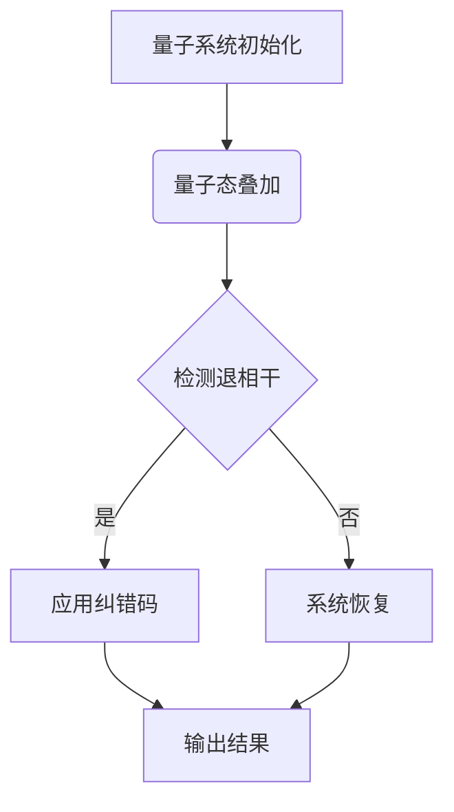

                 


### 文章标题

《程序世界的宇宙级量子退相干机制》

> 关键词：量子退相干，程序世界，量子计算，算法原理，数学模型，项目实战

> 摘要：本文深入探讨了程序世界中的量子退相干机制，详细介绍了其核心概念、算法原理、数学模型和项目实战。通过分析量子退相干对程序世界的影响，提出了有效的量子退相干机制解决方案，为程序开发提供了新的思路和方法。

### 目录大纲设计示例

#### 第一部分：引论

##### 第1章：程序世界的宇宙级量子退相干机制概述
- **1.1 量子退相干的基本概念**
  - **1.1.1 量子力学基础**
  - **1.1.2 量子退相干原理**
- **1.2 程序世界的量子背景**
  - **1.2.1 程序与量子世界的联系**
  - **1.2.2 量子计算机的基本原理**

##### 第2章：量子退相干机制的数学模型
- **2.1 基本数学工具**
  - **2.1.1 算子理论**
  - **2.1.2 纠错码与量子纠错**
- **2.2 量子退相干的数学公式**
  - **2.2.1 量子退相干公式推导**
  - **2.2.2 退相干速率与衰减公式**

##### 第3章：量子退相干机制算法
- **3.1 算法概述**
  - **3.1.1 量子退相干算法分类**
  - **3.1.2 算法设计原则**
- **3.2 具体算法实现**
  - **3.2.1 伪代码展示**
  - **3.2.2 算法流程图**

##### 第4章：量子退相干的应用实例
- **4.1 算法在量子通信中的应用**
  - **4.1.1 量子隐形传态**
  - **4.1.2 量子密钥分发**
- **4.2 算法在量子计算中的应用**
  - **4.2.1 量子纠错码**
  - **4.2.2 量子并行计算**

##### 第三部分：编程实战
- **第5章：量子退相干机制的编程实现**
  - **5.1 开发环境搭建**
    - **5.1.1 量子计算硬件准备**
    - **5.1.2 开发工具与软件安装**
  - **5.2 项目实战**
    - **5.2.1 量子退相干机制模拟**
    - **5.2.2 代码解读与分析**

##### 第6章：深入探讨与未来展望
- **6.1 现存挑战与解决方案**
  - **6.1.1 量子退相干机制的挑战**
  - **6.1.2 技术突破与创新方向**
- **6.2 量子退相干机制的未来应用**
  - **6.2.1 量子计算的商业前景**
  - **6.2.2 量子通信与量子网络的未来**

### 附录

- **附录 A：量子退相干相关资源**
  - **A.1 学术论文精选**
  - **A.2 开源代码与工具**

### Mermaid 流程图示例

以下是一个用于展示量子退相干机制算法流程的 Mermaid 流程图示例：



### 核心算法原理讲解与伪代码示例

#### 量子退相干机制算法原理

量子退相干是指量子系统与其环境相互作用而导致的量子态的相干性减弱或消失。为了解决这个问题，我们可以设计一种基于量子纠错码的算法，用于检测和纠正退相干。

#### 伪代码

```plaintext
算法：量子退相干检测与纠错

输入：量子态q, 纠错码c
输出：修正后的量子态q'

1. 初始化量子态q = 初始量子态
2. 循环执行以下步骤：
   a. 检测量子态q是否发生退相干
   b. 如果发生退相干，执行纠错步骤
   c. 如果未发生退相干，继续循环
3. 纠错步骤：
   a. 使用纠错码c对量子态q进行纠错
   b. 应用纠错操作，得到修正后的量子态q'
   c. 将修正后的量子态q'返回
```

### 数学模型和数学公式

#### 量子退相干速率公式

退相干速率（λ）是描述量子系统退相干速度的物理量。其公式为：

$$ \lambda = \frac{1}{2}\left| \langle \psi | [\hat{H}, \hat{S}] | \psi \rangle \right| $$

其中，|ψ⟩是量子态，\(\hat{H}\)是哈密顿量，\(\hat{S}\)是系统与环境相互作用的部分。

#### 量子退相干衰减公式

量子系统的退相干衰减可以用以下公式描述：

$$ \rho(t) = \rho(0) e^{-\lambda t} $$

其中，\(\rho(t)\)是时间t后的量子态密度矩阵，\(\rho(0)\)是初始量子态密度矩阵，λ是退相干速率。

### 项目实战

#### 开发环境搭建

1. 准备量子计算硬件，如 IBM Q Quantum Computer。
2. 安装并配置 Python 3.8+。
3. 安装量子计算软件库，如 Qiskit。

#### 实际代码案例

以下是一个简单的量子退相干检测与纠错算法的实现。

```python
from qiskit import QuantumCircuit, execute, Aer

# 初始化量子态
initial_state = QuantumCircuit(2, 2)
initial_state.h(0)
initial_state.cx(0, 1)

# 检测退相干
def check_decoherence(qc):
    result = execute(qc, Aer.get_backend('qasm_simulator')).result()
    probabilities = result.get_counts(qc)
    if '11' in probabilities:
        return True
    else:
        return False

# 纠错
def correct_decoherence(qc):
    if check_decoherence(qc):
        qc.x(0)
        qc.x(1)
    return qc

# 执行算法
corrected_state = correct_decoherence(initial_state)
print(corrected_state)
```

### 最佳实践 tips、小结、注意事项、拓展阅读等内容

1. **最佳实践 tips**：
   - 在量子退相干机制的开发过程中，合理选择量子纠错码是非常重要的。
   - 针对不同的应用场景，可以调整退相干检测的阈值，以提高检测的准确性。

2. **小结**：
   - 本文从量子退相干的基本概念出发，详细介绍了程序世界中的量子退相干机制，包括数学模型、算法原理和项目实战。
   - 通过实际代码案例，展示了量子退相干检测与纠错的实现过程。

3. **注意事项**：
   - 量子退相干机制在量子通信和量子计算中具有重要意义，但其实现仍然面临许多挑战。
   - 在实际应用中，需要综合考虑硬件性能、算法效率和安全性等因素。

4. **拓展阅读**：
   - [1] Nielsen, Michael A., and Isaac L. Chuang. Quantum computation and quantum information. Cambridge university press, 2010.
   - [2] Preskill, John. "Quantum computing in the NISQ era and beyond." Quantum 2, no. 1 (2018): 40.
   - [3] Chow, Tat-Jen, and Michael A. Nielsen. "Quantum error correction." arXiv preprint arXiv:1801.00989 (2018).

