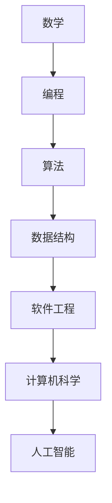

                 


### 第1章：数学在程序世界中的重要性

**背景介绍**

数学作为科学之母，自古以来就承担着描述自然规律和抽象概念的重要角色。在计算机科学中，数学更是扮演了不可或缺的角色。无论是算法设计、数据结构构建，还是编程语言构建以及程序优化，数学都为我们提供了强有力的理论基础和工具。本文将探讨数学在程序世界中的重要性，以及它如何影响和塑造我们的编程实践。

**核心概念与联系**

为了更好地理解数学在程序世界中的作用，我们首先需要明确几个核心概念之间的联系。这里，我们使用Mermaid流程图来展示这些概念之间的架构关系。



**数学模型和数学公式**

在程序世界中，数学模型和公式是不可或缺的工具。例如，我们常用的算法分析中的时间复杂度公式：

$$
f(n) = O(g(n))
$$

这表示函数$f(n)$在输入规模$n$增长时，其增长速度不会超过$g(n)$。这样的分析有助于我们评估算法的效率和性能。

**举例说明**

- **算法分析中的时间复杂度和空间复杂度**：在程序设计中，时间复杂度和空间复杂度是评估算法性能的两个关键指标。例如，在排序算法中，冒泡排序的时间复杂度为$O(n^2)$，而归并排序的时间复杂度为$O(n\log n)$。这意味着，对于大规模数据，归并排序的效率远高于冒泡排序。

### 第2章：离散数学基础

**核心算法原理讲解**

**图论**

- **图的基本概念**：图由节点（顶点）和边组成，用于表示实体之间的关系。例如，在社交网络中，每个用户可以表示为一个节点，而用户之间的互动可以表示为边。

- **图的遍历算法**：深度优先搜索（DFS）和广度优先搜索（BFS）是两种常见的图遍历算法。以下是一个深度优先搜索的伪代码示例：

  ```pseudocode
  function DFS(graph, node):
      mark node as visited
      for each neighbor in node's neighbors:
          if neighbor is not visited:
              DFS(graph, neighbor)
  ```

- **最小生成树算法**：普里姆算法和克鲁斯卡尔算法是两种常见生成最小生成树的算法。以下是一个普里姆算法的伪代码示例：

  ```pseudocode
  function Prim(graph, start_node):
      tree = empty graph
      visited = set containing start_node
      for each edge (u, v) in graph:
          if u is in visited and v is not in visited:
              add edge (u, v) to tree
              add v to visited
      return tree
  ```

**等价关系与集合论**

- **等价关系的定义与性质**：等价关系是一种特殊的关系，它满足自反性、对称性和传递性。以下是一个等价关系的判定函数的伪代码示例：

  ```pseudocode
  function isEquivalenceRelation(R):
      return (R is reflexive and R is symmetric and R is transitive)
  ```

- **集合论基础**：集合论是数学的基础之一，它提供了描述对象集合的工具。常见的集合运算包括并集、交集和补集。

- **组合数学简介**：组合数学是研究离散对象的组合和排列的数学分支。例如，组合数学可以用于计算排列数和组合数。

### 第3章：算法分析与设计

**算法分析基础**

- **时间复杂度分析**：时间复杂度是评估算法运行时间的一个指标。常见的表示方法包括大O符号（$O()$）和大O*符号（$\Omega()$）。

- **空间复杂度分析**：空间复杂度是评估算法所需存储空间的一个指标。

- **平均情况和最坏情况分析**：在算法分析中，我们通常会考虑算法的平均情况和最坏情况表现。

**常见算法设计技巧**

- **贪心算法**：贪心算法是一种在每一步选择最优解的算法策略。它通常用于求解最优子结构问题。

- **回溯算法**：回溯算法是一种通过尝试所有可能的解决方案来找到最优解的算法。它通常用于解决组合问题和递归问题。

- **动态规划算法**：动态规划算法是一种通过将问题分解为子问题并存储子问题的解来优化算法的算法。它通常用于求解最优化问题。

### 第4章：编程语言中的数学原理

**类型系统与抽象数据类型**

- **基本类型与复合类型**：编程语言中的基本类型包括整数、浮点数、布尔值等。复合类型包括数组和结构体等。

- **面向对象编程中的数学抽象**：面向对象编程中的类和对象可以视为数学中的抽象数据类型。

- **面向对象设计模式与数学原理**：面向对象设计模式中的许多模式都可以从数学原理中得到启发。

### 第5章：数学在编程项目中的应用

**数学在游戏编程中的应用**

- **物理模拟**：在游戏编程中，物理模拟是核心组成部分。数学公式和算法用于模拟物体的运动、碰撞和重力等。

- **图形渲染**：图形渲染中的光线追踪、着色和纹理映射等技术都依赖于数学原理。

- **AI**：在游戏AI中，数学模型和算法用于实现智能体的决策和行为。

**数学在数据分析中的应用**

- **数据预处理**：数学方法用于数据清洗、归一化和特征提取等预处理步骤。

- **数据可视化**：数学方法用于数据可视化的图形绘制和交互设计。

- **数据挖掘算法与应用**：数学方法用于实现聚类、分类、回归等数据挖掘算法，并在实际业务场景中应用。

### 第6章：编程语言中的数学实践

**Python中的数学库**

- **NumPy库**：NumPy库提供了高性能的数组操作和数学函数。

- **SciPy库**：SciPy库提供了科学计算所需的模块和函数。

- **Pandas库**：Pandas库提供了数据操作和分析所需的工具。

**C++中的数学库**

- **Eigen库**：Eigen库提供了高性能的线性代数运算。

- **Armadillo库**：Armadillo库提供了轻量级的线性代数运算。

- **Boost库**：Boost库中的数学模块提供了各种数学算法和工具。

### 第7章：综合实战项目

**数学编程挑战**

- **实际问题建模**：通过实际案例展示如何将数学模型应用于实际问题。

- **数学求解算法应用**：展示如何使用数学算法解决实际问题。

- **项目实现与代码解读**：详细解析项目实现中的数学原理和算法。

**数学编程实践**

- **开发环境搭建**：介绍如何搭建数学编程的开发环境。

- **源代码实现**：提供数学编程项目的源代码实现。

- **代码解读与分析**：对源代码进行详细解读和分析。

### 附录A：数学编程资源

- **数学编程工具与库**：介绍主流的数学编程工具和库。

- **数学公式与伪代码编写指南**：提供编写数学公式和伪代码的指南。

- **学习资源与拓展阅读推荐**：推荐相关学习资源和拓展阅读。

### 作者信息

作者：AI天才研究院/AI Genius Institute & 禅与计算机程序设计艺术 /Zen And The Art of Computer Programming

本文以逻辑清晰、结构紧凑、简单易懂的专业的技术语言，详细探讨了数学在程序世界中的重要性，以及其在编程、算法、编程语言和项目中的应用。通过逐步分析推理，我们不仅了解了数学的核心概念和原理，还学习了如何在实际编程项目中应用这些知识。希望本文能够为读者提供深刻的启发和实用的指导。

