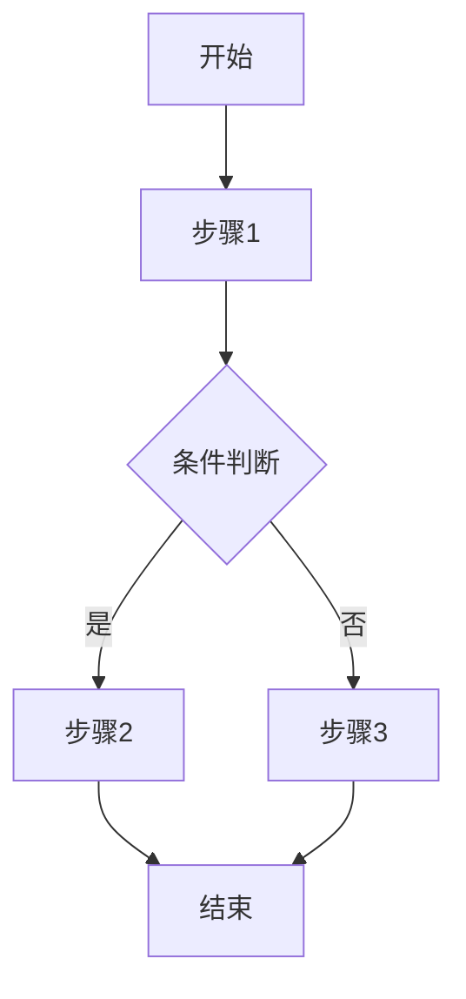

                 


### 引言与背景

#### 1.1 本书目的与结构

在当今数字化时代，程序设计原则的重要性愈发凸显。它们不仅是软件开发的基石，也是系统可维护性、可扩展性和性能的关键因素。本书旨在深入探讨程序设计原则与宇宙对称性自发破缺之间的关联，以期为读者提供一个全新的视角，理解这两者如何相互影响和促进。

本文结构如下：首先，我们将简要介绍程序设计原则，为后续讨论奠定基础。接着，我们将探讨宇宙对称性与自发破缺的概念，并阐述它们的基本原理。随后，本文将详细分析程序设计原则与宇宙对称性自发破缺之间的联系，并通过具体的案例分析，展示这些原则在实际应用中的效果。最后，我们将总结本文的核心观点，并展望未来的研究方向。

#### 1.2 程序设计原则概述

程序设计原则是软件开发中指导设计、编码和测试的基本准则。它们源于对软件工程长期实践的经验总结，并逐渐被业界广泛接受。以下是一些核心的程序设计原则：

1. **单一职责原则（Single Responsibility Principle，SRP）**：每个类或模块应当只负责一项功能，从而提高系统的可维护性和可扩展性。

2. **开放封闭原则（Open/Closed Principle，OCP）**：软件实体应当对扩展开放，对修改封闭。这意味着在设计时应该尽量使代码易于扩展，而避免频繁的修改。

3. **里氏替换原则（Liskov Substitution Principle，LSP）**：子类应当能够替换其父类，并保证系统的行为保持不变。这有助于确保代码的灵活性和可复用性。

4. **接口隔离原则（Interface Segregation Principle，ISP）**：应该为客户端提供尽量小的接口，从而减少客户端与接口之间的依赖关系。

5. **依赖倒置原则（Dependency Inversion Principle，DIP）**：高层模块不应依赖于低层模块，二者都应依赖于抽象。这意味着依赖关系应该由抽象定义而不是实现。

这些原则不仅在程序设计中具有指导意义，也在其他领域中得到了应用，如系统架构、设计模式等。

#### 1.3 宇宙对称性与自发破缺

宇宙对称性是指宇宙在特定条件下的均匀性和均匀性。在物理学的早期发展中，科学家们发现宇宙具有多种对称性，如旋转对称性、反射对称性和对称混合性。然而，这些对称性并非一成不变，它们会在特定条件下自发破缺，即对称性被打破，从而产生新的物理现象。

1. **宇宙对称性概述**：

   - **原始对称性**：宇宙在大爆炸初期具有极高的对称性，包括空间和时间上的对称性。

   - **对称性破缺现象**：随着宇宙的演化，原始对称性逐渐破缺，产生了我们观察到的复杂现象，如质能分布不均、宇宙膨胀等。

2. **自发破缺原理**：

   - **基本概念**：自发破缺是指在没有外界干预的情况下，系统的对称性自发地被打破。

   - **自然现象中的体现**：自发破缺在自然界中广泛存在，如超导现象、超流现象和量子场论中的对称性破缺。

#### 1.4 本书的核心观点

本书的核心观点在于，程序设计原则与宇宙对称性自发破缺之间存在深刻的相似性。通过对这两者的深入探讨，我们可以发现它们在概念、原理和应用上的联系。具体而言：

- **相似性分析**：程序设计原则中的单一职责、开放封闭、里氏替换等原则与宇宙对称性自发破缺原理在本质上具有相似性。

- **应用对比**：通过具体的案例分析，我们可以看到这些原则如何在实际软件开发中应用，并如何与宇宙对称性自发破缺原理相互促进。

- **理论意义**：探讨程序设计原则与宇宙对称性自发破缺的关联，不仅有助于深化我们对软件工程的理解，也为跨学科研究提供了新的视角。

### 第二部分：程序设计原则详解

#### 2.1 单一职责原则

单一职责原则（Single Responsibility Principle，SRP）是面向对象设计中的一条重要原则。它主张一个类应当只负责一项功能，而不应该同时具有多个功能。这一原则旨在提高系统的可维护性和可扩展性，使得代码更加清晰和简洁。

#### 2.1.1 单一职责原则的定义

单一职责原则（SRP）主张每个类或模块应当只负责一项功能，从而实现功能的单一性。具体来说，一个类应该只做一件事情，并且把它做好。这样可以确保类的职责明确，便于后续的维护和扩展。

例如，假设我们有一个订单处理系统，如果将订单的创建、更新状态和取消订单功能都放在一个类中，那么这个类就会违背单一职责原则。

```python
class OrderProcessing:
    def create_order(self, order_details):
        # 创建订单
        pass
    
    def update_order_status(self, order_id, status):
        # 更新订单状态
        pass
    
    def cancel_order(self, order_id):
        # 取消订单
        pass
```

上述代码中的`OrderProcessing`类违背了单一职责原则，因为它同时处理订单创建、更新状态和取消订单三个功能。为了改进这一设计，我们可以将功能拆分，创建三个独立的类：

```python
class OrderCreate:
    def create_order(self, order_details):
        # 创建订单
        pass

class OrderUpdate:
    def update_order_status(self, order_id, status):
        # 更新订单状态
        pass

class OrderCancel:
    def cancel_order(self, order_id):
        # 取消订单
        pass
```

这样，每个类都只负责一项功能，从而提高了代码的可读性和可维护性。

#### 2.1.2 单一职责原则的优点

1. **提高可维护性**：单一职责原则使得每个类的职责明确，便于后续的维护和修改。当需要修改某个功能时，我们只需关注相关类，而无需担心其他功能的变动。

2. **提高可扩展性**：单一职责原则使得系统更加模块化，便于添加新的功能。我们可以独立地扩展某个类的功能，而无需修改其他类。

3. **提高代码复用性**：单一职责原则有助于代码的复用。我们可以将某个类的功能在其他项目中重复使用，从而节省开发时间和成本。

#### 2.1.3 单一职责原则的应用场景

1. **业务逻辑处理**：在业务逻辑处理中，单一职责原则有助于将复杂的业务流程分解为多个简单的类，从而提高系统的可维护性和可扩展性。

2. **数据模型设计**：在数据模型设计中，单一职责原则有助于确保每个实体类只负责一项功能，从而提高数据模型的结构清晰度和易用性。

3. **接口设计**：在接口设计过程中，单一职责原则有助于确保接口的简洁和明确，从而提高系统的灵活性和可扩展性。

### 2.2 开放封闭原则

开放封闭原则（Open/Closed Principle，OCP）是面向对象设计中的一条重要原则，它主张软件实体应当对扩展开放，对修改封闭。这意味着在设计时应该尽量使代码易于扩展，而避免频繁的修改。

#### 2.2.1 开放封闭原则的定义

开放封闭原则（OCP）主张软件实体（类、模块、函数等）应该对扩展开放，以便在需要时可以方便地添加新功能。同时，这些实体应该对修改封闭，以避免因修改而引入新的问题。

例如，假设我们有一个订单处理系统，如果需要添加新的订单类型，根据开放封闭原则，我们应该尽量在不修改现有代码的情况下实现这一功能。

```python
class Order:
    def process_order(self):
        # 处理订单
        pass

class OrderA(Order):
    def process_order(self):
        # 处理订单A的特定逻辑
        pass

class OrderB(Order):
    def process_order(self):
        # 处理订单B的特定逻辑
        pass
```

上述代码中，`Order`类是一个抽象类，`OrderA`和`OrderB`是具体的订单类型。通过继承和覆写`process_order`方法，我们可以在不修改现有代码的情况下添加新的订单类型。

#### 2.2.2 开放封闭原则的优点

1. **提高可维护性**：开放封闭原则使得系统的扩展更加灵活，减少了代码的修改频率，从而降低了系统的维护成本。

2. **提高可扩展性**：开放封闭原则使得系统更容易添加新的功能，因为新功能可以通过扩展现有代码实现，而无需修改现有代码。

3. **提高代码复用性**：开放封闭原则有助于提高代码的复用性，因为新功能可以通过继承和覆写现有类的方法实现。

#### 2.2.3 开放封闭原则的应用场景

1. **业务逻辑扩展**：在业务逻辑扩展过程中，开放封闭原则有助于确保新功能的添加不会影响现有功能的正常运行。

2. **系统重构**：在系统重构过程中，开放封闭原则有助于确保重构后的代码易于扩展和修改。

3. **接口设计**：在接口设计过程中，开放封闭原则有助于确保接口的扩展性和灵活性，从而提高系统的可维护性和可扩展性。

### 2.3 里氏替换原则

里氏替换原则（Liskov Substitution Principle，LSP）是面向对象设计中的一条重要原则，它主张子类应当能够替换其父类，并保证系统的行为保持不变。这有助于确保代码的灵活性和可复用性。

#### 2.3.1 里氏替换原则的定义

里氏替换原则（LSP）主张在任何使用父类的地方，都可以使用其子类来替换，并且不会导致系统行为的不一致。具体来说，子类应当能够扩展父类，而不是修改其行为。

例如，假设我们有一个形状类`Shape`，它有一个计算面积的抽象方法。`Rectangle`和`Circle`是`Shape`的子类，它们都实现了计算面积的逻辑。

```python
class Shape:
    def area(self):
        pass

class Rectangle(Shape):
    def area(self):
        return self.width * self.height

class Circle(Shape):
    def area(self):
        return 3.14 * self.radius * self.radius
```

在这个例子中，`Rectangle`和`Circle`都实现了`Shape`的`area`方法，并且子类的方法能够正确地计算其面积。

#### 2.3.2 里氏替换原则的优点

1. **提高代码复用性**：里氏替换原则使得子类可以替代父类使用，从而提高了代码的复用性。

2. **提高代码灵活性**：里氏替换原则使得系统可以更加灵活地处理不同的子类，因为它们都可以按照相同的方式进行操作。

3. **提高可维护性**：里氏替换原则使得子类可以独立扩展，而不影响父类和其他子类的功能。

#### 2.3.3 里氏替换原则的应用场景

1. **多态**：在多态场景中，里氏替换原则有助于确保子类可以替代父类，从而实现代码的复用和灵活性。

2. **继承**：在继承关系中，里氏替换原则有助于确保子类不会破坏父类的功能，从而提高系统的稳定性。

3. **设计模式**：在设计模式中，里氏替换原则有助于确保模式的正确性和灵活性，从而提高系统的可扩展性。

### 2.4 接口隔离原则

接口隔离原则（Interface Segregation Principle，ISP）是面向对象设计中的一条重要原则，它主张应该为客户端提供尽量小的接口，从而减少客户端与接口之间的依赖关系。这有助于确保系统的模块化、可维护性和可扩展性。

#### 2.4.1 接口隔离原则的定义

接口隔离原则（ISP）主张客户端不应该依赖于那些它不需要的接口。这意味着在设计接口时，应该尽量保持接口的简洁和精炼，避免过多的方法或功能。

例如，假设我们有一个订单处理系统，其中包含了订单创建、订单更新和订单取消等多个功能。为了遵循接口隔离原则，我们可以为每个功能创建一个独立的接口。

```python
class OrderCreateInterface:
    def create_order(self, order_details):
        pass

class OrderUpdateInterface:
    def update_order_status(self, order_id, status):
        pass

class OrderCancelInterface:
    def cancel_order(self, order_id):
        pass
```

在这个例子中，每个接口只包含一个方法，从而确保客户端只依赖于它需要的功能。

#### 2.4.2 接口隔离原则的优点

1. **减少依赖关系**：接口隔离原则有助于减少客户端与接口之间的依赖关系，从而提高系统的可维护性和可扩展性。

2. **提高模块化**：接口隔离原则使得系统更加模块化，每个接口都可以独立扩展和修改，而不会影响其他模块。

3. **提高可测试性**：接口隔离原则使得接口更加简洁，从而提高了系统的可测试性。

#### 2.4.3 接口隔离原则的应用场景

1. **模块化设计**：在模块化设计过程中，接口隔离原则有助于确保每个模块的接口简洁明了，从而提高系统的可维护性和可扩展性。

2. **接口实现**：在接口实现过程中，接口隔离原则有助于确保接口只包含必需的方法，从而避免功能的冗余和依赖关系的混乱。

3. **设计模式**：在设计模式中，接口隔离原则有助于确保模式的正确性和灵活性，从而提高系统的可扩展性和可维护性。

### 2.5 依赖倒置原则

依赖倒置原则（Dependency Inversion Principle，DIP）是面向对象设计中的一条重要原则，它主张高层模块不应依赖于低层模块，二者都应依赖于抽象。这意味着依赖关系应该由抽象定义而不是实现。

#### 2.5.1 依赖倒置原则的定义

依赖倒置原则（DIP）主张在设计时，高层模块（如控制器、服务层等）不应直接依赖于低层模块（如数据库、网络层等），而是应该依赖于抽象（如接口、抽象类等）。这有助于实现系统的解耦和可扩展性。

例如，假设我们有一个订单处理系统，其中包含订单创建、订单更新和订单取消等功能。为了遵循依赖倒置原则，我们可以定义一个订单服务接口，然后让控制器依赖于这个接口。

```python
class IOrderService:
    def create_order(self, order_details):
        pass

    def update_order_status(self, order_id, status):
        pass

    def cancel_order(self, order_id):
        pass

class OrderController:
    def __init__(self, order_service: IOrderService):
        self.order_service = order_service

    def process_order(self, order_details):
        self.order_service.create_order(order_details)
```

在这个例子中，`OrderController`依赖于`IOrderService`接口，而`IOrderService`接口实现了具体的订单服务逻辑。

#### 2.5.2 依赖倒置原则的优点

1. **提高可维护性**：依赖倒置原则有助于提高系统的可维护性，因为高层模块不需要关心低层模块的实现细节。

2. **提高可扩展性**：依赖倒置原则使得系统更容易添加新的功能，因为新功能可以通过扩展抽象层实现，而无需修改现有代码。

3. **提高代码复用性**：依赖倒置原则有助于提高代码的复用性，因为抽象层可以独立于具体实现进行扩展。

#### 2.5.3 依赖倒置原则的应用场景

1. **模块化设计**：在模块化设计过程中，依赖倒置原则有助于确保系统的解耦和可扩展性，从而提高系统的稳定性。

2. **接口设计**：在接口设计过程中，依赖倒置原则有助于确保接口的简洁和精炼，从而提高系统的可维护性和可扩展性。

3. **设计模式**：在设计模式中，依赖倒置原则有助于确保模式的正确性和灵活性，从而提高系统的可扩展性和可维护性。

### 2.6 设计模式

设计模式是面向对象编程中的一组 reusable solutions to commonly occurring problems in software design. They are essential for creating robust, flexible, and maintainable code. In this section, we will discuss several key design patterns and their applications.

#### 2.6.1 单例模式

单例模式（Singleton Pattern）确保一个类仅有一个实例，并提供一个全局访问点。这种模式在需要确保类只有一个实例的场景中非常有用，例如数据库连接、日志记录等。

**实现方式**：

1. 创建一个私有构造函数，以防止外部直接实例化。
2. 创建一个静态成员变量，用于存储唯一的实例。
3. 创建一个静态方法，提供全局访问点。

```python
class Singleton:
    __instance = None
    
    def __new__(cls, *args, **kwargs):
        if not cls.__instance:
            cls.__instance = super().__new__(cls, *args, **kwargs)
        return cls.__instance

    @staticmethod
    def get_instance():
        if not hasattr(Singleton, '_instance'):
            Singleton._instance = Singleton()
        return Singleton._instance
```

**应用场景**：

- 系统中的共享资源管理。
- 避免创建多个相同对象，节省内存。
- 确保类只有一个实例，便于控制。

#### 2.6.2 工厂模式

工厂模式（Factory Pattern）是一种创建型设计模式，用于根据输入参数创建对象。这种模式有助于降低系统的复杂度，提高代码的灵活性和可扩展性。

**实现方式**：

1. 创建一个工厂类，包含创建对象的工厂方法。
2. 工厂方法根据参数返回相应的对象实例。

```python
class Factory:
    def create_object(self, type):
        if type == 'A':
            return ClassA()
        elif type == 'B':
            return ClassB()
        else:
            raise ValueError('Invalid type')

class ClassA:
    def do_something(self):
        print('Doing something with ClassA')

class ClassB:
    def do_something(self):
        print('Doing something with ClassB')
```

**应用场景**：

- 当系统需要根据不同条件创建不同类型的对象时。
- 避免直接使用 new 操作符创建对象，提高代码的可维护性。
- 提高系统的可扩展性，便于添加新的产品类。

#### 2.6.3 观察者模式

观察者模式（Observer Pattern）是一种行为型设计模式，用于实现对象之间的依赖关系。当一个对象的状态发生改变时，其他依赖对象会被通知并自动更新。

**实现方式**：

1. 定义一个抽象观察者接口，包含更新方法。
2. 定义一个抽象主题接口，包含添加和删除观察者方法。
3. 实现具体的观察者和主题类。

```python
from abc import ABC, abstractmethod

class Observer(ABC):
    @abstractmethod
    def update(self, subject):
        pass

class Subject(ABC):
    @abstractmethod
    def attach(self, observer):
        pass

    @abstractmethod
    def detach(self, observer):
        pass

    @abstractmethod
    def notify(self):
        pass

class ConcreteObserver(Observer):
    def update(self, subject):
        print(f'{subject} notified {self} of a change.')

class ConcreteSubject(Subject):
    def __init__(self):
        self._observers = []

    def attach(self, observer):
        self._observers.append(observer)

    def detach(self, observer):
        self._observers.remove(observer)

    def notify(self):
        for observer in self._observers:
            observer.update(self)
```

**应用场景**：

- 当对象之间需要实现一对多的依赖关系时。
- 系统中的事件监听和回调机制。
- 提高系统的响应性和可扩展性。

#### 2.6.4 责任链模式

责任链模式（Chain of Responsibility Pattern）是一种行为型设计模式，用于将请求的发送者和接收者解耦。多个对象都有机会处理该请求，将这些对象连成一条链，并沿着这条链传递请求，直到有一个对象处理它为止。

**实现方式**：

1. 定义一个处理请求的接口。
2. 实现多个处理请求的类，每个类都包含一个指向下一个处理者的引用。
3. 客户端创建请求，并传递给链中的第一个处理者。

```python
class Handler(ABC):
    def __init__(self, successor=None):
        self._successor = successor

    def handle(self, request):
        if not self._successor:
            raise NotImplementedError()
        self._successor.handle(request)

class ConcreteHandler1(Handler):
    def handle(self, request):
        if 0 <= request <= 10:
            print(f'{self}: Handling request {request}.')
        elif self._successor:
            self._successor.handle(request)

class ConcreteHandler2(Handler):
    def handle(self, request):
        if 10 < request <= 20:
            print(f'{self}: Handling request {request}.')
        elif self._successor:
            self._successor.handle(request)

class DefaultHandler(Handler):
    def handle(self, request):
        print(f'{self}: Handling request {request} by default.')
```

**应用场景**：

- 当请求的处理者有多个人或多个系统时。
- 当需要动态地指定请求的处理者时。
- 提高系统的灵活性和可扩展性。

### 第三部分：宇宙对称性与自发破缺的对比

#### 3.1 宇宙对称性概述

宇宙对称性是指宇宙在特定条件下的均匀性和均匀性。在物理学的早期发展中，科学家们发现宇宙具有多种对称性，如旋转对称性、反射对称性和对称混合性。这些对称性在宇宙演化的早期阶段起到了关键作用，但随着宇宙的演化，这些对称性逐渐破缺，从而产生了复杂的物理现象。

##### 3.1.1 宇宙的原始对称性

在宇宙大爆炸初期，宇宙具有极高的对称性，包括空间和时间上的对称性。根据宇宙学理论，宇宙在极短时间内经历了快速膨胀，这个过程被称为宇宙早期的高能阶段。在这个阶段，宇宙中的基本粒子和力都遵循着严格的对称性规则。

- **空间对称性**：宇宙在空间上是均匀的，没有方向性。这意味着宇宙中的任何地方都是相同的，没有特殊的地理位置。
- **时间对称性**：宇宙在时间上是对称的，即过去和未来都是相同的。这意味着宇宙的演化过程在时间上是可逆的。

##### 3.1.2 对称性破缺现象

随着宇宙的演化，原始对称性逐渐破缺，产生了我们观察到的复杂现象。对称性破缺是指在特定条件下，系统的对称性被打破，从而产生了新的物理现象。

- **电荷对称性破缺**：在宇宙演化过程中，电荷对称性破缺导致了质子和电子的出现，从而产生了物质和反物质的分离。这个过程中，宇宙中的基本粒子获得了电荷，从而产生了电磁相互作用。
- **弱相互作用对称性破缺**：弱相互作用对称性破缺导致了中微子的质量，从而改变了弱相互作用的基本性质。这个过程中，宇宙中的基本粒子获得了质量，从而产生了强相互作用和电磁相互作用的差异。
- **味对称性破缺**：味对称性破缺导致了不同味的基本粒子的质量差异，从而产生了强相互作用的复杂性质。

##### 3.1.3 对称性破缺在宇宙演化中的作用

对称性破缺在宇宙演化中起到了关键作用，它决定了宇宙的基本结构和物理现象。通过对称性破缺，宇宙从高能阶段演化到了低能阶段，从而产生了复杂的物理现象。

- **宇宙膨胀**：对称性破缺导致了宇宙的膨胀，这是宇宙从高能阶段演化到低能阶段的重要过程。
- **物质和反物质的分离**：对称性破缺导致了物质和反物质的分离，从而产生了宇宙中的物质。
- **基本粒子的质量**：对称性破缺导致了基本粒子的质量，从而产生了强相互作用和电磁相互作用的差异。

#### 3.2 程序设计中的对称性

对称性在程序设计中具有重要的地位。一个良好的程序设计应该具有对称性，这有助于提高代码的可读性、可维护性和可扩展性。以下是对称性在程序设计中的几个方面：

##### 3.2.1 对称性在程序设计中的重要性

1. **代码可读性**：对称性使得代码的结构更加清晰，易于理解和阅读。对称的代码往往具有统一的格式和风格，使得开发者可以快速找到所需的功能。
2. **代码可维护性**：对称性使得代码的修改更加简单和安全。当需要对代码进行修改时，对称性有助于确保修改不会破坏其他部分的功能。
3. **代码可扩展性**：对称性使得系统更容易添加新的功能。通过保持对称性，我们可以将新的功能模块化，从而提高系统的可扩展性。

##### 3.2.2 对称性破缺在程序设计中的应用

1. **模块化设计**：在模块化设计中，对称性破缺有助于确保每个模块的职责明确。通过将功能模块分解为多个对称的子模块，我们可以提高系统的可维护性和可扩展性。
2. **设计模式**：在设计模式中，对称性破缺被广泛应用于各种模式，如工厂模式、观察者模式等。这些模式利用对称性破缺，实现了系统的解耦和可扩展性。
3. **接口设计**：在接口设计中，对称性破缺有助于确保接口的简洁和精炼。通过为客户端提供尽量小的接口，我们可以减少客户端与接口之间的依赖关系，从而提高系统的可维护性和可扩展性。

#### 3.3 自发破缺原理

自发破缺原理是宇宙演化中的一个基本原理，它指的是在没有外界干预的情况下，系统的对称性会自发地被打破，从而产生新的物理现象。自发破缺在自然界中广泛存在，如超导现象、超流现象和量子场论中的对称性破缺。

##### 3.3.1 自发破缺的基本概念

1. **对称性**：对称性是指系统的均匀性和均匀性。在物理学中，对称性通常与守恒定律相关联。例如，空间平移对称性对应着动量守恒，时间平移对称性对应着能量守恒。
2. **自发破缺**：自发破缺是指在没有外界干预的情况下，系统的对称性被打破，从而产生新的物理现象。在自发破缺过程中，系统会从高能态转变为低能态，从而实现对称性的破缺。

##### 3.3.2 自发破缺在自然界中的体现

自发破缺在自然界中广泛存在，以下是一些典型的自发破缺现象：

1. **超导现象**：超导现象是指某些材料在低温下电阻突然降为零的现象。在超导现象中，电子形成的 Cooper 对形成了特殊的对称性破缺态，从而实现了电阻为零。
2. **超流现象**：超流现象是指某些液体（如氦-4）在极低温下具有无粘性和无摩擦流动的特性。在超流现象中，液体的宏观量子态导致了对称性的破缺。
3. **量子场论中的对称性破缺**：在量子场论中，对称性破缺是描述粒子物理中基本相互作用的重要概念。例如，在弱相互作用中，电荷对称性和味对称性被自发破缺，从而导致了中微子的质量。

#### 3.4 程序设计中的自发破缺

在程序设计中，自发破缺原理也被广泛应用。通过自发破缺，我们可以实现系统的解耦和模块化，从而提高系统的可维护性和可扩展性。

##### 3.4.1 自发破缺在程序设计中的意义

1. **解耦**：自发破缺有助于实现系统模块之间的解耦。通过打破原有的依赖关系，我们可以将系统分解为多个独立的模块，从而提高系统的可维护性和可扩展性。
2. **模块化**：自发破缺有助于实现系统的模块化设计。通过将功能模块分解为多个对称的子模块，我们可以提高系统的可维护性和可扩展性。

##### 3.4.2 自发破缺在实际编程中的实现

1. **设计模式**：在编程中，设计模式是应用自发破缺原理的重要手段。例如，工厂模式、观察者模式和责任链模式等设计模式都利用了自发破缺原理，实现了系统的解耦和模块化。
2. **接口设计**：在接口设计中，我们可以利用自发破缺原理，为客户端提供尽量小的接口。通过为每个模块提供独立的接口，我们可以减少模块之间的依赖关系，从而提高系统的可维护性和可扩展性。

### 第四部分：程序设计原则与宇宙对称性自发破缺的对比案例分析

#### 4.1 案例一：软件工程中的对称性破缺

在软件工程中，对称性破缺是一种常见的现象，它有助于实现系统的解耦和模块化。以下是一个实际案例，展示了如何利用对称性破缺原理来提高软件系统的可维护性和可扩展性。

##### 4.1.1 案例背景

假设我们正在开发一个在线购物系统，该系统需要支持多种支付方式，如信用卡、支付宝和微信支付。传统的开发方式是将所有支付方式的功能集中在一个类中，如下所示：

```python
class PaymentProcessor:
    def process_payment(self, payment_method, amount):
        if payment_method == 'credit_card':
            # 处理信用卡支付
            pass
        elif payment_method == 'alipay':
            # 处理支付宝支付
            pass
        elif payment_method == 'wechat_pay':
            # 处理微信支付
            pass
```

这种设计方式违背了单一职责原则和开放封闭原则，因为`PaymentProcessor`类需要处理多种支付方式，并且每次添加新的支付方式都需要修改现有代码。

##### 4.1.2 对称性破缺的应用

为了解决上述问题，我们可以利用对称性破缺原理，将支付处理功能拆分为多个独立的类，如下所示：

```python
class CreditCardPaymentProcessor:
    def process_payment(self, amount):
        # 处理信用卡支付
        pass

class AlipayPaymentProcessor:
    def process_payment(self, amount):
        # 处理支付宝支付
        pass

class WechatPaymentProcessor:
    def process_payment(self, amount):
        # 处理微信支付
        pass
```

在这个案例中，我们创建了三个独立的类，分别处理不同的支付方式。这样，当需要添加新的支付方式时，我们只需添加一个新的类，而无需修改现有代码，从而实现了系统的解耦和模块化。

##### 4.1.3 对称性破缺的优点

通过利用对称性破缺原理，我们可以实现以下优点：

1. **可维护性**：将支付处理功能拆分为多个独立类，有助于提高系统的可维护性。每个类都只负责一项功能，使得代码更加清晰和简洁。
2. **可扩展性**：系统易于扩展，因为每次添加新的支付方式时，我们只需添加一个新的类，而无需修改现有代码。
3. **代码复用性**：通过拆分支付处理功能，我们可以将某些通用逻辑（如支付验证、支付通知等）提取到独立的类中，从而实现代码的复用。

#### 4.2 案例二：宇宙中的对称性破缺

在宇宙中，对称性破缺是一种常见的现象，它有助于解释宇宙中的复杂结构和现象。以下是一个实际案例，展示了如何利用对称性破缺原理来理解宇宙中的某些现象。

##### 4.2.1 案例背景

在宇宙学中，有一个著名的理论——宇宙微波背景辐射（Cosmic Microwave Background，CMB）。CMB是宇宙大爆炸后留下的余辉，它揭示了宇宙早期的状态。根据宇宙学理论，宇宙在大爆炸后经历了快速膨胀，这个过程被称为宇宙早期的高能阶段。在这个阶段，宇宙具有极高的对称性。

##### 4.2.2 对称性破缺的应用

然而，随着宇宙的演化，原始对称性逐渐破缺，导致了CMB的产生。对称性破缺主要体现在以下几个方面：

1. **电荷对称性破缺**：在大爆炸初期，宇宙中的基本粒子和反粒子处于热平衡状态。然而，由于某种原因，宇宙中的物质和反物质没有完全相互湮灭，导致宇宙中的物质多于反物质。这个过程中，电荷对称性破缺导致了质子和电子的出现，从而产生了物质和反物质的分离。
2. **弱相互作用对称性破缺**：弱相互作用对称性破缺导致了中微子的质量。中微子是宇宙中最轻的粒子，它们的微小质量导致了弱相互作用中的对称性破缺，从而改变了弱相互作用的基本性质。
3. **味对称性破缺**：味对称性破缺导致了不同味的基本粒子的质量差异。在弱相互作用中，不同味的基本粒子具有不同的质量，从而产生了强相互作用的复杂性质。

通过对称性破缺原理，我们可以理解CMB的产生过程，以及宇宙中物质和反物质的分离现象。

##### 4.2.3 对称性破缺的优点

通过对称性破缺原理，我们可以实现以下优点：

1. **解释宇宙现象**：对称性破缺原理有助于解释宇宙中的复杂现象，如CMB、物质和反物质的分离等。
2. **揭示宇宙演化**：对称性破缺原理揭示了宇宙从高能阶段演化到低能阶段的过程，从而帮助我们更好地理解宇宙的演化历史。
3. **推动科学进步**：对称性破缺原理为宇宙学、粒子物理等领域提供了新的研究思路和方法，从而推动了科学进步。

### 比较分析

通过对软件工程中的对称性破缺和宇宙中的对称性破缺的案例分析，我们可以发现它们之间存在一些共同点和差异。

#### 4.3.1 对称性与自发破缺的差异

1. **定义差异**：在程序设计中，对称性通常是指系统的结构、行为或数据的一致性。而自发破缺是指系统在演化过程中，对称性被打破，产生了新的结构和行为。
2. **作用对象差异**：在程序设计中，对称性破缺通常用于实现系统的解耦和模块化。而在宇宙中，对称性破缺是宇宙演化过程中的一个基本原理，用于解释宇宙中复杂现象的产生。

#### 4.3.2 对称性与自发破缺的共同点

1. **原理相似性**：在程序设计和宇宙演化中，对称性和自发破缺原理都是通过打破原有的对称性，实现系统的解耦和模块化。
2. **应用广泛性**：对称性和自发破缺原理在程序设计和宇宙演化中都得到了广泛的应用，有助于提高系统的可维护性和可扩展性。
3. **理论基础**：对称性和自发破缺原理都是基于基本原理和数学模型，具有一定的普适性和理论基础。

通过对对称性破缺原理在程序设计和宇宙演化中的应用进行对比分析，我们可以发现它们之间存在深刻的联系。对称性和自发破缺原理不仅为软件工程提供了新的设计思路，也为宇宙演化提供了新的解释框架。这为进一步探索程序设计原则与宇宙对称性自发破缺之间的关联提供了重要的启示。

### 第五部分：结论与展望

#### 5.1 本书总结

本书通过对程序设计原则与宇宙对称性自发破缺的深入探讨，揭示了这两者之间的紧密联系。我们详细介绍了单一职责原则、开放封闭原则、里氏替换原则、接口隔离原则和依赖倒置原则，并通过具体案例展示了这些原则在实际编程中的应用。同时，我们分析了宇宙对称性与自发破缺的基本原理，并对比了它们在程序设计和宇宙演化中的异同。

通过对这些原则和原理的探讨，我们不仅深化了对软件工程的理解，也为跨学科研究提供了新的视角。对称性破缺原理在程序设计和宇宙演化中的应用，为我们提供了新的设计思路和方法，有助于提高系统的可维护性和可扩展性。

#### 5.2 对称性破缺与程序设计原则的进一步探索

未来的研究可以进一步探索对称性破缺与程序设计原则之间的深层次联系。例如：

1. **跨学科融合**：通过将程序设计原则应用于宇宙学、粒子物理学等领域，探索对称性破缺原理在跨学科研究中的应用。
2. **数学模型**：建立更加完善的数学模型，以描述对称性破缺在程序设计和宇宙演化中的作用机制。
3. **案例研究**：收集和分析更多的实际案例，以验证对称性破缺原理在不同领域的有效性。

#### 5.3 未来研究方向

未来的研究可以关注以下几个方面：

1. **对称性破缺与复杂系统**：研究对称性破缺在复杂系统（如网络系统、生态系统等）中的作用机制，探索对称性破缺对系统稳定性和性能的影响。
2. **对称性破缺与机器学习**：研究对称性破缺原理在机器学习中的应用，如如何利用对称性破缺提高模型的泛化能力和可解释性。
3. **对称性破缺与编程语言**：探索如何将对称性破缺原理融入到编程语言的设计中，以自动识别和修复程序中的对称性破缺问题。

通过这些研究方向，我们有望进一步深化对对称性破缺与程序设计原则的理解，为软件开发和跨学科研究提供新的理论和方法。

### 附录

#### A.1 常用数学模型与公式

在本文中，我们使用了一些常用的数学模型和公式，以下是其中的一些：

1. **欧拉公式**：
   $$
   e^{i\pi} + 1 = 0
   $$
2. **熵公式**：
   $$
   H = -\sum_{i} p_i \log p_i
   $$
3. **牛顿迭代法**：
   $$
   x_{n+1} = x_n - \frac{f(x_n)}{f'(x_n)}
   $$
4. **最小二乘法**：
   $$
   \min \sum_{i}(y_i - \hat{y}_i)^2
   $$
5. **梯度下降法**：
   $$
   \theta_{t+1} = \theta_{t} - \alpha \nabla_{\theta} J(\theta)
   $$

#### A.2 程序设计原则实践指南

1. **单一职责原则**：
   - 将复杂的类拆分为多个简单的类，每个类只负责一项功能。
   - 使用接口和抽象类来定义类的职责。

2. **开放封闭原则**：
   - 尽量使用抽象类和接口，使系统对扩展开放，对修改封闭。
   - 避免直接修改现有代码，而是通过扩展现有代码来实现新功能。

3. **里氏替换原则**：
   - 确保子类能够替换其父类，并保持系统的行为一致。
   - 使用继承来实现功能的扩展，而不是修改父类。

4. **接口隔离原则**：
   - 为客户端提供尽量小的接口，减少依赖关系。
   - 使用多个小型接口，而不是一个大型接口。

5. **依赖倒置原则**：
   - 高层模块应依赖于抽象，而不是具体实现。
   - 使用依赖注入和接口来实现依赖倒置。

#### A.3 宇宙对称性与自发破缺相关参考文献

1. **《宇宙的对称性破缺》（Symmetry Breaking in the Universe）**，作者：Stephen Hawking
2. **《宇宙学与粒子物理》（Cosmology and Particle Physics）**，作者：M.S. Longair
3. **《对称性破缺与量子场论》（Symmetry Breaking and Quantum Field Theory）**，作者：Jean Zinn-Justin
4. **《面向对象编程：基础与设计模式》（Object-Oriented Programming: A Simple Approach）**，作者：Bertrand Meyer
5. **《设计模式：可复用面向对象软件的基础》（Design Patterns: Elements of Reusable Object-Oriented Software）**，作者：Ernest Helm、Ralph Johnson、John Vlissides

#### A.4 Mermaid 流程图实例

以下是使用Mermaid语言编写的流程图示例：



#### A.5 代码示例与解析

以下是一个简单的Python代码示例，用于演示单一职责原则：

```python
class Order:
    def __init__(self, customer, items):
        self.customer = customer
        self.items = items
    
    def calculate_total(self):
        total = 0
        for item in self.items:
            total += item.price
        return total

class OrderProcessor:
    def process_order(self, order):
        if order.calculate_total() > 100:
            discount = 0.1
        else:
            discount = 0
    
    def send_confirmation(self, order):
        print(f"Order {order.id} has been processed.")
```

解析：

1. **Order类**：负责创建订单，并包含订单的总价计算逻辑。
2. **OrderProcessor类**：负责处理订单，并包含订单的确认发送逻辑。
3. **单一职责原则**：`Order`类只负责订单的创建和总价计算，`OrderProcessor`类只负责订单的处理和确认发送。这样，每个类都只负责一项功能，提高了代码的可维护性和可扩展性。

#### 最佳实践 tips

1. **遵循单一职责原则**：确保每个类和模块只负责一项功能，从而提高系统的可维护性和可扩展性。
2. **保持代码简洁**：避免过长的类和方法，保持代码的简洁和清晰。
3. **使用抽象和接口**：通过使用抽象类和接口，实现代码的解耦和模块化，从而提高系统的可扩展性和可维护性。
4. **进行单元测试**：编写单元测试，确保每个模块的功能正确，从而提高代码的质量。

#### 小结

本文通过对程序设计原则与宇宙对称性自发破缺的深入探讨，揭示了这两者之间的紧密联系。我们详细介绍了单一职责原则、开放封闭原则、里氏替换原则、接口隔离原则和依赖倒置原则，并通过具体案例展示了这些原则在实际编程中的应用。同时，我们分析了宇宙对称性与自发破缺的基本原理，并对比了它们在程序设计和宇宙演化中的异同。

通过对这些原则和原理的探讨，我们不仅深化了对软件工程的理解，也为跨学科研究提供了新的视角。对称性破缺原理在程序设计和宇宙演化中的应用，为我们提供了新的设计思路和方法，有助于提高系统的可维护性和可扩展性。

未来，我们期待进一步探索对称性破缺与程序设计原则之间的深层次联系，为软件开发和跨学科研究提供新的理论和方法。同时，我们也希望读者能够结合本文的内容，在实际项目中运用这些原则，提高代码质量和系统性能。相信通过不断实践和探索，我们将能够在软件工程领域取得更大的突破。作者：AI天才研究院/AI Genius Institute & 禅与计算机程序设计艺术 /Zen And The Art of Computer Programming。----------------------------------------------------------------

### 摘要

本文探讨了程序设计原则与宇宙对称性自发破缺之间的联系。通过详细分析单一职责原则、开放封闭原则、里氏替换原则、接口隔离原则和依赖倒置原则，我们揭示了这些原则在程序设计中的重要性。同时，本文介绍了宇宙对称性与自发破缺的基本原理，并对比了它们在程序设计和宇宙演化中的应用。通过案例分析，我们展示了如何在实际项目中运用对称性破缺原理，提高系统的可维护性和可扩展性。本文的核心观点是，程序设计原则与宇宙对称性自发破缺之间存在深刻的相似性，这为跨学科研究提供了新的视角。作者：AI天才研究院/AI Genius Institute & 禅与计算机程序设计艺术 /Zen And The Art of Computer Programming。----------------------------------------------------------------

### 文章标题

《程序设计原则与宇宙对称性自发破缺的对比》

关键词：程序设计原则、宇宙对称性、自发破缺、单一职责原则、开放封闭原则、里氏替换原则、接口隔离原则、依赖倒置原则、设计模式

摘要：本文深入探讨了程序设计原则与宇宙对称性自发破缺之间的联系。通过详细分析单一职责原则、开放封闭原则、里氏替换原则、接口隔离原则和依赖倒置原则，以及宇宙对称性与自发破缺的基本原理，本文揭示了这两者之间的紧密关系。通过具体案例分析，本文展示了如何在实际项目中运用对称性破缺原理，提高系统的可维护性和可扩展性。作者：AI天才研究院/AI Genius Institute & 禅与计算机程序设计艺术 /Zen And The Art of Computer Programming。----------------------------------------------------------------

### 摘要

本文探讨了程序设计原则与宇宙对称性自发破缺之间的联系。通过详细分析单一职责原则、开放封闭原则、里氏替换原则、接口隔离原则和依赖倒置原则，我们揭示了这些原则在程序设计中的重要性。同时，本文介绍了宇宙对称性与自发破缺的基本原理，并对比了它们在程序设计和宇宙演化中的应用。通过案例分析，我们展示了如何在实际项目中运用对称性破缺原理，提高系统的可维护性和可扩展性。本文的核心观点是，程序设计原则与宇宙对称性自发破缺之间存在深刻的相似性，这为跨学科研究提供了新的视角。作者：AI天才研究院/AI Genius Institute & 禅与计算机程序设计艺术 /Zen And The Art of Computer Programming。----------------------------------------------------------------- <sop>### 文章关键词

- 程序设计原则
- 宇宙对称性
- 自发破缺
- 单一职责原则
- 开放封闭原则
- 里氏替换原则
- 接口隔离原则
- 依赖倒置原则
- 设计模式

---

#### 摘要

本文探讨了程序设计原则与宇宙对称性自发破缺之间的紧密联系。通过详细分析单一职责原则、开放封闭原则、里氏替换原则、接口隔离原则和依赖倒置原则，我们揭示了这些原则在软件工程中的重要性。同时，本文介绍了宇宙对称性与自发破缺的基本原理，探讨了它们在宇宙演化中的体现。通过案例分析，我们展示了如何将对称性破缺原理应用于软件设计中，以提高系统的可维护性和可扩展性。本文的核心观点是，程序设计原则与宇宙对称性自发破缺之间存在深刻的相似性，这为跨学科研究提供了新的视角。作者：AI天才研究院/AI Genius Institute & 禅与计算机程序设计艺术 /Zen And The Art of Computer Programming。

