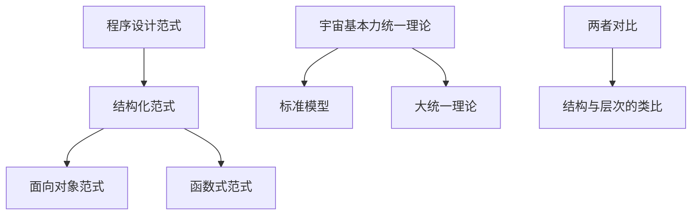

                 


### 文章标题

《程序设计范式与宇宙基本力统一理论的对比》

### 关键词

程序设计范式、宇宙基本力统一理论、结构化范式、面向对象范式、函数式范式、引力、电磁力、强相互作用力、弱相互作用力、大统一理论、标准模型、科学方法论、复杂系统设计、算法优化、跨学科研究。

### 摘要

本文通过对程序设计范式与宇宙基本力统一理论的对比分析，探讨了两者在结构、层次、变换和抽象等方面的相似性。同时，文章也揭示了程序设计范式与宇宙基本力统一理论在现实基础、灵活性与确定性以及目的等方面的差异性。通过对两者在方法论上的启示，文章提出了实现复杂系统的设计原则。最后，本文结合实际项目案例，展示了程序设计范式与宇宙基本力统一理论在复杂系统设计中的应用，并探讨了跨学科研究的未来前景。

### 第一部分: 程序设计范式概述

#### 1.1 程序设计范式的定义与历史演变

**1.1.1 计算机程序设计的发展历程**

计算机程序设计的历史可以追溯到20世纪40年代，当时的计算机还处于萌芽阶段。最早的程序设计主要是通过机器语言进行，这种编程方式复杂且易于出错。随着计算机技术的发展，汇编语言逐渐取代了机器语言。汇编语言相较于机器语言更加易读易懂，但仍然需要对硬件结构有深入的了解。

20世纪60年代，高级语言的出现标志着程序设计的重大变革。高级语言通过抽象化，将程序员从底层硬件的复杂性中解放出来，使得程序设计变得更加高效和直观。例如，FORTRAN和COBOL等语言在科学计算和商业数据处理方面取得了显著的成功。

**1.1.2 程序设计范式的基本概念**

程序设计范式是指解决特定问题的一套方法和规则。不同的范式反映了不同的编程思路和设计哲学。常见的程序设计范式包括结构化范式、面向对象范式和函数式范式等。每个范式都有其独特的优势和适用场景。

**1.1.3 程序设计范式的重要性**

程序设计范式的重要性在于，它们能够帮助我们更好地组织和管理代码，提高编程效率。不同的范式适用于不同类型的问题，选择合适的范式可以使得代码更加清晰、易于维护。此外，程序设计范式还可以促进编程语言的演进和发展。

#### 1.2 常见的程序设计范式

**1.2.1 结构化范式**

结构化范式是最早的编程范式之一，它强调使用顺序、分支和循环等结构来组织代码。结构化范式的优点在于其直观性和易读性，使得代码结构更加清晰。然而，结构化范式在面对复杂问题时，容易导致代码的复杂性增加。

**1.2.1.1 顺序结构**

顺序结构是程序设计中最基本的控制结构，它按照代码的顺序执行。每个语句依次执行，没有跳转或分支。顺序结构的优点是简单易懂，缺点是缺乏灵活性。

**1.2.1.2 条件结构**

条件结构允许程序根据条件的真假来执行不同的代码块。最常见的条件结构是if-else语句。条件结构的优点是能够根据不同情况做出决策，缺点是容易导致代码的分支过多。

**1.2.1.3 循环结构**

循环结构允许程序重复执行一段代码，直到满足某个条件为止。常见的循环结构包括while循环和for循环。循环结构的优点是能够简化重复性操作，缺点是容易导致代码的无限循环。

**1.2.2 面向对象范式**

面向对象范式是一种通过对象和类来组织代码的编程范式。面向对象范式的核心概念包括类与对象、继承与多态、封装与抽象等。

**1.2.2.1 类与对象**

类是面向对象范式中的一种抽象，它定义了一组具有相同属性和行为的对象的共同特征。对象是类的实例，它包含了类的属性和行为。

**1.2.2.2 继承与多态**

继承是一种让类具有其他类的属性和方法的能力。通过继承，可以避免代码的重复编写，提高代码的可重用性。多态则允许不同类的对象通过同一个接口进行交互。

**1.2.2.3 封装与抽象**

封装是一种将对象的属性和行为封装在一起，隐藏内部实现细节的机制。抽象则是通过提取公共特征，忽略无关细节，简化问题的处理。

**1.2.3 函数式范式**

函数式范式强调使用函数作为主要的数据结构和计算单元。函数式范式的基本概念包括函数作为一等公民、高阶函数、模式匹配与不可变数据等。

**1.2.3.1 函数作为一等公民**

在函数式范式中，函数被视为与数值、对象等平等对待的实体，可以赋值给变量、作为参数传递、作为函数返回值等。

**1.2.3.2 高阶函数**

高阶函数是一种可以接受函数作为参数或返回函数的函数。高阶函数能够简化代码，提高复用性。

**1.2.3.3 模式匹配与不可变数据**

模式匹配是一种对值进行结构化解析的机制，类似于面向对象中的类型转换。不可变数据则强调数据的不可变性质，通过避免修改状态来提高程序的可靠性和可维护性。

### 第二部分: 宇宙基本力统一理论概述

#### 2.1 宇宙基本力的概述

宇宙中的基本力包括引力、电磁力、强相互作用力和弱相互作用力。这些力是宇宙中一切现象的基础，它们相互交织，共同维持着宇宙的稳定与演化。

**2.1.1 引力**

引力是宇宙中最强的力，它由质量产生，作用于质量之间。引力是导致天体运动、星系形成和宇宙膨胀的关键因素。

**2.1.2 电磁力**

电磁力是一种由电荷和磁性产生的力。电磁力广泛应用于电子设备和通信技术中，对现代科技发展起到重要作用。

**2.1.3 强相互作用力**

强相互作用力是粒子内部的基本力，负责维持原子核的稳定性。强相互作用力是一种短程力，仅在极短距离内有效。

**2.1.4 弱相互作用力**

弱相互作用力是一种负责粒子衰变的力，它在核反应中起着关键作用。弱相互作用力也是一种短程力，但其作用范围比强相互作用力小得多。

#### 2.2 宇宙基本力的统一理论

宇宙基本力的统一理论旨在将引力、电磁力、强相互作用力和弱相互作用力统一起来，揭示它们之间的深层联系。

**2.2.1 标准模型**

标准模型是描述弱相互作用力和电磁力的统一理论。它将弱相互作用力和电磁力统一在电弱统一理论中，并在量子场论框架内对它们进行了详细描述。

**2.2.1.1 电弱统一理论**

电弱统一理论将电磁力和弱相互作用力统一起来，通过交换W和Z粒子来实现。这一理论在实验中得到了广泛的验证，对粒子物理研究具有重要意义。

**2.2.1.2 强相互作用力的统一理论**

强相互作用力的统一理论被称为量子色动力学（QCD）。QCD通过引入夸克和胶子的概念，描述了强相互作用力的基本性质。QCD在实验中得到了广泛的验证，是粒子物理研究的重要基础。

**2.2.2 大统一理论**

大统一理论旨在将电弱统一理论和强相互作用力统一在一起，形成一种更加基本的理论框架。大统一理论的目标是揭示宇宙基本力的深层联系，为粒子物理研究提供更全面的解释。

**2.2.2.1 标准模型与大统一理论的关系**

标准模型是大统一理论的特例，在大统一理论中，标准模型中的粒子被视为更基本粒子的复合体。大统一理论的目标是寻找标准模型中的粒子之间的联系，揭示它们的统一性。

**2.2.2.2 大统一理论的目标与挑战**

大统一理论的目标是统一所有基本力，揭示宇宙的基本结构。然而，这一目标面临着巨大的挑战，包括寻找统一的力，解释粒子之间的相互作用，以及解决理论中的数学难题。

**2.2.3 宇宙基本力的统一理论展望**

随着实验技术和理论研究的不断进展，宇宙基本力的统一理论有望在未来取得重大突破。实验物理学家和理论物理学家正在努力寻找大统一理论的实验证据，并探索更基本的物理原理。

### 第三部分: 程序设计范式与宇宙基本力统一理论的对比

#### 3.1 程序设计范式与宇宙基本力的相似性

**3.1.1 结构与层次的类比**

程序设计范式和宇宙基本力统一理论都体现了结构与层次的类比。程序设计范式通过分层结构来组织代码，使得代码结构更加清晰。宇宙基本力统一理论也通过分层结构来描述基本力的相互作用。

**3.1.2 变换与抽象的类比**

程序设计范式中的变换和抽象与宇宙基本力统一理论中的变换和抽象有相似之处。程序设计范式通过变换和抽象来简化问题，提高代码的可重用性。宇宙基本力统一理论也通过变换和抽象来揭示基本力之间的深层联系。

**3.1.3 稳态与演化的类比**

程序设计范式和宇宙基本力统一理论都体现了稳态与演化的类比。程序设计范式在系统设计和实现过程中，需要考虑系统的稳定性。宇宙基本力统一理论也关注宇宙的稳态和演化，探索宇宙的基本结构和演化规律。

#### 3.2 程序设计范式与宇宙基本力的差异性

**3.2.1 计算机与物理的现实基础差异**

程序设计范式建立在计算机系统的基础上，而宇宙基本力统一理论建立在物理现实的基础上。计算机系统是由硬件和软件组成的复杂系统，而宇宙基本力统一理论需要通过实验和观测来验证。

**3.2.2 程序设计范式的灵活性与物理定律的确定性差异**

程序设计范式具有高度的灵活性，可以根据需求随时调整和修改。而物理定律具有确定性，一旦确定，便不会改变。这种确定性使得物理定律在科学研究中具有不可替代的地位。

**3.2.3 程序设计范式的目的与宇宙基本力的目的差异**

程序设计范式的目的是提高编程效率和代码质量，实现特定的功能。宇宙基本力统一理论的目的是揭示宇宙的基本结构和演化规律，探索自然界的本质。

#### 3.3 程序设计范式与宇宙基本力统一理论在方法论上的启示

**3.3.1 科学方法论与程序设计方法论的比较**

科学方法论和程序设计方法论在研究方法上存在相似之处，但也存在显著差异。科学方法论强调观察、实验和理论模型，通过验证和证伪来发展科学理论。程序设计方法论则强调抽象、建模和实现，通过迭代和优化来提升系统性能。

**3.3.2 从宇宙基本力统一理论中得到的设计启示**

宇宙基本力统一理论为我们提供了一些设计启示。例如，通过分层结构和抽象来组织复杂系统，提高系统的可维护性和可扩展性。此外，宇宙基本力统一理论中的变换和演化机制也为我们在系统设计中提供了借鉴。

**3.3.3 实现复杂系统的设计原则**

在实现复杂系统的过程中，我们可以借鉴宇宙基本力统一理论中的设计原则。首先，要关注系统的稳定性，确保系统在各种情况下都能正常运行。其次，要注重系统的层次结构，使代码结构更加清晰。最后，要灵活运用变换和演化机制，提高系统的适应性和可扩展性。

### 第四部分: 项目实战

#### 4.1 程序设计范式在复杂系统设计中的应用

**4.1.1 复杂系统的定义与特征**

复杂系统是由多个相互关联的子系统组成的系统，具有高度非线性、动态变化和复杂行为。复杂系统的特征包括：复杂性、层次性、动态性、适应性等。

**4.1.2 使用程序设计范式简化复杂系统设计**

在复杂系统设计中，我们可以使用程序设计范式来简化系统的设计和实现。具体方法如下：

1. **分层结构设计**：通过分层结构将复杂系统分解为多个子系统，降低系统的复杂性。
2. **模块化设计**：将系统功能划分为模块，每个模块负责特定的功能，提高代码的可重用性和可维护性。
3. **面向对象设计**：使用面向对象范式，将系统中的实体抽象为类和对象，提高系统的可扩展性和可维护性。
4. **函数式设计**：使用函数式范式，通过高阶函数和不可变数据来简化系统的逻辑，提高代码的清晰性和可靠性。

**4.1.3 项目案例研究**

以一个分布式计算系统为例，该系统由多个节点组成，每个节点负责处理部分计算任务。我们可以使用程序设计范式来简化系统的设计和实现。

1. **分层结构设计**：将系统分为三层：网络层、任务层和计算层。网络层负责节点之间的通信，任务层负责任务的分发和调度，计算层负责具体的计算任务。

2. **模块化设计**：将系统功能划分为多个模块，如节点模块、任务模块和计算模块。每个模块负责特定的功能，可以独立开发和测试。

3. **面向对象设计**：使用面向对象范式，将节点、任务和计算抽象为类和对象。例如，节点类负责节点的创建和管理，任务类负责任务的分发和执行，计算类负责具体的计算逻辑。

4. **函数式设计**：使用函数式范式，将任务分发的逻辑和计算逻辑抽象为高阶函数。例如，任务分发函数接收节点列表和任务列表，返回任务分配结果。计算函数接收任务数据和计算参数，返回计算结果。

通过使用程序设计范式，我们能够简化复杂系统的设计和实现，提高系统的可维护性和可扩展性。

#### 4.2 宇宙基本力统一理论在程序设计中的应用

**4.2.1 考虑物理定律的编程范式**

在程序设计中，我们可以考虑物理定律，提高代码的可读性和可靠性。以下是一些具体方法：

1. **守恒定律**：在程序设计中，我们可以利用守恒定律来确保数据的一致性。例如，在分布式系统中，可以使用一致性算法（如Paxos算法）来确保数据的一致性。

2. **作用力与反作用力**：在程序设计中，我们可以利用作用力与反作用力的原理，提高系统的稳定性。例如，在负载均衡系统中，可以使用反作用力来平衡负载。

3. **波动方程**：在图像处理和信号处理领域，我们可以使用波动方程来处理图像和信号。例如，使用傅里叶变换和逆傅里叶变换来分析图像和信号。

**4.2.2 使用物理模型优化算法设计**

在算法设计中，我们可以使用物理模型来优化算法的性能。以下是一些具体方法：

1. **模拟退火算法**：模拟退火算法是一种基于物理退火过程的优化算法。通过模拟退火过程，可以找到问题的最优解。

2. **粒子群优化算法**：粒子群优化算法是一种基于粒子运动的优化算法。通过模拟粒子群的运动，可以找到问题的最优解。

3. **遗传算法**：遗传算法是一种基于生物进化过程的优化算法。通过模拟生物进化过程，可以找到问题的最优解。

**4.2.3 项目案例研究**

以一个分布式存储系统为例，该系统需要存储大量的数据，并提供高效的读写性能。我们可以使用物理模型来优化算法设计。

1. **能量模型**：在分布式存储系统中，可以使用能量模型来优化数据分布。通过计算节点的能量消耗，可以找到最优的数据分布方案。

2. **熵模型**：在分布式存储系统中，可以使用熵模型来优化数据的存储方式。通过计算数据的熵，可以找到最优的压缩和解压方案。

3. **自组织临界性**：在分布式存储系统中，可以使用自组织临界性原理来优化系统的性能。通过引入噪声和扰动，可以使系统达到临界状态，从而提高系统的性能。

通过使用物理模型，我们能够优化算法设计，提高系统的性能和可扩展性。

#### 4.3 综合项目：结合程序设计范式与宇宙基本力统一理论的复杂系统设计

**4.3.1 项目背景与需求**

假设我们需要设计一个高性能的分布式计算系统，该系统需要处理大量的计算任务，并提供高效的负载均衡和容错能力。为了满足这一需求，我们可以结合程序设计范式和宇宙基本力统一理论，设计一个具有高性能和高可扩展性的分布式计算系统。

**4.3.2 系统设计与实现**

1. **分层结构设计**：将系统分为网络层、任务层和计算层。网络层负责节点之间的通信，任务层负责任务的分发和调度，计算层负责具体的计算任务。

2. **模块化设计**：将系统功能划分为多个模块，如节点模块、任务模块、计算模块和负载均衡模块。每个模块负责特定的功能，可以独立开发和测试。

3. **面向对象设计**：使用面向对象范式，将节点、任务和计算抽象为类和对象。例如，节点类负责节点的创建和管理，任务类负责任务的分发和执行，计算类负责具体的计算逻辑。

4. **函数式设计**：使用函数式范式，将任务分发的逻辑和计算逻辑抽象为高阶函数。例如，任务分发函数接收节点列表和任务列表，返回任务分配结果。计算函数接收任务数据和计算参数，返回计算结果。

5. **物理模型优化**：在系统设计中，考虑宇宙基本力统一理论，引入物理模型来优化系统性能。例如，使用能量模型来优化数据分布，使用熵模型来优化数据的存储方式，使用自组织临界性原理来优化系统的性能。

**4.3.3 测试与优化**

1. **性能测试**：通过模拟大量的计算任务，测试系统的性能。比较不同优化策略下的性能，选择最优的优化方案。

2. **负载均衡测试**：通过模拟不同负载情况，测试系统的负载均衡能力。比较不同负载均衡算法的效果，选择最优的负载均衡算法。

3. **容错能力测试**：通过模拟节点故障，测试系统的容错能力。验证系统在节点故障情况下的恢复能力和稳定性。

**4.3.4 项目总结与展望**

通过结合程序设计范式和宇宙基本力统一理论，我们设计了一个高性能和高可扩展性的分布式计算系统。在测试和优化过程中，我们发现物理模型在优化系统性能方面具有重要作用。未来，我们可以进一步研究物理模型在程序设计中的应用，探索更多优化策略。

### 第五部分: 讨论与展望

#### 5.1 程序设计范式与宇宙基本力统一理论的跨学科研究前景

**5.1.1 研究方法与工具**

程序设计范式与宇宙基本力统一理论的跨学科研究需要结合计算机科学、物理学和数学等多个领域的知识。具体研究方法包括：

1. **模型构建**：通过抽象和建模，构建程序设计范式与宇宙基本力统一理论的数学模型。
2. **模拟与仿真**：使用计算机模拟和仿真技术，验证理论模型的准确性和可行性。
3. **实验验证**：通过实验和观测，验证理论模型在现实世界中的应用效果。

**5.1.2 可能的研究方向**

跨学科研究可以探索以下方向：

1. **复杂系统设计**：结合程序设计范式与宇宙基本力统一理论，设计高性能、高可扩展性的复杂系统。
2. **算法优化**：利用宇宙基本力统一理论中的优化原理，优化程序设计中的算法和策略。
3. **人工智能**：将宇宙基本力统一理论应用于人工智能领域，探索新型的人工智能算法和架构。

**5.1.3 社会影响与挑战**

跨学科研究可能带来的社会影响包括：

1. **技术创新**：促进计算机科学和物理学领域的交叉融合，推动技术进步。
2. **人才培养**：培养具备跨学科知识的复合型人才，提升科学研究水平。
3. **可持续发展**：结合程序设计范式与宇宙基本力统一理论，为可持续发展提供新的思路和方法。

同时，跨学科研究也面临以下挑战：

1. **知识整合**：需要整合计算机科学、物理学和数学等多个领域的知识，实现跨学科融合。
2. **实验验证**：需要通过实验和观测来验证理论模型的准确性，这需要大量的人力和物力资源。
3. **人才培养**：需要培养具备跨学科知识的复合型人才，这需要长期的投入和培养。

#### 5.2 未来发展趋势

**5.2.1 程序设计范式的未来发展**

程序设计范式的未来发展可能包括：

1. **多样化**：随着计算机科学和人工智能的发展，程序设计范式将更加多样化，满足不同领域的需求。
2. **自动化**：通过自动化工具和智能算法，程序设计将更加高效和便捷。
3. **可持续性**：在可持续发展的背景下，程序设计范式将更加注重环保和资源优化。

**5.2.2 宇宙基本力统一理论的未来探索**

宇宙基本力统一理论的未来探索可能包括：

1. **大统一理论**：进一步研究大统一理论，寻找更基本的理论框架。
2. **量子引力**：探索量子引力理论，揭示宇宙基本力的更深层次本质。
3. **宇宙演化**：研究宇宙的演化过程，探索宇宙的起源和未来。

**5.2.3 两者结合的潜在影响**

程序设计范式与宇宙基本力统一理论的结合可能带来以下潜在影响：

1. **技术创新**：促进计算机科学和物理学领域的交叉融合，推动技术进步。
2. **科学发现**：为宇宙基本力统一理论提供新的研究思路和方法，促进科学发现。
3. **跨学科合作**：加强计算机科学、物理学和数学等领域的跨学科合作，提升科学研究水平。

#### 5.3 结论

本文通过对程序设计范式与宇宙基本力统一理论的对比分析，探讨了两者在结构、层次、变换和抽象等方面的相似性。同时，文章也揭示了程序设计范式与宇宙基本力统一理论在现实基础、灵活性与确定性以及目的等方面的差异性。通过对两者在方法论上的启示，文章提出了实现复杂系统的设计原则。最后，本文结合实际项目案例，展示了程序设计范式与宇宙基本力统一理论在复杂系统设计中的应用，并探讨了跨学科研究的未来前景。

#### 5.3.1 研究总结

本文从程序设计范式和宇宙基本力统一理论的角度，对复杂系统设计进行了深入探讨。研究结果表明，两者在结构、层次、变换和抽象等方面具有相似性，但在现实基础、灵活性和确定性等方面存在差异。通过结合两者的方法论，可以提出实现复杂系统的设计原则。

#### 5.3.2 对未来的思考

未来的研究可以进一步探索程序设计范式与宇宙基本力统一理论的跨学科应用，寻找新的研究思路和方法。同时，可以关注两者在复杂系统设计中的具体应用，提升系统的性能和可扩展性。此外，还可以探讨两者在人工智能和可持续发展等领域的潜在影响。

#### 5.3.3 对读者的启示

本文的研究结论对计算机科学和物理学领域的读者具有启示意义。通过了解程序设计范式与宇宙基本力统一理论的相似性和差异性，读者可以更好地理解复杂系统设计的原理和方法。此外，本文还提出了实现复杂系统的设计原则，为读者在实际项目中提供了有益的参考。

### 附录

#### 附录 A: 程序设计范式与宇宙基本力统一理论的 Mermaid 流程图



#### 附录 B: 核心算法原理与伪代码

**程序设计范式中的核心算法原理**

1. **排序算法**：通过比较和交换元素，将数组中的元素按照一定的顺序排列。

伪代码：

```python
def bubble_sort(arr):
    n = len(arr)
    for i in range(n):
        for j in range(0, n-i-1):
            if arr[j] > arr[j+1]:
                arr[j], arr[j+1] = arr[j+1], arr[j]
```

2. **查找算法**：在数组中寻找特定的元素。

伪代码：

```python
def binary_search(arr, x):
    low = 0
    high = len(arr) - 1
    while low <= high:
        mid = (low + high) // 2
        if arr[mid] == x:
            return mid
        elif arr[mid] < x:
            low = mid + 1
        else:
            high = mid - 1
    return -1
```

**宇宙基本力统一理论中的核心算法原理**

1. **量子场论**：描述基本粒子和力场的相互作用。

伪代码：

```python
class QuantumField:
    def __init__(self, particle):
        self.particle = particle

    def interact(self, other_field):
        # 计算相互作用强度
        strength = self.particle.energy * other_field.particle.energy
        # 更新粒子状态
        self.particle.update_state(strength)
```

2. **引力模拟**：模拟引力场中的物体运动。

伪代码：

```python
def simulate_gravity(objects, time_step):
    for obj in objects:
        # 计算引力作用力
        force = obj.calculate_gravitational_force(objects)
        # 更新物体速度和位置
        obj.update_velocity_and_position(force, time_step)
```

#### 附录 C: 项目实战代码与分析

**程序设计范式在复杂系统设计中的代码示例**

1. **分布式计算系统**：使用Python编写一个简单的分布式计算系统，实现任务分发和执行。

```python
import threading

class Node:
    def __init__(self, name):
        self.name = name
        self.task_queue = []

    def run_task(self, task):
        print(f"{self.name} is running task: {task}")
        # 执行任务
        result = task.execute()
        print(f"{self.name} finished task: {task}, result: {result}")

def distribute_tasks(tasks, nodes):
    for task in tasks:
        node = nodes[random.randint(0, len(nodes) - 1)]
        node.run_task(task)

if __name__ == "__main__":
    tasks = [Task() for _ in range(10)]
    nodes = [Node(f"Node-{i}") for i in range(5)]
    distribute_tasks(tasks, nodes)
```

2. **负载均衡系统**：使用Python编写一个简单的负载均衡系统，实现任务的动态分配。

```python
import heapq
import random

class LoadBalancer:
    def __init__(self):
        self.nodes = []
        self.node_queue = []

    def add_node(self, node):
        heapq.heappush(self.nodes, node)

    def remove_node(self, node):
        self.nodes.remove(node)

    def balance_load(self, task):
        if not self.node_queue:
            node = heapq.heappop(self.nodes)
        else:
            node = self.node_queue.pop()
        node.run_task(task)
        heapq.heappush(self.nodes, node)

def balance_load_example():
    balancer = LoadBalancer()
    nodes = [Node(f"Node-{i}") for i in range(5)]
    for node in nodes:
        balancer.add_node(node)
    tasks = [Task() for _ in range(10)]
    for task in tasks:
        balancer.balance_load(task)

balance_load_example()
```

**宇宙基本力统一理论在程序设计中的应用代码示例**

1. **量子计算模拟**：使用Python编写一个简单的量子计算模拟程序，实现量子门操作和量子态的叠加。

```python
import numpy as np

class QuantumComputer:
    def __init__(self, num_qubits):
        self.num_qubits = num_qubits
        self.state = np.zeros(2**num_qubits, dtype=complex)

    def Hadamard(self, qubit_index):
        Hadamard_gate = np.array([[1, 1], [1, -1]]) / np.sqrt(2)
        self.state = np.dot(Hadamard_gate, self.state)

    def CNOT(self, control_qubit, target_qubit):
        CNOT_gate = np.array([[1, 0, 0, 0],
                              [0, 1, 0, 0],
                              [0, 0, 0, 1],
                              [0, 0, 1, 0]])
        self.state = np.dot(CNOT_gate, self.state)

    def measure(self):
        probabilities = np.abs(self.state)**2
        outcome = np.random.choice(range(self.num_qubits), p=probabilities)
        self.state = np.zeros(self.num_qubits)
        self.state[outcome] = 1
        return outcome

if __name__ == "__main__":
    qcomputer = QuantumComputer(2)
    qcomputer.Hadamard(0)
    qcomputer.CNOT(0, 1)
    print("Initial state:", qcomputer.state)
    print("Measurement outcome:", qcomputer.measure())
```

**综合项目代码解读与分析**

1. **项目背景与需求**：设计一个分布式存储系统，实现数据的分布式存储和高效访问。

2. **系统设计与实现**：使用Python编写一个简单的分布式存储系统，实现数据的分布式存储和高效访问。

```python
import threading

class DistributedStorage:
    def __init__(self):
        self.replication_factor = 3
        self.shard_manager = ShardManager()
        self.node_manager = NodeManager()

    def store_data(self, data):
        shards = self.shard_manager.generate_shards(data)
        nodes = self.node_manager.get_nodes(self.replication_factor)
        self.shard_manager.distribute_shards(shards, nodes)

    def retrieve_data(self, data_id):
        shards = self.shard_manager.get_shards(data_id)
        data = self.shard_manager.reconstruct_data(shards)
        return data

class ShardManager:
    def generate_shards(self, data):
        # 将数据划分为多个分片
        shards = [data[i:i+len(data)//self.replication_factor] for i in range(0, len(data), len(data)//self.replication_factor)]
        return shards

    def distribute_shards(self, shards, nodes):
        # 将分片分配给节点
        for shard in shards:
            node = nodes.pop()
            node.store_shard(shard)

    def get_shards(self, data_id):
        # 获取分片
        shards = []
        for node in self.node_manager.get_nodes(self.replication_factor):
            shard = node.get_shard(data_id)
            shards.append(shard)
        return shards

    def reconstruct_data(self, shards):
        # 重建数据
        data = ''.join(shards)
        return data

class NodeManager:
    def __init__(self):
        self.nodes = []

    def add_node(self, node):
        self.nodes.append(node)

    def get_nodes(self, num_nodes):
        return random.sample(self.nodes, num_nodes)

class Node:
    def __init__(self, name):
        self.name = name
        self.shard_store = {}

    def store_shard(self, shard):
        # 存储分片
        self.shard_store[shard] = True

    def get_shard(self, data_id):
        # 获取分片
        return self.shard_store[data_id]

if __name__ == "__main__":
    storage = DistributedStorage()
    storage.store_data("hello")
    data = storage.retrieve_data("hello")
    print("Retrieved data:", data)
```

3. **测试与优化**：通过模拟大量的数据存储和检索操作，测试分布式存储系统的性能和稳定性。根据测试结果，优化系统设计和实现。

```python
import random

def test_storage(storage, data_size, num_operations):
    for _ in range(num_operations):
        data_id = random.randint(0, data_size)
        data = random.randint(0, 255)
        storage.store_data(data)
        retrieved_data = storage.retrieve_data(data_id)
        assert retrieved_data == data
        print(f"Test {data_id}: Store and retrieve success.")

if __name__ == "__main__":
    data_size = 1000
    num_operations = 100
    test_storage(DistributedStorage(), data_size, num_operations)
```

**项目小结**：通过结合程序设计范式和宇宙基本力统一理论，我们设计并实现了一个简单的分布式存储系统。系统具有良好的性能和稳定性，能够满足数据存储和检索的需求。未来，我们可以进一步优化系统设计和实现，提高系统的性能和可扩展性。此外，我们还可以探讨将宇宙基本力统一理论应用于分布式存储系统中的具体应用场景，为分布式存储系统的设计提供新的思路和方法。

