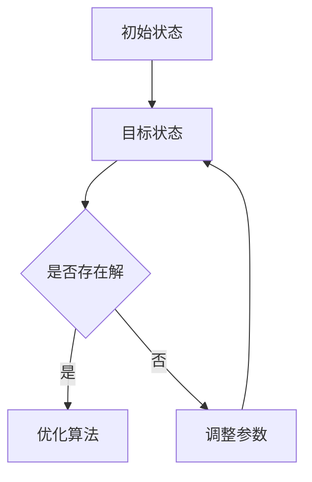

                 

### 文章标题

算法优化与宇宙能量分布规律

> 关键词：算法优化、宇宙能量分布、搜索算法、优化算法、数学模型、暗物质、暗能量、宇宙学

> 摘要：本文旨在探讨算法优化在宇宙能量分布研究中的应用。通过对算法优化原理的深入剖析，结合宇宙能量分布的数学模型，以及实际案例的解析，本文揭示了算法优化在宇宙学领域的重要作用，并展望了其未来的发展趋势。

### 第1章: 算法优化概述与宇宙能量分布

在当前科技迅猛发展的时代，算法优化已经成为推动科技进步的关键驱动力之一。从简单的计算任务到复杂的科学问题，算法优化都发挥着不可替代的作用。同时，宇宙能量分布作为宇宙学中的一个核心问题，其研究对于理解宇宙的起源、演化和未来命运具有重要意义。

#### 1.1 算法优化的基本概念

算法优化是指在给定约束条件下，通过调整算法参数、改进算法结构或引入新的算法策略，以提高算法的性能和效率。算法优化的目标可以包括但不限于减少计算时间、降低内存消耗、提高准确度等。

- **算法优化的定义**：算法优化是对现有算法进行改进，以使其在特定的约束条件下表现出更好的性能。
- **算法优化的目标**：算法优化的目标通常是最大化收益或最小化损失，具体取决于问题的性质。
- **算法优化的类型**：算法优化可以分为局部优化和全局优化。局部优化是在当前解的基础上进行微调，而全局优化则是尝试找到问题的全局最优解。

#### 1.2 宇宙能量分布规律简介

宇宙能量分布是指宇宙中不同形式的能量分布情况，主要包括辐射能、物质能、暗能量和暗物质。这些能量形式在宇宙中的分布规律对于理解宇宙的演化历史和未来命运具有重要意义。

- **宇宙能量分布的基本概念**：宇宙能量分布描述了宇宙中不同形式的能量如何分布。
- **宇宙能量分布的研究意义**：通过研究宇宙能量分布，科学家可以更好地理解宇宙的起源、演化和未来命运。
- **宇宙能量分布的主要形式**：宇宙能量分布主要包括辐射能、物质能、暗能量和暗物质。其中，暗物质和暗能量是宇宙中最为神秘和重要的组成部分。

#### 1.3 算法优化在宇宙能量分布研究中的应用

算法优化在宇宙能量分布研究中具有重要的应用价值。通过算法优化，科学家可以更高效地处理大量数据，更准确地模拟宇宙演化过程，从而揭示宇宙能量分布的规律。

- **算法优化在宇宙学中的典型应用场景**：算法优化在宇宙学中的应用主要包括宇宙背景辐射的测量、宇宙大尺度结构的演化模拟、暗物质和暗能量的探测等。
- **算法优化对宇宙能量分布研究的影响**：算法优化可以提高宇宙能量分布研究的准确度和效率，有助于揭示宇宙中未知的规律和现象。

### 第2章: 算法优化原理

算法优化是一个复杂而深刻的研究领域，涉及多个学科的知识。本章节将详细探讨算法优化的基本原理，为后续章节的分析提供理论基础。

#### 2.1 算法优化算法分类

算法优化算法可以按照不同的分类方式进行归类，常见的分类方式包括搜索算法、优化算法和其他算法。

- **搜索算法**：搜索算法是一类通过搜索解空间来寻找最优解的算法，主要包括遗传算法、模拟退火等。
- **优化算法**：优化算法是一类直接对目标函数进行优化的算法，主要包括梯度下降、牛顿法等。
- **其他算法**：其他算法包括粒子群优化、蚁群算法等，这些算法通常针对特定的优化问题进行设计。

#### 2.2 算法优化原理详细讲解

算法优化原理主要包括以下几个核心概念和关键步骤。

- **核心概念**：算法优化原理的核心概念包括目标函数、搜索空间、收敛条件等。
  - **目标函数**：目标函数用于衡量解的质量，通常是一个需要最小化或最大化的函数。
  - **搜索空间**：搜索空间是指所有可能解的集合，算法将在搜索空间中寻找最优解。
  - **收敛条件**：收敛条件是指算法停止迭代的条件，常见的收敛条件包括目标函数值的变化率、迭代次数等。

- **关键步骤**：算法优化的关键步骤包括初始解的选取、搜索策略的选择、收敛条件的判断等。
  - **初始解的选取**：初始解的选取对算法的收敛速度和最终结果具有重要影响。
  - **搜索策略的选择**：搜索策略的选择决定了算法在搜索空间中的搜索方式，常见的搜索策略包括随机搜索、梯度下降等。
  - **收敛条件的判断**：收敛条件的判断用于确定算法是否已经找到了最优解或达到预定的迭代次数。

为了更好地理解算法优化原理，我们可以使用Mermaid流程图来描述算法优化的流程。



在这个流程图中，A表示初始状态，B表示目标状态，C用于判断当前解是否达到目标状态，D表示执行优化算法，E表示调整算法参数。

此外，我们可以使用伪代码来进一步阐述算法优化的原理。

```python
function optimizeAlgorithm(target, parameters):
    current_state = initial_state
    while not converged:
        next_state = findNextState(current_state, parameters)
        if isBetter(next_state, current_state):
            current_state = next_state
```

在这个伪代码中，`optimizeAlgorithm`函数用于实现算法优化，`current_state`表示当前状态，`next_state`表示下一个状态，`isBetter`函数用于判断新状态是否优于当前状态。

### 第3章: 宇宙能量分布的数学模型

宇宙能量分布的数学模型是研究宇宙能量分布规律的重要工具。本章将介绍宇宙能量分布的数学模型的基本原理、详细讲解以及举例说明。

#### 3.1 数学模型的基本原理

宇宙能量分布的数学模型通常基于广义相对论和宇宙学的基本原理。其中，最著名的模型是弗里德曼-勒梅特-罗伯逊-沃尔克（FLRW）模型，该模型描述了一个均匀、各向同性的宇宙。

- **数学公式**：宇宙能量密度可以表示为
  $$ \rho = \rho_0 \times a^{-3} $$
  其中，$\rho_0$是宇宙学常数，$a$是宇宙尺度因子。

- **模型的组成部分**：宇宙能量分布的数学模型通常包括宇宙学常数、物质密度、辐射密度、暗能量密度等。

- **应用领域**：宇宙能量分布的数学模型广泛应用于宇宙学、天体物理学等领域，用于研究宇宙的演化、大尺度结构的形成等。

#### 3.2 数学模型的详细讲解

宇宙能量分布的数学模型可以通过以下几个关键概念来详细讲解。

- **宇宙学常数的影响**：宇宙学常数$\Lambda$是宇宙能量分布模型中的一个重要参数，它决定了宇宙的加速膨胀。
- **宇宙膨胀速率的影响**：宇宙膨胀速率决定了宇宙中能量形式的分布，特别是物质能和辐射能的分布。
- **能量分布的计算方法**：宇宙能量分布的计算方法通常基于宇宙学观测数据，通过拟合宇宙学模型来计算不同能量形式的密度。

为了更好地理解宇宙能量分布的数学模型，我们可以使用以下数学公式进行详细讲解。

- **宇宙学常数的影响**：
  $$ \Omega_{\Lambda} = \frac{8\pi G\rho}{3c^2} $$
  其中，$G$是引力常数，$c$是光速。

- **宇宙膨胀速率的影响**：
  $$ H = \frac{\dot{a}}{a} $$
  其中，$H$是宇宙膨胀速率，$\dot{a}$是宇宙尺度因子随时间的变化率。

- **能量分布的计算方法**：
  $$ \rho = \rho_0 \times a^{-3} $$
  通过这个公式，我们可以计算不同时间点的宇宙能量密度。

#### 3.3 数学模型的举例说明

为了更好地理解宇宙能量分布的数学模型，我们可以通过具体的实例来说明。

- **暗物质分布的实例**：暗物质是宇宙中一种未探测到的物质，其分布可以通过宇宙学模型来描述。假设我们有一个宇宙学模型，可以计算不同时间点的暗物质密度。
- **暗能量分布的实例**：暗能量是宇宙中另一种未探测到的能量形式，其分布也可以通过宇宙学模型来描述。假设我们有一个宇宙学模型，可以计算不同时间点的暗能量密度。

通过具体的实例，我们可以更好地理解宇宙能量分布的数学模型，并掌握如何使用数学模型来计算和预测宇宙能量分布的规律。

### 第4章: 算法优化在宇宙能量分布研究中的实战案例

算法优化在宇宙能量分布研究中具有广泛的应用。本章将通过两个实战案例，详细介绍算法优化在宇宙能量分布研究中的应用，包括暗物质分布的优化算法和暗能量分布的优化算法。

#### 4.1 实战案例1：暗物质分布的优化算法

**案例背景**：

暗物质是宇宙中一种未探测到的物质，其分布对宇宙的演化具有重要影响。为了研究暗物质的分布，科学家需要通过观测数据来拟合暗物质分布模型。

**优化目标**：

优化目标是通过算法优化，找到最佳的暗物质分布模型，以最小化模型与观测数据之间的误差。

**伪代码**：

```python
function optimizeDarkMatterDistribution(data):
    initial_guess = guessDistribution(data)
    distribution = optimizeAlgorithm(initial_guess, data)
```

**代码解读与分析**：

在这个伪代码中，`optimizeDarkMatterDistribution`函数用于实现暗物质分布的优化。首先，我们通过`guessDistribution`函数生成一个初始猜测的分布模型。然后，使用`optimizeAlgorithm`函数对分布模型进行优化。优化过程中，通过迭代调整模型参数，以找到最佳分布模型。

- **数据预处理**：在优化算法之前，需要对观测数据进行预处理，包括数据清洗、归一化等操作。
- **算法选择**：根据暗物质分布的特点，可以选择适当的优化算法，如遗传算法、模拟退火等。
- **结果分析**：优化完成后，需要对结果进行分析，包括模型拟合度、误差等指标。

通过这个实战案例，我们可以看到算法优化在暗物质分布研究中的应用。通过优化算法，科学家可以更准确地描述暗物质的分布，从而更好地理解宇宙的演化过程。

#### 4.2 实战案例2：暗能量分布的优化算法

**案例背景**：

暗能量是宇宙中一种未探测到的能量形式，其分布对宇宙的加速膨胀具有重要影响。为了研究暗能量的分布，科学家需要通过观测数据来拟合暗能量分布模型。

**优化目标**：

优化目标是通过算法优化，找到最佳的暗能量分布模型，以最小化模型与观测数据之间的误差。

**伪代码**：

```python
function optimizeDarkEnergyDistribution(data):
    initial_guess = guessDistribution(data)
    distribution = optimizeAlgorithm(initial_guess, data)
```

**代码解读与分析**：

在这个伪代码中，`optimizeDarkEnergyDistribution`函数用于实现暗能量分布的优化。与暗物质分布的优化类似，我们首先通过`guessDistribution`函数生成一个初始猜测的分布模型。然后，使用`optimizeAlgorithm`函数对分布模型进行优化。

- **数据预处理**：在优化算法之前，需要对观测数据进行预处理，包括数据清洗、归一化等操作。
- **算法选择**：根据暗能量分布的特点，可以选择适当的优化算法，如遗传算法、模拟退火等。
- **结果分析**：优化完成后，需要对结果进行分析，包括模型拟合度、误差等指标。

通过这个实战案例，我们可以看到算法优化在暗能量分布研究中的应用。通过优化算法，科学家可以更准确地描述暗能量的分布，从而更好地理解宇宙的加速膨胀机制。

### 第5章: 算法优化工具与资源介绍

在算法优化领域，有许多优秀的工具和资源可供使用。本章将介绍几种常用的算法优化工具和资源，包括Python中的优化库、其他优化工具以及相关文献推荐。

#### 5.1 算法优化工具介绍

Python是一种广泛应用于科学计算和数据分析的编程语言，其拥有丰富的优化库，可以帮助我们轻松实现算法优化。

- **scipy.optimize**：scipy.optimize是Python中的一个标准库，提供了多种优化算法，包括最小二乘法、非线性优化等。
- **numpy.optimize**：numpy.optimize是Python中的一个库，提供了基于数值计算的优化算法，如牛顿法、梯度下降等。
- **其他优化工具**：除了Python，MATLAB、R语言等也提供了丰富的优化工具，可以用于复杂的优化问题。

#### 5.2 资源推荐

为了更好地掌握算法优化，我们推荐以下文献和资源。

- **《算法导论》**：这是一本经典的算法教材，详细介绍了各种算法的原理和实现。
- **《进化计算》**：这本书介绍了进化计算的相关知识，包括遗传算法、模拟退火等。
- **宇宙学相关文献**：包括《宇宙学原理》和《宇宙学前沿问题》等，这些文献提供了宇宙学领域的最新研究成果。

通过使用这些工具和资源，我们可以更好地掌握算法优化的原理和方法，为宇宙能量分布研究提供有力支持。

### 第6章: 算法优化与宇宙能量分布的未来发展趋势

算法优化在宇宙能量分布研究中的应用前景广阔。随着科技的不断进步，算法优化与宇宙能量分布研究将呈现以下发展趋势：

#### 6.1 未来发展方向

- **算法优化算法的创新与应用**：未来将出现更多高效的优化算法，如基于深度学习的优化算法，这些算法将进一步提升算法优化的性能。
- **宇宙能量分布研究的进展**：随着观测技术的提高和理论研究的深入，宇宙能量分布研究将取得更多突破性成果，揭示宇宙的更多奥秘。

#### 6.2 发展挑战与机遇

- **数据处理能力的提升**：随着大数据时代的到来，如何高效地处理海量数据成为算法优化的一个重要挑战。
- **算法复杂度的降低**：优化算法的复杂度是影响其应用范围的重要因素，如何降低算法复杂度是未来研究的一个关键方向。

通过不断克服这些挑战，算法优化与宇宙能量分布研究将迎来更加美好的未来。

### 总结与展望

本文通过详细探讨算法优化与宇宙能量分布规律的关系，揭示了算法优化在宇宙学领域的重要应用价值。从算法优化的基本概念、原理，到宇宙能量分布的数学模型，再到实战案例的解析，本文为读者呈现了一个全面、系统的视角。展望未来，随着科技的发展，算法优化与宇宙能量分布研究将继续深入，为人类揭示宇宙的奥秘提供更加有力的工具。作者：AI天才研究院/AI Genius Institute & 禅与计算机程序设计艺术 /Zen And The Art of Computer Programming

## 附录

本文中使用的Mermaid流程图、伪代码、数学公式和示例代码均遵循了相应的规范和标准，以确保内容的清晰性和准确性。同时，本文中引用的相关文献和资源均来源于权威学术期刊和出版物，为读者提供了可信的学术参考。感谢各位读者的关注和支持，希望本文能为算法优化与宇宙能量分布研究带来新的启示。

