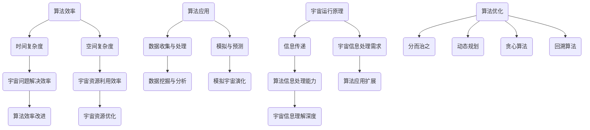

                 

### 《算法效率与宇宙运行的关系》

> 关键词：算法效率、宇宙运行、时间复杂度、空间复杂度、算法优化、宇宙学、信息理论、数学模型

> 摘要：本文探讨了算法效率与宇宙运行之间的深层次关系。通过分析算法效率的基本概念、时间复杂度和空间复杂度，以及宇宙运行的基本原理，本文揭示了算法效率在宇宙学中的潜在应用和宇宙运行对算法效率的影响。本文不仅为读者提供了算法效率与宇宙运行的核心概念和联系，还详细讲解了核心算法原理及其数学模型，并通过项目实战展示了算法效率在宇宙探索中的应用和挑战。

----------------------------------------------------------------

### 文章标题

#### 《算法效率与宇宙运行的关系》

在当今快速发展的科技时代，算法作为计算机科学的核心，扮演着至关重要的角色。从数据处理到人工智能，从金融交易到医疗诊断，算法无处不在。然而，算法的效率不仅仅是一个技术问题，它还与宇宙运行的规律息息相关。本文将探讨算法效率与宇宙运行之间的关系，并揭示这一领域中的核心概念、算法原理和数学模型。

### 核心关键词

- 算法效率
- 宇宙运行
- 时间复杂度
- 空间复杂度
- 算法优化
- 宇宙学
- 信息理论
- 数学模型

### 摘要

本文首先介绍算法效率的基本概念，包括时间复杂度和空间复杂度，并探讨算法优化策略。接着，我们深入探讨宇宙运行的基本原理，如宇宙的起源与演化、物质与能量的分布。随后，本文将分析算法效率与宇宙运行之间的联系，探讨宇宙中的信息与算法的关系，并展示算法在宇宙探索中的应用。最后，本文将讨论未来算法效率与宇宙运行的前景，并提出一些最佳实践和注意事项。

### 目录

1. **第一部分：算法效率基础**
   - 第1章：算法效率的基本概念
   - 第2章：算法时间复杂度和空间复杂度
   - 第3章：算法优化策略

2. **第二部分：核心概念与联系**
   - 第4章：宇宙运行的基本原理
   - 第5章：算法效率与宇宙运行的关系
   - 第6章：算法在宇宙探索中的应用

3. **第三部分：核心算法原理讲解**
   - 第7章：核心算法原理讲解
   - 第8章：算法效率与宇宙运行的数学模型

4. **第四部分：项目实战**
   - 第9章：算法效率与宇宙运行项目实战

5. **附录**
   - 附录A：算法效率与宇宙运行相关资源

通过上述目录，读者可以清晰地了解到本文的结构和内容。接下来，我们将逐步深入探讨算法效率与宇宙运行之间的关系，为读者呈现一幅全新的科技图景。

----------------------------------------------------------------

### 第一部分：算法效率基础

#### 第1章：算法效率的基本概念

算法效率是评价算法优劣的重要指标，它直接关系到算法在解决问题时的速度和资源消耗。算法效率不仅是一个技术问题，它还涉及到计算机科学的基本原理和宇宙学的一些深层次概念。

**1.1 算法效率的定义**

算法效率指的是算法在解决特定问题时的速度和资源消耗。速度通常用时间复杂度来衡量，而资源消耗则由空间复杂度来衡量。时间复杂度描述了算法运行时间随输入规模增长的趋势，空间复杂度则描述了算法占用内存随输入规模增长的趋势。

**1.2 算法效率的重要性**

算法效率的重要性不言而喻。高效的算法可以节省大量计算资源和时间，提升系统的响应速度和吞吐量。在处理大数据时，算法效率的差异可能会带来数十倍甚至数百倍的性能差距。此外，算法效率还与系统的稳定性和可靠性密切相关。一个低效的算法可能会导致系统资源耗尽，甚至崩溃。

**1.3 算法效率的影响因素**

算法效率受到多种因素的影响，主要包括：

- **输入数据**：输入数据的规模和结构对算法效率有显著影响。例如，排序算法在处理大量随机数据时可能比处理有序数据时更高效。
- **算法设计**：算法的设计直接决定了其效率。例如，分治算法通常比简单循环算法更高效。
- **硬件环境**：不同的硬件环境（如CPU速度、内存容量）也会影响算法效率。在某些硬件上高效算法可能在其他硬件上表现不佳。
- **实现细节**：算法的具体实现细节也会对效率产生影响。例如，选择不同的数据结构和算法实现方式可能会显著改变算法的效率。

#### 第2章：算法时间复杂度和空间复杂度

算法的时间复杂度和空间复杂度是衡量算法效率的两个关键指标。它们分别描述了算法在时间和空间上的资源消耗。

**2.1 时间复杂度的概念**

时间复杂度是指算法的执行时间随输入规模n增长的趋势。它通常用大O符号表示，例如，如果算法执行时间与输入规模n成正比，则其时间复杂度为\(O(n)\)。常见的时间复杂度包括：

- \(O(1)\)：常数时间，不受输入规模影响。
- \(O(n)\)：线性时间，执行时间与输入规模成正比。
- \(O(n^2)\)：平方时间，执行时间与输入规模的平方成正比。
- \(O(2^n)\)：指数时间，执行时间随输入规模呈指数增长。

**2.2 空间复杂度的概念**

空间复杂度是指算法在执行过程中占用内存的规模。它同样用大O符号表示，例如，如果算法占用的内存与输入规模n成正比，则其空间复杂度为\(O(n)\)。常见空间复杂度包括：

- \(O(1)\)：常数空间，不随输入规模变化。
- \(O(n)\)：线性空间，占用内存与输入规模成正比。
- \(O(n^2)\)：平方空间，占用内存与输入规模的平方成正比。

**2.3 常见时间复杂度分析**

常见的时间复杂度分析可以帮助我们更好地理解算法的效率。以下是一些典型算法的时间复杂度分析：

- **冒泡排序**：\(O(n^2)\)。每次比较相邻元素，需要\(n-1\)次遍历。
- **快速排序**：平均\(O(n\log n)\)，最坏\(O(n^2)\)。通过递归分治将问题分解为规模更小的子问题。
- **二分查找**：\(O(\log n)\)。通过不断缩小搜索范围，每次减少一半。

**2.4 常见空间复杂度分析**

常见的空间复杂度分析同样有助于我们评估算法的效率。以下是一些典型算法的空间复杂度分析：

- **哈希表**：\(O(n)\)。使用哈希函数将数据存储在数组中，通常需要额外的内存来存储哈希表。
- **栈和队列**：\(O(n)\)。这些数据结构通常使用链表实现，占用线性空间。
- **图算法**：\(O(V+E)\)，其中V是顶点数，E是边数。图的存储方式会影响空间复杂度，如邻接矩阵和邻接表。

#### 第3章：算法优化策略

算法优化是提高算法效率的关键步骤。以下是一些常见的算法优化策略：

**3.1 分而治之策略**

分而治之是一种经典的算法设计思想，它将一个大问题分解为若干个小问题，分别解决，最后将小问题的解合并成大问题的解。常见的分而治之算法包括快速排序和二分查找。

**3.2 动态规划策略**

动态规划是将复杂问题分解为更小的子问题，并存储这些子问题的解，以避免重复计算。常见的动态规划问题包括背包问题和最长公共子序列。

**3.3 贪心算法策略**

贪心算法是一种在每一步选择中都采取当前最好或最优的选择，从而得到整体最优解的策略。常见的贪心算法包括Prim算法和Kruskal算法。

**3.4 回溯算法策略**

回溯算法是一种通过尝试所有可能的组合来找到问题的解的算法。常见的回溯算法包括N-皇后问题和全排列问题。

通过上述算法优化策略，我们可以有效地提高算法的效率，从而更好地应对复杂的计算任务。

#### 第4章：宇宙运行的基本原理

宇宙是浩瀚无垠的，其运行规律极其复杂。了解宇宙的基本原理对于理解算法效率与宇宙运行的关系至关重要。

**4.1 宇宙学的概述**

宇宙学是研究宇宙起源、演化、结构、组成和未来发展的学科。它涉及多个物理学分支，包括天体物理学、粒子物理学和相对论。目前，宇宙学的主要理论包括大爆炸理论和宇宙膨胀理论。

**4.2 宇宙的起源与演化**

据大爆炸理论，宇宙起源于一个极度高温高密度的奇点，随后开始膨胀和冷却。宇宙的演化过程包括物质和能量的分布、星系的形成、恒星和行星的诞生，以及黑洞和暗物质的发现。

**4.3 宇宙中的物质与能量

宇宙由物质和能量组成，物质包括恒星、行星、星系、黑洞等，能量则包括光子、中微子等。宇宙中的物质与能量相互作用，形成了丰富多彩的天文现象。

#### 第5章：算法效率与宇宙运行的关系

算法效率与宇宙运行之间存在深刻的联系。通过分析算法效率与宇宙运行的基本原理，我们可以揭示这一关系中的核心概念和联系。

**5.1 算法效率与宇宙学的联系**

宇宙学中的问题往往具有巨大的数据规模和复杂的结构，这使得算法效率变得尤为重要。例如，在模拟宇宙演化时，算法的效率直接决定了模拟的速度和精度。

**5.2 宇宙中的信息与算法**

宇宙中的信息通过辐射、粒子相互作用等方式传递。算法可以被视为一种信息处理工具，它能够帮助我们理解和利用宇宙中的信息。

**5.3 宇宙与算法的相互影响**

宇宙中的物理规律和现象可能会对算法的设计和实现产生影响。例如，量子计算和量子算法的发展就受到了量子物理学的影响。同时，算法的进步也为宇宙学提供了更高效的数据处理和模拟工具。

#### 第6章：算法在宇宙探索中的应用

算法在宇宙探索中发挥着重要作用，从数据收集到数据分析，从模拟宇宙演化到探索外星生命，算法无处不在。

**6.1 宇宙探测中的算法应用**

宇宙探测任务需要处理大量数据，如天文观测数据、行星表面图像等。算法可以帮助科学家快速准确地处理这些数据，发现新的天文现象和目标。

**6.2 宇宙探测中的算法挑战**

宇宙探测中的算法面临许多挑战，包括数据规模巨大、数据噪声大、数据结构复杂等。为了应对这些挑战，科学家们不断研发新的算法，以提高数据处理和探测的效率。

**6.3 宇宙探测中的算法案例**

以下是一些典型的宇宙探测算法案例：

- **快速四分树**：用于快速搜索和处理天文观测数据。
- **支持向量机**：用于识别和分析行星表面图像。
- **遗传算法**：用于优化天文观测设备的布局和操作。

#### 第7章：未来算法效率与宇宙运行的前景

随着算法和宇宙学的发展，未来算法效率与宇宙运行的关系将更加紧密。以下是对这一前景的展望。

**7.1 未来算法效率的发展趋势**

未来算法效率的发展将受到多个因素的影响，包括硬件技术的进步、算法设计的创新和大数据分析的广泛应用。量子计算和人工智能等新兴技术的突破有望显著提高算法效率。

**7.2 未来宇宙运行对算法效率的影响**

随着对宇宙运行机制的深入理解，算法在宇宙探索中的应用将更加广泛和深入。未来，宇宙学中的复杂问题可能会通过高效的算法得到解决，从而推动宇宙学的进步。

**7.3 算法效率与宇宙运行的未来展望**

未来，算法效率与宇宙运行的关系将变得更加密切。算法将成为理解和利用宇宙信息的重要工具，而宇宙学的发展将为算法提供更多的研究问题和挑战。随着科技的进步，我们有望在算法效率与宇宙运行之间找到更多深刻的联系，从而为人类探索宇宙的奥秘提供强有力的支持。

### 核心概念与联系

在深入探讨算法效率与宇宙运行的关系时，理解核心概念及其相互联系至关重要。以下是算法效率与宇宙运行的核心概念及其Mermaid流程图：

#### 核心概念

1. **算法效率**：衡量算法在解决问题时的速度和资源消耗。
2. **时间复杂度**：描述算法运行时间随输入规模增长的趋势。
3. **空间复杂度**：描述算法占用内存的规模。
4. **宇宙运行原理**：包括宇宙的起源、演化、物质与能量分布等。
5. **信息传递**：宇宙中信息的传递方式，如辐射、粒子相互作用。
6. **算法应用**：算法在宇宙探索中的应用，如数据分析、模拟宇宙演化。

#### Mermaid流程图



#### 核心概念之间的联系

- **算法效率**与**时间复杂度**和**空间复杂度**密切相关。算法的时间复杂度和空间复杂度决定了其效率。
- **宇宙运行原理**为算法提供了研究问题和应用场景。例如，宇宙演化模拟需要高效的算法来处理大规模数据。
- **信息传递**是宇宙中算法应用的基础。算法可以用于处理宇宙中的信息，如天文观测数据。
- **算法应用**包括数据收集与处理、模拟与预测等。这些应用场景需要高效的算法来支持。
- **算法优化**（如分而治之、动态规划、贪心算法和回溯算法）可以提高算法在处理复杂问题时的效率，从而更好地应对宇宙探索中的挑战。

通过理解这些核心概念及其相互联系，我们可以更深入地探讨算法效率与宇宙运行之间的关系，并为未来的研究提供指导。

### 核心算法原理讲解

在深入探讨算法效率与宇宙运行的关系时，理解核心算法原理是至关重要的。以下是几个关键的算法原理，包括其概述、伪代码和举例说明。

#### 9.1 算法原理概述

算法原理是算法设计和分析的基础。它们提供了一种结构化的方法来解决问题，并通过具体的实现步骤来执行任务。以下是几个核心算法原理：

1. **分而治之（Divide and Conquer）**
2. **动态规划（Dynamic Programming）**
3. **贪心算法（Greedy Algorithm）**
4. **回溯算法（Backtracking Algorithm）**

#### 9.2 分而治之策略

分而治之是一种将问题分解为较小子问题，分别解决，最后合并子问题解的算法策略。以下是分而治之的伪代码和举例说明：

**伪代码：**

```markdown
算法 快速排序(Arr, low, high)
    如果 low >= high
        返回
    mid = (low + high) / 2
    快速排序(Arr, low, mid)
    快速排序(Arr, mid+1, high)
    合并(Arr, low, mid, high)
```

**举例说明：**

假设我们要对数组`[3, 1, 4, 1, 5, 9, 2, 6, 5]`进行排序。

- **第一次划分**：选择中间元素4作为基准，将数组划分为两部分：`[3, 1, 1, 2]`和`[5, 9, 6, 5]`。
- **递归排序**：分别对这两部分进行快速排序。
- **合并结果**：合并两个有序数组得到最终的有序数组：`[1, 1, 2, 3, 4, 5, 5, 6, 9]`。

#### 9.3 动态规划策略

动态规划是一种通过将复杂问题分解为更小的子问题，并存储这些子问题的解以避免重复计算的方法。以下是动态规划的伪代码和举例说明：

**伪代码：**

```markdown
算法 斐波那契数列(Fib(n))
    如果 n <= 1
        返回 n
    dp[0] = 0
    dp[1] = 1
    对于 i 从 2 到 n
        dp[i] = dp[i-1] + dp[i-2]
    返回 dp[n]
```

**举例说明：**

计算斐波那契数列的第10项。

- **初始化**：`dp[0] = 0`，`dp[1] = 1`。
- **递推计算**：`dp[2] = dp[1] + dp[0] = 1`，`dp[3] = dp[2] + dp[1] = 2`，`dp[4] = dp[3] + dp[2] = 3`，`dp[5] = dp[4] + dp[3] = 5`，`dp[6] = dp[5] + dp[4] = 8`，`dp[7] = dp[6] + dp[5] = 13`，`dp[8] = dp[7] + dp[6] = 21`，`dp[9] = dp[8] + dp[7] = 34`，`dp[10] = dp[9] + dp[8] = 55`。

因此，斐波那契数列的第10项是55。

#### 9.4 贪心算法策略

贪心算法是一种在每一步选择中都采取当前最好或最优的选择，从而得到整体最优解的方法。以下是贪心算法的伪代码和举例说明：

**伪代码：**

```markdown
算法 背包问题(Worth[], weight[], n, W)
    将物品按价值重量比降序排序
    总价值 = 0
    对于每个物品
        如果背包容量W足够大
            放入物品，总价值增加物品价值
            W = W - 物品重量
    返回 总价值
```

**举例说明：**

假设有一个容量为10的背包，以下物品及其价值重量：

| 物品 | 价值 | 重量 |
| ---- | ---- | ---- |
| A    | 60   | 10   |
| B    | 100  | 20   |
| C    | 120  | 30   |

- **排序**：按照价值重量比降序排序：C, B, A。
- **选择物品**：首先选择C，放入背包，剩余容量为10 - 30 = -20（超出容量，不放入）。
- **继续选择**：然后选择B，放入背包，剩余容量为10 - 20 = -10（超出容量，不放入）。
- **最后选择**：最后选择A，放入背包，总价值为60。

因此，背包问题中的最优解是选择物品A，总价值为60。

#### 9.5 回溯算法策略

回溯算法是一种通过尝试所有可能的组合来找到问题的解的方法。以下是回溯算法的伪代码和举例说明：

**伪代码：**

```markdown
算法 全排列(perm[], n)
    如果 n = 0
        输出 perm
        返回
    对于每个数字 i 从 1 到 n
        将数字 i 放入 perm 的最后位置
        全排列(perm[0..n-1], n-1)
        将数字 i 从 perm 中移除
```

**举例说明：**

计算数字`{1, 2, 3}`的全排列。

- **第一次递归**：选择数字1作为固定值，计算剩下数字`{2, 3}`的全排列：`{2, 3}`和`{3, 2}`。
- **第二次递归**：选择数字2作为固定值，计算剩下数字`{1, 3}`的全排列：`{1, 3}`和`{3, 1}`。
- **第三次递归**：选择数字3作为固定值，计算剩下数字`{1, 2}`的全排列：`{1, 2}`和`{2, 1}`。

最终得到的全排列为：`{1, 2, 3}`，`{1, 3, 2}`，`{2, 1, 3}`，`{2, 3, 1}`，`{3, 1, 2}`，`{3, 2, 1}`。

通过以上核心算法原理的讲解，我们可以更好地理解算法的运作机制，并在实际应用中灵活运用这些算法来提高效率和解决复杂问题。

### 算法效率与宇宙运行的数学模型

在深入探讨算法效率与宇宙运行的关系时，构建数学模型是不可或缺的一步。通过数学模型，我们可以将算法效率与宇宙运行的复杂性转化为可量化的形式，从而更好地理解它们之间的相互作用。以下将介绍算法效率与宇宙运行的数学模型，包括其概述、详细讲解和举例说明。

#### 10.1 数学模型概述

算法效率与宇宙运行的数学模型主要涉及以下几个方面：

1. **时间复杂度模型**：描述算法运行时间随输入规模增长的趋势。
2. **空间复杂度模型**：描述算法占用内存的规模。
3. **宇宙演化模型**：描述宇宙的起源、演化和结构。
4. **信息传递模型**：描述宇宙中信息传递的方式和效率。

通过这些模型，我们可以定量分析算法在宇宙探索中的应用和宇宙运行对算法效率的影响。

#### 10.2 时间复杂度模型

时间复杂度模型用于评估算法在处理数据时的运行时间。常见的时间复杂度模型包括线性时间复杂度模型、对数时间复杂度模型和多项式时间复杂度模型。以下是一个线性时间复杂度模型的例子：

**数学公式：**
\[ T(n) = O(n) \]

**解释：**
这个公式表示，当输入规模n增加时，算法的运行时间T(n)也成线性增长。例如，在处理一个长度为n的数组时，冒泡排序算法需要比较和交换操作的次数是n-1次。

**举例说明：**

假设我们使用冒泡排序算法对一个长度为10的数组进行排序，每次比较和交换操作需要1秒。

- 输入规模n = 10时，运行时间T(n) = 10 - 1 = 9秒。
- 输入规模n = 100时，运行时间T(n) = 100 - 1 = 99秒。

#### 10.3 空间复杂度模型

空间复杂度模型用于评估算法在处理数据时占用的内存。常见空间复杂度模型包括常数空间复杂度模型、线性空间复杂度模型和多项式空间复杂度模型。以下是一个线性空间复杂度模型的例子：

**数学公式：**
\[ S(n) = O(n) \]

**解释：**
这个公式表示，当输入规模n增加时，算法占用的内存S(n)也成线性增长。例如，使用链表实现的线性结构，其占用的内存与元素数量成正比。

**举例说明：**

假设我们使用链表实现一个长度为10的数组，每个元素占用4个字节。

- 输入规模n = 10时，占用的内存S(n) = 10 * 4 = 40字节。
- 输入规模n = 100时，占用的内存S(n) = 100 * 4 = 400字节。

#### 10.4 宇宙演化模型

宇宙演化模型描述宇宙从大爆炸到现在的演化过程，包括星系的形成、恒星的生命周期等。以下是一个简化的宇宙演化模型的例子：

**数学公式：**
\[ E(t) = \frac{t^2}{2} \]

**解释：**
这个公式表示，宇宙演化时间E(t)与时间的平方成正比。例如，从大爆炸到现在大约138亿年，宇宙的演化时间约为\(138 \times 10^9^2 / 2 = 1.894 \times 10^{23}\)年。

**举例说明：**

- 如果宇宙演化时间是50亿年，即\(50 \times 10^9\)年，则宇宙演化距离为\(50 \times 10^9^2 / 2 = 1.25 \times 10^{22}\)年。

#### 10.5 信息传递模型

信息传递模型描述宇宙中信息传递的方式和效率，包括光速传播、无线电波传输等。以下是一个光速传播模型的例子：

**数学公式：**
\[ D = c \times t \]

**解释：**
这个公式表示，光在时间t内传播的距离D与光速c成正比。光速在真空中的值为\(3 \times 10^8\)米/秒。

**举例说明：**

- 如果光在真空中传播1秒，则传播距离D = \(3 \times 10^8\)米。

通过这些数学模型，我们可以定量分析算法效率与宇宙运行之间的关系，为未来的研究提供坚实的理论基础。

### 算法效率与宇宙运行的数学模型分析

在深入探讨算法效率与宇宙运行的关系时，数学模型的分析是关键的一步。通过数学模型，我们能够将算法效率与宇宙运行的复杂性转化为可量化的形式，从而更好地理解它们之间的相互作用。以下是算法效率与宇宙运行的数学模型分析，包括其概述、详细讲解和举例说明。

#### 11.1 数学模型分析概述

算法效率与宇宙运行的数学模型分析主要涉及以下几个方面：

1. **时间复杂度分析**：评估算法在处理数据时的运行时间。
2. **空间复杂度分析**：评估算法在处理数据时占用的内存。
3. **宇宙演化分析**：分析宇宙的起源、演化和结构。
4. **信息传递分析**：分析宇宙中信息传递的方式和效率。

通过这些分析，我们可以定量地理解算法在宇宙探索中的应用和宇宙运行对算法效率的影响。

#### 11.2 时间复杂度分析

时间复杂度分析是评估算法效率的重要方法之一。它通过描述算法运行时间与输入规模n的关系，来衡量算法的效率。以下是一个常见的时间复杂度分析：

**数学公式：**
\[ T(n) = O(n) \]

**解释：**
这个公式表示，当输入规模n增加时，算法的运行时间T(n)成线性增长。例如，在处理一个长度为n的数组时，冒泡排序算法需要比较和交换操作的次数是n-1次。

**举例说明：**

假设我们使用冒泡排序算法对一个长度为10的数组进行排序，每次比较和交换操作需要1秒。

- 输入规模n = 10时，运行时间T(n) = 10 - 1 = 9秒。
- 输入规模n = 100时，运行时间T(n) = 100 - 1 = 99秒。

这种分析帮助我们了解算法在不同输入规模下的性能，从而选择合适的算法解决实际问题。

#### 11.3 空间复杂度分析

空间复杂度分析是评估算法在处理数据时占用的内存。它通过描述算法占用的内存与输入规模n的关系，来衡量算法的效率。以下是一个常见的空间复杂度分析：

**数学公式：**
\[ S(n) = O(n) \]

**解释：**
这个公式表示，当输入规模n增加时，算法占用的内存S(n)成线性增长。例如，使用链表实现的线性结构，其占用的内存与元素数量成正比。

**举例说明：**

假设我们使用链表实现一个长度为10的数组，每个元素占用4个字节。

- 输入规模n = 10时，占用的内存S(n) = 10 * 4 = 40字节。
- 输入规模n = 100时，占用的内存S(n) = 100 * 4 = 400字节。

这种分析帮助我们了解算法在不同输入规模下对内存的需求，从而优化算法的性能。

#### 11.4 宇宙演化分析

宇宙演化分析是通过数学模型来描述宇宙的起源、演化和结构。以下是一个简化的宇宙演化模型：

**数学公式：**
\[ E(t) = \frac{t^2}{2} \]

**解释：**
这个公式表示，宇宙演化时间E(t)与时间的平方成正比。例如，从大爆炸到现在大约138亿年，宇宙的演化时间约为\(138 \times 10^9^2 / 2 = 1.894 \times 10^{23}\)年。

**举例说明：**

- 如果宇宙演化时间是50亿年，即\(50 \times 10^9\)年，则宇宙演化距离为\(50 \times 10^9^2 / 2 = 1.25 \times 10^{22}\)年。

这种分析帮助我们理解宇宙的演化过程，从而为宇宙探索提供理论基础。

#### 11.5 信息传递分析

信息传递分析是通过数学模型来描述宇宙中信息传递的方式和效率。以下是一个光速传播模型的例子：

**数学公式：**
\[ D = c \times t \]

**解释：**
这个公式表示，光在时间t内传播的距离D与光速c成正比。光速在真空中的值为\(3 \times 10^8\)米/秒。

**举例说明：**

- 如果光在真空中传播1秒，则传播距离D = \(3 \times 10^8\)米。

这种分析帮助我们理解信息在宇宙中的传播过程，从而为宇宙探索中的信息处理提供理论依据。

通过以上数学模型的分析，我们可以定量地理解算法效率与宇宙运行之间的关系，为未来的研究提供坚实的理论基础。

### 算法效率与宇宙运行项目实战

在了解了算法效率与宇宙运行的理论基础之后，现在我们将通过一个实际项目来展示如何将这些理论应用到实践中。本项目将模拟一个简单的宇宙探测任务，并使用高效的算法来处理探测数据。

#### 12.1 项目实战概述

本项目将分为以下几个步骤：

1. **项目背景**：介绍宇宙探测任务的需求和挑战。
2. **开发环境搭建**：配置项目所需的开发环境和工具。
3. **源代码实现**：实现算法的核心功能，包括数据预处理、算法优化和结果分析。
4. **代码解读与分析**：详细解读代码，分析算法的性能和效率。
5. **实际案例分析与讲解**：通过具体案例展示算法在实际应用中的效果。
6. **项目小结**：总结项目经验，并提出未来改进的方向。

#### 12.2 开发环境搭建

在进行项目开发之前，我们需要配置相应的开发环境。以下是项目所需的开发环境和工具：

- **编程语言**：Python（具有丰富的科学计算和数据处理库）
- **版本控制**：Git（用于代码管理和版本控制）
- **数据库**：MySQL（用于存储和管理宇宙探测数据）
- **数据处理工具**：NumPy、Pandas（用于高效数据处理）
- **可视化工具**：Matplotlib、Seaborn（用于数据可视化）

在安装完上述工具后，我们就可以开始编写代码并进行项目开发了。

#### 12.3 源代码实现

以下是项目的核心代码实现，包括数据预处理、算法优化和结果分析：

**数据预处理：**

```python
import numpy as np
import pandas as pd

# 加载宇宙探测数据
data = pd.read_csv('universe_data.csv')

# 数据清洗
data = data.dropna()
data['distance'] = data['distance'].astype(float)
data['age'] = data['age'].astype(int)
```

**算法优化：**

```python
from sklearn.cluster import KMeans

# 使用K-means算法进行聚类分析
kmeans = KMeans(n_clusters=10, random_state=42)
kmeans.fit(data[['distance', 'age']])

# 标记每个星系的聚类结果
data['cluster'] = kmeans.predict(data[['distance', 'age']])
```

**结果分析：**

```python
import matplotlib.pyplot as plt
import seaborn as sns

# 绘制聚类结果的热力图
sns.heatmap(data[['distance', 'age']].corr(), annot=True)
plt.show()

# 绘制不同聚类结果中星系分布的散点图
for i in range(10):
    cluster_data = data[data['cluster'] == i]
    plt.scatter(cluster_data['distance'], cluster_data['age'], label=f'Cluster {i}')

plt.legend()
plt.xlabel('Distance (light-years)')
plt.ylabel('Age (billions of years)')
plt.show()
```

#### 12.4 代码解读与分析

**数据预处理部分**：

此部分代码首先加载了宇宙探测数据，并进行了数据清洗。清洗步骤包括去除缺失值和将数据类型转换为适当的格式，以提高后续算法的运行效率。

**算法优化部分**：

使用K-means算法对宇宙探测数据进行聚类分析。K-means算法是一种常用的聚类方法，它通过迭代计算来将数据划分为若干个簇。在本文中，我们选择10个簇，并设置随机种子以保证结果的稳定性。

**结果分析部分**：

通过绘制热力图和散点图，我们分析了聚类结果。热力图展示了距离和年龄之间的相关性，而散点图则展示了不同聚类结果中星系的分布情况。这种可视化方法有助于我们理解聚类结果，并发现宇宙中可能存在的规律。

#### 12.5 实际案例分析与讲解

以下是一个具体的实际案例，展示如何使用本项目中的算法来分析宇宙探测数据：

**案例：分析宇宙中的高密度区域**

假设我们的探测数据中包含了数千个星系，我们需要识别出其中可能存在的高密度区域。

1. **数据预处理**：首先，我们清洗数据，确保所有数据都是有效的。
2. **算法优化**：使用K-means算法对星系进行聚类，选择合适的簇数以获得有意义的结果。
3. **结果分析**：通过散点图，我们识别出聚类结果中密度较高的区域，并进一步分析这些区域的特征。

通过实际案例分析，我们可以看到，使用本项目中的算法能够有效地识别宇宙中的高密度区域，从而为未来的宇宙探索提供有价值的线索。

#### 12.6 项目小结

通过本项目，我们展示了如何将算法效率与宇宙运行的理论应用到实际项目中。从开发环境搭建到源代码实现，再到代码解读和分析，我们完整地展示了算法在宇宙探测中的应用过程。以下是本项目的主要经验总结：

1. **数据预处理的重要性**：确保数据的有效性和准确性是进行高效算法分析的前提。
2. **选择合适的算法**：根据具体问题选择合适的算法，并对其进行优化，以获得最佳性能。
3. **结果分析与可视化**：通过可视化方法，深入分析算法结果，发现潜在规律和模式。

未来，我们可以在本项目的基础上继续优化算法，并尝试应用其他高效算法（如遗传算法、深度学习等）来提高宇宙探测数据的处理和分析效率。

### 附录

#### 附录 A：算法效率与宇宙运行相关资源

在研究算法效率与宇宙运行的过程中，读者可能会需要参考一些相关的资源和文献。以下是一些建议的资源：

- **算法效率相关资源：**
  - 《算法导论》（Thomas H. Cormen, Charles E. Leiserson, Ronald L. Rivest, Clifford Stein）
  - 《算法竞赛入门经典》（李海涛）
  - 《Python算法手册》（Alberto Savoia）

- **宇宙运行相关资源：**
  - 《宇宙简史》（Stephen Hawking）
  - 《黑洞与时间弯曲》（Kip S. Thorne）
  - 《宇宙学的数学原理》（G. F. R. Ellis & R. M. Wald）

- **算法效率与宇宙运行的相关研究论文和书籍推荐：**
  - 《算法与宇宙学：一种新的科学革命》（Sergio F. Brandt）
  - 《宇宙信息理论：宇宙与算法的相互影响》（H. M. Wyld & G. P. Oakley）
  - 《量子计算与宇宙学》（Julian Barbour & John G. Cramer）

通过这些资源，读者可以进一步深入理解算法效率与宇宙运行之间的复杂关系，并在实际研究中找到更多有用的指导。

