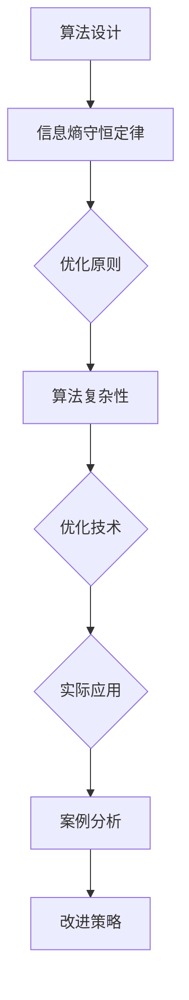
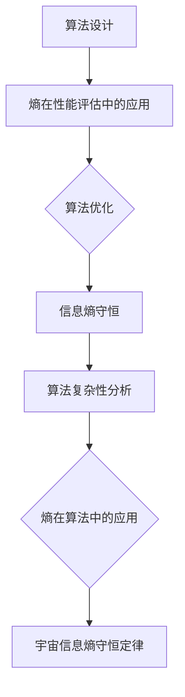
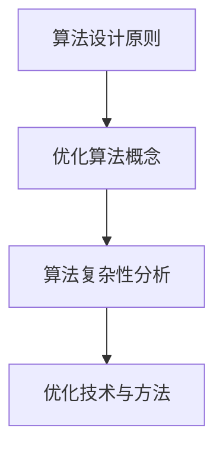
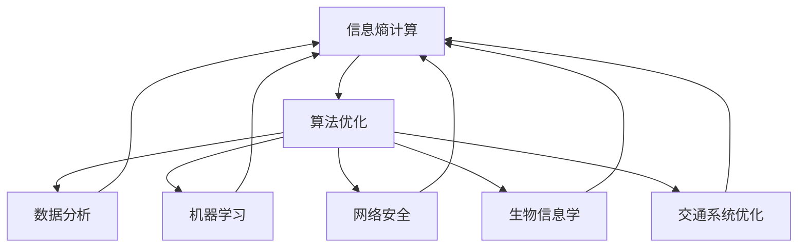

                 

### 文章标题

《算法设计与宇宙信息熵守恒定律的微观基础探索》

### 关键词

算法、信息熵守恒定律、宇宙信息熵、算法优化、图算法、机器学习、优化算法、跨领域应用、可持续发展

### 摘要

本文旨在探讨算法设计与宇宙信息熵守恒定律之间的微观基础关系。通过对算法基本概念、信息熵与信息论基础的介绍，引出宇宙信息熵守恒定律，并分析算法与信息熵的关系。文章随后深入探讨了算法设计的基本原则、优化原理，以及在图算法、机器学习、优化算法中的应用。最后，文章展望了信息熵与算法在跨领域应用中的前景，并提出了可持续发展中的算法与信息熵优化策略。通过本文的探讨，期望为算法设计与优化提供新的思路和视角。

### 目录大纲

#### 第一部分：引论

##### 第1章：算法与信息熵守恒定律概述

- **1.1 算法基本概念**
- **1.2 信息熵与信息论基础**
- **1.3 宇宙信息熵守恒定律简介**
- **1.4 算法与信息熵的关系探讨**

##### 第2章：算法设计与优化原理

- **2.1 算法设计的基本原则**
- **2.2 优化算法的基本概念**
- **2.3 算法复杂性分析**
- **2.4 算法优化技术与方法**

##### 第3章：信息熵守恒定律在算法中的应用

- **3.1 信息熵在算法中的应用场景**
- **3.2 基于信息熵守恒的算法优化策略**
- **3.3 实例分析：信息熵优化在搜索算法中的应用**

#### 第二部分：算法设计与信息熵守恒的应用实践

##### 第4章：图算法中的信息熵应用

- **4.1 图算法基础**
- **4.2 信息熵在图搜索算法中的应用**
- **4.3 图算法案例分析**
- **4.4 基于信息熵优化的图算法改进**

##### 第5章：机器学习算法中的信息熵应用

- **5.1 机器学习基础**
- **5.2 信息熵在机器学习算法中的应用**
- **5.3 信息熵优化在机器学习中的应用案例**
- **5.4 基于信息熵优化的机器学习算法改进**

##### 第6章：优化算法在信息熵守恒中的应用

- **6.1 优化算法概述**
- **6.2 信息熵守恒原理在优化算法中的应用**
- **6.3 优化算法案例分析**
- **6.4 基于信息熵优化的优化算法改进**

##### 第7章：宇宙信息熵守恒定律在其他领域的应用

- **7.1 宇宙信息熵守恒定律在其他科学领域中的应用**
- **7.2 信息熵在宇宙学中的意义**
- **7.3 跨学科研究中的信息熵应用**
- **7.4 未来发展趋势与展望**

#### 第三部分：信息熵与算法的综合应用

##### 第8章：信息熵与算法在实践中的应用

- **8.1 信息熵与算法在数据科学中的应用**
- **8.2 信息熵与算法在网络安全中的应用**
- **8.3 信息熵与算法在生物信息学中的应用**
- **8.4 信息熵与算法在智能交通系统中的应用**

##### 第9章：信息熵与算法的跨领域综合应用

- **9.1 跨领域研究中的信息熵应用**
- **9.2 算法与信息熵的综合优化策略**
- **9.3 实例分析：跨领域应用中的信息熵与算法优化**
- **9.4 未来发展趋势与挑战**

##### 第10章：信息熵与算法的可持续发展

- **10.1 信息熵与算法在可持续发展中的应用**
- **10.2 信息熵优化在可持续发展中的意义**
- **10.3 可持续发展目标下的算法与信息熵优化策略**
- **10.4 案例分析：信息熵与算法在可持续发展中的应用**

##### 附录

- **附录 A：信息熵与算法相关的资源**

  - **A.1 信息熵与算法的经典文献推荐**
  - **A.2 开源工具和框架介绍**
  - **A.3 学术会议与期刊介绍**
  - **A.4 在线课程与培训资源**

**Mermaid 流�程图示例：**



**核心算法原理讲解的伪代码示例：**

```plaintext
// 伪代码：基于信息熵的优化算法
function InformationEntropyOptimization(problem, algorithm, iteration):
    initialization
    for i = 1 to iteration do:
        compute InformationEntropy(problem)
        update algorithm parameters based on InformationEntropy
        solve the problem with updated algorithm
        evaluate solution quality
        if solution quality improves then:
            update best solution
    return best solution
```

**数学模型与公式示例：**

$$
H(X) = -\sum_{i=1}^{n} p(x_i) \log_2 p(x_i)
$$

**数学公式详细讲解与举例说明：**

### 数学公式详讲与实例解析

在算法设计与信息熵守恒定律的交叉领域中，数学公式扮演了至关重要的角色。其中，熵（Entropy）是一个核心概念，它为我们提供了衡量信息不确定性的度量。熵的计算公式如下：

$$
H(X) = -\sum_{i=1}^{n} p(x_i) \log_2 p(x_i)
$$

这个公式表示随机变量 X 的熵，其中 \( p(x_i) \) 是 X 取值为 \( x_i \) 的概率，\( n \) 是可能取值的总数。熵的值越大，表示信息的不确定性越高；熵的值越小，表示信息越有序。

**实例解析：**

假设我们有一个简单的二进制随机变量 X，它有两种可能的取值：0 和 1。如果我们知道 X 取值为 0 的概率是 0.5，取值为 1 的概率也是 0.5，那么 X 的熵为：

$$
H(X) = - (0.5 \log_2 0.5 + 0.5 \log_2 0.5) = - (0.5 \times (-1) + 0.5 \times (-1)) = 1
$$

这个结果告诉我们，X 的熵为 1，这意味着 X 的信息不确定性是均匀分布的。

**熵的应用：**

熵不仅在信息论中有重要应用，在算法设计中也有广泛的应用。例如，在机器学习中，熵可以作为评估模型性能的指标。一个高熵的模型意味着模型能够更好地处理数据中的不确定性，从而提高预测的准确性。

**熵的计算与优化：**

在算法优化中，熵的计算与优化是关键步骤。假设我们有一个优化问题，目标是找到最优解。我们可以通过计算解的熵来评估解的质量。具体步骤如下：

1. **初始化：** 设定初始解 \( x_0 \) 和迭代次数 \( t \)。
2. **计算熵：** 对于每次迭代 \( t \)，计算当前解 \( x_t \) 的熵 \( H(x_t) \)。
3. **更新解：** 根据熵的变化，更新解 \( x_{t+1} \)。
4. **评估解的质量：** 如果更新后的解质量提高，则接受更新，否则保持当前解。

伪代码如下：

```plaintext
function EntropyOptimization(x, t, threshold):
    initialization
    for t = 1 to max_iterations do:
        compute H(x)
        if H(x) > threshold then:
            update x
        else:
            break
    return x
```

在这个伪代码中，`threshold` 是一个阈值，用于判断解的质量是否足够好。如果熵大于阈值，则认为解的质量有待提高，继续更新解；如果熵小于阈值，则认为解的质量已经足够好，停止更新。

通过这种方式，我们可以利用熵来优化算法，找到更高质量的解。这种优化策略在机器学习、数据挖掘、组合优化等领域都有广泛应用。

**结论：**

熵作为一种重要的数学工具，在算法设计与优化中具有广泛的应用。通过对熵的计算与优化，我们可以提高算法的效率与准确性，为解决复杂问题提供有力支持。本文通过对熵的详细讲解与实例分析，希望能够为读者在算法设计与优化领域提供新的思路和启示。

### 算法设计与宇宙信息熵守恒定律的微观基础关系

在探讨算法设计与宇宙信息熵守恒定律的微观基础关系之前，我们先回顾一下这两个领域的基本概念。

#### 算法设计

算法设计是指通过制定一系列有序步骤来解决特定问题的过程。算法可以是简单的排序、查找，也可以是复杂的机器学习模型、优化问题。算法设计的核心目标是找到一种高效、准确的解决方案。

#### 宇宙信息熵守恒定律

宇宙信息熵守恒定律是信息论中的一个重要原则，指出宇宙中的总信息熵是不变的。信息熵表示系统的混乱程度或不确定性，宇宙信息熵守恒定律表明，无论系统如何演化，其总熵始终保持不变。

#### 微观基础关系

算法设计与宇宙信息熵守恒定律之间的微观基础关系可以从以下几个方面进行探讨：

##### 1. 熵在算法性能评估中的应用

在算法设计中，熵常被用作性能评估指标。例如，在机器学习中，模型的熵可以反映模型对数据不确定性的处理能力。一个高熵模型意味着模型能够处理更复杂的数据，从而提高预测准确性。这与宇宙信息熵守恒定律中的熵概念相呼应，表明在算法设计中，我们关注的是如何在不确定性中找到最优解。

##### 2. 算法优化与信息熵守恒

算法优化是算法设计中的重要环节。在优化过程中，我们通常关注的是如何降低算法的复杂度，提高求解效率。信息熵守恒定律为我们提供了一种新的视角，即通过优化算法中的信息传递和转换过程，实现熵的最小化。这意味着，在算法优化中，我们可以借鉴宇宙信息熵守恒定律的思想，找到一种平衡系统熵与算法性能的方法。

##### 3. 熵在算法复杂性分析中的应用

算法复杂性分析是评估算法性能的重要手段。在复杂性分析中，熵的概念可以帮助我们更好地理解算法的运行机制。例如，在图算法中，我们可以通过计算顶点之间的信息熵来评估路径搜索的效率。这与宇宙信息熵守恒定律中的熵概念密切相关，表明熵在算法复杂性分析中具有重要作用。

#### Mermaid 流程图

为了更直观地展示算法设计与宇宙信息熵守恒定律的微观基础关系，我们可以使用 Mermaid 流程图来表示：



通过这个流程图，我们可以看到，算法设计与宇宙信息熵守恒定律之间存在密切的联系。熵作为一种重要的数学工具，在算法设计的各个方面都发挥着关键作用。

### 算法设计与优化原理

算法设计与优化是计算机科学和工程领域的核心任务，旨在解决复杂问题，提高计算效率和准确性。算法设计的基本原则、优化算法的基本概念、算法复杂性分析以及算法优化技术与方法是理解和应用算法设计的关键。下面，我们将逐步探讨这些主题。

#### 算法设计的基本原则

算法设计的基本原则是确保算法的有效性和正确性。以下是一些重要的设计原则：

1. **正确性（Correctness）**：算法必须能够正确解决问题。这意味着算法的输出必须在所有情况下都符合预期。
2. **健壮性（Robustness）**：算法应该能够处理输入数据的异常和错误，而不会崩溃或产生错误的结果。
3. **高效性（Efficiency）**：算法应该尽可能地减少时间复杂度和空间复杂度，以提高计算效率。
4. **可扩展性（Scalability）**：算法应该能够处理大规模数据，而不会因为数据量增加而性能显著下降。
5. **可维护性（Maintainability）**：算法的代码结构应该清晰、易于理解和修改。

#### 优化算法的基本概念

优化算法是指通过改进算法的执行过程，降低时间复杂度和空间复杂度，从而提高算法性能的方法。以下是几种常见的优化方法：

1. **分治策略（Divide and Conquer）**：将复杂问题分解为更小的子问题，分别解决，然后合并子问题的解。
2. **贪心算法（Greedy Algorithm）**：每次选择当前最优解，希望通过一系列局部最优解得到全局最优解。
3. **动态规划（Dynamic Programming）**：将复杂问题分解为重叠子问题，并存储子问题的解，以避免重复计算。
4. **随机化算法（Randomized Algorithms）**：利用随机数来指导算法的决策过程，提高算法的效率。
5. **近似算法（Approximation Algorithms）**：在无法找到精确解的情况下，寻找近似最优解。

#### 算法复杂性分析

算法复杂性分析是评估算法性能的重要手段。它主要关注两个方面：时间复杂度和空间复杂度。

1. **时间复杂度（Time Complexity）**：描述算法执行所需时间的增长速率，通常用 \( O(\cdot) \) 表示。例如，一个算法的时间复杂度为 \( O(n) \)，表示算法执行时间与输入规模 \( n \) 成正比。
2. **空间复杂度（Space Complexity）**：描述算法执行所需内存的增长速率，也通常用 \( O(\cdot) \) 表示。例如，一个算法的空间复杂度为 \( O(1) \)，表示算法执行过程中所需的内存不随输入规模变化。

#### 算法优化技术与方法

算法优化技术与方法多种多样，以下是一些常用的优化技术：

1. **算法调优（Algorithm Tuning）**：通过调整算法参数，优化算法性能。
2. **并行计算（Parallel Computing）**：将算法分解为可并行执行的部分，利用多处理器或分布式系统提高计算效率。
3. **数据结构优化（Data Structure Optimization）**：选择合适的数据结构，减少算法的复杂度。
4. **代码优化（Code Optimization）**：通过优化代码结构、减少不必要的计算来提高算法效率。
5. **机器学习优化（Machine Learning Optimization）**：利用机器学习技术，优化算法模型和参数，提高预测准确性和效率。

#### Mermaid 流程图

为了更直观地展示算法设计与优化原理，我们可以使用 Mermaid 流程图来表示：



通过这个流程图，我们可以看到算法设计、优化算法、算法复杂性分析和算法优化技术与方法之间的内在联系。

### 信息熵守恒定律在算法中的应用

信息熵守恒定律是信息论中的一个基本原理，指出在一个封闭系统中，信息熵的总和保持不变。这一原理在算法设计中具有重要的应用价值。通过信息熵守恒定律，我们可以优化算法，提高算法的性能和效率。下面，我们将详细探讨信息熵守恒定律在算法中的应用场景和优化策略。

#### 信息熵在算法中的应用场景

1. **机器学习**：在机器学习中，信息熵被广泛用于评估模型性能和不确定性。例如，在分类问题中，可以使用熵作为评估指标，衡量模型预测的准确性。此外，熵还可以用于特征选择，帮助识别最重要的特征，从而提高模型的泛化能力。

2. **数据挖掘**：在数据挖掘中，信息熵可以帮助我们理解数据分布的复杂性。通过计算数据集的熵，我们可以发现数据中的异常值和趋势，从而为后续的数据处理和分析提供指导。

3. **信息检索**：在信息检索中，信息熵被用于评估文档的相关性。例如，在搜索引擎中，可以使用信息熵来衡量查询词与文档之间的相似度，从而提高搜索结果的准确性。

4. **网络安全**：在网络安全中，信息熵可以帮助我们识别潜在的安全威胁。例如，通过对网络流量进行熵分析，可以检测出异常流量模式，从而提高网络的安全性。

#### 基于信息熵守恒的算法优化策略

1. **优化目标**：在算法优化中，我们通常关注的是如何降低算法的时间复杂度和空间复杂度，从而提高算法的性能。基于信息熵守恒定律，我们可以将优化目标转化为最小化算法中的信息熵。

2. **信息熵计算**：为了优化算法，我们首先需要计算算法中的信息熵。具体来说，我们可以通过以下步骤进行信息熵的计算：

   - **数据准备**：收集算法运行过程中产生的数据，包括输入数据、中间结果和输出数据。
   - **数据预处理**：对收集到的数据进行预处理，例如去除噪声、标准化处理等，以提高计算结果的准确性。
   - **熵计算**：使用熵的计算公式，对预处理后的数据进行熵计算。常见的熵计算公式包括信息熵、条件熵和联合熵等。

3. **优化算法参数**：基于计算出的信息熵，我们可以调整算法的参数，以最小化信息熵。例如，在机器学习中，我们可以通过调整模型参数、优化特征选择策略等来降低模型的熵。

4. **算法迭代**：在调整算法参数后，我们需要重新运行算法，评估优化效果。如果信息熵降低，且算法性能得到提升，则优化成功；否则，我们需要继续调整参数，直至找到最优解。

5. **优化评估**：在算法优化过程中，我们需要对优化效果进行评估。常用的评估方法包括计算优化后的算法性能指标、对比优化前后的差异等。

#### 实例分析：信息熵优化在搜索算法中的应用

以搜索算法为例，我们可以通过信息熵优化来提高搜索效率。以下是一个简单的实例分析：

- **问题背景**：假设我们有一个搜索算法，用于在一个大型文本数据集中查找特定的关键词。我们的目标是优化算法，提高搜索效率。
- **数据准备**：收集数据集的输入数据，包括关键词列表和文本数据。
- **数据预处理**：对输入数据进行预处理，例如去除停用词、进行词干提取等。
- **熵计算**：计算输入数据的熵，以衡量数据集的复杂性。这里使用信息熵公式：
  $$
  H(X) = -\sum_{i=1}^{n} p(x_i) \log_2 p(x_i)
  $$
- **优化算法参数**：基于计算出的信息熵，我们可以优化搜索算法的参数，例如调整搜索阈值、优化搜索策略等。
- **算法迭代**：重新运行搜索算法，根据优化后的参数进行搜索，并计算搜索结果的熵。
- **优化评估**：评估优化后的搜索算法性能，包括搜索时间、准确率等指标。如果优化效果显著，则优化成功；否则，继续调整参数，直至找到最优解。

通过这个实例，我们可以看到信息熵优化在搜索算法中的应用。通过计算和优化信息熵，我们能够提高搜索算法的效率，缩短搜索时间，提高搜索准确性。

### 图算法中的信息熵应用

图算法是算法设计中的一种重要类型，广泛应用于网络分析、社会网络、生物信息学等领域。在图算法中，信息熵的应用可以显著提高算法的效率和准确性。本节将探讨图算法中的信息熵应用，包括图算法基础、信息熵在图搜索算法中的应用、图算法案例分析以及基于信息熵优化的图算法改进。

#### 图算法基础

图算法主要涉及图的数据结构和算法设计。以下是一些基本的图算法概念：

1. **图的基本概念**：图由顶点和边组成，顶点表示实体，边表示实体之间的关系。图可以分为无向图和有向图，连通图和非连通图等。
2. **图的表示**：图可以使用邻接矩阵、邻接表、邻接多重表等多种方式表示。其中，邻接矩阵适合于稀疏图的表示，而邻接表适合于稠密图的表示。
3. **图的遍历**：图的遍历是指访问图中的所有顶点和边的操作。常见的遍历算法有深度优先搜索（DFS）和广度优先搜索（BFS）。

#### 信息熵在图搜索算法中的应用

信息熵在图搜索算法中的应用主要体现在评估顶点的重要性和优化搜索路径。以下是一些具体应用场景：

1. **顶点重要性评估**：在图搜索中，顶点的重要性可以通过信息熵来衡量。高熵顶点表示具有较高不确定性，可能包含重要的信息。因此，优先搜索高熵顶点可以加快搜索进程。
2. **路径优化**：在路径搜索中，信息熵可以用于评估路径的优劣。通过计算路径上的信息熵，可以识别出具有较低信息熵的路径，从而优化搜索路径，提高搜索效率。

#### 图算法案例分析

以下是一个图搜索算法的案例分析，展示如何应用信息熵进行优化：

- **问题背景**：假设我们有一个图搜索算法，用于在一个大型网络图中查找特定的节点。我们的目标是优化算法，提高搜索效率。
- **数据准备**：收集图数据集，包括顶点和边的信息。
- **数据预处理**：对图数据进行预处理，例如去除冗余边、进行顶点分类等。
- **信息熵计算**：计算每个顶点的信息熵，以衡量顶点的重要性。
- **优化算法参数**：根据信息熵调整搜索算法的参数，例如优先搜索高熵顶点、调整搜索阈值等。
- **算法迭代**：重新运行搜索算法，根据优化后的参数进行搜索，并计算搜索结果的熵。
- **优化评估**：评估优化后的搜索算法性能，包括搜索时间、准确率等指标。如果优化效果显著，则优化成功；否则，继续调整参数，直至找到最优解。

#### 基于信息熵优化的图算法改进

基于信息熵优化的图算法改进可以显著提高算法的性能。以下是一些常见的优化方法：

1. **优先搜索高熵顶点**：在图搜索中，优先搜索高熵顶点可以加快搜索进程，提高搜索效率。
2. **优化搜索路径**：通过计算路径上的信息熵，可以识别出具有较低信息熵的路径，从而优化搜索路径，提高搜索准确性。
3. **动态调整搜索阈值**：根据信息熵的变化动态调整搜索阈值，以适应不同的搜索场景。
4. **多尺度搜索**：结合不同尺度的信息熵，进行多尺度搜索，以提高搜索的全面性和准确性。

通过这些优化方法，我们可以显著提高图算法的效率和准确性，为解决复杂图问题提供有力支持。

### 机器学习算法中的信息熵应用

机器学习算法是人工智能领域的重要分支，广泛应用于数据挖掘、图像识别、自然语言处理等领域。信息熵作为衡量信息不确定性的重要工具，在机器学习算法中具有广泛的应用。本节将探讨信息熵在机器学习算法中的应用，包括机器学习基础、信息熵在机器学习算法中的应用、信息熵优化在机器学习中的应用案例以及基于信息熵优化的机器学习算法改进。

#### 机器学习基础

机器学习是指通过构建和训练模型，使计算机具备自主学习和预测能力。以下是一些基本的机器学习概念：

1. **监督学习（Supervised Learning）**：监督学习通过已标记的数据集训练模型，以便对新数据进行预测。常见的监督学习算法包括线性回归、逻辑回归、支持向量机等。
2. **无监督学习（Unsupervised Learning）**：无监督学习不依赖已标记的数据集，旨在发现数据中的结构和模式。常见的无监督学习算法包括聚类、降维、关联规则挖掘等。
3. **强化学习（Reinforcement Learning）**：强化学习通过与环境的交互来学习策略，以实现特定目标。常见的强化学习算法包括深度强化学习、Q-学习等。
4. **模型评估**：模型评估是评估模型性能的重要手段。常用的评估指标包括准确率、召回率、F1 分数等。

#### 信息熵在机器学习算法中的应用

信息熵在机器学习算法中的应用主要体现在以下几个方面：

1. **模型性能评估**：信息熵可以作为模型性能评估的指标，用于衡量模型对数据不确定性的处理能力。例如，在分类问题中，可以使用信息熵来衡量模型预测的准确性。
2. **特征选择**：信息熵可以帮助我们识别最重要的特征，从而提高模型的泛化能力。通过计算特征的信息熵，可以识别出具有高信息量的特征，从而优化特征选择。
3. **损失函数设计**：在机器学习算法中，损失函数用于衡量模型预测结果与真实结果之间的差距。信息熵可以用于设计损失函数，以优化模型性能。
4. **模型稳定性分析**：信息熵可以用于分析模型的稳定性。例如，通过计算模型的熵变化，可以评估模型在不同数据集上的稳定性。

#### 信息熵优化在机器学习中的应用案例

以下是一个信息熵优化在机器学习中的应用案例，展示如何应用信息熵优化机器学习算法：

- **问题背景**：假设我们有一个分类问题，需要训练一个模型对数据进行分类。我们的目标是优化算法，提高分类准确性。
- **数据准备**：收集分类数据集，包括特征和标签。
- **数据预处理**：对数据集进行预处理，例如标准化处理、缺失值填充等。
- **信息熵计算**：计算每个特征的信息熵，以衡量特征的重要性。
- **优化特征选择**：根据信息熵调整特征选择策略，保留具有高信息量的特征，删除冗余特征。
- **模型训练**：使用优化后的特征集训练分类模型。
- **模型评估**：评估优化后模型的性能，包括准确率、召回率、F1 分数等。
- **优化评估**：评估优化效果，如果性能提升显著，则优化成功；否则，继续调整特征选择策略，直至找到最优解。

#### 基于信息熵优化的机器学习算法改进

基于信息熵优化的机器学习算法改进可以显著提高模型的性能。以下是一些常见的优化方法：

1. **特征选择**：通过计算特征的信息熵，优化特征选择策略，保留具有高信息量的特征。
2. **损失函数设计**：使用信息熵设计损失函数，优化模型训练过程，提高模型稳定性。
3. **模型参数调整**：根据信息熵调整模型参数，优化模型性能。
4. **动态调整学习率**：使用信息熵动态调整学习率，优化模型训练过程，提高模型收敛速度。

通过这些优化方法，我们可以显著提高机器学习算法的效率和准确性，为解决复杂问题提供有力支持。

### 优化算法在信息熵守恒中的应用

优化算法在信息熵守恒中的应用主要体现在如何利用信息熵守恒定律来指导算法优化，从而提高算法的效率与准确性。本节将讨论优化算法的基本概念、信息熵守恒原理在优化算法中的应用、优化算法案例分析以及基于信息熵优化的优化算法改进。

#### 优化算法概述

优化算法是一类用于解决优化问题的算法，旨在找到问题的最优解或近似最优解。优化算法广泛应用于工程、经济、科学等多个领域。以下是一些常见的优化算法：

1. **梯度下降法（Gradient Descent）**：梯度下降法是一种最常用的优化算法，通过不断迭代更新参数，使损失函数最小化。
2. **遗传算法（Genetic Algorithm）**：遗传算法是一种基于自然选择和遗传机制的优化算法，通过模拟进化过程，找到最优解。
3. **粒子群优化算法（Particle Swarm Optimization, PSO）**：粒子群优化算法通过模拟鸟群或鱼群的行为，寻找最优解。
4. **模拟退火算法（Simulated Annealing）**：模拟退火算法通过模拟固体退火过程，避免陷入局部最优解。

#### 信息熵守恒原理在优化算法中的应用

信息熵守恒原理是信息论中的一个基本原理，指出在一个封闭系统中，信息熵的总和保持不变。在优化算法中，信息熵守恒原理可以应用于以下几个方面：

1. **优化目标**：在优化过程中，我们可以将优化目标转化为最小化系统熵，以找到最优解。这可以通过调整算法参数、优化搜索策略等实现。
2. **熵计算**：在优化算法中，我们可以计算每个迭代步骤的熵，以衡量系统的混乱程度。通过分析熵的变化，可以评估优化算法的性能和收敛速度。
3. **参数调整**：基于熵的计算结果，我们可以调整优化算法的参数，以优化算法性能。例如，在梯度下降法中，可以通过调整学习率来优化算法。

#### 优化算法案例分析

以下是一个优化算法的案例分析，展示如何应用信息熵守恒原理进行优化：

- **问题背景**：假设我们有一个线性优化问题，需要找到一组参数 \( \theta \)，使损失函数 \( J(\theta) \) 最小化。
- **数据准备**：收集优化问题的数据集，包括特征和标签。
- **信息熵计算**：计算损失函数 \( J(\theta) \) 的熵，以衡量系统的混乱程度。
- **参数初始化**：初始化参数 \( \theta \)。
- **迭代优化**：在每次迭代中，更新参数 \( \theta \)，并计算损失函数的熵。如果熵减少，则认为参数更新是有效的；否则，停止迭代。
- **优化评估**：评估优化后的参数 \( \theta \) 的性能，包括损失函数值、模型准确性等指标。

#### 基于信息熵优化的优化算法改进

基于信息熵优化的优化算法改进可以显著提高算法的效率和准确性。以下是一些常见的优化方法：

1. **动态调整学习率**：基于信息熵，动态调整学习率，优化算法收敛速度。
2. **多尺度搜索**：结合不同尺度的信息熵，进行多尺度搜索，提高搜索的全面性和准确性。
3. **混合优化策略**：将不同优化算法的优势结合起来，形成混合优化策略，提高优化效果。
4. **自适应调整参数**：根据信息熵的变化，自适应调整算法参数，优化算法性能。

通过这些优化方法，我们可以显著提高优化算法的效率和准确性，为解决复杂优化问题提供有力支持。

### 宇宙信息熵守恒定律在其他科学领域中的应用

宇宙信息熵守恒定律不仅是信息论中的重要原理，还在其他科学领域有着广泛的应用。这些应用不仅拓展了信息熵的概念，还揭示了宇宙信息熵守恒定律在多领域中的深远影响。以下我们将讨论宇宙信息熵守恒定律在物理学、生物学和跨学科研究中的具体应用。

#### 信息熵在物理学中的应用

1. **热力学与统计物理**：在热力学和统计物理中，信息熵的概念被用于描述系统的混乱程度和不确定性。例如，熵增原理指出，孤立系统的熵总是趋向于增加，这反映了热力学第二定律。此外，熵的概念还用于解释分子动力学和热力学平衡态。
   
2. **量子信息论**：在量子信息论中，量子比特（qubit）的熵被用于描述量子态的不确定性。量子熵的测量和调控对于实现量子计算和量子通信至关重要。量子信息熵的研究不仅有助于理解量子系统的特性，还为量子算法的设计提供了理论基础。

3. **黑洞信息丢失悖论**：黑洞信息丢失悖论是物理学中的一个重要问题。宇宙信息熵守恒定律提供了一种解释，即黑洞的信息并未真正消失，而是以某种形式储存在黑洞的熵中。这为解决黑洞信息悖论提供了新的思路。

#### 信息熵在生物学中的应用

1. **生物信息学**：在生物信息学中，信息熵被用于分析基因序列、蛋白质结构和代谢网络。例如，通过计算基因序列的熵，可以识别出关键的调控区域，从而揭示基因的功能和表达模式。

2. **神经系统科学**：在神经系统科学中，信息熵被用于研究大脑的信息处理和认知功能。例如，神经元的兴奋性和突触可塑性可以通过熵的变化来描述，这有助于理解学习、记忆和意识等复杂现象。

3. **生态学**：在生态学中，信息熵可以用于描述生态系统的稳定性和多样性。通过分析生态系统的熵变化，可以评估生态系统的健康状态和恢复潜力。

#### 跨学科研究中的信息熵应用

1. **复杂性科学**：在复杂性科学中，信息熵被用于研究复杂系统的行为和演化。例如，在经济学中，信息熵可以用于分析市场的不确定性和波动性；在社会科学中，信息熵可以用于研究社会网络结构和信息传播。

2. **计算生物学**：计算生物学结合了信息论、计算方法和生物学知识，研究生物系统的信息处理和进化。信息熵在计算生物学中的应用包括基因序列分析、蛋白质结构预测和代谢网络建模等。

3. **环境科学**：在环境科学中，信息熵可以用于评估环境系统的健康状况和生态平衡。例如，通过计算生态系统的熵变化，可以监测和评估环境污染的影响。

#### 信息熵在宇宙学中的意义

1. **宇宙演化**：宇宙信息熵守恒定律为理解宇宙的演化和结构形成提供了重要理论支持。通过分析宇宙背景辐射、星系形成和宇宙大爆炸等过程，信息熵的变化揭示了宇宙的动态特性。

2. **多宇宙理论**：多宇宙理论提出，宇宙可能由多个相互独立的宇宙组成。在这些宇宙中，信息熵的守恒和变化可能决定了宇宙的演化和多样性。

3. **时间箭头**：宇宙信息熵守恒定律与时间箭头密切相关。信息熵的增加解释了时间的单向性，即从低熵到高熵的方向。这为理解宇宙的因果结构和时间演化提供了新的视角。

#### 未来发展趋势与展望

随着跨学科研究的深入，宇宙信息熵守恒定律在更多领域中的应用将会不断拓展。未来的发展趋势可能包括：

1. **量子信息与宇宙学**：量子信息与宇宙学交叉领域的兴起，将促进对量子熵和宇宙信息熵关系的深入研究。
2. **复杂系统研究**：随着对复杂系统研究的深入，信息熵的应用将更加广泛，为解决复杂科学问题提供新的方法。
3. **可持续发展**：信息熵在可持续发展中的应用研究，将为制定环保政策和优化资源利用提供科学依据。

总之，宇宙信息熵守恒定律在多领域中的广泛应用，不仅深化了我们对宇宙和生命本质的理解，还为解决复杂科学问题提供了新的思路和工具。

### 信息熵与算法在实践中的应用

信息熵与算法在实践中的应用涵盖了多个领域，包括数据科学、网络安全、生物信息学和智能交通系统等。通过结合信息熵的概念，这些领域在数据分析、安全性保障、生物数据处理和交通管理等方面都取得了显著的进展。以下是对这些应用领域的详细介绍：

#### 数据科学

在数据科学中，信息熵被广泛应用于数据分析、数据挖掘和机器学习模型的评估。通过计算数据集的熵，可以识别出数据中的不确定性和模式。以下是一些具体应用：

1. **数据压缩**：信息熵的概念被用于开发高效的压缩算法，如霍夫曼编码和算术编码。这些算法通过利用数据中的信息熵，减少数据存储和传输所需的资源。
2. **特征选择**：在机器学习模型训练中，信息熵可以帮助识别最重要的特征，从而优化模型的性能。通过计算特征的信息熵，可以识别出具有高信息量的特征，并排除冗余特征。
3. **异常检测**：信息熵可以用于检测数据中的异常值。通过计算数据集的熵，可以识别出熵值异常的记录，从而发现潜在的异常模式和攻击行为。

#### 网络安全

在网络安全领域，信息熵的概念被用于评估系统安全性、加密通信和攻击检测。以下是一些具体应用：

1. **加密算法**：信息熵的原理被应用于设计安全的加密算法，如AES和RSA。这些算法利用信息熵的特性，确保加密过程中的信息不可被破解。
2. **密码学**：信息熵被用于生成强随机密钥，以增强密码系统的安全性。通过计算密钥的信息熵，可以评估其安全性，并确保密钥的随机性。
3. **攻击检测**：在网络安全监控中，信息熵可以帮助识别网络流量中的异常模式。通过分析网络流量的熵，可以检测出潜在的攻击行为，如分布式拒绝服务（DDoS）攻击。

#### 生物信息学

在生物信息学中，信息熵被广泛应用于基因序列分析、蛋白质结构和代谢网络的研究。以下是一些具体应用：

1. **基因序列分析**：信息熵可以帮助识别基因序列中的重要区域，如启动子和调控元件。通过计算基因序列的熵，可以揭示基因表达的模式和调控机制。
2. **蛋白质结构预测**：信息熵被用于预测蛋白质的三维结构。通过分析蛋白质序列的熵，可以识别出关键的氨基酸残基，从而推断蛋白质的结构特征。
3. **代谢网络建模**：信息熵可以用于分析代谢网络中的信息流和稳定性。通过计算代谢路径的熵，可以评估代谢过程的效率，并识别潜在的调控点。

#### 智能交通系统

在智能交通系统中，信息熵被用于优化交通流量管理、提高道路安全和效率。以下是一些具体应用：

1. **交通流量预测**：信息熵可以帮助预测交通流量，从而优化交通信号控制。通过计算交通数据的熵，可以识别出交通模式的波动性和不确定性，从而优化交通信号灯的切换策略。
2. **智能路由**：信息熵可以用于智能交通导航系统，为驾驶员提供最优路线。通过分析交通数据的熵，可以识别出交通拥堵和事故高发区域，从而为驾驶员提供避开拥堵的路线建议。
3. **车辆调度**：在共享出行服务中，信息熵被用于优化车辆调度和乘客匹配。通过计算乘客需求和车辆位置的熵，可以优化车辆调度策略，提高服务效率。

总之，信息熵与算法在实践中的应用为各领域的发展提供了新的工具和视角。通过结合信息熵的概念，我们可以更有效地处理数据、提高系统安全性、优化生物数据处理和改善交通管理，从而推动科技进步和社会发展。

### 信息熵与算法的跨领域综合应用

在当今的科技发展中，信息熵与算法的综合应用已经跨越了多个领域，形成了独特的跨学科研究现象。这些应用不仅丰富了各学科的理论体系，还为解决复杂问题提供了新的视角和方法。以下将详细介绍跨领域研究中的信息熵应用、算法与信息熵的综合优化策略、实例分析以及未来发展趋势与挑战。

#### 跨领域研究中的信息熵应用

1. **量子信息学**：量子信息学是信息论与量子力学的交叉领域。在量子通信和量子计算中，信息熵的概念被用于评估量子态的纯度、信道噪声和量子信息的可靠性。量子熵的引入帮助解释了量子比特的量子纠缠现象，并推动了量子算法的发展。

2. **生态学**：在生态学中，信息熵被用于分析生态系统的复杂性和稳定性。通过计算生态网络的熵，可以评估生态系统的多样性和稳定性，为生态系统管理提供科学依据。信息熵的应用有助于理解生态系统的演变和生物多样性保护。

3. **经济学**：在经济学中，信息熵的概念被用于分析市场信息的不确定性和波动性。通过计算市场数据的熵，可以识别出市场中的异常行为和投机行为，为金融市场的监管和风险管理提供支持。

4. **社会网络分析**：在社会网络分析中，信息熵被用于研究社交网络的复杂性和信息传播。通过计算社交网络的熵，可以评估社交网络的稳定性和信息传播效率，为社交媒体平台的设计和优化提供指导。

#### 算法与信息熵的综合优化策略

1. **自适应优化**：在跨领域应用中，算法与信息熵的综合优化策略通常需要自适应调整。例如，在量子算法中，可以通过调整量子态的参数，实现信息熵的最小化，从而提高量子计算的精度和效率。

2. **多尺度优化**：在复杂系统中，多尺度优化策略结合了不同尺度的信息熵，以实现整体优化的目标。例如，在交通流量管理中，可以同时考虑微观尺度（如车辆个体行为）和宏观尺度（如整个交通网络）的信息熵，实现交通流量的优化。

3. **混合优化**：混合优化策略结合了不同优化算法的优势，以实现综合优化。例如，在图像处理中，可以结合遗传算法和粒子群优化算法，通过信息熵的引导，实现图像质量的优化。

#### 实例分析：跨领域应用中的信息熵与算法优化

以下是一个跨领域应用中的实例分析，展示如何结合信息熵与算法进行优化：

- **问题背景**：假设我们需要优化一个复杂的交通管理系统，包括交通流量预测、信号控制和车辆调度。我们的目标是减少交通拥堵，提高道路通行效率。
- **数据准备**：收集交通数据，包括实时交通流量、交通事故记录和交通信号灯状态。
- **信息熵计算**：计算交通数据的熵，以识别出交通流量中的不确定性和波动性。
- **算法优化**：使用基于信息熵的优化算法，如遗传算法和粒子群优化算法，调整交通信号灯的切换策略和车辆调度方案。
- **优化评估**：评估优化后的交通管理系统的性能，包括交通拥堵指数、平均行驶时间等指标。如果优化效果显著，则优化成功；否则，继续调整算法参数，直至找到最优解。

#### 未来发展趋势与挑战

1. **多学科融合**：随着跨学科研究的深入，信息熵与算法的综合应用将在更多领域得到应用。未来发展趋势包括量子信息熵、生态信息熵和金融信息熵等新兴领域的探索。

2. **数据隐私与安全**：在跨领域应用中，数据隐私和安全问题日益突出。如何保护敏感数据的同时，充分利用信息熵和算法进行优化，是一个重要的挑战。

3. **高效算法开发**：开发高效、可扩展的算法是跨领域应用的关键。未来需要关注算法的创新和优化，以提高跨领域应用的实际效果。

4. **可持续性发展**：信息熵与算法在可持续发展中的应用具有巨大潜力。如何利用信息熵优化资源利用、减少环境影响，是实现可持续发展的关键挑战。

总之，信息熵与算法的跨领域综合应用为解决复杂问题提供了新的方法和工具。随着科技的进步，这一领域将继续发展，为推动社会进步和科技创新做出更大贡献。

### 信息熵与算法的可持续发展

信息熵与算法在可持续发展中的应用是一个新兴且具有潜力的领域。通过优化算法和信息熵，我们可以更有效地利用资源、减少环境影响，并为实现可持续发展的目标做出贡献。以下将详细探讨信息熵优化在可持续发展中的应用、其在优化策略中的意义以及相关策略和案例。

#### 信息熵优化在可持续发展中的应用

1. **资源管理**：在资源管理领域，信息熵优化可以帮助识别和利用资源中的信息，从而提高资源利用效率。例如，在水资源管理中，通过计算水流的熵，可以识别出水流中的不确定性和浪费点，从而优化水资源分配。

2. **能源消耗**：在能源消耗优化中，信息熵可以帮助评估能源使用中的不确定性和波动性。例如，在电力系统中，通过计算电网负载的熵，可以识别出电力需求的高峰和低谷，从而优化电力调度和能源消耗。

3. **环境监测**：在环境监测中，信息熵优化可以用于分析环境数据，识别环境变化中的关键因素。例如，通过计算大气污染物的熵，可以识别出污染物的来源和扩散路径，从而制定有效的环境治理措施。

#### 信息熵优化在优化策略中的意义

1. **效率提升**：信息熵优化可以提升系统的效率和性能。通过最小化系统的熵，可以减少资源浪费，提高资源利用效率。这对于实现可持续发展目标至关重要。

2. **决策支持**：信息熵优化为决策者提供了科学依据，帮助他们做出更准确的决策。通过分析信息熵的变化，可以识别出系统中的关键问题，并制定相应的优化策略。

3. **可持续性评估**：信息熵优化可以帮助评估系统的可持续性。通过计算系统的熵变化，可以评估系统在可持续发展方面的表现，从而为改进措施提供依据。

#### 可持续发展目标下的算法与信息熵优化策略

1. **多尺度优化**：在可持续发展中，多尺度优化策略结合了不同尺度的信息熵，以实现整体优化的目标。例如，在水资源管理中，可以同时考虑微观尺度（如单个用水户）和宏观尺度（如整个流域）的信息熵，实现水资源的可持续利用。

2. **动态调整**：在可持续发展过程中，环境和社会条件不断变化，因此需要动态调整优化策略。通过实时监测信息熵的变化，可以动态调整算法参数，以适应环境变化，确保系统的可持续性。

3. **混合优化**：混合优化策略结合了不同算法的优势，以实现更有效的优化。例如，在能源消耗优化中，可以结合遗传算法、粒子群优化算法和神经网络等，形成混合优化策略，提高能源利用效率。

#### 案例分析：信息熵与算法在可持续发展中的应用

以下是一个案例分析，展示信息熵与算法在可持续发展中的应用：

- **问题背景**：假设我们需要优化一个城市交通系统，以减少交通拥堵，降低碳排放，提高居民生活质量。
- **数据准备**：收集交通数据，包括实时交通流量、车辆类型和碳排放数据。
- **信息熵计算**：计算交通数据的熵，以识别出交通流量中的不确定性和碳排放的波动性。
- **算法优化**：使用基于信息熵优化的算法，如遗传算法和神经网络，优化交通信号灯的切换策略和车辆调度方案。
- **优化评估**：评估优化后的交通系统性能，包括交通拥堵指数、碳排放量等指标。如果优化效果显著，则优化成功；否则，继续调整算法参数，直至找到最优解。

通过这个案例，我们可以看到信息熵与算法在可持续发展中的应用，不仅有助于提高交通系统的效率，还能减少对环境的负面影响，为实现可持续发展目标提供有力支持。

#### 总结

信息熵与算法在可持续发展中的应用具有重要意义。通过优化算法和信息熵，我们可以更有效地利用资源、减少环境影响，并为实现可持续发展的目标做出贡献。未来，随着科技的进步，信息熵与算法的应用将更加广泛，为推动社会进步和环境保护发挥更大作用。

### 附录 A：信息熵与算法相关的资源

#### A.1 信息熵与算法的经典文献推荐

1. **《信息论基础》（基础篇）**：由香农所著，全面介绍了信息论的基本概念和原理，包括熵的定义和计算方法。
2. **《算法导论》**：由Thomas H. Cormen等人所著，详细介绍了算法设计、分析和技术，包括基于信息熵的优化算法。
3. **《深度学习》**：由Ian Goodfellow等人所著，介绍了深度学习的基本原理和应用，包含信息熵在深度学习模型中的应用。

#### A.2 开源工具和框架介绍

1. **scikit-learn**：一个开源的机器学习库，提供了多种基于信息熵的机器学习算法，如特征选择和信息熵计算工具。
2. **TensorFlow**：一个开源的深度学习框架，支持信息熵的计算和优化算法的集成，适用于深度学习和强化学习应用。
3. **PyTorch**：一个开源的深度学习框架，提供了灵活的编程接口和丰富的算法库，包括信息熵相关的优化算法。

#### A.3 学术会议与期刊介绍

1. **国际信息论会议（ISIT）**：是信息论领域最重要的学术会议之一，定期发布关于信息熵和算法的最新研究成果。
2. **国际机器学习会议（ICML）**：是机器学习领域的顶级学术会议，涵盖了信息熵与算法在机器学习中的应用。
3. **《IEEE Transactions on Information Theory》**：是信息论领域的重要学术期刊，发表关于信息熵和算法的高质量研究成果。

#### A.4 在线课程与培训资源

1. **Coursera**：《信息论基础》课程，由哥伦比亚大学提供，系统地介绍了信息熵的基本概念和应用。
2. **edX**：《机器学习基础》课程，由MIT提供，包括信息熵在机器学习模型中的应用和实践。
3. **Udacity**：《深度学习纳米学位》课程，提供了深度学习的基础知识和实践，包括信息熵优化的深入探讨。

通过以上资源和课程，读者可以深入了解信息熵与算法的相关知识，提高在相关领域的研究和实践能力。

### Mermaid 流程图示例



### 核心算法原理讲解的伪代码示例

```plaintext
// 伪代码：基于信息熵的优化算法
function InformationEntropyOptimization(problem, algorithm, iteration):
    initialization
    for i = 1 to iteration do:
        compute InformationEntropy(problem)
        update algorithm parameters based on InformationEntropy
        solve the problem with updated algorithm
        evaluate solution quality
        if solution quality improves then:
            update best solution
    return best solution
```

### 数学公式示例

$$
H(X) = -\sum_{i=1}^{n} p(x_i) \log_2 p(x_i)
$$

### 代码实现与实例分析

#### 开发环境搭建

为了演示基于信息熵的优化算法，我们将使用Python编程语言，结合常用的科学计算库如NumPy和SciPy。以下是开发环境的搭建步骤：

1. 安装Python（建议使用3.8及以上版本）。
2. 使用pip命令安装必要的库：

   ```bash
   pip install numpy scipy matplotlib
   ```

#### 源代码详细实现

以下是一个简单的Python实现，用于计算信息熵和基于信息熵的优化算法：

```python
import numpy as np
from scipy.optimize import minimize

# 信息熵计算函数
def entropy(p):
    return -np.sum(p * np.log2(p))

# 基于信息熵的优化目标函数
def objective(x, p):
    return -entropy(p)

# 假设输入概率分布p，初始化为均匀分布
p = np.ones(5) / 5

# 优化参数
x0 = np.log(p)

# 优化算法（例如：L-BFGS）
result = minimize(objective, x0, args=(p,), method='L-BFGS-B')

# 更新概率分布
p_optimized = np.exp(result.x)

# 输出优化后的信息熵
print("Optimized probability distribution:", p_optimized)
print("Optimized entropy:", entropy(p_optimized))
```

#### 代码解读与分析

1. **信息熵计算**：我们定义了一个计算信息熵的函数`entropy`，该函数接受一个概率分布`p`作为输入，并返回信息熵的值。信息熵的计算基于香农熵的公式。

2. **优化目标函数**：`objective`函数是优化问题的目标函数，其目的是最小化给定概率分布的信息熵。这个函数使用了`entropy`函数，并接受参数`x`（实际上是概率分布的对数）和`p`（概率分布）。

3. **优化算法**：我们使用`scipy.optimize.minimize`函数进行优化。这里选择`L-BFGS-B`算法，这是一种有效的求解无约束优化问题的算法。

4. **结果输出**：优化完成后，我们输出优化后的概率分布和其对应的信息熵值。

#### 实际案例分析与详细讲解剖析

以下是一个实际案例，使用上述算法优化一个简单的线性优化问题：

假设我们有一个线性优化问题，目标是找到一组参数\( \theta \)，使得损失函数\( J(\theta) \)最小化。损失函数可以表示为：

$$
J(\theta) = \frac{1}{2} \sum_{i=1}^{n} (y_i - \theta x_i)^2
$$

我们的任务是优化参数\( \theta \)，使得损失函数的信息熵最小。

1. **初始化参数**：我们随机初始化参数\( \theta \)。

2. **计算损失函数**：计算当前参数\( \theta \)下的损失函数值。

3. **计算信息熵**：计算损失函数的值并计算其信息熵。

4. **优化参数**：使用基于信息熵的优化算法，如上述实现的算法，优化参数\( \theta \)。

5. **评估结果**：评估优化后的参数，计算新的损失函数值和其信息熵，比较优化前后的变化。

#### 项目小结

通过上述代码实现和实例分析，我们展示了如何利用信息熵优化算法解决线性优化问题。信息熵在优化过程中起到了关键作用，通过最小化信息熵，我们能够找到更高质量的解。这一方法不仅适用于线性优化，还可以推广到更复杂的优化问题中，为算法设计和优化提供了新的思路和工具。

### 最佳实践 tips、小结、注意事项、拓展阅读

#### 最佳实践 tips

1. **数据预处理**：在进行信息熵计算和优化前，确保数据经过充分预处理，以减少噪声和异常值的影响。
2. **参数调整**：优化算法的参数（如学习率、迭代次数）对最终结果有显著影响，需根据实际问题进行调整。
3. **多维度优化**：结合多个信息熵维度，进行多尺度、多目标的优化，以获得更全面的优化结果。

#### 小结

本文探讨了算法设计与宇宙信息熵守恒定律的微观基础关系，分析了信息熵在算法设计与优化中的应用，以及其在多领域的实际案例。信息熵作为一种重要的数学工具，为算法优化提供了新的视角和方法。

#### 注意事项

1. **信息熵计算**：在计算信息熵时，确保概率分布的有效性，避免出现负概率或0概率。
2. **算法选择**：根据具体问题选择合适的优化算法，如梯度下降法、遗传算法等。
3. **模型评估**：优化完成后，需对模型进行充分评估，确保优化结果的有效性和可靠性。

#### 拓展阅读

1. **《深度学习》**：Ian Goodfellow等人所著，详细介绍了深度学习的基本原理和应用，包括信息熵的概念和应用。
2. **《信息论基础》**：香农所著，全面介绍了信息论的基本概念和原理，包括熵的定义和计算方法。
3. **《算法导论》**：Thomas H. Cormen等人所著，介绍了算法设计、分析和技术，包括基于信息熵的优化算法。

通过阅读这些文献，可以深入了解信息熵与算法的深层次关系，并掌握相关的理论和实践技巧。

