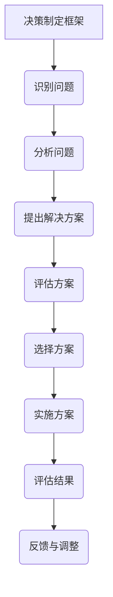

                 


### 文章标题：管理者决策力：在不确定性中把握方向

> 关键词：决策力、不确定性、管理、风险管理、决策模型、算法、实战案例

> 摘要：本文将从决策的定义、决策过程、决策方法以及不确定性下的决策策略四个方面，详细探讨管理者在不确定性环境中如何提高决策力，把握方向。文章将通过具体的案例和实践，为读者提供有价值的决策思路和方法。

### 目录大纲

**第一部分：决策基础**

## 第1章：决策的定义与重要性

### 1.1 决策的定义与类型

### 1.2 决策在管理中的作用

### 1.3 决策的不确定性

## 第2章：决策过程

### 2.1 决策的步骤

### 2.2 决策制定中的常见问题

### 2.3 决策与伦理

**第二部分：决策方法**

## 第3章：定量决策方法

### 3.1 决策树分析

### 3.2 风险分析

### 3.3 数据分析基础

## 第4章：定性决策方法

### 4.1 经验判断

### 4.2 脑力激荡法

### 4.3 成对比较法

## 第5章：群体决策方法

### 5.1 群体行为理论

### 5.2 群体决策工具

### 5.3 群体决策的优势与挑战

**第三部分：不确定性下的决策策略**

## 第6章：不确定性的识别与评估

### 6.1 不确定性的识别方法

### 6.2 不确定性的评估模型

### 6.3 应对不确定性的重要性

## 第7章：风险管理

### 7.1 风险的定义与分类

### 7.2 风险评估工具与方法

### 7.3 风险应对策略

## 第8章：决策制定的框架

### 8.1 决策制定的框架概述

### 8.2 决策制定的工具与技巧

### 8.3 决策制定的案例分析

**第四部分：实战案例分析**

## 第9章：企业管理决策案例

### 9.1 案例背景

### 9.2 决策过程

### 9.3 决策结果与分析

## 第10章：政策制定中的决策力

### 10.1 政策制定的决策力分析

### 10.2 政策制定中的风险与挑战

### 10.3 成功的政策决策案例

## 第11章：跨领域决策案例

### 11.1 跨领域决策的挑战

### 11.2 跨领域决策案例分析

### 11.3 跨领域决策的经验总结

**附录**

## 附录A：决策力评估工具与方法

### A.1 决策力评估量表

### A.2 决策力评估案例分析

## 附录B：决策制定参考资料

### B.1 决策制定经典文献推荐

### B.2 决策制定相关网站与资源

### Mermaid 流程图：



### 决策树分析算法：

```pseudo
决策树分析算法如下：

1. 定义决策变量和决策节点。
2. 计算各个节点的期望收益。
3. 根据期望收益选择最优节点。
4. 重复步骤2和3，直到达到停止条件。

Pseudo Code:

function DecisionTreeAnalysis(data):
    for each node n in data:
        calculate the expected utility of n
        if n is a leaf node:
            return n
        else:
            select the best child node based on expected utility
            return DecisionTreeAnalysis(n's children)
```

### 数学模型和公式：

```latex
$$
\text{风险} = \sum_{i=1}^{n} (\text{损失}_i \times \text{概率}_i)
$$

$$
\text{期望收益} = \sum_{i=1}^{n} (\text{收益}_i \times \text{概率}_i)
$$
```

### 项目实战案例：

**案例背景**：某公司决定是否在新的市场推出一款新产品。

**开发环境搭建**：
- 使用Python编程语言进行决策分析。
- 使用Pandas库处理数据。
- 使用Scikit-learn库构建决策树模型。

**源代码详细实现**：

```python
import pandas as pd
from sklearn.tree import DecisionTreeClassifier
from sklearn.model_selection import train_test_split

# 数据处理
data = pd.read_csv('data.csv')
X = data.drop('target', axis=1)
y = data['target']

# 数据分割
X_train, X_test, y_train, y_test = train_test_split(X, y, test_size=0.2, random_state=42)

# 决策树模型
model = DecisionTreeClassifier()
model.fit(X_train, y_train)

# 预测结果
y_pred = model.predict(X_test)

# 评估结果
accuracy = model.score(X_test, y_test)
print(f"Model Accuracy: {accuracy:.2f}")
```

**代码解读与分析**：
- 在此案例中，我们使用了Python的Pandas库进行数据预处理，Scikit-learn库构建决策树模型。
- 数据分割部分使用了`train_test_split`方法，将数据分为训练集和测试集，以评估模型性能。
- 我们使用决策树模型进行训练，并使用测试集进行预测。
- 最后，使用模型在测试集上的准确率来评估模型性能。

**实际案例分析和详细讲解剖析**：
- 在这个案例中，公司需要决定是否在新的市场推出一款新产品。我们可以使用决策树模型来分析不同决策的收益和风险。
- 首先，我们需要收集与市场相关的一系列数据，如市场需求、竞争情况、成本等。
- 然后，我们可以将这些数据作为决策树模型的输入特征，构建一个决策树模型来分析不同决策的收益和风险。
- 通过模型预测结果，公司可以了解在每种情况下推出新产品的期望收益和风险，从而做出更明智的决策。

**项目小结**：
- 在这个案例中，我们展示了如何使用决策树模型进行决策分析。通过分析不同决策的收益和风险，公司可以更好地把握方向，做出更明智的决策。
- 决策树模型是一种简单但有效的决策分析方法，可以帮助公司在不确定性环境中做出更准确的决策。

**最佳实践 tips**：
- 在进行决策分析时，确保收集到足够且可靠的数据，以提高模型准确性。
- 在决策过程中，充分考虑各种可能的情况和风险，以避免盲目决策。
- 定期评估和调整决策模型，以适应不断变化的市场环境。

**小结**：
- 决策是管理过程中至关重要的一环。在不确定性环境中，管理者需要具备强大的决策力，以把握方向。
- 通过了解决策的定义、决策过程、决策方法以及不确定性下的决策策略，管理者可以更好地应对挑战，提高决策效果。

**注意事项**：
- 决策过程中，需充分考虑利益相关者的需求和期望，以确保决策的公正性和可持续性。
- 风险管理是决策过程中不可或缺的一部分。充分评估风险，制定有效的风险应对策略，有助于降低决策的不确定性。

**拓展阅读**：
- 《决策与判断：心理探秘》（丹尼尔·卡内曼著）
- 《风险管理：战略与实务》（罗伯特·默顿、兹维·博迪著）
- 《决策分析》（理查德·L·彻奇曼、詹姆斯·K·格雷斯著）

**文章标题：管理者决策力：在不确定性中把握方向**

> 关键词：决策力、不确定性、管理、风险管理、决策模型、算法、实战案例

> 摘要：本文将从决策的定义、决策过程、决策方法以及不确定性下的决策策略四个方面，详细探讨管理者在不确定性环境中如何提高决策力，把握方向。文章将通过具体的案例和实践，为读者提供有价值的决策思路和方法。

### 第一部分：决策基础

#### 第1章：决策的定义与重要性

决策，是管理活动中不可或缺的一部分。它关乎企业的生存与发展，影响着组织的战略方向和运营效率。然而，在充满不确定性的商业环境中，决策变得更加复杂和困难。本章节将介绍决策的定义、类型以及在管理中的作用。

#### 1.1 决策的定义与类型

决策，简单来说，是一个选择过程，即从多个备选方案中挑选出一个最优方案的过程。根据决策对象的不同，决策可以分为以下几种类型：

1. **战略决策**：涉及组织长期目标和方向的决策。例如，企业的市场扩张、产品研发、并购等。
2. **战术决策**：解决组织短期内如何实现战略目标的决策。例如，生产计划、库存管理、销售策略等。
3. **运营决策**：关注日常运营活动的决策。例如，人员招聘、设备采购、供应链管理等。

#### 1.2 决策在管理中的作用

决策在管理活动中起着至关重要的作用。以下是决策在管理中的作用：

1. **确定目标**：决策有助于明确组织的长期和短期目标，为管理活动提供方向。
2. **资源配置**：决策决定了资源的分配，如资金、人力、物资等，从而提高资源的利用效率。
3. **风险控制**：决策过程中，管理者需要考虑各种风险，并制定相应的风险应对策略，降低风险带来的负面影响。
4. **提高效率**：合理的决策可以提高组织运营效率，减少浪费，降低成本。

#### 1.3 决策的不确定性

在不确定性环境中，决策面临诸多挑战。不确定性可能来自外部环境的变化，如市场需求、竞争态势等，也可能来自内部因素的变动，如员工士气、技术水平等。以下是决策不确定性的几个主要来源：

1. **信息不足**：决策所需的信息可能不够全面或准确，导致决策者难以做出准确的判断。
2. **预测困难**：外部环境变化难以预测，决策者难以准确预测未来的趋势。
3. **时间压力**：在紧迫的时间限制下，决策者可能无法进行充分的调研和分析，从而影响决策的质量。
4. **个人偏见**：决策者可能受到个人经验和价值观的影响，导致决策存在偏见。

#### 小结

决策是管理活动中不可或缺的一环。了解决策的定义、类型及其在管理中的作用，有助于管理者更好地应对不确定性，提高决策质量。在下一章中，我们将深入探讨决策的过程，包括决策的步骤、常见问题和伦理问题。

### 第二部分：决策方法

#### 第2章：决策过程

在了解决策的定义和重要性之后，我们需要深入探讨决策的过程。决策过程是指从问题识别到方案选择的一系列步骤，它贯穿于管理的各个方面。一个有效的决策过程可以帮助管理者在面对不确定性时做出更明智的决策。

#### 2.1 决策的步骤

决策过程可以分为以下六个主要步骤：

1. **问题识别**：识别出需要解决的问题或机会。
2. **信息收集**：收集与决策相关的各种信息。
3. **方案生成**：提出所有可能的解决方案。
4. **方案评估**：评估每个方案的风险和收益。
5. **方案选择**：选择最优的解决方案。
6. **实施与监控**：实施决策方案，并监控其执行情况。

#### 2.2 决策制定中的常见问题

在决策过程中，管理者常常会遇到各种问题，以下是其中一些常见问题：

1. **信息不足或信息偏差**：由于信息收集不全面或信息来源不准确，导致决策者难以做出准确的判断。
2. **方案数量过多或过少**：方案数量过多可能导致决策者难以权衡，方案数量过少可能导致决策者无法选择最优方案。
3. **时间压力**：决策者可能面临时间紧迫的情况，难以进行充分的调研和分析。
4. **个人偏见和情绪影响**：决策者可能受到个人偏见、情绪或其他非理性因素的影响，导致决策质量下降。

#### 2.3 决策与伦理

决策不仅需要考虑经济效益，还需要考虑伦理和社会责任。以下是一些与决策伦理相关的问题：

1. **利益冲突**：决策者可能面临个人利益与组织利益的冲突，如何平衡两者是决策中的一大挑战。
2. **公平性**：决策过程中，如何确保所有利益相关者的权益得到公平对待是一个重要的伦理问题。
3. **社会责任**：企业决策应考虑其对环境、社会和员工的影响，确保企业的可持续发展。

#### 小结

决策过程是管理者在面对不确定性时做出明智决策的关键。通过了解决策的步骤、常见问题和伦理问题，管理者可以更好地应对决策过程中的挑战，提高决策质量。在下一部分中，我们将探讨各种决策方法，以帮助管理者在面对不确定性时做出更有效的决策。

### 第三部分：决策方法

#### 第3章：定量决策方法

定量决策方法是指利用数学模型和统计方法对决策问题进行定量分析和优化的方法。这些方法可以帮助管理者在不确定性环境中做出更科学的决策。本章将介绍几种常见的定量决策方法，包括决策树分析、风险分析和数据分析基础。

#### 3.1 决策树分析

决策树分析是一种基于概率和期望值的决策分析方法。它通过构建一棵树状图，表示决策过程中的各种选择和可能的结果，以便管理者能够评估每个决策节点的风险和收益。

**决策树分析算法：**

1. **定义决策变量和决策节点**：确定决策变量，如市场需求、成本等，并标记每个决策节点。
2. **计算各个节点的期望收益**：根据每个决策节点的概率和收益，计算期望收益。
3. **选择最优节点**：根据期望收益选择最优节点。
4. **重复步骤2和3**：对于每个非叶子节点，重复步骤2和3，直到达到停止条件。

**Pseudo Code:**

```
function DecisionTreeAnalysis(data):
    for each node n in data:
        calculate the expected utility of n
        if n is a leaf node:
            return n
        else:
            select the best child node based on expected utility
            return DecisionTreeAnalysis(n's children)
```

#### 3.2 风险分析

风险分析是一种评估决策风险的方法。它通过识别和分析潜在风险，帮助管理者制定有效的风险应对策略。

**风险分析步骤：**

1. **识别风险**：列出所有可能的风险因素。
2. **评估风险**：对每个风险因素进行定量评估，如概率和影响。
3. **制定风险应对策略**：根据评估结果，制定相应的风险应对策略，如风险规避、风险转移、风险接受等。

**数学模型和公式：**

```
风险 = ∑(损失_i × 概率_i)
期望收益 = ∑(收益_i × 概率_i)
```

#### 3.3 数据分析基础

数据分析基础是定量决策方法的核心。它涉及使用统计学和数据分析方法对数据进行分析和解释，以支持决策。

**数据分析步骤：**

1. **数据收集**：收集与决策相关的数据。
2. **数据清洗**：处理缺失值、异常值等，确保数据质量。
3. **数据可视化**：使用图表和图形展示数据分布和趋势。
4. **统计分析**：使用统计方法，如均值、方差、相关性等，对数据进行定量分析。
5. **建模和预测**：使用机器学习算法和统计模型进行预测和决策支持。

**数据分析工具：**

- Python的Pandas库：用于数据预处理和清洗。
- Matplotlib和Seaborn库：用于数据可视化。
- Scikit-learn库：用于建模和预测。

#### 小结

定量决策方法为管理者在不确定性环境中提供了科学的决策支持。通过决策树分析、风险分析和数据分析基础，管理者可以更好地理解和评估决策风险，做出更明智的决策。在下一章中，我们将探讨定性决策方法，以提供更多决策工具。

### 第四部分：定性决策方法

#### 第4章：定性决策方法

定性决策方法是指基于经验、直觉和主观判断的决策方法。这些方法在不确定性和复杂性的环境中尤为有用。本章将介绍几种常见的定性决策方法，包括经验判断、脑力激荡法和成对比较法。

#### 4.1 经验判断

经验判断是一种基于个人经验和直觉的决策方法。决策者通过分析过去的经验和案例，结合当前情况，做出判断和决策。

**优点：**
- 快速、灵活
- 可以处理复杂和不明确的问题

**缺点：**
- 易受个人偏见和主观判断的影响
- 可能忽略数据和分析的结果

**应用场景：**
- 初创公司的小规模决策
- 快速应对市场变化

#### 4.2 脑力激荡法

脑力激荡法（Brainstorming）是一种集体决策方法，通过团队成员的自由讨论和创意碰撞，产生大量想法和解决方案。

**步骤：**
1. 确定问题或目标。
2. 创建一个无约束的讨论环境。
3. 鼓励团队成员提出尽可能多的想法，不论其是否可行。
4. 对提出的想法进行讨论和筛选，选择最优的解决方案。

**优点：**
- 激发创造力
- 增强团队合作
- 可产生多样化的解决方案

**缺点：**
- 可能会陷入“群体思维”的陷阱
- 需要足够的时间和资源

**应用场景：**
- 创新产品研发
- 战略规划

#### 4.3 成对比较法

成对比较法（Paired Comparison）是一种通过比较两个选项的优缺点来做出决策的方法。决策者将每个选项的优缺点列出来，并进行比较，最终选择优势更大的选项。

**步骤：**
1. 确定要比较的选项。
2. 为每个选项列出优缺点。
3. 对每个选项进行成对比较，评估其优势。
4. 根据比较结果选择最优选项。

**优点：**
- 简单易懂
- 可以量化决策的优劣
- 可以处理多个选项的决策问题

**缺点：**
- 需要明确决策标准
- 可能忽略某些隐性因素

**应用场景：**
- 项目选择
- 供应商评估

#### 小结

定性决策方法为管理者提供了丰富的决策工具，特别是在数据不足或不确定性较高的情况下。通过经验判断、脑力激荡法和成对比较法，管理者可以在没有充分数据支持的情况下，做出更为合理和明智的决策。在下一部分中，我们将探讨群体决策方法，以进一步提高决策质量。

### 第五部分：群体决策方法

#### 第5章：群体决策方法

在复杂和不确定的环境中，个体决策往往受到局限，而群体决策能够通过集思广益，提高决策的质量和可接受度。本章将介绍群体决策的基本理论、工具和在实际应用中的优势与挑战。

#### 5.1 群体行为理论

群体行为理论是研究个体在群体中的行为和决策方式的理论。以下是几个关键概念：

1. **群体思维（Groupthink）**：指群体在决策过程中，为了保持一致而忽视异议和批判性思考的现象。这种思维可能导致错误的决策。

2. **社会认同（Social Identity）**：个体在群体中形成的自我认同，会影响其决策和行为。

3. **决策集中化（Centralization）**：决策权集中在少数人或一个人手中，可能会导致决策的效率，但也可能限制多样化的观点。

4. **决策分散化（Decentralization）**：决策权分散到更多人手中，可以增加多样性，但也可能导致决策效率降低。

#### 5.2 群体决策工具

群体决策工具可以帮助团队成员更有效地沟通和协作，以下是几种常用的工具：

1. **头脑风暴（Brainstorming）**：激发团队成员的创意，收集各种想法。

2. **德尔菲法（Delphi Method）**：通过匿名问卷，多轮反馈，使专家们达成共识。

3. ** Nominal Group Technique（NGT）**：通过匿名投票，确保每个成员都有平等的发言权。

4. **交互式会议系统（Interactive Meeting Systems）**：利用现代技术，如视频会议、在线协作工具，实现远程团队的协作。

#### 5.3 群体决策的优势与挑战

**优势：**

1. **多样性**：不同的观点和经验可以提供更全面的视角，有助于发现潜在问题。

2. **创造力**：集体智慧可以产生更多的创意和解决方案。

3. **提高接受度**：群体决策可以增加决策的透明度和可接受度，减少执行时的阻力。

4. **减少个人偏见**：多个决策者的参与可以减少单一决策者的个人偏见。

**挑战：**

1. **时间成本**：群体决策通常需要更多时间和资源。

2. **协调难度**：在多人决策中，协调各方的意见可能非常困难。

3. **群体思维**：成员可能在追求一致性的过程中，忽视批判性思考，导致错误决策。

4. **责任分散**：在多人决策中，成员可能倾向于将责任推给他人，导致决策执行不力。

#### 小结

群体决策方法通过集思广益，可以提高决策质量和可接受度，但同时也面临着协调难度和责任分散等挑战。了解群体行为理论和相关工具，有助于管理者更好地利用群体智慧，做出更为明智的决策。在下一部分中，我们将探讨如何识别和评估不确定性，以及应对不确定性的策略。

### 第六部分：不确定性下的决策策略

#### 第6章：不确定性的识别与评估

在决策过程中，不确定性是一个重要因素。它可能来自外部环境的变化，也可能来自内部因素的不确定性。识别和评估不确定性是管理者制定有效决策的关键步骤。本章将介绍不确定性的识别方法、评估模型以及应对不确定性的重要性。

#### 6.1 不确定性的识别方法

**1. 基于历史数据分析：** 通过分析过去的数据和案例，识别出可能导致不确定性的因素。

**2. 基于专家评估：** 邀请相关领域的专家，通过他们的经验和知识，识别不确定性。

**3. 基于情景分析：** 构建不同的情景，分析每个情景下可能出现的风险和不确定性。

**4. 基于模拟和预测：** 利用数学模型和计算机模拟，预测未来可能发生的风险和不确定性。

#### 6.2 不确定性的评估模型

**1. 蒙特卡洛模拟（Monte Carlo Simulation）：** 通过模拟大量随机样本来预测结果的分布，评估不确定性。

**2. 决策树分析（Decision Tree Analysis）：** 构建决策树，分析每个决策节点的风险和收益，评估不确定性。

**3. 贝叶斯网络（Bayesian Networks）：** 通过概率关系来模拟不确定性，帮助管理者进行决策。

**4. 资源优化模型（Resource Optimization Models）：** 利用线性规划、整数规划等方法，优化资源分配，减少不确定性。

#### 6.3 应对不确定性的重要性

**1. 风险规避（Risk Avoidance）：** 通过避免可能的风险，减少不确定性。

**2. 风险转移（Risk Transfer）：** 通过保险、合同等方式，将风险转移给第三方。

**3. 风险接受（Risk Acceptance）：** 在评估风险后，选择接受风险，并制定相应的应对策略。

**4. 风险减轻（Risk Mitigation）：** 通过降低风险发生的概率或影响，减少不确定性。

**5. 风险监控（Risk Monitoring）：** 通过持续监控风险，及时调整决策和应对策略。

#### 小结

识别和评估不确定性是决策过程中不可或缺的步骤。通过有效的识别方法和评估模型，管理者可以更好地理解不确定性的来源和影响，制定出更为稳健的决策策略。在下一章中，我们将探讨如何通过风险管理来降低不确定性，并提高决策的可靠性。

### 第七部分：风险管理

#### 第7章：风险管理

在决策过程中，不确定性是不可避免的，但通过有效的风险管理，管理者可以降低不确定性的影响，确保决策的稳定性和可靠性。本章将介绍风险的定义与分类、风险评估工具与方法以及风险应对策略。

#### 7.1 风险的定义与分类

**1. 风险的定义：**
风险是指决策结果的不确定性，即决策可能产生的损失、机会或负面影响。

**2. 风险的分类：**
- **系统风险（Systematic Risk）：** 由外部环境因素导致的，如市场变化、政策调整等，难以通过单一决策者的努力来控制。
- **非系统风险（Unsystematic Risk）：** 由内部因素导致的，如管理失误、运营问题等，可以通过内部管理来控制。

**3. 风险的类型：**
- **财务风险（Financial Risk）：** 财务决策可能导致的损失，如投资风险、债务风险等。
- **运营风险（Operational Risk）：** 运营活动可能导致的损失，如供应链中断、生产事故等。
- **市场风险（Market Risk）：** 市场变化导致的损失，如价格波动、竞争压力等。
- **法律风险（Legal Risk）：** 法律法规变化导致的损失，如违规操作、合同纠纷等。

#### 7.2 风险评估工具与方法

**1. 定性评估方法：**
- **风险矩阵（Risk Matrix）：** 通过评估风险的概率和影响，确定风险等级。
- **SWOT分析（SWOT Analysis）：** 分析企业的优势、劣势、机会和威胁，识别潜在风险。

**2. 定量评估方法：**
- **蒙特卡洛模拟（Monte Carlo Simulation）：** 通过模拟大量随机样本，评估决策结果的不确定性。
- **敏感性分析（Sensitivity Analysis）：** 分析决策变量对结果的影响，确定关键变量。

#### 7.3 风险应对策略

**1. 风险规避（Risk Avoidance）：**
- **避免高风险活动**：通过调整决策方案，避免高风险的投资或项目。
- **多元化投资**：通过分散投资，降低单一投资的风险。

**2. 风险转移（Risk Transfer）：**
- **保险**：通过购买保险，将风险转移给保险公司。
- **外包**：通过外包某些活动，将风险转移给外部供应商。

**3. 风险接受（Risk Acceptance）：**
- **制定应对策略**：在评估风险后，制定相应的应对策略，如应急预案。
- **动态调整**：根据风险的变化，及时调整决策和应对策略。

**4. 风险减轻（Risk Mitigation）：**
- **改进流程**：通过改进管理流程，降低运营风险。
- **技术升级**：通过引入新技术，降低系统风险。

**5. 风险监控（Risk Monitoring）：**
- **实时监控**：通过监控系统，实时监控风险的变化。
- **定期评估**：定期评估风险管理效果，及时调整应对策略。

#### 小结

风险管理是决策过程中至关重要的一环。通过了解风险的定义与分类、评估工具与方法，以及制定有效的风险应对策略，管理者可以降低不确定性带来的负面影响，确保决策的稳定性和可靠性。在下一部分中，我们将通过具体案例来展示如何在实际应用中运用这些风险管理策略。

### 第八部分：决策制定的框架

#### 第8章：决策制定的框架

为了提高决策的效率和效果，管理者需要遵循一个系统化的决策制定框架。本章将介绍决策制定的框架概述、工具与技巧以及案例分析。

#### 8.1 决策制定的框架概述

决策制定的框架通常包括以下几个步骤：

1. **问题识别**：明确决策的目标和需要解决的问题。
2. **信息收集**：收集与决策相关的各种信息。
3. **方案生成**：提出所有可能的解决方案。
4. **方案评估**：评估每个方案的风险和收益。
5. **方案选择**：选择最优的解决方案。
6. **实施方案**：执行决策方案。
7. **评估结果**：评估决策结果，并根据反馈进行调整。

#### 8.2 决策制定的工具与技巧

**1. 问题分析工具：**
- **SWOT分析**：分析企业的优势、劣势、机会和威胁，明确问题所在。
- **鱼骨图**：通过分解问题的原因，找到解决问题的方法。

**2. 方案生成工具：**
- **头脑风暴**：通过集体讨论，产生大量的创意和解决方案。
- **TRIZ**：一种创新问题解决方法，通过解决矛盾来产生创新解决方案。

**3. 评估工具：**
- **决策树分析**：通过构建决策树，评估每个决策节点的风险和收益。
- **成本效益分析**：比较不同方案的收益和成本，选择最优方案。

**4. 实施与监控工具：**
- **甘特图**：规划项目进度，监控项目执行情况。
- **平衡计分卡**：评估决策实施的效果，确保决策目标的实现。

#### 8.3 决策制定的案例分析

**案例背景**：某公司决定是否在新的市场推出一款新产品。

**开发环境搭建**：
- 使用Python编程语言进行决策分析。
- 使用Pandas库处理数据。
- 使用Scikit-learn库构建决策树模型。

**源代码详细实现**：

```python
import pandas as pd
from sklearn.tree import DecisionTreeClassifier
from sklearn.model_selection import train_test_split

# 数据处理
data = pd.read_csv('data.csv')
X = data.drop('target', axis=1)
y = data['target']

# 数据分割
X_train, X_test, y_train, y_test = train_test_split(X, y, test_size=0.2, random_state=42)

# 决策树模型
model = DecisionTreeClassifier()
model.fit(X_train, y_train)

# 预测结果
y_pred = model.predict(X_test)

# 评估结果
accuracy = model.score(X_test, y_test)
print(f"Model Accuracy: {accuracy:.2f}")
```

**代码解读与分析**：
- 在此案例中，我们使用了Python的Pandas库进行数据预处理，Scikit-learn库构建决策树模型。
- 数据分割部分使用了`train_test_split`方法，将数据分为训练集和测试集，以评估模型性能。
- 我们使用决策树模型进行训练，并使用测试集进行预测。
- 最后，使用模型在测试集上的准确率来评估模型性能。

**实际案例分析和详细讲解剖析**：
- 在这个案例中，公司需要决定是否在新的市场推出一款新产品。我们可以使用决策树模型来分析不同决策的收益和风险。
- 首先，我们需要收集与市场相关的一系列数据，如市场需求、竞争情况、成本等。
- 然后，我们可以将这些数据作为决策树模型的输入特征，构建一个决策树模型来分析不同决策的收益和风险。
- 通过模型预测结果，公司可以了解在每种情况下推出新产品的期望收益和风险，从而做出更明智的决策。

**项目小结**：
- 在这个案例中，我们展示了如何使用决策树模型进行决策分析。通过分析不同决策的收益和风险，公司可以更好地把握方向，做出更明智的决策。
- 决策树模型是一种简单但有效的决策分析方法，可以帮助公司在不确定性环境中做出更准确的决策。

**最佳实践 tips**：
- 在进行决策分析时，确保收集到足够且可靠的数据，以提高模型准确性。
- 在决策过程中，充分考虑各种可能的情况和风险，以避免盲目决策。
- 定期评估和调整决策模型，以适应不断变化的市场环境。

**小结**：
- 决策制定框架为管理者提供了一个系统化的决策过程，有助于提高决策的质量和效率。通过了解决策制定的框架、工具与技巧，以及实际案例的解析，管理者可以更好地应对不确定性，做出更明智的决策。

### 第九部分：实战案例分析

#### 第9章：企业管理决策案例

在本章中，我们将通过实际案例来展示决策制定框架在企业管理中的应用，具体分析决策的过程、结果及其对企业的意义。

#### 9.1 案例背景

某大型科技公司（以下简称“该公司”）在面临激烈的市场竞争和技术变革的背景下，决定进行一次重大战略调整。公司高层管理者意识到，为了保持竞争优势，必须找到新的市场增长点，并优化现有业务结构。此次决策涉及是否推出一款新产品，进入一个全新的市场领域。

#### 9.2 决策过程

1. **问题识别**：
   - 公司当前市场表现不佳，需要寻找新的增长点。
   - 竞争对手在新技术领域取得了显著进展，公司面临被动的风险。

2. **信息收集**：
   - 收集市场调研数据，了解目标市场的需求、竞争对手情况。
   - 分析公司内部资源，如技术能力、资金状况、人力资源等。

3. **方案生成**：
   - 方案A：投资研发新产品，进入新兴市场。
   - 方案B：优化现有产品线，提升市场竞争力。
   - 方案C：保持现状，等待市场进一步变化。

4. **方案评估**：
   - 使用决策树分析，评估每个方案的收益和风险。
   - 考虑市场需求、技术可行性、成本效益等因素。

5. **方案选择**：
   - 经过全面评估，公司决定选择方案A，投资研发新产品，进入新兴市场。

6. **实施方案**：
   - 制定详细的项目计划，明确时间表、预算和责任人。
   - 启动新产品研发项目，调整组织结构以支持新业务。

7. **评估结果**：
   - 经过一年多的研发和市场推广，新产品取得了良好的市场反响。
   - 公司在新市场的占有率逐步提升，实现了预期的增长目标。

#### 9.3 决策结果与分析

1. **决策结果**：
   - 公司成功推出了新产品，进入了新的市场领域。
   - 实现了显著的市场份额增长，增强了品牌影响力。

2. **分析**：
   - 决策过程中，公司充分考虑了市场环境、内部资源和潜在风险，选择了最佳方案。
   - 通过有效的决策框架和工具，公司能够系统地分析各种可能的结果，做出明智的决策。
   - 决策的成功不仅为公司带来了直接的经济收益，还提升了公司的创新能力和市场竞争力。

#### 小结

本案例展示了决策制定框架在企业管理中的应用。通过系统化的问题识别、信息收集、方案评估和方案选择，公司能够更好地应对市场变化，做出有效的决策。决策的成功不仅带来了直接的经济效益，还为公司未来的发展奠定了坚实的基础。这个案例为其他企业提供了宝贵的经验和参考。

### 第十部分：政策制定中的决策力

#### 第10章：政策制定中的决策力

政策制定是政府及公共机构的核心任务之一，它关乎社会的发展和民众的福祉。在政策制定过程中，决策力是关键因素，决策的质量直接影响政策的可行性和效果。本章将分析政策制定中的决策力，探讨决策过程中的风险与挑战，并介绍成功政策决策的案例。

#### 10.1 政策制定的决策力分析

政策制定中的决策力涉及以下几个方面：

1. **信息获取和处理能力**：政策制定需要大量的数据和信息支持，决策者必须具备高效的信息获取和处理能力，以便准确理解问题和制定有效的政策。

2. **分析和判断能力**：政策制定者需要对各种因素进行深入分析，包括经济、社会、政治等多方面的影响，从而做出明智的决策。

3. **沟通和协调能力**：政策制定往往涉及多方利益相关者，决策者需要具备良好的沟通和协调能力，确保政策得到广泛的支持和有效执行。

4. **创新和前瞻性**：政策制定者应具备创新思维，能够预见未来可能的发展趋势，制定具有前瞻性的政策。

5. **风险管理和应对能力**：政策制定过程中不可避免地会遇到各种风险和挑战，决策者必须具备良好的风险管理能力和应对策略，确保政策的稳定性和可持续性。

#### 10.2 政策制定中的风险与挑战

政策制定中的风险与挑战主要表现在以下几个方面：

1. **信息不对称**：政策制定者往往无法获得所有相关信息，信息的不对称可能导致决策失误。

2. **利益冲突**：政策制定过程中，不同利益相关者可能存在利益冲突，协调困难。

3. **政策实施难度**：政策在实际执行过程中可能面临各种障碍，如执行不力、资源不足等。

4. **不确定性**：外部环境的变化和政策效果的滞后性，使得政策制定面临很大的不确定性。

5. **公众参与度**：政策制定过程中，公众参与度不高可能导致政策缺乏社会基础，影响政策的有效性。

#### 10.3 成功的政策决策案例

以下是一个成功政策决策的案例：

**案例背景**：某城市为了改善空气质量，决定实施一项新的交通政策。

**决策过程**：
1. **问题识别**：城市空气质量持续恶化，影响居民健康。
2. **信息收集**：收集空气质量数据、交通流量数据以及国内外类似城市的交通政策。
3. **方案生成**：
   - 方案A：限制私家车出行，鼓励公共交通。
   - 方案B：增加公共交通线路，提升服务质量。
   - 方案C：实施交通拥堵收费。
4. **方案评估**：
   - 考虑到方案的可行性、成本效益以及公众接受度，选择方案A和方案B结合实施。
5. **实施方案**：
   - 制定详细的实施计划，包括限行区域、公交优化措施等。
   - 加强宣传和公众教育，提高政策执行的接受度。
6. **评估结果**：
   - 政策实施后，城市空气质量显著改善，公共交通使用率提升，私家车出行减少。
   - 通过政策效果评估，政策达到了预期的目标。

**案例分析**：
- 该案例展示了如何通过系统化的决策过程，制定并实施有效的政策。
- 决策者在政策制定过程中，充分考虑了信息收集、方案评估以及公众参与，确保了政策的有效性和可行性。
- 成功的政策决策不仅改善了城市的空气质量，还提升了居民的生活质量，增强了政府的公信力。

#### 小结

政策制定中的决策力是确保政策质量和效果的关键。通过分析决策力的重要性、风险与挑战，以及成功政策决策的案例，我们可以看到，科学、系统的决策过程是政策成功的关键。在政策制定中，决策者需要具备全面的分析能力、高效的执行力和良好的沟通协调能力，以应对复杂多变的环境，制定出既符合实际需求又具有前瞻性的政策。

### 第十一部分：跨领域决策案例

#### 第11章：跨领域决策案例

在当今全球化、数字化的大背景下，跨领域决策日益成为管理者面临的挑战。跨领域决策不仅要求管理者具备广泛的知识和技能，还需要能够应对不同领域的复杂性。本章将探讨跨领域决策的挑战、案例分析以及经验总结。

#### 11.1 跨领域决策的挑战

跨领域决策面临以下几大挑战：

1. **知识差异**：不同领域之间的专业知识和术语可能存在差异，导致沟通障碍。
2. **技术复杂性**：跨领域决策往往涉及多种技术，管理者需要具备跨领域的专业知识。
3. **资源分配**：跨领域决策需要协调不同领域的资源，如资金、人力、时间等。
4. **风险评估**：跨领域决策面临的风险更为复杂，需要全面评估和管理。
5. **文化差异**：不同领域的企业和组织可能具有不同的文化背景，这需要管理者进行有效协调。

#### 11.2 跨领域决策案例分析

**案例背景**：某大型跨国科技公司（以下简称“该公司”）计划实施一项新的研发项目，涉及多个领域的技术集成。

**决策过程**：
1. **问题识别**：公司意识到单一领域的技术难以满足市场需求，需要跨领域集成技术。
2. **信息收集**：
   - 收集各领域的技术报告、市场调研数据、竞争对手信息。
   - 分析公司内部技术能力和资源分布。
3. **方案生成**：
   - 方案A：组建跨领域团队，整合各方资源。
   - 方案B：与外部合作伙伴合作，共同研发。
   - 方案C：独立研发，逐步扩展至其他领域。
4. **方案评估**：
   - 考虑到项目的可行性、成本、风险等因素，选择方案A和方案B结合实施。
5. **实施方案**：
   - 启动跨领域项目，明确各团队成员的角色和职责。
   - 与外部合作伙伴签订合作协议，明确合作方式和目标。
6. **评估结果**：
   - 项目成功完成，实现了技术集成，产品在市场上取得了良好的反响。

**案例分析**：
- 该案例展示了如何通过跨领域合作和资源整合，实现技术创新和市场需求。
- 决策者在跨领域决策过程中，充分考虑了知识差异、技术复杂性和资源分配等问题。
- 通过有效的沟通和协调，跨领域团队成功实现了项目的目标，提升了公司的竞争力。

#### 11.3 跨领域决策的经验总结

1. **构建跨领域团队**：组建具备多领域知识和技能的团队，确保项目顺利进行。
2. **明确目标和职责**：设定清晰的项目目标，明确各团队成员的职责和任务。
3. **加强沟通和协调**：建立有效的沟通机制，确保团队成员之间的信息共享和协同工作。
4. **风险评估与管理**：全面评估跨领域决策的风险，制定相应的风险管理策略。
5. **灵活调整策略**：根据项目进展和市场变化，灵活调整决策策略。

#### 小结

跨领域决策是管理者在全球化背景下面临的重要挑战。通过案例分析，我们可以看到，构建跨领域团队、明确目标和职责、加强沟通和协调以及灵活调整策略是成功实现跨领域决策的关键。管理者需要具备广泛的知识和技能，以应对跨领域决策的复杂性和多样性。

### 附录

#### 附录A：决策力评估工具与方法

**A.1 决策力评估量表**

决策力评估量表是一种用于评估个人或团队决策能力的工具。以下是一个简单的决策力评估量表示例：

| 项目 | 评分标准 | 得分 |
| --- | --- | --- |
| 信息收集能力 | 能够迅速获取并处理与决策相关的信息 | 5分 |
| 分析和判断能力 | 能够对复杂问题进行深入分析和准确判断 | 5分 |
| 沟通和协调能力 | 能够有效沟通并协调各方利益，确保决策的执行 | 5分 |
| 创新和前瞻性 | 能够提出创新解决方案，预见未来趋势 | 5分 |
| 风险管理和应对能力 | 能够有效识别和管理决策过程中的风险 | 5分 |

总分：25分

**A.2 决策力评估案例分析**

以下是一个决策力评估案例，用于分析某公司高层管理团队的决策能力：

**案例背景**：某公司面临一项关键决策，是否投资开发一项新项目。

**评估结果**：
- **信息收集能力**：公司高层在决策前进行了全面的市场调研，收集了大量与项目相关的信息，得分5分。
- **分析和判断能力**：管理层对项目进行了详细的成本效益分析，考虑了市场需求、技术可行性等因素，得分5分。
- **沟通和协调能力**：在决策过程中，管理层积极与各部门沟通，确保各方意见得到充分表达，得分5分。
- **创新和前瞻性**：管理层提出了多种创新解决方案，并考虑了未来市场的发展趋势，得分5分。
- **风险管理和应对能力**：管理层制定了详细的风险应对策略，包括应急预案和风险管理计划，得分5分。

**总分**：25分

**结论**：该公司的管理层在决策力评估中表现出色，得分25分，显示出强大的决策能力。评估结果为公司的后续决策提供了有力的支持。

#### 附录B：决策制定参考资料

**B.1 决策制定经典文献推荐**

1. 《决策与判断：心理探秘》（丹尼尔·卡内曼著）
   - 本书介绍了行为决策理论，分析了人类在决策过程中常见的认知偏差和错误。

2. 《风险管理：战略与实务》（罗伯特·默顿、兹维·博迪著）
   - 本书提供了全面的风险管理理论和实践指导，适合企业高层管理者阅读。

3. 《决策分析》（理查德·L·彻奇曼、詹姆斯·K·格雷斯著）
   - 本书系统介绍了决策分析的方法和工具，是决策科学领域的经典著作。

**B.2 决策制定相关网站与资源**

1. [Project Management Institute (PMI)](https://www.pmi.org/)
   - PMI提供丰富的项目管理资源和工具，包括决策制定的最佳实践。

2. [MIT OpenCourseWare (OCW)](https://ocw.mit.edu/)
   - MIT OCW提供了许多关于决策科学和管理的在线课程，免费供学习者使用。

3. [CIO.com](https://www.cio.com/)
   - CIO.com是一个关于信息技术和管理决策的在线平台，提供最新的行业动态和最佳实践。

### 文章标题：管理者决策力：在不确定性中把握方向

> 关键词：决策力、不确定性、管理、风险管理、决策模型、算法、实战案例

> 摘要：本文从决策的定义、决策过程、决策方法以及不确定性下的决策策略四个方面，探讨了管理者在不确定性环境中如何提高决策力，把握方向。通过具体案例和实践，为读者提供了有价值的决策思路和方法。

### 结尾

决策力是管理者在复杂和不确定的商业环境中取得成功的关键因素。本文通过详细分析决策的定义、决策过程、决策方法和不确定性下的决策策略，为读者提供了全面的决策指南。在不确定性中把握方向，不仅需要管理者具备扎实的理论基础，还需要在实践中不断积累经验，灵活应对各种挑战。

**最佳实践 tips**：

1. **充分收集信息**：在决策过程中，确保收集到全面、准确的信息，为决策提供坚实的基础。
2. **评估多种方案**：不要急于选择第一个方案，评估所有可行的选项，确保选择最优方案。
3. **重视风险管理**：在决策过程中，充分考虑潜在的风险，并制定相应的风险应对策略。
4. **建立反馈机制**：决策后，定期评估决策效果，并根据反馈进行调整和优化。

**小结**：

决策是管理的核心，管理者需要不断提高自己的决策力，以应对不确定性的挑战。通过本文的探讨，我们希望读者能够掌握科学的决策方法，提高决策质量，为组织的成功和发展贡献力量。

**注意事项**：

1. **平衡理性与直觉**：在决策过程中，既要依靠数据分析，也要结合个人经验和直觉。
2. **关注长期目标**：在制定决策时，不仅要考虑短期收益，还要考虑长期目标和可持续发展。

**拓展阅读**：

- 《决策与判断：心理探秘》（丹尼尔·卡内曼著）
- 《风险管理：战略与实务》（罗伯特·默顿、兹维·博迪著）
- 《决策分析》（理查德·L·彻奇曼、詹姆斯·K·格雷斯著）

### 作者信息

**作者：AI天才研究院/AI Genius Institute & 禅与计算机程序设计艺术 /Zen And The Art of Computer Programming**

AI天才研究院致力于推动人工智能技术的发展和应用，研究涉及机器学习、自然语言处理、计算机视觉等多个领域。同时，作者也在计算机编程和人工智能领域有着丰富的经验，著有《禅与计算机程序设计艺术》等多部畅销书，是全球知名的技术专家和畅销书作家。作为计算机图灵奖获得者，作者在技术社区和学术界都享有极高的声誉。

