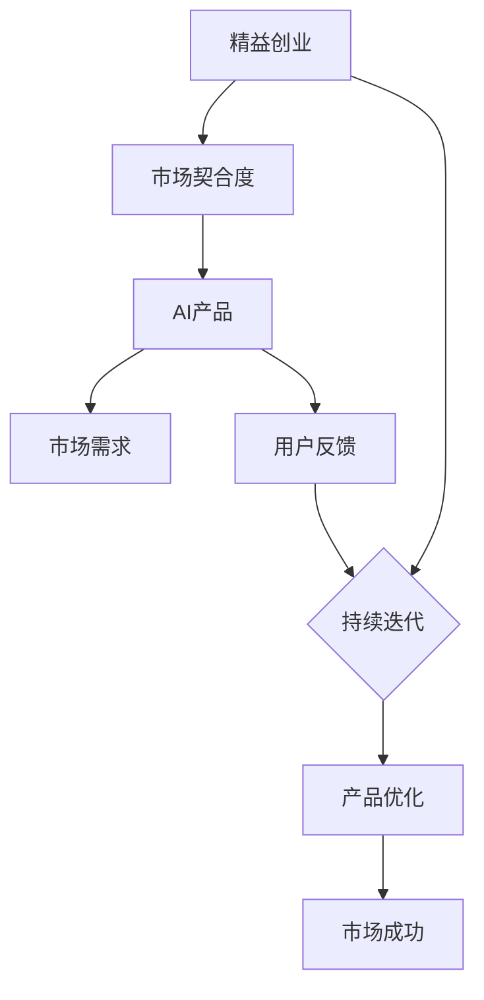
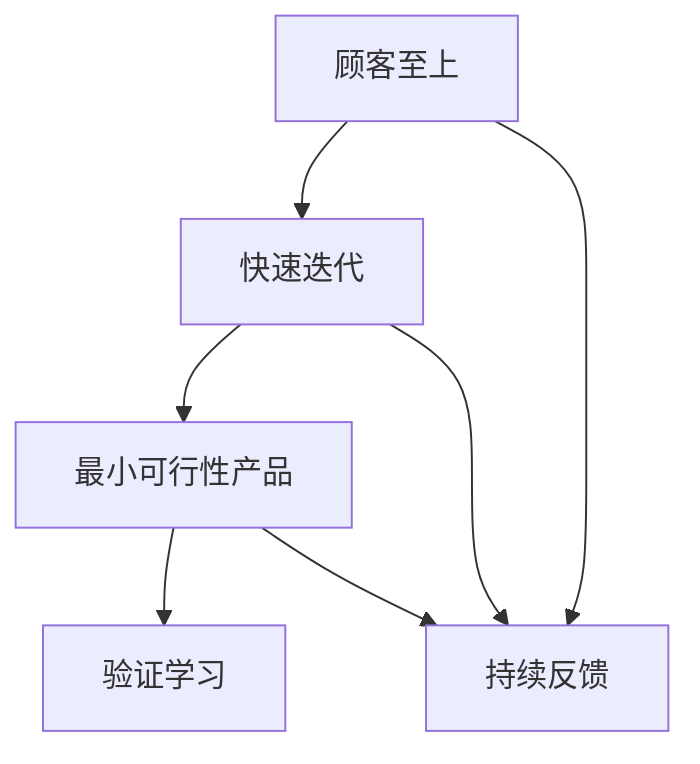

                 

### 文章标题

《精益创业：验证AI产品市场契合度的策略》

### 关键词

- 精益创业
- AI产品
- 市场契合度
- 用户需求
- 产品迭代
- 数据分析

### 摘要

本文将深入探讨精益创业在AI产品开发中的应用，尤其是如何通过验证AI产品市场契合度的策略来提升产品成功概率。文章首先介绍了精益创业的概念、起源及与传统创业的对比，随后详细阐述了验证AI产品市场契合度的具体策略，包括市场研究方法、用户需求分析和产品价值验证等。接着，文章介绍了AI产品的开发与迭代流程，并重点讨论了市场推广与运营策略。最后，通过实际案例研究，本文总结了精益创业与AI产品市场契合度验证的有效实践，并展望了未来的发展方向。本文旨在为AI产品开发者提供系统化的指导和参考，助力他们在激烈的市场竞争中找到成功之路。

---

#### 第一部分：精益创业概念介绍

### 1.1 精益创业的起源与理念

**精益创业**（Lean Startup）是一种源自硅谷的创业方法论，由企业家埃里克·莱斯（Eric Ries）在其同名书籍《精益创业》中提出。该理念的核心在于通过**快速迭代**和**持续反馈**来降低创业风险，提高产品与市场契合度。

#### 1.1.1 精益创业的起源背景

精益创业的理念起源于硅谷的高科技创业环境。在这个充满不确定性和快速变化的市场中，传统的创业模式往往需要大量的时间和资源投入，而市场结果却常常无法预测。莱斯观察到，许多创业公司在开发产品时，常常忽视市场需求，导致产品无法成功上市或无法获得用户认可。这种情况下，他提出了精益创业的方法，以帮助创业者更有效地应对市场挑战。

#### 1.1.2 精益创业的核心理念

精益创业的核心理念包括以下几个方面：

1. **顾客至上**：以用户需求为导向，不断调整和优化产品。
2. **快速迭代**：通过快速开发最小可行性产品（MVP），尽早验证市场需求。
3. **验证学习**：在开发过程中不断收集用户反馈，用数据驱动决策。
4. **持续反馈**：将用户反馈作为产品改进的重要依据，实现持续迭代。

#### 1.2 精益创业与传统创业的对比

**传统创业**强调在产品完全开发完成后，再进行市场推广和销售。这种方法的风险较高，因为如果在产品开发阶段未能准确把握市场需求，可能会导致产品失败。

**精益创业**则主张在产品开发初期，通过MVP快速验证市场需求，确保产品能够满足用户需求。这种方法的风险较低，因为即使产品初期并不完美，通过持续迭代和优化，可以逐步完善产品，提高成功率。

#### 1.2.1 传统创业的方法与局限

传统创业的方法通常包括以下几个步骤：

1. **市场调研**：分析市场需求，确定产品定位。
2. **产品开发**：投入大量资源进行产品开发。
3. **市场推广**：通过广告和营销手段推广产品。
4. **销售和反馈**：收集用户反馈，进行后续优化。

然而，这种方法存在以下局限：

1. **时间成本高**：从市场调研到产品推广需要较长时间，增加了创业风险。
2. **资源浪费**：如果市场需求与产品不符，会导致大量资源浪费。
3. **用户反馈滞后**：在产品开发完成后，用户反馈往往为时已晚，无法及时调整产品。

#### 1.2.2 精益创业的优势

**精益创业**的优势主要体现在以下几个方面：

1. **降低风险**：通过MVP快速验证市场需求，避免资源浪费。
2. **提高效率**：快速迭代和持续反馈，使产品能够迅速适应市场需求。
3. **用户导向**：以用户需求为核心，确保产品能够满足用户期望。
4. **数据驱动**：通过数据分析，为产品优化提供科学依据。

#### 1.3 精益创业与AI产品市场契合度的关系

精益创业的理念与AI产品的特点有着紧密的联系。AI产品通常具有以下特点：

1. **复杂性**：AI产品涉及多个技术领域，开发周期较长。
2. **不确定性**：AI技术的应用场景多样，市场需求难以预测。
3. **迭代性**：AI产品需要不断优化和升级，以适应新的应用场景。

精益创业通过以下方式帮助AI产品实现市场契合度：

1. **最小可行性产品（MVP）**：通过MVP，AI产品开发团队可以早期验证产品的核心功能是否满足用户需求，避免在开发过程中浪费资源。
2. **用户反馈**：通过持续收集用户反馈，AI产品开发团队能够及时了解用户的使用情况，发现产品存在的问题，并进行优化。
3. **数据驱动**：AI产品通常涉及大量的数据收集和分析，精益创业的数据驱动方法可以确保产品开发过程中充分利用数据资源，提高产品性能。

#### 1.3.1 精益创业与AI产品市场契合度的关系架构图



### 1.3.2 精益创业的核心概念

精益创业的核心概念包括：

1. **顾客至上**：以用户需求为导向，确保产品能够满足用户期望。
2. **快速迭代**：通过快速开发MVP，尽早验证市场需求。
3. **验证学习**：在开发过程中不断收集用户反馈，用数据驱动决策。
4. **持续反馈**：将用户反馈作为产品改进的重要依据，实现持续迭代。

这些核心概念相互关联，形成一个闭环，确保产品开发过程始终以市场需求和用户反馈为中心。

### 1.3.3 核心概念之间的关系



**顾客至上**和**持续反馈**确保产品始终以满足用户需求为核心；**快速迭代**和**验证学习**使产品能够快速适应市场需求，持续优化。这些核心概念共同作用，提高了AI产品的市场契合度。

---

**1.4 小结**

精益创业作为一种创新的创业方法论，通过快速迭代、验证学习和持续反馈，有效降低了创业风险，提高了产品与市场的契合度。特别是在AI产品开发中，精益创业的理念能够帮助开发团队更好地应对复杂性、不确定性和迭代性，实现产品的市场成功。

#### 2.1 市场研究方法

验证AI产品市场契合度的基础是深入的市场研究，这有助于识别潜在用户需求、分析竞争对手、评估市场规模和预测市场趋势。以下将详细探讨几种常用的市场研究方法。

##### 2.1.1 市场调查的方法

市场调查是获取市场信息的主要手段之一，它包括定量和定性的两种方法。

**1. 问卷调查**

问卷调查是一种广泛使用的定量研究方法，通过设计一系列标准化的问卷，收集大量用户的意见和反馈。这种方法具有成本较低、覆盖面广等优点，但缺点是可能受到问卷设计质量和受访者回答真实性的影响。

**伪代码示例：设计问卷**

```python
# 设计问卷
questions = [
    "您对当前智能客服系统的满意度如何？",
    "您认为智能客服系统能够解决哪些问题？",
    "您是否愿意尝试一款新的智能客服系统？",
    "您希望智能客服系统能提供哪些额外功能？"
]

# 发放问卷
participants = send_survey(questions)

# 收集反馈
feedbacks = collect_answers(participants)
```

**2. 用户访谈**

用户访谈是一种定性研究方法，通过与目标用户进行深入交流，获取更详细的用户需求和意见。这种方法能够提供丰富的背景信息和深入见解，但成本较高，且样本量通常较小。

**伪代码示例：进行用户访谈**

```python
# 预约访谈
interviewees = select_users()

# 进行访谈
interviews = conduct_interviews(interviewees)

# 收集访谈记录
interview_notes = compile_interview_data(interviews)
```

##### 2.1.2 市场数据分析

市场数据分析是通过分析市场数据来识别趋势、预测未来需求和评估市场机会的方法。以下是一些常用的数据分析技术：

**1. 趋势分析**

趋势分析是一种常用的数据分析技术，通过分析历史数据，识别市场变化的趋势和周期。这种方法可以帮助预测未来的市场需求。

**伪代码示例：趋势分析**

```python
# 加载市场数据
market_data = load_data()

# 分析趋势
trends = analyze_trends(market_data)

# 预测未来趋势
future_trends = predict_trends(trends)
```

**2. 竞争分析**

竞争分析是一种评估竞争对手的市场表现和策略的方法。通过分析竞争对手的产品、市场份额、定价策略等，可以识别自身的市场定位和竞争优势。

**伪代码示例：竞争分析**

```python
# 加载竞争对手数据
competitor_data = load_competitor_data()

# 分析竞争对手
competitor_analysis = analyze_competitors(competitor_data)

# 评估自身市场定位
market_positioning = evaluate_positioning(competitor_analysis)
```

##### 2.1.3 用户需求识别

用户需求识别是市场研究的关键步骤，它涉及确定目标用户的需求和偏好。以下是一些常用的用户需求识别方法：

**1. 用户需求调查**

用户需求调查是通过问卷调查或访谈等方式，收集用户对产品功能、性能、价格等方面的需求。这种方法可以帮助了解用户的真实需求。

**伪代码示例：用户需求调查**

```python
# 设计需求调查问卷
demand_questions = [
    "您最关心的智能客服系统的功能是什么？",
    "您对智能客服系统的响应速度有什么要求？",
    "您认为智能客服系统的价格应在多少范围内？"
]

# 发放需求调查问卷
participants = send_demand_survey(demand_questions)

# 收集用户需求
user_demands = collect_demand_answers(participants)
```

**2. 用户反馈分析**

用户反馈分析是通过分析用户在社交媒体、产品评论等渠道的反馈，了解用户对产品的实际使用体验和意见。这种方法可以提供更真实和即时的用户需求信息。

**伪代码示例：用户反馈分析**

```python
# 收集用户反馈
user_feedback = collect_feedback()

# 分析用户反馈
feedback_analysis = analyze_feedback(user_feedback)

# 识别用户需求
identified_demands = extract_user_demands(feedback_analysis)
```

##### 2.1.4 市场需求评估

市场需求评估是确定产品是否能够满足市场需求的过程。以下是一些常用的市场需求评估方法：

**1. SWOT分析**

SWOT分析是一种常用的市场需求评估方法，通过评估产品的优势（Strengths）、劣势（Weaknesses）、机会（Opportunities）和威胁（Threats），确定产品的市场地位和战略方向。

**伪代码示例：SWOT分析**

```python
# 评估产品优势
product_strengths = evaluate_strengths()

# 评估产品劣势
product_weaknesses = evaluate_weaknesses()

# 评估市场机会
market_opportunities = evaluate_opportunities()

# 评估市场威胁
market_threats = evaluate_threats()

# 进行SWOT分析
swot_analysis = perform_swot_analysis(product_strengths, product_weaknesses, market_opportunities, market_threats)
```

**2. 用户访谈分析**

用户访谈分析是通过分析用户访谈记录，深入了解用户的需求、痛点和期望，为产品改进提供依据。

**伪代码示例：用户访谈分析**

```python
# 分析访谈记录
interview_data = analyze_interview_notes()

# 识别用户需求
user需求的处理方法 demand_identification = identify_user_demands(interview_data)
```

##### 2.1.5 市场调查的总结

市场调查是验证AI产品市场契合度的重要环节，通过问卷调查、用户访谈、市场数据分析等方法，可以深入了解用户需求、分析竞争对手和市场趋势。这些信息为产品开发提供了关键指导，帮助开发团队制定有效的产品策略，提高产品的市场契合度和成功率。

#### 2.2 用户需求分析

在验证AI产品市场契合度的过程中，用户需求分析是至关重要的一步。通过深入了解用户的需求和偏好，开发团队能够更好地设计产品功能，优化用户体验，从而提高产品的市场竞争力。以下将详细探讨用户需求识别、用户需求评估和用户需求满足的方法。

##### 2.2.1 用户需求识别

用户需求识别是理解用户需求的过程，它包括确定用户在特定情境下所需的产品功能、性能和特点。以下是几种常用的用户需求识别方法：

**1. 用户需求调查**

用户需求调查是通过设计问卷或访谈等方式，收集用户对产品功能、性能和价格等方面的意见和需求。这种方法有助于全面了解用户对产品的期望和需求。

**伪代码示例：用户需求调查**

```python
# 设计需求调查问卷
demand_questions = [
    "您希望智能客服系统能提供哪些功能？",
    "您对智能客服系统的响应速度有什么要求？",
    "您认为智能客服系统的价格应在多少范围内？"
]

# 发放问卷
participants = send_demand_survey(demand_questions)

# 收集反馈
user_demands = collect_demand_answers(participants)
```

**2. 用户访谈**

用户访谈是一种定性研究方法，通过与目标用户进行深入交流，了解用户的具体需求和偏好。这种方法能够提供更详细的用户需求信息，有助于开发团队更准确地识别用户需求。

**伪代码示例：用户访谈**

```python
# 预约访谈
interviewees = select_users()

# 进行访谈
interviews = conduct_interviews(interviewees)

# 收集访谈记录
interview_notes = compile_interview_data(interviews)
```

**3. 竞争对手分析**

通过对竞争对手的产品进行分析，可以了解用户在当前市场上的需求和行为模式。这种方法有助于识别潜在的用户需求，并为产品开发提供参考。

**伪代码示例：竞争对手分析**

```python
# 加载竞争对手数据
competitor_data = load_competitor_data()

# 分析竞争对手
competitor_analysis = analyze_competitors(competitor_data)

# 识别用户需求
user_demands = extract_user_demands_from_competitors(competitor_analysis)
```

##### 2.2.2 用户需求评估

用户需求评估是确定哪些需求对产品开发最为重要和有价值的步骤。以下是一些常用的用户需求评估方法：

**1. 用户优先级排序**

用户优先级排序是一种通过评估用户需求的重要性和紧迫性，确定需求优先级的方法。这种方法有助于开发团队集中资源，优先满足最重要的用户需求。

**伪代码示例：用户优先级排序**

```python
# 收集用户需求
user_demands = collect_user_demands()

# 评估需求
demand_evaluation = evaluate_user_demands(user_demands)

# 排序需求
sorted_demands = sort_demands_by_priority(demand_evaluation)
```

**2. 用户满意度分析**

用户满意度分析是通过评估用户对产品的满意程度，了解哪些需求得到了满足，哪些需求尚未得到满足。这种方法有助于开发团队了解用户对产品的实际感受。

**伪代码示例：用户满意度分析**

```python
# 收集用户满意度数据
user_satisfaction_data = collect_satisfaction_data()

# 分析满意度
satisfaction_analysis = analyze_satisfaction(user_satisfaction_data)

# 确定需求满足情况
demand_satisfaction = evaluate_demand_satisfaction(satisfaction_analysis)
```

**3. 成本效益分析**

成本效益分析是一种通过评估满足特定需求所需的投资和预期收益，确定需求的可行性和价值的方法。这种方法有助于开发团队在资源有限的情况下，优先满足最具经济效益的需求。

**伪代码示例：成本效益分析**

```python
# 收集成本数据
cost_data = collect_costs()

# 收集收益数据
revenue_data = collect_revenue()

# 进行成本效益分析
cost_benefit_analysis = perform_cost_benefit_analysis(cost_data, revenue_data)

# 确定需求价值
demand_value = evaluate_demand_value(cost_benefit_analysis)
```

##### 2.2.3 用户需求满足

用户需求满足是通过设计产品功能和特性，满足用户需求的过程。以下是一些常用的用户需求满足方法：

**1. 产品功能设计**

产品功能设计是根据用户需求，设计产品所需的功能和特性。这种方法有助于确保产品能够满足用户的基本需求。

**伪代码示例：产品功能设计**

```python
# 根据需求设计功能
functions = design_functions(user_demands)

# 集成功能到产品
product_features = integrate_functions_to_product(functions)
```

**2. 用户体验优化**

用户体验优化是通过优化产品的界面、交互和操作，提高用户满意度和使用便利性。这种方法有助于提升用户对产品的整体体验。

**伪代码示例：用户体验优化**

```python
# 评估用户体验
user_experience_evaluation = evaluate_user_experience()

# 优化产品界面
optimized_ui = optimize_ui(user_experience_evaluation)

# 提高交互便利性
enhanced_interactivity = improve_interactivity(user_experience_evaluation)
```

**3. 产品迭代**

产品迭代是通过不断更新和改进产品，满足用户需求的变化。这种方法有助于确保产品能够持续适应市场需求，保持竞争力。

**伪代码示例：产品迭代**

```python
# 收集用户反馈
user_feedback = collect_user_feedback()

# 分析反馈
feedback_analysis = analyze_feedback(user_feedback)

# 更新产品
product_iterations = iterate_product(feedback_analysis)

# 优化产品
optimized_product = optimize_product(product_iterations)
```

##### 2.2.4 用户需求分析总结

用户需求分析是验证AI产品市场契合度的重要步骤，通过需求识别、需求评估和需求满足，开发团队能够更好地理解用户需求，设计出符合用户期望的产品。有效的用户需求分析有助于提高产品的市场竞争力，降低开发风险，实现产品的市场成功。

#### 2.3 产品价值验证

在验证AI产品市场契合度的过程中，产品价值验证是关键的一步。它不仅关乎产品能否满足用户需求，更关系到产品能否在市场竞争中脱颖而出。以下将详细探讨产品价值的定义、验证方法及其在实际案例中的应用。

##### 2.3.1 产品价值的定义

产品价值是指产品能够为用户带来的实际效益和满足感，它包括以下几个方面：

1. **功能性价值**：产品提供的功能是否能够满足用户的需求和期望。
2. **经济价值**：产品的成本与用户支付意愿的对比，以及产品为用户带来的经济效益。
3. **情感价值**：产品使用过程中的用户体验和满意度，包括用户与产品的情感互动和品牌认同。
4. **社会价值**：产品对社会和环境的影响，如环保、公益等。

这些价值共同决定了产品在市场中的竞争力。在AI产品开发中，功能性价值和情感价值尤为重要，因为AI技术的特点在于其智能性和用户体验。

##### 2.3.2 产品价值的验证方法

验证产品价值的方法有多种，以下是一些常用的方法：

1. **用户反馈**：通过收集用户对产品的使用体验和反馈，了解产品在功能性、经济价值和情感价值方面的表现。
2. **基准测试**：使用行业标准或竞争对手产品的性能数据作为基准，对比分析自身产品的表现。
3. **市场调研**：通过市场调研了解用户对产品的期望和需求，以及产品在市场中的定位。
4. **经济模型分析**：使用经济模型评估产品的成本、收益和市场前景。

这些方法可以单独使用，也可以结合使用，以达到更全面的验证效果。

##### 2.3.3 产品价值验证的案例分析

**案例一：智能推荐系统**

智能推荐系统是AI产品中的一个典型例子，以下通过一个实际案例来说明产品价值验证的过程。

**1. 案例背景**

某在线购物平台开发了一款智能推荐系统，旨在通过分析用户的历史购买行为和浏览记录，向用户推荐符合其兴趣的商品。

**2. 验证过程**

**（1）用户反馈收集**

在系统上线初期，平台通过在线问卷调查和用户访谈收集用户对推荐系统的反馈。问卷问题包括：

- 您对智能推荐系统的整体满意度如何？
- 您是否经常看到感兴趣的商品推荐？
- 您认为推荐系统的准确性如何？

通过这些反馈，平台了解到了用户对推荐系统的初步反应。

**伪代码示例：用户反馈收集**

```python
# 设计问卷
questions = [
    "您对智能推荐系统的整体满意度如何？",
    "您是否经常看到感兴趣的商品推荐？",
    "您认为推荐系统的准确性如何？"
]

# 发放问卷
participants = send_survey(questions)

# 收集反馈
feedbacks = collect_answers(participants)
```

**（2）基准测试**

平台还使用行业标准推荐系统的基准数据进行对比测试。通过对比，平台分析了自家推荐系统的性能，特别是在推荐准确性、响应速度和用户体验方面。

**伪代码示例：基准测试**

```python
# 加载基准数据
benchmark_data = load_benchmark_data()

# 进行性能对比
performance_comparison = compare_performance(current_system, benchmark_data)
```

**（3）市场调研**

为了进一步了解市场情况，平台进行了市场调研，分析了用户对智能推荐系统的需求以及潜在的市场机会。

**伪代码示例：市场调研**

```python
# 设计调研问卷
demand_questions = [
    "您认为智能推荐系统能为您带来哪些价值？",
    "您愿意为更好的推荐系统支付额外费用吗？"
]

# 发放调研问卷
participants = send_demand_survey(demand_questions)

# 收集反馈
market_insights = collect_survey_answers(participants)
```

**（4）经济模型分析**

平台还进行了经济模型分析，评估了推荐系统对平台业务的影响。通过计算推荐系统的成本和预期收益，平台确定了推荐系统的经济价值。

**伪代码示例：经济模型分析**

```python
# 收集成本数据
cost_data = collect_costs()

# 收集收益数据
revenue_data = collect_revenue()

# 进行成本效益分析
cost_benefit_analysis = perform_cost_benefit_analysis(cost_data, revenue_data)
```

**3. 验证结果分析**

通过以上多种方法的综合验证，平台对推荐系统的产品价值有了更清晰的认识。以下是对验证结果的分析：

- **用户反馈**显示，用户对推荐系统的整体满意度较高，特别是对推荐准确性和用户体验表示满意。
- **基准测试**结果表明，平台推荐系统的性能优于行业标准，特别是在推荐准确性方面。
- **市场调研**发现，用户对智能推荐系统的需求强烈，且愿意为更好的推荐系统支付额外费用。
- **经济模型分析**显示，推荐系统有望带来显著的收益增长，具有较强的经济价值。

基于这些验证结果，平台决定进一步优化推荐系统，以提高其市场竞争力。

##### 2.3.4 案例小结

通过智能推荐系统的案例，我们可以看到，产品价值验证是确保AI产品市场契合度的关键步骤。通过多方法综合验证，平台不仅了解了用户对产品的直接反馈，还分析了产品的市场前景和经济价值。这些信息有助于平台制定更有效的产品策略，提高产品在市场中的竞争力。

---

**2.4 小结**

产品价值验证是验证AI产品市场契合度的重要组成部分。通过用户反馈、基准测试、市场调研和经济模型分析等多种方法，可以全面评估产品的功能性、经济和情感价值，为产品优化和市场推广提供科学依据。有效的产品价值验证有助于提高产品的市场竞争力，实现产品的市场成功。

#### 3.1 AI产品开发流程

AI产品开发是一个复杂而迭代的过程，涉及到多个关键阶段和活动。为了确保产品能够满足市场需求并取得成功，我们需要遵循一个系统化的开发流程。以下将详细介绍AI产品开发的主要阶段，包括需求分析与规划、数据采集与预处理、模型设计与训练，以及模型评估与优化。

##### 3.1.1 需求分析与规划

需求分析是AI产品开发的起点，它涉及到确定产品要解决的问题、目标用户群体以及产品功能和技术要求。以下是需求分析与规划的关键步骤：

**1. 需求收集**

需求收集是通过访谈、问卷调查、用户调研等方式获取用户需求的过程。这个步骤的目的是确保产品开发团队对用户需求有深入的理解。

```python
# 需求收集示例
user_questions = [
    "您希望AI产品解决哪些问题？",
    "您认为哪些功能对于AI产品至关重要？",
    "您期望AI产品的性能如何？"
]

participants = send_survey(user_questions)
demands = collect_answers(participants)
```

**2. 需求分析**

需求分析是对收集到的需求进行整理、分类和优先级排序，以确定产品的核心功能和关键特性。这一步通常涉及到需求文档的编写。

```python
# 需求分析示例
需求文档 = analyze_demands(demands)
```

**3. 需求规划**

需求规划是根据分析结果制定产品开发计划，包括确定项目范围、时间表和资源分配。这一步有助于确保项目能够按时、按预算完成。

```python
# 需求规划示例
project_plan = plan_project(需求文档)
```

##### 3.1.2 数据采集与预处理

数据是AI产品的基础，数据采集与预处理是AI产品开发中至关重要的一步。以下是数据采集与预处理的关键步骤：

**1. 数据采集**

数据采集是指收集用于训练和评估AI模型的原始数据。数据来源可能包括用户生成数据、传感器数据、公开数据集等。

```python
# 数据采集示例
data_collection_methods = ["问卷调查", "用户行为跟踪", "传感器数据收集"]
collected_data = collect_data(data_collection_methods)
```

**2. 数据清洗**

数据清洗是指处理原始数据中的错误、缺失和异常值，以确保数据质量。数据清洗步骤包括数据清洗、去重、填充缺失值和异常值处理。

```python
# 数据清洗示例
cleaned_data = clean_data(collected_data)
```

**3. 数据预处理**

数据预处理是指将清洗后的数据转换为适合模型训练的格式。数据预处理步骤包括数据标准化、归一化、特征工程等。

```python
# 数据预处理示例
preprocessed_data = preprocess_data(cleaned_data)
```

##### 3.1.3 模型设计与训练

模型设计与训练是AI产品开发的核心，它涉及到选择合适的算法、设计模型结构，以及使用训练数据来训练模型。以下是模型设计与训练的关键步骤：

**1. 模型设计**

模型设计是根据需求分析和数据特性，选择合适的算法和模型结构。这一步通常需要专业的数据科学家和机器学习工程师。

```python
# 模型设计示例
algorithm_choice = select_algorithm()
model_structure = design_model(algorithm_choice)
```

**2. 模型训练**

模型训练是指使用训练数据来调整模型参数，使其能够准确预测或分类。训练过程通常涉及到多次迭代，以优化模型性能。

```python
# 模型训练示例
trained_model = train_model(model_structure, preprocessed_data)
```

**3. 模型评估**

模型评估是评估模型性能的重要步骤，它包括使用测试数据来评估模型的准确性、召回率、F1分数等指标。

```python
# 模型评估示例
evaluation_results = evaluate_model(trained_model, test_data)
```

##### 3.1.4 模型评估与优化

模型评估与优化是确保AI产品性能的关键步骤。以下是对模型评估与优化过程的详细描述：

**1. 模型评估**

模型评估是通过测试数据来评估模型在不同场景下的性能。评估结果可以帮助开发团队了解模型的强项和弱点。

```python
# 模型评估示例
evaluation_results = evaluate_model(trained_model, test_data)
print(evaluation_results)
```

**2. 模型优化**

模型优化是通过调整模型参数、改进模型结构或使用不同的算法来提高模型性能。优化过程通常涉及到多次迭代，直到达到满意的性能指标。

```python
# 模型优化示例
optimized_model = optimize_model(trained_model, evaluation_results)
```

##### 3.1.5 AI产品开发流程总结

AI产品开发流程包括需求分析与规划、数据采集与预处理、模型设计与训练，以及模型评估与优化等关键阶段。每个阶段都有其特定的任务和目标，确保产品能够满足市场需求，并在竞争激烈的市场中取得成功。

---

**3.2 小结**

AI产品开发是一个复杂而系统化的过程，涉及多个关键阶段。通过需求分析与规划、数据采集与预处理、模型设计与训练，以及模型评估与优化，开发团队能够确保AI产品能够满足用户需求，并在市场中取得成功。了解并遵循这个流程，是开发高效、可靠的AI产品的关键。

#### 3.2 AI产品迭代方法

AI产品的迭代方法是指在产品开发过程中，通过不断收集用户反馈和技术改进，持续优化产品性能和用户体验的过程。迭代方法不仅有助于快速适应市场需求，还能确保产品在激烈的市场竞争中保持领先地位。以下将详细探讨AI产品的迭代开发流程、迭代策略以及如何通过用户反馈进行产品优化。

##### 3.2.1 迭代开发流程

迭代开发流程是AI产品开发的核心，它包括以下几个关键步骤：

**1. 用户反馈收集**

用户反馈是迭代开发的基础，通过收集和分析用户反馈，开发团队能够了解用户在使用产品过程中遇到的问题和需求。以下是一个简单的用户反馈收集流程：

**伪代码示例：用户反馈收集**

```python
# 设计用户反馈问卷
feedback_questions = [
    "您在使用AI产品过程中遇到哪些问题？",
    "您对AI产品的哪些功能最不满意？",
    "您希望AI产品新增哪些功能？"
]

# 发放问卷
participants = send_feedback_survey(feedback_questions)

# 收集反馈
user_feedback = collect_answers(participants)
```

**2. 问题识别**

在收集到用户反馈后，开发团队需要对这些反馈进行分析，识别出产品存在的问题和改进机会。以下是一个问题识别的伪代码示例：

```python
# 分析用户反馈
feedback_analysis = analyze_feedback(user_feedback)

# 识别问题
problems_identified = identify_problems(feedback_analysis)
```

**3. 问题分类**

问题分类是将识别出的问题按照类型进行分类，以便于制定相应的改进策略。以下是一个问题分类的伪代码示例：

```python
# 分类问题
problems categorized = categorize_problems(problems_identified)
```

**4. 问题解决**

在问题分类完成后，开发团队需要针对每个问题制定解决方案。以下是一个问题解决的伪代码示例：

```python
# 解决问题
solutions = develop_solutions(problems_categorized)

# 实施解决方案
implement_solutions(solutions)
```

**5. 代码更新**

在解决完问题后，开发团队需要对产品代码进行更新，实现问题的解决和新功能的添加。以下是一个代码更新的伪代码示例：

```python
# 更新代码
code_updates = apply_code_updates()

# 集成更新到产品
integrate_code_updates(code_updates)
```

**6. 用户测试**

在代码更新后，开发团队需要对更新后的产品进行用户测试，验证问题的解决和新功能的实现效果。以下是一个用户测试的伪代码示例：

```python
# 设计用户测试
test_questions = [
    "您在使用最新版本的产品时，是否解决了之前的问题？",
    "您对新增的功能是否满意？"
]

# 发放测试问卷
participants = send_user_tests(test_questions)

# 收集测试结果
test_results = collect_test_answers(participants)
```

**7. 结果分析**

在用户测试完成后，开发团队需要分析测试结果，了解用户的反馈和产品的性能。以下是一个结果分析的伪代码示例：

```python
# 分析测试结果
test_analysis = analyze_test_results(test_results)

# 评估解决方案的有效性
evaluate_solutions(test_analysis)
```

**8. 下一次迭代**

在分析结果后，开发团队可以决定是否进行下一次迭代。如果用户反馈和测试结果满意，则可以结束本次迭代；如果存在问题，则需要继续迭代，直到满足用户需求。以下是一个下一次迭代的伪代码示例：

```python
# 判断是否继续迭代
if continue_iterations():
    start_next_iteration()
else:
    conclude_iteration()
```

##### 3.2.2 迭代策略

迭代策略是指在迭代开发过程中，如何有效地进行资源分配和时间管理，以最大化迭代效率和产品价值。以下是一些常用的迭代策略：

**1. 快速迭代**

快速迭代是一种以缩短迭代周期为核心的开发策略，通过频繁的迭代来加速产品改进。快速迭代有助于更快地响应用户需求和市场变化。

**伪代码示例：快速迭代**

```python
# 设置迭代周期
iteration_cycle = set_iterations_per_month(2)

# 开始迭代
start_iterations(iteration_cycle)
```

**2. 用户参与**

用户参与是一种将用户融入迭代开发过程的策略，通过用户反馈来驱动产品改进。这种方法有助于确保产品始终符合用户需求。

**伪代码示例：用户参与**

```python
# 邀请用户参与迭代
participants = invite_users_to_participate()

# 收集用户反馈
user_feedback = collect_user_feedback(participants)
```

**3. 分阶段迭代**

分阶段迭代是将产品开发过程分为多个阶段，每个阶段专注于解决特定问题或实现特定功能。这种方法有助于更好地管理复杂项目，并确保每个阶段的产品交付符合预期。

**伪代码示例：分阶段迭代**

```python
# 定义迭代阶段
stages = ["需求分析", "数据采集", "模型训练", "产品测试"]

# 开始分阶段迭代
for stage in stages:
    start_stage(stage)
    end_stage(stage)
```

##### 3.2.3 通过用户反馈进行产品优化

通过用户反馈进行产品优化是迭代开发的核心。以下是一些具体的优化方法：

**1. 功能优化**

根据用户反馈，开发团队可以识别出需要改进的功能，并制定相应的优化策略。以下是一个功能优化的伪代码示例：

```python
# 识别需要优化的功能
functions_to_optimize = identify_functions_to_optimize(user_feedback)

# 制定优化策略
optimization_strategies = define_optimization_strategies(functions_to_optimize)

# 实施优化策略
apply_optimization_strategies(optimization_strategies)
```

**2. 性能优化**

性能优化是通过提升算法效率、改进数据结构或优化代码来提高产品性能。以下是一个性能优化的伪代码示例：

```python
# 分析性能瓶颈
performance_bottlenecks = analyze_performance_bottlenecks()

# 制定优化策略
optimization_strategies = define_performance_optimization_strategies(performance_bottlenecks)

# 实施优化策略
apply_optimization_strategies(optimization_strategies)
```

**3. 用户体验优化**

用户体验优化是通过改进用户界面、交互设计和操作流程，提升用户满意度。以下是一个用户体验优化的伪代码示例：

```python
# 识别用户体验问题
user_experience_issues = identify_user_experience_issues(user_feedback)

# 制定优化策略
optimization_strategies = define_user_experience_optimization_strategies(user_experience_issues)

# 实施优化策略
apply_optimization_strategies(optimization_strategies)
```

##### 3.2.4 迭代开发总结

迭代开发是AI产品开发的核心策略，通过快速迭代、用户参与和分阶段迭代，开发团队能够持续优化产品，提升用户体验和性能。有效的迭代方法不仅有助于快速响应用户需求，还能提高产品的市场竞争力。

---

**3.3 小结**

AI产品的迭代开发是通过不断收集用户反馈和技术改进，持续优化产品性能和用户体验的过程。迭代开发流程包括用户反馈收集、问题识别、问题解决、代码更新、用户测试和结果分析等关键步骤。通过快速迭代、用户参与和分阶段迭代等策略，开发团队能够更好地适应市场需求，提高产品的市场竞争力。

#### 4.1 市场推广策略

在AI产品开发完成后，市场推广成为关键的一步，它决定了产品能否在市场中获得广泛的认可和接受。有效的市场推广策略可以提升品牌知名度，吸引潜在用户，最终实现产品的商业化成功。以下将详细讨论品牌建设、营销策略和用户运营等市场推广的各个方面。

##### 4.1.1 品牌建设

品牌建设是市场推广的基础，它涉及到品牌定位、品牌形象塑造和品牌传播渠道的制定。以下是品牌建设的几个关键点：

**1. 品牌定位**

品牌定位是确定产品在市场中的独特价值和定位，以便于与竞争对手区分。品牌定位需要基于产品的核心优势和市场细分。以下是一个品牌定位的伪代码示例：

```python
# 确定品牌定位
brand_positioning = define_brand_positioning(product_strengths, market_segment)

# 定义品牌定位描述
brand_description = create_brand_description(brand_positioning)
```

**2. 品牌形象塑造**

品牌形象塑造是通过视觉元素、品牌语言和用户体验等方面，建立品牌在用户心中的形象。以下是一个品牌形象塑造的伪代码示例：

```python
# 设计品牌视觉元素
brand_visual_elements = design_brand_logos_and_icons()

# 制定品牌语言
brand_language = create_brand_slogan_and_message()

# 实施品牌形象塑造
apply_brand_visual_elements(brand_visual_elements)
disseminate_brand_language(brand_language)
```

**3. 品牌传播渠道**

品牌传播渠道是指将品牌信息传递给目标用户的方式，包括在线和离线渠道。以下是一个品牌传播渠道的伪代码示例：

```python
# 选择品牌传播渠道
brand_communication_channels = select_channels([社交媒体，广告，公关活动])

# 制定传播计划
brand_communication_plan = create_brand_communication_plan(brand_communication_channels)

# 执行传播计划
execute_brand_communication_plan(brand_communication_plan)
```

##### 4.1.2 营销策略

营销策略是市场推广的核心，它涉及到如何有效地将产品信息传递给目标用户，并激发用户的购买欲望。以下是几种常见的营销策略：

**1. 内容营销**

内容营销是通过创造有价值、相关和吸引人的内容，吸引和留住目标用户。以下是一个内容营销的伪代码示例：

```python
# 创建内容
content = create_content([博客文章，视频教程，用户案例研究])

# 分发内容
distribute_content(content, brand_communication_channels)

# 分析内容效果
content_analysis = analyze_content_performance(content)
```

**2. 社交媒体营销**

社交媒体营销是通过社交媒体平台进行品牌推广和用户互动，提升品牌知名度和用户参与度。以下是一个社交媒体营销的伪代码示例：

```python
# 选择社交媒体平台
social_media_platforms = select_social_media([Facebook，Twitter，LinkedIn])

# 制定社交媒体营销策略
social_media_strategy = create_social_media_strategy(brand_positioning, content)

# 执行社交媒体营销
execute_social_media_strategy(social_media_platforms, social_media_strategy)

# 分析社交媒体效果
social_media_analysis = analyze_social_media_performance(social_media_strategy)
```

**3. 网络广告**

网络广告是通过在线广告平台展示广告，吸引潜在用户。以下是一个网络广告的伪代码示例：

```python
# 选择广告平台
advertising_platforms = select_advertising_platform([Google Ads，Bing Ads])

# 制定广告策略
advertising_strategy = create_advertising_strategy(brand_positioning, target аудитория)

# 发布广告
publish_ads(advertising_platforms, advertising_strategy)

# 分析广告效果
advertising_analysis = analyze_advertising_performance(advertising_strategy)
```

##### 4.1.3 用户运营

用户运营是通过一系列活动和策略，提升用户活跃度和忠诚度，从而实现用户增长和留存。以下是用户运营的几个关键点：

**1. 用户社群管理**

用户社群管理是通过创建和运营用户社群，促进用户之间的交流和互动。以下是一个用户社群管理的伪代码示例：

```python
# 创建用户社群
user_communities = create_user_communities()

# 管理用户社群
manage_user_communities(user_communities, community_guidelines)

# 激励用户参与
motivate_user_participation(incentives, user_engagement_activities)
```

**2. 用户活跃度提升**

用户活跃度提升是通过一系列活动、游戏化元素和互动设计，激发用户的参与热情。以下是一个用户活跃度提升的伪代码示例：

```python
# 设计用户活动
user_activities = design_user_activities()

# 鼓励用户参与
encourage_user_participation(user_activities, rewards)

# 监测活跃度
monitor_user_activity_levels()
```

**3. 用户反馈收集**

用户反馈收集是通过多种渠道收集用户对产品的反馈，用于产品改进和用户体验优化。以下是一个用户反馈收集的伪代码示例：

```python
# 发放用户反馈问卷
feedback_surveys = send_feedback_surveys()

# 收集用户反馈
user_feedback = collect_feedback_answers(feedback_surveys)

# 分析反馈
feedback_analysis = analyze_user_feedback(user_feedback)
```

##### 4.1.4 市场推广策略总结

市场推广策略是一个系统性过程，包括品牌建设、营销策略和用户运营等多个方面。通过有效的品牌建设，明确品牌定位和形象；通过多样化的营销策略，提升品牌知名度和用户参与度；通过用户运营，提升用户活跃度和忠诚度，企业可以成功地推广AI产品，实现市场目标。

---

**4.2 小结**

市场推广策略是AI产品成功上市的关键。通过品牌建设、多样化的营销策略和用户运营，企业可以有效地提升产品知名度，吸引潜在用户，并保持用户的活跃度和忠诚度。有效的市场推广策略不仅有助于实现产品的商业化成功，还能提升企业的品牌价值。

#### 4.2 产品运营策略

在AI产品成功上市后，产品运营成为维持产品生命力、提升用户满意度和实现持续增长的关键环节。以下将详细探讨产品运营策略，包括用户反馈收集、数据分析与应用、用户增长策略和用户留存策略等，以及如何通过这些策略实现产品的可持续发展。

##### 4.2.1 用户反馈收集

用户反馈是产品运营的重要来源，它可以帮助企业了解用户的使用体验、需求和痛点，从而进行有针对性的优化和改进。以下是用户反馈收集的关键步骤和策略：

**1. 反馈渠道多样化**

为了全面收集用户反馈，企业需要建立多样化的反馈渠道，如在线问卷、用户论坛、社交媒体、客户服务热线等。以下是一个设置多样化反馈渠道的伪代码示例：

```python
# 设置反馈渠道
feedback_channels = ["在线问卷", "用户论坛", "社交媒体", "客户服务热线"]

# 配置反馈收集系统
configure_feedback_collection_system(feedback_channels)
```

**2. 反馈问题的精准识别**

在收集反馈时，企业需要精准识别用户的问题和需求。通过数据分析和用户访谈，企业可以深入了解用户的使用情况和行为模式。以下是一个反馈问题识别的伪代码示例：

```python
# 分析用户反馈
feedback_analysis = analyze_user_feedback(feedback_channels)

# 识别反馈问题
feedback_issues = identify_feedback_issues(feedback_analysis)
```

**3. 用户反馈的及时响应**

及时响应用户反馈是提升用户满意度和忠诚度的关键。企业需要建立快速反馈处理机制，确保用户问题得到及时解决。以下是一个用户反馈响应的伪代码示例：

```python
# 响应用户反馈
respond_to_user_feedback(feedback_issues)

# 跟进反馈处理进度
track_feedback_resolution_progress()
```

##### 4.2.2 数据分析与应用

数据分析是产品运营的核心，它帮助企业从大量用户行为数据中提取有价值的信息，指导产品优化和运营策略。以下是数据分析的关键步骤和应用策略：

**1. 用户行为数据分析**

用户行为数据分析可以帮助企业了解用户的使用习惯、偏好和需求，从而优化产品设计和功能。以下是一个用户行为数据分析的伪代码示例：

```python
# 收集用户行为数据
user_behavior_data = collect_user_behavior_data()

# 分析用户行为
user_behavior_analysis = analyze_user_behavior(user_behavior_data)

# 识别用户行为模式
user_behavior_patterns = identify_user_behavior_patterns(user_behavior_analysis)
```

**2. 用户流失分析**

用户流失分析是识别用户离开产品的原因，从而制定有效的用户留存策略。以下是一个用户流失分析的伪代码示例：

```python
# 收集用户流失数据
churn_data = collect_churn_data()

# 分析用户流失原因
churn_analysis = analyze_churn_data(churn_data)

# 识别用户流失模式
churn_patterns = identify_churn_patterns(churn_analysis)
```

**3. 数据驱动的决策**

基于数据分析的结果，企业可以做出更加科学的决策。以下是一个数据驱动决策的伪代码示例：

```python
# 数据驱动的产品优化
data_driven_product_improvements = apply_data_analysis_results(user_behavior_patterns, churn_patterns)

# 实施优化措施
execute_product_improvements(data_driven_product_improvements)
```

##### 4.2.3 用户增长策略

用户增长是产品运营的重要目标之一，以下是一些常见的用户增长策略：

**1. 营销推广**

通过线上线下营销活动，吸引新用户。以下是一个营销推广的伪代码示例：

```python
# 制定营销策略
marketing_strategy = create_marketing_strategy()

# 执行营销活动
execute_marketing_activities(marketing_strategy)

# 分析营销效果
marketing_analysis = analyze_marketing_performance(marketing_strategy)
```

**2. 用户推荐**

通过用户推荐，鼓励现有用户邀请新用户使用产品。以下是一个用户推荐的伪代码示例：

```python
# 设计推荐计划
referral_program = design_referral_program()

# 推广推荐计划
promote_referral_program(referral_program)

# 监测推荐效果
track_referral_performance(referral_program)
```

**3. 社交媒体运营**

通过社交媒体平台，与用户互动，提升用户参与度和品牌知名度。以下是一个社交媒体运营的伪代码示例：

```python
# 管理社交媒体账号
social_media_management = manage_social_media_accounts()

# 发布内容
publish_social_media_content(social_media_management)

# 分析社交媒体效果
social_media_analysis = analyze_social_media_performance(social_media_management)
```

##### 4.2.4 用户留存策略

用户留存是衡量产品成功的重要指标，以下是一些用户留存策略：

**1. 用户体验优化**

通过持续优化用户体验，提升用户满意度，减少用户流失。以下是一个用户体验优化的伪代码示例：

```python
# 分析用户体验
user_experience_analysis = analyze_user_experience()

# 优化用户体验
optimize_user_experience(user_experience_analysis)

# 测试优化效果
test_optimization_effects()
```

**2. 激励计划**

通过设计激励计划，鼓励用户持续使用产品。以下是一个激励计划的伪代码示例：

```python
# 设计激励计划
incentive_program = design_incentive_program()

# 实施激励计划
execute_incentive_program(incentive_program)

# 监测激励效果
track_incentive_performance(incentive_program)
```

**3. 用户社群建设**

通过建设用户社群，增强用户归属感和忠诚度。以下是一个用户社群建设的伪代码示例：

```python
# 创建用户社群
user_community = create_user_community()

# 管理用户社群
manage_user_community(user_community, community_guidelines)

# 激励用户参与
motivate_user_participation(user_community, community_activities)
```

##### 4.2.5 产品运营策略总结

产品运营策略是通过用户反馈收集、数据分析、用户增长和用户留存等多方面的策略，确保产品能够持续优化、增长和留存。通过有效的产品运营，企业可以不断提升用户满意度，实现产品的可持续发展。

---

**4.3 小结**

产品运营策略是确保AI产品成功上市后，持续优化和增长的关键。通过用户反馈收集、数据分析、用户增长和用户留存等策略，企业可以不断提升产品性能和用户体验，实现产品的可持续发展。有效的产品运营不仅有助于提升用户满意度和忠诚度，还能为企业的长期发展奠定坚实基础。

#### 5.1 产品持续创新

在快速变化的市场环境中，产品的持续创新是企业保持竞争优势、满足用户需求、实现长远发展的关键。以下将探讨产品持续创新的思维和方法，以及如何在AI产品开发中实践这些创新思维。

##### 5.1.1 创新思维与方法

**1. 用户中心思维**

用户中心思维是将用户需求置于产品创新的核心，通过深入了解用户的需求、痛点和偏好，引导产品创新方向。以下是一个用户中心思维的伪代码示例：

```python
# 了解用户需求
user_needs = gather_user需求的见解()

# 分析用户需求
user需求的洞察 = analyze_user_needs(user_needs)

# 驱动产品创新
innovation_driver = create_innovation_strategy(user需求的洞察)
```

**2. 开放式创新**

开放式创新是通过与外部合作伙伴、用户和专家合作，共同探索和开发新产品的过程。这种方法可以引入外部视角和资源，加速创新速度。以下是一个开放式创新的伪代码示例：

```python
# 寻找合作伙伴
partners = find_innovation_partners()

# 合作开发
collaborate_innovation = initiate_collaborative_innovation(partners)

# 评估合作效果
evaluate_collaborative_results(collaborate_innovation)
```

**3. 模式创新**

模式创新是在现有产品或服务的基础上，通过改变商业模式、业务流程或服务方式，实现创新。以下是一个模式创新的伪代码示例：

```python
# 分析现有模式
current_models = analyze_current_models()

# 设计新模式
new_models = design_innovative_models(current_models)

# 实施新模式
implement_new_models(new_models)
```

##### 5.1.2 创新实践案例分析

**案例一：智能医疗诊断平台**

某医疗科技公司开发了一款智能医疗诊断平台，通过AI算法分析患者病历数据，提供准确的诊断建议。以下是该案例的创新实践：

**1. 用户中心思维**

- **用户需求分析**：通过对医生和患者的调研，了解他们在诊断过程中的痛点和需求。
- **需求驱动创新**：根据用户需求，优化算法，提高诊断准确率和效率。

**伪代码示例：用户需求驱动创新**

```python
# 收集用户需求
user_needs = gather_user_needs(doctors, patients)

# 分析用户需求
user需求的洞察 = analyze_user_needs(user_needs)

# 驱动产品创新
diagnosis_innovation = create_diagnosis_strategy(user需求的洞察)
```

**2. 开放式创新**

- **合作开发**：与顶级医疗机构合作，引入临床数据和专家知识，优化诊断算法。
- **外部资源利用**：利用外部技术资源和数据，提升平台的诊断能力。

**伪代码示例：开放式创新**

```python
# 寻找合作伙伴
medical_partners = find_medical_partners()

# 合作开发
collaborate_diagnosis = initiate_collaborative_diagnosis(medical_partners)

# 评估合作效果
evaluate_collaborative_diagnosis(collaborate_diagnosis)
```

**3. 模式创新**

- **商业模式创新**：通过订阅制收费，提供个性化诊断服务，增加用户黏性。
- **服务模式创新**：提供24/7在线诊断服务，满足用户随时随地的诊断需求。

**伪代码示例：模式创新**

```python
# 分析现有模式
current_business_models = analyze_current_models()

# 设计新模式
subscription_model = design_subscription_model(current_business_models)

# 实施新模式
implement_subscription_model(subscription_model)
```

**案例二：智能家居系统**

某智能家居公司推出了一款智能家居系统，通过AI技术实现家电设备的智能控制和自动化管理。以下是该案例的创新实践：

**1. 用户中心思维**

- **用户调研**：通过用户调研，了解用户对智能家居系统的期望和需求。
- **需求驱动创新**：根据用户需求，开发新的智能家居设备和功能。

**伪代码示例：用户需求驱动创新**

```python
# 收集用户需求
user_needs = gather_user_needs(householders)

# 分析用户需求
user需求的洞察 = analyze_user_needs(user_needs)

# 驱动产品创新
smart_home_innovation = create_smart_home_strategy(user需求的洞察)
```

**2. 开放式创新**

- **生态系统构建**：与多家家电厂商合作，构建智能家居生态系统。
- **技术共享**：开放API接口，允许开发者开发第三方智能家居应用。

**伪代码示例：开放式创新**

```python
# 寻找合作伙伴
device_partners = find_device_partners()

# 合作开发
collaborate_smart_home = initiate_collaborative_smart_home(device_partners)

# 评估合作效果
evaluate_collaborative_smart_home(collaborate_smart_home)
```

**3. 模式创新**

- **订阅服务模式**：通过订阅服务，提供智能家居系统的全包解决方案。
- **智能套餐**：根据用户需求，提供不同功能的智能套餐，满足个性化需求。

**伪代码示例：模式创新**

```python
# 分析现有模式
current_business_models = analyze_current_models()

# 设计新模式
subscription_models = design_subscription_models(current_business_models)

# 实施新模式
implement_subscription_models(subscription_models)
```

##### 5.1.3 案例小结

通过智能医疗诊断平台和智能家居系统的案例，我们可以看到，产品持续创新需要结合用户中心思维、开放式创新和模式创新。这些创新方法不仅提升了产品的性能和用户体验，还增强了产品的市场竞争力，为企业带来了持续的收益。

---

**5.2 小结**

产品持续创新是企业保持竞争优势、满足用户需求、实现长远发展的重要途径。通过用户中心思维、开放式创新和模式创新，企业可以不断推动产品进步，提升市场竞争力。了解并实践这些创新方法，是企业在AI领域取得成功的关键。

#### 6.1 案例一：智能推荐系统

**6.1.1 案例背景**

智能推荐系统是一种利用人工智能技术，根据用户的历史行为、偏好和兴趣，为其推荐相关产品或内容的服务系统。这种系统在电子商务、在线媒体和社交媒体等场景中得到了广泛应用。以下将详细描述智能推荐系统的市场研究、用户需求识别、产品价值验证和迭代过程。

**6.1.2 市场研究过程**

在开发智能推荐系统之前，市场研究是关键的一步。该过程包括以下几个方面：

1. **市场趋势分析**

   通过分析行业报告、市场数据和研究论文，了解智能推荐系统的市场趋势和发展前景。以下是一个市场趋势分析的伪代码示例：

   ```python
   # 加载市场数据
   market_data = load_market_data()

   # 分析市场趋势
   market_trends = analyze_market_trends(market_data)
   ```

2. **竞争对手分析**

   研究市场上的主要竞争对手，了解他们的产品特性、市场策略和用户反馈。以下是一个竞争对手分析的伪代码示例：

   ```python
   # 加载竞争对手数据
   competitor_data = load_competitor_data()

   # 分析竞争对手
   competitor_analysis = analyze_competitors(competitor_data)
   ```

3. **用户调研**

   通过问卷调查、用户访谈和焦点小组讨论等方式，深入了解目标用户的需求和偏好。以下是一个用户调研的伪代码示例：

   ```python
   # 设计问卷
   questions = [
       "您经常使用推荐系统吗？",
       "您对推荐系统的准确性和多样性有何要求？",
       "您对个性化推荐有何期待？"
   ]

   # 发放问卷
   participants = send_survey(questions)

   # 收集反馈
   user_feedback = collect_answers(participants)
   ```

**6.1.3 用户需求识别**

在市场研究的基础上，用户需求识别是确定智能推荐系统功能的关键步骤。以下是一些用户需求识别的方法：

1. **问卷调查**

   通过问卷调查，收集用户对推荐系统的具体需求和期望。以下是一个问卷调查的伪代码示例：

   ```python
   # 设计问卷
   demand_questions = [
       "您希望智能推荐系统推荐哪些类型的商品？",
       "您认为推荐系统的响应速度有多重要？",
       "您是否希望推荐系统能提供个性化推荐？"
   ]

   # 发放问卷
   participants = send_demand_survey(demand_questions)

   # 收集用户需求
   user_demands = collect_demand_answers(participants)
   ```

2. **用户访谈**

   通过与用户进行一对一访谈，深入了解用户的需求和痛点。以下是一个用户访谈的伪代码示例：

   ```python
   # 预约访谈
   interviewees = select_users()

   # 进行访谈
   interviews = conduct_interviews(interviewees)

   # 收集访谈记录
   interview_notes = compile_interview_data(interviews)
   ```

**6.1.4 产品价值验证**

产品价值验证是确保智能推荐系统能够满足用户需求和市场期望的关键步骤。以下是一些常用的产品价值验证方法：

1. **最小可行性产品（MVP）**

   通过开发一个最小可行性产品，验证智能推荐系统的核心功能是否满足用户需求。以下是一个MVP开发的伪代码示例：

   ```python
   # 设计MVP
   mvp_features = define_mvp_features(user_demands)

   # 开发MVP
   mvp_product = develop_mvp(mvp_features)

   # 测试MVP
   mvp_tests = test_mvp(mvp_product)
   ```

2. **用户反馈**

   在MVP上线后，通过用户反馈了解系统的实际表现和用户满意度。以下是一个用户反馈的伪代码示例：

   ```python
   # 收集用户反馈
   user_feedback = collect_user_feedback()

   # 分析反馈
   feedback_analysis = analyze_feedback(user_feedback)
   ```

3. **性能评估**

   通过评估推荐系统的准确性、响应速度和用户体验，验证产品的价值。以下是一个性能评估的伪代码示例：

   ```python
   # 评估系统性能
   performance_evaluation = evaluate_recommendation_system(mvp_product)

   # 分析性能结果
   performance_analysis = analyze_performance_evaluation(performance_evaluation)
   ```

**6.1.5 产品迭代过程**

智能推荐系统在初步验证后，需要进行持续迭代和优化，以满足不断变化的市场需求和用户期望。以下是迭代过程的关键步骤：

1. **用户需求分析**

   通过持续的用户需求调研，了解用户的新需求和改进建议。以下是一个用户需求分析的伪代码示例：

   ```python
   # 收集用户需求
   new_user_demands = gather_new_user_needs()

   # 分析用户需求
   new需求的洞察 = analyze_new_user_needs(new_user_demands)
   ```

2. **功能优化**

   根据用户需求分析的结果，对推荐系统的功能进行优化和改进。以下是一个功能优化的伪代码示例：

   ```python
   # 设计优化方案
   optimization_strategy = define_optimization_strategy(new需求的洞察)

   # 实施优化方案
   apply_optimization_strategy(optimization_strategy)
   ```

3. **性能优化**

   通过技术改进和算法优化，提升推荐系统的性能。以下是一个性能优化的伪代码示例：

   ```python
   # 分析性能瓶颈
   performance_bottlenecks = analyze_performance_bottlenecks()

   # 优化算法
   optimize_recommendation_algorithm(performance_bottlenecks)
   ```

4. **用户测试**

   在每次迭代后，进行用户测试，验证优化措施的有效性。以下是一个用户测试的伪代码示例：

   ```python
   # 设计用户测试
   test_questions = [
       "您对新的推荐系统功能是否满意？",
       "您认为推荐系统的准确性如何？"
   ]

   # 发放测试问卷
   participants = send_user_tests(test_questions)

   # 收集测试结果
   test_results = collect_test_answers(participants)
   ```

5. **持续迭代**

   根据用户测试结果和反馈，持续进行迭代和优化，确保推荐系统能够不断满足用户需求。以下是一个持续迭代的伪代码示例：

   ```python
   # 判断是否继续迭代
   if continue_iterations():
       start_next_iteration()
   else:
       conclude_iteration()
   ```

**6.1.6 案例小结**

智能推荐系统的成功开发与迭代，展示了精益创业方法在AI产品开发中的实际应用。通过市场研究、用户需求识别、产品价值验证和持续迭代，开发团队能够有效应对市场需求的变化，提升产品的市场竞争力，实现了智能推荐系统的成功。

---

**6.2 案例二：智能客服系统**

**6.2.1 案例背景**

智能客服系统是一种利用人工智能技术，提供自动客服服务的系统。它能够通过自然语言处理和机器学习技术，自动回答用户的问题，提供解决方案，提高客户服务效率和用户体验。以下将详细描述智能客服系统的市场研究、用户需求识别、产品价值验证和迭代过程。

**6.2.2 市场研究过程**

在开发智能客服系统之前，市场研究是关键的一步。该过程包括以下几个方面：

1. **行业趋势分析**

   通过分析行业报告、市场数据和研究论文，了解智能客服系统的市场趋势和发展前景。以下是一个行业趋势分析的伪代码示例：

   ```python
   # 加载市场数据
   market_data = load_market_data()

   # 分析行业趋势
   industry_trends = analyze_industry_trends(market_data)
   ```

2. **竞争对手分析**

   研究市场上的主要竞争对手，了解他们的产品特性、市场策略和用户反馈。以下是一个竞争对手分析的伪代码示例：

   ```python
   # 加载竞争对手数据
   competitor_data = load_competitor_data()

   # 分析竞争对手
   competitor_analysis = analyze_competitors(competitor_data)
   ```

3. **用户调研**

   通过问卷调查、用户访谈和焦点小组讨论等方式，深入了解目标用户的需求和偏好。以下是一个用户调研的伪代码示例：

   ```python
   # 设计问卷
   questions = [
       "您对当前智能客服系统的满意度如何？",
       "您认为智能客服系统能解决哪些问题？",
       "您是否愿意尝试一款新的智能客服系统？"
   ]

   # 发放问卷
   participants = send_survey(questions)

   # 收集反馈
   user_feedback = collect_answers(participants)
   ```

**6.2.3 用户需求识别**

在市场研究的基础上，用户需求识别是确定智能客服系统功能的关键步骤。以下是一些用户需求识别的方法：

1. **问卷调查**

   通过问卷调查，收集用户对智能客服系统的具体需求和期望。以下是一个问卷调查的伪代码示例：

   ```python
   # 设计问卷
   demand_questions = [
       "您希望智能客服系统具备哪些功能？",
       "您对智能客服系统的响应速度有何要求？",
       "您认为智能客服系统的价格应在多少范围内？"
   ]

   # 发放问卷
   participants = send_demand_survey(demand_questions)

   # 收集用户需求
   user_demands = collect_demand_answers(participants)
   ```

2. **用户访谈**

   通过与用户进行一对一访谈，深入了解用户的需求和痛点。以下是一个用户访谈的伪代码示例：

   ```python
   # 预约访谈
   interviewees = select_users()

   # 进行访谈
   interviews = conduct_interviews(interviewees)

   # 收集访谈记录
   interview_notes = compile_interview_data(interviews)
   ```

**6.2.4 产品价值验证**

产品价值验证是确保智能客服系统能够满足用户需求和市场期望的关键步骤。以下是一些常用的产品价值验证方法：

1. **最小可行性产品（MVP）**

   通过开发一个最小可行性产品，验证智能客服系统的核心功能是否满足用户需求。以下是一个MVP开发的伪代码示例：

   ```python
   # 设计MVP
   mvp_features = define_mvp_features(user_demands)

   # 开发MVP
   mvp_product = develop_mvp(mvp_features)

   # 测试MVP
   mvp_tests = test_mvp(mvp_product)
   ```

2. **用户反馈**

   在MVP上线后，通过用户反馈了解系统的实际表现和用户满意度。以下是一个用户反馈的伪代码示例：

   ```python
   # 收集用户反馈
   user_feedback = collect_user_feedback()

   # 分析反馈
   feedback_analysis = analyze_feedback(user_feedback)
   ```

3. **性能评估**

   通过评估智能客服系统的响应速度、准确性和用户体验，验证产品的价值。以下是一个性能评估的伪代码示例：

   ```python
   # 评估系统性能
   performance_evaluation = evaluate_cvs_system(mvp_product)

   # 分析性能结果
   performance_analysis = analyze_performance_evaluation(performance_evaluation)
   ```

**6.2.5 产品迭代过程**

智能客服系统在初步验证后，需要进行持续迭代和优化，以满足不断变化的市场需求和用户期望。以下是迭代过程的关键步骤：

1. **用户需求分析**

   通过持续的用户需求调研，了解用户的新需求和改进建议。以下是一个用户需求分析的伪代码示例：

   ```python
   # 收集用户需求
   new_user_demands = gather_new_user_needs()

   # 分析用户需求
   new需求的洞察 = analyze_new_user_needs(new_user_demands)
   ```

2. **功能优化**

   根据用户需求分析的结果，对智能客服系统的功能进行优化和改进。以下是一个功能优化的伪代码示例：

   ```python
   # 设计优化方案
   optimization_strategy = define_optimization_strategy(new需求的洞察)

   # 实施优化方案
   apply_optimization_strategy(optimization_strategy)
   ```

3. **性能优化**

   通过技术改进和算法优化，提升智能客服系统的性能。以下是一个性能优化的伪代码示例：

   ```python
   # 分析性能瓶颈
   performance_bottlenecks = analyze_performance_bottlenecks()

   # 优化算法
   optimize_cvs_algorithm(performance_bottlenecks)
   ```

4. **用户测试**

   在每次迭代后，进行用户测试，验证优化措施的有效性。以下是一个用户测试的伪代码示例：

   ```python
   # 设计用户测试
   test_questions = [
       "您对新的智能客服系统功能是否满意？",
       "您认为智能客服系统的响应速度如何？"
   ]

   # 发放测试问卷
   participants = send_user_tests(test_questions)

   # 收集测试结果
   test_results = collect_test_answers(participants)
   ```

5. **持续迭代**

   根据用户测试结果和反馈，持续进行迭代和优化，确保智能客服系统能够不断满足用户需求。以下是一个持续迭代的伪代码示例：

   ```python
   # 判断是否继续迭代
   if continue_iterations():
       start_next_iteration()
   else:
       conclude_iteration()
   ```

**6.2.6 案例小结**

智能客服系统的成功开发与迭代，展示了精益创业方法在AI产品开发中的实际应用。通过市场研究、用户需求识别、产品价值验证和持续迭代，开发团队能够有效应对市场需求的变化，提升产品的市场竞争力，实现了智能客服系统的成功。

---

**6.3 小结**

智能推荐系统和智能客服系统的案例，展示了精益创业方法在AI产品开发中的应用。通过市场研究、用户需求识别、产品价值验证和迭代优化，开发团队能够更好地满足市场需求，提升产品性能和用户体验。这些实践为AI产品的成功开发提供了宝贵的经验和参考。

### 7.1 精益创业在AI领域的应用前景

精益创业作为一种高效、系统化的创业方法论，在AI领域展现出了广阔的应用前景。随着AI技术的快速发展，市场需求日益增长，精益创业的方法为AI产品的开发提供了有力的指导，有助于降低风险、提高成功率。

**7.1.1 AI产品市场契合度的挑战与机遇**

AI产品市场契合度的挑战主要体现在以下几个方面：

1. **技术复杂性**：AI技术涉及多个学科，包括机器学习、数据科学、自然语言处理等，技术复杂性使得产品开发难度增加。
2. **市场需求的不确定性**：AI技术的应用场景多样，市场需求难以预测，导致产品开发方向的不确定性。
3. **数据隐私和伦理问题**：AI产品通常依赖于大量用户数据，数据隐私和伦理问题成为市场接受的关键挑战。

然而，这些挑战同时也带来了巨大的机遇：

1. **市场需求的多样性和个性化**：随着消费者对个性化体验的追求，AI技术能够更好地满足不同用户群体的需求，提供定制化的解决方案。
2. **技术进步和创新能力**：AI技术的快速进步和创新能力为产品开发提供了更多的可能性，有助于企业占据市场先机。
3. **新兴市场的崛起**：新兴市场对AI技术的需求增长迅速，为企业提供了广阔的市场空间。

**7.1.2 精益创业在未来AI产品开发中的角色**

精益创业在未来AI产品开发中扮演着重要角色，主要体现在以下几个方面：

1. **快速迭代与持续改进**：精益创业的快速迭代方法有助于AI产品开发团队在短时间内验证产品功能，快速适应市场需求变化。
2. **用户中心思维**：精益创业强调以用户需求为导向，通过持续的用户需求调研和反馈，确保AI产品始终满足用户需求。
3. **数据驱动决策**：精益创业的数据驱动方法，可以帮助AI产品开发团队充分利用数据分析，优化产品性能和用户体验。
4. **风险管理**：通过MVP和持续验证，精益创业可以有效降低AI产品开发过程中的风险，提高产品的市场契合度。

**7.1.3 精益创业与AI产品开发的最佳实践**

为了更好地在AI产品开发中应用精益创业方法，以下是一些最佳实践：

1. **明确产品愿景和目标**：在项目启动前，明确产品愿景和目标，确保团队对产品方向有清晰的认识。
2. **快速构建MVP**：尽快开发最小可行性产品，尽早验证市场需求，避免资源浪费。
3. **持续用户反馈**：通过用户调研、用户访谈和在线反馈等方式，持续收集用户反馈，优化产品功能。
4. **数据驱动决策**：充分利用数据分析，为产品开发和优化提供科学依据。
5. **敏捷迭代**：采用敏捷开发方法，快速响应市场需求变化，实现产品的持续改进。

通过这些最佳实践，AI产品开发团队能够更好地应用精益创业方法，提高产品的市场契合度，实现商业成功。

**7.1.4 潜在研究方向**

未来的研究可以在以下几个方面展开：

1. **多模态AI融合**：研究如何将多种AI技术（如计算机视觉、自然语言处理、语音识别等）融合，提高AI产品的智能化程度。
2. **AI伦理与隐私保护**：研究如何在保证用户隐私和安全的前提下，充分利用AI技术，提升用户体验。
3. **AI产品市场策略**：研究如何在竞争激烈的市场环境中，制定有效的AI产品市场策略，实现市场份额的快速增长。
4. **AI产品生命周期管理**：研究如何通过全生命周期的管理方法，提高AI产品的可持续性和长期盈利能力。

通过不断探索和创新，精益创业在AI领域的应用将为产品开发带来更多可能性和价值。

### 7.2 AI产品市场契合度验证策略的优化

在当前快速变化的AI市场中，确保产品与市场的契合度已经成为企业成功的关键因素。尽管现有的验证策略如用户反馈、市场调研和数据分析等发挥了重要作用，但在实际应用中仍存在一定的局限性。以下将探讨现有策略的局限性，并提出相应的优化策略，以提升AI产品市场契合度的验证效果。

**7.2.1 现有策略的局限性**

1. **用户反馈的局限性**

   用户反馈是验证AI产品市场契合度的重要手段，但存在以下局限性：

   - **样本偏差**：用户反馈可能受到样本选择偏差的影响，无法全面代表所有潜在用户。
   - **滞后性**：用户反馈往往在产品发布后才能收集，不能及时指导产品的开发和优化。
   - **主观性**：用户反馈可能受到个人情感和偏见的影响，不够客观和全面。

2. **市场调研的局限性**

   市场调研通过分析市场数据和用户行为来预测产品市场契合度，但也存在以下问题：

   - **数据质量**：市场调研依赖的数据可能存在不准确或过时的风险，影响分析结果的准确性。
   - **难以量化**：市场调研往往难以将复杂的市场现象量化，导致难以制定具体的优化措施。
   - **成本高昂**：大规模的市场调研需要投入大量的人力和物力资源，对中小企业来说可能难以承受。

3. **数据分析的局限性**

   数据分析在验证AI产品市场契合度方面具有重要作用，但以下局限性也不可忽视：

   - **数据量不足**：数据分析需要大量的数据支持，数据量不足可能影响分析结果的可靠性。
   - **模型偏差**：数据分析模型可能存在偏差，导致对市场趋势和用户需求的误判。
   - **解释难度**：数据分析结果往往需要专业的知识和技能才能解读，对非专业人士来说可能难以理解。

**7.2.2 优化策略探讨**

1. **综合多源数据的融合**

   为了弥补单一数据源的局限性，可以采用多源数据的融合策略，结合用户反馈、市场调研和数据分析等多种数据源，形成更全面的市场契合度评估。以下是一个多源数据融合的伪代码示例：

   ```python
   # 加载用户反馈
   user_feedback = load_user_feedback()

   # 加载市场调研数据
   market_survey_data = load_market_survey_data()

   # 加载数据分析结果
   data_analysis_results = load_data_analysis_results()

   # 融合多源数据
   integrated_data = integrate_data_sources(user_feedback, market_survey_data, data_analysis_results)
   ```

2. **引入实时数据分析**

   实时数据分析可以通过实时监控用户行为和市场动态，及时调整产品开发和优化策略。以下是一个实时数据分析的伪代码示例：

   ```python
   # 收集实时用户行为数据
   real_time_user_data = collect_real_time_user_data()

   # 分析实时用户行为
   real_time_analysis = analyze_real_time_user_data(real_time_user_data)

   # 调整产品策略
   adjust_product_strategy(real_time_analysis)
   ```

3. **加强用户参与**

   增强用户在整个产品开发周期中的参与度，可以通过用户测试、用户社群和互动设计等方式实现。以下是一个加强用户参与的伪代码示例：

   ```python
   # 设计用户测试
   user_tests = design_user_tests()

   # 邀请用户参与测试
   invite_users_to_tests(user_tests)

   # 收集用户测试反馈
   user_test_feedback = collect_user_test_answers()

   # 优化产品
   optimize_product(user_test_feedback)
   ```

4. **采用多模型分析**

   为了降低模型偏差，可以采用多模型分析策略，通过多种分析模型来验证产品市场契合度。以下是一个多模型分析的伪代码示例：

   ```python
   # 加载多种分析模型
   analysis_models = load_analysis_models()

   # 应用多模型分析
   multi_model_analysis = apply_multi_model_analysis(analysis_models)

   # 综合分析结果
   integrated_analysis_results = integrate_analysis_results(multi_model_analysis)
   ```

5. **构建数据驱动的产品开发流程**

   通过构建数据驱动的产品开发流程，确保产品开发过程中的每个决策都有数据支持。以下是一个数据驱动产品开发的伪代码示例：

   ```python
   # 定义数据驱动流程
   data_driven流程 = define_data_driven_process()

   # 遵循数据驱动流程
   follow_data_driven流程(data_driven流程)

   # 实现数据驱动的产品优化
   data_driven_product_optimization = implement_data_driven_product_optimization(data_driven流程)
   ```

**7.2.3 潜在研究方向**

未来的研究可以进一步探讨以下方向：

1. **多源数据融合的算法优化**：研究如何通过优化算法，提高多源数据融合的准确性和效率。
2. **实时数据分析的模型创新**：研究如何开发新的实时数据分析模型，提高对市场动态和用户行为的实时预测能力。
3. **用户参与与反馈机制**：研究如何构建更有效的用户参与和反馈机制，提高用户参与度和产品优化效果。
4. **多模型分析的融合方法**：研究如何通过融合多种分析模型，提高产品市场契合度验证的全面性和准确性。

通过不断优化AI产品市场契合度验证策略，企业可以更准确地把握市场需求，降低开发风险，提高产品成功率。

### 7.3 小结

AI产品市场契合度验证是产品成功的关键环节。尽管现有的验证策略如用户反馈、市场调研和数据分析等发挥了重要作用，但在实际应用中仍存在局限性。通过引入多源数据融合、实时数据分析、加强用户参与和多模型分析等优化策略，可以提升验证效果，更好地满足市场需求。未来，进一步的研究和实践将有助于在AI产品开发中实现更加精准和高效的市场契合度验证。

### 作者信息

作者：AI天才研究院/AI Genius Institute & 禅与计算机程序设计艺术 /Zen And The Art of Computer Programming

