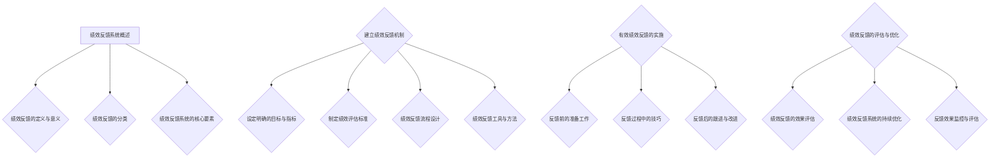

                 

### 文章标题：绩效反馈系统：建立积极有效的反馈机制

绩效反馈系统是现代企业管理中不可或缺的一部分，它不仅关乎员工个人的成长和职业生涯，也对企业整体的运营效率和团队协作产生深远影响。本文将深入探讨绩效反馈系统的基本概念、设计原则、实施方法和优化策略，旨在帮助企业和团队建立一套积极有效的绩效反馈机制，从而实现持续改进和高质量发展。

关键词：绩效反馈系统、绩效评估、反馈机制、员工成长、团队协作

摘要：本文通过对绩效反馈系统的全面解析，从概念、设计、实施和优化四个方面进行详细探讨。首先，阐述了绩效反馈系统的基本概念及其在企业管理中的重要性；接着，介绍了绩效反馈系统的核心要素和设计原则；然后，分析了绩效反馈的实施过程和技巧；最后，探讨了绩效反馈系统的评估与优化方法，并通过实际案例进行了深入剖析。通过本文的阅读，读者可以系统地了解和掌握绩效反馈系统的构建与实施，为企业和团队的管理实践提供有力支持。

### 《绩效反馈系统：建立积极有效的反馈机制》目录大纲

#### 第一部分：绩效反馈系统概述

- **1. 绩效反馈系统的基本概念**
  - **1.1 绩效反馈的定义与意义**
  - **1.2 绩效反馈的分类**
  - **1.3 绩效反馈系统的核心要素

- **2. 建立绩效反馈机制**
  - **2.1 设定明确的目标与指标**
  - **2.2 制定绩效评估标准**
  - **2.3 绩效反馈流程设计**
  - **2.4 绩效反馈工具与方法**

- **3. 有效绩效反馈的实施**
  - **3.1 反馈前的准备工作**
  - **3.2 反馈过程中的技巧**
  - **3.3 反馈后的跟进与改进**

- **4. 绩效反馈的评估与优化**
  - **4.1 绩效反馈的效果评估**
  - **4.2 绩效反馈系统的持续优化**
  - **4.3 培养绩效反馈文化**

#### 第二部分：绩效反馈系统设计与实施案例

- **5. 绩效反馈系统设计案例**
  - **5.1 企业A的绩效反馈系统设计**
  - **5.2 企业B的绩效反馈系统设计**

- **6. 绩效反馈实施案例**
  - **6.1 企业A的绩效反馈实施经验**
  - **6.2 企业B的绩效反馈实施经验**

- **7. 绩效反馈系统的优化**
  - **7.1 绩效反馈系统的持续改进**
  - **7.2 特殊情境下的绩效反馈**

#### 第三部分：绩效反馈系统的技术支持

- **8. 数据分析与处理**
  - **8.1 绩效数据收集与处理**
  - **8.2 数据可视化工具与应用**

- **9. 信息化绩效反馈系统建设**
  - **9.1 系统架构设计**
  - **9.2 系统开发与实施**

- **10. 绩效反馈系统的风险与挑战**
  - **10.1 数据隐私保护**
  - **10.2 系统安全与稳定性**

#### 附录

- **附录A：绩效反馈系统常用工具与资源**
- **附录B：参考文献与拓展阅读**

### 第一部分：绩效反馈系统概述

#### 1. 绩效反馈系统的基本概念

**1.1 绩效反馈的定义与意义**

绩效反馈是指通过一系列机制，对员工的工作表现进行评价和指导，以促进其个人成长和组织目标实现的系统。它不仅关注员工的工作结果，还涉及工作过程中的行为、态度和能力等多个方面。

在企业管理中，绩效反馈具有以下几个重要意义：

1. **提高员工工作积极性**：通过及时的绩效反馈，员工能够明确自己的工作表现和改进方向，从而激发其工作热情和积极性。
2. **促进员工成长**：绩效反馈为员工提供了自我评估和发展的机会，有助于其认识到自身的不足，并制定相应的改进计划。
3. **优化团队协作**：绩效反馈有助于团队成员之间建立良好的沟通和信任关系，提高团队整体的工作效率和协作能力。
4. **提升组织绩效**：通过绩效反馈，组织可以更好地了解员工的工作状态和需求，及时调整管理策略，从而提高整体绩效。

**1.2 绩效反馈的分类**

绩效反馈可以从不同的角度进行分类，常见的分类方法包括：

1. **按反馈内容分类**：
   - **过程反馈**：主要关注员工在工作过程中的行为、态度和能力，旨在帮助其改进工作方式。
   - **结果反馈**：主要关注员工的工作结果，如任务完成情况、工作质量等，以评估其工作效果。
   - **综合反馈**：结合过程反馈和结果反馈，全面评价员工的工作表现。

2. **按反馈形式分类**：
   - **书面反馈**：通过书面报告、邮件等形式进行反馈，具有明确的记录和可追溯性。
   - **口头反馈**：通过面对面交流、电话等方式进行反馈，具有互动性和及时性。

3. **按反馈主体分类**：
   - **上级对下级的反馈**：上级对下属员工的绩效进行评价和指导。
   - **同事间的反馈**：同事之间就工作表现进行相互评价和交流。

**1.3 绩效反馈系统的核心要素**

一个完整的绩效反馈系统通常包括以下几个核心要素：

1. **目标与指标**：明确绩效反馈的目标，如提高工作效率、提升工作质量等，并制定相应的绩效指标。
2. **评估标准**：制定具体的评估标准，如工作完成度、团队协作表现等，以衡量员工的工作表现。
3. **反馈流程**：设计合理的反馈流程，包括反馈的时间、方式、责任人等，以确保反馈的及时性和有效性。
4. **反馈工具与方法**：选择合适的反馈工具和方法，如绩效评估表、面谈、在线反馈平台等，以提高反馈的效率和效果。

通过以上核心要素的有机结合，绩效反馈系统能够充分发挥其作用，为员工个人和组织的发展提供有力支持。

#### 2. 建立绩效反馈机制

**2.1 设定明确的目标与指标**

建立绩效反馈机制的第一步是设定明确的目标与指标。目标是指绩效反馈希望达成的结果，如提高员工的工作满意度、提升团队的整体绩效等。而指标则是衡量目标实现程度的具体指标，如员工的工作效率、项目完成率等。

设定明确的目标与指标需要遵循以下几个原则：

1. **具体性**：目标与指标要具体、明确，避免模糊和宽泛。例如，而不是“提高工作效率”，可以具体设定为“提高任务完成时间5%”。

2. **可衡量性**：目标与指标需要具有可衡量性，以便进行量化评估。例如，可以设定为“每月完成10个项目”。

3. **挑战性**：目标与指标要具有一定的挑战性，以激发员工的积极性和潜力。例如，可以设定为“在规定时间内完成难度较高的项目”。

4. **相关性**：目标与指标要与企业整体战略和发展方向保持一致，以确保绩效反馈的最终效果。

**2.2 制定绩效评估标准**

绩效评估标准是指衡量员工工作表现的具体标准和要求。制定绩效评估标准需要考虑以下几个方面：

1. **岗位要求**：根据不同岗位的职责和任务，制定相应的评估标准。例如，销售岗位可以设定销售额、客户满意度等指标。

2. **关键绩效指标（KPI）**：确定关键绩效指标，以衡量员工在工作中的主要贡献。例如，研发岗位可以设定项目完成率、代码质量等指标。

3. **行为标准**：除了工作结果，还需要关注员工在工作过程中的行为表现，如团队合作、沟通能力等。

4. **适应性**：绩效评估标准要具备一定的适应性，以应对不同的工作环境和变化。例如，在项目延期时，可以适当调整任务完成时间的要求。

**2.3 绩效反馈流程设计**

绩效反馈流程是指从绩效评估到反馈实施的一系列步骤。设计绩效反馈流程需要考虑以下几个方面：

1. **评估周期**：确定绩效反馈的周期，如每月、每季度、每半年等。适当的评估周期有助于及时发现和解决问题。

2. **评估方式**：选择合适的评估方式，如书面评估、面谈评估等。书面评估具有明确的记录和可追溯性，面谈评估则更具互动性和及时性。

3. **反馈责任人**：明确反馈责任人，如直接上级、人力资源部门等。反馈责任人的角色和职责对反馈的质量和效果具有重要影响。

4. **反馈渠道**：建立畅通的反馈渠道，确保员工能够及时收到反馈信息。例如，可以通过邮件、在线平台等方式进行反馈。

**2.4 绩效反馈工具与方法**

选择合适的绩效反馈工具与方法是提高反馈效率和效果的关键。常见的绩效反馈工具与方法包括：

1. **绩效评估表**：通过填写绩效评估表，对员工的工作表现进行量化评估。绩效评估表可以包含关键绩效指标、行为标准等维度。

2. **面谈反馈**：通过面对面交流，对员工的工作表现进行深入讨论和反馈。面谈反馈有助于建立信任关系，提高反馈的接受度。

3. **在线反馈平台**：利用在线反馈平台，实现实时、多维度、多角度的反馈。在线反馈平台可以方便地记录、跟踪和评估反馈过程。

4. **行为观察**：通过观察员工在工作中的行为表现，进行及时的反馈。行为观察有助于发现潜在问题，并促进员工的改进。

通过以上方法，企业可以建立一套科学、合理、高效的绩效反馈机制，为员工个人和组织的发展创造有利条件。

#### 3. 有效绩效反馈的实施

**3.1 反馈前的准备工作**

要确保绩效反馈的有效性，首先需要做好充分的准备工作。以下是一些关键步骤：

1. **收集数据**：收集员工的工作表现数据，包括任务完成情况、工作质量、团队合作表现等。数据收集可以来源于多个渠道，如员工自我评估、同事评价、项目报告等。

2. **确定反馈对象**：明确反馈的对象，即需要接受绩效反馈的员工。反馈对象可以根据不同的岗位、团队或项目进行划分。

3. **准备反馈内容**：根据收集到的数据和绩效评估标准，准备具体的反馈内容。反馈内容应包括员工的工作优点、需要改进的方面以及改进建议。

4. **选择反馈时机**：选择合适的时机进行反馈，以确保员工能够充分理解并接受反馈。一般来说，反馈时机可以选择在任务完成、项目结束后进行。

**3.2 反馈过程中的技巧**

在反馈过程中，需要注意以下技巧，以提高反馈的效果：

1. **积极倾听**：倾听员工的意见和反馈，给予其表达的机会。积极倾听有助于建立良好的沟通关系，增强员工的接受度。

2. **客观公正**：在反馈中，要尽量保持客观、公正的态度，避免主观臆断和偏见。客观公正的反馈有助于员工正确认识自己的问题，并采取改进措施。

3. **具体明确**：在反馈中，要具体明确地指出员工的工作优点和需要改进的方面。例如，可以具体描述员工在工作中的优点，如“你的任务完成度非常高，能够按时完成任务”，以及需要改进的地方，如“在某些项目中，你的沟通能力有待提高”。

4. **提供改进建议**：在反馈中，要为员工提供具体的改进建议，帮助他们找到解决问题的方法。改进建议应具有可操作性，如“你可以尝试多与其他团队成员沟通，以避免项目进度延误”。

**3.3 反馈后的跟进与改进**

绩效反馈并不是一次性的过程，而是一个持续循环的过程。在反馈后，需要做好以下工作：

1. **跟进反馈效果**：对员工反馈后的改进情况进行跟进，了解他们是否采取了改进措施，以及改进的效果如何。跟进可以通过定期面谈、工作进度汇报等方式进行。

2. **持续改进**：根据反馈结果和改进效果，及时调整绩效评估标准和反馈机制。例如，如果发现某些评估标准过于严格或过于宽松，可以对其进行调整。

3. **建立反馈文化**：通过宣传、培训等方式，培养员工对绩效反馈的积极态度，建立一种持续改进的企业文化。建立反馈文化有助于提高员工的参与度和主动性，从而实现更好的绩效反馈效果。

通过以上步骤，企业可以确保绩效反馈的有效实施，为员工个人和组织的发展提供有力支持。

#### 4. 绩效反馈的评估与优化

**4.1 绩效反馈的效果评估**

为了确保绩效反馈系统的高效运行，企业需要对绩效反馈的效果进行定期评估。以下是一些关键的评估指标：

1. **员工满意度**：通过调查问卷、访谈等方式，了解员工对绩效反馈的满意度。员工满意度是评估绩效反馈效果的重要指标，反映了员工对反馈机制的主观感受。

2. **改进措施的实施情况**：评估员工在收到反馈后是否采取了改进措施，并跟踪改进措施的实施效果。通过评估改进措施的实施情况，可以了解绩效反馈是否真正促进了员工的成长和改进。

3. **工作绩效的提升**：评估员工的工作绩效是否因为绩效反馈而得到提升。工作绩效的提升是绩效反馈系统最终目标的体现，反映了绩效反馈的实际效果。

4. **团队协作的改善**：评估团队协作是否因为绩效反馈而得到改善。团队协作的改善有助于提高团队的整体效率和凝聚力。

**4.2 绩效反馈系统的持续优化**

绩效反馈系统是一个动态的过程，需要不断进行优化和改进。以下是一些优化策略：

1. **数据驱动的反馈**：通过收集和分析员工的绩效数据，制定更加科学和精准的反馈策略。数据驱动的反馈有助于提高反馈的准确性和有效性。

2. **定期评估与反馈**：定期对绩效反馈系统进行评估和反馈，及时发现和解决存在的问题。定期评估和反馈有助于确保绩效反馈系统的持续优化。

3. **培训与指导**：为员工提供关于绩效反馈的培训，提高他们的反馈技能和沟通能力。通过培训与指导，员工可以更好地理解和应对绩效反馈。

4. **激励与奖励**：建立绩效反馈激励机制，对表现优秀的员工给予奖励和激励。激励与奖励有助于激发员工的积极性和主动性，提高绩效反馈的效果。

5. **文化建设**：通过宣传、活动等方式，培养企业的绩效反馈文化，使员工认识到绩效反馈的重要性，并积极参与其中。

通过以上优化策略，企业可以不断提升绩效反馈系统的质量和效果，为员工个人和组织的发展提供有力支持。

**4.3 培养绩效反馈文化**

绩效反馈文化是绩效反馈系统成功实施的关键因素。以下是一些培养绩效反馈文化的策略：

1. **高层领导的支持**：高层领导对绩效反馈的重视和支持是培养绩效反馈文化的重要保障。高层领导可以通过制定政策、提供资源等方式，为绩效反馈系统的实施提供有力支持。

2. **全员参与**：绩效反馈不仅是管理层的职责，也需要员工的积极参与。通过全员参与，可以增强员工的归属感和责任感，提高绩效反馈的接受度和有效性。

3. **透明公开**：建立透明公开的绩效反馈机制，让员工了解绩效反馈的标准、流程和结果。透明公开有助于建立信任关系，提高绩效反馈的公正性和公平性。

4. **培训与沟通**：通过培训与沟通，提高员工的绩效反馈技能和沟通能力。培训与沟通可以帮助员工更好地理解和应对绩效反馈，提高绩效反馈的质量和效果。

5. **激励机制**：建立激励机制，鼓励员工积极参与绩效反馈。激励机制可以包括物质奖励、晋升机会等，以激发员工的积极性和主动性。

通过以上策略，企业可以逐步培养起一种积极向上的绩效反馈文化，为绩效反馈系统的成功实施提供有力支持。

### 第二部分：绩效反馈系统设计与实施案例

#### 5. 绩效反馈系统设计案例

**5.1 企业A的绩效反馈系统设计**

**设计思路与目标**

企业A是一家快速发展的科技公司，其绩效反馈系统设计旨在实现以下几个目标：

1. **提高员工工作效率和满意度**：通过绩效反馈，帮助员工明确工作目标，激发工作积极性，提高工作效率和满意度。
2. **促进员工个人成长**：通过绩效反馈，帮助员工识别自身不足，制定改进计划，促进个人成长和职业发展。
3. **优化团队协作**：通过绩效反馈，增强团队成员之间的沟通和协作，提高团队整体绩效。

**标准制定**

企业A的绩效反馈标准包括以下几个方面：

1. **工作结果**：如项目完成度、任务完成时间、工作质量等。
2. **工作态度**：如团队合作、责任心、沟通能力等。
3. **学习能力**：如技能提升、持续学习等。

**实施效果评估**

实施一段时间后，企业A对绩效反馈系统的效果进行了评估，主要评估指标包括员工满意度、工作绩效提升和团队协作改善。评估结果显示，绩效反馈系统有效提高了员工的工作效率和满意度，促进了个人成长和团队协作，达到了预期目标。

**5.2 企业B的绩效反馈系统设计**

**设计思路与目标**

企业B是一家传统制造企业，其绩效反馈系统设计旨在解决以下几个问题：

1. **员工积极性不高**：通过绩效反馈，提高员工的工作积极性，激发工作热情。
2. **团队协作不足**：通过绩效反馈，促进团队成员之间的沟通和协作，提高团队整体绩效。
3. **员工流失率高**：通过绩效反馈，关注员工的需求和感受，降低员工流失率。

**标准制定**

企业B的绩效反馈标准主要包括以下几个方面：

1. **工作结果**：如生产任务完成率、产品质量等。
2. **工作态度**：如责任心、出勤率、团队合作等。
3. **创新能力**：如提出改进建议、创新产品等。

**实施效果评估**

实施绩效反馈系统后，企业B对员工满意度、生产任务完成率和团队协作进行了评估。评估结果显示，绩效反馈系统有效提高了员工的工作积极性和满意度，生产任务完成率明显提升，团队协作也得到了显著改善，达到了预期目标。

#### 6. 绩效反馈实施案例

**6.1 企业A的绩效反馈实施经验**

**反馈前准备**

1. **数据收集**：企业A通过员工自我评估、上级评估、同事评价等多个渠道收集员工的工作表现数据。
2. **反馈对象确定**：明确需要接受绩效反馈的员工，根据不同的岗位和团队进行划分。
3. **反馈内容准备**：根据绩效评估标准和收集到的数据，准备具体的反馈内容。

**反馈过程技巧**

1. **积极倾听**：在反馈过程中，积极倾听员工的意见和反馈，给予其表达的机会。
2. **客观公正**：在反馈中，保持客观、公正的态度，避免主观臆断和偏见。
3. **具体明确**：具体明确地指出员工的工作优点和需要改进的方面，并提供具体的改进建议。

**反馈后改进措施**

1. **跟进反馈效果**：对员工反馈后的改进情况进行跟进，了解改进措施的实施效果。
2. **持续改进**：根据反馈结果和改进效果，调整绩效评估标准和反馈机制。
3. **建立反馈文化**：通过培训、宣传等方式，培养员工对绩效反馈的积极态度，建立持续改进的企业文化。

**6.2 企业B的绩效反馈实施经验**

**反馈前准备**

1. **数据收集**：企业B通过员工自我评估、上级评估、同事评价等多个渠道收集员工的工作表现数据。
2. **反馈对象确定**：明确需要接受绩效反馈的员工，根据不同的岗位和团队进行划分。
3. **反馈内容准备**：根据绩效评估标准和收集到的数据，准备具体的反馈内容。

**反馈过程技巧**

1. **积极倾听**：在反馈过程中，积极倾听员工的意见和反馈，给予其表达的机会。
2. **客观公正**：在反馈中，保持客观、公正的态度，避免主观臆断和偏见。
3. **具体明确**：具体明确地指出员工的工作优点和需要改进的方面，并提供具体的改进建议。

**反馈后改进措施**

1. **跟进反馈效果**：对员工反馈后的改进情况进行跟进，了解改进措施的实施效果。
2. **持续改进**：根据反馈结果和改进效果，调整绩效评估标准和反馈机制。
3. **建立反馈文化**：通过培训、宣传等方式，培养员工对绩效反馈的积极态度，建立持续改进的企业文化。

#### 7. 绩效反馈系统的优化

**7.1 绩效反馈系统的持续改进**

为了确保绩效反馈系统的有效性，企业需要对其进行持续改进。以下是一些改进策略：

1. **数据驱动的反馈**：通过收集和分析员工的绩效数据，制定更加科学和精准的反馈策略。数据驱动的反馈有助于提高反馈的准确性和有效性。
2. **定期评估与反馈**：定期对绩效反馈系统进行评估和反馈，及时发现和解决存在的问题。定期评估和反馈有助于确保绩效反馈系统的持续优化。
3. **培训与指导**：为员工提供关于绩效反馈的培训，提高他们的反馈技能和沟通能力。通过培训与指导，员工可以更好地理解和应对绩效反馈。
4. **激励与奖励**：建立绩效反馈激励机制，对表现优秀的员工给予奖励和激励。激励与奖励有助于激发员工的积极性和主动性，提高绩效反馈的效果。

**7.2 特殊情境下的绩效反馈**

在特殊情境下，如项目延期、团队冲突等，绩效反馈需要根据实际情况进行调整。以下是一些特殊情境下的反馈策略：

1. **项目延期**：在项目延期的情况下，可以对员工的工作表现进行重新评估，重点关注任务完成情况和团队合作。同时，提供具体的改进建议，帮助员工应对延期带来的挑战。
2. **团队冲突**：在团队冲突的情况下，绩效反馈需要重点关注团队合作和沟通能力。通过绩效反馈，帮助员工识别冲突的原因，并提供解决方案，促进团队的和谐与协作。
3. **员工绩效波动**：在员工绩效波动的情况下，需要重点关注员工的工作状态和心理需求。通过绩效反馈，了解员工的情况，并提供支持和帮助，帮助员工稳定工作表现。

通过以上策略，企业可以确保绩效反馈系统在不同情境下都能够发挥其应有的作用，为员工个人和组织的发展提供有力支持。

### 第三部分：绩效反馈系统的技术支持

#### 8. 数据分析与处理

**8.1 绩效数据收集与处理**

绩效数据的收集与处理是绩效反馈系统的重要组成部分。以下是一些关键步骤：

1. **数据收集**：
   - **内部数据收集**：通过员工档案、考勤系统、项目管理系统等内部系统收集员工的绩效数据，如工作时长、任务完成情况、项目进度等。
   - **外部数据收集**：通过客户反馈、市场调研等外部渠道收集与员工工作相关的数据，如客户满意度、市场份额等。

2. **数据处理**：
   - **数据清洗**：对收集到的数据进行清洗，去除无效、重复或错误的数据，保证数据的质量。
   - **数据整合**：将不同来源的数据进行整合，构建统一的绩效数据仓库。
   - **数据分析**：运用统计分析、数据挖掘等方法，对绩效数据进行分析，提取有价值的信息和趋势。

**8.2 数据可视化工具与应用**

数据可视化是将复杂的数据以直观、易于理解的方式展示出来，帮助管理者快速获取信息。以下是一些常见的数据可视化工具与应用：

1. **常见数据可视化工具**：
   - **Excel图表**：利用Excel的图表功能，如柱状图、折线图、饼图等，进行基础的数据可视化。
   - **Tableau**：一款强大的数据可视化工具，支持多种数据源，提供丰富的图表类型和交互功能。
   - **Power BI**：微软推出的商业智能工具，提供强大的数据可视化能力和报表生成功能。

2. **数据可视化实例**：
   - **员工绩效趋势图**：通过折线图展示员工在不同时间段的绩效变化趋势，帮助管理者了解员工的绩效波动情况。
   - **部门绩效对比图**：通过柱状图或饼图展示不同部门的绩效对比，帮助管理者分析各部门的工作效率和绩效表现。

通过以上步骤和工具，企业可以有效地收集、处理和可视化绩效数据，为绩效反馈提供有力支持。

#### 9. 信息化绩效反馈系统建设

**9.1 系统架构设计**

信息化绩效反馈系统建设的第一步是进行系统架构设计。系统架构设计需要考虑以下几个方面：

1. **技术选型**：
   - **前端技术**：选择适合的前端技术框架，如React、Vue.js等，以实现用户友好的界面和交互。
   - **后端技术**：选择适合的后端技术框架，如Spring Boot、Django等，以处理数据存储、业务逻辑和接口调用。
   - **数据库技术**：选择合适的数据库技术，如MySQL、MongoDB等，以存储和管理绩效数据。

2. **系统模块划分**：
   - **用户管理模块**：管理用户账号、权限等。
   - **绩效数据模块**：收集、存储和管理员工绩效数据。
   - **绩效评估模块**：进行绩效评估、生成评估报告。
   - **反馈与改进模块**：处理员工反馈、跟踪改进措施。

**9.2 系统开发与实施**

系统开发与实施是信息化绩效反馈系统建设的关键步骤。以下是一些关键步骤：

1. **需求分析**：与相关利益者沟通，明确系统功能需求和性能要求。
2. **系统设计**：根据需求分析结果，设计系统的详细架构和模块。
3. **开发**：根据系统设计文档，进行系统的开发和编码。
4. **测试**：进行功能测试、性能测试和安全测试，确保系统的稳定性和可靠性。
5. **部署**：将系统部署到生产环境，并进行用户培训和上线。

**9.3 开发流程**

信息化绩效反馈系统的开发流程一般包括以下步骤：

1. **需求调研**：与相关利益者进行沟通，明确系统的功能需求、性能需求和用户体验要求。
2. **系统设计**：根据需求调研结果，设计系统的详细架构和模块，编写系统设计文档。
3. **编码实现**：根据系统设计文档，进行系统的开发和编码，编写相应的测试用例。
4. **单元测试**：对模块进行单元测试，确保每个模块的功能和性能符合要求。
5. **集成测试**：将各个模块进行集成测试，确保系统的整体功能和性能符合要求。
6. **系统测试**：进行系统测试，包括功能测试、性能测试和安全测试。
7. **部署上线**：将系统部署到生产环境，并进行用户培训和上线。

通过以上步骤，企业可以顺利建设一套信息化绩效反馈系统，为绩效反馈的自动化和高效化提供支持。

#### 10. 绩效反馈系统的风险与挑战

**10.1 数据隐私保护**

在绩效反馈系统中，数据隐私保护是一个重要的风险和挑战。以下是一些数据隐私保护的风险和对策：

**风险**：
1. **数据泄露**：绩效数据可能因系统漏洞、恶意攻击等原因导致泄露。
2. **数据滥用**：内部人员可能滥用绩效数据，对员工进行不当评价或报复。
3. **数据丢失**：由于系统故障、数据备份不足等原因，可能导致绩效数据的丢失。

**对策**：
1. **数据加密**：对存储和传输的绩效数据进行加密，确保数据在未授权情况下无法被读取。
2. **权限管理**：实施严格的权限管理策略，确保只有授权人员才能访问和操作绩效数据。
3. **审计与监控**：建立审计和监控机制，记录和监控数据访问和操作行为，及时发现和处理异常行为。
4. **数据备份与恢复**：定期进行数据备份，并确保备份数据的完整性和可恢复性，以应对数据丢失风险。

**10.2 系统安全与稳定性**

绩效反馈系统的安全与稳定性对系统的正常运行至关重要。以下是一些系统安全与稳定性的风险和对策：

**风险**：
1. **系统漏洞**：系统可能存在漏洞，被恶意攻击者利用。
2. **数据错误**：系统可能出现数据错误，导致绩效评估结果不准确。
3. **系统崩溃**：系统可能因高负载或故障导致崩溃，影响正常使用。

**对策**：
1. **漏洞扫描与修复**：定期进行漏洞扫描，发现漏洞后及时进行修复，确保系统的安全性。
2. **数据验证与校验**：在数据处理过程中，实施严格的数据验证和校验机制，确保数据的准确性。
3. **负载均衡**：通过负载均衡技术，确保系统在高负载情况下仍能稳定运行。
4. **冗余备份**：建立冗余备份机制，确保系统在故障情况下能够快速恢复，减少停机时间。

通过以上对策，企业可以有效地降低绩效反馈系统的风险，确保系统的安全性和稳定性。

### 附录A：绩效反馈系统常用工具与资源

**附录A.1 常见绩效评估工具**

1. **KPI考核工具**：用于衡量关键绩效指标（KPI）的工具，如Google Analytics、PerfStack等。
2. **360度评估工具**：用于收集多角度、全方位的反馈，如Advantage、Lumhaus等。
3. **绩效管理软件**：如Smartsheet、Workplace等，提供全面的绩效管理功能。

**附录A.2 数据分析与处理工具**

1. **Excel**：基础的数据分析工具，适用于简单的数据处理和可视化。
2. **Tableau**：强大的数据可视化工具，适用于复杂的数据分析和报告生成。
3. **Power BI**：微软推出的商业智能工具，支持多种数据源和丰富的可视化功能。

**附录A.3 绩效反馈系统开源资源**

1. **绩效评估表模板**：可在GitHub等平台上找到各种开源的绩效评估表模板，如Google Sheets模板等。
2. **绩效管理系统开源软件**：如OpenKM、OroCRM等，提供绩效管理功能的开源软件。
3. **数据分析与可视化开源工具**：如Python的Pandas、Matplotlib等，提供丰富的数据处理和可视化功能。

通过使用以上工具与资源，企业可以更高效地建立和实施绩效反馈系统，提升员工绩效和团队协作能力。

### 附录B：参考文献与拓展阅读

**B.1 优秀案例与实践经验**

1. 《绩效管理体系设计：流程、方法与工具》 - 作者：李明，详细介绍了绩效管理体系的设计方法与实践经验。
2. 《员工绩效提升：方法与技巧》 - 作者：张晓，探讨了如何通过有效的绩效管理提升员工绩效。

**B.2 相关书籍与论文推荐**

1. 《绩效管理》 - 作者：约翰·沃特森，是一本经典的绩效管理教材，全面阐述了绩效管理的理论和方法。
2. 《工作绩效分析：如何评估、改善和提高工作绩效》 - 作者：大卫·巴克，详细介绍了工作绩效分析的方法和工具。

**B.3 专业网站与社区资源**

1. **绩效管理论坛**：提供绩效管理相关的讨论和资源，如绩效管理网、HR论坛等。
2. **LinkedIn**：通过LinkedIn的绩效管理群组，可以获取行业动态和实践经验。
3. **Stack Overflow**：对于技术驱动的绩效管理问题，Stack Overflow提供了丰富的解决方案和讨论。

通过参考以上书籍、论文和网站资源，读者可以进一步了解和掌握绩效反馈系统的理论和方法，为实际应用提供有力支持。

### 附录：核心概念与联系 Mermaid 流程图



### 附录：核心算法原理讲解伪代码

```python
# 伪代码：绩效评估标准制定
def set_evaluation_criteria(evaluation_objectives, performance_metrics):
    criteria_dict = {}
    for objective in evaluation_objectives:
        for metric in performance_metrics:
            if metric in objective.metrics:
                criteria_dict[objective] = metric.value
    return criteria_dict

# 伪代码：绩效数据收集与处理
def collect_and_process_performance_data(employees, performance_data):
    processed_data = {}
    for employee in employees:
        for metric in performance_data:
            processed_data[employee] = {
                'name': employee.name,
                'department': employee.department,
                'metric': metric.name,
                'value': metric.value
            }
    return processed_data

# 伪代码：绩效评估与反馈
def evaluate_and_feedback(employees, criteria_dict):
    for employee in employees:
        evaluation_result = evaluate_employee(employee, criteria_dict)
        provide_feedback(employee, evaluation_result)

def evaluate_employee(employee, criteria_dict):
    evaluation_result = {}
    for criterion in criteria_dict:
        evaluation_result[criterion] = employee.performance[criterion]
    return evaluation_result

def provide_feedback(employee, evaluation_result):
    feedback_message = f"员工{employee.name}的绩效评估结果：{evaluation_result}"
    send_feedback_message(employee, feedback_message)
```

### 最佳实践 tips、小结、注意事项、拓展阅读等内容

**最佳实践 tips**：

1. **定期反馈**：定期进行绩效反馈，如每月、每季度等，有助于及时发现问题，促进员工改进。
2. **个性化反馈**：根据员工的个性、岗位特点等，提供个性化的反馈建议，提高反馈的针对性和有效性。
3. **多角度评估**：结合上级评估、同事评价、员工自我评估等多角度进行评估，提高评估的全面性和客观性。

**小结**：

本文通过深入探讨绩效反馈系统的基本概念、设计原则、实施方法和优化策略，旨在帮助企业和团队建立一套积极有效的绩效反馈机制。通过本文的阅读，读者可以系统地了解和掌握绩效反馈系统的构建与实施，为企业和团队的管理实践提供有力支持。

**注意事项**：

1. **数据准确性**：确保绩效数据的准确性，避免因数据错误导致评估结果失真。
2. **反馈及时性**：及时进行绩效反馈，避免延迟影响员工的工作积极性和改进效果。
3. **沟通技巧**：在反馈过程中，注重沟通技巧，确保员工能够正确理解和接受反馈。

**拓展阅读**：

1. 《绩效管理实战手册》 - 作者：李涛，详细介绍了绩效管理的实际操作方法和案例。
2. 《绩效反馈的艺术》 - 作者：罗伯特·西奥迪尼，探讨了如何通过有效的沟通技巧提高绩效反馈的效果。

通过参考以上最佳实践、小结和拓展阅读，读者可以进一步提升对绩效反馈系统的理解和应用能力，为企业的管理实践提供有益参考。

