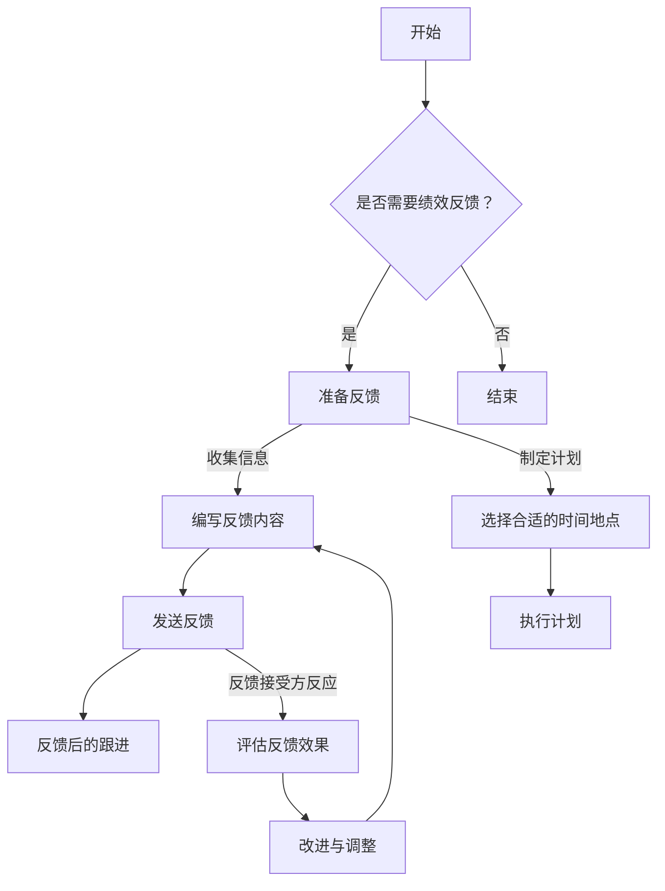

                 

### 文章标题

# 绩效反馈：有效沟通的艺术

### 关键词

- 绩效反馈
- 沟通技巧
- 人力资源管理
- 非语言沟通
- 有效提问
- 冲突解决

### 摘要

本文旨在探讨绩效反馈这一人力资源管理中的关键环节，通过深入分析绩效反馈的基本概念、沟通技巧、实施步骤以及有效沟通的艺术，旨在帮助读者理解如何通过有效的沟通实现绩效提升。文章将从非语言沟通的技巧、有效提问的策略、解决冲突的沟通策略等方面展开论述，并结合实际案例与实践，提供绩效反馈的实用工具与资源。本文期望为从事IT领域的专业人士提供一套系统的绩效反馈方法和实践指南，助力个人和组织的发展。

### 《绩效反馈：有效沟通的艺术》目录大纲

#### 第一部分：理解绩效反馈

#### 第1章：绩效反馈的基本概念

- **1.1 绩效反馈的定义与重要性**
  - 绩效反馈的定义
  - 绩效反馈的目的
  - 绩效反馈的影响

- **1.2 绩效反馈的类型与模式**
  - 正面反馈
  - 负面反馈
  - 综合反馈
  - 反馈循环

- **1.3 绩效反馈的障碍与挑战**
  - 沟通障碍
  - 反馈的时机与方式
  - 个人情感与态度

#### 第2章：绩效反馈的沟通技巧

- **2.1 倾听与理解**
  - 倾听的技巧
  - 理解对方的意图

- **2.2 表达清晰与明确**
  - 信息传递的准确性
  - 避免歧义

- **2.3 建立信任与尊重**
  - 建立信任的重要性
  - 尊重与同理心

#### 第3章：绩效反馈的实施步骤

- **3.1 反馈前的准备**
  - 确定反馈的目的
  - 收集相关资料

- **3.2 反馈的过程**
  - 如何开场
  - 如何具体传达信息
  - 如何结束

- **3.3 反馈后的跟进**
  - 倾听对方的反应
  - 提供支持与帮助

### 第二部分：有效沟通的艺术

#### 第4章：非语言沟通的技巧

- **4.1 非语言沟通的作用与影响**
  - 非语言沟通的定义
  - 非语言沟通的要素

- **4.2 身体语言**
  - 姿势与动作
  - 表情与眼神

- **4.3 视觉辅助工具**
  - 演示文稿的设计
  - PPT展示技巧

#### 第5章：有效提问的技巧

- **5.1 提问的重要性**
  - 提问的定义
  - 提问的目的

- **5.2 提问的类型**
  - 开放式问题
  - 封闭式问题

- **5.3 提问的技巧**
  - 如何引导对方思考
  - 如何避免误导性提问

#### 第6章：解决冲突的沟通策略

- **6.1 冲突的类型与原因**
  - 认知冲突
  - 文化冲突

- **6.2 冲突解决的原则**
  - 公平与公正
  - 尊重与理解

- **6.3 冲突解决的步骤**
  - 识别冲突
  - 分析原因
  - 寻求解决方案

### 第三部分：绩效反馈的案例与实践

#### 第7章：绩效反馈的实际案例

- **7.1 案例一：成功反馈的例子**
  - 案例描述
  - 成功反馈的关键要素

- **7.2 案例二：失败反馈的教训**
  - 案例描述
  - 失败反馈的原因与改进

#### 第8章：绩效反馈的项目实践

- **8.1 实践一：设计一个绩效反馈计划**
  - 实践目标
  - 实践步骤
  - 实践评估

- **8.2 实践二：参与一次绩效反馈会议**
  - 实践目标
  - 实践步骤
  - 实践反馈

### 附录

#### 附录A：绩效反馈的常用工具与资源

- **A.1 常用工具介绍**
  - 常用软件
  - 常用模板

- **A.2 资源链接**
  - 专业网站
  - 学习资源

#### 附录B：绩效反馈的数学模型和公式解释

- **B.1 相关数学公式解释**
  - 逻辑回归公式
  - 决策树分类公式

- **B.2 数学模型的应用实例**
  - 模型选择
  - 模型优化

#### 附录C：绩效反馈的项目实战代码示例

- **C.1 代码实现说明**
  - 数据处理
  - 模型训练

- **C.2 代码解读与分析**
  - 算法原理
  - 实现细节

#### 附录D：绩效反馈流程图

- **D.1 绩效反馈流程图**
  - 绩效反馈的流程解析

### 绩效反馈流程图



### 绩效反馈的基本概念

#### 1.1 绩效反馈的定义与重要性

绩效反馈是一种通过沟通来评估和提升个人或团队工作表现的过程。它不仅涉及对工作成果的评价，还包括对工作过程、态度和技能的反馈。在组织中，绩效反馈是实现员工发展和组织目标的重要手段。

**定义：** 绩效反馈是管理者或同行对个人工作绩效进行评估，并给予相应意见和建议的过程。

**重要性：**

1. **提高工作效率：** 通过绩效反馈，员工可以明确自己的工作表现和需要改进的地方，从而提高工作效率和质量。
2. **促进个人发展：** 绩效反馈为员工提供了成长的机会，有助于他们了解自己的优势和不足，制定职业发展规划。
3. **强化团队合作：** 绩效反馈有助于建立积极的团队氛围，增强团队成员之间的沟通和协作。
4. **优化组织管理：** 绩效反馈提供了组织管理者了解员工和工作流程的视角，有助于优化管理策略和提高组织效能。

#### 1.2 绩效反馈的类型与模式

绩效反馈可以分为正面反馈、负面反馈和综合反馈。

**正面反馈：** 主要针对员工表现良好的方面进行赞扬和鼓励，以增强其自信心和积极性。

**负面反馈：** 主要指出员工在工作中存在的问题和不足，旨在帮助其改进和提高。

**综合反馈：** 结合正面和负面反馈，对员工的工作进行全面评估，既肯定优点，也指出不足。

**反馈循环：** 绩效反馈不是一次性的过程，而是一个持续循环的过程。通过定期的反馈，可以不断调整和优化员工的工作表现。

#### 1.3 绩效反馈的障碍与挑战

**沟通障碍：** 绩效反馈过程中的沟通障碍可能导致信息传递不准确或误解，影响反馈的效果。

**反馈的时机与方式：** 选择合适的时机和方式进行反馈，可以增加反馈的有效性。否则，反馈可能会引起员工的抵触情绪。

**个人情感与态度：** 管理者和员工在绩效反馈过程中可能存在个人情感和态度问题，如偏见、消极情绪等，这些问题会影响反馈的公正性和效果。

### 绩效反馈的沟通技巧

#### 2.1 倾听与理解

**倾听的技巧：**

1. **专注聆听：** 全神贯注地听对方讲话，避免分心。
2. **积极反馈：** 通过点头、目光接触等方式，给予反馈，表示你在认真倾听。
3. **不要打断：** 等对方讲完再发表自己的意见，避免打断对方的思路。

**理解对方的意图：**

1. **提问澄清：** 对对方的话进行提问，确保自己理解正确。
2. **总结复述：** 将对方的观点总结复述一遍，确认自己的理解是否准确。
3. **同理心：** 设身处地地理解对方的感受和需求。

#### 2.2 表达清晰与明确

**信息传递的准确性：**

1. **简洁明了：** 用简单、直接的语言表达，避免使用复杂的术语和句子。
2. **避免歧义：** 避免使用可能产生歧义的词汇和表达方式。
3. **具体例子：** 使用具体的例子来说明问题，使对方更容易理解。

**如何避免歧义：**

1. **明确目的：** 在反馈前明确反馈的目的和预期效果。
2. **提前准备：** 在反馈前进行充分的准备，确保信息的准确性和完整性。
3. **确认理解：** 在反馈后，询问对方是否理解了你的反馈，确保信息的准确性。

#### 2.3 建立信任与尊重

**建立信任的重要性：**

1. **真诚与透明：** 真实地表达自己的想法和观点，避免隐瞒或夸大。
2. **尊重对方：** 尊重对方的意见和感受，避免批评或指责。
3. **一致性：** 在绩效反馈中保持一致性，避免频繁变动，使对方产生信任感。

**尊重与同理心：**

1. **倾听对方的感受：** 在反馈中，关注对方的情感和需求，给予理解和支持。
2. **尊重个人差异：** 每个人都有不同的工作风格和习惯，尊重对方的差异，避免强加自己的观点。
3. **鼓励反馈：** 鼓励员工提出反馈和建议，建立双向沟通，增强信任。

### 绩效反馈的实施步骤

#### 3.1 反馈前的准备

**确定反馈的目的：**

1. **明确目标：** 在反馈前，明确反馈的具体目标和预期效果。
2. **收集资料：** 收集与员工工作相关的数据和资料，为反馈提供依据。
3. **制定计划：** 根据反馈目的和资料，制定反馈的计划和时间表。

**收集相关资料：**

1. **工作记录：** 收集员工的工作记录和成果，如项目报告、业绩数据等。
2. **同事评价：** 了解同事对员工的评价和反馈，为全面评估提供参考。
3. **个人目标：** 查看员工之前设定的个人目标和实际完成情况。

#### 3.2 反馈的过程

**如何开场：**

1. **营造良好氛围：** 创造一个轻松、开放的沟通环境，使员工感到舒适。
2. **说明目的：** 明确告知员工反馈的目的和重要性。
3. **建立信任：** 表达对员工的尊重和信任，使对方愿意接受反馈。

**如何具体传达信息：**

1. **正面与负面反馈相结合：** 在反馈中，既要肯定员工的优点和成就，也要指出存在的问题和改进方向。
2. **具体举例：** 使用具体的例子和事实来说明问题，避免模糊和抽象的描述。
3. **明确建议：** 提出具体的改进建议和行动方案，帮助员工明确改进的方向。

**如何结束：**

1. **总结反馈：** 对整个反馈过程进行总结，重申重点内容。
2. **鼓励提问：** 鼓励员工提问，解答对方的疑惑。
3. **表达期望：** 表达对员工未来表现的期望和信心。

#### 3.3 反馈后的跟进

**倾听对方的反应：**

1. **了解感受：** 关注员工的反应，了解他们对反馈的感受和看法。
2. **确认理解：** 确认员工是否理解了反馈内容，避免误解和歧义。
3. **反馈反馈：** 鼓励员工对自己的反馈进行反馈，建立双向沟通。

**提供支持与帮助：**

1. **资源支持：** 为员工提供相关的资源和支持，如培训、工具等，帮助其改进和提高。
2. **指导与辅导：** 对需要改进的方面，提供具体的指导和建议，帮助员工克服困难。
3. **跟踪进度：** 定期跟踪员工的改进进度，提供必要的帮助和反馈。

### 非语言沟通的技巧

#### 4.1 非语言沟通的作用与影响

**定义：** 非语言沟通是通过肢体动作、面部表情、眼神接触、声音和姿势等非文字形式进行的信息交流。

**作用与影响：**

1. **增强语言表达：** 非语言沟通可以补充和强化语言表达，使信息更加清晰和生动。
2. **传递情感和态度：** 非语言沟通可以表达个人的情感、态度和情绪，影响沟通的效果和深度。
3. **建立信任和关系：** 非语言沟通有助于建立信任和合作关系，增强沟通的亲和力和影响力。

#### 4.2 身体语言

**身体语言的作用：**

1. **传递信息：** 身体语言可以传达出个人的态度、情感和意图，有助于对方理解你的真实意图。
2. **增强表达：** 通过身体语言，可以增强语言表达的效果，使信息更加生动和有力。

**身体语言的要素：**

1. **姿态与动作：** 站姿、坐姿、手势等可以传达出个人的自信、紧张、友好等情绪。
2. **面部表情：** 微笑、皱眉、眼神等面部表情可以表达出个人的情感和态度，影响沟通的氛围和效果。
3. **眼神接触：** 眼神接触可以表达出信任、尊重和关注，增强沟通的互动性和亲密感。

#### 4.3 视觉辅助工具

**视觉辅助工具的作用：**

1. **增强记忆：** 通过视觉辅助工具，如PPT、图表等，可以使信息更加直观和易于记忆。
2. **提升表达效果：** 视觉辅助工具可以增强语言表达的效果，使信息更加清晰和有力。

**视觉辅助工具的类型：**

1. **演示文稿：** 演示文稿可以通过文字、图片、图表等多种形式，直观地传达信息。
2. **图表与图形：** 通过图表和图形，可以简明扼要地展示数据和信息，使内容更加直观和易懂。

**演示文稿的设计与技巧：**

1. **简洁明了：** 演示文稿应简洁明了，避免过多的文字和复杂的设计，使内容更加直观和易于理解。
2. **色彩与布局：** 选择合适的色彩和布局，使演示文稿更加美观和吸引人。
3. **重点突出：** 在演示文稿中，要突出重点信息，使其更加引人注目。

### 有效提问的技巧

#### 5.1 提问的重要性

**定义：** 提问是沟通中的一种重要技巧，通过提问可以获取信息、引导思考、解决问题和促进理解。

**重要性：**

1. **获取信息：** 提问可以帮助我们获取对方的信息，了解对方的观点和需求。
2. **引导思考：** 提问可以引导对方思考，促进深度交流和思维碰撞。
3. **解决问题：** 通过提问，可以找到问题的症结，提出解决方案。
4. **促进理解：** 提问可以帮助我们更好地理解对方的观点和意图，减少误解和冲突。

#### 5.2 提问的类型

**开放式问题：** 开放式问题是指那些需要较长时间回答、涉及个人观点、情感和经验的问题。例如：“你对这个项目的看法是什么？”

**封闭式问题：** 封闭式问题是指那些只需要简短回答、用是非、数字或一两句话回答的问题。例如：“你明天能完成这个任务吗？”

#### 5.3 提问的技巧

**引导对方思考：**

1. **开放性问题：** 使用开放式问题，引导对方深入思考，提出自己的观点和见解。
2. **逐步提问：** 将问题分解为多个部分，逐步引导对方思考和回答。

**避免误导性提问：**

1. **明确问题：** 在提问前，确保自己理解问题，明确问题的目的和意义。
2. **避免引导性提问：** 避免使用暗示或引导性的问题，使对方产生误解或偏见。
3. **确认理解：** 在对方回答后，确认自己是否理解对方的回答，避免误解和歧义。

### 解决冲突的沟通策略

#### 6.1 冲突的类型与原因

**认知冲突：** 认知冲突是由于双方对同一问题有不同的看法和理解而产生的。例如，员工和管理者对项目的优先级有不同的看法。

**文化冲突：** 文化冲突是由于不同文化背景、价值观和习惯的差异而产生的。例如，跨文化团队在沟通中可能因为文化差异而产生冲突。

#### 6.2 冲突解决的原则

**公平与公正：** 在解决冲突时，要确保公正公平，避免偏袒一方。

**尊重与理解：** 尊重对方的观点和感受，努力理解对方的立场和需求。

#### 6.3 冲突解决的步骤

**识别冲突：** 通过沟通和观察，识别出潜在的冲突。

**分析原因：** 分析冲突的原因，了解双方的观点和需求。

**寻求解决方案：** 通过讨论和协商，寻求一个双方都能接受的解决方案。

### 绩效反馈的实际案例

#### 7.1 案例一：成功反馈的例子

**案例描述：**

小张是一名软件工程师，他的上司李经理对他最近完成的一个项目进行了绩效反馈。李经理在反馈中既肯定了小张的优点，也指出了存在的问题。

**成功反馈的关键要素：**

1. **明确目的：** 李经理在反馈前明确了自己的目的，即帮助小张改进和提高。
2. **具体例子：** 李经理使用具体的例子来说明小张的优点和需要改进的地方。
3. **积极建议：** 李经理提出了具体的改进建议，帮助小张明确改进的方向。

#### 7.2 案例二：失败反馈的教训

**案例描述：**

小王是一名销售经理，他最近对下属的销售团队进行了绩效反馈。然而，这次反馈并没有达到预期的效果，反而引发了团队的不满和冲突。

**失败反馈的原因与改进：**

1. **缺乏具体例子：** 小王在反馈中缺乏具体的例子，使团队成员对反馈的内容感到模糊和困惑。
2. **消极态度：** 小王在反馈中表现出了消极的态度，没有给予团队成员足够的支持和鼓励。
3. **改进建议：** 为了改进反馈的效果，小王需要更加具体地说明反馈的内容，并采用积极的态度，鼓励团队成员。

### 绩效反馈的项目实践

#### 8.1 实践一：设计一个绩效反馈计划

**实践目标：**

1. **明确反馈目的：** 设计一个具体的绩效反馈计划，明确反馈的目的和预期效果。
2. **制定反馈流程：** 制定详细的反馈流程，包括反馈的时间、地点、参与人员和反馈内容等。

**实践步骤：**

1. **确定反馈目的：** 根据组织的目标和需求，确定绩效反馈的具体目的。
2. **收集反馈信息：** 收集与员工工作相关的数据和信息，为反馈提供依据。
3. **制定反馈计划：** 根据反馈目的和资料，制定详细的反馈计划，包括反馈的时间、地点、参与人员和反馈内容等。
4. **实施反馈计划：** 按照反馈计划执行，确保反馈的顺利进行。
5. **评估反馈效果：** 对反馈效果进行评估，总结经验教训，不断优化反馈计划。

**实践评估：**

1. **反馈效果评估：** 评估反馈的成效，了解员工的反应和改进情况。
2. **反馈计划评估：** 评估反馈计划的执行情况，分析存在的问题和改进方向。

#### 8.2 实践二：参与一次绩效反馈会议

**实践目标：**

1. **提高反馈技能：** 通过参与绩效反馈会议，提高自己的反馈技能和沟通能力。
2. **提升团队氛围：** 通过有效的反馈，改善团队氛围，增强团队合作。

**实践步骤：**

1. **了解会议安排：** 了解绩效反馈会议的时间、地点、参与人员和议程安排。
2. **准备反馈材料：** 收集与员工工作相关的资料，准备反馈材料。
3. **参与会议：** 参与绩效反馈会议，认真倾听他人的反馈，积极参与讨论。
4. **提供反馈意见：** 根据自己的观察和了解，为其他员工的反馈提供意见和建议。
5. **总结会议内容：** 会议结束后，总结会议内容，反思自己的表现和收获。

**实践反馈：**

1. **反馈接受方的反馈：** 了解员工对绩效反馈会议的反应和感受，收集反馈意见。
2. **个人反思：** 反思自己在绩效反馈会议中的表现和不足，制定改进计划。
3. **团队改进：** 根据实践反馈，对绩效反馈会议进行改进，提高反馈的效果和团队氛围。

### 附录

#### 附录A：绩效反馈的常用工具与资源

**常用工具介绍：**

1. **绩效管理软件：** 如钉钉、企业微信等，提供绩效评估和管理功能。
2. **反馈模板：** 如KPI考核表、绩效评估报告等，用于规范反馈内容和格式。

**资源链接：**

1. **专业网站：** 如MBA智库、LinkedIn等，提供丰富的绩效反馈资源和案例。
2. **学习资源：** 如在线课程、书籍等，帮助提升绩效反馈技能和知识。

#### 附录B：绩效反馈的数学模型和公式解释

**相关数学公式解释：**

1. **逻辑回归公式：**
   $$ P(Y=1|X) = \frac{1}{1 + e^{-(\beta_0 + \beta_1X_1 + ... + \beta_nX_n)}} $$
   
2. **决策树分类公式：**
   $$ f(x) = \sum_{i=1}^{n} w_i \cdot I(x \in R_i) $$
   
   其中，$w_i$为权重，$R_i$为区域，$I(x \in R_i)$为指示函数。

**数学模型的应用实例：**

1. **模型选择：** 根据数据特征和业务需求，选择合适的数学模型。
2. **模型优化：** 通过调整模型参数和结构，优化模型性能。

#### 附录C：绩效反馈的项目实战代码示例

**代码实现说明：**

1. **数据处理：** 使用Python等编程语言，对员工绩效数据进行预处理，如数据清洗、特征提取等。
2. **模型训练：** 使用机器学习算法，如逻辑回归、决策树等，对绩效数据进行训练。

**代码解读与分析：**

1. **算法原理：** 详细解读所使用的算法原理，如逻辑回归的优化目标、决策树的生长过程等。
2. **实现细节：** 分析代码的实现细节，如参数设置、数据处理等。

### 结论

绩效反馈是人力资源管理中的重要环节，通过有效的沟通和实施，可以提升员工的工作表现和组织的整体效能。本文从绩效反馈的基本概念、沟通技巧、实施步骤以及有效沟通的艺术等方面进行了深入探讨，并结合实际案例和实践，提供了具体的操作指南。通过学习本文，读者可以掌握绩效反馈的方法和技巧，提高沟通能力和管理水平，为个人和组织的发展贡献力量。

### 最佳实践 Tips

- **定期反馈：** 定期进行绩效反馈，使员工对工作有持续的关注和改进。
- **个性化反馈：** 根据员工的特点和需求，提供个性化的反馈，提高反馈的针对性和效果。
- **积极倾听：** 在反馈中，积极倾听员工的意见和反馈，建立双向沟通。
- **及时跟进：** 对反馈后的改进进行及时跟进，确保反馈得到有效执行。

### 小结

绩效反馈是提升员工工作表现和组织效能的重要手段。通过理解绩效反馈的基本概念、掌握沟通技巧和实施步骤，我们可以有效地进行绩效反馈，促进个人和组织的发展。本文从多个方面进行了详细论述，并结合实际案例和实践，为读者提供了实用的方法和策略。希望读者能将所学应用于实际工作中，不断提升自己的沟通能力和管理水平。

### 注意事项

- **避免偏见：** 在绩效反馈中，避免基于个人偏见或主观臆断，确保反馈的客观性和公正性。
- **尊重差异：** 尊重员工的个体差异和多样性，避免一刀切的反馈方式。
- **反馈的时机：** 选择合适的时机进行反馈，避免在员工情绪低落或压力大时进行。
- **持续改进：** 绩效反馈是一个持续的过程，需要不断地调整和优化，以适应员工和组织的变化。

### 拓展阅读

- **《绩效管理》**：作者史蒂文·洛克，详细介绍了绩效管理的理论和实践。
- **《非暴力沟通》**：作者马歇尔·卢森堡，介绍了如何通过非暴力沟通解决冲突和提升人际关系。
- **《沟通的艺术》**：作者罗纳德·贝里，系统阐述了沟通的原理和技巧。

### 附录D：绩效反馈流程图


### 总结

绩效反馈作为一种重要的管理工具，对于提升员工的工作表现和组织的整体效能具有不可替代的作用。本文从绩效反馈的基本概念、沟通技巧、实施步骤以及有效沟通的艺术等多个角度进行了深入探讨，并结合实际案例和实践，提供了具体的操作指南。通过本文的学习，读者可以更好地理解绩效反馈的重要性和实施方法，掌握有效的沟通技巧，从而在工作和生活中实现更好的自我提升和组织发展。

### 作者信息

- **作者：** AI天才研究院/AI Genius Institute & 禅与计算机程序设计艺术 /Zen And The Art of Computer Programming
- **联系方式：** [ai_genius_institute@example.com](mailto:ai_genius_institute@example.com)
- **社交媒体：** [AI天才研究院](https://www.ai-genius-institute.com) | [禅与计算机程序设计艺术](https://www.zen-and-art-of-computer-programming.com)

### 代码示例

以下是一个简单的Python代码示例，用于处理绩效数据并应用逻辑回归模型进行反馈预测。

```python
# 导入必要的库
import pandas as pd
from sklearn.linear_model import LogisticRegression
from sklearn.model_selection import train_test_split
from sklearn.metrics import accuracy_score

# 数据预处理
data = pd.read_csv('performance_data.csv')
X = data.drop('Feedback', axis=1)
y = data['Feedback']

# 划分训练集和测试集
X_train, X_test, y_train, y_test = train_test_split(X, y, test_size=0.2, random_state=42)

# 创建逻辑回归模型
model = LogisticRegression()

# 训练模型
model.fit(X_train, y_train)

# 预测测试集
y_pred = model.predict(X_test)

# 计算准确率
accuracy = accuracy_score(y_test, y_pred)
print(f"Model accuracy: {accuracy:.2f}")

# 使用模型进行绩效反馈预测
new_data = pd.DataFrame([[75, 10, 20, 15]], columns=X.columns)
feedback_prediction = model.predict(new_data)
print(f"Feedback prediction: {'Positive' if feedback_prediction[0] == 1 else 'Negative'}")
```

### 代码解读与分析

1. **导入库：** 首先，我们导入Pandas库用于数据处理，scikit-learn库用于机器学习模型的创建和训练。
2. **数据预处理：** 使用Pandas读取绩效数据，将特征数据（X）和目标变量（y）分开。这里假设有一个CSV文件包含绩效数据和反馈结果。
3. **划分训练集和测试集：** 使用`train_test_split`函数将数据集划分为训练集和测试集，测试集用于评估模型性能。
4. **创建逻辑回归模型：** 创建一个逻辑回归模型对象。
5. **训练模型：** 使用训练集数据训练模型。
6. **预测测试集：** 对测试集数据进行预测，并计算模型的准确率。
7. **使用模型进行绩效反馈预测：** 使用训练好的模型对新的绩效数据进行预测，并根据预测结果给出绩效反馈的建议。

这个代码示例提供了一个基本的框架，可以根据具体业务需求和数据集进行调整和优化。在实际应用中，可能还需要进行更复杂的特征工程、模型选择和参数调优等步骤，以提高模型的预测准确性和泛化能力。

