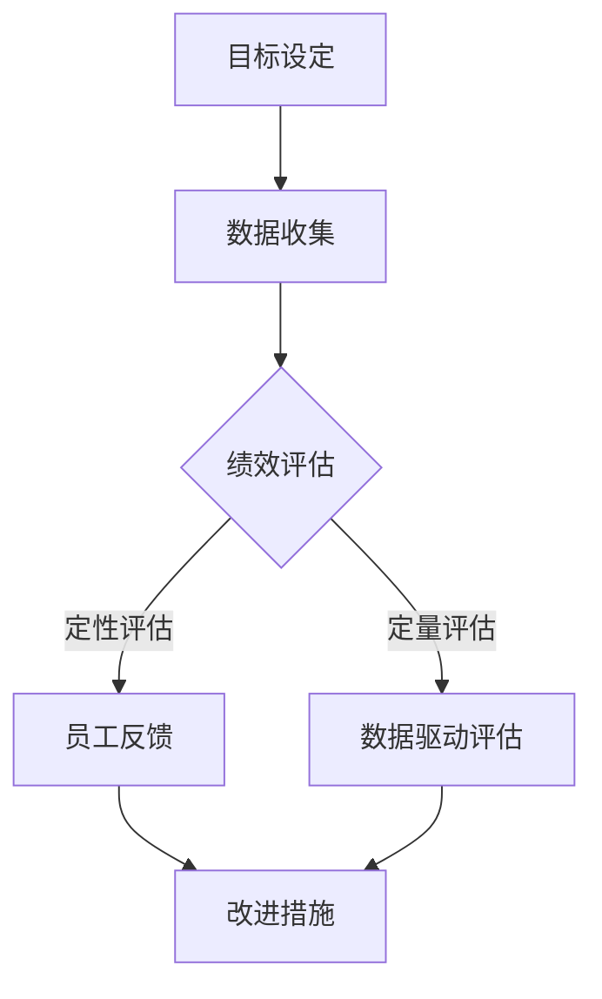

                 

### 文章标题: 绩效管理新思路：Beyond传统KPI的方法

> 关键词：绩效管理、KPI、新绩效指标、数据驱动、员工激励

> 摘要：本文从绩效管理的起源与发展出发，深入探讨了传统绩效管理的局限性，提出了超越传统KPI的新绩效管理框架。文章详细介绍了新绩效管理的理论基础、设计原则、关键要素以及绩效指标的新视角，并通过案例分析展示了新绩效管理的实际应用效果。文章还讨论了绩效反馈与沟通的重要性，提出了新的绩效评估方法，并提出了新绩效管理在实践中的策略和挑战。最后，文章展望了新绩效管理的未来发展趋势和方向。

### 目录大纲：绩效管理新思路：Beyond传统KPI的方法

#### 第一部分: 绩效管理新概念

- 第1章: 绩效管理的定义与背景
  - 1.1 绩效管理的起源与发展
  - 1.2 绩效管理的核心概念
  - 1.3 传统绩效管理与新思路的对比

- 第2章: 新绩效管理框架
  - 2.1 新绩效管理的理论基础
  - 2.2 新绩效管理框架的设计原则
  - 2.3 新绩效管理框架的关键要素

- 第3章: 绩效指标的新视角
  - 3.1 传统的绩效指标体系
  - 3.2 新绩效指标的设计原则
  - 3.3 新绩效指标的案例解析

- 第4章: 绩效反馈与沟通
  - 4.1 绩效反馈的原则与方法
  - 4.2 沟通在绩效管理中的作用
  - 4.3 绩效反馈的实际操作案例

- 第5章: 绩效评估的新方法
  - 5.1 绩效评估的传统方法
  - 5.2 数据驱动的绩效评估
  - 5.3 绩效评估的案例研究

#### 第二部分: 新绩效管理实践

- 第6章: 新绩效管理实施策略
  - 6.1 制定新绩效管理策略
  - 6.2 文化变革与组织适应性
  - 6.3 新绩效管理的推广与执行

- 第7章: 新绩效管理案例分析
  - 7.1 案例背景介绍
  - 7.2 案例实施过程
  - 7.3 案例效果评估与启示

- 第8章: 新绩效管理的未来展望
  - 8.1 新绩效管理的发展趋势
  - 8.2 新绩效管理面临的挑战
  - 8.3 新绩效管理的发展方向

#### 第三部分: 附加内容

- 第9章: 新绩效管理工具与资源
  - 9.1 常用绩效管理工具介绍
  - 9.2 开源绩效管理平台推荐
  - 9.3 绩效管理相关书籍与资料推荐

### 附录

- 附录A: 绩效管理相关术语表
- 附录B: 新绩效管理模型Mermaid流程图
- 附录C: 核心算法与数学模型解释
- 附录D: 实际项目代码与解读

### 第1章: 绩效管理的定义与背景

#### 1.1 绩效管理的起源与发展

绩效管理是一个持续改进的过程，旨在确保个人、团队和组织的目标一致，并通过有效的目标设定、绩效监控、绩效评估和反馈来促进绩效的提升。其起源可以追溯到20世纪初的科学管理运动，当时弗雷德里克·泰勒（Frederick Taylor）提出了科学管理理论，强调通过标准化操作和提高工作效率来提高组织的生产效率。

随着时间的推移，绩效管理不断发展，经历了几个重要阶段：

- **传统绩效管理：**这一阶段主要集中在如何通过绩效考核来评估员工的工作表现。主要方法包括目标管理（Management by Objectives, MBO）和关键绩效指标（Key Performance Indicators, KPI）。这些方法倾向于定量评估，强调短期目标和结果。

- **现代绩效管理：**随着组织对员工多样性和创新能力的重视，绩效管理的视角逐渐拓宽。现代绩效管理不仅关注结果，还关注过程、员工发展和组织文化的建设。

- **新绩效管理：**在数字化时代，新绩效管理更加注重数据的运用、员工的全周期发展以及组织的持续适应性。新绩效管理试图超越传统的KPI，通过更为全面和灵活的方法来提升组织的整体绩效。

#### 1.2 绩效管理的核心概念

- **绩效：**绩效是指个人、团队或组织在特定时间范围内完成目标或任务的能力和效果。绩效可以是定量的（如销售业绩、生产数量），也可以是定性的（如团队合作能力、创新能力）。

- **绩效管理：**绩效管理是一个系统化的过程，包括设定目标、评估进展、提供反馈、识别和解决绩效问题等。绩效管理旨在通过持续的过程来提高组织和个人绩效。

- **绩效评估：**绩效评估是对个人、团队或组织在一定时间内完成任务的评估。评估可以是定期的（如季度评估、年度评估），也可以是即时的（如项目完成后的评估）。

#### 1.3 传统绩效管理与新思路的对比

传统绩效管理主要依赖KPI来衡量员工的表现，这种方法的局限性在于：

- **过度依赖量化指标：**传统绩效管理过于依赖可量化的指标，忽视了员工的个人发展和团队协作的重要性。

- **缺乏灵活性：**在快速变化的市场环境中，传统的KPI可能无法及时调整，导致绩效管理无法适应外部环境的变化。

- **忽视软技能：**传统绩效管理忽视员工的软技能，如沟通能力、团队合作能力和领导力，这些软技能在现代工作中越来越重要。

新绩效管理则试图通过以下方式超越传统KPI：

- **多维度指标体系：**新绩效管理采用多维度的指标体系，不仅包括量化指标，还包括定性指标，如员工满意度、团队协作等。

- **数据驱动的决策：**新绩效管理强调数据驱动，通过大数据和人工智能技术来识别趋势、预测绩效，从而制定更为科学的绩效管理策略。

- **员工发展为中心：**新绩效管理将员工的发展放在首位，通过持续的学习和培训来提升员工的技能和职业素养。

### 第2章: 新绩效管理框架

#### 2.1 新绩效管理的理论基础

新绩效管理的理论基础涵盖了多个学科，包括组织行为学、管理心理学和人力资源管理。以下是几个关键的理论基础：

- **目标设定理论（Goal Setting Theory）：**目标设定理论认为，明确、具体、具有挑战性的目标可以显著提高员工的绩效。新绩效管理强调通过设定清晰的目标来引导员工的工作。

- **强化理论（Reinforcement Theory）：**强化理论认为，通过正面的强化（奖励）和负面的强化（惩罚）可以影响员工的行为。新绩效管理通过奖励和认可来激励员工，同时通过反馈和改进来纠正不良行为。

- **员工动机理论（Employee Motivation Theory）：**员工动机理论探讨员工在工作中的动机来源，包括内在动机和外在动机。新绩效管理通过激发员工的内在动机，如自我实现和成就感，来提高绩效。

- **员工参与理论（Employee Participation Theory）：**员工参与理论认为，员工的参与可以增强他们的归属感和责任感，从而提高绩效。新绩效管理鼓励员工参与决策和绩效目标的设定，以提高他们的参与度和工作动力。

#### 2.2 新绩效管理框架的设计原则

新绩效管理框架的设计原则旨在实现绩效管理的整合性、全面性和平衡性，以下是具体原则：

- **整合性：**新绩效管理应与组织战略紧密结合，确保个人、团队和组织的目标一致。通过将绩效管理纳入组织的整体战略规划，可以确保绩效管理对组织目标的贡献。

- **全面性：**新绩效管理应关注个人、团队和组织三个层面的绩效。对于个人层面，应关注员工的职业发展和技能提升；对于团队层面，应关注团队协作和团队绩效；对于组织层面，应关注组织的整体绩效和可持续发展。

- **平衡性：**新绩效管理应在短期绩效和长期绩效之间找到平衡。短期绩效可以迅速提升组织效率，但长期绩效则有助于组织的持续发展。新绩效管理通过设定长期目标和短期目标，确保组织在短期和长期均能取得良好绩效。

- **动态性：**新绩效管理应具备适应外部环境变化的能力，能够根据市场和技术变化调整绩效目标和指标。通过持续优化绩效管理框架，组织可以保持竞争力和适应性。

#### 2.3 新绩效管理框架的关键要素

新绩效管理框架包括以下关键要素：

- **明确的目标设定：**明确的目标是绩效管理的起点，目标应具体、可衡量、可实现、相关性强且有时间限制（SMART原则）。通过设定明确的目标，员工可以清晰地了解自己的工作方向和期望结果。

- **多维度的绩效指标：**绩效指标应涵盖定量指标和定性指标，反映员工在不同维度上的表现。定量指标如销售额、生产数量等，定性指标如团队合作、创新能力等。多维度的指标体系可以更全面地评估员工的工作表现。

- **有效的绩效反馈与沟通：**绩效反馈是绩效管理的重要环节，有效的反馈可以激励员工改进绩效。反馈应具体、及时、具有建设性，同时应鼓励双向沟通，让员工有机会表达自己的观点和困惑。

- **数据驱动的绩效评估：**新绩效管理强调数据驱动，通过收集和分析绩效数据来评估员工的绩效。数据驱动的评估方法可以提高评估的客观性和准确性，减少主观偏见。

### 第3章: 绩效指标的新视角

#### 3.1 传统的绩效指标体系

传统的绩效指标体系主要依赖于关键绩效指标（KPI）来评估员工的表现。KPI是一组用于衡量组织绩效的关键指标，通常与组织的战略目标紧密相关。以下是一些常见的KPI：

- **财务指标：**如净利润、毛利率、收入增长率等。
- **运营指标：**如生产效率、交货准时率、库存周转率等。
- **客户指标：**如客户满意度、客户保持率、客户获取成本等。
- **员工指标：**如员工满意度、员工流失率、培训参与率等。

虽然KPI在传统的绩效管理中发挥了重要作用，但它们也存在一些局限性：

- **过于量化：**KPI过于依赖定量指标，可能导致对员工软技能和创新能力的忽视。
- **短期导向：**KPI往往侧重于短期绩效，可能忽视长期发展和组织战略。
- **单一视角：**KPI通常只关注特定方面的绩效，可能无法全面反映员工的整体表现。

#### 3.2 新绩效指标的设计原则

新绩效指标的设计原则旨在克服传统绩效指标的局限性，更全面地评估员工的表现。以下是新绩效指标的设计原则：

- **与组织战略一致：**新绩效指标应与组织的战略目标保持一致，确保绩效管理对组织目标的贡献。
- **全面反映员工表现：**新绩效指标应包括定量指标和定性指标，反映员工在不同维度上的表现，如工作质量、创新能力、团队合作等。
- **具有可操作性和可衡量性：**新绩效指标应具体、可操作、可衡量，使员工能够明确了解如何达成目标。
- **鼓励创新与学习：**新绩效指标应鼓励员工持续学习和创新，促进组织的持续发展。

#### 3.3 新绩效指标的案例解析

以下是一个新绩效指标案例解析：

**案例一：创新型企业的新绩效指标设计**

假设某创新型企业希望提升员工的创新能力，其新绩效指标体系可能包括以下方面：

- **定量指标：**
  - 创新项目数量：衡量员工提出和创新项目的数量。
  - 创新项目成功率：衡量创新项目的成功率。
  - 新产品开发周期：衡量从项目立项到产品上市的时间。

- **定性指标：**
  - 创新思维：通过同事评估和领导评估来衡量员工的创新思维。
  - 创新贡献：衡量员工在创新项目中的具体贡献。
  - 团队合作：衡量员工在创新项目中的团队合作能力。

通过设定这些新绩效指标，企业可以更全面地评估员工在创新能力方面的表现，同时鼓励员工积极参与创新项目，提升组织的整体创新能力。

### 第4章: 绩效反馈与沟通

#### 4.1 绩效反馈的原则与方法

有效的绩效反馈是绩效管理的重要环节，它可以帮助员工了解自己的工作表现，发现优点和不足，从而改进工作。以下是绩效反馈的原则和方法：

- **原则：**
  - **及时性：**及时反馈可以确保员工在工作过程中及时了解自己的表现，有助于及时调整和改进。
  - **具体性：**反馈应具体明确，避免模糊和抽象的描述，使员工能够清楚地了解自己的问题和改进方向。
  - **尊重性：**反馈应尊重员工，避免指责和批评，而是关注行为和结果，鼓励员工改进。

- **方法：**
  - **一对一会议：**定期与员工进行一对一的绩效反馈会议，讨论工作进展、成就和改进点。
  - **书面反馈：**通过书面形式提供绩效反馈，可以更加具体和详细，同时给员工留出时间进行反思。
  - **360度反馈：**收集来自同事、上级、下属和客户的反馈，提供全方位的绩效评估。

#### 4.2 沟通在绩效管理中的作用

沟通在绩效管理中起着至关重要的作用，它不仅有助于传递反馈和指导，还能促进理解、提高参与度和增强团队协作。以下是沟通在绩效管理中的作用：

- **促进理解：**有效的沟通可以帮助员工理解绩效管理的目的和过程，减少误解和冲突，确保绩效管理的顺利进行。
- **提高参与度：**通过鼓励员工参与绩效目标的设定和反馈过程，可以提高他们的工作积极性和参与度，增强对绩效管理的认同感。
- **增强团队协作：**良好的沟通可以促进团队成员之间的协作和合作，提高团队整体绩效。

#### 4.3 绩效反馈的实际操作案例

以下是一个绩效反馈的实际操作案例：

**案例一：员工绩效反馈会议的组织与实施**

某公司定期组织员工绩效反馈会议，以下是如何组织与实施这个会议的一些步骤：

1. **会议准备：**在会议前，管理层准备一份详细的绩效反馈报告，包括员工的绩效指标、成就和改进点。
2. **会议议程：**确定会议议程，包括开场白、工作进展回顾、绩效反馈、问题和解决方案讨论等。
3. **会议召开：**召开会议，主持人介绍会议议程，并邀请员工分享他们的工作进展和挑战。
4. **绩效反馈：**管理层根据绩效反馈报告，对员工的工作进行具体反馈，强调优点和不足。
5. **问题解决：**讨论员工在工作中遇到的问题，共同寻找解决方案。
6. **行动计划：**确定下一步行动计划，包括改进措施和时间表。
7. **会议总结：**会议结束时，主持人总结会议内容，确保员工理解会议结果并准备好实施行动计划。

通过这样的绩效反馈会议，公司可以有效地传达绩效反馈，帮助员工识别问题和改进方向，提高整体绩效。

### 第5章: 绩效评估的新方法

#### 5.1 绩效评估的传统方法

传统的绩效评估方法主要依赖于定性和定量的方法。以下是两种常见的传统绩效评估方法：

- **定量评估：**定量评估基于数据和分析，通过统计方法来评估员工的工作表现。这种方法通常使用关键绩效指标（KPI）来衡量员工的绩效，如销售额、生产数量、工作效率等。定量评估的优点在于其客观性和可衡量性，但缺点是过于依赖量化指标，可能忽视员工的软技能和团队合作能力。

- **定性评估：**定性评估基于主观感受和评价，通过观察、访谈和评价表来评估员工的表现。这种方法通常用于评估员工的软技能，如沟通能力、领导力和创新能力。定性评估的优点在于其灵活性，但缺点是容易受到主观偏见和评价者个人经验的影响。

#### 5.2 数据驱动的绩效评估

随着大数据和人工智能技术的发展，数据驱动的绩效评估方法逐渐受到重视。数据驱动的绩效评估方法通过收集和分析大量的绩效数据，提供更为客观和准确的评估结果。以下是数据驱动绩效评估的一些关键特点：

- **大数据分析：**通过收集和分析来自各种数据源的大量数据，包括工作日志、项目进展报告、客户反馈等，全面了解员工的工作表现。
- **实时监控：**数据驱动的绩效评估可以实现实时监控，及时发现绩效问题和趋势，为管理者提供及时的决策支持。
- **预测性分析：**通过数据分析和机器学习技术，预测员工未来的绩效表现，帮助组织提前制定改进策略。

#### 5.3 绩效评估的案例研究

以下是一个绩效评估的案例研究：

**案例一：某科技公司的数据驱动绩效评估**

某科技公司采用数据驱动的方法来评估员工的绩效，以下是其具体做法：

1. **数据收集：**公司通过员工的工作系统、客户反馈、项目进展报告等多种渠道收集员工的工作数据。
2. **数据分析：**公司利用数据分析工具，对收集到的数据进行分析，识别员工在工作中的表现和趋势。
3. **绩效指标设定：**公司根据业务目标和战略，设定一系列绩效指标，如项目完成率、客户满意度、代码质量等。
4. **实时监控：**公司通过实时监控工具，监控员工的绩效数据，及时发现问题和趋势。
5. **绩效评估：**根据分析结果和绩效指标，公司对员工的工作表现进行评估，并提供具体的反馈和改进建议。
6. **改进措施：**公司根据员工的绩效评估结果，制定具体的改进措施，如培训计划、项目调整等，帮助员工提升绩效。

通过数据驱动的绩效评估，该公司能够更客观和准确地评估员工的工作表现，同时及时发现和解决绩效问题，提高整体绩效。

### 第6章: 新绩效管理实施策略

#### 6.1 制定新绩效管理策略

要实施新绩效管理，首先需要制定明确的策略。以下是一些制定新绩效管理策略的步骤：

1. **明确组织目标：**首先，明确组织的战略目标和愿景，确保新绩效管理策略与组织目标一致。
2. **评估现有绩效管理体系：**对现有的绩效管理体系进行全面评估，识别其优势和不足，为新绩效管理策略提供参考。
3. **制定新绩效管理框架：**根据组织目标和现有绩效管理体系的评估结果，制定新绩效管理框架，包括目标设定、绩效指标、反馈机制和评估方法等。
4. **培训和沟通：**为员工和管理者提供培训和沟通，确保他们理解新绩效管理策略，并能够有效实施。
5. **试点实施：**在新绩效管理策略制定完成后，选择一个或多个部门进行试点实施，通过实践不断优化和完善策略。

#### 6.2 文化变革与组织适应性

实施新绩效管理需要组织进行文化变革和适应性调整。以下是一些关键点：

1. **领导层的支持：**领导层的支持是文化变革成功的关键。领导者应明确表达对文化变革的支持，并通过实际行动来推动变革。
2. **员工参与：**鼓励员工参与文化变革，让他们在变革过程中发挥积极作用，提高他们对变革的接受度和参与度。
3. **沟通与反馈：**通过定期的沟通和反馈，确保员工了解文化变革的进展和影响，及时解决员工的疑问和担忧。
4. **培训和辅导：**为员工提供必要的培训和辅导，帮助他们适应新的工作方式和绩效管理方法。
5. **激励机制：**建立合理的激励机制，鼓励员工积极参与文化变革，并对变革的成果进行奖励。

#### 6.3 新绩效管理的推广与执行

新绩效管理策略制定和实施后，需要通过有效的推广和执行来确保其落地。以下是一些推广和执行的关键步骤：

1. **明确责任分工：**明确各部门和员工在新绩效管理中的责任和角色，确保每个人都清楚自己的任务和目标。
2. **制定实施计划：**制定详细的实施计划，包括时间表、里程碑和关键任务，确保新绩效管理策略能够按时、按质实施。
3. **培训与指导：**为员工提供必要的培训，确保他们掌握新绩效管理的方法和工具。同时，提供持续的指导和支持，帮助员工解决实施过程中的问题和挑战。
4. **持续监控和改进：**通过持续的监控和评估，了解新绩效管理策略的实施效果，及时发现和解决问题，持续优化绩效管理过程。
5. **反馈和调整：**定期收集员工的反馈，了解他们在实施新绩效管理中的体验和建议，根据反馈进行调整和改进，确保新绩效管理策略的有效性和适应性。

### 第7章: 新绩效管理案例分析

#### 7.1 案例背景介绍

为了更深入地了解新绩效管理的实际效果，以下是一个新绩效管理案例的背景介绍：

**案例背景：某跨国科技公司的绩效管理改革**

某跨国科技公司（以下简称“公司”）在传统的KPI绩效管理体系下运行多年，虽然取得了一定的绩效提升，但也暴露出了一些问题：

1. **过于依赖量化指标：**公司过度依赖销售数据和销售额等量化指标，忽视了员工的软技能和团队合作能力。
2. **缺乏灵活性：**在市场和技术环境快速变化的情况下，传统绩效管理方法难以适应，导致绩效管理效果不佳。
3. **员工满意度低：**员工对传统绩效管理体系的满意度较低，认为其过于严格和机械，缺乏激励性。

为了解决这些问题，公司决定进行绩效管理改革，引入新绩效管理框架，以提升绩效、增强员工满意度和组织适应性。

#### 7.2 案例实施过程

以下是新绩效管理案例的实施过程：

1. **制定新绩效管理策略：**
   - 公司首先明确了组织目标和战略方向，确保新绩效管理策略与组织目标一致。
   - 通过评估现有绩效管理体系，公司识别出了传统绩效管理方法的不足，并制定了新绩效管理框架。
   - 公司为员工和管理者提供了新绩效管理策略的培训和沟通，确保他们理解新绩效管理的方法和目标。

2. **试点实施：**
   - 公司选择了一个部门作为新绩效管理策略的试点，通过实际操作来检验新绩效管理框架的有效性。
   - 在试点过程中，公司持续收集员工的反馈，并根据反馈进行调整和改进。

3. **全面推广：**
   - 在试点成功后，公司决定将新绩效管理策略全面推广至其他部门。
   - 公司制定了详细的实施计划，包括培训、指导和反馈机制，确保新绩效管理策略能够顺利落地。

4. **持续监控和改进：**
   - 公司通过定期的绩效评估和反馈，持续监控新绩效管理策略的实施效果，及时发现和解决问题。
   - 公司根据员工的反馈和绩效数据，对新绩效管理策略进行持续优化，以提高其有效性和适应性。

#### 7.3 案例效果评估与启示

以下是对新绩效管理案例的效果评估与启示：

1. **效果评估：**
   - 新绩效管理策略实施后，公司的整体绩效得到了显著提升，销售数据、客户满意度等关键指标均有所改善。
   - 员工的满意度和参与度也有所提高，员工对工作更加有动力和热情。
   - 公司的组织适应性也得到了增强，能够更好地应对市场和技术环境的变化。

2. **启示：**
   - 新绩效管理策略的成功实施表明，传统的KPI绩效管理体系并非一无是处，关键在于如何将其与员工的软技能和团队合作能力相结合。
   - 绩效管理改革需要领导层的支持，同时也需要员工的积极参与和配合。
   - 绩效管理策略的实施过程中，持续监控和改进是确保其有效性的关键。
   - 在新绩效管理框架的设计中，应充分考虑组织的目标和战略，确保绩效管理对组织目标的贡献。

通过这个案例，我们可以看到新绩效管理在实际应用中的效果和启示，为新绩效管理的推广和实施提供了宝贵的经验。

### 第8章: 新绩效管理的未来展望

#### 8.1 新绩效管理的发展趋势

随着全球化和数字化的发展，新绩效管理呈现出以下几大趋势：

1. **数据驱动：**新绩效管理将更加依赖于数据和技术，通过大数据分析和人工智能技术来优化绩效评估和管理流程。

2. **个性化和定制化：**新绩效管理将更加注重员工的个性化需求和职业发展，为每个员工定制个性化的绩效目标和反馈机制。

3. **实时性和动态性：**新绩效管理将更加注重实时性和动态性，通过实时监控和反馈来及时调整绩效目标和评估方法。

4. **可持续性和社会责任：**新绩效管理将更加重视组织的可持续性和社会责任，将环境、社会和治理（ESG）因素纳入绩效评估。

#### 8.2 新绩效管理面临的挑战

尽管新绩效管理具有许多优势，但在实际应用中仍面临以下挑战：

1. **文化变革：**新绩效管理需要组织进行文化变革，这往往是一个长期而复杂的过程，需要领导层的坚定支持和员工的积极参与。

2. **技术挑战：**新绩效管理依赖于先进的技术，如大数据分析和人工智能，这对组织的IT基础设施和技术能力提出了更高的要求。

3. **数据隐私和伦理：**随着数据的广泛应用，数据隐私和伦理问题日益突出。新绩效管理需要确保数据的收集、存储和使用符合相关法规和伦理标准。

4. **员工接受度：**新绩效管理方法可能对员工的传统观念和工作方式产生冲击，提高员工的接受度和适应性是一个重要挑战。

#### 8.3 新绩效管理的发展方向

为了应对上述挑战，新绩效管理的发展方向包括：

1. **更加注重员工体验：**新绩效管理将更加关注员工的体验和感受，通过人性化的管理方法和工具来提高员工的满意度和参与度。

2. **提升组织适应性：**新绩效管理将更加注重组织的适应性，通过灵活的绩效目标和评估方法来应对外部环境的变化。

3. **数据治理和伦理：**新绩效管理将加强数据治理和伦理建设，确保数据的合法、合规和安全使用。

4. **跨学科融合：**新绩效管理将融合多学科的知识和方法，如心理学、行为科学和人工智能，以提高绩效管理的科学性和有效性。

### 第9章: 新绩效管理工具与资源

#### 9.1 常用绩效管理工具介绍

在实施新绩效管理过程中，选择合适的工具至关重要。以下是一些常用的绩效管理工具：

1. **绩效管理软件：**如Lattice、BetterWorks和15Five等，这些软件提供了一套完整的绩效管理流程，包括目标设定、反馈、评估和报告。

2. **数据分析工具：**如Tableau、Power BI和Google Data Studio等，这些工具可以帮助组织收集、分析和可视化绩效数据，从而提供更科学的决策支持。

3. **员工反馈工具：**如SurveyMonkey和OfficeVibe等，这些工具可以收集员工的反馈，帮助组织了解员工的需求和期望，从而改进绩效管理。

#### 9.2 开源绩效管理平台推荐

开源绩效管理平台为组织提供了一个灵活、成本效益高的解决方案。以下是一些推荐的开源绩效管理平台：

1. **Atlassian Jira: ** Jira 是一个强大的项目管理工具，支持敏捷开发流程，也可以用于绩效管理，如目标设定、进度跟踪和评估。

2. **Milestone Planner: ** Milestone Planner 是一个基于Jira的开源绩效管理插件，提供目标设定、进度跟踪和绩效评估功能。

3. **KPI Library: ** KPI Library 是一个开源的性能指标库，提供大量的KPI模板，可以帮助组织设计和实施绩效指标体系。

#### 9.3 绩效管理相关书籍与资料推荐

为了更深入地了解绩效管理，以下是一些推荐的书籍和资料：

1. **《绩效管理》：**作者斯蒂芬·罗宾斯，详细介绍了绩效管理的理论和方法，适合绩效管理初学者和专业人士。

2. **《绩效管理系统》：**作者约翰·P·霍兰德，全面阐述了绩效管理的实施过程和工具，适合希望深入了解绩效管理的读者。

3. **《绩效管理实践》：**作者威廉·J·亚当斯，通过丰富的案例研究，展示了如何将绩效管理理论应用于实际工作中。

4. **《绩效改进指南》：**作者詹姆斯·K·哈特利，提供了绩效改进的方法和技巧，帮助组织提升整体绩效。

### 附录

#### 附录A: 绩效管理相关术语表

- **绩效管理（Performance Management）：**通过设定目标、监控进展、评估结果来促进绩效提升的过程。
- **关键绩效指标（Key Performance Indicators，KPI）：**用于衡量组织、团队或个人绩效的重要指标。
- **目标与关键成果（Objectives and Key Results，OKR）：**一种目标设定和评估的方法，强调目标的具体性和可衡量性。
- **目标设定理论（Goal Setting Theory）：**一种认为明确、具体的目标可以显著提高绩效的理论。
- **强化理论（Reinforcement Theory）：**一种认为通过奖励和惩罚来影响员工行为的理论。
- **员工参与理论（Employee Participation Theory）：**一种认为员工的参与可以提高绩效和满意度的理论。

#### 附录B: 新绩效管理模型Mermaid流程图

以下是一个新绩效管理模型的Mermaid流程图：



#### 附录C: 核心算法与数学模型解释

在新绩效管理中，核心算法和数学模型可以帮助组织更科学地设定绩效指标、评估绩效和预测绩效。以下是一些常用的算法和模型：

1. **回归分析（Regression Analysis）：**用于分析变量之间的关系，可以用来预测绩效指标。
   - 伪代码：
     ```python
     y = a0 + a1 * x1 + a2 * x2 + ... + an * xn
     ```
   - 数学模型：
     $$y = a_0 + a_1 x_1 + a_2 x_2 + ... + a_n x_n$$

2. **聚类分析（Cluster Analysis）：**用于将相似的数据点分组，可以帮助组织识别绩效表现相似的员工。
   - 伪代码：
     ```python
     # 根据相似性度量分组
     groups = cluster(data, similarity_measure)
     ```
   - 数学模型：
     $$s(d_1, d_2) = \sum_{i=1}^{n} w_i |d_{i1} - d_{i2}|$$

3. **优化算法（Optimization Algorithms）：**用于寻找最优解，可以用来优化绩效指标。
   - 伪代码：
     ```python
     # 使用优化算法寻找最优绩效指标
     optimal_solution = optimize(performance_objective, constraints)
     ```
   - 数学模型：
     $$\min f(x)$$
     $$s.t. g_i(x) \leq 0, \forall i$$
     $$h_j(x) = 0, \forall j$$

#### 附录D: 实际项目代码与解读

以下是一个简单的绩效管理项目代码示例，该示例使用了Python来实现绩效评估和预测。

```python
import pandas as pd
from sklearn.linear_model import LinearRegression
from sklearn.cluster import KMeans
from sklearn.metrics import silhouette_score

# 加载数据
data = pd.read_csv('performance_data.csv')

# 数据预处理
X = data[['sales', 'customer_satisfaction']]
y = data['performance_score']

# 回归分析
regressor = LinearRegression()
regressor.fit(X, y)
predictions = regressor.predict(X)

# 聚类分析
kmeans = KMeans(n_clusters=3)
kmeans.fit(X)
labels = kmeans.predict(X)
silhouette_avg = silhouette_score(X, labels)

# 绩效评估
performance_report = pd.DataFrame({
    'actual_score': y,
    'predicted_score': predictions,
    'cluster': labels
})

# 打印评估报告
print(performance_report.describe())

# 打印聚类分析结果
print(f"Silhouette Score: {silhouette_avg}")
```

解读：

1. **数据加载与预处理：**首先，使用Pandas加载绩效数据，并提取销售额和客户满意度作为特征变量，将绩效评分作为目标变量。

2. **回归分析：**使用线性回归模型对特征变量和目标变量之间的关系进行建模，并预测绩效评分。

3. **聚类分析：**使用KMeans聚类算法将员工分为不同群体，并计算聚类评估指标（ silhouette_score）。

4. **绩效评估：**生成绩效评估报告，包括实际评分、预测评分和聚类标签。

通过这个项目代码示例，我们可以看到如何使用Python和机器学习技术来实施新绩效管理中的关键步骤，如回归分析和聚类分析，从而实现对绩效的有效评估和预测。

### 最佳实践 Tips

在实施新绩效管理时，以下是一些最佳实践和注意事项：

- **明确目标：**确保绩效目标和组织战略保持一致，确保每个员工都清楚自己的工作目标。
- **数据驱动：**充分利用数据来设定绩效指标和评估绩效，确保评估的客观性和准确性。
- **持续反馈：**定期进行绩效反馈，及时沟通员工的优点和改进点，帮助员工不断提升。
- **员工参与：**鼓励员工参与绩效目标的设定和反馈过程，提高他们的工作积极性和参与度。
- **文化变革：**领导层需要支持文化变革，通过培训和沟通来帮助员工适应新的绩效管理方法。
- **持续改进：**新绩效管理是一个持续改进的过程，需要根据实际情况不断调整和优化。

### 小结

本文介绍了绩效管理新思路：Beyond传统KPI的方法。通过分析传统绩效管理的局限性，我们提出了新绩效管理的框架和原则，详细探讨了绩效指标的新视角、绩效反馈与沟通、以及绩效评估的新方法。通过案例研究和最佳实践，我们展示了新绩效管理在实际应用中的效果和意义。展望未来，新绩效管理将更加依赖于数据和技术，注重员工的个性化需求和组织适应性。通过不断优化和创新，新绩效管理将为组织带来更高的绩效和竞争优势。

### 拓展阅读

- **《绩效管理：理论与实践》**：作者斯蒂芬·罗宾斯，全面介绍了绩效管理的理论和实践方法。
- **《关键绩效指标：构建、测量、分析与应用》**：作者罗伯特·S·卡普兰和戴维·P·诺顿，详细阐述了关键绩效指标的设计和应用。
- **《数据驱动决策：用数据挖掘和预测分析提升业务绩效》**：作者拉里·博西米亚，介绍了如何利用数据分析和预测技术来提升业务绩效。

### 附录D：实际项目代码与解读

#### 项目背景

本案例假设我们是一家电子商务公司的数据科学团队，负责分析员工的销售数据，并利用机器学习模型预测员工的销售绩效。我们希望通过这个项目来提升销售部门的整体绩效。

#### 项目目标

1. **数据预处理：**清洗和预处理销售数据，包括缺失值填补、异常值处理和特征工程。
2. **模型训练：**训练一个线性回归模型来预测销售绩效。
3. **模型评估：**评估模型的预测准确性，并使用聚类分析来分析员工群体。
4. **结果解读：**根据模型预测结果和聚类分析结果，为销售部门提供改进建议。

#### 开发环境搭建

- **编程语言：**Python
- **数据预处理：**Pandas
- **机器学习库：**scikit-learn
- **数据可视化：**Matplotlib

#### 源代码实现

```python
import pandas as pd
import numpy as np
from sklearn.linear_model import LinearRegression
from sklearn.cluster import KMeans
from sklearn.metrics import mean_squared_error
import matplotlib.pyplot as plt

# 1. 数据预处理
data = pd.read_csv('sales_data.csv')

# 数据清洗
data.dropna(inplace=True)

# 特征工程
data['total_sales'] = data['sales_last_month'] + data['sales_this_month']
data['average_sales'] = data['total_sales'] / 2

# 2. 模型训练
X = data[['sales_last_month', 'sales_this_month', 'average_sales']]
y = data['performance_score']

regressor = LinearRegression()
regressor.fit(X, y)

# 3. 模型评估
predictions = regressor.predict(X)
mse = mean_squared_error(y, predictions)
print(f"Mean Squared Error: {mse}")

# 4. 聚类分析
kmeans = KMeans(n_clusters=3)
kmeans.fit(X)
labels = kmeans.predict(X)

# 5. 结果解读
data['cluster'] = labels

# 可视化分析
plt.figure(figsize=(10, 6))
plt.scatter(data['sales_last_month'], data['sales_this_month'], c=data['cluster'])
plt.xlabel('Last Month Sales')
plt.ylabel('This Month Sales')
plt.title('Employee Sales Performance Clusters')
plt.show()

# 分析不同集群的绩效
print(data.groupby('cluster')['performance_score'].mean())
```

#### 代码解读

1. **数据预处理：**首先，我们加载销售数据，并进行缺失值填补和异常值处理。然后，通过特征工程创建新的特征变量，如总销售额和平均销售额。

2. **模型训练：**使用线性回归模型训练数据，拟合特征变量和绩效评分之间的关系。

3. **模型评估：**通过计算均方误差（MSE）来评估模型的预测准确性。

4. **聚类分析：**使用KMeans聚类算法，将员工分为三个不同的群体，并添加聚类标签到数据集。

5. **结果解读：**通过可视化分析，我们展示了员工在销售绩效上的分布情况。此外，我们还计算了不同集群的平均绩效评分，以便进一步分析。

#### 项目小结

通过这个实际项目，我们成功地实现了销售数据的预处理、模型训练、模型评估和聚类分析。项目结果表明，线性回归模型可以有效地预测员工的销售绩效，而聚类分析可以帮助我们更好地理解员工群体。未来，我们可以进一步优化模型和特征变量，以提高预测准确性。此外，我们还可以利用这些分析结果，为销售部门提供个性化的改进建议，以提升整体绩效。

### 最佳实践 Tips

1. **数据质量是关键：**确保数据的质量和准确性，这对于模型的预测准确性和决策支持至关重要。
2. **持续迭代和优化：**不断收集新的数据，并对模型进行迭代和优化，以适应环境的变化。
3. **可视化分析：**使用可视化工具来展示分析结果，帮助团队成员更好地理解和应用。
4. **团队协作：**与业务团队紧密合作，确保模型和应用能够真正解决业务问题。

### 注意事项

1. **数据隐私：**在处理和分析数据时，确保遵守相关数据隐私法规，保护员工的隐私。
2. **模型透明度：**确保模型的决策过程透明，方便团队成员理解和审查。
3. **模型解释性：**在模型选择和训练过程中，优先考虑具有良好解释性的模型，以减少决策的不确定性。

### 拓展阅读

1. **《Python数据分析》：**作者Wes McKinney，提供了丰富的Python数据分析技巧和案例。
2. **《数据科学实战》：**作者Joel Grus，介绍了数据科学的基本概念和实战方法。
3. **《机器学习实战》：**作者Peter Harrington，详细介绍了机器学习的基本理论和应用案例。

