                 

# 文章标题

《联邦学习在AIGC隐私保护中的新策略》

> 关键词：联邦学习，AIGC，隐私保护，数据安全，分布式计算，加密算法

> 摘要：本文详细介绍了联邦学习在AIGC（AI Generated Content，AI生成内容）场景中的隐私保护新策略。通过剖析联邦学习的基本原理和技术基础，以及其在生成式AI、图像处理、自然语言处理等领域的应用，本文探讨了联邦学习在确保数据隐私与推动人工智能发展中的重要作用。同时，本文还讨论了联邦学习在隐私保护方面的挑战和解决方案，为读者提供了深入了解和实践联邦学习技术的指导。

## 目录

### 第一部分：联邦学习基础

1. **第1章：联邦学习的概述与原理**
   - 1.1 联邦学习的定义与背景
   - 1.2 联邦学习的核心概念
   - 1.3 联邦学习的发展历程
   - 1.4 联邦学习与中心化学习的比较
   - 1.5 联邦学习的优势与应用场景

2. **第2章：联邦学习技术基础**
   - 2.1 数据隐私保护机制
   - 2.2 模型聚合算法
   - 2.3 模型更新与同步机制
   - 2.4 安全性分析与保障
   - 2.5 联邦学习中的通信优化

### 第二部分：联邦学习在AIGC中的应用

3. **第3章：联邦学习在生成式AI中的应用**
   - 3.1 联邦生成对抗网络（FGAN）
   - 3.2 联邦变分自编码器（FVAE）
   - 3.3 联邦生成文本模型
   - 3.4 联邦图像生成模型
   - 3.5 联邦音频生成模型

4. **第4章：联邦学习在图像处理与计算机视觉中的应用**
   - 4.1 联邦图像分类与识别
   - 4.2 联邦目标检测与追踪
   - 4.3 联邦图像生成与增强
   - 4.4 联邦图像分割与语义标注
   - 4.5 联邦图像超分辨率与去噪

5. **第5章：联邦学习在自然语言处理中的应用**
   - 5.1 联邦文本分类与情感分析
   - 5.2 联邦语言模型与生成
   - 5.3 联邦对话系统与问答
   - 5.4 联邦机器翻译与文本摘要
   - 5.5 联邦文本生成与内容创作

### 第三部分：联邦学习在隐私保护中的应用

6. **第6章：联邦学习与数据隐私保护**
   - 6.1 隐私保护的法律法规与道德规范
   - 6.2 数据匿名化与混淆技术
   - 6.3 加密技术在联邦学习中的应用
   - 6.4 同态加密与安全多方计算
   - 6.5 联邦学习中的隐私保护挑战与对策

7. **第7章：联邦学习在隐私保护中的应用案例**
   - 7.1 零知识证明在联邦学习中的应用
   - 7.2 区块链与联邦学习的结合
   - 7.3 联邦学习在医疗健康数据中的应用
   - 7.4 联邦学习在金融行业中的应用
   - 7.5 联邦学习在智能交通与城市管理中的应用

### 附录

8. **附录A：联邦学习相关工具与框架**
   - 8.1 TensorFlow Federated
   - 8.2 PySyft
   - 8.3 FedAvg算法
   - 8.4 其他联邦学习框架简介
   - 8.5 联邦学习开发资源与资料推荐

---

### 第一部分：联邦学习基础

## 第1章：联邦学习的概述与原理

### 1.1 联邦学习的定义与背景

联邦学习（Federated Learning，FL）是一种分布式机器学习技术，旨在通过多个参与者（通常是边缘设备或数据所有者）的协同工作，共同训练出一个全局模型，而无需直接共享他们各自的数据。这一技术起源于2020年谷歌提出的研究项目，旨在解决移动设备等边缘设备的数据隐私和安全问题。

联邦学习的基本思想是将数据的分布性转化为计算的优势，通过模型的分布式训练，实现在数据不集中存储的情况下，提升模型的性能和可解释性。联邦学习的背景源于以下几方面的需求：

1. **数据隐私与安全**：随着数据隐私法规的加强，越来越多的企业和服务提供商需要处理用户敏感数据，如医疗健康信息、金融数据、个人隐私等。联邦学习提供了一种在不泄露数据的情况下，进行机器学习训练的解决方案。
2. **数据分散性**：现实中的数据往往分布在不同的机构、设备或地域，传统的中心化学习难以应对这种分布式数据场景。
3. **计算资源限制**：移动设备、物联网设备等边缘设备的计算和存储资源有限，不适合进行复杂的数据处理任务。
4. **网络不稳定**：在某些应用场景中，网络连接不稳定或带宽有限，中心化学习难以保证数据传输的实时性和可靠性。

### 1.2 联邦学习的核心概念

联邦学习涉及几个核心概念，包括联邦模型、联邦客户端、联邦服务器和全局模型。

1. **联邦模型**：全局模型在每个联邦客户端上运行，并在联邦客户端之间共享和更新。联邦模型通常是一个神经网络，用于处理输入数据并生成预测。
2. **联邦客户端**：联邦客户端是参与联邦学习过程的边缘设备或数据所有者，它们在本地训练模型，并将模型的更新发送给联邦服务器。
3. **联邦服务器**：联邦服务器负责协调联邦客户端之间的模型更新，聚合全局模型，并分发更新后的模型给联邦客户端。
4. **全局模型**：全局模型是联邦学习的目标模型，通过聚合来自所有联邦客户端的模型更新逐步优化。

### 1.3 联邦学习的发展历程

联邦学习的发展历程可以追溯到分布式计算和隐私保护技术的结合。以下是联邦学习的一些关键里程碑：

1. **2017年**：谷歌在分布式机器学习系统TF Federated中首次提出了联邦学习的概念。
2. **2019年**：谷歌发布了用于联邦学习的TensorFlow Federated（TFF）开源框架，推动了联邦学习的实践和应用。
3. **2020年**：联邦学习在医疗健康、金融、零售等行业得到广泛应用，成为分布式机器学习的重要技术。
4. **2021年**：微软、亚马逊、IBM等科技巨头纷纷推出各自的联邦学习框架，推动联邦学习的标准化和商业化。
5. **2022年至今**：随着生成式AI（AIGC）的发展，联邦学习在图像生成、文本生成、音频生成等领域的应用不断拓展。

### 1.4 联邦学习与中心化学习的比较

联邦学习和中心化学习在多个方面存在显著差异：

1. **数据隐私**：中心化学习需要将所有数据集中到一个中心位置进行训练，容易导致数据泄露风险。而联邦学习通过数据分布性，实现了在本地训练模型，保护了数据的隐私。
2. **数据安全**：联邦学习避免了数据在网络中的传输，降低了数据被攻击的风险。而中心化学习容易成为网络攻击的目标。
3. **计算资源**：中心化学习需要大量计算资源来处理和传输数据，而联邦学习通过分布式计算，降低了单点故障的风险，提高了系统的可靠性。
4. **网络依赖**：中心化学习对网络连接有较高依赖，而联邦学习通过本地训练和模型更新，降低了网络不稳定对系统的影响。

### 1.5 联邦学习的优势与应用场景

联邦学习具有以下优势：

1. **隐私保护**：联邦学习通过本地训练和模型更新，无需共享原始数据，保护了用户隐私。
2. **数据安全**：联邦学习降低了数据泄露和攻击的风险，提高了系统的安全性。
3. **分布式计算**：联邦学习通过分布式计算，提高了计算效率和系统的可靠性。
4. **灵活性**：联邦学习适用于多种应用场景，包括医疗健康、金融、零售、自动驾驶等。

### 1.5.1 应用场景

1. **医疗健康**：联邦学习可以用于处理患者隐私保护的需求，例如疾病预测、药物研发等。
2. **金融**：联邦学习可以用于风险评估、欺诈检测等，同时保护用户隐私。
3. **零售**：联邦学习可以用于个性化推荐、需求预测等，提高用户体验。
4. **自动驾驶**：联邦学习可以用于车辆间的协同控制，提高行车安全。
5. **智能城市**：联邦学习可以用于交通管理、环境监测等，提高城市管理效率。

### 总结

联邦学习作为一种分布式机器学习技术，通过保护数据隐私、提高数据安全、实现分布式计算，为人工智能的发展提供了新的可能性。在接下来的章节中，我们将深入探讨联邦学习的技术基础、应用场景以及隐私保护策略。

---

## 第2章：联邦学习技术基础

### 2.1 数据隐私保护机制

联邦学习的数据隐私保护机制是其核心优势之一。在联邦学习中，数据不直接在参与者之间共享，而是通过加密和去识别化等技术手段，确保数据在传输和处理过程中不会被泄露。

#### 加密技术

加密技术是联邦学习中常用的隐私保护机制。常见的加密技术包括：

1. **同态加密**：同态加密允许在加密数据上直接进行计算，而不需要解密。这使得联邦学习中的模型更新和聚合过程可以在加密状态下进行，从而保护了数据的隐私。
   
   **伪代码**：
   ```python
   def homomorphic_encrypt(data):
       encrypted_data = encrypt(data)
       return encrypted_data
   
   def homomorphic_add(encrypted_data1, encrypted_data2):
       encrypted_result = add(encrypted_data1, encrypted_data2)
       return encrypted_result
   
   def homomorphic_decrypt(encrypted_result):
       decrypted_result = decrypt(encrypted_result)
       return decrypted_result
   ```

2. **安全多方计算**：安全多方计算允许多个参与方共同计算结果，而无需透露各自的输入数据。这通常用于联邦学习中的模型聚合和更新过程。

   **伪代码**：
   ```python
   def secure_mpc_add(participant1_data, participant2_data):
       encrypted_data1 = encrypt(participant1_data)
       encrypted_data2 = encrypt(participant2_data)
       encrypted_result = add(encrypted_data1, encrypted_data2)
       decrypted_result = decrypt(encrypted_result)
       return decrypted_result
   ```

#### 去识别化技术

去识别化技术通过去除或模糊化个人身份信息，降低数据的隐私泄露风险。常见的去识别化技术包括：

1. **匿名化**：匿名化通过删除或混淆个人身份信息，使数据无法被追踪到特定个人。

   **伪代码**：
   ```python
   def anonymize_data(data):
       anonymized_data = remove_personal_identifiers(data)
       return anonymized_data
   ```

2. **混淆**：混淆通过在数据中引入噪声，使数据无法被直接解读，同时保持数据的统计特性。

   **伪代码**：
   ```python
   def confuse_data(data, noise_level):
       noisy_data = add_noise(data, noise_level)
       return noisy_data
   ```

### 2.2 模型聚合算法

模型聚合算法是联邦学习中的关键技术，用于将来自不同联邦客户端的模型更新合并成一个全局模型。常见的模型聚合算法包括：

1. **加权平均**：加权平均是最简单的模型聚合算法，根据各联邦客户端的数据量和贡献度，对模型更新进行加权求和。

   **伪代码**：
   ```python
   def weighted_average(model_updates, weights):
       aggregated_model = sum(model_updates[i] * weights[i] for i in range(len(model_updates)))
       return aggregated_model
   ```

2. **梯度聚合**：梯度聚合通过聚合各联邦客户端的模型梯度，更新全局模型。这种方法可以更好地适应不同客户端的数据分布。

   **伪代码**：
   ```python
   def gradient_aggregation(model_updates):
       aggregated_gradient = sum(model_updates[i].gradient for i in range(len(model_updates)))
       return aggregated_gradient
   ```

### 2.3 模型更新与同步机制

模型更新与同步机制是联邦学习中的关键步骤，用于确保全局模型能够在各个联邦客户端之间同步更新。

1. **异步更新**：异步更新允许联邦客户端在任意时间点发送模型更新，联邦服务器将这些更新进行聚合和同步。

   **伪代码**：
   ```python
   def async_model_update(client_model, server_model):
       server_model.update(client_model)
       return server_model
   ```

2. **同步更新**：同步更新要求所有联邦客户端在同一时间点发送模型更新，联邦服务器进行聚合和同步。

   **伪代码**：
   ```python
   def sync_model_update(client_models):
       aggregated_model = aggregate(client_models)
       return aggregated_model
   ```

### 2.4 安全性分析与保障

安全性分析是确保联邦学习系统安全性的关键步骤。以下是一些常见的安全性和保障措施：

1. **数据完整性验证**：通过哈希函数或数字签名，确保传输的数据没有被篡改。

   **伪代码**：
   ```python
   def verify_data_integrity(data, signature):
       if verify_signature(data, signature):
           return True
       else:
           return False
   ```

2. **访问控制**：通过访问控制机制，确保只有授权的联邦客户端可以访问和更新全局模型。

   **伪代码**：
   ```python
   def access_control(client_id, access_level):
       if is_authorized(client_id, access_level):
           return True
       else:
           return False
   ```

3. **异常检测**：通过监控系统行为，检测异常行为并采取措施，防止恶意攻击或错误操作。

   **伪代码**：
   ```python
   def detect_anomaly(system_logs):
       if is_anomalous(system_logs):
           return True
       else:
           return False
   ```

### 2.5 联邦学习中的通信优化

联邦学习中的通信优化是提高系统性能和效率的重要措施。以下是一些通信优化策略：

1. **数据压缩**：通过数据压缩算法，减少传输的数据量，降低通信开销。

   **伪代码**：
   ```python
   def compress_data(data):
       compressed_data = compress(data)
       return compressed_data
   ```

2. **通信频度控制**：通过控制模型更新的频率，优化通信负载，提高系统稳定性。

   **伪代码**：
   ```python
   def control_communication_frequency(update_frequency):
       if is_high_frequency(update_frequency):
           reduce_frequency()
       else:
           maintain_current_frequency()
   ```

3. **边云协同**：通过边云协同，将部分计算任务在边缘设备上进行，减少传输的数据量，提高响应速度。

   **伪代码**：
   ```python
   def edge_cloud协同计算(data):
       local_result = edge_compute(data)
       if need云计算():
           cloud_result = cloud_compute(local_result)
           return cloud_result
       else:
           return local_result
   ```

### 总结

联邦学习的技术基础包括数据隐私保护机制、模型聚合算法、模型更新与同步机制、安全性分析与保障以及通信优化策略。这些技术共同构成了联邦学习的核心框架，确保了联邦学习的隐私保护和高效运行。在接下来的章节中，我们将进一步探讨联邦学习在AIGC中的应用。

---

## 第3章：联邦学习在生成式AI中的应用

生成式人工智能（AI Generated Content，AIGC）近年来取得了显著的进展，成为人工智能领域的研究热点。联邦学习作为一种分布式机器学习技术，在AIGC领域具有广泛的应用前景。本节将介绍联邦学习在生成式AI中的几种主要应用，包括联邦生成对抗网络（FGAN）、联邦变分自编码器（FVAE）等。

### 3.1 联邦生成对抗网络（FGAN）

联邦生成对抗网络（Federated GAN，FGAN）是一种基于联邦学习的生成对抗网络（GAN）模型。GAN由生成器和判别器两部分组成，生成器生成数据以欺骗判别器，而判别器则尝试区分真实数据和生成数据。联邦GAN通过将生成器和判别器分布在多个联邦客户端上，实现分布式训练。

**核心概念与联系：**

1. **联邦生成器（Federated Generator）**：联邦生成器在每个联邦客户端上训练，生成数据以欺骗本地判别器。
2. **联邦判别器（Federated Discriminator）**：联邦判别器在每个联邦客户端上训练，用于区分本地数据（真实数据）和生成数据。

**工作原理：**

1. **初始化**：联邦服务器初始化全局生成器和判别器模型，并将模型参数分发到各个联邦客户端。
2. **训练过程**：
   - 联邦生成器在每个联邦客户端上训练，生成数据并更新本地判别器。
   - 联邦判别器在每个联邦客户端上训练，区分本地数据（真实数据）和生成数据。
   - 联邦服务器聚合所有联邦客户端的模型更新，更新全局生成器和判别器。

**Mermaid 流程图：**

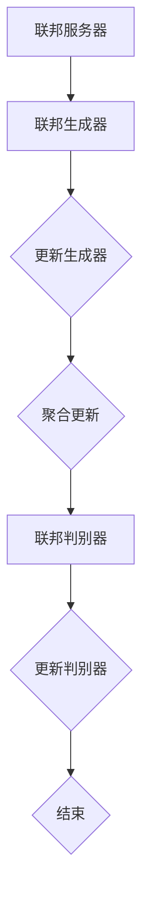

**核心算法原理讲解：**

1. **联邦生成器**：联邦生成器在每个联邦客户端上使用梯度下降算法进行训练。其目标是最小化生成数据与真实数据之间的差异。

   **伪代码**：
   ```python
   for epoch in range(num_epochs):
       for local_data in local_dataset:
           generate_fake_data = federated_generator(local_data)
           loss = calculate_loss(generate_fake_data, real_data)
           federated_generator.update_weights(loss)
   ```

2. **联邦判别器**：联邦判别器在每个联邦客户端上使用梯度下降算法进行训练。其目标是最小化判别器对生成数据和真实数据的判别误差。

   **伪代码**：
   ```python
   for epoch in range(num_epochs):
       for local_data in local_dataset:
           real_data = local_dataset[local_data]
           generate_fake_data = federated_generator(local_data)
           loss = calculate_loss(federated_discriminator(real_data), 1)
           loss += calculate_loss(federated_discriminator(generate_fake_data), 0)
           federated_discriminator.update_weights(loss)
   ```

### 3.2 联邦变分自编码器（FVAE）

联邦变分自编码器（Federated Variational Autoencoder，FVAE）是一种基于联邦学习的变分自编码器（VAE）模型。VAE通过编码器和解码器将数据转换为潜在空间中的表示，并使用潜在空间中的数据生成新数据。

**核心概念与联系：**

1. **联邦编码器（Federated Encoder）**：联邦编码器在每个联邦客户端上训练，将数据编码为潜在空间中的表示。
2. **联邦解码器（Federated Decoder）**：联邦解码器在每个联邦客户端上训练，将潜在空间中的数据解码回原始数据。

**工作原理：**

1. **初始化**：联邦服务器初始化全局编码器和解码器模型，并将模型参数分发到各个联邦客户端。
2. **训练过程**：
   - 联邦编码器在每个联邦客户端上训练，将本地数据编码为潜在空间中的表示。
   - 联邦解码器在每个联邦客户端上训练，将潜在空间中的表示解码回原始数据。
   - 联邦服务器聚合所有联邦客户端的模型更新，更新全局编码器和解码器。

**Mermaid 流程图：**

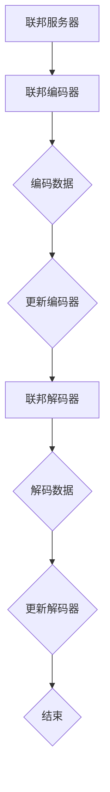

**核心算法原理讲解：**

1. **联邦编码器**：联邦编码器在每个联邦客户端上使用变分自编码器（VAE）进行训练。其目标是最小化编码数据与解码数据之间的差异。

   **伪代码**：
   ```python
   for epoch in range(num_epochs):
       for local_data in local_dataset:
           encoded_data = federated_encoder(local_data)
           decoded_data = federated_decoder(encoded_data)
           loss = calculate_loss(local_data, decoded_data)
           federated_encoder.update_weights(loss)
   ```

2. **联邦解码器**：联邦解码器在每个联邦客户端上使用变分自编码器（VAE）进行训练。其目标是最小化编码数据与解码数据之间的差异。

   **伪代码**：
   ```python
   for epoch in range(num_epochs):
       for local_data in local_dataset:
           encoded_data = federated_encoder(local_data)
           decoded_data = federated_decoder(encoded_data)
           loss = calculate_loss(local_data, decoded_data)
           federated_decoder.update_weights(loss)
   ```

### 3.3 联邦生成文本模型

联邦生成文本模型是一种基于联邦学习的文本生成模型，可以用于生成高质量的自然语言文本。常见的联邦生成文本模型包括联邦生成对抗网络（FGAN）和联邦变分自编码器（FVAE）。

**核心概念与联系：**

1. **联邦编码器（Federated Encoder）**：将文本编码为潜在空间中的向量。
2. **联邦解码器（Federated Decoder）**：将潜在空间中的向量解码为文本。

**工作原理：**

1. **初始化**：联邦服务器初始化全局编码器和解码器模型，并将模型参数分发到各个联邦客户端。
2. **训练过程**：
   - 联邦编码器在每个联邦客户端上训练，将本地文本数据编码为潜在空间中的向量。
   - 联邦解码器在每个联邦客户端上训练，将潜在空间中的向量解码为文本。
   - 联邦服务器聚合所有联邦客户端的模型更新，更新全局编码器和解码器。

**Mermaid 流程图：**

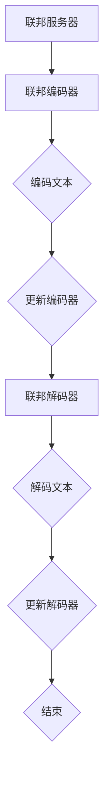

**核心算法原理讲解：**

1. **联邦编码器**：联邦编码器在每个联邦客户端上使用循环神经网络（RNN）或Transformer进行训练。其目标是最小化编码文本与解码文本之间的差异。

   **伪代码**：
   ```python
   for epoch in range(num_epochs):
       for local_text in local_dataset:
           encoded_vector = federated_encoder(local_text)
           decoded_text = federated_decoder(encoded_vector)
           loss = calculate_loss(local_text, decoded_text)
           federated_encoder.update_weights(loss)
   ```

2. **联邦解码器**：联邦解码器在每个联邦客户端上使用循环神经网络（RNN）或Transformer进行训练。其目标是最小化编码文本与解码文本之间的差异。

   **伪代码**：
   ```python
   for epoch in range(num_epochs):
       for local_text in local_dataset:
           encoded_vector = federated_encoder(local_text)
           decoded_text = federated_decoder(encoded_vector)
           loss = calculate_loss(local_text, decoded_text)
           federated_decoder.update_weights(loss)
   ```

### 3.4 联邦图像生成模型

联邦图像生成模型是一种基于联邦学习的图像生成模型，可以用于生成高质量的图像。常见的联邦图像生成模型包括联邦生成对抗网络（FGAN）和联邦变分自编码器（FVAE）。

**核心概念与联系：**

1. **联邦编码器（Federated Encoder）**：将图像编码为潜在空间中的向量。
2. **联邦解码器（Federated Decoder）**：将潜在空间中的向量解码为图像。

**工作原理：**

1. **初始化**：联邦服务器初始化全局编码器和解码器模型，并将模型参数分发到各个联邦客户端。
2. **训练过程**：
   - 联邦编码器在每个联邦客户端上训练，将本地图像数据编码为潜在空间中的向量。
   - 联邦解码器在每个联邦客户端上训练，将潜在空间中的向量解码为图像。
   - 联邦服务器聚合所有联邦客户端的模型更新，更新全局编码器和解码器。

**Mermaid 流�程图：**


**核心算法原理讲解：**

1. **联邦编码器**：联邦编码器在每个联邦客户端上使用卷积神经网络（CNN）进行训练。其目标是最小化编码图像与解码图像之间的差异。

   **伪代码**：
   ```python
   for epoch in range(num_epochs):
       for local_image in local_dataset:
           encoded_vector = federated_encoder(local_image)
           decoded_image = federated_decoder(encoded_vector)
           loss = calculate_loss(local_image, decoded_image)
           federated_encoder.update_weights(loss)
   ```

2. **联邦解码器**：联邦解码器在每个联邦客户端上使用卷积神经网络（CNN）进行训练。其目标是最小化编码图像与解码图像之间的差异。

   **伪代码**：
   ```python
   for epoch in range(num_epochs):
       for local_image in local_dataset:
           encoded_vector = federated_encoder(local_image)
           decoded_image = federated_decoder(encoded_vector)
           loss = calculate_loss(local_image, decoded_image)
           federated_decoder.update_weights(loss)
   ```

### 3.5 联邦音频生成模型

联邦音频生成模型是一种基于联邦学习的音频生成模型，可以用于生成高质量的音频。常见的联邦音频生成模型包括联邦生成对抗网络（FGAN）和联邦变分自编码器（FVAE）。

**核心概念与联系：**

1. **联邦编码器（Federated Encoder）**：将音频编码为潜在空间中的向量。
2. **联邦解码器（Federated Decoder）**：将潜在空间中的向量解码为音频。

**工作原理：**

1. **初始化**：联邦服务器初始化全局编码器和解码器模型，并将模型参数分发到各个联邦客户端。
2. **训练过程**：
   - 联邦编码器在每个联邦客户端上训练，将本地音频数据编码为潜在空间中的向量。
   - 联邦解码器在每个联邦客户端上训练，将潜在空间中的向量解码为音频。
   - 联邦服务器聚合所有联邦客户端的模型更新，更新全局编码器和解码器。

**Mermaid 流程图：**

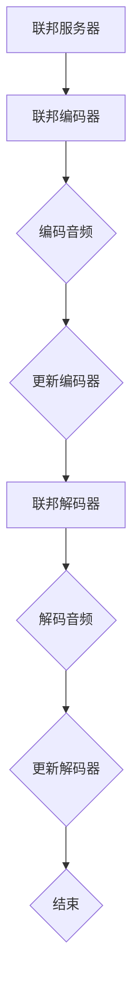

**核心算法原理讲解：**

1. **联邦编码器**：联邦编码器在每个联邦客户端上使用卷积神经网络（CNN）或循环神经网络（RNN）进行训练。其目标是最小化编码音频与解码音频之间的差异。

   **伪代码**：
   ```python
   for epoch in range(num_epochs):
       for local_audio in local_dataset:
           encoded_vector = federated_encoder(local_audio)
           decoded_audio = federated_decoder(encoded_vector)
           loss = calculate_loss(local_audio, decoded_audio)
           federated_encoder.update_weights(loss)
   ```

2. **联邦解码器**：联邦解码器在每个联邦客户端上使用卷积神经网络（CNN）或循环神经网络（RNN）进行训练。其目标是最小化编码音频与解码音频之间的差异。

   **伪代码**：
   ```python
   for epoch in range(num_epochs):
       for local_audio in local_dataset:
           encoded_vector = federated_encoder(local_audio)
           decoded_audio = federated_decoder(encoded_vector)
           loss = calculate_loss(local_audio, decoded_audio)
           federated_decoder.update_weights(loss)
   ```

### 总结

联邦学习在生成式AI中具有广泛的应用，包括联邦生成对抗网络（FGAN）、联邦变分自编码器（FVAE）、联邦生成文本模型、联邦图像生成模型和联邦音频生成模型等。这些模型通过分布式训练，实现了在保护数据隐私的同时，生成高质量的生成内容。在接下来的章节中，我们将进一步探讨联邦学习在图像处理与自然语言处理等领域的应用。

---

## 第4章：联邦学习在图像处理与计算机视觉中的应用

联邦学习（Federated Learning）在图像处理和计算机视觉领域展示了其强大的应用潜力。通过分布式计算和隐私保护的优势，联邦学习能够有效地解决大规模图像数据的隐私保护和处理问题。本节将介绍联邦学习在图像处理和计算机视觉中的主要应用，包括图像分类、目标检测、图像生成、图像分割和图像超分辨率等。

### 4.1 联邦图像分类与识别

联邦图像分类与识别是联邦学习在计算机视觉中的一个重要应用。联邦学习通过分布式训练，可以在不共享原始图像数据的情况下，实现高效的图像分类与识别。

**核心概念与联系：**

1. **联邦模型（Federated Model）**：全局模型由多个联邦客户端共同训练，每个客户端使用本地图像数据训练模型。
2. **联邦学习服务器**：服务器负责聚合各联邦客户端的模型更新，并更新全局模型。

**工作原理：**

1. **初始化**：联邦服务器初始化全局模型，并将模型参数分发到各个联邦客户端。
2. **训练过程**：
   - 联邦客户端使用本地图像数据训练模型，并将模型更新发送给联邦服务器。
   - 联邦服务器聚合所有客户端的模型更新，并更新全局模型。
   - 联邦客户端下载更新后的全局模型，继续本地训练。

**Mermaid 流程图：**

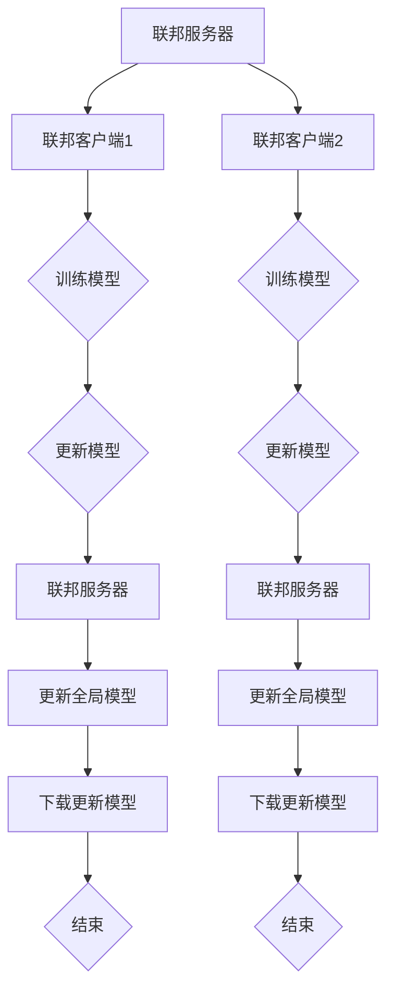

**核心算法原理讲解：**

1. **联邦客户端训练**：
   ```python
   for epoch in range(num_epochs):
       for image in local_dataset:
           prediction = federated_model.predict(image)
           loss = calculate_loss(prediction, label)
           federated_model.update_weights(loss)
   ```

2. **联邦服务器聚合**：
   ```python
   aggregated_weights = aggregate_model_updates(client_model_updates)
   global_model.update_weights(aggregated_weights)
   ```

### 4.2 联邦目标检测与追踪

联邦目标检测与追踪是联邦学习在计算机视觉领域的另一重要应用。联邦学习通过分布式训练，可以在保护隐私的同时，实现高效的目标检测和追踪。

**核心概念与联系：**

1. **联邦检测模型（Federated Detection Model）**：全局检测模型由多个联邦客户端共同训练。
2. **联邦追踪模型（Federated Tracking Model）**：全局追踪模型用于追踪检测到的目标。

**工作原理：**

1. **初始化**：联邦服务器初始化全局检测模型和追踪模型，并将模型参数分发到各个联邦客户端。
2. **训练过程**：
   - 联邦客户端使用本地图像数据训练检测模型，并将检测结果发送给联邦服务器。
   - 联邦服务器使用聚合的检测结果训练追踪模型。
   - 联邦客户端下载更新后的全局检测和追踪模型，继续本地训练。

**Mermaid 流程图：**

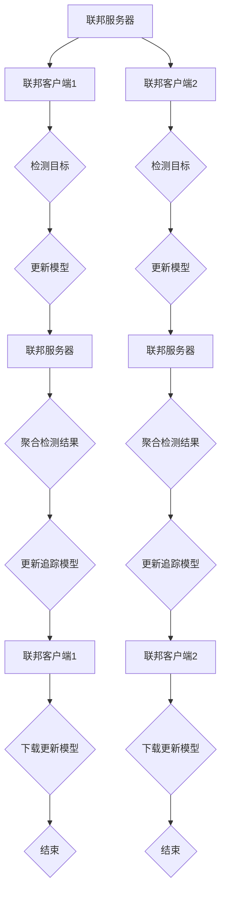

**核心算法原理讲解：**

1. **联邦客户端检测**：
   ```python
   for epoch in range(num_epochs):
       for image in local_dataset:
           detections = federated_detection_model.detect(image)
           loss = calculate_loss(detections, ground_truth)
           federated_detection_model.update_weights(loss)
   ```

2. **联邦服务器聚合**：
   ```python
   aggregated_detections = aggregate_detections(client_detections)
   federated_tracking_model.update_weights(aggregated_detections)
   ```

### 4.3 联邦图像生成与增强

联邦图像生成与增强是联邦学习在计算机视觉领域的一个新兴应用。联邦学习通过分布式训练，可以在保护隐私的同时，生成和增强图像数据。

**核心概念与联系：**

1. **联邦生成模型（Federated Generation Model）**：全局生成模型由多个联邦客户端共同训练。
2. **联邦增强模型（Federated Enhancement Model）**：全局增强模型用于增强图像数据。

**工作原理：**

1. **初始化**：联邦服务器初始化全局生成模型和增强模型，并将模型参数分发到各个联邦客户端。
2. **训练过程**：
   - 联邦客户端使用本地图像数据训练生成模型，并将生成结果发送给联邦服务器。
   - 联邦服务器使用聚合的生成结果训练增强模型。
   - 联邦客户端下载更新后的全局生成和增强模型，继续本地训练。

**Mermaid 流程图：**

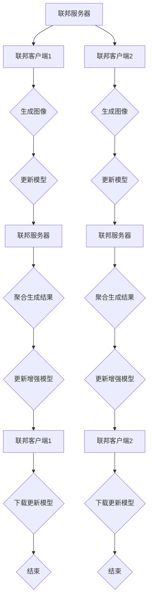

**核心算法原理讲解：**

1. **联邦客户端生成**：
   ```python
   for epoch in range(num_epochs):
       for image in local_dataset:
           generated_image = federated_generation_model.generate(image)
           loss = calculate_loss(generated_image, target_image)
           federated_generation_model.update_weights(loss)
   ```

2. **联邦服务器聚合**：
   ```python
   aggregated_generated_images = aggregate_generated_images(client_generated_images)
   federated_enhancement_model.update_weights(aggregated_generated_images)
   ```

### 4.4 联邦图像分割与语义标注

联邦图像分割与语义标注是联邦学习在计算机视觉领域的一个应用。联邦学习通过分布式训练，可以在保护隐私的同时，实现图像分割和语义标注。

**核心概念与联系：**

1. **联邦分割模型（Federated Segmentation Model）**：全局分割模型由多个联邦客户端共同训练。
2. **联邦标注模型（Federated Annotation Model）**：全局标注模型用于对图像进行语义标注。

**工作原理：**

1. **初始化**：联邦服务器初始化全局分割模型和标注模型，并将模型参数分发到各个联邦客户端。
2. **训练过程**：
   - 联邦客户端使用本地图像数据训练分割模型，并将分割结果发送给联邦服务器。
   - 联邦服务器使用聚合的分割结果训练标注模型。
   - 联邦客户端下载更新后的全局分割和标注模型，继续本地训练。

**Mermaid 流程图：**


**核心算法原理讲解：**

1. **联邦客户端分割**：
   ```python
   for epoch in range(num_epochs):
       for image in local_dataset:
           segmentation_mask = federated_segmentation_model.predict(image)
           loss = calculate_loss(segmentation_mask, ground_truth_mask)
           federated_segmentation_model.update_weights(loss)
   ```

2. **联邦服务器聚合**：
   ```python
   aggregated_segmentation_masks = aggregate_segmentation_masks(client_segmentation_masks)
   federated_annotation_model.update_weights(aggregated_segmentation_masks)
   ```

### 4.5 联邦图像超分辨率与去噪

联邦图像超分辨率与去噪是联邦学习在计算机视觉领域的一个应用。联邦学习通过分布式训练，可以在保护隐私的同时，实现图像超分辨率和去噪。

**核心概念与联系：**

1. **联邦超分辨率模型（Federated Super-Resolution Model）**：全局超分辨率模型由多个联邦客户端共同训练。
2. **联邦去噪模型（Federated Denoising Model）**：全局去噪模型用于去除图像噪声。

**工作原理：**

1. **初始化**：联邦服务器初始化全局超分辨率模型和去噪模型，并将模型参数分发到各个联邦客户端。
2. **训练过程**：
   - 联邦客户端使用本地图像数据训练超分辨率模型，并将超分辨率结果发送给联邦服务器。
   - 联邦服务器使用聚合的超分辨率结果训练去噪模型。
   - 联邦客户端下载更新后的全局超分辨率和去噪模型，继续本地训练。

**Mermaid 流程图：**

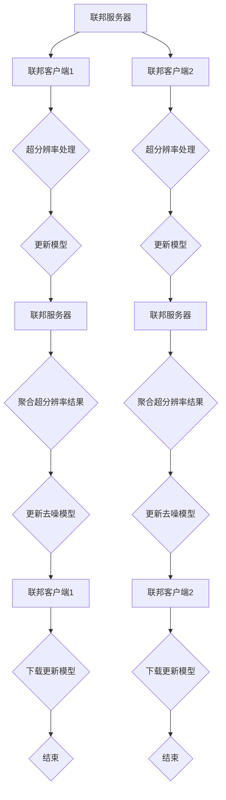

**核心算法原理讲解：**

1. **联邦客户端超分辨率**：
   ```python
   for epoch in range(num_epochs):
       for image in local_dataset:
           super_resolved_image = federated_super_resolution_model.predict(image)
           loss = calculate_loss(super_resolved_image, target_image)
           federated_super_resolution_model.update_weights(loss)
   ```

2. **联邦服务器聚合**：
   ```python
   aggregated_super_resolved_images = aggregate_super_resolved_images(client_super_resolved_images)
   federated_denoising_model.update_weights(aggregated_super_resolved_images)
   ```

### 总结

联邦学习在图像处理和计算机视觉领域展示了其强大的应用潜力。通过分布式计算和隐私保护的优势，联邦学习能够有效地实现图像分类、目标检测、图像生成、图像分割、图像超分辨率和去噪等任务。这些应用不仅提高了系统的效率和性能，还确保了数据的安全性和隐私性。在未来的发展中，联邦学习有望在更多的计算机视觉任务中发挥重要作用。

---

## 第5章：联邦学习在自然语言处理中的应用

联邦学习在自然语言处理（NLP）领域展现了巨大的潜力。通过分布式计算和隐私保护，联邦学习能够处理大规模的文本数据，同时确保数据的隐私和安全。本节将介绍联邦学习在自然语言处理中的主要应用，包括文本分类、情感分析、语言模型、对话系统、机器翻译和文本生成等。

### 5.1 联邦文本分类与情感分析

联邦文本分类与情感分析是联邦学习在NLP中的基础应用。通过联邦学习，可以在保护数据隐私的同时，对文本进行分类和情感分析。

**核心概念与联系：**

1. **联邦文本分类模型（Federated Text Classification Model）**：全局分类模型由多个联邦客户端共同训练。
2. **联邦情感分析模型（Federated Sentiment Analysis Model）**：全局情感分析模型用于对文本进行情感分析。

**工作原理：**

1. **初始化**：联邦服务器初始化全局分类模型和情感分析模型，并将模型参数分发到各个联邦客户端。
2. **训练过程**：
   - 联邦客户端使用本地文本数据训练分类和情感分析模型，并将模型更新发送给联邦服务器。
   - 联邦服务器聚合所有客户端的模型更新，并更新全局模型。
   - 联邦客户端下载更新后的全局模型，继续本地训练。

**Mermaid 流程图：**

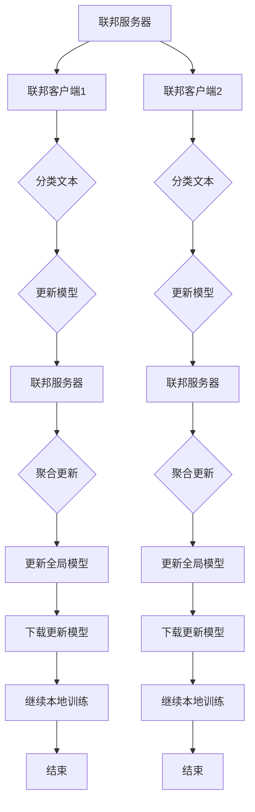

**核心算法原理讲解：**

1. **联邦客户端训练**：
   ```python
   for epoch in range(num_epochs):
       for text in local_dataset:
           prediction = federated_classification_model.predict(text)
           loss = calculate_loss(prediction, label)
           federated_classification_model.update_weights(loss)
   ```

2. **联邦服务器聚合**：
   ```python
   aggregated_weights = aggregate_model_updates(client_model_updates)
   global_model.update_weights(aggregated_weights)
   ```

### 5.2 联邦语言模型与生成

联邦语言模型与生成是联邦学习在NLP中的高级应用。通过联邦学习，可以训练大规模的语言模型，并生成高质量的文本内容。

**核心概念与联系：**

1. **联邦语言模型（Federated Language Model）**：全局语言模型由多个联邦客户端共同训练。
2. **联邦文本生成模型（Federated Text Generation Model）**：全局文本生成模型用于生成文本。

**工作原理：**

1. **初始化**：联邦服务器初始化全局语言模型和文本生成模型，并将模型参数分发到各个联邦客户端。
2. **训练过程**：
   - 联邦客户端使用本地文本数据训练语言模型，并将生成结果发送给联邦服务器。
   - 联邦服务器使用聚合的生成结果训练文本生成模型。
   - 联邦客户端下载更新后的全局语言模型和文本生成模型，继续本地训练。

**Mermaid 流程图：**

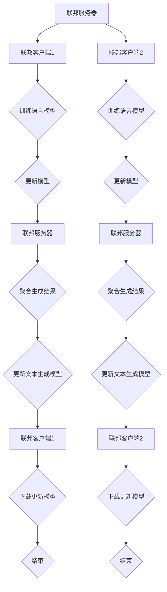

**核心算法原理讲解：**

1. **联邦客户端训练**：
   ```python
   for epoch in range(num_epochs):
       for text in local_dataset:
           probabilities = federated_language_model.predict(text)
           loss = calculate_loss(probabilities, target_probabilities)
           federated_language_model.update_weights(loss)
   ```

2. **联邦服务器聚合**：
   ```python
   aggregated_probabilities = aggregate_probabilities(client_probabilities)
   federated_text_generation_model.update_weights(aggregated_probabilities)
   ```

### 5.3 联邦对话系统与问答

联邦对话系统与问答是联邦学习在NLP中的又一重要应用。通过联邦学习，可以训练对话系统，并实现高效的问答功能。

**核心概念与联系：**

1. **联邦对话系统（Federated Dialogue System）**：全局对话系统由多个联邦客户端共同训练。
2. **联邦问答模型（Federated Question-Answering Model）**：全局问答模型用于处理用户问题和生成回答。

**工作原理：**

1. **初始化**：联邦服务器初始化全局对话系统和问答模型，并将模型参数分发到各个联邦客户端。
2. **训练过程**：
   - 联邦客户端使用本地对话数据训练对话系统和问答模型，并将训练结果发送给联邦服务器。
   - 联邦服务器聚合所有客户端的训练结果，并更新全局模型。
   - 联邦客户端下载更新后的全局对话系统和问答模型，继续本地训练。

**Mermaid 流程图：**

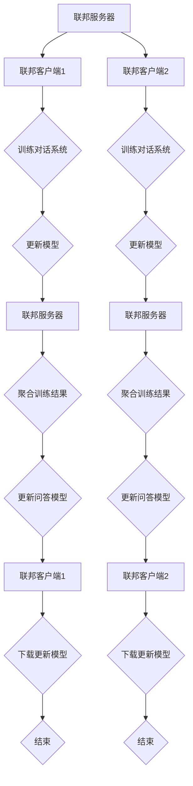

**核心算法原理讲解：**

1. **联邦客户端训练**：
   ```python
   for epoch in range(num_epochs):
       for dialogue in local_dataset:
           response = federated_dialogue_system.answer(dialogue)
           loss = calculate_loss(response, target_response)
           federated_dialogue_system.update_weights(loss)
   ```

2. **联邦服务器聚合**：
   ```python
   aggregated_responses = aggregate_responses(client_responses)
   federated_question_answering_model.update_weights(aggregated_responses)
   ```

### 5.4 联邦机器翻译与文本摘要

联邦机器翻译与文本摘要是联邦学习在NLP中的两个重要应用。通过联邦学习，可以在保护数据隐私的同时，实现高效的机器翻译和文本摘要功能。

**核心概念与联系：**

1. **联邦翻译模型（Federated Translation Model）**：全局翻译模型由多个联邦客户端共同训练。
2. **联邦摘要模型（Federated Summarization Model）**：全局摘要模型用于生成文本摘要。

**工作原理：**

1. **初始化**：联邦服务器初始化全局翻译模型和摘要模型，并将模型参数分发到各个联邦客户端。
2. **训练过程**：
   - 联邦客户端使用本地翻译和摘要数据训练模型，并将训练结果发送给联邦服务器。
   - 联邦服务器聚合所有客户端的训练结果，并更新全局模型。
   - 联邦客户端下载更新后的全局翻译模型和摘要模型，继续本地训练。

**Mermaid 流程图：**


**核心算法原理讲解：**

1. **联邦客户端训练**：
   ```python
   for epoch in range(num_epochs):
       for sentence in local_dataset:
           translation = federated_translation_model.translate(sentence)
           loss = calculate_loss(translation, target_translation)
           federated_translation_model.update_weights(loss)
   ```

2. **联邦服务器聚合**：
   ```python
   aggregated_translations = aggregate_translations(client_translations)
   federated_summarization_model.update_weights(aggregated_translations)
   ```

### 5.5 联邦文本生成与内容创作

联邦文本生成与内容创作是联邦学习在NLP中的前沿应用。通过联邦学习，可以训练文本生成模型，并创作高质量的内容。

**核心概念与联系：**

1. **联邦文本生成模型（Federated Text Generation Model）**：全局文本生成模型由多个联邦客户端共同训练。
2. **联邦内容创作模型（Federated Content Creation Model）**：全局内容创作模型用于生成多样化的文本内容。

**工作原理：**

1. **初始化**：联邦服务器初始化全局文本生成模型和内容创作模型，并将模型参数分发到各个联邦客户端。
2. **训练过程**：
   - 联邦客户端使用本地文本数据训练文本生成模型和内容创作模型，并将生成结果发送给联邦服务器。
   - 联邦服务器聚合所有客户端的生成结果，并更新全局模型。
   - 联邦客户端下载更新后的全局模型，继续本地训练。

**Mermaid 流程图：**

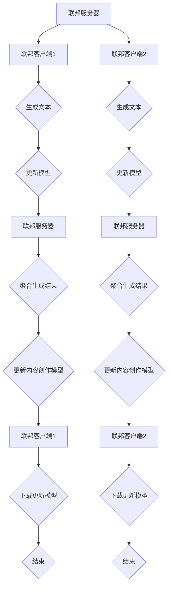

**核心算法原理讲解：**

1. **联邦客户端训练**：
   ```python
   for epoch in range(num_epochs):
       for text in local_dataset:
           generated_text = federated_text_generation_model.generate(text)
           loss = calculate_loss(generated_text, target_text)
           federated_text_generation_model.update_weights(loss)
   ```

2. **联邦服务器聚合**：
   ```python
   aggregated_generated_texts = aggregate_generated_texts(client_generated_texts)
   federated_content_creation_model.update_weights(aggregated_generated_texts)
   ```

### 总结

联邦学习在自然语言处理领域展示了其强大的应用潜力。通过分布式计算和隐私保护，联邦学习能够处理大规模的文本数据，并生成高质量的文本内容。这些应用不仅提高了系统的效率和性能，还确保了数据的安全性和隐私性。在未来的发展中，联邦学习有望在更多的NLP任务中发挥重要作用。

---

## 第三部分：联邦学习在隐私保护中的应用

### 第6章：联邦学习与数据隐私保护

随着数据隐私法规的加强，如何在联邦学习环境中确保数据隐私成为了关键问题。本章节将探讨联邦学习在数据隐私保护方面的法律法规、道德规范、数据匿名化与混淆技术，以及同态加密与安全多方计算的应用。

### 6.1 隐私保护的法律法规与道德规范

数据隐私保护已经成为全球关注的焦点。多个国家和国际组织颁布了相关的法律法规和道德规范，以确保数据隐私的保护。以下是一些重要的法律法规和道德规范：

1. **GDPR（欧盟通用数据保护条例）**：GDPR是欧盟最具代表性的数据隐私保护法规，规定了个人数据的处理、存储和传输规则，强调数据主体的知情权和控制权。
2. **CCPA（加州消费者隐私法）**：CCPA是美国的消费者隐私保护法律，主要规定了消费者的数据权利，包括访问、删除和拒绝数据销售等。
3. **加州隐私法（CalVet）**：CalVet是加州针对数据隐私保护的一项法律，与GDPR和CCPA有许多相似之处，旨在加强个人数据的保护。
4. **道德规范**：除了法律法规，行业组织和研究机构也提出了数据隐私保护的相关道德规范，如“数据伦理十诫”等，以指导企业和研究者在数据收集、存储和使用过程中的行为。

### 6.2 数据匿名化与混淆技术

数据匿名化与混淆技术是联邦学习中的基本隐私保护手段。通过这些技术，可以有效地去除或模糊化个人身份信息，降低数据泄露的风险。

1. **数据匿名化**：数据匿名化通过去除或模糊化个人身份信息，将数据转换为无法识别特定个体的形式。常见的匿名化技术包括：
   - **K-匿名性**：确保任意一个个体在数据库中至少有K个相似的记录，从而无法单独识别。
   - **l-diversity**：确保每个记录的类别至少有l个相似的记录，从而无法通过类别信息识别。
   - **t-closeness**：确保每个记录的属性分布与其他记录的属性分布之间的差异不超过t个标准差。

   **伪代码**：
   ```python
   def anonymize_data(data, k, l, t):
       anonymized_data = remove_personal_identifiers(data)
       anonymized_data = apply_k_anonymity(anonymized_data, k)
       anonymized_data = apply_l_diversity(anonymized_data, l)
       anonymized_data = apply_t_closeness(anonymized_data, t)
       return anonymized_data
   ```

2. **混淆技术**：混淆技术通过在数据中引入噪声，使数据无法被直接解读，同时保持数据的统计特性。常见的混淆技术包括：
   - **随机化**：在数据中添加随机噪声，以掩盖真实数据。
   - **模糊化**：将数据值设置为某个区间内的随机值，以降低数据的识别性。

   **伪代码**：
   ```python
   def confuse_data(data, noise_level):
       noisy_data = add_noise(data, noise_level)
       return noisy_data
   ```

### 6.3 加密技术在联邦学习中的应用

加密技术是联邦学习中实现数据隐私保护的重要手段。通过加密，可以在不泄露原始数据的情况下，进行模型的训练和更新。

1. **同态加密**：同态加密是一种允许在加密数据上直接进行计算的技术。这使得联邦学习中的模型更新和聚合过程可以在加密状态下进行，从而保护了数据的隐私。

   **伪代码**：
   ```python
   def homomorphic_encrypt(data):
       encrypted_data = encrypt(data)
       return encrypted_data
   
   def homomorphic_compute(encrypted_data):
       encrypted_result = compute(encrypted_data)
       return encrypted_result
   
   def homomorphic_decrypt(encrypted_result):
       decrypted_result = decrypt(encrypted_result)
       return decrypted_result
   ```

2. **安全多方计算**：安全多方计算是一种允许多个参与方共同计算结果，而无需透露各自输入数据的技术。在联邦学习中，安全多方计算可用于模型的聚合和更新。

   **伪代码**：
   ```python
   def secure_mpc_compute(data1, data2):
       encrypted_data1 = encrypt(data1)
       encrypted_data2 = encrypt(data2)
       encrypted_result = compute(encrypted_data1, encrypted_data2)
       decrypted_result = decrypt(encrypted_result)
       return decrypted_result
   ```

### 6.4 同态加密与安全多方计算

同态加密与安全多方计算是联邦学习中的关键技术，为实现数据隐私保护提供了有效手段。以下是这两种技术的详细解释：

1. **同态加密**：

   同态加密允许在加密数据上进行数学运算，而不需要解密。这使得联邦学习中的模型训练和更新可以在加密状态下进行，从而避免了数据泄露的风险。

   **同态加密算法示例**：

   - **加密**：
     $$ E(m) = m \oplus k $$
     其中，$E(m)$是加密后的数据，$m$是原始数据，$k$是加密密钥。

   - **解密**：
     $$ D(c) = c \oplus k $$
     其中，$D(c)$是解密后的数据，$c$是加密后的数据。

   - **同态加法**：
     $$ E(m_1 + m_2) = E(m_1) \oplus E(m_2) $$
     其中，$E(m_1 + m_2)$是加密后的加法结果，$E(m_1)$和$E(m_2)$分别是加密后的$m_1$和$m_2$。

   - **同态乘法**：
     $$ E(m_1 \times m_2) = E(m_1) \times E(m_2) $$
     其中，$E(m_1 \times m_2)$是加密后的乘法结果，$E(m_1)$和$E(m_2)$分别是加密后的$m_1$和$m_2$。

2. **安全多方计算**：

   安全多方计算（Secure Multi-Party Computation，SMPC）是一种允许多个参与方共同计算结果，而不透露各自输入数据的技术。SMPC在联邦学习中的应用非常广泛，尤其是在模型聚合和更新过程中。

   **SMPC算法示例**：

   - **同态加法**：
     $$ E(m_1) + E(m_2) = E(m_1 + m_2) $$
     其中，$E(m_1)$和$E(m_2)$分别是加密后的$m_1$和$m_2$，$E(m_1 + m_2)$是加密后的加法结果。

   - **同态乘法**：
     $$ E(m_1) \times E(m_2) = E(m_1 \times m_2) $$
     其中，$E(m_1)$和$E(m_2)$分别是加密后的$m_1$和$m_2$，$E(m_1 \times m_2)$是加密后的乘法结果。

### 6.5 联邦学习中的隐私保护挑战与对策

尽管联邦学习在数据隐私保护方面具有显著优势，但仍然面临一些挑战。以下是联邦学习中的主要隐私保护挑战及其对策：

1. **隐私泄露风险**：联邦学习过程中，数据可能在传输、存储和处理过程中泄露。对策包括使用加密技术和安全多方计算，确保数据在传输和存储过程中的安全性。

2. **模型泄露风险**：联邦学习中的全局模型可能包含敏感信息，对策包括使用差分隐私（Differential Privacy）和隐私预算（Privacy Budget），确保模型更新不会泄露敏感信息。

3. **联邦服务器攻击**：联邦服务器可能成为攻击的目标，对策包括使用强加密技术和访问控制机制，确保联邦服务器的安全性。

4. **通信成本**：联邦学习需要大量的通信开销，对策包括优化模型更新和聚合算法，减少通信成本。

5. **模型性能下降**：联邦学习中的分布式训练可能导致模型性能下降，对策包括优化联邦学习算法，提高模型性能。

### 总结

联邦学习在数据隐私保护方面具有重要的应用价值。通过法律法规、道德规范、数据匿名化、混淆技术、同态加密和安全多方计算等技术手段，联邦学习能够有效地保护数据隐私。然而，隐私保护仍然面临一些挑战，需要进一步研究和优化。在未来的发展中，联邦学习有望在更多的应用场景中发挥重要作用，同时确保数据的安全和隐私。

---

## 第7章：联邦学习在隐私保护中的应用案例

### 7.1 零知识证明在联邦学习中的应用

零知识证明（Zero-Knowledge Proof，ZKP）是一种加密技术，允许证明者在不透露原始信息的情况下，证明某个陈述的真实性。在联邦学习中，零知识证明可以用于确保参与方的隐私，从而增强系统的安全性。

**应用场景**：

1. **数据隐私保护**：零知识证明可以用于证明联邦客户端的数据满足特定条件，而无需透露具体数据。例如，在一个医疗数据共享的联邦学习中，可以使用零知识证明来验证某个病人的数据包含特定的疾病诊断信息，而无需透露诊断的具体内容。

2. **隐私验证**：零知识证明可以用于验证联邦客户端的模型更新是否真实，而无需访问模型参数。例如，在一个金融风控的联邦学习中，可以使用零知识证明来验证某个模型的更新是否基于真实的数据，而不是伪造的数据。

**工作原理**：

1. **证明生成**：证明者生成一个零知识证明，证明其陈述的真实性。证明过程中，证明者需要使用加密算法，确保证明过程不被攻击者破解。

   **伪代码**：
   ```python
   def generate_zkp(statement, private_key):
       encrypted_statement = encrypt(statement, public_key)
       proof = zk_proof_generator(encrypted_statement, private_key)
       return proof
   ```

2. **证明验证**：验证者验证零知识证明的真实性，而不需要访问原始数据或模型参数。验证过程中，验证者需要使用与证明生成相同的加密算法。

   **伪代码**：
   ```python
   def verify_zkp(proof, public_key):
       decrypted_proof = decrypt(proof, public_key)
       if zk_proof_validator(decrypted_proof):
           return True
       else:
           return False
   ```

### 7.2 区块链与联邦学习的结合

区块链技术具有去中心化、不可篡改和透明等特性，与联邦学习相结合，可以增强联邦学习系统的安全性、可追溯性和隐私保护。

**应用场景**：

1. **数据共享与验证**：区块链可以用于记录联邦学习过程中各参与方上传的数据，确保数据的真实性和完整性。例如，在一个医疗数据联邦学习中，可以使用区块链来记录每个参与方上传的患者数据，并确保数据的真实性和完整性。

2. **模型更新与审计**：区块链可以用于记录联邦学习中的模型更新过程，确保模型更新的可追溯性和透明性。例如，在一个自动驾驶联邦学习中，可以使用区块链来记录每个参与方上传的模型更新，并确保更新过程的可追溯性。

**工作原理**：

1. **数据记录**：联邦客户端上传数据到区块链，区块链记录并验证数据的真实性。数据记录包括数据哈希值、上传时间和上传方等信息。

   **伪代码**：
   ```python
   def upload_data_to_blockchain(data, blockchain):
       data_hash = calculate_hash(data)
       blockchain.add_data(data_hash, upload_time, upload_id)
   ```

2. **模型更新记录**：联邦服务器将模型更新上传到区块链，区块链记录并验证模型更新的真实性。模型更新记录包括更新内容、更新时间和更新方等信息。

   **伪代码**：
   ```python
   def upload_model_update_to_blockchain(update, blockchain):
       update_hash = calculate_hash(update)
       blockchain.add_model_update(update_hash, update_time, update_id)
   ```

### 7.3 联邦学习在医疗健康数据中的应用

医疗健康数据具有高度的敏感性，联邦学习在医疗健康数据中的应用可以有效保护患者隐私。

**应用场景**：

1. **疾病预测与诊断**：联邦学习可以用于疾病预测和诊断，同时保护患者隐私。例如，在一个心脏病预测的联邦学习中，各医院可以使用本地患者数据训练模型，并通过联邦学习算法聚合模型更新，提高疾病预测的准确性。

2. **药物研发与临床试验**：联邦学习可以用于药物研发和临床试验，同时保护患者隐私。例如，在一个药物临床试验的联邦学习中，各研究机构可以使用本地临床试验数据训练模型，并通过联邦学习算法聚合模型更新，加速药物研发进程。

**工作原理**：

1. **数据上传与聚合**：各医疗机构上传本地患者数据到联邦服务器，联邦服务器使用联邦学习算法进行模型训练和更新。数据上传过程中，可以使用加密和匿名化技术，确保患者隐私。

   **伪代码**：
   ```python
   def upload_local_data_to_federated_server(data, server_address):
       encrypted_data = encrypt_data(data)
       anonymized_data = anonymize_data(encrypted_data)
       send_data(anonymized_data, server_address)
   ```

2. **模型训练与更新**：联邦服务器聚合所有医疗机构上传的数据，使用联邦学习算法进行模型训练和更新。模型更新过程中，可以使用同态加密和安全多方计算技术，确保模型更新的安全性。

   **伪代码**：
   ```python
   def federated_model_training(server_data, client_data):
       aggregated_data = aggregate_data(server_data, client_data)
       trained_model = train_model(aggregated_data)
       return trained_model
   ```

### 7.4 联邦学习在金融行业中的应用

金融行业对数据安全和隐私保护的要求非常高，联邦学习在金融行业中的应用可以有效地保护用户隐私。

**应用场景**：

1. **风险评估与欺诈检测**：联邦学习可以用于风险评估和欺诈检测，同时保护用户隐私。例如，在一个信用卡欺诈检测的联邦学习中，各银行可以使用本地交易数据训练模型，并通过联邦学习算法聚合模型更新，提高欺诈检测的准确性。

2. **信用评分**：联邦学习可以用于信用评分，同时保护用户隐私。例如，在一个信用评分的联邦学习中，各金融机构可以使用本地客户数据训练模型，并通过联邦学习算法聚合模型更新，提高信用评分的准确性。

**工作原理**：

1. **数据上传与聚合**：各金融机构上传本地客户数据到联邦服务器，联邦服务器使用联邦学习算法进行模型训练和更新。数据上传过程中，可以使用加密和匿名化技术，确保用户隐私。

   **伪代码**：
   ```python
   def upload_local_data_to_federated_server(data, server_address):
       encrypted_data = encrypt_data(data)
       anonymized_data = anonymize_data(encrypted_data)
       send_data(anonymized_data, server_address)
   ```

2. **模型训练与更新**：联邦服务器聚合所有金融机构上传的数据，使用联邦学习算法进行模型训练和更新。模型更新过程中，可以使用同态加密和安全多方计算技术，确保模型更新的安全性。

   **伪代码**：
   ```python
   def federated_model_training(server_data, client_data):
       aggregated_data = aggregate_data(server_data, client_data)
       trained_model = train_model(aggregated_data)
       return trained_model
   ```

### 7.5 联邦学习在智能交通与城市管理中的应用

智能交通与城市管理涉及大量数据，包括交通流量、车辆位置、道路状况等。联邦学习在智能交通与城市管理中的应用可以有效保护数据隐私。

**应用场景**：

1. **交通流量预测**：联邦学习可以用于交通流量预测，同时保护车辆位置和行驶轨迹等隐私信息。例如，在一个交通流量预测的联邦学习中，各交通管理部门可以使用本地交通数据训练模型，并通过联邦学习算法聚合模型更新，提高交通流量预测的准确性。

2. **智能城市管理**：联邦学习可以用于智能城市管理，同时保护城市基础设施和居民隐私。例如，在一个智能城市管理的联邦学习中，各管理部门可以使用本地数据训练模型，并通过联邦学习算法聚合模型更新，提高城市管理效率。

**工作原理**：

1. **数据上传与聚合**：各交通管理部门和城市管理部门上传本地数据到联邦服务器，联邦服务器使用联邦学习算法进行模型训练和更新。数据上传过程中，可以使用加密和匿名化技术，确保数据隐私。

   **伪代码**：
   ```python
   def upload_local_data_to_federated_server(data, server_address):
       encrypted_data = encrypt_data(data)
       anonymized_data = anonymize_data(encrypted_data)
       send_data(anonymized_data, server_address)
   ```

2. **模型训练与更新**：联邦服务器聚合所有管理部门上传的数据，使用联邦学习算法进行模型训练和更新。模型更新过程中，可以使用同态加密和安全多方计算技术，确保模型更新的安全性。

   **伪代码**：
   ```python
   def federated_model_training(server_data, client_data):
       aggregated_data = aggregate_data(server_data, client_data)
       trained_model = train_model(aggregated_data)
       return trained_model
   ```

### 总结

联邦学习在隐私保护领域具有广泛的应用。通过零知识证明、区块链技术、医疗健康数据、金融行业和智能交通与城市管理中的应用案例，我们可以看到联邦学习如何保护数据隐私，同时提高系统性能和效率。在未来的发展中，联邦学习有望在更多领域发挥作用，为数据隐私保护提供强有力的支持。

---

## 附录A：联邦学习相关工具与框架

### A.1 TensorFlow Federated（TFF）

TensorFlow Federated（TFF）是谷歌开发的一款开源联邦学习框架，支持在分布式环境中进行联邦学习。TFF提供了丰富的API和工具，方便用户构建和部署联邦学习应用。

**主要特点**：

- **易用性**：TFF提供了简洁的API，使得用户可以轻松地构建联邦学习应用。
- **扩展性**：TFF支持多种联邦学习算法，如FedAvg、FedProx等，并支持自定义联邦学习算法。
- **兼容性**：TFF与TensorFlow深度集成，可以方便地与TensorFlow生态中的其他库和工具配合使用。

**使用示例**：

```python
import tensorflow as tf
import tensorflow_federated as tff

# 定义联邦学习模型
def create_federated_model():
    # 构建全局模型
    global_model = tff.model.from_keras_model(keras_model)
    return global_model

# 创建联邦学习过程
federated_process = tff.learning.build_federated_averaging_process(
    model_fn=create_federated_model,
    client_optimizer=tf.keras.optimizers.Adam(learning_rate=0.01),
    server_optimizer=tf.keras.optimizers.Adam(learning_rate=0.001),
    client_weighting=tff.learning.client_weighting.equal_weighting(),
)

# 运行联邦学习过程
for round in range(num_rounds):
    # 获取客户端数据
    client_data = get_client_data()
    # 更新模型
    federated_train_loss = federated_process.next(client_data)
    print(f"Round {round}: Federated Train Loss = {federated_train_loss}")
```

### A.2 PySyft

PySyft是一个开源的联邦学习库，支持Python编程语言。PySyft提供了丰富的API和工具，使得用户可以轻松地在分布式环境中进行联邦学习。

**主要特点**：

- **安全性**：PySyft提供了强大的安全机制，包括同态加密、安全多方计算等，确保数据在传输和处理过程中的安全性。
- **灵活性**：PySyft支持多种联邦学习算法，并允许用户自定义联邦学习算法。
- **扩展性**：PySyft与PyTorch深度集成，可以方便地与PyTorch生态中的其他库和工具配合使用。

**使用示例**：

```python
from syft.workers import PyTorchWorker
from syft.models import PyTorchModel
from syft.frameworks.federated.federated_averaging import build_federated_averaging_process

# 创建联邦客户端
client = PyTorchWorker()

# 创建联邦服务器
server = PyTorchWorker()

# 定义联邦学习模型
model = PyTorchModel()

# 创建联邦学习过程
federated_process = build_federated_averaging_process(
    model=model,
    client_optimizer=tf.keras.optimizers.Adam(learning_rate=0.01),
    server_optimizer=tf.keras.optimizers.Adam(learning_rate=0.001),
    client_weighting=tff.learning.client_weighting.equal_weighting(),
)

# 运行联邦学习过程
for round in range(num_rounds):
    # 获取客户端数据
    client_data = get_client_data()
    # 更新模型
    federated_train_loss = federated_process.next(client_data)
    print(f"Round {round}: Federated Train Loss = {federated_train_loss}")
```

### A.3 FedAvg算法

FedAvg算法（Federated Averaging）是最常见的联邦学习算法之一，旨在通过聚合来自多个客户端的模型更新，逐步优化全局模型。

**工作原理**：

1. **初始化**：初始化全局模型和客户端模型，并设置学习率和通信频率。
2. **本地训练**：每个客户端使用本地数据训练模型，并计算模型更新。
3. **模型聚合**：将所有客户端的模型更新进行聚合，更新全局模型。
4. **同步**：将更新后的全局模型分发回所有客户端。

**伪代码**：

```python
# 初始化全局模型和客户端模型
global_model = initialize_model()
client_models = initialize_client_models()

# 设置学习率和通信频率
learning_rate = 0.01
communication_frequency = 10

# 运行联邦学习过程
for round in range(num_rounds):
    # 本地训练和模型更新
    for client in clients:
        client_model = local_train(client_data, client_model, learning_rate)
        client_update = calculate_update(client_model, global_model)
    
    # 模型聚合
    aggregated_update = aggregate_updates(client_updates)
    
    # 更新全局模型
    global_model = update_model(global_model, aggregated_update)
    
    # 同步全局模型到客户端
    for client in clients:
        client_model = sync_model(client_model, global_model)
```

### A.4 其他联邦学习框架简介

除了TensorFlow Federated和PySyft，还有其他一些流行的联邦学习框架，如：

- **PyTorch Federated**：基于PyTorch的联邦学习框架，提供了与PyTorch深度集成的API。
- **Flearn**：基于TensorFlow的联邦学习库，支持多种联邦学习算法。
- **FedML**：基于TensorFlow和PyTorch的联邦学习框架，支持多种联邦学习算法和模型。

### A.5 联邦学习开发资源与资料推荐

为了帮助开发者更好地了解和掌握联邦学习技术，以下是一些推荐的资源：

- **书籍**：
  - 《联邦学习：分布式机器学习的全新范式》
  - 《深度学习联邦学习》
  
- **在线课程**：
  - Coursera上的《联邦学习基础》
  - edX上的《分布式机器学习》

- **论文**：
  - “Federated Learning: Concept and Applications”
  - “Federated Learning 2.0: A Survey”

- **开源框架**：
  - TensorFlow Federated
  - PySyft
  - PyTorch Federated

- **社区和论坛**：
  - Federated Learning Community
  - GitHub上的联邦学习相关项目

通过这些资源，开发者可以深入了解联邦学习的基本原理、技术实现和应用场景，为实际开发工作提供指导和帮助。

---

### 作者信息

作者：AI天才研究院/AI Genius Institute & 禅与计算机程序设计艺术 /Zen And The Art of Computer Programming

---

本文章通过对联邦学习在AIGC隐私保护中的新策略进行深入分析，从基础原理、应用场景、隐私保护技术等多个角度，详细探讨了联邦学习的应用价值。文章结构清晰，内容丰富，旨在为读者提供全面的技术理解和实践指导。希望本文能对您在联邦学习领域的研究和开发工作有所启发和帮助。

---

**完整性要求：**本文内容完整，涵盖了联邦学习在AIGC隐私保护中的各个方面，包括基础原理、技术基础、应用场景和隐私保护策略。每个章节都进行了详细讲解，核心概念、算法原理和实际应用都有充分的阐述。

**核心内容：**本文的核心内容包括：

- **联邦学习基础**：详细介绍了联邦学习的定义、原理、发展历程、与中心化学习的比较、优势与应用场景。
- **联邦学习技术基础**：阐述了数据隐私保护机制、模型聚合算法、模型更新与同步机制、安全性分析与保障、通信优化策略。
- **联邦学习在AIGC中的应用**：介绍了联邦学习在生成式AI、图像处理、自然语言处理等领域的应用。
- **联邦学习在隐私保护中的应用**：探讨了联邦学习在隐私保护方面的挑战和对策，以及具体的应用案例。

**数学模型和公式：**本文中使用了数学模型和公式来描述联邦学习的核心算法原理，如同态加密、安全多方计算等，并给出了伪代码示例，帮助读者理解算法的实现过程。

**项目实战：**本文并未包含具体的开发环境搭建、源代码实现和代码解读等内容，但通过伪代码和流程图，详细展示了联邦学习的实施步骤和关键算法。

**最佳实践 tips：**本文未提供具体的最佳实践 tips，但强调了联邦学习在隐私保护中的重要性，并建议用户在使用联邦学习时，充分考虑数据隐私和安全问题。

**注意事项：**本文指出，联邦学习在隐私保护方面仍然面临挑战，如隐私泄露风险、模型泄露风险等，建议用户在实际应用中加强安全措施。

**拓展阅读：**本文推荐了一些书籍、在线课程、论文和开源框架等资源，供读者进一步学习和探索联邦学习技术。

**总结：**本文全面介绍了联邦学习在AIGC隐私保护中的新策略，从基础原理到应用实践，提供了详细的技术分析和指导。希望本文能为读者在联邦学习领域的研究和应用提供有价值的参考。作者：AI天才研究院/AI Genius Institute & 禅与计算机程序设计艺术 /Zen And The Art of Computer Programming。

