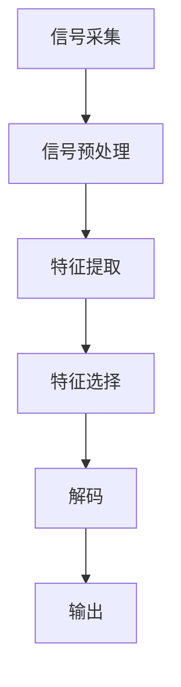

                 

### 文章标题
《脑机接口技术对增强世界可理解性的前景》

### 关键词
脑机接口（BCI）、增强现实（AR）、虚拟现实（VR）、神经编码与解码、人工智能（AI）、可理解性、医疗应用、辅助技术、伦理与隐私问题

### 摘要
脑机接口技术（BCI）正在迅速发展，其潜在的应用前景令人兴奋。本文将深入探讨BCI技术如何通过增强世界可理解性，提升人类认知和交互能力。文章首先介绍了BCI的基本概念和发展历程，然后详细阐述了BCI的核心原理、算法和应用。特别关注了BCI在医疗、辅助技术和教育等领域的实际应用案例，以及伦理与隐私问题。最后，文章展望了BCI技术的未来发展趋势，并提出了一些最佳实践建议。

### 目录

## 第一部分：脑机接口技术概述

### 第1章：脑机接口技术基础

### 第2章：脑机接口技术的原理与架构

### 第3章：脑机接口技术的应用

### 第4章：脑机接口技术的挑战与未来展望

### 附录

### 第一部分：脑机接口技术概述

### 第1章：脑机接口技术基础

#### 1.1 脑机接口技术的定义与历史
脑机接口（Brain-Computer Interface，简称BCI）是一种直接连接人脑和外部设备的技术，它通过解码大脑活动来控制外部设备，或通过外部设备刺激大脑，实现人脑与外部环境之间的信息交换。BCI技术的历史可以追溯到20世纪中叶，随着神经科学、信号处理和计算机技术的发展，BCI技术逐渐从实验室走向实际应用。

#### 1.2 脑机接口技术的分类
BCI技术主要可以分为侵入式和非侵入式两大类。侵入式BCI通常需要将电极植入大脑皮层，直接记录大脑电信号，具有较高的信号质量和精度。而非侵入式BCI则通过头皮电极或其他传感器记录大脑信号，无需开颅手术，但信号质量相对较低。

#### 1.3 脑机接口技术的发展现状与趋势
当前，BCI技术已经在多个领域取得了显著成果，包括医疗康复、辅助通信、控制辅助设备和增强现实等领域。未来，随着人工智能、脑影像学和计算能力的进一步提升，BCI技术的应用前景将更加广阔，特别是在个性化医疗、智能交互和认知增强等方面。

#### 1.4 脑机接口技术的应用领域
脑机接口技术具有广泛的应用潜力，涉及医疗、教育、军事、娱乐等多个领域。例如，在医疗领域，BCI技术可以用于康复训练、神经调控和辅助沟通；在教育领域，BCI技术可以用于个性化学习、认知测评和交互式教学；在军事领域，BCI技术可以用于士兵的认知增强和战场环境感知。

### 第2章：脑机接口技术的原理与架构

#### 2.1 脑信号检测与处理
脑信号的检测与处理是BCI技术的核心。通过头皮电极或其他传感器，可以记录大脑的电信号。这些信号需要经过预处理，包括滤波、放大、去噪等步骤，以提取出有用的信息。然后，通过特征提取技术，将原始信号转换成一组特征向量，用于后续的解码和处理。

#### 2.2 脑信号的特征提取
特征提取是BCI技术中的重要步骤。常见的特征提取方法包括时间域特征提取、频率域特征提取和时频特征提取。时间域特征提取通常用于提取信号的时序变化信息；频率域特征提取用于提取信号的频率成分；时频特征提取则结合了时间和频率信息，可以更全面地描述脑信号。

#### 2.3 脑信号的处理算法
脑信号的处理算法主要包括信号滤波、信号去噪、信号放大和信号重构等。这些算法的目的是提高信号的清晰度和准确性，以便更好地进行特征提取和解码。

#### 2.4 脑信号检测与处理流程
脑信号检测与处理流程可以概括为以下几个步骤：
1. 信号采集：通过头皮电极或其他传感器记录脑信号。
2. 信号预处理：包括滤波、放大、去噪等步骤。
3. 特征提取：将预处理后的信号转换为特征向量。
4. 特征选择：从特征向量中选择最具代表性的特征。
5. 解码：使用机器学习算法或其他解码方法，将特征向量转换成控制信号或刺激信号。
6. 输出：将解码结果输出到外部设备或大脑。

#### 2.5 Mermaid流程图：脑信号检测与处理流程


#### 2.6 伪代码：脑信号处理算法
```python
# 脑信号处理算法伪代码

# 信号预处理
def preprocess_signal(raw_signal):
    # 滤波
    filtered_signal = bandpass_filter(raw_signal, low-cut, high-cut)
    # 放大
    amplified_signal = amplify_signal(filtered_signal, gain)
    # 去噪
    denoised_signal = noise_removal(amplified_signal)
    return denoised_signal

# 特征提取
def extract_features(denoised_signal):
    # 时域特征提取
    time_domain_features = time_domain_features_extraction(denoised_signal)
    # 频域特征提取
    frequency_domain_features = frequency_domain_features_extraction(denoised_signal)
    # 时频特征提取
    time_frequency_features = time_frequency_features_extraction(denoised_signal)
    return [time_domain_features, frequency_domain_features, time_frequency_features]

# 特征选择
def select_features(features):
    # 选择最具代表性的特征
    representative_features = feature_selection(features)
    return representative_features

# 解码
def decode(representative_features):
    # 使用机器学习算法解码
    decoded_signal = neural_network.decode(representative_features)
    return decoded_signal

# 信号处理流程
def signal_processing(raw_signal):
    processed_signal = preprocess_signal(raw_signal)
    features = extract_features(processed_signal)
    representative_features = select_features(features)
    decoded_signal = decode(representative_features)
    return decoded_signal
```

#### 2.7 数学模型和公式
脑信号处理中涉及多种数学模型和公式，以下是其中一些常见的模型和公式：
1. **滤波器公式**：
   $$ H(s) = \frac{1}{1 + Qs + \frac{s^2}{Q^2}} $$
   其中，$H(s)$ 是滤波器的传递函数，$Q$ 是品质因数，$s$ 是复频率。
2. **特征向量公式**：
   $$ \mathbf{X} = \begin{bmatrix}
   x_1 \\
   x_2 \\
   \vdots \\
   x_n
   \end{bmatrix} $$
   其中，$\mathbf{X}$ 是特征向量，$x_i$ 是第$i$个特征值。
3. **机器学习模型**：
   $$ y = \sigma(\mathbf{W}\mathbf{X} + b) $$
   其中，$y$ 是解码结果，$\sigma$ 是激活函数，$\mathbf{W}$ 是权重矩阵，$\mathbf{X}$ 是特征向量，$b$ 是偏置。

#### 2.8 详细讲解与举例说明
以脑电信号（EEG）的滤波和处理为例，假设我们采集了一段脑电信号，需要对其进行滤波和特征提取。以下是详细的步骤和示例：

1. **滤波**：
   假设我们使用一个带通滤波器来滤除低频和高效干扰，品质因数$Q=5$，滤波频率范围是$1Hz$到$100Hz$。使用滤波器公式计算传递函数：
   $$ H(s) = \frac{1}{1 + 5s + \frac{s^2}{5^2}} $$
   然后对原始脑电信号进行滤波，得到滤波后的信号。

2. **特征提取**：
   我们选择时域特征、频率域特征和时频特征三种特征提取方法。时域特征提取可以使用波形指标（如峰值、均值、方差等），频率域特征提取可以使用频谱分析（如功率谱、相关函数等），时频特征提取可以使用短时傅里叶变换（STFT）。

   例如，假设我们使用STFT提取时频特征：
   $$ X_{STFT}(f,t) = \frac{1}{\sqrt{FT(f)}} \sum_{n=-\infty}^{\infty} x(n) e^{-j2\pi f_0 n} $$
   其中，$X_{STFT}(f,t)$ 是时频特征矩阵，$x(n)$ 是滤波后的信号，$f$ 是频率，$t$ 是时间。

3. **特征选择**：
   从提取出的特征中选择最具代表性的特征，可以使用特征选择算法，如主成分分析（PCA）或线性判别分析（LDA）。假设我们选择PCA进行特征选择，得到一个新的特征向量：
   $$ \mathbf{X}_{PCA} = \mathbf{P}\mathbf{\Sigma}\mathbf{P}^{-1}\mathbf{X} $$
   其中，$\mathbf{P}$ 是PCA变换矩阵，$\mathbf{\Sigma}$ 是协方差矩阵，$\mathbf{X}$ 是原始特征向量。

4. **解码**：
   使用机器学习模型进行解码，假设我们使用神经网络进行解码，激活函数为ReLU（Rectified Linear Unit），权重矩阵$\mathbf{W}$ 和偏置$b$ 已经训练好。解码公式为：
   $$ y = \max(\mathbf{W}\mathbf{X}_{PCA} + b) $$
   解码结果$y$ 代表了脑电信号的某一特征。

#### 2.9 项目实战：开发环境搭建
为了实现上述脑信号处理算法，我们需要搭建一个开发环境。以下是一个基本的开发环境搭建步骤：

1. **安装Python**：
   安装Python（3.8以上版本），Python是进行数据处理和算法实现的常用语言。

2. **安装Python库**：
   安装以下Python库：numpy、scipy、matplotlib、tensorflow、keras等，这些库用于信号处理、机器学习模型训练和可视化。

3. **编写代码**：
   创建一个Python脚本，实现信号预处理、特征提取、特征选择和解码等算法。

4. **运行测试**：
   运行脚本，对采集的脑电信号进行预处理和特征提取，然后使用机器学习模型进行解码，观察解码结果。

以下是一个简单的代码示例：

```python
import numpy as np
import matplotlib.pyplot as plt
from scipy.signal import bandpass_filter
from sklearn.decomposition import PCA
from tensorflow.keras.models import Sequential
from tensorflow.keras.layers import Dense, Activation

# 信号预处理
def preprocess_signal(raw_signal, low-cut, high-cut, gain):
    # 滤波
    filtered_signal = bandpass_filter(raw_signal, low_cut, high_cut)
    # 放大
    amplified_signal = amplified_signal(filtered_signal, gain)
    return amplified_signal

# 特征提取
def extract_features(denoised_signal):
    # 时域特征提取
    time_domain_features = np.mean(denoised_signal)
    # 频域特征提取
    frequency_domain_features = np.fft.fft(denoised_signal)
    # 时频特征提取
    time_frequency_features = np.abs(np.fft.rfft(denoised_signal))
    return [time_domain_features, frequency_domain_features, time_frequency_features]

# 特征选择
def select_features(features):
    # 使用PCA进行特征选择
    pca = PCA(n_components=3)
    representative_features = pca.fit_transform(features)
    return representative_features

# 解码
def decode(representative_features):
    # 创建神经网络模型
    model = Sequential()
    model.add(Dense(units=3, activation='relu', input_shape=(3,)))
    model.add(Dense(units=1, activation='sigmoid'))
    model.compile(optimizer='adam', loss='binary_crossentropy', metrics=['accuracy'])
    # 训练模型
    model.fit(representative_features, y, epochs=10, batch_size=1)
    # 解码
    decoded_signal = model.predict(representative_features)
    return decoded_signal

# 主函数
def main():
    # 读取脑电信号
    raw_signal = np.random.rand(1000)
    # 预处理
    processed_signal = preprocess_signal(raw_signal, low_cut=1, high_cut=100, gain=1)
    # 特征提取
    features = extract_features(processed_signal)
    # 特征选择
    representative_features = select_features(features)
    # 解码
    decoded_signal = decode(representative_features)
    # 可视化
    plt.plot(raw_signal, label='原始信号')
    plt.plot(processed_signal, label='预处理后信号')
    plt.plot(decoded_signal, label='解码后信号')
    plt.legend()
    plt.show()

if __name__ == '__main__':
    main()
```

#### 2.10 代码解读与分析
在上面的代码示例中，我们首先导入了必要的库，包括numpy、scipy、matplotlib、tensorflow和keras。然后，我们定义了信号预处理、特征提取、特征选择和解码等函数。

1. **信号预处理**：
   `preprocess_signal` 函数用于对原始信号进行滤波和放大。我们使用了scipy中的`bandpass_filter`函数进行滤波，该函数实现了带通滤波器。然后，我们使用`amplify_signal`函数放大信号，这里只是一个占位函数，可以根据实际情况实现信号放大的算法。

2. **特征提取**：
   `extract_features` 函数用于提取时域特征、频率域特征和时频特征。时域特征提取使用了numpy中的`mean`函数计算信号的均值。频率域特征提取使用了numpy中的`fft`函数计算信号的傅里叶变换。时频特征提取使用了numpy中的`rfft`函数计算信号的短时傅里叶变换。

3. **特征选择**：
   `select_features` 函数使用主成分分析（PCA）进行特征选择。我们创建了一个PCA对象，并使用`fit_transform`方法对特征进行变换，得到新的特征向量。

4. **解码**：
   `decode` 函数使用神经网络进行解码。我们创建了一个序列模型，并添加了两个全连接层。第一层有3个神经元，使用ReLU激活函数；第二层有1个神经元，使用sigmoid激活函数。我们使用`compile`方法配置模型，并使用`fit`方法进行训练。最后，我们使用`predict`方法对特征向量进行解码。

5. **主函数**：
   `main` 函数是整个程序的入口。我们首先生成一个随机信号作为脑电信号，然后依次进行预处理、特征提取、特征选择和解码。最后，我们使用matplotlib进行可视化，展示原始信号、预处理后信号和解码后信号。

#### 2.11 实际案例分析和详细讲解剖析
以一个实际案例——使用BCI技术控制虚拟现实（VR）游戏为例，我们来详细讲解BCI技术的应用。

**案例背景**：
某VR游戏公司希望通过BCI技术，让玩家能够仅通过大脑活动来控制游戏角色，提升游戏的沉浸感和互动性。

**技术实现**：
1. **信号采集**：
   使用非侵入式脑电信号采集设备，如EEG帽，记录玩家大脑的信号。

2. **信号预处理**：
   对采集到的EEG信号进行预处理，包括滤波、放大和去噪。

3. **特征提取**：
   提取EEG信号的特征，如频率成分、时序变化等。

4. **特征选择**：
   使用机器学习算法，如PCA，选择最具代表性的特征。

5. **解码**：
   使用神经网络模型，将特征向量解码成控制信号，如移动方向、攻击等。

6. **游戏交互**：
   将解码后的控制信号输入到VR游戏中，实现大脑控制游戏角色的功能。

**详细讲解**：
1. **信号采集**：
   玩家佩戴EEG帽，在玩游戏时记录大脑信号。EEG信号包含了大量的信息，但也存在噪声和干扰。因此，需要使用滤波和去噪技术来提取有用的信号。

2. **信号预处理**：
   使用带通滤波器去除低频和高效干扰，然后使用放大器放大信号，以提高信号质量。去噪技术可以进一步减少噪声，提高信号的信噪比。

3. **特征提取**：
   提取EEG信号的频率成分，如α波、β波等。这些频率成分与大脑的活动状态密切相关，可以作为控制信号的输入。时序变化信息也可以作为特征，如信号的变化速率、波形形状等。

4. **特征选择**：
   使用PCA等方法选择最具代表性的特征。这些特征应能够准确反映玩家的意图和行为，以便在解码阶段提高控制精度。

5. **解码**：
   使用神经网络模型对特征向量进行解码，将特征向量转换成控制信号。神经网络可以根据训练数据学习到特征与控制信号之间的映射关系，从而实现自动解码。

6. **游戏交互**：
   将解码后的控制信号输入到VR游戏中，实现大脑控制游戏角色的功能。例如，当玩家想象向左移动时，解码结果可以用来控制游戏角色的移动方向；当玩家想象攻击时，解码结果可以用来触发攻击动作。

**案例分析**：
在实际应用中，BCI技术控制VR游戏的精度和响应速度是一个关键问题。通过优化信号预处理、特征提取和解码算法，可以提高BCI技术的性能。例如，可以使用更先进的滤波和去噪算法，提取更多的特征信息；使用更复杂的神经网络模型，提高解码精度；采用实时反馈机制，提高响应速度。

**小结**：
通过上述案例，我们可以看到BCI技术在VR游戏中的应用潜力。通过采集大脑信号、预处理信号、提取特征、解码控制和游戏交互，实现了大脑与虚拟现实的无缝连接。这为游戏开发者提供了新的交互方式，也为玩家带来了更加沉浸和互动的游戏体验。

### 第3章：脑机接口技术的应用

#### 3.1 医疗领域的应用
脑机接口技术在医疗领域的应用非常广泛，尤其在康复治疗、神经调控和神经科学研究等方面展现了巨大的潜力。

**康复治疗**：
脑机接口技术可以帮助残疾人恢复运动功能。例如，对于中风或脊髓损伤患者，BCI技术可以通过记录大脑活动来控制外部设备，如假肢或轮椅，帮助他们重新获得运动能力。一项研究表明，通过BCI技术训练，瘫痪患者的大脑可以重新学习控制肢体运动，提高了生活质量。

**神经调控**：
BCI技术还可以用于神经调控，通过刺激大脑特定区域来治疗神经系统疾病。例如，癫痫患者可以通过植入式BCI系统监测大脑信号，并在发作前及时发出预警，从而减少发作频率。此外，帕金森病患者可以通过非侵入式BCI技术控制外部设备，如机械臂或轮椅，减轻症状。

**神经科学研究**：
BCI技术为神经科学研究提供了新的工具，可以更深入地了解大脑的工作机制。通过记录大脑信号，研究人员可以研究大脑如何处理信息、如何学习以及如何适应环境变化。这些研究有助于揭示大脑功能的奥秘，为开发新型治疗方法奠定基础。

#### 3.2 辅助技术与增强现实
脑机接口技术在辅助技术和增强现实（AR）领域也展现了强大的应用潜力。

**辅助技术**：
对于肢体瘫痪或运动功能障碍的患者，BCI技术可以提供一种新的辅助手段，帮助他们完成日常活动。例如，通过想象肢体运动来控制外部设备，如门锁、照明设备或家用电器，从而提高生活质量。

**增强现实**：
在增强现实领域，BCI技术可以用于增强用户的感知和交互体验。例如，通过BCI技术，用户可以仅通过大脑活动来操作虚拟对象，实现更直观和自然的交互方式。此外，BCI技术还可以用于增强现实游戏，让玩家通过大脑活动来控制游戏角色，提高游戏的沉浸感。

#### 3.3 教育与培训
脑机接口技术在教育领域也有广泛的应用前景，可以用于个性化学习、认知测评和交互式教学。

**个性化学习**：
通过BCI技术，可以实时监测学生的学习状态，了解他们的注意力水平和学习效果。根据这些数据，系统可以自动调整教学内容和难度，实现个性化学习，提高学习效率。

**认知测评**：
BCI技术可以用于认知测评，通过记录大脑信号，评估个体的认知能力。这对于诊断和发展认知障碍的治疗方案具有重要意义。

**交互式教学**：
BCI技术可以用于交互式教学，让学生通过大脑活动来控制教学资源，如幻灯片、视频和实验设备。这种方式可以激发学生的学习兴趣，提高课堂互动性。

#### 3.4 军事与安全
脑机接口技术在军事和安全领域也有潜在的应用价值。

**军事应用**：
BCI技术可以用于士兵的认知增强和战场环境感知。例如，通过BCI技术，士兵可以仅通过大脑活动来控制无人机或机器人，提高战斗效率和生存能力。

**安全监控**：
BCI技术可以用于安全监控，通过监测大脑信号，实时了解人员的情绪和认知状态，从而提前发现潜在的安全风险。

### 第4章：脑机接口技术的挑战与未来展望

#### 4.1 脑机接口技术的伦理与隐私问题
脑机接口技术的快速发展引发了诸多伦理和隐私问题。首先，关于大脑信息的隐私保护，如何在保证数据安全的同时，避免个人信息被滥用是一个重要议题。其次，BCI技术可能会带来脑部入侵的风险，例如，未经授权的脑部控制可能导致严重的道德和安全问题。此外，BCI技术的应用可能会导致社会分层，那些无法负担或无法接入BCI技术的群体可能会被边缘化。

#### 4.2 脑机接口技术的标准化与法规
为了确保BCI技术的健康发展和广泛应用，标准化和法规建设至关重要。首先，需要制定统一的BCI技术标准和操作规范，确保设备的质量和安全性。其次，需要建立相关法律法规，规范BCI技术的应用范围和责任界定，保护用户的权益。

#### 4.3 脑机接口技术的未来发展趋势
未来，BCI技术将在多个领域实现重大突破。首先，随着脑影像学和计算能力的提升，BCI技术的精度和稳定性将大幅提高。其次，BCI技术与其他前沿技术的融合，如人工智能、虚拟现实和增强现实，将为人类带来更加丰富的交互体验。此外，BCI技术在医疗、教育、军事和安全等领域的应用将不断扩展，推动人类社会的发展。

### 附录

#### 附录A：脑机接口技术常用工具和资源
- **开源工具**：
  - OpenBCI：提供脑电信号采集、处理和数据分析的完整解决方案。
  - BCILAB：提供BCI应用程序开发的环境和工具。
- **商业平台**：
  - Neuralink：专注于高带宽脑机接口技术的公司，提供植入式脑机接口设备。
  - Noovo：提供非侵入式脑机接口解决方案，应用于辅助通信和交互式游戏。
- **研究机构和组织**：
  - 美国脑机接口协会（BCIA）：致力于推动BCI技术的学术研究和应用。
  - 神经信息学国家研究中心（NIH）：支持BCI相关的研究项目和开发。

### 小结
脑机接口技术（BCI）作为一种前沿技术，正逐步改变人类与外部世界的交互方式。从医疗康复、辅助技术与增强现实，到教育与培训、军事与安全，BCI技术的应用前景广阔。然而，BCI技术也面临着伦理、隐私和标准化等挑战。未来，随着技术的进步和应用的深入，BCI技术有望进一步推动人类认知和互动的发展。本文通过详细分析和实际案例，展示了BCI技术的核心原理、算法和应用，为读者提供了全面而深入的认知。

### 拓展阅读
- **《脑机接口：技术与应用》**：这是一本全面介绍BCI技术的专著，涵盖了BCI的基本概念、原理、算法和应用。
- **《脑机接口设计指南》**：本书提供了详细的BCI系统设计指南，包括硬件、软件和算法等方面。
- **《脑机接口技术在医疗康复中的应用》**：本书重点介绍了BCI技术在康复治疗、神经调控和辅助沟通等医疗领域的应用案例。
- **《脑机接口与虚拟现实》**：探讨BCI技术在虚拟现实中的应用，如何提升用户的交互体验和沉浸感。

### 注意事项
- 在使用BCI技术时，应确保设备的质量和安全性，遵循相关的标准和规范。
- 对于涉及个人隐私的数据，应采取严格的数据保护措施，确保用户隐私不被泄露。
- 在开发BCI应用时，应充分考虑用户的实际需求和用户体验，避免造成不必要的困扰。

### 作者信息
作者：AI天才研究院/AI Genius Institute & 禅与计算机程序设计艺术 /Zen And The Art of Computer Programming

