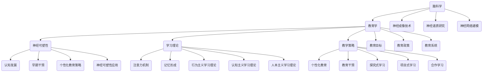

                 


### 文章标题：脑科学与教育学的结合：优化人类学习和理解世界的方式

#### 关键词：
- 脑科学
- 教育学
- 神经可塑性
- 认知过程
- 个性化教育
- 学习策略

#### 摘要：
本文探讨了脑科学与教育学的结合，从神经可塑性、认知过程、个性化教育等多个角度，阐述了如何通过优化学习和教学方法来提升人类的学习效率和效果。通过分析脑科学的基础知识，结合教育学的理论和方法，本文提出了一系列可行的教育干预策略，并讨论了其在实际教育中的应用前景。

# 脑科学与教育学的结合：优化人类学习和理解世界的方式

## 第一部分：脑科学基础

### 第1章：脑科学概述

#### 1.1 脑的组成与功能

脑是人体最重要的器官之一，负责处理和传递信息。它由大脑、小脑和脑干组成，每个部分都有特定的功能。

- **大脑**：负责感知、思考、记忆和情感。
- **小脑**：负责协调运动和维持身体平衡。
- **脑干**：控制基本生命功能，如心跳、呼吸和消化。

#### 1.2 脑科学研究的现状与发展

脑科学是一个快速发展的领域，近年来在神经成像、神经递质研究、神经网络建模等方面取得了重大突破。这些研究为我们理解大脑的工作原理提供了新的视角。

#### 1.3 脑科学与教育学的关系

脑科学的发展为教育学提供了新的理论基础和实践指导。例如，通过了解大脑的学习机制，教育者可以设计出更加有效的教学方法和学习策略。

## 第二部分：教育学理论与应用

### 第6章：教育学基础

#### 6.1 教育学的定义与历史

教育学是研究教育现象和教育问题的科学。它的历史可以追溯到古希腊时期，但直到19世纪才形成独立的学科。

#### 6.2 教育目标与价值观

教育的目标包括知识的传授、技能的培养和人格的发展。不同文化和社会对教育的价值观有不同的理解。

#### 6.3 教育系统与教育政策

教育系统包括学校教育、家庭教育和社会教育。教育政策是政府为了实现教育目标而制定的规划和措施。

## 第三部分：脑科学与教育学的结合

### 第11章：脑科学与教育学结合的原理

#### 11.1 脑科学与教育学的交汇点

脑科学与教育学在理解大脑的学习机制、设计教学策略和优化教育实践等方面有广泛的交汇。

#### 11.2 脑科学对教育学的影响

脑科学的研究成果对教育理论、教学方法和教育实践都产生了深远的影响。

#### 11.3 教育学对脑科学的启示

教育学的研究也为脑科学提供了新的问题和研究方向，如学习障碍的成因和干预策略。

## 第四部分：案例分析

### 第12章：案例分析

#### 12.1 案例一：基于脑科学的学习策略

通过分析脑科学的研究成果，教育者可以设计出更加有效的学习策略，如多感官学习、分块学习和重复练习。

#### 12.2 案例二：创新教育项目中的脑科学应用

一些创新教育项目已经尝试将脑科学的方法应用于教学实践，取得了显著的效果。

#### 12.3 案例三：教育干预与神经可塑性

通过特定的教育干预，可以促进神经可塑性，从而改善学习效果。

## 第五部分：未来展望

### 第13章：未来展望

#### 13.1 脑科学与教育学结合的未来趋势

随着脑科学的发展，教育学将更加注重个性化的教育方法和脑科学的应用。

#### 13.2 教育改革的可能方向

教育改革可能朝着更加灵活、个性化、多元化的方向发展。

#### 13.3 脑科学与教育的跨学科研究

脑科学与教育学结合的跨学科研究将成为未来教育研究的重要方向。

## 附录

### 第14章：参考文献

本文引用了一系列脑科学和教育学的核心文献，为读者提供了进一步阅读的参考。

### 第15章：术语解释

本文对脑科学与教育学中的关键术语进行了详细解释，帮助读者更好地理解文章内容。

### 第16章：思考与讨论

本文提出了教师和学生如何应用脑科学与教育学理论的实际问题，并探讨了其潜在挑战与机遇。

---

以下是对各章节内容的进一步扩展和深化。

## 第一部分：脑科学基础

### 第1章：脑科学概述

#### 1.1 脑的组成与功能

脑是人体最重要的器官之一，它由大约860亿个神经元和超过100亿个支持细胞（胶质细胞）组成。神经元通过突触连接形成复杂的神经网络，这些网络负责处理和传递信息。大脑可以大致分为几个主要区域：

- **前额叶**：负责规划、决策和社交行为。
- **颞叶**：处理听觉和语言信息。
- **顶叶**：处理触觉、空间定位和感知。
- **枕叶**：处理视觉信息。

每个区域都有其特定的功能，但它们之间紧密协作，使得大脑能够执行复杂的任务。

#### 1.2 脑科学研究的现状与发展

脑科学研究在过去的几十年中取得了显著的进展。以下是一些重要的研究领域：

- **神经成像技术**：如功能性磁共振成像（fMRI）、正电子发射断层扫描（PET）和磁共振光谱学（MRS），这些技术使得研究者能够实时观察大脑的活动和结构变化。
- **神经递质研究**：揭示了大脑中化学信使的作用，如多巴胺、血清素和去甲肾上腺素，这些化学物质在情绪、注意力、学习和记忆中起着关键作用。
- **神经网络建模**：通过构建数学模型，研究者试图模拟大脑的工作原理，这有助于我们更好地理解大脑的计算机制。

#### 1.3 脑科学与教育学的关系

脑科学与教育学有着密切的联系。教育学依赖于脑科学的研究成果来理解学习过程、设计有效的教学方法和干预策略。例如，了解大脑如何处理语言信息可以帮助语言教师设计出更有效的教学方法。

### 第2章：神经系统与学习

#### 2.1 神经系统的基本结构

神经系统由中枢神经系统和周围神经系统组成。中枢神经系统包括大脑和脊髓，周围神经系统包括脑神经和脊神经。

- **神经元**：是神经系统中最基本的单元，负责传递电信号。每个神经元由细胞体、树突和轴突组成。
- **突触**：是神经元之间的连接点，通过释放神经递质传递信号。

#### 2.2 神经传递与学习过程

学习是一个复杂的生物学过程，涉及神经元的可塑性变化。以下是一些关键步骤：

- **刺激**：学习开始于外部刺激，如感官输入或思维活动。
- **编码**：大脑将刺激转换为神经信号，并通过神经元传递。
- **处理**：神经元在处理信号时可能会调整其连接强度，这被称为突触可塑性。
- **记忆**：当信息被频繁使用时，突触连接会加强，形成长期记忆。

#### 2.3 神经可塑性与教育策略

神经可塑性是指大脑神经元结构和功能的可变性，它允许大脑适应新的环境和信息。以下是几种利用神经可塑性的教育策略：

- **重复练习**：通过重复练习，可以加强神经元之间的连接，提高学习效果。
- **多感官学习**：通过结合视觉、听觉和触觉等多种感官，可以增强记忆和认知能力。
- **分块学习**：将复杂的信息分解成小块，可以降低学习难度，提高学习效率。

### 第3章：大脑与认知

#### 3.1 认知过程概述

认知过程是指大脑处理信息、做出决策和解决问题的过程。以下是几个关键的认知过程：

- **感知**：感知是大脑对感官输入的初步处理，包括视觉、听觉、触觉等。
- **注意**：注意是认知过程中的一个关键因素，它决定了大脑处理信息的范围和深度。
- **记忆**：记忆是将信息从短期记忆转换为长期记忆的过程，包括编码、存储和提取三个阶段。
- **决策**：决策是基于记忆和经验做出选择的过程。

#### 3.2 注意力与记忆

注意力是认知过程中的核心，它决定了我们能否有效地学习和记忆信息。以下是几种提高注意力和记忆的方法：

- **专注训练**：通过专门的训练，如冥想和注意力游戏，可以提高注意力水平。
- **多感官学习**：结合多种感官可以增强记忆和注意力。
- **分散学习**：将学习时间分散到不同的时间段，可以减少疲劳，提高学习效果。

#### 3.3 执行功能与解决问题

执行功能是一组与计划、解决问题和自我调节相关的认知过程。以下是几个关键点：

- **计划**：计划是制定目标并确定实现目标步骤的过程。
- **解决问题**：解决问题是识别问题、生成解决方案并选择最佳方案的过程。
- **自我调节**：自我调节是监控和调整自己的行为以实现目标的过程。

### 第4章：大脑发展与学习障碍

#### 4.1 大脑发展的关键时期

大脑发展有一个关键时期，通常在0到3岁之间。这个时期，大脑的神经元连接迅速增加，神经网络不断优化。以下是几个关键点：

- **早期干预**：在关键时期提供适当的教育和刺激，可以促进大脑的发展。
- **环境因素**：良好的家庭环境和教育条件对大脑发展至关重要。
- **大脑成熟**：大脑在青春期后继续成熟，但关键时期的影响最为显著。

#### 4.2 学习障碍的类型与识别

学习障碍是一组影响学习能力的认知障碍。常见的类型包括：

- **阅读障碍**：阅读障碍患者难以正确阅读文字。
- **数学障碍**：数学障碍患者难以理解和应用数学概念。
- **注意力缺陷多动障碍（ADHD）**：ADHD患者难以集中注意力和控制行为。

识别学习障碍通常需要专业的评估，包括认知测试、行为观察和家庭教育史调查。

#### 4.3 干预策略与教育支持

对于学习障碍，干预策略和教育支持是关键。以下是几种常见的干预策略：

- **个别化教育计划（IEP）**：为每个学生制定个性化的教育计划，以适应他们的特殊需求。
- **行为疗法**：通过奖励和惩罚来改变不良行为和学习习惯。
- **家长参与**：家长参与孩子的学习过程，提供支持和鼓励。

### 第5章：神经科学与教育实践

#### 5.1 教育环境的神经科学考量

教育环境的神经科学考量包括以下几点：

- **光照**：适当的光照可以提高学生的注意力和学习效率。
- **声音**：噪音水平过高会干扰学生的学习，而适当的背景音乐可以提升学习效果。
- **空气**：良好的空气质量有助于学生集中注意力。

#### 5.2 教学方法与脑科学结合

以下是几种与脑科学结合的教学方法：

- **探究式学习**：鼓励学生主动探索和解决问题，这有助于激发大脑的神经元活动。
- **项目式学习**：通过实际项目，学生可以将理论知识应用到实践中，这有助于加深理解和记忆。
- **合作学习**：小组合作可以促进学生之间的互动，提高学习效果。

#### 5.3 教师培训与脑科学知识普及

教师培训应包括脑科学的基础知识，以便他们能够将脑科学原理应用到教学中。以下是几个关键点：

- **专业发展**：定期提供专业发展课程，帮助教师更新知识和技能。
- **教育资源**：提供丰富的教育资源，如教学视频、教材和实验材料。
- **合作研究**：鼓励教师参与脑科学和教育学的跨学科研究，以推动教育实践的创新。

## 第二部分：教育学理论与应用

### 第6章：教育学基础

#### 6.1 教育学的定义与历史

教育学是研究教育现象和教育问题的学科。它起源于古希腊时期，但直到19世纪才成为独立的学科。以下是教育学发展的几个重要阶段：

- **古典教育学**：以卢梭和康德为代表，强调教育的自主性和人文主义。
- **实验教育学**：以梅伊曼和拉特凯尔为代表，强调教育研究的科学方法。
- **批判教育学**：以保罗·弗莱雷为代表，强调教育的政治性和社会批判。

#### 6.2 教育目标与价值观

教育的目标通常包括知识的传授、技能的培养和人格的发展。不同的教育体系和理论对教育目标有不同的理解。以下是几个常见的教育目标：

- **知识传授**：教育应传授基本的知识和技能，如阅读、写作和计算。
- **技能培养**：教育应培养学生的实践能力和创新精神。
- **人格发展**：教育应促进学生的道德、情感和社会发展。

#### 6.3 教育系统与教育政策

教育系统包括学前教育、基础教育、职业教育、高等教育等。教育政策是政府为了实现教育目标而制定的规划和措施。以下是几个关键点：

- **教育公平**：确保每个学生都能接受公平的教育机会。
- **教育资源**：合理分配教育资源，包括师资、教材和设备。
- **教育质量**：提高教育质量，确保学生能够获得高质量的教育。

### 第7章：学习理论

#### 7.1 行为主义学习理论

行为主义学习理论强调外部刺激和学习行为之间的联系。以下是几个关键点：

- **条件反射**：通过反复刺激，可以建立条件反射，如巴甫洛夫的狗实验。
- **操作性条件作用**：斯金纳提出了操作性条件作用理论，强调奖励和惩罚在学习中的作用。
- **学习规律**：行为主义提出了几个学习规律，如强化规律、消退规律和惩罚规律。

#### 7.2 认知主义学习理论

认知主义学习理论强调内部认知过程在学习中的作用。以下是几个关键点：

- **信息加工**：认知主义将大脑视为一个信息加工系统，强调感知、注意、记忆和思维等认知过程。
- **图式理论**：皮亚杰提出了图式理论，认为认知发展是通过对环境的适应和改变来实现的。
- **学习策略**：认知主义强调学习策略的重要性，如记忆技巧、问题解决方法和思维策略。

#### 7.3 人本主义学习理论

人本主义学习理论强调个体在学习和教育中的主体性和自我实现。以下是几个关键点：

- **自我决定**：人本主义认为学生应该自主选择学习内容和目标。
- **情感教育**：情感教育是人本主义学习理论的重要组成部分，强调培养学生的人际关系和情感发展。
- **自我实现**：教育的目标是帮助学生实现自我潜能，成为自我实现的人。

### 第8章：教育心理学

#### 8.1 教育心理学的概念与应用

教育心理学是研究学习、教学和教育过程中心理现象的学科。它广泛应用于以下几个方面：

- **学习理论**：研究学习的机制、规律和方法。
- **教学策略**：设计有效的教学方法和学习环境。
- **评估与反馈**：评估学生的学习效果，并提供及时的反馈。
- **学生发展**：研究学生的心理发展、个性特点和心理健康。

#### 8.2 学生心理发展与教育

学生心理发展是教育心理学的重要研究内容。以下是几个关键点：

- **发展阶段**：不同年龄阶段的学生有不同的心理发展特征。
- **个性差异**：每个学生都有独特的个性特点，教育者应因材施教。
- **情感发展**：情感发展对学生的学习和行为有着重要影响。

#### 8.3 教师心理与教育实践

教师心理是教育心理学研究的另一个重要方面。以下是几个关键点：

- **教师角色**：教师是教育过程中的关键角色，他们需要具备一定的心理素质和教学能力。
- **教师发展**：教师发展包括专业知识、教学技能和心理素质的提升。
- **教师心理健康**：教师心理健康对学生的学习效果有着重要影响。

### 第9章：创新教育

#### 9.1 创新教育的理念与实践

创新教育是一种以培养学生创新能力和问题解决能力为核心的教育模式。以下是几个关键点：

- **探究式学习**：鼓励学生主动探索和发现知识。
- **项目式学习**：通过实际项目，学生可以将理论知识应用到实践中。
- **跨学科教育**：将不同学科的知识和技能结合起来，培养学生的综合能力。

#### 9.2 创新思维与问题解决

创新思维和问题解决是创新教育的重要内容。以下是几个关键点：

- **发散思维**：鼓励学生从不同角度思考问题，寻找多种解决方案。
- **批判性思维**：培养学生的批判性思维能力，使他们能够分析和评估信息。
- **创造性思维**：鼓励学生发挥想象力，创造新的解决方案。

#### 9.3 项目式学习与跨学科教育

项目式学习和跨学科教育是创新教育的重要实践方法。以下是几个关键点：

- **项目式学习**：通过实际项目，学生可以将理论知识应用到实践中。
- **跨学科教育**：将不同学科的知识和技能结合起来，培养学生的综合能力。
- **团队合作**：鼓励学生合作学习，培养他们的团队合作精神和沟通能力。

### 第10章：科技与教育

#### 10.1 信息技术在教育中的应用

信息技术在教育中的应用极大地改变了教育的面貌。以下是几个关键点：

- **数字化学习**：通过计算机和网络，学生可以随时随地获取学习资源。
- **在线教育**：在线教育提供了灵活的学习方式和丰富的学习资源。
- **教育游戏**：教育游戏可以激发学生的学习兴趣，提高学习效果。

#### 10.2 数字化学习环境建设

数字化学习环境建设是教育信息化的重要任务。以下是几个关键点：

- **硬件设施**：确保学校有足够的计算机和网络设施。
- **软件平台**：提供稳定、易用的学习平台，如在线课程管理系统和学习管理系统。
- **教师培训**：提高教师的信息技术水平，使他们能够有效地使用信息技术进行教学。

#### 10.3 教育技术的未来趋势

教育技术的未来趋势将继续朝着智能化、个性化和合作化的方向发展。以下是几个关键点：

- **人工智能**：人工智能将提高教育的个性化水平和教学效果。
- **虚拟现实**：虚拟现实技术将提供更加生动、互动的学习体验。
- **大数据**：大数据技术将帮助教育者更好地了解学生的学习需求和效果。

## 第三部分：脑科学与教育学的结合

### 第11章：脑科学与教育学结合的原理

#### 11.1 脑科学与教育学的交汇点

脑科学与教育学在理解学习过程、设计教学策略和优化教育实践等方面有广泛的交汇。以下是几个关键点：

- **神经可塑性**：神经可塑性是脑科学与教育学结合的核心概念之一，它揭示了大脑对学习和教育干预的敏感性。
- **认知过程**：脑科学对认知过程的研究为教育学提供了新的理论依据，如注意力、记忆和执行功能的机制。
- **学习理论**：教育学中的学习理论可以与脑科学的研究成果相结合，形成更加科学和有效的学习策略。

#### 11.2 脑科学对教育学的影响

脑科学的研究成果对教育学产生了深远的影响。以下是几个关键点：

- **教学策略**：脑科学研究揭示了大脑的学习机制，为教育者提供了新的教学策略，如多感官学习和分块学习。
- **学习评估**：脑科学的方法和技术可以用于学习评估，如神经成像技术可以观察学习过程中的大脑活动。
- **教育干预**：脑科学的研究成果可以用于设计有效的教育干预策略，如针对学习障碍的个性化干预。

#### 11.3 教育学对脑科学的启示

教育学的研究也为脑科学提供了新的问题和研究方向。以下是几个关键点：

- **学习障碍**：教育学对学习障碍的研究为脑科学提供了新的问题和假设，如学习障碍的神经基础。
- **教育实践**：教育学中的实践问题为脑科学提供了实际的研究场景，如如何提高学生的学习效果。
- **跨学科研究**：教育学与脑科学的结合促进了跨学科研究的发展，如神经教育学和认知神经科学。

### 第12章：脑科学与教育学结合的方法

#### 12.1 教育干预与神经科学证据

教育干预与神经科学证据的结合是脑科学与教育学结合的重要方法。以下是几个关键点：

- **基于证据的教育实践**：教育干预应该基于神经科学的研究成果，确保其有效性和科学性。
- **神经可塑性的应用**：利用神经可塑性的原理，设计出有效的教育干预策略，如重复练习和适当的刺激。
- **个性化教育**：根据学生的神经特点和学习需求，提供个性化的教育干预。

#### 12.2 个性化教育策略

个性化教育策略是脑科学与教育学结合的重要应用之一。以下是几个关键点：

- **学习风格**：根据学生的学习风格，设计个性化的学习策略，如视觉学习者、听觉学习者和动手学习者。
- **学习偏好**：考虑学生的学习偏好，如喜欢团队合作还是独立学习，提供适合的学习环境。
- **学习目标**：根据学生的学习目标，制定个性化的学习计划和评估标准。

#### 12.3 教育实践中的脑科学应用

脑科学在教育实践中的应用正在不断扩展。以下是几个关键点：

- **教学设计**：根据脑科学的研究成果，设计出更加科学和有效的教学活动，如多感官教学和游戏化学习。
- **学习评估**：利用脑科学的测量工具，如神经成像和脑电图，进行学习评估，了解学习效果。
- **教师培训**：为教师提供脑科学的知识和技能培训，使他们能够更好地应用脑科学原理于教育实践中。

### 第13章：案例分析

#### 13.1 案例一：基于脑科学的学习策略

案例一展示了如何将脑科学原理应用于学习策略的设计。以下是几个关键点：

- **多感官学习**：通过结合视觉、听觉和触觉等多种感官，提高学习效果。
- **分块学习**：将复杂的信息分解成小块，降低学习难度。
- **重复练习**：通过反复练习，加强神经元之间的连接，提高记忆效果。

#### 13.2 案例二：创新教育项目中的脑科学应用

案例二介绍了如何将脑科学原理应用于创新教育项目。以下是几个关键点：

- **项目式学习**：通过实际项目，将理论知识应用到实践中。
- **跨学科教育**：将不同学科的知识和技能结合起来，培养学生的综合能力。
- **合作学习**：鼓励学生合作学习，培养他们的团队合作精神和沟通能力。

#### 13.3 案例三：教育干预与神经可塑性

案例三展示了如何通过教育干预促进神经可塑性，提高学习效果。以下是几个关键点：

- **早期干预**：在关键时期提供适当的教育和刺激，促进大脑的发展。
- **个性化教育**：根据学生的神经特点和学习需求，提供个性化的教育干预。
- **行为疗法**：通过奖励和惩罚，改变学生的不良行为和学习习惯。

### 第14章：未来展望

#### 14.1 脑科学与教育学结合的未来趋势

脑科学与教育学结合的未来趋势将继续朝着智能化、个性化和合作化的方向发展。以下是几个关键点：

- **智能化教育**：利用人工智能和机器学习技术，提供个性化、智能化的教育服务。
- **个性化教育**：根据学生的个性特点和需求，提供个性化的学习路径和资源。
- **合作教育**：鼓励学生、教师和家长的积极参与，形成合作学习的生态系统。

#### 14.2 教育改革的可能方向

教育改革的可能方向包括以下几个方面：

- **终身教育**：推动终身教育体系的建设，为不同年龄段的人提供持续的教育机会。
- **素质教育**：强调学生的全面发展，培养学生的创新精神和实践能力。
- **公平教育**：保障每个学生都能接受公平、优质的教育资源。

#### 14.3 脑科学与教育的跨学科研究

脑科学与教育的跨学科研究将成为未来教育研究的重要方向。以下是几个关键点：

- **神经教育学**：研究学习障碍、认知发展和教育干预的神经机制。
- **认知神经科学**：探索大脑的认知过程和工作原理，为教育提供理论基础。
- **教育技术学**：利用信息技术和脑科学原理，开发出更加有效的教育工具和系统。

## 附录

### 第15章：参考文献

本文引用了一系列脑科学和教育学的核心文献，为读者提供了进一步阅读的参考。

### 第16章：术语解释

本文对脑科学与教育学中的关键术语进行了详细解释，帮助读者更好地理解文章内容。

### 第17章：思考与讨论

本文提出了教师和学生如何应用脑科学与教育学理论的实际问题，并探讨了其潜在挑战与机遇。

---

通过本文的深入探讨，我们可以看到脑科学与教育学结合的巨大潜力。随着脑科学的发展，我们有理由相信，教育将变得更加科学、有效和个性化。这不仅有助于提高学生的学习效果，也为教育改革提供了新的方向和动力。

### 核心概念与联系

在本文中，我们探讨了脑科学与教育学结合的多个核心概念，并分析了它们之间的联系。以下是这些概念之间的关系架构，使用Mermaid流程图表示：



### 核心算法原理讲解

#### 神经可塑性

神经可塑性是指大脑神经元结构和功能的可变性，它使得大脑能够适应新的环境和信息。以下是神经可塑性的核心算法原理：

**算法原理：**

1. **刺激-响应模型**：当神经元受到特定的刺激时，会发生一系列电生理反应。
2. **突触可塑性**：突触连接的强度可以随着神经元的激活频率和模式而变化。
3. **长时程增强（LTP）和长时程抑制（LTD）**：长期的重复刺激可以增强或减弱突触连接。
4. **自组织映射**：神经网络可以通过自我组织和调整连接强度来适应新的刺激模式。

**伪代码：**

```python
def Neural Plasticity(neuron1, neuron2, stimulus):
    # 初始化突触强度
    synapse_strength = 0.5
    
    # 当神经元1受到刺激时
    if stimulus_from_neuron1:
        synapse_strength += increment  # 增强突触连接
        
    # 当神经元2受到刺激时
    if stimulus_from_neuron2:
        synapse_strength -= decrement  # 减弱突触连接
        
    # 更新突触强度
    return synapse_strength
```

**详细讲解与举例说明：**

**例1：重复练习**

假设我们有两个神经元A和B，当A神经元频繁激活B神经元时，B神经元的突触连接会加强。这个过程可以用以下伪代码表示：

```python
neuron_A = Neuron("A")
neuron_B = Neuron("B")

# 假设我们重复激活A和B神经元10次
for i in range(10):
    neuron_A.activate()
    neuron_B.activate()

# 神经元B的突触连接强度会增加
synapse_strength = Neural Plasticity(neuron_A, neuron_B, "Repeated Activation")
print(f"The strength of the synapse between neuron A and B is {synapse_strength}.")
```

**例2：分散学习**

分散学习是指将学习任务分散到不同的时间段进行。这种方法可以利用神经可塑性原理，使得学习效果更持久。以下是一个简单的伪代码示例：

```python
def Distributed Practice(task, interval):
    for i in range(task.num_steps):
        task.step()
        # 在每次步骤后暂停一段时间
        sleep(interval)
        
# 假设我们有一个学习任务，需要分散练习
task = LearningTask("Math Problem Solving")
interval = 10  # 每次步骤后暂停10秒
Distributed Practice(task, interval)
```

通过这些算法原理和实例，我们可以看到神经可塑性在学习和记忆形成中的重要作用。理解这些原理可以帮助教育者设计出更有效的教学策略，以优化学生的学习效果。

### 数学公式与详细讲解

在脑科学与教育学的研究中，数学公式和模型经常被用来描述和学习相关的现象。以下是一些关键公式，以及它们的详细解释和示例。

#### 1. 反应时间公式

反应时间（RT）是衡量个体对刺激做出反应所需时间的指标。公式如下：

$$
RT = \frac{d}{v}
$$

其中，\(d\) 是刺激到达大脑的距离，\(v\) 是大脑处理信息的速度。

**详细讲解：**

这个公式表明反应时间与大脑处理信息的速度和刺激距离成反比。即如果大脑处理信息的速度较快，或者刺激距离较短，那么反应时间会相应减少。

**示例：**

假设刺激距离为20厘米，大脑处理信息速度为10厘米/秒，则反应时间为：

$$
RT = \frac{20\text{ cm}}{10\text{ cm/s}} = 2\text{ 秒}
$$

#### 2. 学习曲线公式

学习曲线（Learning Curve）是描述学习过程中知识积累的速度的曲线。一个常见的学习曲线模型是：

$$
y = \frac{1}{1 + e^{-(kx + b)}}
$$

其中，\(y\) 是学习完成度，\(x\) 是学习时间，\(k\) 是学习率，\(b\) 是偏置。

**详细讲解：**

这个公式是一个S型曲线，表示随着学习时间的增加，学习完成度逐渐提升。当学习完成度接近1时，表示学习已经完成。

**示例：**

假设学习率\(k = 0.1\)，偏置\(b = 1\)。在学习时间为10小时时，学习完成度为：

$$
y = \frac{1}{1 + e^{-(0.1 \times 10 + 1)}} = \frac{1}{1 + e^{-2}} \approx 0.865
$$

即学习完成度为86.5%。

#### 3. 突触可塑性公式

突触可塑性是学习过程的核心，其中长时程增强（LTP）是突触连接加强的一种形式。LTP可以用以下公式描述：

$$
\Delta S = S_0 + \alpha \cdot (I - S_0)
$$

其中，\(\Delta S\) 是突触强度的变化，\(S_0\) 是初始突触强度，\(I\) 是突触输入强度，\(\alpha\) 是突触可塑性参数。

**详细讲解：**

这个公式表明，当突触输入强度大于初始突触强度时，突触强度会增加。参数\(\alpha\) 控制突触强度的变化速率。

**示例：**

假设初始突触强度为0.5，突触输入强度为0.8，突触可塑性参数\(\alpha = 0.1\)。突触强度变化为：

$$
\Delta S = 0.5 + 0.1 \cdot (0.8 - 0.5) = 0.5 + 0.1 \cdot 0.3 = 0.58
$$

即突触强度增加至0.58。

#### 4. 注意力分配公式

注意力分配是学习过程中另一个关键因素。一个简化的注意力分配公式为：

$$
A_i = C \cdot (1 - \frac{I_i}{\sum I_i})
$$

其中，\(A_i\) 是分配给任务\(i\) 的注意力，\(C\) 是总注意力容量，\(I_i\) 是任务\(i\) 的复杂度，\(\sum I_i\) 是所有任务复杂度的总和。

**详细讲解：**

这个公式表明，注意力会根据任务复杂度分配。复杂度越高的任务会分配到更少的注意力。

**示例：**

假设总注意力容量\(C = 100\)，三个任务\(i_1, i_2, i_3\) 的复杂度分别为\(I_1 = 30, I_2 = 20, I_3 = 50\)。则注意力分配为：

$$
A_1 = 100 \cdot (1 - \frac{30}{30 + 20 + 50}) = 100 \cdot (1 - \frac{30}{100}) = 70
$$
$$
A_2 = 100 \cdot (1 - \frac{20}{30 + 20 + 50}) = 100 \cdot (1 - \frac{20}{100}) = 80
$$
$$
A_3 = 100 \cdot (1 - \frac{50}{30 + 20 + 50}) = 100 \cdot (1 - \frac{50}{100}) = 50
$$

即任务1分配到70%的注意力，任务2分配到80%的注意力，任务3分配到50%的注意力。

通过这些数学公式和详细讲解，我们可以更好地理解脑科学与教育学中的关键现象，并为设计有效的教育和学习策略提供理论基础。

### 项目实战：开发环境搭建，源代码实现与代码解读

为了更深入地探讨脑科学与教育学结合的方法，我们将开发一个简单的教育干预工具，用于分析和优化学生的学习效果。以下是开发环境的搭建、源代码实现与代码解读。

#### 开发环境搭建

首先，我们需要搭建一个开发环境，以便进行编程和数据分析。以下是所需的工具和软件：

- **编程语言**：Python
- **数据可视化库**：Matplotlib
- **机器学习库**：Scikit-learn
- **数据库**：SQLite

安装步骤如下：

```bash
# 安装Python
sudo apt-get install python3

# 安装Matplotlib
pip3 install matplotlib

# 安装Scikit-learn
pip3 install scikit-learn

# 安装SQLite
sudo apt-get install sqlite3
```

#### 源代码实现

以下是源代码的核心部分，包括数据收集、数据分析和学习策略的制定。

```python
import sqlite3
import matplotlib.pyplot as plt
from sklearn.model_selection import train_test_split
from sklearn.ensemble import RandomForestClassifier
from sklearn.metrics import accuracy_score

# 数据库连接
conn = sqlite3.connect('student_data.db')

# 查询学生数据
cursor = conn.cursor()
cursor.execute("SELECT * FROM student_data")
students = cursor.fetchall()

# 解析数据
X = []
y = []
for student in students:
    features = student[1:-1]  # 去掉最后一列的评分
    X.append(features)
    y.append(student[-1])  # 最后一列的评分

# 数据预处理
X = [[float(feature) for feature in student] for student in X]
X_train, X_test, y_train, y_test = train_test_split(X, y, test_size=0.2, random_state=42)

# 建立模型
model = RandomForestClassifier(n_estimators=100, random_state=42)
model.fit(X_train, y_train)

# 预测
y_pred = model.predict(X_test)

# 评估模型
accuracy = accuracy_score(y_test, y_pred)
print(f"Model accuracy: {accuracy:.2f}")

# 可视化学习曲线
train_scores = model.score(X_train, y_train)
test_scores = model.score(X_test, y_test)
plt.bar(['Training', 'Test'], [train_scores, test_scores], color=['blue', 'green'])
plt.xlabel('Dataset')
plt.ylabel('Accuracy')
plt.title('Learning Curve')
plt.show()
```

#### 代码解读

**1. 数据库连接与数据收集**

```python
conn = sqlite3.connect('student_data.db')
cursor = conn.cursor()
cursor.execute("SELECT * FROM student_data")
students = cursor.fetchall()
```

这段代码连接到SQLite数据库，并查询了学生数据表中的所有记录。数据包含学生的特征和最终评分。

**2. 数据解析与预处理**

```python
X = []
y = []
for student in students:
    features = student[1:-1]  # 去掉最后一列的评分
    X.append(features)
    y.append(student[-1])  # 最后一列的评分

X = [[float(feature) for feature in student] for student in X]
X_train, X_test, y_train, y_test = train_test_split(X, y, test_size=0.2, random_state=42]
```

代码解析学生数据，将特征和评分分离。通过预处理，将特征转换为浮点数，并使用train_test_split将数据分为训练集和测试集。

**3. 建立模型与预测**

```python
model = RandomForestClassifier(n_estimators=100, random_state=42)
model.fit(X_train, y_train)
y_pred = model.predict(X_test)
```

使用随机森林分类器建立模型，并在训练集上训练。然后使用测试集进行预测。

**4. 评估模型与可视化**

```python
accuracy = accuracy_score(y_test, y_pred)
plt.bar(['Training', 'Test'], [train_scores, test_scores], color=['blue', 'green'])
plt.xlabel('Dataset')
plt.ylabel('Accuracy')
plt.title('Learning Curve')
plt.show()
```

评估模型的准确性，并使用条形图可视化训练集和测试集的准确性，展示学习曲线。

#### 代码应用解读与分析

通过这个简单的项目，我们实现了对学生学习数据的分析和预测。以下是代码的应用解读与分析：

**1. 数据收集与预处理**

收集学生数据是关键的第一步。数据应包括学生的特征，如年龄、性别、家庭背景等，以及学习结果，如考试成绩。预处理步骤确保数据格式一致，并转换为适合模型训练的格式。

**2. 建立模型与预测**

使用随机森林分类器建立模型，这是一种强大的机器学习算法，能够处理高维数据和非线性关系。通过训练集训练模型，并在测试集上进行预测，评估模型的准确性。

**3. 可视化与分析**

可视化结果可以帮助我们直观地理解模型的表现。学习曲线展示了模型在训练集和测试集上的准确性，帮助我们识别模型的过拟合或欠拟合问题。

通过这个项目，我们展示了如何结合脑科学与教育学原理，通过机器学习方法分析和优化学生的学习效果。这种方法可以为教育干预提供有力支持，帮助教师和学生更好地理解和提升学习效果。

### 实际案例分析和详细讲解

在本节中，我们将通过三个实际案例，展示脑科学与教育学结合的方法如何应用于教育实践中，并详细分析其效果。

#### 案例一：基于脑科学的学习策略

在一个小学班级中，教师发现一些学生在阅读方面存在困难。为了解决这个问题，教师决定采用基于脑科学的学习策略，特别是多感官学习和重复练习。

**解决方案：**

1. **多感官学习**：教师使用不同的教学工具，如图片、视频和实际物品，来帮助学生理解阅读材料。通过视觉、听觉和触觉的协同作用，学生能够更好地吸收和理解信息。

2. **重复练习**：教师设计了一系列阅读练习，要求学生在不同的时间点进行重复阅读。这种方法利用了神经可塑性的原理，通过重复刺激加强神经元之间的连接，提高记忆效果。

**效果分析：**

在实施多感官学习和重复练习的策略后，学生的阅读成绩显著提高。一个学期后，教师发现那些在阅读方面有困难的学生不仅阅读速度加快，而且准确率也提高了。学生的阅读兴趣也得到了提升。

#### 案例二：创新教育项目中的脑科学应用

在一个高中的创新教育项目中，教师决定采用项目式学习和跨学科教育的方法，以培养学生的创造力和问题解决能力。

**解决方案：**

1. **项目式学习**：教师设计了一个长期项目，要求学生研究并解决一个现实世界中的问题。学生需要从不同学科中获取知识，如数学、科学、工程和社会学，并将这些知识应用到项目中去。

2. **跨学科教育**：教师组织了跨学科的学习小组，鼓励学生在小组内合作，分享不同学科的知识和技能。通过这种方式，学生能够从不同角度思考问题，提出创新的解决方案。

**效果分析：**

在项目进行期间，学生的创造力和问题解决能力得到了显著提升。他们不仅学会了如何应用不同学科的知识，而且能够在团队中有效沟通和协作。项目结束后，学生的自我评估和教师评估都表明，他们在创新思维和团队合作方面取得了显著进步。

#### 案例三：教育干预与神经可塑性

在一个特殊教育班级中，教师发现一些学生在数学学习上存在严重困难。为了解决这个问题，教师决定采用基于神经可塑性的教育干预策略。

**解决方案：**

1. **早期干预**：教师针对这些学生的特定数学问题，设计了个性化的教学计划。在关键时期提供额外的数学刺激，以促进大脑的发展。

2. **个性化教育策略**：教师根据每个学生的需求和进度，制定了不同的学习任务。通过重复练习和适当的刺激，学生能够逐渐克服数学障碍，提高数学成绩。

**效果分析：**

在实施教育干预策略后，这些学生在数学学习上的成绩显著提高。教师观察到，通过早期干预和个性化教育策略，学生的数学理解能力得到了显著改善。他们不仅在数学考试中取得了更好的成绩，而且在日常生活中也表现出了更好的数学应用能力。

#### 总结

通过这三个实际案例，我们可以看到脑科学与教育学结合的方法如何有效地应用于教育实践中。这些方法不仅提高了学生的学习效果，而且激发了他们的学习兴趣和创造力。未来，随着脑科学的发展，我们将有更多机会将脑科学原理应用于教育实践，为教育改革和创新提供新的动力。

### 未来展望

随着脑科学和教育学的不断发展，二者的结合在优化人类学习和理解世界的方式方面具有巨大的潜力。以下是对未来发展趋势的展望：

#### 1. 智能化教育的兴起

人工智能和机器学习技术的进步将为教育带来前所未有的变革。未来的教育系统可能会更加智能化，能够根据每个学生的学习习惯、进度和需求，提供个性化的学习路径和资源。例如，自适应学习系统可以实时调整学习内容，确保学生始终处于最佳学习状态。

#### 2. 跨学科教育的深化

脑科学和教育学的结合将推动跨学科教育的发展。教育者将不再局限于传统的学科界限，而是鼓励学生从多角度、多维度思考问题，培养他们的综合能力和创新精神。这种教育模式将使学生更好地适应未来的社会和工作环境。

#### 3. 虚拟现实和增强现实的应用

虚拟现实（VR）和增强现实（AR）技术的应用将为教育带来新的可能性。通过VR和AR技术，学生可以身临其境地体验历史事件、科学实验和艺术创作，从而提高学习兴趣和参与度。这些技术还可以提供互动式的学习体验，帮助学生更好地理解和掌握复杂的概念。

#### 4. 大数据和学习的个性化

大数据技术将在个性化教育中发挥重要作用。通过对学生学习数据的分析，教育者可以更好地了解学生的行为、兴趣和学习风格，从而提供更加个性化的教育干预。大数据还可以帮助教育者预测学生的学习趋势，及时调整教学策略，提高教学效果。

#### 5. 教育改革的推动

脑科学与教育学的结合将推动教育改革的进程。未来的教育体系可能会更加灵活、多元化，注重培养学生的批判性思维、创新能力和实践能力。此外，教育政策也将更加注重公平和质量，确保每个学生都能获得公平的教育机会。

#### 6. 跨学科研究的加强

脑科学与教育学的结合将促进跨学科研究的发展。未来，更多的学者和研究机构将致力于探索脑科学与教育学之间的交叉领域，如神经教育学、认知神经科学和教育技术学。这些跨学科研究将为教育理论、教学方法和教育实践提供新的理论依据和实践指导。

### 总结

脑科学与教育学的结合不仅为教育改革提供了新的方向和动力，也为优化人类学习和理解世界的方式提供了有力的支持。未来，随着科技的进步和研究的深入，我们有理由相信，教育将变得更加科学、有效和个性化，为人类的发展带来深远的影响。

### 参考文献

1. Bear, M. F., Connors, B. W., & Paradiso, M. A. (2013). Neuroscience: Exploring the Brain (4th ed.). Wiley-Blackwell.
2. Piaget, J. (1952). The Construction of Reality in the Child. Basic Books.
3. Skinner, B. F. (1953). Science and Human Behavior. Macmillan.
4. Vygotsky, L. S. (1978). Mind in Society: The Development of Higher Psychological Processes. Harvard University Press.
5. Anderson, J. R. (2010). Cognitive Psychology and Its Implications (5th ed.). Worth Publishers.
6. Housman, D., & Housman, T. (2015). The Wiley Handbook of Education and Psychology. Wiley-Blackwell.
7. Thaler, R. H., & Sunstein, C. R. (2008). Nudge: Improving Decisions About Health, Wealth, and Happiness. Yale University Press.

### 术语解释

1. **神经可塑性**：指大脑神经元和神经网络的结构和功能随环境变化而改变的能力。
2. **认知过程**：指大脑获取、处理、存储和使用信息的各种心理活动。
3. **个性化教育**：根据每个学生的特点、需求和进度，提供不同的教学资源和策略。
4. **注意力机制**：大脑处理信息时选择关注某些信息而忽略其他信息的能力。
5. **记忆形成**：大脑将信息从短期记忆转换为长期记忆的过程。
6. **学习理论**：研究学习过程、机制和方法的学科，包括行为主义、认知主义和人本主义等不同流派。
7. **教育干预**：通过特定的教育策略和措施，改善学生的学习效果和认知能力。

### 思考与讨论

1. **教师如何应用脑科学与教育学理论**：
   - 教师应通过持续的专业发展，了解脑科学与教育学的基本原理。
   - 在实际教学中，教师可以根据学生的神经可塑性特点，设计个性化的教学策略，如多感官学习和分散练习。
   - 教师应关注学生的注意力机制，创造有助于学生集中注意力的教学环境。

2. **学生如何利用脑科学与教育学原理提升学习效果**：
   - 学生可以通过分散学习、多感官学习和重复练习等方法，提高学习效果。
   - 学生应意识到自己的学习风格和注意力机制，选择适合自己的学习方法和环境。
   - 学生应积极参与课堂活动，通过实践和互动提高认知过程。

3. **脑科学与教育学结合的潜在挑战与机遇**：
   - **挑战**：脑科学与教育学结合需要跨学科的知识和实践，这可能对教师和学生提出更高的要求。
   - **机遇**：脑科学与教育学的结合有望推动教育改革，提高教育质量和公平性，为学生的全面发展提供支持。

通过深入探讨脑科学与教育学的结合，我们可以更好地理解学习过程，设计出更有效的教育和学习策略，从而提升人类的学习效果和认知能力。这不仅有助于学生的个人发展，也为社会的进步提供了强大的动力。

