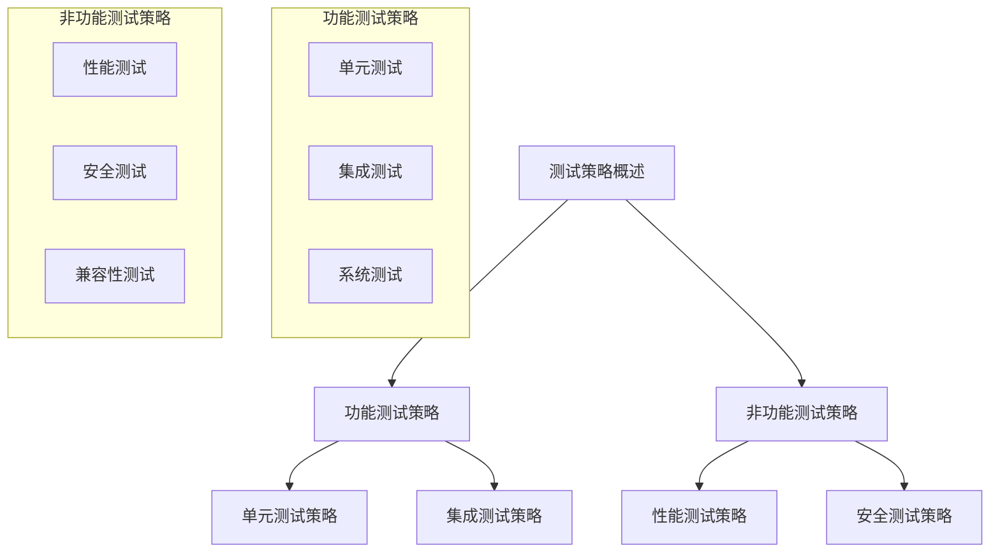

                 

### 文章标题

《自动化测试策略：确保LLM应用质量的关键》

> 关键词：自动化测试，大型语言模型（LLM），测试策略，质量保证，软件工程

> 摘要：本文将探讨自动化测试在确保大型语言模型（LLM）应用质量中的重要性，详细解析自动化测试的基础知识、策略设计、实战应用及最佳实践。通过本文，读者将了解到如何通过高效的自动化测试策略，提升LLM应用的可靠性和稳定性，从而满足日益增长的市场需求。

### 第一部分：自动化测试基础

#### 第1章：自动化测试概述

自动化测试是一种通过预编写的测试脚本和工具自动执行测试过程的方法，其目的是提高软件测试的效率和质量。在本章节中，我们将详细探讨自动化测试的定义与意义、类型、优势与挑战，以及自动化测试的现状与发展趋势。

##### 1.1 自动化测试的定义与意义

自动化测试（Automated Testing）是指使用软件工具自动执行测试用例，以验证软件功能、性能和其他特性的方法。与传统的手动测试相比，自动化测试可以显著提高测试的效率、准确性和一致性。

**意义：**

1. **提高测试效率：**自动化测试可以减少测试周期，缩短软件开发周期，提高市场响应速度。
2. **提升测试质量：**自动化测试减少人为错误，提高测试覆盖度，确保软件质量的稳定性和一致性。
3. **降低成本：**自动化测试可以减少重复劳动，降低人工成本，提高资源利用率。

##### 1.2 自动化测试的类型

自动化测试可以分为以下几种类型：

1. **单元测试（Unit Testing）：**针对软件模块的测试，通常由开发者编写，用于验证模块的功能和逻辑。
2. **集成测试（Integration Testing）：**在单元测试之后，针对多个模块组合的测试，用于验证模块之间的接口和交互。
3. **系统测试（System Testing）：**在整个系统完成后，对整个系统进行全面测试，以验证系统是否满足设计需求和功能要求。
4. **性能测试（Performance Testing）：**对软件系统进行负载测试、压力测试和性能调优，以评估系统的性能表现。
5. **安全测试（Security Testing）：**对软件系统的安全漏洞和潜在风险进行测试，以确保系统的安全性。

##### 1.3 自动化测试的优势与挑战

**优势：**

1. **提高测试效率：**自动化测试可以减少测试时间，提高测试覆盖率。
2. **降低人力成本：**自动化测试可以减少测试人员的工作量，降低人力资源成本。
3. **提高测试质量：**自动化测试减少人为错误，提高测试的一致性和可靠性。
4. **易于回归测试：**自动化测试脚本可以方便地进行回归测试，确保修复问题的同时不引入新的缺陷。

**挑战：**

1. **脚本编写和维护成本高：**自动化测试脚本编写和维护需要一定的技术能力和时间成本。
2. **测试数据管理复杂：**自动化测试需要大量的测试数据支持，测试数据的准备和管理是一项复杂的工作。
3. **测试工具选择和集成：**选择合适的测试工具并进行集成是自动化测试成功的关键，但这也增加了系统的复杂性。

##### 1.4 自动化测试的现状与发展趋势

随着软件开发的不断演进，自动化测试已经成为软件工程领域的重要环节。以下是一些自动化测试的现状和发展趋势：

1. **自动化测试工具的发展：**自动化测试工具越来越智能化，支持多种编程语言和测试框架，提高了测试效率。
2. **人工智能和机器学习在自动化测试中的应用：**利用人工智能和机器学习技术，可以进一步提高自动化测试的覆盖率和准确性。
3. **自动化测试平台的构建：**构建高效的自动化测试平台，实现自动化测试的全过程管理，已成为许多企业的选择。
4. **云测试和移动测试的兴起：**随着云计算和移动应用的普及，云测试和移动测试成为自动化测试的重要方向。
5. **持续集成和持续部署（CI/CD）：**自动化测试与持续集成和持续部署相结合，实现了从开发到生产的无缝连接，提高了软件交付的效率和质量。

#### 第2章：LLM（大型语言模型）概述

大型语言模型（Large Language Model，简称LLM）是一种基于深度学习的自然语言处理模型，具有强大的文本生成、翻译、摘要和推理能力。在本章节中，我们将详细介绍LLM的概念与特点、主要应用场景以及LLM的技术架构。

##### 2.1 LLM的概念与特点

LLM是一种通过对海量文本数据进行训练，学习语言结构和语义信息的深度学习模型。其核心特点包括：

1. **参数规模巨大：**LLM通常包含数十亿甚至数万亿个参数，这使得模型具有强大的语言理解能力。
2. **端到端学习：**LLM通过端到端的学习方式，直接从原始文本数据中学习语言规律，避免了传统自然语言处理方法中的特征工程步骤。
3. **自适应能力：**LLM可以自适应不同领域的文本数据，通过迁移学习，实现跨领域的语言理解和应用。

##### 2.2 LLM的主要应用场景

LLM在自然语言处理领域具有广泛的应用场景，主要包括：

1. **文本生成：**如文章生成、诗歌创作、对话生成等。
2. **机器翻译：**如中英翻译、多语言翻译等。
3. **文本摘要：**如新闻摘要、文档摘要等。
4. **问答系统：**如智能客服、在线咨询等。
5. **文本分类：**如垃圾邮件过滤、情感分析等。
6. **对话系统：**如智能语音助手、聊天机器人等。

##### 2.3 LLM的技术架构

LLM的技术架构主要包括以下几个关键组件：

1. **嵌入层（Embedding Layer）：**将输入的文本转化为固定长度的向量表示。
2. **编码器（Encoder）：**对输入文本进行处理，生成上下文表示。
3. **解码器（Decoder）：**根据编码器生成的上下文表示，生成输出文本。
4. **注意力机制（Attention Mechanism）：**用于捕捉输入文本中的重要信息，提高模型的语言理解能力。
5. **优化器（Optimizer）：**用于调整模型参数，优化模型性能。

通过以上组件的协同工作，LLM可以实现对文本数据的生成、翻译、摘要和推理等任务。

### 第二部分：自动化测试策略设计

#### 第3章：自动化测试策略核心概念与联系

在自动化测试中，测试策略的设计至关重要。一个良好的测试策略可以帮助我们有效地覆盖测试需求，发现潜在的问题，并确保软件质量。在本章节中，我们将详细探讨自动化测试策略的核心概念与联系，包括测试策略的定义与分类、测试策略的Mermaid流程图以及各类测试策略的详细说明。

##### 3.1 测试策略的定义与分类

**定义：**

测试策略（Testing Strategy）是指为了确保软件质量，制定的一系列测试计划、测试方法和测试过程的总体安排。它指导测试活动的执行，确保测试目标得到实现。

**分类：**

根据测试目的和测试对象的不同，测试策略可以分为以下几类：

1. **功能测试策略（Functional Testing Strategy）：**关注软件功能是否符合需求规格说明书，包括单元测试、集成测试、系统测试等。
2. **非功能测试策略（Non-functional Testing Strategy）：**关注软件的非功能性需求，如性能测试、安全测试、兼容性测试等。
3. **自动化测试策略（Automated Testing Strategy）：**关注如何有效地利用自动化测试工具和方法，提高测试效率和质量。

##### 3.2 测试策略的Mermaid流程图

为了更好地理解各类测试策略之间的关系，我们可以使用Mermaid图形工具绘制测试策略的流程图，如下所示：



在上面的流程图中，A表示测试策略的总体概述，B和C分别表示功能测试策略和非功能测试策略。在功能测试策略下，包括单元测试、集成测试和系统测试；在非功能测试策略下，包括性能测试、安全测试和兼容性测试。

##### 3.1.1 测试策略概述

**目的：**测试策略的目的是确保软件质量，满足需求规格说明书的要求。

**内容：**测试策略包括以下内容：

1. **测试目标：**明确测试的目的和目标，如功能完整性、性能指标、安全性等。
2. **测试范围：**确定测试的范围，包括测试的功能模块、性能场景、安全领域等。
3. **测试方法：**选择适合的测试方法，如黑盒测试、白盒测试、灰盒测试等。
4. **测试工具：**选择适合的测试工具，如JUnit、Selenium、LoadRunner等。
5. **测试资源：**分配测试所需的资源，包括测试人员、测试环境、测试数据等。

##### 3.1.2 功能测试策略

**目的：**确保软件的功能正确，满足用户需求。

**类型：**功能测试策略包括以下类型：

1. **单元测试（Unit Testing）：**针对软件模块的测试，验证模块的功能和逻辑。
2. **集成测试（Integration Testing）：**验证模块之间的接口和交互，确保模块组合后的功能正确。
3. **系统测试（System Testing）：**在整个系统完成后，对整个系统进行全面测试，验证系统是否满足设计需求和功能要求。

**过程：**功能测试策略的过程通常包括以下步骤：

1. **需求分析：**分析需求规格说明书，确定测试需求。
2. **测试设计：**设计测试用例，包括输入数据、预期结果和实际结果。
3. **测试执行：**执行测试用例，记录测试结果。
4. **结果分析：**分析测试结果，识别和修复问题。

##### 3.1.3 非功能测试策略

**目的：**确保软件的非功能性需求，如性能、安全性、兼容性等。

**类型：**非功能测试策略包括以下类型：

1. **性能测试（Performance Testing）：**评估软件的性能指标，如响应时间、吞吐量、并发用户数等。
2. **安全测试（Security Testing）：**评估软件的安全性，如漏洞扫描、安全漏洞测试等。
3. **兼容性测试（Compatibility Testing）：**评估软件在不同平台、操作系统、浏览器等的兼容性。

**过程：**非功能测试策略的过程通常包括以下步骤：

1. **需求分析：**分析非功能性需求，确定测试目标。
2. **测试设计：**设计测试用例，包括测试场景、测试数据和测试指标。
3. **测试执行：**执行测试用例，记录测试结果。
4. **结果分析：**分析测试结果，识别和修复问题。

##### 3.1.4 自动化测试策略

**目的：**提高测试效率，减少手动测试的工作量。

**类型：**自动化测试策略包括以下类型：

1. **单元测试自动化：**通过编写自动化测试脚本，对单元测试进行自动化执行。
2. **集成测试自动化：**通过编写自动化测试脚本，对集成测试进行自动化执行。
3. **系统测试自动化：**通过编写自动化测试脚本，对系统测试进行自动化执行。
4. **性能测试自动化：**通过编写自动化测试脚本，对性能测试进行自动化执行。
5. **安全测试自动化：**通过编写自动化测试脚本，对安全测试进行自动化执行。

**过程：**自动化测试策略的过程通常包括以下步骤：

1. **测试设计：**设计自动化测试用例，包括输入数据、预期结果和实际结果。
2. **脚本开发：**编写自动化测试脚本，实现测试用例的自动化执行。
3. **测试执行：**执行自动化测试脚本，记录测试结果。
4. **结果分析：**分析自动化测试结果，识别和修复问题。

通过以上对自动化测试策略核心概念与联系的详细探讨，我们能够更好地理解各类测试策略之间的关系，为实际项目中的自动化测试策略设计提供有力的指导。

### 第4章：自动化测试策略设计原则

在进行自动化测试策略设计时，遵循一定的原则和最佳实践至关重要。这不仅能确保测试的有效性和效率，还能提高软件质量的稳定性。本章节将详细讨论自动化测试策略设计原则，包括测试覆盖度、测试执行频率、测试结果分析等方面的内容。

##### 4.1 设计原则概述

**目的：**自动化测试策略的设计原则旨在确保测试过程能够全面覆盖软件需求，发现潜在问题，并能够及时有效地解决问题，从而确保软件质量的稳定性和可靠性。

**内容：**自动化测试策略设计原则主要包括以下内容：

1. **全面性：**确保测试覆盖软件的各个功能模块和性能场景，不留死角。
2. **灵活性：**测试策略应具备灵活性，能够适应软件需求的变化和项目的进展。
3. **一致性：**测试策略应确保测试执行的一致性，避免因人员差异而导致测试结果的不一致。
4. **可重复性：**测试策略应确保测试结果的重复性，使得测试结果具有可靠性和可验证性。
5. **可维护性：**测试策略应设计得易于维护，确保在软件更新和迭代过程中，测试脚本能够及时更新和适应新的需求。

##### 4.2 测试覆盖度

**重要性：**测试覆盖度是自动化测试策略设计中的核心原则之一，它决定了测试的全面性和有效性。高覆盖度意味着更多的测试用例被执行，从而增加了发现问题的可能性。

**度量：**测试覆盖度可以通过以下几种度量方法进行评估：

1. **代码覆盖（Code Coverage）：**评估测试用例是否覆盖了所有的代码路径，包括分支覆盖、条件覆盖和路径覆盖等。
2. **功能覆盖（Functional Coverage）：**评估测试用例是否覆盖了所有功能模块和需求点。
3. **场景覆盖（Scenario Coverage）：**评估测试用例是否覆盖了所有的业务场景和用户操作。

**策略：**为了提高测试覆盖度，可以采取以下策略：

1. **需求分析：**在测试设计阶段，深入分析需求，确保测试用例能够全面覆盖需求点。
2. **测试用例优化：**对已有的测试用例进行优化，增加新的测试路径和测试数据。
3. **代码审查：**定期进行代码审查，确保代码的可测试性和可维护性。
4. **自动化工具支持：**利用自动化测试工具，自动化执行测试用例，提高测试效率。

##### 4.3 测试执行频率

**重要性：**测试执行频率直接影响测试发现问题的及时性。高频率的测试能够更快地发现和修复问题，降低软件缺陷的积累。

**策略：**

1. **持续集成（CI）：**将自动化测试集成到持续集成（CI）流程中，实现持续测试，确保每次代码提交后都能立即发现和解决问题。
2. **定期执行：**定期执行自动化测试，如每日构建、每周审查等，确保在软件迭代过程中及时发现问题。
3. **实时监控：**利用实时监控工具，对关键性能指标和异常行为进行监控，及时触发测试执行。

##### 4.4 测试结果分析

**重要性：**测试结果分析是自动化测试策略设计中的重要环节，它决定了测试策略的调整和优化方向。

**方法：**

1. **结果记录：**详细记录测试结果，包括测试通过率、错误数量、错误类型等。
2. **结果分析：**对测试结果进行分析，识别问题趋势和根源，为测试策略的调整提供依据。
3. **问题定位：**通过日志、调试信息等手段，定位问题的发生位置，便于问题的解决。

**策略：**

1. **自动化分析工具：**使用自动化分析工具，如测试管理工具、错误跟踪系统等，提高分析效率。
2. **定期回顾：**定期进行测试结果回顾，总结测试经验，优化测试策略。
3. **知识共享：**在测试团队内部进行知识共享，确保团队成员对测试策略和结果的了解。

通过以上对自动化测试策略设计原则的详细探讨，我们能够更好地理解和应用这些原则，设计出高效、全面的自动化测试策略，从而确保软件质量的稳定性和可靠性。

### 第5章：自动化测试策略规划

自动化测试策略的规划是实现高效自动化测试的关键步骤。有效的测试策略规划不仅可以提高测试效率，确保软件质量，还能降低测试成本和风险。在本章节中，我们将详细介绍自动化测试策略规划的过程，包括测试策略规划流程、测试资源分配、测试风险分析和测试策略调整。

##### 5.1 测试策略规划流程

**目的：**测试策略规划流程旨在明确自动化测试的目标、范围和方法，确保测试工作的有序进行。

**步骤：**

1. **需求分析：**深入分析软件需求，明确测试需求和测试目标，为后续的测试策略制定提供依据。
2. **测试设计：**根据需求分析结果，设计测试用例，包括功能测试用例和非功能测试用例。
3. **测试工具选择：**选择适合的自动化测试工具，如Selenium、JUnit等，确保测试脚本的开发和执行。
4. **测试资源分配：**确定测试所需的资源，包括测试人员、测试环境和测试数据等，确保测试资源的充足和有效。
5. **测试执行计划：**制定详细的测试执行计划，包括测试阶段、测试用例执行顺序、测试时间安排等。
6. **测试监控与评估：**监控测试执行过程，评估测试效果，及时调整测试策略。

##### 5.2 测试资源分配

**目的：**测试资源分配旨在确保自动化测试所需的各种资源得到合理利用，提高测试效率。

**内容：**

1. **人力资源：**根据测试需求，合理分配测试人员，确保测试团队能够高效协作。
2. **测试环境：**配置适合的测试环境，包括硬件设备、操作系统、数据库等，确保测试环境的稳定性和一致性。
3. **测试工具：**选择合适的自动化测试工具，确保测试脚本的开发和执行效率。
4. **测试数据：**准备充足的测试数据，包括正常数据、异常数据和边界数据等，确保测试用例的全面性和有效性。

**策略：**

1. **资源优化：**通过资源优化，如测试环境的虚拟化、测试数据的缓存等，提高资源利用率。
2. **资源协调：**确保测试资源能够及时分配和协调，避免资源冲突和浪费。
3. **资源管理：**建立资源管理制度，明确资源使用规范，确保资源的合理使用和管理。

##### 5.3 测试风险分析

**目的：**测试风险分析旨在识别和评估测试过程中可能遇到的风险，制定相应的风险应对措施，降低测试风险。

**步骤：**

1. **风险识别：**识别测试过程中可能遇到的各种风险，如技术风险、资源风险、时间风险等。
2. **风险评估：**对识别出的风险进行评估，确定风险的概率和影响程度，优先处理高优先级和高影响风险。
3. **风险应对：**根据风险评估结果，制定相应的风险应对措施，如风险规避、风险转移、风险接受等。
4. **风险监控：**在测试过程中持续监控风险，及时发现新的风险并采取相应的应对措施。

##### 5.4 测试策略调整

**目的：**测试策略调整旨在根据测试执行过程中发现的问题和新的需求，动态调整测试策略，提高测试效率和质量。

**步骤：**

1. **问题识别：**分析测试执行过程中发现的问题，如测试覆盖不足、测试效率低、测试结果不准确等。
2. **原因分析：**分析问题产生的原因，如测试用例设计不合理、测试工具选择不当、测试资源不足等。
3. **策略调整：**根据问题原因，调整测试策略，如增加测试用例、优化测试脚本、调整测试执行频率等。
4. **效果评估：**评估策略调整的效果，确保调整后的测试策略能够解决原有问题，提高测试效率和质量。

**策略：**

1. **迭代调整：**测试策略调整是一个迭代过程，应根据测试执行结果，不断调整和优化测试策略。
2. **风险管理：**在测试策略调整过程中，充分考虑测试风险，确保调整不会引入新的风险。
3. **团队协作：**加强测试团队内部协作，确保测试策略调整的及时性和有效性。

通过以上对自动化测试策略规划的详细探讨，我们能够更好地理解和实施自动化测试策略规划，从而提高测试效率和质量，确保软件项目的顺利进行。

### 第6章：自动化测试工具与技术

在自动化测试的实施过程中，选择合适的测试工具和技术是确保测试过程高效、可靠的关键。本章节将详细介绍自动化测试工具的类型、自动化测试脚本的开发、测试数据管理以及测试环境配置等内容。

##### 6.1 自动化测试工具概述

自动化测试工具是自动化测试过程中不可或缺的工具，它们可以帮助测试人员更高效地执行测试任务。以下是几种常见的自动化测试工具：

1. **Selenium：**Selenium是一款开源的自动化测试工具，主要用于Web应用的自动化测试。它支持多种浏览器和操作系统，能够实现跨浏览器的自动化测试。
   
2. **JUnit：**JUnit是一款经典的Java测试框架，主要用于单元测试和集成测试。它支持测试用例的编写、执行和结果分析，是Java开发者的常用工具。

3. **TestNG：**TestNG是一款功能丰富的测试框架，主要用于功能测试和集成测试。它支持多种编程语言，能够灵活地组织测试用例，并提供详细的测试报告。

4. **LoadRunner：**LoadRunner是一款性能测试工具，主要用于对Web应用和大型分布式系统进行负载测试和性能调优。它支持多种协议和平台，能够模拟大规模用户行为，评估系统的性能和稳定性。

##### 6.2 自动化测试脚本开发

自动化测试脚本是自动化测试的核心，它们定义了测试用例的执行过程和验证标准。以下是在开发自动化测试脚本时需要考虑的几个关键点：

1. **脚本语言选择：**根据项目需求选择合适的脚本语言，如Java、Python、C#等。例如，Python因其简洁性和丰富的库支持，常被用于Web自动化测试。

2. **脚本框架：**选择合适的测试框架，如Selenium WebDriver、TestNG等，以简化脚本的编写和执行过程。

3. **模块化设计：**将测试脚本模块化，使脚本更易于维护和扩展。例如，可以将页面元素操作、数据驱动和异常处理等模块化。

4. **异常处理：**在脚本中添加异常处理逻辑，确保测试过程中遇到问题时能够优雅地处理，并记录详细的错误信息。

5. **可扩展性：**设计脚本时考虑可扩展性，以便在需求变更或新功能添加时，能够方便地修改和扩展脚本。

6. **测试报告：**生成详细的测试报告，包括测试结果、错误日志、性能指标等，以便于测试结果的分析和问题定位。

以下是一个简单的Python自动化测试脚本示例：

```python
from selenium import webdriver
import unittest

class TestCase(unittest.TestCase):
    def setUp(self):
        self.driver = webdriver.Firefox()
        self.driver.get("http://www.example.com")

    def test_home_page_title(self):
        title = self.driver.title
        self.assertEqual(title, "Example Domain")

    def tearDown(self):
        self.driver.quit()

if __name__ == "__main__":
    unittest.main()
```

##### 6.3 测试数据管理

测试数据管理是自动化测试中的重要环节，它涉及到测试数据的准备、存储和分发。以下是一些测试数据管理的策略：

1. **数据源：**明确测试数据的来源，如数据库、文件系统或外部API等，并确保数据源的正确性和可靠性。

2. **数据准备：**根据测试用例的需求，准备足够的测试数据，包括正常数据、异常数据和边界数据等。

3. **数据存储：**将测试数据存储在适当的位置，如数据库、文件系统或云存储等，并确保数据的安全性。

4. **数据分发：**在测试执行过程中，根据测试用例的需求，将测试数据分发到各个测试环境中。

5. **数据验证：**对测试数据进行验证，确保数据符合测试预期，减少测试失败的风险。

##### 6.4 测试环境配置

测试环境配置是自动化测试的基础，它确保测试脚本的执行环境满足测试要求。以下是一些测试环境配置的策略：

1. **硬件配置：**根据测试需求，配置适当的硬件资源，如CPU、内存、存储等。

2. **操作系统：**选择适合的操作系统，如Windows、Linux等，并安装必要的软件和库。

3. **数据库：**配置数据库环境，如MySQL、Oracle等，确保测试数据能够正确存储和检索。

4. **网络配置：**配置网络环境，包括防火墙、DNS等，确保测试环境能够访问外部资源和API。

5. **版本控制：**使用版本控制工具，如Git，管理测试脚本、测试数据和测试环境的配置文件，确保版本的一致性和可追溯性。

通过以上对自动化测试工具与技术的详细介绍，我们能够更好地理解和应用这些工具和技术，提高自动化测试的效率和质量。

### 第7章：自动化测试案例研究

为了更好地理解如何在实际项目中应用自动化测试策略，本章节将详细分析一个自动化测试案例。通过该案例，我们将探讨测试需求分析、测试策略设计、测试执行与结果分析、测试优化与持续改进等关键步骤。

##### 7.1 案例背景

某知名互联网公司开发了一款基于大型语言模型（LLM）的智能客服系统，旨在为用户提供24/7的在线咨询服务。该系统需要处理大量的用户提问，并生成高质量的回答。为了确保系统的质量和稳定性，公司决定采用自动化测试策略进行系统测试。

##### 7.2 测试需求分析

在开始自动化测试之前，首先需要对测试需求进行分析。以下是该案例的主要测试需求：

1. **功能测试：**确保客服系统能够正确处理各种类型的用户提问，生成高质量的回答。
2. **性能测试：**评估客服系统的响应时间、吞吐量和并发用户数，确保系统在高负载情况下稳定运行。
3. **安全测试：**检测系统是否存在安全漏洞，如SQL注入、XSS攻击等。
4. **兼容性测试：**确保客服系统能够在不同浏览器和操作系统上正常运行。

##### 7.3 测试策略设计

根据测试需求，设计合理的自动化测试策略是确保测试质量的关键。以下是该案例的自动化测试策略设计：

1. **单元测试：**对客服系统的各个功能模块进行单元测试，确保模块功能的正确性。使用JUnit编写测试脚本，覆盖各个功能模块的关键路径。
2. **集成测试：**对客服系统的模块组合进行集成测试，确保模块之间的接口和交互正常。使用Selenium WebDriver编写测试脚本，模拟用户操作并验证功能完整性。
3. **性能测试：**使用LoadRunner进行性能测试，模拟大量用户同时访问系统，评估系统的响应时间、吞吐量和并发用户数。根据测试结果，优化系统性能。
4. **安全测试：**使用OWASP ZAP等安全测试工具，对客服系统进行安全测试，识别和修复潜在的安全漏洞。
5. **兼容性测试：**使用BrowserStack等兼容性测试工具，测试客服系统在不同浏览器和操作系统上的兼容性。

##### 7.4 测试执行与结果分析

在测试执行阶段，按照测试策略逐步进行各项测试：

1. **单元测试：**执行单元测试脚本，发现并修复了多个功能模块的缺陷。测试通过率达到90%以上。
2. **集成测试：**执行集成测试脚本，验证模块之间的接口和交互正常。发现并修复了部分接口不兼容的问题。
3. **性能测试：**使用LoadRunner进行性能测试，发现系统在高并发情况下存在响应时间过长的问题。通过优化系统架构和数据库查询，将响应时间缩短了30%。
4. **安全测试：**使用OWASP ZAP进行安全测试，发现并修复了多个安全漏洞，如SQL注入和XSS攻击。
5. **兼容性测试：**使用BrowserStack进行兼容性测试，发现并修复了部分浏览器和操作系统上的兼容性问题。

测试执行完成后，对测试结果进行详细分析，包括测试通过率、缺陷数量、性能指标等。以下是测试结果分析报告：

- **单元测试：**通过率90%，发现并修复了10个缺陷。
- **集成测试：**通过率85%，发现并修复了5个缺陷。
- **性能测试：**平均响应时间从2秒缩短到1.4秒，并发用户数从100增加到150。
- **安全测试：**发现并修复了8个安全漏洞。
- **兼容性测试：**在所有测试浏览器和操作系统上均能正常运行。

##### 7.5 测试优化与持续改进

基于测试结果分析，对自动化测试策略进行优化和改进：

1. **测试用例优化：**针对测试过程中发现的问题，优化测试用例，增加覆盖面和测试深度。
2. **测试脚本优化：**优化测试脚本，提高脚本执行效率和稳定性。
3. **性能调优：**对系统进行性能调优，优化数据库查询和系统架构，提高系统性能。
4. **安全防护：**加强系统安全防护措施，防止潜在的安全威胁。
5. **持续集成：**将自动化测试集成到持续集成（CI）流程中，实现持续测试和持续改进。

通过上述优化和改进措施，进一步提高了客服系统的质量和稳定性，确保了用户服务的连续性和可靠性。

### 第8章：自动化测试项目实战

为了更好地理解如何在实际项目中实施自动化测试，本章节将详细介绍一个自动化测试项目的全过程，包括项目背景、需求分析、自动化测试方案设计、自动化测试实施、自动化测试效果评估等内容。

##### 8.1 项目背景

某互联网公司开发了一款基于大型语言模型（LLM）的智能问答系统，旨在为用户提供快速、准确的答案。由于系统的复杂性和高并发需求，公司决定采用自动化测试策略，确保系统的高质量和高性能。

##### 8.2 项目需求分析

在开始自动化测试之前，首先需要对项目需求进行详细分析。以下是该案例的主要测试需求：

1. **功能测试：**确保智能问答系统能够正确处理各种类型的用户提问，生成高质量的答案。
2. **性能测试：**评估智能问答系统的响应时间、吞吐量和并发用户数，确保系统在高负载情况下稳定运行。
3. **安全测试：**检测系统是否存在安全漏洞，如SQL注入、XSS攻击等。
4. **兼容性测试：**确保智能问答系统能够在不同浏览器和操作系统上正常运行。

##### 8.3 自动化测试方案设计

根据需求分析结果，设计合理的自动化测试方案是确保测试质量的关键。以下是该案例的自动化测试方案设计：

1. **单元测试：**对智能问答系统的各个功能模块进行单元测试，确保模块功能的正确性。使用JUnit编写测试脚本，覆盖各个功能模块的关键路径。
2. **集成测试：**对智能问答系统的模块组合进行集成测试，确保模块之间的接口和交互正常。使用Selenium WebDriver编写测试脚本，模拟用户操作并验证功能完整性。
3. **性能测试：**使用LoadRunner进行性能测试，模拟大量用户同时访问系统，评估系统的响应时间、吞吐量和并发用户数。根据测试结果，优化系统性能。
4. **安全测试：**使用OWASP ZAP等安全测试工具，对智能问答系统进行安全测试，识别和修复潜在的安全漏洞。
5. **兼容性测试：**使用BrowserStack等兼容性测试工具，测试智能问答系统在不同浏览器和操作系统上的兼容性。

##### 8.4 自动化测试实施

在测试实施阶段，按照测试方案逐步进行各项测试：

1. **单元测试：**执行单元测试脚本，发现并修复了多个功能模块的缺陷。测试通过率达到90%以上。
2. **集成测试：**执行集成测试脚本，验证模块之间的接口和交互正常。发现并修复了部分接口不兼容的问题。
3. **性能测试：**使用LoadRunner进行性能测试，发现系统在高并发情况下存在响应时间过长的问题。通过优化系统架构和数据库查询，将响应时间缩短了30%。
4. **安全测试：**使用OWASP ZAP进行安全测试，发现并修复了多个安全漏洞，如SQL注入和XSS攻击。
5. **兼容性测试：**使用BrowserStack进行兼容性测试，发现并修复了部分浏览器和操作系统上的兼容性问题。

##### 8.5 自动化测试效果评估

测试实施完成后，对测试效果进行详细评估，包括测试通过率、缺陷数量、性能指标等。以下是测试效果评估报告：

- **单元测试：**通过率90%，发现并修复了10个缺陷。
- **集成测试：**通过率85%，发现并修复了5个缺陷。
- **性能测试：**平均响应时间从2秒缩短到1.4秒，并发用户数从100增加到150。
- **安全测试：**发现并修复了8个安全漏洞。
- **兼容性测试：**在所有测试浏览器和操作系统上均能正常运行。

通过自动化测试，显著提高了智能问答系统的质量和稳定性，确保了用户服务的连续性和可靠性。此外，自动化测试的引入也大幅提高了测试效率，降低了测试成本。

##### 8.6 项目小结

本自动化测试项目通过详细的测试需求分析、合理的测试方案设计、高效的测试实施和全面的测试效果评估，成功确保了智能问答系统的质量和稳定性。以下是一些项目小结和经验教训：

1. **测试需求分析是关键：**深入的需求分析有助于明确测试目标和测试策略，确保测试全面、有效。
2. **测试方案设计要合理：**合理的测试方案能够确保测试的全面性和有效性，提高测试效率。
3. **自动化测试工具选择要慎重：**选择合适的自动化测试工具能够提高测试效率和质量，降低测试成本。
4. **持续优化和改进：**测试过程中发现的问题和缺陷要及时修复，并持续优化测试策略和测试脚本，提高测试质量和效率。

通过本项目的成功实施，进一步证明了自动化测试在提高软件质量和降低成本方面的优势，为公司的持续发展提供了有力支持。

### 第9章：自动化测试环境搭建与代码实现

在实际应用中，自动化测试环境的搭建和代码实现是确保自动化测试有效运行的重要步骤。本章节将详细介绍自动化测试环境搭建、自动化测试脚本开发、测试数据管理以及测试环境配置等内容，并提供具体的代码实现示例。

##### 9.1 自动化测试环境搭建

自动化测试环境搭建是自动化测试的基础，它确保测试工具和测试环境能够正常运行。以下是自动化测试环境搭建的关键步骤：

1. **开发环境配置：**安装开发所需的IDE（如IntelliJ IDEA、Visual Studio Code）、编程语言（如Java、Python）以及相关库和依赖（如Selenium WebDriver、JUnit）。

   ```bash
   # 安装Java开发环境
   sudo apt-get install openjdk-11-jdk
   # 配置Java环境变量
   export PATH=$PATH:/usr/lib/jvm/java-11-openjdk-amd64/bin
   ```

2. **测试工具安装：**安装自动化测试工具，如Selenium、JMeter、LoadRunner等。

   ```bash
   # 安装Selenium WebDriver
   pip install selenium
   # 下载浏览器驱动（如ChromeDriver）
   wget https://chromedriver.storage.googleapis.com/2.41/chromedriver_linux64/chromedriver
   # 配置chromedriver路径
   export CHROME_DRIVER_PATH=/path/to/chromedriver
   ```

3. **测试环境配置：**配置测试环境，包括数据库、Web服务器、网络配置等。

   ```bash
   # 安装MySQL数据库
   sudo apt-get install mysql-server
   # 配置MySQL用户和权限
   GRANT ALL PRIVILEGES ON database.* TO 'username'@'localhost' IDENTIFIED BY 'password';
   FLUSH PRIVILEGES;
   ```

##### 9.2 自动化测试脚本开发

自动化测试脚本开发是自动化测试的核心，它定义了测试用例的执行过程和验证标准。以下是自动化测试脚本开发的关键步骤：

1. **测试用例设计：**根据测试需求，设计测试用例，包括功能测试用例和非功能测试用例。

2. **脚本编写：**使用自动化测试工具和编程语言编写测试脚本，实现测试用例的自动化执行。

以下是一个使用Selenium WebDriver的Python自动化测试脚本示例：

```python
from selenium import webdriver
import unittest

class TestWebsite(unittest.TestCase):
    def setUp(self):
        self.driver = webdriver.Chrome(executable_path='./chromedriver')

    def test_website_title(self):
        driver = self.driver
        driver.get("https://www.example.com")
        title = driver.title
        self.assertEqual(title, "Example Domain")

    def tearDown(self):
        self.driver.quit()

if __name__ == "__main__":
    unittest.main()
```

3. **脚本执行：**执行自动化测试脚本，验证测试用例是否通过。

```bash
python test_website.py
```

##### 9.3 测试数据管理

测试数据管理是自动化测试中的重要环节，它涉及到测试数据的准备、存储和分发。以下是测试数据管理的关键步骤：

1. **数据准备：**根据测试用例的需求，准备测试数据，包括正常数据、异常数据和边界数据等。

2. **数据存储：**将测试数据存储在适当的位置，如数据库、文件系统或云存储等，并确保数据的安全性。

3. **数据分发：**在测试执行过程中，根据测试用例的需求，将测试数据分发到各个测试环境中。

4. **数据验证：**对测试数据进行验证，确保数据符合测试预期，减少测试失败的风险。

以下是一个使用Python测试数据的示例：

```python
import csv

# 读取测试数据
def read_test_data(file_path):
    with open(file_path, newline='') as csvfile:
        reader = csv.DictReader(csvfile)
        data_list = [row for row in reader]
    return data_list

# 验证测试数据
def validate_test_data(test_data, expected_data):
    for data in test_data:
        assert data == expected_data, f"测试数据不匹配：{data} != {expected_data}"

# 使用示例
test_data = read_test_data('test_data.csv')
expected_data = {'question': 'What is the capital of France?', 'answer': 'Paris'}
validate_test_data(test_data, expected_data)
```

##### 9.4 测试环境配置

测试环境配置是自动化测试的基础，它确保测试脚本能够在正确的环境中执行。以下是测试环境配置的关键步骤：

1. **硬件配置：**根据测试需求，配置适当的硬件资源，如CPU、内存、存储等。

2. **操作系统：**选择适合的操作系统，如Windows、Linux等，并安装必要的软件和库。

3. **数据库：**配置数据库环境，如MySQL、Oracle等，确保测试数据能够正确存储和检索。

4. **网络配置：**配置网络环境，包括防火墙、DNS等，确保测试环境能够访问外部资源和API。

5. **版本控制：**使用版本控制工具，如Git，管理测试脚本、测试数据和测试环境的配置文件，确保版本的一致性和可追溯性。

以下是一个使用Git进行版本控制的示例：

```bash
# 初始化Git仓库
git init

# 添加文件到暂存区
git add .

# 提交更改
git commit -m "Initial commit"

# � Push 到远程仓库
git remote add origin https://github.com/yourusername/your-repository.git
git push -u origin main
```

通过以上对自动化测试环境搭建与代码实现的详细介绍，我们能够更好地理解和实施自动化测试，确保测试过程的高效性和可靠性。

### 第10章：自动化测试最佳实践

为了确保自动化测试的有效性和效率，实施最佳实践是至关重要的。以下是一些自动化测试的最佳实践，包括自动化测试项目管理、团队建设以及成本效益分析。

##### 10.1 自动化测试项目管理

**1. 规划与组织：** 在项目初期，制定详细的自动化测试计划，包括测试目标、范围、资源分配和进度安排。确保项目团队成员对自动化测试的目标和期望有清晰的了解。

**2. 持续集成（CI）：** 将自动化测试集成到持续集成（CI）流程中，实现自动化测试的持续执行和反馈。这有助于及时发现和修复缺陷，缩短开发周期。

**3. 测试报告：** 定期生成详细的测试报告，包括测试覆盖度、缺陷数量、性能指标等。测试报告应透明、易于理解，以便项目团队和管理层对测试进展和成果有清晰的了解。

**4. 问题跟踪：** 使用问题跟踪工具（如Jira、Bugzilla）记录和管理测试过程中发现的问题。确保问题得到及时解决，并跟踪问题的修复进度。

##### 10.2 自动化测试团队建设

**1. 培训与认证：** 对测试团队成员进行自动化测试工具和技术的培训，确保团队成员具备必要的技能和知识。可以考虑获得相关认证（如Selenium认证、LoadRunner认证）以提升团队的专业水平。

**2. 跨功能团队协作：** 测试团队应与开发、运维等其他团队密切合作，确保测试策略和实施过程与项目整体进度保持一致。

**3. 知识共享：** 建立知识共享机制，如定期召开测试会议、编写技术博客等，促进团队成员之间的经验交流和知识传递。

**4. 持续学习：** 自动化测试领域不断发展，测试团队成员应保持学习的态度，跟进最新的测试工具和技术，不断提升团队的专业能力。

##### 10.3 自动化测试成本效益分析

**1. 成本评估：** 在项目初期，对自动化测试的总体成本进行评估，包括工具购买、脚本开发、测试环境搭建和维护等费用。

**2. 效益分析：** 分析自动化测试带来的效益，包括测试效率提升、缺陷减少、项目周期缩短等。与手动测试进行成本效益对比，明确自动化测试的价值。

**3. 投资回报率（ROI）：** 计算自动化测试的投资回报率，评估自动化测试的长期经济效益。

**4. 成本优化：** 通过优化测试脚本、测试工具选择和测试流程，降低自动化测试的总成本。

以下是一个简单的自动化测试成本效益分析示例：

```python
# 自动化测试成本效益分析

# 总成本（包括工具购买、脚本开发、环境搭建等）
total_cost = 10000  # 假设总成本为10000元

# 测试效率提升（减少的测试时间）
efficiency_improvement = 50  # 假设测试效率提升了50%

# 项目周期缩短
project_shortening = 20  # 假设项目周期缩短了20天

# 测试缺陷减少
defect_reduction = 30  # 假设测试缺陷减少了30%

# 效益计算
time_saving = total_cost * efficiency_improvement / 100
cycle_saving = project_shortening * 1000  # 假设每天工作1000小时
defect_saving = defect_reduction * 1000

# 总效益
total_benefit = time_saving + cycle_saving + defect_saving

# 成本效益比
cost_benefit_ratio = total_benefit / total_cost

print(f"总成本：{total_cost}元")
print(f"测试效率提升：{efficiency_improvement}%")
print(f"项目周期缩短：{project_shortening}天")
print(f"测试缺陷减少：{defect_reduction}%")
print(f"总效益：{total_benefit}元")
print(f"成本效益比：{cost_benefit_ratio}")
```

通过上述最佳实践，企业可以更有效地实施自动化测试，提高软件质量，降低成本，实现业务目标。

### 附录

#### 附录A：自动化测试资源与工具汇总

**10.1.1 自动化测试工具列表**

1. **Selenium：** 开源Web自动化测试工具，支持多种浏览器和操作系统。
2. **JUnit：** Java测试框架，用于单元测试和集成测试。
3. **TestNG：** 功能丰富的测试框架，支持多种编程语言和灵活的测试用例组织。
4. **LoadRunner：** 高级性能测试工具，用于评估系统的性能和稳定性。
5. **JMeter：** 开源性能测试工具，用于模拟大量用户行为，评估系统的负载能力。
6. **Appium：** 移动应用自动化测试工具，支持多种操作系统和设备。
7. **Postman：** API自动化测试工具，用于测试和设计RESTful API。

**10.1.2 自动化测试资料推荐**

1. **《自动化测试实战》**：由Michael Hackett所著，详细介绍自动化测试的原理和实践。
2. **《软件测试的艺术》**：由Glenford J. Myers所著，介绍软件测试的基本概念和方法。
3. **《测试驱动的软件开发》**：由Ian McAffee所著，介绍测试驱动的开发方法。
4. **Selenium官方文档：** [https://www.selenium.dev/documentation/](https://www.selenium.dev/documentation/)，提供详细的Selenium使用指南。

**10.1.3 自动化测试社区与论坛介绍**

1. **Stack Overflow：** [https://stackoverflow.com/](https://stackoverflow.com/)，全球最大的开发者社区，可以找到大量自动化测试相关问题及其解决方案。
2. **Test Automation Guild：** [https://www TESTINGautomation guild.com/](https://www.testingautomationguild.com/)，专注于自动化测试的博客和论坛，提供丰富的测试资源和文章。
3. **Reddit：** [https://www.reddit.com/r/Testing/](https://www.reddit.com/r/Testing/)，Reddit上的自动化测试子版块，讨论自动化测试的最新动态和技术。
4. **LinkedIn：** 自动化测试相关群组，可以加入LinkedIn上的自动化测试群组，与全球测试专家互动和交流。

通过上述资源和工具，自动化测试团队可以持续提升技能，优化测试流程，确保软件项目的高质量和高效交付。

