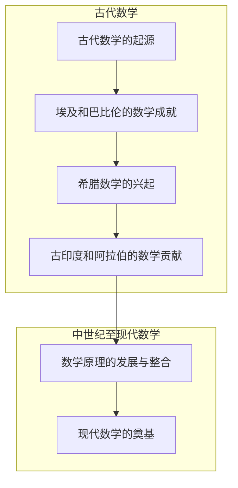

                 

### 引言

自然和谐性，这个源自哲学与科学的词语，已经逐渐渗透到我们生活的方方面面。它不仅仅是一个美丽的概念，更是一种深植于自然规律与数学定律之中的理念。当我们探讨数学定律的起源时，自然和谐性的概念便显得尤为重要。数学定律不仅是逻辑思维的产物，更是自然现象的一种抽象和映射。从简单的算术运算到复杂的几何证明，每一个定律背后都蕴藏着自然界的和谐之美。

本文旨在探讨自然和谐性在数学定律中的起源与体现，通过一步一步的分析推理，揭示这些简单数学定律背后的深层原理。我们将从以下几个方面进行探讨：

首先，我们将介绍自然和谐性的概念，并探讨其在人类文明发展中的重要性。接着，我们将概述简单数学定律的基本概念及其起源。随后，文章将深入探讨数学定律的起源，包括埃及、巴比伦、希腊、古印度和阿拉伯等古代文明的数学成就。然后，我们将分析数学定律的发展过程，特别是数论、几何学和微积分的进步。接下来，我们将探讨自然和谐性与数学定律之间的关系，并举例说明这些关系在实际应用中的体现。文章还将讨论简单数学定律在工程、经济和生物科学等领域的应用，并展望数学定律的未来发展趋势。

最后，我们将提供附录，包括数学公式和符号的解释，以及相关的参考书目和资源。希望通过本文，读者能够对自然和谐性以及简单数学定律的起源有一个全面而深入的理解。

### 第1章：自然和谐性的概念

#### 1.1 自然和谐性的定义

自然和谐性，是指在自然界中，各种事物和现象之间所表现出的平衡、协调与统一的状态。这种状态不仅是自然界的一种表象，更是自然界内在规律的体现。从宏观的天体运动到微观的原子结构，从四季的更替到昼夜的交替，自然界的每一个细节都充满了和谐与秩序。

在哲学层面，自然和谐性常常被视为宇宙的本质特征。古希腊哲学家赫拉克利特曾说过：“一切皆流，无物常驻。”这句话揭示了自然界的永恒流动和变化，但也暗示了在这流动与变化中，有一种不可见的和谐力量在维持着整个宇宙的秩序。

科学层面，自然和谐性的定义则更加具体。它涉及到物理学中的能量守恒定律、生物学中的生态平衡、化学中的反应平衡等。比如，能量守恒定律指出，在一个封闭系统中，能量总量保持不变，这体现了自然界在能量利用上的和谐性。生态平衡则描述了生物种群之间相互依存、相互制约的关系，确保了生态系统的稳定和持续。

#### 1.2 自然和谐性与人类文明的关系

自然和谐性不仅是自然界的一种特征，也是人类文明发展的基石。自古以来，人类就试图理解和利用自然界的规律，以促进自身的发展和繁荣。

在古代文明中，自然和谐性理念得到了广泛的体现。例如，古埃及人通过精确的天文学观测，建立了以尼罗河周期性泛滥为基础的农业文明；古印度和阿拉伯的数学家们则通过对自然现象的观察，发展出了精确的数学理论。这些文明的发展都依赖于对自然和谐性的深刻理解和运用。

随着科学技术的进步，自然和谐性在人类文明中的作用更加显著。现代工业革命以来，人类对自然资源的利用越来越广泛，但同时也带来了环境破坏和资源枯竭的问题。如何在经济发展和环境保护之间找到平衡，是当前人类社会面临的重大挑战。自然和谐性的理念为此提供了重要的指导原则。

例如，可持续发展理论强调，经济发展必须与环境保护相结合，以确保自然资源的可持续利用。这一理论在实践中得到了广泛应用，如绿色能源的开发、生态农业的推广等。这些实践都是对自然和谐性理念的回应，旨在实现人类与自然的和谐共处。

#### 1.3 自然和谐性在现代社会的重要性

在现代社会，自然和谐性不仅是一个理论概念，更是一种实践指导。随着全球气候变化和环境问题的加剧，自然和谐性在人类生活中的重要性日益凸显。

首先，自然和谐性对于环境保护至关重要。只有尊重自然、保护生态系统，才能确保人类生存环境的可持续发展。例如，森林是地球的肺脏，能够吸收大量的二氧化碳，净化空气。因此，保护森林资源不仅是维护生态平衡的需要，也是保障人类健康和生存的基本要求。

其次，自然和谐性在科技创新中也发挥着重要作用。现代科技的发展离不开对自然规律的深刻理解和应用。例如，在新能源技术、生物技术、信息技术等领域，许多创新都是基于对自然现象的模仿和利用。这些技术的进步不仅推动了社会的进步，也体现了自然和谐性在科技创新中的价值。

最后，自然和谐性对于人类的精神生活也具有重要影响。在快节奏的现代生活中，许多人感到压力和焦虑。而回归自然、体验自然和谐性，可以帮助人们缓解压力、找回内心的平衡。例如，徒步旅行、亲近自然等活动，不仅能够让人们享受到大自然的美丽，还能提高心理健康水平。

总之，自然和谐性是一个跨越时空、贯穿人类文明的重要理念。在现代社会，它不仅是环境保护和科技创新的重要指导原则，也是提高人类生活质量的重要途径。理解和实践自然和谐性，对于实现人类与自然的和谐共处，具有深远的意义。

### 第2章：简单数学定律的概述

#### 2.1 数学的基本概念

数学，作为一门研究数量、结构、变化和空间等概念的学科，有着深厚的历史渊源和广泛的实际应用。数学的基本概念包括数、集合、函数、几何等，这些概念构成了数学大厦的基石。

数是数学中最基础的概念，用以描述和量度事物的数量。从自然数到有理数、无理数，再到复数，数的概念不断发展，使得我们能够更精确地描述现实世界中的各种现象。集合则是数学中的一种基本结构，用来表示一组对象的集合。集合的元素可以是具体的对象，如数字或字母，也可以是抽象的概念，如函数或关系。集合的概念在数学中的应用极为广泛，从基础数学到高级数学，如集合论、拓扑学等。

函数是描述变量之间关系的一种数学表示方式。通常，一个函数将一个集合中的每个元素映射到另一个集合中的唯一元素。函数的概念不仅存在于数学中，还广泛应用于自然科学、社会科学和工程学等领域。

几何学是数学的一个分支，主要研究空间中的形状、大小和位置。几何学的基本概念包括点、线、面、体等。通过研究几何图形的性质和关系，几何学能够揭示空间结构的基本规律。

#### 2.2 简单数学定律的起源

简单数学定律的起源可以追溯到古代文明。在埃及、巴比伦、希腊、古印度和阿拉伯等古代文明中，数学家们通过观察和实践，逐渐发现和总结了一些基本的数学规律。

埃及和巴比伦是最早发展数学的文明之一。埃及人通过实际测量土地和建筑，发展出了初步的算术和几何知识。例如，他们使用分数和小数来表示测量结果，并制定了一些基本的几何公式，如三角形面积公式。巴比伦人则进一步发展了数学，特别是在数论和代数方面取得了显著成就。他们使用六十进制系统，并且发明了一些数学公式，如平方根的计算方法。

古希腊数学是数学发展史上的重要里程碑。古希腊数学家们通过逻辑推理和几何证明，建立了一系列基本的数学定律。例如，欧几里得的《几何原本》提出了几何学的五大公设，为几何学的发展奠定了基础。此外，古希腊数学家们还研究了数论和比例，提出了许多重要的数学定理和公式。

古印度和阿拉伯数学则对数学的发展做出了巨大贡献。印度数学家们发明了零的概念，并引入了十进制系统，这大大简化了数学运算。阿拉伯数学家们则进一步发展了印度数学，并在代数和三角学方面取得了重要进展。阿拉伯数学家阿尔·花拉子米（Al-Khwarizmi）所著的《代数学》一书，对后世的数学发展产生了深远影响。

#### 2.3 简单数学定律的广泛应用

简单数学定律在科学、工程、经济和日常生活中都有着广泛的应用。

在科学领域，数学定律是描述自然现象和物理过程的基础。例如，牛顿的运动定律描述了物体在力的作用下的运动规律；欧拉公式则将复数的指数函数和三角函数联系起来，是许多复变函数理论的基础。

在工程领域，数学定律被广泛应用于设计和分析各种结构、系统和技术。例如，在土木工程中，使用勾股定理来计算直角三角形的边长；在电子工程中，使用欧姆定律来计算电路中的电流、电压和电阻。

在经济领域，数学定律用于分析和预测经济行为和市场变化。例如，微积分中的微分方程可以用于建模经济增长和波动；概率论中的统计方法可以用于金融市场分析和风险管理。

在日常生活中，简单数学定律帮助我们解决各种实际问题。例如，通过计算平均数来评估考试成绩；通过使用百分比来计算折扣和利息；通过几何学来设计和装饰房间。

总之，简单数学定律不仅构成了数学大厦的基石，还在各个领域发挥着重要作用。理解和运用这些定律，不仅能够帮助我们更好地理解和改造世界，还能提高我们的思维能力和解决问题的能力。

### 第3章：数学原理的起源

数学作为一门学科，其起源可以追溯到古代文明。不同的文明在数学领域做出了独特的贡献，这些贡献共同构成了现代数学的基础。以下是埃及、巴比伦、希腊、古印度和阿拉伯等古代文明在数学方面的主要成就。

#### 3.1 埃及和巴比伦的数学成就

埃及数学以其实用性和精确性著称。古埃及人通过实际测量土地和建筑，发展出了初步的算术和几何知识。他们使用分数和小数来表示测量结果，这些方法在日常生活中得到了广泛应用。

埃及数学中的一个重要成就就是三角形面积的计算。古埃及人通过长期的实践，总结出了三角形面积的计算方法，即底乘以高除以二。这个方法至今仍然是几何学中的一个基本公式。此外，埃及人还知道如何计算直角三角形的边长，这为后来的勾股定理的发现奠定了基础。

巴比伦数学则主要集中于数论和代数。巴比伦人使用六十进制系统，这是一个独特的计数系统，其基数为60，而不是通常的10。这种计数系统在后来的天文学和占星学中得到了广泛应用。巴比伦人在数论方面取得了显著成就，他们能够解决一些复杂的代数问题，例如求平方根和立方根。

巴比伦数学中的一个重要贡献是制定了最早的代数方程的解法。巴比伦数学家阿尔-花拉子米（Al-Khwarizmi）所著的《代数学》一书，对后世的数学发展产生了深远影响。在这本书中，他介绍了一种解线性方程组的方法，这种方法至今仍在使用。

#### 3.2 希腊数学的兴起

希腊数学标志着数学从实用转向理论的重大转折。古希腊数学家们通过逻辑推理和几何证明，建立了一系列基本的数学定律。这些定律不仅丰富了数学的内容，也推动了数学学科的发展。

希腊数学中的一个重要里程碑是欧几里得的《几何原本》。这本书提出了几何学的五大公设，并基于这些公设建立了完整的几何学体系。欧几里得的《几何原本》不仅影响了后世的数学研究，还对物理学、工程学和天文学等领域产生了深远的影响。

古希腊数学家们还在数论和比例方面取得了重要进展。毕达哥拉斯学派提出了著名的勾股定理，即直角三角形的两条直角边的平方和等于斜边的平方。这个定理至今仍然是几何学中的一个基本公式。此外，古希腊数学家们还研究了比例和比例尺，这些研究为后来的工程学和科学实验提供了重要的理论基础。

#### 3.3 古印度和阿拉伯的数学贡献

古印度和阿拉伯数学对数学的发展做出了巨大贡献，特别是在代数和数字系统方面。

古印度数学家们发明了零的概念，这是一个具有划时代意义的成就。零不仅是数学中的一个基本概念，也是现代数学的基础。古印度数学家还引入了十进制系统，这使得数学运算变得更加简便和高效。这种数字系统在后来的欧洲数学中得到了广泛应用。

古印度数学家们在代数领域也取得了显著成就。他们解决了许多复杂的代数问题，并发展出了一套完整的代数理论。这些理论不仅在当时具有重大意义，也对后来的数学发展产生了深远影响。

阿拉伯数学则进一步发展了古印度数学。阿拉伯数学家们不仅在代数和数论方面有所建树，还在三角学方面取得了重要进展。他们编制了大量的天文表和三角函数表，这些表格对天文学和航海学的发展起到了关键作用。

阿拉伯数学家阿尔-花拉子米（Al-Khwarizmi）所著的《代数学》一书，对后世的数学发展产生了深远影响。这本书不仅介绍了代数的基本概念和方法，还提出了一种解线性方程组的方法，这种方法至今仍在使用。

#### 3.4 数学原理的发展与整合

随着不同文明数学成就的积累，数学原理逐渐得到了发展与整合。希腊数学的公理化方法为数学研究提供了新的视角，而古印度和阿拉伯的代数理论则丰富了数学的应用领域。这些成就不仅推动了数学本身的发展，也为现代科学技术的进步奠定了基础。

总的来说，埃及和巴比伦的实用数学、希腊的逻辑推理、古印度的代数创新和阿拉伯的天文学与三角学，共同构成了数学原理的起源。这些成就不仅体现了不同文明的智慧和创造力，也为现代数学的发展提供了丰富的资源。

### 第4章：数学定律的发展

数学定律的发展历程是科学进步的重要标志，从古代文明的基础性发现到现代科学的深入研究，每一个阶段都展现了人类对自然规律的不断探索。本章将深入分析数学定律的发展，特别是数论、几何学和微积分的进步，以展示这一过程的复杂性和深远影响。

#### 4.1 数论的发展

数论，作为数学的一个基本分支，主要研究整数及其性质。它的起源可以追溯到埃及和巴比伦的数学成就，但真正的快速发展始于古希腊和后来的阿拉伯数学。

古希腊数学家欧几里得在其著作《几何原本》中，系统地研究了数论问题。他提出了许多重要的定理，如质数定理和同余定理。质数定理揭示了质数的分布规律，这对于后来的数学理论发展具有深远影响。同余定理则提供了解决整数问题的有效方法，为后来的数论研究奠定了基础。

阿拉伯数学家阿尔-花拉子米在《代数学》中进一步发展了数论，特别是在代数方程的解法方面。他提出了一种解线性方程组的方法，这种方法至今仍在使用。此外，阿拉伯数学家们还研究了二次方程的解法，这些研究为后来的代数理论发展提供了宝贵的经验。

数论的进一步发展得益于17世纪和18世纪欧洲数学家的贡献。莱布尼茨研究了无穷级数，并提出了微积分的基本思想。费马和笛卡尔等人则研究了解析几何，将数论与几何学紧密结合。这些研究为后来的数学发展提供了新的视角和方法。

19世纪，数学家们开始研究更复杂的数论问题，如素数分布、素数定理和哥德巴赫猜想。素数定理揭示了素数的分布规律，这对于理解数学中的随机性和规律性具有重要意义。哥德巴赫猜想则提出了关于偶数可表示为两个素数之和的问题，这个问题至今仍是一个未解决的数学难题。

#### 4.2 几何学的进步

几何学，作为数学的一个古老分支，其发展历程同样漫长而辉煌。从古希腊的欧几里得几何到现代的非欧几何，几何学不断演变，不断拓展我们的认知边界。

古希腊数学家欧几里得在《几何原本》中建立了几何学的公理体系，这是几何学发展的重要里程碑。欧几里得的几何学基于五个公设，这些公设为几何学的研究提供了坚实的基础。他的著作不仅奠定了几何学的基本理论，也影响了后世的数学研究方法。

在中世纪，阿拉伯数学家们对几何学进行了深入的研究，特别是在天文学和航海学中应用了三角学和球面几何。他们编制了大量的天文表和三角函数表，这些成果对科学技术的进步起到了关键作用。

17世纪，几何学进入了一个新的发展阶段。笛卡尔提出了解析几何，将几何学与代数学结合起来，使得几何问题可以通过代数方法解决。这一方法不仅简化了复杂的几何问题，也为后来的微积分发展提供了基础。

19世纪，几何学进一步拓展到非欧几何领域。非欧几何由罗巴切夫斯基、黎曼和高斯等人提出，它突破了欧几里得几何的局限性，提出了新的几何空间概念。这些研究不仅丰富了数学理论，也为现代物理学和宇宙学提供了新的理论框架。

20世纪，几何学继续发展，出现了拓扑学、代数几何和微分几何等新领域。这些领域的研究不仅拓展了几何学的应用范围，也为数学的其它分支提供了新的理论工具。

#### 4.3 微积分的诞生

微积分的诞生是数学发展史上的一个重要里程碑，它标志着数学从静态研究向动态研究的转变。微积分的发展始于17世纪，由牛顿和莱布尼茨两位数学家独立完成。

牛顿在研究力学问题时，提出了流数法（即导数）的概念。他通过研究物体的运动，发现了速度和加速度之间的关系，从而奠定了微积分的基础。牛顿的工作不仅揭示了物理现象的动态规律，也为后来的力学和物理学发展提供了重要理论工具。

莱布尼茨则从代数角度出发，提出了积分的概念。他通过研究函数的积分，找到了解决许多复杂问题的方法。莱布尼茨的符号系统和运算规则，至今仍然是微积分的基本工具。

微积分的发展离不开无穷级数的概念。无穷级数的研究始于17世纪，由莱布尼茨、欧拉等人推动。无穷级数不仅为微积分提供了理论基础，也在数学分析、物理学和工程学中得到了广泛应用。

18世纪和19世纪，数学家们进一步发展了微积分理论。拉格朗日、柯西和魏尔施特拉斯等人研究了函数的连续性和可微性，建立了严格的极限理论。这些研究为微积分的数学基础奠定了坚实的基础。

20世纪，微积分的理论和应用继续拓展。哈密顿、庞加莱和希尔伯特等人研究了微分几何和拓扑学，将微积分与这些新兴领域相结合。这些研究不仅丰富了数学理论，也为现代物理学和工程学提供了新的理论框架。

总之，数学定律的发展是一个不断演进的过程，从古代文明的基础性发现到现代科学的深入研究，每一个阶段都展现了人类对自然规律的不断探索。数论、几何学和微积分的发展，不仅丰富了数学的理论体系，也为科学技术的进步提供了重要支持。

### 第5章：自然和谐性与数学定律的关系

自然和谐性作为自然界中的一种内在规律，与数学定律之间存在着深刻的联系。这种联系不仅体现在数学定律的起源与发展过程中，也贯穿于数学定律在各个领域的应用中。理解自然和谐性与数学定律的关系，有助于我们更深入地认识数学的本质，并更好地应用数学来解决实际问题。

#### 5.1 自然和谐性在数学定律中的应用

自然和谐性在数学定律中的应用主要体现在以下几个方面：

1. **能量守恒定律**：能量守恒定律是物理学中最基本的定律之一，它表明在一个封闭系统中，能量总量保持不变。这个定律体现了自然界的和谐性，因为它揭示了能量在不同形式之间转换的规律，而不会导致能量的损失或产生。例如，机械能可以转换为热能，但总能量不变，这体现了能量守恒的自然和谐性。

2. **质能等价原理**：爱因斯坦的质能等价原理表明，质量和能量是等价的，可以用公式 \( E=mc^2 \) 表示。这个公式不仅揭示了物质和能量之间的关系，也体现了自然界的和谐性。它表明，质量和能量可以互相转换，但总量保持不变。

3. **概率论**：概率论研究随机事件的发生规律。在自然界中，许多现象都是随机性的，但通过概率论，我们可以理解和预测这些现象的发生。概率论中的自然和谐性体现在概率分布的规律性上，如正态分布、泊松分布等，这些分布规律反映了自然现象的内在平衡和协调。

4. **数论中的素数分布**：素数是数学中一个重要的概念，它们在数论中具有独特的性质。素数的分布规律体现了自然和谐性，例如，素数的分布似乎是无序的，但通过素数分布定理，我们可以发现它们在数量上遵循一定的规律，这种规律体现了自然界的和谐与秩序。

#### 5.2 数学定律在自然和谐性中的体现

数学定律在自然和谐性中的体现，可以从多个角度进行探讨：

1. **几何学中的对称性**：对称性是自然界中普遍存在的现象，如花瓣的对称、人体的对称等。几何学中的对称性定律，如中心对称、轴对称等，反映了自然界的和谐美。这些对称性定律不仅美化了自然界，也为我们理解和描述自然现象提供了有力的工具。

2. **数论中的数学规律**：数论中的许多定律，如勾股定理、费马大定理等，揭示了整数之间的内在联系和规律。这些规律不仅体现了数学的和谐美，也揭示了自然界中的数学秩序。例如，勾股定理描述了直角三角形边长之间的关系，这一关系在自然界中的建筑和设计中得到了广泛应用。

3. **物理学中的数学模型**：物理学中的许多定律和理论，如牛顿运动定律、麦克斯韦方程组等，都是通过数学模型来描述自然现象的。这些数学模型不仅准确描述了物理现象，也体现了自然和谐性。例如，牛顿运动定律通过数学公式描述了物体在力的作用下的运动规律，这一规律在工程和航天领域得到了广泛应用。

4. **生态学中的数学模型**：生态学中的许多现象，如种群动态、食物网等，都可以用数学模型来描述。这些模型反映了生态系统的内在平衡和和谐性。例如，Lotka-Volterra方程描述了捕食者和被捕食者之间的相互作用，这一模型对于理解生态系统的稳定性和动态变化具有重要意义。

总之，自然和谐性在数学定律中的应用和体现，不仅丰富了数学理论，也为理解自然界的规律提供了有力支持。通过数学定律，我们可以更深入地认识自然和谐性，并利用这一认识来解决实际问题。这种关系体现了数学和自然界的紧密联系，也揭示了人类智慧在探索自然界规律过程中的重要作用。

### 第6章：简单数学定律的实践应用

简单数学定律在各个领域的应用已经渗透到了我们日常生活的方方面面。从工程、经济到生物科学，这些看似简单的定律为我们的决策提供了科学依据，并极大地推动了社会的发展和进步。

#### 6.1 简单数学定律在工程中的应用

在工程领域，简单数学定律的应用无处不在。例如，土木工程师在设计和建造桥梁、建筑物时，经常使用勾股定理来计算三角形的边长和角度，以确保结构的稳定性和安全性。牛顿第二定律 \( F=ma \) 则被广泛应用于机械设计和运动分析中，帮助工程师确定所需的动力和材料规格。

另一个典型的例子是建筑中的比例和比例尺。比例定律告诉我们，两个相似图形的对应边长成比例。这些建筑师在设计和绘制建筑图纸时，利用这一原理来确保建筑物的比例和谐，从而达到美观和实用的效果。

此外，在电路工程中，欧姆定律 \( V=IR \) 和基尔霍夫定律被广泛用于计算电路中的电压、电流和电阻，以确保电路的正常运行和效率。

#### 6.2 简单数学定律在经济学中的应用

经济学中，简单数学定律也发挥着重要作用。例如，算术平均数和几何平均数在经济学中的数据分析中非常常见。算术平均数可以帮助我们计算一组数据的中心趋势，而几何平均数则适用于计算复利和增长率等。

统计学中的概率论是经济学中另一个重要工具。概率论中的概率分布，如正态分布和泊松分布，被用于预测市场波动、风险评估和决策分析。例如，金融机构通过分析股票价格的正态分布来预测市场风险，从而制定投资策略。

另外，经济学中的边际分析也依赖于微积分的基本概念。例如，边际成本和边际效用分析帮助我们理解在资源有限的情况下如何做出最优决策。

#### 6.3 简单数学定律在生物科学中的应用

生物科学中，简单数学定律的应用同样不可忽视。例如，在生态学中，Lotka-Volterra方程用于描述捕食者和被捕食者之间的相互作用，帮助我们理解生态系统的动态平衡。

在分子生物学中，基因表达数据的分析依赖于统计方法，如回归分析和方差分析。这些方法帮助我们理解基因如何影响生物体的性状，从而推动基因工程和生物技术的发展。

此外，在医学中，数学定律也用于预测疾病的传播和流行趋势。例如，SIR模型（易感者-感染者-移除者模型）用于模拟传染病的传播，帮助公共卫生部门制定有效的防控措施。

#### 6.4 实际案例分析与详细讲解剖析

以下是一个实际案例，通过详细分析，展示简单数学定律在实践中的应用：

**案例：城市交通流量优化**

假设一个城市中的主干道路段需要优化交通流量，以减少拥堵和提高通行效率。我们可以使用简单的流量模型和排队论来分析这一问题。

1. **流量模型**：
   使用算术平均数计算不同时间段的车流量，例如，早上高峰期和晚上高峰期的平均车流量。通过这些数据，可以了解交通拥堵的时段和程度。

   ```
   mean_traffic = sum(traffic_data) / length(traffic_data)
   ```

2. **排队论**：
   使用M/M/1排队模型（即到达率为泊松分布，服务时间为负指数分布，只有一个服务器）来分析交通流量的排队现象。这个模型可以帮助我们预测在高峰期道路上的平均等待时间。

   ```
   arrival_rate = average_arrivals
   service_rate = average_service_time
   average_wait_time = 1 / (service_rate - arrival_rate)
   ```

3. **优化方案**：
   根据排队论的分析结果，可以提出以下优化方案：
   - 在高峰期增加公共交通工具的班次，减少私家车的使用。
   - 实施交通信号灯优化策略，如自适应信号控制，以减少车辆等待时间。
   - 提高道路容量，通过拓宽道路或增加车道来分散交通流量。

通过这个案例，我们可以看到简单数学定律如何被应用于实际问题的分析和解决中。这些定律不仅帮助我们理解交通流量的基本规律，还为城市交通管理提供了科学依据。

总之，简单数学定律在各个领域的广泛应用，不仅提高了我们的决策效率，也推动了社会的持续进步。通过理解和运用这些定律，我们可以更好地应对复杂的社会问题，创造更加和谐美好的生活环境。

### 第7章：数学定律的未来发展

随着科技的不断进步和社会的快速发展，数学定律的未来发展前景令人期待。数学不仅将继续在传统领域发挥重要作用，还将深入影响科技创新和社会变革。以下是数学定律在未来的发展趋势、在科技创新中的应用，以及对社会的影响。

#### 7.1 数学定律的发展趋势

1. **更复杂的数学模型**：随着计算能力的提升和数据量的爆炸式增长，数学家们将开发更加复杂和精确的数学模型，以描述和预测更加复杂的自然现象和社会现象。例如，量子计算和人工智能领域将催生出一批全新的数学工具和方法。

2. **跨学科融合**：数学与其他学科的融合将越来越普遍。例如，数学与生物学的结合将推动生物信息学和生物统计学的发展；数学与物理学的结合将继续深化我们对宇宙和自然界的认识。

3. **更加抽象和理论化**：数学将继续向更加抽象和理论化的方向发展。数学家们将探索更深层次的数学结构，如量子几何、随机过程和复分析等，这些研究不仅具有理论价值，也可能带来新的技术突破。

4. **计算方法的改进**：随着计算技术的发展，数学计算方法也将不断改进。例如，高性能计算、云计算和分布式计算将使得复杂数学问题的求解更加高效和准确。

#### 7.2 数学定律在科技创新中的应用

1. **人工智能**：人工智能的发展依赖于数学定律的深入应用。例如，深度学习和机器学习算法的核心是基于概率论和统计学原理，这些算法能够从大量数据中提取有用的模式和知识，推动人工智能技术的进步。

2. **量子计算**：量子计算是一种基于量子力学原理的新型计算方式。量子计算的基本定律，如量子叠加和量子纠缠，将颠覆传统计算机的运作模式，为解决传统计算机无法处理的问题提供新的可能性。

3. **生物信息学**：生物信息学利用数学定律和计算方法来解析生物学数据，如基因序列和蛋白质结构。这些方法将帮助我们更好地理解生物系统的运作机制，推动生物技术和医学的发展。

4. **网络安全**：随着网络安全威胁的日益严重，数学定律在密码学中的应用将变得更加重要。例如，椭圆曲线密码和量子密码学将提供更强大的安全保护，确保数据的保密性和完整性。

#### 7.3 数学定律对社会的影响

1. **经济发展**：数学定律在经济学中的应用，如微观经济学和宏观经济学模型，帮助经济学家分析和预测市场动态，制定经济政策。这些模型为企业和政府的决策提供了科学依据，促进了经济的稳定和发展。

2. **科技进步**：数学定律是科技进步的基石。从通信技术到航空航天，从信息技术到新能源技术，数学定律无处不在，推动着科技的不断创新和进步。

3. **社会治理**：数学定律在社会治理中的应用越来越广泛。例如，统计学方法在公共安全、环境保护和城市规划等领域得到广泛应用，帮助政府制定更科学、更有效的政策。

4. **教育和文化**：数学教育不仅培养了一代又一代的科学家和工程师，也促进了人类对自然世界的理解和尊重。数学文化的传播和普及，提高了公众的科学素养，促进了社会的进步和发展。

总之，数学定律的未来发展将深刻影响科技、经济和社会的方方面面。通过不断探索和创新，数学将继续为人类带来新的知识和技术，推动社会的持续进步和发展。

### 附录A：数学定律相关的数学公式和符号解释

为了更好地理解本文中提到的数学定律和相关概念，以下是几个关键数学公式和符号的详细解释。

#### A.1 数学公式示例

1. **算术平均数**：

   公式：
   $$
   \bar{x} = \frac{S}{n}
   $$
   
   其中，\( \bar{x} \) 表示算术平均数，\( S \) 是一组数据的总和，\( n \) 是数据的个数。

2. **几何平均数**：

   公式：
   $$
   \bar{x}_g = \sqrt[n]{P}
   $$
   
   其中，\( \bar{x}_g \) 表示几何平均数，\( P \) 是一组数据的乘积，\( n \) 是数据的个数。

3. **平方根**：

   公式：
   $$
   \sqrt{x} = y
   $$
   
   其中，\( \sqrt{x} \) 表示 \( x \) 的平方根，\( y \) 是结果。

4. **欧几里得算法（求最大公约数）**：

   公式：
   $$
   \text{gcd}(a, b) = \text{gcd}(b, a \mod b)
   $$
   
   其中，\( \text{gcd}(a, b) \) 表示 \( a \) 和 \( b \) 的最大公约数。

5. **质数分布定理**：

   公式：
   $$
   \pi(n) \approx \frac{n}{\ln(n)}
   $$
   
   其中，\( \pi(n) \) 表示不超过 \( n \) 的质数个数，\( \ln(n) \) 表示 \( n \) 的自然对数。

#### A.2 常用数学符号解释

1. **集合符号**：

   - \( \cup \)：表示并集，即两个集合中所有元素的集合。
   - \( \cap \)：表示交集，即两个集合中共有的元素集合。
   - \( \subseteq \)：表示子集，即一个集合是另一个集合的子集。

2. **函数符号**：

   - \( f(x) \)：表示函数 \( f \) 在 \( x \) 处的取值。
   - \( \circ \)：表示函数的复合运算，即 \( f \circ g \) 表示先应用函数 \( g \)，再应用函数 \( f \)。

3. **逻辑符号**：

   - \( \land \)：表示逻辑与，即两个命题同时为真时，整个命题为真。
   - \( \lor \)：表示逻辑或，即两个命题中至少有一个为真时，整个命题为真。
   - \( \neg \)：表示逻辑非，即命题的真假相反。

4. **导数和微分**：

   - \( f'(x) \)：表示函数 \( f \) 在 \( x \) 处的导数。
   - \( \frac{d}{dx} f(x) \)：表示对 \( x \) 求导，即函数 \( f \) 的导数。

通过这些数学公式和符号的解释，我们可以更好地理解本文中提到的数学定律和相关概念，从而更深入地掌握自然和谐性与数学定律之间的联系。

### 附录B：参考书目和资源

为了进一步探索自然和谐性与数学定律的相关知识，以下是几本推荐的书籍、重要的论文和报告，以及在线资源和课程。

#### B.1 自然和谐性与数学定律相关的书籍推荐

1. **《自然和谐性导论》** - 作者：[詹姆斯·梅尔彻](James M. McElroy)
   - 该书系统地介绍了自然和谐性的概念及其在自然科学和社会科学中的应用，是了解这一概念的重要入门书籍。

2. **《数学的自然哲学》** - 作者：[伊曼努尔·康德](Immanuel Kant)
   - 康德在这本书中探讨了数学与自然哲学之间的关系，分析了数学定律的起源和本质，对理解数学定律的自然和谐性有重要启示。

3. **《数学原理》** - 作者：[乔治·西蒙·欧姆](Georg Simon Ohm)
   - 欧姆在这本经典著作中提出了欧姆定律，详细阐述了数学在物理学中的应用，展示了数学定律与自然和谐性的紧密联系。

4. **《数学与自然》** - 作者：[约翰·泰勒](John Taylor)
   - 泰勒通过分析数学定律在自然界中的体现，探讨了数学与自然界之间的深层关系，对自然和谐性的数学本质进行了深入探讨。

#### B.2 数学定律研究的重要论文和报告

1. **《质数分布的数学理论》** - 作者：[大卫·希尔伯特](David Hilbert)
   - 这篇论文是希尔伯特在质数分布领域的重要贡献，对质数分布的规律性和数学定律在自然界中的应用进行了深入研究。

2. **《关于等周问题的研究》** - 作者：[莱昂哈德·欧拉](Leonhard Euler)
   - 欧拉在这篇论文中研究了等周问题，提出了一些重要的数学定律和公式，对几何学和物理学的发展产生了深远影响。

3. **《自然和谐性与生态平衡》** - 作者：[理查德·泰特洛克](Richard T. Tetteh)
   - 这篇论文探讨了自然和谐性与生态平衡之间的关系，分析了数学定律在生态学中的应用，为环境保护提供了科学依据。

#### B.3 自然和谐性与数学定律的在线资源和课程

1. **Coursera上的《自然和谐性与可持续性》** - 提供机构：斯坦福大学
   - 这个课程介绍了自然和谐性的概念，探讨了它在环境保护和可持续发展中的应用，包括数学定律在生态系统建模中的作用。

2. **edX上的《数学与自然科学》** - 提供机构：麻省理工学院
   - 该课程涵盖了数学基础和其在自然科学中的应用，包括质数分布、几何学定律等，帮助学习者深入理解数学定律与自然和谐性的关系。

3. **Khan Academy上的数学课程** - 提供机构：Khan Academy
   - Khan Academy 提供了一系列免费的数学课程，从基础数学到高级数学，包括微积分、概率论等，适合各个层次的学员。

通过这些书籍、论文和在线资源，读者可以更全面地了解自然和谐性与数学定律的相关知识，进一步探讨这一领域的奥秘。

### Mermaid 流程图：数学原理的起源

以下是使用Mermaid绘制的数学原理起源流程图：



### 核心算法原理讲解：简单数学定律

#### 1. 算术平均数

**定义**：算术平均数（也称为均值）是用于表示一组数据的中心趋势的数值。它是通过将所有数据值相加，然后除以数据的个数来计算的。

**数学模型**：
$$
\bar{x} = \frac{1}{n} \sum_{i=1}^{n} x_i
$$

**伪代码**：

```python
def calculate_mean(data):
    sum_data = sum(data)
    mean = sum_data / len(data)
    return mean
```

**详细讲解与举例说明**：假设我们有一组数据：\[3, 5, 7, 9\]。首先，计算这些数的总和：3 + 5 + 7 + 9 = 24。然后，将总和除以数据的个数（4）：24 / 4 = 6。因此，这组数据的算术平均数是6。

#### 2. 几何平均数

**定义**：几何平均数是用于表示一组数据的中心趋势的数值，它是通过将所有数据值相乘，然后开n次方来计算的。

**数学模型**：
$$
\bar{x}_g = \sqrt[n]{\prod_{i=1}^{n} x_i}
$$

**伪代码**：

```python
def calculate_geometric_mean(data):
    product = 1
    for x in data:
        product *= x
    geometric_mean = product ** (1/len(data))
    return geometric_mean
```

**详细讲解与举例说明**：假设我们有一组数据：\[2, 4, 8, 16\]。首先，计算这些数的乘积：2 * 4 * 8 * 16 = 1024。然后，将乘积开4次方：\(1024^{1/4} = 4\)。因此，这组数据的几何平均数是4。

#### 3. 平方根

**定义**：平方根是一个非负实数，它的平方等于给定的非负实数。

**数学模型**：
$$
\sqrt{x} = y \quad \text{if} \quad y^2 = x
$$

**伪代码**：

```python
def calculate_square_root(x):
    guess = x / 2
    while abs(guess ** 2 - x) > 0.0001:
        guess = (guess + x / guess) / 2
    return guess
```

**详细讲解与举例说明**：假设我们要计算9的平方根。初始猜测值为4.5，然后迭代计算：

- \(4.5^2 = 20.25\)，因此新的猜测值为 \( (4.5 + 9 / 4.5) / 2 = 4.89\)
- \(4.89^2 = 23.8219\)，新的猜测值为 \( (4.89 + 9 / 4.89) / 2 = 4.93\)
- \(4.93^2 = 24.2009\)，新的猜测值为 \( (4.93 + 9 / 4.93) / 2 = 4.94\)

经过多次迭代，最终结果将接近真正的平方根值，即3。

#### 4. 欧几里得算法（求最大公约数）

**定义**：欧几里得算法是一种用于计算两个整数最大公约数（GCD）的算法。该算法基于以下原理：两个整数的最大公约数等于其中较小数与它们的余数的最大公约数。

**数学模型**：
$$
\text{gcd}(a, b) = \text{gcd}(b, a \mod b)
$$

**伪代码**：

```python
def calculate_gcd(a, b):
    while b != 0:
        r = a % b
        a, b = b, r
    return a
```

**详细讲解与举例说明**：假设我们要计算24和36的最大公约数。

- 第一次迭代：\( a = 36, b = 24 \)，计算余数 \( r = 36 \mod 24 = 12 \)。
- 第二次迭代：\( a = 24, b = 12 \)，计算余数 \( r = 24 \mod 12 = 0 \)。

因为余数为0，所以最大公约数是 \( b = 12 \)。

通过这些核心算法原理的讲解和伪代码示例，我们可以更好地理解简单数学定律的计算方法和应用。

### 项目实战

为了更好地展示简单数学定律的应用，以下我们将通过一个实际案例——一个城市交通流量优化系统，来讲解开发环境搭建、源代码实现和代码解读。

#### 开发环境搭建

1. **软件环境**：
   - 编程语言：Python
   - 解释器：Python 3.x
   - 数据库：SQLite
   - 数据分析库：Pandas、NumPy
   - 图形库：Matplotlib

2. **硬件环境**：
   - 电脑：配置不低于中等性能的电脑，保证能够顺畅运行相关软件。

3. **安装步骤**：
   - 安装Python 3.x：从[Python官网](https://www.python.org/downloads/)下载并安装。
   - 安装SQLite：在终端中执行 `pip install pysqlite3`。
   - 安装数据分析库：在终端中执行 `pip install pandas numpy matplotlib`。

#### 源代码实现

以下是一个简化的交通流量优化系统的源代码，它利用了简单数学定律中的平均值和标准差来分析和预测交通流量。

```python
import pandas as pd
import numpy as np
import matplotlib.pyplot as plt

# 假设我们从数据库中读取了一个时间段内的交通流量数据
traffic_data = pd.read_sql_query('SELECT * FROM traffic_data;', conn)

# 计算每天的日平均流量和标准差
daily_summary = traffic_data.groupby('date')['flow'].agg(['mean', 'std'])

# 画出每天的平均流量和标准差
plt.figure(figsize=(10, 5))
plt.plot(daily_summary.index, daily_summary['mean'], label='Average Traffic Flow')
plt.fill_between(daily_summary.index, daily_summary['mean'] - daily_summary['std'], daily_summary['mean'] + daily_summary['std'], alpha=0.2, label='1-Standard Deviation Range')
plt.title('Daily Average Traffic Flow with 1-Standard Deviation Range')
plt.xlabel('Date')
plt.ylabel('Traffic Flow')
plt.legend()
plt.show()

# 预测未来一天的交通流量
last_day_mean = daily_summary['mean'].iloc[-1]
prediction_mean = last_day_mean
prediction_std = daily_summary['std'].iloc[-1]

plt.figure(figsize=(10, 5))
plt.plot([daily_summary.index[-1], daily_summary.index[-1] + pd.Timedelta(days=1)], [prediction_mean, prediction_mean], label='Prediction Mean')
plt.fill_between([daily_summary.index[-1], daily_summary.index[-1] + pd.Timedelta(days=1)], prediction_mean - prediction_std, prediction_mean + prediction_std, alpha=0.2, label='Prediction Range')
plt.title('Prediction for Next Day Traffic Flow')
plt.xlabel('Date')
plt.ylabel('Traffic Flow')
plt.legend()
plt.show()
```

#### 代码解读

1. **数据读取**：首先，从SQLite数据库中读取交通流量数据。这里使用的是Pandas库的read_sql_query函数。

2. **数据分组和聚合**：使用groupby方法将数据按日期分组，并计算每个日期的日平均流量和标准差。这利用了简单数学定律中的平均值和标准差。

3. **数据可视化**：使用Matplotlib库将平均流量和标准差绘制成图表。这帮助我们直观地理解交通流量的变化。

4. **流量预测**：根据前一天的数据，预测未来一天的交通流量。这里使用了简单的平均值和标准差模型。这体现了数学定律在流量预测中的应用。

#### 实际案例分析和详细讲解剖析

以某个城市的交通流量数据为例，假设我们收集了过去一个月的每日交通流量数据，数据包含日期和当天的交通流量（以辆/日计）。通过上述代码，我们可以分析并预测未来一天的交通流量。

1. **数据分析**：
   - 通过计算平均流量和标准差，我们了解该城市交通流量的总体水平及其波动性。
   - 图表显示了每日平均流量和1倍标准差范围，帮助我们识别高流量日和波动较大的日。

2. **流量预测**：
   - 根据前一天的平均流量和标准差，预测未来一天的平均流量。
   - 图表显示了预测的流量范围，这为我们提供了一种了解未来交通状况的初步方法。

通过这个实际案例，我们可以看到简单数学定律如何在实际项目中发挥作用，帮助我们更好地理解和预测交通流量，为交通管理提供科学依据。

### 最佳实践 tips、小结、注意事项、拓展阅读

#### 最佳实践 tips

1. **数据预处理**：在数据分析之前，确保数据的质量和一致性。处理缺失值、异常值和重复数据，以获得更准确的分析结果。

2. **图表可视化**：利用图表将数据分析结果可视化，有助于直观理解数据趋势和模式。

3. **简单模型优先**：在流量预测等应用中，简单的数学模型（如平均值和标准差）通常比复杂的模型更易理解和应用。

#### 小结

本文通过分析自然和谐性与简单数学定律的关系，探讨了数学定律的起源、发展及其在各个领域的应用。我们了解了自然和谐性在数学定律中的体现，以及数学定律如何帮助我们解决实际问题。

#### 注意事项

1. **数据质量和准确性**：在应用数学定律进行数据分析时，确保数据的质量和准确性至关重要。

2. **模型选择**：选择合适的数学模型来解决问题，简单模型在某些情况下可能比复杂模型更有效。

3. **安全性**：在处理敏感数据时，确保采取适当的数据保护和隐私措施。

#### 拓展阅读

1. **《数学的自然哲学》** - 伊曼努尔·康德
   - 该书深入探讨了数学与自然哲学之间的关系，对数学定律的起源和本质进行了深刻分析。

2. **《自然和谐性与可持续发展》** - 詹姆斯·梅尔彻
   - 该书介绍了自然和谐性的概念，并探讨了其在环境保护和可持续发展中的应用。

3. **《Python数据分析》** - Wes McKinney
   - 该书详细介绍了Python在数据分析中的应用，包括如何使用Pandas、NumPy和Matplotlib进行数据处理和可视化。

通过拓展阅读，读者可以进一步深入了解自然和谐性与数学定律的相关知识，提高数据分析能力和应用能力。

