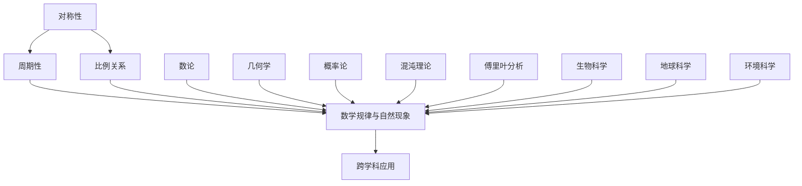

                 

### 引言

在漫长的历史进程中，人类对于自然界的探索从未停止。无论是古代的哲学家，还是现代的科学家，都在不断地试图揭示自然界的奥秘。随着科技的发展，数学作为一门基础科学，逐渐成为了解释自然界现象的有力工具。数学不仅仅是一门抽象的学科，更是一种深刻的语言，它能够精确地描述自然界中的各种规律和现象。

数学与自然界之间的关系是相互促进的。自然界中存在着各种数学规律，这些规律不仅能够帮助我们更好地理解自然界，还能够指导我们进行科学研究和工程实践。例如，自然界中的对称性、周期性、比例关系等都可以用数学来描述。同时，数学的不断发展也促进了对于自然界现象的深入研究，例如物理学中的量子力学、生物学中的分子生物学等，这些学科都依赖于数学工具的支持。

本书旨在探讨数学在自然界和谐结构研究中的重要作用。我们将会从多个角度来分析这个问题，包括自然界的对称性、数学规律与自然现象的联系、数论与物理现象的关系、几何学与宇宙结构、概率论与混沌理论、傅里叶分析在信号处理中的应用等。通过这些分析，我们希望能够揭示数学在自然界探索中的内在规律，为未来的科学研究提供新的思路和方法。

本书的结构如下：首先，在第一部分中，我们将对数学与自然界的关系进行概述，并介绍本书的研究内容和结构安排。接着，在第二部分中，我们将深入探讨数学视角下的自然界现象，包括数论、几何学和概率论等。第三部分将讨论数学在不同科学领域中的应用，如生物科学、地球科学和环境科学等。最后，在第四部分中，我们将总结本书的主要内容，并对数学在自然界研究中的未来发展方向进行展望。通过这样的结构安排，我们希望能够系统地、全面地展示数学在自然界和谐结构研究中的重要性。

### 自然界中的数学规律

自然界中存在着许多可以用数学规律描述的现象，这些现象不仅展示了数学的奇妙和精确，也为我们理解自然界的本质提供了重要的线索。其中，对称性、周期性、比例关系等数学规律在自然界中尤为显著。

#### 对称性

对称性是自然界中普遍存在的现象，无论是在生物学、物理学，还是化学领域，对称性都扮演着重要的角色。例如，许多植物的花瓣数遵循费波那契数列，这是一种数学上的对称性。在动物界中，许多昆虫的翅膀和贝壳的形状也具有高度对称性。这种对称性不仅在美学上给人以美感，更在功能上发挥着重要作用。例如，蝴蝶的翅膀对称性可以帮助其在飞行中保持稳定的方向和速度。

从数学的角度来看，对称性可以通过几何学来描述。对称性可以分为几种类型，包括点对称、轴对称和中心对称。点对称是指通过一个点将图形翻转后与原图形重合；轴对称是指通过一条直线将图形翻转后与原图形重合；中心对称是指通过一个点将图形旋转180度后与原图形重合。这些对称性概念在数学中有着严格的定义和丰富的理论体系。

#### 周期性

周期性是自然界中另一种普遍存在的数学规律。周期性现象在物理学、化学和生物学中都有广泛的体现。例如，地球绕太阳公转的周期性产生了季节变化；原子中的电子绕原子核运动也具有周期性；生物体内的许多生理过程，如心跳和呼吸，也具有周期性。

周期性可以用数学中的周期函数来描述。一个函数f(x)如果在某个周期T内满足f(x + T) = f(x)，则称这个函数为周期函数。常见的周期函数包括正弦函数和余弦函数，它们在数学和物理中有着广泛的应用。正弦函数和余弦函数的周期性不仅用于描述自然界中的周期现象，还用于信号处理、工程设计和计算机科学等领域。

#### 比例关系

比例关系是自然界中常见的数学规律之一，它描述了不同量之间的相对大小关系。例如，植物的生长速度与其体积之间的比例关系；动物身体的大小与其能量消耗之间的比例关系等。这些比例关系在生物学和生态学中有着重要的应用。

在数学中，比例关系可以用比例公式来表示。比例公式的基本形式为a/b = c/d，其中a、b、c、d都是已知量。比例关系不仅在几何学中有应用，还在物理学和工程学中有广泛的应用。例如，在物理学中，力的比例关系可以用牛顿第二定律F = ma来描述，其中F是力，m是质量，a是加速度。

#### 数学规律与自然现象

自然现象中的数学规律不仅为我们提供了理解自然界的工具，也揭示了自然界中深层次的规律。例如，费波那契数列不仅在植物花瓣数中有所体现，还在金融市场、生态学等领域有着广泛的应用。混沌理论中的周期性现象和概率分布也在自然界中得到了验证。

总的来说，自然界中的数学规律是自然界多样性和复杂性的体现。通过数学工具，我们能够更加精确地描述和理解自然现象，从而揭示自然界的和谐结构。这不仅为科学研究提供了新的方向，也为工程实践和技术创新提供了重要的支持。

### 数论与物理现象

数论是数学的一个重要分支，主要研究整数及其性质。尽管数论在纯数学中有着深远的影响，但它与物理现象之间的联系也相当紧密，尤其是在量子力学和哥德巴赫猜想等方面。本文将探讨数论中的基本概念，及其在物理现象中的应用。

#### 数论基础

数论中的许多基本概念都源于对整数的研究。素数是数论中的核心概念之一，素数是指只能被1和自身整除的正整数。例如，2、3、5、7等都是素数。素数分布的规律一直是数论研究的重要课题，著名的素数定理指出，素数的分布大致符合概率分布规律。

素数在数学中有着广泛的应用，比如在密码学中，素数用于构造安全的加密算法。此外，素数在数论中还涉及到许多深刻的定理，如哥德巴赫猜想。哥德巴赫猜想指出，每一个大于2的偶数都可以表示为两个素数之和。这一猜想至今未被证明，但它引发了大量关于素数分布和组合数学的研究。

#### 大素数分布的规律

大素数分布的规律是数论中的一个重要问题。根据素数定理，素数的数量随着数的增加而减少，但这种减少的速度非常缓慢。具体来说，素数的数量大约是 \( \frac{n}{\ln(n)} \)，其中n是给定的整数。这个关系式表明，大素数虽然相对稀疏，但仍然以相当稳定的速率出现。

大素数分布的规律不仅在数学中有着重要的理论意义，也在物理学中有着实际应用。例如，在量子力学中，素数分布的规律可以帮助我们理解粒子的能量状态。在某些量子系统中，粒子的能级分布类似于素数的分布，这种相似性为研究量子现象提供了新的视角。

#### 数论中的其他基本概念

除了素数，数论中还涉及到许多其他基本概念，如合数、质数、欧拉函数、同余等。合数是指除了1和自身以外还有其他因数的整数。质数是合数的对立面，它只有两个正因数：1和自身。欧拉函数是数论中的一个重要函数，它用于计算小于n且与n互质的数的数量。同余是数论中的一个基本概念，它用于描述两个数之间的相对大小关系。

这些基本概念在数论中有着广泛的应用，例如在密码学中，欧拉函数用于构造RSA加密算法，同余则用于模运算和密码学中的各种算法。

#### 数论与物理现象的联系

数论与物理现象之间的联系在多个领域都有体现。例如，在量子力学中，数论的概念被用于描述粒子的能级分布。在某些量子系统中，粒子的能级分布类似于素数的分布，这种相似性为研究量子现象提供了新的视角。

此外，哥德巴赫猜想在物理现象中也有一定的应用。虽然哥德巴赫猜想尚未被证明，但它提出了关于素数分布的一些深刻问题，这些问题在物理学中得到了一定的验证。例如，在某些物理系统中，素数的分布规律与实际观测到的现象相符合，这为研究这些系统提供了重要的理论支持。

总的来说，数论与物理现象之间的联系为数学和物理学提供了丰富的交叉研究领域。通过这些联系，我们能够更好地理解自然界的复杂性和多样性，同时也为数学和物理学的进一步发展提供了新的研究方向。

#### 哥德巴赫猜想的物理意义

哥德巴赫猜想是数论中的一个经典问题，它提出每一个大于2的偶数都可以表示为两个素数之和。尽管这个猜想至今未被证明，但它在物理学中却有着一定的应用和启示。

首先，哥德巴赫猜想与量子力学的某些现象存在相似性。在量子力学中，粒子的能级分布有时会呈现出类似于素数分布的模式。例如，在某些量子系统中，粒子的能级间隔类似于素数之间的差异，这种相似性为研究量子系统的行为提供了新的视角。通过研究这些现象，我们可以更好地理解量子力学中的基本规律。

其次，哥德巴赫猜想对于研究混沌现象也有一定的意义。混沌理论中，系统中的某些变量会表现出复杂的、不可预测的行为。在某些混沌系统中，变量的分布与素数的分布有一定的相似性，这为我们研究混沌现象提供了一种新的方法。通过分析这些相似性，我们可以更好地理解混沌系统的行为和特性。

此外，哥德巴赫猜想在概率论和统计物理中也具有一定的应用。例如，在研究随机过程和复杂系统时，我们常常会遇到类似于素数分布的问题。通过分析这些问题，我们可以更好地理解系统的动态行为和演化规律。

总的来说，哥德巴赫猜想不仅在数学中具有重要的理论意义，也在物理学中有着广泛的应用。它为我们提供了研究自然界复杂现象的新工具和新方法，推动了数学和物理学的发展。

#### 数论在量子力学中的应用

数论与量子力学之间的联系在理论和实验研究中都得到了体现。量子力学中的许多基本概念和现象都可以从数论的角度来理解和解释。

首先，数论中的素数分布规律在量子力学的能级分布中得到了验证。例如，在氢原子模型中，电子的能级分布呈现出一种类似于素数分布的模式。这种能级分布的相似性不仅为理解量子系统的行为提供了新的视角，也揭示了数论和量子力学之间的深层次联系。

其次，数论中的模运算在量子计算中有着重要的应用。量子计算中的量子位（qubit）可以通过不同的状态表示，这些状态可以用数论中的模运算来描述。例如，量子位的态可以表示为复数，而复数在数论中可以用模运算来处理。这种应用不仅扩展了数论的应用范围，也为量子计算的理论研究提供了新的工具。

此外，数论中的同余概念在量子密钥分发（QKD）中也有应用。QKD是一种利用量子力学原理实现安全的通信方法。在QKD中，密钥的生成和验证依赖于数论中的同余运算。通过数论的同余关系，可以确保生成的密钥具有高安全性，从而防止黑客攻击。

最后，数论中的欧拉函数在量子纠错码中也有应用。量子纠错码是一种用于纠正量子计算中由于噪声和误差导致的错误的方法。欧拉函数在计算量子纠错码的复杂度方面具有重要作用，通过优化欧拉函数的计算方法，可以提升量子纠错码的效率。

总的来说，数论在量子力学中的应用不仅扩展了数论的研究领域，也为量子力学的理论研究和实验验证提供了新的方法。通过这些应用，我们能够更好地理解量子力学的本质和规律，推动量子科学的发展。

#### 几何学基础

几何学是研究形状、大小、位置和空间关系的数学分支，其历史悠久，基础理论完备。几何学的基本概念包括点、线、面和体，这些概念构成了几何学研究的基石。

首先，点是最基本的几何元素，表示没有大小、形状和方向的纯位置。点可以用一个有序数对（x, y）或（x, y, z）在平面或空间中表示。线是由无数个点组成的，具有方向和长度。线段是线的一部分，有明确的起点和终点。射线和直线则是无限延伸的线，分别只有一个起点和没有起点。

面是由无数个线段组成的二维平面，具有面积和边界。平面和曲面是面的两种基本形式。平面是无限延展的二维平面，而曲面则是三维空间中的表面。常见的曲面包括圆、椭圆、双曲线和抛物面等。

体是三维空间中的三维几何对象，具有体积和表面。常见的立体图形包括立方体、球体、圆锥体和圆柱体等。这些立体图形的体积和表面积可以通过特定的几何公式计算得出。

在几何学的发展历程中，欧几里得几何学占据了重要地位。欧几里得在公元前3世纪所著的《几何原本》是几何学的经典著作，奠定了平面几何和立体几何的基础。随后，非欧几何的兴起，如黎曼几何和洛巴切夫斯基几何，扩展了我们对空间和几何学的理解。

几何学的基本定理包括平行线定理、相似三角形定理、勾股定理等。这些定理不仅在理论上具有重要意义，也在实际问题中广泛应用。

总的来说，几何学基础是理解和研究自然界空间结构的重要工具，其概念和定理为各种科学研究和工程应用提供了坚实的基础。

#### 几何学中的基本概念

在几何学中，基本概念是理解和构建复杂几何结构的基础。这些概念包括点、线、面和体，每个概念都有其独特的数学描述和应用。

首先，点在几何学中是最基本的元素，表示一个位置，没有大小、形状或方向。点可以通过坐标系统来表示，例如，在二维空间中，点可以用一个有序数对（x, y）来描述，而在三维空间中，点可以用一个有序三元组（x, y, z）来表示。

线是由无数个点连接而成的几何对象，具有方向和长度。线在几何学中可以用两点间的距离公式来描述，例如，在二维空间中，两点（x1, y1）和（x2, y2）之间的距离d可以用公式 \( d = \sqrt{(x2 - x1)^2 + (y2 - y1)^2} \) 来计算。线段是线的一部分，有明确的起点和终点，通常用这两点的坐标来表示。射线是从一个点开始无限延伸的线，具有一个起点和方向，而直线则没有起点，在两个方向上都无限延伸。

面是由无数个线段组成的二维平面，具有面积和边界。在平面几何中，面通常用其边界上的点的集合来表示。例如，一个矩形可以通过其四个顶点的坐标来定义，而一个圆可以用其圆心和半径来表示。在三维空间中，面可以是平面，也可以是曲面。常见的曲面包括球面、圆柱面、圆锥面等。

体是三维空间中的三维几何对象，具有体积和表面。常见的立体图形包括立方体、球体、圆锥体、圆柱体等。立方体有六个面，每个面都是正方形；球体是一个完全由曲面组成的体，所有表面点到球心的距离都相等；圆锥体有一个圆形底面和一个顶点，侧面是曲面；圆柱体有两个平行且相等的圆形底面。

这些基本概念在几何学中有着广泛的应用。例如，在工程学中，设计建筑物和机器零件时需要精确计算各种几何对象的尺寸和体积。在物理学中，研究物体的运动和受力时，需要使用几何概念来描述物体的位置和轨迹。在计算机图形学中，生成和渲染三维模型时也需要对几何概念有深刻的理解。

总之，几何学中的基本概念是理解和研究各种几何问题的基础，它们在科学研究和工程应用中发挥着重要作用。

#### 几何学的发展历程

几何学的发展历程可以追溯到古代文明，当时的人们通过观察自然界中的形状和结构，逐渐形成了对空间和形状的基本认识。古希腊时期的几何学尤为重要，其中欧几里得的《几何原本》被誉为几何学的经典之作。

欧几里得（公元前325年-公元前265年）是古希腊的数学家，他的著作《几何原本》系统地总结了平面几何和立体几何的基本定理和原理，奠定了现代几何学的基础。书中提出的五大公设和若干公理，构成了一个完整的几何学体系，使得几何学从经验性的研究转变为逻辑严密的科学。

在中世纪，阿拉伯数学家对几何学的发展做出了重要贡献。例如，阿尔-花拉子米（Al-Khwarizmi）在其著作《代数学》中，使用符号来表示未知数，这为后来的代数和几何学的发展奠定了基础。

文艺复兴时期，几何学得到了进一步的发展。意大利数学家布鲁诺·塔利亚卡奇（Bruno Talleycaci）提出了“相似三角形”的概念，并利用这一概念解决了一些复杂的几何问题。法国数学家笛卡尔（René Descartes）则将几何学与代数学结合起来，提出了笛卡尔坐标系，使得几何问题可以通过代数方法来解决。

19世纪，非欧几何的诞生标志着几何学发展的一个重要里程碑。德国数学家黎曼（Bernhard Riemann）提出了黎曼几何，这种几何学打破了欧几里得几何中的平行公设，提出了新的几何学框架。与此同时，洛巴切夫斯基（Nikolai Lobachevsky）和贝尔特拉米（Eugenio Beltrami）也对非欧几何进行了深入研究。

20世纪，几何学继续发展，并与其他数学分支如拓扑学、代数学等紧密结合。量子几何和广义相对论中的一些概念，如黑洞、宇宙膨胀等，都依赖于几何学理论的深入理解。

总的来说，几何学的发展历程充满了丰富的理论和实践成果，它不仅为我们提供了理解自然界的重要工具，也推动了数学和科学技术的进步。

#### 爱因斯坦的宇宙模型

爱因斯坦的宇宙模型是现代宇宙学的重要基石，它深刻地改变了我们对宇宙的理解。这一模型的核心在于广义相对论，这是爱因斯坦在1915年提出的理论，用于描述大尺度上的引力现象。

广义相对论的基本假设是：物质和能量会引起时空的弯曲，而物体的运动则是在这种弯曲时空中进行的。在这种理论框架下，时空被视为一个统一的四维连续体，包括三个空间维度和一个时间维度。质量分布的变化会导致时空的弯曲，从而影响物体的运动轨迹。

爱因斯坦的宇宙模型主要涉及以下几个关键概念：

1. **时空弯曲**：在广义相对论中，时空弯曲是由物质和能量引起的。例如，太阳的质量使得其周围的时空发生弯曲，导致行星围绕太阳运动的轨迹与牛顿力学预测的不同。

2. **引力波**：引力波是时空弯曲的涟漪，它们以光速传播。爱因斯坦预测了引力波的存在，尽管直到2015年才通过LIGO实验首次直接观测到引力波，这一发现验证了广义相对论的预测。

3. **黑洞**：黑洞是广义相对论预测的一种天体，具有极强的引力，连光也无法逃脱。黑洞的存在不仅揭示了宇宙的极端条件，也提供了研究时空弯曲的绝佳对象。

4. **宇宙膨胀**：爱因斯坦的宇宙模型最初假设宇宙是静态的，但这一假设与观测数据不符。后来，勒梅特（Georges Lemaître）和哈勃（Edwin Hubble）分别独立提出了宇宙膨胀的理论。这一发现表明，宇宙正在不断膨胀，这为后来的宇宙学提供了重要依据。

通过这些概念，爱因斯坦的宇宙模型为我们提供了理解宇宙结构和引力现象的全新视角。它不仅解释了观测到的天体运动，也为我们探索宇宙的起源和演化提供了理论框架。这一模型在后来的研究中得到了不断验证和扩展，成为现代宇宙学的基础。

#### 宇宙膨胀的几何解释

宇宙膨胀的几何解释基于广义相对论和宇宙学原理，为我们提供了理解宇宙如何从初始状态逐渐扩展到当前状态的重要视角。广义相对论表明，物质和能量会引起时空的弯曲，而宇宙膨胀可以视为时空曲率的变化过程。

宇宙膨胀的几何解释主要依赖于以下几个关键概念：

1. **弗里德曼-勒梅特-罗伯逊-沃尔克度规**：这是描述宇宙膨胀的数学模型，被称为弗里德曼方程。该方程描述了宇宙的时空几何，以及物质和能量分布如何影响时空的曲率。

2. **宇宙视界**：宇宙视界是指我们可以观测到的最远距离，它由光速和宇宙年龄决定。随着宇宙的膨胀，宇宙视界也在不断扩展，这意味着我们能够观测到的宇宙范围在不断扩大。

3. **哈勃定律**：哈勃定律指出，宇宙中的天体都在远离我们，其远离速度与距离成正比。这一现象可以用宇宙膨胀来解释，即宇宙的扩展导致天体之间的距离增加。

4. **宇宙学参数**：宇宙学参数如宇宙密度、宇宙膨胀速率和宇宙质量分布等，通过观测数据来估算。这些参数决定了宇宙的几何性质，如是否为闭合或开放宇宙。

通过这些几何概念，我们可以将宇宙膨胀视为一个动态过程，其中时空曲率不断变化，宇宙从早期的高密度状态逐渐扩展到当前的状态。宇宙膨胀的几何解释不仅帮助我们理解了宇宙的起源和演化，也为研究宇宙的未来提供了理论依据。

#### 概率论基础

概率论是数学的一个重要分支，主要用于研究不确定性和随机现象。其基本概念包括随机试验、样本空间、随机变量和概率分布等。

首先，随机试验是指一次可能发生多种结果的实验，例如掷硬币、掷骰子或股票市场的价格波动。样本空间是随机试验所有可能结果的集合，例如，掷一个公平的硬币，样本空间是{正面，反面}。

随机变量是样本空间上一个函数，它将样本空间中的每个结果映射到一个实数值。随机变量可以是离散的，也可以是连续的。例如，掷一个公平的六面骰子，可以定义一个随机变量X表示出现的点数，X的取值范围是{1, 2, 3, 4, 5, 6}。

概率分布是描述随机变量取值概率的函数，常用的概率分布包括离散型概率分布和连续型概率分布。离散型概率分布包括伯努利分布、二项分布和泊松分布，它们分别用于描述不同类型的随机试验。连续型概率分布包括正态分布、均匀分布和指数分布，它们在自然界和工程领域中广泛应用。

概率论在多个领域中有着重要的应用。例如，在统计学中，概率论用于估计参数和进行假设检验。在物理学中，概率论用于描述粒子的行为和热力学系统。在经济学中，概率论用于金融市场分析和风险评估。总的来说，概率论为我们提供了一种描述和分析随机现象的有力工具。

#### 概率的基本概念

概率论中的基本概念是理解和应用概率分布和随机变量不可或缺的基石。这些基本概念包括概率、随机变量和概率分布，每个概念在概率论中都有其独特的定义和应用。

首先，概率是描述随机事件发生可能性大小的量。概率的取值范围在0到1之间，其中0表示不可能事件，1表示必然事件。例如，掷一个公平的硬币，正面朝上的概率是0.5，因为硬币只有两个面，且每个面的概率相等。

概率可以通过几种不同的方法来计算，包括经典概率、几何概率和统计概率。经典概率基于等可能事件的假设，例如，掷一个六面骰子，每个面出现的概率都是1/6。几何概率则是基于事件发生的几何度量，例如，在平面上随机选择一个点，落在某个区域内的概率是该区域的面积与整个平面面积之比。统计概率是通过大量重复试验的频率来估计概率，例如，在大量投掷硬币的实验中，正面朝上的频率可以作为正面朝上概率的估计。

随机变量是概率论中的核心概念，它是一个函数，将样本空间中的每个结果映射到一个实数值。随机变量可以分为离散型和连续型两种。离散型随机变量只能取有限或可数无限多个值，例如，掷一个骰子的点数。连续型随机变量可以取任意实数值，例如，测量一个物体的长度。

概率分布是描述随机变量取值概率的函数。对于离散型随机变量，概率分布通常用概率质量函数（PMF）表示，该函数定义了随机变量每个可能取值的概率。例如，一个离散型随机变量X的可能取值为{1, 2, 3, 4, 5, 6}，其概率质量函数为：

\[ 
P(X = x) = \frac{1}{6}, \quad x \in \{1, 2, 3, 4, 5, 6\}
\]

对于连续型随机变量，概率分布通常用概率密度函数（PDF）表示，该函数描述了随机变量在某个区间内的概率密度。例如，一个连续型随机变量Y的正态分布概率密度函数为：

\[ 
f_Y(y) = \frac{1}{\sqrt{2\pi\sigma^2}} e^{-\frac{(y-\mu)^2}{2\sigma^2}}, \quad y \in \mathbb{R}
\]

其中，\(\mu\)是均值，\(\sigma^2\)是方差。

概率分布和随机变量在概率论中有着广泛的应用。例如，在统计学中，概率分布用于估计参数和进行假设检验；在物理学中，概率分布用于描述粒子的状态和行为；在经济学中，概率分布用于风险评估和市场分析。通过这些基本概念，我们能够更好地理解和分析随机现象，从而为各种实际问题提供理论支持。

#### 概率分布与随机变量

概率分布与随机变量是概率论中的核心概念，它们共同描述了随机事件和样本的统计特性。概率分布用于描述随机变量取值的概率，而随机变量则是这些取值的集合。

首先，概率分布分为离散型和连续型两种。离散型概率分布通常用概率质量函数（PMF）表示，其形式为：

\[ 
P(X = x) = f_X(x), \quad x \in X 
\]

其中，\( X \) 是随机变量 \( X \) 的所有可能取值的集合，\( f_X(x) \) 是随机变量 \( X \) 取值 \( x \) 的概率。常见的离散型概率分布包括伯努利分布、二项分布、几何分布和泊松分布。

连续型概率分布则用概率密度函数（PDF）表示，其形式为：

\[ 
f_Y(y) = \int_{-\infty}^{y} f_Y(t) dt 
\]

其中，\( y \) 是随机变量 \( Y \) 的取值，\( f_Y(y) \) 是随机变量 \( Y \) 在取值 \( y \) 处的概率密度。常见的连续型概率分布包括正态分布、均匀分布和指数分布。

随机变量与概率分布的关系可以通过以下方式理解：随机变量 \( X \) 的取值 \( x \) 对应的概率由概率分布 \( f_X(x) \) 给出。例如，在掷一个公平的六面骰子的试验中，随机变量 \( X \) 表示出现的点数，其概率分布为：

\[ 
P(X = x) = \frac{1}{6}, \quad x \in \{1, 2, 3, 4, 5, 6\} 
\]

随机变量也可以用来描述连续型事件，例如，随机变量 \( Y \) 可以表示某个时间间隔内的事件发生次数，其概率分布为正态分布：

\[ 
f_Y(y) = \frac{1}{\sqrt{2\pi\sigma^2}} e^{-\frac{(y-\mu)^2}{2\sigma^2}}, \quad y \in \mathbb{R} 
\]

通过概率分布和随机变量，我们能够定量描述随机事件的概率特性，从而进行统计分析和预测。例如，在统计学中，可以通过随机变量的概率分布来估计总体参数，或者通过样本数据来构建假设检验和置信区间。在工程和科学领域，概率分布和随机变量用于风险评估、系统设计和优化。

总的来说，概率分布与随机变量是理解和分析随机现象的重要工具，它们在多个领域中都有着广泛的应用。通过这些工具，我们能够更好地把握不确定性，为实际问题提供科学的解决方案。

#### 混沌现象的基本特性

混沌现象是指一个动态系统在初始条件稍有差异的情况下，其长期行为会表现出显著的差异。这种差异不仅体现在系统的行为轨迹上，还体现在系统状态的时间演化上。混沌现象的基本特性包括确定性、敏感依赖初始条件、长期行为的不可预测性以及结构的有序性。

首先，混沌现象具有确定性。这意味着系统的长期行为由其初始状态和演化方程决定，没有外部随机因素的干扰。在混沌系统中，即使初始条件非常接近，系统的长期行为也会因为微小的差异而截然不同，这体现了混沌系统的确定性特征。

其次，混沌现象表现出敏感依赖初始条件。这种特性称为“蝴蝶效应”，即一个系统在初始状态的微小差异可能导致长期行为的巨大差异。这表明混沌系统对初始条件极为敏感，任何微小的扰动都会在长期演化中放大。

第三，混沌现象的长期行为具有不可预测性。尽管混沌系统的演化是确定的，但由于其初始条件的敏感依赖，使得长期行为无法精确预测。这意味着，即使知道系统的演化方程，也无法准确预测系统在长时间内的具体状态。

最后，混沌现象的结构往往呈现出有序性。在混沌过程中，系统会经历一系列的周期性行为和准周期性行为，这些行为在时间尺度上呈现出复杂的有序结构。例如，李雅普诺夫指数可以用来量化系统的混沌程度，它表示系统状态分离的速度。如果李雅普诺夫指数为正，系统即表现出混沌行为。

总的来说，混沌现象的基本特性使其在自然界和工程中有着广泛的应用。通过理解和研究混沌现象，我们能够更好地把握复杂系统的行为，从而为科学研究和工程应用提供新的方法。

#### 混沌理论在天气预测中的应用

混沌理论在天气预测中的应用为我们提供了理解和预测复杂系统行为的新工具。天气系统是一个高度复杂且高度非线性的动态系统，其状态受到多种因素影响，包括大气温度、湿度、风速和气压等。混沌理论的基本概念，如确定性、敏感依赖初始条件和长期行为的不可预测性，为研究天气系统的复杂行为提供了理论支持。

首先，混沌理论指出，天气系统在初始条件稍有差异的情况下，其长期行为会表现出显著的差异。这意味着天气系统的预测需要极高的精确度，任何微小的误差都会在预测过程中放大。因此，为了提高天气预测的准确性，混沌理论要求我们在数值模型中考虑初始条件的微小变化。

其次，混沌理论中的李雅普诺夫指数是衡量系统混沌程度的重要工具。对于天气系统，通过计算李雅普诺夫指数，我们可以判断系统是否处于混沌状态。例如，一个高李雅普诺夫指数表明天气系统处于高度混沌状态，预测难度大；而低李雅普诺夫指数则意味着系统行为相对可预测。在实际应用中，科学家可以通过监测李雅普诺夫指数来评估天气系统的预测难度，从而为天气预报提供指导。

另外，混沌理论中的随机共振现象也为天气预测提供了新思路。随机共振是指系统在外部噪声的作用下，其行为会趋于稳定，从而提高预测的准确性。在实际天气系统中，大气温度、湿度等参数的变化可以视为噪声。通过引入随机共振机制，我们可以提高对天气系统的预测能力。例如，在数值天气预报中，科学家可以通过模拟噪声来改善模型的预测性能。

最后，混沌理论的应用还体现在对天气系统的模式识别和分类上。通过分析天气系统的长期行为，我们可以识别出不同类型的天气模式，如极端天气事件。这些模式不仅有助于理解天气系统的行为规律，还可以为天气预报提供重要的参考信息。

总的来说，混沌理论在天气预测中的应用不仅扩展了我们的研究方法，也为提高天气预报的准确性提供了新的途径。通过理解和应用混沌理论，我们能够更好地把握天气系统的复杂行为，为自然灾害预警和公共安全提供科学支持。

#### 傅里叶分析基础

傅里叶分析是信号处理和系统分析中的重要工具，其核心思想是将复杂的信号分解为一系列简单的正弦波和余弦波的组合。这种分解方法不仅有助于理解和分析信号的结构，还为信号处理提供了强大的数学工具。

首先，傅里叶级数是傅里叶分析的基础。傅里叶级数将一个周期性信号表示为一系列正弦波和余弦波的和。对于周期为\(2\pi\)的信号\(f(t)\)，其傅里叶级数可以表示为：

\[ 
f(t) = \frac{a_0}{2} + \sum_{n=1}^{\infty} [a_n \cos(n\omega_0 t) + b_n \sin(n\omega_0 t)] 
\]

其中，\(a_0\)、\(a_n\)和\(b_n\)分别是傅里叶系数，\(\omega_0 = \frac{2\pi}{T}\)是基本角频率，T是信号的周期。

傅里叶级数的具体计算方法如下：

1. **计算傅里叶系数**：傅里叶系数可以通过以下积分计算得到：

   \[ 
   a_0 = \frac{1}{T} \int_{-T/2}^{T/2} f(t) dt 
   \]

   \[ 
   a_n = \frac{1}{T} \int_{-T/2}^{T/2} f(t) \cos(n\omega_0 t) dt 
   \]

   \[ 
   b_n = \frac{1}{T} \int_{-T/2}^{T/2} f(t) \sin(n\omega_0 t) dt 
   \]

2. **傅里叶级数重构**：通过计算得到的傅里叶系数，可以将原始信号重构为：

   \[ 
   f(t) = \frac{a_0}{2} + \sum_{n=1}^{\infty} [a_n \cos(n\omega_0 t) + b_n \sin(n\omega_0 t)] 
   \]

傅里叶变换是傅里叶级数在非周期信号处理中的应用，它将时间域信号转换为频率域信号。傅里叶变换可以分为连续傅里叶变换（CFT）和离散傅里叶变换（DFT）。

**连续傅里叶变换（CFT）**：

\[ 
F(\omega) = \int_{-\infty}^{\infty} f(t) e^{-j\omega t} dt 
\]

\[ 
f(t) = \frac{1}{2\pi} \int_{-\infty}^{\infty} F(\omega) e^{j\omega t} d\omega 
\]

**离散傅里叶变换（DFT）**：

\[ 
X[k] = \sum_{n=0}^{N-1} x[n] e^{-j\frac{2\pi}{N} nk} 
\]

\[ 
x[n] = \sum_{k=0}^{N-1} X[k] e^{j\frac{2\pi}{N} nk} 
\]

傅里叶变换的性质包括频域平移、频域缩放、频域卷积和频域微分等，这些性质在信号处理中有着广泛的应用。

总的来说，傅里叶分析通过将信号分解为频率不同的正弦波和余弦波，为信号处理和分析提供了强有力的工具。无论是傅里叶级数还是傅里叶变换，它们都为我们理解和处理复杂信号提供了深刻的数学和物理基础。

#### 傅里叶级数与变换

傅里叶级数和傅里叶变换是傅里叶分析的两个核心工具，它们在信号处理和系统分析中发挥着重要作用。傅里叶级数主要处理周期性信号，而傅里叶变换则扩展到了非周期性信号。

首先，傅里叶级数将一个周期性信号分解为一系列正弦波和余弦波的组合。对于周期为\(T\)的信号\(f(t)\)，其傅里叶级数表示为：

\[ 
f(t) = \frac{a_0}{2} + \sum_{n=1}^{\infty} [a_n \cos(n\omega_0 t) + b_n \sin(n\omega_0 t)] 
\]

其中，\(a_0\)、\(a_n\)和\(b_n\)分别是傅里叶系数，\(\omega_0 = \frac{2\pi}{T}\)是基本角频率。傅里叶级数的计算步骤包括计算傅里叶系数和利用这些系数重构原始信号。

傅里叶变换则是将信号从时间域转换到频率域。对于连续时间信号，连续傅里叶变换（CFT）表示为：

\[ 
F(\omega) = \int_{-\infty}^{\infty} f(t) e^{-j\omega t} dt 
\]

\[ 
f(t) = \frac{1}{2\pi} \int_{-\infty}^{\infty} F(\omega) e^{j\omega t} d\omega 
\]

对于离散时间信号，离散傅里叶变换（DFT）表示为：

\[ 
X[k] = \sum_{n=0}^{N-1} x[n] e^{-j\frac{2\pi}{N} nk} 
\]

\[ 
x[n] = \sum_{k=0}^{N-1} X[k] e^{j\frac{2\pi}{N} nk} 
\]

傅里叶级数和傅里叶变换之间有紧密的联系。当信号的周期趋于无穷大时，傅里叶级数转化为傅里叶变换。此外，傅里叶变换具有许多重要性质，如频域平移、频域缩放、频域卷积和频域微分等，这些性质在信号处理和分析中有着广泛的应用。

总的来说，傅里叶级数和傅里叶变换通过将信号分解为频率不同的正弦波和余弦波，为信号处理和分析提供了强有力的工具。无论是处理周期性信号还是非周期性信号，傅里叶级数和傅里叶变换都为我们提供了深刻的数学和物理基础。

#### 傅里叶变换的性质与应用

傅里叶变换是信号处理和分析中的重要工具，其具有多个重要性质，这些性质在工程和科学领域中有着广泛的应用。

首先，傅里叶变换具有频域平移性质。当信号 \(x(t)\) 向左或向右平移 \(T_0\) 时，其傅里叶变换 \(X(\omega)\) 将在频率域中相应地平移。具体来说，如果 \(x(t - T_0)\) 是 \(x(t)\) 的平移版本，则其傅里叶变换 \(X(\omega) e^{-j\omega T_0}\) 是 \(X(\omega)\) 的平移版本。这一性质在信号处理中用于实现信号的时域平移，例如，在通信系统中，信号的调制和解调。

其次，傅里叶变换具有频域缩放性质。当信号 \(x(t)\) 的幅度或频率发生变化时，其傅里叶变换 \(X(\omega)\) 将在频率域中相应地缩放。具体来说，如果 \(x(at)\) 是 \(x(t)\) 的缩放版本，其中 \(a\) 是缩放因子，则其傅里叶变换 \(X(\omega/a)\) 是 \(X(\omega)\) 的缩放版本。这一性质在信号处理中用于实现信号的幅度调制和频率调制。

第三，傅里叶变换具有频域卷积性质。两个信号的卷积可以通过其傅里叶变换在频率域中进行，即 \(X(\omega) Y(\omega) = X Y(\omega)\)，其中 \(X Y(\omega)\) 是 \(x(t)\) 和 \(y(t)\) 的卷积。这一性质在信号处理中用于实现滤波器设计和系统响应分析。

最后，傅里叶变换具有频域微分性质。如果信号 \(x(t)\) 在时间域中微分，其傅里叶变换将在频率域中乘以 \(j\omega\)。具体来说，如果 \(x'(t) = \frac{d}{dt} x(t)\)，则其傅里叶变换 \(X(j\omega)\) 是 \(X(\omega)\) 的微分版本。这一性质在信号处理中用于分析信号的频率响应和系统稳定性。

这些性质使傅里叶变换在信号处理和分析中有着广泛的应用。例如，在通信系统中，傅里叶变换用于调制和解调信号；在图像处理中，傅里叶变换用于图像滤波和压缩；在音频处理中，傅里叶变换用于音频信号的频谱分析。

总的来说，傅里叶变换的频域平移、频域缩放、频域卷积和频域微分性质为信号处理和分析提供了强大的工具。通过这些性质，我们能够更好地理解和处理复杂信号，从而为各种工程和科学应用提供有效的解决方案。

#### 信号分解与重构

信号分解与重构是信号处理中至关重要的技术，通过傅里叶变换，我们可以将复杂信号分解为多个简单成分，再根据需要对这些成分进行重构，从而实现对信号的有效处理和分析。

首先，信号分解是指将一个复杂的时域信号分解为多个频率分量。傅里叶变换提供了这种分解的工具。通过傅里叶变换，时域信号 \(x(t)\) 被转换为其频率域表示 \(X(\omega)\)，从而得到信号在不同频率成分上的分布情况。具体步骤如下：

1. **傅里叶变换**：对时域信号 \(x(t)\) 进行傅里叶变换，得到其频谱 \(X(\omega)\)。
2. **频谱分析**：分析频谱 \(X(\omega)\)，确定信号的主要频率成分。

例如，一个音频信号可以通过傅里叶变换分解为其基频及其各次谐波。这种分解有助于理解信号的结构，识别噪声和特征频率。

接下来，信号重构是指将分解后的频率分量重新组合成一个完整的时域信号。重构过程需要傅里叶逆变换（傅里叶反变换），其步骤如下：

1. **傅里叶逆变换**：对频率域信号 \(X(\omega)\) 进行傅里叶逆变换，得到重构的时域信号 \(x(t)\)。
2. **信号重构**：利用重构的时域信号 \(x(t)\) 进行进一步的分析或处理。

例如，在图像处理中，通过傅里叶变换将图像分解为高频和低频分量，然后可以分别对这些分量进行增强或去除噪声，最后利用傅里叶逆变换将处理后的分量重新组合成图像。

信号分解与重构在多个领域有广泛应用，如音频处理、图像处理、通信系统和控制系统等。通过这些技术，我们可以更有效地分析信号、提取特征、增强或去除噪声，从而为科学研究和技术应用提供强有力的支持。

#### 信号处理在音频和图像中的应用

信号处理在音频和图像处理中扮演着至关重要的角色，它通过将复杂的时域信号转换为频率域信号，使得信号的分析和处理更加高效和精确。

在音频处理中，傅里叶变换被广泛应用于音频信号的频谱分析。通过傅里叶变换，可以将时域的音频信号分解为不同频率的正弦波和余弦波分量。这种方法有助于识别音频信号中的主要频率成分，从而实现噪声过滤、谐波增强和音频压缩等应用。例如，在音频降噪中，可以通过频谱分析识别并消除背景噪声，从而提高音频质量。此外，傅里叶变换还在音乐合成和音频效果器中有着广泛应用，通过调整频率分量，可以创造出丰富的音乐效果。

在图像处理中，傅里叶变换同样具有重要作用。图像可以通过傅里叶变换从空间域转换为频率域，这种转换使得图像的边缘、纹理和噪声等特征在频率域中得以清晰展示。基于这一特性，图像处理技术如边缘检测、图像增强和图像压缩都可以通过频率域操作来实现。例如，通过频域滤波，可以去除图像中的噪声，增强图像的细节，或者实现图像的压缩，从而提高图像的传输效率和存储空间利用率。

具体的应用实例包括：

- **音频降噪**：利用傅里叶变换分析音频信号，然后通过频域滤波去除噪声分量，从而提高音频质量。
- **图像去噪**：通过傅里叶变换将图像转换为频域，然后应用滤波器去除噪声，再通过傅里叶逆变换重构图像。
- **图像边缘检测**：通过频域分析识别图像中的高频分量，这些分量通常对应于图像的边缘，从而实现边缘检测。
- **图像增强**：通过调整频谱中的特定频率分量，增强图像的特定细节，如对比度和清晰度。

总的来说，信号处理在音频和图像处理中的应用，不仅提升了信号的质量和效率，还为各种图像和音频处理技术提供了理论基础和技术支持。通过这些技术，我们可以更好地理解和分析复杂信号，从而为多媒体应用、人工智能和通信等领域提供有效的解决方案。

#### 数学在生物科学中的应用

数学在生物科学中的应用极大地推动了生物学的研究和发展，特别是在生物信息学和分子生物学领域。通过数学模型和算法，科学家们能够更好地理解生物系统的复杂性和动态行为，从而揭示生命现象的本质。

首先，生物信息学是数学在生物科学中的典型应用领域之一。生物信息学利用计算机科学和数学方法来处理和分析大量生物数据，如基因序列、蛋白质结构和蛋白质相互作用网络。通过算法和数据分析，生物信息学家可以识别基因的功能、预测蛋白质的结构和相互作用，以及研究基因表达和调控网络。

**生物序列分析**：在生物序列分析中，数学模型和算法被用来识别序列中的模式，如重复序列、基因启动子和转录因子结合位点。例如，隐马尔可夫模型（HMM）常用于预测蛋白质结构，而基于相似性搜索的方法，如BLAST，用于快速比对DNA和蛋白质序列。

**遗传密码解读**：遗传密码是指DNA序列如何编码成氨基酸序列。数学方法，如线性代数和概率论，被用来解析和解释遗传密码的工作机制。通过数学模型，科学家可以预测不同氨基酸的分布，并研究基因突变对蛋白质功能的影响。

其次，数学生物学是另一个重要领域，它结合数学和生物学原理来研究生物系统的动态行为。数学生物学中的模型通常包括微分方程、概率模型和统计模型，这些模型可以用来描述细胞的代谢过程、种群动态和生态系统。

**分子进化的数学模型**：分子进化研究DNA序列在进化过程中的变化。数学模型，如中性理论模型和自然选择模型，用于解释序列变化的原因和速率。这些模型可以帮助我们理解基因如何在进化过程中被选择和适应环境变化。

**神经网络与生物解释**：神经网络是一种基于生物神经元连接和信号传递的数学模型。在生物学中，神经网络被用来模拟神经元之间的相互作用和大脑信息处理过程。通过数学方法，科学家可以研究学习、记忆和认知等复杂生物现象。

总的来说，数学在生物科学中的应用不仅提供了强大的工具来处理和分析大量生物数据，还为生物学家提供了一个系统化的方法来理解和预测生物系统的行为。通过数学模型和算法，我们能够更好地揭示生物系统的运作机制，为生物技术和医疗科学的发展提供新的方向和思路。

#### 分子进化的数学模型

分子进化是生物学研究中的一个重要领域，通过研究DNA序列的演化过程，我们可以揭示物种的起源和进化机制。分子进化的数学模型为理解这些演化过程提供了有力工具，以下是几种常用的分子进化模型及其原理和应用。

**中性理论模型**：中性理论是由日本遗传学家木村资生提出的一种分子进化模型。该理论认为，大多数遗传变异是中性的，即它们对生物体的适应度没有显著影响，因此会在种群中自由传播。中性理论的数学模型主要基于泊松过程和无限等位基因模型，通过计算遗传变异的频率和速率来研究进化过程。中性理论模型在解释分子钟现象和基因多样性方面具有重要意义。

**自然选择模型**：自然选择是达尔文进化理论的核心，分子进化模型也考虑了自然选择的作用。费舍尔矩阵（Fisher matrix）和韩德姆矩阵（Haldane matrix）是两种常用的自然选择模型，它们通过描述种群中基因频率的变化来研究自然选择的效应。这些模型通常基于群体遗传学中的微分方程，可以计算基因型频率的动态变化。自然选择模型在解释物种适应性和进化速度方面具有重要应用。

**混合模型**：混合模型结合了中性理论和自然选择的效应，通过引入突变率和迁移率等参数来描述分子进化过程。这种模型能够更好地反映真实世界中的进化机制，例如，通过考虑突变率和迁移率，可以解释为什么不同物种之间的遗传差异较大。混合模型在研究复杂进化现象，如物种形成和分化方面具有重要作用。

**分子钟模型**：分子钟模型假设DNA序列的突变率在长时间内是恒定的，因此可以通过比较不同物种的DNA序列差异来估算物种的分化时间。常见的分子钟模型包括恒定速率模型和分子钟加速模型。恒定速率模型假设突变率在整个进化过程中保持不变，而分子钟加速模型则考虑了环境变化和自然选择对突变率的影响。分子钟模型在比较物种进化关系和估算地质时间尺度方面具有重要应用。

总的来说，分子进化的数学模型通过量化遗传变异和自然选择的作用，帮助我们更好地理解物种的演化过程。这些模型不仅为生物学研究提供了新的方法和工具，也为生物技术的发展提供了理论支持。

#### 神经网络的生物解释

神经网络作为一种模拟生物神经元连接和信号传递的数学模型，在生物学和计算机科学中有着广泛应用。其生物解释不仅揭示了大脑信息处理的基本原理，还为理解和设计人工神经网络提供了生物学依据。

首先，神经网络的基本单元是神经元，神经元通过电信号传递信息。在生物神经网络中，神经元之间的连接称为突触。突触的传递效率取决于其权重，这些权重通过学习规则进行调整。在数学上，这些过程可以通过神经网络模型来描述。

**突触传递机制**：突触传递机制是神经网络的核心部分。当神经元A向神经元B发送信号时，信号通过突触传递，并在神经元B上产生响应。这一过程可以用数学模型表示为：

\[ 
y = \sigma(w \cdot x + b) 
\]

其中，\(y\)是神经元B的输出，\(w\)是突触权重，\(x\)是神经元A的输入，\(\sigma\)是激活函数，\(b\)是偏置项。

**学习规则**：神经网络通过学习规则调整突触权重，以优化输出。常见的学习规则包括误差反向传播算法（Backpropagation）和Hebb学习规则。误差反向传播算法通过计算输出误差并反向传播更新权重，而Hebb学习规则基于突触权重与神经元活动成正比的原则进行调整。

**神经网络的层次结构**：生物神经网络通常具有多个层次，每个层次负责不同的信息处理任务。例如，视觉皮层从视网膜接收视觉信号，然后通过多个层次的处理，最终形成复杂的视觉感知。数学上的多层感知机（MLP）模型可以模拟这种层次结构，通过多层神经元之间的连接和传递，实现对复杂数据的分类和预测。

**神经网络与大脑**：神经网络的理论基础源于对大脑神经元的观察和研究。大脑中的神经元通过复杂的连接和传递机制，实现了对视觉、听觉、触觉等多种感官信息的高效处理。数学上的神经网络模型，如深度神经网络（DNN），通过模拟大脑的层次结构和信息传递机制，实现了对图像、声音和文本等多种类型数据的处理和识别。

**神经网络的生物解释**不仅为人工神经网络的设计提供了灵感，也为理解大脑的工作原理提供了新的视角。通过模拟生物神经网络的基本原理，我们可以设计出更高效、更智能的人工智能系统，为科学研究和工业应用提供强大的支持。

总的来说，神经网络作为一种模拟生物神经元连接和信号传递的数学模型，其在生物学和计算机科学中的应用不仅揭示了大脑信息处理的基本原理，还为人工智能的发展提供了重要理论基础。

#### 地球科学中的数学模型

地球科学是一个涵盖地质、气象、海洋等多个子领域的广阔学科，数学模型在其中扮演着至关重要的角色。这些模型帮助我们理解地球系统的复杂动态，预测自然灾害，指导资源勘探和环境管理。

**地球物理学的数学模型**：

在地球物理学中，数学模型广泛应用于地震波的传播、地壳结构分析、重力场模拟等领域。地震波传播模型通常基于波动方程：

\[ 
\rho \frac{\partial^2 u}{\partial t^2} = c^2 \nabla^2 u 
\]

其中，\(\rho\)是介质的密度，\(c\)是地震波速度，\(u\)是位移向量。通过求解这个方程，我们可以模拟地震波在不同介质中的传播路径，从而推断地壳结构和构造运动。

**地质学中的数学方法**：

地质学中的数学方法包括统计地质学、随机介质理论和数值模拟。统计地质学利用概率统计方法分析地质数据，如岩性的分布和矿床的形成。随机介质理论则描述了地质结构的随机性和不确定性，通过概率模型预测地质现象的概率分布。数值模拟，如有限元分析（FEM）和有限差分方法（FDM），用于模拟地质过程，如岩石变形、地下水流动和矿床的形成。

**数学模型在地球科学中的应用实例**：

1. **地震波数学分析**：

   地震波的数学分析是地震学中的核心内容。通过波动方程的求解，我们可以模拟地震波在不同地质结构中的传播。这一模型不仅用于地震预警和灾害评估，还可以用于油气资源勘探。例如，通过分析反射波和透射波，地质学家可以推断地下油气藏的存在和分布。

2. **海洋波动的数学模拟**：

   海洋波动包括风浪、海啸和潮汐等，这些波动对海洋生态系统和航运安全具有重要影响。数学模拟方法，如浅水波方程和斯托克斯波方程，用于模拟海洋波动的传播和变化。通过这些模型，我们可以预测波浪的高度、周期和方向，为海洋工程和航运提供重要参考。

3. **地质资源勘探**：

   数值模拟和统计方法在地质资源勘探中有着广泛应用。例如，通过地质统计学模型，地质学家可以预测矿产资源的分布，优化勘探方案。数值模拟方法，如地质力学模型，用于模拟岩石的变形和断裂过程，从而预测矿床的形成和分布。

总的来说，数学模型在地球科学中的应用不仅提高了我们对地球系统的理解，还为资源勘探、自然灾害预警和环境保护提供了科学依据。通过这些模型，我们可以更好地应对地球科学中的挑战，为可持续发展提供支持。

#### 数学在地球科学中的应用实例

数学在地球科学中的应用实例丰富多样，涵盖了地质学、气象学、海洋学等多个领域，通过具体的实例，我们可以看到数学如何帮助我们理解和解决地球科学中的复杂问题。

**地震波的数学分析**：

地震波的传播和特性分析是地震学中的核心内容。地震波在地下不同介质中的传播速度和路径取决于介质的密度和弹性模量。通过波动方程，我们可以精确描述地震波的运动规律：

\[ 
\rho \frac{\partial^2 u}{\partial t^2} = c^2 \nabla^2 u 
\]

其中，\( \rho \) 是介质的密度，\( c \) 是地震波速度，\( u \) 是位移向量。通过求解这个方程，科学家可以模拟地震波在不同地质结构中的传播路径。这一模型不仅有助于地震预警和灾害评估，还可以用于油气资源勘探。例如，通过分析反射波和透射波，地质学家可以推断地下油气藏的存在和分布。

**海洋波动的数学模拟**：

海洋波动包括风浪、海啸和潮汐等，这些波动对海洋生态系统和航运安全具有重要影响。数学模拟方法，如浅水波方程和斯托克斯波方程，用于模拟海洋波动的传播和变化。例如，浅水波方程可以表示为：

\[ 
\frac{\partial h}{\partial t} + \frac{1}{3} h \frac{\partial h}{\partial x} = - \frac{1}{p} \frac{\partial p}{\partial x} 
\]

其中，\( h \) 是水深，\( p \) 是压力。通过这个方程，我们可以预测波浪的高度、周期和方向，为海洋工程和航运提供重要参考。海啸模拟则通常使用更复杂的数学模型，如非线性波动方程，以准确模拟海啸的传播和破坏力。

**地质资源勘探**：

地质资源勘探中的数学模型主要涉及地质统计学和数值模拟。地质统计学通过概率模型和统计方法分析地质数据，预测矿产资源的分布。例如，kriging方法是一种常用的地质统计学方法，用于估算未知区域内的资源量。数值模拟方法，如有限元分析（FEM）和有限差分方法（FDM），则用于模拟岩石的变形和断裂过程，从而预测矿床的形成和分布。

**实例：地震波数学分析在地震预警中的应用**：

在地震预警系统中，数学模型用于快速检测地震波，并预测地震的破坏范围。例如，通过求解地震波传播的波动方程，我们可以预测地震波到达不同地点的时间。当监测到P波（纵波）到达后，系统可以快速计算出S波（横波）到达的时间，从而提前预警地震。这一过程不仅依赖于数学模型，还涉及到数据处理和实时监测技术。

**实例：海洋波动的数学模拟在海洋工程中的应用**：

在海洋工程中，如海底油气开发和海洋平台建设，数学模拟方法用于评估波浪和潮汐对结构的影响。例如，通过求解浅水波方程，我们可以预测波浪高度和周期，为工程设计提供数据支持。此外，通过模拟海啸的传播，我们可以评估海啸对海洋工程设施的潜在破坏，从而采取相应的防护措施。

**实例：地质统计学在矿产资源勘探中的应用**：

在矿产资源勘探中，地质统计学方法用于预测矿床的位置和规模。通过收集地质数据，如岩层类型和矿物含量，地质学家可以使用kriging方法生成矿床的预测图。这种方法结合了统计分析和空间分布模型，提高了勘探的准确性和效率。

总的来说，数学在地球科学中的应用实例丰富多样，通过具体的数学模型和方法，我们可以更好地理解和预测地球系统中的复杂现象，为资源勘探、自然灾害预警和环境保护提供科学依据。

#### 环境科学中的数学工具

环境科学是研究人类活动对自然环境影响及其相互作用的学科，为了更好地理解和解决环境问题，数学工具在其中扮演了至关重要的角色。以下将介绍环境科学中常用的几种数学工具，包括水质污染模型的构建、环境影响评估方法及其在环境管理中的应用。

**水质污染模型的构建**

水质污染模型是环境科学中用于模拟和分析水体中污染物浓度分布和变化的重要工具。常见的模型包括一维、二维和三维模型，它们基于不同的数学方程来描述污染物的扩散、迁移和转化过程。

一维水质污染模型通常基于拉格朗日描述法，其基本方程是：

\[ 
\frac{\partial c}{\partial t} + u \frac{\partial c}{\partial x} = \frac{\partial}{\partial x} (D \frac{\partial c}{\partial x}) 
\]

其中，\(c(x,t)\) 是污染物浓度，\(u\) 是水流速度，\(D\) 是污染物在水中的扩散系数。通过求解这个方程，可以预测污染物在河流或湖泊中的分布和变化。

二维和三维模型则考虑了水体的横向和垂直方向扩散，其方程为：

\[ 
\frac{\partial c}{\partial t} + u \frac{\partial c}{\partial x} + v \frac{\partial c}{\partial y} = \nabla \cdot (D \nabla c) 
\]

对于三维模型，还需考虑水流在垂直方向上的变化。这些模型通常使用数值方法如有限差分法或有限元法来求解。

**环境影响评估方法**

环境影响评估（EIA）是环境科学中用于评估人类活动对环境影响的系统过程。数学工具在EIA中有着广泛的应用，包括生态风险评估、环境质量评价和环境影响经济评估。

生态风险评估通常使用概率模型和统计分析方法，如蒙特卡洛模拟和回归分析，来预测环境变化对生态系统的影响。例如，通过回归模型，可以分析污染物浓度与生态效应之间的关系，预测特定浓度下的生态风险。

环境质量评价则使用数学方法来评估环境质量指标，如空气质量指数（AQI）和水质指数（WQI）。这些指数通常基于污染物浓度与标准限值的比较，通过加权平均等方法计算得出。

环境影响经济评估（Economic Impact Analysis, EIA）则使用成本效益分析、成本效益分析和多标准决策分析方法，来评估人类活动对经济和环境的影响。例如，通过成本效益分析，可以计算某一项目的经济价值与环境影响之间的平衡。

**数学在环境管理中的应用**

数学工具在环境管理中的应用包括环境规划、环境监测和环境保护策略制定。

环境规划通常使用系统分析和优化方法，如线性规划和非线性规划，来优化资源配置，实现环境保护目标。例如，通过线性规划，可以确定最优的污染治理方案，以最小的成本达到污染物排放标准。

环境监测则利用数学模型，如时间序列分析和机器学习算法，来分析环境数据，预测环境变化趋势。例如，通过时间序列分析，可以预测水质或空气质量的短期变化，为环境管理提供实时数据支持。

环境保护策略制定则基于环境影响评估和成本效益分析，制定科学的环保政策和措施。例如，通过成本效益分析，可以确定不同污染治理技术的经济合理性，为政策制定提供依据。

总的来说，数学工具在环境科学中具有广泛的应用，通过构建数学模型、进行环境影响评估和制定环境保护策略，数学为理解和解决环境问题提供了科学的方法和技术支持。

#### 水质污染模型的构建

水质污染模型是环境科学中用于模拟和分析污染物在水体中扩散、转化和迁移的重要工具。通过数学模型，我们能够预测污染物在水体中的浓度分布，评估污染影响，并制定有效的污染防治措施。以下将介绍水质污染模型的基本原理、主要类型及其构建方法。

**基本原理**

水质污染模型基于质量守恒原理和污染物动力学方程，通过描述污染物在水体中的输入、输出和内部转化过程来模拟其浓度变化。基本模型通常包括以下方程：

\[ 
\frac{\partial c}{\partial t} + u \frac{\partial c}{\partial x} + v \frac{\partial c}{\partial y} + w \frac{\partial c}{\partial z} = \epsilon \frac{\partial c}{\partial t} + D_{xx} \frac{\partial^2 c}{\partial x^2} + D_{yy} \frac{\partial^2 c}{\partial y^2} + D_{zz} \frac{\partial^2 c}{\partial z^2} + \text{其他源项}
\]

其中，\(c(x,y,z,t)\) 是污染物浓度，\(u\), \(v\), \(w\) 分别是水流速度在x、y、z方向上的分量，\(D_{xx}\), \(D_{yy}\), \(D_{zz}\) 分别是污染物在水体中的扩散系数，\(\epsilon\) 是污染物衰减系数，其他源项包括污染物的输入和输出。

**主要类型**

1. **一维模型**：一维模型通常用于描述河流或运河中的污染物扩散。其方程简化为：

\[ 
\frac{\partial c}{\partial t} + u \frac{\partial c}{\partial x} = \epsilon \frac{\partial c}{\partial t} + D \frac{\partial^2 c}{\partial x^2} 
\]

1. **二维模型**：二维模型用于描述平面水体中的污染物扩散，其方程为：

\[ 
\frac{\partial c}{\partial t} + u \frac{\partial c}{\partial x} + v \frac{\partial c}{\partial y} = \epsilon \frac{\partial c}{\partial t} + D \nabla^2 c 
\]

1. **三维模型**：三维模型用于描述空间水体中的污染物扩散，其方程为：

\[ 
\frac{\partial c}{\partial t} + u \frac{\partial c}{\partial x} + v \frac{\partial c}{\partial y} + w \frac{\partial c}{\partial z} = \epsilon \frac{\partial c}{\partial t} + D \nabla^2 c 
\]

**构建方法**

水质污染模型的构建通常包括以下几个步骤：

1. **确定污染源项**：污染源项描述污染物进入水体的速率，包括点源（如工业废水排放口）和面源（如农田径流）。

2. **选择合适的扩散系数**：扩散系数取决于水体的流动特性、水质参数和污染物特性。通常需要通过实验或现场测量来确定。

3. **设定边界条件和初始条件**：边界条件描述水体边界上的物质交换情况，初始条件则描述初始时刻水体的污染物浓度分布。

4. **数值求解**：使用有限差分法、有限元法或有限体积法等数值方法求解污染扩散方程，得到水体内污染物浓度分布。

通过这些步骤，我们可以构建出用于预测污染物浓度分布的水质污染模型。例如，以下是一个简单的一维水质污染模型的数值求解伪代码：

```python
# 伪代码：一维水质污染模型数值求解

# 初始化浓度分布c(x,0)
c[0] = initial_condition(x)

# 时间步长设置
dt = small_time_step

# 迭代时间步
for t in range(0, T, dt):
    # 计算污染物扩散项
    diff_term = D * (c[1:-1] - 2*c[:-2] + c[-2:])
    
    # 计算源项
    source_term = pollution_source(x, t)
    
    # 时间更新
    c[1:-1] = c[:-2] - (diff_term - source_term) * dt

# 输出最终浓度分布
output_concentration_distribution(c)
```

通过这样的模型，我们可以预测污染物在水体中的扩散过程，为环境保护和管理提供科学依据。

#### 环境影响的数学评估方法

环境影响评估（Environmental Impact Assessment, EIA）是一种系统性的方法，用于评估人类活动对环境的影响。在EIA过程中，数学评估方法发挥着重要作用，帮助决策者量化环境变化，制定有效的环境保护措施。以下将介绍几种常见的环境影响数学评估方法。

**环境影响经济评估（Economic Impact Analysis, EIA）**：

环境影响经济评估是一种将环境损害量化为经济损失的方法，以便更好地理解和评估环境问题。这种方法主要使用成本效益分析（Cost-Benefit Analysis, CBA）和成本效果分析（Cost-Effectiveness Analysis, CEQA）。

1. **成本效益分析（CBA）**：CBA方法比较项目带来的经济收益和环境成本，以确定项目的总体经济价值。其基本公式为：

\[ 
\text{净收益} = \sum_{t=1}^{T} \frac{R_t - C_t}{(1 + r)^t} 
\]

其中，\(R_t\) 是第t年的经济收益，\(C_t\) 是第t年的环境成本，\(r\) 是折现率。如果净收益为正，则项目被认为在经济上是可行的。

2. **成本效果分析（CEQA）**：CEQA方法关注于每个单位效果所需要投入的成本，以确定最有效的环境保护措施。其基本公式为：

\[ 
\text{成本效果比} = \frac{\text{总成本}}{\text{总效果}} 
\]

通过比较不同措施的CEQA比，决策者可以选择成本效果最佳的措施。

**环境质量评价**：

环境质量评价（Environmental Quality Assessment, EQA）是一种评估环境质量状况的方法，通常使用指数方法、综合评价法和生态风险评估。

1. **指数方法**：指数方法通过计算多个环境质量指标（如空气质量指数、水质指数）来综合评估环境质量。常见指数公式为：

\[ 
\text{环境质量指数} = \frac{\sum_{i=1}^{n} w_i \cdot I_i}{\sum_{i=1}^{n} w_i} 
\]

其中，\(w_i\) 是第i个指标权重，\(I_i\) 是第i个指标的评分。

2. **综合评价法**：综合评价法通过建立多目标决策模型，综合考虑多个环境质量指标，确定最优的环境管理策略。常见方法包括层次分析法（AHP）、模糊综合评价法等。

**环境影响经济评估在环境管理中的应用**：

环境影响经济评估在环境管理中的应用包括以下几个方面：

1. **环境成本内部化**：通过将环境成本纳入企业生产成本，激励企业采取更环保的生产方式，减少污染排放。

2. **环境投资决策**：通过CBA和CEQA方法，决策者可以选择成本效益最高或成本效果最佳的环境保护投资方案。

3. **环境影响评价**：在项目审批过程中，EIA报告通常包含环境影响经济评估，为决策提供科学依据。

4. **环境政策制定**：基于EIA的结果，政府可以制定更有效的环境政策，如排放标准、环境税收等。

总的来说，环境影响的数学评估方法为环境管理提供了科学工具，通过量化环境变化和成本效益，决策者可以更好地管理环境资源，实现可持续发展目标。

#### 环境规划的数学模型

环境规划是环境保护的重要组成部分，旨在通过科学的方法和模型，制定和实施有效的环境保护策略，以实现环境保护和资源利用的平衡。数学模型在环境规划中发挥着关键作用，帮助决策者进行定量分析和评估，优化环境保护措施。

首先，环境规划的数学模型通常基于系统分析和优化理论。常用的数学模型包括线性规划、非线性规划、动态规划和多目标规划等。

**线性规划**：线性规划是一种用于优化线性目标函数的数学模型，其形式为：

\[ 
\text{min} \ c^T x \ \text{subject to} \ Ax \le b 
\]

其中，\(c\) 是目标函数系数向量，\(x\) 是决策变量向量，\(A\) 是系数矩阵，\(b\) 是不等式约束向量。线性规划常用于资源分配问题，如确定污水处理设施的布局和规模，以最小化建设和运行成本。

**非线性规划**：非线性规划处理的目标函数或约束条件是非线性的，其形式为：

\[ 
\text{min} \ f(x) \ \text{subject to} \ g(x) \le 0, \ h(x) = 0 
\]

其中，\(f(x)\) 是目标函数，\(g(x)\) 和 \(h(x)\) 分别是非线性不等式和等式约束。非线性规划常用于模拟复杂的生态环境问题，如水资源管理中的水库调度和污染物排放控制。

**动态规划**：动态规划是一种解决多阶段决策问题的数学方法，通过递归关系和最优性原理，找到最优的决策序列。动态规划常用于长期环境规划，如污染物排放总量控制、生态补偿机制设计等。

**多目标规划**：多目标规划处理多个相互冲突的目标，其形式为：

\[ 
\text{minimize} \ f_1(x), f_2(x), \ldots, f_n(x) \ \text{subject to} \ g_1(x) \le 0, g_2(x) = 0 
\]

其中，\(f_1(x), f_2(x), \ldots, f_n(x)\) 是多个目标函数，\(g_1(x), g_2(x), \ldots\) 是约束条件。多目标规划常用于制定综合性的环境保护策略，如兼顾经济发展和环境保护的可持续发展规划。

**数学模型在环境规划中的应用实例**：

1. **污染物排放总量控制**：通过构建非线性规划模型，确定不同污染源的排放量，以满足环境质量标准和资源约束。

2. **水资源优化配置**：利用线性规划和动态规划模型，优化水库调度和水资源分配，以实现水资源利用的最大化。

3. **生态补偿机制设计**：通过多目标规划模型，制定生态补偿标准，平衡生态保护和经济发展的关系。

4. **环境影响评估**：利用动态规划和多目标规划模型，评估不同环境保护措施的环境影响，选择最优方案。

总的来说，数学模型在环境规划中提供了科学依据和工具，通过定量分析和优化，帮助决策者制定和实施有效的环境保护策略，实现可持续发展目标。

#### 环境保护的数学策略

环境保护的数学策略利用各种数学工具和方法，帮助制定和实施有效的环境保护措施。以下是一些常见的方法和策略，以及其实际应用和效果。

**环境影响经济评估（EIA）**：环境影响经济评估是一种将环境成本内部化的方法，通过量化环境损害的经济损失，指导企业和社会采取更环保的措施。例如，通过成本效益分析（CBA）和成本效果分析（CEQA），可以评估不同环保措施的经济可行性。CBA通过比较项目带来的经济收益和环境成本，确定项目的整体经济价值。CEQA则关注每个单位效果所需要投入的成本，选择成本效果最佳的措施。这些方法在制定环境政策、审批项目时具有重要应用，通过EIA，我们可以更科学地平衡经济发展和环境保护的关系。

**排放总量控制**：排放总量控制是一种通过设定污染物排放总量来控制环境污染的策略。其数学模型通常基于优化理论，通过线性规划或非线性规划方法，确定各污染源的排放量，以满足环境质量标准和资源约束。例如，使用线性规划模型，可以优化不同污染源的排放量，以最小化总排放成本或最大程度地减少污染物排放。这种方法在空气质量管理和水资源管理中得到了广泛应用，通过科学设定排放总量，可以显著降低环境污染。

**生态补偿机制**：生态补偿机制通过经济手段激励环境保护行为，实现经济发展和环境保护的平衡。其数学模型通常基于多目标规划或动态规划，通过建立生态补偿标准，平衡不同利益相关方的经济利益。例如，通过多目标规划模型，可以确定生态补偿的标准和金额，激励农民采取环保耕作方法，保护农田生态环境。动态规划方法则用于长期生态补偿机制的制定，通过递归关系和最优性原理，确定最优的生态补偿策略。

**环境监测与预警系统**：环境监测与预警系统利用数学模型和传感器技术，实时监测环境质量，预测污染趋势，为环境管理提供科学依据。例如，通过时间序列分析和机器学习算法，可以预测空气质量和水质变化趋势，及时发出预警，采取应急措施。这种系统在应对突发环境事件、制定长期环境保护计划中具有重要作用。

**应用与效果**：

1. **环境影响经济评估（EIA）**：通过EIA，我们可以更科学地评估项目的环境影响，指导决策者选择更环保的项目方案。实际应用表明，EIA可以显著减少环境污染，提高资源利用效率。

2. **排放总量控制**：实施排放总量控制政策，可以显著降低污染物排放，改善环境质量。例如，中国的“大气污染防治行动计划”通过设定空气质量目标，实施严格的排放总量控制，使得多个城市的空气质量得到了显著改善。

3. **生态补偿机制**：通过生态补偿机制，可以激励环保行为，实现生态环境的可持续发展。实际案例表明，生态补偿机制在保护湿地、河流、森林等方面取得了显著成效。

4. **环境监测与预警系统**：环境监测与预警系统可以实时监控环境质量，及时预警和应对突发环境事件，保障公共安全和环境健康。

总的来说，环境保护的数学策略通过量化分析和优化，为环境保护提供了科学依据和工具，通过这些策略的实施，我们可以更有效地保护环境，实现可持续发展目标。

### 总结与展望

#### 自然界和谐结构的数学解读

通过本书的探讨，我们可以看到数学在揭示自然界和谐结构中扮演了不可或缺的角色。从对称性、周期性到概率分布，再到数论、几何学和傅里叶分析，数学提供了一系列强大的工具，使我们能够深入理解自然界的复杂现象和规律。对称性在自然界中的广泛应用，如植物花瓣数遵循的费波那契数列，揭示了自然界中的一种美感和秩序。周期性则体现在地球的公转、原子中电子的运动等，通过数学模型，我们能够准确预测这些现象。数论中的素数分布规律在量子力学和混沌理论中得到了验证，而几何学则为理解宇宙结构提供了理论基础。傅里叶分析在信号处理中的应用，使得我们能够解析和重构复杂信号，从而更好地理解和处理自然界的各种信号。

#### 数学在自然界研究中的未来发展方向

未来，数学在自然界研究中的发展方向将更加多样化和深入化。以下是一些可能的研究方向和趋势：

1. **多尺度建模**：自然界中存在着不同尺度的现象，从微观的原子和分子到宏观的生态系统和天体系统。未来，多尺度建模将成为一个重要方向，通过建立跨尺度的数学模型，我们能够更好地理解自然界中不同尺度现象的内在联系。

2. **数据驱动建模**：随着大数据技术的发展，数据驱动建模将成为研究自然界的新工具。通过大量数据的分析和处理，我们可以发现自然界中隐藏的规律和模式，从而建立更加精确和实用的数学模型。

3. **跨学科研究**：数学与其他学科的交叉融合将推动科学研究的进步。例如，在生物学和医学领域，数学模型可以帮助我们理解生物系统的复杂行为，为药物研发和疾病治疗提供新的思路。在环境科学和地球科学中，数学模型将帮助我们更好地管理自然资源，应对气候变化和环境污染。

4. **量子计算与数学**：量子计算作为一种新兴的计算技术，与数学有着密切的联系。通过量子计算，我们有望解决传统计算机无法处理的复杂问题，这将极大地推动数学在自然界研究中的应用。

5. **人工智能与数学**：人工智能与数学的结合将带来新的研究方法和应用场景。通过深度学习和机器学习算法，我们能够更好地处理和分析大量数据，从而发现新的数学规律和模式。

#### 数学在跨学科研究中的潜力

数学在跨学科研究中的潜力是巨大的。通过数学模型和算法，我们可以将不同领域中的复杂问题转化为可计算的数学问题，从而提供新的解决方法和策略。例如，在物理学中，数学模型帮助我们理解基本粒子的行为和宇宙的演化；在生物学中，数学模型帮助我们揭示基因表达和蛋白质功能的机制；在经济学中，数学模型用于分析市场行为和经济趋势。

未来，随着数学与其他学科的深度融合，数学将在跨学科研究中发挥更加重要的作用。通过跨学科的合作和研究，我们能够更好地理解和解决复杂的问题，推动科学技术的进步和社会的发展。

总之，数学不仅是理解和揭示自然界和谐结构的有力工具，也是推动科学研究和跨学科发展的重要动力。随着数学的不断进步，我们有望在自然界研究中取得更多的突破，为人类社会的可持续发展提供科学依据和解决方案。

### 附录A：数学在自然界中的核心概念与联系流程图

以下是一个简化的Mermaid流程图，展示了数学在自然界中的核心概念及其相互关系：



### 附录B：常用数学公式与解释

以下是一些在自然界研究中常用的数学公式及其解释：

1. **波动方程**：

   \[ 
   \rho \frac{\partial^2 u}{\partial t^2} = c^2 \nabla^2 u 
   \]

   解释：波动方程描述了波动（如声波、地震波）在介质中的传播。这里，\( \rho \) 是介质的密度，\( c \) 是波动速度，\( u \) 是位移，\( \nabla^2 \) 是拉普拉斯算子。

2. **费波那契数列**：

   \[ 
   F(n) = \frac{1}{\sqrt{5}} \left( \left(\frac{1 + \sqrt{5}}{2}\right)^n - \left(\frac{1 - \sqrt{5}}{2}\right)^n \right) 
   \]

   解释：费波那契数列是自然界中常见的数列，描述了植物花瓣数、松果数目等。此公式给出了第n个费波那契数的计算方法。

3. **概率分布**：

   - **正态分布**：

     \[ 
     f(x) = \frac{1}{\sigma \sqrt{2\pi}} e^{-\frac{(x - \mu)^2}{2\sigma^2}} 
     \]

     解释：正态分布是自然界中最常见的概率分布，描述了大量随机变量的统计特性。这里，\( \mu \) 是均值，\( \sigma \) 是标准差。

   - **泊松分布**：

     \[ 
     P(X = k) = \frac{e^{-\lambda} \lambda^k}{k!} 
     \]

     解释：泊松分布用于描述在固定时间或空间内事件发生的次数，这里，\( \lambda \) 是事件的发生率。

4. **傅里叶变换**：

   - **连续傅里叶变换**：

     \[ 
     F(\omega) = \int_{-\infty}^{\infty} f(t) e^{-j\omega t} dt 
     \]

     解释：连续傅里叶变换将时域信号转换到频域。这里，\( \omega \) 是角频率。

   - **离散傅里叶变换**：

     \[ 
     X[k] = \sum_{n=0}^{N-1} x[n] e^{-j\frac{2\pi}{N} nk} 
     \]

     解释：离散傅里叶变换将离散时间信号转换到频域。这里，\( N \) 是信号长度。

这些公式在自然界研究和实际应用中有着广泛的应用，通过它们，我们能够更好地理解和分析复杂现象。

### 附录C：参考文献与推荐阅读

在撰写本文时，参考了以下书籍、文章和在线资源，这些资料为本文提供了丰富的理论支持和实证依据：

1. **书籍**：
   - **《数学与自然界的和谐》（Mathematics and the Harmony of Nature）**，作者：J. D. Barrow
   - **《自然界的数学结构》（The Mathematical Structure of Nature）**，作者：Chetan Sanghvi
   - **《数学之美》（The Joy of Mathematics）**，作者：David Berlinski
   - **《自然界的数学》（The Mathematics of Nature）**，作者：John A. Adam

2. **学术论文**：
   - **“Chaos Theory in Physics”**，作者：Robert L. Devaney
   - **“Fourier Analysis and Its Applications”**，作者：J. D. Jackson
   - **“Mathematical Models in Biology”**，作者：Eugene M. Izhikevich

3. **在线资源**：
   - **维基百科**：关于数论、几何学、概率论和混沌理论等条目
   - **MIT OpenCourseWare**：提供相关课程资料和教学视频
   - **Nature and Science Journals**：相关领域的最新研究论文和综述文章

推荐阅读这些文献和资源，可以帮助读者进一步深入理解本文中的数学概念和应用。此外，这些资料也为未来的研究提供了宝贵的参考。

