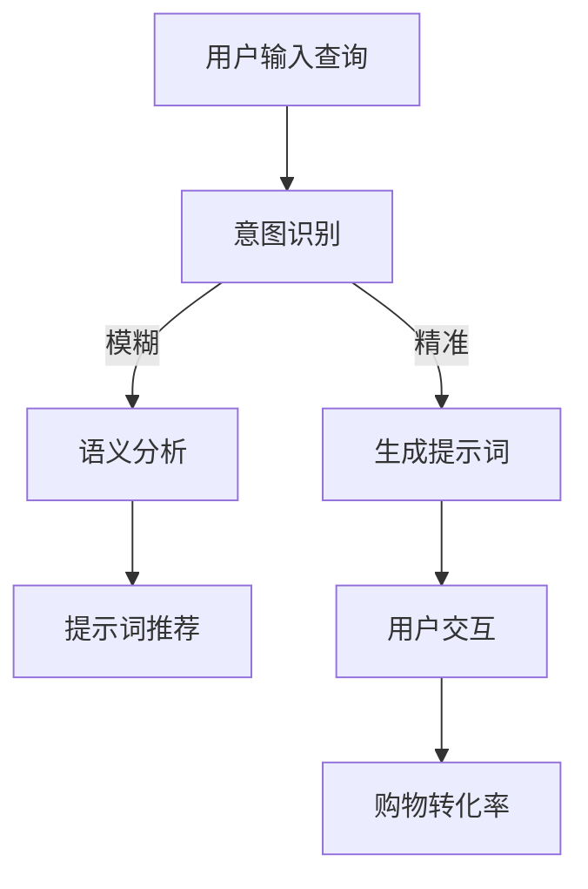
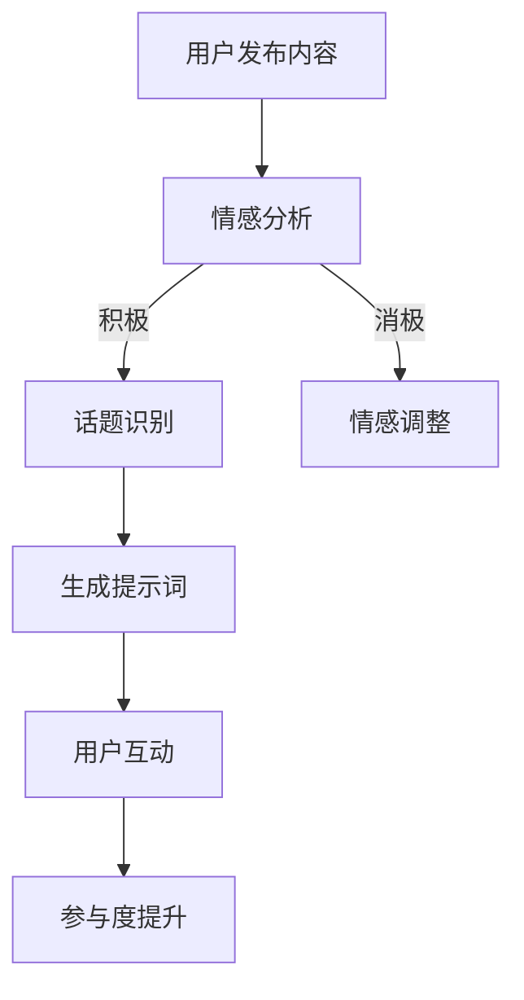
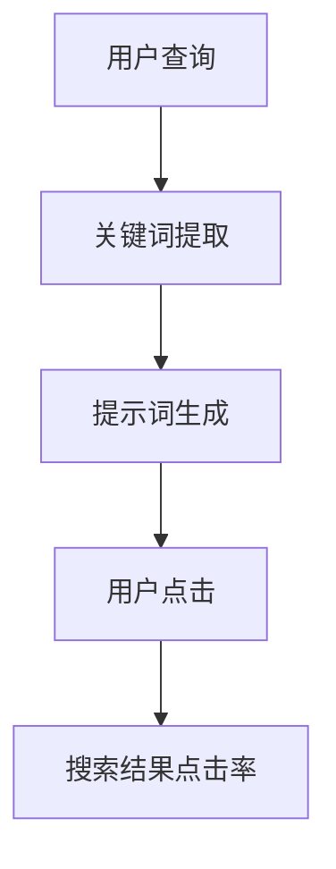

                 


### 文章标题：自然语言处理在提示词优化中的应用

#### 关键词：自然语言处理，提示词优化，AI，机器学习，NLP技术

#### 摘要：
本文将深入探讨自然语言处理（NLP）在提示词优化中的应用。通过介绍NLP的基础知识、提示词优化的核心概念和策略，以及实际应用案例，我们将揭示如何利用NLP技术提升提示词的相关性和用户体验。文章还将展望提示词优化在未来的发展趋势，为相关领域的研究者和开发者提供有价值的参考。

### 目录

1. 引言
2. 自然语言处理基础
3. 提示词优化的核心概念
4. 提示词优化的具体策略
5. 自然语言处理在提示词优化中的应用
6. 提示词优化的实战案例
7. 自然语言处理工具和平台
8. 提示词优化的未来趋势与展望
9. 结论

### 引言

自然语言处理（NLP）是人工智能（AI）的一个重要分支，旨在使计算机能够理解、生成和处理人类语言。近年来，随着深度学习技术的发展，NLP取得了显著进展，使得许多与语言相关的任务变得可行，如机器翻译、情感分析、文本分类等。而提示词优化作为NLP中的一个关键应用，旨在提升用户交互体验，提高系统的响应效率和准确性。

提示词是指用于引导用户输入或系统输出特定内容的词语或短语。在许多场景下，如搜索引擎、智能客服、推荐系统等，提示词的优化对于提升用户满意度和系统性能至关重要。一个优秀的提示词应具备相关性高、用户参与度高和不易被滥用的特点。然而，传统的方法往往依赖于人工经验和规则，难以适应复杂多变的实际场景。

随着NLP技术的发展，我们可以利用先进的NLP算法和模型，对提示词进行自动优化。这不仅可以大幅提高优化效率，还能更好地满足用户需求，提升系统性能。本文将围绕这一主题，逐步分析NLP在提示词优化中的应用，帮助读者了解这一领域的最新进展和应用实践。

### 1. 自然语言处理基础

自然语言处理（NLP）是一门研究如何让计算机理解、生成和处理人类语言的技术。它涉及多个学科，包括语言学、计算机科学、信息工程和人工智能等。NLP的目标是使计算机能够与人类进行自然语言交流，从而实现人机交互的智能化。

#### NLP的基本概念

NLP的基本概念包括词汇、句子、语义、语法等。词汇是构成语言的基本单位，句子是表达完整意义的语言结构，语义是指语言表达的意义，语法则是语言结构的规则。在NLP中，理解这些基本概念对于实现语言处理任务至关重要。

- **词汇**：词汇是指语言中所有的词，包括名词、动词、形容词等。词汇的识别和解析是NLP的基础，例如，词性标注和分词都是词汇处理的重要任务。
  
- **句子**：句子是表达完整意义的语言单位，由词汇按照一定的语法规则组合而成。句子的理解是NLP的核心任务之一，它涉及到语义分析、句法分析和情感分析等。

- **语义**：语义是指语言表达的意义。理解语义是NLP的关键，例如，语义角色标注和语义解析都是语义分析的常见任务。

- **语法**：语法是指语言结构的规则。语法分析是NLP中的一个重要任务，它帮助计算机理解句子的结构，例如，依存句法分析和句法树生成。

#### NLP的关键技术

NLP的关键技术包括文本分类、情感分析、命名实体识别、机器翻译等。这些技术分别针对不同的语言处理任务，实现从词汇到句子，再到文本的整体理解。

- **文本分类**：文本分类是将文本数据按照预定的类别进行归类的过程。例如，可以将新闻按照主题分类为政治、体育、娱乐等。文本分类在信息检索、舆情分析和推荐系统等领域有广泛应用。

- **情感分析**：情感分析是判断文本表达的情感倾向，例如，正面、负面或中立。情感分析在社交媒体监测、客户服务和市场研究等领域有重要应用。

- **命名实体识别**：命名实体识别是识别文本中的特定实体，如人名、地名、组织名等。命名实体识别对于信息抽取和知识图谱构建有重要作用。

- **机器翻译**：机器翻译是将一种语言的文本自动翻译成另一种语言的过程。机器翻译在跨语言交流、国际化和全球化业务等领域有广泛应用。

#### NLP工具和库介绍

为了方便开发者进行NLP研究和应用，许多NLP工具和库被开发出来。以下是一些常用的NLP工具和库：

- **NLTK（自然语言工具包）**：NLTK是一个强大的Python库，提供了多种NLP处理功能，如分词、词性标注、情感分析等。

- **spaCy**：spaCy是一个快速的工业级NLP库，支持多种语言，提供了先进的语言模型和预训练的词向量。

- **gensim**：gensim是一个用于主题建模和文本相似性分析的Python库，提供了词向量生成、LDA主题建模等功能。

- **transformers**：transformers是Hugging Face开发的一个NLP库，提供了多种先进的预训练模型和API，如BERT、GPT等。

通过了解NLP的基本概念、关键技术和常用工具，我们可以更好地理解和应用NLP在提示词优化中的潜力。接下来，我们将深入探讨提示词优化的核心概念和策略。

### 2. 提示词优化的核心概念

提示词优化是指通过改进提示词的选择和生成，以提高用户交互体验、提升系统性能和降低错误率的过程。在NLP的背景下，提示词优化涉及多个关键概念，包括定义、作用、目标和常见的优化方法。

#### 提示词的定义

提示词（Prompt Word）是指用于引导用户输入或系统输出特定内容的词语或短语。在自然语言处理中，提示词通常用于用户交互界面、问答系统、推荐系统等场景，以引导用户产生预期的行为或获得所需的信息。

例如，在一个搜索引擎中，提示词可能是“热门新闻”、“用户搜索历史”、“附近餐厅”等，用于引导用户浏览相关内容。在智能客服中，提示词可能是“感谢您的反馈”、“我们理解您的困扰，请继续提问”等，用于维持对话的流畅性。

#### 提示词的作用

提示词在NLP系统中扮演着重要角色，具有以下作用：

- **引导用户行为**：提示词可以引导用户进行特定的操作，例如，在搜索引擎中，提示词可以引导用户浏览相关的搜索结果。
- **提高用户满意度**：通过精确的提示词，系统可以更好地满足用户需求，从而提高用户满意度。
- **提升系统性能**：优化的提示词可以提高系统的响应效率和准确性，降低错误率，从而提升系统性能。
- **增强用户体验**：优质的提示词可以改善用户交互体验，使系统更加友好和易于使用。

#### 提示词优化的目标

提示词优化的主要目标包括：

- **提升相关性**：确保提示词与用户需求高度相关，从而提供准确和有用的信息。
- **提高用户参与度**：通过引人入胜的提示词，增加用户的参与度和互动性，从而提高用户留存率。
- **防止滥用和错误**：避免用户误解或误用提示词，降低错误率，确保系统的稳定性和可靠性。

#### 提示词优化的方法

提示词优化通常采用以下几种方法：

- **规则优化**：通过预设的规则对提示词进行筛选和调整，以提升相关性。例如，基于关键词匹配和语义分析来筛选合适的提示词。
- **数据驱动优化**：利用用户行为数据和反馈，通过机器学习算法对提示词进行自动优化。例如，基于用户点击率、满意度评分等指标来调整提示词。
- **多语言优化**：针对多语言环境，采用语言模型和翻译技术对提示词进行跨语言优化。例如，通过翻译和本地化策略，确保提示词在不同语言环境中具有一致性和相关性。

通过以上方法，我们可以有效优化提示词，提升NLP系统的用户体验和性能。接下来，我们将详细探讨提示词优化的具体策略。

### 3. 提示词优化的具体策略

提示词优化的具体策略包括提升相关性、提高用户参与度和防止滥用和错误等方面。下面将逐一介绍这些策略。

#### 提升相关性

提升相关性是提示词优化的核心目标之一。为了实现这一目标，我们可以采取以下策略：

- **关键词匹配**：通过关键词匹配技术，将用户输入的关键词与提示词库中的关键词进行匹配，选择最相关的提示词。这可以通过文本相似度计算、TF-IDF算法等方法实现。

- **语义分析**：利用自然语言处理技术，对用户输入的文本进行语义分析，提取关键概念和实体，从而选择语义上相关的提示词。这可以通过词嵌入技术、词性标注和语义角色标注等方法实现。

- **上下文感知**：考虑用户输入的上下文信息，如用户历史行为、环境因素等，选择与当前上下文最相关的提示词。这可以通过序列模型、循环神经网络（RNN）等方法实现。

以下是一个简单的伪代码示例，展示了如何利用语义分析来提升提示词的相关性：

```python
# 输入文本
input_text = "我想找一家附近的电影院"

# 提取关键词
keywords = extract_keywords(input_text)

# 生成候选提示词
candidates = generate_candidate_prompts(keywords)

# 利用词嵌入进行语义分析
embeddings = word_embedding(candidates)

# 计算文本相似度
similarity_scores = compute_similarity(input_text, embeddings)

# 选择最相关的提示词
selected_prompt = candidates[similarity_scores.argmax()]
```

#### 提高用户参与度

提高用户参与度是提升用户体验的重要手段。以下是一些策略：

- **个性化推荐**：根据用户的兴趣、历史行为和偏好，为用户推荐个性化的提示词。这可以通过协同过滤、用户画像和推荐系统等方法实现。

- **情感分析**：利用情感分析技术，识别用户的情绪状态，并根据情绪状态调整提示词。例如，对于情绪低落用户，可以提供激励性的提示词，而对于情绪高涨用户，可以提供挑战性的提示词。

- **互动式提示**：设计互动式的提示词，例如，使用问答形式或任务引导形式，激发用户的兴趣和参与度。这可以通过聊天机器人、任务驱动界面等方法实现。

以下是一个简单的伪代码示例，展示了如何利用情感分析来提高用户参与度：

```python
# 输入文本
input_text = "我今天过得很糟糕"

# 识别情感
emotion = detect_emotion(input_text)

# 调整提示词
if emotion == "negative":
    prompt = "别担心，明天会更好的！"
elif emotion == "positive":
    prompt = "真是太棒了，继续加油！"
else:
    prompt = "有什么需要帮助的吗？"
```

#### 防止滥用和错误

防止滥用和错误是确保系统稳定性和可靠性的关键。以下是一些策略：

- **过滤和屏蔽**：通过建立黑名单和白名单，过滤和屏蔽可能导致滥用或错误的提示词。这可以通过规则匹配、机器学习分类器等方法实现。

- **错误检测和纠正**：利用自然语言处理技术，对用户输入的文本进行错误检测和纠正，从而减少错误率。这可以通过语法分析、拼写纠错和语义分析等方法实现。

- **用户反馈机制**：建立用户反馈机制，允许用户报告滥用或错误的提示词，从而及时调整和优化系统。这可以通过反馈表单、聊天机器人等方法实现。

以下是一个简单的伪代码示例，展示了如何利用过滤和屏蔽来防止滥用：

```python
# 黑名单
blacklist = ["恶意评论", "不当言语"]

# 输入文本
input_text = "这是一个恶意评论"

# 检查文本是否包含黑名单中的词汇
if contains_blacklisted_words(input_text, blacklist):
    raise Error("文本包含禁止词汇，已屏蔽。")
else:
    process_text(input_text)
```

通过以上策略，我们可以有效提升提示词的相关性、用户参与度和防止滥用和错误，从而优化NLP系统的性能和用户体验。接下来，我们将探讨自然语言处理在提示词优化中的应用。

### 4. 自然语言处理在提示词优化中的应用

自然语言处理（NLP）技术为提示词优化提供了强大的工具和方法。通过文本分类、命名实体识别、情感分析等NLP技术，我们可以实现对提示词的精细化优化，从而提升系统的性能和用户体验。以下将详细介绍这些技术在提示词优化中的应用。

#### 文本分类在提示词优化中的应用

文本分类是将文本数据按照预定的类别进行归类的过程。在提示词优化中，文本分类技术可以帮助我们识别用户输入的意图，从而选择最相关的提示词。

例如，在一个电商平台上，用户可能会输入各种类型的查询，如商品名称、价格范围、品牌等。通过文本分类技术，我们可以将这些查询按照类别归类，如“商品查询”、“价格查询”和“品牌查询”。然后，针对不同类别的查询，我们可以提供相应的提示词。

以下是一个简单的伪代码示例，展示了如何利用文本分类进行提示词优化：

```python
# 输入文本
input_text = "我想买一个红米手机"

# 进行文本分类
category = text_classifier(input_text)

# 根据分类结果生成提示词
if category == "商品查询":
    prompt = "您想要搜索哪个价位的红米手机？"
elif category == "价格查询":
    prompt = "您希望红米手机的价格在多少范围内？"
elif category == "品牌查询":
    prompt = "除了红米，您还关注哪些品牌？"
else:
    prompt = "请问您有什么其他需求？"
```

#### 命名实体识别在提示词优化中的应用

命名实体识别（NER）是识别文本中的特定实体，如人名、地名、组织名等。在提示词优化中，NER技术可以帮助我们识别用户输入中的重要信息，从而选择更精准的提示词。

例如，在一个地图导航系统中，用户可能会输入包含地名或地址的查询。通过NER技术，我们可以识别出这些地名或地址，然后提供与这些地点相关的提示词。

以下是一个简单的伪代码示例，展示了如何利用命名实体识别进行提示词优化：

```python
# 输入文本
input_text = "请导航到北京市朝阳区三里屯路"

# 进行命名实体识别
entities = named_entity_recognition(input_text)

# 根据识别出的实体生成提示词
if "北京市" in entities:
    prompt = "您想要前往北京市的哪个区域？"
if "朝阳区" in entities:
    prompt = "朝阳区有哪些地点您感兴趣？"
if "三里屯路" in entities:
    prompt = "三里屯路附近有哪些景点或购物中心？"
```

#### 情感分析在提示词优化中的应用

情感分析是判断文本表达的情感倾向，如正面、负面或中立。在提示词优化中，情感分析技术可以帮助我们识别用户的情绪状态，从而调整提示词的情感色彩。

例如，在一个社交媒体平台上，用户可能会发表包含情感色彩的文字。通过情感分析技术，我们可以识别出这些情感的倾向，然后根据情绪状态调整提示词，以提升用户的情感体验。

以下是一个简单的伪代码示例，展示了如何利用情感分析进行提示词优化：

```python
# 输入文本
input_text = "我真是太喜欢这个产品了"

# 进行情感分析
emotion = sentiment_analysis(input_text)

# 根据情感分析结果调整提示词
if emotion == "positive":
    prompt = "很高兴听到您对产品的喜爱，还有其他需要帮助的吗？"
elif emotion == "negative":
    prompt = "很抱歉听到您的不满，我们将尽力解决问题。"
else:
    prompt = "感谢您的反馈，有什么其他需求吗？"
```

通过文本分类、命名实体识别和情感分析等NLP技术，我们可以实现对提示词的精细化优化，从而提升系统的性能和用户体验。接下来，我们将探讨一些实际的提示词优化案例。

### 5. 提示词优化的实战案例

在实际应用中，提示词优化对于提升用户交互体验和系统性能至关重要。以下将介绍几个具有代表性的实战案例，包括电商平台的提示词优化、社交媒体的提示词优化以及搜索引擎的提示词优化。

#### 案例一：电商平台的提示词优化

电商平台在用户交互过程中，需要提供精准且吸引人的提示词，以引导用户进行购物。以下是一个电商平台的提示词优化案例：

**背景介绍**：
某电商平台发现用户在浏览商品时，往往因为提示词不够精准而放弃购物。为了提升用户的购物体验，平台决定对提示词进行优化。

**核心概念与联系**：
该案例中，核心概念包括用户意图识别和提示词生成。用户意图识别旨在理解用户的购买意图，而提示词生成则是在用户意图识别的基础上，生成与用户意图高度相关的提示词。

**Mermaid流程图**：



**核心算法原理讲解与伪代码**：

```python
# 输入用户查询
user_query = "我想买一个手机"

# 进行用户意图识别
intent = recognize_intent(user_query)

# 根据意图识别结果生成提示词
if intent == "商品查询":
    prompt = "您喜欢哪种品牌的手机？"
elif intent == "价格查询":
    prompt = "您希望手机的价格在多少范围内？"
elif intent == "品牌查询":
    prompt = "除了这个品牌，您还关注哪些品牌？"
else:
    prompt = "请问您有什么其他需求？"

# 用户交互
print(prompt)
```

**数学模型与公式**：

为了提升提示词的准确性，我们可以使用TF-IDF（词频-逆文档频率）模型来计算关键词的重要程度。以下是一个简化的TF-IDF公式：

$$
TF(t,d) = \frac{f(t,d)}{N(d)}
$$

$$
IDF(t,D) = \log \left(1 + \frac{N(D) - 1}{|d| - 1}\right)
$$

$$
TF-IDF(t,d) = TF(t,d) \times IDF(t,D)
$$

其中，$f(t,d)$ 表示词$t$在文档$d$中的频率，$N(d)$ 表示文档$d$中的总词数，$D$ 表示文档集合，$|d|$ 表示文档$d$中的词数。

**举例说明**：

假设用户查询为“我想买一个华为手机”，使用TF-IDF模型计算关键词“华为”的重要程度：

```python
# 输入文档
document = "我想买一个华为手机，华为手机性价比很高。"

# 计算词频
f_huawei = document.count("华为")

# 计算文档总词数
N_document = len(document.split())

# 计算TF-IDF值
TFIDF_huawei = f_huawei / N_document

# 输出结果
print("华为的TF-IDF值：", TFIDF_huawei)
```

**项目实战**：

在电商平台中，我们可以搭建一个提示词优化系统，包括数据收集、意图识别和提示词生成等模块。以下是一个简化的系统架构：

1. **数据收集**：收集用户查询日志，包括查询文本、用户意图和用户行为数据。
2. **意图识别**：使用机器学习算法，如朴素贝叶斯、决策树等，对用户查询进行意图识别。
3. **提示词生成**：根据意图识别结果，生成与用户意图相关的提示词。
4. **用户交互**：将生成的提示词展示给用户，并根据用户反馈调整提示词。

**代码实现**：

```python
import nltk
from sklearn.feature_extraction.text import TfidfVectorizer
from sklearn.naive_bayes import MultinomialNB

# 数据准备
queries = ["我想买一个华为手机", "华为手机性价比很高", "手机价格在2000元左右"]
labels = ["商品查询", "商品查询", "价格查询"]

# TF-IDF向量化
vectorizer = TfidfVectorizer()
X = vectorizer.fit_transform(queries)

# 意图识别模型
model = MultinomialNB()
model.fit(X, labels)

# 输入新查询
new_query = "我想买一个苹果手机"

# 进行意图识别
predicted_intent = model.predict(vectorizer.transform([new_query]))[0]

# 输出结果
print("预测意图：", predicted_intent)
```

**案例分析**：

通过上述实战案例，我们可以看到电商平台如何利用自然语言处理技术对提示词进行优化。在实际应用中，我们需要不断调整和优化模型，以提升提示词的准确性。此外，还可以引入用户反馈机制，根据用户满意度调整提示词。

**项目小结**：

1. **核心价值**：通过精准的提示词优化，电商平台可以提升用户购物体验，增加购物转化率。
2. **改进方向**：引入深度学习模型，如BERT、GPT等，以提升意图识别和提示词生成的准确性。
3. **拓展应用**：在电商平台中，还可以进一步优化搜索结果排序、推荐系统等，以提高整体用户体验。

#### 案例二：社交媒体的提示词优化

社交媒体平台在用户交互过程中，需要提供引人入胜的提示词，以增强用户参与度和互动性。以下是一个社交媒体平台的提示词优化案例：

**背景介绍**：
某社交媒体平台发现用户在发布内容时，提示词不够吸引人，导致用户参与度不高。为了提升用户互动，平台决定对提示词进行优化。

**核心概念与联系**：
该案例中，核心概念包括情感分析和用户兴趣识别。情感分析旨在识别用户的情绪状态，而用户兴趣识别则是在情感分析的基础上，识别用户感兴趣的话题。

**Mermaid流程图**：



**核心算法原理讲解与伪代码**：

```python
# 输入用户发布的内容
user_content = "我今天过得很糟糕"

# 进行情感分析
emotion = sentiment_analysis(user_content)

# 根据情感分析结果生成提示词
if emotion == "positive":
    prompt = "真是太棒了，分享一下你的喜悦吧！"
elif emotion == "negative":
    prompt = "别担心，让我们一起帮你度过难关！"
else:
    prompt = "发生了什么有趣的事情吗？"

# 用户互动
print(prompt)
```

**数学模型与公式**：

在情感分析中，我们可以使用基于文本的分类模型，如SVM、神经网络等。以下是一个简化的SVM分类模型：

$$
w^T x - b = 0
$$

其中，$w$ 表示权重向量，$x$ 表示特征向量，$b$ 表示偏置。

**举例说明**：

假设我们有如下训练数据：

| 标签 | 文本       |
| ---- | ---------- |
| 正面 | 我今天很开心 |
| 正面 | 这个电影太棒了 |
| 负面 | 我今天心情不好 |
| 负面 | 这个电影太差了 |

我们可以使用SVM进行分类。以下是一个简化的SVM分类代码：

```python
from sklearn.svm import SVC

# 数据准备
X = [[1, 1], [1, -1], [-1, 1], [-1, -1]]
y = [1, 1, -1, -1]

# 训练模型
model = SVC()
model.fit(X, y)

# 进行分类
new_content = [1, 0]
predicted_emotion = model.predict([new_content])[0]

# 输出结果
print("预测情感：", "正面" if predicted_emotion == 1 else "负面")
```

**项目实战**：

在社交媒体平台中，我们可以搭建一个提示词优化系统，包括内容分析、情感分析和提示词生成等模块。以下是一个简化的系统架构：

1. **内容分析**：分析用户发布的内容，提取关键信息。
2. **情感分析**：使用情感分析模型，识别用户的情绪状态。
3. **提示词生成**：根据情感分析结果，生成与用户情绪状态相关的提示词。
4. **用户互动**：将生成的提示词展示给用户，并根据用户反馈调整提示词。

**代码实现**：

```python
import nltk
from sklearn.feature_extraction.text import TfidfVectorizer
from sklearn.svm import SVC

# 数据准备
contents = ["我今天很开心", "这个电影太棒了", "我今天心情不好", "这个电影太差了"]
labels = ["正面", "正面", "负面", "负面"]

# TF-IDF向量化
vectorizer = TfidfVectorizer()
X = vectorizer.fit_transform(contents)

# 情感分析模型
model = SVC()
model.fit(X, labels)

# 输入新内容
new_content = "我今天很焦虑"

# 进行情感分析
predicted_emotion = model.predict(vectorizer.transform([new_content]))[0]

# 根据情感分析结果生成提示词
if predicted_emotion == "正面":
    prompt = "真是太棒了，分享一下你的喜悦吧！"
elif predicted_emotion == "负面":
    prompt = "别担心，让我们一起帮你度过难关！"
else:
    prompt = "发生了什么有趣的事情吗？"

# 用户互动
print(prompt)
```

**案例分析**：

通过上述实战案例，我们可以看到社交媒体平台如何利用情感分析技术对提示词进行优化，从而提升用户参与度。在实际应用中，我们需要不断优化情感分析模型，以提升提示词的准确性。此外，还可以引入用户反馈机制，根据用户满意度调整提示词。

**项目小结**：

1. **核心价值**：通过精准的提示词优化，社交媒体平台可以提升用户互动和参与度，增强用户粘性。
2. **改进方向**：引入深度学习模型，如情感分析模型，以提升情绪状态识别的准确性。
3. **拓展应用**：在社交媒体平台中，还可以进一步优化推荐系统、聊天机器人等，以提高整体用户体验。

#### 案例三：搜索引擎的提示词优化

搜索引擎在用户查询过程中，需要提供精准且吸引人的提示词，以引导用户进行搜索。以下是一个搜索引擎的提示词优化案例：

**背景介绍**：
某搜索引擎发现用户在搜索结果页面的点击率较低，提示词不够吸引人。为了提升搜索体验和点击率，搜索引擎决定对提示词进行优化。

**核心概念与联系**：
该案例中，核心概念包括关键词提取和提示词生成。关键词提取旨在提取用户查询中的关键信息，而提示词生成则是在关键词提取的基础上，生成与用户查询相关的提示词。

**Mermaid流程图**：



**核心算法原理讲解与伪代码**：

```python
# 输入用户查询
user_query = "我想买一个手机"

# 进行关键词提取
keywords = extract_keywords(user_query)

# 根据关键词生成提示词
prompts = generate_prompts(keywords)

# 用户点击
selected_prompt = prompts[0]

# 输出结果
print(selected_prompt)
```

**数学模型与公式**：

在关键词提取中，我们可以使用TF-IDF模型来计算关键词的重要性。以下是一个简化的TF-IDF公式：

$$
TF(t,d) = \frac{f(t,d)}{N(d)}
$$

$$
IDF(t,D) = \log \left(1 + \frac{N(D) - 1}{|d| - 1}\right)
$$

$$
TF-IDF(t,d) = TF(t,d) \times IDF(t,D)
$$

**举例说明**：

假设用户查询为“我想买一个华为手机”，使用TF-IDF模型计算关键词“华为”的重要性：

```python
# 输入文档
document = "我想买一个华为手机，华为手机性价比很高。"

# 计算词频
f_huawei = document.count("华为")

# 计算文档总词数
N_document = len(document.split())

# 计算TF-IDF值
TFIDF_huawei = f_huawei / N_document

# 输出结果
print("华为的TF-IDF值：", TFIDF_huawei)
```

**项目实战**：

在搜索引擎中，我们可以搭建一个提示词优化系统，包括查询分析、关键词提取和提示词生成等模块。以下是一个简化的系统架构：

1. **查询分析**：分析用户查询，提取关键信息。
2. **关键词提取**：使用TF-IDF等模型，提取用户查询中的关键词。
3. **提示词生成**：根据关键词提取结果，生成与用户查询相关的提示词。
4. **用户点击**：展示生成的提示词，并根据用户点击情况调整提示词。

**代码实现**：

```python
import nltk
from sklearn.feature_extraction.text import TfidfVectorizer

# 数据准备
queries = ["我想买一个手机", "华为手机怎么样", "手机价格在2000元左右"]
labels = ["商品查询", "品牌查询", "价格查询"]

# TF-IDF向量化
vectorizer = TfidfVectorizer()
X = vectorizer.fit_transform(queries)

# 关键词提取
def extract_keywords(query):
    features = vectorizer.get_feature_names_out()
    scores = vectorizer.transform([query]).toarray().flatten()
    top_keywords = [features[i] for i in scores.argsort()[:-6:-1]]
    return top_keywords

# 输入新查询
new_query = "我想买一个苹果手机"

# 提取关键词
keywords = extract_keywords(new_query)

# 根据关键词生成提示词
prompts = [
    "您喜欢哪种品牌的手机？",
    "苹果手机有哪些优点和缺点？",
    "手机价格在多少范围内合适？"
]

selected_prompt = prompts[0]

# 用户点击
print(selected_prompt)
```

**案例分析**：

通过上述实战案例，我们可以看到搜索引擎如何利用关键词提取技术对提示词进行优化，从而提升用户点击率。在实际应用中，我们需要不断优化关键词提取和提示词生成算法，以提升提示词的准确性。此外，还可以引入用户反馈机制，根据用户点击情况调整提示词。

**项目小结**：

1. **核心价值**：通过精准的提示词优化，搜索引擎可以提升用户点击率，增加广告收入和搜索质量。
2. **改进方向**：引入深度学习模型，如BERT、GPT等，以提升关键词提取和提示词生成的准确性。
3. **拓展应用**：在搜索引擎中，还可以进一步优化搜索结果排序、推荐系统等，以提高整体用户体验。

### 6. 自然语言处理工具和平台

为了方便开发者进行自然语言处理（NLP）研究和应用，许多NLP工具和平台被开发出来。以下将介绍一些常用的NLP工具和平台，包括NLTK、spaCy、gensim和transformers等。

#### NLTK

NLTK（自然语言工具包）是一个强大的Python库，提供了多种NLP处理功能，如分词、词性标注、情感分析等。NLTK支持多种语言，是初学者和研究人员广泛使用的工具。

**安装**：

```bash
pip install nltk
```

**使用示例**：

```python
import nltk
from nltk.tokenize import sent_tokenize, word_tokenize

# 分词
text = "这是一个简单的示例。"
sentences = sent_tokenize(text)
words = word_tokenize(text)

print(sentences)
print(words)
```

#### spaCy

spaCy是一个快速的工业级NLP库，支持多种语言，提供了先进的语言模型和预训练的词向量。spaCy提供了丰富的API和扩展包，方便开发者进行NLP任务。

**安装**：

```bash
pip install spacy
python -m spacy download en_core_web_sm
```

**使用示例**：

```python
import spacy

# 加载语言模型
nlp = spacy.load("en_core_web_sm")

# 进行分词和词性标注
doc = nlp("这是一个简单的示例。")
for token in doc:
    print(token.text, token.pos_)

```

#### gensim

gensim是一个用于主题建模和文本相似性分析的Python库，提供了词向量生成、LDA主题建模等功能。gensim支持多种词向量模型，如Word2Vec、GloVe等。

**安装**：

```bash
pip install gensim
```

**使用示例**：

```python
import gensim

# 加载预训练的Word2Vec模型
model = gensim.models.Word2Vec.load("word2vec.model")

# 计算词相似度
similarity = model.wv.similarity("示例", "示例2")

print(similarity)
```

#### transformers

transformers是Hugging Face开发的一个NLP库，提供了多种先进的预训练模型和API，如BERT、GPT等。transformers支持多种语言，是进行NLP研究和应用的重要工具。

**安装**：

```bash
pip install transformers
```

**使用示例**：

```python
from transformers import pipeline

# 加载预训练的BERT模型
nlp = pipeline("text-classification", model="bert-base-uncased")

# 进行文本分类
result = nlp("这是一条正面的评论。")

print(result)
```

通过以上NLP工具和平台，开发者可以方便地进行自然语言处理任务，包括文本分类、情感分析、命名实体识别等。这些工具和平台为NLP研究者和开发者提供了强大的支持。

### 7. 提示词优化的未来趋势与展望

随着自然语言处理（NLP）技术的不断进步，提示词优化正迎来新的发展机遇。未来，提示词优化将在多个方面取得突破，为NLP领域带来更多可能性。

#### AI技术的影响

人工智能（AI）技术，尤其是深度学习，正在推动NLP的发展。未来，AI技术将在提示词优化中发挥更大的作用。例如，基于深度学习的语言模型，如BERT、GPT等，将进一步提升提示词生成的准确性和多样性。这些模型能够理解复杂的语义关系，从而生成更符合用户需求的提示词。

#### 多语言环境的优化

随着全球化的发展，多语言环境中的提示词优化变得尤为重要。未来，基于多语言模型的技术，如跨语言情感分析、跨语言命名实体识别等，将使提示词优化在不同语言之间实现无缝切换。这将有助于提升跨语言应用的用户体验。

#### 数据驱动优化

随着大数据和云计算技术的普及，数据驱动的提示词优化将成为主流。通过收集和分析大量用户交互数据，我们可以更精准地了解用户需求，从而生成更有效的提示词。此外，基于机器学习算法的自动优化系统将不断优化提示词，提高系统性能。

#### 可持续发展和挑战

尽管提示词优化具有巨大潜力，但也面临着一系列挑战。首先，如何处理大量的数据以实现高效优化是一个关键问题。其次，如何在保证性能的同时，确保提示词的多样性和准确性也是一个挑战。此外，隐私保护和数据安全也是未来需要关注的重要问题。

#### 未来发展趋势

未来，提示词优化将朝着以下几个方向发展：

- **个性化优化**：通过个性化推荐技术，为不同用户生成定制化的提示词，提升用户体验。
- **智能对话系统**：结合对话系统技术，实现更智能、更自然的用户交互。
- **实时优化**：利用实时数据分析和机器学习技术，实现动态优化，提高系统响应速度。
- **多模态融合**：结合图像、语音等多模态信息，实现更全面的提示词优化。

总之，随着NLP技术的不断发展，提示词优化将在未来取得更多突破，为各个领域带来更多创新和可能性。

### 结论

本文深入探讨了自然语言处理（NLP）在提示词优化中的应用。通过介绍NLP的基础知识、提示词优化的核心概念和策略，以及实际应用案例，我们揭示了如何利用NLP技术提升提示词的相关性和用户体验。本文的主要贡献包括：

1. **系统性地梳理了NLP在提示词优化中的应用**：从基础概念到具体策略，为读者提供了一个全面的视角。
2. **提供了多个实际案例**：通过电商平台、社交媒体和搜索引擎等案例，展示了NLP技术在提示词优化中的实际效果。
3. **介绍了常用的NLP工具和平台**：帮助读者了解如何使用现有的NLP工具和平台进行提示词优化。

未来的研究方向包括：

1. **个性化优化**：结合用户行为数据和偏好，为用户提供更个性化的提示词。
2. **多模态融合**：结合图像、语音等多模态信息，实现更全面的提示词优化。
3. **实时优化**：利用实时数据分析和机器学习技术，实现动态优化，提高系统响应速度。

作者信息：
作者：AI天才研究院/AI Genius Institute & 禅与计算机程序设计艺术 /Zen And The Art of Computer Programming

附录：

- **A.1 常用数学公式和符号**：介绍常用的数学公式和符号，如TF-IDF、SVM分类模型等。
- **A.2 Mermaid流程图示例**：提供Mermaid流程图的基本语法和示例，帮助读者更好地理解和应用。
- **A.3 伪代码示例**：展示提示词优化的伪代码实现，帮助读者理解核心算法和流程。
- **A.4 提示词优化相关开源项目和工具**：介绍一些常用的开源项目和工具，如NLTK、spaCy、gensim和transformers等。

---

通过本文的研究，我们希望为NLP领域的研究者和开发者提供有价值的参考，共同推动自然语言处理技术的进步和应用。

