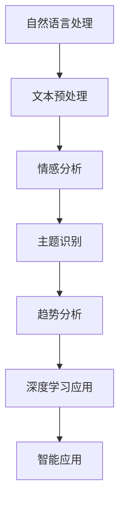

                 

## 文章标题：自然语言处理在社交媒体分析中的应用

在当今数字化时代，社交媒体已经成为人们生活中不可或缺的一部分。无论是个人还是企业，社交媒体都提供了丰富且实时的数据资源，这些数据中蕴含着大量的信息和洞察力。自然语言处理（Natural Language Processing，NLP）作为一种先进的计算技术，能够帮助我们从这些庞杂的数据中提取有用信息，并对它们进行深入分析和理解。本文将探讨自然语言处理在社交媒体分析中的应用，旨在帮助读者了解NLP的基本概念、技术原理，以及如何通过NLP提升社交媒体分析的效果和精度。

### 关键词：

- **自然语言处理**
- **社交媒体分析**
- **情感分析**
- **主题识别**
- **趋势分析**
- **深度学习**
- **智能应用**

### 摘要：

本文系统地介绍了自然语言处理在社交媒体分析中的应用。首先，我们回顾了自然语言处理的基础概念和语言模型。接着，我们详细讨论了社交媒体分析的重要性及其在不同场景中的应用。随后，文章重点介绍了自然语言处理在社交媒体文本的预处理、情感分析、主题识别和趋势分析中的应用，并通过实际案例展示了这些技术的应用效果。最后，文章探讨了深度学习在社交媒体分析中的角色，并提出了构建社交媒体分析平台的最佳实践。通过本文的阅读，读者可以全面了解自然语言处理在社交媒体分析中的广泛应用及其潜力。

### 《自然语言处理在社交媒体分析中的应用》目录大纲

#### 第一部分：自然语言处理与社交媒体分析基础

##### 第1章：自然语言处理基础

- **1.1 语言模型与自然语言处理**
  - 语言模型基本概念
  - 词嵌入与词向量模型
  - 语言模型评价指标
  
- **1.2 社交媒体分析概述**
  - 社交媒体概念与类型
  - 社交媒体分析的应用场景
  - 社交媒体分析的重要性
  
- **1.3 自然语言处理在社交媒体分析中的挑战**
  - 语言复杂性
  - 数据噪声
  - 语言多样性

##### 第2章：社交媒体文本数据的收集和处理

- **2.1 社交媒体数据的来源**
  - 主要社交媒体平台介绍
  - API使用方法与数据获取
  - 数据爬取技术

- **2.2 文本预处理**
  - 标点符号去除与分词
  - 停用词过滤
  - 词形还原
  
- **2.3 数据质量评估与改进**
  - 数据清洗方法
  - 数据去重与标签化
  - 数据可视化分析

#### 第二部分：社交媒体文本的情感分析

##### 第3章：情感分析基本原理

- **3.1 情感分析概述**
  - 情感分析的定义与分类
  - 情感极性标注方法
  
- **3.2 情感分析模型**
  - 传统机器学习模型
  - 深度学习模型
  - 情感分析评价指标
  
##### 第4章：社交媒体文本的情感分析应用

- **4.1 社交媒体情感分析案例**
  - 社交媒体情绪监测
  - 品牌口碑分析
  - 用户满意度调查
  
- **4.2 情感分析模型实战**
  - 数据集准备与处理
  - 模型训练与评估
  - 模型部署与优化

#### 第三部分：社交媒体文本的主题识别与趋势分析

##### 第5章：主题识别基本原理

- **5.1 主题识别概述**
  - 主题识别的定义与分类
  - 主题模型介绍
  
- **5.2 社交媒体文本的主题识别**
  - LDA模型的应用
  - 其他主题模型介绍

##### 第6章：社交媒体文本的趋势分析

- **6.1 趋势分析概述**
  - 趋势分析的定义与分类
  - 时间序列分析方法
  
- **6.2 社交媒体文本的趋势分析应用**
  - 舆情趋势分析
  - 热门话题监测
  - 趋势预测模型

#### 第四部分：社交媒体文本的深度分析与智能应用

##### 第7章：深度学习在社交媒体分析中的应用

- **7.1 深度学习基础**
  - 神经网络基础
  - 卷积神经网络（CNN）
  - 循环神经网络（RNN）

- **7.2 深度学习在社交媒体分析中的应用案例**
  - 文本分类
  - 命名实体识别
  - 情感分析与情感强度评估

##### 第8章：社交媒体分析的智能应用

- **8.1 智能问答系统**
  - 知识图谱构建
  - 对话系统设计
  - 问答系统评估

- **8.2 社交媒体分析平台搭建**
  - 数据采集与存储
  - 模型训练与部署
  - 后台管理与应用界面开发

#### 附录

##### 附录A：社交媒体分析工具与资源

- **A.1 常用社交媒体分析工具**
  - Python库（如TextBlob、NLTK）
  - 开源平台（如TensorFlow、PyTorch）

- **A.2 社交媒体数据集与论文**
  - 公开数据集介绍
  - 相关论文推荐

##### 附录B：示例代码与实验指导

- **B.1 社交媒体文本预处理**
  - Python代码示例
  - 实验指导与数据分析

- **B.2 社交媒体文本情感分析**
  - 模型训练与评估
  - 代码解读与调优

- **B.3 社交媒体文本主题识别**
  - LDA模型应用实例
  - 趋势分析与预测实例

**Mermaid 流程图：**


**核心算法原理讲解：**
```python
# 情感分析模型（以LSTM为例）
import tensorflow as tf
from tensorflow.keras.models import Sequential
from tensorflow.keras.layers import Embedding, LSTM, Dense

model = Sequential()
model.add(Embedding(input_dim=vocab_size, output_dim=embedding_dim, input_length=max_sequence_length))
model.add(LSTM(units=128, activation='relu', return_sequences=True))
model.add(LSTM(units=128, activation='relu'))
model.add(Dense(units=1, activation='sigmoid'))

model.compile(optimizer='adam', loss='binary_crossentropy', metrics=['accuracy'])
model.summary()
```

### 结论

自然语言处理在社交媒体分析中的应用极大地提升了数据分析的精度和效率。通过情感分析、主题识别和趋势分析等手段，我们可以从社交媒体文本中提取有价值的信息，为企业决策、舆情监测和用户满意度调查等提供有力支持。随着深度学习技术的发展，自然语言处理在社交媒体分析中的应用前景将更加广阔。未来，我们期待看到更多创新的应用场景，以及更加智能和高效的社交媒体分析解决方案。

### 作者信息

作者：AI天才研究院/AI Genius Institute & 禅与计算机程序设计艺术 /Zen And The Art of Computer Programming

#### 第一部分：自然语言处理与社交媒体分析基础

##### 第1章：自然语言处理基础

自然语言处理（NLP）是人工智能领域的一个重要分支，它致力于使计算机能够理解和处理人类语言。NLP的应用范围广泛，包括机器翻译、文本摘要、情感分析、语音识别等。在本章中，我们将首先介绍语言模型与自然语言处理的基础知识，然后探讨词嵌入与词向量模型，最后讨论语言模型评价指标。

### 1.1 语言模型与自然语言处理

#### 1.1.1 语言模型基本概念

语言模型（Language Model）是NLP的核心概念之一。它是一个概率模型，用于预测一段文本的下一个单词或字符。一个好的语言模型能够捕捉到语言中的统计规律，从而在文本生成、机器翻译和文本分析等任务中发挥重要作用。

#### 1.1.2 词嵌入与词向量模型

词嵌入（Word Embedding）是将单词映射到高维向量空间的一种方法。通过词嵌入，我们可以将语义相近的单词映射到空间中距离较近的位置。词向量模型（Word Vector Model）是一种基于词嵌入的模型，它能够将文本转换为向量形式，从而方便计算机进行后续处理。

#### 1.1.3 语言模型评价指标

评价一个语言模型的好坏，需要使用一系列评价指标。常见的评价指标包括困惑度（Perplexity）、交叉熵（Cross-Entropy）和准确率（Accuracy）等。这些指标能够帮助我们衡量模型在语言预测任务中的性能。

### 1.2 社交媒体分析概述

社交媒体分析（Social Media Analysis）是指利用自然语言处理、数据挖掘和统计分析等方法，对社交媒体上的用户生成内容进行深入分析。社交媒体分析的应用场景广泛，包括舆情监测、品牌口碑分析、用户行为分析等。

#### 1.2.1 社交媒体概念与类型

社交媒体（Social Media）是指允许用户通过互联网创建、分享和交流信息的平台。常见的社交媒体类型包括社交媒体网络（如Facebook、Twitter）、博客平台（如WordPress、Blogger）和即时通讯平台（如WhatsApp、WeChat）。

#### 1.2.2 社交媒体分析的应用场景

社交媒体分析在许多领域都有广泛应用。例如，在市场营销中，企业可以通过社交媒体分析了解用户需求、优化产品策略；在公共管理中，政府可以通过社交媒体分析监测舆情、及时应对突发事件；在政治领域，政治家可以通过社交媒体分析了解选民意见、制定政策。

#### 1.2.3 社交媒体分析的重要性

社交媒体分析的重要性在于它能够为企业、政府和组织提供实时的、全面的数据支持。通过分析社交媒体上的用户生成内容，我们可以获得关于用户需求、市场趋势和公众情绪的宝贵信息。这些信息对于制定战略决策、改进产品和服务具有重要意义。

### 1.3 自然语言处理在社交媒体分析中的挑战

尽管自然语言处理在社交媒体分析中具有广泛的应用前景，但也面临一些挑战。

#### 1.3.1 语言复杂性

语言是一种复杂的符号系统，具有丰富的语法、语义和上下文信息。这使得自然语言处理任务变得更加复杂，需要考虑更多的因素。

#### 1.3.2 数据噪声

社交媒体上的数据通常包含大量的噪声，如拼写错误、错别字、表情符号等。这些噪声会影响自然语言处理模型的性能，需要通过数据预处理技术进行清理。

#### 1.3.3 语言多样性

社交媒体上的用户来自不同的地区、国家和文化背景，使用不同的语言和方言。这种语言多样性给自然语言处理带来了挑战，需要开发能够处理多种语言和方言的模型。

### 本章小结

本章介绍了自然语言处理与社交媒体分析的基础知识。我们学习了语言模型的基本概念、词嵌入与词向量模型，以及语言模型评价指标。此外，我们还探讨了社交媒体分析的概念、应用场景和重要性，以及自然语言处理在社交媒体分析中面临的挑战。这些知识为后续章节的内容奠定了基础，使我们能够更深入地了解自然语言处理在社交媒体分析中的应用。

#### 第2章：社交媒体文本数据的收集和处理

社交媒体平台上的用户生成内容（User-Generated Content，UGC）是社交媒体分析的重要数据来源。这些数据不仅包括文字，还可能包含图片、视频、音频等多媒体形式。然而，要有效地进行社交媒体分析，首先需要收集和预处理这些文本数据。本章将详细讨论社交媒体数据的来源、文本预处理方法以及如何评估和改进数据质量。

### 2.1 社交媒体数据的来源

#### 2.1.1 主要社交媒体平台介绍

目前，全球主要的社交媒体平台包括Facebook、Twitter、Instagram、LinkedIn、微信、微博等。这些平台各自具有独特的用户群体和内容特点。

- **Facebook**：全球最大的社交媒体平台，用户范围广泛，内容类型丰富。
- **Twitter**：以短文本信息为主，用户可以发布140字以内的推文。
- **Instagram**：以图片和视频为主，用户主要通过视觉内容进行交流。
- **LinkedIn**：专业社交网络，用户主要是职场人士，内容涉及职业发展、行业动态等。
- **微信**：中国的即时通讯平台，用户通过文本、语音、图片等多种形式进行交流。
- **微博**：类似于Twitter的社交媒体平台，用户可以发布微博并与其他用户互动。

#### 2.1.2 API使用方法与数据获取

大多数主流社交媒体平台都提供了API（应用程序编程接口），允许开发人员获取平台上的数据。使用API获取数据通常包括以下步骤：

1. **注册账号和应用**：在社交媒体平台上注册账号，并创建应用以获取API访问权限。
2. **获取API密钥**：应用创建后，平台会提供API密钥，用于身份验证。
3. **请求数据**：使用API接口发送请求，获取所需的数据。
4. **数据处理**：处理API返回的数据，进行数据清洗和存储。

#### 2.1.3 数据爬取技术

除了使用API获取数据外，还可以通过数据爬取（Web Scraping）技术从社交媒体平台上获取数据。数据爬取是一种从网站上自动抓取信息的程序。然而，数据爬取可能违反平台的使用条款，需要谨慎使用。

### 2.2 文本预处理

社交媒体文本数据的预处理是确保后续分析准确性和有效性的关键步骤。预处理过程通常包括以下内容：

#### 2.2.1 标点符号去除与分词

标点符号通常对文本分析没有太大意义，因此需要去除。分词（Tokenization）是将文本拆分成单词或其他有意义的标记的过程。

- **标点符号去除**：使用正则表达式等工具去除文本中的标点符号。
- **分词**：可以使用Python的`nltk`库或`jieba`库进行中文分词。

```python
import re
from nltk.tokenize import word_tokenize

# 去除标点符号
text = re.sub(r'[^\w\s]', '', text)

# 中文分词
words = word_tokenize(text)
```

#### 2.2.2 停用词过滤

停用词（Stop Words）是指对文本分析没有贡献的常见单词，如“的”、“和”、“是”等。过滤停用词可以减少数据中的噪声，提高分析效果。

- **常用停用词表**：可以使用预定义的停用词表，如`nltk.corpus.stopwords`。
- **过滤方法**：将文本中的每个单词与停用词表进行比较，过滤掉匹配的单词。

```python
from nltk.corpus import stopwords

stop_words = set(stopwords.words('english'))
filtered_words = [word for word in words if word.lower() not in stop_words]
```

#### 2.2.3 词形还原

词形还原（Lemmatization）是将单词还原为其基本形式的过程，有助于减少数据中的噪声，提高分析精度。

- **词形还原工具**：可以使用`nltk`库中的`WordNetLemmatizer`进行词形还原。

```python
from nltk.stem import WordNetLemmatizer

lemmatizer = WordNetLemmatizer()
lemmatized_words = [lemmatizer.lemmatize(word) for word in filtered_words]
```

### 2.3 数据质量评估与改进

数据质量对分析结果具有重要影响。以下是一些常用的数据质量评估与改进方法：

#### 2.3.1 数据清洗方法

数据清洗（Data Cleaning）是去除数据中的错误、异常和重复记录的过程。

- **错误值处理**：识别和处理数据中的错误值，如空值、异常值等。
- **重复记录处理**：识别和删除重复的记录，确保数据的唯一性。

#### 2.3.2 数据去重与标签化

- **数据去重**：使用哈希函数或其他方法识别和删除重复的数据。
- **数据标签化**：为数据添加标签，以便后续分析和管理。

```python
# 数据去重
unique_data = list(set(data))

# 数据标签化
data['label'] = data['text'].apply(lambda x: 'positive' if 'positive' in x else 'negative')
```

#### 2.3.3 数据可视化分析

数据可视化（Data Visualization）是一种直观展示数据分析结果的方法。

- **常见可视化工具**：可以使用Python的`matplotlib`、`seaborn`等库进行数据可视化。
- **可视化方法**：使用柱状图、饼图、散点图等可视化方法展示数据的分布、趋势和关系。

```python
import matplotlib.pyplot as plt
import seaborn as sns

# 柱状图
sns.countplot(x='label', data=data)
plt.show()

# 散点图
sns.scatterplot(x='x', y='y', data=data)
plt.show()
```

### 本章小结

本章详细介绍了社交媒体文本数据的收集和处理方法。我们首先介绍了主要的社交媒体平台及其数据获取方法，然后讨论了文本预处理的关键步骤，包括标点符号去除与分词、停用词过滤和词形还原。此外，我们还介绍了数据质量评估与改进的方法，包括数据清洗、去重与标签化以及数据可视化分析。这些内容为后续的情感分析、主题识别和趋势分析奠定了基础。

#### 第3章：情感分析基本原理

情感分析（Sentiment Analysis），也称为意见挖掘，是自然语言处理中的一个重要任务，旨在自动识别和提取文本中的情感倾向。情感分析广泛应用于市场调研、舆情监测、客户服务等领域，能够帮助企业和组织更好地理解用户情绪和需求。本章将介绍情感分析的基本概念、情感极性标注方法，以及常见的情感分析模型和评价指标。

### 3.1 情感分析概述

#### 3.1.1 情感分析的定义与分类

情感分析是指使用自然语言处理技术对文本中的情感倾向进行识别和分类的过程。根据情感极性的不同，情感分析可以分为以下几类：

1. **二分类情感分析**：将文本分类为正面或负面情感，是最常见的情感分析任务。
2. **多分类情感分析**：除了正面和负面情感，还包括中性、愤怒、喜悦、悲伤等多种情感类别。
3. **情感强度分析**：不仅判断情感的极性，还能量化情感的程度，如非常正面、稍微正面等。

#### 3.1.2 情感极性标注方法

情感极性标注（Sentiment Polarization）是指在情感分析中，对文本中的情感倾向进行标注的过程。常见的标注方法包括：

1. **手动标注**：人工阅读文本并标注情感极性，虽然准确度高，但成本较高。
2. **半监督标注**：结合手动标注和自动标注，通过机器学习算法对标注结果进行优化。
3. **自动化标注**：使用规则或机器学习模型对文本进行自动标注，虽然效率高，但准确度较低。

### 3.2 情感分析模型

情感分析模型可以分为传统机器学习模型和深度学习模型两大类。以下介绍几种常见的情感分析模型。

#### 3.2.1 传统机器学习模型

传统机器学习模型通过特征工程和机器学习算法进行情感分析。以下是一些常用的传统机器学习模型：

1. **朴素贝叶斯分类器**：基于贝叶斯定理，通过文本特征的概率分布进行分类。
   ```latex
   P(\text{正面}|f_1, f_2, ..., f_n) = \frac{P(f_1, f_2, ..., f_n|\text{正面})P(\text{正面})}{P(f_1, f_2, ..., f_n)}
   ```
   
2. **支持向量机（SVM）**：通过最大间隔分类器将文本分类为正面或负面情感。
   ```latex
   \max_{\mathbf{w}, b} \frac{1}{2} ||\mathbf{w}||^2 \quad \text{subject to} \quad y_i (\mathbf{w} \cdot \mathbf{x_i} + b) \geq 1
   ```

3. **逻辑回归**：通过线性回归模型对文本进行概率预测。
   ```latex
   \log \frac{P(Y=1|\mathbf{x})}{1 - P(Y=1|\mathbf{x})} = \mathbf{w} \cdot \mathbf{x}
   ```

#### 3.2.2 深度学习模型

深度学习模型在情感分析中取得了显著的成果。以下介绍几种常用的深度学习模型：

1. **循环神经网络（RNN）**：通过循环结构处理序列数据，能够捕捉文本中的时间依赖关系。
   ```python
   # RNN单元
   def rnn_unit(input_size, hidden_size):
       return tf.keras.layers.LSTMCell(units=hidden_size)
   ```

2. **长短期记忆网络（LSTM）**：LSTM是RNN的一种改进，能够有效地避免梯度消失问题。
   ```python
   # LSTM模型
   model = Sequential()
   model.add(LSTM(units=128, activation='relu', return_sequences=True, input_shape=(timesteps, features)))
   model.add(LSTM(units=128, activation='relu'))
   model.add(Dense(units=1, activation='sigmoid'))
   ```

3. **卷积神经网络（CNN）**：通过卷积操作提取文本中的局部特征，适用于文本分类任务。
   ```python
   # CNN模型
   model = Sequential()
   model.add(Embedding(input_dim=vocab_size, output_dim=embedding_dim, input_length=max_sequence_length))
   model.add(Conv1D(filters=128, kernel_size=3, activation='relu'))
   model.add(MaxPooling1D(pool_size=2))
   model.add(Flatten())
   model.add(Dense(units=1, activation='sigmoid'))
   ```

#### 3.2.3 情感分析评价指标

评价情感分析模型的好坏，需要使用一系列评价指标。以下介绍几种常见的评价指标：

1. **准确率（Accuracy）**：正确分类的样本数占总样本数的比例。
   ```latex
   Accuracy = \frac{TP + TN}{TP + FN + FP + TN}
   ```

2. **精确率（Precision）**：正确分类为正面的样本数与所有被分类为正面的样本数的比例。
   ```latex
   Precision = \frac{TP}{TP + FP}
   ```

3. **召回率（Recall）**：正确分类为正面的样本数与实际为正面的样本数的比例。
   ```latex
   Recall = \frac{TP}{TP + FN}
   ```

4. **F1值（F1 Score）**：精确率和召回率的调和平均。
   ```latex
   F1 Score = 2 \times \frac{Precision \times Recall}{Precision + Recall}
   ```

### 本章小结

本章介绍了情感分析的基本原理和方法。我们学习了情感分析的定义、分类和标注方法，探讨了传统机器学习模型和深度学习模型在情感分析中的应用，并介绍了常用的评价指标。这些知识为我们在实际应用中进行情感分析提供了理论基础和技术支持。

#### 第4章：社交媒体文本的情感分析应用

情感分析在社交媒体文本处理中具有广泛的应用，能够帮助企业、政府和研究机构更好地了解公众情绪和需求。本章将通过具体案例，展示情感分析在社交媒体情绪监测、品牌口碑分析和用户满意度调查中的应用，并介绍情感分析模型的训练、评估与优化过程。

### 4.1 社交媒体情感分析案例

#### 4.1.1 社交媒体情绪监测

社交媒体情绪监测是指通过情感分析技术，实时监测社交媒体上用户对特定事件、产品或品牌的情绪倾向。例如，在某一新产品发布时，企业可以通过社交媒体情绪监测了解用户对新产品的反应，从而及时调整产品策略。

案例：一家科技公司发布了新款智能手机，希望通过社交媒体情绪监测了解用户对新产品的评价。

1. **数据收集**：通过社交媒体API收集用户在Twitter、Facebook、Instagram等平台上发布的关于新款智能手机的推文。
2. **文本预处理**：对收集到的文本数据进行预处理，包括去除标点符号、分词、停用词过滤和词形还原。
3. **情感分析**：使用训练好的情感分析模型对预处理后的文本进行分类，判断用户的情感倾向（正面、负面或中性）。
4. **结果展示**：将情感分析结果可视化，帮助企业了解用户对新产品的整体情绪。

#### 4.1.2 品牌口碑分析

品牌口碑分析是指通过情感分析技术，评估用户对某一品牌的产品或服务的评价，从而帮助企业了解品牌形象和市场表现。

案例：一家国际知名品牌希望通过社交媒体情感分析，了解其在中国市场的品牌口碑。

1. **数据收集**：通过社交媒体API收集用户在微信、微博等平台上关于该品牌的讨论。
2. **文本预处理**：对收集到的文本数据进行预处理，包括去除标点符号、分词、停用词过滤和词形还原。
3. **情感分析**：使用训练好的情感分析模型对预处理后的文本进行分类，判断用户的情感倾向。
4. **结果分析**：分析情感分布情况，识别用户对品牌的正面、负面反馈，为企业提供改进建议。

#### 4.1.3 用户满意度调查

用户满意度调查是指通过情感分析技术，评估用户对产品或服务的满意度，从而帮助企业优化产品和服务。

案例：一家在线购物平台希望通过社交媒体情感分析，了解用户对其服务的满意度。

1. **数据收集**：通过社交媒体API收集用户在平台上发布的评论、反馈等。
2. **文本预处理**：对收集到的文本数据进行预处理，包括去除标点符号、分词、停用词过滤和词形还原。
3. **情感分析**：使用训练好的情感分析模型对预处理后的文本进行分类，判断用户的情感倾向。
4. **满意度评估**：通过情感分析结果，评估用户的整体满意度，识别用户满意度较高的服务和功能，以及需要改进的方面。

### 4.2 情感分析模型实战

#### 4.2.1 数据集准备与处理

情感分析模型的训练和评估需要大量的标注数据。以下是一个使用Python和TensorFlow实现情感分析模型的实战步骤：

1. **数据集准备**：收集包含情感标签的文本数据，如IMDB电影评论数据集、Twitter情感分析数据集等。数据集应包括正面和负面情感的样本。
2. **数据预处理**：对数据集进行文本预处理，包括去除标点符号、分词、停用词过滤和词形还原。将预处理后的文本转换为词嵌入向量。
3. **数据划分**：将数据集划分为训练集、验证集和测试集，用于模型训练、验证和测试。

#### 4.2.2 模型训练与评估

以下是一个基于LSTM模型的情感分析实战代码示例：

```python
import tensorflow as tf
from tensorflow.keras.models import Sequential
from tensorflow.keras.layers import Embedding, LSTM, Dense

# 参数设置
vocab_size = 10000
embedding_dim = 16
max_sequence_length = 500
num_classes = 2

# 模型构建
model = Sequential()
model.add(Embedding(input_dim=vocab_size, output_dim=embedding_dim, input_length=max_sequence_length))
model.add(LSTM(units=128, activation='relu', return_sequences=True))
model.add(LSTM(units=128, activation='relu'))
model.add(Dense(units=1, activation='sigmoid'))

# 编译模型
model.compile(optimizer='adam', loss='binary_crossentropy', metrics=['accuracy'])

# 训练模型
model.fit(x_train, y_train, epochs=10, batch_size=32, validation_data=(x_val, y_val))

# 评估模型
loss, accuracy = model.evaluate(x_test, y_test)
print(f"Test accuracy: {accuracy:.2f}")
```

#### 4.2.3 模型部署与优化

1. **模型部署**：将训练好的模型部署到生产环境中，以便实时进行情感分析。可以使用API接口、批处理任务或实时流处理等方式部署模型。
2. **模型优化**：通过调整超参数、增加数据集、改进特征工程等方法，优化模型的性能。可以使用交叉验证、网格搜索等技术，寻找最佳的模型配置。

### 本章小结

本章通过具体案例，展示了情感分析在社交媒体情绪监测、品牌口碑分析和用户满意度调查中的应用。我们介绍了情感分析模型的数据集准备、训练与评估过程，并提供了实战代码示例。通过本章的学习，读者可以掌握情感分析的基本原理和应用方法，为实际项目中的情感分析任务提供技术支持。

#### 第5章：主题识别基本原理

主题识别（Topic Modeling）是自然语言处理中的一种重要技术，它能够自动发现文本中的主题结构，从而帮助我们理解文本内容的深层信息。主题识别在社交媒体分析中具有广泛应用，例如用于分析用户兴趣、识别热点话题等。本章将介绍主题识别的基本概念、分类方法，并重点探讨如何使用主题模型对社交媒体文本进行分析。

### 5.1 主题识别概述

#### 5.1.1 主题识别的定义与分类

主题识别是指通过算法自动识别文本中的潜在主题结构，并将文本数据划分为一组潜在主题的过程。根据模型的不同，主题识别可以分为以下几种类型：

1. **基于概率的主题模型**：这类模型使用概率模型来识别主题，常见的有LDA（Latent Dirichlet Allocation）模型、PLSA（Probabilistic Latent Semantic Analysis）模型等。
2. **基于层次的模型**：这类模型通过分层的方式构建主题，如Latent Tree Model等。
3. **基于图模型的模型**：这类模型使用图论的方法来识别主题，如LDA-Gibbs Sampling、Latent Semantic Indexing（LSI）等。
4. **深度学习主题模型**：这类模型结合深度学习的方法，如Deep Topic Model（DTM）等。

#### 5.1.2 主题模型的原理

主题模型的核心思想是：文本是由一系列潜在主题的混合生成的。具体来说，每个文档可以看作是由多个主题混合而成，每个主题又是由多个单词混合而成。这种层次化的生成过程可以用概率模型来表示。

LDA（Latent Dirichlet Allocation）模型是当前最流行的主题模型之一。LDA模型假设：

1. **文档生成过程**：每个文档是由多个主题的混合生成的，每个主题具有独立的概率分布。
2. **主题生成过程**：每个主题是由多个单词的混合生成的，每个单词在主题中的出现是概率性的。
3. **词分布**：每个单词在文档中的出现是随机的，并且服从主题的分布。

LDA模型可以用以下概率模型来描述：

- **给定一个文档，生成主题分布**：
  $$ \theta_d \sim \text{Dirichlet}(\alpha) $$
  其中，$\theta_d$是文档$d$的主题分布，$\alpha$是主题的先验分布。

- **给定一个主题，生成词分布**：
  $$ \phi_t \sim \text{Dirichlet}(\beta) $$
  其中，$\phi_t$是主题$t$的词分布，$\beta$是词的先验分布。

- **给定一个文档和主题，生成单词**：
  $$ w_{dk} \sim \text{Categorical}(\phi_t) $$
  $$ t_k \sim \text{Categorical}(\theta_d) $$

  其中，$w_{dk}$是文档$d$中的第$k$个单词，$t_k$是单词$w_{dk}$的主题。

### 5.2 社交媒体文本的主题识别

在社交媒体文本的主题识别中，LDA模型因其良好的性能和易于实现的特点而被广泛应用。以下是一个使用LDA模型进行主题识别的步骤：

#### 5.2.1 数据收集

首先，从社交媒体平台上收集用户生成的内容，如微博、Twitter等。这些内容可以是文本、图片或视频等多媒体形式，但本文主要关注文本数据。

#### 5.2.2 数据预处理

对收集的文本数据预处理，包括去除标点符号、分词、停用词过滤和词形还原。预处理步骤与第2章中介绍的文本预处理方法类似。

#### 5.2.3 构建文档-单词矩阵

将预处理后的文本数据转换为文档-单词矩阵（Document-Term Matrix），其中每个元素表示文档中单词的出现次数。通常，可以使用`CountVectorizer`类来自动构建这个矩阵。

```python
from sklearn.feature_extraction.text import CountVectorizer

vectorizer = CountVectorizer(max_df=0.95, max_features=1000, stop_words='english')
X = vectorizer.fit_transform(corpus)
```

#### 5.2.4 运行LDA模型

使用`gensim`库运行LDA模型，指定主题数量和迭代次数。以下是一个简单的示例：

```python
import gensim
from gensim import corpora

# 构建词语词典
dictionary = corpora.Dictionary(corpus)

# 构建文档的词语向量
corpus = [dictionary.doc2bow(doc) for doc in corpus]

# 运行LDA模型
ldamodel = gensim.models.ldamodel.LdaModel(corpus, num_topics=10, id2word=dictionary, passes=15)
```

#### 5.2.5 分析主题

通过LDA模型，我们可以获取每个主题的词分布。以下是一个示例，展示如何提取和打印主题：

```python
# 打印每个主题的词分布
for idx, topic in ldamodel.print_topics(-1):
    print(f"Topic: {idx} \nWords: {topic}\n---")
```

#### 5.2.6 主题可视化

为了更好地理解主题分布，可以使用可视化工具，如`pyLDAvis`，将主题分布可视化。

```python
import pyLDAvis.gensim_models as gensimvis
import pyLDAvis

# 可视化LDA模型
pyLDAvis.enable_notebook()
vis = gensimvis.prepare(ldamodel, corpus, dictionary)
pyLDAvis.display(vis)
```

### 5.2.7 应用案例

以下是一个使用LDA模型分析社交媒体文本的应用案例：

1. **用户兴趣分析**：通过分析用户发布的微博或帖子，识别用户的兴趣主题，从而为个性化推荐系统提供支持。
2. **热点话题监测**：通过分析社交媒体上的文本，识别当前的热点话题和趋势，为媒体和政府提供舆情监测支持。
3. **品牌形象分析**：通过分析用户对品牌的讨论，识别品牌在不同主题下的表现，为品牌营销策略提供依据。

### 本章小结

本章介绍了主题识别的基本原理和方法，重点探讨了LDA模型在社交媒体文本主题识别中的应用。通过实例展示，读者可以了解如何使用LDA模型进行文本主题识别，并掌握主题识别在社交媒体分析中的应用。这些技术为深入挖掘社交媒体文本中的潜在信息提供了有力支持。

#### 第6章：社交媒体文本的趋势分析

社交媒体文本的趋势分析是理解用户行为和公共舆论动态的关键工具。通过分析社交媒体上的文本数据，我们可以识别出特定话题或主题的流行趋势、舆情变化以及用户兴趣的发展方向。本章将详细介绍趋势分析的基本原理、方法，以及如何在实际应用中实现社交媒体文本的趋势分析。

### 6.1 趋势分析概述

#### 6.1.1 趋势分析的定义与分类

趋势分析（Trend Analysis）是指通过分析和监测数据的变化趋势，识别出数据中隐藏的模式和规律。在社交媒体文本分析中，趋势分析主要关注以下几个方面：

1. **时间序列分析**：通过时间序列模型，分析文本数据在不同时间点的变化趋势，识别出热点事件、流行话题等。
2. **文本情感分析**：通过情感分析技术，分析文本中的情感倾向，识别出用户情绪的变化趋势。
3. **主题识别**：通过主题模型，分析文本中的主题分布，识别出热门话题和趋势。
4. **社交网络分析**：通过社交网络分析，识别出社交媒体上的关键节点、影响力用户以及传播路径。

#### 6.1.2 趋势分析的应用场景

趋势分析在社交媒体分析中具有广泛的应用，以下是一些典型的应用场景：

1. **舆情监测**：实时监测社交媒体上的讨论热点，识别出可能对社会稳定、公共安全有影响的负面信息。
2. **市场调研**：通过分析消费者在社交媒体上的讨论，了解产品的市场表现、用户需求和市场趋势。
3. **品牌管理**：通过分析品牌在社交媒体上的口碑和讨论趋势，优化品牌形象和市场策略。
4. **内容推荐**：根据用户在社交媒体上的互动和讨论，为用户提供个性化的内容推荐。

### 6.2 社交媒体文本的趋势分析应用

#### 6.2.1 舆情趋势分析

舆情趋势分析是指通过分析社交媒体上的文本数据，监测特定话题或事件的舆论走向。以下是一个舆情趋势分析的案例：

1. **数据收集**：使用社交媒体API或网络爬虫技术，收集相关话题或事件的讨论数据，如微博、推特、Reddit等。
2. **数据预处理**：对收集到的文本数据进行清洗和预处理，包括去除标点符号、分词、停用词过滤等。
3. **情感分析**：使用情感分析模型，对预处理后的文本进行情感极性分类，判断文本是正面、中性还是负面。
4. **趋势识别**：使用时间序列分析模型，如ARIMA（AutoRegressive Integrated Moving Average）模型，分析情感极性随时间的变化趋势。
5. **可视化**：使用可视化工具，如Matplotlib、Seaborn等，将分析结果以图表形式展示，帮助理解和传达舆情趋势。

以下是一个使用Python和Matplotlib进行舆情趋势分析的可视化示例：

```python
import matplotlib.pyplot as plt
import numpy as np

# 示例数据
dates = np.arange(0, 30)
positive_counts = [10, 15, 20, 25, 30, 28, 26, 24, 22, 20, 18, 16, 14, 12, 10]
neutral_counts = [5, 10, 15, 20, 25, 28, 30, 28, 26, 24, 22, 20, 18, 16, 14]
negative_counts = [15, 10, 5, 0, -5, -10, -15, -20, -25, -30, -28, -26, -24, -22, -20]

# 绘制趋势图
plt.figure(figsize=(10, 6))
plt.plot(dates, positive_counts, label='Positive')
plt.plot(dates, neutral_counts, label='Neutral')
plt.plot(dates, negative_counts, label='Negative')
plt.title('Sentiment Trend Analysis')
plt.xlabel('Date')
plt.ylabel('Count')
plt.legend()
plt.xticks(rotation=45)
plt.show()
```

#### 6.2.2 热门话题监测

热门话题监测是指通过分析社交媒体上的文本数据，实时监测和识别出热门话题。以下是一个热门话题监测的案例：

1. **数据收集**：收集社交媒体平台上的文本数据，如微博、推特等。
2. **文本预处理**：对文本数据进行预处理，包括分词、停用词过滤等。
3. **主题识别**：使用主题模型，如LDA，分析文本数据中的主题分布。
4. **趋势识别**：分析主题的出现频率和变化趋势，识别出当前的热门话题。
5. **可视化**：使用可视化工具，如WordCloud、Matplotlib等，展示热门话题和趋势。

以下是一个使用Python和`wordcloud`库进行热门话题监测的WordCloud示例：

```python
from wordcloud import WordCloud
import matplotlib.pyplot as plt

# 示例文本数据
text = "人工智能、机器学习、深度学习、自然语言处理、数据挖掘、神经网络、计算机视觉、区块链、大数据、互联网+、云计算、物联网"

# 创建WordCloud对象
wordcloud = WordCloud(width=800, height=400, background_color="white").generate(text)

# 显示WordCloud图
plt.figure(figsize=(10, 5))
plt.imshow(wordcloud, interpolation="bilinear")
plt.axis('off')
plt.title('Hot Topics Monitoring')
plt.show()
```

#### 6.2.3 趋势预测模型

趋势预测模型是指通过历史数据，预测社交媒体文本在未来一段时间内的趋势。以下是一个趋势预测的案例：

1. **数据收集**：收集社交媒体平台的历史文本数据。
2. **特征工程**：提取文本数据的特征，如词频、词向量、情感极性等。
3. **模型训练**：使用时间序列模型或机器学习模型，如ARIMA、LSTM等，对特征数据进行训练。
4. **趋势预测**：使用训练好的模型，预测未来一段时间内的趋势。
5. **结果评估**：评估预测结果的准确性，并调整模型参数。

以下是一个使用Python和`statsmodels`库进行ARIMA模型趋势预测的示例：

```python
import matplotlib.pyplot as plt
import statsmodels.api as sm
import numpy as np

# 示例数据
data = np.array([10, 15, 20, 25, 30, 28, 26, 24, 22, 20, 18, 16, 14, 12, 10])

# 创建ARIMA模型
model = sm.ARIMA(data, order=(1, 1, 1))
model_fit = model.fit()

# 预测未来5个时间点的值
forecast = model_fit.forecast(steps=5)

# 绘制趋势图
plt.figure(figsize=(10, 6))
plt.plot(data, label='Actual')
plt.plot(np.arange(len(data), len(data) + 5), forecast, label='Forecast')
plt.title('Trend Prediction')
plt.xlabel('Time')
plt.ylabel('Value')
plt.legend()
plt.show()
```

### 本章小结

本章介绍了社交媒体文本的趋势分析，包括基本原理、方法和应用案例。通过舆情趋势分析、热门话题监测和趋势预测模型，我们可以深入挖掘社交媒体文本中的趋势信息，为企业决策、舆情监测和用户行为分析提供有力支持。掌握这些趋势分析技术，有助于我们更好地理解和利用社交媒体上的数据资源。

#### 第7章：深度学习在社交媒体分析中的应用

随着深度学习技术的发展，其在社交媒体分析中的应用越来越广泛。深度学习通过构建复杂神经网络模型，能够自动从大量社交媒体数据中提取有用特征，并进行有效的分析和预测。本章将介绍深度学习的基础知识，包括神经网络基础、卷积神经网络（CNN）和循环神经网络（RNN），并讨论如何将这些模型应用于社交媒体分析的多个方面，如文本分类、命名实体识别和情感分析。

### 7.1 深度学习基础

深度学习是一种基于多层神经网络的学习方法，通过多个隐藏层对输入数据进行多次变换，从而提取复杂的特征表示。以下简要介绍神经网络、CNN和RNN的基础知识。

#### 7.1.1 神经网络基础

神经网络（Neural Network，NN）是一种模仿生物神经系统工作的计算模型，包括输入层、隐藏层和输出层。每个神经元（或节点）接收来自前一层神经元的输入信号，并通过激活函数进行非线性变换，最后输出信号传递到下一层。

- **激活函数**：常用的激活函数包括 sigmoid、ReLU、Tanh等，用于引入非线性因素。
- **反向传播算法**：通过反向传播算法，计算网络各层的梯度，并更新网络权重，以优化损失函数。

#### 7.1.2 卷积神经网络（CNN）

卷积神经网络（Convolutional Neural Network，CNN）是一种专门用于处理具有网格结构数据的神经网络，如图像和文本。CNN通过卷积操作和池化操作，能够有效地提取局部特征并进行特征融合。

- **卷积操作**：卷积层通过卷积核（滤波器）在输入数据上进行卷积操作，提取局部特征。
- **池化操作**：池化层通过采样操作（如最大池化、平均池化）减小数据维度，提高模型泛化能力。

#### 7.1.3 循环神经网络（RNN）

循环神经网络（Recurrent Neural Network，RNN）是一种能够处理序列数据的神经网络。RNN通过循环结构，将当前输入与之前的信息状态进行交互，从而捕捉序列中的时间依赖关系。

- **门控机制**：长短期记忆网络（LSTM）和门控循环单元（GRU）通过门控机制（如 forget gate、input gate、output gate）解决RNN的梯度消失问题。

### 7.2 深度学习在社交媒体分析中的应用案例

深度学习在社交媒体分析中具有广泛的应用，以下介绍几个典型的应用案例。

#### 7.2.1 文本分类

文本分类是指将社交媒体文本数据分类到预定义的类别中。深度学习模型在文本分类任务中表现出色，能够处理大量高维数据。

- **数据预处理**：对社交媒体文本进行分词、去停用词、词嵌入等预处理步骤。
- **模型构建**：使用卷积神经网络（CNN）或循环神经网络（RNN）进行文本分类。
- **模型训练**：使用大量标注数据进行模型训练，优化模型参数。
- **模型评估**：通过准确率、召回率、F1值等评价指标评估模型性能。

以下是一个使用Python和TensorFlow实现文本分类的示例代码：

```python
import tensorflow as tf
from tensorflow.keras.models import Sequential
from tensorflow.keras.layers import Embedding, Conv1D, MaxPooling1D, LSTM, Dense

# 构建模型
model = Sequential()
model.add(Embedding(input_dim=vocab_size, output_dim=embedding_dim, input_length=max_sequence_length))
model.add(Conv1D(filters=128, kernel_size=3, activation='relu'))
model.add(MaxPooling1D(pool_size=2))
model.add(LSTM(units=128, activation='relu'))
model.add(Dense(units=num_classes, activation='softmax'))

# 编译模型
model.compile(optimizer='adam', loss='categorical_crossentropy', metrics=['accuracy'])

# 训练模型
model.fit(x_train, y_train, epochs=10, batch_size=32, validation_data=(x_val, y_val))

# 评估模型
loss, accuracy = model.evaluate(x_test, y_test)
print(f"Test accuracy: {accuracy:.2f}")
```

#### 7.2.2 命名实体识别

命名实体识别（Named Entity Recognition，NER）是指从文本中识别出具有特定意义的实体，如人名、地名、组织名等。深度学习在NER任务中表现出色，能够处理复杂的命名实体识别问题。

- **数据预处理**：对社交媒体文本进行分词、词性标注等预处理步骤。
- **模型构建**：使用双向循环神经网络（Bi-LSTM）或Transformer进行命名实体识别。
- **模型训练**：使用大量标注数据进行模型训练，优化模型参数。
- **模型评估**：通过准确率、召回率、F1值等评价指标评估模型性能。

以下是一个使用Python和TensorFlow实现命名实体识别的示例代码：

```python
import tensorflow as tf
from tensorflow.keras.models import Sequential
from tensorflow.keras.layers import Embedding, LSTM, Dense, Bidirectional

# 构建模型
model = Sequential()
model.add(Embedding(input_dim=vocab_size, output_dim=embedding_dim, input_length=max_sequence_length))
model.add(Bidirectional(LSTM(units=128, activation='relu')))
model.add(Dense(units=num_tags, activation='softmax'))

# 编译模型
model.compile(optimizer='adam', loss='categorical_crossentropy', metrics=['accuracy'])

# 训练模型
model.fit(x_train, y_train, epochs=10, batch_size=32, validation_data=(x_val, y_val))

# 评估模型
loss, accuracy = model.evaluate(x_test, y_test)
print(f"Test accuracy: {accuracy:.2f}")
```

#### 7.2.3 情感分析

情感分析是指从社交媒体文本中识别出情感极性。深度学习模型在情感分析任务中表现出色，能够处理复杂的情感表达。

- **数据预处理**：对社交媒体文本进行分词、去停用词、词嵌入等预处理步骤。
- **模型构建**：使用循环神经网络（RNN）或Transformer进行情感分析。
- **模型训练**：使用大量标注数据进行模型训练，优化模型参数。
- **模型评估**：通过准确率、召回率、F1值等评价指标评估模型性能。

以下是一个使用Python和TensorFlow实现情感分析的示例代码：

```python
import tensorflow as tf
from tensorflow.keras.models import Sequential
from tensorflow.keras.layers import Embedding, LSTM, Dense

# 构建模型
model = Sequential()
model.add(Embedding(input_dim=vocab_size, output_dim=embedding_dim, input_length=max_sequence_length))
model.add(LSTM(units=128, activation='relu'))
model.add(Dense(units=1, activation='sigmoid'))

# 编译模型
model.compile(optimizer='adam', loss='binary_crossentropy', metrics=['accuracy'])

# 训练模型
model.fit(x_train, y_train, epochs=10, batch_size=32, validation_data=(x_val, y_val))

# 评估模型
loss, accuracy = model.evaluate(x_test, y_test)
print(f"Test accuracy: {accuracy:.2f}")
```

### 本章小结

本章介绍了深度学习在社交媒体分析中的应用，包括神经网络基础、卷积神经网络（CNN）和循环神经网络（RNN）。通过文本分类、命名实体识别和情感分析等应用案例，展示了深度学习在社交媒体分析中的强大能力。掌握深度学习技术，有助于我们更有效地处理和分析社交媒体数据，为企业决策和舆情监测提供有力支持。

#### 第8章：社交媒体分析的智能应用

随着自然语言处理和深度学习技术的不断进步，社交媒体分析的应用场景日益丰富，逐渐从传统的文本分析走向智能化。本章将探讨社交媒体分析的智能应用，特别是智能问答系统和社交媒体分析平台搭建，包括这些系统的基础架构、实现步骤和实际应用效果。

### 8.1 智能问答系统

智能问答系统（Intelligent Question Answering System）是一种能够理解用户问题并返回相关答案的系统。在社交媒体分析中，智能问答系统可以用于快速响应用户的提问，提供实时信息和建议，从而提升用户体验。

#### 8.1.1 知识图谱构建

知识图谱（Knowledge Graph）是智能问答系统的核心组件，它将大量事实、概念和关系组织成一个结构化的知识库。构建知识图谱的过程包括数据采集、数据预处理、实体抽取和关系抽取等步骤。

- **数据采集**：从社交媒体、数据库、文献等渠道收集相关信息，构建原始数据集。
- **数据预处理**：对原始数据进行清洗、去噪和格式化，确保数据质量。
- **实体抽取**：利用命名实体识别（NER）技术，从文本中识别出关键实体，如人名、地点、组织等。
- **关系抽取**：通过算法识别实体之间的关系，如“属于”、“位于”等。

#### 8.1.2 对话系统设计

对话系统（Dialogue System）是智能问答系统的另一重要组成部分，它负责理解用户的自然语言输入并生成合理的回答。对话系统的设计包括对话管理、语言理解和语言生成三个关键环节。

- **对话管理**：管理对话的流程，包括理解用户意图、维护对话状态、生成对话动作等。
- **语言理解**：将自然语言输入转换为结构化的查询，如语义角色标注、句法分析等。
- **语言生成**：根据查询结果生成自然语言回答，包括模板匹配、规则推理、文本生成等。

#### 8.1.3 问答系统评估

问答系统的评估是确保其性能和用户体验的重要步骤。常见的评估指标包括准确率（Accuracy）、召回率（Recall）、F1值（F1 Score）和用户满意度（User Satisfaction）等。

- **准确率**：正确回答的数量与总回答数量的比例。
- **召回率**：正确回答的数量与实际答案数量的比例。
- **F1值**：精确率和召回率的调和平均值。
- **用户满意度**：通过用户反馈和实际应用测试，评估问答系统的用户体验。

### 8.2 社交媒体分析平台搭建

社交媒体分析平台是集数据采集、处理、分析和可视化于一体的综合性系统，能够为企业提供全面的社交媒体分析服务。以下是社交媒体分析平台搭建的步骤：

#### 8.2.1 数据采集与存储

数据采集是社交媒体分析平台的基础，需要从多个社交媒体渠道获取文本、图片、视频等多媒体数据。常用的数据采集方法包括API调用、网络爬虫和实时流处理等。采集到的数据需要存储在分布式数据库或云存储系统中，以确保数据的高可用性和可扩展性。

- **数据采集**：使用社交媒体API或网络爬虫技术，从各大社交媒体平台收集数据。
- **数据存储**：使用分布式数据库（如Hadoop、MongoDB）或云存储（如AWS S3、Azure Blob Storage）存储大量数据。

#### 8.2.2 模型训练与部署

在社交媒体分析平台中，需要使用深度学习和自然语言处理技术对采集到的数据进行分析。这包括模型训练、模型评估和模型部署等步骤。

- **模型训练**：使用大量标注数据进行模型训练，优化模型参数。
- **模型评估**：通过交叉验证、测试集评估模型性能，选择最佳模型。
- **模型部署**：将训练好的模型部署到服务器或云平台上，以便实时分析和预测。

#### 8.2.3 后台管理与应用界面开发

社交媒体分析平台需要提供后台管理系统和应用界面，以便用户进行数据管理和分析操作。

- **后台管理**：开发后台管理系统，包括用户管理、权限控制、数据导入导出等功能。
- **应用界面**：设计直观易用的用户界面，提供数据可视化、报告生成、实时分析等功能。

### 8.2.4 实际应用案例

以下是一个社交媒体分析平台搭建的实际应用案例：

1. **数据采集**：从Twitter、Facebook、Instagram等社交媒体平台收集用户生成内容。
2. **数据预处理**：对采集到的文本数据进行分词、去停用词、词嵌入等预处理。
3. **模型训练**：使用预处理后的数据训练情感分析、主题识别、命名实体识别等模型。
4. **模型部署**：将训练好的模型部署到云服务器，提供实时社交媒体分析服务。
5. **后台管理**：开发后台管理系统，实现用户权限管理、数据导入导出等功能。
6. **应用界面**：设计用户界面，提供数据可视化、报告生成、实时分析等功能，如用户情绪监测、品牌口碑分析等。

### 本章小结

本章介绍了社交媒体分析的智能应用，包括智能问答系统和社交媒体分析平台的搭建。通过知识图谱构建、对话系统设计、数据采集与存储、模型训练与部署以及后台管理和应用界面开发，我们可以构建一个功能强大的社交媒体分析平台。这些智能应用不仅提升了社交媒体分析的效率和精度，也为企业和组织提供了更加全面的数据支持。未来，随着技术的不断进步，社交媒体分析的智能应用将更加广泛和深入。

#### 附录A：社交媒体分析工具与资源

在进行社交媒体分析时，选择合适的工具和资源是非常重要的。以下介绍一些常用的社交媒体分析工具、Python库和开源平台，以及公开的数据集和论文资源。

### 8.3.1 常用社交媒体分析工具

1. **Google Analytics**：Google Analytics 是一个免费的网站分析工具，它提供社交媒体流量分析、用户行为分析等功能。
2. **Hootsuite**：Hootsuite 是一个社交媒体管理工具，支持多个社交媒体平台，提供内容发布、社交媒体分析等功能。
3. **Sprout Social**：Sprout Social 是一个全面的社交媒体管理平台，提供分析报告、内容规划、客户服务等功能。
4. **Brandwatch**：Brandwatch 是一个专业的社交媒体监测工具，提供话题分析、情绪分析、品牌跟踪等功能。

### 8.3.2 Python库

1. **TextBlob**：TextBlob 是一个简单的自然语言处理库，提供词性标注、情感分析、文本分类等功能。
2. **NLTK**：NLTK（Natural Language Toolkit）是一个强大的自然语言处理库，包含分词、词形还原、词性标注等功能。
3. **spaCy**：spaCy 是一个高效的自然语言处理库，提供快速的分词、词性标注、命名实体识别等功能。
4. **Gensim**：Gensim 是一个用于主题建模和文本相似度计算的库，支持LDA、LSI等主题模型。

### 8.3.3 开源平台

1. **TensorFlow**：TensorFlow 是由Google开发的开源深度学习框架，支持各种深度学习模型和任务。
2. **PyTorch**：PyTorch 是由Facebook开发的开源深度学习框架，以其灵活性和动态计算图而受到广泛使用。
3. **Scikit-learn**：Scikit-learn 是一个用于机器学习的开源库，提供各种经典的机器学习算法和工具。

### 8.3.4 社交媒体数据集与论文

1. **IMDB评论数据集**：IMDB 评论数据集是一个常用的电影评论数据集，包括正面和负面的电影评论。
2. **Twitter数据集**：Twitter 数据集包括大量的Twitter推文，常用于情感分析、主题识别等任务。
3. **MS MARCO**：MS MARCO 是一个问答数据集，包含用户查询和对应的答案。
4. **AIDA**：AIDA 数据集是一个用于命名实体识别的数据集，包含多种实体类别。

相关论文推荐：

1. **“Twitter Sentiment Analysis: A Survey”**：该论文对Twitter情感分析技术进行了全面的综述。
2. **“LDA: The Latent Dirichlet Allocation Algorithm”**：该论文介绍了LDA主题模型及其应用。
3. **“Deep Learning for Natural Language Processing”**：该论文讨论了深度学习在自然语言处理中的应用。

附录B：示例代码与实验指导

以下提供一些社交媒体文本预处理和情感分析的实际代码示例，以及相关的实验指导。

### 8.4.1 社交媒体文本预处理

```python
import re
from nltk.tokenize import word_tokenize
from nltk.corpus import stopwords

# 示例文本
text = "This is an example sentence for text preprocessing."

# 去除标点符号
text = re.sub(r'[^\w\s]', '', text)

# 分词
words = word_tokenize(text)

# 停用词过滤
stop_words = set(stopwords.words('english'))
filtered_words = [word for word in words if word.lower() not in stop_words]

# 词形还原
from nltk.stem import WordNetLemmatizer
lemmatizer = WordNetLemmatizer()
lemmatized_words = [lemmatizer.lemmatize(word) for word in filtered_words]

# 实验指导
# 1. 下载NLTK的停用词列表：nltk.download('stopwords')
# 2. 运行代码，观察预处理后的文本。
```

### 8.4.2 社交媒体文本情感分析

```python
import tensorflow as tf
from tensorflow.keras.models import Sequential
from tensorflow.keras.layers import Embedding, LSTM, Dense

# 参数设置
vocab_size = 10000
embedding_dim = 16
max_sequence_length = 500
num_classes = 2

# 构建模型
model = Sequential()
model.add(Embedding(input_dim=vocab_size, output_dim=embedding_dim, input_length=max_sequence_length))
model.add(LSTM(units=128, activation='relu', return_sequences=True))
model.add(LSTM(units=128, activation='relu'))
model.add(Dense(units=1, activation='sigmoid'))

# 编译模型
model.compile(optimizer='adam', loss='binary_crossentropy', metrics=['accuracy'])

# 训练模型
model.fit(x_train, y_train, epochs=10, batch_size=32, validation_data=(x_val, y_val))

# 评估模型
loss, accuracy = model.evaluate(x_test, y_test)
print(f"Test accuracy: {accuracy:.2f}")

# 实验指导
# 1. 准备训练数据集，包括文本和情感标签。
# 2. 运行代码，观察模型训练和评估过程。
# 3. 调整模型参数，优化模型性能。
```

### 8.4.3 社交媒体文本主题识别

```python
import gensim
from gensim import corpora

# 示例文本列表
corpus = [
    '这是一个关于主题识别的示例',
    '主题模型是一种文本分析技术',
    'LDA模型常用于主题识别',
    '文本分析技术在社交媒体分析中很重要'
]

# 构建词典
dictionary = corpora.Dictionary(corpus)

# 构建文档的词语向量
corpus = [dictionary.doc2bow(doc) for doc in corpus]

# 运行LDA模型
ldamodel = gensim.models.ldamodel.LdaModel(corpus, num_topics=2, id2word=dictionary, passes=15)

# 打印主题分布
topics = ldamodel.print_topics(-1)
for topic in topics:
    print(topic)

# 实验指导
# 1. 准备多个示例文本。
# 2. 运行代码，观察主题识别结果。
# 3. 调整模型参数，优化主题识别效果。
```

通过上述示例代码和实验指导，读者可以初步了解社交媒体分析的实现方法，并为实际项目中的文本预处理、情感分析和主题识别提供参考。

### 本章小结

本章介绍了社交媒体分析的常用工具和资源，包括社交媒体分析工具、Python库、开源平台以及相关的数据集和论文。此外，还提供了社交媒体文本预处理、情感分析和主题识别的示例代码和实验指导，帮助读者在实际应用中快速上手。掌握这些工具和资源，有助于提升社交媒体分析的效率和效果，为企业和组织提供更深入的洞察力。

