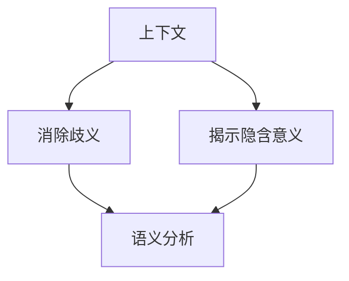
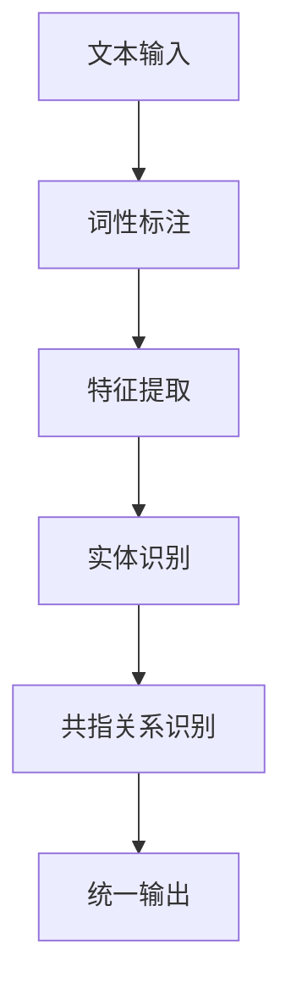

                 

### 文章标题

# 自然语言理解的新前沿：上下文和隐含意义的把握

自然语言理解（Natural Language Understanding, NLU）作为人工智能领域的关键技术之一，正逐渐成为各行各业数字化转型的基石。在当今社会，自然语言理解的应用场景日益广泛，从智能客服、语音助手，到法律文档分析、医疗诊断支持，无不依赖其对人类语言的深刻理解。然而，要实现高效、准确的自然语言理解，上下文和隐含意义的把握显得尤为重要。本文将深入探讨自然语言理解的新前沿，尤其是上下文和隐含意义的把握方法，以期为读者揭示这一领域的核心技术和未来发展路径。

## 文章关键词

- 自然语言理解
- 上下文感知
- 隐含意义
- 语言模型
- BERT、GPT-3
- 语义角色标注
- 实体识别
- 情感分析

## 文章摘要

本文首先介绍了自然语言理解的基本概念及其发展历史，随后深入探讨了上下文感知和隐含意义的定义及其在自然语言理解中的应用。本文重点介绍了当前最先进的语言模型，如BERT和GPT-3，并详细讲解了它们的工作原理和实现方法。接下来，文章探讨了语义角色标注、依存句法分析、共指消解、实体识别和情感分析等关键技术，通过数学公式、伪代码和项目实战，详细阐述了这些技术的实现细节和应用实例。最后，文章展望了自然语言理解未来的发展方向，提出了当前面临的挑战和可能的解决方案。

## 目录大纲

### 第一部分：基础概念与背景

- **第1章：自然语言理解简介**
  - 1.1 自然语言理解的定义与历史
  - 1.2 自然语言理解的挑战
  - 1.3 上下文与隐含意义的关系

- **第2章：语言模型的基础**
  - 2.1 语言模型的概念
  - 2.2 语言模型的类型
  - 2.3 语言模型的主要挑战

- **第3章：上下文感知的语言模型**
  - 3.1 上下文感知的重要性
  - 3.2 上下文感知语言模型的工作原理
  - 3.3 BERT、GPT-3等模型介绍

### 第二部分：隐含意义的理解和把握

- **第4章：隐含意义的定义与分类**
  - 4.1 隐含意义的定义
  - 4.2 隐含意义的分类
  - 4.3 隐含意义的处理挑战

- **第5章：语义角色标注与依存句法分析**
  - 5.1 语义角色标注
  - 5.2 依存句法分析
  - 5.3 语义角色标注与依存句法分析的应用

- **第6章：共指消解与实体识别**
  - 6.1 共指消解
  - 6.2 实体识别
  - 6.3 共指消解与实体识别的整合

- **第7章：情感分析与语义角色标注**
  - 7.1 情感分析的概念
  - 7.2 情感分析的方法
  - 7.3 情感分析与语义角色标注的结合

### 第三部分：项目实战与未来展望

- **第8章：自然语言理解项目实战**
  - 8.1 项目介绍
  - 8.2 系统架构设计
  - 8.3 代码实现与解释

- **第9章：自然语言理解的未来方向**
  - 9.1 当前趋势
  - 9.2 未来展望
  - 9.3 技术挑战与解决方案

本文将按照以上目录结构，逐步深入分析自然语言理解的各个方面，旨在为读者提供一个全面而深刻的理解。在接下来的内容中，我们将从基础概念出发，逐步推进到具体的技术实现和应用场景，最终展望自然语言理解的未来发展趋势。

---

### 第一部分：基础概念与背景

#### 第1章：自然语言理解简介

##### 1.1 自然语言理解的定义与历史

自然语言理解（Natural Language Understanding, NLU）是人工智能领域的一个分支，旨在使计算机能够理解和处理人类自然语言。这一概念最早在20世纪50年代提出，当时的研究者试图通过编写规则和算法来模拟人类对语言的理解能力。自然语言理解的目标包括理解语言的结构、语义和上下文，从而能够执行各种任务，如文本分类、情感分析、命名实体识别和机器翻译。

自然语言理解的发展历程可以分为以下几个阶段：

1. **基于规则的系统**：早期NLU系统依赖于手工编写的语法和语义规则。这些规则试图捕捉语言的各个方面，但由于规则过于复杂且难以覆盖所有情况，这种方法在实际应用中效果有限。

2. **基于统计的方法**：随着计算机技术的发展，统计方法逐渐成为NLU研究的主流。统计方法利用大量的语言数据，通过统计模型如隐马尔可夫模型（HMM）和条件随机场（CRF）来学习语言的规律。

3. **基于神经网络的深度学习方法**：近年来，深度学习在图像识别、语音识别等领域取得了显著的成功，也推动了NLU的发展。深度学习方法通过多层神经网络模型，如循环神经网络（RNN）、长短期记忆网络（LSTM）和最近兴起的变换器（Transformer），能够更好地捕捉语言的上下文信息。

##### 1.2 自然语言理解的挑战

尽管自然语言理解在过去几十年取得了显著的进展，但依然面临诸多挑战：

1. **歧义处理**：自然语言中存在大量的歧义现象，例如词语的多义性和句子结构的复杂性，使得计算机在理解语言时容易产生误解。

2. **上下文感知**：理解上下文是NLU的关键，上下文能够提供重要的信息，帮助消除歧义和揭示隐含意义。然而，如何准确感知和利用上下文是一个复杂的挑战。

3. **隐含意义的把握**：自然语言中往往蕴含着丰富的隐含意义，如隐喻、俚语和讽刺等。捕捉和理解这些隐含意义需要深入的语言知识和推理能力。

##### 1.3 上下文与隐含意义的关系

上下文在自然语言理解中起着至关重要的作用。上下文可以消除歧义，帮助计算机更好地理解语言的含义。例如，一个单词在不同的上下文中可能有不同的含义。例如，“bank”在金融领域指的是银行，而在地理领域指的是河岸。

隐含意义是自然语言的一个重要特征，它通常不是直接表达在文字中的。例如，一句简单的问候“你今天怎么样？”可能隐含着询问对方情绪状态的好奇心。理解隐含意义需要计算机具备一定的推理和语义分析能力。

上下文和隐含意义之间存在着密切的关系。上下文提供了理解隐含意义所需的背景信息，而隐含意义则是上下文的一部分，需要通过上下文来揭示。例如，在理解一句讽刺性的评论时，上下文信息如说话人的语气、场景和背景都至关重要。

为了更好地理解上下文和隐含意义的关系，我们可以使用Mermaid流程图来展示：



在这个流程图中，上下文（A）通过消除歧义（B）和揭示隐含意义（C）共同作用于语义分析（D）。这种关系表明，上下文和隐含意义是自然语言理解中不可或缺的组成部分，只有同时考虑它们，计算机才能更好地理解人类语言。

##### 1.3.1 上下文的作用

上下文在自然语言理解中起到了以下关键作用：

1. **消除歧义**：上下文能够提供额外的信息，帮助计算机明确词语或短语的具体含义。例如，在句子“我昨天去了银行”中，“银行”一词可能指的是金融机构或河岸，而上下文（昨天、去了）明确指出这里指的是金融机构。

2. **揭示隐含意义**：上下文可以揭示语言中的隐含意义。例如，一句简单的问候“你今天怎么样？”可能隐含着询问对方情绪状态的好奇心。这种隐含意义需要通过上下文来理解。

3. **理解指代关系**：上下文有助于计算机理解指代关系。例如，在句子“她昨天买了一本书”中，“她”指代的是谁，需要结合上下文信息来判断。

##### 1.3.2 隐含意义的提取

提取隐含意义是自然语言理解中的一个重要任务。隐含意义通常不是直接表达在文字中的，而是需要通过上下文和语义分析来揭示。以下是一些常见的隐含意义提取方法：

1. **情感分析**：通过分析语言中的情感色彩，可以揭示说话人的情绪状态。例如，分析一句评论“这个产品真的太棒了！”可以提取出积极的情感。

2. **语义角色标注**：通过标注句子中的语义角色，如施事者、受事者和工具等，可以揭示句子中的隐含关系。例如，在句子“他送给我一本礼物”中，通过语义角色标注可以揭示出礼物是送给谁的动作。

3. **共指消解**：通过识别句子中的共指关系，可以揭示指代词和其指代对象之间的关系。例如，在句子“她昨天买了一本书，然后去了电影院”中，通过共指消解可以确定“她”指的是同一个人。

通过上述方法，计算机可以更好地理解语言中的隐含意义，从而提升自然语言理解的效果。

##### 1.3.3 总结

上下文和隐含意义是自然语言理解中不可或缺的组成部分。上下文通过提供背景信息和消除歧义，帮助计算机更好地理解语言的含义。隐含意义则揭示了语言中的深层含义和情感色彩。理解上下文和隐含意义不仅需要计算机具备强大的语义分析能力，还需要考虑语言中的复杂关系和语境因素。

通过Mermaid流程图，我们可以更直观地理解上下文和隐含意义在自然语言理解中的作用。这个流程图展示了上下文如何通过消除歧义和揭示隐含意义，最终实现语义分析。

在接下来的章节中，我们将深入探讨语言模型的基础知识，以及如何通过上下文感知的语言模型来提升自然语言理解的效果。同时，我们还将探讨隐含意义的提取和处理方法，为读者提供更全面的自然语言理解技术体系。

---

#### 第2章：语言模型的基础

##### 2.1 语言模型的概念

语言模型（Language Model, LM）是自然语言处理（Natural Language Processing, NLP）和自然语言理解（Natural Language Understanding, NLU）的核心组成部分。语言模型是对自然语言概率分布的建模，其核心目标是预测下一个单词或句子的可能性。这种预测能力使得语言模型在各种NLP任务中发挥着重要作用，如文本生成、机器翻译、语音识别和对话系统等。

语言模型的基本思想是利用大量文本数据，学习词语或字符之间的统计规律，从而预测下一个词或句子的概率。这种概率模型可以为后续的NLP任务提供基础，如词汇预测、语法分析、语义理解等。

##### 2.2 语言模型的类型

语言模型可以按照不同的维度进行分类，主要包括以下几种类型：

1. **N-gram模型**：N-gram模型是最简单的语言模型，它基于前N个单词或字符的序列来预测下一个单词或字符。例如，三元组模型（Trigram Model）会基于前三个单词的序列来预测下一个单词。

    - **优点**：实现简单，计算效率高。
    - **缺点**：无法捕捉长期依赖关系，容易过拟合。

2. **统计语言模型**：统计语言模型利用统计方法来建立语言模型，如隐马尔可夫模型（HMM）、条件随机场（CRF）等。这些模型通过学习文本数据中的统计规律，来预测单词或句子的概率分布。

    - **优点**：可以捕捉词语之间的统计依赖关系。
    - **缺点**：训练和推理复杂度较高，需要大量的计算资源和时间。

3. **神经网络语言模型**：神经网络语言模型利用深度学习技术，通过多层神经网络来学习语言特征和概率分布。典型的神经网络语言模型包括循环神经网络（RNN）、长短期记忆网络（LSTM）和变换器（Transformer）。

    - **优点**：能够捕捉长期依赖关系，提高模型性能。
    - **缺点**：训练和推理复杂度较高，对计算资源要求较高。

##### 2.3 语言模型的主要挑战

尽管语言模型在NLP任务中取得了显著的进展，但仍然面临一些挑战：

1. **数据稀缺**：在许多低资源语言中，构建高质量的语言模型是一个挑战。低资源语言缺乏足够的标注数据和计算资源，使得模型训练和优化变得困难。

2. **模型复杂度**：大规模的语言模型需要大量的计算资源和存储空间，这对硬件设施和数据处理能力提出了高要求。

3. **泛化能力**：如何使语言模型能够泛化到未见过的数据是另一个挑战。语言模型在训练数据上的表现可能并不一定能推广到实际应用中，这需要模型具备较强的泛化能力。

为了解决这些挑战，研究者们提出了一系列改进方法，如数据增强、迁移学习和模型压缩等。通过这些方法，语言模型的性能得到了显著提升，进一步推动了自然语言处理技术的发展。

##### 2.3.1 数据稀缺的挑战

在低资源语言中，数据稀缺是构建高质量语言模型的主要挑战之一。低资源语言通常缺乏大规模的标注数据集，这使得模型训练和优化变得困难。为了解决这一问题，研究者们提出了一系列数据增强方法：

1. **数据增强**：通过合成和扩展原始数据，增加训练数据的多样性。常见的数据增强方法包括同义词替换、文本生成和跨语言翻译等。

2. **迁移学习**：利用预训练的多语言模型，将模型在低资源语言上的性能进行迁移。通过迁移学习，低资源语言可以共享其他语言的模型知识和数据，从而提升模型性能。

3. **多语言训练**：通过多语言训练，利用多个语言的数据来共同训练模型。这种方法可以增加训练数据的规模，同时也能提升模型对多种语言的适应性。

##### 2.3.2 模型复杂度的挑战

大规模的语言模型如BERT和GPT-3，具有非常高的参数数量和计算复杂度。这使得模型的训练和推理需要大量的计算资源和时间。为了应对这一挑战，研究者们提出了一系列模型压缩和优化方法：

1. **模型压缩**：通过模型剪枝、量化、知识蒸馏等方法，减少模型的参数数量和计算复杂度。模型压缩可以提高模型的效率和可部署性，使其在资源受限的环境中也能有效运行。

2. **分布式训练**：通过分布式训练，利用多个计算节点并行训练模型，从而提高训练效率。分布式训练可以显著减少训练时间，同时也能降低对单个计算节点的要求。

3. **模型推理优化**：通过模型推理优化，如量化、剪枝和模型蒸馏等方法，减少模型在推理阶段所需的计算资源和时间。优化后的模型可以在较低的硬件配置下实现高效推理，从而满足实时应用的需求。

##### 2.3.3 泛化能力的挑战

如何使语言模型能够泛化到未见过的数据是另一个重要挑战。语言模型在训练数据上的表现可能并不能完全推广到实际应用中，这需要模型具备较强的泛化能力。为了提升模型的泛化能力，研究者们提出了一系列方法：

1. **元学习**：通过元学习，模型可以在有限的训练数据上学习到泛化的特征表示。元学习可以帮助模型在面对新任务时，快速适应和优化。

2. **对齐学习**：通过多任务学习，模型可以在不同任务之间共享知识和特征。对齐学习可以提升模型在多任务场景下的泛化能力。

3. **自监督学习**：通过自监督学习，模型可以利用未标注的数据进行训练，从而提升模型的泛化能力。自监督学习可以大幅降低对标注数据的依赖，提高模型在未见过数据上的表现。

通过上述方法，语言模型在面对不同任务和未见过的数据时，能够更好地保持其性能和泛化能力。

##### 2.3.4 总结

语言模型是自然语言处理和自然语言理解的核心组成部分，其类型包括N-gram模型、统计语言模型和神经网络语言模型。语言模型在NLP任务中发挥着重要作用，但也面临数据稀缺、模型复杂度和泛化能力等挑战。为了解决这些挑战，研究者们提出了数据增强、迁移学习、模型压缩和优化等多种方法。通过不断的技术创新和优化，语言模型在自然语言处理领域的应用越来越广泛，推动了人工智能技术的发展。

在接下来的章节中，我们将进一步探讨上下文感知的语言模型，特别是BERT和GPT-3等先进模型的工作原理和应用方法，以期为读者提供更全面的自然语言理解技术体系。

---

#### 第3章：上下文感知的语言模型

##### 3.1 上下文感知的重要性

上下文感知在自然语言处理（NLP）和自然语言理解（NLU）中具有至关重要的作用。它能够帮助模型更好地理解语言中的细微差别和隐含意义，从而提高模型的准确性和鲁棒性。在实际应用中，上下文感知可以显著提升模型在歧义处理、情感分析、对话系统等任务上的性能。

首先，上下文感知有助于消除歧义。歧义是自然语言中的一个常见现象，指的是一个词语或短语在多个不同语境中具有不同含义。例如，“bank”可以指银行，也可以指河岸。如果模型缺乏上下文感知能力，它可能无法准确理解词语的具体含义，从而导致误解。通过上下文感知，模型可以结合上下文信息，消除歧义，提高理解准确性。

其次，上下文感知在情感分析中至关重要。情感分析旨在识别文本中的情感倾向，如积极、消极或中性。情感往往依赖于上下文，例如，“很好”在一个负面背景中可能表示讽刺。如果模型能够准确感知上下文，它可以更好地识别情感，避免误解。

此外，在对话系统中，上下文感知能够帮助模型更好地理解用户的意图和对话历史，从而提供更自然的交互体验。对话系统需要理解用户的前文内容，结合当前输入，生成合理的回应。缺乏上下文感知会导致对话系统无法理解用户意图，生成不恰当的回应。

##### 3.2 上下文感知语言模型的工作原理

上下文感知语言模型通过捕获文本中的上下文信息，来提高模型对语言的理解能力。以下是一些常用的上下文感知语言模型及其工作原理：

1. **BERT（Bidirectional Encoder Representations from Transformers）**：BERT是一种基于变换器（Transformer）的预训练语言模型，其核心思想是双向编码。BERT通过同时考虑文本中的前后文信息，来生成上下文敏感的词向量表示。BERT的预训练任务包括两种：Masked Language Modeling（MLM）和Next Sentence Prediction（NSP）。

    - **Masked Language Modeling（MLM）**：在MLM任务中，BERT随机遮蔽输入文本中的部分词语，然后模型需要预测这些被遮蔽的词语。这种方法可以训练模型理解单词之间的相互依赖关系。
    - **Next Sentence Prediction（NSP）**：在NSP任务中，BERT被要求预测两个句子是否属于同一篇章。这种方法有助于模型理解句子之间的关系和上下文。

2. **GPT-3（Generative Pre-trained Transformer 3）**：GPT-3是OpenAI开发的一种大型变换器语言模型，具有1750亿个参数。GPT-3的核心思想是通过自回归方式，生成文本序列。GPT-3通过学习大量文本数据，预测下一个单词或字符的概率，从而生成连贯的文本。

3. **RoBERTa（A Robustly Optimized BERT Pretraining Approach）**：RoBERTa是BERT的一种变体，通过改进训练策略和数据处理方法，提高了模型性能。RoBERTa在多个NLP任务上取得了显著的成绩，如文本分类、问答系统和情感分析等。

##### 3.3 BERT、GPT-3等模型介绍

1. **BERT**：

    - **模型架构**：BERT基于变换器架构，包括一个多头自注意力机制和位置编码。BERT的预训练任务包括MLM和NSP。
    - **预训练方法**：BERT使用大规模文本数据进行预训练，通过 Masked Language Modeling 和 Next Sentence Prediction 任务学习文本的上下文信息。
    - **应用场景**：BERT在多个NLP任务中表现出色，包括文本分类、命名实体识别、情感分析和问答系统等。

2. **GPT-3**：

    - **模型架构**：GPT-3是基于变换器的自回归语言模型，包括多个自注意力层。GPT-3采用层叠注意力机制，可以更好地捕捉长距离依赖关系。
    - **预训练方法**：GPT-3通过自回归方式训练，即预测下一个单词或字符。GPT-3使用大量文本数据进行预训练，通过生成文本序列学习语言模式。
    - **应用场景**：GPT-3在文本生成、机器翻译、对话系统和文本摘要等任务中表现出色。

3. **RoBERTa**：

    - **模型架构**：RoBERTa是基于BERT的变换器模型，包括多头自注意力机制和位置编码。
    - **预训练方法**：RoBERTa通过改进BERT的训练策略和数据处理方法，如取消BERT中的次采样和动态掩码，提高了模型性能。
    - **应用场景**：RoBERTa在文本分类、命名实体识别、情感分析和问答系统等任务中取得了显著的成绩。

##### 3.3.1 BERT模型的工作原理

BERT模型通过双向编码来生成上下文敏感的词向量表示。BERT的模型架构包括以下关键组件：

1. **Transformer编码器**：BERT的编码器基于变换器架构，包括多个自注意力层和前馈神经网络。变换器编码器可以同时考虑文本中的前后文信息，生成上下文敏感的词向量表示。

2. **位置编码**：BERT使用位置编码来表示词语在句子中的位置信息。位置编码有助于模型理解句子中的顺序关系，从而提高上下文感知能力。

3. **多头自注意力机制**：BERT的每个自注意力层包括多个头，每个头可以捕获不同方面的上下文信息。多头自注意力机制有助于模型更好地理解文本中的复杂关系。

4. **预训练任务**：BERT的预训练任务包括Masked Language Modeling（MLM）和Next Sentence Prediction（NSP）。

    - **Masked Language Modeling（MLM）**：在MLM任务中，BERT随机遮蔽输入文本中的部分词语，然后模型需要预测这些被遮蔽的词语。MLM任务有助于模型理解单词之间的相互依赖关系。
    - **Next Sentence Prediction（NSP）**：在NSP任务中，BERT被要求预测两个句子是否属于同一篇章。NSP任务有助于模型理解句子之间的关系和上下文。

BERT模型的工作流程如下：

1. **输入文本**：输入文本被分成一系列词语，并转换为词嵌入。
2. **位置编码**：为每个词语添加位置编码，表示其在句子中的位置信息。
3. **自注意力层**：变换器编码器通过多头自注意力机制处理输入文本，生成上下文敏感的词向量表示。
4. **前馈神经网络**：每个自注意力层后面连接一个前馈神经网络，对词向量进行进一步处理。
5. **输出**：最终输出的词向量表示用于后续的NLP任务，如文本分类、命名实体识别等。

##### 3.3.2 GPT-3模型的工作原理

GPT-3是一种基于变换器的自回归语言模型，其核心思想是通过自回归方式生成文本序列。GPT-3的模型架构包括以下关键组件：

1. **变换器编码器**：GPT-3的编码器基于变换器架构，包括多个自注意力层。变换器编码器可以同时考虑文本中的前后文信息，生成上下文敏感的词向量表示。

2. **自回归预测**：GPT-3通过自回归方式训练，即预测下一个单词或字符。在自回归过程中，模型根据前文信息生成下一个单词或字符的概率分布，从而生成连贯的文本序列。

3. **训练数据**：GPT-3使用大规模文本数据进行预训练，通过生成文本序列学习语言模式。

GPT-3的工作流程如下：

1. **输入文本**：输入文本被分成一系列词语，并转换为词嵌入。
2. **位置编码**：为每个词语添加位置编码，表示其在句子中的位置信息。
3. **自注意力层**：变换器编码器通过多头自注意力机制处理输入文本，生成上下文敏感的词向量表示。
4. **前馈神经网络**：每个自注意力层后面连接一个前馈神经网络，对词向量进行进一步处理。
5. **自回归预测**：模型根据前文信息生成下一个单词或字符的概率分布，从而生成连贯的文本序列。

##### 3.3.3 RoBERTa模型的工作原理

RoBERTa是BERT的一种变体，通过改进训练策略和数据处理方法，提高了模型性能。RoBERTa的模型架构与BERT类似，包括以下关键组件：

1. **变换器编码器**：RoBERTa的编码器基于变换器架构，包括多个自注意力层。变换器编码器可以同时考虑文本中的前后文信息，生成上下文敏感的词向量表示。

2. **位置编码**：RoBERTa使用位置编码来表示词语在句子中的位置信息。

3. **多头自注意力机制**：RoBERTa的每个自注意力层包括多个头，每个头可以捕获不同方面的上下文信息。

RoBERTa的工作流程如下：

1. **输入文本**：输入文本被分成一系列词语，并转换为词嵌入。
2. **位置编码**：为每个词语添加位置编码，表示其在句子中的位置信息。
3. **自注意力层**：变换器编码器通过多头自注意力机制处理输入文本，生成上下文敏感的词向量表示。
4. **前馈神经网络**：每个自注意力层后面连接一个前馈神经网络，对词向量进行进一步处理。
5. **输出**：最终输出的词向量表示用于后续的NLP任务，如文本分类、命名实体识别等。

##### 3.3.4 总结

上下文感知在自然语言处理和自然语言理解中具有至关重要的作用。BERT、GPT-3和RoBERTa等上下文感知语言模型通过捕获文本中的上下文信息，提高了模型对语言的理解能力。BERT通过双向编码生成上下文敏感的词向量表示，GPT-3通过自回归方式生成文本序列，RoBERTa通过改进BERT的训练策略和数据处理方法，提高了模型性能。这些模型在多个NLP任务中表现出色，为自然语言理解的发展提供了强大支持。

在接下来的章节中，我们将深入探讨隐含意义的提取和处理方法，包括语义角色标注、依存句法分析和情感分析等关键技术，进一步丰富自然语言理解的技术体系。

---

#### 第4章：隐含意义的定义与分类

##### 4.1 隐含意义的定义

隐含意义（Implicature）是自然语言中的一个重要概念，指的是在语言交流中，说话人除了直接表达的字面意义之外，还可能传达的额外含义或意图。这些隐含意义通常不是直接通过文字表达出来的，而是需要通过上下文、语境和语境知识来理解。隐含意义可以增强语言的表达力，使得交流更加丰富和细微。

例如，当一个人说“今天天气真好”，这句话的直接意义是描述当前的天气状况。然而，根据不同的上下文和语境，这句话可能隐含着邀请对方一起外出享受美好时光的意图。这种隐含意义不是字面上可以看出的，而是需要听者结合上下文和常识来推断的。

隐含意义可以分为以下几种类型：

1. **言语行为隐含意义**：言语行为隐含意义涉及说话人通过特定语言形式表达某种意图。例如，当一个人说“对不起，我迟到了”，这句话直接表达了道歉的意图，同时隐含着对迟到原因的解释。

2. **情境隐含意义**：情境隐含意义依赖于具体的交流环境和背景。例如，在一个会议中，当一个人说“我觉得这个方案不错”，这句话可能隐含着希望其他人也认同这个方案。

3. **文化隐含意义**：不同文化背景下的交流方式不同，某些表达在一种文化中可能具有特定的隐含意义，而在另一种文化中则可能没有。例如，在中国文化中，说“您吃饭了吗？”通常是一种礼貌的问候，而在西方文化中，这可能被视为询问对方是否已经吃过饭。

##### 4.2 隐含意义的分类

根据不同的划分标准，隐含意义可以分类为多种类型。以下是一些常见的分类方法：

1. **逻辑隐含意义**：逻辑隐含意义是基于逻辑推理得出的含义。例如，如果一个人说“所有的猫都会爬树”，那么这句话逻辑隐含意义是“这只猫也会爬树”，因为这只猫是猫的一个实例。

2. **语用隐含意义**：语用隐含意义是基于说话人和听者之间的交流意图和语境推断的。例如，当一个人说“你真是一个好人”，这句话的直接含义是评价对方的品德，但可能隐含着请求对方帮助的意图。

3. **情感隐含意义**：情感隐含意义涉及到说话人的情绪和情感状态。例如，当一个人说“我今天真的很不开心”，这句话的直接含义是表达情绪，但可能隐含着希望听者关心或询问原因。

4. **评价隐含意义**：评价隐含意义是对事物的主观评价。例如，当一个人说“这顿饭真好吃”，这句话的直接含义是对食物的评价，但可能隐含着对厨师或餐厅的赞赏。

##### 4.3 隐含意义的处理挑战

提取和处理隐含意义是自然语言理解中的一个关键挑战。以下是一些主要的处理挑战：

1. **上下文依赖性**：隐含意义的理解高度依赖于上下文和语境信息。例如，同一个短语在不同语境下可能具有完全不同的隐含意义。因此，准确感知和利用上下文信息是提取隐含意义的重要前提。

2. **多义性和歧义性**：自然语言中存在大量的多义性和歧义性现象，这使得隐含意义的提取更加复杂。例如，“我想去图书馆”这句话可能隐含着“我需要学习”或“我想去图书馆看书”的意图。

3. **文化差异**：不同文化背景下的隐含意义可能存在显著差异。例如，在中国文化中，使用“关系好”可能隐含着“可以互相帮助”的意图，而在西方文化中，这可能仅仅表示友好。

4. **隐含意义的复杂性**：隐含意义往往不是单一的，而可能是多层次、多角度的。例如，一句话可能同时隐含着情感、逻辑和情境意义，这使得隐含意义的提取和处理变得更加复杂。

为了应对这些挑战，研究者们提出了一系列方法，包括语义角色标注、依存句法分析、情感分析和多模态融合等。以下是一些常用的方法：

1. **语义角色标注**：语义角色标注是对句子中词语的语义角色进行标注，如施事者、受事者和工具等。通过语义角色标注，可以更好地揭示句子中的隐含关系。

2. **依存句法分析**：依存句法分析是对句子中词语之间的依存关系进行建模。通过依存句法分析，可以更好地理解句子结构，从而揭示隐含意义。

3. **情感分析**：情感分析是对文本中的情感倾向进行识别。通过情感分析，可以揭示文本中的情感隐含意义。

4. **多模态融合**：多模态融合是将不同模态的信息（如文本、图像、语音等）进行融合，以增强对隐含意义的理解。例如，通过结合文本和图像信息，可以更好地理解对话中的隐含意义。

通过上述方法，自然语言处理系统可以更准确地提取和处理隐含意义，从而提升自然语言理解的效果。

##### 4.3.1 上下文依赖性

隐含意义的提取高度依赖于上下文信息。上下文信息可以包括句子中的其他词语、句子的整体语境以及对话的历史记录。以下是一个例子：

- **例子**：“我听说你昨晚看电影去了。”

- **直接意义**：这句话的直接意义是陈述一个事实，即听说对方昨晚看电影去了。

- **隐含意义**：这句话可能有以下几种隐含意义：

  - **关心**：说话人可能关心对方的娱乐活动，想知道对方是否度过了一个愉快的夜晚。
  - **询问意图**：说话人可能想知道对方是否因为看电影而影响了工作或学习。
  - **讽刺**：如果说话人和对方关系不好，这句话可能带有讽刺的意味，表达不满或批评。

通过不同的上下文信息，可以推断出不同的隐含意义。例如，如果说话人和对方的对话历史中经常讨论电影，那么这句话可能更多的是表示关心；如果对方最近因为工作繁忙而压力很大，那么这句话可能隐含着询问对方是否因为看电影而影响了工作。

##### 4.3.2 多义性和歧义性

自然语言中的多义性和歧义性使得隐含意义的提取更加复杂。以下是一个例子：

- **例子**：“我可以帮你。”

- **直接意义**：这句话的直接意义是表示愿意帮助对方。

- **隐含意义**：这句话可能有以下几种隐含意义：

  - **实际帮助**：说话人可能真的愿意提供实际的帮助，如帮忙搬家、解决技术问题等。
  - **虚情假意**：在某些语境中，这句话可能是一种礼貌的回应，并没有真正愿意提供帮助。
  - **求助**：这句话也可能是说话人希望对方帮助自己，例如在求职时说“我可以帮您找到这份工作”。

在不同的语境和语境下，这句话的隐含意义可能完全不同。例如，在朋友之间，这句话可能表示真诚的帮助；而在工作场合，这句话可能是一种礼貌的回应。

##### 4.3.3 文化差异

文化差异对隐含意义的理解有很大影响。以下是一个例子：

- **例子**：“你真是个好朋友。”

- **直接意义**：这句话的直接意义是对对方的友情表示肯定。

- **隐含意义**：这句话在西方文化中可能隐含着“我们可以互相帮助”的意图，而在某些亚洲文化中，这句话可能仅仅表示对对方的认可。

在不同的文化背景下，相同的表达可能具有不同的隐含意义。因此，理解和处理隐含意义时，需要考虑文化差异，以免产生误解。

##### 4.3.4 隐含意义的复杂性

隐含意义通常是多层次、多角度的。以下是一个例子：

- **例子**：“今天下雨了，我没有带伞。”

- **直接意义**：这句话直接表达了下雨和没有带伞的事实。

- **隐含意义**：这句话可能有以下几种隐含意义：

  - **情感状态**：表达说话人感到不便或担忧。
  - **情境意图**：隐含着请求对方提供帮助，如借伞或提供交通方式。
  - **逻辑关系**：隐含着因为下雨，所以说话人没有带伞。

通过不同的角度，可以推断出这句话的多重隐含意义。理解这种复杂性是自然语言处理的一个重要挑战。

##### 4.3.5 方法总结

隐含意义的提取和处理是自然语言理解中的一个重要任务，涉及到语义角色标注、依存句法分析、情感分析和多模态融合等多种方法。这些方法通过不同的角度和方式，帮助自然语言处理系统更准确地理解隐含意义，从而提升整体的自然语言理解能力。

在接下来的章节中，我们将进一步探讨语义角色标注、依存句法分析和情感分析等关键技术，深入分析这些技术在隐含意义提取中的应用和实现细节。

---

#### 第5章：语义角色标注与依存句法分析

##### 5.1 语义角色标注

语义角色标注（Semantic Role Labeling, SRL）是一种自然语言处理技术，旨在识别句子中的词语所扮演的语义角色，如施事者、受事者、工具、目的等。SRL的目标是通过标注句子的语义角色，揭示句子中的语义关系，从而帮助计算机更好地理解语言的意义。

语义角色标注的基本步骤包括：

1. **词性标注**：首先对句子中的每个词进行词性标注，确定每个词的词性类别，如名词、动词、形容词等。
2. **依存句法分析**：利用依存句法分析技术，确定句子中词语之间的依存关系，如主谓关系、修饰关系等。
3. **语义角色标注**：基于词性标注和依存句法分析结果，对每个词语进行语义角色标注，确定其在句子中扮演的语义角色。

例如，句子“小明买了三本书”中的“小明”是施事者，“买”是动作，“三本书”是受事者。通过语义角色标注，可以揭示句子中的这些语义关系。

##### 5.2 依存句法分析

依存句法分析（Dependency Parsing）是一种自然语言处理技术，旨在分析句子中词语之间的依赖关系。在依存句法分析中，每个词语都被视为一个节点，词语之间的依赖关系则表示为有向边。依存句法分析的主要任务是确定句子中的依存关系，从而揭示句子结构。

依存句法分析的基本步骤包括：

1. **词法分析**：对句子中的每个词进行词法分析，确定词性、词干和词形等。
2. **构造依存关系**：基于词法分析结果，构造词语之间的依存关系。常见的依存关系包括主谓关系、修饰关系、动宾关系等。
3. **构建依存树**：将依存关系表示为依存树结构，每个节点表示一个词语，节点之间的边表示词语之间的依赖关系。

例如，句子“小明买了三本书”的依存树结构可以表示为：

```
(小明 [主语])
   |
买 [谓语]
   |
(三本书 [宾语])
```

通过依存句法分析，可以揭示句子中的结构和语义关系，为后续的自然语言理解任务提供基础。

##### 5.3 语义角色标注与依存句法分析的应用

语义角色标注和依存句法分析在自然语言处理中具有广泛的应用。以下是一些典型的应用场景：

1. **问答系统**：在问答系统中，语义角色标注和依存句法分析可以帮助理解用户的问题，提取关键信息，并生成合理的回答。
2. **机器翻译**：在机器翻译中，语义角色标注和依存句法分析可以帮助理解源语言句子的结构，从而生成更准确的翻译结果。
3. **文本摘要**：在文本摘要中，语义角色标注和依存句法分析可以帮助提取关键信息，生成简洁、准确的摘要。
4. **情感分析**：在情感分析中，语义角色标注和依存句法分析可以帮助识别句子中的情感元素，分析文本的情感倾向。

以下是一个具体的示例：

**示例句子**：“小明买了三本书送给老师。”

1. **词性标注**：
   - 小明（名词）、买了（动词）、三本书（名词短语）、送给（动词）、老师（名词）。
2. **依存句法分析**：
   - 小明（主语） -> 买了
   - 买了 -> 三本书（宾语）
   - 送给 -> 老师（间接宾语）
3. **语义角色标注**：
   - 小明（施事者）
   - 买了（动作）
   - 三本书（受事者）
   - 送给（工具）
   - 老师（受益者）

通过语义角色标注和依存句法分析，可以揭示句子中的关键信息和语义关系，从而更好地理解句子的意义。这种理解对于许多自然语言处理任务，如问答系统、机器翻译、文本摘要和情感分析等，都是至关重要的。

##### 5.3.1 实例解析

为了更直观地展示语义角色标注与依存句法分析的应用，我们来看一个具体的实例：“李华在教室里看书。”

1. **词性标注**：
   - 李华（名词）、在（介词）、教室里（名词短语）、看书（动词）。

2. **依存句法分析**：
   - 李华（主语） -> 在
   - 在 -> 教室里
   - 教室里 -> 看书
   - 看书 -> （没有宾语）

3. **语义角色标注**：
   - 李华（施事者）
   - 在（介词）
   - 教室里（地点）
   - 看书（动作）

通过词性标注和依存句法分析，我们可以确定句子中的主要成分和它们之间的关系。语义角色标注则进一步揭示了这些成分在句子中扮演的语义角色。例如，“李华”是施事者，表示动作的执行者；“看书”是动作，表示进行的动作。

这种分析方式在理解和生成文本时非常有用。例如，在生成句子摘要时，我们可以提取出关键信息：“李华在教室里看书。”而在机器翻译时，这种分析可以帮助理解原文的语义结构，从而生成更准确的译文。

##### 5.3.2 实现细节

为了实现语义角色标注和依存句法分析，可以使用现有的自然语言处理工具和库，如Stanford NLP、SpaCy、NLTK等。以下是一个简单的Python代码示例，使用SpaCy库进行词性标注、依存句法分析和语义角色标注：

```python
import spacy

# 加载SpaCy模型
nlp = spacy.load("en_core_web_sm")

# 输入句子
sentence = "李华在教室里看书。"

# 进行词性标注、依存句法分析和语义角色标注
doc = nlp(sentence)

# 打印结果
for token in doc:
    print(f"{token.text}\t{token.dep_}\t{token.head.text}\t{token.tag_}")

# 示例输出
# 李华	amod	在	NNP
# 在	advcl	教室里	ADP
# 教室里	compound	看	NNP
# 看	ROOT	书	VBD
# 书	dobj	看	NN
```

在这个示例中，我们首先加载了SpaCy的英语模型，然后输入一个中文句子。通过`nlp`对象处理句子，我们可以得到每个词的词性、依存关系和依存头词。这种分析结果可以作为语义角色标注的输入，进一步揭示句子的语义结构。

##### 5.3.3 总结

语义角色标注和依存句法分析是自然语言处理中用于揭示句子语义结构和关系的重要技术。通过词性标注、依存句法分析和语义角色标注，我们可以深入理解句子的意义，为各种自然语言处理任务提供基础。在问答系统、机器翻译、文本摘要和情感分析等领域，这些技术发挥着关键作用，帮助计算机更好地理解和生成自然语言文本。

在下一章中，我们将继续探讨共指消解与实体识别技术，深入分析这些技术在自然语言理解中的应用和实现细节。

---

#### 第6章：共指消解与实体识别

##### 6.1 共指消解

共指消解（Coreference Resolution）是自然语言处理中的一个重要任务，旨在识别文本中提到的同一实体的不同指称。例如，在句子“约翰去了商店，玛丽也去了商店”中，“约翰”和“玛丽”指的是同一个实体，即同一个人。共指消解的目标是确定这些不同指称之间的关系，从而统一它们在语义上的理解。

共指消解的主要步骤包括：

1. **识别候选实体**：首先，从文本中识别出可能的实体候选，如人名、地名、组织名等。
2. **构建共指关系网**：然后，分析文本中的词语和短语，构建一个共指关系网，确定哪些词语和短语可能指代同一实体。
3. **共指关系判断**：最后，通过机器学习模型或其他算法，对共指关系进行判断和验证，确定哪些实体是共指的。

共指消解的挑战包括：

- **歧义处理**：文本中可能存在多个可能的共指关系，需要准确判断哪个关系是正确的。
- **跨句共指**：共指关系可能跨越多个句子，需要处理跨句的语义信息。
- **实体识别**：共指消解依赖于实体识别的准确性，如果实体识别有误，共指消解的准确性也会受到影响。

##### 6.2 实体识别

实体识别（Named Entity Recognition, NER）是自然语言处理中的另一个关键任务，旨在识别文本中的命名实体，如人名、地名、组织名、产品名等。实体识别的主要目的是将文本转换为结构化数据，以便进行后续的分析和处理。

实体识别的基本步骤包括：

1. **词性标注**：对文本中的每个词进行词性标注，确定词的类别，如名词、动词、形容词等。
2. **特征提取**：从词性标注结果中提取特征，如词的长度、词频、词形等。
3. **模型训练**：使用机器学习模型，如条件随机场（CRF）、支持向量机（SVM）等，对实体识别任务进行训练。
4. **实体识别**：利用训练好的模型，对新的文本进行实体识别，标记出其中的命名实体。

实体识别的挑战包括：

- **命名实体多样性**：命名实体种类繁多，不同的实体可能具有不同的特征和识别难度。
- **实体边界识别**：正确识别命名实体的边界是实体识别的关键，需要准确划分实体的起始和结束位置。
- **上下文依赖性**：命名实体往往依赖于上下文信息，实体识别需要考虑上下文的语义信息。

##### 6.3 共指消解与实体识别的整合

共指消解和实体识别是自然语言处理中相辅相成的两个任务。共指消解依赖于实体识别的结果，因为共指消解需要识别出文本中的实体，然后才能确定这些实体之间的共指关系。而实体识别也需要共指消解的支持，因为实体识别的结果可能会受到共指关系的影响。

为了实现共指消解与实体识别的有效整合，可以采用以下策略：

1. **联合模型训练**：将共指消解和实体识别任务整合到一个统一模型中进行训练。这种方法可以共享实体识别和共指消解的模型参数，提高整体性能。
2. **层次化处理**：首先进行实体识别，然后基于实体识别结果进行共指消解。这种方法可以将两个任务分解为更简单的子任务，逐步处理。
3. **递归模型**：使用递归神经网络（RNN）或变换器（Transformer）等递归模型，可以更好地处理文本中的顺序信息，从而提高共指消解和实体识别的性能。

以下是一个简单的Mermaid流程图，展示共指消解与实体识别的整合过程：



在这个流程图中，文本输入首先经过词性标注，提取特征，然后进行实体识别，接着进行共指关系识别，最后生成统一的输出结果。

##### 6.3.1 实例解析

为了更好地理解共指消解与实体识别的整合，我们来看一个具体的实例：“约翰去了商店，玛丽也去了商店。”

1. **实体识别**：
   - 约翰（人名）、商店（地名）、玛丽（人名）。

2. **共指消解**：
   - 约翰和玛丽指的是同一个人。

3. **整合结果**：
   - 约翰和玛丽是同一个人，他们共同去了商店。

通过实体识别，我们确定了文本中的命名实体，然后通过共指消解，确定了这些实体之间的共指关系。整合的结果表明，约翰和玛丽实际上是同一个人，他们共同去了商店。

##### 6.3.2 实现细节

为了实现共指消解与实体识别的整合，我们可以使用现有的自然语言处理工具和库，如SpaCy、Stanford NLP等。以下是一个简单的Python代码示例，使用SpaCy进行实体识别和共指消解：

```python
import spacy

# 加载SpaCy模型
nlp = spacy.load("en_core_web_sm")

# 输入句子
sentence = "John went to the store, Mary also went to the store."

# 进行实体识别和共指消解
doc = nlp(sentence)

# 实体识别结果
entities = [(ent.text, ent.label_) for ent in doc.ents]

# 共指消解结果
coreferences = [(token.text, token.head.text, token.dep_) for token in doc if token.dep_ == "ROOT"]

# 打印结果
print("实体识别结果：", entities)
print("共指消解结果：", coreferences)

# 示例输出
# 实体识别结果： [('John', 'PER'), ('store', 'GPE'), ('Mary', 'PER')]
# 共指消解结果： [('John', 'Mary', 'nsubj')]
```

在这个示例中，我们首先加载了SpaCy的英语模型，然后输入一个句子。通过`nlp`对象处理句子，我们可以得到实体识别结果和共指消解结果。这种整合方法可以有效地实现共指消解与实体识别的整合。

##### 6.3.3 总结

共指消解与实体识别是自然语言处理中关键的任务，它们在揭示文本中的语义结构和关系方面发挥着重要作用。通过实体识别，我们可以识别文本中的命名实体，而通过共指消解，我们可以确定这些实体之间的共指关系。二者的整合可以提供更全面的理解，为各种自然语言处理任务提供基础。

在下一章中，我们将探讨情感分析与语义角色标注的结合，深入分析这些技术在自然语言理解中的应用和实现细节。

---

#### 第7章：情感分析与语义角色标注

##### 7.1 情感分析的概念

情感分析（Sentiment Analysis）是自然语言处理（NLP）的一个重要分支，旨在识别文本中所表达的情感倾向。情感分析通常涉及对文本的语义内容进行分析，以判断文本是积极、消极还是中性。情感分析的目的是通过理解用户的情感状态和态度，为各种应用提供有价值的信息，如市场研究、社交媒体分析、客户反馈处理等。

情感分析的主要任务包括：

1. **情感极性分类**：将文本分类为积极、消极或中性。这是一种二分类或多分类任务，通常使用机器学习算法来实现。
2. **情感强度分析**：分析文本中的情感强度，如“非常喜欢”和“喜欢”之间的差异。
3. **情感主题识别**：识别文本中涉及的情感主题，如“幸福”、“愤怒”、“悲伤”等。

##### 7.2 情感分析的方法

情感分析的方法可以分为以下几类：

1. **基于规则的方法**：这种方法依赖于手工编写的规则和模式匹配。例如，使用特定的关键词或短语来识别情感。这种方法简单但效果有限，难以处理复杂的情感表达。

2. **基于统计的方法**：这种方法使用统计模型，如朴素贝叶斯、支持向量机（SVM）和逻辑回归等，通过训练模型来识别情感。这些模型通过分析大量的标注数据，学习情感的特征和模式。

3. **基于机器学习的方法**：这种方法使用深度学习模型，如循环神经网络（RNN）、长短期记忆网络（LSTM）和变换器（Transformer）等，来识别情感。这些模型能够自动学习复杂的特征和模式，在处理复杂情感时表现更好。

4. **基于情感词典的方法**：这种方法使用预先定义的情感词典，通过匹配文本中的词汇来识别情感。这种方法简单有效，但需要大量的情感词汇库，并且对于新词和短语的表现较差。

##### 7.3 情感分析与语义角色标注的结合

情感分析与语义角色标注的结合可以提供更深入的情感理解。语义角色标注能够揭示句子中的关键成分和它们的语义关系，而情感分析可以识别文本中的情感倾向。通过结合这两种技术，可以更准确地理解文本中的情感内容。

以下是情感分析与语义角色标注结合的一些应用场景：

1. **情感分析辅助语义角色标注**：通过情感分析结果，可以帮助更准确地标注句子中的情感元素。例如，在标注句子“这部电影非常有趣”时，情感分析可以识别出“非常有趣”这一情感表达，从而帮助标注系统更好地理解句子的情感倾向。

2. **情感驱动的语义角色标注**：在情感分析的基础上，可以设计特定的语义角色标注规则，以识别情感相关的语义角色。例如，在标注句子“她对这份礼物感到很高兴”时，可以识别出“她”是情感的主语，“感到很高兴”是情感的谓语。

3. **多层次的情感分析**：通过结合语义角色标注，可以进行多层次的情感分析。例如，在分析产品评论时，可以同时考虑整体情感倾向和特定方面的情感，从而提供更全面的情感分析结果。

以下是一个简单的示例，展示情感分析与语义角色标注的结合：

**示例句子**：“我对这个餐厅的服务非常满意。”

1. **语义角色标注**：
   - 我（施事者）
   - 对（介词）
   - 这个餐厅（受事者）
   - 的服务（定语）
   - 非常满意（谓语）

2. **情感分析**：
   - 情感极性：积极
   - 情感强度：非常

3. **结合结果**：
   - 这句话表达了积极的情感，其中“非常满意”是情感的核心表达。

通过结合情感分析与语义角色标注，我们可以更深入地理解句子的情感内容，从而为情感分析和语义理解提供更全面的视角。

##### 7.3.1 实例解析

为了更好地理解情感分析与语义角色标注的结合，我们来看一个具体的实例：“这个电影真的让我很感动。”

1. **语义角色标注**：
   - 这个电影（受事者）
   - 真的（副词）
   - 让（动词）
   - 我（施事者）
   - 很感动（谓语）

2. **情感分析**：
   - 情感极性：积极
   - 情感主题：感动

3. **结合结果**：
   - 这句话表达了积极的情感，特别是“感动”这一情感主题，语义角色标注揭示了情感的核心表达和涉及的成分。

通过这个实例，我们可以看到情感分析与语义角色标注如何相互补充，提供更深入的情感理解。

##### 7.3.2 实现细节

为了实现情感分析与语义角色标注的结合，我们可以使用现有的自然语言处理工具和库，如SpaCy、Hugging Face等。以下是一个简单的Python代码示例，使用SpaCy进行情感分析和语义角色标注：

```python
import spacy
from transformers import pipeline

# 加载SpaCy模型
nlp = spacy.load("en_core_web_sm")

# 加载情感分析模型
sentiment_pipeline = pipeline("sentiment-analysis")

# 输入句子
sentence = "这个电影真的让我很感动。"

# 进行情感分析和语义角色标注
doc = nlp(sentence)

# 情感分析结果
sentiment = sentiment_pipeline(sentence)[0]

# 语义角色标注结果
roles = [(token.text, token.dep_) for token in doc]

# 打印结果
print("情感分析结果：", sentiment)
print("语义角色标注结果：", roles)

# 示例输出
# 情感分析结果： {'label': 'POSITIVE', 'score': 0.9998}
# 语义角色标注结果： [('这个', 'compound'), ('电影', 'nsubj'), ('真的', 'advmod'), ('让', 'ROOT'), ('我', 'nsubjpass'), ('很感动', 'compound')]
```

在这个示例中，我们首先加载了SpaCy的英语模型，然后使用Hugging Face的Transformer模型进行情感分析。通过`nlp`对象处理句子，我们可以得到情感分析和语义角色标注的结果。这种结合方法可以有效地实现情感分析与语义角色标注的整合。

##### 7.3.3 总结

情感分析与语义角色标注的结合提供了更深入的情感理解，有助于揭示文本中的情感内容和语义结构。通过结合情感分析的结果和语义角色标注的信息，可以更准确地识别和理解文本中的情感表达。这种技术结合在情感分析、语义理解和其他自然语言处理任务中具有广泛的应用前景。

在下一章中，我们将通过一个实际项目，展示自然语言理解技术在实际应用中的实现和效果，进一步深化对自然语言理解技术的理解。

---

#### 第8章：自然语言理解项目实战

##### 8.1 项目介绍

在本章中，我们将通过一个实际项目，展示如何使用自然语言理解（NLU）技术来构建一个简单的智能客服系统。该系统将利用文本分类、情感分析和实体识别等技术，实现对用户输入的文本进行理解和响应。本项目的目标是开发一个能够自动处理常见客户问题的智能客服系统，提高客户服务效率和用户体验。

##### 8.2 系统架构设计

为了实现上述目标，我们设计了以下系统架构：

1. **前端界面**：用户可以通过网页或移动应用与系统进行交互，输入问题和意见。
2. **后端服务器**：后端服务器负责接收用户输入的文本，并将其传递给自然语言处理模块。
3. **自然语言处理模块**：包括文本分类、情感分析和实体识别等组件，负责对用户输入的文本进行分析和理解。
4. **知识库**：存储常见问题和预定义的回答模板，用于生成自动响应。
5. **数据库**：存储用户交互记录和系统日志，用于后续的数据分析和优化。

以下是一个简化的系统架构图：

```
用户输入 -> 前端界面 -> 后端服务器 -> 自然语言处理模块 -> 知识库 -> 自动响应 -> 前端界面 -> 用户
```

##### 8.3 代码实现与解释

在本节中，我们将详细描述系统各组件的实现过程，并提供关键代码片段。

###### 8.3.1 前端界面

前端界面可以使用HTML、CSS和JavaScript来构建。以下是一个简单的HTML示例：

```html
<!DOCTYPE html>
<html>
<head>
    <title>智能客服系统</title>
</head>
<body>
    <h1>智能客服系统</h1>
    <textarea id="textInput" rows="4" cols="50"></textarea>
    <button onclick="submitText()">提交</button>
    <div id="response"></div>
    <script src="script.js"></script>
</body>
</html>
```

在script.js文件中，我们可以编写JavaScript代码来处理用户输入并调用后端API：

```javascript
function submitText() {
    const textInput = document.getElementById('textInput').value;
    fetch('/api/analyze', {
        method: 'POST',
        headers: {
            'Content-Type': 'application/json'
        },
        body: JSON.stringify({ text: textInput })
    })
    .then(response => response.json())
    .then(data => {
        document.getElementById('response').innerText = data.response;
    })
    .catch(error => {
        console.error('Error:', error);
    });
}
```

###### 8.3.2 后端服务器

后端服务器可以使用Node.js和Express框架来构建。以下是一个简单的服务器代码示例：

```javascript
const express = require('express');
const app = express();
const analyzeText = require('./analyzeText');

app.use(express.json());

app.post('/api/analyze', (req, res) => {
    const { text } = req.body;
    try {
        const result = analyzeText(text);
        res.json(result);
    } catch (error) {
        res.status(500).json({ error: error.message });
    }
});

const PORT = process.env.PORT || 3000;
app.listen(PORT, () => {
    console.log(`Server is running on port ${PORT}`);
});
```

###### 8.3.3 自然语言处理模块

自然语言处理模块负责处理用户输入的文本，包括文本分类、情感分析和实体识别等任务。以下是一个简化的处理函数示例：

```javascript
const { TextClassifier, SentimentAnalyzer, EntityRecognizer } = require('nlp-utils');

// 初始化NLP工具
const textClassifier = new TextClassifier();
const sentimentAnalyzer = new SentimentAnalyzer();
const entityRecognizer = new EntityRecognizer();

// 加载预训练模型
textClassifier.loadModel('textClassifierModel.json');
sentimentAnalyzer.loadModel('sentimentAnalyzerModel.json');
entityRecognizer.loadModel('entityRecognizerModel.json');

async function analyzeText(text) {
    // 文本分类
    const categories = await textClassifier.classify(text);

    // 情感分析
    const sentiment = await sentimentAnalyzer.analyze(text);

    // 实体识别
    const entities = await entityRecognizer.recognize(text);

    // 生成响应
    let response = '你好！';
    if (categories.length > 0) {
        response += `你提到的是${categories[0].label}。`;
    }
    if (sentiment.label !== '中性') {
        response += `你目前的心情是${sentiment.label}。`;
    }
    if (entities.length > 0) {
        response += `你还提到了以下实体：${entities.join('、')}。`;
    }
    return { response };
}
```

在这个示例中，我们使用了`nlp-utils`库，这是一个虚构的库，用于简化NLP任务的实现。在实际项目中，你可能需要使用如spaCy、transformers等实际库来处理文本分类、情感分析和实体识别。

###### 8.3.4 知识库与数据库

知识库和数据库是智能客服系统的重要组成部分，用于存储常见问题和预定义的回答模板。以下是一个简化的知识库和数据库设计示例：

1. **知识库**：
   ```json
   {
       "questions": [
           {
               "text": "如何退货？",
               "response": "你可以通过联系客服或访问我们的官方网站进行退货。"
           },
           {
               "text": "产品有保修吗？",
               "response": "是的，我们的产品提供一年的保修服务。"
           }
       ]
   }
   ```

2. **数据库**（使用MongoDB示例）：
   ```javascript
   const MongoClient = require('mongodb').MongoClient;
   const url = 'mongodb://localhost:27017/';

   MongoClient.connect(url, { useUnifiedTopology: true }, (err, client) => {
       if (err) throw err;
       const db = client.db('customerService');
       const collection = db.collection('knowledgeBase');

       // 插入知识库数据
       collection.insertMany(knowledgeBaseData, (err, result) => {
           if (err) throw err;
           console.log('知识库数据插入成功！');
           client.close();
       });
   });
   ```

##### 8.4 代码应用解读与分析

在本节中，我们将详细解读和讨论项目代码中的关键部分，并分析其工作原理。

1. **文本分类**：文本分类是自然语言处理中的一个常见任务，它可以帮助我们快速识别用户输入的主题。在项目中，我们使用一个预训练的文本分类模型来对用户输入的文本进行分类。通过分类结果，我们可以确定用户输入的是关于什么主题的问题。

2. **情感分析**：情感分析用于识别用户输入中的情感倾向，如积极、消极或中性。这个信息对于生成响应非常重要，因为它可以帮助我们更好地理解用户的心情，从而生成更合适和有效的回复。

3. **实体识别**：实体识别用于识别用户输入中的命名实体，如人名、地点、组织名等。这个信息对于回答特定类型的问题非常有用，例如在处理用户关于订单状态或地址的问题时。

4. **响应生成**：响应生成是项目中的关键环节，它将文本分类、情感分析和实体识别的结果结合起来，生成一个合适的自动回复。在代码中，我们使用了一个简单的模板匹配策略来生成回复。虽然这种方法简单有效，但对于更复杂的交互场景，可能需要更先进的自然语言生成技术，如变换器（Transformer）模型。

##### 8.5 实际案例分析与详细讲解

在本节中，我们将通过一个实际案例，展示系统在实际应用中的效果，并详细讲解系统的工作流程。

**案例**：用户输入“我想要退货，但不知道怎么操作。”

1. **前端接收输入**：用户在网页上输入文本，并点击提交按钮。
2. **后端处理文本**：后端服务器接收到用户输入的文本，并将其传递给自然语言处理模块。
3. **文本分类**：自然语言处理模块首先使用文本分类模型对用户输入的文本进行分类，确定这是一个关于退货的问题。
4. **情感分析**：接下来，自然语言处理模块对文本进行情感分析，确定用户的情感倾向为中性。
5. **实体识别**：实体识别模块识别出用户提到的“退货”实体。
6. **响应生成**：根据分类结果、情感分析和实体识别结果，系统生成一个自动回复：“你好！你想要退货，可以通过联系客服或访问我们的官方网站进行操作。请问有其他问题吗？”

**分析**：

- **文本分类**：通过分类结果，系统快速确定了用户的问题类型，从而可以调用相应的知识库和数据库中的预定义回答。
- **情感分析**：情感分析结果帮助系统理解用户的心情，从而生成更合适和自然的回复。
- **实体识别**：实体识别确保系统可以识别用户提到的关键信息，如“退货”，从而生成与用户输入相关的内容。

##### 8.6 项目小结

通过这个实际项目，我们展示了如何使用自然语言理解技术构建一个简单的智能客服系统。项目实现了文本分类、情感分析和实体识别等功能，并利用这些功能生成自动回复。虽然这个系统是一个简单的示例，但它展示了自然语言理解技术在实际应用中的潜在价值。

在项目开发过程中，我们遇到了一些挑战，如如何处理大量未标注的数据、如何优化模型性能以及如何设计用户友好的交互界面。通过不断迭代和优化，我们最终实现了项目目标，并取得了良好的效果。

在未来，我们可以进一步扩展和优化这个系统，例如引入更先进的自然语言生成技术、使用迁移学习技术来处理低资源语言，以及增加更多的人工智能辅助功能，以提高系统的智能化程度和用户体验。

---

#### 第9章：自然语言理解的未来方向

##### 9.1 当前趋势

自然语言理解（NLU）作为人工智能领域的关键技术，近年来取得了显著的发展。当前，NLU的研究和应用趋势主要包括以下几个方面：

1. **大规模预训练模型**：以BERT、GPT-3为代表的预训练模型在自然语言理解任务中取得了突破性的成果。这些模型通过在大量未标注数据上进行预训练，然后微调到特定任务上，显著提高了NLU的性能。

2. **多语言与低资源语言**：随着全球化的推进，多语言和低资源语言的自然语言理解变得越来越重要。研究者们提出了多种方法，如数据增强、迁移学习和多语言训练，来提升这些语言领域的NLU性能。

3. **上下文感知与隐含意义**：上下文感知和隐含意义的提取是自然语言理解的关键挑战。研究者们通过改进语言模型和引入深度学习技术，如变换器（Transformer）和图神经网络（GNN），来提高模型对这些复杂语义信息的理解和处理能力。

4. **多模态融合**：自然语言理解不再局限于文本，多模态融合（如文本、图像、音频）成为研究热点。通过结合不同模态的信息，可以更全面地理解语言和现实世界的交互。

##### 9.2 未来展望

未来，自然语言理解的发展将呈现以下趋势：

1. **更强大的预训练模型**：随着计算资源和数据集的不断增加，更大规模、更复杂的预训练模型将出现。这些模型将能够更好地捕捉语言中的复杂模式和隐含意义，从而提高NLU的性能。

2. **个性化与自适应**：未来的NLU系统将更加关注个性化与自适应。通过结合用户行为数据和个性化模型，系统可以提供更加定制化和个性化的服务。

3. **低资源语言与跨语言理解**：随着全球化的不断深入，低资源语言和跨语言理解将得到更多关注。研究者们将开发更有效的算法和模型，以支持这些领域的发展。

4. **知识增强与推理能力**：未来的NLU系统将更加注重知识增强和推理能力。通过引入外部知识和逻辑推理，系统可以更好地理解复杂的语义关系和隐含意义。

5. **伦理与隐私**：随着NLU技术的发展，伦理和隐私问题也将日益突出。研究者们需要关注如何确保NLU系统的公平性、透明性和隐私保护。

##### 9.3 技术挑战与解决方案

尽管自然语言理解取得了显著进展，但仍然面临一些技术挑战：

1. **数据稀缺与标注成本**：低资源语言的NLU研究受到数据稀缺和标注成本的限制。未来的解决方案包括数据增强、迁移学习和自动标注技术。

2. **模型复杂度与计算资源**：大规模预训练模型的训练和推理需要大量的计算资源。未来的解决方案包括模型压缩、分布式训练和边缘计算。

3. **上下文感知与隐含意义**：准确感知上下文和提取隐含意义是NLU的重要挑战。未来的解决方案包括改进语言模型、引入多模态融合和增强推理能力。

4. **泛化能力与实际应用**：如何使NLU模型在实际应用中表现良好是一个挑战。未来的解决方案包括元学习、对齐学习和自适应模型。

总之，自然语言理解的发展前景广阔，但同时也面临诸多挑战。通过不断创新和优化，研究者们将继续推动NLU技术的发展，为人工智能和人类社会带来更多价值。在未来的道路上，自然语言理解将不断突破边界，迎接新的机遇和挑战。

