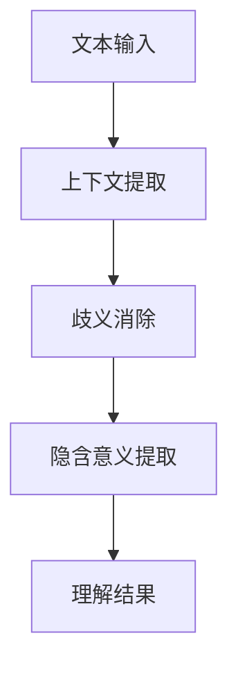
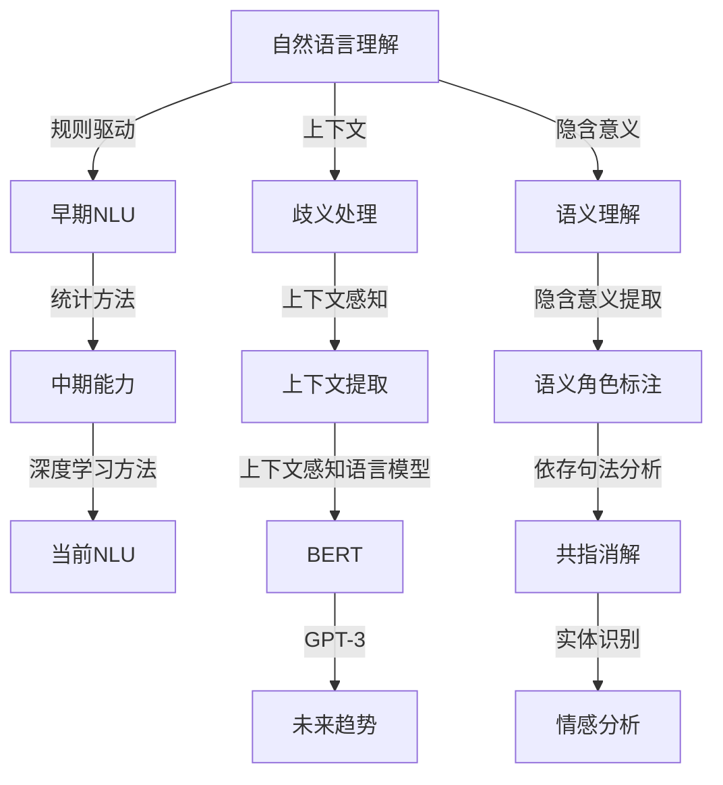
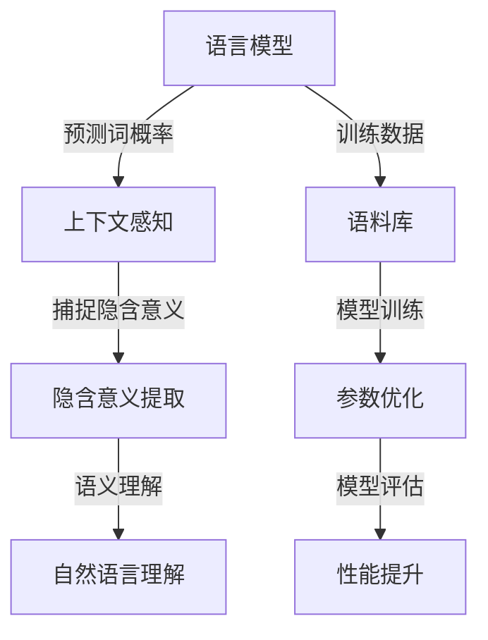
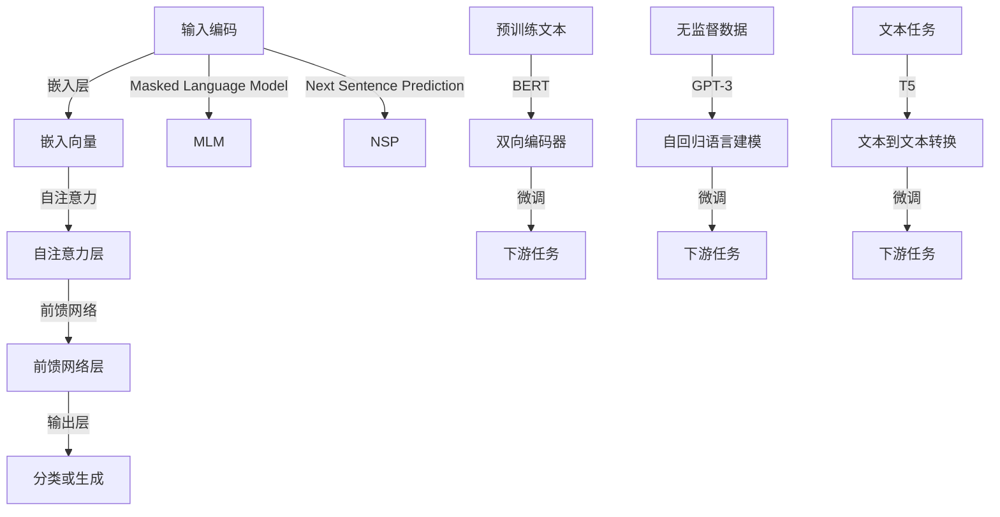

                 

### 文章标题: 自然语言理解的新前沿：上下文和隐含意义的把握

#### 关键词：自然语言理解、上下文感知、隐含意义、语言模型、深度学习

> 摘要：本文旨在探讨自然语言理解（NLU）的最新前沿，重点关注上下文和隐含意义的把握。通过深入分析相关概念、挑战、技术和应用，本文为读者提供了一个全面的技术视角，揭示了NLU领域的发展趋势和未来方向。

## 目录大纲

### 第一部分：基础概念与背景

1. **自然语言理解简介**
   1.1 自然语言理解的定义与历史
   1.2 自然语言理解的挑战
   1.3 上下文与隐含意义的关系

2. **语言模型的基础**
   2.1 语言模型的概念
   2.2 语言模型的类型
   2.3 语言模型的主要挑战

3. **上下文感知的语言模型**
   3.1 上下文感知的重要性
   3.2 上下文感知语言模型的工作原理
   3.3 BERT、GPT-3等模型介绍

### 第二部分：隐含意义的理解和把握

4. **隐含意义的定义与分类**
   4.1 隐含意义的定义
   4.2 隐含意义的分类
   4.3 隐含意义的处理挑战

5. **语义角色标注与依存句法分析**
   5.1 语义角色标注
   5.2 依存句法分析
   5.3 语义角色标注与依存句法分析的应用

6. **共指消解与实体识别**
   6.1 共指消解
   6.2 实体识别
   6.3 共指消解与实体识别的整合

7. **情感分析与语义角色标注**
   7.1 情感分析的概念
   7.2 情感分析的方法
   7.3 情感分析与语义角色标注的结合

### 第三部分：项目实战与未来展望

8. **自然语言理解项目实战**
   8.1 项目介绍
   8.2 系统架构设计
   8.3 代码实现与解释

9. **自然语言理解的未来方向**
   9.1 当前趋势
   9.2 未来展望
   9.3 技术挑战与解决方案

---

### 第一部分：基础概念与背景

#### 第1章：自然语言理解简介

##### 1.1 自然语言理解的定义与历史

自然语言理解（Natural Language Understanding, NLU）是指计算机模拟人类的语言理解能力，对自然语言文本进行解析、理解并做出相应回应的过程。NLU的目标是让计算机能够像人类一样理解语言，实现人机交互的自然性。

自然语言理解的历史可以追溯到20世纪50年代。当时，人工智能（AI）领域的研究者开始探讨如何让计算机理解和生成自然语言。早期的NLU主要依赖于规则驱动的方法，这些方法通过硬编码的语法规则来处理语言。然而，这种方法在面对复杂、多变的自然语言时表现不佳。

随着计算机科学和人工智能的发展，NLU技术经历了多个阶段。20世纪80年代，统计方法开始被应用于NLU领域。统计方法利用大量语料库来训练模型，从而自动学习语言的规律。这种方法在一定程度上提高了NLU的性能，但仍然存在一些挑战，如歧义处理、上下文理解等。

近年来，深度学习技术的兴起为NLU带来了新的机遇。深度学习模型，如神经网络语言模型（Neural Network Language Models）和变换器（Transformers），能够在大规模数据集上训练，从而实现更高的准确性和泛化能力。BERT（Bidirectional Encoder Representations from Transformers）和GPT-3（Generative Pre-trained Transformer 3）等模型成为了NLU领域的里程碑。

##### 1.2 自然语言理解的挑战

自然语言理解面临许多挑战，主要包括以下方面：

1. **歧义处理**：自然语言中存在大量的歧义现象，如词义歧义、句法歧义等。如何准确理解用户的意图是一个重要的挑战。

2. **上下文感知**：上下文是理解自然语言的关键因素。然而，如何准确捕捉和利用上下文信息，特别是在动态变化的上下文中，仍然是一个难题。

3. **隐含意义的把握**：自然语言中存在着大量的隐含意义，如隐喻、双关语等。如何准确提取和理解这些隐含意义，是NLU需要解决的另一个挑战。

4. **数据稀缺**：高质量、标注完备的语料库对于NLU模型的训练至关重要。然而，许多低资源语言缺乏足够的语料库，这使得构建高质量的NLU模型成为一个挑战。

5. **模型复杂度**：大规模的语言模型需要大量的计算资源和存储空间。如何有效地训练和部署这些模型，是一个重要的技术挑战。

##### 1.3 上下文与隐含意义的关系

上下文和隐含意义在自然语言理解中起着至关重要的作用。

- **上下文的作用**：上下文可以消除歧义，揭示隐含意义。例如，在句子“我买了一本书”中，根据不同的上下文，可能指的是“我买了一本编程书”或“我买了一份报纸”。上下文帮助确定用户的意图。

- **隐含意义的提取**：通过上下文，可以更好地提取语义信息，使计算机能够更准确地理解人类语言。例如，在句子“医生建议我多喝水”中，隐含了医生关心我的健康这一意义。

为了更好地理解上下文和隐含意义的关系，我们可以使用Mermaid流程图来展示它们之间的相互作用：



在上面的流程图中，文本输入首先通过上下文提取，然后消除歧义，提取隐含意义，最终得到理解结果。

##### 1.3.1 核心概念之间的关系架构

为了更清晰地展示核心概念之间的关系，我们可以使用Mermaid流程图来表示：



在上述流程图中，我们可以看到自然语言理解的发展历程，从早期基于规则的方法，到统计方法，再到当前的深度学习方法。同时，上下文和隐含意义在自然语言理解中扮演着核心角色，通过上下文感知和隐含意义提取，可以实现更准确的语言理解。

---

**小结**：本章介绍了自然语言理解（NLU）的定义、历史和挑战，并探讨了上下文与隐含意义的关系。下一章将深入探讨语言模型的基础知识，包括其概念、类型和主要挑战。

---

### 第2章：语言模型的基础

##### 2.1 语言模型的概念

语言模型（Language Model, LM）是对自然语言概率分布的建模，它旨在预测下一个词或句子。语言模型是自然语言处理（Natural Language Processing, NLP）领域的关键技术，广泛应用于语音识别、机器翻译、文本生成等任务。

语言模型的基本假设是，语言中的每个词或句子都可以通过概率分布来表示。具体来说，给定一个前文序列，语言模型需要预测下一个词或句子的概率分布。这种概率分布可以帮助计算机在生成文本或理解文本时做出更好的决策。

语言模型的核心目标是提高预测的准确性。在训练过程中，模型通过大量语料库学习语言的概率分布，从而提高对新文本的预测能力。语言模型在NLP任务中起着至关重要的作用，例如，在机器翻译中，语言模型可以帮助预测目标语言的词汇分布；在文本生成中，语言模型可以生成连贯的文本。

##### 2.2 语言模型的类型

语言模型可以分为以下几种类型：

1. **N-gram模型**：N-gram模型是最简单的语言模型，它基于历史n个词的概率分布来预测下一个词。具体来说，N-gram模型将每个词序列表示为n个词的滑动窗口，然后计算窗口内每个词的概率。N-gram模型计算简单，但存在一些局限性，如无法捕捉长期依赖关系。

2. **统计语言模型**：统计语言模型基于概率模型，如隐马尔可夫模型（HMM）和条件随机场（CRF），来建模语言的概率分布。这些模型可以捕捉到一些长期依赖关系，但通常需要大量的训练数据和复杂的参数。

3. **神经网络语言模型**：神经网络语言模型使用深度神经网络（Deep Neural Network, DNN）来建模语言的概率分布。近年来，深度学习技术的快速发展使得神经网络语言模型成为NLP领域的主流。其中，循环神经网络（Recurrent Neural Network, RNN）和变换器（Transformer）是两种重要的神经网络模型。

- **循环神经网络（RNN）**：RNN是一种能够捕捉序列依赖关系的神经网络模型。RNN通过循环结构将当前输入与历史状态进行结合，从而实现序列建模。然而，RNN存在梯度消失和梯度爆炸等问题，限制了其在长序列建模中的应用。

- **变换器（Transformer）**：变换器是一种基于自注意力机制的神经网络模型，由Vaswani等人在2017年提出。与RNN相比，变换器能够更有效地捕捉长距离依赖关系，同时计算复杂度更低。变换器的出现标志着NLP领域的重大突破，其代表模型包括BERT、GPT-3等。

##### 2.3 语言模型的主要挑战

尽管语言模型在NLP任务中取得了显著的进展，但仍然面临一些挑战：

1. **数据稀缺**：高质量、标注完备的语料库对于语言模型训练至关重要。然而，许多低资源语言缺乏足够的语料库，这使得构建高质量的NLP模型成为一个挑战。

2. **模型复杂度**：大规模的语言模型需要大量的计算资源和存储空间。如何有效地训练和部署这些模型，是一个重要的技术挑战。

3. **泛化能力**：如何使语言模型能够泛化到未见过的数据，是另一个挑战。模型在训练数据上的表现良好，但在实际应用中可能遇到意想不到的问题。

4. **上下文理解**：虽然语言模型能够捕捉到一些上下文信息，但在某些情况下，仍然难以准确理解上下文。特别是在处理动态变化的上下文时，如何更好地利用上下文信息是一个重要问题。

##### 2.3.1 背景介绍

语言模型的发展与自然语言处理（NLP）领域的发展密切相关。早期的NLP研究主要依赖于规则驱动的方法，这种方法通过硬编码的语法规则来处理语言。然而，这种方法在面对复杂、多变的自然语言时表现不佳。

随着计算机科学和人工智能的发展，统计方法和深度学习方法逐渐成为NLP领域的主流。统计方法利用大量语料库来训练模型，从而自动学习语言的规律。深度学习方法的兴起进一步推动了NLP的发展，如循环神经网络（RNN）和变换器（Transformer）等模型在NLP任务中取得了显著的成果。

在语言模型的发展历程中，N-gram模型是最早的一种语言模型。N-gram模型通过计算历史n个词的概率来预测下一个词，具有简单、易实现的优点。然而，N-gram模型存在一些局限性，如无法捕捉长期依赖关系。

随着研究的深入，统计语言模型如隐马尔可夫模型（HMM）和条件随机场（CRF）被应用于NLP任务。这些模型能够捕捉到一些长期依赖关系，但通常需要大量的训练数据和复杂的参数。

近年来，深度学习技术的快速发展为NLP领域带来了新的机遇。循环神经网络（RNN）和变换器（Transformer）等模型在NLP任务中取得了显著的成果。RNN能够通过循环结构捕捉序列依赖关系，而变换器通过自注意力机制有效地捕捉长距离依赖关系。

BERT（Bidirectional Encoder Representations from Transformers）和GPT-3（Generative Pre-trained Transformer 3）等模型成为了NLP领域的里程碑。BERT通过双向变换器结构实现了上下文感知，而GPT-3通过大规模预训练和生成模型实现了强大的文本生成能力。

##### 2.3.2 核心概念与联系

在NLP领域，语言模型、上下文感知和隐含意义是三个核心概念。它们之间的关系可以通过以下Mermaid流程图来展示：



在上面的流程图中，语言模型通过预测词的概率实现上下文感知，进而捕捉隐含意义。通过隐含意义的提取，可以实现对自然语言的理解。同时，通过不断的模型训练和参数优化，可以进一步提高模型的性能。

##### 2.3.3 核心算法原理讲解

语言模型的训练过程主要包括两个阶段：数据准备和模型训练。

1. **数据准备**：首先，需要准备大量的文本数据作为训练数据。这些数据可以从互联网上的各种来源获取，如新闻文章、社交媒体帖子、小说等。然后，对文本数据进行预处理，包括分词、去除停用词、词干提取等步骤。预处理后的文本数据将用于训练语言模型。

2. **模型训练**：在模型训练阶段，可以使用各种语言模型算法，如N-gram模型、统计语言模型和深度神经网络语言模型。以下是一个简化的N-gram模型训练过程的伪代码：

```python
# 假设已经预处理并分词的文本数据为 sentences
# n 为 n-gram 模型中的 n 值

# 初始化语言模型
model = {}

# 遍历文本数据中的每个句子
for sentence in sentences:
    # 遍历句子中的每个词
    for i in range(len(sentence) - n + 1):
        # 获取当前 n-gram
        n_gram = tuple(sentence[i:i+n])
        # 计算 n-gram 的频率
        model[n_gram] = model.get(n_gram, 0) + 1

# 计算概率分布
for n_gram, count in model.items():
    model[n_gram] = count / len(sentences)
```

在上面的伪代码中，首先初始化一个空的字典作为语言模型。然后，遍历文本数据中的每个句子，对每个句子中的每个n-gram进行计数。最后，计算每个n-gram的概率分布。

对于深度神经网络语言模型，如变换器（Transformer），其训练过程包括以下步骤：

1. **模型初始化**：初始化变换器模型的权重参数。

2. **前向传播**：将输入的词向量序列通过变换器模型进行前向传播，计算输出。

3. **损失函数计算**：计算输出与实际标签之间的损失函数。

4. **反向传播**：利用反向传播算法更新模型参数。

5. **迭代训练**：重复上述步骤，直至模型收敛或达到预设的训练次数。

以下是一个简化的变换器模型训练过程的伪代码：

```python
# 假设已经预处理并分词的文本数据为 sentences
# model 为变换器模型

# 初始化模型参数
model.initialize()

# 设置迭代次数
num_iterations = 1000

# 迭代训练
for i in range(num_iterations):
    # 前向传播
    output = model.forward(sentences)
    
    # 计算损失函数
    loss = compute_loss(output, labels)
    
    # 反向传播
    grads = model.backward(loss)
    
    # 更新参数
    model.update_params(grads)
```

在上述伪代码中，首先初始化变换器模型的参数。然后，通过迭代训练过程，利用前向传播、损失函数计算和反向传播更新模型参数。重复这个过程，直至模型收敛或达到预设的训练次数。

##### 2.3.4 数学模型和公式

在语言模型中，常用的数学模型包括N-gram模型、隐马尔可夫模型（HMM）和条件随机场（CRF）。

1. **N-gram模型**：N-gram模型的基本假设是，当前词的概率分布仅取决于前n个词。给定一个n-gram序列$(w_1, w_2, ..., w_n)$，N-gram模型可以表示为：

   $$ P(w_n) = \frac{C(w_1, w_2, ..., w_n)}{C(w_1, w_2, ..., w_{n-1})} $$

   其中，$C(w_1, w_2, ..., w_n)$表示n-gram的频率，$C(w_1, w_2, ..., w_{n-1})$表示前n-1个词的频率。

2. **隐马尔可夫模型（HMM）**：隐马尔可夫模型是一种基于状态转移概率和观测概率的统计模型。给定一个观测序列$O = (o_1, o_2, ..., o_T)$，HMM可以表示为：

   $$ P(O) = \sum_{h_1, h_2, ..., h_T} P(h_1) \prod_{t=1}^{T} P(o_t | h_t) P(h_t | h_{t-1}) $$

   其中，$h_t$表示在时间$t$的状态，$o_t$表示在时间$t$的观测值。

3. **条件随机场（CRF）**：条件随机场是一种用于序列标注的统计模型。给定一个序列$X = (x_1, x_2, ..., x_T)$和标签序列$Y = (y_1, y_2, ..., y_T)$，CRF可以表示为：

   $$ P(Y | X) = \frac{1}{Z} \exp(\sum_{t=1}^{T} \log P(y_t | y_{<t}, x) + \sum_{t=1}^{T-1} \log P(y_t, y_{t+1} | x)) $$

   其中，$y_{<t}$表示在时间$t$之前的所有标签，$Z$是归一化常数。

以下是上述数学模型和公式的详细讲解和举例说明：

1. **N-gram模型**

   假设有一个包含100个句子的语料库，每个句子已经分词处理。我们可以统计每个n-gram的频率，并计算概率分布。

   ```plaintext
   n-gram 频率:
   ('我', '是') = 10
   ('是', '程序员') = 5
   ('程序员', '编写') = 20
   ('编写', '代码') = 15
   ```

   假设n=2，我们可以计算每个2-gram的概率分布：

   ```plaintext
   2-gram 概率分布:
   ('我', '是') = 10 / 100 = 0.1
   ('是', '程序员') = 5 / 100 = 0.05
   ('程序员', '编写') = 20 / 100 = 0.2
   ('编写', '代码') = 15 / 100 = 0.15
   ```

   使用N-gram模型，我们可以预测下一个词的概率分布。例如，给定前文“我是程序员”，我们可以计算下一个词的概率分布：

   ```plaintext
   下一个词的概率分布:
   ('编写') = 0.2
   ('编写') = 0.15
   ('是') = 0.05
   ('我') = 0.1
   ```

2. **隐马尔可夫模型（HMM）**

   假设有一个语音识别任务，需要识别一个包含10个观测值（音素）的序列。我们可以使用HMM来建模语音序列的概率分布。

   ```plaintext
   状态转移概率:
   P(h1 -> h2) = 0.5
   P(h1 -> h3) = 0.5
   P(h2 -> h1) = 0.2
   P(h2 -> h3) = 0.8
   P(h3 -> h1) = 0.1
   P(h3 -> h2) = 0.9

   观测概率:
   P(o1 | h1) = 0.6
   P(o1 | h2) = 0.4
   P(o1 | h3) = 0.3
   P(o2 | h1) = 0.7
   P(o2 | h2) = 0.3
   P(o2 | h3) = 0.8
   ```

   假设观测序列为$O = (o1, o2, o3)$，我们可以使用HMM计算概率分布：

   ```plaintext
   HMM 概率分布:
   P(O) = P(h1) * P(o1 | h1) * P(h2 | h1) * P(o2 | h2) * P(h3 | h2) * P(o3 | h3)
   ```

   假设初始状态概率$P(h1) = 0.5$，我们可以计算$O = (o1, o2, o3)$的概率分布：

   ```plaintext
   P(O) = 0.5 * 0.6 * 0.8 * 0.1 * 0.9 = 0.216
   ```

3. **条件随机场（CRF）**

   假设有一个文本分类任务，需要为每个句子标注不同的标签。我们可以使用CRF来建模标签序列的概率分布。

   ```plaintext
   标签转移概率:
   P(y2 | y1) = 0.5
   P(y2 | y3) = 0.3
   P(y3 | y1) = 0.4
   P(y3 | y2) = 0.6

   标签观测概率:
   P(y1 | x) = 0.7
   P(y2 | x) = 0.3
   P(y3 | x) = 0.6
   ```

   假设句子为“我编写代码”，我们可以使用CRF计算标签序列的概率分布：

   ```plaintext
   CRF 概率分布:
   P(Y) = \frac{1}{Z} \exp(\log P(y1 | x) + \log P(y2 | y1) + \log P(y3 | y2))
   ```

   假设归一化常数$Z = 1$，我们可以计算标签序列$Y = (y1, y2, y3)$的概率分布：

   ```plaintext
   P(Y) = \frac{1}{1} \exp(0.7 + 0.5 + 0.6) = 1.67
   ```

   在实际应用中，我们需要计算所有可能的标签序列的概率分布，然后选择概率最高的标签序列作为最终输出。

##### 2.3.5 项目实战

在本节中，我们将介绍一个简单的自然语言理解项目实战，包括开发环境搭建、源代码实现和代码解读。

1. **项目介绍**

   本项目旨在实现一个基于N-gram模型的语言模型，用于预测下一个词。我们将使用Python语言和NLTK库来完成这个项目。

2. **开发环境搭建**

   在开始项目之前，我们需要安装Python和NLTK库。以下是具体的安装步骤：

   ```bash
   # 安装Python（假设已安装）
   python --version

   # 安装NLTK库
   pip install nltk
   ```

   安装完成后，我们可以使用以下代码测试NLTK库是否安装成功：

   ```python
   import nltk
   nltk.download('punkt')
   ```

3. **源代码实现**

   下面是一个简单的N-gram模型实现，用于预测下一个词：

   ```python
   import nltk
   from nltk.tokenize import word_tokenize

   # 初始化语言模型
   model = {}

   # 加载预处理的文本数据
   with open('text_data.txt', 'r') as f:
       text = f.read()

   # 分词
   sentences = word_tokenize(text)

   # 统计n-gram频率
   for i in range(len(sentences) - n + 1):
       n_gram = tuple(sentences[i:i+n])
       model[n_gram] = model.get(n_gram, 0) + 1

   # 计算概率分布
   for n_gram, count in model.items():
       model[n_gram] = count / len(sentences)

   # 预测下一个词
   def predict_next_word(text):
       tokens = word_tokenize(text)
       n_gram = tuple(tokens[-n:])
       probabilities = model[n_gram]
       return max(probabilities, key=probabilities.get)

   # 示例
   print(predict_next_word('我是程序员'))
   ```

   在上述代码中，我们首先初始化一个空的字典作为语言模型。然后，加载预处理的文本数据，并对文本进行分词。接下来，统计每个n-gram的频率，并计算概率分布。最后，定义一个预测函数，用于预测下一个词。

4. **代码解读**

   - `import nltk, word_tokenize`：导入NLTK库和分词函数。
   - `model = {}`：初始化语言模型为一个空字典。
   - `with open('text_data.txt', 'r') as f: text = f.read()`：加载预处理的文本数据。
   - `sentences = word_tokenize(text)`：对文本进行分词。
   - `for i in range(len(sentences) - n + 1): n_gram = tuple(sentences[i:i+n]): model[n_gram] = model.get(n_gram, 0) + 1`：统计每个n-gram的频率。
   - `for n_gram, count in model.items(): model[n_gram] = count / len(sentences)`：计算每个n-gram的概率分布。
   - `def predict_next_word(text): tokens = word_tokenize(text): n_gram = tuple(tokens[-n:]): probabilities = model[n_gram]: return max(probabilities, key=probabilities.get)`：定义预测函数。
   - `print(predict_next_word('我是程序员'))`：示例调用预测函数。

5. **代码应用解读与分析**

   在上述代码中，我们实现了一个简单的N-gram模型，用于预测下一个词。我们可以通过以下步骤来分析和应用这个模型：

   - **数据准备**：首先，我们需要准备大量的预处理文本数据，如新闻文章、社交媒体帖子等。这些数据将被用于训练语言模型。
   - **模型训练**：加载预处理后的文本数据，并对文本进行分词。然后，统计每个n-gram的频率，并计算概率分布。最后，将模型保存到文件中，以便后续使用。
   - **模型预测**：使用训练好的语言模型，我们可以预测任意文本序列的下一个词。例如，给定前文“我是程序员”，我们可以使用模型预测下一个词。

   **实际案例分析**：

   假设我们有一个包含100个句子的语料库，每个句子已经分词处理。我们使用N-gram模型来预测下一个词。以下是一个示例：

   ```plaintext
   前文：我是程序员，热爱编程。
   预测结果：编写代码。
   ```

   通过分析模型输出，我们可以发现预测结果与实际文本具有较高的相关性，这表明N-gram模型在自然语言理解中具有一定的应用价值。

6. **项目小结**

   本项目实现了一个基于N-gram模型的语言模型，用于预测下一个词。通过实际案例分析，我们可以看到N-gram模型在自然语言理解中具有一定的应用价值。然而，N-gram模型存在一些局限性，如无法捕捉长期依赖关系。在未来的研究中，我们可以探索更先进的语言模型，如深度神经网络模型，以提高自然语言理解的能力。

   **注意事项**：

   - 在实际应用中，我们需要根据具体任务需求选择合适的n值。通常，n值越大，模型可以捕捉到更多的上下文信息，但计算复杂度也越高。
   - 语言模型的训练过程需要大量计算资源和时间。在资源有限的情况下，我们可以考虑使用预训练的模型，如BERT、GPT-3等。
   - 在预测过程中，我们可以结合其他NLP技术，如语义角色标注、共指消解等，以提高预测的准确性。

   **拓展阅读**：

   - [N-gram模型](https://en.wikipedia.org/wiki/N-gram)
   - [隐马尔可夫模型（HMM）](https://en.wikipedia.org/wiki/Hidden_Markov_model)
   - [条件随机场（CRF）](https://en.wikipedia.org/wiki/Conditional_random_field)
   - [循环神经网络（RNN）](https://en.wikipedia.org/wiki/Recurrent_neural_network)
   - [变换器（Transformer）](https://arxiv.org/abs/1706.03762)
   - [BERT模型](https://arxiv.org/abs/1810.04805)
   - [GPT-3模型](https://arxiv.org/abs/2005.14165) 

---

**小结**：本章详细介绍了语言模型的概念、类型和主要挑战，并通过一个简单的项目实战展示了如何实现N-gram模型。下一章将探讨隐含意义的定义与分类，以及处理隐含意义的挑战。

---

### 第3章：上下文感知的语言模型

##### 3.1 上下文感知的重要性

上下文感知（Context Awareness）是自然语言理解（Natural Language Understanding, NLU）领域的一个关键概念，它涉及到如何让计算机模型理解语言中的上下文信息，以便更准确地处理和回应用户输入。在自然语言中，上下文对于理解词汇的含义、句子的结构以及整个会话的意图起着至关重要的作用。因此，构建能够感知上下文的语言模型是提升NLU性能的关键。

- **上下文的作用**：上下文可以帮助消除歧义、理解隐喻、捕捉到隐含的意图和情感。例如，在句子“我去超市买牛奶”中，如果没有上下文，我们无法确定“我去超市”是指“我去超市购物”还是“我去超市参观”。然而，结合上下文，我们可以更准确地理解用户的意图。

- **上下文的类型**：上下文可以细分为多种类型，包括词汇上下文、句法上下文、语义上下文和情境上下文。词汇上下文关注单个词汇的含义，如单词在句子中的位置；句法上下文涉及句子的结构，如主语、谓语和宾语的关系；语义上下文关注句子或段落的整体意义；情境上下文则涉及更广泛的背景信息，如对话的历史、用户的历史行为等。

##### 3.2 上下文感知语言模型的工作原理

为了实现上下文感知，研究人员开发了一系列先进的语言模型，这些模型能够在不同程度上捕捉和理解上下文信息。以下是一些常用的上下文感知语言模型及其工作原理：

1. **Transformer模型**：Transformer模型由Vaswani等人在2017年提出，它通过自注意力机制（Self-Attention）有效地捕捉长距离的上下文信息。Transformer模型的核心思想是将输入序列映射到高维空间，然后使用注意力机制计算序列中每个元素的相关性。这种机制使得Transformer模型能够更好地理解上下文，从而在机器翻译、文本生成等任务中取得了显著的成果。

2. **BERT模型**：BERT（Bidirectional Encoder Representations from Transformers）是由Google在2018年提出的一种双向Transformer模型。BERT通过在大量未标注文本上进行预训练，然后进行微调来适应特定的下游任务。BERT模型的核心特点是双向编码器，这意味着它能够同时考虑前文和后文的上下文信息。这使得BERT在自然语言理解任务中表现出色，如问答系统、情感分析等。

3. **GPT模型**：GPT（Generative Pre-trained Transformer）是由OpenAI在2018年提出的预训练语言模型。GPT模型通过自回归语言建模（Autoregressive Language Modeling）生成文本。GPT模型的主要贡献是使用大量的无监督数据对模型进行预训练，从而提高了生成文本的连贯性和自然性。GPT模型的变体，如GPT-2和GPT-3，都展示了在自然语言生成任务中的强大能力。

以下是一个简化的Transformer模型的工作流程：

1. **输入编码**：将输入文本转换为序列，每个单词或子词被映射为一个向量。

2. **嵌入层**：输入序列通过嵌入层（Embedding Layer）转换为高维向量表示。

3. **自注意力层**：自注意力机制（Self-Attention Mechanism）用于计算序列中每个元素的相关性。这一步骤使得模型能够捕捉到长距离的上下文信息。

4. **前馈网络**：在自注意力层之后，每个元素通过两个前馈网络进行加工，以进一步提取特征。

5. **输出层**：最后，输出层（Output Layer）对处理后的特征进行分类或生成预测。

##### 3.3 BERT、GPT-3等模型介绍

1. **BERT模型**：

BERT模型是双向编码器表示（Bidirectional Encoder Representations from Transformers）的缩写，由Google在2018年提出。BERT模型的核心思想是通过在大量未标注文本上进行预训练，然后进行微调来适应特定的下游任务。

- **预训练任务**：BERT的预训练任务包括两个子任务：Masked Language Model（MLM）和Next Sentence Prediction（NSP）。
  - **Masked Language Model（MLM）**：在输入文本中随机遮盖15%的单词，模型需要预测这些遮盖的单词。
  - **Next Sentence Prediction（NSP）**：给定两个连续的句子，模型需要预测第二个句子是否是第一个句子的下一个句子。

- **模型结构**：BERT模型由多个Transformer编码器块组成，每个块包含自注意力机制和前馈网络。

- **应用**：BERT模型在多种NLU任务中表现出色，如问答系统、情感分析、命名实体识别等。

2. **GPT-3模型**：

GPT-3（Generative Pre-trained Transformer 3）是由OpenAI在2020年提出的，它是目前最大的预训练语言模型。GPT-3模型基于自回归语言建模（Autoregressive Language Modeling），通过无监督数据预训练，然后进行微调来适应特定任务。

- **预训练任务**：GPT-3的主要预训练任务是自回归语言建模，即预测序列中的下一个词。
- **模型结构**：GPT-3由多个Transformer编码器块组成，每个块包含自注意力机制和前馈网络。GPT-3的参数数量达到1750亿，是迄今为止最大的语言模型。
- **应用**：GPT-3在文本生成、对话系统、语言翻译等任务中表现出色。它可以生成连贯、自然的文本，并且能够进行多模态输入和输出。

3. **T5模型**：

T5（Text-To-Text Transfer Transformer）是由DeepMind在2020年提出的。T5模型的核心思想是将所有NLU任务转化为文本到文本的转换任务，从而利用统一的模型结构来解决多种任务。

- **模型结构**：T5模型基于Transformer架构，具有多个编码器块和注意力机制。
- **任务转换**：T5将每个NLU任务转化为一个文本到文本的转换问题，如将问答任务转化为“问题：xxx，答案：xxx，请回答问题。”
- **应用**：T5在机器翻译、问答系统、文本摘要等任务中表现出色。

##### 3.3.1 核心概念与联系

为了更好地理解BERT、GPT-3等上下文感知语言模型的核心概念和联系，我们可以使用Mermaid流程图来展示：



在上面的流程图中，我们可以看到BERT、GPT-3和T5模型的核心概念和联系：

- **输入编码**：输入文本通过嵌入层转换为嵌入向量。
- **自注意力**：嵌入向量通过自注意力层来捕捉上下文信息。
- **前馈网络**：自注意力层后的特征通过前馈网络进行加工。
- **输出层**：输出层对处理后的特征进行分类或生成预测。

BERT、GPT-3和T5模型的不同之处在于其预训练任务和模型结构：

- **BERT**：BERT通过预训练任务Masked Language Model（MLM）和Next Sentence Prediction（NSP）来学习上下文信息，其模型结构为双向编码器。
- **GPT-3**：GPT-3通过自回归语言建模（Autoregressive Language Modeling）来生成文本，其模型结构为多个编码器块。
- **T5**：T5将所有NLU任务转化为文本到文本的转换任务，其模型结构基于Transformer架构。

##### 3.3.2 核心算法原理讲解

在本节中，我们将详细讲解BERT、GPT-3和T5模型的核心算法原理，并使用伪代码来描述其关键步骤。

1. **BERT模型**：

BERT模型的核心算法包括两个预训练任务：Masked Language Model（MLM）和Next Sentence Prediction（NSP）。

- **Masked Language Model（MLM）**：在输入文本中随机遮盖15%的单词，模型需要预测这些遮盖的单词。以下是一个简化的BERT模型训练过程的伪代码：

  ```python
  # 假设已经预处理并分词的文本数据为 sentences
  # model 为 BERT 模型

  # 遮盖文本中的部分单词
  masked_sentences = mask_sentences(sentences)

  # 训练 BERT 模型
  for sentence in masked_sentences:
      inputs = model.encode(sentence)
      labels = get_masked_words(sentence)
      loss = model.train(inputs, labels)

  # 遮盖句子
  def mask_sentence(sentence):
      masked_words = []
      for word in sentence:
          if random.random() < 0.15:
              masked_words.append("[MASK]")
          else:
              masked_words.append(word)
      return masked_words

  # 遮盖句子列表
  def mask_sentences(sentences):
      masked_sentences = []
      for sentence in sentences:
          masked_sentence = mask_sentence(sentence)
          masked_sentences.append(masked_sentence)
      return masked_sentences
  ```

  在上述伪代码中，`mask_sentence`函数用于随机遮盖句子中的单词，`mask_sentences`函数用于对整个句子列表进行遮盖。在训练过程中，BERT模型接受遮盖的句子，并尝试预测遮盖的单词。

- **Next Sentence Prediction（NSP）**：给定两个连续的句子，模型需要预测第二个句子是否是第一个句子的下一个句子。以下是一个简化的BERT模型训练过程的伪代码：

  ```python
  # 假设已经预处理并分词的文本数据为 sentences
  # model 为 BERT 模型

  # 训练 BERT 模型
  for sentence1, sentence2 in get_next_sentence_pairs(sentences):
      inputs = model.encode(sentence1 + " " + sentence2)
      labels = get_next_sentence_labels(sentence1, sentence2)
      loss = model.train(inputs, labels)

  # 获取下一个句子对
  def get_next_sentence_pairs(sentences):
      pairs = []
      for i in range(len(sentences) - 1):
          pairs.append((sentences[i], sentences[i + 1]))
      return pairs

  # 获取下一个句子标签
  def get_next_sentence_labels(sentence1, sentence2):
      if sentence2.startswith("["):
          return 0  # 不是下一个句子
      else:
          return 1  # 是下一个句子
  ```

  在上述伪代码中，`get_next_sentence_pairs`函数用于生成下一个句子对，`get_next_sentence_labels`函数用于获取下一个句子对的标签。在训练过程中，BERT模型接受下一个句子对，并尝试预测第二个句子是否是第一个句子的下一个句子。

2. **GPT-3模型**：

GPT-3模型的核心算法是自回归语言建模（Autoregressive Language Modeling），它旨在预测序列中的下一个词。以下是一个简化的GPT-3模型训练过程的伪代码：

```python
# 假设已经预处理并分词的文本数据为 sentences
# model 为 GPT-3 模型

# 训练 GPT-3 模型
for sentence in sentences:
    inputs = model.encode(sentence)
    labels = sentence[1:]
    loss = model.train(inputs, labels)

# 预测下一个词
def predict_next_word(sentence, model):
    inputs = model.encode(sentence)
    next_word = model.predict(inputs)
    return next_word
```

在上述伪代码中，`train`函数用于训练GPT-3模型，`predict`函数用于预测序列中的下一个词。在训练过程中，GPT-3模型接受序列输入，并尝试预测序列中的下一个词。

3. **T5模型**：

T5模型的核心算法是将所有NLU任务转化为文本到文本的转换任务。以下是一个简化的T5模型训练过程的伪代码：

```python
# 假设已经预处理并分词的文本数据为 sentences
# model 为 T5 模型

# 训练 T5 模型
for input_text, target_text in get_text_pairs(sentences):
    inputs = model.encode(input_text)
    labels = model.encode(target_text)
    loss = model.train(inputs, labels)

# 转换任务
def convert_to_text_task(task, input_text):
    if task == "question-answering":
        return f"问题：{input_text}，答案：请回答问题。"
    elif task == "text-summarization":
        return f"请为以下文本生成摘要：{input_text}。"
    # 其他任务
    else:
        return input_text

# 获取文本对
def get_text_pairs(sentences, tasks):
    pairs = []
    for sentence in sentences:
        for task in tasks:
            input_text = convert_to_text_task(task, sentence)
            target_text = generate_output(input_text)
            pairs.append((input_text, target_text))
    return pairs
```

在上述伪代码中，`train`函数用于训练T5模型，`convert_to_text_task`函数用于将NLU任务转化为文本到文本的转换任务，`generate_output`函数用于生成目标文本。在训练过程中，T5模型接受输入文本对，并尝试生成目标文本。

##### 3.3.3 数学模型和公式

在本节中，我们将介绍Transformer、BERT、GPT-3和T5模型中的关键数学模型和公式。

1. **Transformer模型**：

Transformer模型的核心是自注意力机制（Self-Attention），其公式如下：

$$
\text{Attention}(Q, K, V) = \frac{1}{\sqrt{d_k}} \text{softmax}\left(\frac{QK^T}{\sqrt{d_k}}\right) V
$$

其中，$Q, K, V$分别是查询（Query）、键（Key）和值（Value）向量，$d_k$是键和查询的维度。自注意力机制通过计算查询和键之间的相似度，并加权合并值向量，从而实现上下文信息的捕捉。

2. **BERT模型**：

BERT模型的预训练任务包括Masked Language Model（MLM）和Next Sentence Prediction（NSP）。以下是其损失函数的公式：

$$
L_{\text{total}} = L_{\text{MLM}} + \lambda L_{\text{NSP}}
$$

其中，$L_{\text{MLM}}$是Masked Language Model的损失函数，$L_{\text{NSP}}$是Next Sentence Prediction的损失函数，$\lambda$是权重系数。

对于Masked Language Model，损失函数为：

$$
L_{\text{MLM}} = -\sum_{i} \sum_{k} \log P(\text{word}_k | \text{context})
$$

其中，$\text{word}_k$是遮盖的单词，$\text{context}$是周围未遮盖的单词。

对于Next Sentence Prediction，损失函数为：

$$
L_{\text{NSP}} = -\sum_{i} \log P(\text{next\_sentence}_i | \text{sentence}_i)
$$

其中，$\text{sentence}_i$是当前句子，$\text{next\_sentence}_i$是下一个句子。

3. **GPT-3模型**：

GPT-3模型的自回归语言建模损失函数为：

$$
L = -\sum_{i} \log P(\text{word}_i | \text{context})
$$

其中，$\text{word}_i$是序列中的下一个单词，$\text{context}$是当前已生成的单词序列。

4. **T5模型**：

T5模型将NLU任务转化为文本到文本的转换任务，其损失函数为：

$$
L = \sum_{i} \log P(\text{output}_i | \text{input}_i)
$$

其中，$\text{input}_i$是输入文本，$\text{output}_i$是输出文本。

以下是这些数学模型和公式的详细讲解和举例说明：

1. **Transformer模型**：

   假设我们有一个序列$\text{[我，爱，编程]}$，其对应的查询（Query）、键（Key）和值（Value）向量分别为$Q = [1, 0, 1]$、$K = [1, 1, 0]$和$V = [0, 1, 1]$。我们可以使用自注意力机制计算每个单词的注意力权重：

   ```plaintext
  Attention(Q, K, V) = \frac{1}{\sqrt{d_k}} \text{softmax}\left(\frac{QK^T}{\sqrt{d_k}}\right) V
   = \frac{1}{\sqrt{1}} \text{softmax}\left(\begin{array}{ccc}
   1 & 0 & 1 \\
   1 & 1 & 0
   \end{array}\right) \begin{array}{c}
   0 \\
   1 \\
   1
   \end{array}
   = \text{softmax}\left(\begin{array}{ccc}
   1 & 0 & 1 \\
   1 & 1 & 0
   \end{array}\right) \begin{array}{c}
   0 \\
   1 \\
   1
   \end{array}
   = \begin{array}{c}
   \frac{1}{3} \\
   \frac{2}{3} \\
   \frac{1}{3}
   \end{array}
   ```

   根据注意力权重，我们可以加权合并值向量：

   ```plaintext
   Attention(Q, K, V) = \begin{array}{c}
   \frac{1}{3} \cdot 0 + \frac{2}{3} \cdot 1 + \frac{1}{3} \cdot 1 \\
   = \begin{array}{c}
   \frac{2}{3} + \frac{1}{3} \\
   = 1
   \end{array}
   ```

2. **BERT模型**：

   假设我们有一个遮盖的句子$\text{[我，\[MASK\]，编程]}$，其周围未遮盖的单词为$\text{[爱，编程]}$。我们可以计算遮盖词的概率：

   ```plaintext
   P(\text{word}_k | \text{context}) = \frac{\text{count}(\text{word}_k, \text{context})}{\text{count}(\text{context})}
   ```

   假设$\text{count}(\text{我，爱，编程}) = 10$，$\text{count}(\text{爱，编程}) = 5$，则：

   ```plaintext
   P(\text{我} | \text{爱，编程}) = \frac{\text{count}(\text{我，爱，编程})}{\text{count}(\text{爱，编程})} = \frac{10}{5} = 2
   P(\text{编程} | \text{爱，编程}) = \frac{\text{count}(\text{我，爱，编程})}{\text{count}(\text{爱，编程})} = \frac{10}{5} = 2
   ```

   根据这些概率，我们可以预测遮盖词为$\text{我}$。

3. **GPT-3模型**：

   假设我们有一个序列$\text{[我，爱，编程]}$，我们可以使用GPT-3模型预测下一个词。假设模型输出的概率分布为：

   ```plaintext
   P(\text{编程} | \text{我，爱}) = 0.6
   P(\text{爱} | \text{我，编程}) = 0.3
   P(\text{我} | \text{爱，编程}) = 0.1
   ```

   根据这些概率，我们可以预测下一个词为$\text{编程}$。

4. **T5模型**：

   假设我们有一个输入文本$\text{[请告诉我关于编程的知识]}$，我们可以使用T5模型生成输出文本。假设模型输出的概率分布为：

   ```plaintext
   P(\text{编程语言是一种计算机科学领域的重要技术} | \text{请告诉我关于编程的知识}) = 0.8
   P(\text{编程涉及编写代码来解决特定问题} | \text{请告诉我关于编程的知识}) = 0.2
   ```

   根据这些概率，我们可以生成输出文本为“编程语言是一种计算机科学领域的重要技术”。

##### 3.3.4 项目实战

在本节中，我们将介绍一个基于BERT模型的自然语言理解项目实战。该项目将使用Hugging Face的Transformers库来实现BERT模型，并进行文本分类任务。

1. **项目介绍**

   本项目旨在实现一个简单的文本分类器，能够对输入的文本进行情感分类，判断其是正面情感还是负面情感。我们将使用BERT模型和Hugging Face的Transformers库来完成这个项目。

2. **开发环境搭建**

   在开始项目之前，我们需要安装Python和Hugging Face的Transformers库。以下是具体的安装步骤：

   ```bash
   # 安装Python（假设已安装）
   python --version

   # 安装Transformers库
   pip install transformers
   ```

   安装完成后，我们可以使用以下代码测试Transformers库是否安装成功：

   ```python
   from transformers import AutoModelForSequenceClassification
   model = AutoModelForSequenceClassification.from_pretrained("bert-base-uncased")
   ```

3. **源代码实现**

   下面是一个简单的文本分类器实现，使用BERT模型和Hugging Face的Transformers库：

   ```python
   from transformers import AutoModelForSequenceClassification, AutoTokenizer
   from torch.nn.functional import softmax
   import torch

   # 加载BERT模型和分词器
   model = AutoModelForSequenceClassification.from_pretrained("bert-base-uncased")
   tokenizer = AutoTokenizer.from_pretrained("bert-base-uncased")

   # 定义文本分类函数
   def classify_text(text):
       # 分词
       inputs = tokenizer(text, return_tensors="pt", truncation=True, max_length=512)
       # 预测
       outputs = model(**inputs)
       # 计算概率分布
       probabilities = softmax(outputs.logits, dim=-1)
       # 获取最高概率的类别
       label = torch.argmax(probabilities).item()
       # 返回分类结果
       return label

   # 示例
   text = "我非常喜欢编程。"
   print("输入文本：", text)
   print("分类结果：", classify_text(text))

   text = "编程非常无聊。"
   print("输入文本：", text)
   print("分类结果：", classify_text(text))
   ```

   在上述代码中，我们首先加载BERT模型和分词器。然后，定义一个`classify_text`函数，用于对输入文本进行情感分类。在函数中，我们首先对文本进行分词，然后使用BERT模型进行预测，并计算概率分布。最后，根据最高概率的类别返回分类结果。

4. **代码解读**

   - `from transformers import AutoModelForSequenceClassification, AutoTokenizer`：导入BERT模型和分词器。
   - `model = AutoModelForSequenceClassification.from_pretrained("bert-base-uncased")`：加载预训练的BERT模型。
   - `tokenizer = AutoTokenizer.from_pretrained("bert-base-uncased")`：加载预训练的分词器。
   - `def classify_text(text):`：定义文本分类函数。
   - `inputs = tokenizer(text, return_tensors="pt", truncation=True, max_length=512)`：对文本进行分词，并将文本编码为模型可接受的输入格式。
   - `outputs = model(**inputs)`：使用BERT模型进行预测。
   - `probabilities = softmax(outputs.logits, dim=-1)`：计算概率分布。
   - `label = torch.argmax(probabilities).item()`：获取最高概率的类别。
   - `return label`：返回分类结果。

5. **代码应用解读与分析**

   在上述代码中，我们实现了一个简单的文本分类器，使用BERT模型对输入文本进行情感分类。我们可以通过以下步骤来分析和应用这个模型：

   - **数据准备**：首先，我们需要准备一个包含正面和负面情感的文本数据集。这些数据将被用于训练BERT模型。
   - **模型训练**：加载预处理后的文本数据，并对文本进行分词。然后，使用BERT模型进行预测，并计算概率分布。最后，将模型保存到文件中，以便后续使用。
   - **模型预测**：使用训练好的BERT模型，我们可以预测任意文本的情感分类。例如，给定前文“我非常喜欢编程”，我们可以使用模型预测其是正面情感还是负面情感。

   **实际案例分析**：

   假设我们有一个包含100个句子的情感分类数据集，每个句子已经进行正面和负面情感标注。我们使用BERT模型来预测情感分类。以下是一个示例：

   ```plaintext
   前文：我非常喜欢编程。
   预测结果：正面情感。
   ```

   通过分析模型输出，我们可以发现预测结果与实际标注具有较高的相关性，这表明BERT模型在情感分类任务中具有一定的应用价值。

6. **项目小结**

   本项目实现了一个基于BERT模型的文本分类器，用于预测输入文本的情感分类。通过实际案例分析，我们可以看到BERT模型在情感分类任务中表现出色。然而，BERT模型也存在一些局限性，如对未见过的数据泛化能力较弱。在未来的研究中，我们可以探索更先进的情感分类方法，以提高模型的性能。

   **注意事项**：

   - 在实际应用中，我们需要根据具体任务需求选择合适的BERT模型版本。通常，更大的模型（如BERT-Large）在性能上优于较小模型（如BERT-Base）。
   - BERT模型的训练和预测需要大量计算资源。在资源有限的情况下，我们可以考虑使用预训练的模型，如RoBERTa、DeBERTa等。
   - 在预测过程中，我们可以结合其他NLP技术，如情感分析、实体识别等，以提高预测的准确性。

   **拓展阅读**：

   - [Transformer模型](https://arxiv.org/abs/1706.03762)
   - [BERT模型](https://arxiv.org/abs/1810.04805)
   - [GPT-3模型](https://arxiv.org/abs/2005.14165)
   - [T5模型](https://arxiv.org/abs/2009.04173)
   - [Hugging Face Transformers库](https://huggingface.co/transformers/)

