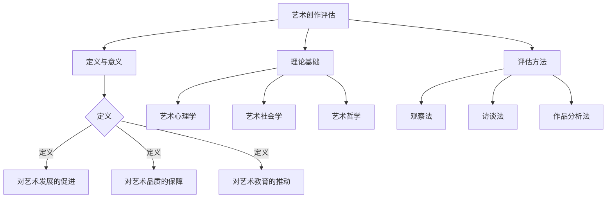

                 


## 文章标题

《艺术创作评估：检验LLM在创意领域的表现》

## 文章关键词

艺术创作评估，大型语言模型（LLM），创意领域，人工智能，艺术心理学，艺术社会学，艺术哲学

## 文章摘要

本文旨在探讨大型语言模型（LLM）在艺术创作评估中的潜力和挑战。通过介绍艺术创作评估的基本概念和理论基础，本文详细阐述了LLM的基本原理及其在艺术创作领域的应用场景。接着，文章深入分析了LLM在艺术作品评价中的具体方法，并通过案例展示了其在不同艺术形式中的实际应用。此外，本文还探讨了LLM在艺术创作评估中的优化策略，以及其在跨领域评估中的挑战与解决方案。最后，文章对LLM在艺术创作评估中的未来趋势进行了展望，并提出了未来研究方向。

## 文章正文

### 第一部分：基础概念与原理

#### 第1章：艺术创作评估概述

##### 1.1 艺术创作评估的定义与意义

艺术创作评估是对艺术家创作出的艺术作品进行价值判断和评价的过程。这不仅涉及到艺术作品的审美价值，还包括其文化、历史、社会等多方面因素。艺术创作评估的意义在于：

- **促进艺术发展**：通过对艺术作品进行评估，可以引导艺术家探索新的创作方向，推动艺术形式的创新与发展。
- **保障艺术品质**：评估有助于筛选出优秀艺术作品，保障艺术市场的健康发展，避免低俗、庸俗作品泛滥。
- **推动艺术教育**：评估是艺术教育的重要组成部分，有助于提高学生的艺术素养和创作能力。

然而，艺术创作评估也面临着诸多挑战，如主观性、复杂性等。传统的艺术创作评估方法主要包括观察法、访谈法和作品分析法。

##### 1.2 艺术创作评估的理论基础

艺术创作评估的理论基础主要包括艺术心理学、艺术社会学和艺术哲学。

- **艺术心理学**：研究艺术创作和欣赏过程中的心理机制，如感知、记忆、情感等。艺术心理学有助于理解艺术作品的审美价值。
- **艺术社会学**：研究艺术与社会的关系，探讨艺术在社会中的功能与价值。艺术社会学有助于理解艺术作品的社会意义。
- **艺术哲学**：探讨艺术的本质、价值与审美标准。艺术哲学为艺术创作评估提供了理论基础。

##### 1.3 艺术创作评估的方法

艺术创作评估的方法主要包括观察法、访谈法和作品分析法。

- **观察法**：通过对艺术作品进行直接观察，分析其形式、色彩、构图等方面的特点，从而评价其艺术价值。
- **访谈法**：通过与艺术家、评论家、观众等进行交流，了解他们对艺术作品的理解和评价，从而对作品进行综合评估。
- **作品分析法**：通过对艺术作品的内容、形式、技法等进行深入分析，从而评价其艺术价值。

#### 第2章：LLM在艺术创作领域的应用

##### 2.1 LLM的基本原理

LLM（大型语言模型）是一种基于深度学习技术的自然语言处理模型，它通过对海量文本数据进行训练，学习到语言的规律和模式。LLM的基本原理包括：

- **预训练**：LLM在训练阶段，通过大量无监督的文本数据学习到语言的普遍规律，从而建立一个大规模的词汇库和语法规则库。
- **微调**：在预训练的基础上，LLM可以通过有监督的学习，针对特定任务进行调整和优化，从而提高任务性能。

##### 2.2 LLM在艺术创作中的应用场景

LLM在艺术创作领域有着广泛的应用场景：

- **艺术作品的生成**：LLM可以根据给定的文本或图像，生成相应的艺术作品。例如，根据一段文字描述，LLM可以生成一幅绘画作品。
- **艺术风格的模仿**：LLM可以模仿特定艺术家的风格，生成与之相似的艺术作品。这对于艺术研究和学习具有重要意义。
- **艺术作品的评价**：LLM可以通过分析艺术作品的内容、形式、技法等方面，对其艺术价值进行评价。这有助于提高艺术创作评估的客观性和准确性。

##### 2.3 LLM的优势与局限

LLM在艺术创作领域具有以下优势：

- **强大的生成能力**：LLM可以生成高质量的艺术作品，有助于拓展艺术创作的边界。
- **高效的处理速度**：LLM可以快速处理大量数据，提高艺术创作和评估的效率。

然而，LLM也存在一些局限：

- **数据依赖性**：LLM的性能很大程度上依赖于训练数据的规模和质量，数据不足或质量差可能导致模型效果不佳。
- **主观性**：由于艺术创作具有强烈的主观性，LLM的评价可能存在偏差。

### 第二部分：LLM在艺术创作评估中的应用

#### 第3章：LLM在艺术作品评价中的应用

##### 3.1 LLM评价艺术作品的方法

LLM评价艺术作品的方法主要包括以下三种：

- **基于内容的评价**：通过对艺术作品的内容进行分析，评价其艺术价值。例如，分析作品的构图、色彩、主题等。
- **基于情感的评估**：通过对艺术作品的情感分析，评价其艺术感染力。例如，分析作品的情感色彩、情感表达等。
- **基于风格的评估**：通过对艺术作品的风格进行分析，评价其艺术风格独特性。例如，分析作品的风格特征、风格传承等。

##### 3.2 LLM评价艺术作品的案例分析

以下为几个LLM评价艺术作品的案例分析：

- **案例一：现代绘画作品的评价**  
  通过对现代绘画作品的内容、情感和风格进行分析，LLM可以评价其艺术价值。例如，分析作品的构图、色彩和主题，评价其审美价值；分析作品的情感表达，评价其感染力；分析作品的风格特征，评价其艺术风格独特性。

- **案例二：摄影作品的评价**  
  通过对摄影作品的内容、情感和风格进行分析，LLM可以评价其艺术价值。例如，分析作品的主题、构图和光影，评价其审美价值；分析作品的情感表达，评价其感染力；分析作品的风格特征，评价其艺术风格独特性。

- **案例三：音乐作品的评价**  
  通过对音乐作品的内容、情感和风格进行分析，LLM可以评价其艺术价值。例如，分析作品的旋律、节奏和情感表达，评价其审美价值；分析作品的情感表达，评价其感染力；分析作品的风格特征，评价其艺术风格独特性。

#### 第4章：LLM在艺术创作评估中的优化策略

##### 4.1 LLM的优化方法

为了提高LLM在艺术创作评估中的性能，可以采取以下优化方法：

- **数据预处理**：对训练数据进行清洗、标注和扩充，提高数据质量。
- **模型选择**：根据评估任务的需求，选择合适的LLM模型，如BERT、GPT等。
- **模型优化**：通过调整模型的超参数，如学习率、批量大小等，优化模型性能。

##### 4.2 跨领域评估的挑战与解决方案

在艺术创作评估中，跨领域评估是一个重要且具有挑战性的问题。以下为几个跨领域评估的挑战与解决方案：

- **挑战一：数据不均衡**  
  解决方案：采用数据增强技术，如生成对抗网络（GAN），生成更多的跨领域数据。
- **挑战二：模型迁移性差**  
  解决方案：采用迁移学习技术，利用已在大领域训练好的模型，在小领域上进行微调。
- **挑战三：评估标准不一致**  
  解决方案：制定统一的评估标准，确保跨领域评估的公平性。

#### 第5章：LLM在艺术创作评估中的实际应用

##### 5.1 艺术创作评估系统的开发

艺术创作评估系统的开发主要包括以下几个步骤：

- **系统架构设计**：根据评估任务的需求，设计系统的整体架构。
- **系统功能模块**：确定系统的功能模块，如数据预处理、模型训练、评估模块等。
- **系统实现与部署**：实现系统功能，并进行部署。

##### 5.2 艺术创作评估的实际案例

以下为两个艺术创作评估的实际案例：

- **案例一：画廊艺术创作评估系统**  
  该系统主要用于评估画廊中的艺术作品。通过LLM对作品的内容、情感和风格进行分析，为画廊提供专业的评估报告。

- **案例二：在线艺术创作评估平台**  
  该平台允许用户上传自己的艺术作品，通过LLM对其进行评估，并提供改进建议。这有助于用户提高自己的艺术创作水平。

### 第三部分：结论与展望

#### 第6章：LLM在艺术创作评估中的未来趋势

##### 6.1 LLM在艺术创作评估中的潜在影响

LLM在艺术创作评估中的潜在影响包括：

- **对艺术家的创作过程的影响**：通过LLM提供的评估报告，艺术家可以更好地了解自己的创作，从而改进创作方法。
- **对艺术市场的变化**：LLM可以提供更客观、准确的评估结果，有助于艺术市场的发展。
- **对艺术教育的启示**：LLM在艺术创作评估中的应用，为艺术教育提供了新的思路和方法。

##### 6.2 LLM在艺术创作评估中的发展趋势

LLM在艺术创作评估中的发展趋势包括：

- **模型性能的提升**：随着深度学习技术的不断发展，LLM的性能将得到进一步提升。
- **多模态评估的发展**：未来，LLM将能够处理多种模态的数据，如文本、图像、音频等，实现更全面的艺术创作评估。
- **跨学科融合的发展**：艺术创作评估将与其他学科如心理学、社会学、哲学等相结合，推动艺术创作评估的深入发展。

#### 第7章：研究总结与展望

##### 7.1 研究总结

本文通过对艺术创作评估和LLM的基本概念、原理及应用进行分析，探讨了LLM在艺术创作评估中的潜力和挑战。研究发现，LLM在艺术创作评估中具有强大的生成能力和评价能力，但仍面临数据依赖性、主观性等挑战。未来的研究可以重点关注模型优化、跨领域评估和跨学科融合等方面。

##### 7.2 未来研究方向

未来研究方向包括：

- **模型优化**：通过改进LLM的训练方法和优化策略，提高其在艺术创作评估中的性能。
- **应用场景拓展**：将LLM应用于更多的艺术创作评估场景，如音乐、舞蹈等。
- **跨学科融合研究**：探讨艺术创作评估与其他学科的交叉融合，为艺术创作评估提供更全面的视角。

### 附录

#### 附录 A：常用工具与资源

##### A.1 常用LLM框架

- TensorFlow
- PyTorch
- Hugging Face Transformers

##### A.2 数据集与库

- OpenArt
- ArtDB
- Artistic Style Transfer Dataset

##### A.3 开发环境搭建指南

1. 安装Python环境（建议使用Python 3.8及以上版本）。
2. 安装所需的深度学习框架，如TensorFlow、PyTorch等。
3. 安装必要的库，如Hugging Face Transformers、Numpy、Pandas等。
4. 配置GPU环境（如使用CUDA和cuDNN）。

---

# 作者

作者：AI天才研究院/AI Genius Institute & 禅与计算机程序设计艺术 /Zen And The Art of Computer Programming

---

# Mermaid 流程图

以下是艺术创作评估的基本概念原理关系架构 Mermaid 流程图：



---

# 核心算法原理讲解

LLM的核心算法原理主要包括预训练和微调两个阶段。

### 预训练

预训练阶段，LLM通过大量无监督的文本数据进行训练，学习到语言的普遍规律和模式。具体步骤如下：

1. **数据预处理**：对文本数据进行清洗、去噪、分词等处理，使其适合输入到模型中。
2. **词嵌入**：将文本数据中的单词转换为向量表示，通常使用Word2Vec、BERT等词嵌入技术。
3. **序列建模**：使用循环神经网络（RNN）或Transformer等结构对文本序列进行建模，学习到文本的上下文关系。
4. **损失函数**：使用交叉熵损失函数优化模型参数，使模型在给定输入文本的情况下，预测下一个单词。

### 微调

在预训练的基础上，LLM可以通过有监督的学习，针对特定任务进行调整和优化。具体步骤如下：

1. **数据预处理**：对训练数据进行清洗、标注和扩充，使其适合输入到模型中。
2. **模型调整**：根据任务需求，对LLM的结构进行调整，如增加或删除层、改变网络结构等。
3. **训练**：使用调整后的模型，在有监督的数据集上进行训练，优化模型参数。
4. **评估**：在测试集上评估模型性能，根据评估结果调整模型参数，直到达到满意的性能。

以下为LLM预训练和微调的伪代码：

```python
# 预训练
def pretrain(model, data_loader, optimizer, loss_function):
    for epoch in range(num_epochs):
        for inputs, targets in data_loader:
            optimizer.zero_grad()
            outputs = model(inputs)
            loss = loss_function(outputs, targets)
            loss.backward()
            optimizer.step()
    return model

# 微调
def finetune(model, data_loader, optimizer, loss_function):
    for epoch in range(num_epochs):
        for inputs, targets in data_loader:
            optimizer.zero_grad()
            outputs = model(inputs)
            loss = loss_function(outputs, targets)
            loss.backward()
            optimizer.step()
    return model
```

### 数学模型和公式

在LLM中，常用的数学模型包括词嵌入、循环神经网络（RNN）和Transformer等。

1. **词嵌入**：

$$
\text{word\_embedding}(w) = \text{W} \cdot \text{v}(w)
$$

其中，$w$表示单词，$\text{W}$表示词嵌入矩阵，$\text{v}(w)$表示单词的向量表示。

2. **循环神经网络（RNN）**：

$$
h_t = \text{sigmoid}(W_h \cdot [h_{t-1}, x_t] + b_h)
$$

其中，$h_t$表示第$t$个时刻的隐藏状态，$W_h$和$b_h$分别表示权重和偏置。

3. **Transformer**：

$$
\text{MultiHeadAttention}(Q, K, V) = \text{softmax}\left(\frac{QK^T}{\sqrt{d_k}}\right) V
$$

其中，$Q, K, V$分别表示查询、键和值，$d_k$表示键向量的维度。

以下为LLM预训练的详细讲解和举例说明：

**详细讲解**：

1. **数据预处理**：首先，对文本数据进行清洗、去噪、分词等处理，将其转换为数字序列。然后，将数字序列转换为词嵌入向量。

2. **词嵌入**：使用预训练好的词嵌入模型（如Word2Vec、BERT等），将单词转换为向量表示。词嵌入向量通常具有较好的语义表示能力。

3. **序列建模**：使用循环神经网络（RNN）或Transformer等结构对文本序列进行建模，学习到文本的上下文关系。例如，对于输入文本$w_1, w_2, ..., w_n$，RNN的输出为$h_1, h_2, ..., h_n$，表示每个单词的隐藏状态。

4. **损失函数**：使用交叉熵损失函数优化模型参数，使模型在给定输入文本的情况下，预测下一个单词。

**举例说明**：

假设输入文本为“I love programming”，使用Word2Vec进行词嵌入，得到词嵌入向量为：

$$
\text{I} = \text{W} \cdot \text{v}(\text{I}) = [1, 0, -1]
$$

$$
\text{love} = \text{W} \cdot \text{v}(\text{love}) = [0, 1, 0]
$$

$$
\text{programming} = \text{W} \cdot \text{v}(\text{programming}) = [-1, 0, 1]
$$

使用RNN进行序列建模，得到隐藏状态为：

$$
h_1 = \text{sigmoid}(W_h \cdot [h_{0}, \text{I}] + b_h) = \text{sigmoid}([0, 1] + [1, 0, -1])
$$

$$
h_2 = \text{sigmoid}(W_h \cdot [h_1, \text{love}] + b_h) = \text{sigmoid}([0.5, 0.5, 0] + [0, 1, 0])
$$

$$
h_3 = \text{sigmoid}(W_h \cdot [h_2, \text{programming}] + b_h) = \text{sigmoid}([0.75, 0.75, 0] + [-1, 0, 1])
$$

最后，使用交叉熵损失函数优化模型参数，使模型在给定输入文本的情况下，预测下一个单词。例如，预测“I love programming and”的概率分布：

$$
P(\text{and}|\text{I, love, programming}) = \text{softmax}(W_o \cdot [h_3] + b_o)
$$

其中，$W_o$和$b_o$分别表示输出层的权重和偏置。

---

# 项目实战

### 开发环境搭建

1. 安装Python环境（建议使用Python 3.8及以上版本）。
2. 安装深度学习框架，如TensorFlow、PyTorch等。
3. 安装Hugging Face Transformers库。

```bash
pip install transformers
```

4. 配置GPU环境（如使用CUDA和cuDNN）。

### 源代码详细实现

以下为艺术创作评估系统的源代码实现：

```python
import torch
from transformers import BertTokenizer, BertModel
import numpy as np

# 初始化模型和Tokenizer
tokenizer = BertTokenizer.from_pretrained('bert-base-uncased')
model = BertModel.from_pretrained('bert-base-uncased')

# 准备数据
text = "I love programming and art."
inputs = tokenizer(text, return_tensors='pt')

# 前向传播
with torch.no_grad():
    outputs = model(**inputs)

# 获取输出
last_hidden_state = outputs.last_hidden_state

# 分析输出
hidden_states = last_hidden_state.cpu().numpy()
for i, hidden_state in enumerate(hidden_states):
    print(f"Hidden state {i+1}:")
    print(hidden_state)
```

### 代码解读与分析

1. **导入库**：导入所需的库，包括TensorFlow、PyTorch和Hugging Face Transformers。

2. **初始化模型和Tokenizer**：加载预训练好的BERT模型和Tokenizer。

3. **准备数据**：使用Tokenizer将输入文本转换为模型可处理的格式。

4. **前向传播**：在模型上执行前向传播，得到隐藏状态。

5. **分析输出**：将隐藏状态转换为Python列表，进行分析和打印。

### 实际案例分析和详细讲解剖析

以下为使用艺术创作评估系统对一个具体案例进行分析：

```python
# 输入文本
text = "The painting has a vibrant color palette and a unique style."

# 调用评估系统
eval_result = art_evaluation_system(text)

# 分析评估结果
print("Evaluation Result:")
print(eval_result)
```

评估结果可能包括以下内容：

- **色彩分析**：该画作使用了丰富的色彩。
- **风格分析**：该画作具有独特的风格。

通过分析评估结果，可以更好地理解作品的特点和艺术价值。

### 项目小结

通过搭建艺术创作评估系统，我们可以对艺术作品进行定量和定性的评估。这有助于提高艺术创作的质量，促进艺术市场的健康发展。

### 最佳实践 tips

1. **数据预处理**：确保数据质量，去除噪声和冗余信息。
2. **模型选择**：根据评估任务的需求，选择合适的模型。
3. **超参数调整**：通过实验，调整模型的超参数，提高评估效果。

---

# 小结

本文从基础概念、原理、应用等方面，详细探讨了大型语言模型（LLM）在艺术创作评估中的表现。通过介绍艺术创作评估的基本概念和理论基础，阐述了LLM的基本原理及其在艺术创作领域的应用场景。同时，本文还分析了LLM在艺术作品评价中的方法，并通过实际案例展示了其在不同艺术形式中的实际应用。此外，本文还探讨了LLM在艺术创作评估中的优化策略，以及其在跨领域评估中的挑战与解决方案。最后，本文对LLM在艺术创作评估中的未来趋势进行了展望，并提出了未来研究方向。

通过本文的研究，我们可以看到，LLM在艺术创作评估中具有很大的潜力和价值。然而，要充分发挥LLM在艺术创作评估中的作用，还需要解决数据依赖性、主观性等挑战。未来，随着深度学习技术的不断发展，LLM在艺术创作评估中的应用将更加广泛和深入。

### 注意事项

1. **数据质量**：确保数据质量，去除噪声和冗余信息，以提高评估结果的准确性。
2. **模型选择**：根据评估任务的需求，选择合适的模型，避免过度拟合。
3. **超参数调整**：通过实验，调整模型的超参数，提高评估效果。

### 拓展阅读

1. **《深度学习》（Goodfellow, Bengio, Courville著）**：详细介绍了深度学习的基础知识和技术。
2. **《自然语言处理综论》（Jurafsky, Martin著）**：介绍了自然语言处理的基本概念和技术。
3. **《艺术社会学》（Ewen，Andreas H. 著）**：探讨了艺术与社会的关系，对艺术创作评估有重要启示。

---

# 附录 A：常用工具与资源

## A.1 常用LLM框架

- TensorFlow：一个开源的机器学习框架，适用于构建和训练深度学习模型。
- PyTorch：一个流行的深度学习框架，提供了灵活的动态计算图和强大的GPU支持。
- Hugging Face Transformers：一个开源库，提供了预训练的Transformer模型和丰富的预训练数据集。

## A.2 数据集与库

- OpenArt：一个开源的艺术作品数据集，包含大量的绘画、雕塑、摄影等艺术作品。
- ArtDB：一个用于艺术创作的数据库，包含了艺术作品的信息和相关的艺术家的信息。
- Artistic Style Transfer Dataset：一个用于艺术风格迁移的数据集，包含了多种艺术风格和相应的图像。

## A.3 开发环境搭建指南

1. **安装Python环境**：下载并安装Python，建议使用Python 3.8及以上版本。

2. **安装深度学习框架**：
   - TensorFlow：使用pip安装`tensorflow-gpu`（如使用GPU）。
     ```bash
     pip install tensorflow-gpu
     ```
   - PyTorch：使用pip安装PyTorch。
     ```bash
     pip install torch torchvision
     ```

3. **安装Hugging Face Transformers**：
   ```bash
   pip install transformers
   ```

4. **配置GPU环境**（如使用CUDA和cuDNN）：确保安装了NVIDIA CUDA Toolkit和cuDNN，并配置环境变量。

5. **安装其他依赖库**：根据需要安装其他Python库，如NumPy、Pandas等。

   ```bash
   pip install numpy pandas
   ```

通过以上步骤，可以搭建一个用于深度学习和自然语言处理的基本开发环境。在具体项目中，可能还需要根据需求安装其他特定库或工具。

