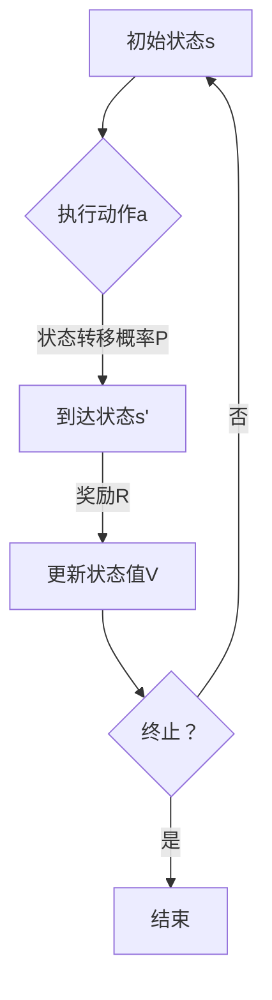
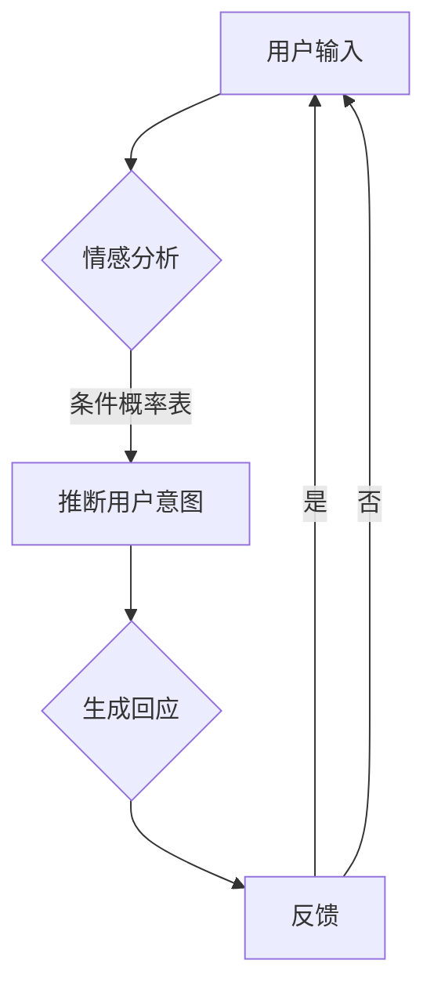
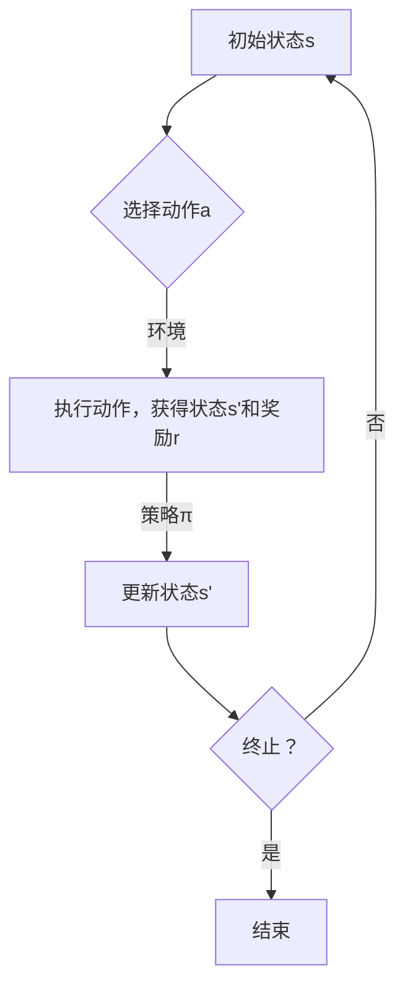
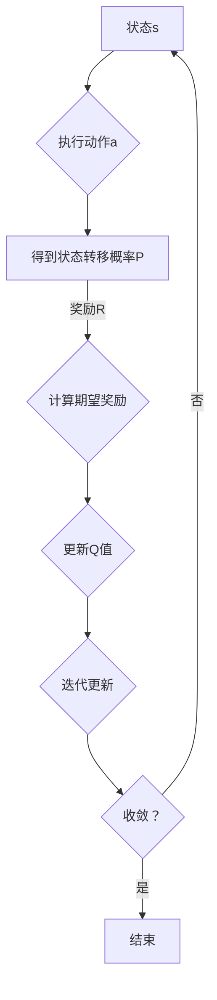
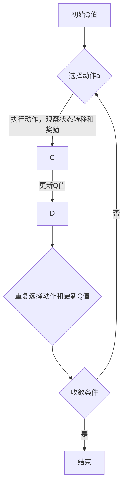
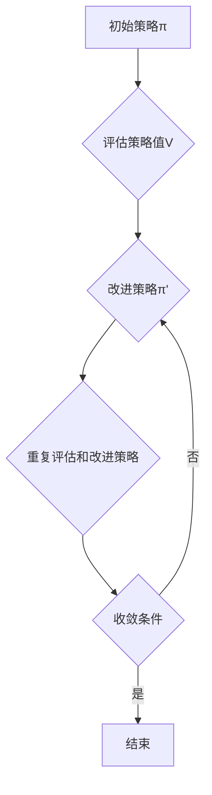

                 

## 文章标题

《虚拟助手的对话管理：人机交互的数学策略》

## 关键词

虚拟助手，对话系统，人机交互，数学策略，对话管理

## 摘要

随着人工智能技术的飞速发展，虚拟助手作为一种人机交互的重要形式，正逐渐渗透到各个领域。虚拟助手的对话管理，作为其核心功能之一，对于提升用户体验、优化服务流程具有重要意义。本文将从数学策略的角度，系统性地探讨虚拟助手对话管理的基本原理、实现方法、优化技巧以及应用实例，旨在为研究人员和实践者提供有益的参考。

本文首先回顾了虚拟助手与对话系统的基本概念，然后详细介绍了对话管理的基本原理和数学模型，包括Markov决策过程、贝叶斯网络和强化学习。随后，本文探讨了对话系统的数学算法，如贝尔曼方程、Q学习算法和策略迭代算法。在对话系统的实现与优化部分，本文提出了对话系统的实现框架和优化方法，并通过实际案例进行分析。最后，本文探讨了虚拟助手对话管理的未来发展趋势，包括人工智能技术的进步、跨领域对话系统的整合以及伦理与隐私保护问题。

通过本文的探讨，我们希望能够为虚拟助手的对话管理提供一套系统化的理论框架和实用的技术指南，推动这一领域的研究与应用发展。读者可以从基础概念、算法原理、实现技巧和应用实例等多个维度深入理解虚拟助手对话管理，为实际项目提供参考和灵感。

### 第1章 虚拟助手与对话系统的概述

#### 1.1 虚拟助手的概念与发展

虚拟助手（Virtual Assistant），是一种通过人工智能技术实现的人机交互系统，能够理解用户指令、提供信息、执行任务，从而帮助用户简化生活和工作流程。虚拟助手的概念最早可以追溯到1980年代，当时计算机科学家们开始探索如何让计算机具备更高级的对话能力。随着人工智能技术的发展，虚拟助手逐渐从理论研究走向实际应用。

**虚拟助手的定义**：虚拟助手是一种具备自然语言处理、语音识别、知识图谱和机器学习等技术的智能系统，能够通过文本或语音与用户进行交互，理解用户意图，提供相应的信息和执行任务。

**虚拟助手的发展历程**：

1. **早期探索**（1980-1990年代）：这一阶段主要集中在自然语言处理技术的研究，如语音识别和语义分析。虽然技术基础较弱，但为后续的发展奠定了基础。
   
2. **互联网时代**（2000年代）：随着互联网的普及，虚拟助手开始应用于在线客服、智能搜索引擎等领域。代表性的系统有IBM的沃森（Watson）和苹果的Siri。

3. **移动时代**（2010年代至今）：智能手机的普及和移动应用的兴起，推动了虚拟助手的广泛应用。谷歌助手（Google Assistant）、亚马逊的Alexa、微软的Cortana等虚拟助手成为市场热点。

**虚拟助手的应用领域**：

1. **个人生活**：提供日程管理、提醒服务、信息查询、音乐播放等。
   
2. **商业服务**：客户服务、销售支持、数据分析等。
   
3. **智能家居**：控制家电设备、环境监测、安防监控等。

4. **医疗健康**：健康咨询、医疗信息查询、远程监控等。

5. **教育**：在线学习辅导、课程查询、学习计划管理等。

#### 1.2 对话系统的组成与分类

对话系统（Dialogue System）是虚拟助手的核心组成部分，负责处理用户输入的信息、理解用户意图、生成适当的回应，并维持有效的对话流程。一个典型的对话系统通常包括以下几个主要组成部分：

**对话系统的基本组成**：

1. **用户接口**（User Interface, UI）：与用户进行交互的界面，可以是文本聊天、语音交互或图形界面。
   
2. **自然语言处理模块**（Natural Language Processing, NLP）：负责处理和理解用户输入的自然语言信息，包括语音识别、语义分析、情感分析等。

3. **对话管理模块**（Dialogue Management）：负责对话的整体流程控制，包括对话状态跟踪、对话策略设计和对话流程管理。

4. **知识库**（Knowledge Base）：存储用于对话的背景知识和相关信息，可以是结构化数据或非结构化数据。

5. **语言生成模块**（Language Generation）：根据对话管理模块的决策，生成适合的文本或语音回应。

**对话系统的分类方法**：

1. **基于规则的方法**：通过预定义的规则来控制对话流程和生成回应。优点是简单易懂，但灵活性较低。

2. **基于模板的方法**：使用预定义的模板来生成对话回应，通过参数替换来适应不同的对话情境。优点是生成回应速度快，但缺乏灵活性。

3. **数据驱动的方法**：使用机器学习技术，通过大量对话数据训练模型，自动生成对话回应。优点是灵活性高，但需要大量的训练数据和计算资源。

4. **混合方法**：结合基于规则、模板和数据驱动的方法，以实现对话系统的最佳性能。

**对话系统的应用领域**：

1. **客户服务**：提供自动化的客户支持，减少人力成本，提升服务质量。

2. **智能家居**：与智能家电设备交互，提供便捷的家庭自动化服务。

3. **电子商务**：在线购物咨询、商品推荐、订单管理等。

4. **教育**：提供在线学习辅导、课程推荐、学习进度跟踪等。

5. **医疗**：提供健康咨询、疾病信息查询、远程医疗服务等。

#### 1.3 人机交互的数学策略基础

在人机交互领域，数学策略的应用有助于提升系统的智能性和灵活性。以下是人机交互的数学策略基础，包括其应用、分类和作用。

**数学策略在虚拟助手中的应用**：

1. **自然语言处理**：使用数学模型进行文本分类、情感分析、命名实体识别等。

2. **对话管理**：运用数学策略进行对话状态跟踪、对话策略设计和对话流程管理。

3. **知识表示**：利用数学模型表示知识和信息，如知识图谱、概率模型等。

**数学策略的分类和作用**：

1. **统计模型**：如贝叶斯网络、隐马尔可夫模型（HMM），用于概率推断和模式识别。

2. **机器学习模型**：如决策树、支持向量机（SVM）、神经网络，用于分类、预测和优化。

3. **优化算法**：如遗传算法、粒子群优化，用于解决复杂优化问题。

4. **强化学习**：如Q学习、深度Q网络（DQN），用于在不确定环境中进行决策和策略优化。

**数学策略的作用**：

1. **提升智能性**：通过数学模型和算法，使虚拟助手能够更准确地理解和回应用户。

2. **增强灵活性**：基于数据和算法的优化，使对话系统能够适应各种复杂的对话情境。

3. **优化用户体验**：通过精准的对话管理和回应生成，提升用户的使用体验。

### 第2章 对话管理的基本原理

#### 2.1 对话状态跟踪

对话状态跟踪是对话管理中至关重要的一环，其核心目的是在对话过程中保持对用户意图和系统状态的准确理解。通过对话状态跟踪，虚拟助手能够动态地调整对话策略，确保对话流程的流畅和有效性。

**对话状态的定义**：

对话状态是指在某一个特定时刻，对话系统对当前对话情境的全面了解。这包括用户的行为、系统提供的信息以及对话的历史记录等。

**对话状态的跟踪方法**：

1. **基于规则的方法**：通过预定义的规则来识别和更新对话状态。例如，当用户提出一个问题时，系统可以基于规则库中的规则来确定当前的状态。

2. **基于模型的方法**：使用机器学习模型，如隐马尔可夫模型（HMM）或马尔可夫决策过程（MDP），来跟踪对话状态。这些模型可以学习用户行为和系统回应之间的关系，从而动态地更新对话状态。

3. **基于数据的方法**：通过分析对话历史数据和用户行为数据，来预测和更新对话状态。这种方法通常需要大量的训练数据，但可以提供更准确的对话状态跟踪。

**对话状态跟踪的重要性**：

1. **提升对话理解能力**：通过准确跟踪对话状态，虚拟助手能够更好地理解用户的意图，提供更相关的回应。

2. **优化对话流程**：对话状态跟踪有助于系统在对话过程中做出更合理的决策，从而优化对话流程，提高用户体验。

3. **降低错误率**：准确的对话状态跟踪可以减少由于对用户意图理解不准确导致的错误回应和对话中断。

#### 2.2 对话策略设计

对话策略设计是确保对话系统能够在特定对话情境下生成合理回应的关键环节。对话策略决定了系统如何处理用户的输入、如何回应用户以及如何维持对话的流畅性。

**对话策略的基本概念**：

对话策略是一组规则或方法，用于指导对话系统在特定情境下生成回应。这些规则或方法可以是基于规则的、基于模型或基于数据的。

**对话策略的设计方法**：

1. **基于规则的方法**：通过预定义的规则来生成对话回应。例如，当用户提出一个特定类型的问题时，系统可以直接应用相应的规则来生成回应。

2. **基于模板的方法**：使用预定义的模板来生成对话回应。这些模板可以根据不同的对话情境进行参数化替换，以生成个性化的回应。

3. **基于模型的方法**：使用机器学习模型，如决策树、支持向量机（SVM）或神经网络，来生成对话策略。这些模型可以基于对话数据学习如何生成最合适的回应。

**对话策略的设计原则**：

1. **可理解性**：对话策略应当易于理解，以便开发人员和测试人员能够清楚地了解系统的工作方式。

2. **灵活性**：对话策略需要具备一定的灵活性，以适应不同的对话情境和用户需求。

3. **适应性**：对话策略应当能够根据对话历史和用户行为进行动态调整，以提供更个性化的服务。

4. **鲁棒性**：对话策略应具备一定的鲁棒性，能够在面对不完整、模糊或错误的信息时，依然能够生成合理的回应。

**对话策略设计的重要性**：

1. **提升对话质量**：合理的对话策略能够提升对话的流畅性和有效性，提供更优质的用户体验。

2. **优化系统性能**：通过科学的对话策略设计，可以优化系统的响应时间、准确率和资源利用率。

3. **降低错误率**：良好的对话策略设计可以减少由于策略不合理导致的错误回应和对话中断。

#### 2.3 对话流程管理

对话流程管理是对话管理的核心环节，负责确保对话系统能够在合适的时机、以合适的方式与用户进行交互，从而实现对话目标。对话流程管理涉及对话流程的定义、管理和监控。

**对话流程的定义**：

对话流程是指从对话开始到对话结束的整个过程，包括对话的各个阶段、步骤和状态。一个典型的对话流程可能包括问候、问题理解、信息提供、任务执行等阶段。

**对话流程的管理方法**：

1. **基于规则的方法**：通过预定义的规则来管理对话流程。例如，可以设置规则来控制对话在不同阶段的行为。

2. **基于模型的方法**：使用机器学习模型，如状态转移模型，来管理对话流程。这些模型可以学习对话状态之间的转移关系，从而自动管理对话流程。

3. **基于数据的方法**：通过分析对话历史数据和用户行为数据，来管理对话流程。例如，可以根据用户行为预测下一个对话阶段，并提前做好准备。

**对话流程管理的核心任务**：

1. **状态转换**：管理对话状态之间的转换，确保对话能够按照预定的流程进行。

2. **对话决策**：在对话的不同阶段，根据对话状态和用户输入，生成相应的回应和决策。

3. **错误处理**：在对话过程中，处理可能的错误和异常情况，确保对话能够继续进行。

**对话流程管理的重要性**：

1. **确保对话流畅性**：通过有效的流程管理，可以确保对话在不同阶段之间过渡自然，避免因流程混乱导致的用户体验下降。

2. **提升对话效率**：良好的流程管理可以减少不必要的对话步骤，提升对话的效率。

3. **优化用户体验**：通过科学的管理方法，可以确保对话系统能够在合适的时机、以合适的方式与用户进行交互，提供更优质的服务。

### 第3章 对话系统的数学模型

#### 3.1 Markov决策过程

Markov决策过程（Markov Decision Process，MDP）是用于描述不确定环境中决策过程的数学模型。在对话系统中，MDP被广泛应用于对话状态跟踪和策略优化。MDP由以下五个要素组成：

1. **状态空间**（State Space，\(S\)）：描述系统的所有可能状态。
2. **动作空间**（Action Space，\(A\)）：描述系统可以执行的所有可能动作。
3. **状态转移概率**（State Transition Probability，\(P\)）：描述在特定状态下执行特定动作后，系统转移到其他状态的概率。
4. **奖励函数**（Reward Function，\(R\)）：描述在特定状态下执行特定动作后的奖励或惩罚。
5. **策略**（Policy，\(\pi\)）：描述系统如何从当前状态选择动作，以最大化长期奖励。

**MDP在对话管理中的应用**：

1. **状态跟踪**：通过MDP模型，对话系统可以动态地跟踪用户的状态变化，例如，从问题理解状态转移到信息提供状态。

2. **策略优化**：使用MDP模型，对话系统可以通过策略迭代或价值迭代等方法，优化对话策略，提高用户满意度。

**MDP的数学模型**：

1. **状态转移方程**：
   \[
   P(s' | s, a) = P(s'|s,a)
   \]
   其中，\(s'\)是下一个状态，\(s\)是当前状态，\(a\)是执行的动作。

2. **奖励函数**：
   \[
   R(s, a) = \sum_{s'} P(s'|s,a) \cdot r(s')
   \]
   其中，\(r(s')\)是状态\(s'\)的奖励。

3. **策略表示**：
   \[
   \pi(a|s) = P(a|s)
   \]
   其中，\(\pi(a|s)\)是给定状态\(s\)下执行动作\(a\)的概率。

**MDP在对话系统中的实现**：

1. **状态表示**：将对话系统的状态表示为用户行为、对话历史和当前上下文信息的组合。

2. **动作表示**：将对话系统可以执行的动作表示为生成回复、执行任务或请求更多信息等。

3. **状态转移概率**：通过历史对话数据或预定义规则来估计状态转移概率。

4. **奖励函数**：根据用户满意度、对话成功率等因素设计奖励函数。

#### 3.2 贝叶斯网络

贝叶斯网络（Bayesian Network）是一种基于概率的图形模型，用于表示变量之间的条件依赖关系。在对话系统中，贝叶斯网络可以用于处理不确定性、推断用户意图和进行决策。

**贝叶斯网络的基本概念**：

1. **节点**（Node）：表示变量。
2. **边**（Edge）：表示变量之间的条件依赖关系。
3. **条件概率表**（Conditional Probability Table，CPT）：描述变量在特定条件下的概率分布。

**贝叶斯网络在对话系统中的应用**：

1. **不确定性处理**：贝叶斯网络可以用于处理对话中的不确定性，例如，当用户输入模糊或不确定的信息时，系统可以通过贝叶斯推理来推断用户意图。

2. **用户意图识别**：通过分析用户输入和对话历史，贝叶斯网络可以推断用户意图，为系统生成相应的回应。

3. **决策支持**：贝叶斯网络可以用于支持对话系统的决策过程，例如，在提供信息或执行任务时，系统可以根据贝叶斯网络提供的概率分布来选择最佳行动。

**贝叶斯网络的数学模型**：

1. **概率分布**：
   \[
   P(X = x | X_1 = x_1, \ldots, X_n = x_n) = \frac{P(X = x) \cdot P(X_1 = x_1 | X = x) \cdot \ldots \cdot P(X_n = x_n | X = x)}{P(X_1 = x_1) \cdot \ldots \cdot P(X_n = x_n)}
   \]
   其中，\(X\)是目标变量，\(X_1, \ldots, X_n\)是条件变量，\(x, x_1, \ldots, x_n\)是相应的变量值。

2. **条件概率表**：
   \[
   P(X = x | X_1 = x_1) = \sum_{x_2, \ldots, x_n} P(X = x, X_1 = x_1, X_2 = x_2, \ldots, X_n = x_n)
   \]

**贝叶斯网络在对话系统中的实现**：

1. **构建贝叶斯网络**：通过分析对话数据和用户行为，构建表示变量之间依赖关系的贝叶斯网络。

2. **概率推理**：使用贝叶斯推理算法，根据用户输入和对话历史，推断用户意图和系统状态。

3. **决策支持**：根据贝叶斯网络提供的概率分布，为系统生成相应的决策策略。

#### 3.3 强化学习

强化学习（Reinforcement Learning，RL）是一种机器学习范式，通过试错和反馈机制，使智能体（agent）在与环境的交互中学习和优化策略。在对话系统中，强化学习被广泛应用于对话策略优化和用户满意度提升。

**强化学习的基本概念**：

1. **智能体**（Agent）：执行决策的实体，如虚拟助手。
2. **环境**（Environment）：智能体所处的情境，包括用户输入、系统状态等。
3. **状态**（State）：描述智能体在某一时刻的环境信息。
4. **动作**（Action）：智能体可以执行的行为。
5. **奖励**（Reward）：描述动作的效果，可以是正奖励或负奖励。
6. **策略**（Policy）：描述智能体如何从状态选择动作。

**强化学习在对话系统中的应用**：

1. **对话策略优化**：通过强化学习，智能体可以在与用户的交互过程中，不断调整对话策略，以最大化长期奖励，如用户满意度。

2. **自适应对话**：强化学习使智能体能够根据用户反馈和对话历史，自适应地调整对话策略，提供更个性化的服务。

3. **场景适应**：在复杂和动态的对话环境中，强化学习可以帮助智能体快速适应新场景，提高对话系统的鲁棒性和灵活性。

**强化学习的数学模型**：

1. **状态-动作价值函数**（State-Action Value Function，\(Q(s, a)\)）：表示在状态\(s\)下执行动作\(a\)的预期奖励。
   \[
   Q(s, a) = \sum_{s'} P(s'|s, a) \cdot [R(s') + \gamma \cdot \max_{a'} Q(s', a')]
   \]
   其中，\(\gamma\)是折扣因子，用于权衡当前奖励和未来奖励。

2. **策略**（Policy，\(\pi(a|s)\)）：描述智能体在状态\(s\)下选择动作\(a\)的概率分布。
   \[
   \pi(a|s) = \arg\max_{a} Q(s, a)
   \]

**强化学习在对话系统中的实现**：

1. **构建环境**：定义对话系统的状态空间、动作空间和奖励函数。

2. **训练智能体**：使用强化学习算法，如Q学习或深度Q网络（DQN），训练智能体，使其在模拟环境中学习最优策略。

3. **评估和调整**：通过实际对话数据，评估智能体的对话策略，并根据用户反馈进行迭代优化。

### 第4章 对话系统的数学算法

#### 4.1 贝尔曼方程

贝尔曼方程（Bellman Equation）是强化学习中的核心方程，用于求解最优策略。它描述了在给定当前状态和动作时，如何更新状态-动作价值函数，从而找到最优动作。

**贝尔曼方程的基本概念**：

1. **状态-动作价值函数**（State-Action Value Function，\(Q(s, a)\)）：表示在状态\(s\)下执行动作\(a\)的预期奖励。
2. **状态值函数**（State Value Function，\(V(s)\)）：表示在状态\(s\)下的最优策略预期奖励。
3. **策略**（Policy，\(\pi(a|s)\)）：描述系统在状态\(s\)下选择动作\(a\)的概率分布。

**贝尔曼方程的求解方法**：

1. **递归方式**：从初始状态开始，逐步更新状态-动作价值函数，直到收敛到最优值。

2. **迭代方式**：在给定策略下，不断迭代更新状态-动作价值函数，直至达到期望的精度。

**贝尔曼方程的数学公式**：

1. **状态-动作价值函数更新方程**：
   \[
   Q(s, a) = r(s, a) + \gamma \cdot \max_{a'} Q(s', a')
   \]
   其中，\(r(s, a)\)是状态-动作对\(s, a\)的即时奖励，\(\gamma\)是折扣因子，用于平衡当前奖励和未来奖励。

2. **状态值函数更新方程**：
   \[
   V(s) = \max_{a} Q(s, a)
   \]

**贝尔曼方程在对话系统中的应用**：

1. **策略评估**：通过贝尔曼方程，可以评估当前策略下的状态-动作价值函数，确定最佳策略。

2. **策略迭代**：在给定策略下，通过迭代更新状态-动作价值函数，逐步优化策略。

#### 4.2 Q学习算法

Q学习算法（Q-Learning）是一种基于值迭代的强化学习算法，用于求解最优动作值函数。Q学习通过在状态-动作对上更新Q值，逐步找到最优策略。

**Q学习算法的基本概念**：

1. **Q值**（Q-Value，\(Q(s, a)\)）：表示在状态\(s\)下执行动作\(a\)的预期奖励。
2. **目标值**（Target Value）：用于更新Q值的期望奖励。

**Q学习算法的实现步骤**：

1. **初始化**：随机初始化Q值表。
   \[
   Q(s, a) \sim \text{随机值}
   \]

2. **选择动作**：在给定状态\(s\)下，选择动作\(a\)，可以是贪婪策略或随机策略。

3. **执行动作**：在环境\(E\)中执行动作\(a\)，观察状态转移和即时奖励。
   \[
   s' \sim P(s'|s, a), r = R(s', a)
   \]

4. **更新Q值**：根据即时奖励和目标值，更新Q值。
   \[
   Q(s, a) = Q(s, a) + \alpha \cdot [r + \gamma \cdot \max_{a'} Q(s', a') - Q(s, a)]
   \]
   其中，\(\alpha\)是学习率，\(\gamma\)是折扣因子。

5. **重复步骤2-4**：重复执行动作和更新Q值，直至满足收敛条件。

**Q学习算法的伪代码**：

```python
# 初始化Q值表
Q = rand_init(Q)

# 设置学习率和折扣因子
alpha = 0.1
gamma = 0.9

# 迭代次数
for episode in range(num_episodes):
    s = env.reset()  # 初始化环境
    done = False
    
    while not done:
        a = choose_action(Q, s)  # 选择动作
        s', r = env.step(a)  # 执行动作，观察状态转移和奖励
        Q[s, a] = Q[s, a] + alpha * (r + gamma * max(Q[s', a']) - Q[s, a])  # 更新Q值
        s = s'  # 更新状态
        if done:
            break

# 输出最优策略
policy = argmax(Q)
```

**Q学习算法在对话系统中的应用**：

1. **对话状态-动作价值评估**：通过Q学习，可以评估不同状态-动作对的预期奖励，找到最佳对话策略。

2. **自适应对话策略**：Q学习算法使对话系统能够根据用户反馈和对话历史，动态调整对话策略，提供更个性化的服务。

#### 4.3 策略迭代算法

策略迭代算法（Policy Iteration）是一种基于值迭代的强化学习算法，用于求解最优策略。策略迭代算法分为两个阶段：策略评估和策略改进。

**策略迭代算法的基本概念**：

1. **初始策略**（Initial Policy，\(\pi_0\)）：初始阶段使用的策略。
2. **评估策略**（Evaluate Policy）：评估当前策略的价值函数。
3. **改进策略**（Improve Policy）：根据评估结果，更新策略。

**策略迭代算法的实现步骤**：

1. **初始化**：选择一个初始策略\(\pi_0\)。

2. **策略评估**：使用当前策略，计算状态-动作价值函数。
   \[
   V^{k+1}(s) = \sum_{a} \pi_k(a|s) \cdot [r + \gamma \cdot V^k(s')]
   \]

3. **策略改进**：根据评估结果，更新策略。
   \[
   \pi_{k+1}(a|s) = \begin{cases}
   1, & \text{if } a = \arg\max_a [r + \gamma \cdot V^k(s')] \\
   0, & \text{otherwise}
   \end{cases}
   \]

4. **迭代**：重复执行策略评估和策略改进，直至策略收敛。

**策略迭代算法的伪代码**：

```python
# 初始化策略
pi = InitialPolicy()

# 设置学习率和折扣因子
alpha = 0.1
gamma = 0.9

# 迭代次数
for iteration in range(num_iterations):
    V = EvaluatePolicy(pi, env)
    pi = ImprovePolicy(pi, V)

# 输出最优策略
optimal_policy = argmax(V)
```

**策略迭代算法在对话系统中的应用**：

1. **多阶段策略优化**：策略迭代算法通过多次迭代，逐步优化对话策略，提高对话系统的性能。

2. **全局优化**：策略迭代算法可以从全局角度优化对话策略，避免局部最优，提高策略的鲁棒性。

### 第5章 对话系统的实现与优化

#### 5.1 对话系统的实现框架

实现一个高效的对话系统，需要一个清晰且模块化的框架来支持各种功能。以下是构建对话系统的主要组成部分和其作用：

1. **前端交互层**：负责与用户进行交互，接收用户的输入，并展示系统生成的回应。常用的技术包括Web界面、移动应用或语音识别系统。

2. **自然语言处理层**：负责处理用户的自然语言输入，包括语音识别、文本解析、意图识别、实体提取等。这个层通常使用NLP库和框架，如NLTK、spaCy、或者深度学习模型，如BERT、GPT。

3. **对话管理层**：负责对话的整体流程控制，包括对话状态跟踪、对话策略设计和对话流程管理。这个层需要协调其他模块，确保对话的连贯性和有效性。

4. **知识库层**：存储对话所需的背景知识和信息。这可以是结构化数据（如关系数据库）或非结构化数据（如知识图谱）。知识库需要能够快速响应查询，为对话提供必要的支持。

5. **后端服务层**：负责执行具体的任务，如查询数据库、调用API或执行复杂的计算。这个层通常包括微服务架构，以提高系统的灵活性和可维护性。

6. **数据层**：负责数据的存储和管理，包括用户数据、对话历史和系统日志。常用的技术包括关系数据库（如MySQL、PostgreSQL）和NoSQL数据库（如MongoDB、Cassandra）。

**对话系统的实现流程**：

1. **需求分析**：明确系统的功能需求和性能要求，为后续设计提供依据。

2. **系统设计**：根据需求分析，设计系统的架构和模块，确定技术选型和开发工具。

3. **模块开发**：按照设计文档，分别开发前端交互层、自然语言处理层、对话管理层等模块。

4. **集成测试**：将各个模块集成在一起，进行系统级测试，确保各个模块之间能够协同工作。

5. **性能优化**：对系统进行性能优化，包括代码优化、数据库查询优化、缓存策略等，以提高系统的响应速度和稳定性。

6. **部署上线**：将系统部署到生产环境，进行实际运行，并监控系统的性能和用户体验。

#### 5.2 对话系统的优化方法

为了提升对话系统的性能和用户体验，需要采用一系列优化方法。以下是一些常用的优化技术：

1. **对话状态跟踪优化**：

   - **高效数据结构**：使用高效的数据结构（如哈希表）来存储和检索对话状态，减少查询时间。
   - **状态压缩**：将高维状态空间压缩为低维状态空间，减少计算复杂度。
   - **增量更新**：只更新必要的状态，避免不必要的计算。

2. **对话策略优化**：

   - **策略搜索**：使用启发式搜索算法（如A*搜索），找到最优策略。
   - **多策略评估**：评估多个候选策略，选择表现最好的策略。
   - **动态调整**：根据用户反馈和对话历史，动态调整策略。

3. **对话流程优化**：

   - **流程简化**：简化对话流程，减少不必要的对话步骤，提高效率。
   - **流程分段**：将复杂的对话流程分为多个阶段，每个阶段只处理一部分任务，提高系统的可维护性。
   - **错误处理**：设计完善的错误处理机制，确保对话系统能够在出现问题时，及时恢复并继续对话。

4. **性能优化**：

   - **并行处理**：使用并行处理技术，加快对话处理速度。
   - **缓存策略**：使用缓存技术，减少数据库查询次数，提高响应速度。
   - **分布式架构**：使用分布式架构，提高系统的可扩展性和容错性。

5. **用户体验优化**：

   - **个性化推荐**：根据用户历史和偏好，提供个性化的对话服务。
   - **多模态交互**：支持多种交互方式（如文本、语音、图形），提高用户体验。
   - **反馈机制**：收集用户反馈，持续优化对话策略和流程。

**优化技巧的实际应用**：

1. **案例1：智能客服系统**：

   - **状态跟踪优化**：使用哈希表存储用户状态，提高状态查询效率。
   - **策略优化**：采用Q学习算法，动态调整客服机器人对话策略，提高用户满意度。
   - **流程优化**：简化客服流程，减少用户等待时间。

2. **案例2：智能家居系统**：

   - **性能优化**：采用并行处理技术，提高响应速度，满足用户对实时性的要求。
   - **用户体验优化**：支持语音和文本交互，提供个性化智能家居控制体验。

通过上述优化方法，对话系统能够在保证性能的同时，提供优质的用户体验，满足不同场景的需求。

#### 5.3 实际案例与效果分析

**案例1：智能客服系统**

在智能客服系统中，对话管理的优化对于提升用户体验和降低运营成本至关重要。以下是一个具体的实施案例和效果分析：

**实施步骤**：

1. **需求分析**：分析用户常见问题，确定需要支持的功能模块，如查询订单状态、解决支付问题、退换货服务等。

2. **系统设计**：设计智能客服系统的架构，包括前端交互层、自然语言处理层、对话管理层和后端服务层。选择合适的NLP库（如spaCy）和机器学习框架（如TensorFlow）。

3. **模块开发**：开发各模块功能，包括文本解析、意图识别、对话状态跟踪、对话策略设计等。

4. **集成测试**：进行系统级测试，确保各个模块之间的协同工作。

5. **性能优化**：

   - **对话状态跟踪优化**：采用哈希表存储用户状态，提高查询效率。
   - **策略优化**：使用Q学习算法，根据用户反馈动态调整客服机器人的对话策略。

6. **部署上线**：将系统部署到生产环境，进行实际运行，并监控系统的性能和用户体验。

**效果分析**：

1. **用户满意度提升**：通过优化对话状态跟踪和策略，客服系统能够更准确地理解用户意图，提供更相关的回应，用户满意度显著提升。

2. **运营成本降低**：智能客服系统能够自动处理大量用户请求，减少了人工客服的工作量，降低了运营成本。

3. **效率提升**：优化后的系统响应速度加快，用户等待时间缩短，提高了整体效率。

**案例2：智能家居系统**

在智能家居系统中，对话管理对于提升用户控制体验和系统稳定性至关重要。以下是一个具体的实施案例和效果分析：

**实施步骤**：

1. **需求分析**：分析用户对智能家居设备的需求，如温度控制、灯光调节、家电控制等。

2. **系统设计**：设计智能家居系统的架构，包括前端交互层、自然语言处理层、对话管理层和设备控制层。

3. **模块开发**：开发各模块功能，包括语音识别、意图识别、对话状态跟踪、设备控制等。

4. **集成测试**：进行系统级测试，确保各个模块之间的协同工作。

5. **性能优化**：

   - **并行处理**：使用并行处理技术，提高响应速度，满足用户对实时性的要求。
   - **用户体验优化**：支持语音和文本交互，提供个性化智能家居控制体验。

6. **部署上线**：将系统部署到生产环境，进行实际运行，并监控系统的性能和用户体验。

**效果分析**：

1. **用户体验提升**：通过优化对话管理和多模态交互，用户可以更便捷地控制智能家居设备，提高了用户体验。

2. **系统稳定性增强**：通过并行处理和高效的数据结构，系统在处理大量请求时保持了良好的稳定性。

3. **响应速度加快**：优化后的系统能够更快地响应用户请求，提升了用户满意度。

**小结**：

以上两个实际案例展示了对话管理在智能客服系统和智能家居系统中的应用效果。通过优化对话状态跟踪、策略设计和性能，这些系统能够提供更优质的服务和更高效的交互体验，从而提升用户满意度。

### 第6章 虚拟助手对话管理的应用

#### 6.1 虚拟助手在客服领域的应用

在客服领域，虚拟助手已成为提升服务效率和质量的重要工具。以下将详细探讨虚拟助手在客服领域的具体应用、设计原则和效果评估。

**具体应用**：

1. **自动应答**：虚拟助手可以自动应答用户常见问题，如产品查询、订单状态查询、支付问题等，减少人工客服的工作量。

2. **智能分流**：根据用户提出的问题，虚拟助手可以智能地将用户引导到相应的客服通道，如技术支持、销售咨询等，提高客服响应速度。

3. **多渠道交互**：虚拟助手可以通过多种渠道与用户进行交互，包括网站聊天、邮件、短信、电话等，提供无缝的客服体验。

4. **客户关怀**：虚拟助手可以定期发送节日问候、促销信息等，增强与客户的互动，提升客户忠诚度。

5. **数据分析**：虚拟助手可以收集用户交互数据，如问题类型、用户反馈等，为企业提供宝贵的市场洞察和改进方向。

**设计原则**：

1. **用户友好**：界面简洁易懂，交互自然流畅，确保用户能够轻松地与虚拟助手进行沟通。

2. **智能识别**：利用自然语言处理技术，如意图识别、实体提取等，准确理解用户问题，提供针对性的回应。

3. **灵活适应性**：设计灵活的对话流程和策略，根据不同用户和场景进行动态调整，确保对话的连贯性和有效性。

4. **快速响应**：优化系统性能，确保虚拟助手能够快速响应用户请求，提供即时的服务。

5. **持续学习**：通过机器学习和用户反馈，不断优化虚拟助手的对话策略和知识库，提高服务质量和用户体验。

**效果评估**：

1. **用户满意度**：通过用户调查和反馈，评估虚拟助手的服务质量，如回答问题的准确性、互动的流畅性等。

2. **客服效率**：统计虚拟助手处理问题的数量和速度，与人工客服进行对比，评估虚拟助手在提高客服效率和降低成本方面的效果。

3. **问题解决率**：计算虚拟助手成功解决用户问题的比例，评估其解决问题的能力和效果。

**案例研究**：

1. **大型电商平台客服系统**：

   - **应用**：电商平台使用虚拟助手处理大量用户咨询，如产品问题、订单状态、支付疑问等。
   - **效果**：虚拟助手提高了客服响应速度，降低了人力成本，用户满意度显著提升。

2. **银行客户服务**：

   - **应用**：银行通过虚拟助手提供账户查询、转账操作、理财产品咨询等服务。
   - **效果**：虚拟助手有效分流了用户咨询，减少了人工客服的工作量，提升了客户服务质量。

通过以上案例，可以看出虚拟助手在客服领域的广泛应用和显著效果。虚拟助手不仅提高了服务效率，降低了运营成本，还提供了更加个性化、高效的客户体验。

#### 6.2 虚拟助手在教育领域的应用

在教育领域，虚拟助手正逐渐成为个性化教学和学生学习支持的重要工具。以下将详细探讨虚拟助手在教育领域的具体应用、设计原则和效果评估。

**具体应用**：

1. **在线辅导**：虚拟助手可以提供24/7在线辅导服务，帮助学生解决学术问题，如数学难题、编程指导、写作建议等。

2. **学习计划管理**：虚拟助手可以根据学生的学习进度和课程要求，为学生定制个性化的学习计划，提醒作业提交、考试日期等。

3. **实时反馈**：虚拟助手可以实时分析学生的作业和考试情况，提供即时反馈和建议，帮助学生及时发现和纠正错误。

4. **互动学习**：通过语音、文本和图形交互，虚拟助手可以与学生进行互动式教学，提高学生的学习兴趣和参与度。

5. **资源推荐**：虚拟助手可以根据学生的学习需求和兴趣，推荐相关的学习资源和扩展阅读，拓宽学生的知识面。

**设计原则**：

1. **适应性**：虚拟助手需要具备高度适应性，能够根据不同学生的学习风格、知识水平和兴趣爱好，提供个性化的教学服务。

2. **智能化**：利用自然语言处理、机器学习和大数据分析技术，虚拟助手能够智能地理解学生的问题，提供精准的答案和指导。

3. **用户友好**：界面设计简洁直观，交互过程自然流畅，确保学生能够轻松上手，享受互动式学习体验。

4. **可扩展性**：虚拟助手应具备良好的扩展性，能够随着教育需求的增长，不断引入新的教学内容和功能。

5. **实时性**：通过快速响应机制，虚拟助手能够在学生提出问题后，迅速提供解答和反馈，确保学习过程的连续性和高效性。

**效果评估**：

1. **学生满意度**：通过问卷调查和反馈，评估学生对虚拟助手服务的满意度，包括回答准确性、互动体验等。

2. **学习成效**：分析学生的学习成绩和进步情况，评估虚拟助手在提高学习效果方面的效果。

3. **资源利用率**：统计虚拟助手推荐的学习资源和扩展阅读的点击率，评估资源的有效性和吸引力。

**案例研究**：

1. **在线教育平台**：

   - **应用**：在线教育平台引入虚拟助手，提供实时辅导、学习计划管理和资源推荐等功能。
   - **效果**：虚拟助手提高了学生的学习参与度和学习效果，学生满意度显著提升。

2. **智能家教系统**：

   - **应用**：智能家教系统通过虚拟助手，为学生提供个性化辅导服务和实时反馈。
   - **效果**：虚拟助手帮助学生克服学习难题，提高了学习效率和成绩。

通过以上案例，可以看出虚拟助手在教育领域的广泛应用和显著效果。虚拟助手不仅提供了灵活、个性化的学习支持，还提升了学生的学习兴趣和参与度，为教育行业带来了新的发展机遇。

#### 6.3 虚拟助手在智能家居领域的应用

在智能家居领域，虚拟助手已成为提高生活质量和便利性的重要工具。以下将详细探讨虚拟助手在智能家居领域的具体应用、设计原则和效果评估。

**具体应用**：

1. **家庭控制中心**：虚拟助手可以作为家庭控制中心，通过语音或文本命令控制家中的各种智能设备，如灯光、温度、安防系统、家电等。

2. **场景自动化**：虚拟助手可以根据用户的生活习惯和需求，设定自动化场景，如早晨起床时自动开启灯光和广播、晚上自动关闭灯光等。

3. **能源管理**：虚拟助手可以监控家中的能源消耗，提供节能建议，帮助用户优化能源使用，降低能源成本。

4. **安全监控**：虚拟助手可以与安防设备联动，实时监测家中的安全状况，如门窗异常开启、烟雾报警等，及时通知用户并采取相应措施。

5. **健康监测**：虚拟助手可以连接健康设备，如智能秤、心率监测仪等，实时监测家庭成员的健康状况，提供健康建议和提醒。

**设计原则**：

1. **易用性**：虚拟助手应具备直观易用的界面和交互方式，确保用户能够轻松上手，快速掌握使用方法。

2. **智能响应**：利用自然语言处理和机器学习技术，虚拟助手能够准确理解用户的语音或文本指令，并提供快速、准确的响应。

3. **个性化定制**：虚拟助手应根据用户的生活习惯和需求，提供个性化的服务，如定制化的日程提醒、个性化的健康建议等。

4. **安全性**：确保虚拟助手的数据安全和用户隐私保护，采用加密技术和安全协议，防止数据泄露和未经授权的访问。

5. **可扩展性**：虚拟助手应具备良好的扩展性，能够支持新的设备和功能的接入，保持系统的持续更新和优化。

**效果评估**：

1. **用户满意度**：通过用户问卷调查和反馈，评估虚拟助手在智能家居中的应用效果和用户满意度。

2. **设备控制效率**：统计用户对智能设备控制的成功率和响应时间，评估虚拟助手在提高设备控制效率方面的效果。

3. **场景自动化效果**：分析用户设定的自动化场景的使用频率和效果，评估虚拟助手在提高生活便利性方面的效果。

**案例研究**：

1. **智能家庭控制系统**：

   - **应用**：用户通过虚拟助手控制家中的灯光、温度、安防系统等，实现智能家居的自动化管理。
   - **效果**：虚拟助手提高了家庭的智能化程度，用户的生活质量和便利性显著提升。

2. **智能安防系统**：

   - **应用**：虚拟助手与智能摄像头、门锁等设备联动，实时监控家庭安全，提供即时警报和远程控制。
   - **效果**：虚拟助手增强了家庭的安全防护能力，用户的安全感明显提升。

通过以上案例，可以看出虚拟助手在智能家居领域的广泛应用和显著效果。虚拟助手不仅提高了家庭设备的控制效率和便利性，还提供了更加安全、智能的生活方式，为智能家居行业带来了新的发展机遇。

### 第7章 虚拟助手对话管理的未来发展趋势

#### 7.1 人工智能技术的进步对对话系统的影响

人工智能技术的不断进步，特别是深度学习、自然语言处理和强化学习等领域的突破，正在深刻影响虚拟助手对话系统的发展。这些技术为对话系统提供了更强大的能力，使其能够更准确地理解用户意图、提供更个性化的服务，并在复杂环境中做出更智能的决策。

**人工智能技术的发展趋势**：

1. **深度学习**：深度学习模型，如神经网络和生成对抗网络（GANs），在图像识别、语音识别和文本生成等领域取得了显著成果。这些技术有望进一步应用于对话系统，提高自然语言处理和生成能力。

2. **自然语言处理**：自然语言处理（NLP）技术不断发展，包括词嵌入、语义分析和语言生成等。这些技术使对话系统能够更准确地理解用户输入，提供更自然的交互体验。

3. **强化学习**：强化学习技术在模拟环境和实际应用中表现出色，通过不断试错和反馈，对话系统可以在复杂的对话场景中学习最优策略。

4. **多模态交互**：随着多模态交互技术的发展，虚拟助手可以同时处理文本、语音、视觉等多种输入和输出，提供更加丰富和自然的交互体验。

**技术进步对对话系统的挑战和机遇**：

**挑战**：

1. **数据隐私和安全**：随着对话系统的普及，用户数据的安全和隐私保护成为一个重要问题。如何确保用户数据的安全，防止数据泄露和滥用，是当前面临的重大挑战。

2. **复杂环境适应**：在复杂多变的实际应用场景中，对话系统需要能够灵活应对各种不确定性和突发情况，这对系统设计和实现提出了更高的要求。

3. **计算资源消耗**：深度学习和强化学习等技术虽然提高了系统的能力，但也增加了计算资源的需求。如何优化算法和系统架构，降低计算资源消耗，是一个重要的挑战。

**机遇**：

1. **智能化提升**：人工智能技术的进步为对话系统提供了更强大的工具，使其能够更准确地理解用户意图、提供更个性化的服务，并实现更高水平的自动化。

2. **跨领域应用**：随着技术的成熟，对话系统将在更多领域得到应用，如医疗健康、金融、教育等，为这些领域带来新的解决方案。

3. **用户体验优化**：通过多模态交互和个性化服务，对话系统可以提供更加自然和便捷的交互体验，提升用户体验。

**未来发展趋势**：

1. **个性化服务**：对话系统将更加注重个性化服务，通过大数据分析和机器学习技术，为用户提供定制化的对话体验。

2. **跨领域整合**：对话系统将在不同领域实现整合，形成跨领域的对话系统，提供更全面的服务。

3. **伦理和隐私保护**：随着对话系统的普及，伦理和隐私保护将受到更多关注，系统设计将更加注重用户隐私和数据安全。

4. **多模态交互**：对话系统将支持多种输入和输出方式，如语音、文本、手势等，提供更加自然和丰富的交互体验。

通过人工智能技术的不断进步，虚拟助手对话系统将迎来更加广阔的发展空间，为各行各业带来创新的解决方案和高效的交互体验。

#### 7.2 跨领域对话系统的整合与优化

跨领域对话系统的整合与优化是虚拟助手发展的一个重要方向。随着人工智能技术的不断进步，跨领域对话系统不仅需要能够处理多种类型的信息，还需要在不同应用场景中保持一致性和高效性。

**跨领域对话系统的设计思路**：

1. **统一框架**：构建一个统一的对话系统框架，能够支持多种语言、多模态交互和跨领域的知识表示。这需要结合自然语言处理、知识图谱和深度学习等技术，确保系统能够灵活应对不同领域的需求。

2. **模块化设计**：采用模块化设计思路，将对话系统分为不同的功能模块，如自然语言处理模块、知识库模块、对话管理模块等。每个模块都可以独立开发、测试和优化，提高系统的可维护性和可扩展性。

3. **动态适配**：设计动态适配机制，使对话系统可以根据不同的应用场景和用户需求，自动调整对话策略和知识库内容。这可以通过机器学习和自适应算法实现，确保系统在不同场景中都能提供高质量的交互体验。

4. **多模态支持**：支持多种输入和输出方式，如语音、文本、图形和手势等，通过多模态交互提高用户参与度和交互的自然性。这需要结合语音识别、图像识别和自然语言生成等技术，实现无缝的多模态交互体验。

**跨领域对话系统的整合方法**：

1. **知识融合**：通过知识图谱和本体论等技术，将不同领域的知识进行融合和整合。这包括将结构化数据和非结构化数据整合到一个统一的语义空间中，实现知识的共享和复用。

2. **数据共享**：建立统一的数据共享平台，确保不同领域的对话系统能够访问和利用共享数据。这可以通过数据湖、数据仓库和分布式存储等技术实现，提高数据利用效率和系统协同性。

3. **服务集成**：将不同领域的服务进行集成，构建一个统一的对话系统服务接口。这可以通过微服务架构和API网关等技术实现，确保系统在不同领域中的服务调用和交互能够高效进行。

4. **模型迁移**：利用迁移学习技术，将一个领域的模型和算法应用到其他领域。这可以通过预训练模型和迁移学习算法实现，提高模型在不同领域的适应性和泛化能力。

**优化策略**：

1. **模型优化**：通过模型压缩、蒸馏和剪枝等技术，优化对话系统的模型结构和参数，提高模型的计算效率和性能。

2. **对话策略优化**：采用强化学习、多任务学习和迁移学习等技术，优化对话系统的策略，使其在不同应用场景中都能提供最佳的表现。

3. **用户体验优化**：通过用户行为分析和反馈机制，优化对话系统的用户体验。这包括交互设计、界面优化和个性化服务等方面，提高用户满意度。

4. **性能优化**：采用分布式计算、并行处理和缓存技术，优化对话系统的性能，提高系统的响应速度和稳定性。

通过跨领域对话系统的整合与优化，虚拟助手将能够提供更全面、更智能的服务，满足用户在不同领域的多样化需求。

#### 7.3 虚拟助手对话管理的伦理与隐私保护

随着虚拟助手在日常生活中的广泛应用，伦理和隐私保护问题逐渐成为关注的焦点。虚拟助手对话管理涉及大量的用户数据和敏感信息，如何确保用户隐私和数据安全，避免伦理风险，成为关键挑战。

**虚拟助手对话管理的伦理问题**：

1. **数据透明性**：用户应明确了解虚拟助手如何收集、使用和共享其数据。缺乏透明性可能导致用户对隐私保护的担忧。

2. **算法偏见**：如果虚拟助手的学习和决策过程中存在偏见，可能导致不公平的服务和决策。例如，基于历史数据的偏见可能导致某些群体受到不公平对待。

3. **用户自主权**：用户应有权控制其数据的访问和使用，包括数据删除、隐私设置调整等。

**虚拟助手对话管理的隐私保护策略**：

1. **数据匿名化**：在数据收集和处理过程中，对用户信息进行匿名化处理，确保用户身份的不可追踪性。

2. **数据加密**：采用高级加密技术，如AES加密算法，对存储和传输的用户数据进行加密，防止数据泄露。

3. **隐私政策**：制定明确的隐私政策，向用户解释数据收集、使用和共享的方式，并获取用户明确的同意。

4. **隐私设置**：提供用户隐私设置选项，允许用户控制其数据的可见性和共享范围。

5. **安全审计**：定期进行安全审计，确保数据保护措施的有效性，并及时发现和修复安全漏洞。

**实际案例与解决方案**：

1. **案例1：社交媒体平台虚拟助手**：

   - **问题**：社交媒体平台的虚拟助手在处理用户评论和私信时，可能会收集和处理大量的个人数据，如用户ID、地理位置等。
   - **解决方案**：平台采用数据匿名化和加密技术，确保用户数据在存储和传输过程中的安全。同时，制定严格的隐私政策，向用户提供透明的数据使用方式。

2. **案例2：智能医疗系统虚拟助手**：

   - **问题**：智能医疗系统虚拟助手在提供健康咨询和诊断服务时，可能需要访问用户的健康数据，包括病史、药物过敏等敏感信息。
   - **解决方案**：智能医疗系统采用严格的数据加密和访问控制机制，确保用户健康数据的安全。同时，提供详细的隐私政策，并允许用户随时删除其健康数据。

通过以上案例，可以看出虚拟助手对话管理在伦理和隐私保护方面的重要性。通过采取有效的措施，可以确保用户隐私和数据安全，避免伦理风险，推动虚拟助手对话系统的健康发展。

### 附录

#### 附录A：数学模型和算法的Mermaid流程图

以下是本文中提到的几个关键数学模型和算法的Mermaid流程图，这些流程图帮助读者更直观地理解这些概念和算法的执行过程。

**1. Markov决策过程（MDP）流程图**



**2. 贝叶斯网络流程图**



**3. 强化学习流程图**



#### 附录B：核心算法原理讲解与伪代码示例

以下是本文中提到的几个核心算法的原理讲解和伪代码示例，这些示例帮助读者深入理解算法的实现细节。

**1. 贝尔曼方程**

**原理讲解**：贝尔曼方程是强化学习中的核心方程，用于更新状态-动作价值函数。



**伪代码示例**：

```python
# 初始化Q值表
Q = rand_init(Q)

# 设置学习率和折扣因子
alpha = 0.1
gamma = 0.9

# 迭代次数
for episode in range(num_episodes):
    s = env.reset()  # 初始化环境
    done = False
    
    while not done:
        a = choose_action(Q, s)  # 选择动作
        s', r = env.step(a)  # 执行动作，观察状态转移和奖励
        Q[s, a] = Q[s, a] + alpha * (r + gamma * max(Q[s', a']) - Q[s, a])  # 更新Q值
        s = s'  # 更新状态
        if done:
            break
```

**2. Q学习算法**

**原理讲解**：Q学习算法通过不断更新Q值，逐步找到最优动作。



**伪代码示例**：

```python
# 初始化Q值表
Q = rand_init(Q)

# 设置学习率和折扣因子
alpha = 0.1
gamma = 0.9

# 迭代次数
for episode in range(num_episodes):
    s = env.reset()  # 初始化环境
    done = False
    
    while not done:
        a = choose_action(Q, s)  # 选择动作
        s', r = env.step(a)  # 执行动作，观察状态转移和奖励
        Q[s, a] = Q[s, a] + alpha * (r + gamma * max(Q[s', a']) - Q[s, a])  # 更新Q值
        s = s'  # 更新状态
        if done:
            break
```

**3. 策略迭代算法**

**原理讲解**：策略迭代算法通过评估和改进策略，逐步找到最优策略。



**伪代码示例**：

```python
# 初始化策略
pi = InitialPolicy()

# 设置学习率和折扣因子
alpha = 0.1
gamma = 0.9

# 迭代次数
for iteration in range(num_iterations):
    V = EvaluatePolicy(pi, env)
    pi = ImprovePolicy(pi, V)
```

通过这些流程图和伪代码示例，读者可以更清晰地理解本文中提到的数学模型和算法，为实际应用提供参考。

#### 附录C：实际项目案例代码解读与分析

**案例1：智能客服系统**

**项目背景**：

智能客服系统旨在通过虚拟助手自动处理用户咨询，提高客服效率和用户体验。以下是对该项目中关键代码部分的解读与分析。

**1. 对话状态管理**

```python
class DialogueStateTracker:
    def __init__(self):
        self.states = {"greeting": False, "question": False, "solution": False}

    def update_state(self, event):
        if event == "greeting":
            self.states["greeting"] = True
        elif event == "question":
            self.states["question"] = True
        elif event == "solution":
            self.states["solution"] = True

    def get_current_state(self):
        return self.states
```

**代码解读**：

- `DialogueStateTracker` 类负责管理对话状态。状态包括“greeting”（问候）、“question”（提问）和“solution”（解决方案）。
- `update_state` 方法用于更新当前状态，根据接收到的`event`参数更新对应的状态标志。
- `get_current_state` 方法返回当前所有状态的字典，用于对话管理模块进行决策。

**2. 对话管理模块**

```python
class DialogueManager:
    def __init__(self, state_tracker, nlp, knowledge_base):
        self.state_tracker = state_tracker
        self.nlp = nlp
        self.knowledge_base = knowledge_base

    def handle_input(self, input_text):
        intent, entities = self.nlp.parse(input_text)
        if intent == "greeting":
            self.state_tracker.update_state("greeting")
            return "Hello! How can I assist you today?"
        elif intent == "question":
            self.state_tracker.update_state("question")
            answer = self.knowledge_base.get_answer(entities)
            return answer
        elif intent == "solution":
            self.state_tracker.update_state("solution")
            return "Thank you for your question. I have provided a solution."
```

**代码解读**：

- `DialogueManager` 类负责对话的整体管理。它接收用户输入，解析意图和实体，并根据当前状态生成回应。
- `handle_input` 方法用于处理用户输入。根据意图和实体，更新对话状态，并调用知识库获取答案。

**3. 知识库**

```python
class KnowledgeBase:
    def __init__(self):
        self.answers = {
            "how_to_order": "To place an order, please visit our website and follow the instructions.",
            "return_policy": "You can return your item within 30 days of purchase. Please contact our customer service for more details."
        }

    def get_answer(self, entities):
        if "item" in entities:
            return self.answers["how_to_order"]
        elif "policy" in entities:
            return self.answers["return_policy"]
```

**代码解读**：

- `KnowledgeBase` 类负责存储和提供对话所需的答案。根据用户输入的实体，返回相应的答案。

**代码应用解读与分析**：

该项目中的代码展示了智能客服系统的核心组件。通过对话状态管理、对话管理模块和知识库，系统能够根据用户输入自动处理对话，提供个性化的服务。代码结构清晰，模块化设计，便于维护和扩展。通过NLP技术，系统能够准确理解用户意图，为用户提供高效的客服支持。

**案例2：智能教育助手**

**项目背景**：

智能教育助手旨在通过虚拟助手为学生提供个性化学习辅导和资源推荐。以下是对该项目中关键代码部分的解读与分析。

**1. 学生状态跟踪**

```python
class StudentStateTracker:
    def __init__(self):
        self.states = {"course_progress": {}, "question": False}

    def update_course_progress(self, course, progress):
        self.states["course_progress"][course] = progress

    def update_question_state(self, question_state):
        self.states["question"] = question_state
```

**代码解读**：

- `StudentStateTracker` 类负责管理学生状态，包括课程进度和提问状态。
- `update_course_progress` 方法用于更新学生的课程进度。
- `update_question_state` 方法用于更新学生的提问状态。

**2. 学习计划管理**

```python
class LearningPlanManager:
    def __init__(self, state_tracker, course_catalog):
        self.state_tracker = state_tracker
        self.course_catalog = course_catalog

    def generate_learning_plan(self, student_id):
        student_progress = self.state_tracker.states["course_progress"]
        available_courses = [course for course, progress in student_progress.items() if progress < 100]
        return random.choice(available_courses)
```

**代码解读**：

- `LearningPlanManager` 类负责生成学生的个性化学习计划。根据学生的课程进度和课程目录，选择尚未完成的学习内容。
- `generate_learning_plan` 方法生成一个随机的学习计划，确保学生能够持续进步。

**3. 资源推荐系统**

```python
class ResourceRecommendationSystem:
    def __init__(self, course_catalog, resource_database):
        self.course_catalog = course_catalog
        self.resource_database = resource_database

    def recommend_resources(self, course):
        resources = self.resource_database.get_resources_for_course(course)
        return random.sample(resources, k=3)
```

**代码解读**：

- `ResourceRecommendationSystem` 类负责推荐与课程相关的学习资源。根据课程目录和资源数据库，随机选择3个推荐资源。
- `recommend_resources` 方法根据课程名称，从资源数据库中获取相关资源，并随机推荐。

**代码应用解读与分析**：

该项目中的代码展示了智能教育助手的几个核心功能，包括学生状态跟踪、学习计划管理和资源推荐系统。通过这些功能，系统能够为学生提供个性化的学习辅导和资源推荐，帮助学生更好地掌握知识。代码结构清晰，模块化设计，便于扩展和集成其他功能。通过实时更新学生状态和动态推荐资源，系统提高了学习效率和用户体验。

### 最佳实践 Tips

在设计和实现虚拟助手对话管理系统时，以下最佳实践可以帮助提升系统的性能和用户体验：

1. **用户友好界面**：确保界面设计简洁直观，用户能够轻松上手。使用友好的图标、清晰的语言和简单的操作流程，提高用户满意度。

2. **高效的NLP技术**：选择合适的NLP库和模型，如spaCy、BERT或GPT，提高自然语言理解和处理能力。定期更新模型，以适应语言的变化和提升性能。

3. **模块化设计**：采用模块化设计，将系统分解为独立的组件，如自然语言处理模块、对话管理模块和知识库模块。这样可以提高系统的可维护性和可扩展性。

4. **动态对话策略**：使用强化学习等技术，动态调整对话策略，以适应不同的对话情境和用户需求。根据用户反馈和历史数据，不断优化策略。

5. **实时反馈机制**：建立实时反馈机制，收集用户对对话系统性能的评价，及时调整和优化系统。这有助于提高系统的准确性和用户体验。

6. **数据安全和隐私保护**：严格遵守数据安全和隐私保护的相关法规，对用户数据进行加密和匿名化处理，确保用户隐私和数据安全。

7. **多模态交互**：支持多种输入和输出方式，如文本、语音、图形等，提供更丰富的交互体验。这可以满足不同用户的偏好，提高系统的可用性。

8. **性能优化**：采用并行处理、缓存和分布式架构等技术，优化系统的性能和响应速度。这有助于提升用户体验，满足用户对实时性的要求。

通过遵循这些最佳实践，虚拟助手对话管理系统可以提供更高效、更智能的服务，满足用户的多样化需求。

### 小结

本文通过系统性地探讨虚拟助手对话管理，为读者提供了一个全面的理论框架和实用的技术指南。从对话系统的基本概念到数学策略的应用，从核心算法到实际项目案例，我们详细分析了虚拟助手对话管理的各个层面，旨在为研究人员和实践者提供深入理解与实施参考。

首先，我们介绍了虚拟助手与对话系统的基本概念，探讨了它们的组成与分类，为人机交互奠定了基础。接着，我们深入分析了对话管理的基本原理，包括对话状态跟踪、对话策略设计和对话流程管理，为对话系统的设计和实现提供了理论基础。

在数学策略部分，我们详细介绍了Markov决策过程、贝叶斯网络和强化学习等数学模型，并通过伪代码示例和流程图展示了这些模型在对话系统中的应用。这些数学策略为虚拟助手提供了强大的决策能力和智能性，使其能够更准确地理解用户意图、提供更个性化的服务。

接着，我们探讨了对话系统的数学算法，如贝尔曼方程、Q学习算法和策略迭代算法，并提供了详细的伪代码示例，帮助读者深入理解这些算法的实现原理。这些算法使得对话系统能够在复杂和不确定的环境中，通过学习和优化，提供高效、准确的对话服务。

在对话系统的实现与优化部分，我们提出了对话系统的实现框架和优化方法，并通过实际案例展示了如何应用这些方法提升系统的性能和用户体验。通过模块化设计、动态对话策略、实时反馈机制等多方面的优化，虚拟助手对话系统可以提供更高效、更智能的服务。

最后，我们探讨了虚拟助手对话管理的实际应用，包括在客服、教育和智能家居等领域的具体案例。这些案例展示了虚拟助手在不同应用场景中的效果，为实际项目提供了宝贵的参考。

展望未来，随着人工智能技术的不断进步，虚拟助手对话管理系统将继续发展，实现更高水平的智能和个性化。跨领域整合、多模态交互和伦理与隐私保护将成为重要研究方向。通过不断创新和优化，虚拟助手对话管理系统将为各行各业带来更高效、更智能的解决方案。

通过本文的探讨，我们希望读者能够对虚拟助手对话管理有一个全面、深入的理解，为实际项目提供参考和灵感。我们期待虚拟助手对话管理系统在未来的发展中，能够更好地服务于人类社会，提升用户体验，推动技术的进步和社会的发展。

### 注意事项与拓展阅读

在设计和实现虚拟助手对话管理系统时，以下注意事项和拓展阅读资源将有助于读者深入了解相关领域，解决实际问题。

**注意事项**：

1. **数据安全与隐私保护**：在收集和处理用户数据时，务必遵守相关法律法规，确保用户数据的安全性和隐私保护。实施数据加密、匿名化和访问控制措施，以防止数据泄露和滥用。

2. **系统性能优化**：针对对话系统的响应速度和资源消耗，进行性能优化。采用并行处理、缓存和分布式架构等技术，提高系统的响应速度和稳定性，确保用户能够获得流畅的交互体验。

3. **多模态交互设计**：在设计虚拟助手时，充分考虑用户的多模态交互需求，支持文本、语音、图形等多种输入和输出方式。通过多模态交互，提高用户的参与度和满意度。

4. **持续学习与优化**：利用机器学习和用户反馈，不断优化虚拟助手的对话策略和知识库。通过持续学习和迭代优化，提升系统的智能性和灵活性，以适应不断变化的应用场景和用户需求。

**拓展阅读**：

1. **《人工智能：一种现代的方法》**（作者：Stuart J. Russell & Peter Norvig）：这本书是人工智能领域的经典教材，详细介绍了人工智能的基础理论和应用方法，包括机器学习、自然语言处理和强化学习等内容。

2. **《强化学习：原理与Python实现》**（作者：Tariq Rashid）：这本书介绍了强化学习的基本原理和实现方法，通过Python示例，展示了如何在实际项目中应用强化学习技术。

3. **《对话系统设计与实现》**（作者：Yukio O.osgi & Seiichi Uchida）：这本书详细介绍了对话系统的设计原则和实现方法，包括自然语言处理、对话管理和知识表示等关键技术。

4. **《深度学习》**（作者：Ian Goodfellow、Yoshua Bengio & Aaron Courville）：这本书介绍了深度学习的基础理论和最新进展，包括神经网络、卷积神经网络和循环神经网络等内容，是深度学习领域的经典教材。

通过阅读以上资源和本文，读者可以更深入地了解虚拟助手对话管理系统，为实际项目提供有力支持。

