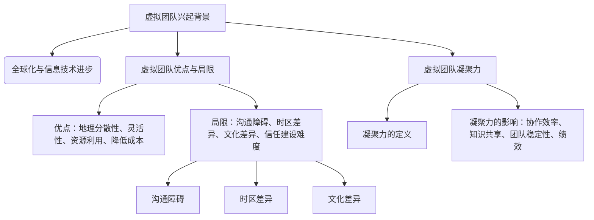
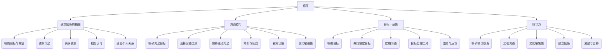

                 

### 第一部分：引言与概述

#### 第1章：虚拟团队的兴起与挑战

### 1.1 虚拟团队的兴起背景

随着全球化进程的加速，虚拟团队成为了现代企业组织中不可或缺的一部分。虚拟团队是指通过现代信息技术手段，如电子邮件、视频会议、即时通讯等，将地理位置分散的团队成员连接起来，以实现共同目标的一种团队形态。虚拟团队的兴起背景主要有以下几点：

1. **全球化与信息技术的进步**：全球化使得企业可以跨越国界，雇佣全球各地的人才，而信息技术的进步为虚拟团队的协作提供了强有力的支持。

2. **成本效益**：虚拟团队减少了团队成员在地理位置上的移动需求，降低了交通、住宿等费用，提高了企业运营的灵活性。

3. **专业知识的整合**：虚拟团队可以将来自不同地域、不同领域的人才聚集在一起，共享知识，提高项目的质量和效率。

4. **工作与生活的平衡**：对于团队成员而言，虚拟团队工作模式提供了更多的灵活性，有助于平衡工作与生活。

### 1.2 虚拟团队的优点与局限

虚拟团队虽然带来了许多优势，但同时也伴随着一些局限。以下是对其优点与局限的简要分析：

#### 优点：

1. **地理分散性**：虚拟团队不受地理位置限制，可以随时随地开展合作。

2. **灵活性强**：虚拟团队可以更灵活地调整团队成员和工作时间，适应不同的工作需求。

3. **资源利用最大化**：虚拟团队可以整合全球范围内的资源，最大化利用人才。

4. **降低成本**：减少了团队成员在地理位置上的移动需求，降低了交通、住宿等费用。

#### 局限：

1. **沟通障碍**：虚拟团队成员之间的沟通往往依赖于电子邮件、视频会议等工具，这可能导致信息传递的延迟和误解。

2. **时区差异**：不同成员所处的时区可能存在差异，影响协作效率和沟通效果。

3. **文化差异**：虚拟团队成员来自不同的文化背景，可能会在价值观、沟通方式等方面产生冲突。

4. **信任建设难度**：虚拟团队成员之间缺乏面对面互动，建立信任关系相对困难。

### 1.3 跨越物理距离的挑战

虚拟团队在跨越物理距离的过程中，面临着诸多挑战，这些挑战主要体现在以下几个方面：

#### 1.3.1 沟通障碍

虚拟团队依赖电子邮件、视频会议等工具进行沟通，虽然这些工具在一定程度上弥补了面对面的沟通不足，但仍然存在信息传递延迟、沟通不畅等问题。例如，电子邮件可能导致信息误解，而视频会议则可能受到网络延迟、带宽不足等因素的影响。

#### 1.3.2 时区差异

虚拟团队成员可能分布在全球各地，不同地区的时区差异会导致协作效率降低。例如，一个项目的讨论可能需要跨越多个时区，导致部分成员在深夜或凌晨进行工作，影响工作质量和工作效率。

#### 1.3.3 文化差异

虚拟团队成员来自不同的文化背景，可能在价值观、沟通方式等方面存在差异。例如，某些文化强调直接表达，而另一些文化则更注重委婉表达。这些差异可能导致团队成员之间的误解和冲突。

### 1.4 虚拟团队凝聚力的重要性

虚拟团队的凝聚力是指团队成员在虚拟环境中形成的紧密合作、相互信任的关系。虚拟团队凝聚力的重要性主要体现在以下几个方面：

#### 1.4.1 凝聚力的定义

凝聚力是指团队成员在共同目标下，形成的相互支持、协作和信任的关系。虚拟团队的凝聚力则是在虚拟环境中，通过信息技术手段，实现团队成员之间的紧密协作。

#### 1.4.2 凝聚力对虚拟团队的影响

1. **提高协作效率**：凝聚力高的虚拟团队能够更高效地协作，减少沟通障碍和误解，提高项目完成速度。

2. **促进知识共享**：凝聚力高的虚拟团队更愿意分享知识和经验，促进团队知识的积累和更新。

3. **增强团队稳定性**：凝聚力高的虚拟团队在面对困难和挑战时，能够保持团队的稳定和团结，共同应对问题。

4. **提高团队绩效**：凝聚力高的虚拟团队能够在项目执行过程中，充分发挥每个成员的潜力，提高项目绩效。

### 小结

虚拟团队作为一种新型的团队形态，在全球化背景下得到了广泛应用。然而，虚拟团队在跨越物理距离的过程中，面临着沟通障碍、时区差异和文化差异等挑战。因此，提高虚拟团队的凝聚力，成为解决这些挑战的关键。在下一章中，我们将探讨影响虚拟团队凝聚力的关键因素，为提升虚拟团队凝聚力提供策略和方法。

---

**核心概念与联系**

在探讨虚拟团队的兴起与挑战时，我们首先需要理解虚拟团队的定义及其背景。虚拟团队是指通过信息技术手段，将地理位置分散的团队成员连接起来，实现共同目标的团队形态。其兴起背景主要包括全球化和信息技术进步等因素。

接着，我们分析了虚拟团队的优点与局限。优点包括地理分散性、灵活性强、资源利用最大化、降低成本等，而局限则主要体现在沟通障碍、时区差异、文化差异和信任建设难度等方面。

在探讨虚拟团队的挑战时，我们深入分析了沟通障碍、时区差异和文化差异对虚拟团队的影响。这些挑战直接影响了虚拟团队的凝聚力。

最后，我们阐述了虚拟团队凝聚力的重要性。凝聚力是团队成员在虚拟环境中形成的紧密合作、相互信任的关系，对虚拟团队的协作效率、知识共享、团队稳定性和绩效都有重要影响。

**Mermaid 流程图**

---

接下来，我们将探讨虚拟团队凝聚力的影响因素，为提升虚拟团队凝聚力提供理论依据和实践指导。

#### 第2章：虚拟团队凝聚力的影响因素

### 2.1 成员之间的信任

#### 2.1.1 信任的重要性

信任是虚拟团队凝聚力的核心因素之一。在虚拟环境中，由于缺乏面对面的互动，建立信任关系变得更加困难，但信任对于团队的成功至关重要。信任的重要性主要体现在以下几个方面：

1. **提高沟通效率**：信任有助于减少沟通中的误解和混淆，提高信息传递的准确性和速度。
2. **增强合作意愿**：信任使团队成员更愿意分享资源和知识，共同解决问题，提高协作效率。
3. **降低冲突风险**：信任减少了团队成员之间的猜疑和竞争，降低了冲突发生的可能性。
4. **促进团队稳定性**：信任有助于团队成员在面对困难和挑战时保持团结，共同应对问题。

#### 2.1.2 建立信任的策略

为了在虚拟团队中建立信任，可以采取以下策略：

1. **明确目标和期望**：确保所有团队成员对项目目标和期望有清晰的理解，减少误解和模糊性。
2. **透明沟通**：保持沟通的透明度，及时分享信息，避免隐瞒或误导。
3. **共享资源**：鼓励团队成员分享知识和资源，提高团队的透明度和信任感。
4. **相互认可**：定期对团队成员的贡献和努力进行认可和赞扬，增强团队凝聚力。
5. **建立个人关系**：通过非正式的互动，如虚拟团队建设活动，帮助团队成员建立个人关系，增强信任。

### 2.2 沟通与交流

#### 2.2.1 沟通的重要性

沟通是虚拟团队中不可或缺的一环，良好的沟通有助于减少误解，提高协作效率，增强团队凝聚力。虚拟团队中的沟通与传统的面对面沟通相比，面临更大的挑战，因此更需要精心设计和执行。

#### 2.2.2 沟通技巧与策略

以下是提高虚拟团队沟通效果的几种技巧和策略：

1. **明确沟通目标**：每次沟通前明确目的，确保团队成员了解要讨论的主题和期望的结果。
2. **选择合适的沟通工具**：根据沟通内容和目标，选择合适的沟通工具，如电子邮件、即时通讯、视频会议等。
3. **保持主动沟通**：定期与团队成员沟通，确保信息及时传达，减少沟通滞后。
4. **倾听与回应**：认真倾听团队成员的意见，给予及时的反馈，确保沟通的双向性。
5. **避免误解**：使用明确、简洁的语言，避免使用模糊或带有歧义的词汇。
6. **文化敏感性**：考虑团队成员的文化背景，避免文化冲突，尊重不同的沟通习惯。
7. **非正式沟通**：通过非正式的沟通，如虚拟团队建设活动，帮助团队成员建立个人关系，增强团队凝聚力。

### 2.3 目标一致性

#### 2.3.1 目标一致性的意义

目标一致性是指团队成员对团队目标的共同认同和承诺。在虚拟团队中，由于团队成员分布在不同地点，目标一致性显得尤为重要。目标一致性的意义主要体现在以下几个方面：

1. **提高协作效率**：目标一致有助于团队成员明确分工和任务，减少协作中的冲突和误解。
2. **增强团队凝聚力**：共同的目标能够激励团队成员，增强团队的归属感和凝聚力。
3. **提高项目成功率**：目标一致性有助于团队在面对挑战和困难时保持一致的行动，提高项目的成功率。
4. **促进知识共享**：目标一致能够鼓励团队成员分享知识和经验，促进团队知识的积累和更新。

#### 2.3.2 如何确保目标一致性

为了确保虚拟团队的目标一致性，可以采取以下措施：

1. **明确目标**：在项目启动阶段，明确团队的目标，确保所有团队成员对目标有清晰的理解。
2. **共同制定目标**：鼓励团队成员参与目标的制定，提高他们对目标的认同感和参与度。
3. **定期沟通**：定期召开会议，确保团队成员对目标的进展有清晰的了解，及时调整目标和策略。
4. **使用目标管理工具**：使用目标管理工具，如目标设置软件或在线目标跟踪工具，确保目标得到有效管理。
5. **激励与反馈**：对达成目标的团队成员进行奖励和认可，增强他们的积极性和团队凝聚力。

### 2.4 领导力

#### 2.4.1 虚拟团队领导的角色

虚拟团队领导在团队凝聚力的提升中扮演着关键角色。虚拟团队领导不仅需要具备传统的领导能力，还需要适应虚拟环境的特点，发挥领导力，促进团队凝聚力的提升。

#### 2.4.2 虚拟团队领导的挑战与策略

虚拟团队领导面临的挑战主要包括：

1. **沟通障碍**：虚拟环境中的沟通受限，领导需要找到有效的沟通策略，确保信息传递的准确性和及时性。
2. **时区差异**：不同成员所在的时区可能影响领导的统一指挥和调度，领导需要合理安排工作和会议时间。
3. **文化差异**：虚拟团队通常由来自不同文化背景的成员组成，领导需要尊重和理解不同文化的差异，避免文化冲突。
4. **信任建设**：虚拟环境中的信任建设相对困难，领导需要采取一系列措施，建立和维系团队信任。

以下是虚拟团队领导应对这些挑战的策略：

1. **明确领导职责**：领导需要明确自己的职责和角色，确保团队成员对领导的角色有清晰的认识。
2. **加强沟通**：领导需要主动沟通，使用多种沟通工具和方法，确保信息传递的准确性和及时性。
3. **文化敏感性**：领导需要具备文化敏感性，尊重和理解团队成员的不同文化背景，促进团队文化的融合。
4. **建立信任**：领导需要采取一系列措施，如透明沟通、公平对待、及时反馈等，建立和维系团队信任。
5. **激励与支持**：领导需要激励团队成员，提供必要的支持和资源，帮助团队成员克服困难和挑战。

### 小结

虚拟团队凝聚力的提升是一个复杂的过程，涉及多个因素。在虚拟团队中，信任、沟通、目标一致性和领导力是影响团队凝聚力的关键因素。通过建立信任、加强沟通、确保目标一致性和发挥领导力，可以有效提升虚拟团队的凝聚力，促进团队协作和项目成功。

在下一章中，我们将探讨增强虚拟团队凝聚力的具体策略和实践方法。

---

**核心概念与联系**

在探讨虚拟团队凝聚力的影响因素时，我们首先明确了信任、沟通、目标一致性和领导力这四个核心概念。

信任是虚拟团队凝聚力的重要基础。通过明确目标和期望、保持透明沟通、共享资源、相互认可和建立个人关系等措施，可以有效建立和维系团队信任。

沟通是虚拟团队中不可或缺的一环。通过明确沟通目标、选择合适的沟通工具、保持主动沟通、倾听与回应、避免误解和展现文化敏感性，可以提升虚拟团队的沟通效果。

目标一致性是确保团队成员对团队目标有共同认同和承诺的关键。通过明确目标、共同制定目标、定期沟通、使用目标管理工具和激励与反馈等措施，可以确保目标一致性。

领导力在虚拟团队中起着至关重要的角色。虚拟团队领导需要明确领导职责、加强沟通、展现文化敏感性、建立信任和激励与支持团队成员，以应对虚拟环境中的挑战。

**Mermaid 流程图**

接下来，我们将探讨如何通过具体的策略和实践方法来增强虚拟团队的凝聚力。

### 第二部分：策略与实践

#### 第3章：增强虚拟团队凝聚力的策略

#### 3.1 促进成员互动

#### 3.1.1 互动活动的选择

为了增强虚拟团队的凝聚力，互动活动是一个重要的手段。选择适合的互动活动对于提升团队凝聚力至关重要。以下是几种适合虚拟团队的互动活动：

1. **虚拟团队建设活动**：通过在线游戏、虚拟挑战和团队竞赛等活动，增强团队成员之间的互动和团队合作精神。
2. **虚拟社交聚会**：定期举办虚拟社交聚会，如虚拟晚宴、茶话会等，让团队成员有机会交流非工作话题，建立个人关系。
3. **在线培训和工作坊**：举办在线培训和工作坊，鼓励团队成员学习新技能，提高团队的整体能力。
4. **虚拟会议室**：利用虚拟会议室工具，定期举行会议，讨论工作进展、解决问题和分享经验。

#### 3.1.2 互动活动的实施

实施互动活动需要精心规划和组织，以下是一些建议：

1. **活动前准备**：明确活动目标、时间和参与者，确保所有团队成员都了解活动内容和安排。
2. **活动过程中的管理**：在活动过程中，确保参与者能够积极参与，提供必要的技术支持和帮助。
3. **活动后的反馈**：收集参与者的反馈，评估活动效果，并根据反馈进行调整和改进。

#### 3.2 利用技术工具

#### 3.2.1 适合虚拟团队的沟通工具

在虚拟团队中，选择合适的沟通工具对于提高沟通效率和团队凝聚力至关重要。以下是几种适合虚拟团队的沟通工具：

1. **即时通讯工具**：如Slack、Microsoft Teams等，用于实时沟通和协作。
2. **电子邮件**：用于正式沟通和文件传输。
3. **视频会议工具**：如Zoom、Microsoft Teams等，用于远程会议和团队讨论。
4. **项目管理工具**：如Trello、Asana等，用于任务分配、进度跟踪和团队协作。
5. **虚拟白板工具**：如Miro、Mural等，用于在线头脑风暴、会议记录和协作设计。

#### 3.2.2 提高团队协作效率的工具

除了沟通工具，还有一些工具可以提高虚拟团队的协作效率。以下是几种常用的协作工具：

1. **文档共享工具**：如Google Docs、Microsoft Office 365等，用于实时编辑和共享文档。
2. **代码协作平台**：如GitHub、GitLab等，用于代码管理、版本控制和团队协作。
3. **云存储服务**：如Google Drive、Dropbox等，用于存储和共享文件。
4. **在线协作表格**：如Google Sheets、Microsoft Excel Online等，用于数据分析和协作。
5. **项目管理工具**：如Trello、Asana等，用于任务分配、进度跟踪和团队协作。

#### 3.3 定期反馈与评估

#### 3.3.1 反馈的重要性

定期反馈对于虚拟团队的重要性不可忽视。反馈不仅可以帮助团队成员了解自己的工作表现，还可以促进团队成员之间的沟通和协作，提高团队凝聚力。以下是定期反馈的重要性：

1. **促进个人成长**：通过反馈，团队成员可以了解自己的优势和不足，有针对性地进行改进和提升。
2. **提高团队绩效**：定期反馈可以帮助团队及时发现问题并解决问题，提高团队的整体绩效。
3. **增强团队凝聚力**：反馈可以增强团队成员之间的信任和沟通，促进团队的团结和合作。
4. **优化工作流程**：通过反馈，团队可以发现工作流程中的瓶颈和不足，进行优化和改进。

#### 3.3.2 反馈的实施与效果评估

为了有效实施反馈，可以采取以下步骤：

1. **设定反馈目标**：明确反馈的目的和期望，确保反馈内容具有针对性和实效性。
2. **选择合适的反馈方式**：根据反馈内容的重要性和紧急性，选择合适的反馈方式，如面对面沟通、电子邮件、即时通讯等。
3. **建立反馈机制**：制定反馈流程和规范，确保反馈能够及时、准确地传达和接收。
4. **跟踪反馈效果**：对反馈的实施效果进行跟踪和评估，根据反馈结果进行调整和改进。

### 小结

增强虚拟团队凝聚力需要采取多种策略和实践方法。通过促进成员互动、利用技术工具和定期反馈与评估，可以有效提升虚拟团队的凝聚力，促进团队协作和项目成功。

在下一章中，我们将通过案例分析，探讨虚拟团队凝聚力评估与改进的具体方法和经验。

### 第4章：虚拟团队凝聚力评估与改进

#### 4.1 凝聚力评估方法

评估虚拟团队的凝聚力是提升团队绩效的重要步骤。有效的评估方法可以帮助团队了解凝聚力水平，识别存在的问题，并采取相应的改进措施。以下是一些常用的凝聚力评估方法：

#### 4.1.1 问卷调查

问卷调查是一种常见且有效的评估方法，可以通过设计针对性的问卷来收集团队成员的意见和反馈。以下是问卷设计的原则和实施步骤：

1. **问卷设计原则**：
   - **针对性**：问卷应针对团队凝聚力相关的问题进行设计，确保问题的相关性和有效性。
   - **简洁性**：问卷应简洁明了，避免冗长的问题和复杂的表述，以提高参与度。
   - **匿名性**：确保问卷的匿名性，以鼓励团队成员真实、客观地回答问题。

2. **问卷实施步骤**：
   - **确定评估目标**：明确评估的目标和重点，设计问卷内容。
   - **问卷预测试**：在正式实施前，对问卷进行预测试，确保问卷的有效性和可操作性。
   - **发放问卷**：通过邮件、在线调查平台等方式，将问卷发放给团队成员。
   - **收集和分析数据**：收集问卷结果，进行数据分析和总结，识别团队凝聚力的现状和问题。

#### 4.1.2 观察与访谈

观察和访谈是直接了解团队凝聚力情况的有效方法，可以通过观察团队成员的行为和互动，以及通过访谈收集成员的深入意见和反馈。

1. **观察方法**：
   - **现场观察**：通过参与团队会议、项目讨论等活动，观察团队成员的互动和行为。
   - **行为记录**：记录团队成员的互动情况，包括沟通方式、参与程度、团队活动中的表现等。

2. **访谈方法**：
   - **结构化访谈**：根据预定的访谈提纲，对团队成员进行有针对性的提问，收集关于团队凝聚力的意见和反馈。
   - **非结构化访谈**：提供开放性的问题，让团队成员自由表达他们对团队凝聚力的看法和建议。

#### 4.2 基于数据的改进策略

通过对评估结果的数据分析，可以识别团队凝聚力的具体问题，并制定相应的改进策略。以下是基于数据改进的策略：

1. **数据分析方法**：
   - **描述性分析**：对评估结果进行描述性统计分析，了解团队凝聚力的总体水平。
   - **相关性分析**：分析评估结果与其他相关指标（如项目绩效、团队成员满意度等）之间的关系。
   - **因素分析**：通过因素分析识别影响团队凝聚力的关键因素。

2. **改进策略实施**：
   - **针对问题制定改进措施**：根据数据分析结果，制定具体的改进措施，如加强沟通培训、优化工作流程、改善团队文化等。
   - **实施改进措施**：将改进措施纳入团队工作计划，确保实施的有效性。
   - **跟踪和评估改进效果**：定期跟踪和评估改进措施的效果，根据反馈进行调整和优化。

#### 4.3 持续改进与优化

持续改进是提升虚拟团队凝聚力的关键。以下是一些持续改进和优化的方法：

1. **建立反馈机制**：建立持续反馈机制，鼓励团队成员定期提供意见和建议，及时识别和解决问题。
2. **定期评估与回顾**：定期对团队的凝聚力和改进措施进行评估和回顾，确保持续改进的有效性。
3. **团队建设活动**：定期组织团队建设活动，增强团队成员之间的互动和信任。
4. **培训与发展**：为团队成员提供培训和发展的机会，提升他们的技能和团队合作能力。

### 小结

虚拟团队凝聚力的评估与改进是一个持续的过程。通过问卷调查、观察与访谈等评估方法，可以了解团队凝聚力的现状和问题，并基于数据制定和实施改进策略。持续改进与优化是提升团队凝聚力的关键，通过建立反馈机制、定期评估与回顾、团队建设活动和培训与发展等措施，可以不断提升虚拟团队的凝聚力，促进团队协作和项目成功。

在下一章中，我们将通过成功案例，分享虚拟团队凝聚力提升的经验和启示。

### 第5章：成功案例与经验分享

#### 5.1 案例介绍

在这个案例中，我们将探讨一家跨国科技公司如何通过一系列策略和措施，成功提升了其虚拟团队的凝聚力。该公司在全球范围内拥有多个分支机构，团队成员分布在不同的国家和地区。由于时区差异和文化背景的差异，该公司的虚拟团队在初期面临了沟通障碍、协作效率低下和团队凝聚力不足等问题。

#### 5.1.1 背景介绍

该公司成立于20世纪90年代，随着业务的全球化发展，虚拟团队逐渐成为其组织结构的重要组成部分。虚拟团队的成员分布在欧洲、美洲、亚洲等不同地区，团队成员的时区差异、语言障碍和文化差异成为了团队协作的挑战。为了提升团队凝聚力和工作效率，公司决定采取一系列措施，以增强虚拟团队的协作能力。

#### 5.1.2 案例实施过程

在实施过程中，公司采取了以下措施：

1. **建立信任**：公司通过定期举办虚拟团队建设活动，如在线团队竞赛、虚拟社交聚会和在线培训等，促进团队成员之间的互动和了解。此外，公司鼓励团队成员分享个人经历和文化背景，增强团队成员之间的信任。

2. **改善沟通**：公司引入了多种沟通工具，如Slack、Zoom和Microsoft Teams等，确保团队成员能够及时、高效地进行沟通。公司还制定了沟通规范，明确沟通方式和频率，减少误解和沟通障碍。

3. **明确目标**：公司为每个虚拟团队设定了清晰的目标和期望，确保团队成员对项目目标有共同的理解和承诺。通过定期召开会议和目标跟踪，公司确保团队成员能够及时了解项目进展，并根据实际情况进行调整。

4. **加强领导力**：公司对虚拟团队领导进行了专门培训，提高他们的领导力和沟通技巧。虚拟团队领导被要求具备文化敏感性，能够理解并尊重团队成员的不同文化背景，促进团队文化的融合。

#### 5.2 成功要素分析

通过以上措施，该公司成功提升了虚拟团队的凝聚力，以下是成功的关键要素：

1. **信任建设**：通过团队建设活动和文化分享，团队成员之间的信任得到了显著提升，增强了团队的协作意愿。

2. **沟通改进**：多种沟通工具的引入和沟通规范的制定，提高了沟通效率，减少了误解和冲突。

3. **目标一致性**：明确的目标和期望使团队成员对项目有共同的理解，提高了协作效率。

4. **领导力提升**：虚拟团队领导通过培训和实践，提高了领导力和沟通技巧，能够更好地引领团队。

#### 5.3 案例的启示

该案例为其他虚拟团队提供了以下启示：

1. **信任是基础**：在虚拟团队中，建立信任关系至关重要，通过团队建设活动和文化分享可以增强团队成员之间的信任。

2. **沟通是关键**：选择合适的沟通工具和制定沟通规范，可以提高虚拟团队的沟通效率，减少误解和冲突。

3. **目标一致性**：明确的目标和期望有助于团队成员协同工作，提高团队绩效。

4. **领导力提升**：虚拟团队领导需要具备文化敏感性和沟通技巧，能够促进团队文化的融合和协作。

### 5.4 经验总结与建议

基于该案例的经验，以下是总结和一些建议：

1. **持续信任建设**：虚拟团队需要持续进行信任建设，通过定期的团队活动和文化分享，保持团队成员之间的信任。

2. **优化沟通流程**：根据团队的具体需求，不断优化沟通流程和工具，确保沟通的及时性和有效性。

3. **目标管理**：定期审视和调整团队目标，确保目标与团队的实际能力和市场需求相符。

4. **领导力培养**：加强对虚拟团队领导的培训，提高他们的领导力和沟通技巧，以更好地引领团队。

5. **反馈与改进**：建立持续反馈机制，定期评估团队凝聚力和改进措施的效果，并根据反馈进行调整。

### 小结

通过成功案例的分享，我们可以看到，虚拟团队凝聚力提升的关键在于信任建设、沟通改进、目标一致性和领导力提升。其他虚拟团队可以借鉴这些经验，结合自身的实际情况，制定和实施相应的策略，提升团队凝聚力，促进团队协作和项目成功。

在下一章中，我们将探讨虚拟团队凝聚力面临的挑战，以及如何应对这些挑战。

### 第6章：虚拟团队凝聚力面临的挑战

#### 6.1 技术挑战

虚拟团队在技术方面面临诸多挑战，这些挑战可能会影响团队的协作效率和凝聚力。以下是几个主要的技术挑战：

1. **沟通技术的限制**：虽然现代通信技术如视频会议、即时通讯和在线协作工具提供了远程协作的可能，但这些工具并非完美无缺。例如，网络延迟、带宽不足和设备故障等问题可能会影响沟通效果，导致信息传递不及时和误解。

2. **技术工具的依赖**：虚拟团队高度依赖各种技术工具进行协作，如项目管理软件、文档共享平台和代码库。然而，这些工具的稳定性和兼容性问题可能会影响团队的工作流程，甚至导致项目延误。

3. **数据安全和隐私**：在虚拟团队中，数据传输和存储的安全性是一个重要的问题。数据泄露和隐私侵犯可能会导致严重后果，影响团队信任和项目的顺利进行。

#### 6.2 人际关系挑战

人际关系挑战是虚拟团队在管理过程中经常遇到的问题，这些问题可能会削弱团队的凝聚力。以下是几个主要的人际关系挑战：

1. **跨文化沟通的困难**：虚拟团队成员来自不同的文化背景，可能存在语言障碍和沟通风格差异。这些差异可能导致误解、冲突和不和谐的工作氛围。

2. **长期虚拟工作的压力**：虚拟工作虽然提供了灵活性，但也可能导致团队成员感到孤独、压力过大和缺乏工作动力。长期虚拟工作可能导致团队成员的心理健康问题，影响团队的整体表现。

3. **信任建设难度**：虚拟环境中的面对面互动较少，建立信任关系相对困难。团队成员之间的信任是团队协作的基础，缺乏信任可能导致合作不顺畅和效率低下。

#### 6.3 组织文化适应

组织文化适应是虚拟团队面临的一个关键挑战。以下是几个与组织文化适应相关的问题：

1. **组织文化的调整**：虚拟团队的组织结构和文化与传统的面对面工作环境有所不同。为了适应虚拟团队的工作方式，组织可能需要调整现有的文化和价值观，以促进团队成员的协作和凝聚力。

2. **虚拟团队文化的建设**：虚拟团队需要建立一套独特的文化，以适应远程工作环境。这种文化应当鼓励开放沟通、共享知识和团队合作，同时尊重团队成员的不同背景和需求。

3. **领导力的转变**：虚拟团队的领导需要具备新的领导能力，如远程管理技巧、技术熟练度和跨文化沟通能力。领导者的转变是推动虚拟团队文化适应的重要力量。

### 小结

虚拟团队凝聚力面临的挑战多种多样，涉及技术、人际关系和组织文化等多个方面。为了提升虚拟团队的凝聚力，团队需要采取针对性的措施，如优化沟通技术、加强信任建设、适应组织文化和提升领导力。在下一章中，我们将探讨虚拟团队凝聚力的未来发展趋势，为团队提供进一步的发展方向和策略。

### 第7章：虚拟团队凝聚力的未来发展趋势

#### 7.1 新技术的发展

随着科技的不断进步，新的技术正在为虚拟团队的凝聚力和协作能力带来巨大的变革。以下是几个值得关注的新技术趋势：

1. **虚拟现实（VR）技术**：虚拟现实技术可以为虚拟团队提供一个沉浸式的协作环境，使团队成员能够“面对面”进行互动。VR会议、虚拟办公室和虚拟团队建设活动等，都将成为未来虚拟团队工作的一部分。

2. **人工智能（AI）技术**：人工智能技术在提高虚拟团队协作效率方面具有巨大潜力。AI可以帮助自动化重复性任务，如日程安排、文档整理和任务分配，从而让团队成员能够将更多精力投入到高价值的协作活动中。此外，AI还可以通过自然语言处理和机器学习技术，提供智能化的沟通和分析工具，提升团队的决策能力和工作效率。

3. **区块链技术**：区块链技术可以用于提高虚拟团队中的透明度和信任度。通过区块链，团队成员可以确保数据的完整性和不可篡改性，从而减少信息泄露和欺诈行为。区块链还可以用于智能合约，自动执行合同条款，提高虚拟团队的协作效率。

#### 7.2 组织变革的趋势

随着虚拟团队的应用越来越广泛，组织也在进行相应的变革，以适应虚拟团队的工作模式。以下是几个组织变革的趋势：

1. **远程工作常态化**：越来越多的企业开始接受远程工作的概念，并逐步将远程工作常态化。这不仅有助于提高员工的满意度和工作效率，还可以吸引更多优秀人才，不受地域限制。

2. **灵活工作时间的推广**：为了适应虚拟团队的工作模式，许多企业开始推广灵活工作时间，允许员工自主安排工作时间和地点。这种灵活性不仅提高了员工的工作满意度，还可以提高工作效率和团队凝聚力。

3. **敏捷组织的建设**：敏捷组织是一种以团队为中心、快速响应变化的组织形式。虚拟团队天生具有敏捷组织的特征，因此，未来将有更多的企业通过建设敏捷组织，来提升虚拟团队的协作能力和市场竞争力。

#### 7.3 未来展望

在未来，虚拟团队凝聚力的发展将呈现出以下几个趋势：

1. **技术驱动的协作**：随着新技术的应用，虚拟团队的协作将变得更加高效和智能化。AI和VR等技术将为虚拟团队提供更加丰富的协作工具和平台，使团队成员能够更好地协同工作。

2. **文化融合与多样性的增强**：虚拟团队由来自不同文化背景的成员组成，未来将更加注重文化的融合与多样性。组织将通过建立包容性的文化，尊重和理解团队成员的不同背景，促进团队的凝聚力和创造力。

3. **领导力的转变**：虚拟团队的领导需要具备新的领导能力，如技术熟练度、跨文化沟通能力和远程管理技巧。未来的领导者将更加注重培养团队成员的自主性和协作能力，以应对虚拟团队的特殊挑战。

4. **持续改进与学习**：虚拟团队将更加注重持续改进和学习的文化。通过定期的评估和反馈，团队可以及时发现并解决问题，不断优化工作流程和协作模式，提高团队的整体绩效。

### 小结

虚拟团队凝聚力的未来发展充满机遇和挑战。随着新技术的不断进步和组织的变革，虚拟团队的协作能力将得到显著提升。通过技术驱动、文化融合、领导力转变和持续改进，虚拟团队将能够更好地应对未来的挑战，实现更高的效率和创造力。未来的虚拟团队将是一个更加灵活、高效和包容的团队形态，为组织带来持续的创新和竞争优势。

### 附录A：虚拟团队凝聚力研究方法

#### A.1 问卷调查设计

问卷调查是研究虚拟团队凝聚力的一种常用方法，通过设计针对性的问卷，可以收集团队成员的意见和反馈，分析团队凝聚力的现状和问题。以下是如何进行问卷调查设计的详细步骤：

1. **确定研究目的**：明确问卷调查的目标，例如了解团队成员对团队凝聚力的看法、识别影响凝聚力的因素等。

2. **设计问卷框架**：根据研究目的，制定问卷框架，包括团队凝聚力相关的各个维度，如信任、沟通、目标一致性、领导力等。

3. **制定问卷问题**：针对问卷框架，设计具体的问题。问题类型可以分为开放性问题和封闭性问题，前者可以获取更详细的反馈，后者可以方便统计和分析。

4. **确定问题类型**：选择适当的问题类型，包括选择题、评分题、排序题等，以确保问卷的有效性和可靠性。

5. **预测试问卷**：在正式发放问卷前，进行预测试。邀请一些团队成员填写问卷，收集反馈意见，对问卷进行修改和完善。

6. **发放问卷**：通过邮件、在线调查平台等方式，将问卷发放给团队成员。确保问卷的匿名性和隐私性，以提高参与度和反馈的真实性。

7. **收集数据**：收集填写完的问卷数据，进行数据整理和预处理。

8. **数据分析**：使用统计分析软件，对问卷数据进行分析，如描述性统计分析、相关性分析和因素分析等，以了解团队凝聚力的现状和影响因素。

#### A.2 实验研究方法

实验研究方法通过控制变量和实验操作，来探讨虚拟团队凝聚力的影响因素。以下是实验研究方法的详细步骤：

1. **确定实验目的**：明确实验的目标，例如探讨信任对团队凝聚力的影响。

2. **设计实验框架**：根据实验目的，设计实验框架，包括实验组和对照组，以及实验操作。

3. **选择实验对象**：选择合适的实验对象，如虚拟团队中的成员。

4. **实施实验**：对实验组进行特定的实验操作，如信任建设培训，而对照组则保持现状。

5. **数据收集**：在实验前后，对实验对象进行问卷调查或访谈，收集关于团队凝聚力的数据。

6. **数据分析**：对实验数据进行统计分析，如对比实验组和对照组的团队凝聚力水平，探讨实验操作对团队凝聚力的影响。

7. **实验结果验证**：通过对比实验结果和理论预期，验证实验假设。

#### A.3 案例分析方法

案例分析是一种通过深入研究具体案例，来探讨虚拟团队凝聚力的方法和实践。以下是案例分析的详细步骤：

1. **选择案例**：选择具有代表性的虚拟团队案例，确保案例的典型性和完整性。

2. **案例背景分析**：了解案例的背景信息，包括团队结构、项目背景、团队成员等。

3. **案例描述**：详细描述案例中的事件和过程，包括团队的协作方式、沟通机制、领导行为等。

4. **案例问题识别**：识别案例中存在的团队凝聚力问题，如沟通障碍、信任缺失等。

5. **案例原因分析**：分析导致团队凝聚力问题的原因，如技术限制、组织文化等。

6. **案例解决方案**：提出解决方案，如改进沟通工具、加强信任建设等。

7. **案例效果评估**：评估解决方案的效果，通过数据分析和团队成员反馈，判断解决方案的有效性。

8. **案例总结**：总结案例的主要发现和启示，为其他虚拟团队提供借鉴和参考。

### 小结

虚拟团队凝聚力研究方法包括问卷调查、实验研究和案例分析等多种方法。问卷调查适用于大规模数据收集，实验研究通过控制变量探讨影响因素，案例分析则通过深入分析具体案例，提供实践指导。这些方法相互补充，为虚拟团队凝聚力的研究提供了全面和深入的视角。通过合理运用这些方法，可以更好地理解和提升虚拟团队的凝聚力，促进团队协作和项目成功。

