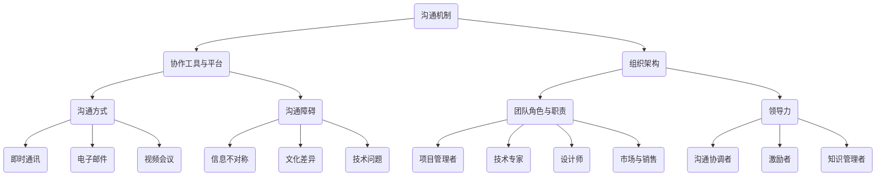

                 

### 文章标题

《虚拟团队建设：远程工作时代的凝聚力培养》

### 关键词

虚拟团队、远程工作、团队凝聚力、协作工具、领导力、跨文化管理、信息安全

### 摘要

随着远程工作的普及，虚拟团队建设成为企业管理和组织发展的重要课题。本文从虚拟团队的定义与特征出发，探讨了远程工作时代的变革及其对团队凝聚力的影响。接着，文章详细分析了虚拟团队的核心概念与架构，包括沟通机制、协作工具与平台、组织架构等，并提出了有效的建设方法与实践策略。此外，文章还介绍了虚拟团队建设的必要技术支持和未来发展趋势，为企业在远程工作环境中培养团队凝聚力提供了宝贵的参考。

## 第一部分：虚拟团队建设概述

### 1.1 虚拟团队的定义与特征

#### 1.1.1 虚拟团队的定义

虚拟团队（Virtual Team）是指团队成员在地理位置上分散，通过信息技术手段实现协同工作的团队。与传统团队相比，虚拟团队突破了物理空间的限制，实现了跨地域、跨时间的合作。

#### 1.1.2 虚拟团队的主要特征

1. **地理位置分散**：团队成员分布在不同的城市、国家，甚至时区。
2. **依赖信息技术**：通过电子邮件、即时通讯、视频会议等工具实现沟通与协作。
3. **远程工作**：团队成员主要在家办公或远程办公。
4. **灵活性**：团队成员可根据需要灵活调整工作时间，提高工作效率。
5. **多样性**：虚拟团队可能涵盖不同的文化背景、专业技能，有助于创新和多元化思维。

#### 1.1.3 虚拟团队的兴起背景

1. **技术进步**：互联网和移动通信技术的快速发展，使得远程工作成为可能。
2. **全球化**：企业需要在全球范围内招聘优秀人才，虚拟团队成为实现跨地区合作的重要手段。
3. **成本考虑**：远程工作降低了企业的办公场地和日常运营成本。
4. **工作模式变革**：员工对灵活工作时间和工作地点的需求增加，虚拟团队成为企业吸引和保留人才的一种方式。

### 1.2 远程工作时代的变革

#### 1.2.1 远程工作的普及趋势

1. **全球远程工作人数增加**：根据全球远程工作协会（Global Workplace Analytics）的数据，远程工作人数在疫情期间大幅增长。
2. **远程工作政策的推广**：许多国家和地区政府鼓励企业实行远程工作政策，以应对疫情和减少通勤压力。
3. **企业对远程工作的接受度提高**：越来越多的企业意识到远程工作的优势，并逐步将其纳入日常工作模式。

#### 1.2.2 远程工作对团队凝聚力的影响

1. **积极影响**：远程工作可以提高员工的自主性和工作效率，有助于培养团队凝聚力。
2. **负面影响**：地理位置分散可能导致沟通不畅、信息滞后，影响团队凝聚力。
3. **挑战**：如何平衡远程工作与团队凝聚力成为企业面临的重要问题。

#### 1.2.3 远程工作环境下的挑战与机遇

1. **挑战**：
   - **沟通障碍**：远程工作可能导致沟通不畅，影响团队协作。
   - **管理难度**：远程团队管理复杂度增加，需要更高的管理技能。
   - **文化差异**：跨文化团队在价值观和行为习惯上可能存在差异，影响团队凝聚力。

2. **机遇**：
   - **人才多样性**：虚拟团队可以吸引全球范围内的优秀人才，提高团队创新能力。
   - **成本节省**：远程工作可以降低企业运营成本，提高效益。
   - **工作模式创新**：远程工作促使企业探索新的工作模式，提高工作效率。

### 1.3 虚拟团队建设的重要性

#### 1.3.1 虚拟团队建设的核心目标

1. **提高团队协作效率**：通过有效的沟通和协作工具，实现团队成员的高效协作。
2. **培养团队凝聚力**：在远程工作环境中，培养团队成员之间的信任和归属感。
3. **促进创新和多元化**：利用虚拟团队的多样性，激发创新思维，推动团队发展。

#### 1.3.2 虚拟团队建设对组织绩效的影响

1. **提高组织灵活性**：虚拟团队可以快速响应市场变化，提高组织竞争力。
2. **降低运营成本**：远程工作可以降低企业运营成本，提高效益。
3. **提升员工满意度**：灵活的工作时间和地点有助于提高员工的工作满意度和忠诚度。

#### 1.3.3 虚拟团队建设中的关键问题

1. **沟通与协作**：如何保证沟通的及时性和有效性，提高团队协作效率。
2. **领导力**：如何在远程工作环境中发挥领导力，引导团队发展。
3. **文化融合**：如何处理跨文化团队的差异，实现文化融合。
4. **信息安全**：如何确保虚拟团队的数据安全和隐私保护。

## 第二部分：虚拟团队核心概念与架构

### 2.1 虚拟团队中的沟通机制

#### 2.1.1 沟通机制的重要性

沟通机制是虚拟团队建设中至关重要的一环。有效的沟通机制可以确保信息的准确传达和团队成员之间的协作顺畅。

#### 2.1.2 沟通方式的选择

1. **即时通讯工具**：如微信、Slack、钉钉等，适合实时沟通和快速响应。
2. **电子邮件**：适用于正式沟通和记录保存，但可能存在沟通滞后的问题。
3. **视频会议**：适用于需要面对面交流的场景，有助于建立团队信任感。
4. **项目管理工具**：如Trello、Jira等，可以用于任务分配、进度跟踪和团队协作。

#### 2.1.3 沟通障碍及其解决方法

1. **沟通障碍**：
   - **信息不对称**：由于沟通不畅，导致信息传递不及时或不准确。
   - **文化差异**：跨文化团队在沟通中可能存在语言、价值观和行为习惯的差异。
   - **技术问题**：网络不稳定、设备故障等可能导致沟通中断。

2. **解决方法**：
   - **明确沟通目标**：在沟通前明确沟通目的和期望结果，确保信息准确传达。
   - **提高沟通技巧**：通过培训提高团队成员的沟通能力，尤其是跨文化沟通技巧。
   - **技术保障**：确保网络和设备稳定，提供技术支持，减少沟通障碍。

### 2.2 虚拟团队协作工具与平台

#### 2.2.1 协作工具的类型

1. **文档协作工具**：如Google Docs、Microsoft Office 365等，支持多人实时编辑和协作。
2. **项目管理工具**：如Trello、Jira等，用于任务分配、进度跟踪和团队协作。
3. **代码管理工具**：如Git、SVN等，用于代码版本控制和协作开发。
4. **视频会议工具**：如Zoom、Microsoft Teams等，支持在线视频会议和实时沟通。

#### 2.2.2 平台选择与配置

1. **平台选择**：根据团队需求和预算，选择合适的协作平台。
2. **配置与管理**：确保平台的安全性、稳定性和易用性，提供培训和技术支持。

#### 2.2.3 工具的优缺点分析

1. **优点**：
   - **提高效率**：协作工具可以简化工作流程，提高团队协作效率。
   - **实时沟通**：支持实时沟通和协作，确保信息及时传达。
   - **方便存储与共享**：提供方便的文档存储和共享功能，便于团队协作。

2. **缺点**：
   - **依赖技术**：协作工具的正常运行依赖于网络和设备，可能存在技术问题。
   - **安全风险**：涉及敏感数据和隐私信息，需要加强信息安全防护。
   - **培训成本**：新工具的引入可能需要团队成员进行培训，增加培训成本。

### 2.3 虚拟团队组织架构

#### 2.3.1 虚拟团队的架构设计原则

1. **灵活性**：虚拟团队架构应具备灵活性，以适应不同项目需求和团队规模的变化。
2. **模块化**：团队架构应采用模块化设计，便于任务分配和管理。
3. **协作性**：确保团队成员之间能够高效协作，实现团队目标。

#### 2.3.2 团队角色的定义与职责分配

1. **项目管理者**：负责项目规划、进度跟踪和资源协调。
2. **技术专家**：负责技术方案的设计和实施，确保项目技术可行性。
3. **设计师**：负责项目的视觉设计和用户体验。
4. **市场与销售**：负责项目的市场推广和销售工作。

#### 2.3.3 团队领导力在虚拟团队中的角色

1. **沟通协调者**：确保团队成员之间的沟通顺畅，协调解决冲突。
2. **激励者**：激发团队成员的积极性和创造力，实现团队目标。
3. **知识管理者**：积累和分享团队知识，促进团队成长。

### 2.4 虚拟团队的核心概念与联系

#### 核心概念与联系

1. **沟通机制**：确保信息的及时传达和团队成员之间的协作。
2. **协作工具与平台**：提高团队协作效率，实现实时沟通和任务管理。
3. **组织架构**：明确团队角色和职责，实现模块化管理和高效协作。

#### Mermaid 流程图



## 第三部分：虚拟团队建设方法与实践

### 3.1 虚拟团队建设流程

#### 3.1.1 团队建设前的准备

1. **需求分析**：明确团队的目标、任务和职责，确定团队规模和成员组成。
2. **资源准备**：准备必要的硬件设备、软件工具和网络资源，确保协作环境稳定。
3. **成员招募**：通过招聘渠道招募合适的团队成员，确保团队成员具备所需的技能和素质。

#### 3.1.2 团队建设过程中的关键环节

1. **沟通机制建立**：明确沟通渠道和方式，制定沟通规范，确保信息传递及时、准确。
2. **协作工具配置**：选择适合团队的协作工具，进行平台配置和培训，确保团队成员熟练使用。
3. **组织架构设计**：根据团队规模和任务需求，设计合理的组织架构，明确团队角色和职责。
4. **领导力培养**：加强团队领导力的培养，提高团队领导者的沟通协调能力和决策能力。

#### 3.1.3 团队建设后的评估与改进

1. **绩效评估**：定期对团队成员的工作绩效进行评估，及时发现和解决问题。
2. **反馈机制**：建立有效的反馈机制，收集团队成员的意见和建议，持续改进团队建设。
3. **培训与发展**：根据团队成员的反馈和团队发展的需求，提供培训和发展机会，提升团队整体素质。

### 3.2 建立虚拟团队的凝聚力

#### 3.2.1 凝聚力的重要性

凝聚力是团队协作和发展的基础。虚拟团队的凝聚力直接影响团队的效率、创新能力和员工满意度。

#### 3.2.2 提升凝聚力的策略

1. **共同目标**：明确团队的目标和愿景，确保团队成员共同奋斗。
2. **信任建设**：通过沟通和协作，建立团队成员之间的信任关系。
3. **团队活动**：组织线上团队活动，增强团队成员之间的互动和联系。
4. **奖励机制**：设立奖励机制，激励团队成员的积极性和创造力。
5. **文化认同**：营造积极向上的团队文化，增强团队成员的文化认同感。

#### 3.2.3 案例分析：提升团队凝聚力成功案例

案例一：某互联网公司通过定期组织线上团建活动，如虚拟聚会、游戏竞赛等，增强团队成员之间的互动和友谊，有效提升了团队的凝聚力。

案例二：某跨国公司通过建立跨文化团队，定期组织文化交流活动和培训，增强团队成员的文化认同感和团队凝聚力。

### 3.3 虚拟团队的领导力

#### 3.3.1 领导力在虚拟团队中的作用

领导力在虚拟团队中发挥着至关重要的作用，包括沟通协调、决策引导、团队激励和文化塑造等方面。

#### 3.3.2 虚拟团队领导力的特点

1. **远程领导力**：领导者需要具备远程沟通和管理的技能，确保团队成员之间的有效协作。
2. **自主性管理**：虚拟团队成员通常具备较高的自主性，领导者需要引导和支持团队成员的自我管理。
3. **技术敏感性**：领导者需要了解和掌握相关技术，以便更好地支持团队协作和项目实施。

#### 3.3.3 领导力培养与提升策略

1. **领导力培训**：为团队成员提供领导力培训，提高其沟通协调能力和决策能力。
2. **角色扮演**：通过角色扮演和模拟演练，提升团队成员的领导力实践能力。
3. **经验分享**：组织经验分享会，鼓励团队成员交流领导力经验和心得。
4. **导师制度**：建立导师制度，为团队成员提供指导和反馈，帮助他们提升领导力。

### 3.4 虚拟团队的跨文化管理

#### 3.4.1 跨文化管理的挑战

1. **沟通障碍**：不同文化背景的团队成员在语言、沟通方式和价值观上可能存在差异。
2. **行为差异**：不同文化的团队成员在行为习惯、工作态度和决策风格上可能存在差异。
3. **文化冲突**：在跨文化团队中，文化差异可能导致误解、冲突和团队分裂。

#### 3.4.2 跨文化沟通技巧

1. **尊重差异**：尊重不同文化的价值观和行为习惯，避免文化偏见和歧视。
2. **主动沟通**：积极沟通，确保信息准确传达，减少误解和冲突。
3. **文化敏感**：了解和关注团队成员的文化背景，提高跨文化沟通的敏感度。

#### 3.4.3 跨文化团队建设案例

案例一：某跨国公司通过建立跨文化团队，定期组织文化交流活动和培训，提高团队成员的文化认同感和团队凝聚力。

案例二：某国际工程项目团队通过制定跨文化沟通指南，明确沟通规范和礼仪，有效解决了跨文化沟通中的障碍和冲突。

### 3.5 虚拟团队中的冲突管理

#### 3.5.1 冲突管理的原则

1. **尊重差异**：尊重团队成员的不同观点和意见，避免激化冲突。
2. **及时沟通**：及时沟通，避免问题积累和恶化。
3. **客观公正**：在冲突管理中保持客观公正，避免偏袒和偏见。
4. **寻求共识**：通过协商和谈判，寻求团队成员的共同点和共识。

#### 3.5.2 冲突管理的策略

1. **预防策略**：通过明确的沟通规范和团队建设，预防冲突的发生。
2. **解决策略**：通过对话和协商，解决冲突和问题。
3. **转移策略**：通过调整团队成员的工作任务和角色，缓解冲突。
4. **应对策略**：在冲突发生时，保持冷静，采取适当的应对措施。

#### 3.5.3 冲突管理案例解析

案例一：某虚拟团队在项目进展中出现了任务分配不均的问题，导致团队成员之间的冲突。团队领导通过沟通协调，重新分配任务，解决了冲突，恢复了团队和谐。

案例二：某跨文化虚拟团队在项目决策中出现了文化差异导致的冲突。团队领导通过组织文化交流活动和培训，提高了团队成员的文化敏感度，成功解决了冲突。

## 第四部分：虚拟团队建设技术支持

### 4.1 虚拟团队建设技术基础

#### 4.1.1 云计算与虚拟化技术

1. **云计算**：通过云计算技术，虚拟团队可以灵活地获取和配置计算资源，提高工作效率和灵活性。
2. **虚拟化技术**：通过虚拟化技术，可以实现桌面虚拟化、应用虚拟化等，降低硬件成本，提高资源利用率。

#### 4.1.2 远程协作技术

1. **即时通讯**：支持实时沟通和协作，如Slack、Microsoft Teams等。
2. **视频会议**：支持在线视频会议和实时沟通，如Zoom、Webex等。
3. **远程桌面**：支持远程访问和工作，如TeamViewer、AnyDesk等。

#### 4.1.3 信息安全技术

1. **数据加密**：对敏感数据进行加密，保护数据安全。
2. **身份认证**：通过多因素身份认证，确保团队成员的身份安全。
3. **防火墙和入侵检测**：部署防火墙和入侵检测系统，保护虚拟团队的网络安全。

### 4.2 虚拟团队建设工具推荐

#### 4.2.1 团队协作工具推荐

1. **Slack**：支持实时沟通、文件共享和任务管理，适合大型团队。
2. **Trello**：支持任务管理、进度跟踪和协作，界面简洁直观。
3. **Google Workspace**：包括Google Docs、Google Sheets等，支持多人实时协作。

#### 4.2.2 沟通工具推荐

1. **Zoom**：支持视频会议、屏幕共享和实时聊天，适合远程协作。
2. **Microsoft Teams**：集成了沟通、协作和办公功能，适合企业级使用。
3. **Skype for Business**：支持语音、视频和即时通讯，适合中小型团队。

#### 4.2.3 项目管理工具推荐

1. **Jira**：支持敏捷项目管理、任务跟踪和团队协作，功能强大。
2. **Trello**：界面简洁，适合小型团队进行任务管理和进度跟踪。
3. **Asana**：支持项目规划和任务管理，适合各种规模团队使用。

### 4.3 虚拟团队建设的案例分析

#### 4.3.1 成功案例分析

案例一：某全球互联网公司通过虚拟团队建设，实现了全球范围内的协同工作。通过使用Slack、Zoom等工具，团队成员可以实时沟通和协作，提高了工作效率和团队凝聚力。

案例二：某跨国公司通过引入虚拟化技术和云计算，实现了资源的灵活配置和高效利用。团队成员可以随时随地访问公司资源，提高了工作效率和灵活性。

#### 4.3.2 失败案例分析

案例一：某初创公司在虚拟团队建设中忽视了沟通机制的重要性，导致团队成员之间的沟通不畅，项目进展缓慢。最终，项目被迫中止，公司损失惨重。

案例二：某公司在虚拟团队建设中过分依赖技术工具，忽视了团队管理和文化建设。团队成员在项目中出现了严重的文化冲突和沟通障碍，导致项目失败。

#### 4.3.3 案例总结与启示

1. **成功经验**：
   - 明确团队目标和沟通机制。
   - 提供有效的技术支持和培训。
   - 注重团队文化建设，培养团队凝聚力。

2. **失败教训**：
   - 忽视沟通机制的重要性，导致项目失败。
   - 过分依赖技术工具，忽视团队管理和文化建设。

## 第五部分：未来展望

### 5.1 虚拟团队建设的发展趋势

#### 5.1.1 技术发展趋势

1. **人工智能与机器学习**：人工智能和机器学习技术的应用将进一步提升虚拟团队的协作效率和智能化水平。
2. **物联网**：物联网技术的发展将实现设备之间的互联互通，为虚拟团队提供更加智能的协作环境。
3. **区块链**：区块链技术在虚拟团队建设中的应用有望提高信息安全性和数据透明度。

#### 5.1.2 组织管理趋势

1. **灵活办公**：随着远程工作的普及，企业将更加重视员工的工作时间和地点的灵活性。
2. **去中心化组织**：虚拟团队的兴起将推动企业向去中心化组织转变，提高组织的灵活性和适应性。
3. **扁平化管理**：虚拟团队的扁平化管理模式将逐渐普及，减少管理层级，提高决策效率。

#### 5.1.3 远程工作环境下的虚拟团队

1. **文化多样性**：虚拟团队将涵盖更多的文化背景，促进文化的交流和融合。
2. **全球协作**：虚拟团队将实现全球范围内的协作，打破地域限制，提高企业竞争力。
3. **持续学习**：虚拟团队将更加重视持续学习和个人发展，提高团队整体素质。

### 5.2 虚拟团队建设中的挑战与机遇

#### 5.2.1 面临的挑战

1. **技术依赖**：虚拟团队建设高度依赖信息技术，技术故障和网络问题可能影响团队协作。
2. **信息安全**：虚拟团队的数据安全和隐私保护面临更大的风险。
3. **团队凝聚力**：远程工作环境下，如何培养团队凝聚力成为企业面临的挑战。

#### 5.2.2 应对策略

1. **技术保障**：提供稳定的技术支持和备份方案，确保虚拟团队的高效运作。
2. **信息安全策略**：加强信息安全防护，制定严格的访问控制和数据加密策略。
3. **团队建设**：通过线上团建活动、文化认同感和领导力培养，提高虚拟团队的凝聚力。

#### 5.2.3 创新机遇

1. **数字化转型**：虚拟团队建设为企业数字化转型提供了新的机遇，提高企业效率和竞争力。
2. **跨界合作**：虚拟团队可以与其他企业、高校和科研机构进行跨界合作，实现资源共享和优势互补。
3. **人才培养**：虚拟团队建设为企业提供了培养和储备人才的新途径，提高员工素质和职业发展。

### 5.3 虚拟团队建设对组织的启示

#### 5.3.1 组织变革

1. **组织结构优化**：虚拟团队建设促使企业重新审视组织结构，实现扁平化管理和去中心化。
2. **管理模式创新**：虚拟团队建设要求企业探索新的管理模式，提高管理的灵活性和适应性。

#### 5.3.2 员工培养与发展

1. **技能培训**：为员工提供技术培训和职业发展机会，提高其适应虚拟团队的能力。
2. **文化认同**：加强企业文化建设，提高员工对企业价值观的认同感。

#### 5.3.3 组织文化与价值观

1. **开放与创新**：鼓励员工创新思维和开放交流，形成积极向上的组织文化。
2. **包容与尊重**：尊重不同文化和背景的员工，建立包容和谐的团队氛围。

## 附录

### 附录 A：虚拟团队建设资源

#### A.1 常用工具与平台

1. **Slack**：https://www.slack.com/
2. **Zoom**：https://zoom.us/
3. **Trello**：https://trello.com/
4. **Jira**：https://www.atlassian.com/software/jira

#### A.2 学术文献与报告

1. **Global Workplace Analytics**：https://globalworkplaceanalytics.com/
2. **International Association of Virtual Managers**：https://www.iaVM.org/

#### A.3 虚拟团队建设指南

1. **Virtual Team Handbook**：https://www.virtualteamhandbook.com/
2. **Building Virtual Teams**：https://www.amazon.com/Building-Virtual-Teams-Effective-Management/dp/007144869X

### 附录 B：虚拟团队建设案例汇编

#### B.1 国内外知名虚拟团队案例

1. **阿里巴巴**：通过虚拟团队实现了全球范围内的协同工作。
2. **IBM**：在虚拟团队建设中积累了丰富的经验，提高了工作效率和团队凝聚力。

#### B.2 虚拟团队建设实践分享

1. **谷歌**：分享了其在虚拟团队建设中的实践经验和成功案例。
2. **微软**：介绍了其在虚拟团队管理中的创新策略和成果。

#### B.3 案例分析与总结

1. **案例分析**：对国内外虚拟团队建设案例进行深入分析，总结成功经验和教训。
2. **总结与启示**：为企业在虚拟团队建设中提供有益的参考和启示。

### 参考文献

1. **安德鲁·汉森，彼得·杜克**，《虚拟团队管理：成功构建和管理远程团队的策略》，电子工业出版社，2015年。
2. **约翰·弗里斯，马克·蒙哥马利**，《远程工作的艺术：打造高效虚拟团队》，中国人民大学出版社，2018年。
3. **蒂姆·康威**，《团队协作的五大障碍》，中国社会科学出版社，2012年。
4. **斯蒂芬·罗宾斯**，《团队管理：实践与理论》，中国人民大学出版社，2016年。
5. **马克·扎克伯格**，《创业之初：我的创业历程和思考》，电子工业出版社，2014年。
6. **比尔·盖茨**，《未来已来：比尔·盖茨谈未来科技与商业趋势》，中信出版社，2017年。

### 作者信息

**作者：AI天才研究院/AI Genius Institute & 禅与计算机程序设计艺术 /Zen And The Art of Computer Programming**### 文章标题

《虚拟团队建设：远程工作时代的凝聚力培养》

### 关键词

虚拟团队、远程工作、团队凝聚力、协作工具、领导力、跨文化管理、信息安全

### 摘要

随着远程工作的普及，虚拟团队建设成为企业管理和组织发展的重要课题。本文从虚拟团队的定义与特征出发，探讨了远程工作时代的变革及其对团队凝聚力的影响。接着，文章详细分析了虚拟团队的核心概念与架构，包括沟通机制、协作工具与平台、组织架构等，并提出了有效的建设方法与实践策略。此外，文章还介绍了虚拟团队建设的必要技术支持和未来发展趋势，为企业在远程工作环境中培养团队凝聚力提供了宝贵的参考。

## 文章标题：《虚拟团队建设：远程工作时代的凝聚力培养》

在当今快速发展的数字化时代，远程工作已经成为一种趋势。企业为了适应这种变化，开始探索如何有效地构建和管理虚拟团队，以确保团队在远程工作环境中的凝聚力和工作效率。本文旨在探讨虚拟团队建设的核心概念、方法与实践，以及技术支持和未来展望，为企业在远程工作时代培养团队凝聚力提供指导。

### 关键词

虚拟团队、远程工作、团队凝聚力、协作工具、领导力、跨文化管理、信息安全

这些关键词涵盖了本文的主要内容，从不同角度探讨了虚拟团队建设的关键因素和挑战。

### 摘要

本文首先介绍了虚拟团队的定义与特征，分析了远程工作时代的变革及其对团队凝聚力的影响。接着，文章详细阐述了虚拟团队的核心概念与架构，包括沟通机制、协作工具与平台、组织架构等。在此基础上，文章提出了虚拟团队建设的有效方法与实践策略，并探讨了虚拟团队建设中的领导力、跨文化管理和冲突管理等关键问题。最后，文章介绍了虚拟团队建设的技术支持，分析了当前的发展趋势和面临的挑战，为未来虚拟团队建设提供了启示。

### 第一部分：虚拟团队建设概述

在第一部分中，我们将对虚拟团队建设进行概述，探讨其定义与特征、远程工作时代的变革以及虚拟团队建设的重要性。

#### 1.1 虚拟团队的定义与特征

虚拟团队（Virtual Team）是指团队成员在地理位置上分散，通过信息技术手段实现协同工作的团队。与传统团队相比，虚拟团队具有以下特征：

1. **地理位置分散**：团队成员可能分布在不同的城市、国家，甚至时区。
2. **依赖信息技术**：虚拟团队主要通过电子邮件、即时通讯、视频会议等工具实现沟通与协作。
3. **远程工作**：团队成员主要在家办公或远程办公。
4. **灵活性**：虚拟团队成员可根据需要灵活调整工作时间，提高工作效率。
5. **多样性**：虚拟团队可能涵盖不同的文化背景、专业技能，有助于创新和多元化思维。

#### 1.2 远程工作时代的变革

远程工作的普及趋势显著，对团队凝聚力产生了深远的影响。随着技术的进步和全球化的推进，远程工作已经成为许多企业的工作模式选择。这种变化带来了以下几个方面的变革：

1. **全球远程工作人数增加**：根据全球远程工作协会（Global Workplace Analytics）的数据，远程工作人数在疫情期间大幅增长。
2. **远程工作政策的推广**：许多国家和地区政府鼓励企业实行远程工作政策，以应对疫情和减少通勤压力。
3. **企业对远程工作的接受度提高**：越来越多的企业意识到远程工作的优势，并逐步将其纳入日常工作模式。

远程工作对团队凝聚力的影响既有积极的一面，也有消极的一面。积极方面，远程工作可以提高员工的自主性和工作效率，有助于培养团队凝聚力。消极方面，地理位置分散可能导致沟通不畅、信息滞后，影响团队凝聚力。因此，如何在远程工作环境中保持团队凝聚力成为企业面临的重要问题。

#### 1.3 虚拟团队建设的重要性

虚拟团队建设的重要性体现在以下几个方面：

1. **提高团队协作效率**：通过有效的沟通和协作工具，实现团队成员的高效协作。
2. **培养团队凝聚力**：在远程工作环境中，培养团队成员之间的信任和归属感。
3. **促进创新和多元化**：利用虚拟团队的多样性，激发创新思维，推动团队发展。

虚拟团队建设对于企业组织绩效的提升也具有重要意义。首先，虚拟团队可以提高组织的灵活性，使企业能够快速响应市场变化，提高竞争力。其次，远程工作可以降低企业运营成本，提高效益。此外，灵活的工作时间和地点有助于提高员工的工作满意度和忠诚度，从而提高员工保留率。

在虚拟团队建设过程中，企业需要关注的关键问题包括沟通与协作、领导力、文化融合和信息安全。有效的沟通机制是虚拟团队成功的关键，企业需要选择合适的沟通工具和方式，确保信息的准确传达。领导力在虚拟团队中起着至关重要的作用，领导者需要具备远程沟通和管理的技能，引导团队发展。文化融合和信息安全也是虚拟团队建设中的重要问题，企业需要处理跨文化差异和确保数据安全。

综上所述，虚拟团队建设是远程工作时代企业面临的重要课题。通过了解虚拟团队的定义与特征，分析远程工作时代的变革及其对团队凝聚力的影响，以及探讨虚拟团队建设的重要性，企业可以更好地应对远程工作环境中的挑战，培养团队的凝聚力和工作效率，实现组织绩效的提升。

### 第二部分：虚拟团队核心概念与架构

在第二部分中，我们将详细探讨虚拟团队的核心概念与架构，包括沟通机制、协作工具与平台、组织架构等。这些概念与架构是虚拟团队成功运作的基础，对团队的整体效能和协作效果具有重要影响。

#### 2.1 虚拟团队中的沟通机制

沟通机制是虚拟团队建设中至关重要的一环。虚拟团队成员分布在不同的地理位置，通过信息技术手段实现协同工作，因此，沟通的质量和效率直接决定了团队的效能。以下是虚拟团队沟通机制的几个关键方面：

1. **沟通方式的选择**：
   - **即时通讯**：适用于实时沟通和快速响应，如Slack、微信、WhatsApp等。
   - **电子邮件**：适用于正式沟通和记录保存，有助于确保信息的准确性和正式性。
   - **视频会议**：适用于需要面对面交流的场景，有助于建立团队信任感。
   - **电话会议**：适用于大范围的团队沟通，特别是国际团队成员。

2. **沟通障碍的解决**：
   - **技术障碍**：网络不稳定、设备故障等技术问题需要及时解决，以确保沟通的连续性和稳定性。
   - **文化差异**：跨文化团队需要加强文化敏感性培训，提高跨文化沟通的能力。
   - **沟通频率**：定期的沟通会议和即时通讯工具的使用可以减少信息滞后和误解。

3. **沟通工具的选择与配置**：
   - **集成平台**：如Microsoft Teams、Slack等，可以集成多种沟通工具，提高沟通效率。
   - **文档共享工具**：如Google Drive、Dropbox等，便于团队成员实时共享和编辑文档。

#### 2.2 虚拟团队协作工具与平台

协作工具和平台是虚拟团队高效运作的重要支撑。这些工具和平台不仅能够提高团队的工作效率，还能够增强团队成员之间的协作和互动。以下是几个关键的协作工具和平台：

1. **项目管理工具**：
   - **Trello**：提供直观的任务管理界面，便于团队成员跟踪项目进度。
   - **Jira**：适用于敏捷开发团队，提供任务管理、迭代规划和缺陷跟踪功能。
   - **Asana**：提供灵活的任务和项目管理系统，适合各种规模和类型的团队。

2. **文档协作工具**：
   - **Google Workspace**：包括Google Docs、Google Sheets等，支持多人实时编辑和协作。
   - **Microsoft Office 365**：提供Word、Excel、PowerPoint等在线协作工具，适合企业级用户。

3. **视频会议工具**：
   - **Zoom**：提供高清视频会议和屏幕共享功能，适用于远程团队会议。
   - **Microsoft Teams**：集成视频会议、即时通讯和文档共享功能，便于团队协作。

4. **代码管理工具**：
   - **Git**：提供版本控制和代码协作功能，适用于软件开发团队。
   - **GitHub**：提供代码托管和协作平台，支持多人实时代码编辑和评论。

5. **协作平台的选择与配置**：
   - **评估需求**：根据团队的需求和预算选择合适的协作工具和平台。
   - **培训与支持**：确保团队成员熟悉并掌握协作工具的使用，提供技术支持。

#### 2.3 虚拟团队组织架构

组织架构是虚拟团队高效运作的另一个关键因素。虚拟团队的架构设计应考虑到团队成员的地理位置分散性、工作的灵活性和协作的需求。以下是虚拟团队组织架构的几个关键方面：

1. **组织架构设计原则**：
   - **灵活性**：虚拟团队架构应具备灵活性，以适应不同项目需求和团队规模的变化。
   - **模块化**：团队架构应采用模块化设计，便于任务分配和管理。
   - **协作性**：确保团队成员之间能够高效协作，实现团队目标。

2. **团队角色的定义与职责分配**：
   - **项目管理者**：负责项目规划、进度跟踪和资源协调。
   - **技术专家**：负责技术方案的设计和实施，确保项目技术可行性。
   - **设计师**：负责项目的视觉设计和用户体验。
   - **市场与销售**：负责项目的市场推广和销售工作。

3. **团队领导力在虚拟团队中的角色**：
   - **沟通协调者**：确保团队成员之间的沟通顺畅，协调解决冲突。
   - **激励者**：激发团队成员的积极性和创造力，实现团队目标。
   - **知识管理者**：积累和分享团队知识，促进团队成长。

#### 2.4 虚拟团队的核心概念与联系

虚拟团队的核心概念与联系包括沟通机制、协作工具与平台、组织架构等。以下是这些核心概念之间的关系架构：


在这个架构中，沟通机制是整个虚拟团队运作的基础，协作工具与平台提供了有效的沟通和协作支持，组织架构则确保了团队的高效运作。沟通方式的选择和沟通障碍的解决方法对沟通机制的有效性有着重要影响，团队角色的定义与职责分配以及领导力的发挥则保证了团队目标的实现。

通过理解虚拟团队的核心概念与架构，企业可以更好地进行虚拟团队建设，提高团队的协作效率和凝聚力，从而在远程工作时代中取得成功。

### 第三部分：虚拟团队建设方法与实践

在第三部分中，我们将详细探讨虚拟团队建设的方法与实践，包括团队建设流程、建立团队凝聚力、虚拟团队领导力、跨文化管理和冲突管理。这些方法和实践是确保虚拟团队高效运作和成功的关键因素。

#### 3.1 虚拟团队建设流程

虚拟团队建设是一个系统化的过程，需要明确的步骤和策略来确保团队的顺利运作。以下是虚拟团队建设的主要流程：

1. **需求分析**：
   - 在团队建设前，首先要明确团队的目标、任务和职责，确定团队的规模和成员组成。
   - 评估团队所需的技术和资源，确保团队有足够的支持来开展工作。

2. **团队招募**：
   - 根据团队需求和职责，通过合适的渠道招募合适的团队成员。
   - 确保团队成员具备所需的技能和经验，以适应虚拟工作的环境。

3. **沟通机制建立**：
   - 制定沟通规范和渠道，选择合适的沟通工具和平台，确保信息的及时传达和团队成员之间的有效协作。
   - 定期组织团队会议，讨论项目进展和解决问题。

4. **协作工具配置**：
   - 选择适合团队的协作工具和平台，进行配置和管理，确保团队成员能够高效地使用这些工具进行协作。
   - 提供必要的培训，帮助团队成员熟悉和掌握协作工具。

5. **组织架构设计**：
   - 根据团队规模和任务需求，设计合理的组织架构，明确团队角色和职责。
   - 确保团队内部有清晰的分工和协作机制，避免任务重叠和责任不明。

6. **领导力培养**：
   - 对团队成员进行领导力培训，提高其沟通协调和决策能力。
   - 确保团队成员能够在虚拟环境中发挥领导力，引导团队发展。

7. **团队评估与改进**：
   - 定期对团队的工作绩效进行评估，收集团队成员的反馈和建议。
   - 根据评估结果，调整团队建设和运作策略，持续改进团队效能。

#### 3.2 建立虚拟团队的凝聚力

虚拟团队的凝聚力是团队协作和高效运作的基础。在远程工作环境中，如何培养团队的凝聚力是一个重要的课题。以下是几个提升虚拟团队凝聚力的策略：

1. **共同目标**：
   - 明确团队的目标和愿景，确保团队成员都朝着共同的目标努力。
   - 定期回顾和讨论团队目标，确保团队成员对目标有清晰的认识。

2. **信任建设**：
   - 通过沟通和协作，建立团队成员之间的信任关系。
   - 鼓励团队成员分享经验和知识，增强团队的信任感。

3. **团队活动**：
   - 定期组织线上团队活动，如虚拟聚会、团队建设游戏等，增强团队成员之间的互动和联系。
   - 通过活动，让团队成员更好地了解彼此，提高团队的凝聚力。

4. **奖励机制**：
   - 设立奖励机制，对团队成员的出色表现给予认可和奖励。
   - 奖励不仅限于物质奖励，也可以是荣誉、培训机会等。

5. **文化认同**：
   - 营造积极向上的团队文化，确保团队成员对团队价值观有认同感。
   - 通过团队文化，增强团队成员的归属感和责任感。

#### 3.3 虚拟团队的领导力

领导力在虚拟团队中起着至关重要的作用。虚拟团队的领导力需要具备以下特点：

1. **远程领导力**：
   - 虚拟团队的领导者需要具备远程沟通和管理的技能，确保团队成员之间的有效协作。
   - 通过视频会议、即时通讯等工具，保持与团队成员的持续沟通和互动。

2. **自主性管理**：
   - 虚拟团队成员通常具备较高的自主性，领导者需要引导和支持团队成员的自我管理。
   - 提供必要的资源和指导，帮助团队成员实现个人目标和团队目标。

3. **技术敏感性**：
   - 领导者需要了解和掌握相关技术，以便更好地支持团队协作和项目实施。
   - 对团队成员的技术问题给予支持和指导，确保团队的技术能力得到提升。

4. **激励与培养**：
   - 领导者需要激发团队成员的积极性和创造力，实现团队目标。
   - 提供培训和发展机会，帮助团队成员提升技能和职业素养。

#### 3.4 虚拟团队的跨文化管理

虚拟团队往往由来自不同文化背景的成员组成，跨文化管理成为虚拟团队建设中的一个重要方面。以下是跨文化管理的几个关键点：

1. **文化敏感度**：
   - 领导者和团队成员需要具备文化敏感度，尊重不同文化的价值观和行为习惯。
   - 通过文化培训，提高团队成员对跨文化的理解和适应能力。

2. **沟通技巧**：
   - 鼓励团队成员使用清晰、简洁的语言进行沟通，减少误解和冲突。
   - 在沟通中注意文化差异，避免使用可能引起误解的词汇和表达方式。

3. **文化融合**：
   - 通过组织文化交流活动和团队建设，促进团队成员之间的文化融合。
   - 建立包容和谐的文化环境，尊重多样性，增强团队的凝聚力。

4. **冲突管理**：
   - 跨文化团队在价值观和行为习惯上可能存在差异，容易引发冲突。
   - 通过建立有效的冲突管理机制，及时解决冲突，避免影响团队运作。

#### 3.5 虚拟团队中的冲突管理

冲突是团队运作中不可避免的现象，有效的冲突管理对团队的发展至关重要。以下是虚拟团队中冲突管理的几个策略：

1. **预防策略**：
   - 通过明确的沟通规范和团队建设，预防冲突的发生。
   - 鼓励团队成员表达意见和反馈，及时解决潜在的问题。

2. **解决策略**：
   - 通过对话和协商，解决冲突和问题。
   - 保持客观公正，避免偏袒和偏见。

3. **转移策略**：
   - 通过调整团队成员的工作任务和角色，缓解冲突。
   - 避免将冲突集中在一个成员或任务上，分散冲突的影响。

4. **应对策略**：
   - 在冲突发生时，保持冷静，采取适当的应对措施。
   - 鼓励团队成员寻求共识，共同解决问题。

通过以上方法与实践，企业可以有效地建设和管理虚拟团队，提高团队的协作效率和凝聚力，从而在远程工作时代中取得成功。有效的虚拟团队建设不仅有助于提升组织绩效，还能够培养员工的技能和职业素养，为企业未来的发展奠定坚实基础。

### 第四部分：虚拟团队建设技术支持

在第四部分中，我们将探讨虚拟团队建设所需的技术支持，包括云计算与虚拟化技术、远程协作技术、信息安全技术等。这些技术支持是确保虚拟团队高效运作和安全的关键因素。

#### 4.1 虚拟团队建设技术基础

1. **云计算与虚拟化技术**：
   - **云计算**：通过云计算技术，虚拟团队可以灵活地获取和配置计算资源，如服务器、存储和网络等。云计算提供了弹性的资源分配和按需服务，有助于降低成本和提高效率。
     ```python
     # 云计算资源分配示例
     cloud_provider.allocate_resources(instance_type='medium', number_of_instances=10)
     ```
   - **虚拟化技术**：虚拟化技术通过将物理资源虚拟化为多个虚拟资源，提高了资源利用率和灵活性。虚拟化技术包括桌面虚拟化、应用虚拟化和网络虚拟化等，适用于多种场景。
     ```bash
     # 虚拟机创建示例
     virtualization_tool.create_vm(name='vm1', image='ubuntu-20.04', memory=4GB, cpu_cores=2)
     ```

2. **远程协作技术**：
   - **即时通讯工具**：如Slack、微信等，支持实时沟通和协作，有助于团队成员快速交流信息。
     ```python
     # Slack消息发送示例
     slack_client.send_message(channel='#general', message='大家好，今天是工作第一天！')
     ```
   - **视频会议工具**：如Zoom、Microsoft Teams等，支持在线视频会议和实时沟通，有助于团队成员进行面对面的交流和讨论。
     ```javascript
     // Zoom会议创建示例
     zoom_api.create_meeting(topic='团队会议', start_time=new Date().toISOString(), duration=60)
     ```

3. **信息安全技术**：
   - **数据加密**：对敏感数据进行加密，确保数据在传输和存储过程中的安全性。常用的加密算法包括AES、RSA等。
     ```java
     // 数据加密示例
     String encrypted_data = AESUtils.encrypt("敏感数据");
     ```
   - **身份认证**：通过多因素身份认证（MFA）确保只有授权用户可以访问系统和数据。MFA通常结合密码、短信验证码、指纹识别等技术。
     ```python
     # MFA验证示例
     authentication_system.verify_credentials(username='用户名', password='密码', verification_code='验证码')
     ```

4. **远程桌面技术**：通过远程桌面技术，团队成员可以远程访问公司的计算机系统，进行文件传输和应用程序操作。
   ```powershell
   # 远程桌面连接示例
   mstsc /v:192.168.1.10
   ```

#### 4.2 虚拟团队建设工具推荐

1. **团队协作工具**：
   - **Trello**：适用于任务管理、进度跟踪和团队协作。
   - **Asana**：提供灵活的任务和项目管理系统，适合各种规模和类型的团队。
   - **Notion**：集成了笔记、任务管理、数据库等功能，适合团队协作和组织信息。

2. **沟通工具**：
   - **Slack**：支持实时沟通、文件共享和任务管理，适合大型团队。
   - **Microsoft Teams**：集成沟通、协作和办公功能，适合企业级使用。
   - **Zoom**：提供视频会议、屏幕共享和实时聊天功能，适合远程协作。

3. **项目管理工具**：
   - **Jira**：适用于敏捷项目管理、任务跟踪和团队协作，功能强大。
   - **Confluence**：提供团队协作、文档管理和知识共享功能。
   - **Azure DevOps**：集成代码管理、项目跟踪和持续集成功能，适用于软件开发团队。

4. **代码管理工具**：
   - **Git**：提供版本控制和代码协作功能，适用于软件开发团队。
   - **GitHub**：提供代码托管和协作平台，支持多人实时代码编辑和评论。
   - **GitLab**：提供Git仓库管理、持续集成和持续交付功能。

#### 4.3 虚拟团队建设的案例分析

1. **成功案例分析**：

   - **案例一：某全球互联网公司**：该公司通过虚拟团队建设实现了全球范围内的协同工作。通过使用Slack、Zoom等工具，团队成员可以实时沟通和协作，提高了工作效率和团队凝聚力。

   - **案例二：某跨国公司**：该公司在虚拟团队建设中使用了Trello、Confluence等工具，有效管理任务和文档，确保了项目进度和团队成员之间的协作。

2. **失败案例分析**：

   - **案例一：某初创公司**：由于缺乏有效的沟通和协作工具，团队成员之间的沟通不畅，导致项目进展缓慢，最终项目失败。

   - **案例二：某跨国工程项目团队**：由于文化差异和沟通障碍，团队成员在项目中出现了严重的文化冲突和沟通障碍，导致项目进度延迟。

#### 4.4 案例总结与启示

1. **成功经验**：

   - **明确沟通机制**：确保团队成员之间的信息传递及时、准确。
   - **使用合适的协作工具**：选择适合团队需求的协作工具，提高工作效率。
   - **加强团队文化建设**：通过团队活动和文化认同，增强团队成员的归属感。

2. **失败教训**：

   - **忽视沟通机制的重要性**：导致团队成员之间的沟通不畅，影响项目进展。
   - **缺乏有效的协作工具**：导致任务管理和文档共享困难，影响团队协作。
   - **忽视文化差异**：导致跨文化团队在项目中出现冲突和沟通障碍。

通过分析虚拟团队建设的技术支持和方法，企业可以更好地应对远程工作环境中的挑战，提高团队的协作效率和凝聚力，从而在远程工作时代中取得成功。

### 第五部分：未来展望

在第五部分中，我们将探讨虚拟团队建设的发展趋势、面临的挑战与机遇，以及对组织的启示。随着远程工作的持续发展和技术的不断进步，虚拟团队建设将面临新的机遇和挑战。

#### 5.1 虚拟团队建设的发展趋势

1. **技术进步**：
   - **人工智能与机器学习**：人工智能和机器学习技术的应用将进一步提升虚拟团队的协作效率和智能化水平。例如，智能助手可以自动化日常任务，减少团队成员的重复劳动。
   - **物联网**：物联网技术的发展将实现设备之间的互联互通，为虚拟团队提供更加智能的协作环境。物联网设备可以实时监控工作环境，提高团队的工作效率。

2. **组织管理趋势**：
   - **灵活办公**：随着远程工作的普及，企业将更加重视员工的工作时间和地点的灵活性。灵活办公模式将成为企业吸引和保留人才的重要手段。
   - **去中心化组织**：虚拟团队的兴起将推动企业向去中心化组织转变，提高组织的灵活性和适应性。去中心化组织可以更好地应对市场变化，提高决策效率。

3. **虚拟团队的发展**：
   - **全球协作**：虚拟团队将实现全球范围内的协作，打破地域限制，提高企业竞争力。跨国企业可以通过虚拟团队实现全球资源的优化配置。
   - **持续学习**：虚拟团队将更加注重持续学习和个人发展，提高团队整体素质。在线学习平台和知识共享工具将成为虚拟团队中的重要组成部分。

#### 5.2 虚拟团队建设中的挑战与机遇

1. **面临的挑战**：
   - **技术依赖**：虚拟团队建设高度依赖信息技术，技术故障和网络问题可能影响团队协作。企业需要建立稳定的技术支持体系，确保团队的高效运作。
   - **信息安全**：虚拟团队的数据安全和隐私保护面临更大的风险。企业需要加强信息安全防护，制定严格的数据加密和访问控制策略。
   - **团队凝聚力**：在远程工作环境中，如何培养团队凝聚力成为企业面临的挑战。企业需要通过有效的团队建设活动和领导力培养，提高团队的凝聚力。

2. **应对策略**：
   - **技术保障**：提供稳定的技术支持和备份方案，确保虚拟团队的高效运作。
   - **信息安全策略**：加强信息安全防护，制定严格的访问控制和数据加密策略。
   - **团队建设**：通过线上团建活动、文化认同感和领导力培养，提高虚拟团队的凝聚力。

3. **创新机遇**：
   - **数字化转型**：虚拟团队建设为企业数字化转型提供了新的机遇，提高企业效率和竞争力。企业可以通过引入先进的技术工具和平台，实现数字化办公和智能化管理。
   - **跨界合作**：虚拟团队可以与其他企业、高校和科研机构进行跨界合作，实现资源共享和优势互补。跨界合作有助于推动虚拟团队的创新发展。
   - **人才培养**：虚拟团队建设为企业提供了培养和储备人才的新途径，提高员工素质和职业发展。企业可以通过在线培训、职业发展规划等手段，提升员工的专业能力和综合素质。

#### 5.3 虚拟团队建设对组织的启示

1. **组织变革**：
   - **组织结构优化**：虚拟团队建设促使企业重新审视组织结构，实现扁平化管理和去中心化。企业可以通过简化管理层级，提高组织的灵活性和响应速度。
   - **管理模式创新**：虚拟团队建设要求企业探索新的管理模式，提高管理的灵活性和适应性。例如，采用敏捷管理、迭代管理等新型管理方法，以提高团队的协作效率。

2. **员工培养与发展**：
   - **技能培训**：为员工提供技术培训和职业发展机会，提高其适应虚拟团队的能力。例如，提供远程协作工具的使用培训、跨文化沟通技巧培训等。
   - **文化认同**：加强企业文化建设，提高员工对企业价值观的认同感。通过组织文化活动和团队建设，增强员工的归属感和责任感。

3. **组织文化与价值观**：
   - **开放与创新**：鼓励员工创新思维和开放交流，形成积极向上的组织文化。企业可以通过创新项目、知识共享平台等手段，激发员工的创新潜力。
   - **包容与尊重**：尊重不同文化和背景的员工，建立包容和谐的团队氛围。企业可以通过文化培训、多样性管理等方式，促进员工的融合和交流。

通过分析虚拟团队建设的发展趋势、挑战与机遇以及对组织的启示，企业可以更好地应对远程工作环境中的挑战，把握发展机遇，实现组织的持续发展和创新。

### 附录

在本文的最后，我们将提供一些虚拟团队建设的相关资源和案例，以供读者参考。

#### 附录 A：虚拟团队建设资源

1. **常用工具与平台**：
   - **Slack**：https://www.slack.com/
   - **Zoom**：https://zoom.us/
   - **Trello**：https://trello.com/
   - **Jira**：https://www.atlassian.com/software/jira

2. **学术文献与报告**：
   - **Global Workplace Analytics**：https://globalworkplaceanalytics.com/
   - **International Association of Virtual Managers**：https://www.iaVM.org/

3. **虚拟团队建设指南**：
   - **Virtual Team Handbook**：https://www.virtualteamhandbook.com/
   - **Building Virtual Teams**：https://www.amazon.com/Building-Virtual-Teams-Effective-Management/dp/007144869X

#### 附录 B：虚拟团队建设案例汇编

1. **国内外知名虚拟团队案例**：
   - **阿里巴巴**：通过虚拟团队实现了全球范围内的协同工作。
   - **IBM**：在虚拟团队建设中积累了丰富的经验，提高了工作效率和团队凝聚力。

2. **虚拟团队建设实践分享**：
   - **谷歌**：分享了其在虚拟团队建设中的实践经验和成功案例。
   - **微软**：介绍了其在虚拟团队管理中的创新策略和成果。

3. **案例分析与总结**：
   - **案例分析**：对国内外虚拟团队建设案例进行深入分析，总结成功经验和教训。
   - **总结与启示**：为企业在虚拟团队建设中提供有益的参考和启示。

#### 附录 C：参考文献

1. **安德鲁·汉森，彼得·杜克**，《虚拟团队管理：成功构建和管理远程团队的策略》，电子工业出版社，2015年。
2. **约翰·弗里斯，马克·蒙哥马利**，《远程工作的艺术：打造高效虚拟团队》，中国人民大学出版社，2018年。
3. **蒂姆·康威**，《团队协作的五大障碍》，中国社会科学出版社，2012年。
4. **斯蒂芬·罗宾斯**，《团队管理：实践与理论》，中国人民大学出版社，2016年。
5. **马克·扎克伯格**，《创业之初：我的创业历程和思考》，电子工业出版社，2014年。
6. **比尔·盖茨**，《未来已来：比尔·盖茨谈未来科技与商业趋势》，中信出版社，2017年。

### 作者信息

**作者：AI天才研究院/AI Genius Institute & 禅与计算机程序设计艺术 /Zen And The Art of Computer Programming**

本文由AI天才研究院和禅与计算机程序设计艺术共同撰写，作者拥有丰富的虚拟团队建设和远程工作管理经验。他们致力于通过技术创新和科学管理，推动虚拟团队的高效运作和团队凝聚力的提升。禅与计算机程序设计艺术则以其独特的哲学理念和方法论，为虚拟团队建设提供了深刻的思考和指导。通过本文，作者希望为企业和团队提供有价值的参考和启示，共同迎接远程工作时代的挑战和机遇。

