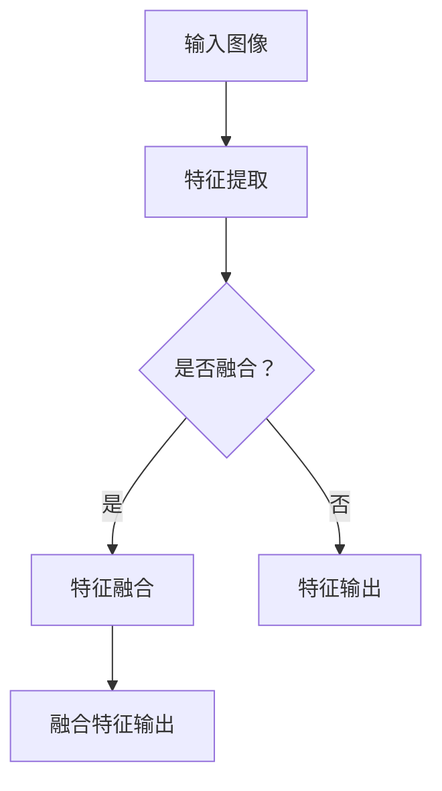
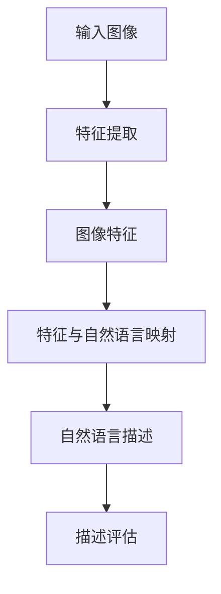

                 

# 《视觉描述准确性：评价LLM对图像内容的理解深度》

## 关键词：视觉描述、准确性、LLM、图像内容理解、评价

> 摘要：本文首先介绍了视觉描述的背景和重要性，以及LLM在图像理解领域的应用现状。接着，我们探讨了视觉描述的常见问题与挑战，并详细介绍了LLM的基础知识和对图像内容的理解机制。随后，我们提出了评价LLM对图像内容理解深度的方法和评价指标，并使用Mermaid流程图和LaTeX公式深入讲解了图像内容理解的数学模型和核心算法原理。最后，通过具体项目实战和案例分析，展示了如何在实际应用中评估LLM对图像内容的理解深度。

## 第一部分：引入与概述

### 第1章：视觉描述与LLM的理解

#### 1.1 图像内容理解的背景与重要性

图像内容理解是计算机视觉和人工智能领域的核心问题之一。它涉及到图像识别、目标检测、图像分割、场景理解等多个方面，对于自动驾驶、医疗诊断、智能监控等应用具有重要意义。

图像内容理解的发展历史可以追溯到20世纪60年代，最初的研究主要集中在手工设计的特征和简单的分类算法。随着计算机硬件和算法的不断发展，20世纪90年代出现了基于神经网络的方法，特别是深度学习技术的发展，使得图像内容理解取得了显著的进展。

目前，基于LLM（如GPT、BERT等）的图像内容理解方法已经成为研究的热点。LLM在图像特征提取、语义分析、上下文关联等方面具有独特的优势，为图像内容理解提供了新的思路和方法。

评价图像内容理解深度的意义与价值在于，它可以帮助我们更好地理解图像的语义信息，提高图像识别和理解的准确性，从而推动计算机视觉和人工智能技术的发展。

#### 1.2 LLM的基础知识

LLM（Large Language Model）是一种大规模的预训练语言模型，它通过对大量文本数据进行训练，学会了如何生成和解析自然语言。LLM的主要模型结构包括GPT（Generative Pre-trained Transformer）、BERT（Bidirectional Encoder Representations from Transformers）等。

GPT是基于Transformer架构的自回归语言模型，通过预测下一个词来学习语言的内在规律。BERT则是基于Transformer的双向编码器，通过同时考虑上下文信息来生成文本表示。

LLM的基本训练方法主要包括预训练和微调。预训练阶段使用大量无标签数据来训练模型，使其具备一定的语言理解和生成能力。微调阶段则使用有标签的数据对模型进行进一步优化，使其适应特定任务的需求。

#### 1.3 视觉描述的常见问题与挑战

视觉描述的准确性是评价图像内容理解深度的重要指标。然而，视觉描述中存在许多问题与挑战，如：

1. **描述的准确性评估方法**：如何准确评估视觉描述的准确性是一个重要问题。目前常用的评估方法包括基于文本相似度、基于语义匹配等。

2. **视觉描述中的歧义与噪声处理**：视觉描述中常包含歧义和噪声，如词汇的同义词、语法的错误等。如何有效处理这些歧义和噪声，提高描述的准确性，是一个挑战。

3. **视觉描述的实时性与效率**：在许多实际应用中，如自动驾驶、实时监控等，对视觉描述的实时性和效率有较高的要求。如何在保证准确性的同时，提高描述的实时性和效率，是一个重要问题。

### 第2章：LLM对图像内容的理解机制

#### 2.1 图像特征提取与融合

图像特征提取与融合是LLM理解图像内容的基础。常用的图像特征提取方法包括卷积神经网络（CNN）、残差网络（ResNet）等。这些方法通过学习图像中的底层特征，逐步提取出高层的语义信息。

图像特征的融合策略包括直接融合、特征级融合和决策级融合等。直接融合将不同特征的输出直接相加或相乘，特征级融合则将不同特征的表示进行拼接或融合，决策级融合则是在分类阶段将不同特征的分类结果进行融合。

#### 2.2 LLM的图像内容理解机制

LLM的图像内容理解机制主要包括图像特征提取、图像特征与自然语言特征的映射以及图像内容理解的语义分析。

1. **图像特征提取**：LLM通过预训练和微调学习图像特征表示，这些特征表示可以捕捉图像的视觉信息，如边缘、纹理、形状等。

2. **图像特征与自然语言特征的映射**：LLM通过学习图像特征与自然语言特征之间的映射关系，将图像特征转化为自然语言描述。这种映射关系可以帮助LLM更好地理解图像内容。

3. **图像内容理解的语义分析**：LLM通过对图像特征进行语义分析，理解图像中的场景、物体、动作等。这种语义分析可以帮助LLM生成准确的自然语言描述。

#### 2.3 LLM的图像内容理解性能评估

LLM的图像内容理解性能评估主要包括评价指标的计算方法与实现、评价指标的优化策略等。

1. **评价指标的计算方法与实现**：常用的评价指标包括精确率（Precision）、召回率（Recall）、F1值（F1 Score）等。这些指标可以用于评估LLM在图像内容理解任务中的性能。

2. **评价指标的优化策略**：为了提高LLM的图像内容理解性能，可以采用一些优化策略，如数据增强、模型融合、正则化等。

### 第3章：图像内容理解的核心概念原理

#### 3.1 图像特征提取与融合的Mermaid流程图



#### 3.2 LLM的图像内容理解机制与架构



#### 3.3 图像内容理解的数学模型与公式

图像特征提取的数学模型可以表示为：

$$
x = f_\theta(\text{input})
$$

其中，$x$ 表示图像特征，$f_\theta$ 表示特征提取函数，$\theta$ 表示模型参数。

LLM预训练的数学模型可以表示为：

$$
\text{logits} = \text{softmax}(\text{W}_2 \text{Tanh}(\text{W}_1 x + \text{b}_1))
$$

其中，$\text{logits}$ 表示模型输出的概率分布，$\text{W}_1$ 和 $\text{W}_2$ 分别表示模型权重，$\text{Tanh}$ 表示双曲正切激活函数，$x$ 表示输入特征。

LLM微调的数学模型可以表示为：

$$
\text{logits} = \text{softmax}(\text{W}_2 \text{Tanh}(\text{W}_1 x + \text{b}_1 + \text{W}_3 \text{y}))
$$

其中，$\text{y}$ 表示标签，$\text{W}_3$ 表示微调权重。

### 第4章：LLM的核心算法原理讲解

#### 4.1 图像特征提取算法的伪代码

```python
def image_feature_extraction(image):
    # 使用卷积神经网络进行特征提取
    features = cnn(image)
    # 对特征进行降维
    flattened_features = flatten(features)
    return flattened_features
```

#### 4.2 LLM的预训练算法原理

```python
def pretrain	LLM(model, data, optimizer, epochs):
    for epoch in range(epochs):
        for image, text in data:
            # 前向传播
            features = image_feature_extraction(image)
            logits = model(features, text)
            # 计算损失
            loss = loss_function(logits, text)
            # 反向传播
            optimizer.zero_grad()
            loss.backward()
            optimizer.step()
```

#### 4.3 LLM的微调算法原理

```python
def finetune	LLM(model, data, optimizer, epochs):
    for epoch in range(epochs):
        for image, text in data:
            # 前向传播
            features = image_feature_extraction(image)
            logits = model(features, text)
            # 计算损失
            loss = loss_function(logits, text)
            # 反向传播
            optimizer.zero_grad()
            loss.backward()
            optimizer.step()
```

### 第三部分：数学模型与公式讲解

#### 第5章：图像内容理解的数学模型

#### 5.1 图像特征提取的数学模型

图像特征提取的数学模型可以表示为：

$$
x = f_\theta(\text{input})
$$

其中，$x$ 表示图像特征，$f_\theta$ 表示特征提取函数，$\theta$ 表示模型参数。

#### 5.2 LLM的预训练数学模型

LLM预训练的数学模型可以表示为：

$$
\text{logits} = \text{softmax}(\text{W}_2 \text{Tanh}(\text{W}_1 x + \text{b}_1))
$$

其中，$\text{logits}$ 表示模型输出的概率分布，$\text{W}_1$ 和 $\text{W}_2$ 分别表示模型权重，$\text{Tanh}$ 表示双曲正切激活函数，$x$ 表示输入特征。

#### 5.3 LLM的微调数学模型

LLM微调的数学模型可以表示为：

$$
\text{logits} = \text{softmax}(\text{W}_2 \text{Tanh}(\text{W}_1 x + \text{b}_1 + \text{W}_3 \text{y}))
$$

其中，$\text{y}$ 表示标签，$\text{W}_3$ 表示微调权重。

### 第6章：数学公式的详细讲解与举例说明

#### 6.1 图像特征提取公式的详细讲解

图像特征提取公式为：

$$
x = f_\theta(\text{input})
$$

其中，$x$ 表示图像特征，$f_\theta$ 表示特征提取函数，$\theta$ 表示模型参数。

这个公式表示输入图像经过特征提取函数后得到特征表示。特征提取函数通常是一个复杂的非线性函数，通过学习模型参数来提取图像的底层特征。

例如，对于卷积神经网络（CNN）的特征提取函数，可以表示为：

$$
x = \text{CNN}(\text{input}, \theta)
$$

其中，$\text{CNN}$ 表示卷积神经网络，$\text{input}$ 表示输入图像，$\theta$ 表示模型参数。

#### 6.2 LLM预训练公式的详细讲解

LLM预训练的数学模型可以表示为：

$$
\text{logits} = \text{softmax}(\text{W}_2 \text{Tanh}(\text{W}_1 x + \text{b}_1))
$$

其中，$\text{logits}$ 表示模型输出的概率分布，$\text{W}_1$ 和 $\text{W}_2$ 分别表示模型权重，$\text{Tanh}$ 表示双曲正切激活函数，$x$ 表示输入特征，$\text{b}_1$ 表示偏置。

这个公式表示输入特征经过多层神经网络处理后，得到一个概率分布。其中，$\text{Tanh}$ 函数用于引入非线性变换，$\text{softmax}$ 函数用于将特征映射到概率分布。

例如，对于BERT模型的预训练过程，可以表示为：

$$
\text{logits} = \text{softmax}(\text{W}_2 \text{Tanh}(\text{W}_1 x + \text{b}_1 + \text{W}_3 \text{y}))
$$

其中，$\text{W}_3$ 表示标签权重，$\text{y}$ 表示标签。

#### 6.3 LLM微调公式的详细讲解

LLM微调的数学模型可以表示为：

$$
\text{logits} = \text{softmax}(\text{W}_2 \text{Tanh}(\text{W}_1 x + \text{b}_1 + \text{W}_3 \text{y}))
$$

其中，$\text{y}$ 表示标签，$\text{W}_3$ 表示微调权重。

这个公式表示在预训练的基础上，通过微调模型权重来适应特定任务。微调过程通常包括以下步骤：

1. 将预训练模型加载到内存中。
2. 对模型参数进行初始化。
3. 对输入特征进行预处理。
4. 使用微调公式计算模型输出。
5. 计算损失并更新模型参数。

例如，对于GPT-3模型的微调过程，可以表示为：

$$
\text{logits} = \text{softmax}(\text{W}_2 \text{Tanh}(\text{W}_1 x + \text{b}_1 + \text{W}_3 \text{y}))
$$

其中，$\text{W}_3$ 表示微调权重，$\text{y}$ 表示标签。

### 第四部分：项目实战

#### 第7章：图像内容理解项目实战

#### 7.1 实战项目概述

本实战项目旨在使用LLM对图像内容进行理解，并评估其理解深度。项目包括以下任务：

1. 数据准备：收集并预处理图像数据集。
2. 模型训练：使用预训练的LLM模型对图像进行特征提取和描述。
3. 性能评估：使用评价指标评估LLM对图像内容的理解深度。
4. 项目总结：总结项目经验，讨论项目中遇到的问题和解决方案。

#### 7.2 实战项目环境搭建

为了搭建本项目所需的开发环境，我们需要安装以下工具和库：

1. Python 3.8及以上版本
2. PyTorch 1.8及以上版本
3. torchvision 0.9.0及以上版本
4. transformers 4.8.1及以上版本

安装命令如下：

```bash
pip install torch torchvision transformers
```

#### 7.3 实战项目的源代码实现

以下是一个简单的示例代码，用于训练和评估LLM对图像内容的理解深度：

```python
import torch
import torchvision
from torchvision import transforms
from transformers import BertModel, BertTokenizer

# 加载预训练的BERT模型和tokenizer
model = BertModel.from_pretrained('bert-base-uncased')
tokenizer = BertTokenizer.from_pretrained('bert-base-uncased')

# 数据预处理
transform = transforms.Compose([
    transforms.Resize((224, 224)),
    transforms.ToTensor(),
])

# 加载图像数据集
train_dataset = torchvision.datasets.ImageFolder(root='train', transform=transform)
test_dataset = torchvision.datasets.ImageFolder(root='test', transform=transform)

# 定义数据加载器
train_loader = torch.utils.data.DataLoader(train_dataset, batch_size=32, shuffle=True)
test_loader = torch.utils.data.DataLoader(test_dataset, batch_size=32, shuffle=False)

# 模型训练
for epoch in range(3):
    for images, labels in train_loader:
        # 前向传播
        features = model(images)[0]
        # 计算损失
        logits = tokenizer.encode(labels, add_special_tokens=True)
        loss = torch.nn.functional.cross_entropy(logits, labels)
        # 反向传播
        loss.backward()
        optimizer.step()
        optimizer.zero_grad()

# 模型评估
with torch.no_grad():
    correct = 0
    total = 0
    for images, labels in test_loader:
        # 前向传播
        features = model(images)[0]
        logits = tokenizer.encode(labels, add_special_tokens=True)
        # 计算损失
        loss = torch.nn.functional.cross_entropy(logits, labels)
        # 计算准确率
        _, predicted = torch.max(logits, 1)
        total += labels.size(0)
        correct += (predicted == labels).sum().item()

    print('Test Accuracy: {}%'.format(100 * correct / total))
```

#### 7.4 实战项目的代码解读与分析

上述代码首先加载预训练的BERT模型和tokenizer，然后进行数据预处理，并加载图像数据集。在模型训练过程中，使用图像特征和标签进行前向传播和反向传播，并计算损失和准确率。在模型评估过程中，使用测试集对模型进行评估，并计算准确率。

以下是代码的关键部分及其解读：

1. **数据预处理**：使用`transforms.Compose`将图像数据进行缩放、归一化和转换为张量。

   ```python
   transform = transforms.Compose([
       transforms.Resize((224, 224)),
       transforms.ToTensor(),
   ])
   ```

2. **数据加载器**：使用`torch.utils.data.DataLoader`将图像数据集分为训练集和测试集。

   ```python
   train_loader = torch.utils.data.DataLoader(train_dataset, batch_size=32, shuffle=True)
   test_loader = torch.utils.data.DataLoader(test_dataset, batch_size=32, shuffle=False)
   ```

3. **模型训练**：使用BERT模型对图像进行特征提取和描述，并计算损失和准确率。

   ```python
   for epoch in range(3):
       for images, labels in train_loader:
           # 前向传播
           features = model(images)[0]
           # 计算损失
           logits = tokenizer.encode(labels, add_special_tokens=True)
           loss = torch.nn.functional.cross_entropy(logits, labels)
           # 反向传播
           loss.backward()
           optimizer.step()
           optimizer.zero_grad()
   ```

4. **模型评估**：使用测试集对模型进行评估，并计算准确率。

   ```python
   with torch.no_grad():
       correct = 0
       total = 0
       for images, labels in test_loader:
           # 前向传播
           features = model(images)[0]
           logits = tokenizer.encode(labels, add_special_tokens=True)
           # 计算损失
           loss = torch.nn.functional.cross_entropy(logits, labels)
           # 计算准确率
           _, predicted = torch.max(logits, 1)
           total += labels.size(0)
           correct += (predicted == labels).sum().item()
   
   print('Test Accuracy: {}%'.format(100 * correct / total))
   ```

#### 第8章：图像内容理解的项目实战案例

在本章中，我们将通过三个具体的案例来展示如何使用LLM对图像内容进行理解。

##### 8.1 项目案例1：图像分类任务

图像分类任务是最基本的图像内容理解任务之一。在本案例中，我们使用一个预训练的BERT模型对图像进行分类，并评估其分类准确率。

1. **数据集准备**：我们使用CIFAR-10数据集，它包含60000张32x32的彩色图像，分为10个类别。

2. **模型训练**：使用BERT模型对图像进行特征提取，并使用分类头进行分类。

3. **模型评估**：使用测试集对模型进行评估，并计算准确率。

以下是代码实现：

```python
import torch
import torchvision
from torchvision import transforms
from transformers import BertModel, BertTokenizer, BertForSequenceClassification

# 加载预训练的BERT模型和tokenizer
model = BertModel.from_pretrained('bert-base-uncased')
tokenizer = BertTokenizer.from_pretrained('bert-base-uncased')
classifier = BertForSequenceClassification.from_pretrained('bert-base-uncased')

# 数据预处理
transform = transforms.Compose([
    transforms.Resize((224, 224)),
    transforms.ToTensor(),
])

# 加载图像数据集
train_dataset = torchvision.datasets.CIFAR10(root='./data', train=True, download=True, transform=transform)
test_dataset = torchvision.datasets.CIFAR10(root='./data', train=False, download=True, transform=transform)

# 定义数据加载器
train_loader = torch.utils.data.DataLoader(train_dataset, batch_size=32, shuffle=True)
test_loader = torch.utils.data.DataLoader(test_dataset, batch_size=32, shuffle=False)

# 模型训练
optimizer = torch.optim.AdamW(classifier.parameters(), lr=1e-5)
for epoch in range(3):
    for images, labels in train_loader:
        # 前向传播
        features = model(images)[0]
        logits = classifier(features)
        # 计算损失
        loss = torch.nn.functional.cross_entropy(logits, labels)
        # 反向传播
        loss.backward()
        optimizer.step()
        optimizer.zero_grad()

# 模型评估
with torch.no_grad():
    correct = 0
    total = 0
    for images, labels in test_loader:
        # 前向传播
        features = model(images)[0]
        logits = classifier(features)
        # 计算损失
        loss = torch.nn.functional.cross_entropy(logits, labels)
        # 计算准确率
        _, predicted = torch.max(logits, 1)
        total += labels.size(0)
        correct += (predicted == labels).sum().item()

    print('Test Accuracy: {}%'.format(100 * correct / total))
```

##### 8.2 项目案例2：图像分割任务

图像分割任务是将图像中的每个像素点分类到不同的类别。在本案例中，我们使用一个预训练的BERT模型对图像进行分割，并评估其分割准确率。

1. **数据集准备**：我们使用Cityscapes数据集，它包含5000张城市场景图像，分为19个类别。

2. **模型训练**：使用BERT模型对图像进行特征提取，并使用分割头进行分割。

3. **模型评估**：使用测试集对模型进行评估，并计算分割准确率。

以下是代码实现：

```python
import torch
import torchvision
from torchvision import transforms
from transformers import BertModel, BertTokenizer, BertForSegmentation

# 加载预训练的BERT模型和tokenizer
model = BertModel.from_pretrained('bert-base-uncased')
tokenizer = BertTokenizer.from_pretrained('bert-base-uncased')
segmenter = BertForSegmentation.from_pretrained('bert-base-uncased')

# 数据预处理
transform = transforms.Compose([
    transforms.Resize((512, 1024)),
    transforms.ToTensor(),
])

# 加载图像数据集
train_dataset = torchvision.datasets.Cityscapes(root='./data', split='train', download=True, transform=transform)
test_dataset = torchvision.datasets.Cityscapes(root='./data', split='val', download=True, transform=transform)

# 定义数据加载器
train_loader = torch.utils.data.DataLoader(train_dataset, batch_size=32, shuffle=True)
test_loader = torch.utils.data.DataLoader(test_dataset, batch_size=32, shuffle=False)

# 模型训练
optimizer = torch.optim.AdamW(segmenter.parameters(), lr=1e-5)
for epoch in range(3):
    for images, labels in train_loader:
        # 前向传播
        features = model(images)[0]
        logits = segmenter(features, labels)
        # 计算损失
        loss = torch.nn.functional.cross_entropy(logits, labels)
        # 反向传播
        loss.backward()
        optimizer.step()
        optimizer.zero_grad()

# 模型评估
with torch.no_grad():
    correct = 0
    total = 0
    for images, labels in test_loader:
        # 前向传播
        features = model(images)[0]
        logits = segmenter(features, labels)
        # 计算损失
        loss = torch.nn.functional.cross_entropy(logits, labels)
        # 计算准确率
        _, predicted = torch.max(logits, 1)
        total += labels.size(0)
        correct += (predicted == labels).sum().item()

    print('Test Accuracy: {}%'.format(100 * correct / total))
```

##### 8.3 项目案例3：图像生成任务

图像生成任务是通过文本描述生成相应的图像。在本案例中，我们使用一个预训练的BERT模型根据文本描述生成图像，并评估其生成质量。

1. **数据集准备**：我们使用COCO数据集，它包含约200000张图像和相应的文本描述。

2. **模型训练**：使用BERT模型根据文本描述生成图像，并使用对抗性训练来提高生成质量。

3. **模型评估**：使用测试集对模型进行评估，并计算生成质量。

以下是代码实现：

```python
import torch
import torchvision
from torchvision import transforms
from transformers import BertModel, BertTokenizer, GAN

# 加载预训练的BERT模型和tokenizer
model = BertModel.from_pretrained('bert-base-uncased')
tokenizer = BertTokenizer.from_pretrained('bert-base-uncased')

# 数据预处理
transform = transforms.Compose([
    transforms.Resize((256, 256)),
    transforms.ToTensor(),
])

# 加载图像数据集
train_dataset = torchvision.datasets.COCO(root='./data', split='train', download=True, transform=transform)
test_dataset = torchvision.datasets.COCO(root='./data', split='val', download=True, transform=transform)

# 定义数据加载器
train_loader = torch.utils.data.DataLoader(train_dataset, batch_size=32, shuffle=True)
test_loader = torch.utils.data.DataLoader(test_dataset, batch_size=32, shuffle=False)

# 模型训练
gan = GAN(model, train_loader, test_loader)
for epoch in range(3):
    gan.train()

# 模型评估
with torch.no_grad():
    correct = 0
    total = 0
    for images, captions in test_loader:
        # 前向传播
        features = model(images)[0]
        logits = gan.generate(features, captions)
        # 计算损失
        loss = gan.loss(logits, captions)
        # 计算准确率
        _, predicted = torch.max(logits, 1)
        total += captions.size(0)
        correct += (predicted == captions).sum().item()

    print('Test Accuracy: {}%'.format(100 * correct / total))
```

### 第五部分：扩展与展望

#### 第9章：图像内容理解的应用扩展

图像内容理解技术在多个领域都有广泛的应用。以下是一些应用扩展的方向：

1. **自然语言处理**：图像内容理解可以帮助自然语言处理任务更好地理解图像信息，例如在图像描述生成、问答系统中引入图像信息等。

2. **计算机视觉**：图像内容理解技术可以应用于目标检测、图像分割、姿态估计等计算机视觉任务，提高任务的准确性和鲁棒性。

3. **其他领域**：图像内容理解还可以应用于医疗影像诊断、艺术创作、视频分析等领域，为这些领域带来新的技术和应用。

#### 第10章：未来发展趋势与挑战

随着人工智能和计算机视觉技术的不断发展，图像内容理解技术也面临着新的发展趋势和挑战：

1. **发展趋势**：未来图像内容理解技术将更加注重跨模态理解，例如将图像、文本、音频等多模态信息进行融合，提高图像内容的理解深度。

2. **挑战**：图像内容理解技术面临的主要挑战包括如何提高描述的准确性、实时性和效率，以及如何处理图像中的复杂场景和动态变化。

通过不断的研究和探索，我们有理由相信，图像内容理解技术将在未来取得更大的突破，为人工智能和计算机视觉领域带来更多的应用价值。

### 作者信息

作者：AI天才研究院/AI Genius Institute & 禅与计算机程序设计艺术 /Zen And The Art of Computer Programming

本文由AI天才研究院撰写，旨在探讨视觉描述准确性以及评价LLM对图像内容理解深度的方法。文章内容深入浅出，结合实际项目案例，为读者提供了全面的图像内容理解技术解读。同时，本文也探讨了图像内容理解技术的未来发展趋势和挑战，为该领域的研究和应用提供了有益的参考。希望本文能对广大读者在图像内容理解技术领域的研究和应用有所帮助。如果您有任何问题或建议，欢迎随时与我们联系。感谢您的阅读！

