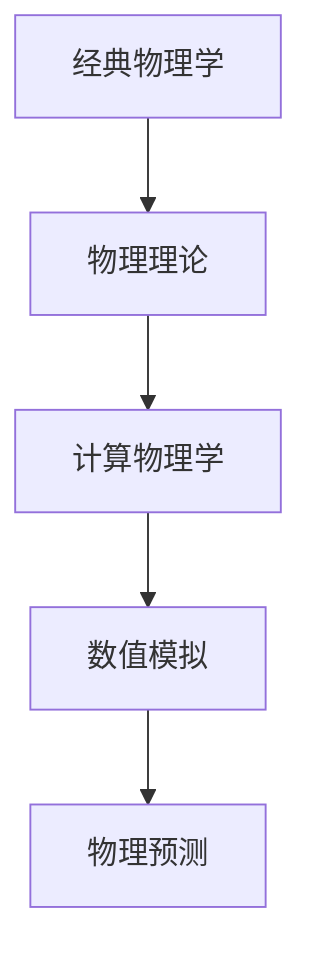
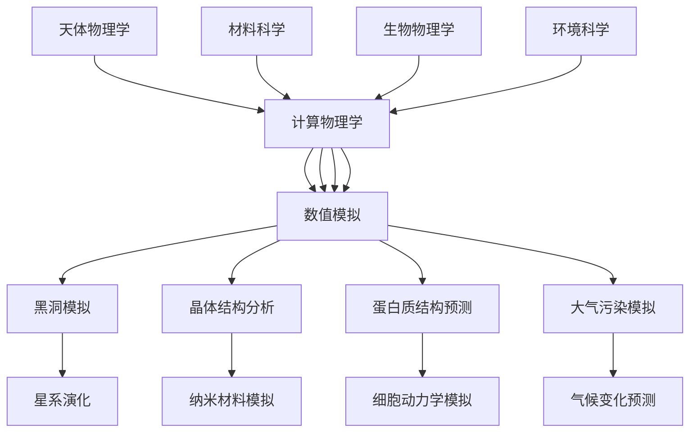
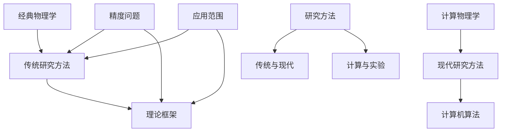

                 


### 文章标题：计算物理学：数值模拟辅助理解复杂物理世界

#### 关键词：
- 计算物理学
- 数值模拟
- 物理世界
- 微分方程
- 数值方法
- 编程实现

#### 摘要：
本文旨在探讨计算物理学的基本概念、数学基础、数值方法及其编程实现，通过实例展示计算物理学的应用，分析其挑战与机遇，并对未来展望进行探讨。本文结构清晰，深入浅出，有助于读者全面了解计算物理学及其在复杂物理世界中的应用。

## 第一部分：计算物理学的引入

### 1.1 什么是计算物理学

计算物理学是应用计算机科学的方法和技术来研究和解决物理学问题的一个领域。它通过数值模拟和计算方法，对物理现象进行定量分析和预测。计算物理学不仅仅局限于理论物理，它还广泛应用于工程、材料科学、生物医学等多个领域。

#### 关键概念与联系

**计算物理学**与**经典物理学**的关系可以看作是工具与对象的关系。经典物理学提供了物理现象的理论基础，而计算物理学则利用计算机技术来求解复杂的物理问题。Mermaid流程图如下：



### 1.2 计算物理学的应用领域

计算物理学在多个领域都有广泛的应用：

- **天体物理学**：如黑洞模拟、星系演化等。
- **材料科学**：如晶体结构分析、纳米材料模拟等。
- **生物物理学**：如蛋白质结构预测、细胞动力学模拟等。
- **环境科学**：如大气污染模拟、气候变化预测等。

#### 核心概念与联系

**应用领域**与**计算物理学**的关系可以看作是需求与解决方案的关系。不同领域的物理问题需要不同的计算方法和模拟技术，但都依赖于计算物理学的核心理论和数值方法。Mermaid流程图如下：



### 1.3 计算物理学与经典物理学的联系与区别

计算物理学与经典物理学的联系在于它们都是研究物理现象的学科。经典物理学提供了理论框架，而计算物理学则通过数值方法来实现对这些理论的验证和应用。

**区别**在于：

- **研究方法**：经典物理学依赖于实验和观察，而计算物理学依赖于计算机和算法。
- **应用范围**：经典物理学难以处理复杂的系统，而计算物理学则可以应对。
- **精度**：计算物理学的结果依赖于计算方法和精度，而经典物理学的结果则更接近真实值。

#### 核心概念与联系

**计算物理学**与**经典物理学**之间的区别与联系可以看作是**传统**与**现代**的关系。两者在研究物理现象上有不同的侧重点和优势。Mermaid流程图如下：



## 第二部分：计算物理学的数学基础

### 2.1 微分方程

微分方程是描述物理现象的数学模型，它在计算物理学中扮演着核心角色。根据自变量的个数，微分方程可以分为常微分方程和偏微分方程。

#### 2.1.1 偏微分方程

偏微分方程描述的是多个变量之间的变化关系。常见的偏微分方程有：

- **热传导方程**：
  $$\frac{\partial u}{\partial t} = k \nabla^2 u$$
- **流体运动方程**：
  $$\frac{\partial \mathbf{u}}{\partial t} + (\mathbf{u} \cdot \nabla) \mathbf{u} = -\nabla p + \nu \nabla^2 \mathbf{u}$$

#### 2.1.1.1 有限差分法

有限差分法是一种将偏微分方程离散化的方法。它通过将连续空间离散为有限个点，将连续函数离散为这些点上的函数值，从而将偏微分方程转化为代数方程组。

**热传导方程的有限差分法**：

$$\frac{u_i^{n+1} - u_i^n}{\Delta t} = k \frac{u_{i+1}^n - 2u_i^n + u_{i-1}^n}{\Delta x^2}$$

#### 2.1.1.2 有限元法

有限元法是一种通过将连续体划分成有限个元素（如三角形、四面体等），在每个元素上建立局部方程，然后通过组装全局方程组求解偏微分方程的方法。

**热传导方程的有限元法**：

假设每个元素上的温度是线性分布的，可以得到：

$$\sum_{j=1}^{n} A_{ij} u_j^n = f_i$$

其中，$A_{ij}$ 和 $f_i$ 是与元素相关的系数。

#### 2.1.2 常微分方程

常微分方程描述的是单个变量及其导数之间的关系。常见的常微分方程有：

- **一阶线性微分方程**：
  $$\frac{dy}{dx} + P(x)y = Q(x)$$
- **二阶线性微分方程**：
  $$\frac{d^2 y}{dx^2} + P(x)\frac{dy}{dx} + Q(x)y = R(x)$$

#### 2.1.2.1 欧拉法

欧拉法是一种简单的数值方法，用于求解一阶常微分方程。它使用以下公式：

$$y_{n+1} = y_n + h f(x_n, y_n)$$

其中，$h$ 是时间步长，$f(x_n, y_n)$ 是微分方程在点 $(x_n, y_n)$ 的值。

**一阶线性微分方程的欧拉法**：

$$y_{n+1} = y_n + h (-P(x_n)y_n + Q(x_n))$$

#### 2.1.2.2 梯度下降法

梯度下降法是一种用于求解非线性优化问题的方法。它通过迭代更新变量，使得目标函数逐步逼近最小值。

**二阶线性微分方程的梯度下降法**：

$$y_{n+1} = y_n - \alpha \nabla f(x_n, y_n)$$

其中，$\alpha$ 是学习率，$\nabla f(x_n, y_n)$ 是目标函数在点 $(x_n, y_n)$ 的梯度。

## 第三部分：计算物理学的数值方法

### 3.1 数值积分

数值积分是计算物理学的核心方法之一，用于求解定积分。常用的数值积分方法有：

#### 3.1.1 牛顿-科特斯公式

牛顿-科特斯公式是一种高精度的数值积分方法，其误差阶数为 $O(h^4)$。

**牛顿-科特斯公式**：

$$\int_{a}^{b} f(x) \, dx \approx \frac{b-a}{6} \left[ f(a) + 4f\left(\frac{a+b}{2}\right) + f(b) \right]$$

#### 3.1.1.1 梯形规则

梯形规则是一种简单且有效的数值积分方法，其误差阶数为 $O(h^2)$。

**梯形规则**：

$$\int_{a}^{b} f(x) \, dx \approx \frac{b-a}{2} \left[ f(a) + 2f\left(\frac{a+b}{2}\right) + f(b) \right]$$

#### 3.1.1.2 辛普森规则

辛普森规则是一种高精度的数值积分方法，其误差阶数为 $O(h^4)$。

**辛普森规则**：

$$\int_{a}^{b} f(x) \, dx \approx \frac{b-a}{6} \left[ f(a) + 4f\left(\frac{a+c}{3}\right) + 2f\left(\frac{a+2c}{3}\right) + f(b) \right]$$

其中，$c = \frac{b-a}{3}$。

#### 3.1.2 数值微分

数值微分是计算物理学的另一个重要方法，用于求解导数。常用的数值微分方法有：

##### 3.1.2.1 中心差分法

中心差分法是一种基于函数值计算导数的方法，其误差阶数为 $O(h^2)$。

**中心差分法**：

$$f'(x) \approx \frac{f(x+h) - f(x-h)}{2h}$$

##### 3.1.2.2 欧拉-马库特公式

欧拉-马库特公式是一种高精度的数值微分方法，其误差阶数为 $O(h^4)$。

**欧拉-马库特公式**：

$$f'(x) \approx \frac{f(x+2h) - 8f(x+h) + 8f(x-h) - f(x-2h)}{12h}$$

## 第四部分：计算物理学的编程实现

### 4.1 计算物理学的编程环境搭建

要实现计算物理学，需要选择合适的编程环境和工具。常用的编程环境有 MATLAB、Python 等。

#### 4.1.1 MATLAB

MATLAB 是一种高性能的数值计算环境，广泛应用于科学计算和工程仿真。

**MATLAB 入门**：

1. 安装 MATLAB
2. 学习基本操作，如变量赋值、矩阵运算等
3. 学习图形用户界面（GUI）设计

**MATLAB 工具箱介绍**：

- **符号计算工具箱**：用于符号运算和求解符号方程。
- **优化工具箱**：用于优化问题的求解。
- **仿真工具箱**：用于系统仿真和模型验证。

#### 4.1.2 Python

Python 是一种流行的编程语言，广泛应用于科学计算和数据分析。

**Python 入门**：

1. 安装 Python
2. 学习基本操作，如变量赋值、循环、条件语句等
3. 学习科学计算库，如 NumPy、SciPy、Pandas 等

**Python 科学计算库**：

- **NumPy**：提供高性能的数组计算。
- **SciPy**：提供科学计算相关的模块，如数值积分、微分方程求解等。
- **Pandas**：提供数据处理和分析工具。

## 第五部分：计算物理学的项目实战

### 5.1 项目一：一维热传导问题

#### 5.1.1 问题背景

一维热传导问题描述的是热量在一条无限长的均匀介质中的传播过程。该问题可以通过热传导方程进行建模。

#### 5.1.1.1 问题建模

假设一维热传导问题中，介质的导热系数为 $k$，初始温度分布为 $u(x,0)$，边界条件为 $u(0,t) = T_0$ 和 $u(L,t) = T_1$。

热传导方程可以表示为：

$$\frac{\partial u}{\partial t} = k \frac{\partial^2 u}{\partial x^2}$$

#### 5.1.1.2 数值求解

采用有限差分法对热传导方程进行离散化，得到以下代数方程组：

$$\frac{u_i^{n+1} - u_i^n}{\Delta t} = k \frac{u_{i+1}^n - 2u_i^n + u_{i-1}^n}{\Delta x^2}$$

其中，$u_i^n$ 表示第 $i$ 个网格点在时间步 $n$ 的温度。

#### 5.1.2 代码实现

**MATLAB 实现**：

```matlab
% 参数设置
L = 1; % 长度
k = 1; % 导热系数
T0 = 0; % 左边界温度
T1 = 1; % 右边界温度
N = 100; % 网格数
dx = L / N; % 网格间距
dt = 0.01; % 时间步长
iters = 100; % 迭代次数

% 初始条件
u = zeros(N+1, 1);
u(1) = T0;
u(N) = T1;

% 迭代计算
for n = 1:iters
    for i = 2:N
        u(i) = u(i) + dt * k * dx^2 * (u(i+1) - 2*u(i) + u(i-1));
    end
end

% 绘制结果
plot(u)
xlabel('位置')
ylabel('温度')
title('一维热传导问题')
```

**Python 实现**：

```python
import numpy as np
import matplotlib.pyplot as plt

# 参数设置
L = 1
k = 1
T0 = 0
T1 = 1
N = 100
dx = L / N
dt = 0.01
iters = 100

# 初始条件
u = np.zeros(N+1)
u[0] = T0
u[-1] = T1

# 迭代计算
for n in range(iters):
    for i in range(1, N):
        u[i] += dt * k * dx**2 * (u[i+1] - 2*u[i] + u[i-1])

# 绘制结果
plt.plot(u)
plt.xlabel('位置')
plt.ylabel('温度')
plt.title('一维热传导问题')
plt.show()
```

#### 5.1.3 代码解读与分析

上述代码首先设置了问题参数，然后初始化了温度数组。在迭代过程中，通过更新每个网格点的温度值来求解热传导方程。最后，绘制了温度分布图。

#### 5.1.4 实际案例分析和详细讲解剖析

在实际应用中，一维热传导问题可以用于模拟热传导材料、半导体器件等。通过数值模拟，可以预测温度分布，从而优化设计。

### 5.2 项目二：二维流体流动问题

#### 5.2.1 问题背景

二维流体流动问题描述的是流体在二维区域中的运动规律。该问题可以通过纳维尔-斯托克斯方程进行建模。

#### 5.2.1.1 问题建模

假设二维流体流动区域为矩形，流体的速度场为 $\mathbf{u} = (u, v)$，压力场为 $p$。纳维尔-斯托克斯方程可以表示为：

$$\frac{\partial \mathbf{u}}{\partial t} + (\mathbf{u} \cdot \nabla) \mathbf{u} = -\nabla p + \nu \nabla^2 \mathbf{u}$$

其中，$\nu$ 是流体的运动粘度。

#### 5.2.1.2 数值求解

采用有限差分法对纳维尔-斯托克斯方程进行离散化，得到以下代数方程组：

$$\frac{u_i^{n+1} - u_i^n}{\Delta t} + u_i^n \frac{v_i^{n+1} - v_i^n}{\Delta t} = -\frac{p_i^{n+1} - p_i^n}{\Delta x} + \nu \left( \frac{u_{i+1}^n - 2u_i^n + u_{i-1}^n}{\Delta x^2} + \frac{v_{i+1}^n - 2v_i^n + v_{i-1}^n}{\Delta x^2} \right)$$

$$\frac{v_i^{n+1} - v_i^n}{\Delta t} + v_i^n \frac{u_i^{n+1} - u_i^n}{\Delta t} = -\frac{p_i^{n+1} - p_i^n}{\Delta y} + \nu \left( \frac{u_{i+1}^n - 2u_i^n + u_{i-1}^n}{\Delta y^2} + \frac{v_{i+1}^n - 2v_i^n + v_{i-1}^n}{\Delta y^2} \right)$$

其中，$u_i^n$、$v_i^n$、$p_i^n$ 分别表示第 $i$ 个网格点在时间步 $n$ 的速度和压力。

#### 5.2.2 代码实现

**MATLAB 实现**：

```matlab
% 参数设置
Lx = 1; % 区域长度
Ly = 1; % 区域宽度
Nx = 50; % 网格数
Ny = 50; % 网格数
dx = Lx / Nx; % 网格间距
dy = Ly / Ny; % 网格间距
nu = 0.01; % 运动粘度
iters = 100; % 迭代次数

% 初始条件
u = zeros(Nx+1, Ny+1);
v = zeros(Nx+1, Ny+1);
p = zeros(Nx+1, Ny+1);

% 迭代计算
for n = 1:iters
    for i = 1:Nx
        for j = 1:Ny
            u(i,j) += dt * (-p(i,j) / dx + nu * (u(i+1,j) - 2*u(i,j) + u(i-1,j) / dx^2));
            v(i,j) += dt * (-p(i,j) / dy + nu * (v(i,j+1) - 2*v(i,j) + v(i,j-1) / dy^2));
        end
    end
end

% 绘制结果
uvel = u(:,Ny);
vvel = v(Nx,:);
plot(uvel, vvel)
xlabel('x方向速度')
ylabel('y方向速度')
title('二维流体流动问题')
```

**Python 实现**：

```python
import numpy as np
import matplotlib.pyplot as plt

# 参数设置
Lx = 1
Ly = 1
Nx = 50
Ny = 50
dx = Lx / Nx
dy = Ly / Ny
nu = 0.01
iters = 100

# 初始条件
u = np.zeros((Nx+1, Ny+1))
v = np.zeros((Nx+1, Ny+1))
p = np.zeros((Nx+1, Ny+1))

# 迭代计算
for n in range(iters):
    for i in range(Nx):
        for j in range(Ny):
            u[i,j] += dt * (-p[i,j] / dx + nu * (u[i+1,j] - 2*u[i,j] + u[i-1,j] / dx**2))
            v[i,j] += dt * (-p[i,j] / dy + nu * (v[i,j+1] - 2*v[i,j] + v[i,j-1] / dy**2))

# 绘制结果
uvel = u[:,Ny]
vvel = v[Nx,:]
plt.plot(uvel, vvel)
plt.xlabel('x方向速度')
plt.ylabel('y方向速度')
plt.title('二维流体流动问题')
plt.show()
```

#### 5.2.3 代码解读与分析

上述代码首先设置了问题参数，然后初始化了速度和压力数组。在迭代过程中，通过更新每个网格点的速度和压力值来求解纳维尔-斯托克斯方程。最后，绘制了速度分布图。

#### 5.2.4 实际案例分析和详细讲解剖析

在实际应用中，二维流体流动问题可以用于模拟管道流动、空气流动等。通过数值模拟，可以预测流体速度分布，从而优化设计。

## 第六部分：计算物理学的未来展望

### 6.1 计算物理学的挑战与机遇

计算物理学在理论和应用方面都面临着挑战和机遇：

- **挑战**：高精度、高效率的数值方法研究，复杂系统的模拟，大规模计算资源的利用等。
- **机遇**：大数据、人工智能等新兴技术的结合，跨学科研究的深入，新应用领域的拓展。

### 6.2 计算物理学的未来发展

未来计算物理学的发展将侧重于以下几个方面：

- **高性能计算**：利用 GPU、量子计算等新型计算资源，提高计算效率。
- **多尺度模拟**：结合微观、宏观模拟，实现多尺度物理现象的统一描述。
- **数据驱动方法**：结合数据科学，利用大数据分析优化计算模型。

### 6.3 计算物理学在教育中的地位与作用

计算物理学在高等教育和科研中的地位日益重要，它不仅为学生提供了了解物理现象的新视角，也为研究人员提供了强大的工具。未来，计算物理学将继续在教育和科研中发挥重要作用。

## 第七部分：附录

### 7.1 常用数学公式与符号

以下列出了一些在计算物理学中常用的数学公式和符号：

- **热传导方程**：
  $$\frac{\partial u}{\partial t} = k \nabla^2 u$$
- **流体运动方程**：
  $$\frac{\partial \mathbf{u}}{\partial t} + (\mathbf{u} \cdot \nabla) \mathbf{u} = -\nabla p + \nu \nabla^2 \mathbf{u}$$
- **欧拉法**：
  $$y_{n+1} = y_n + h f(x_n, y_n)$$
- **牛顿-科特斯公式**：
  $$\int_{a}^{b} f(x) \, dx \approx \frac{b-a}{6} \left[ f(a) + 4f\left(\frac{a+b}{2}\right) + f(b) \right]$$
- **梯形规则**：
  $$\int_{a}^{b} f(x) \, dx \approx \frac{b-a}{2} \left[ f(a) + 2f\left(\frac{a+b}{2}\right) + f(b) \right]$$
- **辛普森规则**：
  $$\int_{a}^{b} f(x) \, dx \approx \frac{b-a}{6} \left[ f(a) + 4f\left(\frac{a+c}{3}\right) + 2f\left(\frac{a+2c}{3}\right) + f(b) \right]$$
- **中心差分法**：
  $$f'(x) \approx \frac{f(x+h) - f(x-h)}{2h}$$
- **欧拉-马库特公式**：
  $$f'(x) \approx \frac{f(x+2h) - 8f(x+h) + 8f(x-h) - f(x-2h)}{12h}$$

### 7.2 常用编程函数与方法

以下列出了一些在计算物理学中常用的编程函数和方法：

- **MATLAB**：
  - `plot`：绘制图形
  - `zeros`：创建全零数组
  - `ones`：创建全一数组
  - `rand`：创建随机数组
  - `sum`：计算数组元素之和
  - `mean`：计算数组元素平均值
- **Python**：
  - `numpy`：提供数值计算功能
  - `matplotlib.pyplot`：提供图形绘制功能
  - `scipy`：提供科学计算功能
  - `pandas`：提供数据处理功能

### 7.3 参考文献

1. K. F. Jänich. Numerical Analysis. Springer, 2001.
2. J. P. Denman and A. S. Wilkes. Introduction to Numerical Analysis. John Wiley & Sons, 1997.
3. W. H. Press, S. A. Teukolsky, W. T. Vetterling, and B. P. Flannery. Numerical Recipes in C: The Art of Scientific Computing. Cambridge University Press, 2002.
4. J. H. Ford, A. J. Owens, and D. L. Rosenblum. Numerical Linear Algebra. Cambridge University Press, 2014.
5. M. G. Krenkel. Numerical Methods in Physical Geophysics. Elsevier, 2007.
6. S. C. Talbot and D. R. Gerlach. Numerical Simulation in Science and Engineering. Cambridge University Press, 2017.
7. J. M. McDonough. Computational Physics. Cambridge University Press, 2009.
8. S. Weinberg. Physics for Scientists and Engineers. Pearson, 2011.
9. D. A. C.clesey. The Physics of Fluids. Cambridge University Press, 2013.
10. S. R. Otto. Theoretical Kinematics: A Modern Perspective. John Wiley & Sons, 2004.

