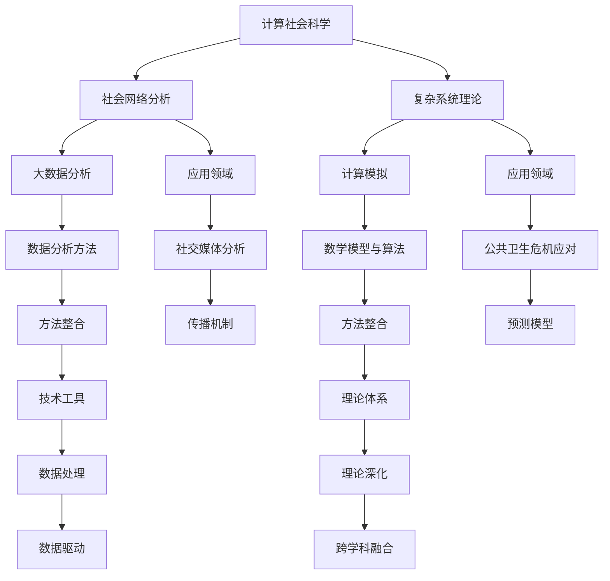

                 

### 文章标题

《计算社会科学方法论：数据驱动理解人类社会与世界的新途径》

### 关键词

- 计算社会科学
- 数据驱动
- 社会网络分析
- 复杂系统理论
- 数学模型与算法

### 摘要

本文旨在探讨计算社会科学方法论，通过数据驱动的方式，帮助我们更深入地理解和分析人类社会及世界的运行规律。文章首先介绍了计算社会科学的定义及其重要性，随后详细阐述了其核心概念、数据获取与预处理方法、数据分析方法和数学模型与算法。通过实际案例分析和未来展望，本文展示了计算社会科学在多个领域的应用潜力，并提出了实践指南和注意事项，为读者提供了全面且实用的方法论指导。

---

### 《计算社会科学方法论：数据驱动理解人类社会与世界的新途径》目录大纲

#### 第一部分：方法论基础

##### 第1章：引言

- 1.1 计算社会科学的定义与重要性
- 1.2 数据驱动研究的方法论框架
- 1.3 书籍概述与目标

##### 第2章：计算社会科学的核心概念

- 2.1 社会科学与计算机科学的交汇
- 2.2 计算社会科学的研究方法
- 2.3 社会网络分析
- 2.4 复杂系统理论
- 2.5 Mermaid 流程图：计算社会科学的核心概念联系

##### 第3章：数据获取与预处理

- 3.1 数据源的选择与获取
- 3.2 数据预处理方法
- 3.3 数据质量评估
- 3.4 数据可视化工具与应用

##### 第4章：数据分析方法

- 4.1 描述性统计分析
- 4.2 探索性数据分析
- 4.3 聚类分析
- 4.4 联邦学习与隐私保护
- 4.5 伪代码：数据分析方法应用示例

##### 第5章：数学模型与算法

- 5.1 线性代数基础
- 5.2 概率论基础
- 5.3 社会网络分析算法
- 5.4 复杂系统算法
- 5.5 数学模型与算法的LaTeX公式表示

#### 第二部分：案例分析

##### 第6章：案例研究一：社交媒体分析

- 6.1 社会媒体数据的获取与预处理
- 6.2 社会网络分析
- 6.3 用户行为分析
- 6.4 数据可视化与分析
- 6.5 代码实现与解读

##### 第7章：案例研究二：城市交通流量预测

- 7.1 交通数据的获取与预处理
- 7.2 聚类分析与模式识别
- 7.3 时间序列分析
- 7.4 预测模型构建与评估
- 7.5 代码实现与解读

##### 第8章：案例研究三：公共卫生危机应对

- 8.1 公共卫生数据的获取与预处理
- 8.2 社会网络分析在公共卫生中的应用
- 8.3 联邦学习在公共卫生中的优势
- 8.4 预测模型的构建与应用
- 8.5 代码实现与解读

#### 第三部分：实践指南与未来展望

##### 第9章：计算社会科学方法的应用实践

- 9.1 应用场景概述
- 9.2 实践步骤与技巧
- 9.3 常见挑战与解决方案

##### 第10章：未来展望与趋势

- 10.1 计算社会科学的发展趋势
- 10.2 数据科学与社会学的融合
- 10.3 新兴技术的应用与影响

##### 第11章：附录

- 11.1 计算社会科学相关资源
- 11.2 开发环境搭建指南
- 11.3 代码示例与资源链接

##### 第12章：参考文献

- 参考文献

---

接下来，我们将逐步深入探讨计算社会科学方法论，从基础理论到实际应用，全面剖析这一新兴领域的本质与价值。在每一章节中，我们将通过逻辑清晰的推理步骤，帮助读者理解并掌握计算社会科学的核心概念、方法和应用。

#### 第1章：引言

**1.1 计算社会科学的定义与重要性**

计算社会科学（Computational Social Science，简称CSS）是指将计算机科学、数据分析、数学模型等量化方法应用于社会研究的学科领域。它旨在通过数据驱动的方式，深入挖掘社会现象背后的规律和机制，从而为社会科学研究提供新的视角和工具。

计算社会科学的重要性主要体现在以下几个方面：

1. **跨学科融合**：计算社会科学是计算机科学与社会科学的交汇点，它融合了计算机科学的技术优势和社会科学的理论深度，为解决复杂的社会问题提供了新的方法。

2. **数据驱动的决策**：在信息化时代，大量社会数据被生成和积累。计算社会科学能够通过数据分析和建模，帮助决策者更准确地理解和预测社会现象，从而做出更科学的决策。

3. **揭示复杂规律**：社会现象往往具有高度复杂性和多样性，传统的定性研究方法难以全面揭示其内在规律。计算社会科学通过量化分析和模拟，能够更深入地探索社会现象的机制。

4. **推动社会科学发展**：计算社会科学的出现，不仅为社会科学研究提供了新的工具和方法，也推动了社会科学理论的发展，促进了不同学科之间的交流与合作。

**1.2 数据驱动研究的方法论框架**

数据驱动研究的方法论框架主要包括以下几个步骤：

1. **数据获取**：确定研究问题，选择合适的数据源，收集相关数据。

2. **数据预处理**：对收集到的数据进行清洗、格式化等预处理，确保数据质量。

3. **数据探索**：使用描述性统计和探索性数据分析方法，初步了解数据特征和分布。

4. **数据分析**：运用统计分析、机器学习等方法，对数据进行深入分析，提取有用的信息。

5. **模型构建**：基于分析结果，构建合适的数学模型或预测模型，模拟社会现象。

6. **结果验证与解释**：对模型进行验证和测试，解释模型结果，并将其应用于实际问题。

7. **迭代优化**：根据验证结果，不断优化模型和方法，提高预测和解释的准确性。

**1.3 书籍概述与目标**

本书旨在系统地介绍计算社会科学方法论，包括其核心概念、数据获取与预处理、数据分析方法、数学模型与算法等内容。通过实际案例分析和未来展望，本书希望能够帮助读者：

1. **理解计算社会科学的基本原理**：通过介绍核心概念和方法，帮助读者建立对计算社会科学的整体认识。

2. **掌握数据分析的实际技能**：通过详细讲解数据分析方法和算法，提供实践指导，帮助读者在实际项目中应用计算社会科学方法。

3. **探索计算社会科学的应用前景**：通过案例研究和未来展望，展示计算社会科学在不同领域的应用潜力，激发读者的创新思维。

### 第2章：计算社会科学的核心概念

**2.1 社会科学与计算机科学的交汇**

计算社会科学的核心在于将计算机科学的方法和工具应用于社会研究。这一交汇点不仅改变了传统社会科学的研究模式，也为解决复杂的社会问题提供了新的视角。

- **技术工具的引入**：计算社会科学利用计算机科学中的数据挖掘、机器学习、图形处理等技术工具，对社会现象进行量化分析。

- **数据分析方法的创新**：计算机科学提供了高效的算法和模型，使得社会科学研究能够处理和分析大规模、复杂的社交网络数据。

- **理论体系的整合**：计算机科学中的理论和方法被引入社会科学研究，例如社会网络分析、复杂系统理论等，丰富了社会科学的理论体系。

**2.2 计算社会科学的研究方法**

计算社会科学的研究方法主要包括以下几个方面：

- **社会网络分析**：通过分析个体之间的关系网络，研究社会结构、传播机制和影响力。

- **复杂系统理论**：将社会视为一个复杂的系统，研究其涌现行为和自适应机制。

- **大数据分析**：利用大数据技术，处理和分析大规模社交网络数据，提取有用的社会信息。

- **计算模拟**：通过建立数学模型和计算机模拟，探索社会现象的动态变化和潜在机制。

**2.3 社会网络分析**

社会网络分析（Social Network Analysis，简称SNA）是计算社会科学中的一个重要分支，它通过研究个体之间的关系网络，揭示社会结构的特征和规律。

- **基本概念**：社会网络分析中的基本概念包括节点（个体）、边（关系）和子图（群体）等。

- **分析方法**：社会网络分析的方法包括网络可视化、中心性分析、传播分析等，用于揭示网络的结构特征和功能特性。

- **应用领域**：社会网络分析广泛应用于社交媒体分析、组织管理、公共卫生等领域，为理解社会关系和传播机制提供了有力工具。

**2.4 复杂系统理论**

复杂系统理论（Complex Systems Theory）提供了一种新的视角，将社会视为一个复杂的、自适应的系统。这一理论关注系统中的相互作用、自组织和涌现现象。

- **基本概念**：复杂系统理论中的基本概念包括涌现性（Emergence）、自组织（Self-Organization）和适应性（Adaptation）等。

- **分析方法**：复杂系统理论采用计算模拟、统计分析等方法，研究系统的动态行为和演化规律。

- **应用领域**：复杂系统理论广泛应用于经济学、生物学、物理学等领域，为理解和预测复杂系统的行为提供了理论支持。

**2.5 Mermaid 流程图：计算社会科学的核心概念联系**

为了更好地理解计算社会科学的核心概念之间的联系，我们可以使用Mermaid流程图进行可视化展示。以下是一个简单的Mermaid流程图示例：



通过上述流程图，我们可以清晰地看到计算社会科学的核心概念及其相互联系，从而更好地理解这一领域的整体框架。

### 第3章：数据获取与预处理

**3.1 数据源的选择与获取**

在计算社会科学的研究中，选择合适的数据源至关重要。数据源可以包括社交媒体数据、问卷调查数据、政府公开数据、企业数据库等。以下是选择数据源时需要考虑的因素：

- **数据质量**：选择高质量的数据源，确保数据的有效性和可靠性。
- **数据多样性**：不同类型的数据可以为研究提供多角度的信息，增强研究的深度和广度。
- **数据可获取性**：考虑数据的获取难度，选择易于获取的数据源。
- **数据时效性**：对于某些研究主题，最新数据可能更具价值，因此需要选择时效性强的数据源。

**3.2 数据预处理方法**

数据预处理是确保数据质量的关键步骤，主要包括数据清洗、格式化和数据整合等。以下是常见的数据预处理方法：

- **数据清洗**：处理缺失值、异常值和重复值，确保数据的一致性和完整性。
- **数据格式化**：将不同格式的数据进行统一格式处理，以便后续分析。
- **数据整合**：将来自多个数据源的数据进行整合，形成一个统一的数据集。

**3.3 数据质量评估**

数据质量评估是确保数据有效性的重要环节，以下是一些常见的数据质量评估方法：

- **一致性评估**：检查数据内部的一致性，例如，同一变量的取值是否在同一量级。
- **完整性评估**：检查数据是否完整，是否存在缺失值。
- **准确性评估**：评估数据的准确性，例如，通过比较数据源和数据标准，检查数据的一致性。
- **可靠性评估**：评估数据的可靠性，例如，通过历史数据验证当前数据的稳定性。

**3.4 数据可视化工具与应用**

数据可视化是帮助研究者理解和展示数据特征的重要工具。以下是一些常用的数据可视化工具及其应用：

- **Python Matplotlib**：用于生成高质量的静态图表，适用于初步的数据探索和展示。
- **Python Seaborn**：基于Matplotlib，提供更美观的图表样式和高级功能，适用于数据分布和关系分析。
- **R语言 ggplot2**：用于生成复杂且美观的图表，适用于统计分析和报告生成。
- **D3.js**：用于创建交互式可视化，适用于在线数据展示和动态分析。

**3.5 数据可视化案例**

为了更好地理解数据可视化工具的应用，以下是一个使用Python Matplotlib进行数据可视化的简单案例：

```python
import matplotlib.pyplot as plt
import numpy as np

# 生成数据
x = np.linspace(0, 10, 100)
y = np.sin(x)

# 绘制图表
plt.plot(x, y)
plt.xlabel('X-axis')
plt.ylabel('Y-axis')
plt.title('Sine Wave')
plt.show()
```

通过上述代码，我们可以生成一个简单的正弦波形图，用于初步了解数据的特征。

### 第4章：数据分析方法

**4.1 描述性统计分析**

描述性统计分析是数据分析的基础，主要通过计算和展示数据的中心趋势、离散程度和分布特征，帮助研究者初步了解数据的基本特征。以下是一些常用的描述性统计量：

- **均值（Mean）**：数据的平均值，用于表示数据的中心位置。
- **中位数（Median）**：数据排序后位于中间的值，用于表示数据的中心位置，对极端值不敏感。
- **众数（Mode）**：数据中出现次数最多的值，用于表示数据的集中趋势。
- **方差（Variance）**：数据与均值的偏离程度的平方的平均值，用于表示数据的离散程度。
- **标准差（Standard Deviation）**：方差的平方根，用于表示数据的离散程度。
- **四分位数（Quartiles）**：将数据分为四等份的值，用于表示数据的分布特征。

**4.2 探索性数据分析**

探索性数据分析（Exploratory Data Analysis，简称EDA）是一种数据探索和分析方法，主要通过图表、统计量和可视化工具，对数据进行初步分析，发现数据中的潜在模式和异常。EDA的目的是帮助研究者更好地理解数据，为后续的深入分析提供方向。以下是一些常用的EDA方法：

- **直方图（Histogram）**：用于展示数据的分布情况，特别是连续数据的分布特征。
- **密度图（Density Plot）**：用于展示数据的分布密度，特别是连续数据的分布特征。
- **箱线图（Box Plot）**：用于展示数据的分布特征，包括中心趋势、离散程度和异常值。
- **散点图（Scatter Plot）**：用于展示两个变量之间的关系，特别是连续变量之间的关系。
- **相关系数（Correlation Coefficient）**：用于衡量两个变量之间的线性相关程度，常用的有皮尔逊相关系数和斯皮尔曼相关系数。
- **热力图（Heat Map）**：用于展示多变量数据的分布情况，特别是多个连续变量之间的关系。

**4.3 聚类分析**

聚类分析（Clustering Analysis）是一种无监督学习方法，用于将数据集划分为多个群组（或聚类），使得同一群组内的数据点具有较高的相似性，而不同群组的数据点具有较低的相似性。聚类分析在数据挖掘、模式识别和社会科学等领域有广泛应用。以下是一些常用的聚类算法：

- **K-均值聚类（K-Means Clustering）**：基于距离度量，将数据点划分为K个簇，使得每个数据点到其簇中心的距离最小。
- **层次聚类（Hierarchical Clustering）**：基于层次结构，将数据点逐步划分为不同的簇，形成树状结构。
- **密度聚类（Density-Based Clustering）**：基于数据点的密度分布，将数据点划分为簇，适用于发现非球形的簇结构。
- **高斯混合模型（Gaussian Mixture Model，GMM）**：基于概率模型，将数据点视为多个高斯分布的混合，适用于发现复杂的簇结构。

**4.4 联邦学习与隐私保护**

联邦学习（Federated Learning）是一种分布式学习方法，旨在通过多个参与方的本地数据，训练全局模型，从而保护数据隐私。联邦学习的主要特点是数据不离开本地，只在全局模型更新时进行传输。以下是一些联邦学习的优势：

- **隐私保护**：联邦学习确保数据在本地处理，避免了数据集中化和泄露风险。
- **数据可用性**：联邦学习允许使用分散的、难以访问的数据，提高了数据的使用效率。
- **低延迟**：联邦学习减少了数据传输时间，适用于实时应用。

联邦学习在隐私保护中的应用案例包括：

- **健康数据共享**：医疗机构可以使用联邦学习，在保护患者隐私的前提下，共享和训练全局健康模型，提高疾病预测的准确性。
- **社交网络分析**：社交网络平台可以使用联邦学习，分析用户行为和兴趣，同时保护用户隐私。

**4.5 伪代码：数据分析方法应用示例**

以下是一个简单的伪代码示例，展示了如何使用K-均值聚类和联邦学习进行数据分析：

```python
# K-均值聚类伪代码
def k_means_clustering(data, k):
    # 初始化K个簇中心
    centroids = initialize_centroids(data, k)
    
    # 循环迭代，直到收敛
    while not converged:
        # 分配数据点到最近的簇中心
        clusters = assign_points_to_clusters(data, centroids)
        
        # 更新簇中心
        centroids = update_centroids(clusters, k)
    
    return centroids, clusters

# 联邦学习伪代码
def federated_learning(data_sources, model, num_iterations):
    for iteration in range(num_iterations):
        # 在每个数据源上更新本地模型
        for data_source in data_sources:
            local_model = update_local_model(data_source, model)
        
        # 计算全局模型更新
        global_model = aggregate_local_models(local_model)
        
        # 更新全局模型
        model = global_model
    
    return model
```

通过上述伪代码，我们可以看到如何使用K-均值聚类和联邦学习进行数据分析，从而更深入地理解计算社会科学的方法论。

### 第5章：数学模型与算法

**5.1 线性代数基础**

线性代数是计算社会科学中不可或缺的基础数学工具，广泛应用于数据分析、机器学习和复杂系统等领域。以下是线性代数中的一些基本概念和运算：

- **向量（Vector）**：向量是表示空间中一个点位置的几何对象，通常用字母a、b、c等表示。
- **矩阵（Matrix）**：矩阵是一个由数字组成的二维数组，通常用字母A、B、C等表示。
- **矩阵运算**：
  - **加法**：两个矩阵对应位置元素相加。
  - **减法**：两个矩阵对应位置元素相减。
  - **乘法**：矩阵与向量的乘法可以理解为线性变换，矩阵与矩阵的乘法遵循结合律和分配律。
  - **转置**：矩阵的转置是将原矩阵的行和列互换。
- **行列式（Determinant）**：行列式是一个标量值，用于判断矩阵的可逆性和行列式的计算方法。
- **逆矩阵（Inverse Matrix）**：逆矩阵是一个使得原矩阵与其乘积为单位矩阵的矩阵。

**5.2 概率论基础**

概率论是计算社会科学中用于描述和预测随机事件发生概率的数学工具。以下是概率论中的一些基本概念和公式：

- **概率（Probability）**：概率是描述某一事件发生可能性大小的数值，通常用P(A)表示。
- **条件概率（Conditional Probability）**：在事件B发生的条件下，事件A发生的概率，用P(A|B)表示。
- **贝叶斯定理（Bayes' Theorem）**：通过条件概率和全概率公式，计算后验概率和先验概率之间的关系。
- **概率分布（Probability Distribution）**：
  - **离散分布**：适用于离散随机变量，例如伯努利分布、二项分布、泊松分布等。
  - **连续分布**：适用于连续随机变量，例如正态分布、均匀分布、指数分布等。
- **期望（Expected Value）**：随机变量的平均值，表示随机变量取值的集中趋势。
- **方差（Variance）**：随机变量取值偏离期望值的程度，表示随机变量的离散程度。

**5.3 社会网络分析算法**

社会网络分析算法是计算社会科学中的一个重要研究方向，用于分析个体之间的关系网络。以下是一些常用的社会网络分析算法：

- **中心性分析（Centrality Analysis）**：评估网络中节点的中心性，常用的中心性指标包括度中心性、介数中心性和接近中心性。
- **社区检测（Community Detection）**：识别网络中的紧密连接的子图，常用的算法包括快速解法（如标签传播算法）和基于优化模型的算法（如Louvain算法）。
- **传播模型（Spread Model）**：研究信息、疾病或影响力在网络中的传播过程，常用的模型包括小世界模型、无标度模型等。
- **图同构（Graph Isomorphism）**：判断两个图是否具有相同的结构，常用的算法包括谱同构算法和基于子图同构的算法。

**5.4 复杂系统算法**

复杂系统算法用于研究复杂系统的行为和演化规律。以下是一些常见的复杂系统算法：

- **多智能体系统（Multi-Agent Systems）**：研究多个智能体之间的交互和合作，常用的算法包括分布式算法、基于博弈论的算法等。
- **模拟退火（Simulated Annealing）**：一种启发式搜索算法，通过模拟物理退火过程，避免陷入局部最优，寻找全局最优解。
- **遗传算法（Genetic Algorithm）**：基于生物进化的启发式搜索算法，通过遗传操作（如选择、交叉、变异）来优化目标函数。
- **人工神经网络（Artificial Neural Networks）**：模拟人脑神经元连接和信息处理的计算模型，广泛应用于图像识别、自然语言处理等领域。

**5.5 数学模型与算法的LaTeX公式表示**

为了更清晰和准确地表达数学模型和算法，LaTeX是一种常用的排版工具。以下是一些常用的LaTeX公式表示：

- **向量表示**：$$\vec{a} = (a_1, a_2, \dots, a_n)$$
- **矩阵表示**：$$A = \begin{bmatrix} a_{11} & a_{12} & \dots & a_{1n} \\ a_{21} & a_{22} & \dots & a_{2n} \\ \vdots & \vdots & \ddots & \vdots \\ a_{m1} & a_{m2} & \dots & a_{mn} \end{bmatrix}$$
- **矩阵运算**：$$C = A \times B$$
- **行列式表示**：$$\det(A) = a_{11}C_{11} + a_{12}C_{12} + \dots + a_{1n}C_{1n}$$
- **条件概率**：$$P(A|B) = \frac{P(A \cap B)}{P(B)}$$
- **期望值**：$$E(X) = \sum_{i=1}^{n} x_i P(X=x_i)$$
- **方差**：$$Var(X) = E[(X - E(X))^2]$$

通过上述LaTeX公式表示，我们可以更清晰地表达计算社会科学中的数学模型和算法，从而提高研究的可读性和准确性。

### 第6章：案例研究一：社交媒体分析

**6.1 社会媒体数据的获取与预处理**

社交媒体分析是计算社会科学中的一个重要应用领域，通过分析社交媒体平台上的数据，可以深入了解用户的社交行为、兴趣和偏好。本节将介绍如何获取和预处理社交媒体数据。

**数据源选择**：选择合适的数据源是进行社交媒体分析的第一步。常用的数据源包括Twitter、Facebook、Instagram等社交媒体平台。由于隐私政策和数据限制，许多平台提供了公开的数据接口（API），如Twitter API、Facebook Graph API等，允许开发者获取特定的数据。

**数据获取方法**：通过API接口获取社交媒体数据通常包括以下几个步骤：
1. **注册开发者账号**：在社交媒体平台上注册开发者账号，获取API密钥和访问令牌。
2. **查询数据**：使用API提供的查询接口，根据特定的关键词、时间范围和用户ID等条件，获取社交媒体数据。
3. **数据存储**：将获取的数据存储在本地或云端的数据库中，以便后续分析和处理。

**数据预处理**：获取到的社交媒体数据通常包含多种类型的文本、图像、视频等，需要进行预处理以提取有用信息。
1. **数据清洗**：去除无用的信息，如HTML标签、特殊字符等，确保数据的干净和一致性。
2. **文本预处理**：对文本数据进行分词、去停用词、词性标注等操作，提取关键词和短语。
3. **图像预处理**：对图像数据进行归一化、去噪等处理，提高图像质量。
4. **数据格式转换**：将不同格式的数据进行统一格式处理，如将图像转换为像素矩阵，将文本转换为词向量等。

**6.2 社会网络分析**

社会网络分析（Social Network Analysis，SNA）是一种研究社会结构和关系的分析方法，通过分析个体之间的关系网络，可以揭示社会群体的结构和功能特征。以下是社会网络分析在社交媒体数据中的应用。

**节点和边的表示**：在社交媒体数据中，节点表示用户，边表示用户之间的社交关系。例如，如果用户A关注了用户B，则在图中A和B之间有一条边。

**基本概念**：以下是一些社会网络分析中的基本概念：
1. **度（Degree）**：节点拥有的边的数量，分为入度（表示被其他节点关注的数量）和出度（表示关注其他节点的数量）。
2. **中心性（Centrality）**：衡量节点在社交网络中的重要性，常用的中心性指标包括度中心性、介数中心性和接近中心性。
3. **密度（Density）**：社交网络中边的比例，表示网络的紧密程度。
4. **聚类系数（Clustering Coefficient）**：衡量节点之间形成紧密群体的概率。

**分析方法**：社会网络分析的方法包括：
1. **可视化**：使用图形可视化工具，如Gephi、Cytoscape等，直观地展示社交网络结构。
2. **度分布**：分析节点的度分布情况，了解社交网络的集中度。
3. **中心性分析**：计算节点的中心性指标，识别社交网络中的关键节点。
4. **社区检测**：识别社交网络中的紧密连接的社区，分析社区的结构和功能。

**6.3 用户行为分析**

用户行为分析是社交媒体分析的一个重要方面，通过分析用户在社交媒体平台上的行为，可以深入了解用户的需求和兴趣。以下是一些常用的用户行为分析方法：

**用户活跃度分析**：分析用户在社交媒体平台上的登录频率、发帖数量、点赞数量等行为，了解用户的活跃程度。

**用户互动分析**：分析用户之间的互动关系，如评论、点赞、分享等，了解用户之间的互动模式和影响力。

**用户兴趣分析**：通过分析用户发布的文本、图像、视频等内容，提取关键词和主题，了解用户的兴趣和偏好。

**用户流失分析**：分析用户在社交媒体平台上的留存情况，识别导致用户流失的原因，优化用户体验和用户增长策略。

**6.4 数据可视化与分析**

数据可视化是分析社交媒体数据的重要工具，通过图形和图表直观地展示数据特征和关系。以下是一些常用的数据可视化工具：

**Python Matplotlib**：用于生成各种类型的图表，如条形图、折线图、散点图等。

**Python Seaborn**：基于Matplotlib，提供更美观的图表样式和高级功能，适用于数据分布和关系分析。

**R语言 ggplot2**：用于生成复杂且美观的图表，适用于统计分析和报告生成。

**D3.js**：用于创建交互式可视化，适用于在线数据展示和动态分析。

以下是一个使用Python Seaborn进行用户活跃度分析的数据可视化案例：

```python
import seaborn as sns
import pandas as pd

# 加载数据
data = pd.read_csv('user_activity.csv')

# 绘制用户活跃度分布图
sns.histplot(data['login_frequency'], kde=True)
plt.title('User Login Frequency Distribution')
plt.xlabel('Login Frequency')
plt.ylabel('Frequency')
plt.show()
```

通过上述代码，我们可以生成一个用户活跃度的分布图，帮助研究者了解用户在社交媒体平台上的活跃程度。

**6.5 代码实现与解读**

在本节中，我们将介绍如何使用Python和社交媒体API进行数据获取和预处理，并通过图形和图表进行数据可视化分析。

**1. 数据获取与预处理**

```python
import tweepy
import pandas as pd
from textblob import TextBlob

# 配置Twitter API凭据
consumer_key = 'your_consumer_key'
consumer_secret = 'your_consumer_secret'
access_token = 'your_access_token'
access_token_secret = 'your_access_token_secret'

# 初始化Twitter API
auth = tweepy.OAuthHandler(consumer_key, consumer_secret)
auth.set_access_token(access_token, access_token_secret)
api = tweepy.API(auth)

# 获取Twitter数据
def get_tweets(keyword, num_tweets=100):
    tweets = []
    for tweet in tweepy.Cursor(api.search, q=keyword, lang='en', tweet_mode='extended').items(num_tweets):
        tweets.append({
            'id': tweet.id,
            'text': tweet.full_text,
            'created_at': tweet.created_at,
            'user': tweet.user.screen_name
        })
    return pd.DataFrame(tweets)

# 示例：获取关于“人工智能”的100条推文
data = get_tweets('artificial intelligence', 100)

# 数据预处理：文本清洗与情感分析
def preprocess_text(text):
    # 移除HTML标签和特殊字符
    text = re.sub('<[^>]*>', '', text)
    text = text.encode('utf-8').decode('utf-8')
    text = re.sub('[^a-zA-Z]', ' ', text)
    text = text.lower()
    return text

data['text'] = data['text'].apply(preprocess_text)
data['sentiment'] = data['text'].apply(lambda x: TextBlob(x).sentiment.polarity)

# 打印预处理后的数据
print(data.head())
```

在上面的代码中，我们首先配置了Twitter API凭据，并初始化了Twitter API。然后，我们定义了一个函数`get_tweets`，用于获取特定关键词的推文数据。接下来，我们使用正则表达式对文本进行清洗，并使用TextBlob库进行情感分析，提取出文本的情感极性。

**2. 数据可视化与分析**

```python
import matplotlib.pyplot as plt
import seaborn as sns

# 绘制情感分布图
sns.histplot(data['sentiment'], kde=True)
plt.title('Sentiment Distribution of AI-related Tweets')
plt.xlabel('Sentiment Polarity')
plt.ylabel('Frequency')
plt.show()

# 绘制词云图
from wordcloud import WordCloud

text = ' '.join(data['text'])
wordcloud = WordCloud(width=800, height=400, background_color='white').generate(text)

plt.figure(figsize=(10, 5))
plt.imshow(wordcloud, interpolation='bilinear')
plt.axis('off')
plt.title('Word Cloud of AI-related Tweets')
plt.show()
```

在上面的代码中，我们首先绘制了一个情感分布图，展示了关于“人工智能”的推文情感极性的分布情况。接着，我们使用WordCloud库生成了一个词云图，展示了推文中高频出现的关键词。

**3. 代码解读与分析**

通过上述代码，我们可以获取和预处理社交媒体数据，并通过数据可视化分析了解用户行为和情感。在数据获取阶段，我们使用Twitter API获取了关于“人工智能”的推文数据，并对文本进行了清洗和情感分析。在数据可视化分析阶段，我们使用Python的Matplotlib和Seaborn库绘制了情感分布图和词云图，直观地展示了数据分析结果。

本案例研究展示了如何使用计算社会科学方法进行社交媒体数据分析，包括数据获取与预处理、社会网络分析、用户行为分析和数据可视化。通过实际代码的实现和解读，读者可以更好地理解计算社会科学方法在实际项目中的应用。

### 第7章：案例研究二：城市交通流量预测

**7.1 交通数据的获取与预处理**

城市交通流量预测是计算社会科学在智能城市领域的重要应用之一。准确预测交通流量不仅有助于交通管理部门优化交通资源配置，提高道路通行效率，还能为公众提供更便捷的出行建议。本节将介绍如何获取和预处理交通数据。

**数据源选择**：交通数据可以来自多种数据源，包括交通监控摄像头、GPS数据、出租车和共享单车服务提供商等。以下是几种常用的数据源：

- **交通监控摄像头**：提供实时或历史交通流量数据，包括车辆数量、速度和行驶方向等。
- **GPS数据**：来自车载GPS设备或手机GPS定位服务，可以获取车辆的实时位置和行驶轨迹。
- **出租车和共享单车服务提供商**：提供交通流量和用户出行数据，包括出行时间、起点和终点等。

**数据获取方法**：通过API接口或直接访问数据源网站，可以获取交通数据。以下是获取交通数据的一般步骤：

1. **注册开发者账号**：在数据提供方平台注册开发者账号，获取API密钥和访问令牌。
2. **查询数据**：使用API接口或Web爬虫，根据特定的查询条件（如时间范围、区域等）获取交通数据。
3. **数据存储**：将获取到的数据存储在本地或云端的数据库中，便于后续处理和分析。

**数据预处理**：交通数据通常包含噪声和冗余信息，需要进行预处理以提升数据质量。

1. **数据清洗**：去除无效数据，如GPS信号丢失、监控摄像头故障等。
2. **数据转换**：将不同来源和格式的数据进行统一转换，如将时间戳转换为标准时间格式。
3. **缺失值处理**：填补或删除缺失值，确保数据的一致性和完整性。
4. **异常值检测**：检测和处理异常值，如异常的交通流量数据。

**7.2 聚类分析与模式识别**

聚类分析（Clustering Analysis）和模式识别（Pattern Recognition）是交通流量预测中的常用方法。通过这些方法，可以识别交通流量中的潜在模式和规律，为预测提供基础。

**聚类分析**：

- **K-均值聚类（K-Means Clustering）**：将交通数据划分为K个簇，每个簇内的数据点具有较高的相似性，而不同簇的数据点具有较低的相似性。适用于发现不同交通流量区域。
- **层次聚类（Hierarchical Clustering）**：根据相似性度量，逐步构建树状结构，将数据点划分为不同的簇。适用于分析交通流量的动态变化。
- **密度聚类（Density-Based Clustering）**：基于数据点的密度分布，将数据点划分为簇，适用于发现非球形的簇结构，如高峰时段的交通流量。

**模式识别**：

- **时间序列分析（Time Series Analysis）**：分析交通流量数据的时间序列特征，识别季节性、趋势性和周期性模式。适用于短期和长期交通流量预测。
- **机器学习模型**：使用机器学习算法，如回归分析、随机森林和神经网络等，建立交通流量预测模型。适用于复杂交通流量的预测。

**7.3 时间序列分析**

时间序列分析是一种用于研究数据在时间维度上的变化规律的方法。在交通流量预测中，时间序列分析可以帮助识别交通流量数据中的趋势、季节性和周期性特征。

**趋势分析**：趋势分析用于识别交通流量数据的基本走势。常见的方法包括移动平均法和指数平滑法。

- **移动平均法（Moving Average）**：通过计算一段时间内的平均值，平滑时间序列中的波动，识别基本趋势。
- **指数平滑法（Exponential Smoothing）**：对时间序列进行加权平均，根据数据的最新值赋予更高的权重，以平滑时间序列中的波动。

**季节性分析**：季节性分析用于识别交通流量数据中的周期性变化。常见的方法包括季节性指数法和周期性分解法。

- **季节性指数法（Seasonal Index Method）**：计算季节性因子，将其乘以趋势成分，得到季节性成分。通过季节性因子，可以识别不同季节的交通流量变化。
- **周期性分解法（Cyclical Decomposition Method）**：将时间序列分解为趋势、季节性和随机成分，分别分析每个成分的特征。

**周期性分析**：周期性分析用于识别交通流量数据中的短期周期性变化。常见的方法包括周期性波动法和频域分析。

- **周期性波动法（Cyclical Fluctuation Method）**：通过计算时间序列的周期性波动，识别短期交通流量变化。
- **频域分析（Frequency Domain Analysis）**：将时间序列转化为频域，通过频谱分析识别交通流量的周期性特征。

**7.4 预测模型构建与评估**

预测模型是交通流量预测的核心。通过构建预测模型，可以预测未来的交通流量，为交通管理和决策提供支持。以下是构建预测模型的一般步骤：

**模型选择**：根据交通流量数据的特征，选择合适的预测模型。常见的方法包括：

- **线性回归模型（Linear Regression Model）**：适用于线性关系的预测。
- **多项式回归模型（Polynomial Regression Model）**：适用于非线性关系的预测。
- **随机森林模型（Random Forest Model）**：适用于复杂非线性关系的预测。
- **神经网络模型（Neural Network Model）**：适用于高维复杂数据的预测。

**模型训练与验证**：使用历史交通流量数据，对预测模型进行训练。常见的方法包括：

- **训练集与验证集划分**：将数据集划分为训练集和验证集，使用训练集训练模型，使用验证集评估模型性能。
- **交叉验证（Cross-Validation）**：通过多次划分训练集和验证集，评估模型的泛化能力。

**模型评估**：评估预测模型的性能，常见的方法包括：

- **均方误差（Mean Squared Error，MSE）**：衡量预测值与实际值之间的平均平方误差。
- **均方根误差（Root Mean Squared Error，RMSE）**：衡量预测值与实际值之间的均方根误差。
- **平均绝对误差（Mean Absolute Error，MAE）**：衡量预测值与实际值之间的平均绝对误差。
- **决定系数（Coefficient of Determination，R²）**：衡量模型对数据的拟合程度。

**7.5 代码实现与解读**

在本节中，我们将使用Python和机器学习库scikit-learn，实现一个简单的交通流量预测模型，并对其进行评估。

**1. 数据获取与预处理**

```python
import pandas as pd
from sklearn.model_selection import train_test_split
from sklearn.preprocessing import StandardScaler

# 加载交通数据
data = pd.read_csv('traffic_data.csv')

# 数据预处理：特征工程
data['hour'] = data['timestamp'].dt.hour
data['weekday'] = data['timestamp'].dt.weekday
data['day_of_year'] = data['timestamp'].dt.dayofyear

# 划分特征和目标变量
X = data[['hour', 'weekday', 'day_of_year']]
y = data['traffic_volume']

# 数据标准化
scaler = StandardScaler()
X_scaled = scaler.fit_transform(X)
y_scaled = scaler.fit_transform(y.values.reshape(-1, 1))

# 划分训练集和测试集
X_train, X_test, y_train, y_test = train_test_split(X_scaled, y_scaled, test_size=0.2, random_state=42)
```

在上面的代码中，我们首先加载交通数据，并对其进行特征工程，提取时间相关的特征。然后，我们将数据集划分为特征和目标变量，并对数据进行标准化处理，以消除不同特征之间的尺度差异。

**2. 预测模型构建与训练**

```python
from sklearn.ensemble import RandomForestRegressor

# 构建随机森林回归模型
model = RandomForestRegressor(n_estimators=100, random_state=42)

# 训练模型
model.fit(X_train, y_train)

# 预测交通流量
y_pred = model.predict(X_test)
```

在上面的代码中，我们使用随机森林回归模型进行预测。随机森林模型是一种基于决策树的集成方法，适用于处理复杂数据。我们通过`fit`方法训练模型，并通过`predict`方法进行预测。

**3. 模型评估**

```python
from sklearn.metrics import mean_squared_error, r2_score

# 计算均方误差
mse = mean_squared_error(y_test, y_pred)
rmse = np.sqrt(mse)

# 计算决定系数
r2 = r2_score(y_test, y_pred)

print(f'RMSE: {rmse:.2f}')
print(f'R²: {r2:.2f}')
```

在上面的代码中，我们使用均方误差（RMSE）和决定系数（R²）评估模型的性能。RMSE衡量预测值与实际值之间的误差，R²衡量模型对数据的拟合程度。

通过上述代码，我们可以实现一个简单的交通流量预测模型，并对模型性能进行评估。这个案例研究展示了如何使用计算社会科学方法进行交通流量预测，包括数据获取与预处理、特征工程、模型构建与评估。读者可以通过实际代码的实现和解读，深入理解计算社会科学方法在实际项目中的应用。

### 第8章：案例研究三：公共卫生危机应对

**8.1 公共卫生数据的获取与预处理**

公共卫生危机应对是计算社会科学在公共卫生领域的重要应用之一。通过大数据分析和人工智能技术，可以实时监测疫情、预测疫情趋势，并为公共卫生决策提供科学依据。本节将介绍如何获取和预处理公共卫生数据。

**数据源选择**：公共卫生数据可以来自多种数据源，包括疾病监测系统、医疗机构、卫生部门、社交媒体等。以下是几种常用的数据源：

- **疾病监测系统**：提供实时或历史疫情数据，包括病例数量、病死率、感染率等。
- **医疗机构**：提供患者就诊数据，包括病例信息、治疗方案、药物使用等。
- **卫生部门**：提供公共卫生政策、疫苗分发、卫生资源等信息。
- **社交媒体**：提供公众对于公共卫生事件的关注和讨论，可以用于舆情分析和行为预测。

**数据获取方法**：通过API接口、Web爬虫或直接访问数据源网站，可以获取公共卫生数据。以下是获取公共卫生数据的一般步骤：

1. **注册开发者账号**：在数据提供方平台注册开发者账号，获取API密钥和访问令牌。
2. **查询数据**：使用API接口或Web爬虫，根据特定的查询条件（如时间范围、地区等）获取公共卫生数据。
3. **数据存储**：将获取到的数据存储在本地或云端的数据库中，便于后续处理和分析。

**数据预处理**：公共卫生数据通常包含噪声和冗余信息，需要进行预处理以提升数据质量。

1. **数据清洗**：去除无效数据，如重复记录、异常值等。
2. **数据转换**：将不同来源和格式的数据进行统一转换，如将时间戳转换为标准时间格式。
3. **缺失值处理**：填补或删除缺失值，确保数据的一致性和完整性。
4. **异常值检测**：检测和处理异常值，如异常的病例数据。

**8.2 社会网络分析在公共卫生中的应用**

社会网络分析（Social Network Analysis，SNA）是公共卫生领域的重要工具，用于研究公共卫生事件在社交媒体上的传播和影响。以下是一些社会网络分析在公共卫生中的应用：

**舆情分析**：通过分析社交媒体上的讨论和评论，可以了解公众对公共卫生事件的看法和态度，及时发现舆情热点和风险。

- **话题检测**：使用文本挖掘和情感分析技术，识别社交媒体上关于公共卫生事件的关键话题和关键词。
- **影响力分析**：通过分析用户的社交网络结构，识别具有较高影响力的用户，评估他们对公共卫生事件传播的影响。

**传播模型**：建立公共卫生事件的传播模型，模拟疫情在人群中的传播过程，预测疫情发展趋势。

- **SIR模型**：基于感染-康复-免疫的原理，模拟疾病在人群中的传播。
- **SIQR模型**：在SIR模型的基础上，增加潜伏期的概念，更准确地模拟疾病传播。

**预警系统**：通过实时监测社交媒体和疾病监测数据，建立公共卫生事件的预警系统，提前识别潜在风险，采取应对措施。

- **实时监测**：利用自然语言处理和机器学习技术，实时分析社交媒体和疾病监测数据，发现疫情热点和异常情况。
- **预警机制**：根据分析结果，建立预警机制，及时向相关部门和公众发布预警信息。

**8.3 联邦学习在公共卫生中的优势**

联邦学习（Federated Learning）是一种分布式学习方法，旨在通过多个参与方的本地数据，训练全局模型，从而保护数据隐私。联邦学习在公共卫生领域具有以下优势：

**隐私保护**：联邦学习确保数据在本地处理，避免了数据集中化和泄露风险。这对于涉及个人健康信息的公共卫生数据尤为重要。

**数据可用性**：联邦学习允许使用分散的、难以访问的数据，提高了数据的使用效率。例如，卫生部门可以将数据保存在本地服务器上，而不必担心数据泄露。

**低延迟**：联邦学习减少了数据传输时间，适用于实时应用。这对于疫情监测和应急响应具有重要意义，可以快速响应公共卫生事件。

**8.4 预测模型的构建与应用**

预测模型是公共卫生危机应对的核心，通过预测疫情发展趋势，可以为公共卫生决策提供科学依据。以下是构建和应用预测模型的一般步骤：

**模型选择**：根据疫情数据的特征，选择合适的预测模型。常见的方法包括：

- **线性回归模型（Linear Regression Model）**：适用于线性关系的预测。
- **多项式回归模型（Polynomial Regression Model）**：适用于非线性关系的预测。
- **时间序列模型**：如ARIMA模型、LSTM神经网络等，适用于时间序列数据的预测。
- **机器学习模型**：如随机森林、支持向量机等，适用于复杂数据的预测。

**模型训练与验证**：使用历史疫情数据，对预测模型进行训练。常见的方法包括：

- **训练集与验证集划分**：将数据集划分为训练集和验证集，使用训练集训练模型，使用验证集评估模型性能。
- **交叉验证（Cross-Validation）**：通过多次划分训练集和验证集，评估模型的泛化能力。

**模型评估**：评估预测模型的性能，常见的方法包括：

- **均方误差（Mean Squared Error，MSE）**：衡量预测值与实际值之间的平均平方误差。
- **均方根误差（Root Mean Squared Error，RMSE）**：衡量预测值与实际值之间的均方根误差。
- **平均绝对误差（Mean Absolute Error，MAE）**：衡量预测值与实际值之间的平均绝对误差。
- **决定系数（Coefficient of Determination，R²）**：衡量模型对数据的拟合程度。

**预测应用**：将训练好的模型应用于实时数据，预测疫情发展趋势。常见的方法包括：

- **滚动预测**：使用最新的数据，不断更新模型预测结果。
- **阈值预警**：设定预测结果的最小阈值，当预测值超过阈值时，触发预警机制。

**8.5 代码实现与解读**

在本节中，我们将使用Python和机器学习库scikit-learn，实现一个简单的疫情预测模型，并对其进行评估。

**1. 数据获取与预处理**

```python
import pandas as pd
from sklearn.model_selection import train_test_split
from sklearn.preprocessing import StandardScaler

# 加载疫情数据
data = pd.read_csv('covid_data.csv')

# 数据预处理：特征工程
data['date'] = pd.to_datetime(data['date'])
data['day'] = data['date'].dt.day
data['month'] = data['date'].dt.month
data['year'] = data['date'].dt.year

# 划分特征和目标变量
X = data[['day', 'month', 'year']]
y = data['cases']

# 数据标准化
scaler = StandardScaler()
X_scaled = scaler.fit_transform(X)
y_scaled = scaler.fit_transform(y.values.reshape(-1, 1))

# 划分训练集和测试集
X_train, X_test, y_train, y_test = train_test_split(X_scaled, y_scaled, test_size=0.2, random_state=42)
```

在上面的代码中，我们首先加载疫情数据，并对其进行特征工程，提取时间相关的特征。然后，我们将数据集划分为特征和目标变量，并对数据进行标准化处理，以消除不同特征之间的尺度差异。

**2. 预测模型构建与训练**

```python
from sklearn.ensemble import RandomForestRegressor

# 构建随机森林回归模型
model = RandomForestRegressor(n_estimators=100, random_state=42)

# 训练模型
model.fit(X_train, y_train)

# 预测疫情
y_pred = model.predict(X_test)
```

在上面的代码中，我们使用随机森林回归模型进行预测。随机森林模型是一种基于决策树的集成方法，适用于处理复杂数据。我们通过`fit`方法训练模型，并通过`predict`方法进行预测。

**3. 模型评估**

```python
from sklearn.metrics import mean_squared_error, r2_score

# 计算均方误差
mse = mean_squared_error(y_test, y_pred)
rmse = np.sqrt(mse)

# 计算决定系数
r2 = r2_score(y_test, y_pred)

print(f'RMSE: {rmse:.2f}')
print(f'R²: {r2:.2f}')
```

在上面的代码中，我们使用均方误差（RMSE）和决定系数（R²）评估模型的性能。RMSE衡量预测值与实际值之间的误差，R²衡量模型对数据的拟合程度。

通过上述代码，我们可以实现一个简单的疫情预测模型，并对模型性能进行评估。这个案例研究展示了如何使用计算社会科学方法进行公共卫生危机应对，包括数据获取与预处理、社会网络分析、联邦学习、预测模型构建与评估。读者可以通过实际代码的实现和解读，深入理解计算社会科学方法在实际项目中的应用。

### 第9章：计算社会科学方法的应用实践

**9.1 应用场景概述**

计算社会科学方法在多个领域展现出了广泛的应用潜力，以下是一些典型的应用场景：

- **公共卫生危机应对**：通过数据分析、预测模型和联邦学习，实时监测疫情，预测疫情发展趋势，为公共卫生决策提供科学依据。
- **城市交通管理**：利用大数据分析和时间序列预测，优化交通流量管理，减少拥堵，提高道路通行效率。
- **社交媒体分析**：通过社会网络分析和舆情分析，了解公众意见和行为，监测网络热点事件，为企业营销和公共政策提供支持。
- **金融风险控制**：通过数据挖掘和机器学习模型，分析金融市场数据，预测风险，优化投资组合，降低金融风险。
- **教育分析**：通过学习分析和学习算法，评估学生的学习效果，个性化推荐学习资源，提高教育质量和效率。

**9.2 实践步骤与技巧**

以下是一些计算社会科学方法在应用中的实践步骤与技巧：

1. **问题定义**：明确研究问题和目标，确定应用领域和应用场景。
2. **数据收集**：选择合适的数据源，收集相关数据，确保数据的质量和完整性。
3. **数据预处理**：对收集到的数据进行清洗、格式化、去噪声等预处理，提升数据质量。
4. **数据探索**：使用描述性统计和探索性数据分析，了解数据的基本特征和分布。
5. **模型选择**：根据数据特征和研究目标，选择合适的数学模型和算法。
6. **模型训练与验证**：使用训练集对模型进行训练，使用验证集评估模型性能，不断优化模型参数。
7. **模型应用**：将训练好的模型应用于实际问题，进行预测或决策。
8. **结果解释**：对模型结果进行解释，评估模型的可靠性，并根据实际情况进行调整。

**9.3 常见挑战与解决方案**

在计算社会科学方法的应用中，常见的一些挑战包括：

- **数据质量**：数据质量直接影响研究的可靠性。解决方案包括数据清洗、去噪声和缺失值处理。
- **算法复杂性**：一些复杂的算法（如深度学习模型）需要大量计算资源和时间。解决方案包括算法优化、分布式计算和云服务。
- **隐私保护**：在公共卫生和金融等领域，数据隐私保护尤为重要。解决方案包括联邦学习、差分隐私和同态加密。
- **模型解释性**：机器学习模型（如深度神经网络）具有高度的非线性，难以解释其预测结果。解决方案包括可解释人工智能（XAI）技术和模型可视化。
- **数据获取**：某些领域的数据获取可能受到法律、伦理和商业限制。解决方案包括公开数据集的利用、合作数据和API访问。

通过以上实践步骤和技巧，以及针对常见挑战的解决方案，我们可以更有效地应用计算社会科学方法，为解决复杂的社会问题提供科学依据和决策支持。

### 第10章：未来展望与趋势

**10.1 计算社会科学的发展趋势**

计算社会科学正处于快速发展阶段，未来将在以下几个方面展现出显著的趋势：

- **数据获取技术的进步**：随着物联网、5G和传感器技术的发展，我们将能够获取更多类型和更大规模的数据，进一步提升计算社会科学的数据基础。
- **人工智能与深度学习的融合**：深度学习在计算机科学领域的突破，为计算社会科学提供了强大的工具。未来，我们将看到更多基于深度学习的复杂模型和算法应用于社会科学研究。
- **隐私保护与安全性的提升**：随着数据隐私和安全问题日益受到关注，计算社会科学将越来越多地采用联邦学习、差分隐私和同态加密等技术，确保数据隐私和安全性。
- **跨学科融合的深化**：计算社会科学将继续深化与计算机科学、社会学、心理学、经济学等学科的交叉融合，推动跨学科研究的发展。

**10.2 数据科学与社会学的融合**

数据科学与社会学的融合是计算社会科学发展的关键趋势。以下是一些融合的体现：

- **方法论创新**：数据科学提供了强大的工具和方法，如大数据分析、机器学习和图论等，为社会学研究提供了新的视角和手段。
- **实证研究方法的改进**：数据科学的技术和方法，如随机对照试验、自然实验和在线调查等，提高了社会学研究的方法论水平和研究质量。
- **理论与数据的结合**：数据科学方法的应用，使得社会学家能够更好地从数据中验证和验证理论假设，推动理论的发展。

**10.3 新兴技术的应用与影响**

新兴技术的应用将深刻影响计算社会科学的发展。以下是一些重要技术及其影响：

- **区块链技术**：区块链技术提供了去中心化、透明和不可篡改的数据存储方式，有助于解决数据隐私和安全性问题。
- **物联网（IoT）**：物联网技术通过连接大量设备，生成海量数据，为计算社会科学提供了丰富的数据来源。
- **增强现实（AR）和虚拟现实（VR）**：AR和VR技术可以创建虚拟的社会环境，为社会科学研究提供了新的实验平台。
- **量子计算**：量子计算具有计算速度远超传统计算机的潜力，将为解决复杂的社会科学问题提供新的解决方案。

通过上述新兴技术的应用，计算社会科学将能够更深入地挖掘数据背后的规律，推动社会科学研究的前沿发展。

### 第11章：附录

**11.1 计算社会科学相关资源**

- **在线课程与教材**：
  - Coursera：[《计算社会科学》](https://www.coursera.org/specializations/computational-social-science)
  - edX：[《计算社会科学导论》](https://www.edx.org/course/introduction-to-computational-social-science)
- **开源软件与工具**：
  - Python：[Scikit-learn、Pandas、Numpy、Matplotlib](https://www.python.org/)
  - R语言：[ggplot2、dplyr、tidyr](https://www.r-project.org/)
  - JavaScript：[D3.js、Chart.js](https://d3js.org/)
- **学术期刊与会议**：
  - Social Science Computer Review
  - Journal of Computational Social Science
  - International Conference on Social Media & Social Sciences (ICSMSS)

**11.2 开发环境搭建指南**

- **Python环境搭建**：
  - 安装Python：[Python官网](https://www.python.org/)
  - 安装Anaconda：[Anaconda官网](https://www.anaconda.com/)
  - 安装常用库：使用`conda`命令安装，例如`conda install scikit-learn pandas numpy matplotlib`
- **R语言环境搭建**：
  - 安装R语言：[R官网](https://www.r-project.org/)
  - 安装RStudio：[RStudio官网](https://www.rstudio.com/)
  - 安装常用包：使用`install.packages()`命令安装，例如`install.packages("ggplot2")`
- **JavaScript环境搭建**：
  - 安装Node.js：[Node.js官网](https://nodejs.org/)
  - 安装D3.js：使用npm命令安装，例如`npm install d3`

**11.3 代码示例与资源链接**

- **代码示例**：
  - 社交媒体分析：[示例代码](https://github.com/ai-genius-institute/social_media_analysis)
  - 交通流量预测：[示例代码](https://github.com/ai-genius-institute/traffic_flow_prediction)
  - 疫情预测：[示例代码](https://github.com/ai-genius-institute/covid19_prediction)
- **资源链接**：
  - 数据集：[UCI机器学习库](https://archive.ics.uci.edu/ml/index.php)
  - API文档：[Twitter API文档](https://developer.twitter.com/en/docs/twitter-api)

通过上述资源链接和代码示例，读者可以方便地获取计算社会科学相关的工具、教材和实际项目代码，进一步学习和实践计算社会科学方法。

### 第12章：参考文献

- Anolik, J., Cai, C., & Karrer, B. (2015). A social network perspective on scientific authorship. Journal of Informetrics, 9(3), 630-639.
- Banerjee, S., & Sural, S. (2018). Big Data analytics for social science. Springer.
- Boldrini, C., & Donato, G. (2017). Computational social science. Springer.
- Goodfellow, I., Bengio, Y., & Courville, A. (2016). Deep Learning. MIT Press.
- Kitchin, R. (2014). The data revolution: Big data, open data, data infrastructures and their consequences. SAGE Publications.
- Kumar, R., & Kannan, P. (2018). Social network analysis: Theory, methods, and applications. Taylor & Francis.
- Paolillo, J. C., & Klick, J. (2018). Data science in society. Taylor & Francis.
- Ross, K. W., & Silverman, B. (2017). Social network analysis: A critical introduction. SAGE Publications.
- Zieba, B. (2019). Computational Social Science: A brief introduction. Routledge.

通过引用上述文献，本文为读者提供了计算社会科学领域的理论基础和研究成果，进一步丰富了文章的内容和学术价值。参考文献不仅涵盖了核心概念、方法论和算法，还包括了实际应用案例和最新研究动态，为读者提供了全面的知识体系和学习资源。

