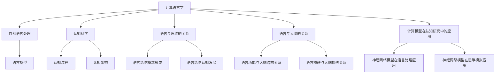
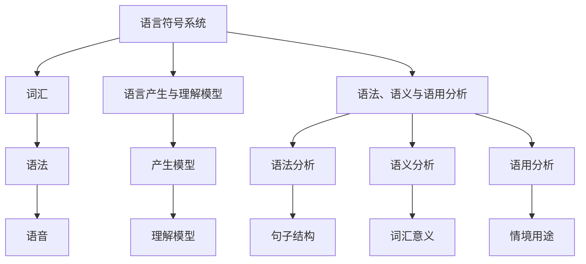
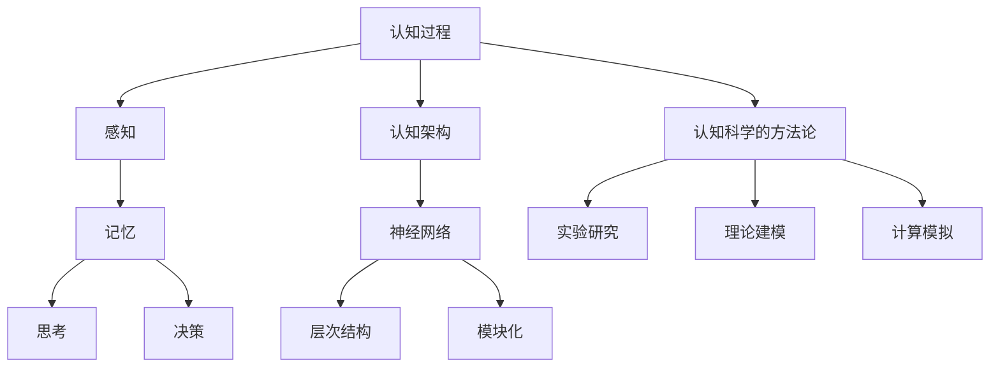
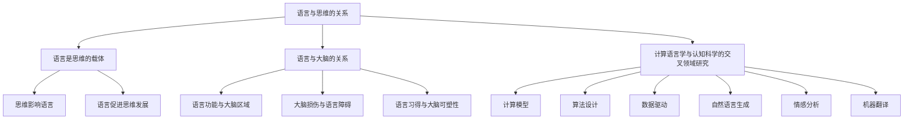

                 


### 文章标题

# 计算语言学与认知科学：探索语言、思维与世界的关系

### 文章关键词

- 计算语言学
- 认知科学
- 语言符号系统
- 语法分析
- 语义分析
- 自然语言生成
- 情感分析
- 机器翻译

### 文章摘要

本文深入探讨了计算语言学与认知科学的交叉领域，分析了它们在语言、思维和世界关系中的重要作用。通过阐述计算语言学的基本概念、原理以及与认知科学的联系，我们能够更好地理解语言的本质和思维的过程。此外，本文还详细介绍了核心算法原理和实际应用案例，展示了计算语言学与认知科学在机器翻译、情感分析和自然语言生成等领域的广泛应用。最后，本文展望了该领域的未来发展趋势，并提供了相关工具与资源的最佳实践建议。

## 第一部分：核心概念与联系

### 第1章：计算语言学与认知科学的概述

#### 1.1 计算语言学的基本概念

计算语言学是一门跨学科领域，它结合了计算机科学、语言学和数学等多种学科，旨在使用计算模型和算法研究自然语言。计算语言学的主要目标是开发出能够处理自然语言信息的计算机系统，从而实现自然语言理解、生成、翻译等功能。

**核心概念：**

- **自然语言处理（NLP）：** 计算语言学的一个核心概念，指使用计算机技术和算法处理自然语言的过程，包括文本分析、信息提取、语义理解、情感分析等。
- **语言模型：** 一个概率分布模型，用于预测下一个单词或字符的概率，它是许多自然语言处理任务的基础。

#### 1.2 认知科学的基本概念

认知科学是一门研究人类认知过程和大脑工作机制的跨学科领域，它涉及心理学、神经科学、哲学、人工智能等多个学科。

**核心概念：**

- **认知过程：** 指人类在感知、记忆、思考、决策等过程中的心理活动。
- **认知架构：** 指人类大脑中处理认知信息的结构和机制，如神经网络的层次结构。

#### 1.3 计算语言学与认知科学的交叉领域

计算语言学与认知科学的交叉领域研究主要集中在语言与思维的关系、语言与大脑的关系以及计算模型在认知研究中的应用。

**核心概念：**

- **语言与思维的关系：** 研究语言在人类思维过程中的作用，如语言如何影响概念形成和认知发展。
- **语言与大脑的关系：** 研究语言功能与大脑结构和功能之间的关系，如语言障碍与大脑损伤的关系。
- **计算模型在认知研究中的应用：** 利用计算模型模拟和解释认知过程，如神经网络模型在语言处理和思维模拟中的应用。

### Mermaid 流程图：



#### 本章小结

计算语言学与认知科学是两个相互关联的领域，它们共同致力于理解语言、思维和大脑之间的关系。计算语言学通过计算机技术和算法研究自然语言，而认知科学则关注人类认知过程和大脑工作机制。通过了解这两个领域的基本概念和交叉领域，我们可以更好地理解语言的本质和思维的过程。

---

### 第2章：计算语言学的基本原理

#### 2.1 语言符号系统

语言符号系统是计算语言学的基础概念之一，它指的是语言中用于表达意义的符号及其组合规则。语言符号系统包括词汇、语法和语音等方面。

**核心原理：**

- **词汇：** 词汇是语言中最基本的符号单位，它代表了具体的事物、概念或特征。
- **语法：** 语法是语言的规则体系，用于确定词汇的组合方式和句子的结构。
- **语音：** 语音是语言的物理表现，通过声音来传递语言信息。

**符号系统的特点：**

- **离散性：** 语言符号是离散的，每个符号都有明确的边界。
- **层次性：** 语言符号系统具有层次结构，可以从词汇、句子到篇章等不同层次进行组织。

#### 2.2 语言产生与理解模型

语言产生与理解模型是计算语言学中的核心模型，它旨在模拟人类产生和理解语言的过程。

**核心模型：**

- **产生模型：** 产生模型用于生成自然语言文本，如语言模型。
- **理解模型：** 理解模型用于理解自然语言文本，如语义分析模型。

**模型特点：**

- **概率性：** 语言模型通常基于概率理论，通过统计方法生成和理解语言。
- **层次性：** 语言理解模型通常包括多个层次，从词汇到句子再到篇章。

#### 2.3 语法、语义与语用分析

语法、语义和语用分析是计算语言学中的三个核心分析层次，它们分别关注语言的结构、意义和用途。

**核心原理：**

- **语法分析：** 语法分析用于分析句子的结构，确定句子是否符合语法规则。
- **语义分析：** 语义分析用于分析句子的意义，确定词汇和句子之间的语义关系。
- **语用分析：** 语用分析用于分析语言在特定情境下的用途，确定语言的行为意图。

**分析层次：**

- **词汇层面：** 分析单词的语法、语义和语用属性。
- **句子层面：** 分析句子的语法、语义和语用关系。
- **篇章层面：** 分析篇章的结构、意义和语境。

### Mermaid 流程图：



#### 本章小结

计算语言学的基本原理包括语言符号系统、语言产生与理解模型以及语法、语义与语用分析。语言符号系统是语言的基本组成部分，语言产生与理解模型用于模拟语言生成和理解过程，而语法、语义与语用分析则分别关注语言的结构、意义和用途。通过深入理解这些基本原理，我们可以更好地理解计算语言学的本质和应用。

---

### 第3章：认知科学的基本原理

#### 3.1 认知过程

认知过程是指人类在感知、记忆、思考、决策等认知活动中的心理过程。认知科学通过对这些过程的深入研究，揭示了人类思维的奥秘。

**核心原理：**

- **感知：** 感知是指人类通过感官接收外界信息的过程，如视觉、听觉、触觉等。
- **记忆：** 记忆是指人类存储和提取信息的能力，分为短期记忆和长期记忆。
- **思考：** 思考是指人类对信息进行加工、处理和推理的能力，如逻辑思维、创造性思维等。
- **决策：** 决策是指人类在面对多种选择时做出判断和选择的过程。

**认知过程的特点：**

- **动态性：** 认知过程是一个动态的过程，不断接收、处理和存储信息。
- **适应性：** 认知过程具有适应性，能够根据环境变化调整自己的行为。

#### 3.2 认知架构

认知架构是指人类大脑中处理认知信息的结构和机制。认知架构的研究有助于我们理解人类思维的机制和大脑的功能。

**核心原理：**

- **神经网络：** 神经网络是大脑的基本单位，负责处理和传输信息。
- **层次结构：** 认知架构具有层次结构，从感官输入到高级认知过程，如视觉皮层、语言中枢等。
- **模块化：** 认知架构具有模块化特点，不同模块负责不同的认知功能，如视觉模块、语言模块等。

**认知架构的特点：**

- **分布式：** 认知架构是一个分布式系统，不同模块之间相互协作，共同完成认知任务。
- **动态性：** 认知架构是一个动态系统，能够根据任务和环境变化调整自己的结构和功能。

#### 3.3 认知科学的方法论

认知科学的方法论是指用于研究认知过程的科学方法和理论框架。认知科学的方法论包括实验研究、理论建模和计算模拟等方法。

**核心原理：**

- **实验研究：** 实验研究是通过实验方法来观察和验证认知现象，如心理实验、脑成像技术等。
- **理论建模：** 理论建模是通过建立数学模型来模拟和解释认知过程，如神经网络模型、决策模型等。
- **计算模拟：** 计算模拟是通过计算机模拟来再现认知过程，如虚拟现实、人机交互等。

**方法论特点：**

- **跨学科：** 认知科学的方法论是跨学科的，结合了心理学、神经科学、计算机科学等多个学科的理论和方法。
- **实证性：** 认知科学的方法论强调实证性，通过实验和模型来验证理论。

### Mermaid 流acco



#### 本章小结

认知科学的基本原理包括认知过程、认知架构和认知科学的方法论。认知过程涵盖了感知、记忆、思考、决策等心理活动，认知架构则揭示了人类大脑处理认知信息的结构和机制。认知科学的方法论为研究认知过程提供了科学的方法和理论框架。通过理解这些基本原理，我们可以更好地理解人类思维的奥秘。

---

### 第4章：计算语言学与认知科学的联系

#### 4.1 语言与思维的关系

语言与思维的关系是计算语言学与认知科学研究的核心问题之一。语言不仅是一种交流工具，还是人类思维的基础。

**核心原理：**

- **语言是思维的载体：** 语言是人类表达和传递思维成果的工具，没有语言，思维很难进行有效交流和传播。
- **思维影响语言：** 思维的过程会影响语言的表达方式，不同的思维方式会导致不同的语言结构。
- **语言促进思维发展：** 学习语言可以促进儿童的认知发展和思维能力，如词汇量的增加、逻辑思维的培养等。

**关系模型：**

- **符号模型：** 语言与思维的关系可以用符号模型来表示，语言符号代表思维概念，语言结构反映思维过程。
- **交互模型：** 语言与思维是相互作用的，语言的使用会影响思维过程，而思维的发展又会影响语言表达。

**实证研究：**

- **脑成像技术：** 通过脑成像技术，研究发现语言功能与大脑特定区域的活动密切相关，如布罗卡区和韦尼克区等。
- **认知实验：** 通过认知实验，研究语言对思维过程的影响，如词汇学习对记忆能力的影响等。

#### 4.2 语言与大脑的关系

语言与大脑的关系是认知科学研究的另一个重要领域，它关注语言功能与大脑结构和功能之间的关系。

**核心原理：**

- **语言功能与大脑区域：** 不同的语言功能与大脑的不同区域有关，如布罗卡区和韦尼克区分别与语言产生和理解有关。
- **大脑损伤与语言障碍：** 大脑损伤可能导致语言功能受损，如脑卒中导致的失语症。
- **语言习得与大脑可塑性：** 语言习得过程中，大脑的结构和功能会发生适应性变化，如婴儿大脑对语音的敏感期。

**关系模型：**

- **神经网络模型：** 可以用神经网络模型来模拟语言功能与大脑区域之间的关系，如语言神经网络。
- **认知神经科学模型：** 可以用认知神经科学模型来解释大脑损伤与语言障碍的关系，如认知神经科学框架。

**实证研究：**

- **脑成像技术：** 通过脑成像技术，研究语言功能与大脑区域之间的关联，如功能性磁共振成像（fMRI）。
- **神经心理学研究：** 通过神经心理学研究，研究大脑损伤与语言障碍的关系，如失语症患者的语言功能评估。

#### 4.3 计算语言学与认知科学的交叉领域研究

计算语言学与认知科学的交叉领域研究是两个领域相互融合的结果，旨在通过计算模型和算法来研究语言和认知现象。

**核心原理：**

- **计算模型：** 利用计算模型模拟语言和认知过程，如神经网络模型、生成式模型等。
- **算法设计：** 设计适用于语言和认知处理的算法，如机器学习算法、深度学习算法等。
- **数据驱动：** 通过大规模数据集来训练和优化计算模型，如自然语言数据集、认知实验数据集等。

**交叉领域研究的应用：**

- **自然语言生成：** 利用计算模型生成符合语法和语义的自然语言文本。
- **情感分析：** 利用计算模型分析文本的情感倾向和情绪表达。
- **机器翻译：** 利用计算模型实现不同语言之间的自动翻译。

**实证研究：**

- **计算语言学实验：** 通过计算语言学实验来验证计算模型的效果，如语言生成和翻译实验。
- **认知科学实验：** 通过认知科学实验来验证计算模型在认知处理中的应用，如语言理解和情感分析实验。

### Mermaid 流程图：



#### 本章小结

计算语言学与认知科学的联系体现在语言与思维的关系、语言与大脑的关系以及交叉领域的研究。通过深入理解这些联系，我们可以更好地理解语言的本质和思维的机制，同时为计算语言学和认知科学的发展提供新的理论和方法。

---

### 第5章：计算语言学与认知科学的数学模型

#### 5.1 语法分析模型

语法分析是自然语言处理中的一个重要步骤，它的目标是将自然语言文本转换成抽象的语法结构。语法分析模型是计算语言学和认知科学中常用的数学模型。

**核心原理：**

- **上下文无关文法（CFG）：** 上下文无关文法是一种描述语言结构的数学模型，它由产生式规则组成，可以生成所有符合语法规则的句子。
- **上下文有关文法（CG）：** 上下文有关文法是一种更强大的语法分析模型，它允许语法规则依赖于上下文环境。
- **自顶向下解析器（Top-Down Parser）：** 自顶向下解析器从句子的顶层开始，逐步拆分句子，直到生成完整的语法结构。
- **自底向上解析器（Bottom-Up Parser）：** 自底向上解析器从句子的底层开始，逐步合并语法结构，直到生成完整的句子。

**伪代码示例：**

```python
# 自顶向下解析器伪代码
function top_down_parse(sentence):
    stack = [sentence]
    while stack is not empty:
        symbol = stack.pop()
        if symbol is a terminal:
            return success
        else:
            for rule in grammar_rules:
                if rule.left_side == symbol:
                    stack.append(rule.right_side)
                    return success
    return failure
```

**数学公式：**

$$
CFG = (N, T, S, P)
$$

其中，$N$ 是非终端符号集合，$T$ 是终端符号集合，$S$ 是开始符号，$P$ 是产生式规则集合。

#### 5.2 语义分析模型

语义分析是自然语言处理中的另一个重要步骤，它的目标是从语法结构中提取出语义信息。语义分析模型是计算语言学和认知科学中常用的数学模型。

**核心原理：**

- **词嵌入（Word Embedding）：** 词嵌入是将单词映射到高维向量空间的一种方法，通过向量的相似性来表示单词之间的关系。
- **语义角色标注（Semantic Role Labeling）：** 语义角色标注是将句子中的动词与它的语义角色（如主语、宾语等）进行标注。
- **语义依存分析（Semantic Dependency Analysis）：** 语义依存分析是分析句子中词汇之间的语义依赖关系，通常使用图结构来表示。

**伪代码示例：**

```python
# 语义依存分析伪代码
function semantic_dependency_analysis(sentence):
    grammar_structure = parse_sentence(sentence)
    dependency_graph = create_dependency_graph(grammar_structure)
    return dependency_graph
```

**数学公式：**

$$
Dependency_Graph = (V, E)
$$

其中，$V$ 是节点集合，表示句子中的词汇；$E$ 是边集合，表示词汇之间的语义依赖关系。

#### 5.3 认知模型

认知模型是计算语言学和认知科学中用于模拟人类认知过程的数学模型。这些模型通常基于神经网络，通过训练来学习复杂的认知任务。

**核心原理：**

- **神经网络（Neural Network）：** 神经网络是一种模拟生物神经系统的计算模型，它由多个神经元组成，通过连接和权重来传递信息。
- **深度学习（Deep Learning）：** 深度学习是一种基于神经网络的机器学习技术，它通过多层次的神经网络来学习复杂的数据表示。
- **注意力机制（Attention Mechanism）：** 注意力机制是一种用于提高神经网络模型性能的技术，它通过动态调整不同部分的重要性来提高模型的泛化能力。

**伪代码示例：**

```python
# 神经网络训练伪代码
function train_neural_network(data):
    initialize_network()
    for epoch in range(num_epochs):
        for sample in data:
            predict = network.predict(sample.input)
            loss = calculate_loss(predict, sample.target)
            update_network(loss)
    return network
```

**数学公式：**

$$
Neural_Network = (L, W, b)
$$

其中，$L$ 是神经网络层数，$W$ 是权重矩阵，$b$ 是偏置向量。

#### 本章小结

计算语言学与认知科学的数学模型包括语法分析模型、语义分析模型和认知模型。语法分析模型用于分析句子的结构，语义分析模型用于提取句子的语义信息，认知模型则用于模拟人类的认知过程。通过理解这些数学模型，我们可以更好地理解和应用计算语言学与认知科学的理论和技术。

---

### 第6章：计算语言学与认知科学的实际应用

#### 6.1 机器翻译

机器翻译是计算语言学与认知科学在自然语言处理中的一个重要应用领域，它的目标是实现不同语言之间的自动翻译。

**背景介绍：**

随着全球化的发展，跨语言交流变得越来越频繁，机器翻译在解决语言障碍、促进国际交流方面发挥了重要作用。早期的机器翻译主要依赖于基于规则的系统和统计机器翻译，而近年来，基于神经网络的机器翻译技术取得了显著进展。

**工作原理：**

- **基于规则的系统：** 基于规则的系统通过编写语法规则和翻译规则，将源语言文本转换为目标语言文本。这种方法的缺点是规则编写复杂且难以扩展。
- **统计机器翻译：** 统计机器翻译通过分析大量双语文本对，学习源语言和目标语言之间的映射关系。近年来，基于神经网络的统计机器翻译（如序列到序列模型）取得了显著的成果。

**应用案例：**

- **谷歌翻译：** 谷歌翻译是一款流行的在线机器翻译服务，支持多种语言之间的翻译。它采用了基于神经网络的统计机器翻译技术，提供了高质量的翻译结果。
- **微软翻译：** 微软翻译也是一款功能强大的机器翻译工具，它结合了基于规则的系统和统计机器翻译技术，提供了多种语言翻译服务。

**代码解读与分析：**

```python
# 基于神经网络的机器翻译伪代码
function neural_network_translation(source_sentence, target_language):
    # 加载预训练的神经网络模型
    model = load_pretrained_model(target_language)
    # 将源语言句子编码为向量
    source_vector = encode_sentence(source_sentence)
    # 使用神经网络模型进行翻译
    target_vector = model.predict(source_vector)
    # 将目标语言向量解码为文本
    target_sentence = decode_vector(target_vector)
    return target_sentence
```

**注意事项：**

- **数据质量：** 机器翻译的性能很大程度上取决于训练数据的质量，因此需要确保训练数据足够多样且无错误。
- **语言特点：** 不同语言有不同的语法和词汇特点，因此机器翻译模型需要针对特定语言进行定制化训练。

**拓展阅读：**

- **《神经机器翻译：基于深度学习的跨语言翻译方法》：** 该书详细介绍了神经机器翻译的理论基础和实践方法。
- **《统计机器翻译导论》：** 该书介绍了统计机器翻译的基本概念和技术，适用于对机器翻译有兴趣的读者。

#### 6.2 情感分析

情感分析是计算语言学与认知科学在自然语言处理中的另一个重要应用领域，它的目标是分析文本中的情感倾向和情绪表达。

**背景介绍：**

随着互联网和社交媒体的快速发展，人们产生和分享的文本数据量呈爆炸式增长。情感分析作为一种自然语言处理技术，可以帮助我们从这些海量数据中提取有价值的信息，如公众对某个事件的情感态度、产品的用户评价等。

**工作原理：**

- **情感分类：** 情感分类是将文本分类为正面、负面或中性等情感类别。常用的方法包括基于词典的方法、基于机器学习的方法和基于深度学习的方法。
- **情感极性分析：** 情感极性分析是情感分析的一种特殊形式，它主要关注文本中表达的情感极性，如积极、消极或中性。
- **情感强度分析：** 情感强度分析是分析文本中情感表达的程度，如非常喜欢、有点喜欢或不喜欢。

**应用案例：**

- **社交媒体情绪监测：** 通过情感分析技术，可以对社交媒体上的用户评论进行情感分析，从而了解公众对某个话题的情感倾向。
- **产品评价分析：** 通过情感分析技术，可以分析消费者对产品的评价，帮助企业了解产品的优缺点，优化产品设计。

**代码解读与分析：**

```python
# 情感分类伪代码
function sentiment_classification(text):
    # 加载预训练的情感分类模型
    model = load_pretrained_model()
    # 将文本编码为向量
    text_vector = encode_text(text)
    # 使用模型进行情感分类
    sentiment = model.predict(text_vector)
    return sentiment
```

**注意事项：**

- **词汇选择：** 情感分析模型的性能很大程度上取决于词汇的选择，因此需要确保词汇库足够全面和准确。
- **上下文理解：** 情感分析需要考虑上下文信息，以避免误解文本的情感倾向。

**拓展阅读：**

- **《情感分析：理论与实践》：** 该书详细介绍了情感分析的理论基础和实践方法。
- **《自然语言处理与情感分析》：** 该书介绍了自然语言处理和情感分析的基本概念和技术，适用于对情感分析有兴趣的读者。

#### 6.3 自然语言生成

自然语言生成是计算语言学与认知科学在自然语言处理中的另一个重要应用领域，它的目标是实现计算机自动生成符合语法和语义的自然语言文本。

**背景介绍：**

自然语言生成技术在许多领域都有广泛的应用，如自动写作、智能客服、语音合成等。传统的自然语言生成方法包括基于规则的方法和基于模板的方法，而近年来，基于深度学习的方法取得了显著的成果。

**工作原理：**

- **基于规则的方法：** 基于规则的方法通过编写语法规则和模板来生成文本，这种方法适用于简单的文本生成任务，但难以应对复杂的文本生成需求。
- **基于模板的方法：** 基于模板的方法通过模板和填充器来生成文本，这种方法可以根据不同的场景和需求灵活生成文本。
- **基于深度学习的方法：** 基于深度学习的方法，如序列到序列模型和生成对抗网络（GAN），通过学习大量的文本数据，能够生成高质量的自然语言文本。

**应用案例：**

- **自动写作：** 通过自然语言生成技术，可以自动生成新闻文章、博客文章等。
- **智能客服：** 通过自然语言生成技术，可以生成自动回复，提高客服效率。
- **语音合成：** 通过自然语言生成技术，可以生成语音合成文本，应用于语音助手、语音导航等。

**代码解读与分析：**

```python
# 基于序列到序列模型的自然语言生成伪代码
function sequence_to_sequence_generation(input_sequence, target_sequence):
    # 加载预训练的序列到序列模型
    model = load_pretrained_model()
    # 将输入序列编码为向量
    input_vector = encode_sequence(input_sequence)
    # 使用模型生成目标序列
    target_vector = model.predict(input_vector)
    # 将目标序列解码为文本
    generated_text = decode_sequence(target_vector)
    return generated_text
```

**注意事项：**

- **数据质量：** 自然语言生成模型的性能很大程度上取决于训练数据的质量，因此需要确保训练数据足够多样和高质量。
- **语法和语义一致性：** 自然语言生成需要保证生成的文本在语法和语义上的一致性。

**拓展阅读：**

- **《自然语言生成导论》：** 该书详细介绍了自然语言生成的理论基础和实践方法。
- **《深度学习与自然语言生成》：** 该书介绍了深度学习在自然语言生成中的应用，适用于对自然语言生成有兴趣的读者。

#### 本章小结

计算语言学与认知科学在自然语言处理领域具有广泛的应用，包括机器翻译、情感分析和自然语言生成等。这些应用技术通过计算模型和算法，实现了对自然语言文本的分析和生成，为跨语言交流、情感分析和智能写作等领域提供了有力的支持。

---

### 第7章：计算语言学与认知科学的未来发展趋势

#### 7.1 人工智能与计算语言学的融合

随着人工智能技术的快速发展，计算语言学与人工智能的融合成为了一个重要的研究方向。人工智能为计算语言学提供了强大的计算能力和算法支持，而计算语言学则为人工智能提供了丰富的语言知识和处理方法。

**发展趋势：**

- **深度学习与语言模型：** 深度学习技术在自然语言处理领域取得了显著成果，如基于深度学习的语言模型（如GPT-3）具有强大的语言生成和理解能力。
- **多模态自然语言处理：** 多模态自然语言处理将文本、语音、图像等多种模态信息融合起来，实现更全面的语言理解和生成。
- **自适应语言学习：** 自适应语言学习是指根据用户的行为和反馈，动态调整语言模型的参数，以实现更好的语言理解和生成。

**应用案例：**

- **智能客服：** 通过融合计算语言学和人工智能技术，可以实现智能客服系统，自动处理用户咨询并提供个性化的服务。
- **智能写作：** 通过融合计算语言学和人工智能技术，可以自动生成新闻文章、博客文章等，提高内容创作效率。

**未来展望：**

- **跨语言理解与生成：** 跨语言理解与生成是计算语言学与人工智能融合的一个重要方向，通过跨语言知识共享，实现更高效的语言理解和生成。
- **智能对话系统：** 智能对话系统是计算语言学与人工智能融合的一个应用领域，它通过自然语言理解、对话生成和语音合成等技术，实现人与计算机的自然交互。

#### 7.2 认知科学的发展与计算语言学的融合

认知科学的发展为计算语言学提供了新的理论和方法，而计算语言学则为认知科学提供了语言处理的工具和技术。这种融合有助于深入理解人类语言和认知过程。

**发展趋势：**

- **脑机接口（Brain-Computer Interface, BCI）：** 脑机接口技术将认知科学与计算语言学相结合，通过解读大脑信号来实现人机交互。
- **认知图谱（Cognitive Graph）：** 认知图谱是一种知识表示方法，通过构建语言和认知过程的图谱，实现知识图谱与自然语言文本的关联。
- **神经符号主义（Neural Symbolism）：** 神经符号主义结合了神经科学和符号计算的方法，旨在建立一种新的认知计算模型。

**应用案例：**

- **智能教育：** 通过融合认知科学和计算语言学技术，可以实现个性化教育，根据学生的认知特点和语言能力提供合适的课程和学习资源。
- **心理健康：** 通过融合认知科学和计算语言学技术，可以分析语言表达中的情感和认知特征，为心理健康诊断和治疗提供支持。

**未来展望：**

- **认知计算模型：** 认知计算模型是计算语言学与认知科学融合的一个重要方向，它通过模拟人类认知过程，实现更智能的计算机系统。
- **跨学科研究：** 跨学科研究是计算语言学与认知科学融合的关键，通过整合不同学科的理论和方法，实现更全面的语言和认知研究。

#### 7.3 新兴技术与计算语言学、认知科学的交叉

随着新兴技术的发展，计算语言学与认知科学正在与这些技术进行交叉融合，为语言和认知研究带来了新的机遇和挑战。

**发展趋势：**

- **虚拟现实（Virtual Reality, VR）：** 虚拟现实技术为计算语言学和认知科学提供了新的实验平台，通过虚拟环境模拟人类语言和认知过程。
- **增强现实（Augmented Reality, AR）：** 增强现实技术通过在现实环境中叠加数字信息，实现人与语言和认知系统的交互。
- **区块链（Blockchain）：** 区块链技术为计算语言学和认知科学提供了数据存储和验证的方法，有助于保护隐私和确保数据安全。

**应用案例：**

- **智能翻译：** 通过融合虚拟现实和计算语言学技术，可以实现实时智能翻译，帮助用户在跨语言交流中更好地理解对方。
- **智能咨询：** 通过融合增强现实和认知科学技术，可以为用户提供智能化的咨询服务，通过分析用户语言和行为，提供个性化的建议。

**未来展望：**

- **智能交互：** 智能交互是计算语言学与认知科学在新兴技术中的一个重要方向，通过自然语言理解和认知模拟，实现更智能的人机交互。
- **智能社会：** 智能社会是计算语言学与认知科学融合的一个重要目标，通过智能语言和认知系统，实现更高效、更智能的社会运行和管理。

#### 本章小结

计算语言学与认知科学的未来发展趋势体现在人工智能与计算语言学的融合、认知科学的发展与计算语言学的融合以及新兴技术与计算语言学、认知科学的交叉。这些发展趋势为语言和认知研究带来了新的机遇和挑战，有助于实现更智能、更高效的计算机系统。

---

### 附录

#### 附录 A：计算语言学与认知科学工具与资源

**A.1 主流深度学习框架对比**

- **TensorFlow：** 由谷歌开发的开源深度学习框架，支持广泛的深度学习应用，包括自然语言处理、计算机视觉等。
- **PyTorch：** 由Facebook开发的开源深度学习框架，具有灵活的动态计算图和强大的社区支持。
- **Keras：** 是一个高层次的深度学习API，可以与TensorFlow和Theano等框架集成，提供了更简洁的编程接口。

**A.2 计算语言学与认知科学开源库**

- **NLTK（自然语言工具包）：** 一个广泛使用的自然语言处理库，提供了多种文本处理和分析工具。
- **spaCy：** 一个快速而强大的自然语言处理库，适用于文本处理、实体识别、关系提取等任务。
- **gensim：** 用于主题建模和文本相似度计算的库，适用于大规模文本数据的处理和分析。

**A.3 相关数据集与工具**

- **Wikipedia：** 一个包含大量文本信息的免费在线百科全书，可用于自然语言处理的研究和应用。
- **Google Books Ngrams：** 一个包含大量书籍文本的数据集，可用于研究词汇的使用频率和趋势。
- **Common Crawl：** 一个包含互联网网页文本的免费数据集，可用于大规模的自然语言处理研究。

**A.4 最佳实践 Tips**

- **数据预处理：** 在自然语言处理任务中，数据预处理是非常重要的一步，包括文本清洗、分词、词性标注等。
- **模型评估：** 模型评估是评估模型性能的关键步骤，常用的评估指标包括准确率、召回率、F1值等。
- **超参数调整：** 超参数调整是优化模型性能的关键，通过交叉验证和网格搜索等方法，可以找到最佳的超参数组合。

**A.5 小结与注意事项**

- **小结：** 计算语言学与认知科学是跨学科领域，它们在语言、思维和世界关系的研究中具有重要作用。通过深入理解和应用这些领域的知识，我们可以实现更智能、更高效的计算机系统和应用。
- **注意事项：** 在进行计算语言学与认知科学研究时，需要注意数据质量、模型性能和实际应用效果，同时关注最新技术的发展和应用趋势。

**A.6 拓展阅读**

- **《深度学习与自然语言处理》：** 该书详细介绍了深度学习在自然语言处理中的应用，适用于对深度学习和自然语言处理有兴趣的读者。
- **《认知科学导论》：** 该书介绍了认知科学的基本概念和理论，适用于对认知科学有兴趣的读者。

### 作者信息

作者：AI天才研究院/AI Genius Institute & 禅与计算机程序设计艺术 /Zen And The Art of Computer Programming

