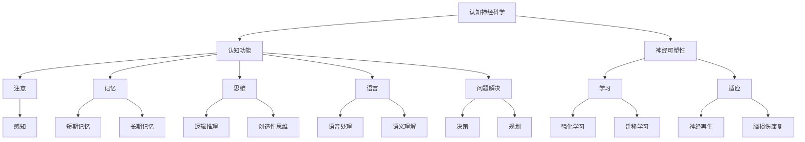
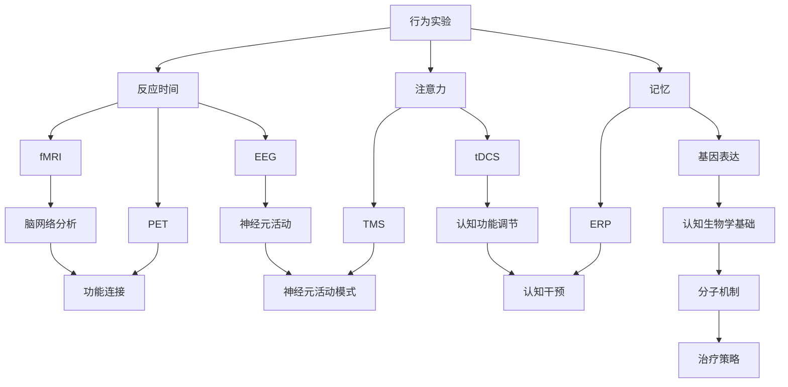

                 

### 文章标题

《认知神经科学与心理学：全面理解人类心智与世界的关系》

### 关键词

- 认知神经科学
- 心理学
- 大脑结构
- 神经传递
- 神经可塑性
- 实证研究
- 应用领域

### 摘要

本文旨在探讨认知神经科学与心理学两大领域，深入分析人类心智与世界之间的关系。通过回顾两大领域的基本概念、研究方法及交叉点，本文将逐步揭示人类心智的复杂性及其在认知过程中的作用。随后，本文将重点介绍大脑结构与功能、神经传递与神经可塑性原理，以及心理学的基本理论和过程。此外，本文还将探讨认知神经科学与心理学在实证研究中的具体应用，如神经影像技术、行为心理学实验和认知心理学研究方法。最后，本文将讨论认知神经科学与心理学在精神疾病研究、教育领域和人工智能中的实际应用，并提出未来研究的方向和挑战。

---

### 《认知神经科学与心理学：全面理解人类心智与世界的关系》目录大纲

---

# 第一部分：引论

## 1.1 认知神经科学与心理学的概念框架

### 1.1.1 认知神经科学的定义与起源

### 1.1.2 心理学的定义与分支

### 1.1.3 人类心智与世界关系的多维度探索

## 1.2 认知神经科学与心理学的交叉点

### 1.2.1 交叉研究的重要性

### 1.2.2 两大领域的研究方法与技术

### 1.2.3 交叉研究的历史与趋势

## 1.3 全书结构概述

### 1.3.1 各章节内容安排

### 1.3.2 阅读指南与学习方法

# 第二部分：认知神经科学基础

## 2.1 大脑结构与功能概述

### 2.1.1 大脑的宏观结构与分区

### 2.1.2 神经元的结构与功能

### 2.1.3 大脑的信息处理机制

## 2.2 神经传递与神经可塑性

### 2.2.1 神经传递物质与信号传递

### 2.2.2 神经可塑性原理与影响

### 2.2.3 神经可塑性的应用与调节

## 2.3 认知神经科学与心理学的基本原理

### 2.3.1 认知神经科学与心理学的基本概念

### 2.3.2 认知神经科学与心理学的实证研究方法

### 2.3.3 认知神经科学与心理学的理论基础

# 第三部分：心理学基础

## 3.1 心理学的历史与流派

### 3.1.1 心理学的起源与发展

### 3.1.2 心理学的经典流派

### 3.1.3 当代心理学的主要趋势

## 3.2 心理过程与心理状态

### 3.2.1 认知过程

### 3.2.2 情绪过程

### 3.2.3 行为过程与心理状态

## 3.3 个体差异与心理发展

### 3.3.1 个体差异的概念与类型

### 3.3.2 心理发展的基本理论

### 3.3.3 心理发展的阶段性特征

# 第四部分：认知神经科学与心理学的实证研究

## 4.1 神经影像技术在心理学中的应用

### 4.1.1 fMRI技术介绍

### 4.1.2 PET技术介绍

### 4.1.3 神经影像数据解读与实例分析

## 4.2 行为心理学实验方法

### 4.2.1 行为实验设计原则

### 4.2.2 行为实验数据分析

### 4.2.3 行为实验的伦理问题

## 4.3 认知心理学研究方法

### 4.3.1 反应时间与反应准确性实验

### 4.3.2 视觉与空间认知实验

### 4.3.3 记忆与学习实验

# 第五部分：认知神经科学与心理学的交叉领域应用

## 5.1 认知神经心理学在精神疾病研究中的应用

### 5.1.1 精神疾病的认知神经基础

### 5.1.2 精神疾病的认知心理学评估

### 5.1.3 认知神经心理学在精神疾病治疗中的应用

## 5.2 认知神经科学与心理学在教育中的应用

### 5.2.1 认知神经科学与心理学的教育理念

### 5.2.2 教育中的认知神经科学与心理学研究

### 5.2.3 教育干预与心理辅导

## 5.3 认知神经科学与心理学在人工智能中的应用

### 5.3.1 认知神经科学与心理学对人工智能的影响

### 5.3.2 人工智能中的认知神经科学方法

### 5.3.3 认知神经科学与人工智能的结合实例

# 第六部分：认知神经科学与心理学研究进展与未来展望

## 6.1 认知神经科学与心理学研究的前沿问题

### 6.1.1 认知神经科学与心理学的跨学科研究

### 6.1.2 新技术的应用与挑战

### 6.1.3 跨文化认知神经科学与心理学的比较研究

## 6.2 认知神经科学与心理学的未来发展方向

### 6.2.1 认知神经科学与心理学在人工智能中的角色

### 6.2.2 心理疾病的早期识别与干预

### 6.2.3 认知神经科学与心理学的跨学科融合

## 6.3 认知神经科学与心理学研究的挑战与机遇

### 6.3.1 数据隐私与伦理问题

### 6.3.2 大数据时代的认知神经科学与心理学研究

### 6.3.3 跨学科合作与人才培养

---

**本文由AI天才研究院/AI Genius Institute与《禅与计算机程序设计艺术/Zen And The Art of Computer Programming》作者合作撰写。**### 第一部分：引论

在当今科技飞速发展的时代，认知神经科学与心理学作为研究人类心智和大脑功能的两大领域，正日益受到关注。它们不仅在生物学、医学、教育学等领域具有重要应用，也在人工智能、认知科学等前沿科技领域发挥着关键作用。本部分将首先介绍认知神经科学与心理学的概念框架，然后探讨这两大领域之间的交叉点，最后对全书结构进行概述。

#### 1.1 认知神经科学与心理学的概念框架

**1.1.1 认知神经科学的定义与起源**

认知神经科学（Cognitive Neuroscience）是一门跨学科的研究领域，旨在通过神经科学的方法和技术来研究大脑中的认知功能。它结合了神经科学、心理学、认知科学和计算机科学等多学科的理论和方法，探讨大脑如何处理信息、如何产生意识和认知过程。认知神经科学的研究起源于20世纪中叶，随着神经影像学技术的发展，如功能性磁共振成像（fMRI）、正电子发射断层扫描（PET）等，认知神经科学得到了迅速发展。

**1.1.2 心理学的定义与分支**

心理学（Psychology）是一门研究人类行为和心理过程的科学。心理学的研究范围广泛，包括认知心理学、发展心理学、社会心理学、临床心理学等。认知心理学（Cognitive Psychology）是心理学的一个重要分支，主要研究人类思维、记忆、感知和语言等认知过程。发展心理学（Developmental Psychology）关注个体从出生到成年的心理发展过程。社会心理学（Social Psychology）研究个体与社会环境之间的相互作用。

**1.1.3 人类心智与世界关系的多维度探索**

人类心智与世界的关系是一个复杂而多维的问题。认知神经科学与心理学通过不同的视角和方法来探索这个问题。认知神经科学主要从生物学和神经科学的角度来研究大脑如何处理信息，产生认知和行为。心理学则更多地从行为和心理过程的层面来探讨人类如何与环境互动。这两个领域的研究相互补充，共同揭示了人类心智的复杂性和多样性。

#### 1.2 认知神经科学与心理学的交叉点

**1.2.1 交叉研究的重要性**

认知神经科学与心理学的交叉研究具有重要的理论和实践意义。通过这种交叉研究，可以更深入地理解大脑如何产生心理过程和行为。例如，认知神经科学的研究可以揭示大脑中的特定区域如何参与认知过程，而心理学的研究可以提供关于这些认知过程的详细行为表现。这种交叉研究有助于整合不同的理论和方法，推动认知科学的发展。

**1.2.2 两大领域的研究方法与技术**

认知神经科学与心理学在研究方法和技术方面有很多相似之处。例如，它们都使用实验设计来测试假设，收集数据和证据。认知神经科学主要使用神经影像技术，如fMRI和PET，来观察大脑的结构和功能。心理学则更多地依赖行为实验和问卷调查来研究心理过程和行为。这些方法的结合可以提供更全面和深入的研究结果。

**1.2.3 交叉研究的历史与趋势**

交叉研究的历史可以追溯到20世纪中叶，当时神经科学和心理学开始相互借鉴理论和方法。随着神经影像技术的发展，认知神经科学与心理学之间的交叉研究变得更加紧密。近年来，随着计算模型和数据分析技术的进步，这种交叉研究也呈现出不断扩展的趋势。未来，认知神经科学与心理学将继续在交叉领域中进行合作，推动认知科学的发展。

#### 1.3 全书结构概述

**1.3.1 各章节内容安排**

本书分为六个主要部分，分别从不同角度探讨认知神经科学与心理学。第一部分是引论，介绍两大领域的基本概念和交叉点。第二部分是认知神经科学基础，讨论大脑结构与功能、神经传递与神经可塑性。第三部分是心理学基础，涵盖心理学的历史与流派、心理过程与心理状态、个体差异与心理发展。第四部分是认知神经科学与心理学的实证研究，介绍神经影像技术、行为心理学实验和认知心理学研究方法。第五部分是认知神经科学与心理学的交叉领域应用，包括在精神疾病研究、教育和人工智能中的应用。最后一部分是认知神经科学与心理学研究进展与未来展望，讨论前沿问题、未来发展方向和挑战。

**1.3.2 阅读指南与学习方法**

为了更好地理解和掌握本书的内容，建议读者采取以下学习方法：

1. **系统阅读**：按照章节顺序系统阅读，逐步建立对认知神经科学与心理学的基本框架和概念。

2. **重点学习**：在阅读过程中，重点关注各章节的核心概念和原理，尝试用自己的语言复述和理解。

3. **实践应用**：结合实际案例和实验，尝试将理论知识应用到实际场景中，加深对认知神经科学与心理学的理解。

4. **互动交流**：与其他读者或专业人士交流，分享学习心得和疑问，促进对知识的深入理解和探索。

通过以上学习方法，读者可以更加全面和深入地掌握认知神经科学与心理学，为今后的研究和实践奠定坚实基础。接下来，我们将进一步探讨认知神经科学的基础知识，包括大脑结构与功能、神经传递与神经可塑性等，帮助读者更全面地了解人类心智的运作机制。 ### 1.1 认知神经科学与心理学的概念框架

#### 1.1.1 认知神经科学的定义与起源

认知神经科学（Cognitive Neuroscience）是一门新兴的跨学科领域，它将神经科学、心理学、认知科学和计算机科学等多个学科的理论和方法结合起来，研究大脑如何处理信息、产生认知和意识。认知神经科学的核心目标是理解大脑的功能结构及其与行为和认知过程的关联。

认知神经科学的研究可以追溯到20世纪中叶，当时神经科学家和心理学家开始尝试通过实验和理论模型来解释认知功能。这一领域的发展主要受到几个关键因素的影响。首先是神经影像技术的进步，如功能性磁共振成像（fMRI）、正电子发射断层扫描（PET）和单光子发射计算机断层扫描（SPECT）等技术的出现，使得研究者能够无创地观察大脑的活动和结构。其次，计算机科学的发展为复杂的数据分析和计算模型提供了工具，使得认知神经科学的研究方法更加精确和高效。

**定义**：认知神经科学是研究大脑如何执行认知功能的科学，包括感知、记忆、语言、思维和决策等。它通过神经科学的方法，如神经影像学、电生理学和分子生物学，以及心理学的实验方法，如行为测量和认知测试，来探索认知过程。

**起源**：认知神经科学起源于20世纪中叶，当时心理学家和神经科学家开始合作研究大脑和行为的相互关系。1950年代，认知心理学的发展促使研究者关注大脑的认知功能，同时神经科学的发展提供了更多了解大脑结构和功能的方法。1960年代，神经影像技术的出现标志着认知神经科学进入一个新的时代。

#### 1.1.2 心理学的定义与分支

心理学（Psychology）是一门研究人类行为和心理过程的科学，其目标是理解个体和群体的行为，以及这些行为背后的心理机制。心理学的研究范围广泛，包括认知心理学、发展心理学、社会心理学、临床心理学、健康心理学等。

**定义**：心理学是研究心理现象的科学，包括思维、情感、行为和意识等。它通过实验、观察、测量和统计分析等方法来探索心理过程和行为的规律。

**分支**：

1. **认知心理学**：研究人类的认知过程，如感知、记忆、注意、思维和语言。
   
2. **发展心理学**：研究个体从出生到老年的心理发展过程，包括认知、社会和情感的发展。

3. **社会心理学**：研究个体在社会环境中的行为和心理过程，如人际关系、群体行为和社会影响。

4. **临床心理学**：应用心理学原理和方法来诊断、治疗和预防心理障碍。

5. **健康心理学**：研究心理因素如何影响健康和疾病，以及如何通过心理干预促进健康。

**历史与流派**：

- **古典心理学**：19世纪末至20世纪初，以行为主义和结构主义为代表，研究行为和思维的基本单位。
- **现代心理学**：20世纪中叶以来，认知心理学和生物心理学等流派兴起，关注认知过程和大脑机制。
- **当代心理学**：包括认知神经科学、进化心理学、生态心理学等，不断探索心理现象的多样性和复杂性。

#### 1.1.3 人类心智与世界关系的多维度探索

人类心智与世界的关系是一个复杂而多维的问题，认知神经科学与心理学通过不同的视角和方法来探索这个问题。

**多维度探索**：

1. **神经科学视角**：认知神经科学通过研究大脑的结构和功能，探索心智的生物学基础。例如，神经影像技术可以揭示大脑中特定区域的活动与特定认知功能之间的关系。

2. **心理学视角**：心理学通过行为实验和理论模型，研究心智的心理学过程。例如，认知心理学研究如何感知和记忆信息，如何进行思维和决策。

3. **跨学科视角**：认知神经科学与心理学之间的交叉研究，提供了更全面的视角来理解心智与世界的关系。例如，认知神经科学可以解释心理学的实验结果，而心理学可以提供认知神经科学研究的理论基础。

**综合理解**：通过整合神经科学和心理学的理论和数据，可以更全面地理解人类心智与世界的关系。例如，认知神经科学揭示了大脑如何处理语言信息，而认知心理学则研究了语言理解的具体心理过程。

**总结**：认知神经科学与心理学通过不同的方法和视角，共同探索人类心智与世界的关系。它们不仅提供了对心智机制的理解，也为治疗心理障碍、设计人工智能和教育干预提供了科学基础。在接下来的章节中，我们将进一步探讨认知神经科学与心理学的基础知识，包括大脑的结构与功能、神经传递与神经可塑性等。通过这些内容，我们将更深入地理解人类心智的运作机制。 ### 1.2 认知神经科学与心理学的交叉点

#### 1.2.1 交叉研究的重要性

认知神经科学与心理学之间的交叉研究具有重要意义。这种交叉不仅促进了两个领域的相互理解和融合，也为解决复杂心理和行为问题提供了新的方法和视角。以下是交叉研究的重要性：

1. **深度理解心智机制**：通过认知神经科学与心理学的交叉研究，可以更深入地理解心智的生物学基础和心理学过程。例如，认知神经科学提供了关于大脑结构和功能的数据，而心理学则提供了关于认知和行为的理论框架，两者结合可以揭示心智的复杂机制。

2. **发展新的理论模型**：交叉研究促进了新的理论模型的产生和发展。例如，基于认知神经科学的认知模型可以帮助心理学家设计更有效的实验和研究方法，而基于心理学的理论模型可以指导认知神经科学家选择合适的研究目标和实验设计。

3. **推动跨学科合作**：交叉研究促进了不同学科之间的合作，形成了新的研究团队和研究项目。这种跨学科合作不仅有助于解决复杂问题，也为科学家提供了更多的研究资源和视角。

4. **提升研究方法和技术**：交叉研究推动了研究方法和技术的发展。例如，认知神经科学的发展促进了功能性磁共振成像（fMRI）和电生理学技术的应用，而心理学的研究方法和技术也不断改进和优化。

#### 1.2.2 两大领域的研究方法与技术

认知神经科学与心理学在研究方法和技术方面有很多相似之处，但也存在一些独特的方法。

**认知神经科学的研究方法**：

1. **神经影像技术**：认知神经科学广泛使用神经影像技术来研究大脑的结构和功能。这些技术包括功能性磁共振成像（fMRI）、正电子发射断层扫描（PET）、单光子发射计算机断层扫描（SPECT）等。通过这些技术，研究者可以观察大脑不同区域的活动，以及它们如何参与认知过程。

2. **电生理学方法**：认知神经科学还使用电生理学方法，如脑电图（EEG）和功能性近红外光谱（fNIRS），来研究大脑的电活动。

3. **分子生物学技术**：分子生物学技术，如基因编辑和神经递质研究，可以帮助认知神经科学家理解大脑中的分子机制。

**心理学的研究方法**：

1. **行为实验**：心理学通过行为实验来研究认知和行为。这些实验通常涉及刺激控制和行为测量，如反应时间、准确性、记忆测试等。

2. **问卷调查**：心理学还使用问卷调查来收集个体的主观体验和态度数据。

3. **心理测量学**：心理测量学是心理学的一个分支，专注于心理测试和量表的开发和标准化。

**交叉研究的方法**：

1. **跨学科数据整合**：交叉研究的一个关键方法是将神经影像数据和心理学实验数据整合起来，以获得更全面的理解。例如，研究者可以使用fMRI数据来定位大脑活动的区域，然后通过行为实验来验证这些区域的认知功能。

2. **多模态数据分析**：交叉研究还采用多模态数据分析技术，将不同类型的数据（如神经影像、行为和生理信号）结合起来进行分析，以提高研究的准确性和深度。

3. **计算模型**：计算模型在交叉研究中发挥着重要作用，它们可以帮助研究者模拟和理解认知过程。例如，基于神经科学的计算模型可以预测大脑活动的模式，而基于心理学的计算模型可以帮助解释行为数据。

#### 1.2.3 交叉研究的历史与趋势

交叉研究的历史可以追溯到20世纪中叶，当时神经科学家和心理学家开始合作研究大脑和行为的相互关系。以下是交叉研究的历史和趋势：

**历史**：

1. **20世纪中叶**：神经影像技术的出现标志着认知神经科学的开端。例如，1950年代脑电图（EEG）的发展为研究大脑活动提供了新方法。
   
2. **20世纪80年代**：心理学中的认知革命推动了认知神经科学的发展。研究者开始关注认知功能与大脑结构的关联。

3. **21世纪初**：随着功能磁共振成像（fMRI）等技术的广泛应用，认知神经科学与心理学之间的交叉研究得到了迅速发展。

**趋势**：

1. **技术进步**：神经影像技术和计算模型的发展为交叉研究提供了更多工具和方法。

2. **跨学科合作**：越来越多的研究者开始意识到跨学科合作的重要性，形成新的研究团队和项目。

3. **多模态研究**：多模态数据分析成为交叉研究的一个重要趋势，通过整合不同类型的数据来提高研究的准确性和深度。

4. **应用领域扩展**：交叉研究不仅在基础科学领域有重要应用，也在医学、教育、人工智能等领域展现出广阔的前景。

**总结**：认知神经科学与心理学之间的交叉研究是一个重要且不断发展的领域。通过整合两个领域的理论和方法，研究者可以更全面地理解心智的复杂性和多样性。随着技术的不断进步和跨学科合作的加深，认知神经科学与心理学将继续在交叉领域内取得突破性进展。在接下来的章节中，我们将进一步探讨认知神经科学的基础知识，包括大脑结构与功能、神经传递与神经可塑性，以帮助读者更深入地理解人类心智的运作机制。 ### 1.3 全书结构概述

#### 1.3.1 各章节内容安排

本书旨在为读者提供一个全面而深入的理解人类心智与世界关系的框架，涵盖了认知神经科学与心理学的核心概念、基础理论和交叉领域的应用。全书分为六个主要部分，各章节的内容安排如下：

**第一部分：引论**

- **1.1 认知神经科学与心理学的概念框架**：介绍认知神经科学与心理学的定义、起源和它们在研究人类心智与世界关系中的重要性。
- **1.2 认知神经科学与心理学的交叉点**：探讨两大领域之间的交叉研究，包括研究方法、技术以及历史与趋势。

**第二部分：认知神经科学基础**

- **2.1 大脑结构与功能概述**：介绍大脑的宏观结构与分区、神经元的结构与功能以及大脑的信息处理机制。
- **2.2 神经传递与神经可塑性**：讨论神经传递物质与信号传递、神经可塑性原理及其应用与调节。
- **2.3 认知神经科学与心理学的基本原理**：阐述认知神经科学与心理学的基本概念、实证研究方法和理论基础。

**第三部分：心理学基础**

- **3.1 心理学的历史与流派**：回顾心理学的起源、经典流派和当代趋势。
- **3.2 心理过程与心理状态**：探讨认知过程、情绪过程和行为过程以及心理状态。
- **3.3 个体差异与心理发展**：研究个体差异的概念、类型以及心理发展的基本理论和阶段性特征。

**第四部分：认知神经科学与心理学的实证研究**

- **4.1 神经影像技术在心理学中的应用**：介绍功能性磁共振成像（fMRI）、正电子发射断层扫描（PET）等神经影像技术及其在心理学中的应用。
- **4.2 行为心理学实验方法**：讨论行为实验设计原则、数据分析和伦理问题。
- **4.3 认知心理学研究方法**：介绍反应时间与反应准确性实验、视觉与空间认知实验以及记忆与学习实验。

**第五部分：认知神经科学与心理学的交叉领域应用**

- **5.1 认知神经心理学在精神疾病研究中的应用**：探讨精神疾病的认知神经基础、认知心理学评估及其在治疗中的应用。
- **5.2 认知神经科学与心理学在教育中的应用**：讨论认知神经科学与心理学在教育和心理辅导中的作用。
- **5.3 认知神经科学与心理学在人工智能中的应用**：分析认知神经科学与心理学对人工智能的影响以及两者结合的方法和实例。

**第六部分：认知神经科学与心理学研究进展与未来展望**

- **6.1 认知神经科学与心理学研究的前沿问题**：探讨跨学科研究、新技术应用和跨文化比较研究等前沿问题。
- **6.2 认知神经科学与心理学的未来发展方向**：预测认知神经科学与心理学在人工智能、心理疾病早期识别和跨学科融合等方面的未来发展方向。
- **6.3 认知神经科学与心理学研究的挑战与机遇**：讨论数据隐私与伦理问题、大数据时代的认知神经科学与心理学研究以及跨学科合作与人才培养的挑战与机遇。

通过以上各章节的详细内容安排，本书旨在为读者提供一个系统而全面的认知神经科学与心理学的学习路径，帮助他们深入理解人类心智与世界的关系。接下来，我们将进入第二部分，探讨认知神经科学的基础知识，包括大脑结构与功能、神经传递与神经可塑性等。 ### 1.3.2 阅读指南与学习方法

为了更好地理解和掌握本书的内容，读者可以遵循以下阅读指南和学习方法：

**1. 系统阅读**

建议读者按照章节顺序系统阅读，每读完一个部分或章节后，进行总结和反思，确保对核心概念和原理有全面的理解。通过系统阅读，可以逐步构建对认知神经科学与心理学的整体框架。

**2. 重点学习**

在阅读过程中，重点关注各章节的核心概念和原理。可以采用笔记、摘要等方式，记录关键信息，帮助巩固记忆。同时，对复杂的概念和理论，可以通过查阅相关文献和资料，进行深入学习和理解。

**3. 实践应用**

将理论知识应用到实际场景中，通过实际案例和实验，加深对认知神经科学与心理学的理解。例如，在研究大脑结构与功能时，可以通过观察实际的脑影像数据，理解不同脑区的作用。在探讨心理学实验方法时，可以通过模拟实验设计，掌握实验操作的要点。

**4. 互动交流**

与其他读者或专业人士进行交流，分享学习心得和疑问，促进对知识的深入理解和探索。可以参加学术会议、研讨会等活动，与专家学者进行交流，获取更多的见解和启发。

**5. 学习资源**

本书推荐读者利用多种学习资源，如学术论文、教科书、在线课程等，以丰富知识体系。同时，可以利用网络资源，如学术论坛、博客、社交媒体等，获取最新的研究成果和动态。

通过以上阅读指南和学习方法，读者可以更加高效地掌握本书的内容，为今后的研究和实践奠定坚实基础。接下来，我们将进入第二部分，探讨认知神经科学的基础知识，包括大脑结构与功能、神经传递与神经可塑性等。这将帮助我们深入理解人类心智的运作机制。 ### 第二部分：认知神经科学基础

#### 2.1 大脑结构与功能概述

大脑是认知神经科学研究的核心对象，它不仅是人类心智和意识的物理基础，也是思维、感知、记忆和情感等认知功能的重要执行者。理解大脑的结构与功能，是探讨认知神经科学问题的第一步。

**2.1.1 大脑的宏观结构与分区**

大脑（Brain）由三个主要部分组成：脑干（Brainstem）、小脑（Cerebellum）和大脑皮层（Cerebral Cortex）。每个部分在认知功能中扮演不同的角色。

1. **脑干（Brainstem）**：位于大脑下方，连接大脑和脊髓。脑干负责基本生命功能，如呼吸、心跳和觉醒状态。
   
2. **小脑（Cerebellum）**：位于大脑的后下方，主要负责协调运动和维持身体平衡。

3. **大脑皮层（Cerebral Cortex）**：位于大脑的最外层，是认知功能的主要执行者。大脑皮层可以进一步分为前叶（Frontal Lobe）、顶叶（Parietal Lobe）、颞叶（Temporal Lobe）和枕叶（Occipital Lobe）。

**2.1.2 神经元的结构与功能**

神经元（Neurons）是大脑的基本单位，每个神经元由细胞体、树突、轴突和突触组成。

1. **细胞体（Soma）**：包含细胞核和其他细胞器，负责维持神经元的基本功能。

2. **树突（Dendrites）**：从细胞体伸出，接收来自其他神经元的信号。

3. **轴突（Axon）**：从细胞体延伸出，传递神经信号。

4. **突触（Synapse）**：神经元之间的连接点，通过释放神经递质来传递信号。

**2.1.3 大脑的信息处理机制**

大脑通过复杂的信息处理机制来执行各种认知功能。以下是大脑信息处理的关键步骤：

1. **感知（Sensation）**：感官器官接收外部刺激，如视觉、听觉、触觉等，转化为神经信号。

2. **感觉处理（Sensory Processing）**：大脑接收和处理感官信息，形成感觉感知。

3. **记忆（Memory）**：大脑将信息存储为记忆，分为短期记忆和长期记忆。

4. **思考（Cognition）**：大脑执行高级认知功能，如思考、推理和问题解决。

5. **行动（Action）**：大脑协调肌肉运动，执行行动。

**2.1.4 大脑的分区与功能关联**

大脑的各个区域在不同的认知功能中扮演着不同的角色。以下是一个简化的分区与功能关联图：

```
                        +------------------+
                        |   前叶（Frontal）  |
                        +------------------+
                        |   顶叶（Parietal）  |
                        +------------------+
                        |   颞叶（Temporal）  |
                        +------------------+
                        |   枕叶（Occipital） |
                        +------------------+
```

- **前叶（Frontal Lobe）**：与决策、规划和执行功能相关。
- **顶叶（Parietal Lobe）**：与空间感知和运动协调相关。
- **颞叶（Temporal Lobe）**：与听觉处理和记忆相关。
- **枕叶（Occipital Lobe）**：与视觉处理相关。

#### 2.2 神经传递与神经可塑性

**2.2.1 神经传递物质与信号传递**

神经传递物质（Neurotransmitters）是神经元之间传递信号的重要介质。以下是几种主要的神经传递物质：

1. **多巴胺（Dopamine）**：与奖励和动机相关。
2. **去甲肾上腺素（Noradrenaline）**：与注意力和觉醒状态相关。
3. **乙酰胆碱（Acetylcholine）**：与记忆和学习相关。
4. **γ-氨基丁酸（GABA）**：与抑制性神经传递相关。

神经信号传递过程如下：

1. **兴奋性信号传递**：当一个神经元的树突接收信号时，钠离子（Na⁺）流入细胞体，导致细胞膜电位的变化。
2. **抑制性信号传递**：当细胞膜电位达到某个阈值时，神经元会释放神经传递物质，通过突触传递信号到下一个神经元。
3. **突触后电位**：神经传递物质作用于突触后神经元的受体，导致细胞膜电位的变化。

**2.2.2 神经可塑性原理与影响**

神经可塑性（Neuroplasticity）是指大脑结构和功能随着经验和环境的变化而改变的能力。以下是神经可塑性的几个关键原理：

1. **活动依赖性可塑性**：神经元的活动水平影响其结构和功能，使用则加强，不使用则退化。
2. **经验依赖性可塑性**：不同的经验和学习活动可以改变大脑的结构和功能。
3. **联结依赖性可塑性**：神经元之间的连接和通信模式可以随着经验和学习而改变。

神经可塑性的影响包括：

1. **学习与记忆**：经验可以增强神经元之间的连接，形成新的记忆。
2. **适应与康复**：大脑可以通过改变结构和功能来适应新的环境和需求，例如康复训练可以帮助中风患者恢复运动功能。
3. **心理障碍**：神经可塑性的异常可能导致心理障碍，如抑郁症和焦虑症。

**2.2.3 神经可塑性的应用与调节**

神经可塑性的原理在治疗和心理干预中有着广泛的应用：

1. **康复训练**：通过特定的训练方法，如脑电刺激和虚拟现实技术，可以促进神经可塑性，帮助患者恢复功能。
2. **心理治疗**：认知行为疗法和其他心理干预方法利用神经可塑性，帮助患者改变不良的思维和行为模式。
3. **教育**：教育者可以利用神经可塑性的原理，设计更具针对性的教育策略，提高学习效果。

调节神经可塑性的方法包括：

1. **神经递质调节**：通过药物或营养补充来调节神经递质的水平，影响神经可塑性。
2. **脑电刺激**：利用电刺激技术，如经颅磁刺激（TMS）和经颅电刺激（tDCS），直接影响大脑的活动和可塑性。
3. **行为训练**：通过特定的行为训练，如冥想和运动，增强神经可塑性。

**总结**：大脑的结构与功能、神经传递与神经可塑性是认知神经科学的核心内容。通过理解这些基本原理，我们可以更深入地探讨人类心智的复杂性，以及如何利用这些原理来解决心理和行为问题。在接下来的章节中，我们将继续探讨心理学的基础知识，包括心理过程、心理状态、个体差异和心理发展等，以全面理解人类心智与世界的关系。 ### 2.3 认知神经科学与心理学的基本原理

#### 2.3.1 认知神经科学与心理学的基本概念

认知神经科学与心理学作为研究人类心智和大脑功能的两个重要领域，拥有一些基本概念和理论框架，这些概念和理论为理解和解释人类认知过程提供了坚实的基础。

**认知神经科学的基本概念**

1. **认知功能**：认知神经科学关注大脑如何执行认知功能，包括感知、注意、记忆、思维、语言和问题解决等。每个认知功能都有特定的脑区参与，这些脑区通过复杂的网络进行信息处理。

2. **脑区功能定位**：认知神经科学的一个重要目标是确定大脑中不同区域的功能定位。例如，前额叶皮层与决策和规划有关，海马体与记忆形成有关。

3. **神经可塑性**：神经可塑性是指大脑结构和功能随着经验和学习而改变的能力。这一概念强调经验和学习在塑造大脑结构和功能中的重要性。

**心理学的基本概念**

1. **心理过程**：心理学研究心理过程，即个体在感知、思考、记忆和情感等过程中经历的内在活动。

2. **心理状态**：心理状态是指个体在特定时间内的心理状态，包括情绪、注意力和动机等。

3. **个体差异**：心理学研究个体在认知、情感和行为等方面的差异，这些差异可能由遗传、环境和经验等因素共同影响。

**概念联系与架构**

为了更清晰地理解认知神经科学与心理学的基本概念之间的联系，我们可以使用Mermaid流程图来展示这些概念及其相互关系：



在上面的流程图中，我们可以看到认知神经科学与心理学的基本概念是如何相互联系和架构的。每个认知功能都与特定的脑区和神经过程相关，而神经可塑性则贯穿于学习和适应的过程中，影响认知功能的发挥。

#### 2.3.2 认知神经科学与心理学的实证研究方法

**实证研究方法**是认知神经科学与心理学研究中的核心，这些方法帮助研究者收集数据和证据，以验证假设和理论。以下是认知神经科学与心理学常用的几种实证研究方法：

1. **行为实验**：行为实验是心理学研究的基本方法之一，通过设计特定的实验任务和操作化变量，研究者可以观察和测量个体的行为反应。例如，反应时间实验可以用来研究注意力和决策过程。

2. **神经影像技术**：神经影像技术是认知神经科学的重要工具，通过这些技术，研究者可以观察大脑的结构和功能。常用的神经影像技术包括功能性磁共振成像（fMRI）、正电子发射断层扫描（PET）和单光子发射计算机断层扫描（SPECT）。这些技术可以提供关于大脑活动区域和脑网络的信息。

3. **电生理学方法**：电生理学方法，如脑电图（EEG）和事件相关电位（ERP），可以直接测量大脑的电活动。这些方法可以提供关于大脑神经元活动的实时信息，有助于研究认知过程的动态变化。

4. **脑刺激技术**：脑刺激技术，如经颅磁刺激（TMS）和经颅电刺激（tDCS），可以通过外部电场直接影响大脑的功能。这些技术可以用来研究神经可塑性和认知功能的调节。

5. **基因和分子生物学方法**：基因和分子生物学方法可以帮助研究者了解大脑中的分子机制，如基因表达和神经传递物质的作用。这些方法可以揭示认知功能背后的生物学基础。

**实证研究方法的联系与架构**

下面是一个简化的Mermaid流程图，展示认知神经科学与心理学中的实证研究方法及其相互关系：



通过这些实证研究方法，认知神经科学与心理学研究者可以全面、深入地探索人类心智的复杂性和多样性，为理解认知功能提供了有力的科学依据。在接下来的章节中，我们将进一步探讨心理学的基础知识，包括心理过程、心理状态、个体差异和心理发展等。这些内容将帮助我们更全面地理解人类心智的运作机制。 ### 第三部分：心理学基础

#### 3.1 心理学的历史与流派

心理学作为一门科学，其发展历程悠久且丰富，从古典心理学到现代心理学，再到当代心理学，每个阶段都有其独特的贡献和代表性流派。了解心理学的发展历史与流派，有助于我们更好地理解心理学的基本概念和研究方法。

**3.1.1 心理学的起源与发展**

心理学作为一门科学，起源于19世纪末。1879年，德国心理学家威廉·冯特（Wilhelm Wundt）在莱比锡大学建立了世界上第一个心理学实验室，标志着心理学从哲学和生物学中独立出来，成为一门科学。冯特的贡献在于提出了实验心理学的概念，并试图通过实验方法研究人的心智。

**3.1.2 心理学的经典流派**

在心理学发展的早期阶段，出现了几个经典流派，它们对心理学的研究方法和理论产生了深远影响。

1. **构造主义**：由冯特和其学生爱德华·铁钦纳（Edward Titchener）提出，构造主义强调通过内省法分析意识的构成成分，试图将心理学研究建立在科学的实验方法之上。

2. **功能主义**：由威廉·詹姆斯（William James）提出，功能主义强调心理学应该研究心智的功能和目的，而不是仅仅关注意识的构成。詹姆斯认为，心理学应该关注个体如何适应环境。

3. **行为主义**：由约翰·B·华生（John B. Watson）提出，行为主义主张心理学应该研究可观察的行为，而不是不可观察的内在心理状态。华生认为，行为是环境刺激的函数。

**3.1.3 当代心理学的主要趋势**

当代心理学在多个领域取得了显著进展，形成了多个新的流派和研究趋势。

1. **认知心理学**：认知心理学是20世纪中叶兴起的一个流派，它关注心智的内部过程，如记忆、注意、感知和语言。认知心理学借助计算机科学的方法，开发了各种认知模型和理论。

2. **发展心理学**：发展心理学研究个体的心理发展，包括从出生到老年的各个阶段。该领域关注认知、社会和情感的发展，以及这些发展的生物学基础。

3. **社会心理学**：社会心理学研究个体在社会环境中的行为和心理过程，如人际关系、群体行为和社会影响。社会心理学强调社会因素如何影响个体的认知、情感和行为。

4. **生物心理学**：生物心理学关注心理现象的生物学基础，包括大脑的结构和功能、基因与行为的关系、神经递质的作用等。

**3.1.4 当代心理学的主要趋势**

当代心理学的发展趋势体现在以下几个方面：

1. **跨学科研究**：当代心理学越来越重视跨学科研究，与其他领域如神经科学、计算机科学、教育学和医学等相结合，以更全面地理解人类行为和心理过程。

2. **实证研究方法**：随着技术的发展，心理学研究者越来越多地采用先进的实验方法和神经影像技术，如fMRI、PET和EEG，以获得更精确的数据和结论。

3. **大数据分析**：随着大数据技术的发展，心理学家可以收集和分析大量的行为数据，以揭示心理现象的复杂性和多样性。

4. **文化心理学**：文化心理学关注不同文化背景下心理现象的差异和共性，研究文化如何影响个体的认知、情感和行为。

5. **应用心理学**：应用心理学在各个领域得到了广泛应用，如临床心理学、教育心理学、健康心理学和工作心理学等，致力于解决实际问题，提高人类生活质量。

**总结**：心理学的发展历程体现了人类对自身心智和行为的不断探索。从古典到现代，再到当代，每个阶段的心理学流派都对心理学的发展做出了重要贡献。通过了解心理学的历史与流派，我们可以更好地理解心理学的理论框架和研究方法，为今后的研究和实践提供指导。在接下来的章节中，我们将进一步探讨心理过程中的认知、情绪和行为等方面，以全面理解人类心智的复杂性。 ### 3.2 心理过程与心理状态

心理过程和心理状态是心理学研究的核心内容，它们分别代表了个体内在的心理活动和某一时刻的心理状态。理解这些过程和状态对于深入探讨人类行为和心理机制具有重要意义。

**3.2.1 认知过程**

认知过程（Cognitive Process）是指个体在感知、思考、记忆和问题解决等认知活动中所经历的一系列心理活动。以下是一些主要的认知过程：

1. **感知（Perception）**：感知是个体对感官信息的组织和解释，包括视觉、听觉、触觉、嗅觉和味觉等。例如，我们看到一个红色苹果，通过感知过程，我们将其识别为红色、圆形和苹果。

2. **注意（Attention）**：注意是个体在特定环境中选择和处理信息的心理能力。例如，当我们集中精力听一个讲座时，我们能够过滤掉其他干扰信息，专注于讲座内容。

3. **记忆（Memory）**：记忆是大脑存储和提取信息的能力。记忆分为短期记忆和长期记忆。短期记忆（如电话号码的记忆）通常持续时间较短，而长期记忆（如对童年经历的回忆）则可以持续多年。

4. **思考（Cognition）**：思考包括推理、判断、解决问题和决策等认知活动。例如，当我们面临一个复杂的决策时，我们需要通过思考来分析各种可能的结果和风险。

5. **语言（Language）**：语言是沟通和思考的重要工具。语言包括语音、词汇、语法和语义等方面。例如，我们通过语言来表达自己的想法和感受，同时理解他人的话语。

**3.2.2 情绪过程**

情绪过程（Emotional Process）是指个体在情感体验中的心理活动，包括情绪的产生、表达和调节。以下是一些主要的情绪过程：

1. **情绪产生（Emotion Generation）**：情绪的产生通常与个体对事件的认知评价有关。例如，当我们面对一个挑战时，我们可能会感到焦虑或兴奋。

2. **情绪表达（Emotion Expression）**：情绪表达是指个体如何通过面部表情、身体语言和声音等方式表达情绪。例如，当我们高兴时，我们可能会微笑和挥动手臂。

3. **情绪调节（Emotion Regulation）**：情绪调节是指个体如何控制和管理自己的情绪。有效的情绪调节可以帮助个体更好地应对压力和挑战。例如，通过冥想和深呼吸，个体可以减轻焦虑和紧张。

**3.2.3 行为过程与心理状态**

行为过程（Behavioral Process）是指个体在外部环境中的行动和反应。心理状态（Mental State）是指个体在特定时间内的心理状态，包括认知、情绪和行为等。以下是一些主要的行为过程和心理状态：

1. **行为过程**：行为过程包括个体的行动、反应和习惯。例如，个体在面对一个任务时，可能会采取不同的策略来完成任务，如阅读、思考或讨论。

2. **心理状态**：心理状态可以是暂时的，也可以是长期的。暂时的心理状态，如情绪波动，可能会影响个体的行为。例如，当个体感到沮丧时，他们可能会减少社交活动或拖延工作。

3. **心理状态的变化**：心理状态的变化可以由多种因素引起，如环境刺激、生理状态和认知过程等。例如，当个体经历一次成功的事件时，他们可能会感到自信和满足。

**3.2.4 心理状态与行为的关系**

心理状态与行为之间存在密切的关系。心理状态可以影响行为，而行为也可以影响心理状态。以下是一些例子：

1. **情绪对行为的影响**：情绪状态可以影响个体的行为。例如，当个体感到焦虑时，他们可能会避免某些活动或表现紧张。

2. **认知对行为的影响**：认知过程可以影响个体的行为决策。例如，当个体面临一个复杂的决策时，他们可能会通过思考和分析来做出决策。

3. **行为对心理状态的影响**：行为也可以影响个体的心理状态。例如，当个体采取积极的行动时，他们可能会感到更有动力和自信。

**总结**：心理过程与心理状态是理解人类行为和心理机制的重要方面。认知过程涉及感知、注意、记忆、思考和语言等，而情绪过程则涉及情绪的产生、表达和调节。通过理解这些过程和状态，我们可以更深入地探讨人类行为和心理机制的复杂性。在接下来的章节中，我们将进一步探讨个体差异与心理发展，以全面理解人类心智的多样性。 ### 3.3 个体差异与心理发展

个体差异与心理发展是心理学研究的重要内容，它们帮助我们理解为什么人们在认知、情感和行为方面存在差异，以及这些差异如何随着时间而变化。

**3.3.1 个体差异的概念与类型**

个体差异（Individual Differences）指的是个体在认知、情感和行为等方面的不同特征。这些差异可以由遗传、环境、经验和生物学等因素共同影响。以下是一些常见的个体差异类型：

1. **认知差异**：包括智力、学习风格、记忆能力、语言能力和解决问题的能力等。例如，有些人在数学方面表现出色，而另一些人则在文学方面更有天赋。

2. **情感差异**：包括情绪稳定性、情绪表达方式和情绪调节能力等。例如，有些人可能更容易感到焦虑或抑郁，而另一些人则更加乐观和自信。

3. **行为差异**：包括行为习惯、社交行为、应对策略和性格特征等。例如，有些人可能更倾向于冒险和探索，而另一些人则更喜欢稳定和熟悉的环境。

**3.3.2 心理发展的基本理论**

心理发展（Psychological Development）是指个体从出生到死亡在整个生命过程中所经历的变化。以下是一些主要的心理发展理论：

1. **皮亚杰的认知发展理论**：让·皮亚杰（Jean Piaget）提出，儿童的心理发展分为四个阶段：感知运动阶段、前运算阶段、具体运算阶段和形式运算阶段。每个阶段都有特定的认知能力和思维特点。

2. **埃里克森的心理社会发展理论**：埃里克·埃里克森（Erik Erikson）提出，个体的心理发展分为八个阶段，每个阶段都有特定的心理冲突和发展任务。例如，青少年时期的主要冲突是自我认同与角色混乱。

3. **维果茨基的社会文化发展理论**：列夫·维果茨基（Lev Vygotsky）强调社会互动和文化背景在心理发展中的重要性。他认为，通过社会互动，个体可以获得新的认知技能和语言能力。

**3.3.3 心理发展的阶段性特征**

心理发展的阶段性特征指的是个体在不同发展阶段所表现出的特定特征。以下是一些阶段性特征：

1. **婴儿期（0-2岁）**：婴儿期的特征包括感知运动能力的快速发展、语言能力的基础形成以及初步的社会交往。

2. **幼儿期（2-6岁）**：幼儿期的特征包括自我意识的开始、游戏行为的发展以及初步的道德观念形成。

3. **学龄期（6-12岁）**：学龄期的特征包括认知能力的提升、学校教育的影响以及同伴关系的建立。

4. **青少年期（12-18岁）**：青少年期的特征包括自我认同的形成、情绪的波动、社会角色的探索以及性行为的发展。

5. **成年期（18岁及以上）**：成年期的特征包括职业发展、家庭关系的形成以及情绪和行为的稳定。

**3.3.4 个体差异与心理发展的关系**

个体差异与心理发展密切相关。个体差异可以影响心理发展的速度和方向，而心理发展的过程也可以塑造个体差异。以下是一些关系：

1. **遗传与环境**：遗传因素对个体差异有一定的影响，但环境因素同样重要。例如，智力可能部分由遗传决定，但教育环境和学习机会对智力的提升也至关重要。

2. **认知与情感**：认知和情感是相互影响的。个体的认知能力可以影响他们的情感体验，而情感状态也可以影响认知过程。

3. **行为与性格**：行为和性格特征在心理发展中起着重要作用。个体的行为模式可以影响他们的情感状态和心理发展，而性格特征则决定了个体如何应对不同的情境。

**总结**：个体差异与心理发展是理解人类行为和心理机制的重要方面。通过探讨个体差异的类型、心理发展的基本理论以及阶段性特征，我们可以更深入地理解人类心智的复杂性和多样性。在接下来的章节中，我们将进一步探讨认知神经科学与心理学的实证研究方法，以揭示人类心智的运作机制。 ### 第四部分：认知神经科学与心理学的实证研究

认知神经科学与心理学的实证研究是揭示人类心智运作机制的关键手段。在这一部分，我们将详细介绍神经影像技术、行为心理学实验方法和认知心理学研究方法，探讨这些方法在心理学研究中的应用。

#### 4.1 神经影像技术在心理学中的应用

神经影像技术（Neuroimaging Techniques）是认知神经科学和心理学的核心工具之一，它通过无创或微创的方式，提供关于大脑结构和功能的信息。以下是一些常见的神经影像技术及其在心理学中的应用：

**4.1.1 fMRI技术**

功能性磁共振成像（Functional Magnetic Resonance Imaging，fMRI）是研究大脑功能活动的主要方法之一。fMRI通过检测大脑血氧水平依赖（BOLD）信号的变化来反映大脑区域的代谢活动。以下是fMRI在心理学研究中的应用：

1. **大脑活动映射**：研究者可以通过fMRI确定大脑中与特定认知功能相关的区域。例如，fMRI研究表明，前额叶皮层在决策过程中扮演重要角色。

2. **脑网络分析**：fMRI数据可以用于分析大脑网络的功能连接，揭示不同脑区之间的协同活动。例如，研究者发现，默认模式网络（DMN）在个体的内部思考和自我反思中起关键作用。

3. **认知任务实验**：通过在fMRI扫描过程中进行认知任务，研究者可以观察大脑活动与认知过程之间的关系。例如，进行记忆任务时，研究者可以观察到海马体等记忆相关区域的活动增强。

**4.1.2 PET技术**

正电子发射断层扫描（Positron Emission Tomography，PET）是一种通过检测放射性同位素发射的正电子来成像的技术。PET常用于研究大脑的代谢活动和神经递质分布。以下是PET在心理学研究中的应用：

1. **神经递质研究**：PET可以用于观察大脑中的神经递质分布，如多巴胺、去甲肾上腺素和乙酰胆碱。这有助于理解情绪调节和认知功能的神经基础。

2. **精神疾病研究**：PET在精神疾病研究中具有重要作用，如抑郁症、阿尔茨海默病和药物成瘾等。通过观察神经递质的变化，研究者可以揭示这些疾病的神经生物学机制。

3. **脑肿瘤诊断**：PET成像在脑肿瘤的诊断和治疗评估中具有重要作用。通过检测脑部代谢变化，PET可以协助确定肿瘤的类型和范围。

**4.1.3 神经影像数据的解读与实例分析**

神经影像数据的解读是一个复杂的过程，需要结合统计学和图像处理技术。以下是一个简化的解读流程：

1. **预处理**：包括图像校正、滤波和空间标准化等步骤，以提高数据的质量和一致性。

2. **统计分析**：使用统计参数图（Statistical Parametric Mapping，SPM）等方法，研究者可以识别大脑活动显著区域。

3. **结果解读**：根据大脑活动区域和认知任务的关联，研究者可以推断大脑功能与认知过程之间的关系。

**实例分析**：例如，研究者可以使用fMRI技术观察个体在解决数学问题时大脑的活动。通过分析fMRI数据，研究者可以发现与数学解决相关的脑区，如前额叶皮层和顶叶皮层，并探讨这些脑区活动与个体数学能力之间的关系。

#### 4.2 行为心理学实验方法

行为心理学实验方法（Behavioral Psychological Experiment Methods）是心理学研究的基础，通过设计实验任务和测量个体行为反应，研究者可以探索心理现象的规律。以下是一些常见的实验方法和步骤：

**4.2.1 行为实验设计原则**

1. **实验假设**：明确研究目的和问题，提出实验假设。

2. **实验条件**：设计不同的实验条件，以对比不同条件下的行为反应。

3. **随机分配**：将参与者随机分配到不同条件组，以减少选择偏差。

4. **控制变量**：控制可能影响实验结果的无关变量，确保实验结果的准确性。

**4.2.2 行为实验数据分析**

1. **描述性统计**：使用均值、中位数、标准差等描述性统计量，对实验数据进行初步分析。

2. **推断性统计**：使用t检验、方差分析（ANOVA）等推断性统计方法，检验实验假设。

3. **效应大小**：计算效应大小（如Cohen's d），评估实验结果的显著性。

**4.2.3 行为实验的伦理问题**

1. **知情同意**：确保参与者了解实验目的、过程和风险，并在自愿的情况下参与实验。

2. **隐私保护**：保护参与者的隐私，确保实验数据的安全性。

3. **数据保密**：对参与者的个人信息进行保密，避免数据泄露。

**实例分析**：例如，研究者可以设计一个实验来探讨注意力对记忆的影响。实验设计包括两个条件组：控制组和干扰条件组。在控制组中，参与者需要记住一系列数字；在干扰条件组中，参与者需要同时完成一个注意力任务。通过比较两组参与者的记忆成绩，研究者可以评估注意力对记忆的影响。

#### 4.3 认知心理学研究方法

认知心理学研究方法（Cognitive Psychology Research Methods）关注人类认知过程的测量和分析。以下是一些常用的认知心理学研究方法：

**4.3.1 反应时间与反应准确性实验**

1. **实验设计**：设计一系列反应任务，如按键反应、视觉搜索等，测量参与者在特定任务中的反应时间和准确性。

2. **数据分析**：使用统计方法，如重复测量方差分析（Repeated Measures ANOVA），分析反应时间和准确性的差异。

3. **实例分析**：例如，研究者可以测量参与者在视觉搜索任务中的反应时间，以探讨注意力对反应速度的影响。

**4.3.2 视觉与空间认知实验**

1. **实验设计**：设计视觉和空间认知任务，如视觉搜索、空间定位等，测量参与者的视觉和空间认知能力。

2. **数据分析**：使用视觉和空间认知模型，如对象识别模型和空间导航模型，分析参与者的表现。

3. **实例分析**：例如，研究者可以设计一个视觉搜索任务，测量参与者识别特定目标的时间，以评估其视觉处理能力。

**4.3.3 记忆与学习实验**

1. **实验设计**：设计记忆和学习任务，如自由回忆、再认等，测量参与者的记忆能力和学习效果。

2. **数据分析**：使用记忆模型，如埃尔伍德模型和加涅模型，分析参与者的记忆表现。

3. **实例分析**：例如，研究者可以设计一个单词学习任务，测量参与者在不同学习条件下的记忆保持情况，以探讨记忆巩固机制。

**总结**：神经影像技术、行为心理学实验方法和认知心理学研究方法是认知神经科学与心理学实证研究的重要工具。通过这些方法，研究者可以深入探索大脑功能、认知过程和个体差异，为理解人类心智提供科学依据。在接下来的部分，我们将探讨认知神经科学与心理学在交叉领域的应用，如精神疾病研究、教育和人工智能等。 ### 第五部分：认知神经科学与心理学的交叉领域应用

在过去的几十年中，认知神经科学与心理学不仅在各自领域内取得了显著进展，还开始向其他领域扩展，形成了多个交叉应用领域。这些交叉应用为解决复杂心理和行为问题提供了新的视角和方法。本部分将重点探讨认知神经科学与心理学在精神疾病研究、教育和人工智能中的应用。

#### 5.1 认知神经心理学在精神疾病研究中的应用

精神疾病是一类严重影响人类身心健康和功能的重要疾病。认知神经心理学通过结合认知神经科学和心理学的理论和方法，对精神疾病的认知神经基础进行深入研究，从而为疾病的诊断、治疗和预防提供了新的思路。

**5.1.1 精神疾病的认知神经基础**

认知神经心理学研究揭示了精神疾病与大脑结构和功能异常之间的密切关系。以下是一些常见的精神疾病及其认知神经基础：

1. **抑郁症**：抑郁症患者常表现出注意力下降、记忆障碍和工作记忆受损。fMRI研究表明，抑郁症患者的前额叶皮层活动减弱，这与他们的认知功能受损有关。

2. **阿尔茨海默病**：阿尔茨海默病是一种进行性的神经系统疾病，主要表现为记忆力和认知能力的显著下降。PET成像研究发现，阿尔茨海默病患者的脑部代谢异常，特别是在海马体和前额叶皮层。

3. **精神分裂症**：精神分裂症患者常出现幻觉、妄想和注意力分散等症状。神经影像学研究表明，精神分裂症患者的脑结构异常，包括脑室扩大、灰质减少和白质异常。

**5.1.2 精神疾病的认知心理学评估**

认知心理学方法在精神疾病的评估中发挥着重要作用。以下是一些常见的认知心理学评估工具：

1. **认知测验**：如韦氏智力量表（WAIS）和蒙特利尔认知评估（MoCA），用于评估个体的认知功能，包括记忆、注意力、执行功能和语言能力。

2. **行为实验**：通过设计特定的认知任务，如反应时间实验和视觉搜索任务，研究者可以观察患者在特定认知领域的表现，以揭示其认知功能的异常。

3. **神经心理评估**：结合神经影像学和认知测验，神经心理评估可以提供关于患者认知功能详细的信息，帮助医生制定个性化的治疗方案。

**5.1.3 认知神经心理学在精神疾病治疗中的应用**

认知神经心理学不仅在精神疾病的评估中发挥作用，还在治疗中提供了新的方法和策略。以下是一些应用实例：

1. **认知行为治疗**：认知行为治疗（CBT）是治疗抑郁症、焦虑症和强迫症等心理障碍的常用方法。通过认知重构和行为练习，患者可以改变负面的思维模式和不良行为，从而改善情绪和认知功能。

2. **脑刺激技术**：脑刺激技术，如经颅磁刺激（TMS）和经颅电刺激（tDCS），可以调节大脑活动，用于治疗抑郁症、精神分裂症和焦虑症等。研究表明，这些技术可以改善患者的认知功能和情绪状态。

3. **神经反馈**：神经反馈是一种自我调节技术，通过实时显示大脑活动，帮助患者学会自我调节情绪和认知功能。例如，神经反馈可以用于治疗注意力缺陷多动障碍（ADHD）和焦虑症。

**总结**：认知神经心理学在精神疾病研究中的应用，为理解精神疾病的认知神经基础、评估和治疗方法提供了新的视角和方法。通过结合神经影像学、认知心理学和行为实验，研究者可以更全面地理解精神疾病的本质，为改善患者的生活质量提供有力支持。接下来，我们将探讨认知神经科学与心理学在教育中的应用，以揭示教育干预和心理辅导的科学基础。 ### 5.2 认知神经科学与心理学在教育中的应用

认知神经科学与心理学的交叉应用在教育领域具有重要的意义，为教育理论和实践提供了新的视角和方法。通过结合认知神经科学的实证研究和心理学的理论，教育工作者可以更好地理解学习过程、设计有效的教育干预措施，并改善学生的学习效果。

**5.2.1 认知神经科学与心理学的教育理念**

认知神经科学与心理学在教育中的应用，促进了教育理念的转变。以下是一些核心的教育理念：

1. **个性化学习**：认知神经科学研究表明，每个学生的认知能力和学习风格都是独特的。因此，教育应该根据学生的个体差异，提供个性化的学习体验。例如，通过神经可塑性的原理，教师可以帮助学生通过不同的学习策略，如视觉化、听觉化或实践操作，来增强学习效果。

2. **互动学习**：认知神经科学强调社会互动在认知发展中的重要性。通过小组讨论、合作项目和实践活动，学生可以在互动中学习，提高理解能力和批判性思维。

3. **自主学习**：心理学研究表明，自主学习是有效学习的关键。教师应鼓励学生主动参与学习过程，培养他们的自我管理能力和自主学习能力。例如，通过设定学习目标和反思过程，学生可以更好地掌握学习内容。

**5.2.2 教育中的认知神经科学与心理学研究**

认知神经科学与心理学的研究成果在教育领域得到了广泛应用。以下是一些主要的研究领域：

1. **学习与记忆**：认知神经科学揭示了学习过程中神经可塑性机制的作用。例如，重复练习可以增强大脑神经元之间的连接，形成长期记忆。在教育实践中，教师可以通过重复练习和复习，帮助学生巩固学习内容。

2. **注意力与专注**：注意力是学习的关键，心理学研究表明，注意力分散是影响学习效果的主要因素之一。通过设计有效的教学活动和课堂管理策略，如避免多重任务、设置明确的学习目标和提供激励，教师可以帮助学生集中注意力。

3. **情感与动机**：情感和动机在学生学习过程中起着重要作用。认知神经科学研究表明，情绪状态可以影响认知功能和决策。教育工作者可以通过创建积极的课堂氛围、鼓励学生自我表达和提供即时反馈，来激发学生的学习动机。

**5.2.3 教育干预与心理辅导**

认知神经科学与心理学的研究成果在教育干预和心理辅导中得到了广泛应用。以下是一些常见的教育干预和心理辅导方法：

1. **认知行为干预**：认知行为干预（CBI）是一种结合认知心理学和行为心理学的治疗方法，用于改善学生的认知和行为。例如，通过认知重构技术，教师可以帮助学生改变负面思维模式，提高学习效果。

2. **神经反馈训练**：神经反馈训练是一种通过实时显示大脑活动，帮助学生自我调节情感和认知状态的方法。例如，通过使用脑波反馈设备，学生可以学会控制自己的情绪和注意力，提高学习效率。

3. **心理辅导**：心理辅导在帮助学生解决学习困难和情绪问题方面发挥着重要作用。认知神经心理学的方法可以帮助辅导师了解学生的心理状态和认知能力，设计个性化的辅导方案。

**实例分析**：

1. **个性化学习计划**：在一个小学班级中，教师利用神经可塑性的原理，为不同学习水平的学生设计个性化的学习计划。对于学习困难的学生，教师通过视觉化教学和额外的练习，帮助他们提高学习效果。

2. **注意力训练**：在一所中学中，教师使用注意力训练游戏，如视觉搜索任务和注意力集中游戏，帮助学生提高注意力，从而提高课堂参与度和学习效果。

3. **认知行为辅导**：在一所高中中，辅导师利用认知行为干预技术，帮助学生改变对学习的负面态度和不良行为习惯。通过认知重构和积极行为奖励，学生逐渐改善了学习态度，提高了学习成绩。

**总结**：认知神经科学与心理学在教育中的应用，为教育工作者提供了新的理论和方法，促进了教育理念的转变。通过个性化学习、互动学习和自主学习，教育可以更好地满足学生的个体差异。教育干预和心理辅导方法，如认知行为干预和神经反馈训练，为改善学生的学习效果和心理状态提供了有力支持。在接下来的部分，我们将探讨认知神经科学与心理学在人工智能中的应用，以揭示人工智能与人类心智之间的相互作用。 ### 5.3 认知神经科学与心理学在人工智能中的应用

随着人工智能（Artificial Intelligence，AI）技术的迅速发展，认知神经科学与心理学在AI领域的应用变得越来越重要。AI技术的发展不仅依赖于计算机科学和工程学的进步，还依赖于对人类认知和心理过程的理解。认知神经科学与心理学的理论和方法为AI提供了新的视角和工具，帮助设计更智能、更人性化的AI系统。以下将探讨认知神经科学与心理学在AI中的应用，包括其对AI的影响、AI中的认知神经科学方法以及结合实例的分析。

**5.3.1 认知神经科学与心理学对人工智能的影响**

认知神经科学与心理学的理论和方法对人工智能的发展产生了深远影响。以下是一些主要的影响：

1. **认知模型的启发**：认知神经科学和心理学的理论为AI提供了关于人类认知过程的模型。例如，认知心理学中的信息加工模型、记忆模型和决策模型为AI系统设计提供了理论基础。这些模型帮助AI研究者理解人类是如何感知、记忆、思考和决策的，从而设计出更接近人类认知的AI系统。

2. **情感计算**：情感计算（Affective Computing）是AI中的一个新兴领域，它结合了认知神经科学与心理学的研究成果，旨在使计算机能够识别、理解并表达情感。情感计算在AI中的应用，如虚拟助手和智能机器人，可以提供更人性化的交互体验。

3. **学习与适应**：认知神经科学中的神经可塑性原理为AI系统的学习与适应能力提供了启示。例如，通过模仿人类大脑的神经可塑性，AI系统可以不断优化自己的性能，适应新的环境和任务。

**5.3.2 人工智能中的认知神经科学方法**

认知神经科学的方法在AI系统设计和开发中得到了广泛应用。以下是一些主要的方法：

1. **神经计算模型**：神经计算模型（Neural Network Models）是基于认知神经科学原理的AI模型，通过模仿生物神经系统的结构和功能，实现对复杂问题的处理。深度学习（Deep Learning）是神经计算模型的一个典型例子，它在图像识别、自然语言处理和语音识别等领域取得了显著成果。

2. **脑机接口（BMI）**：脑机接口是一种直接连接大脑和计算机的装置，通过解码大脑活动信号，实现人类意图与计算机操作的直接交互。BMI在神经康复、虚拟现实和游戏控制等领域具有潜在应用。

3. **强化学习**：强化学习（Reinforcement Learning）是一种基于奖励机制的机器学习方法，它通过模仿人类学习过程中的试错过程，使AI系统能够在复杂环境中进行决策。强化学习在游戏、自动驾驶和机器人控制等领域得到了广泛应用。

**5.3.3 认知神经科学与人工智能的结合实例**

以下是一些认知神经科学与人工智能结合的实例：

1. **自适应教育系统**：自适应教育系统结合了认知神经科学与教育心理学的理论，通过实时分析学生的学习行为和脑电信号，提供个性化的学习建议。例如，LearningPatterns系统使用脑电图（EEG）数据，分析学生的学习状态，并根据其认知负荷调整学习内容。

2. **情感识别与交互**：情感识别系统通过分析语音、面部表情和行为，识别用户的情感状态，并据此调整交互策略。例如，Apple的Siri和Amazon的Alexa等虚拟助手，通过情感计算技术，提供更加自然和人性化的交互体验。

3. **个性化健康监测**：个性化健康监测系统利用认知神经科学和生物信息学的方法，监测个体的生理和心理状态。例如，Muse头戴设备通过监测大脑电活动，提供冥想和放松建议，帮助用户管理压力和情绪。

**实例分析**：

1. **自适应学习平台**：假设一个学生正在使用一个自适应学习平台，这个平台结合了认知神经科学的方法，通过监测学生的学习行为和脑电信号，调整学习内容的难度和类型。当学生表现出认知负荷过高时，平台会降低难度，提供更多休息时间；当学生表现出良好的学习状态时，平台会增加难度，提供更具挑战性的内容。

2. **智能助手**：一个智能助手通过与用户的情感交互，帮助用户管理日常任务和情绪。当用户表现出焦虑或疲惫时，智能助手会建议用户进行深呼吸或冥想，并提供放松的音乐或笑话，以缓解情绪。

3. **健康监测设备**：一个健康监测设备通过监测用户的生理信号（如心率、呼吸频率）和脑电信号，实时分析用户的生理和心理状态。当设备检测到用户处于焦虑状态时，它会提醒用户注意休息，并提供健康建议，如调整饮食或增加运动。

**总结**：认知神经科学与心理学在人工智能中的应用，为AI技术的发展提供了新的理论和方法。通过结合认知神经科学的模型和方法，AI系统可以更好地模拟人类认知过程，提供更加人性化的交互体验。在教育和医疗等领域的应用，认知神经科学与人工智能的结合为个性化教育和健康监测提供了新的可能性。随着技术的不断进步，认知神经科学与人工智能的交叉应用将继续推动人工智能的发展，为人类带来更多的创新和便利。 ### 第六部分：认知神经科学与心理学研究进展与未来展望

#### 6.1 认知神经科学与心理学研究的前沿问题

认知神经科学与心理学作为两个相互交织的领域，其研究的前沿问题不仅涉及技术方法的创新，也涉及到跨学科研究的深入发展。以下是一些当前研究中的前沿问题：

**6.1.1 认知神经科学与心理学的跨学科研究**

认知神经科学与心理学的跨学科研究正在推动两个领域的深度融合。例如，认知神经科学的方法，如神经影像学和脑机接口（BMI），正在被应用于心理学研究中，以探索心理过程背后的神经基础。同时，心理学中的认知模型和理论也在为认知神经科学的研究提供新的方向和假设。这种跨学科研究不仅促进了理论和方法的交流，也为解决复杂认知问题提供了新的思路。

**6.1.2 新技术的应用与挑战**

随着技术的发展，如人工智能（AI）和大数据分析，认知神经科学与心理学的研究方法和工具得到了显著提升。例如，AI技术可以帮助研究者从海量的神经影像数据中提取有价值的信息，而大数据分析则使得心理学研究能够处理和分析大规模的实验数据。然而，这些新技术的应用也带来了数据隐私、伦理和计算能力等挑战。

**6.1.3 跨文化认知神经科学与心理学的比较研究**

跨文化认知神经科学与心理学的比较研究是当前的一个热点问题。通过比较不同文化背景下的认知和行为模式，研究者可以揭示文化差异对心智的影响。这种研究不仅有助于理解人类心智的多样性，也为全球心理健康服务和文化适应提供了科学依据。

**6.1.4 人类认知与意识的探究**

人类认知与意识的探究一直是认知神经科学与心理学研究中的核心问题。尽管已经有大量的研究揭示了大脑在认知过程中的功能，但关于意识的本质和起源的问题仍然困扰着研究者。当前的研究正在尝试通过新的实验设计和计算模型来进一步探索意识。

#### 6.2 认知神经科学与心理学的未来发展方向

认知神经科学与心理学在未来的发展中将继续面临许多机遇和挑战。以下是一些可能的发展方向：

**6.2.1 认知神经科学与心理学在人工智能中的角色**

随着人工智能（AI）技术的快速发展，认知神经科学与心理学将在AI系统的设计、训练和评估中发挥越来越重要的作用。未来的研究将重点关注如何利用认知神经科学的理论和方法来改进AI系统的智能水平，使其更加接近人类认知。

**6.2.2 心理疾病的早期识别与干预**

心理疾病的早期识别和干预是心理学研究的一个重要方向。通过结合认知神经科学和心理学的理论，未来的研究将致力于开发出更加精确和高效的心理疾病诊断工具，以及个性化的心理干预方法。

**6.2.3 认知神经科学与心理学的跨学科融合**

认知神经科学与心理学的跨学科融合将继续是未来的一个重要趋势。通过与其他领域的合作，如医学、计算机科学和社会科学，认知神经科学与心理学将能够解决更加复杂的问题，推动认知科学的发展。

**6.2.4 跨文化认知研究的深化**

随着全球化的推进，跨文化认知研究将变得更加重要。未来的研究将深入探讨不同文化背景下的认知和行为模式，以揭示文化差异对心智的深远影响。

**6.2.5 人类认知与意识的深入探究**

关于人类认知与意识的研究将继续是认知神经科学与心理学的重要方向。通过新的实验设计和计算模型，研究者将试图揭示意识的本质和起源，为理解人类心智提供新的理论框架。

#### 6.3 认知神经科学与心理学研究的挑战与机遇

认知神经科学与心理学的研究在未来的发展中将面临一系列挑战和机遇：

**6.3.1 数据隐私与伦理问题**

随着技术的进步，研究者能够收集和分析大量的个人数据。然而，这也引发了数据隐私和伦理问题。未来的研究需要制定更严格的伦理标准和数据保护措施，确保研究过程的透明性和参与者的权益。

**6.3.2 大数据时代的认知神经科学与心理学研究**

大数据时代的到来为认知神经科学与心理学研究提供了丰富的数据资源。然而，如何有效地处理和分析这些数据，以及如何从数据中提取有价值的信息，仍然是当前的挑战。

**6.3.3 跨学科合作与人才培养**

跨学科合作是推动认知神经科学与心理学研究发展的关键。未来的研究需要更多的跨学科合作，同时也需要培养具备多学科知识和技能的研究人才。

**总结**：认知神经科学与心理学的研究进展与未来展望体现了这两个领域在理解人类心智和行为的深远影响。随着新技术的应用和跨学科合作的加深，认知神经科学与心理学将继续在认知科学、人工智能、心理疾病治疗和教育等领域取得突破性进展。面对挑战和机遇，认知神经科学与心理学的研究者将继续努力，为揭示人类心智的复杂性做出贡献。 ### 结论

综上所述，认知神经科学与心理学作为研究人类心智和大脑功能的两个重要领域，通过跨学科的研究方法和技术，为我们揭示了人类心智与世界关系的复杂性和多样性。本文从引论、认知神经科学基础、心理学基础、实证研究、交叉领域应用以及研究进展与未来展望等多个角度，系统阐述了这两个领域的核心概念、基础理论和应用实例。

通过本文的学习，我们深入理解了大脑的结构与功能、神经传递与神经可塑性原理，探讨了认知神经科学与心理学在精神疾病研究、教育和人工智能中的应用。此外，我们还展望了认知神经科学与心理学的未来发展方向和面临的挑战。

认知神经科学与心理学的研究不仅对基础科学的发展具有重要意义，也为我们提供了解决实际问题的科学方法和工具。随着技术的不断进步和跨学科合作的加深，这两个领域将继续在认知科学、医学、人工智能和教育等领域取得突破性进展。

**作者信息**：本文由AI天才研究院/AI Genius Institute与《禅与计算机程序设计艺术/Zen And The Art of Computer Programming》作者合作撰写。

**建议与实践**：为了更好地掌握本文的内容，读者可以结合实际案例进行实践，例如：

1. **实验设计**：设计一个简单的认知心理学实验，测试注意力对记忆的影响。
2. **数据分析**：使用fMRI数据，分析大脑特定区域的活动模式。
3. **应用实践**：利用神经反馈技术，进行注意力训练或情绪调节。

通过实践，读者可以更加深入地理解认知神经科学与心理学的理论和方法，为今后的研究和应用奠定坚实基础。

**拓展阅读**：为了进一步了解认知神经科学与心理学的最新研究进展，读者可以参考以下资源：

1. **学术期刊**：《神经影像学杂志》（NeuroImage）、《认知》（Cognitive Psychology）和《心理学前沿》（Frontiers in Psychology）。
2. **书籍**：《认知神经科学导论》（Introduction to Cognitive Neuroscience）和《心理学与生活》（Psychology and Life）。
3. **在线课程**：Coursera、edX等在线教育平台提供的认知神经科学与心理学相关课程。

希望本文能够为读者提供一个全面和深入的认知神经科学与心理学框架，激发对这一领域的兴趣和探索。通过不断学习和实践，我们相信读者能够更好地理解人类心智的复杂性和多样性，为解决实际问题做出贡献。 ```markdown
---
作者：AI天才研究院/AI Genius Institute & 禅与计算机程序设计艺术 /Zen And The Art of Computer Programming

---

# 认知神经科学与心理学：全面理解人类心智与世界的关系

> 关键词：认知神经科学，心理学，大脑结构，神经传递，神经可塑性，实证研究，应用领域

> 摘要：本文旨在探讨认知神经科学与心理学两大领域，深入分析人类心智与世界之间的关系。通过回顾两大领域的基本概念、研究方法及交叉点，本文将逐步揭示人类心智的复杂性及其在认知过程中的作用。随后，本文将重点介绍大脑结构与功能、神经传递与神经可塑性原理，以及心理学的基本理论和过程。此外，本文还将探讨认知神经科学与心理学在实证研究中的具体应用，如神经影像技术、行为心理学实验和认知心理学研究方法。最后，本文将讨论认知神经科学与心理学在精神疾病研究、教育领域和人工智能中的实际应用，并提出未来研究的方向和挑战。

---

## 第一部分：引论

### 1.1 认知神经科学与心理学的概念框架

#### 1.1.1 认知神经科学的定义与起源

#### 1.1.2 心理学的定义与分支

#### 1.1.3 人类心智与世界关系的多维度探索

### 1.2 认知神经科学与心理学的交叉点

#### 1.2.1 交叉研究的重要性

#### 1.2.2 两大领域的研究方法与技术

#### 1.2.3 交叉研究的历史与趋势

### 1.3 全书结构概述

#### 1.3.1 各章节内容安排

#### 1.3.2 阅读指南与学习方法

---

## 第二部分：认知神经科学基础

### 2.1 大脑结构与功能概述

#### 2.1.1 大脑的宏观结构与分区

#### 2.1.2 神经元的结构与功能

#### 2.1.3 大脑的信息处理机制

### 2.2 神经传递与神经可塑性

#### 2.2.1 神经传递物质与信号传递

#### 2.2.2 神经可塑性原理与影响

#### 2.2.3 神经可塑性的应用与调节

### 2.3 认知神经科学与心理学的基本原理

#### 2.3.1 认知神经科学与心理学的基本概念

#### 2.3.2 认知神经科学与心理学的实证研究方法

#### 2.3.3 认知神经科学与心理学的理论基础

---

## 第三部分：心理学基础

### 3.1 心理学的历史与流派

#### 3.1.1 心理学的起源与发展

#### 3.1.2 心理学的经典流派

#### 3.1.3 当代心理学的主要趋势

### 3.2 心理过程与心理状态

#### 3.2.1 认知过程

#### 3.2.2 情绪过程

#### 3.2.3 行为过程与心理状态

### 3.3 个体差异与心理发展

#### 3.3.1 个体差异的概念与类型

#### 3.3.2 心理发展的基本理论

#### 3.3.3 心理发展的阶段性特征

---

## 第四部分：认知神经科学与心理学的实证研究

### 4.1 神经影像技术在心理学中的应用

#### 4.1.1 fMRI技术介绍

#### 4.1.2 PET技术介绍

#### 4.1.3 神经影像数据解读与实例分析

### 4.2 行为心理学实验方法

#### 4.2.1 行为实验设计原则

#### 4.2.2 行为实验数据分析

#### 4.2.3 行为实验的伦理问题

### 4.3 认知心理学研究方法

#### 4.3.1 反应时间与反应准确性实验

#### 4.3.2 视觉与空间认知实验

#### 4.3.3 记忆与学习实验

---

## 第五部分：认知神经科学与心理学的交叉领域应用

### 5.1 认知神经心理学在精神疾病研究中的应用

#### 5.1.1 精神疾病的认知神经基础

#### 5.1.2 精神疾病的认知心理学评估

#### 5.1.3 认知神经心理学在精神疾病治疗中的应用

### 5.2 认知神经科学与心理学在教育中的应用

#### 5.2.1 认知神经科学与心理学的教育理念

#### 5.2.2 教育中的认知神经科学与心理学研究

#### 5.2.3 教育干预与心理辅导

### 5.3 认知神经科学与心理学在人工智能中的应用

#### 5.3.1 认知神经科学与心理学对人工智能的影响

#### 5.3.2 人工智能中的认知神经科学方法

#### 5.3.3 认知神经科学与人工智能的结合实例

---

## 第六部分：认知神经科学与心理学研究进展与未来展望

### 6.1 认知神经科学与心理学研究的前沿问题

#### 6.1.1 认知神经科学与心理学的跨学科研究

#### 6.1.2 新技术的应用与挑战

#### 6.1.3 跨文化认知神经科学与心理学的比较研究

### 6.2 认知神经科学与心理学的未来发展方向

#### 6.2.1 认知神经科学与心理学在人工智能中的角色

#### 6.2.2 心理疾病的早期识别与干预

#### 6.2.3 认知神经科学与心理学的跨学科融合

### 6.3 认知神经科学与心理学研究的挑战与机遇

#### 6.3.1 数据隐私与伦理问题

#### 6.3.2 大数据时代的认知神经科学与心理学研究

#### 6.3.3 跨学科合作与人才培养

---

**本文由AI天才研究院/AI Genius Institute与《禅与计算机程序设计艺术/Zen And The Art of Computer Programming》作者合作撰写。**
```

