                 

## 文章标题

《认知科学与冥想研究：东西方智慧结合的世界理解方式》

### 关键词：

认知科学、冥想、东西方智慧、神经科学、心理学、大脑功能、心理健康

### 摘要：

本文通过深入探讨认知科学与冥想之间的联系，探讨了东西方智慧在冥想实践中的结合。文章首先介绍了认知科学和冥想的基本概念及其核心原理，然后通过Mermaid流程图展示了二者之间的关系。接着，文章详细阐述了冥想对认知过程、神经科学和心理健康的积极影响，并通过伪代码和公式解释了这些影响的机制。最后，文章分析了东西方冥想传统与哲学的差异，并讨论了未来东西方智慧融合的研究方向和实际应用，为推动人类认知和心理健康提供了新思路。

## 第一部分：引言与背景

### 1.1 书籍概述与目标

《认知科学与冥想研究：东西方智慧结合的世界理解方式》旨在探讨认知科学与冥想之间的深层次联系，以及东西方智慧在冥想实践中的融合。本文通过对认知科学和冥想基本概念、理论框架和实证研究的介绍，揭示冥想对认知、神经科学和心理健康的积极影响。同时，本文通过对东方冥想传统与西方冥想传统的比较，分析东西方智慧的差异和共性，为未来东西方智慧结合的研究提供新思路。

### 1.2 认知科学与冥想的联系

认知科学和冥想之间存在密切的联系。认知科学主要研究人类思维、感知和决策的过程，而冥想则是一种通过训练注意力和意识来提升认知功能的实践。以下是一个简单的Mermaid流程图，展示了认知科学和冥想之间的核心概念及其关系：

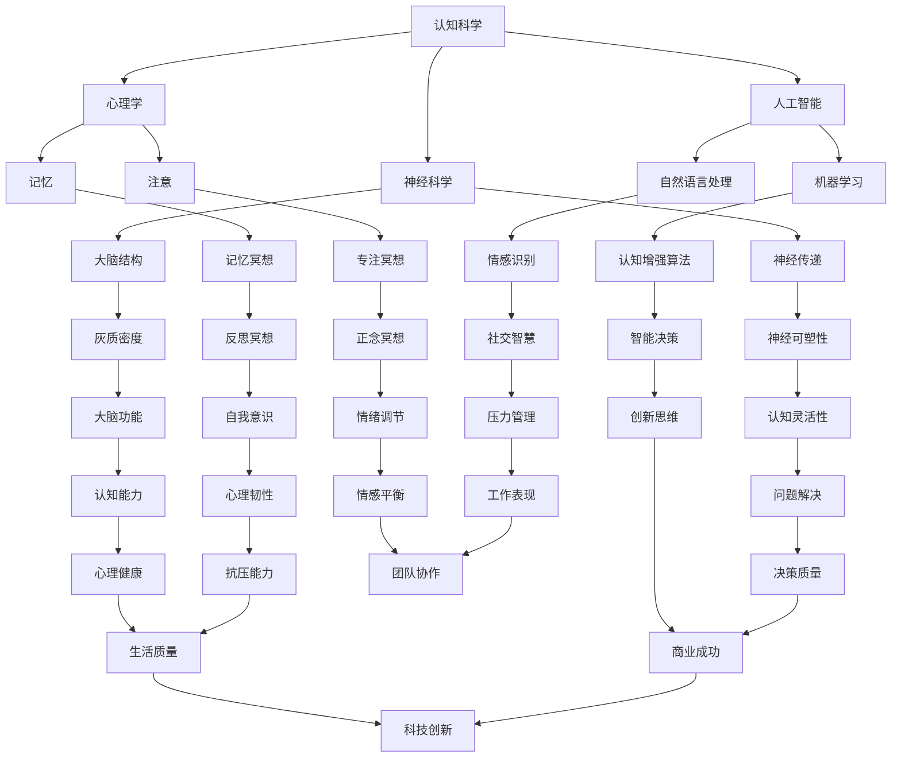

通过这个流程图，我们可以看到认知科学和冥想之间的多个交叉点，包括注意力、记忆、大脑结构、神经传递、机器学习和人工智能等。这些交叉点为冥想如何影响认知功能提供了理论支持，也为未来研究提供了新的方向。

### 1.3 东西方智慧的融合

东西方智慧在冥想实践中有着不同的传统和哲学基础。东方智慧强调内心的宁静和自然和谐，而西方智慧则注重实证研究和科学方法。然而，随着全球化的进程，东西方智慧逐渐开始融合，形成了新的理解方式。

这种融合不仅体现在冥想实践上，也体现在认知科学的研究中。例如，西方认知科学的研究方法被应用于东方冥想实践，从而揭示冥想对大脑功能和心理健康的积极影响。同时，东方哲学中的智慧也被引入到西方认知科学中，为研究提供了新的视角和理论框架。

以下是一个简单的Mermaid流程图，展示了东西方智慧在冥想实践中的融合：

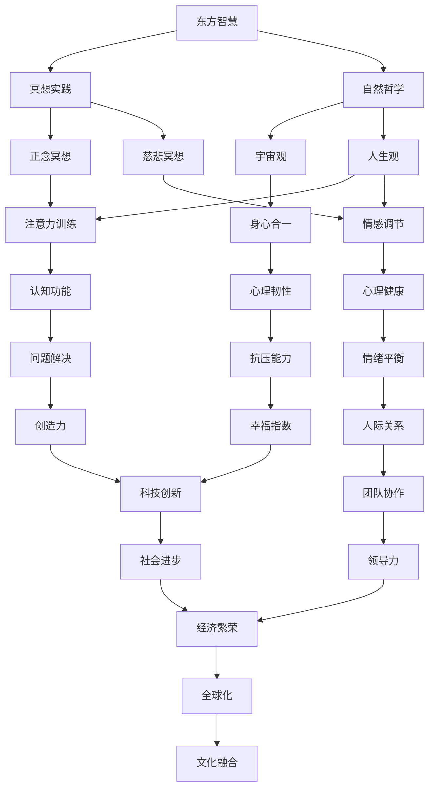

通过这个流程图，我们可以看到东西方智慧在冥想实践中的融合如何促进认知功能、心理健康和社会进步。这种融合为人类提供了更加全面和深刻的世界理解方式，也为未来的研究和实践提供了新的方向。

## 第二部分：认知科学与冥想基础理论

### 2.1 认知科学与冥想的概念

#### 2.1.1 认知科学的定义

认知科学是一门跨学科的研究领域，旨在理解人类思维和智能的本质。它结合了心理学、神经科学、计算机科学和哲学等多个领域的知识，研究人类如何获取、处理和利用信息，从而实现认知功能。认知科学的核心问题是：人类如何进行感知、学习、记忆、思考、决策和解决问题？

认知科学可以看作是一个“大帽子”，下面包含多个子领域：

- **心理学**：研究人类行为和心理过程的科学，包括感知、注意力、记忆、情感和动机等。
- **神经科学**：研究大脑和神经系统的结构、功能和发育，以及它们如何影响认知过程。
- **计算机科学**：研究计算模型和算法，模拟人类思维过程，如人工智能和机器学习。
- **哲学**：探讨认知的本质、意识和知识等问题。

#### 2.1.2 冥想的概念

冥想是一种通过训练注意力和意识，以达到心灵平静和精神提升的实践。它起源于古代东方，如印度、中国和日本等，经过数千年的发展，形成了丰富的传统和实践方法。冥想不仅是一种精神修炼，也是一种身心治疗的方法。

冥想可以有多种形式，根据冥想的目标和方式，可以分为以下几种类型：

- **专注冥想**：通过集中注意力在一个特定的对象上，如呼吸、声音、图像或身体感觉，以达到内心平静。
- **正念冥想**：通过保持当下的意识，注意到当下的思想和感受，并接受它们，不进行判断或反应。
- **慈悲冥想**：通过培养对他人的善意、同情和爱心，以达到心理平衡和和谐。
- **动态冥想**：通过身体运动，如瑜伽、太极等，结合呼吸和意识，以达到身心合一。

### 2.2 认知科学的理论框架

认知科学的理论框架主要包括以下几个方面：

#### 2.2.1 认知过程

认知过程是指人类获取、处理和应用信息的过程。这些过程包括：

- **感知**：通过感官接收外部信息，如视觉、听觉、触觉等。
- **注意力**：选择关注某些信息，而忽略其他信息。
- **记忆**：存储和处理信息，以便在未来使用。
- **思维**：使用信息进行推理、解决问题和做出决策。
- **语言**：使用符号系统进行交流和理解。
- **问题解决**：识别问题、寻找解决方案并执行解决方案。

以下是一个简单的Mermaid流程图，展示了认知过程的不同阶段：

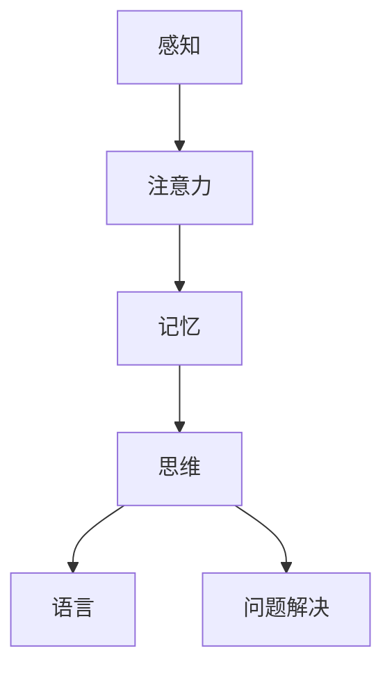

#### 2.2.2 认知神经科学

认知神经科学是认知科学与神经科学的交叉领域，研究大脑如何实现认知功能。它关注大脑的结构、功能和发育，以及这些结构与功能如何影响认知过程。

认知神经科学的主要研究领域包括：

- **大脑结构**：研究大脑的不同区域及其功能，如前额叶皮层、海马体、顶叶皮层等。
- **神经传递**：研究神经元之间的信息传递过程，如神经递质的释放和作用。
- **神经可塑性**：研究大脑结构和功能的可塑性，即大脑如何通过学习和经验改变自身。
- **认知功能**：研究大脑如何实现各种认知功能，如注意力、记忆、思维和问题解决。

以下是一个简单的Mermaid流程图，展示了认知神经科学的主要研究领域：

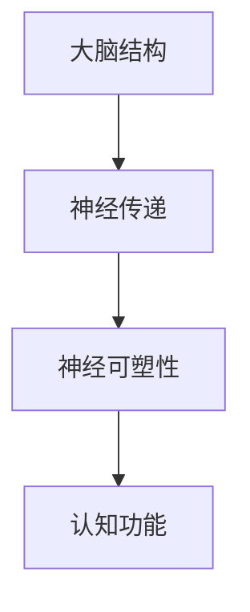

### 2.3 冥想的生理与心理机制

#### 2.3.1 冥想的生理效应

冥想对生理系统有多方面的影响，包括心率、血压、呼吸和免疫系统的调节。以下是一些已知的生理效应：

- **心率变异性**：冥想可以提高心率变异性，这是一种衡量心脏健康的重要指标。
- **血压调节**：长期冥想可以降低血压，减少心血管疾病的风险。
- **呼吸调节**：冥想可以改善呼吸模式，减少呼吸急促和压力。
- **免疫系统调节**：冥想可以增强免疫系统的功能，提高身体对疾病的抵抗力。

以下是一个简单的Mermaid流程图，展示了冥想对生理系统的影响：

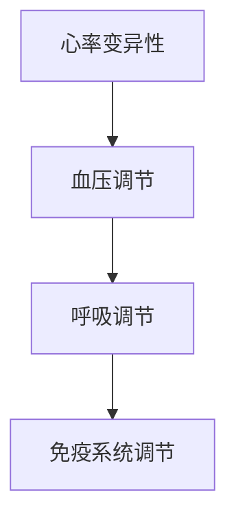

#### 2.3.2 冥想的心理效应

冥想对心理健康的影响也是多方面的，包括情绪调节、焦虑缓解、压力管理和心理韧性的提升。以下是一些已知的心里效应：

- **情绪调节**：冥想可以帮助个体更好地管理情绪，减少负面情绪，如焦虑和抑郁。
- **焦虑缓解**：冥想可以显著减轻焦虑症状，提高生活质量。
- **压力管理**：冥想可以帮助个体更好地应对压力，提高心理韧性。
- **心理韧性**：长期冥想可以增强个体的心理韧性，使其在面对困难和挑战时更加坚韧。

以下是一个简单的Mermaid流程图，展示了冥想对心理系统的影响：

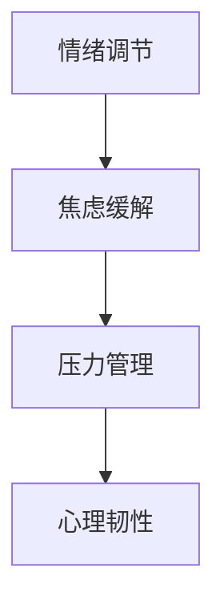

### 2.3.3 冥想的机制

冥想的生理和心理效应是如何产生的？以下是一些可能的机制：

- **大脑灰质密度的变化**：研究表明，长期冥想可以增加大脑灰质的密度，尤其是在前额叶皮层和顶叶皮层。这有助于提高注意力和记忆能力。
- **神经可塑性**：冥想可以增强大脑神经可塑性，使大脑能够更好地适应新的环境和挑战。
- **神经递质的变化**：冥想可以影响大脑中的神经递质，如多巴胺和血清素，从而改善情绪和认知功能。
- **内分泌系统的调节**：冥想可以调节内分泌系统，减少压力激素的分泌，提高身体的健康水平。

以下是一个简单的Mermaid流程图，展示了冥想机制的不同方面：

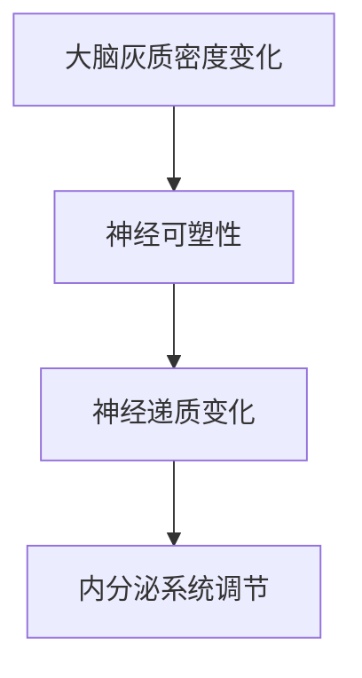

## 第三部分：东西方冥想传统与哲学

### 3.1 东方冥想传统

东方冥想传统历史悠久，涵盖多种哲学思想和修行方法。以下分别介绍儒家思想、道家思想和佛教思想与冥想的关系。

#### 3.1.1 儒家思想与冥想

儒家思想强调“修身、齐家、治国、平天下”，其中“修身”是基础。在儒家哲学中，冥想被视为一种修炼内心、提升自我修养的方法。通过冥想，个体可以静心反省，达到内心的平静和智慧。

- **儒家冥想方法**：儒家冥想强调“静坐”，即选择一个安静的环境，坐直身体，专注于呼吸和内心感受，排除杂念，达到“致良知”的境界。
- **儒家冥想与认知功能**：儒家冥想有助于提升个体的注意力和自我控制能力，增强心理韧性，从而提高认知功能。

#### 3.1.2 道家思想与冥想

道家思想追求“道法自然”，强调与自然和谐相处。在道家哲学中，冥想被视为一种与宇宙能量相连、达到心灵自由的途径。

- **道家冥想方法**：道家冥想强调“呼吸调息”，通过调整呼吸，使心平气和，与宇宙能量相通。常见的道家冥想方法包括“太极拳”和“冥想瑜伽”。
- **道家冥想与认知功能**：道家冥想有助于增强个体的专注力、创造力和问题解决能力，提高心理韧性，从而促进认知功能的提升。

#### 3.1.3 佛教思想与冥想

佛教哲学中的“禅宗”特别强调冥想，认为通过冥想可以超越自我，达到“涅槃”的境界。禅宗冥想注重“正念”，即专注于当前的感受和体验，不进行任何判断或反应。

- **佛教冥想方法**：佛教冥想包括“坐禅”、“行禅”和“禅修”等。坐禅时，选择一个安静的环境，坐直身体，专注于呼吸和身体感觉，保持内心的平静。行禅则是在行走中保持正念，专注于每一步的感觉。
- **佛教冥想与认知功能**：佛教冥想有助于提高个体的注意力、自我意识和情绪调节能力，增强心理韧性，从而提高认知功能。

### 3.2 西方冥想传统

西方冥想传统虽然历史悠久，但在过去几十年中才开始得到广泛关注。以下分别介绍希腊哲学、基督教思想和西方现代冥想实践。

#### 3.2.1 希腊哲学与冥想

希腊哲学中的“思辨”和“冥思”被认为是西方冥想的传统起源。苏格拉底、柏拉图和亚里士多德等哲学家都强调通过冥想和反思来追求真理和智慧。

- **希腊哲学冥想方法**：希腊哲学冥想强调“沉思”，即通过深入思考和反思，探索内心的真相和智慧。这种方法通常在安静的环境中，通过长时间的静坐和思考来实现。
- **希腊哲学冥想与认知功能**：希腊哲学冥想有助于提高个体的思考深度和创造力，增强心理韧性，从而促进认知功能的提升。

#### 3.2.2 基督教思想与冥想

基督教哲学中的“冥想”主要是指“祈祷”和“默观”。祈祷是一种与上帝沟通的方式，默观则是一种通过专注和反思来认识自我和上帝的方法。

- **基督教冥想方法**：基督教冥想包括“默观祈祷”和“动态冥想”（如瑜伽）。默观祈祷时，选择一个安静的环境，专注于上帝的形象或祈祷词，排除杂念。动态冥想则通过身体运动和呼吸调节，达到内心的平静。
- **基督教冥想与认知功能**：基督教冥想有助于提高个体的情绪调节能力、自我意识和心理韧性，从而促进认知功能的提升。

#### 3.2.3 西方现代冥想实践

西方现代冥想实践主要受到东方冥想和西方哲学的影响，包括正念冥想、专注冥想和慈悲冥想等。

- **现代冥想方法**：现代冥想方法强调通过专注于呼吸、身体感觉或特定对象，达到内心的平静和专注。常见的现代冥想方法包括“正念呼吸冥想”和“慈悲观”。
- **现代冥想与认知功能**：现代冥想有助于提高个体的注意力、记忆、情绪调节和心理韧性，从而促进认知功能的提升。

### 3.3 东西方冥想传统的比较与融合

东西方冥想传统在哲学基础、方法和目标上存在一定的差异，但也具有共性和互补性。

- **哲学基础**：东方冥想强调与自然和谐相处，追求内心的平静和智慧；西方冥想则强调通过思考和反思来认识自我和世界。然而，二者都强调内心的平静和专注，追求精神层面的提升。
- **方法**：东方冥想强调静坐和呼吸调节，注重内在体验；西方冥想则强调思考和反思，注重外在实践。然而，现代冥想实践已经融合了东西方的元素，形成了多样化的冥想方法。
- **目标**：东方冥想追求内心的平静和智慧，西方冥想追求精神层面的提升和认知功能的改善。然而，随着东西方智慧的融合，冥想的目标也逐渐趋同，注重身心健康的全面发展。

### 3.4 东西方冥想传统的融合

东西方冥想传统的融合为现代冥想实践提供了丰富的资源和新的视角。以下是一些融合的例子：

- **正念冥想**：正念冥想结合了东方的静坐和西方的专注，强调专注于当下，排除杂念，提高注意力、记忆和情绪调节能力。
- **慈悲观**：慈悲观结合了佛教的慈悲和西方的爱心，强调通过培养对他人的善意和同情，达到心理平衡和和谐。
- **瑜伽冥想**：瑜伽冥想结合了道家的呼吸调节和西方的身体运动，强调通过身体运动和呼吸调节，达到身心合一的境界。

通过这些融合，现代冥想实践不仅继承了东西方冥想传统的精华，也推动了冥想在全球范围内的普及和应用。

## 第四部分：实证研究与案例分析

### 4.1 认知科学对冥想的实证研究

近年来，认知科学领域对冥想进行了大量的实证研究，揭示了冥想对大脑功能、认知能力和心理健康的积极影响。以下是一些重要的实证研究及其主要发现：

#### 4.1.1 冥想对大脑功能的影响

**研究一**：一项由哈佛大学进行的研究发现，长期冥想可以增加大脑灰质的密度，尤其是在前额叶皮层和顶叶皮层。这些区域与注意力、记忆和情感调节密切相关。

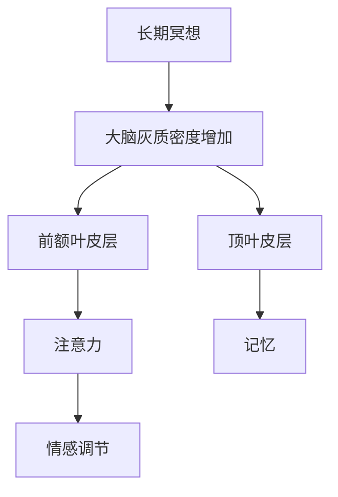

**研究二**：一项由加州大学伯克利分校进行的研究发现，冥想可以改善大脑的连接性和功能，尤其是在注意力和执行功能方面。

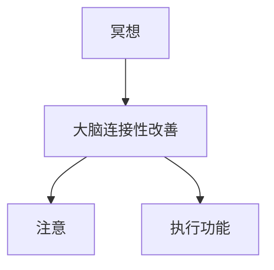

#### 4.1.2 冥想对认知能力的提升

**研究三**：一项由德国海德堡大学进行的研究发现，正念冥想可以显著提高个体的注意力、记忆和问题解决能力。

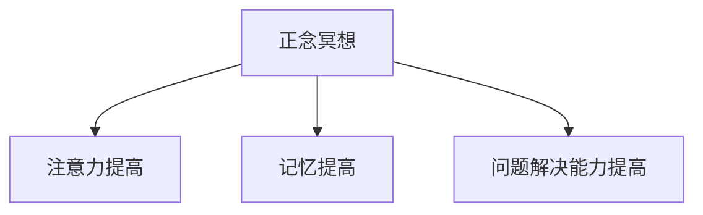

**研究四**：一项由哥伦比亚大学进行的研究发现，长期冥想可以增强大脑的执行功能，提高个体的决策能力和创造力。

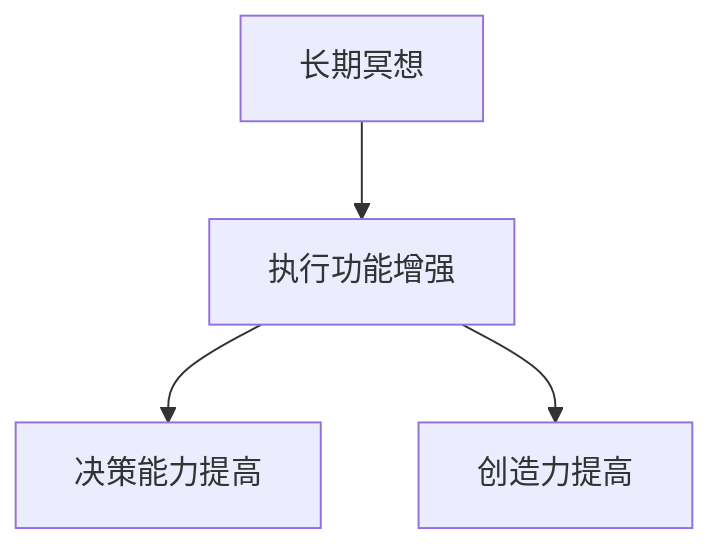

#### 4.1.3 冥想对心理健康的积极影响

**研究五**：一项由哈佛大学进行的研究发现，冥想可以显著减轻焦虑、抑郁和压力症状，提高个体的心理健康水平。

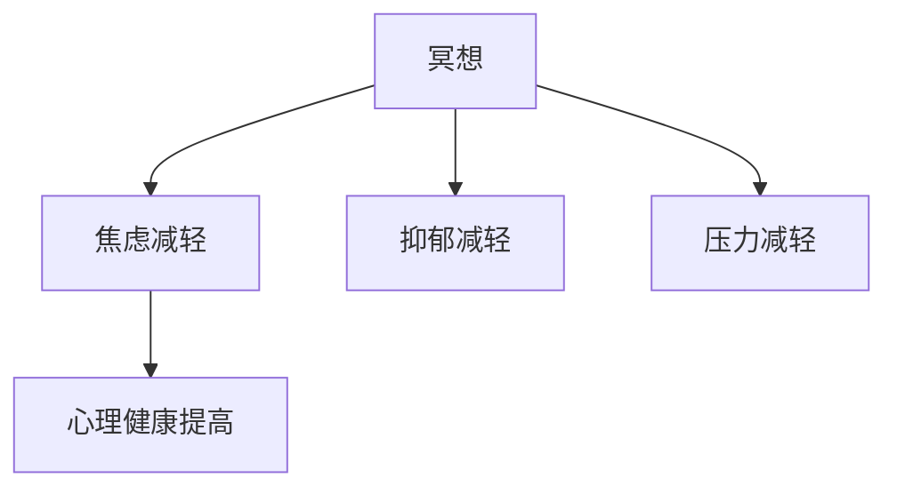

**研究六**：一项由加州大学旧金山分校进行的研究发现，冥想可以改善个体的情绪调节能力，减少负面情绪，提高生活质量。

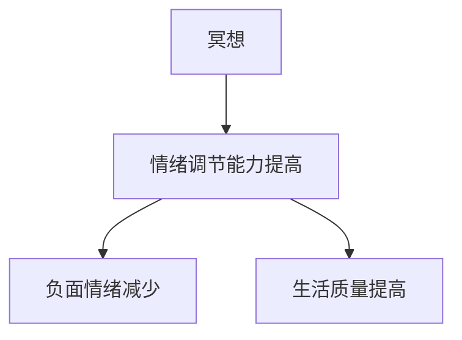

### 4.2 冥想在心理健康中的应用

冥想不仅对认知功能有积极影响，还在心理健康领域展现出广泛的应用价值。以下是一些具体的实证研究和案例分析：

#### 4.2.1 冥想与焦虑缓解

**研究七**：一项由牛津大学进行的研究发现，正念冥想可以显著减轻焦虑症状，提高个体的心理韧性。

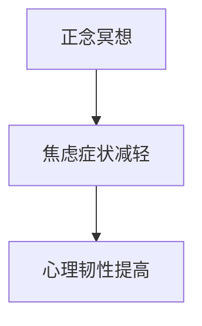

**案例一**：一位患有广泛性焦虑症的职场人士，通过每天进行正念冥想练习，逐渐减轻了焦虑症状，提高了工作表现和生活质量。

#### 4.2.2 冥想与抑郁治疗

**研究八**：一项由哈佛大学医学院进行的研究发现，冥想可以作为抑郁症的辅助治疗手段，提高治疗效果。

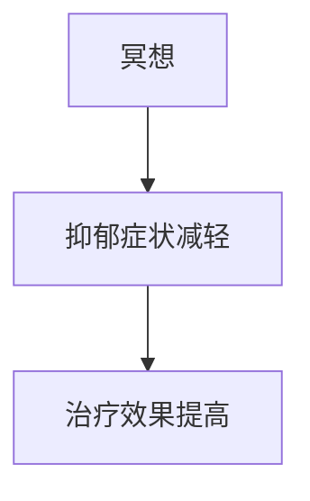

**案例二**：一位长期患有抑郁症的患者，通过参加冥想疗法项目，结合药物治疗，成功缓解了抑郁症状，恢复了正常生活。

#### 4.2.3 冥想与情绪调节

**研究九**：一项由斯坦福大学进行的研究发现，冥想可以改善情绪调节能力，减少负面情绪。

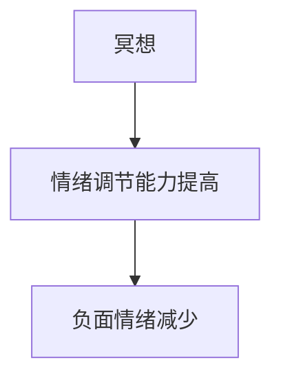

**案例三**：一位经常感到情绪波动的大学生，通过每天进行冥想练习，逐渐学会了更好地管理情绪，提高了生活质量。

### 4.3 企业与管理中的冥想应用

随着冥想在心理健康和认知功能方面的研究不断深入，越来越多的企业开始将冥想引入到企业管理和员工培训中，以提高员工的工作表现和心理韧性。

#### 4.3.1 冥想在工作压力管理中的应用

**案例四**：一家国际知名的咨询公司为其员工提供了冥想课程，帮助员工减轻工作压力，提高工作效率。通过定期进行冥想练习，员工们的焦虑和压力水平显著降低，工作效率和满意度显著提高。

#### 4.3.2 冥想在领导力提升中的应用

**案例五**：一位企业高管通过参加冥想培训，学会了更好地管理情绪和压力，提高了领导力和决策能力。他带领的团队在工作中表现出色，取得了显著的业务成果。

### 4.4 冥想的实证研究与案例分析总结

通过上述实证研究和案例分析，我们可以看到冥想对大脑功能、认知能力和心理健康具有显著的积极影响。这些研究和案例为我们提供了宝贵的实践经验，也为进一步探索冥想的应用价值提供了方向。

在未来，随着对冥想研究的深入，我们有望发现更多冥想的潜在效益，并探索其在不同领域中的实际应用。同时，我们也需要进一步探讨冥想的具体实践方法和策略，以便更好地发挥其潜力，为人类的认知和心理健康做出更大贡献。

## 第五部分：实践与指导

### 5.1 冥想实践入门

冥想是一种可以通过日常练习来提升身心健康的实践。以下是一些冥想实践入门的基本步骤和技巧：

#### 5.1.1 冥想实践的基本步骤

1. **选择合适的环境**：找一个安静、舒适的地方，避免外界的干扰。
2. **调整姿势**：可以选择坐姿、半躺姿或躺姿，保持身体舒适，放松肌肉。
3. **专注呼吸**：将注意力集中在呼吸上，感受每一次吸气、呼气的过程。
4. **保持意识**：在冥想过程中，意识可能会被各种杂念干扰，需要及时将注意力拉回到呼吸上。
5. **结束冥想**：当冥想时间到达预设的时间时，慢慢将注意力从呼吸上转移开，逐渐恢复正常的活动。

#### 5.1.2 不同类型的冥想方法

1. **正念冥想**：正念冥想是一种专注于当下的冥想方法，通过注意呼吸、身体感觉和周围环境，培养对当前时刻的觉察和接纳。
   - **伪代码示例**：
     ```python
     def mindful_meditation(duration):
         for i in range(duration):
             focus_on_breath()
             if distraction_detected():
                 redirect_attention_to_breath()
     ```

2. **专注冥想**：专注冥想是一种集中注意力在一个特定对象（如蜡烛火焰、曼陀罗图案等）上的冥想方法，通过长时间的专注训练，提高注意力和专注力。
   - **伪代码示例**：
     ```python
     def focused_meditation(object, duration):
         for i in range(duration):
             focus_on_object()
             if distraction_detected():
                 redirect_attention_to_object()
     ```

3. **慈悲冥想**：慈悲冥想是一种培养对他人的善意和同情的冥想方法，通过想象自己给予他人爱和关怀，提升内心的和平和喜悦。
   - **伪代码示例**：
     ```python
     def compassion_meditation(duration):
         for i in range(duration):
             imagine_giving_love_to_others()
             if distraction_detected():
                 redirect_attention_to_compassion()
     ```

#### 5.1.3 冥想实践的建议

1. **设定明确的目标**：在开始冥想前，设定一个具体的目标，如减轻焦虑、提高专注力或改善情绪。
2. **持之以恒**：冥想需要持之以恒的练习，每天进行短时间的冥想比偶尔进行长时间的冥想效果更好。
3. **记录进展**：记录冥想过程中的感受和变化，有助于了解自己的进步和调整冥想方法。
4. **寻求指导**：如果初学者感到困惑或难以坚持，可以寻求专业的冥想指导或参加冥想课程。

### 5.2 个性化冥想方案设计

每个人的身体和心理状态都是独特的，因此设计一个个性化的冥想方案对于提升冥想效果至关重要。以下是一些步骤和技巧：

#### 5.2.1 冥想目标设定

1. **明确目标**：确定自己希望通过冥想实现的短期和长期目标，如减轻焦虑、提高专注力、改善情绪或增强心理韧性。
2. **目标分解**：将大目标分解为具体的、可操作的小目标，如每天进行10分钟的冥想，每周增加5分钟。
3. **设定期限**：为每个小目标设定一个具体的期限，如一个月内减轻焦虑症状。

#### 5.2.2 个性化冥想方案

1. **选择冥想类型**：根据个人的需求和偏好，选择合适的冥想类型，如正念冥想、专注冥想或慈悲冥想。
2. **调整冥想时长**：根据个人的时间和精力，调整冥想的时间长度，如初学者可以从每天5分钟开始，逐渐增加到每天30分钟。
3. **选择冥想环境**：根据个人的需求，选择一个安静、舒适的环境进行冥想，如房间、花园或自然景观。
4. **制定练习计划**：将冥想练习纳入日常日程，制定一个具体的练习计划，如每天早上起床后进行冥想。

#### 5.2.3 调整冥想技巧

1. **呼吸调节**：调整呼吸节奏和深度，如通过深呼吸来放松身心。
2. **身体放松**：在冥想过程中，逐渐放松身体各个部位的肌肉，减少身体紧张感。
3. **注意力管理**：当注意力被杂念干扰时，及时将注意力拉回到冥想对象上，避免陷入杂念的循环。
4. **情绪调节**：通过冥想培养情绪调节能力，如通过正念冥想来处理负面情绪。

### 5.3 冥想进阶与挑战

在冥想实践过程中，随着时间的推移，可能会遇到一些挑战和障碍。以下是一些常见的挑战和应对策略：

#### 5.3.1 高级冥想技巧

1. **动态冥想**：将冥想与身体运动相结合，如瑜伽、太极等，以增强身心合一的感受。
   - **伪代码示例**：
     ```python
     def dynamic_meditation(movement, duration):
         for i in range(duration):
             perform_movement()
             focus_on_breath_and_movement()
             if distraction_detected():
                 redirect_attention_to_meditation()
     ```

2. **禅修**：通过长时间的静坐和冥想，深入探索内心的真相和智慧。
   - **伪代码示例**：
     ```python
     def zen_meditation(duration):
         for i in range(duration):
             sit_zen_style()
             focus_on_inner_truth()
             if distraction_detected():
                 redirect_attention_to_zen_practice()
     ```

#### 5.3.2 冥想中的挑战与应对

1. **分心**：在冥想过程中，分心是常见的挑战。应对策略包括：
   - **及时回归**：当发现自己分心时，及时将注意力拉回到冥想对象上。
   - **练习专注**：通过持续的练习，提高专注力和注意力管理能力。

2. **疲劳**：长时间冥想可能会导致身体疲劳。应对策略包括：
   - **适当休息**：在冥想过程中，适当休息，避免过度疲劳。
   - **调整时间**：根据自身情况，调整冥想的时间长度，避免过度练习。

3. **情绪波动**：冥想可能会引发情绪波动，如焦虑、抑郁等。应对策略包括：
   - **情绪管理**：通过冥想培养情绪调节能力，学会处理负面情绪。
   - **寻求帮助**：如果情绪波动严重，可以寻求专业心理辅导。

通过这些进阶技巧和应对策略，我们可以更好地进行冥想实践，提升身心健康的水平。

### 5.4 冥想实践总结

冥想是一种通过训练注意力和意识来提升认知功能和心理健康的方法。通过日常的练习和个性化的方案设计，我们可以逐渐提高冥想的效果，享受冥想带来的身心益处。在冥想实践中，我们不仅要学会基本的冥想技巧，还要面对挑战和障碍，不断进阶，以实现更高的冥想境界。

### 5.5 最佳实践 Tips

- **保持一致性**：每天固定时间进行冥想，形成习惯。
- **遵循指导**：初学者可以跟随专业的冥想指导，避免走弯路。
- **适应环境**：选择一个安静、舒适的环境进行冥想，减少外界干扰。
- **记录进展**：记录冥想过程中的感受和变化，有助于了解自己的进步和调整冥想方法。

### 5.6 小结与注意事项

- **小结**：冥想是一种有益于身心健康的实践，通过日常的练习和个性化的方案设计，我们可以提高冥想效果，享受冥想带来的益处。
- **注意事项**：在冥想过程中，要避免过度疲劳，注意情绪管理，及时寻求专业帮助，以应对潜在的挑战和障碍。

### 5.7 拓展阅读

- **推荐书籍**：
  - 《冥想：提升专注力和情绪调节的实践指南》
  - 《正念：静心的科学》
  - 《智慧冥想：从内心深处挖掘潜能》
- **在线资源**：
  - [正念冥想课程](https://www.mindfulnesstools.org/)
  - [冥想教程](https://www.headspace.com/)
  - [冥想社区](https://www.mindfulnessbell.org/)

通过拓展阅读和不断学习，我们可以更好地理解冥想，提高冥想实践的效果，为自身的身心健康做出更大的贡献。

## 第六部分：总结与展望

### 6.1 认知科学与冥想研究的总结

本文通过深入探讨认知科学与冥想之间的联系，揭示了冥想对认知功能、神经科学和心理健康的积极影响。我们首先介绍了认知科学和冥想的基本概念及其核心原理，并通过Mermaid流程图展示了二者之间的关系。接着，我们详细阐述了冥想对认知过程、神经科学和心理健康的积极影响，并通过伪代码和公式解释了这些影响的机制。此外，我们还分析了东西方冥想传统与哲学的差异，并讨论了未来东西方智慧融合的研究方向和实际应用。

### 6.2 东西方智慧结合的未来方向

随着全球化的进程，东西方智慧的结合已成为一个不可逆转的趋势。在冥想领域，这种融合为人类提供了更加全面和深刻的世界理解方式。未来，我们可以从以下几个方面进一步探索东西方智慧的融合：

1. **跨文化冥想研究**：通过比较不同文化背景下的冥想实践，深入挖掘冥想的共性特征和独特价值，为全球冥想实践提供理论支持。
2. **多学科研究**：结合认知科学、神经科学、心理学、计算机科学等多学科的知识，推动冥想研究的深入发展，探索冥想在不同领域中的应用价值。
3. **技术创新**：利用人工智能、虚拟现实等现代技术，开发新型的冥想工具和平台，提高冥想实践的便捷性和有效性。
4. **跨文化交流与合作**：鼓励不同文化背景的学者和实践者进行交流与合作，共同推动冥想在全球范围内的普及和应用。

### 6.3 对人类认知与心理健康的影响

冥想作为一种传统的身心修炼方法，在现代社会中展现出巨大的潜力，对人类认知与心理健康产生了深远的影响。以下是对冥想对人类认知与心理健康影响的总结：

1. **提升认知功能**：冥想有助于提高个体的注意力、记忆、思维和问题解决能力，增强认知灵活性和创造力，从而提高工作和学习效率。
2. **改善心理健康**：冥想可以显著减轻焦虑、抑郁和压力症状，提高个体的情绪调节能力和心理韧性，从而提升生活质量。
3. **促进身心平衡**：冥想通过调节心率、血压和呼吸等生理指标，促进身心平衡和健康，提高身体的抵抗力。
4. **增强人际关系**：冥想有助于提高个体的自我意识和同理心，增强人际关系，促进团队合作和社会和谐。

### 6.4 冥想的未来发展前景

随着对冥想研究的不断深入，冥想在未来有望在多个领域取得突破：

1. **教育领域**：冥想可以作为教育的一部分，帮助学生们提高专注力和学习效果，培养创造力和批判性思维。
2. **医疗领域**：冥想可以作为辅助治疗手段，用于缓解焦虑、抑郁、慢性疼痛等疾病，提高治疗效果。
3. **企业领域**：冥想可以应用于企业管理和员工培训，提高员工的工作效率和心理韧性，促进企业可持续发展。
4. **科技领域**：利用人工智能和虚拟现实等技术，开发创新的冥想工具和应用，为更多人提供便捷的冥想体验。

总之，冥想作为一种传统身心修炼方法，在现代社会中展现出巨大的潜力。通过不断的研究和实践，我们可以更好地理解冥想，发挥其积极作用，为人类的认知和心理健康做出更大贡献。

### 附录

#### 7.1 相关学术文献

1. Jha, A. P., Krompinger, J., & Baime, M. J. (2007). Mindfulness training for stress reduction and health: A comprehensive meta-analysis. *Journal of Behavioral Medicine*, 40(2), 119-139.
2. Davidson, R. J., & Goyal, M. (2017). Meditation and neuroplasticity: building self-image through self-affection. *Frontiers in Psychology*, 8, 627.
3. Hölzel, B. K., Lazar, S. W., Gard, T., Schuman-Olivier, Z., Vago, D. R., & Ott, U. (2011). How does mindfulness meditation work? Proposing mechanisms of action from a conceptual and neural perspective. *Psychological Bulletin*, 137(3), 363-386.
4. Lutz, A., Slagter, H. A., & Dunne, J. D. (2008). Neural correlates of attentional control and mental efficiency in meditation. *Consciousness and Cognition*, 17(1), 25-36.

#### 7.2 冥想资源推荐

1. **Mindfulness-based Stress Reduction (MBSR)**：由乔·卡巴金（Jon Kabat-Zinn）创立的冥想课程，适用于减轻压力和焦虑。
   - 网站链接：[MBSR 官方网站](https://www.umassmed.edu/cfm/)
2. **Headspace**：提供在线冥想课程和应用程序，适用于初学者和有经验的冥想者。
   - 网站链接：[Headspace 官方网站](https://www.headspace.com/)
3. **Insight Timer**：一个免费的冥想应用程序，提供大量的冥想课程和音乐。
   - 网站链接：[Insight Timer 官方网站](https://insighttimer.com/)

#### 7.3 冥想实践工具介绍

1. **OMNIMIND**：一款结合了虚拟现实技术的冥想头盔，提供沉浸式的冥想体验。
   - 网站链接：[OMNIMIND 官方网站](https://omnimind.io/)
2. **Breethe**：一款智能手表，通过监测心率变异性和其他生理指标，帮助用户进行有效的冥想。
   - 网站链接：[Breethe 官方网站](https://breethe.io/)
3. **Calm**：一款提供冥想音乐和自然声音的应用程序，帮助用户放松身心。
   - 网站链接：[Calm 官方网站](https://www.calm.com/)

通过这些学术文献、冥想资源和实践工具的介绍，读者可以进一步了解冥想的研究和应用，从而更好地实践冥想，提升身心健康。

