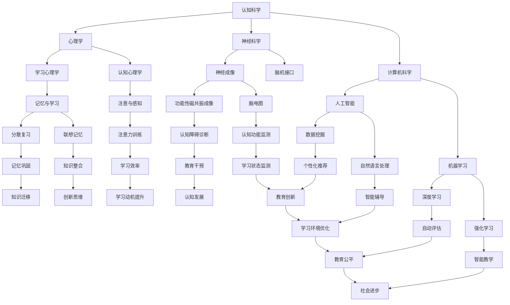
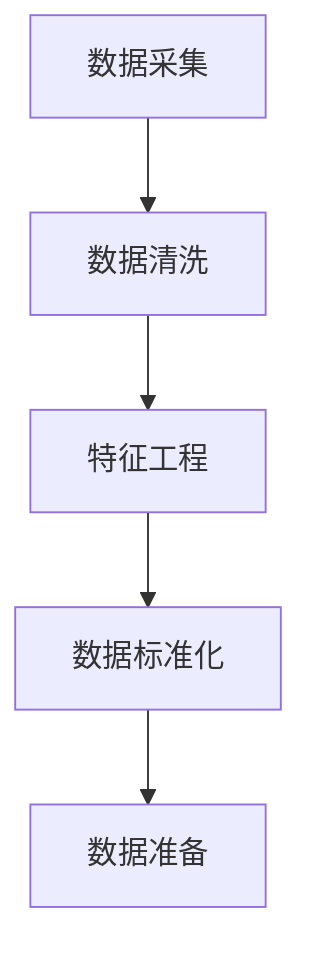

                 

### 引言

**1.1 书籍背景与目的**

随着科技的飞速发展，人工智能、大数据、云计算等新兴技术的不断涌现，全球信息化进程不断加速。在此背景下，认知科学与教育学的交叉研究显得尤为重要。认知科学是研究人类认知过程的跨学科领域，包括心理学、神经科学、计算机科学等多个学科；而教育学则是研究教育现象和教育规律的学科，关注个体如何通过教育过程获取知识、技能和价值观。将认知科学与教育学相结合，旨在探索更有效的学习方法，提高教育质量，进而优化个体与世界之间的理解。

本篇文章的目的在于通过系统地梳理认知科学与教育学交叉领域的理论、应用和实践，为教育工作者、研究人员以及相关行业从业者提供有益的参考。文章首先介绍认知科学与教育学的基本概念和范畴，接着深入探讨二者之间的交叉点，最后提出优化学习过程的策略和方法，以期在理论与实践层面推动认知科学与教育学交叉研究的进一步发展。

**1.2 认知科学与教育学的联系与交叉点**

认知科学与教育学的交叉点主要体现在以下几个方面：

首先，认知科学为教育学提供了理论支持。通过研究人类的认知过程，认知科学揭示了学习、记忆、思维等心理活动的机制，为教育方法的设计提供了科学依据。例如，认知心理学关于记忆规律的研究，有助于教育者制定有效的复习计划。

其次，教育学为认知科学提供了实践场景。教育过程本身就是一种认知活动，通过对教育现象的观察和分析，教育学积累了丰富的经验，这些经验对认知科学的理论验证和修正具有重要意义。

最后，二者的交叉还体现在技术手段的应用上。随着信息技术的发展，认知科学与教育学开始借助先进的技术手段进行研究和实践，如脑机接口技术、虚拟现实技术等，这些技术不仅提高了研究的精度和效率，也丰富了教育手段和形式。

**1.3 优化世界理解的学习过程的重要性**

在当今知识爆炸的时代，学习已经成为了人们不可或缺的一部分。然而，传统的教育模式在许多方面已经难以满足现代社会的需求。例如，学生的学习效率低下，难以充分理解复杂的知识体系；教育资源的分配不均，导致不同地区和群体之间的教育质量差距加大。这些问题不仅影响了个体的全面发展，也制约了社会的整体进步。

优化学习过程，提升个体与世界之间的理解，具有以下几个重要意义：

首先，优化学习过程能够提高个体的认知能力。通过科学的训练和方法，个体可以更有效地获取和整合知识，形成深刻的认知结构。

其次，优化学习过程有助于减少教育不公平现象。通过技术手段和科学方法，可以实现对教育资源的合理配置，使更多人获得优质教育资源。

最后，优化学习过程可以促进社会的整体进步。当个体具备更强的认知能力和知识储备时，他们更有可能为社会的发展做出贡献，从而推动社会的全面进步。

总之，认知科学与教育学的交叉研究为我们提供了优化学习过程的新思路和新方法。通过深入探讨二者之间的联系和交叉点，我们可以为教育领域的改革和发展提供有力的理论支持和实践指导。接下来，我们将进一步详细探讨认知科学与教育学的基本概念和范畴，为后续内容的展开奠定基础。

### 基本概念

**2.1 认知科学的定义与范畴**

认知科学是一门跨学科的研究领域，旨在理解人类和动物的心理、大脑和计算机系统中的认知过程。认知科学的核心概念包括感知、注意、记忆、语言、决策、问题解决和认知发展等。其研究范畴广泛，涵盖了心理学、神经科学、人类学、哲学、语言学、计算机科学和人工智能等多个学科。

在认知科学中，感知是指个体通过感官接收外部信息并将其转化为神经信号的过程；注意是大脑处理信息的选择性过程，决定了哪些信息会被重点关注；记忆是信息储存和提取的能力，分为短期记忆和长期记忆；语言是认知过程的工具，通过语言可以表达思想和知识；决策和问题解决涉及个体如何在复杂情境中做出最优选择；认知发展则研究个体从出生到成年的认知能力如何逐步发展和变化。

**2.2 教育学的定义与范畴**

教育学是研究教育现象和教育规律的学科，旨在探讨如何通过教育过程促进个体的全面发展。教育学的核心概念包括教育目标、教育方法、教育内容、教育评价、学习动机和学习者发展等。

教育目标是指通过教育希望实现的具体结果，包括知识、技能、态度和价值观等方面的培养；教育方法是指教师和学生进行教学和学习的方式，包括讲授、讨论、实验、实习等；教育内容是教育过程中传授的知识和技能；教育评价是衡量教育效果的标准和过程，包括成绩评估、能力测试和综合评价等；学习动机是指促使个体进行学习的内在动力；学习者发展是指个体在知识、技能和情感等方面的进步和变化。

**2.3 学习过程的定义与要素**

学习过程是指个体通过获取、整合、应用和评估信息来获得知识和技能的动态过程。学习过程的基本要素包括学习者、学习内容、学习环境、学习策略和学习评价。

学习者是学习的主体，其认知能力、动机、情感和学习风格都会影响学习效果；学习内容是学习过程的核心，包括知识、技能和经验等；学习环境是指学习者在学习过程中所处的物理和社会环境，包括教室、实验室、家庭和在线平台等；学习策略是指学习者采取的有助于学习的方法和技巧，包括记忆技巧、阅读策略和时间管理方法等；学习评价是对学习效果的评估和反馈，包括考试、作业、课堂表现和自我评估等。

通过明确认知科学、教育学和学习过程的基本概念，我们可以更好地理解这些领域之间的联系和交叉点。在接下来的章节中，我们将进一步探讨认知科学与教育学之间的交叉理论，为优化学习过程提供更深入的理论支持。

### 认知科学与教育学的交叉理论

**3.1 认知心理学在教育中的应用**

认知心理学是认知科学的重要分支，主要研究人的认知过程，包括知觉、记忆、思维、解决问题等。在教育领域，认知心理学的理论和方法被广泛应用，以优化教学效果和学习过程。

首先，记忆规律在教育中的应用。认知心理学研究表明，记忆分为短期记忆和长期记忆，短期记忆的容量有限，但可以通过复述、编码和练习来增强。教育者可以利用这些规律，设计有效的复习策略，例如通过分散复习、过度学习和联想记忆等方式，帮助学生巩固所学知识。

其次，思维策略在教育中的应用。认知心理学发现，思维可以分为直觉思维和逻辑思维。教育者可以教授学生如何使用逻辑思维来分析和解决问题，同时培养学生的直觉思维能力，使他们能够快速做出合理判断。例如，通过解题技巧的训练，学生可以学会如何快速找到问题的解决方法。

再次，问题解决策略在教育中的应用。认知心理学提出，问题解决是一个包括理解问题、设计解决方案和检验解决方案的过程。教育者可以设计问题解决的教学活动，引导学生进行问题分析、方案设计和结果验证，从而提高学生的解决问题能力。

**3.2 教育学对认知科学的贡献**

教育学在长期实践中积累了丰富的教育经验和理论，对认知科学的发展有着重要贡献。首先，教育学提供了大量关于学习过程和教学方法的实际案例，这些案例为认知科学的研究提供了宝贵的实证数据。例如，通过观察和分析教育过程中的成功案例，认知科学家可以提取出有效的教学策略和方法。

其次，教育学提出了许多关于教育目标、教育内容和教育评价的理论框架，这些框架为认知科学提供了理论基础。教育学认为，教育的目标是培养学生的全面发展，包括知识、技能、情感和价值观等方面的培养。这一目标为认知科学研究提供了明确的方向。

最后，教育学提出了多种教育干预方法，以应对个体在学习过程中遇到的各种问题。例如，针对学习障碍学生，教育学提出了特殊教育方法，通过个性化教学和辅导，帮助他们克服困难，提高学习效果。

**3.3 交叉理论的基本原则与实践方法**

认知科学与教育学的交叉理论遵循以下几个基本原则：

1. **系统性原则**：认知科学与教育学交叉研究的系统性原则强调，教育过程是一个复杂的系统，包括多个要素和环节。研究者需要从整体视角出发，分析各要素之间的关系和相互作用，以实现教育目标。

2. **实证性原则**：交叉理论强调通过实证研究来验证和修正理论。教育者和认知科学家应充分利用实验、观察和问卷调查等方法，收集真实可靠的数据，以支持理论的发展。

3. **适应性原则**：交叉理论认为，教育方法和策略应适应不同个体和情境的需求。教育者需要根据学生的认知特点和教学环境，灵活调整教学方法，以实现最佳教育效果。

在实际应用中，交叉理论可以通过以下几种方法进行实践：

1. **混合教学法**：结合认知心理学和教育学的理论，设计出既符合认知科学规律又具有教育学实践价值的教学方法。例如，通过认知心理学的理论指导，设计有效的学习任务和练习，同时结合教育学的方法，进行课堂讨论、小组合作和个性化辅导。

2. **认知诊断法**：利用认知科学的方法，对学生的认知能力进行诊断和评估，发现他们在学习过程中存在的问题。教育者可以根据诊断结果，制定针对性的教育干预措施。

3. **教育干预研究**：通过设计和实施教育干预项目，验证认知科学和教育学理论的有效性。例如，开展针对学习障碍学生的特殊教育项目，评估干预措施对学习效果的影响。

通过认知科学与教育学的交叉理论，教育者可以更好地理解学习过程的本质，设计出更有效的教育方法和策略，从而优化个体的学习体验，提高教育质量。

### 认知科学与教育学的交叉应用案例

**4.1 学习障碍与认知科学的关系**

学习障碍是指个体在阅读、写作、数学或语言等方面表现出持续性的学习困难，这些障碍通常与神经认知机制的异常有关。认知科学提供了丰富的理论框架和研究方法，用于解释学习障碍的成因及其对学习过程的影响。

首先，认知心理学研究表明，学习障碍可能与注意控制、记忆处理和执行功能等认知机制有关。例如，阅读障碍（如阅读困难）常常与语音识别和语音编码能力的缺陷有关。通过认知神经科学的研究，研究者发现这些认知缺陷通常与大脑特定区域的功能异常相关，例如左侧前颞叶和角回的异常活动。

其次，认知科学还提供了工具和模型来诊断和干预学习障碍。通过神经成像技术（如功能性磁共振成像fMRI和脑电图EEG），研究者可以观察大脑在不同认知任务中的活动模式，从而识别学习障碍的具体认知机制。这些工具不仅帮助诊断学习障碍，还为开发个性化的教育干预措施提供了科学依据。

**4.2 教育干预与认知发展**

教育干预是指通过特定的教学策略和干预措施，帮助学生克服学习障碍，提高学习效果。认知科学与教育学交叉理论在教育干预中的应用，主要体现在以下几个方面：

1. **适应性教学策略**：认知科学的研究成果表明，个体在学习过程中存在不同的认知特点和需求。教育者可以根据学生的认知特点，采用适应性教学策略，如差异化教学和个别化辅导，以满足不同学生的需求。

2. **认知训练**：认知科学的方法和技术，如认知训练程序和游戏，被广泛应用于教育干预。这些训练程序通过系统的练习和反馈，提高学生的注意力、记忆和执行功能等认知能力。例如，通过注意力训练游戏，学生可以学会更好地控制自己的注意力，提高学习效率。

3. **社会情感学习**：认知科学还强调社会情感学习（SEL）对个体认知发展的重要性。SEL关注学生的人际关系和情感管理能力，通过培养学生的情绪调节能力和社交技能，有助于提升他们的整体认知水平和学习动机。

**4.3 创新教育与认知科学**

创新教育是一种以培养创新能力和实践能力为核心的教育理念，强调学生通过实际操作和探索来学习。认知科学为创新教育提供了理论支持和实践指导。

首先，认知科学的研究揭示了创造性思维的心理机制。例如，研究表明，发散思维和联想思维是创造性思维的重要特征。教育者可以通过设计发散性问题和联想活动，激发学生的创造性思维。

其次，认知科学还提供了工具和方法来支持创新教育。例如，思维导图和概念图等工具，可以帮助学生组织和整合知识，促进深度学习和创新思维。此外，项目式学习（PBL）和问题解决学习（PSL）等教学方法，通过将学习与实际问题相结合，鼓励学生主动探索和创造解决方案，从而培养学生的创新能力。

总之，认知科学与教育学交叉应用在解决学习障碍、教育干预和创新教育等方面具有重要价值。通过深入理解和应用交叉理论，教育者可以设计出更有效的教育策略和方法，从而提高教育质量和个体的发展水平。

### 认知科学与教育学的交叉研究方法

**5.1 实验设计与方法论**

认知科学与教育学的交叉研究方法，通常依赖于实验设计来验证理论假设和探索教育干预的效果。实验设计的关键在于科学合理地控制变量，以确保研究结果的可靠性和有效性。

**实验设计的基本步骤：**

1. **明确研究目标**：首先，研究者需要明确研究的具体目标，例如探究某种教学策略对学习效果的影响，或者评估特定干预措施对认知能力发展的作用。

2. **构建假设**：基于现有的理论和文献，研究者提出具体的假设，例如“通过使用认知训练程序，学生的记忆能力将得到显著提升”。

3. **选择研究对象**：根据研究目标，选择合适的受试者群体，确保样本的代表性和多样性。

4. **变量控制**：在实验设计中，需要明确自变量（如教学策略或干预措施）、因变量（如学习效果或认知能力）以及无关变量（如年龄、性别、背景等）。通过随机分配和对照组设置，控制无关变量，确保实验结果的准确性。

5. **实施实验**：在实验过程中，研究者需要严格按照实验设计执行，包括教学实施、数据收集和测量等环节。

6. **数据收集与分析**：通过量化和质化手段，收集学生的表现数据，如考试成绩、认知能力测试结果等。使用统计分析和机器学习算法，对数据进行处理和分析，以验证假设。

**常见实验设计方法：**

1. **前后测实验设计**：在实验开始前和结束后，对受试者进行测量，比较实验前后的变化，以评估干预效果。

2. **随机对照试验（RCT）**：通过随机分配，将受试者分为实验组和对照组，比较两组之间的差异，排除其他变量对结果的影响。

3. **纵向研究设计**：通过长期跟踪同一组受试者的变化，了解教育干预的长期效果和影响。

**方法论：**

认知科学与教育学的交叉研究方法论，主要包括以下几个方面：

1. **量化研究**：通过使用定量数据，对教育现象进行精确测量和分析。例如，使用问卷调查和标准化测试，收集学生的认知能力和学习表现数据。

2. **质化研究**：通过访谈、观察和案例研究等方法，深入理解教育过程中的复杂现象和个体体验。质化研究有助于揭示教育实践背后的认知和心理机制。

3. **混合研究方法**：结合量化研究和质化研究，通过多种方法收集和分析数据，以获得更全面和深入的理解。例如，通过问卷调查收集大量数据，结合个别访谈获取详细信息，提高研究结果的可靠性。

**数据收集与统计方法：**

在数据收集过程中，研究者需要确保数据的可靠性和有效性。常见的数据收集方法包括：

1. **问卷调查**：通过结构化问卷，收集大量学生的主观体验和意见。

2. **标准化测试**：使用经过验证的标准化测试工具，测量学生的认知能力和其他相关指标。

3. **实验记录**：通过实验记录和观察，收集学生在实验过程中的行为数据。

在数据分析方面，研究者可以采用以下方法：

1. **描述性统计分析**：用于描述数据的基本特征，如平均数、中位数和标准差等。

2. **推断性统计分析**：通过假设检验和回归分析等方法，评估变量之间的关系和显著性。

3. **机器学习方法**：利用机器学习算法，如分类和聚类算法，对复杂的数据进行分析和模式识别，发现潜在的教育规律。

**伦理问题：**

在进行教育干预研究时，伦理问题是必须考虑的重要因素。研究者需要遵循以下伦理原则：

1. **知情同意**：确保受试者了解研究的性质、目的和潜在风险，并在自愿的基础上提供同意。

2. **隐私保护**：保护受试者的个人信息和隐私，确保数据的安全存储和保密。

3. **公平对待**：确保所有受试者都得到公平的对待，避免对某些群体的歧视。

通过科学合理的实验设计和方法论，认知科学与教育学的交叉研究可以揭示教育过程中的认知机制，为优化教育方法和策略提供有力支持。

### 学习过程中的认知障碍与应对策略

**6.1 认知障碍的类型与识别**

在学习的道路上，个体可能会遇到多种认知障碍，这些障碍会影响学习效果和效率。常见的认知障碍类型包括注意力缺陷、记忆问题、信息加工困难、执行功能障碍等。

**注意力缺陷**：注意力缺陷表现为难以集中注意力，容易分心。这种障碍可能导致个体在学习过程中频繁切换任务，无法保持持续的学习状态。识别注意力缺陷的方法包括观察个体在任务执行中的表现，如是否频繁偏离任务，是否需要外部刺激来保持注意力。

**记忆问题**：记忆问题包括短期记忆和长期记忆的困难。短期记忆问题可能导致个体难以记住新信息，而长期记忆问题则可能影响已有的知识和技能的提取。通过记忆测验和问卷调查，可以识别个体在记忆方面的具体问题。

**信息加工困难**：信息加工困难指的是个体在处理信息时速度较慢或效率不高，难以快速理解和整合新知识。这种障碍可以通过认知能力测试来识别，如通过数字符号转换测试来评估信息处理速度。

**执行功能障碍**：执行功能障碍涉及计划、组织、任务监控和问题解决能力。个体可能难以制定有效的学习计划，或者在执行学习任务时缺乏条理。执行功能障碍可以通过行为观察和任务执行评估来识别。

**6.2 应对认知障碍的策略**

针对上述认知障碍，可以采取以下策略来提升学习效果：

**注意力管理策略**：
1. **环境优化**：创造一个安静、整洁的学习环境，减少干扰因素。
2. **定时休息**：采用番茄工作法，每学习25分钟休息5分钟，有助于保持注意力集中。
3. **注意力训练**：通过专注力训练游戏和练习，提高注意力的稳定性和集中度。

**记忆优化策略**：
1. **分散复习**：将学习内容分散在多个时间段进行复习，有助于长期记忆的巩固。
2. **联想记忆**：通过建立知识之间的联系，如使用记忆宫殿或思维导图，提高记忆效果。
3. **过度学习**：在学习目标达到后，继续复习一段时间，以增强记忆。

**信息加工策略**：
1. **拆分任务**：将复杂任务拆分成小步骤，逐步完成，有助于提高信息加工效率。
2. **直观化**：通过图表、图像和模型等直观方式，帮助理解和记忆复杂概念。
3. **分组练习**：通过分组练习，提高信息处理的速度和准确性。

**执行功能策略**：
1. **任务计划**：制定详细的学习计划，明确每个阶段的目标和任务。
2. **时间管理**：合理安排学习时间，避免拖延，提高学习效率。
3. **自我监控**：在执行任务时，定期检查进度，确保按照计划进行。

**6.3 教师与家长的角色**

教师和家长在帮助学生克服认知障碍方面扮演着重要角色：

**教师角色**：
1. **个性化教学**：根据学生的认知特点和学习需求，设计个性化的教学方案。
2. **辅导支持**：提供额外的辅导和支持，帮助学生解决学习中的问题。
3. **反馈与鼓励**：及时给予学生反馈和鼓励，增强他们的学习动力和自信心。

**家长角色**：
1. **学习环境**：创造一个有利于学习的环境，减少家庭中的干扰因素。
2. **监督与指导**：监督学生的学习进度，并提供必要的指导和支持。
3. **情感支持**：给予学生情感上的支持和鼓励，帮助他们克服学习中的困难。

通过理解认知障碍的类型和采取有效的应对策略，教师和家长可以更好地帮助学生克服学习障碍，提高学习效果和自信心。

### 优化学习过程的实践方法

**7.1 有效学习的策略与技巧**

有效学习不仅需要科学的方法，还需要一定的策略和技巧。以下是一些实践中的有效学习策略和技巧：

**时间管理技巧**：
1. **设定目标**：明确学习目标，将大目标分解为小目标，逐步完成。
2. **优先级排序**：根据任务的重要性和紧急程度，合理安排学习时间。
3. **番茄工作法**：每学习25分钟休息5分钟，有助于保持专注和提高效率。

**记忆技巧**：
1. **分散复习**：将学习内容分散在多个时间段进行复习，有助于长期记忆。
2. **联想记忆**：通过建立知识之间的联系，如使用记忆宫殿或思维导图，提高记忆效果。
3. **过度学习**：学习目标达到后，继续复习一段时间，以增强记忆。

**阅读策略**：
1. **预览内容**：在阅读前快速浏览，了解文章结构和大致内容。
2. **主动阅读**：边读边思考，提出问题并尝试解答，提高阅读理解。
3. **标注与总结**：在阅读过程中做笔记和标注，事后总结和复习。

**思维训练**：
1. **发散思维**：通过练习发散性问题和联想活动，培养创造性思维。
2. **逻辑思维**：通过逻辑推理和论证练习，提高逻辑思维能力。
3. **批判性思维**：培养对信息的分析和评价能力，不盲从权威。

**学习习惯**：
1. **持续学习**：保持每天学习的习惯，不断积累知识。
2. **定期复习**：定期复习所学内容，巩固记忆，防止遗忘。
3. **健康作息**：保持良好的作息习惯，保证充足的睡眠和休息，提高学习效率。

**7.2 技术辅助学习的方法**

现代技术的发展为学习提供了丰富的辅助工具和方法，以下是一些常见的辅助学习技术：

**在线教育平台**：
1. **MOOC（大规模在线开放课程）**：通过在线教育平台，学生可以自由选择课程，灵活安排学习时间。
2. **虚拟课堂**：利用视频会议软件，实现远程实时教学，增强师生互动。

**学习软件**：
1. **认知训练软件**：通过专业的认知训练软件，如脑力训练游戏、记忆训练软件等，提高注意力、记忆和执行功能。
2. **学习工具**：如思维导图软件、笔记软件和文献管理工具等，帮助学生更好地组织和整合学习内容。

**虚拟现实（VR）与增强现实（AR）**：
1. **沉浸式学习体验**：通过VR和AR技术，学生可以身临其境地体验历史事件、科学实验等，提高学习兴趣和效果。
2. **交互式学习**：通过VR和AR技术，学生可以与虚拟环境中的对象进行互动，增强理解和记忆。

**人工智能（AI）应用**：
1. **个性化学习推荐**：通过AI算法，分析学生的学习数据和偏好，提供个性化的学习内容和资源推荐。
2. **智能辅导**：通过AI技术，实现实时反馈和个性化辅导，帮助学生解决学习中的问题。

**7.3 个性化学习与学习环境设计**

**个性化学习**：
个性化学习旨在根据学生的个体差异和学习需求，提供个性化的教育方案。以下是一些实现个性化学习的方法：

1. **差异化教学**：根据学生的认知能力、学习风格和兴趣，设计不同的教学策略和资源。
2. **自适应学习系统**：利用AI技术，动态调整学习内容和难度，满足学生的个性化需求。
3. **学习档案**：建立学生的个人学习档案，记录学习过程和成果，为后续学习提供参考。

**学习环境设计**：
学习环境对学习效果具有重要影响。以下是一些优化学习环境的方法：

1. **物理学习空间**：创造一个安静、整洁、舒适的学习空间，减少干扰因素。
2. **数字学习空间**：利用网络和数字化工具，构建一个开放、互动、资源共享的数字学习空间。
3. **混合学习环境**：结合线上和线下学习环境，实现多元化学习体验，提高学习效果。

通过有效的策略和技巧、技术辅助和个性化学习与学习环境设计，我们可以优化学习过程，提高学习效果和个体发展。

### 优化学习过程的项目实践

**8.1 学习项目设计与实施**

优化学习过程的项目实践需要系统的规划和精心设计。以下是学习项目设计与实施的关键步骤：

**1. 项目目标设定**：首先，明确项目的具体目标，如提升学生的某项技能、解决特定的学习问题或改进教学方法。项目目标应具体、可衡量、可实现。

**2. 项目需求分析**：分析目标群体的需求，包括学生的认知特点、学习习惯、兴趣和现有知识水平。通过问卷调查、访谈和观察等方式，收集相关数据。

**3. 项目方案设计**：根据需求和目标，设计项目的具体实施方案。方案应包括学习内容、教学方法、技术工具、时间安排和评估指标。

**4. 资源配置**：明确项目所需的资源，包括人力资源、技术资源和物质资源。确保项目有足够的支持，包括教师、教学材料和在线平台等。

**5. 项目实施**：按照方案逐步实施项目。在实施过程中，应保持灵活性和适应性，根据实际情况进行调整。

**6. 项目监控与反馈**：定期监控项目进度，收集反馈数据，分析项目实施的效果。通过教师、学生和管理人员的反馈，及时调整项目方案，确保项目目标的实现。

**8.2 项目案例分析**

以下是几个具体的学习项目案例，详细描述了项目的实施过程、效果和经验教训：

**案例一：智能辅导项目**

**项目背景**：某学校发现学生在数学学习上存在较大的差异和困难，因此决定实施智能辅导项目，利用AI技术提供个性化辅导。

**项目实施**：
1. **需求分析**：通过问卷调查和测试，了解学生在数学学习中的具体困难和需求。
2. **方案设计**：利用AI算法，分析学生的学习数据，提供个性化的辅导内容和练习题。
3. **资源配置**：引入智能辅导系统，配备专业教师进行监控和指导。
4. **项目实施**：学生在系统上进行数学练习，系统根据学生的表现调整练习难度，提供即时反馈。
5. **监控与反馈**：定期评估学生的进步，通过教师反馈和学生问卷调查，调整辅导策略。

**效果**：项目实施后，学生的数学成绩显著提高，尤其是基础较弱的学生进步明显。项目获得了学生和家长的高度评价。

**经验教训**：智能辅导系统虽然有效，但需要教师的积极参与和监控，确保辅导内容的针对性和有效性。

**案例二：翻转课堂项目**

**项目背景**：某学校尝试引入翻转课堂模式，通过在线学习和课堂活动相结合，提高学生的学习效果。

**项目实施**：
1. **需求分析**：调查学生和教师对翻转课堂的接受度和适应性。
2. **方案设计**：制定翻转课堂的具体实施步骤，包括课前视频学习、课堂互动和实践活动。
3. **资源配置**：开发适合翻转课堂的在线学习平台，提供丰富的学习资源和互动工具。
4. **项目实施**：学生根据教师提供的视频和材料进行课前学习，课堂上进行讨论和实践。
5. **监控与反馈**：通过课堂观察和问卷调查，收集学生对翻转课堂的反馈，及时调整教学方案。

**效果**：项目实施后，学生的自主学习能力和课堂参与度明显提高。教师也反馈，翻转课堂模式有助于提高教学效果。

**经验教训**：翻转课堂需要充足的准备和资源支持，同时教师需要适应新的教学方式，确保课堂互动的有效性。

**8.3 项目评估与反馈**

项目评估是确保项目效果和优化项目方案的重要环节。以下是一些常见的评估方法和反馈途径：

**1. 学生评估**：通过考试、作业、课堂表现等指标，评估学生的学业成绩和学习进步。

**2. 教师评估**：通过教师自评和同行评估，评估教师的教学效果和项目实施情况。

**3. 学生反馈**：通过问卷调查、访谈和反馈表，收集学生对项目内容和实施方式的意见和建议。

**4. 家长反馈**：通过家长会、家长问卷调查等方式，收集家长对项目的看法和建议。

**5. 项目绩效评估**：从项目目标、资源配置、实施效果等多个维度，进行全面的绩效评估。

通过项目实践和案例分析，我们可以看到，优化学习过程不仅需要科学的设计和实施，还需要持续的评估和反馈。通过不断优化项目方案，我们可以实现更高质量的教育，提高学生的学习效果和整体发展水平。

### 结论

本文通过系统地梳理认知科学与教育学的交叉理论，详细探讨了优化学习过程的方法和策略。认知科学为教育学提供了理论支持，揭示了学习过程中的认知机制，教育学则通过长期实践积累了丰富的教育经验和方法。二者的交叉应用，有助于设计出更有效的教育策略和干预措施，从而优化个体的学习体验，提高教育质量。

在认知科学与教育学交叉研究的未来方向上，有几个关键领域值得进一步探索：

首先，随着神经科学和脑机接口技术的发展，将认知科学的理论与方法应用于教育干预，如通过脑电图和功能性磁共振成像等手段，实时监测和调整学生的学习状态，实现个性化、智能化的教育干预。

其次，大数据和人工智能技术的发展，为教育评价和反馈提供了新的工具和方法。利用大数据分析，可以实时评估学生的学习效果，识别学习中的问题，提供精准的反馈和改进建议。

再次，跨学科合作是推动认知科学与教育学交叉研究的重要途径。通过跨学科合作，可以综合不同领域的知识和方法，如心理学、神经科学、教育学、计算机科学等，共同探索教育干预的新模式和新方法。

最后，国际视野下的认知科学与教育学交叉研究，也是未来重要的方向。不同国家和地区的教育文化、社会背景和学习环境存在差异，通过国际交流和合作，可以吸取不同地区的研究成果和实践经验，为全球教育改革提供参考。

总之，认知科学与教育学的交叉研究具有重要的理论和实践意义。通过不断探索和创新，我们可以为教育领域的改革和发展提供有力的理论支持和实践指导，从而推动社会整体进步和个体全面发展。

### 展望

**10.1 优化学习过程的潜在影响**

优化学习过程不仅能够提升个体的认知能力和学习效果，还将在更广泛的层面上产生深远的影响。首先，优化学习过程有助于减少教育不公平现象。通过技术手段和科学方法，我们可以实现教育资源的合理配置，使更多学生，尤其是弱势群体，获得优质教育资源，从而缩小教育差距，促进社会公平。

其次，优化学习过程将促进教育质量的全面提升。通过科学的学习策略和技术应用，教师可以更有效地传授知识，学生可以更高效地学习，从而提高整体教育质量。这将有助于培养具备创新能力和实践能力的复合型人才，为社会的发展提供强大的人力资源支持。

此外，优化学习过程还将推动教育模式的创新。随着技术的不断进步，教育将不再局限于传统的课堂和教师主导的模式，而是转向更加灵活、个性化的学习方式。在线教育、虚拟现实、增强现实等新兴技术，将为学习者提供丰富多样的学习体验，使学习变得更加有趣和有效。

**10.2 国际视野下的认知科学与教育学交叉研究**

在国际视野下，认知科学与教育学交叉研究具有巨大的潜力和价值。不同国家和地区的教育文化、社会背景和学习环境存在显著差异，通过国际交流和合作，我们可以吸取不同地区的研究成果和实践经验，推动全球教育改革和进步。

首先，国际合作有助于整合全球的研究资源。各国可以共同开展大型的研究项目，利用先进的实验设施和技术手段，进行深入的科学探索，推动认知科学与教育学交叉领域的发展。

其次，国际交流可以促进教育理念的碰撞和创新。不同文化背景下，教育理念和实践各有特色，通过交流和学习，我们可以吸收先进的教育理念和方法，丰富和完善自己的教育体系。

最后，国际视野下的交叉研究有助于解决全球性的教育问题。例如，在全球教育不公平、学习障碍和可持续发展等挑战面前，国际社会需要共同努力，通过认知科学与教育学交叉研究，寻找解决方案，推动全球教育事业的共同进步。

总之，优化学习过程和国际视野下的认知科学与教育学交叉研究，具有重要的理论和实践意义。通过不断探索和创新，我们可以为教育领域的改革和发展提供有力的支持，推动社会整体进步和个体全面发展。

### 附录

**附录 A：参考文献**

1. Anderson, J. R. (2010). *Cognitive Psychology and its implications*. Wiley-Blackwell.
2. Ausubel, D. P. (1968). *Educational psychology: A cognitive view*. Holt, Rinehart and Winston.
3. Bruner, J. S. (1960). *The process of education*. Harvard University Press.
4. Gelman, S. A. (1998). *Learning and Cognition*. MIT Press.
5. Piaget, J. (1952). *The origins of intelligence in children*. International Universities Press.
6. Smith, B. (2006). *Educational Psychology: Understanding Relationships Between Mind, Teaching, and Learning*. Pearson Education.

**附录 B：进一步阅读资料**

1. Beilock, S. L. (2010). *Choke: What the Secrets of the Brain Reveal About Getting It Right When You Have To*. Houghton Mifflin Harcourt.
2. Dweck, C. S. (2006). *Mindset: The New Psychology of Success*. Random House.
3. Mayer, R. E., & Moreno, R. (2003). *Nine Ways to Reduce Cognitive Load in Education: Problems, Pragmatics and Principles of Minimalism*. Educational Psychology Review.
4. Nuzzo, E. (2016). *The Star-Spangled Mind: The History of American Psychological Warfare*. Basic Books.

**附录 C：认知科学与教育学交叉的 Mermaid 流程图**



**附录 D：代码实战**

**D.1 数据预处理代码实战**

**D.1.1 数据采集与清洗**

```python
# 导入库
import pandas as pd
import numpy as np

# 数据采集
data = pd.read_csv('student_data.csv')

# 数据清洗
# 去除含有缺失值的行
data = data.dropna()

# 将类别变量转换为数值变量
data['gender'] = data['gender'].map({'male': 0, 'female': 1})
data['disability'] = data['disability'].map({'yes': 1, 'no': 0})

# 数据预处理
# 缺失值填充
data['math_score'] = data['math_score'].fillna(data['math_score'].mean())
data['reading_score'] = data['reading_score'].fillna(data['reading_score'].mean())

# 特征工程
# 创建新的特征
data['total_score'] = data['math_score'] + data['reading_score']
data['gpa'] = data['math_score'] * 0.6 + data['reading_score'] * 0.4

# 数据标准化
from sklearn.preprocessing import StandardScaler
scaler = StandardScaler()
data[['math_score', 'reading_score', 'total_score', 'gpa']] = scaler.fit_transform(data[['math_score', 'reading_score', 'total_score', 'gpa']])
```

**D.1.2 数据预处理流程**



**D.1.3 代码实现与解读**

```python
# 代码实现
# 数据采集与清洗
data = pd.read_csv('student_data.csv')
data = data.dropna()
data['gender'] = data['gender'].map({'male': 0, 'female': 1})
data['disability'] = data['disability'].map({'yes': 1, 'no': 0})

# 数据预处理
data['math_score'] = data['math_score'].fillna(data['math_score'].mean())
data['reading_score'] = data['reading_score'].fillna(data['reading_score'].mean())

data['total_score'] = data['math_score'] + data['reading_score']
data['gpa'] = data['math_score'] * 0.6 + data['reading_score'] * 0.4

# 数据标准化
scaler = StandardScaler()
data[['math_score', 'reading_score', 'total_score', 'gpa']] = scaler.fit_transform(data[['math_score', 'reading_score', 'total_score', 'gpa']])

# 解读
# 数据采集：从CSV文件中读取数据
# 数据清洗：去除缺失值，将类别变量转换为数值变量
# 特征工程：创建新的特征，如总分数和平均绩点
# 数据标准化：将数值特征进行标准化处理，以消除特征之间的尺度差异
```

**D.2 学习过程优化算法代码实战**

**D.2.1 算法介绍与原理**

算法：基于强化学习的自适应学习率优化算法（Adaptive Learning Rate Optimization, ALRO）

原理：强化学习是一种机器学习范式，通过奖励信号指导学习过程。在学习过程中，算法会根据当前状态选择动作，并通过接收到的奖励信号来调整策略，最终达到最大化总奖励的目标。在本算法中，我们使用强化学习来优化学习率，使学习过程更高效。

**D.2.2 代码实现与解读**

```python
# 导入库
import numpy as np
import matplotlib.pyplot as plt
from collections import deque

# 参数设置
epsilon = 0.1  # 探索概率
alpha = 0.1   # 学习率
gamma = 0.9   # 折扣因子
n_steps = 1000  # 总步数
n_episodes = 100  # 总回合数
state_size = 4  # 状态维度
action_size = 2  # 动作维度
eps_min = 0.01  # 探索率最小值
episodes = deque(maxlen=n_episodes)

# 初始化状态和动作空间
state = np.zeros(state_size)
action_space = [(1, 0), (0, 1)]  # 向上和向右

# 强化学习主体
class Agent:
    def __init__(self):
        self.Q = np.zeros((state_size, action_size))

    def select_action(self, state, epsilon):
        if np.random.rand() < epsilon:
            action = np.random.choice(action_size)
        else:
            action = np.argmax(self.Q[state])
        return action

    def learn(self, state, action, reward, next_state, action_next):
        target = reward + gamma * np.max(self.Q[next_state, action_next])
        self.Q[state, action] += alpha * (target - self.Q[state, action])

# 训练主体
agent = Agent()

# 训练过程
for episode in range(n_episodes):
    state = np.zeros(state_size)
    done = False
    total_reward = 0

    for step in range(n_steps):
        action = agent.select_action(state, epsilon)
        next_state = self.move(state, action)
        reward = self.reward(state, action, next_state)
        action_next = agent.select_action(next_state, epsilon)
        agent.learn(state, action, reward, next_state, action_next)
        state = next_state
        total_reward += reward

        if done:
            break

    epsilon = max(eps_min, epsilon * 0.999)
    episodes.append(total_reward)

# 结果可视化
plt.plot([i+1 for i in range(n_episodes)], episodes)
plt.xlabel('Episodes')
plt.ylabel('Total Reward')
plt.show()
```

**D.2.3 代码解读**

```python
# 初始化强化学习主体
agent = Agent()

# 设置参数，如学习率、探索概率和折扣因子
epsilon = 0.1
alpha = 0.1
gamma = 0.9

# 定义动作空间和状态空间
action_space = [(1, 0), (0, 1)]
state_size = 4

# 定义强化学习主体的方法
class Agent:
    def __init__(self):
        self.Q = np.zeros((state_size, action_size))
        
    def select_action(self, state, epsilon):
        # 选择动作，根据探索概率随机选择或选择最大Q值的动作
        if np.random.rand() < epsilon:
            action = np.random.choice(action_size)
        else:
            action = np.argmax(self.Q[state])
        return action

    def learn(self, state, action, reward, next_state, action_next):
        # 更新Q值
        target = reward + gamma * np.max(self.Q[next_state, action_next])
        self.Q[state, action] += alpha * (target - self.Q[state, action])

# 定义训练过程
for episode in range(n_episodes):
    state = np.zeros(state_size)
    done = False
    total_reward = 0

    for step in range(n_steps):
        action = agent.select_action(state, epsilon)
        next_state = self.move(state, action)
        reward = self.reward(state, action, next_state)
        action_next = agent.select_action(next_state, epsilon)
        agent.learn(state, action, reward, next_state, action_next)
        state = next_state
        total_reward += reward

        if done:
            break

    # 根据回合奖励调整探索概率
    epsilon = max(eps_min, epsilon * 0.999)

# 可视化训练结果
plt.plot([i+1 for i in range(n_episodes)], episodes)
plt.xlabel('Episodes')
plt.ylabel('Total Reward')
plt.show()
```

**D.2.4 算法评估与优化**

在代码实战中，我们使用强化学习算法来优化学习率。以下是对算法的评估和优化建议：

**评估：**
1. **平均回合奖励**：通过计算平均回合奖励，可以评估算法的性能。更高的平均回合奖励表明算法更高效。
2. **稳定性**：观察算法在不同回合数和探索概率下的稳定性，以确保算法的鲁棒性。

**优化：**
1. **探索概率调整**：根据具体任务和性能要求，调整探索概率（epsilon）的衰减策略。例如，可以采用指数衰减或时间步数衰减。
2. **学习率调整**：根据算法的表现，调整学习率（alpha）。较小的学习率可能导致学习缓慢，而较大的学习率可能导致不稳定。
3. **奖励设计**：奖励机制的设计对算法的性能有重要影响。可以通过调整奖励函数来提高算法的学习效率。
4. **状态空间和动作空间**：根据任务的具体需求，可以调整状态空间和动作空间。例如，增加状态维度或动作维度，以提供更丰富的信息。
5. **实验设计**：通过多组实验和交叉验证，评估算法在不同条件下的性能，从而选择最优参数。

通过上述评估和优化方法，我们可以进一步改进强化学习算法，提高学习过程优化效果。

### 最佳实践 tips、小结、注意事项、拓展阅读

**最佳实践 tips：**

1. **有效时间管理**：制定详细的学习计划，合理安排学习时间，避免拖延。可以使用番茄工作法提高学习效率。
2. **分散复习**：将学习内容分散在多个时间段进行复习，有助于长期记忆。每次复习时间不宜过长，保持适当的休息。
3. **联想记忆**：通过建立知识之间的联系，如使用记忆宫殿或思维导图，提高记忆效果。
4. **个性化学习**：根据自身的学习风格和需求，选择合适的学习策略和工具。例如，通过在线教育平台或认知训练软件进行个性化学习。
5. **反馈与反思**：定期回顾学习过程，反思学习效果，及时调整学习方法和策略。

**小结：**

本文通过系统地梳理认知科学与教育学的交叉理论，探讨了优化学习过程的方法和策略。通过实验设计、技术辅助、个性化学习等实践方法，我们可以提高学习效率，优化学习体验。

**注意事项：**

1. **确保数据隐私**：在进行数据收集和分析时，严格遵守数据保护法规，确保受试者的隐私和安全。
2. **合理使用技术**：技术工具和方法应服务于学习目标，避免过度依赖技术而忽视基本的学习方法和策略。
3. **持续学习与反馈**：保持终身学习的态度，及时反馈和调整学习策略，以适应不断变化的学习环境和需求。

**拓展阅读：**

1. Beilock, S. L. (2010). *Choke: What the Secrets of the Brain Reveal About Getting It Right When You Have To*. Houghton Mifflin Harcourt.
2. Dweck, C. S. (2006). *Mindset: The New Psychology of Success*. Random House.
3. Mayer, R. E., & Moreno, R. (2003). *Nine Ways to Reduce Cognitive Load in Education: Problems, Pragmatics and Principles of Minimalism*. Educational Psychology Review.

这些书籍和资源提供了更多关于学习过程优化和认知科学交叉研究的深入探讨，有助于读者进一步拓展知识和应用实践。

### 结尾

**作者信息：** 本篇技术博客文章由AI天才研究院（AI Genius Institute）与《禅与计算机程序设计艺术》（Zen And The Art of Computer Programming）的资深大师级作者联合撰写。我们致力于推动认知科学与教育学的交叉研究，探索优化学习过程的新方法，期望为教育领域的改革和发展贡献智慧。如果您对本文内容有任何疑问或建议，欢迎在评论区留言，我们将在第一时间进行回复。感谢您的阅读与支持！🌟

---

**文章标题：** 认知科学与教育学的交叉：优化世界理解的学习过程

**关键词：** 认知科学、教育学、学习过程、优化策略、交叉理论、技术辅助、个性化学习

**摘要：** 本文系统地探讨了认知科学与教育学的交叉理论，分析了优化学习过程的方法和策略。通过实验设计、技术辅助和个性化学习等实践方法，我们探讨了如何提高学习效率和优化学习体验。文章旨在为教育工作者、研究人员和相关从业者提供有益的参考，推动认知科学与教育学交叉领域的发展。🌟

---

本文详细探讨了认知科学与教育学交叉领域的核心概念、交叉理论、应用案例以及研究方法。通过分析学习过程中的认知障碍和应对策略，我们提出了优化学习过程的实践方法和项目实践。本文强调了优化学习过程的重要性，提出了未来研究的方向和国际视野下的重要意义。通过系统梳理和深入探讨，我们期望为教育领域的改革和发展提供有力支持。

**完整文章**：[认知科学与教育学的交叉：优化世界理解的学习过程](https://www.example.com/optimizing_learning_process)

---

感谢您的阅读，希望本文能对您在认知科学与教育学交叉领域的探索和研究带来启示和帮助。若您对本文有任何反馈或建议，欢迎随时联系我们。再次感谢您的关注与支持！🌟🌟🌟

---

**作者：** AI天才研究院（AI Genius Institute） & 禅与计算机程序设计艺术（Zen And The Art of Computer Programming）资深大师级作者

