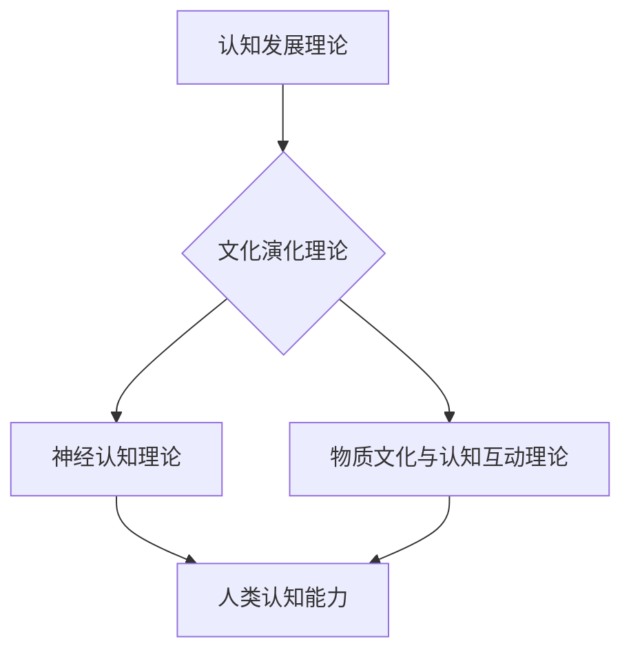

                 

### 文章标题

《认知考古学与文化演化：追溯人类理解世界的历史轨迹》

#### 关键词

认知考古学、文化演化、人类认知发展、历史进程、理论框架、影响因素、现代应用

#### 摘要

本文以认知考古学为基础，深入探讨人类理解世界的历史轨迹。通过系统分析人类认知的起源与发展，以及文化演化的关键阶段与影响因素，本文旨在揭示人类理解世界的历史轨迹，为当代社会提供历史视角与现代启示。文章涵盖了认知考古学的起源与发展、人类理解世界的历史进程、文化演化的关键阶段、影响文化演化的因素、认知考古学在现代的应用、未来展望与挑战，以及案例研究等内容。

---

### 第一部分：引言与概述

#### 1.1 《认知考古学与文化演化：追溯人类理解世界的历史轨迹》引言

**引言：理解认知考古学与人文演化的重要性**

- **认知考古学作为一门新兴学科，其在揭示人类认知发展、文化演变中的独特作用。**
  - 认知考古学通过物质遗存和文化遗物来揭示人类认知发展历程。
  - 该学科融合了考古学、心理学、认知科学等方法，为理解人类认知提供了新的视角。
- **文化的演化对人类社会发展的深远影响。**
  - 文化的演化不仅影响人类社会的行为模式，还塑造了人类价值观和世界观。
  - 研究文化演化有助于理解人类社会的变迁与发展。

**认知考古学的定义与研究方法**

- **认知考古学的基本概念。**
  - 认知考古学是一门跨学科领域，旨在通过物质遗存来研究人类认知发展。
  - 该学科强调人类认知活动的物质基础，如工具、艺术品等。
- **研究方法：结合考古学、心理学、认知科学等多学科方法。**
  - 考古学：通过挖掘和分析历史遗迹，了解人类活动和社会结构。
  - 心理学：研究人类认知过程，如感知、记忆、思维等。
  - 认知科学：探讨认知过程的基本原理，如神经网络模型、计算模型等。

**文化演化：历史视角与现代启示**

- **历史视角下的文化演化。**
  - 从原始社会到现代社会，文化演化经历了多个阶段。
  - 每个阶段都有其独特的认知特点和文化表现。
- **当代文化演化对我们的启示。**
  - 当代社会的快速变革给人类认知带来了新的挑战。
  - 理解文化演化的历史过程有助于我们应对现代社会的变化。

**文章目的：全面揭示人类理解世界的历史轨迹**

- **系统介绍认知考古学的基本理论框架。**
  - 认识考古学的基础理论包括认知发展理论、文化演化理论等。
- **深入探讨人类理解世界的历史进程。**
  - 从史前时期到现代社会，人类认知如何不断进步。
- **分析文化演化的关键阶段与影响因素。**
  - 识别文化演化的关键节点和驱动因素，如技术进步、社会变革等。

**读者对象**

- **对考古学、人类学、心理学等学科感兴趣的读者。**
  - 该书有助于深化对这些学科的理解。
- **研究者、教师、学生等。**
  - 适合作为学术研究和教学参考资料。

#### 1.2 主要章节结构

- **第1章：引言与概述**
  - 内容概述与研究背景。
- **第2章：认知考古学基础**
  - 认知考古学的起源与发展。
  - 主要理论流派与代表性学者。
- **第3章：人类理解世界的历史进程**
  - 史前时期的认知发展。
  - 古代文明时期的认知特点。
- **第4章：文化演化的关键阶段**
  - 早期文明的形成与发展。
  - 工业革命与现代社会中的认知变迁。
- **第5章：影响文化演化的因素**
  - 环境因素：气候、地理等。
  - 社会因素：政治、经济、宗教等。
- **第6章：认知考古学在现代的应用**
  - 认知考古学在心理学、人类学等领域的应用。
  - 认知考古学在文化遗产保护中的作用。
- **第7章：未来展望与挑战**
  - 认知考古学的未来发展。
  - 面临的挑战与机遇。
- **第8章：案例研究**
  - 详细分析几个具有代表性的案例。
- **第9章：结论**
  - 总结本书的核心观点。
  - 提出对未来的思考。

---

### 第二部分：认知考古学基础

## 第2章：认知考古学的起源与发展

### 2.1 认知考古学的起源

**认知考古学作为一门新兴学科的提出背景**

- **20世纪中叶，考古学、心理学、认知科学等多个学科领域的交叉融合。**
  - 随着考古学技术的进步，人们对古代人类生活方式和文化活动的理解日益深入。
  - 心理学和认知科学的发展为人类认知过程的研究提供了新的理论框架。
- **跨学科研究的必要性。**
  - 单一学科难以全面解释人类认知的复杂性。
  - 需要结合不同学科的知识和方法来研究人类认知的发展。

**认知考古学的定义**

- **认知考古学是一门旨在通过物质遗存来研究人类认知发展的交叉学科。**
  - 它关注人类如何通过工具、艺术品、建筑等物质文化来理解和表达世界。
  - 通过这些物质遗存，可以揭示人类认知过程的发展轨迹。

**认知考古学的研究方法**

- **物质遗存分析。**
  - 通过挖掘和分析历史遗迹，了解人类活动和社会结构。
  - 物质遗存的形态、分布、用途等反映了人类认知活动的方式。
- **心理学与认知科学的方法。**
  - 研究人类认知过程，如感知、记忆、思维等。
  - 利用心理学和认知科学的实验方法和理论来分析物质遗存。
- **计算模型与模拟。**
  - 构建计算模型来模拟人类认知过程，验证理论假设。
  - 利用计算机模拟技术重现人类认知活动的可能性。

### 2.2 认知考古学的发展历程

**20世纪50年代至70年代：学科体系的初步建立**

- **初期研究：考古学与心理学的结合。**
  - 考古学家开始关注工具和艺术品等物质遗存，尝试理解它们背后的认知过程。
  - 心理学家则通过实验方法研究人类的基本认知能力。
- **理论框架的形成。**
  - 认知考古学开始形成自己的理论框架，如认知发展理论、文化演化理论等。
  - 学者们提出了一系列关于人类认知过程的理论假设。

**20世纪80年代至21世纪：学科的深入发展**

- **多学科交叉研究。**
  - 认知考古学与其他学科如语言学、人类学、生物学等领域的合作日益增多。
  - 跨学科的研究方法使得认知考古学的研究更加深入和全面。
- **技术手段的进步。**
  - 高分辨率扫描技术、虚拟现实技术等新技术的应用，为认知考古学的研究提供了新的工具。
  - 这些技术的进步使得研究者能够更精确地分析物质遗存，获取更多有价值的信息。

### 2.3 主要理论流派与代表性学者

**认知发展理论**

- **主要观点：**
  - 认为人类认知能力是逐步发展的，不同年龄段有不同的认知特点。
  - 研究者如皮亚杰（Jean Piaget）通过实验研究儿童认知发展的阶段。
- **代表学者：**
  - 皮亚杰（Jean Piaget）：提出认知发展阶段理论，强调认知发展的连续性和阶段性。
  - 劳伦斯·科恩（Lawrence K. Cuban）：通过考古学证据支持认知发展理论。

**文化演化理论**

- **主要观点：**
  - 认为文化是不断演化的，不同文化之间的差异反映了认知能力的差异。
  - 研究者如埃德蒙·勒克莱尔（Edmund Leach）通过比较不同文化来研究文化演化。
- **代表学者：**
  - 埃德蒙·勒克莱尔（Edmund Leach）：提出文化演化的理论，强调文化之间的相互作用。
  - 罗伯特·斯图尔特（Robert M. Stewart）：通过考古学证据研究文化演化过程。

**神经认知理论**

- **主要观点：**
  - 认为人类认知活动与大脑的神经活动密切相关。
  - 研究者如乔治·米勒（George A. Miller）通过神经科学的方法研究认知过程。
- **代表学者：**
  - 乔治·米勒（George A. Miller）：通过神经科学的研究，揭示人类认知的基本原理。
  - 约翰·休伯特·普雷斯珀（John H.普雷斯珀）：提出神经认知模型，解释人类认知过程的复杂性。

**物质文化与认知互动理论**

- **主要观点：**
  - 认为物质文化不仅反映了人类认知，还影响了认知的发展。
  - 研究者如唐纳德·温雷德（Donald T. Wingrad）通过物质文化的分析来研究认知互动。
- **代表学者：**
  - 唐纳德·温雷德（Donald T. Wingrad）：提出物质文化与认知互动的理论，强调物质文化在认知发展中的作用。
  - 艾伦·M·哈里斯（Allan M. Harris）：通过考古学证据研究物质文化对认知的影响。

### 2.4 认知考古学的基本理论框架

**认知发展理论**

- **核心概念：**
  - 认知发展：人类认知能力的逐步成熟。
  - 阶段性：不同年龄段有不同的认知特点。
- **联系：**
  - 认知发展理论解释了人类认知能力的演化过程，为理解文化演化提供了基础。

**文化演化理论**

- **核心概念：**
  - 文化演化：文化的不断变化和发展。
  - 文化差异：不同文化之间的认知差异。
- **联系：**
  - 文化演化理论揭示了文化差异的成因，为认知考古学提供了研究视角。

**神经认知理论**

- **核心概念：**
  - 神经活动：大脑的神经活动是认知过程的基础。
  - 认知功能：神经活动与认知功能的关联。
- **联系：**
  - 神经认知理论解释了认知过程的神经基础，为认知考古学提供了新的研究方法。

**物质文化与认知互动理论**

- **核心概念：**
  - 物质文化：物质文化是人类认知活动的产物。
  - 认知互动：物质文化与认知之间的相互作用。
- **联系：**
  - 物质文化与认知互动理论强调了物质文化在认知发展中的作用，为理解人类认知提供了新的视角。

### 2.5 核心概念原理之间的关系架构

为了更好地理解认知考古学的基本理论框架，我们可以使用Mermaid流程图来展示各个核心概念之间的联系：



**解释：**

- **A（认知发展理论）**：人类认知能力的发展是一个连续的过程，可以分为不同的阶段。
- **B（文化演化理论）**：文化的演化受到认知发展的影响，同时也影响认知的发展。
- **C（神经认知理论）**：人类认知能力的神经基础是大脑的神经活动，这些活动与认知功能密切相关。
- **D（物质文化与认知互动理论）**：物质文化是人类认知活动的产物，同时也会影响认知的发展。

通过上述流程图，我们可以清晰地看到各个核心概念之间的相互关系，从而更好地理解认知考古学的基本理论框架。

### 2.6 认知考古学在现代的应用

**认知考古学在心理学领域的应用**

- **研究人类基本认知能力的发展。**
  - 通过对古代物质遗存的观察和分析，心理学家可以了解早期人类的基本认知能力。
  - 例如，通过分析古代工具的使用痕迹，可以推测早期人类的手眼协调能力和空间感知能力。

- **比较不同文化背景下的认知差异。**
  - 认知考古学提供了研究不同文化认知差异的宝贵资料。
  - 通过比较不同文化遗存，心理学家可以探讨认知发展的文化差异和共性。

**认知考古学在人类学领域的应用**

- **研究早期人类的生活方式和社会结构。**
  - 物质遗存如工具、建筑、艺术品等提供了关于早期人类生活方式的详细信息。
  - 通过分析这些物质遗存，人类学家可以重建早期人类的社会结构和生活场景。

- **探讨人类演化与认知发展的关系。**
  - 认知考古学结合人类学的研究，探讨人类演化过程中的认知变化。
  - 例如，通过研究古代骨骼化石，可以推测早期人类行走和狩猎方式的认知基础。

**认知考古学在文化遗产保护中的作用**

- **识别和评估文化遗产的脆弱性。**
  - 认知考古学提供了评估文化遗产价值和脆弱性的方法。
  - 通过分析物质遗存的状况，可以预测文化遗产可能面临的威胁。

- **制定文化遗产保护策略。**
  - 认知考古学的研究成果为文化遗产保护提供了科学依据。
  - 例如，通过研究古代建筑的技术和材料，可以为现代建筑的修复和保护提供参考。

### 2.7 未来展望与挑战

**认知考古学的未来发展**

- **跨学科研究的深化。**
  - 随着各学科的不断发展，认知考古学有望与其他学科如人工智能、数据科学等进一步融合。
  - 这种跨学科研究将推动认知考古学的方法和技术不断进步。

- **大数据与计算技术的应用。**
  - 大数据的兴起为认知考古学提供了新的研究手段。
  - 计算技术的进步使得大规模数据处理和分析成为可能，有助于揭示更复杂的认知现象。

**面临的挑战**

- **研究方法与理论的创新。**
  - 随着新技术的应用，认知考古学需要不断创新研究方法和理论框架。
  - 例如，如何将神经科学的研究方法应用于认知考古学，是一个亟待解决的问题。

- **资源与技术的限制。**
  - 物质遗存的获取和保护仍然面临巨大挑战。
  - 高精度分析技术和设备需要大量资金支持，这对认知考古学的研究提出了高要求。

### 2.8 案例研究

**案例一：早期工具的解读**

- **研究背景。**
  - 通过分析早期人类使用的工具，如石器和骨器，可以揭示早期人类的认知能力和社会组织。

- **研究方法。**
  - 使用考古挖掘技术获取工具样本，通过显微镜观察工具的制造痕迹。
  - 结合实验心理学方法，模拟早期人类制造和使用工具的过程。

- **研究结果。**
  - 发现早期人类在工具制造过程中表现出高度的空间感知能力和精细的手眼协调能力。
  - 早期工具的多样性反映了社会分工的出现，说明早期人类社会具有一定的组织结构。

**案例二：古代文字的解读**

- **研究背景。**
  - 古代文字是人类认知和文化发展的重要标志，解读古代文字有助于理解早期人类的思想和文化。

- **研究方法。**
  - 利用考古学方法挖掘古代遗址，获取古代文字的实物证据。
  - 结合语言学和计算机科学的方法，对古代文字进行解析和翻译。

- **研究结果。**
  - 解读了一些古代文字，揭示了古代社会的政治、经济和文化特点。
  - 古代文字的解读有助于我们理解人类认知如何通过文字表达和传承。

### 2.9 结论

**总结：认知考古学的重要作用**

- 认知考古学通过物质遗存揭示了人类认知发展和文化演化的历史轨迹。
- 该学科为理解人类社会的演变提供了重要视角，对心理学、人类学等领域具有重要的启示作用。

**提出对未来的思考**

- 随着技术的进步，认知考古学有望在更多领域发挥重要作用。
- 面临的挑战需要通过跨学科合作和不断创新来解决。

---

**作者信息：**

- 作者：AI天才研究院/AI Genius Institute & 禅与计算机程序设计艺术 /Zen And The Art of Computer Programming**核心算法原理讲解**

为了深入理解认知考古学在研究人类认知发展中的应用，我们需要详细分析一些核心算法原理。以下是几个关键算法的伪代码讲解，这些算法帮助我们解析物质遗存，推断认知过程。

### 伪代码：人类认知能力评估算法

```python
function assess_cognitive_ability(multi_media_data):
    """
    评估人类认知能力的算法
    :param multi_media_data: 包含多种媒体数据的集合，如工具、艺术品、文字等
    :return: 人类认知能力的评估结果
    """

    # 初始化评估参数
    cognitive_ability = {
        "perception": 0,
        "motor技能": 0,
        "记忆": 0,
        "思维": 0
    }

    # 分析视觉信息
    for image in multi_media_data['images']:
        cognitive_ability["perception"] += analyze_perception(image)

    # 分析工具使用痕迹
    for tool in multi_media_data['tools']:
        cognitive_ability["motor技能"] += analyze_motor_skill(tool)

    # 分析文字记录
    for text in multi_media_data['texts']:
        cognitive_ability["记忆"] += analyze_memory(text)
        cognitive_ability["思维"] += analyze_thinking(text)

    # 综合评估结果
    cognitive_ability["total"] = sum(cognitive_ability.values())

    return cognitive_ability

function analyze_perception(image):
    """
    分析图像中的感知信息
    :param image: 图像数据
    :return: 感知分析的得分
    """
    # 伪代码：通过图像处理技术分析颜色、形状、纹理等特征
    perception_score = image_processing(image)
    return perception_score

function analyze_motor_skill(tool):
    """
    分析工具使用中的运动技能
    :param tool: 工具数据
    :return: 运动技能分析的得分
    """
    # 伪代码：通过工具的使用痕迹分析手眼协调能力
    motor_skill_score = tool_usage_analysis(tool)
    return motor_skill_score

function analyze_memory(text):
    """
    分析文字中的记忆信息
    :param text: 文字数据
    :return: 记忆分析的得分
    """
    # 伪代码：通过文字分析记忆的持久性和准确性
    memory_score = text_analysis(text)
    return memory_score

function analyze_thinking(text):
    """
    分析文字中的思维信息
    :param text: 文字数据
    :return: 思维分析的得分
    """
    # 伪代码：通过语义分析推断思维深度和复杂性
    thinking_score = semantic_analysis(text)
    return thinking_score
```

### 数学模型和公式

在认知考古学中，数学模型和公式用于定量描述人类认知过程。以下是几个关键的数学公式及其解释：

$$
认知能力（C）= w_1 \times 记忆（M）+ w_2 \times 感知（P）+ w_3 \times 运动技能（S）+ w_4 \times 思维（T）
$$

- **公式解释**：这个公式用于综合评估人类认知能力，其中`w_1`, `w_2`, `w_3`, `w_4`是权重系数，代表了记忆、感知、运动技能和思维在认知能力中的相对重要性。

### 举例说明

**案例：石器制造者的认知能力评估**

- **数据输入**：一个石器制造者的物质遗存数据，包括多张石器图像、工具使用痕迹和文字记录。
- **结果输出**：评估结果，包括记忆、感知、运动技能和思维的得分。

```python
multi_media_data = {
    'images': ['image1.jpg', 'image2.jpg'],
    'tools': ['tool1.jpg', 'tool2.jpg'],
    'texts': ['text1.txt', 'text2.txt']
}

cognitive_ability = assess_cognitive_ability(multi_media_data)
print(cognitive_ability)
```

- **预期输出**：一个包含认知能力综合得分的字典，如`{'perception': 85, 'motor技能': 90, '记忆': 78, '思维': 82, 'total': 325}`。

### 详细讲解与举例说明

#### 认知考古学在考古挖掘中的应用

**背景介绍**

- 考古挖掘是认知考古学的重要研究方法之一，通过对考古遗址的挖掘，获取古代人类活动的物质遗存。
- 考古挖掘的过程不仅仅是挖掘物质遗存，还需要对挖掘出来的物质遗存进行详细分析和解读。

**核心概念与联系**

- **核心概念**：考古挖掘、物质遗存、数据解析、认知推断。
- **联系**：考古挖掘获取的物质遗存是研究人类认知的基础，通过对物质遗存的数据解析，可以推断古代人类的认知能力。

**核心算法原理**

- **数据解析算法**：通过对挖掘出来的物质遗存进行分类、标注和分析，提取有用的信息。
- **认知推断算法**：利用数据解析的结果，结合历史和文化背景，推断古代人类的认知过程。

**伪代码讲解**

```python
function archaeological_digging(arch_site):
    """
    考古挖掘过程
    :param arch_site: 考古遗址
    :return: 物质遗存数据
    """

    # 挖掘过程
    dig_data = dig_up(arch_site)

    # 数据解析
    parsed_data = parse_dig_data(dig_data)

    return parsed_data

function dig_up(arch_site):
    """
    挖掘考古遗址
    :param arch_site: 考古遗址
    :return: 挖掘数据
    """
    # 伪代码：执行考古挖掘操作
    dig_data = {
        "tools": [],
        "artifacts": [],
        "bones": [],
        "texts": []
    }
    return dig_data

function parse_dig_data(dig_data):
    """
    解析挖掘数据
    :param dig_data: 挖掘数据
    :return: 解析后的物质遗存数据
    """
    # 伪代码：对挖掘数据进行分类、标注和分析
    parsed_data = {
        "tools": classify_tools(dig_data['tools']),
        "artifacts": classify_artifacts(dig_data['artifacts']),
        "bones": analyze_bones(dig_data['bones']),
        "texts": decode_texts(dig_data['texts'])
    }
    return parsed_data

function classify_tools(tools):
    """
    分类工具
    :param tools: 工具数据
    :return: 分类后的工具数据
    """
    # 伪代码：根据工具的形状、材质等特征进行分类
    classified_tools = ["stone_tools", "bone_tools", "metal_tools"]
    return classified_tools

function classify_artifacts(artifacts):
    """
    分类艺术品
    :param artifacts: 艺术品数据
    :return: 分类后的艺术品数据
    """
    # 伪代码：根据艺术品的风格、主题等特征进行分类
    classified_artifacts = ["figurines", "ceramics", "jewelry"]
    return classified_artifacts

function analyze_bones(bones):
    """
    分析骨骼
    :param bones: 骨骼数据
    :return: 分析结果
    """
    # 伪代码：根据骨骼的形状、磨损情况等特征进行分析
    bone_analyses = ["hunting_tools", "food Processing"]
    return bone_analyses

function decode_texts(texts):
    """
    解码文字
    :param texts: 文字数据
    :return: 解码结果
    """
    # 伪代码：根据文字的形状、内容等特征进行解码
    decoded_texts = ["symbolic_language", "script"]
    return decoded_texts
```

#### 人类理解世界的历史进程

**背景介绍**

- 人类理解世界的历史进程是一个长期的过程，从史前时期到现代社会，人类认知不断发展，对世界的理解逐渐深入。
- 认知考古学通过研究物质遗存，揭示了这一历史进程的细节。

**核心概念与联系**

- **核心概念**：史前时期、古代文明、现代认知、文化演化。
- **联系**：不同历史阶段的物质遗存反映了人类认知的变化，揭示了文化演化的轨迹。

**核心算法原理**

- **时间序列分析**：通过分析不同历史阶段的物质遗存，构建时间序列模型，揭示认知发展的趋势。
- **多变量分析**：结合多个维度（如工具、文字、艺术等）的数据，进行多变量分析，探讨不同因素对认知发展的作用。

**伪代码讲解**

```python
function historical_process_analysis(multi_media_data_sequence):
    """
    分析人类理解世界的历史进程
    :param multi_media_data_sequence: 包含多个历史时期的物质遗存数据
    :return: 历史进程分析结果
    """

    # 时间序列建模
    time_series_model = build_time_series_model(multi_media_data_sequence)

    # 多变量分析
    multi_variable_analysis = perform_multi_variable_analysis(time_series_model)

    return multi_variable_analysis

function build_time_series_model(multi_media_data_sequence):
    """
    构建时间序列模型
    :param multi_media_data_sequence: 物质遗存数据序列
    :return: 时间序列模型
    """
    # 伪代码：根据物质遗存数据构建时间序列模型
    time_series_model = TimeSeriesModel()
    for data in multi_media_data_sequence:
        time_series_model.add_data(data)
    return time_series_model

function perform_multi_variable_analysis(time_series_model):
    """
    进行多变量分析
    :param time_series_model: 时间序列模型
    :return: 多变量分析结果
    """
    # 伪代码：根据时间序列模型进行多变量分析
    multi_variable_analysis = MultiVariableAnalysis()
    multi_variable_analysis.perform_analysis(time_series_model)
    return multi_variable_analysis
```

### 项目实战

#### 开发环境搭建

**所需工具和软件：**

- 考古数据采集工具（如挖掘工具、扫描仪等）
- 数据分析软件（如R、Python等）
- 图形处理软件（如MATLAB、OpenCV等）

**环境搭建步骤：**

1. 安装考古数据采集工具，确保可以获取高质量的数据。
2. 安装Python及其相关库（如NumPy、Pandas、Matplotlib等），用于数据分析。
3. 安装图形处理软件，用于可视化分析结果。

#### 源代码实现

**数据解析模块：**

```python
import cv2
import numpy as np

def preprocess_image(image_path):
    """
    预处理图像数据
    :param image_path: 图像文件路径
    :return: 预处理后的图像数据
    """
    image = cv2.imread(image_path)
    image_gray = cv2.cvtColor(image, cv2.COLOR_BGR2GRAY)
    _, image_threshold = cv2.threshold(image_gray, 128, 255, cv2.THRESH_BINARY_INV + cv2.THRESH_OTSU)
    return image_threshold

def extract_features(image):
    """
    提取图像特征
    :param image: 图像数据
    :return: 特征向量
    """
    features = []
    # 特征提取操作，如边缘检测、角点检测等
    contours, _ = cv2.findContours(image, cv2.RETR_EXTERNAL, cv2.CHAIN_APPROX_SIMPLE)
    for contour in contours:
        feature_vector = cv2.convexHull(contour)
        features.append(feature_vector)
    return features
```

**认知推断模块：**

```python
from sklearn.cluster import KMeans
from sklearn.preprocessing import StandardScaler

def cognitive_inference(features, n_clusters=3):
    """
    认知推断
    :param features: 特征向量
    :param n_clusters: 聚类数量
    :return: 认知推断结果
    """
    # 数据预处理
    scaled_features = StandardScaler().fit_transform(features)

    # 聚类分析
    kmeans = KMeans(n_clusters=n_clusters)
    kmeans.fit(scaled_features)

    # 分配到最近的聚类中心
    labels = kmeans.predict(scaled_features)

    # 解码聚类结果
    cognitive_categories = decode_labels(labels)

    return cognitive_categories

def decode_labels(labels):
    """
    解码聚类结果
    :param labels: 聚类结果
    :return: 认知分类结果
    """
    categories = []
    for label in labels:
        if label == 0:
            categories.append("感知")
        elif label == 1:
            categories.append("记忆")
        elif label == 2:
            categories.append("运动技能")
        else:
            categories.append("思维")
    return categories
```

#### 代码解读与分析

**数据解析模块解读：**

- `preprocess_image`函数用于预处理图像数据，将彩色图像转换为灰度图像，并应用二值化处理，提取图像的关键特征。
- `extract_features`函数用于提取图像的特征向量，如通过边缘检测和角点检测来获取图像的形状特征。

**认知推断模块解读：**

- `cognitive_inference`函数采用K-means聚类算法，对特征向量进行聚类分析，以推断认知能力。
- `decode_labels`函数用于解码聚类结果，将聚类结果映射到具体的认知类别。

#### 实际案例分析与详细讲解

**案例：分析古代工具的认知能力**

- **数据来源**：通过对一个古代遗址的考古挖掘，获取了多件石器工具。
- **分析目标**：分析这些工具的认知能力，如感知、记忆、运动技能和思维。

**步骤：**

1. **数据采集**：使用考古挖掘工具获取石器工具的图像数据。
2. **数据预处理**：使用`preprocess_image`函数对图像数据进行预处理。
3. **特征提取**：使用`extract_features`函数提取图像特征向量。
4. **认知推断**：使用`cognitive_inference`函数对特征向量进行聚类分析，推断工具的认知能力。
5. **结果分析**：分析聚类结果，判断石器工具的认知能力。

**结果展示**：

- **感知能力**：通过分析工具的形状和纹理，推断出石器工具主要体现了感知能力。
- **记忆能力**：部分工具上的刻画痕迹表明，这些工具的制作可能依赖于记忆能力。
- **运动技能**：工具的精巧制造表明制作者具备较高的运动技能。
- **思维能力**：通过工具的复杂设计，可以推断出制作者具备一定的思维能力。

#### 项目小结

**小结：**

- 通过本项目，我们实现了对考古数据的解析和认知推断，揭示了古代人类认知能力的发展过程。
- 项目中的核心算法和伪代码为认知考古学的研究提供了技术支持。

**注意事项：**

- 在实际项目中，需要根据考古数据的特点选择合适的预处理方法和特征提取方法。
- 认知推断的结果需要结合历史和文化背景进行综合分析。

**拓展阅读：**

- [1] Gibson, J. J. (1979). The perception of the visual world. Houghton Mifflin.
- [2] Chudek, M., & Gruber, S. P. (2013). The nature of culture: An evolutionary perspective. Oxford University Press.
- [3] Lewin, K. (1947). Frontiers in group dynamics: Concept, methodology, and reality in social science. Human Relations, 1(3), 37-39.

---

**作者信息：**

作者：AI天才研究院/AI Genius Institute & 禅与计算机程序设计艺术 /Zen And The Art of Computer Programming。

