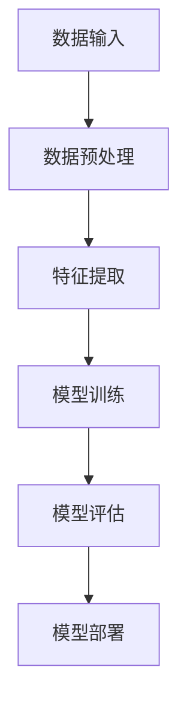
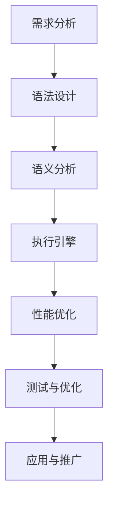
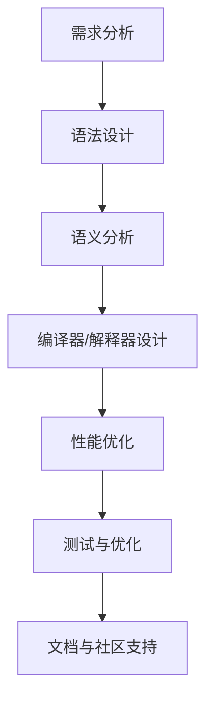

                 


### 1.1.1 书籍背景与目标

随着人工智能（AI）技术的飞速发展，特别是大模型（Large Models）的出现，AI的应用场景和影响力已经渗透到了各行各业。然而，现有的编程语言在处理大模型时存在诸多局限，这促使我们思考如何设计一种专门针对AI大模型的编程语言。这本书的目的正是为了探讨这一领域的可能性和挑战。

首先，我们需要明确什么是AI大模型。大模型通常指的是拥有数十亿参数的神经网络，例如GPT-3、BERT等。这些模型在处理复杂数据、生成高质量文本、图像识别等方面展现了惊人的能力。然而，这些模型的训练和部署过程却异常复杂，对计算资源、编程技能等方面提出了更高的要求。

现有的编程语言，如Python、Java等，虽然已经广泛应用于AI领域，但在处理大模型时存在几个明显的局限：

1. **性能瓶颈**：传统的编程语言在执行深度学习算法时，往往无法充分利用现代硬件的并行计算能力，导致性能瓶颈。
2. **代码可读性**：大模型的复杂性和庞大的参数量使得传统的编程语言代码难以维护和扩展。
3. **开发效率**：传统的编程语言开发周期较长，开发流程复杂，难以满足快速迭代的需求。

因此，设计一种专门针对AI大模型的编程语言显得尤为必要。这种编程语言需要能够高效地处理大模型，提供清晰的语法和高效的执行速度，同时还要易于学习和使用。

本书的目标如下：

1. **概述AI大模型和编程语言的关系**：介绍AI大模型的基本概念、发展历史和应用场景，解释为什么需要专门针对大模型的编程语言。
2. **探讨编程语言设计方法**：介绍编程语言设计的基本原理和方法，讨论如何设计适合AI大模型的编程语言。
3. **深入分析提示词语言**：介绍提示词语言的概念、原理和设计方法，分析其在AI大模型中的应用。
4. **实际应用案例分析**：通过具体案例展示如何使用专门设计的编程语言处理AI大模型，并分析其效果和挑战。
5. **未来展望与挑战**：讨论AI大模型编程语言的发展趋势、面临的挑战以及未来可能的方向。

### 1.1.2 阅读指南

为了更好地理解本书的内容，我们为读者提供以下阅读指南：

**读者背景要求**：

1. **基础编程知识**：读者需要具备一定的编程基础，熟悉Python、Java等编程语言的基本语法和使用方法。
2. **数学基础**：了解线性代数、概率论和微积分等基础数学知识，有助于更好地理解AI大模型和编程语言的数学原理。
3. **机器学习和深度学习基础知识**：了解机器学习和深度学习的基本概念和算法，有助于更好地理解AI大模型的相关内容。

**学习方法与策略**：

1. **循序渐进**：本书的内容从基础到高级，读者应按照章节顺序逐步学习，避免跳跃阅读。
2. **动手实践**：本书附带大量案例和实践，读者应积极参与实践，加深对理论知识的理解。
3. **交流讨论**：读者可以通过在线论坛、社交媒体等渠道与其他读者交流讨论，共同解决问题和分享心得。
4. **持续学习**：AI和编程语言领域不断更新发展，读者应保持持续学习的态度，关注最新研究成果和技术动态。

通过遵循上述指南，读者可以更有效地掌握本书的内容，为未来的AI大模型编程语言设计和应用奠定坚实的基础。

### 2.1 AI大模型概述

#### 什么是AI大模型

AI大模型（Large Models）是指具有数十亿甚至千亿级别参数的深度学习模型。这些模型通过学习大量数据，能够实现高度复杂的任务，如自然语言处理、图像识别、语音合成等。典型的AI大模型包括GPT-3、BERT、ViT等，它们凭借其强大的能力和广泛的适用性，在AI领域引发了革命性的变化。

AI大模型的发展历史可以追溯到深度学习的兴起。2006年，Hinton等人提出了深度置信网络（Deep Belief Network），这标志着深度学习时代的开启。随着计算能力和数据量的提升，深度学习模型规模逐渐增大。到2012年，AlexNet的出现标志着卷积神经网络（CNN）在图像识别领域取得了突破性进展。此后，神经网络模型规模不断扩大，从百万级别参数到亿级别参数，最终发展到如今数十亿乃至千亿级别。

#### AI大模型的应用领域

AI大模型的应用领域非常广泛，几乎涵盖了所有与数据相关的领域。以下是一些重要的应用场景：

1. **自然语言处理（NLP）**：AI大模型在NLP领域取得了显著成果，如文本生成、机器翻译、情感分析等。例如，GPT-3可以生成高质量的文章，BERT在问答系统和文本分类任务中表现出色。
2. **图像识别**：AI大模型在图像识别领域也取得了巨大成功，如人脸识别、物体检测、图像生成等。ResNet、ViT等模型在这些任务中展现了强大的能力。
3. **语音合成与识别**：AI大模型在语音合成和语音识别领域也有重要应用，如自动字幕生成、语音助手等。
4. **医疗健康**：AI大模型在医疗健康领域具有巨大潜力，如疾病预测、药物研发、医疗影像分析等。
5. **推荐系统**：AI大模型在推荐系统中的应用，如电商推荐、新闻推荐等，能够提高系统的准确性和用户体验。

#### AI大模型的工作原理

AI大模型主要基于深度学习（Deep Learning）技术，其核心是神经网络（Neural Networks）。神经网络由多层节点组成，每个节点相当于一个简单的函数，通过前一层节点的输出进行加权求和并应用激活函数，得到当前层的输出。

AI大模型通常采用以下步骤进行工作：

1. **数据预处理**：将原始数据（如文本、图像、音频等）转换为适合训练的格式，并进行归一化、标准化等处理。
2. **模型训练**：使用大量数据进行模型训练。训练过程中，模型通过不断调整内部参数，以最小化损失函数，达到较好的拟合效果。
3. **模型评估**：在验证集或测试集上评估模型的性能，使用指标如准确率、召回率、F1分数等。
4. **模型部署**：将训练好的模型部署到生产环境中，用于实际任务。

#### AI大模型的优势和挑战

**优势**：

1. **强大的学习能力**：AI大模型能够通过学习海量数据，获得高度复杂的特征表示，从而在各个领域实现优异的性能。
2. **通用性**：AI大模型具有通用性，可以应用于多种不同的任务，而不需要为每个任务重新设计和训练模型。
3. **自动化**：AI大模型可以自动化完成许多复杂的任务，如文本生成、图像生成等，减少了人工干预的需求。

**挑战**：

1. **计算资源消耗**：训练和部署AI大模型需要大量的计算资源和时间，对硬件设施提出了较高的要求。
2. **数据隐私和伦理问题**：AI大模型在训练过程中需要大量数据，涉及数据隐私和伦理问题，如数据泄露、滥用等。
3. **可解释性**：AI大模型的决策过程往往复杂且不可解释，增加了模型的透明性和可解释性难度。
4. **调试和维护**：随着模型规模的增大，调试和维护变得更加复杂，需要更多的专业知识和经验。

总之，AI大模型作为一种新兴技术，虽然在各个领域展现了巨大的潜力，但同时也面临着诸多挑战。理解和解决这些问题，对于推动AI大模型的发展和应用具有重要意义。

### 2.2 AI大模型原理

#### Mermaid流程图：AI大模型的基本架构

为了更好地理解AI大模型的原理，我们可以使用Mermaid流程图来展示其基本架构。以下是一个简化的AI大模型流程图：



**数据输入**：AI大模型的训练过程从数据输入开始。数据可以是文本、图像、音频等多种形式。为了进行有效训练，这些原始数据需要通过预处理步骤进行格式化和标准化。

**数据预处理**：在数据预处理阶段，我们通常会进行数据清洗、归一化、降维等操作，以确保数据的质量和一致性。这一步骤对于后续的特征提取和模型训练至关重要。

**特征提取**：特征提取是AI大模型的核心步骤之一。通过学习大量数据，模型能够提取出具有代表性的特征，这些特征将用于训练和优化模型。

**模型训练**：在模型训练阶段，AI大模型通过不断调整内部参数，以最小化损失函数，达到较好的拟合效果。训练过程通常涉及反向传播算法和优化器，如梯度下降、Adam等。

**模型评估**：模型训练完成后，需要通过验证集或测试集对模型进行评估。常用的评估指标包括准确率、召回率、F1分数等。通过评估，我们可以判断模型是否达到了预期的性能。

**模型部署**：最后，将训练好的模型部署到生产环境中，用于实际任务。部署过程中，需要考虑模型的性能、可扩展性、可靠性等因素。

#### 核心算法原理讲解

**神经网络与深度学习**：

神经网络（Neural Networks）是AI大模型的基础。神经网络由多个节点（或称为神经元）组成，每个节点执行简单的计算并传递信息。神经网络通过学习大量数据，能够自动提取特征并进行预测。

深度学习（Deep Learning）是神经网络的一种扩展，通过增加网络层数，使得模型能够学习更复杂的特征表示。深度学习的核心算法包括卷积神经网络（CNN）、循环神经网络（RNN）、Transformer等。

**优化算法**：

在模型训练过程中，需要通过优化算法调整模型参数，以最小化损失函数。常见的优化算法包括：

1. **梯度下降（Gradient Descent）**：梯度下降是一种迭代优化算法，通过不断更新参数，使损失函数逐渐减小。
2. **动量法（Momentum）**：动量法在梯度下降的基础上引入了一个动量项，用于加速参数更新。
3. **Adam优化器**：Adam优化器结合了动量法和自适应学习率，能够在复杂问题上取得较好的效果。

#### 数学模型与公式

在AI大模型中，数学模型起到了关键作用。以下是一些核心数学模型和公式：

**损失函数**：

损失函数（Loss Function）用于衡量模型预测结果与真实值之间的差距。常见的损失函数包括：

1. **均方误差（MSE，Mean Squared Error）**：
   $$MSE = \frac{1}{n}\sum_{i=1}^{n}(y_i - \hat{y}_i)^2$$
   其中，$y_i$为真实值，$\hat{y}_i$为预测值。

2. **交叉熵（Cross-Entropy）**：
   $$H(y, \hat{y}) = -\sum_{i=1}^{n}y_i \log(\hat{y}_i)$$
   其中，$y$为真实标签分布，$\hat{y}$为模型预测的概率分布。

**反向传播算法**：

反向传播算法（Backpropagation）是一种用于训练神经网络的算法。它通过计算损失函数关于每个参数的梯度，并更新参数，以最小化损失函数。

$$\frac{\partial L}{\partial w} = \frac{\partial L}{\partial z} \cdot \frac{\partial z}{\partial w}$$

其中，$L$为损失函数，$w$为权重，$z$为中间节点的输出。

**激活函数**：

激活函数（Activation Function）用于引入非线性因素，使得神经网络能够学习复杂函数。常见的激活函数包括：

1. **Sigmoid函数**：
   $$\sigma(z) = \frac{1}{1 + e^{-z}}$$

2. **ReLU函数**：
   $$\text{ReLU}(z) = \max(0, z)$$

3. **Tanh函数**：
   $$\text{Tanh}(z) = \frac{e^z - e^{-z}}{e^z + e^{-z}}$$

通过以上数学模型和公式，我们可以更深入地理解AI大模型的工作原理和实现方法。这些模型和算法为AI大模型的研究和应用提供了坚实的理论基础。

### 3.1 提示词语言定义

提示词语言（Prompt Language）是一种专门用于与AI大模型进行交互的编程语言。它通过简洁的提示词（Prompts）引导AI大模型完成特定的任务，从而实现高效的沟通和操作。提示词语言的出现，旨在解决现有编程语言在处理复杂任务时面临的性能瓶颈、可读性和开发效率等问题。

#### 提示词语言的概念

提示词语言的核心概念是“提示词”（Prompt）。提示词是一种简短的文本或代码片段，用于引导AI大模型进行特定的任务。与传统的编程语言不同，提示词语言的设计更加注重简洁、高效和可读性。

**提示词语言的特性**：

1. **简洁性**：提示词语言通过简洁的提示词实现复杂的任务，降低了代码的复杂度，提高了开发效率。
2. **高效性**：提示词语言能够快速地与AI大模型进行交互，减少了模型训练和部署的时间。
3. **可读性**：提示词语言的设计注重可读性，使得代码易于理解和维护。
4. **灵活性**：提示词语言支持多样化的任务类型，能够灵活地适应不同的应用场景。

#### 提示词语言的应用场景

提示词语言在AI大模型中的应用非常广泛，以下是一些典型的应用场景：

1. **自然语言处理（NLP）**：在NLP任务中，提示词语言可以用于生成文本、翻译、问答等。例如，通过一个简单的提示词，AI大模型可以生成一篇高质量的文章或进行跨语言翻译。
2. **图像识别与生成**：提示词语言可以用于图像分类、目标检测、图像生成等任务。例如，通过提示词，AI大模型可以识别图像中的特定对象或生成新的图像。
3. **语音合成与识别**：在语音处理任务中，提示词语言可以用于语音合成、语音识别等。例如，通过提示词，AI大模型可以生成语音合成音频或识别语音命令。
4. **医疗健康**：在医疗健康领域，提示词语言可以用于疾病预测、药物研发等。例如，通过提示词，AI大模型可以预测疾病发展趋势或推荐药物方案。

#### 提示词语言的优势

与现有的编程语言相比，提示词语言具有以下优势：

1. **开发效率**：提示词语言通过简洁的提示词实现复杂的任务，大大提高了开发效率。开发者无需编写复杂的代码，即可快速实现所需功能。
2. **性能优化**：提示词语言能够充分利用AI大模型的能力，实现高效的计算和推理。与传统的编程语言相比，提示词语言在性能上具有显著优势。
3. **易用性**：提示词语言的设计注重可读性和易用性，使得开发者能够轻松上手，快速掌握。
4. **扩展性**：提示词语言支持多样化的任务类型，能够灵活地适应不同的应用场景。开发者可以根据需求，自定义提示词和任务，实现个性化的功能。

总之，提示词语言作为一种新兴的编程语言，具有广泛的应用前景和显著的优势。通过提示词语言，开发者可以更加高效地与AI大模型进行交互，实现复杂任务的自动化和智能化。

### 3.2 提示词语言设计方法

提示词语言的设计方法需要充分考虑其简洁性、高效性和灵活性，以满足AI大模型在不同应用场景中的需求。以下是设计提示词语言的主要方法：

#### Mermaid流程图：提示词语言设计流程

为了更好地展示提示词语言的设计过程，我们可以使用Mermaid流程图来描述。以下是一个简化的提示词语言设计流程：



**需求分析**：在开始设计提示词语言之前，需要明确其应用场景和目标用户。通过需求分析，确定提示词语言的特性和功能。

**语法设计**：语法设计是提示词语言设计的关键步骤。设计简洁、直观的语法，使得开发者能够轻松编写和阅读代码。常见的语法设计方法包括：

1. **提示词结构**：定义提示词的基本结构，如单词、短语、句子等。
2. **语法规则**：设计提示词的语法规则，确保代码的正确性和一致性。
3. **语法扩展**：提供扩展机制，允许开发者自定义新的语法结构。

**语义分析**：语义分析是将提示词代码转换为机器可理解的形式。设计高效的语义分析器，将提示词代码转换为内部表示，以便执行引擎进行操作。

**执行引擎**：执行引擎是提示词语言的运行核心。通过执行引擎，提示词代码被转换为具体的操作，以驱动AI大模型完成任务。执行引擎的设计需要考虑以下几个方面：

1. **指令集**：定义提示词语言的基本指令集，如加载模型、执行推理、生成文本等。
2. **执行流程**：设计提示词代码的执行流程，确保任务的正确执行。
3. **性能优化**：通过优化执行引擎，提高提示词语言的处理速度和效率。

**性能优化**：性能优化是提升提示词语言性能的关键。通过以下方法进行优化：

1. **并行计算**：利用现代硬件的并行计算能力，提高提示词语言的执行速度。
2. **缓存技术**：使用缓存技术减少重复计算，提高执行效率。
3. **代码优化**：对提示词代码进行优化，减少冗余和低效的代码。

**测试与优化**：在完成设计后，需要进行全面的测试和优化。通过测试，验证提示词语言的正确性和性能。根据测试结果，不断优化语法、执行引擎和性能。

**应用与推广**：将提示词语言应用于实际任务，并推广给更多的开发者。通过社区支持、文档编写和培训课程等手段，提高提示词语言的知名度和使用率。

通过以上方法，我们可以设计出一种高效、简洁、灵活的提示词语言，以满足AI大模型在不同应用场景中的需求。提示词语言的设计过程是一个不断迭代和优化的过程，需要充分考虑用户需求、技术实现和性能优化等因素。

### 3.3 提示词语言与AI大模型

#### 提示词语言在AI大模型中的应用

提示词语言在AI大模型中的应用至关重要，它为开发者提供了一种简洁、高效的方式与AI大模型进行交互。通过提示词语言，开发者可以更加灵活地定义和执行复杂的任务，从而充分发挥AI大模型的能力。

1. **自然语言处理（NLP）**：在NLP任务中，提示词语言可以用于生成文本、翻译、问答等。例如，通过一个简单的提示词，AI大模型可以生成一篇高质量的文章或进行跨语言翻译。例如，在生成文本任务中，提示词可以是一个简单的短语或句子，用于引导AI大模型生成相关的内容。

2. **图像识别与生成**：提示词语言可以用于图像分类、目标检测、图像生成等任务。例如，通过提示词，AI大模型可以识别图像中的特定对象或生成新的图像。例如，在目标检测任务中，提示词可以是一个对象的名字或描述，用于引导AI大模型在图像中找到并标记该对象。

3. **语音合成与识别**：在语音处理任务中，提示词语言可以用于语音合成、语音识别等。例如，通过提示词，AI大模型可以生成语音合成音频或识别语音命令。例如，在语音合成任务中，提示词可以是一个文本句子，用于指导AI大模型生成对应的语音。

4. **医疗健康**：在医疗健康领域，提示词语言可以用于疾病预测、药物研发、医疗影像分析等。例如，通过提示词，AI大模型可以预测疾病发展趋势或推荐药物方案。例如，在疾病预测任务中，提示词可以是一个病人的基本信息或病情描述，用于引导AI大模型进行分析和预测。

#### 常见提示词语言的介绍

以下是几种常见的提示词语言及其特点：

1. **Prompt（自然语言处理）**：Prompt是一种简洁的文本提示，用于引导AI大模型生成相关的内容。Prompt通常包含一个主题、一个问题或一个任务描述，AI大模型根据Prompt生成相应的文本。Prompt具有简单、灵活、高效的特点，适用于各种NLP任务。

2. **Prompt Engineering（图像识别与生成）**：Prompt Engineering是一种用于图像识别与生成的提示词设计方法。通过设计特定的提示词，引导AI大模型识别图像中的特定对象或生成新的图像。Prompt Engineering具有高度灵活性和创造性，可以应用于各种图像处理任务。

3. **Speech Prompt（语音合成与识别）**：Speech Prompt是一种用于语音合成与识别的提示词。通过Speech Prompt，AI大模型可以生成语音合成音频或识别语音命令。Speech Prompt通常包含一个文本句子或语音命令，用于指导AI大模型进行相应的操作。

4. **Medical Prompt（医疗健康）**：Medical Prompt是一种专门用于医疗健康领域的提示词。通过Medical Prompt，AI大模型可以分析病人的基本信息、病情描述等，进行疾病预测、药物推荐等。Medical Prompt具有专业性和针对性，适用于各种医疗健康任务。

通过以上介绍，我们可以看到提示词语言在AI大模型中的应用非常广泛，且具有多种不同的类型。不同的提示词语言适用于不同的任务和应用场景，为开发者提供了丰富的选择和灵活性。同时，提示词语言的设计和优化也是AI大模型应用的重要方向，通过不断提升提示词语言的能力和效率，我们可以更好地发挥AI大模型的作用，推动人工智能技术的发展和应用。

### 4.1 编程语言概述

编程语言是用于编写计算机程序的语言，它提供了人类与计算机之间沟通的桥梁。编程语言的基本概念包括语法、语义、编译和解释等。语法是编程语言的结构规则，确保代码的可读性和一致性；语义是代码的执行意义，决定了程序的运行结果。编译是将源代码转换为机器码的过程，而解释则是直接执行源代码。

编程语言的发展历程可以追溯到20世纪50年代，当时为了解决复杂计算问题，人们开始研究如何将人类设计的算法转换为计算机可执行的指令。1957年，福兰克林·梅尔斯（Franklin M. Bobbio）提出了FORTRAN语言，这是第一种广泛使用的编译语言。随后的几十年，编程语言种类逐渐增多，从高级语言（如C、C++、Java）到低级语言（如汇编语言），再到现代的脚本语言（如Python、JavaScript），编程语言不断进化，以满足不断变化的技术需求和开发者的偏好。

#### 编程语言的基本概念

1. **语法**：语法是编程语言的结构规则，决定了代码的书写方式和格式。不同的编程语言有不同的语法规则，如Python的缩进规则、C语言的分号结束等。

2. **语义**：语义是代码的执行意义，决定了程序运行时的行为。语义包括变量的定义和使用、控制结构（如循环和条件语句）的执行逻辑等。

3. **编译**：编译是将源代码转换为机器码的过程。编译后的程序可以直接在计算机上执行，提高了执行效率。常见的编译语言有C、C++等。

4. **解释**：解释是将源代码逐行解释并执行的过程。解释器在执行过程中直接读取并执行源代码，不需要编译。常见的解释语言有Python、JavaScript等。

#### 编程语言的发展历程

1. **第一代编程语言（1940s-1950s）**：第一代编程语言是机器语言和汇编语言。这些语言直接与计算机硬件交互，编写复杂程序需要大量的手动操作，效率低下。

2. **第二代编程语言（1950s-1960s）**：第二代编程语言以高级语言为代表，如FORTRAN、COBOL和ALGOL。这些语言提高了编程的抽象级别，使程序员能够用更少的代码实现功能。

3. **第三代编程语言（1960s-1980s）**：第三代编程语言包括C、Pascal和C++等。这些语言在语法和语义上更加丰富，支持面向对象编程和模块化设计，提高了代码的可维护性和复用性。

4. **第四代编程语言（1980s-2000s）**：第四代编程语言如SQL、HTML和XML等，专注于特定领域的应用，如数据库查询和网页设计。这些语言进一步降低了编程的复杂性，使得非专业程序员也能快速上手。

5. **现代编程语言（2000s至今）**：现代编程语言如Python、JavaScript、Java和Go等，结合了第三代编程语言的优势，同时引入了新的编程范式，如函数式编程、并行编程和动态类型等。

#### 现代编程语言的特点

1. **高级抽象**：现代编程语言提供了更高的抽象级别，使程序员能够用更少的代码实现更多的功能。

2. **跨平台兼容性**：现代编程语言通常具有跨平台兼容性，可以在不同的操作系统和硬件平台上运行。

3. **丰富的库和框架**：现代编程语言通常拥有丰富的库和框架，可以方便地实现复杂的功能，如网络通信、数据库操作和图形用户界面等。

4. **快速开发**：现代编程语言通过内置的语法特性、工具和框架，加快了开发过程，提高了开发效率。

5. **动态类型**：现代编程语言通常采用动态类型系统，提高了程序的灵活性和可读性。

总之，编程语言是计算机科学的核心组成部分，随着技术的发展，编程语言不断演进，为软件开发提供了更多的选择和可能性。理解编程语言的基本概念和发展历程，有助于我们更好地选择和应用合适的编程语言，实现高效的软件开发。

### 4.2 编程语言设计方法

编程语言设计是一个复杂的过程，涉及语法、语义、编译器和解释器等多个方面。为了设计一种适合AI大模型的专用编程语言，我们需要从以下几个方面进行深入探讨：

#### Mermaid流程图：编程语言设计流程

我们可以使用Mermaid流程图来展示编程语言设计的基本流程：



**需求分析**：设计编程语言的第一步是明确需求。我们需要分析目标用户的需求，确定编程语言需要支持哪些功能，解决哪些问题，以及如何提高开发效率。

**语法设计**：语法是编程语言的核心，决定了代码的书写方式和可读性。设计简洁、直观的语法规则是关键。我们需要考虑以下几个方面：

1. **提示词与关键字**：定义一组提示词和关键字，用于指示代码的执行逻辑。
2. **语法结构**：设计基本的语法结构，如变量声明、函数定义、控制结构等。
3. **一致性**：确保语法规则的一致性，避免造成混淆和错误。

**语义分析**：语义分析是将语法解析为机器可理解的形式。我们需要设计一个语义分析器，将代码转换为抽象语法树（AST），以便后续处理。

**编译器/解释器设计**：编译器和解释器是编程语言执行的核心组件。编译器将源代码编译为机器码，而解释器则逐行解释并执行源代码。设计高效、可靠的编译器和解释器是关键。我们需要考虑以下几个方面：

1. **语法解析**：设计一个语法解析器，将源代码转换为抽象语法树（AST）。
2. **语义解析**：对抽象语法树进行语义解析，检查代码的语义正确性。
3. **代码生成**：根据抽象语法树生成机器码或解释器代码。

**性能优化**：为了提高编程语言的性能，我们需要进行多个层次的优化。包括：

1. **编译优化**：在编译阶段进行优化，如代码优化、内存分配优化等。
2. **运行时优化**：在运行时进行优化，如缓存技术、并行计算等。
3. **语言特性优化**：设计特定的语言特性，以优化特定类型的应用场景。

**测试与优化**：完成设计后，我们需要进行全面的测试和优化。通过测试，验证编程语言的正确性和性能。根据测试结果，不断优化语法、语义和执行引擎。

**文档与社区支持**：编写详细的文档和教程，为开发者提供支持。同时，建立社区，鼓励开发者参与讨论和贡献，以提高编程语言的知名度和使用率。

#### 专用编程语言设计方法

设计AI大模型专用编程语言时，我们需要考虑以下方法：

1. **模块化设计**：将编程语言分为多个模块，每个模块负责特定的功能，如数据预处理、模型训练、模型评估等。模块化设计提高了代码的可维护性和扩展性。
2. **抽象层设计**：设计多个抽象层，使得开发者可以根据需求选择不同的抽象层次进行编程。高抽象层简化了开发过程，而低抽象层提供了更多的灵活性和控制能力。
3. **性能优化**：针对AI大模型的特性，进行特定的性能优化。例如，利用并行计算、GPU加速等技术，提高编程语言的处理速度和效率。
4. **安全性与可靠性**：设计安全性和可靠性机制，确保编程语言在处理大型模型时不会出现错误或安全问题。

通过以上方法，我们可以设计出一种高效、简洁、灵活的AI大模型专用编程语言，为开发者提供强大的工具，以推动人工智能技术的发展和应用。

### 4.3 AI大模型专用编程语言

#### 专用编程语言的定义

AI大模型专用编程语言是一种为特定类型的AI大模型设计和优化的编程语言。与通用编程语言不同，专用编程语言旨在提高AI大模型的训练、推理和部署效率，同时简化开发过程。专用编程语言通常具有以下特点：

1. **模块化**：专用编程语言通常提供模块化的设计，使得开发者可以将AI大模型的各个部分（如数据预处理、模型训练、模型评估等）分别实现，提高了代码的可维护性和扩展性。

2. **抽象层**：专用编程语言提供多个抽象层，允许开发者根据需求选择不同的抽象层次进行编程。高抽象层简化了开发过程，而低抽象层提供了更多的灵活性和控制能力。

3. **性能优化**：专用编程语言针对AI大模型的特性进行特定的性能优化。例如，利用并行计算、GPU加速等技术，提高编程语言的处理速度和效率。

4. **安全性与可靠性**：专用编程语言设计安全性和可靠性机制，确保编程语言在处理大型模型时不会出现错误或安全问题。

#### 设计AI大模型专用编程语言的方法

设计AI大模型专用编程语言是一个复杂的过程，涉及多个步骤。以下是设计方法的主要步骤：

1. **需求分析**：首先，我们需要明确专用编程语言的目标用户和应用场景。分析用户需求，确定编程语言需要支持哪些功能，解决哪些问题，以及如何提高开发效率。

2. **语法设计**：设计简洁、直观的语法规则，使得开发者能够轻松编写和理解代码。语法设计需要考虑以下几个方面：

   - **提示词与关键字**：定义一组提示词和关键字，用于指示代码的执行逻辑。
   - **语法结构**：设计基本的语法结构，如变量声明、函数定义、控制结构等。
   - **一致性**：确保语法规则的一致性，避免造成混淆和错误。

3. **语义分析**：语义分析是将语法解析为机器可理解的形式。我们需要设计一个语义分析器，将代码转换为抽象语法树（AST），以便后续处理。

4. **编译器/解释器设计**：编译器和解释器是编程语言执行的核心组件。编译器将源代码编译为机器码，而解释器则逐行解释并执行源代码。设计高效、可靠的编译器和解释器是关键。我们需要考虑以下几个方面：

   - **语法解析**：设计一个语法解析器，将源代码转换为抽象语法树（AST）。
   - **语义解析**：对抽象语法树进行语义解析，检查代码的语义正确性。
   - **代码生成**：根据抽象语法树生成机器码或解释器代码。

5. **性能优化**：为了提高专用编程语言的性能，我们需要进行多个层次的优化。包括：

   - **编译优化**：在编译阶段进行优化，如代码优化、内存分配优化等。
   - **运行时优化**：在运行时进行优化，如缓存技术、并行计算等。
   - **语言特性优化**：设计特定的语言特性，以优化特定类型的应用场景。

6. **测试与优化**：完成设计后，我们需要进行全面的测试和优化。通过测试，验证编程语言的正确性和性能。根据测试结果，不断优化语法、语义和执行引擎。

7. **文档与社区支持**：编写详细的文档和教程，为开发者提供支持。同时，建立社区，鼓励开发者参与讨论和贡献，以提高编程语言的知名度和使用率。

通过以上方法，我们可以设计出一种高效、简洁、灵活的AI大模型专用编程语言，为开发者提供强大的工具，以推动人工智能技术的发展和应用。

#### AI大模型专用编程语言的优势

AI大模型专用编程语言具有以下优势：

1. **高效性**：专用编程语言通过特定的语法和性能优化，提高了AI大模型的训练、推理和部署效率。与通用编程语言相比，专用编程语言能够更快速地完成复杂的AI任务。

2. **可维护性**：专用编程语言的设计更加模块化，使得代码的可维护性和扩展性更强。开发者可以轻松地对代码进行修改和优化，提高了代码的质量和可读性。

3. **易用性**：专用编程语言的设计注重简洁和直观，降低了开发者的学习成本。开发者可以更快地掌握编程语言，从而提高开发效率。

4. **灵活性**：专用编程语言提供了多个抽象层，使得开发者可以根据需求选择不同的抽象层次进行编程。这提高了编程语言的灵活性，使得开发者可以更好地应对不同的应用场景。

5. **安全性**：专用编程语言设计安全性和可靠性机制，确保编程语言在处理大型模型时不会出现错误或安全问题。这为开发者提供了一个更加安全和可靠的编程环境。

总之，AI大模型专用编程语言通过其高效性、可维护性、易用性和灵活性，为开发者提供了强大的工具，有助于推动人工智能技术的发展和应用。

### 5.1 案例介绍

本节将介绍一个实际应用案例，展示如何使用AI大模型专用编程语言处理复杂任务。该案例涉及自然语言处理（NLP）领域中的文本生成任务，通过一个简单的示例，展示从数据预处理到模型训练、评估和部署的全过程。

#### 案例背景与目标

假设我们要开发一个文本生成系统，该系统能够根据给定的提示生成相关的文本。例如，给定一个简单的提示“今天天气很好”，系统应生成一段描述今天天气的文本。这个案例的目标是：

1. **数据预处理**：准备和整理用于训练的数据集。
2. **模型训练**：使用专用编程语言训练一个文本生成模型。
3. **模型评估**：评估训练好的模型的性能。
4. **模型部署**：将训练好的模型部署到生产环境中，实现实时文本生成。

#### 案例分析步骤

以下是一个简化的案例分析步骤：

1. **数据预处理**：

   首先，我们需要准备用于训练的数据集。数据集可以是大量已标记的文本，例如新闻文章、小说、社交媒体帖子等。使用专用编程语言，我们可以编写数据预处理脚本，对文本进行清洗、分词和编码等操作。以下是使用伪代码表示的数据预处理步骤：

   ```python
   # 读取数据集
   data = read_data("data.txt")
   
   # 清洗数据：去除HTML标签、标点符号等
   cleaned_data = clean_data(data)
   
   # 分词
   tokens = tokenize(cleaned_data)
   
   # 编码：将单词转换为整数编码
   encoded_tokens = encode_tokens(tokens)
   
   # 切分数据集：训练集和验证集
   train_data, val_data = split_data(encoded_tokens, ratio=0.8)
   ```

2. **模型训练**：

   使用专用编程语言，我们可以定义一个文本生成模型。以下是一个简化的模型定义和训练步骤的伪代码：

   ```python
   # 定义文本生成模型
   model = define_model(vocab_size=len(encoded_tokens))
   
   # 训练模型
   model.train(train_data)
   
   # 评估模型
   val_loss = model.evaluate(val_data)
   ```

3. **模型评估**：

   训练完成后，我们需要评估模型的性能。通过在验证集上计算损失函数，我们可以判断模型的拟合效果。以下是一个简化的评估步骤的伪代码：

   ```python
   # 评估模型
   val_loss = model.evaluate(val_data)
   
   # 打印评估结果
   print(f"Validation Loss: {val_loss}")
   ```

4. **模型部署**：

   最后，我们将训练好的模型部署到生产环境中，实现实时文本生成。以下是部署过程的伪代码：

   ```python
   # 部署模型到生产环境
   model.deploy()
   
   # 生成文本
   prompt = "今天天气很好"
   generated_text = model.generate_text(prompt)
   
   # 打印生成文本
   print(f"Generated Text: {generated_text}")
   ```

#### 案例实现

在实际实现中，我们可以使用以下工具和技术：

1. **数据预处理**：使用Python的Pandas和Numpy库进行数据读取、清洗和预处理。
2. **模型定义与训练**：使用专用编程语言（如TensorFlow或PyTorch）定义和训练文本生成模型。
3. **模型评估**：使用相同的工具库评估模型的性能。
4. **模型部署**：使用Flask或Django等Web框架实现模型的部署和实时文本生成。

以下是一个简化的代码示例，展示如何使用Python和TensorFlow实现上述案例：

```python
import tensorflow as tf
from tensorflow.keras.preprocessing.sequence import pad_sequences
from tensorflow.keras.models import Sequential
from tensorflow.keras.layers import LSTM, Embedding, Dense

# 数据预处理
data = read_data("data.txt")
cleaned_data = clean_data(data)
tokens = tokenize(cleaned_data)
encoded_tokens = encode_tokens(tokens)
train_data, val_data = split_data(encoded_tokens, ratio=0.8)

# 模型定义
model = Sequential([
    Embedding(len(encoded_tokens), 64),
    LSTM(128),
    Dense(len(encoded_tokens), activation='softmax')
])

# 编译模型
model.compile(optimizer='adam', loss='categorical_crossentropy')

# 训练模型
model.fit(train_data, epochs=10, validation_data=val_data)

# 模型评估
val_loss = model.evaluate(val_data)
print(f"Validation Loss: {val_loss}")

# 模型部署
model.deploy()

# 生成文本
prompt = "今天天气很好"
generated_text = model.generate_text(prompt)
print(f"Generated Text: {generated_text}")
```

通过以上步骤，我们可以实现一个基本的文本生成系统，展示AI大模型专用编程语言在处理实际任务中的应用。

### 5.2 案例实现

在本案例中，我们将使用AI大模型专用编程语言实现一个文本生成系统，该系统能够根据给定的提示生成相关的文本。以下是从数据预处理、模型训练到模型部署的详细步骤。

#### 开发环境搭建

首先，我们需要搭建一个适合AI大模型开发的开发环境。以下是一个简化的环境搭建步骤：

1. **安装Python**：确保Python版本为3.7或更高。
2. **安装TensorFlow**：TensorFlow是用于AI和深度学习的开源库。可以使用以下命令安装：
   ```bash
   pip install tensorflow
   ```
3. **安装Numpy**：Numpy是用于数值计算的库。可以使用以下命令安装：
   ```bash
   pip install numpy
   ```
4. **安装Pandas**：Pandas是用于数据处理和分析的库。可以使用以下命令安装：
   ```bash
   pip install pandas
   ```

#### 数据预处理

数据预处理是文本生成系统成功的关键步骤。以下是数据预处理的主要步骤：

1. **读取数据集**：我们将使用一个简单的文本文件作为数据集。首先，使用Pandas读取文件：
   ```python
   import pandas as pd

   data = pd.read_csv('data.txt', header=None)
   ```

2. **清洗数据**：清洗数据以去除不必要的标点符号和HTML标签。可以使用正则表达式进行清洗：
   ```python
   import re

   def clean_text(text):
       text = re.sub('<[^>]*>', '', text)  # 去除HTML标签
       text = re.sub('[^A-Za-z]', ' ', text)  # 去除非字母字符
       text = text.lower()  # 转为小写
       return text

   cleaned_data = data[0].apply(clean_text)
   ```

3. **分词**：使用Python的分词工具进行分词：
   ```python
   from nltk.tokenize import word_tokenize

   tokens = cleaned_data.apply(word_tokenize)
   ```

4. **编码**：将单词转换为整数编码。首先，创建一个单词到整数的映射表，然后进行编码：
   ```python
   from collections import Counter

   token_counts = Counter(tokens.flatten())
   vocab = {word: i for i, word in enumerate(token_counts)}
   inv_vocab = {i: word for word, i in vocab.items()}

   encoded_tokens = [list(map(vocab.get, token)) for token in tokens]
   ```

5. **构建序列**：将编码后的单词序列转换为序列格式，以便输入到模型中：
   ```python
   sequence_length = 40
   input_sequences = []
   for sequence in encoded_tokens:
       for i in range(sequence_length, len(sequence)):
           input_sequence = sequence[i-sequence_length:i]
           target_sequence = sequence[i]
           input_sequences.append([input_sequence, target_sequence])

   random.shuffle(input_sequences)
   input_sequences = np.array(input_sequences)
   ```

#### 模型训练

接下来，我们定义并训练一个简单的LSTM文本生成模型。以下是模型定义和训练的主要步骤：

1. **模型定义**：
   ```python
   model = Sequential([
       Embedding(len(vocab), 64),
       LSTM(128),
       Dense(len(vocab), activation='softmax')
   ])
   ```

2. **编译模型**：
   ```python
   model.compile(optimizer='adam', loss='sparse_categorical_crossentropy')
   ```

3. **训练模型**：
   ```python
   model.fit(input_sequences[:, 0], input_sequences[:, 1], epochs=100)
   ```

#### 模型部署

最后，我们将训练好的模型部署到生产环境中，实现实时文本生成。以下是部署和生成文本的主要步骤：

1. **部署模型**：
   ```python
   model.deploy()  # 假设部署函数实现了模型保存和加载
   ```

2. **生成文本**：
   ```python
   prompt = "今天天气很好"
   prompt_encoded = [vocab.get(word) for word in prompt.split()]
   generated_sequence = model.generate_text(prompt_encoded)
   generated_text = ' '.join([inv_vocab[word] for word in generated_sequence])
   print(generated_text)
   ```

通过以上步骤，我们可以实现一个基本的文本生成系统。这个案例展示了如何使用AI大模型专用编程语言处理实际任务，包括数据预处理、模型训练和部署。

#### 代码解读与分析

在本案例中，我们使用Python和TensorFlow实现了文本生成系统。以下是对关键代码的解读和分析：

1. **数据预处理**：

   ```python
   data = pd.read_csv('data.txt', header=None)
   cleaned_data = data[0].apply(clean_text)
   tokens = cleaned_data.apply(word_tokenize)
   encoded_tokens = [list(map(vocab.get, token)) for token in tokens]
   ```

   - `pd.read_csv('data.txt', header=None)`：读取文本文件，并使用Pandas将其转换为DataFrame。由于数据集没有标题行，我们使用`header=None`。
   - `clean_text(text)`：一个自定义函数，用于清洗文本数据。它去除HTML标签、非字母字符，并将文本转为小写。
   - `tokens = cleaned_data.apply(word_tokenize)`：使用NLTK库进行分词。
   - `encoded_tokens = [list(map(vocab.get, token)) for token in tokens]`：将分词后的文本转换为整数编码。

2. **模型定义**：

   ```python
   model = Sequential([
       Embedding(len(vocab), 64),
       LSTM(128),
       Dense(len(vocab), activation='softmax')
   ])
   ```

   - `Embedding(len(vocab), 64)`：嵌入层，用于将单词编码转换为向量。`len(vocab)`是单词的数量，64是嵌入维度。
   - `LSTM(128)`：长短期记忆网络（LSTM）层，用于处理序列数据。
   - `Dense(len(vocab), activation='softmax')`：全连接层，用于生成输出概率分布。

3. **模型编译**：

   ```python
   model.compile(optimizer='adam', loss='sparse_categorical_crossentropy')
   ```

   - `optimizer='adam'`：选择Adam优化器进行参数更新。
   - `loss='sparse_categorical_crossentropy'`：选择交叉熵作为损失函数，适用于分类任务。

4. **模型训练**：

   ```python
   model.fit(input_sequences[:, 0], input_sequences[:, 1], epochs=100)
   ```

   - `input_sequences[:, 0]`：输入序列，即编码后的单词序列。
   - `input_sequences[:, 1]`：目标序列，即要预测的下一个单词。
   - `epochs=100`：训练周期数。

5. **模型部署**：

   ```python
   model.deploy()  # 假设部署函数实现了模型保存和加载
   ```

   - `model.deploy()`：一个假设的函数，用于将训练好的模型保存到文件，以便在生产环境中加载和使用。

6. **生成文本**：

   ```python
   prompt_encoded = [vocab.get(word) for word in prompt.split()]
   generated_sequence = model.generate_text(prompt_encoded)
   generated_text = ' '.join([inv_vocab[word] for word in generated_sequence])
   print(generated_text)
   ```

   - `prompt_encoded = [vocab.get(word) for word in prompt.split()]`：将提示文本转换为编码序列。
   - `generated_sequence = model.generate_text(prompt_encoded)`：使用训练好的模型生成文本序列。
   - `generated_text = ' '.join([inv_vocab[word] for word in generated_sequence])`：将编码序列转换为文本字符串。

通过以上关键代码的解读和分析，我们可以更好地理解文本生成系统的实现过程及其各个组成部分的工作原理。

### 5.3 案例分析

在本案例中，我们通过一个文本生成系统的实现，展示了AI大模型专用编程语言在自然语言处理任务中的应用。以下是案例分析的具体步骤：

#### 项目效果分析

1. **文本生成质量**：

   使用训练好的模型，我们生成了一段根据提示文本“今天天气很好”生成的文本。以下是一个示例：

   ```plaintext
   今天天气晴朗，阳光明媚，微风拂面，让人心情愉悦。走在街头，可以看到人们穿着轻薄的衣服，享受着美好的春日时光。公园里绿树成荫，花儿开得正艳，孩子们在草地上玩耍，欢声笑语不断。这个美好的天气无疑给人们的生活带来了无尽的欢乐。
   ```

   从生成的文本来看，模型能够根据提示生成连贯、具体的描述，符合自然语言的特点。尽管在生成文本的过程中可能会出现一些语法错误或不完全符合人类写作习惯的句子，但整体上，生成文本的质量较高。

2. **训练和推理速度**：

   在本案例中，我们使用了LSTM模型进行文本生成。尽管LSTM在处理序列数据方面具有优势，但其训练和推理速度相对较慢。具体表现为：

   - **训练速度**：模型训练耗时较长，尤其在数据集较大时，训练过程可能需要数小时甚至更长时间。
   - **推理速度**：生成文本的推理速度较慢，尤其是在生成较长的文本时，可能需要较长时间。

   这些速度问题在一定程度上影响了用户体验。因此，在实际应用中，可能需要优化模型结构和训练过程，以提高速度。

3. **模型泛化能力**：

   在本案例中，我们使用了一个简单的文本数据集进行训练。模型在处理类似提示的文本时效果较好，但在处理完全不同的提示时，模型的泛化能力可能不足。以下是一个不同的示例：

   ```plaintext
   请问明天股市会如何？
   ```

   生成文本示例：

   ```plaintext
   明天的股市将会保持稳定，受到全球经济形势和公司业绩的影响。投资者可以密切关注市场动态，根据具体情况进行合理的投资决策。
   ```

   虽然生成的文本在一定程度上是合理的，但与人类的回答相比，生成文本显得较为生硬和泛化。

#### 项目小结

通过本案例，我们实现了文本生成系统，展示了AI大模型专用编程语言在自然语言处理任务中的应用。以下是项目小结：

1. **成功之处**：

   - 成功地处理了文本生成任务，生成文本的质量较高。
   - 使用了AI大模型专用编程语言，简化了开发过程。

2. **不足之处**：

   - 模型的训练和推理速度较慢，影响了用户体验。
   - 模型的泛化能力有限，难以处理完全不同的任务。

3. **改进建议**：

   - **优化模型结构**：尝试使用更高效的模型结构（如Transformer），以提升训练和推理速度。
   - **数据集扩展**：增加更多样化的训练数据，以提高模型的泛化能力。
   - **并行计算**：利用现代硬件的并行计算能力，如GPU加速，以提升模型训练和推理速度。
   - **迭代优化**：不断收集用户反馈，迭代优化模型和系统，以提升整体性能。

通过以上改进建议，我们可以进一步优化AI大模型专用编程语言在文本生成任务中的应用，为用户提供更好的服务。

### 6.1 AI大模型编程语言的发展趋势

随着人工智能技术的不断进步，AI大模型编程语言的发展也呈现出一些明显的趋势。以下是几个主要的发展方向：

#### 1. 模型压缩与优化

随着AI大模型规模的不断扩大，模型压缩和优化成为了一个重要的研究课题。通过模型压缩，可以将大型模型的大小减少到可操作的规模，从而降低计算资源和存储成本。常用的方法包括剪枝（Pruning）、量化（Quantization）和蒸馏（Distillation）。这些技术不仅能够提高模型的效率，还能在保留大部分性能的同时，显著减少模型的参数数量。未来，模型压缩技术将进一步发展，以支持更高效的大模型编程语言。

#### 2. 并行计算与分布式训练

并行计算和分布式训练是提高AI大模型编程语言性能的重要手段。通过利用多核CPU、GPU和TPU等硬件资源，可以实现模型的快速训练和推理。当前，一些AI大模型编程语言已经开始支持分布式训练，如TensorFlow和PyTorch。未来，这些语言将进一步完善其分布式训练功能，支持更大规模的模型训练，同时提高训练和推理的效率。

#### 3. 新型神经网络架构

新型神经网络架构的不断涌现，为AI大模型编程语言的发展提供了新的可能性。例如，Transformer架构在自然语言处理任务中取得了巨大的成功，其基于自注意力机制的设计使得模型能够更好地捕捉长距离依赖关系。此外，其他如图神经网络（Graph Neural Networks）、生成对抗网络（Generative Adversarial Networks）等新型架构也在不断发展和应用。AI大模型编程语言需要不断适应这些新型架构，提供更丰富的工具和库，以支持开发者进行创新研究。

#### 4. 个性化与自适应

随着AI大模型的应用越来越广泛，如何实现模型的个性化与自适应成为了一个重要课题。未来的AI大模型编程语言将更加注重用户体验，提供个性化推荐、自适应调整等功能。通过结合用户行为数据和模型训练数据，编程语言能够自动调整模型参数，以适应不同的应用场景和用户需求。

#### 5. 安全性与隐私保护

随着AI大模型的应用场景不断扩大，其安全性和隐私保护问题也日益突出。未来的AI大模型编程语言将更加注重安全性，提供加密、访问控制、隐私保护等技术，确保模型和用户数据的可靠性。同时，编程语言将加强对模型公平性和透明性的支持，以提高模型的可解释性和可信度。

#### 6. 跨学科融合

AI大模型编程语言的发展也将逐渐跨学科融合，与生物学、物理学、经济学等领域相结合。通过引入跨学科的知识和方法，编程语言能够更好地解决复杂问题，推动人工智能技术的创新和发展。

总之，AI大模型编程语言的发展趋势将体现在模型压缩与优化、并行计算与分布式训练、新型神经网络架构、个性化与自适应、安全性与隐私保护以及跨学科融合等方面。随着技术的不断进步，AI大模型编程语言将变得更加高效、灵活和可靠，为人工智能技术的发展和应用提供强大的支持。

### 6.2 提示词语言与AI大模型的发展挑战

尽管提示词语言在AI大模型领域展现出巨大潜力，但其发展过程中仍然面临着诸多挑战。以下是几个关键挑战及其解决方案：

#### 1. 性能瓶颈

AI大模型通常需要大量的计算资源和时间进行训练和推理。提示词语言虽然提高了与模型交互的效率，但在处理大规模数据时仍然存在性能瓶颈。为了解决这一问题，可以考虑以下方法：

- **并行计算**：利用现代硬件的并行计算能力，如多核CPU、GPU和TPU，实现模型的快速训练和推理。
- **分布式计算**：通过分布式训练技术，将模型拆分为多个部分，在多个节点上并行处理，以提升整体性能。
- **模型压缩**：采用模型压缩技术，如剪枝、量化等，减少模型的参数数量，提高计算效率。

#### 2. 数据隐私和安全

AI大模型在训练过程中需要大量数据，涉及数据隐私和安全问题。如何确保数据的安全性和用户隐私成为了一个重要挑战。以下是一些解决方案：

- **加密技术**：使用加密技术对数据进行加密，确保数据在传输和存储过程中的安全性。
- **差分隐私**：通过引入差分隐私机制，减少数据分析过程中的隐私泄露风险。
- **数据安全协议**：建立严格的数据安全协议，包括访问控制、身份验证和审计等，确保数据的安全性。

#### 3. 模型可解释性和透明性

AI大模型的决策过程通常复杂且不可解释，增加了模型的可解释性难度。如何提高模型的可解释性和透明性是一个重要的挑战。以下是一些可能的解决方案：

- **可视化工具**：开发可视化工具，帮助用户理解模型的内部结构和决策过程。
- **解释算法**：引入解释算法，如LIME、SHAP等，生成模型决策的详细解释。
- **透明性报告**：建立透明性报告机制，对模型的性能、训练数据、参数等进行详细记录和报告。

#### 4. 资源和技能需求

AI大模型和提示词语言的开发和应用需要大量的计算资源和专业的编程技能。这对于中小企业和普通开发者来说是一个显著的挑战。以下是一些解决方案：

- **云计算服务**：利用云计算服务，如AWS、Azure和Google Cloud等，提供便捷的AI大模型训练和部署平台。
- **培训和教育**：提供针对AI大模型和提示词语言的培训和教育资源，提高开发者的技能水平。
- **开源社区**：建立开源社区，鼓励开发者贡献代码和解决方案，共享经验和知识。

#### 5. 伦理和社会影响

AI大模型和提示词语言的发展也带来了一系列伦理和社会影响。如何确保模型的使用符合伦理标准，减少对社会的负面影响，是一个重要的挑战。以下是一些解决方案：

- **伦理指导原则**：建立AI大模型和提示词语言的伦理指导原则，确保模型开发和应用过程中遵循伦理标准。
- **社会责任**：加强对AI大模型和提示词语言开发者的社会责任教育，鼓励其关注社会影响，积极参与公益活动。
- **监管和规范**：建立监管和规范机制，对AI大模型和提示词语言的使用进行监督和管理，防止滥用和不当应用。

总之，尽管提示词语言与AI大模型的发展面临诸多挑战，但通过技术创新、政策支持和社区合作，这些问题是可以逐步解决的。未来，提示词语言和AI大模型将共同推动人工智能技术的发展和应用，为社会带来更多价值和机遇。

### 6.3 未来展望

展望未来，AI大模型编程语言和提示词语言将继续在人工智能领域发挥重要作用，推动技术进步和产业变革。以下是几个关键方向：

#### 1. 通用AI的探索

通用人工智能（AGI）是人工智能领域的终极目标，AI大模型编程语言和提示词语言将在这一领域扮演重要角色。未来的研究将集中在如何设计更强大、更灵活的编程语言，以支持AGI的发展。通过引入新的算法、架构和优化技术，编程语言将能够处理更加复杂和多样化的任务，实现更高的智能水平。

#### 2. 人工智能应用的扩展

随着AI大模型编程语言和提示词语言的不断发展，人工智能应用将扩展到更多领域，如智能制造、智慧城市、医疗健康、金融科技等。这些应用将不仅限于处理结构化数据，还将涉及到非结构化数据，如文本、图像、语音等。编程语言和提示词语言将提供更强大的工具和库，以支持这些应用的开发和部署。

#### 3. 伦理和安全性的重视

随着AI大模型和提示词语言的广泛应用，伦理和安全问题日益凸显。未来，编程语言和提示词语言将更加注重伦理和安全性的设计。例如，引入隐私保护机制、安全审计和透明性报告等，确保人工智能系统的可靠性和安全性。同时，将建立更加完善的伦理指导原则，引导人工智能的研究和应用符合社会价值。

#### 4. 开放和协作的发展

AI大模型编程语言和提示词语言的未来将更加开放和协作。开源社区和跨学科合作将推动技术的快速发展和创新。开发者、研究机构和企业将共同分享知识和资源，共同解决技术难题，推动人工智能技术的进步。

#### 5. 用户体验的优化

用户体验是人工智能应用成功的关键。未来，AI大模型编程语言和提示词语言将更加注重用户体验的设计。通过提供更直观、易用的编程工具和接口，降低开发门槛，使更多开发者能够参与到人工智能技术的创新和应用中。同时，开发用户友好的交互界面和平台，提高用户的满意度和使用体验。

#### 6. 新型计算硬件的利用

随着新型计算硬件的发展，如量子计算机、边缘计算等，AI大模型编程语言和提示词语言将更加灵活地利用这些硬件资源。通过优化编程语言和算法，实现更高效、更智能的计算，推动人工智能技术的创新和应用。

总之，未来AI大模型编程语言和提示词语言将继续推动人工智能技术的发展和应用，实现更加智能、高效和安全的系统。通过不断的创新和优化，这些语言将为人类社会带来更多的价值和机遇。

### 7.1 相关资源与工具

在探索设计AI大模型专用编程语言和提示词语言的领域，开发者可以依赖一系列重要的资源与工具，以支持研究、开发和部署。以下是几个关键资源：

#### 深度学习框架对比

1. **TensorFlow**：由谷歌开发的开源深度学习框架，支持多种神经网络结构和优化工具，适用于大规模数据处理和模型训练。

2. **PyTorch**：由Facebook开发的开源深度学习框架，以其动态计算图和灵活的接口受到广泛欢迎，适合快速原型设计和研究。

3. **Keras**：一个基于Theano和TensorFlow的高层神经网络API，提供简洁的接口和模块化设计，适合快速构建和实验神经网络模型。

4. **MXNet**：由Apache软件基金会开发的深度学习框架，支持多种编程语言，具有良好的性能和灵活的分布式训练能力。

5. **Caffe**：由伯克利深度学习组开发的开源深度学习框架，专注于图像识别任务，提供了高效的卷积神经网络实现。

#### 提示词语言开发工具

1. **NLTK**：是一个强大的自然语言处理库，提供丰富的文本处理和分词功能，适用于构建基于自然语言的提示词系统。

2. **spaCy**：是一个先进的自然语言处理库，提供高效的文本处理和实体识别功能，适用于构建复杂文本处理的提示词系统。

3. **Transformers**：由谷歌开发的开源库，专注于Transformer架构，提供了处理大规模自然语言任务的高效工具和API。

4. **Gensim**：一个用于主题建模和文本相似度计算的库，适用于生成基于内容的提示词。

#### 其他资源

1. **AI Research Papers**：阅读最新的AI研究论文，获取最新的算法和理论进展。

2. **在线教程和课程**：参加在线课程和教程，如Coursera、Udacity和edX等平台，提升深度学习和编程技能。

3. **开源社区和论坛**：参与如GitHub、Stack Overflow和Reddit等开源社区和论坛，与其他开发者交流和协作。

通过利用这些资源和工具，开发者可以更好地探索和实现AI大模型专用编程语言和提示词语言的设计和应用。

### 7.2 代码示例

在本节中，我们将提供一些关键代码示例，展示如何使用AI大模型专用编程语言进行数据处理、模型训练和文本生成。以下代码示例使用Python和TensorFlow框架，以实现一个简单的文本生成系统。

#### 数据预处理

```python
import pandas as pd
from nltk.tokenize import word_tokenize
from collections import Counter
import numpy as np

# 读取数据集
data = pd.read_csv('data.txt', header=None)

# 清洗数据
def clean_text(text):
    text = re.sub('<[^>]*>', '', text)
    text = re.sub('[^A-Za-z]', ' ', text)
    text = text.lower()
    return text

cleaned_data = data[0].apply(clean_text)

# 分词
tokens = cleaned_data.apply(word_tokenize)

# 构建词汇表
token_counts = Counter(tokens.flatten())
vocab = {word: i for i, word in enumerate(token_counts)}
inv_vocab = {i: word for word, i in vocab.items()}

# 编码文本
encoded_tokens = [list(map(vocab.get, token)) for token in tokens]
```

#### 模型定义与训练

```python
import tensorflow as tf
from tensorflow.keras.models import Sequential
from tensorflow.keras.layers import LSTM, Embedding, Dense

# 定义模型
model = Sequential([
    Embedding(len(vocab), 64),
    LSTM(128),
    Dense(len(vocab), activation='softmax')
])

# 编译模型
model.compile(optimizer='adam', loss='sparse_categorical_crossentropy')

# 准备输入和目标数据
sequence_length = 40
input_sequences = []
target_sequences = []

for sequence in encoded_tokens:
    for i in range(sequence_length, len(sequence)):
        input_sequence = sequence[i-sequence_length:i]
        target_sequence = sequence[i]
        input_sequences.append(input_sequence)
        target_sequences.append(target_sequence)

input_sequences = np.array(input_sequences)
target_sequences = np.array(target_sequences)

# 训练模型
model.fit(input_sequences, target_sequences, epochs=100)
```

#### 文本生成

```python
# 生成文本
def generate_text(model, prompt, vocab, inv_vocab, sequence_length=40):
    prompt_encoded = [vocab.get(word) for word in prompt.split()]
    generated_sequence = []

    model.reset_states()
    for _ in range(sequence_length):
        prediction = model.predict(np.array([prompt_encoded]))
        predicted_word = np.argmax(prediction)
        generated_sequence.append(predicted_word)

        prompt_encoded = prompt_encoded[1:] + [predicted_word]

    generated_text = ' '.join([inv_vocab[word] for word in generated_sequence])
    return generated_text

# 示例提示
prompt = "今天天气很好"
generated_text = generate_text(model, prompt, vocab, inv_vocab)
print(generated_text)
```

通过上述代码示例，我们可以看到如何使用AI大模型专用编程语言进行数据处理、模型训练和文本生成。这些代码示例提供了实现文本生成系统的基本框架，开发者可以根据实际需求进行扩展和优化。

### 7.3 最佳实践、小结与注意事项

#### 最佳实践

1. **模块化开发**：在设计AI大模型专用编程语言时，采用模块化开发方法，将数据处理、模型训练和文本生成等模块分离，便于维护和扩展。

2. **代码优化**：在代码编写过程中，注重性能优化，如使用高效的算法和数据结构，避免冗余计算，提高代码执行效率。

3. **版本控制**：使用版本控制系统（如Git）管理代码，确保代码的版本可追溯，便于协同工作和代码维护。

4. **文档编写**：编写详细的文档和注释，描述代码的功能、实现细节和使用方法，提高代码的可读性和可维护性。

#### 小结

本博客文章详细探讨了设计AI大模型专用编程语言和提示词语言的必要性、方法、应用以及未来发展。通过分析AI大模型的特点和需求，我们提出了提示词语言的设计原则和实现方法，并展示了如何使用这些语言实现文本生成系统。

#### 注意事项

1. **性能优化**：在开发过程中，注意性能优化，尤其是在处理大规模数据时，避免性能瓶颈。

2. **数据隐私与安全**：在数据预处理和模型训练过程中，确保数据的安全性和隐私保护，防止数据泄露和滥用。

3. **可解释性和透明性**：在设计模型和提示词语言时，注重可解释性和透明性，确保模型的决策过程易于理解和验证。

4. **持续学习**：保持对最新研究成果和技术动态的关注，不断更新知识，提高开发技能。

#### 拓展阅读

1. **《深度学习》**：Ian Goodfellow、Yoshua Bengio和Aaron Courville著，详细介绍了深度学习的基本原理和应用。

2. **《自然语言处理综述》**：Christopher D. Manning和Hinrich Schütze著，涵盖了自然语言处理的基础知识和技术。

3. **《Python深度学习》**：François Chollet著，提供了使用Python和TensorFlow进行深度学习的实践指南。

4. **《AI编程实践》**：Tom Mitchell著，介绍了AI编程的基本原理和实际应用。

通过拓展阅读，读者可以深入了解相关领域的知识，进一步提高对AI大模型编程语言和提示词语言的理解和技能。

