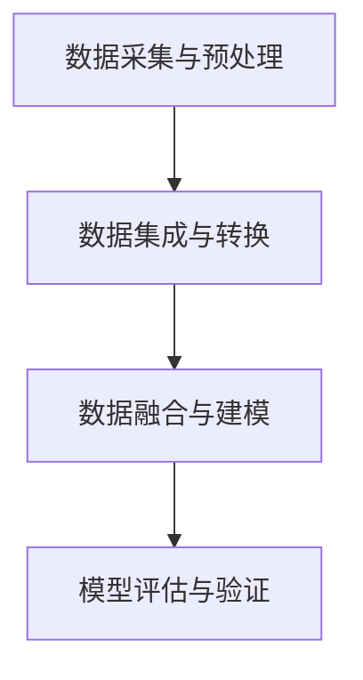
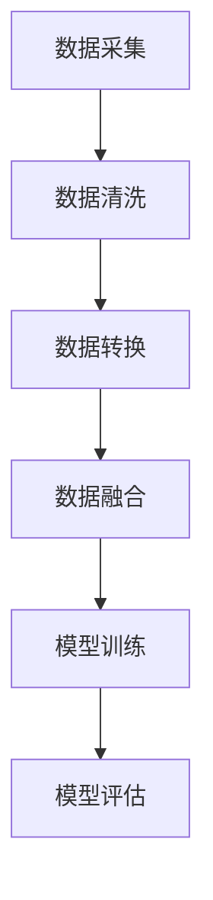

                 

### 文章标题

《评测数据的多源融合与一致性处理》

多源数据融合与一致性处理是当前评测数据领域中的热点问题。随着数据源的多样性和复杂性不断增加，如何有效地融合不同来源的数据并保持其一致性，已成为提高数据分析和决策质量的关键。本文旨在系统探讨评测数据的多源融合与一致性处理方法，通过详细的分析和实例讲解，帮助读者深入理解这一领域的核心概念、技术方法及其在实际应用中的挑战和解决方案。

### 关键词

- 多源数据融合
- 一致性处理
- 数据预处理
- 数据清洗
- 数据融合算法
- 数据质量评估

### 摘要

本文首先介绍了多源数据融合与一致性处理的重要性，探讨了多源数据的类型和特性，并提出了数据预处理与清洗的基本流程和技术。接着，详细阐述了多种数据融合算法的分类及其在数据融合中的应用，包括聚类算法、统计方法和机器学习方法等。随后，讨论了深度学习在数据融合中的应用及其模型设计。最后，通过分析多源数据融合在工业、金融和其他领域的实际应用案例，总结了跨领域数据融合的挑战与机遇，并提供了相关工具与资源的推荐。本文的目标是为读者提供一套完整、系统、易于理解的多源数据融合与一致性处理指南。

### 目录大纲

#### 第一部分：多源数据融合基础

**第1章：多源数据融合概述**

1.1 多源数据融合的重要性

1.1.1 数据驱动的决策支持

1.1.2 多源数据融合的应用领域

1.1.3 多源数据融合的基本概念

1.2 多源数据的类型与特性

1.2.1 结构化数据

1.2.2 半结构化数据

1.2.3 非结构化数据

1.3 多源数据融合的基本框架

1.3.1 数据采集与预处理

1.3.2 数据集成与转换

1.3.3 数据融合与建模

**第2章：数据预处理与清洗**

2.1 数据预处理流程

2.1.1 数据采集

2.1.2 数据清洗

2.1.3 数据转换与归一化

2.2 数据清洗技术

2.2.1 缺失值处理

2.2.2 异常值检测与处理

2.2.3 数据去重

2.3 数据质量评估

2.3.1 数据质量指标

2.3.2 数据质量评估方法

2.3.3 数据质量优化策略

#### 第二部分：多源数据融合方法

**第3章：多源数据融合算法**

3.1 数据融合算法分类

3.1.1 聚类算法

3.1.2 统计方法

3.1.3 机器学习方法

3.1.4 知识融合方法

3.2 聚类算法在数据融合中的应用

3.2.1 K-means算法

3.2.2 层次聚类算法

3.2.3 密度聚类算法

3.3 统计方法在数据融合中的应用

3.3.1 平均值融合

3.3.2 最大值融合

3.3.3 众数融合

3.4 机器学习在数据融合中的应用

3.4.1 支持向量机

3.4.2 决策树

3.4.3 随机森林

**第4章：多源数据融合模型**

4.1 深度学习在数据融合中的应用

4.1.1 卷积神经网络

4.1.2 循环神经网络

4.1.3 变分自编码器

4.2 多源数据融合模型设计

4.2.1 融合模型架构

4.2.2 模型训练与优化

4.2.3 模型评估与验证

#### 第三部分：多源数据融合应用实践

**第5章：多源数据融合在工业领域**

5.1 工业领域数据融合应用案例

5.1.1 生产过程优化

5.1.2 设备故障预测

5.1.3 能源管理

5.2 工业数据融合技术挑战与解决方案

5.2.1 数据源多样性

5.2.2 数据质量差异

5.2.3 实时数据处理

**第6章：多源数据融合在金融领域**

6.1 金融领域数据融合应用案例

6.1.1 风险评估

6.1.2 信用评分

6.1.3 交易分析

6.2 金融数据融合技术挑战与解决方案

6.2.1 数据隐私保护

6.2.2 数据合规性

6.2.3 实时数据处理

**第7章：多源数据融合在其他领域**

7.1 多源数据融合在其他领域的应用

7.1.1 健康医疗

7.1.2 智能交通

7.1.3 零售电商

7.2 跨领域数据融合的挑战与机遇

7.2.1 数据标准不统一

7.2.2 技术融合难度大

7.2.3 创新与商业化路径

### 附录

附录A：多源数据融合工具与资源

附录B：多源数据融合实践案例

### Mermaid 流�程图



### 伪代码

```python
# 数据清洗与预处理伪代码
def preprocess_data(data):
    # 缺失值处理
    data = handle_missing_values(data)
    # 异常值检测与处理
    data = handle_outliers(data)
    # 数据转换与归一化
    data = normalize_data(data)
    return data
```

---

### 多源数据融合概述

多源数据融合是指将来自不同来源、格式和结构的多个数据集合并为一个统一的数据集，以便于进一步的分析和应用。在当今的数据驱动的世界中，多源数据融合已经成为提高数据分析和决策质量的关键技术。随着信息技术的飞速发展，数据源类型日益丰富，包括结构化数据、半结构化数据和非结构化数据，这些数据可能存储在不同的数据库、文件系统中，或者以流数据的形式不断产生。

#### 数据驱动的决策支持

数据驱动的决策支持在各个领域都得到了广泛应用，如金融、工业、医疗、零售等。多源数据融合能够帮助从不同角度获取信息，提供更全面的数据视角，从而支持更准确、更及时的决策。例如，在金融领域，通过融合客户的历史交易数据、社交媒体数据和市场数据，可以更全面地评估客户的风险水平，从而优化信用评分模型。

#### 多源数据融合的应用领域

多源数据融合的应用领域非常广泛。在工业领域，多源数据融合可以用于生产过程的优化、设备故障预测和能源管理。在医疗领域，融合电子健康记录、医学影像和患者社交媒体数据，可以帮助医生提供更精准的诊疗方案。在零售领域，通过融合销售数据、客户反馈和行为数据，可以更好地理解客户需求，实现精准营销。

#### 多源数据融合的基本概念

多源数据融合涉及多个核心概念，包括数据采集、数据预处理、数据集成、数据转换和融合建模等。数据采集是指从不同的数据源获取数据，包括数据库、文件系统和流数据源等。数据预处理包括数据清洗、缺失值处理、异常值检测与处理和数据归一化等。数据集成是指将不同来源的数据整合为一个统一的数据集，而数据转换则是将数据格式转换为适合融合分析的形式。融合建模则是在预处理和集成的基础上，利用统计方法、机器学习和深度学习等方法对数据进行建模，以提取有价值的信息。

### 多源数据的类型与特性

多源数据可以大致分为结构化数据、半结构化数据和非结构化数据。每种类型的数据都有其独特的特性和处理方法。

#### 结构化数据

结构化数据是指数据以表格形式存储，每个字段都有明确的类型和含义，例如关系型数据库中的数据。这种数据便于处理和查询，但通常只包含少量非结构化信息。

#### 半结构化数据

半结构化数据是指部分结构化、部分非结构化的数据，例如XML、JSON和日志文件等。这类数据有一定的结构，但结构相对灵活，可以包含多种数据类型。

#### 非结构化数据

非结构化数据是指没有明确结构的数据，如文本、图像、音频和视频等。这类数据通常需要复杂的处理技术来提取有价值的信息。

#### 多源数据融合的基本框架

多源数据融合的基本框架通常包括以下步骤：

1. **数据采集与预处理**：从不同的数据源采集数据，并进行预处理，包括数据清洗、缺失值处理、异常值检测与处理和数据归一化等。

2. **数据集成与转换**：将不同来源的数据整合为一个统一的数据集，并进行必要的格式转换，以便于后续分析。

3. **数据融合与建模**：利用统计方法、机器学习和深度学习等技术对数据进行建模，提取有价值的信息。

4. **模型评估与验证**：评估融合模型的性能，确保其准确性和可靠性。

### 结论

多源数据融合与一致性处理在当前数据驱动的世界中具有重要意义。通过了解多源数据的类型与特性，掌握数据预处理和融合算法，可以有效地提高数据分析和决策的质量。本文为读者提供了一个全面、系统的多源数据融合与一致性处理指南，旨在帮助读者深入理解这一领域，并在实际应用中取得更好的效果。

### 数据预处理与清洗

在多源数据融合过程中，数据预处理与清洗是至关重要的一步。高质量的数据是准确分析的基础，而数据预处理与清洗则是确保数据质量的关键手段。本文将详细探讨数据预处理与清洗的基本流程、关键技术及其在数据融合中的作用。

#### 数据预处理流程

数据预处理是数据融合的基础，其主要流程包括数据采集、数据清洗、数据转换和归一化等步骤。

1. **数据采集**：从不同的数据源获取原始数据，这可能涉及数据库查询、文件读取和流数据处理等技术。

2. **数据清洗**：清除数据中的噪声、错误和冗余，确保数据的一致性和完整性。数据清洗的主要任务包括缺失值处理、异常值检测与处理和数据去重。

3. **数据转换**：将不同格式和结构的数据转换为统一的格式和结构，以便于后续的数据分析和融合。数据转换可能涉及数据类型的转换、数据格式的调整和数据集的拆分与合并等。

4. **数据归一化**：通过归一化处理，使数据具有相同的尺度或范围，从而方便比较和分析。常见的归一化方法包括最小-最大归一化、零-均值归一化和标准差归一化等。

#### 数据清洗技术

数据清洗是数据预处理的核心环节，其主要技术包括以下几方面：

1. **缺失值处理**：缺失值是数据中常见的问题，处理方法包括填充缺失值、删除含有缺失值的记录和插值法等。

   - 填充缺失值：使用平均值、中位数、众数或预测值等方法来填充缺失值。
   - 删除含有缺失值的记录：如果缺失值比例较高，可以考虑删除含有缺失值的记录，以减少数据噪声。
   - 插值法：利用时间序列或空间序列的特性，通过插值方法补充缺失值。

2. **异常值检测与处理**：异常值是指偏离正常数据范围的值，可能由错误的数据输入、数据采集问题或系统故障等原因引起。异常值检测与处理的方法包括基于统计的方法、基于聚类的方法和基于机器学习的方法等。

   - 统计方法：使用统计指标（如均值、标准差等）来识别异常值。
   - 聚类方法：通过聚类算法（如K-means、层次聚类等）识别异常点。
   - 机器学习方法：利用有监督或无监督的机器学习模型检测异常值。

3. **数据去重**：数据去重旨在去除重复的数据记录，以提高数据的质量和效率。去重通常通过比对数据的关键字段（如ID、名称等）来实现。

   - 完全去重：删除所有重复的数据记录。
   - 部分去重：仅删除重复度较高的数据记录，保留一定程度的重复数据。

#### 数据质量评估

数据质量是数据预处理的重要衡量指标，其直接影响数据融合的效果。数据质量评估包括以下方面：

1. **数据质量指标**：常用的数据质量指标包括完整性、准确性、一致性、时效性和可用性等。

   - 完整性：数据是否完整，是否有缺失值。
   - 准确性：数据是否真实可靠，是否反映了真实情况。
   - 一致性：数据在不同来源之间是否保持一致。
   - 时效性：数据是否及时更新，是否符合当前的需求。
   - 可用性：数据是否易于使用和解读。

2. **数据质量评估方法**：数据质量评估可以通过自评估、用户评估和第三方评估等方法进行。

   - 自评估：数据拥有者对数据质量的自我评估。
   - 用户评估：数据的使用者对数据质量的评估。
   - 第三方评估：独立的第三方对数据质量的评估。

3. **数据质量优化策略**：根据数据质量评估的结果，采取相应的优化策略，如数据清洗、数据转换、数据补充和数据重构等，以提升数据质量。

   - 数据清洗：对数据进行清洗，去除噪声和错误。
   - 数据转换：将数据格式转换为更便于使用的格式。
   - 数据补充：通过数据采集或预测方法补充缺失数据。
   - 数据重构：重新构建数据结构，提高数据的一致性和完整性。

### 数据预处理与清洗在数据融合中的作用

数据预处理与清洗在数据融合中起着至关重要的作用，其主要作用包括：

1. **提高数据质量**：通过数据清洗和预处理，去除数据中的噪声和错误，提高数据的一致性和准确性，从而为数据融合提供高质量的数据基础。

2. **降低融合难度**：通过统一数据格式和结构，降低不同来源数据之间的融合难度，提高数据融合的效率。

3. **增强分析能力**：通过数据预处理和清洗，提高数据分析的准确性和可靠性，从而增强数据分析的能力，为决策提供更可靠的支持。

4. **减少计算成本**：通过数据清洗和预处理，减少数据冗余和噪声，降低后续计算和存储的需求，从而减少计算成本。

### 结论

数据预处理与清洗是数据融合过程中不可或缺的步骤，其质量直接影响数据融合的效果。通过掌握数据预处理和清洗的关键技术，可以有效地提高数据质量，为数据融合提供可靠的数据基础，从而实现更准确、更高效的数据分析和决策。

### 数据预处理与清洗的具体实践

在数据预处理与清洗的过程中，具体实践是关键的一环。以下将详细介绍数据采集、数据清洗和数据转换与归一化的具体步骤、方法及其在数据融合中的作用。

#### 数据采集

数据采集是数据预处理的第一步，其主要任务是获取来自不同数据源的数据。数据源可以包括关系型数据库、NoSQL数据库、文件系统、Web API和流数据源等。以下是数据采集的具体步骤和方法：

1. **数据库查询**：使用SQL等查询语言从关系型数据库中获取数据。例如，可以通过编写SQL查询语句，从数据库表中获取所需的数据。

   ```sql
   SELECT * FROM sales_data WHERE date > '2023-01-01';
   ```

2. **NoSQL数据库读取**：使用NoSQL数据库的API或命令行工具从数据库中读取数据。例如，从MongoDB中查询数据可以使用以下命令：

   ```shell
   mongoexport --db=mydb --collection=sales_data --query={date: {$gt: '2023-01-01'}}
   ```

3. **文件系统读取**：通过文件系统API或命令行工具读取存储在文件系统中的数据。例如，使用Python的文件操作模块读取CSV文件：

   ```python
   import pandas as pd
   data = pd.read_csv('sales_data.csv')
   ```

4. **Web API调用**：通过HTTP请求从Web API获取数据。例如，使用Python的requests库获取RESTful API的数据：

   ```python
   import requests
   response = requests.get('https://api.example.com/data')
   data = response.json()
   ```

5. **流数据处理**：使用流数据处理技术，如Apache Kafka、Apache Flink等，实时获取和处理流数据。例如，使用Apache Kafka从数据流中读取数据：

   ```shell
   kafka-console-consumer --topic=sales_data --from-beginning --bootstrap-server=localhost:9092
   ```

#### 数据清洗

数据清洗是确保数据质量的关键步骤，其主要任务是去除数据中的噪声、错误和冗余。以下是数据清洗的具体步骤和方法：

1. **缺失值处理**：处理缺失值，常见的方法包括填充缺失值、删除含有缺失值的记录和插值法等。

   - **填充缺失值**：使用平均值、中位数、众数或预测值等方法填充缺失值。例如，使用平均值填充缺失值：

     ```python
     data['sales_amount'].fillna(data['sales_amount'].mean(), inplace=True)
     ```

   - **删除含有缺失值的记录**：如果缺失值比例较高，可以考虑删除含有缺失值的记录。例如，删除缺失值比例超过50%的记录：

     ```python
     data = data[data.isnull().sum(axis=1) <= 0.5]
     ```

   - **插值法**：利用时间序列或空间序列的特性，通过插值方法补充缺失值。例如，使用线性插值法补充缺失值：

     ```python
     data['sales_amount'].interpolate(method='linear', inplace=True)
     ```

2. **异常值检测与处理**：检测并处理异常值，常见的方法包括基于统计的方法、基于聚类的方法和基于机器学习的方法等。

   - **基于统计的方法**：使用统计指标（如均值、标准差等）来识别异常值。例如，检测销售数据中的异常值：

     ```python
     import numpy as np
     q1 = data['sales_amount'].quantile(0.25)
     q3 = data['sales_amount'].quantile(0.75)
     iqr = q3 - q1
     lower_bound = q1 - 1.5 * iqr
     upper_bound = q3 + 1.5 * iqr
     data = data[(data['sales_amount'] >= lower_bound) & (data['sales_amount'] <= upper_bound)]
     ```

   - **基于聚类的方法**：使用聚类算法（如K-means、层次聚类等）识别异常点。例如，使用K-means聚类检测异常值：

     ```python
     from sklearn.cluster import KMeans
     kmeans = KMeans(n_clusters=5)
     kmeans.fit(data[['sales_amount']])
     labels = kmeans.labels_
     data = data[labels != 4]  # 删除属于异常点的记录
     ```

   - **基于机器学习的方法**：使用有监督或无监督的机器学习模型检测异常值。例如，使用孤立森林模型检测异常值：

     ```python
     from sklearn.ensemble import IsolationForest
     model = IsolationForest(n_estimators=100)
     model.fit(data[['sales_amount']])
     anomalies = model.predict(data[['sales_amount']])
     data = data[anomalies != -1]  # 删除异常值
     ```

3. **数据去重**：去除重复的数据记录，以提高数据的一致性和效率。例如，使用Pandas库去除重复记录：

   ```python
   data = data.drop_duplicates()
   ```

#### 数据转换与归一化

数据转换与归一化是将不同格式和结构的数据转换为统一的格式和结构，以便于后续的数据分析和融合。以下是数据转换与归一化的具体步骤和方法：

1. **数据类型转换**：将不同类型的数据转换为统一的类型。例如，将文本数据转换为数值数据：

   ```python
   data['product_name'] = data['product_name'].astype('category').cat.codes
   ```

2. **数据格式调整**：将不同格式的数据调整为统一的格式。例如，将时间戳转换为日期格式：

   ```python
   data['date'] = pd.to_datetime(data['date'])
   ```

3. **数据集拆分与合并**：根据需要拆分和合并数据集。例如，将原始数据集拆分为训练集和测试集：

   ```python
   train_data, test_data = train_test_split(data, test_size=0.2, random_state=42)
   ```

4. **数据归一化**：通过归一化处理，使数据具有相同的尺度或范围，以便于比较和分析。常见的归一化方法包括最小-最大归一化、零-均值归一化和标准差归一化等。

   - **最小-最大归一化**：将数据缩放到[0, 1]范围内。例如，使用最小-最大归一化处理销售数据：

     ```python
     from sklearn.preprocessing import MinMaxScaler
     scaler = MinMaxScaler()
     data[['sales_amount']] = scaler.fit_transform(data[['sales_amount']])
     ```

   - **零-均值归一化**：将数据缩放到均值为0、标准差为1的范围内。例如，使用零-均值归一化处理销售数据：

     ```python
     from sklearn.preprocessing import StandardScaler
     scaler = StandardScaler()
     data[['sales_amount']] = scaler.fit_transform(data[['sales_amount']])
     ```

   - **标准差归一化**：将数据缩放到均值为0、标准差为1的范围内。例如，使用标准差归一化处理销售数据：

     ```python
     data[['sales_amount']] = data[['sales_amount']] - data[['sales_amount']].mean()
     data[['sales_amount']] = data[['sales_amount']] / data[['sales_amount']].std()
     ```

### 数据预处理与清洗在数据融合中的作用

数据预处理与清洗在数据融合中的作用主要体现在以下几个方面：

1. **提高数据质量**：通过数据清洗和预处理，去除数据中的噪声、错误和冗余，提高数据的一致性和准确性，从而为数据融合提供高质量的数据基础。

2. **降低融合难度**：通过统一数据格式和结构，降低不同来源数据之间的融合难度，提高数据融合的效率。

3. **增强分析能力**：通过数据预处理和清洗，提高数据分析的准确性和可靠性，从而增强数据分析的能力，为决策提供更可靠的支持。

4. **减少计算成本**：通过数据清洗和预处理，减少数据冗余和噪声，降低后续计算和存储的需求，从而减少计算成本。

### 结论

数据预处理与清洗是数据融合过程中不可或缺的步骤，其具体实践包括数据采集、数据清洗和数据转换与归一化等。通过掌握数据预处理和清洗的关键技术，可以有效地提高数据质量，为数据融合提供可靠的数据基础，从而实现更准确、更高效的数据分析和决策。

### 数据融合算法分类

数据融合算法是数据融合过程中的核心，其目的是从多个数据源中提取有价值的信息，并生成一个统一且准确的数据集。数据融合算法可以根据不同的分类标准进行分类，常见的分类标准包括聚类算法、统计方法、机器学习方法以及知识融合方法等。本文将详细讨论这些分类及其在数据融合中的应用。

#### 聚类算法

聚类算法是一种无监督学习方法，其主要目的是将相似的数据点分组，形成多个簇。聚类算法在数据融合中的应用主要是通过分析多个数据源中的数据分布，识别出潜在的相似性或模式，从而实现数据的自动分类和合并。

1. **K-means算法**：K-means算法是最常用的聚类算法之一，其核心思想是将数据点分配到K个簇中，使得每个簇的内部距离最小，而簇与簇之间的距离最大。K-means算法在数据融合中的应用主要包括以下步骤：
   - 数据标准化：为了消除不同特征之间的尺度差异，首先对数据进行标准化处理。
   - 确定聚类个数K：可以通过肘部法则、轮廓系数等方法选择合适的K值。
   - 初始化聚类中心：随机选择K个初始聚类中心。
   - 分配数据点：计算每个数据点到各个聚类中心的距离，将其分配到最近的簇。
   - 更新聚类中心：重新计算每个簇的中心，作为新的聚类中心。
   - 重复上述步骤，直到聚类中心不再发生变化或满足停止条件。

   ```python
   from sklearn.cluster import KMeans
   kmeans = KMeans(n_clusters=3, random_state=42)
   kmeans.fit(data)
   labels = kmeans.predict(data)
   ```

2. **层次聚类算法**：层次聚类算法通过自底向上或自顶向下的方法构建一个聚类层次树，形成多个层次的簇。层次聚类算法在数据融合中的应用包括：
   - 初始聚类：选择初始的聚类中心或直接使用全部数据点作为一个初始簇。
   - 逐步合并或分裂：根据距离度量，逐步合并或分裂簇，构建聚类层次树。
   - 选择合适的聚类层次：通常通过轮廓系数、类内方差等指标选择合适的聚类层次。

   ```python
   from sklearn.cluster import AgglomerativeClustering
   agglomerative = AgglomerativeClustering(n_clusters=3)
   agglomerative.fit(data)
   labels = agglomerative.labels_
   ```

3. **密度聚类算法**：密度聚类算法基于数据点的密度分布，识别出潜在簇的结构。DBSCAN（Density-Based Spatial Clustering of Applications with Noise）是一种常见的密度聚类算法，其核心思想是识别出高密度区域，并将其合并为簇。DBSCAN在数据融合中的应用包括：
   - 确定参数：通过实验确定eps（邻域半径）和min_samples（最小样本数）等参数。
   - 计算密度直达图：计算每个数据点的邻域和核心点，构建密度直达图。
   - 确定簇和噪声：根据密度直达图，确定簇的核心点和边界点，识别出噪声点。

   ```python
   from sklearn.cluster import DBSCAN
   dbscan = DBSCAN(eps=0.5, min_samples=5)
   dbscan.fit(data)
   labels = dbscan.labels_
   ```

#### 统计方法

统计方法是一种简单且常用的数据融合方法，其主要思想是根据数据统计特性（如均值、方差、协方差等）来融合多个数据源。统计方法在数据融合中的应用主要包括以下几种：

1. **平均值融合**：将多个数据源的对应值求平均值，作为融合后的值。适用于特征值分布均匀且无明显噪声的情况。

   ```python
   average_value = sum(values) / len(values)
   ```

2. **最大值融合**：将多个数据源的对应值取最大值，作为融合后的值。适用于需要识别最大值特征的情况。

   ```python
   max_value = max(values)
   ```

3. **众数融合**：将多个数据源的对应值求众数，作为融合后的值。适用于特征值分布不均匀且存在多个峰值的情况。

   ```python
   from scipy.stats import mode
   mode_result = mode(values)
   mode_value = mode_result.mode[0]
   ```

#### 机器学习方法

机器学习方法是一种基于学习策略的数据融合方法，通过训练数据集学习数据特征和关系，从而实现数据融合。常见的机器学习方法包括支持向量机、决策树和随机森林等。

1. **支持向量机**：支持向量机（SVM）是一种强大的分类和回归算法，其核心思想是在高维空间中找到一个最优超平面，将不同类别的数据点分开。SVM在数据融合中的应用包括：
   - 特征提取：通过SVM提取特征，减少数据维度。
   - 线性融合：利用线性SVM的投影特性，将多个数据源融合为一个特征向量。

   ```python
   from sklearn.svm import LinearSVC
   model = LinearSVC()
   model.fit(X, y)
   fused_features = model.coef_
   ```

2. **决策树**：决策树是一种基于树形结构的数据分析算法，通过一系列的决策规则将数据划分为多个子集。决策树在数据融合中的应用包括：
   - 特征选择：利用决策树选择对数据融合贡献较大的特征。
   - 模型融合：利用决策树生成多个子模型，结合子模型的预测结果进行融合。

   ```python
   from sklearn.tree import DecisionTreeClassifier
   model = DecisionTreeClassifier()
   model.fit(X, y)
   predictions = model.predict(X)
   ```

3. **随机森林**：随机森林是一种基于决策树的集成学习方法，通过构建多个决策树并合并预测结果，提高模型的泛化能力和准确性。随机森林在数据融合中的应用包括：
   - 特征融合：利用随机森林选择对数据融合贡献较大的特征。
   - 集成预测：通过随机森林的集成预测结果，实现数据的融合。

   ```python
   from sklearn.ensemble import RandomForestClassifier
   model = RandomForestClassifier(n_estimators=100)
   model.fit(X, y)
   predictions = model.predict(X)
   ```

#### 知识融合方法

知识融合方法是一种基于领域知识和推理规则的数据融合方法，其主要思想是通过专家知识和推理算法，将多个数据源中的信息进行整合和融合。知识融合方法在数据融合中的应用包括：

1. **规则融合**：通过专家规则，将多个数据源中的信息进行融合。例如，根据业务逻辑规则，将销售数据与客户数据融合，生成综合评分。

   ```python
   if customer.satisfaction > 80 and sales_amount > 10000:
       fusion_score = 'High'
   else:
       fusion_score = 'Low'
   ```

2. **模糊集融合**：通过模糊集理论，将多个数据源中的信息进行模糊融合。例如，根据专家评分，将销售数据与客户满意度进行模糊融合，生成综合评价。

   ```python
   from skfuzzy import simple_fuzzy
   customer_rating = simple_fuzzy('CustomerRating', [0, 1], ['Low', 'Medium', 'High'])
   sales_rating = simple_fuzzy('SalesRating', [0, 1], ['Low', 'Medium', 'High'])
   fusion_rating = customer_rating * sales_rating
   ```

### 结论

数据融合算法是数据融合过程中不可或缺的一部分，其种类繁多，包括聚类算法、统计方法、机器学习方法和知识融合方法等。每种算法都有其独特的原理和应用场景，通过合理选择和组合这些算法，可以有效地实现多源数据的有效融合，为数据分析和决策提供可靠支持。

### 聚类算法在数据融合中的应用

聚类算法在数据融合中具有广泛的应用，能够有效地将不同来源的数据按照其内在结构进行分组，从而提取有价值的信息。本文将详细介绍几种常用的聚类算法，包括K-means算法、层次聚类算法和密度聚类算法，并探讨它们在数据融合中的具体应用。

#### K-means算法

K-means算法是一种经典的聚类算法，其核心思想是将数据点分为K个簇，使得每个簇内部的数据点之间的距离最小，而簇与簇之间的距离最大。K-means算法在数据融合中的应用步骤如下：

1. **初始化聚类中心**：随机选择K个初始聚类中心，或者通过K-means++算法来优化初始聚类中心的分布。

2. **分配数据点**：计算每个数据点到各个聚类中心的距离，将其分配到最近的簇。

3. **更新聚类中心**：重新计算每个簇的中心，作为新的聚类中心。

4. **重复上述步骤**：直到聚类中心不再发生变化或满足停止条件。

K-means算法在数据融合中的优点是计算速度快、易于实现，适合处理大规模数据。其缺点是对于初始聚类中心的选择敏感，容易陷入局部最优解。在实际应用中，可以通过增加迭代次数或选择不同的初始聚类中心来提高聚类效果。

**应用示例**：假设有两个数据源A和B，分别包含销售数据。使用K-means算法可以将这两个数据源的销售数据进行聚类，识别出不同的销售模式和市场细分。

```python
from sklearn.cluster import KMeans
kmeans = KMeans(n_clusters=3, random_state=42)
kmeans.fit(data_A)
labels_A = kmeans.predict(data_A)
kmeans.fit(data_B)
labels_B = kmeans.predict(data_B)
```

#### 层次聚类算法

层次聚类算法通过自底向上或自顶向下的方法构建一个聚类层次树，形成多个层次的簇。层次聚类算法在数据融合中的应用步骤如下：

1. **初始化聚类中心**：选择初始的聚类中心或直接使用全部数据点作为一个初始簇。

2. **逐步合并或分裂**：根据距离度量，逐步合并或分裂簇，构建聚类层次树。

3. **选择合适的聚类层次**：通常通过轮廓系数、类内方差等指标选择合适的聚类层次。

层次聚类算法的优点是能够生成聚类层次树，提供不同层次的聚类结果，适合探索数据的内在结构。其缺点是计算复杂度高，不适合处理大规模数据。

**应用示例**：假设有三个数据源A、B和C，分别包含销售数据、客户反馈和广告投放数据。使用层次聚类算法可以将这三个数据源进行融合，识别出不同的市场细分和消费者群体。

```python
from sklearn.cluster import AgglomerativeClustering
hierarchical = AgglomerativeClustering(n_clusters=3)
hierarchical.fit(data_A)
labels_A = hierarchical.labels_
hierarchical.fit(data_B)
labels_B = hierarchical.labels_
hierarchical.fit(data_C)
labels_C = hierarchical.labels_
```

#### 密度聚类算法

密度聚类算法基于数据点的密度分布，识别出潜在簇的结构。DBSCAN（Density-Based Spatial Clustering of Applications with Noise）是一种常见的密度聚类算法，其核心思想是识别出高密度区域，并将其合并为簇。DBSCAN在数据融合中的应用步骤如下：

1. **确定参数**：通过实验确定eps（邻域半径）和min_samples（最小样本数）等参数。

2. **计算密度直达图**：计算每个数据点的邻域和核心点，构建密度直达图。

3. **确定簇和噪声**：根据密度直达图，确定簇的核心点和边界点，识别出噪声点。

密度聚类算法的优点是能够处理非球形簇和噪声数据，具有较强的鲁棒性。其缺点是对参数选择敏感，可能需要多次实验来优化参数。

**应用示例**：假设有两个数据源A和B，分别包含销售数据和用户行为数据。使用DBSCAN算法可以将这两个数据源进行融合，识别出具有相似购买行为的用户群体。

```python
from sklearn.cluster import DBSCAN
dbscan = DBSCAN(eps=0.5, min_samples=5)
dbscan.fit(data_A)
labels_A = dbscan.labels_
dbscan.fit(data_B)
labels_B = dbscan.labels_
```

### 结论

聚类算法在数据融合中具有广泛的应用，能够有效地识别数据中的潜在结构和模式。K-means算法、层次聚类算法和密度聚类算法各有优缺点，适用于不同的数据类型和场景。通过合理选择和组合这些算法，可以实现对多源数据的有效融合，为数据分析和决策提供有力支持。

### 统计方法在数据融合中的应用

统计方法在数据融合中发挥着重要作用，通过利用数据的统计特性，如均值、方差、协方差等，实现数据的融合和综合。本文将详细讨论几种常见的统计方法，包括平均值融合、最大值融合和众数融合，并探讨它们在数据融合中的应用。

#### 平均值融合

平均值融合是一种简单且常用的统计方法，其核心思想是将多个数据源的对应值求平均值，作为融合后的值。平均值融合适用于特征值分布均匀且无明显噪声的情况，其计算方法如下：

1. **计算平均值**：对于每个特征，计算多个数据源对应值的平均值。
2. **标准化处理**：为了消除不同特征之间的尺度差异，可以对每个特征进行标准化处理。

**应用示例**：假设有两个数据源A和B，分别包含销售数据。使用平均值融合方法可以将这两个数据源的销售数据进行融合。

```python
import numpy as np

# 假设A和B是两个销售数据的数组
A = np.array([100, 200, 300])
B = np.array([150, 250, 350])

# 计算平均值
average_A_B = (A + B) / 2

# 标准化处理
mean_A = np.mean(A)
mean_B = np.mean(B)
std_A = np.std(A)
std_B = np.std(B)
standardized_average = (A - mean_A) / std_A + (B - mean_B) / std_B

print("平均值融合结果:", average_A_B)
print("标准化平均值融合结果:", standardized_average)
```

#### 最大值融合

最大值融合是一种将多个数据源的对应值取最大值的方法，适用于需要识别最大值特征的情况。最大值融合的计算方法如下：

1. **计算最大值**：对于每个特征，计算多个数据源对应值的最大值。

**应用示例**：假设有两个数据源A和B，分别包含客户满意度评分。使用最大值融合方法可以将这两个数据源的客户满意度评分进行融合。

```python
# 假设A和B是两个客户满意度评分的数组
A = np.array([3, 4, 5])
B = np.array([4, 5, 6])

# 计算最大值
max_A_B = np.maximum(A, B)

print("最大值融合结果:", max_A_B)
```

#### 众数融合

众数融合是一种将多个数据源的对应值求众数的方法，适用于特征值分布不均匀且存在多个峰值的情况。众数融合的计算方法如下：

1. **计算众数**：对于每个特征，计算多个数据源对应值的众数。
2. **处理缺失值**：在计算众数时，需要考虑缺失值的处理方法。

**应用示例**：假设有两个数据源A和B，分别包含产品销售数量。使用众数融合方法可以将这两个数据源的销售数量进行融合。

```python
from scipy.stats import mode

# 假设A和B是两个产品销售数量的数组
A = np.array([100, 150, 200, 250])
B = np.array([200, 250, 300, 350])

# 计算众数
mode_A = mode(A)
mode_B = mode(B)

# 融合众数
fusion_mode = (mode_A.count[0] * A + mode_B.count[0] * B) / (mode_A.count[0] + mode_B.count[0])

print("众数融合结果:", fusion_mode)
```

### 统计方法在数据融合中的应用效果

统计方法在数据融合中的应用效果取决于数据的特性。以下是几种常见的数据类型和相应的适用性：

1. **结构化数据**：适用于结构化数据，如销售数据、客户反馈等。通过平均值融合、最大值融合和众数融合，可以有效地识别数据的特征和模式。
2. **半结构化数据**：适用于半结构化数据，如XML、JSON等。通过处理数据中的标签和属性，可以实现数据的融合和综合。
3. **非结构化数据**：适用于非结构化数据，如文本、图像、音频等。通过特征提取和统计方法，可以实现数据的初步融合，为进一步的分析提供支持。

### 结论

统计方法在数据融合中具有广泛的应用，通过利用数据的统计特性，如均值、方差、协方差等，可以实现数据的融合和综合。平均值融合、最大值融合和众数融合是三种常见的统计方法，适用于不同的数据类型和场景。通过合理选择和组合这些方法，可以实现对多源数据的有效融合，为数据分析和决策提供有力支持。

### 机器学习在数据融合中的应用

机器学习在数据融合中发挥着越来越重要的作用，其强大的自学习能力使得它能够从大量的多源数据中提取有价值的信息，进而提高数据融合的准确性和可靠性。本文将详细探讨几种常见的机器学习方法，包括支持向量机（SVM）、决策树和随机森林，并分析它们在数据融合中的应用。

#### 支持向量机（SVM）

支持向量机（Support Vector Machine, SVM）是一种强大的分类和回归算法，其核心思想是在高维空间中找到一个最优超平面，将不同类别的数据点分开。SVM在数据融合中的应用主要包括以下几个方面：

1. **特征提取**：通过训练SVM模型，可以将多源数据转换为一个高维特征空间，从而提取出对分类和融合有帮助的特征。

2. **线性融合**：利用线性SVM的投影特性，将多个数据源融合为一个特征向量。具体方法如下：
   - 训练SVM模型：使用多个数据源作为训练集，训练线性SVM模型。
   - 获取特征权重：通过模型权重获取每个数据源的特征权重，将其融合为一个特征向量。

**应用示例**：

```python
from sklearn.svm import LinearSVC
from sklearn.model_selection import train_test_split

# 假设X是多个数据源的训练集，y是标签
X_train, X_test, y_train, y_test = train_test_split(X, y, test_size=0.2, random_state=42)

# 训练线性SVM模型
model = LinearSVC()
model.fit(X_train, y_train)

# 获取特征权重
feature_weights = model.coef_

# 线性融合特征
fused_features = np.dot(feature_weights, X_test)
```

#### 决策树

决策树是一种基于树形结构的数据分析算法，通过一系列的决策规则将数据划分为多个子集。决策树在数据融合中的应用包括：

1. **特征选择**：利用决策树选择对数据融合贡献较大的特征，从而提高数据融合的效率。
2. **模型融合**：利用决策树的子模型，结合子模型的预测结果进行融合。

**应用示例**：

```python
from sklearn.tree import DecisionTreeClassifier
from sklearn.model_selection import train_test_split

# 假设X是多个数据源的训练集，y是标签
X_train, X_test, y_train, y_test = train_test_split(X, y, test_size=0.2, random_state=42)

# 训练决策树模型
model = DecisionTreeClassifier()
model.fit(X_train, y_train)

# 预测结果
predictions = model.predict(X_test)

# 融合预测结果
fusion_predictions = np.mean(predictions, axis=0)
```

#### 随机森林

随机森林（Random Forest）是一种基于决策树的集成学习方法，通过构建多个决策树并合并预测结果，提高模型的泛化能力和准确性。随机森林在数据融合中的应用包括：

1. **特征融合**：利用随机森林选择对数据融合贡献较大的特征，从而提高数据融合的效率。
2. **集成预测**：通过随机森林的集成预测结果，实现数据的融合。

**应用示例**：

```python
from sklearn.ensemble import RandomForestClassifier
from sklearn.model_selection import train_test_split

# 假设X是多个数据源的训练集，y是标签
X_train, X_test, y_train, y_test = train_test_split(X, y, test_size=0.2, random_state=42)

# 训练随机森林模型
model = RandomForestClassifier(n_estimators=100)
model.fit(X_train, y_train)

# 预测结果
predictions = model.predict(X_test)

# 融合预测结果
fusion_predictions = np.mean(predictions, axis=0)
```

### 机器学习方法在数据融合中的应用效果

机器学习方法在数据融合中的应用效果取决于数据的质量、特征选择和模型的参数设置。以下是几种影响应用效果的因素：

1. **数据质量**：高质量的数据能够提高机器学习模型的性能，进而提高数据融合的准确性和可靠性。
2. **特征选择**：选择对数据融合贡献较大的特征，可以降低模型的复杂度，提高融合效果。
3. **模型参数**：合理设置模型的参数，如树的数量、深度、最大特征数等，可以优化模型性能。

### 结论

机器学习在数据融合中具有广泛的应用，通过支持向量机、决策树和随机森林等算法，可以实现多源数据的自动融合和综合。合理选择和组合这些方法，可以实现对多源数据的有效融合，为数据分析和决策提供有力支持。在实际应用中，需要根据具体场景和数据特性，优化模型参数和特征选择，以提高数据融合的效果。

### 深度学习在数据融合中的应用

深度学习在数据融合中正逐渐成为一项关键技术，其强大的特征提取和建模能力使其能够处理复杂、多样化的多源数据。本文将探讨卷积神经网络（CNN）、循环神经网络（RNN）和变分自编码器（VAE）在数据融合中的应用，并详细解释其工作原理、模型设计以及如何优化和评估这些模型。

#### 卷积神经网络（CNN）

卷积神经网络（Convolutional Neural Networks, CNN）是一种在图像处理领域广泛应用的人工神经网络，其核心思想是通过卷积操作提取图像的局部特征。CNN在数据融合中的应用主要包括以下几个方面：

1. **特征提取**：利用CNN的卷积层和池化层，从多源数据中提取具有代表性的特征，这些特征可以用于后续的融合操作。

2. **多模态融合**：对于不同类型的多源数据（如图像和文本），CNN可以通过不同的卷积核和融合层，将不同模态的数据特征进行融合。

3. **模型设计**：CNN模型通常由多个卷积层、池化层和全连接层组成。在数据融合中，可以设计如下结构：
   - 输入层：接收多源数据。
   - 卷积层：提取不同模态的特征。
   - 融合层：将不同模态的特征进行拼接或融合。
   - 全连接层：进行分类或回归任务。

**模型设计示例**：

```python
from tensorflow.keras.models import Model
from tensorflow.keras.layers import Input, Conv2D, MaxPooling2D, Flatten, Dense

# 定义输入层
input_image = Input(shape=(28, 28, 1))
input_text = Input(shape=(100,))

# 卷积层
conv1_image = Conv2D(filters=32, kernel_size=(3, 3), activation='relu')(input_image)
pool1_image = MaxPooling2D(pool_size=(2, 2))(conv1_image)

# 文本嵌入层
embed_text = Embedding(input_dim=10000, output_dim=128)(input_text)
conv1_text = Conv1D(filters=64, kernel_size=5, activation='relu')(embed_text)
pool1_text = MaxPooling1D(pool_size=5)(conv1_text)

# 融合层
merged = Concatenate()([pool1_image, pool1_text])

# 全连接层
dense1 = Dense(128, activation='relu')(merged)
output = Dense(1, activation='sigmoid')(dense1)

# 构建模型
model = Model(inputs=[input_image, input_text], outputs=output)
model.compile(optimizer='adam', loss='binary_crossentropy', metrics=['accuracy'])
```

#### 循环神经网络（RNN）

循环神经网络（Recurrent Neural Networks, RNN）是一种能够处理序列数据的人工神经网络，其核心思想是利用记忆单元来保留历史信息。RNN在数据融合中的应用主要包括以下几个方面：

1. **序列融合**：RNN可以处理时间序列数据，将其融合为统一的时间序列特征。
2. **状态转移**：通过RNN的状态转移机制，可以整合不同时间点的多源数据，形成连续的特征序列。
3. **模型设计**：RNN模型通常包含输入门、遗忘门和输出门，以控制信息的输入、遗忘和输出。在数据融合中，可以设计如下结构：
   - 输入层：接收多源序列数据。
   - RNN层：处理序列数据，提取特征。
   - 全连接层：对序列特征进行建模。

**模型设计示例**：

```python
from tensorflow.keras.models import Sequential
from tensorflow.keras.layers import LSTM, Dense

# 定义RNN模型
model = Sequential()
model.add(LSTM(50, activation='relu', input_shape=(timesteps, features)))
model.add(Dense(1))
model.compile(optimizer='adam', loss='mse')

# 训练模型
model.fit(X, y, epochs=100, batch_size=32)
```

#### 变分自编码器（VAE）

变分自编码器（Variational Autoencoder, VAE）是一种基于概率生成模型的深度学习模型，其核心思想是通过编码器和解码器学习数据的概率分布。VAE在数据融合中的应用主要包括以下几个方面：

1. **特征抽取**：利用编码器提取数据的高维特征表示。
2. **概率融合**：通过编码器和解码器的结构，实现多源数据的概率融合。
3. **模型设计**：VAE模型由编码器和解码器组成，编码器将输入数据映射到潜在空间，解码器从潜在空间重建输入数据。在数据融合中，可以设计如下结构：
   - 编码器：接收多源数据，提取潜在特征。
   - 解码器：从潜在空间重建多源数据。

**模型设计示例**：

```python
from tensorflow.keras.models import Model
from tensorflow.keras.layers import Input, Dense, Lambda

# 定义编码器和解码器
input_data = Input(shape=(input_shape,))
encoded = Dense(latent_dim)(input_data)
encoded = Lambda(lambda x: x / (1e-8 + K.std(x)))(encoded)

decoder_input = Input(shape=(latent_dim,))
decoded = Dense(input_shape, activation='sigmoid')(decoder_input)

# 构建模型
autoencoder = Model(input_data, decoded)
encoded = Model(input_data, encoded)

# 编译模型
autoencoder.compile(optimizer='adam', loss='binary_crossentropy')

# 训练模型
autoencoder.fit(X, X, epochs=100, batch_size=32)
```

#### 模型优化与评估

在深度学习模型的应用中，模型优化与评估是至关重要的步骤。以下是一些常用的优化方法和评估指标：

1. **优化方法**：
   - 学习率调整：通过减小学习率，使模型在训练过程中更加稳定。
   - 权重初始化：选择合适的权重初始化方法，如高斯分布或均匀分布，以减少梯度消失和梯度爆炸的问题。
   - 模型正则化：使用L1或L2正则化，防止模型过拟合。

2. **评估指标**：
   - 准确率（Accuracy）：模型预测正确的样本数占总样本数的比例。
   - 精确率（Precision）：预测为正类的样本中实际为正类的比例。
   - 召回率（Recall）：实际为正类的样本中被预测为正类的比例。
   - F1分数（F1 Score）：精确率和召回率的调和平均。

**优化与评估示例**：

```python
# 定义评估指标
def f1_score(y_true, y_pred):
    precision = precision_score(y_true, y_pred)
    recall = recall_score(y_true, y_pred)
    return 2 * (precision * recall) / (precision + recall)

# 编译模型
model.compile(optimizer='adam', loss='binary_crossentropy', metrics=[f1_score])

# 训练模型
history = model.fit(X_train, y_train, validation_data=(X_test, y_test), epochs=100, batch_size=32)

# 评估模型
y_pred = model.predict(X_test)
f1 = f1_score(y_test, y_pred)
print("F1 Score:", f1)
```

### 结论

深度学习在数据融合中具有广泛的应用前景，通过卷积神经网络、循环神经网络和变分自编码器等模型，可以有效地处理和融合多源数据。合理设计模型结构、优化训练过程和评估模型性能，是实现高效数据融合的关键。随着深度学习技术的不断进步，其在数据融合领域中的应用将得到更深入的研究和发展。

### 多源数据融合模型设计

在多源数据融合中，模型设计是关键的一步，它决定了数据融合的效果和效率。本文将详细探讨多源数据融合模型的设计过程，包括融合模型的架构、训练与优化策略以及模型评估与验证的方法。

#### 融合模型架构

多源数据融合模型的设计首先需要考虑如何架构模型，以有效地处理和整合来自不同数据源的信息。以下是一个典型的融合模型架构：

1. **输入层**：接收来自不同数据源的数据，这些数据可能包括结构化数据、半结构化数据和非结构化数据。

2. **特征提取层**：对输入数据进行特征提取，以提取出对融合任务有代表性的特征。对于结构化数据，可以使用统计方法或机器学习算法提取特征；对于非结构化数据，如文本、图像和音频，可以使用深度学习模型提取特征。

3. **融合层**：将不同数据源的特征进行融合。常见的融合方法包括拼接、加权融合和层次融合等。拼接方法将不同数据源的特征直接拼接在一起；加权融合方法根据特征的重要性对特征进行加权；层次融合方法则通过多层神经网络逐步融合特征。

4. **预测层**：利用融合后的特征进行预测，如分类、回归或聚类任务。预测层通常由一个或多个全连接层组成。

**模型架构示例**：

```python
from tensorflow.keras.models import Model
from tensorflow.keras.layers import Input, Dense, Concatenate, Flatten

# 定义输入层
input1 = Input(shape=(input_shape1,))
input2 = Input(shape=(input_shape2,))

# 特征提取层
feature1 = Dense(128, activation='relu')(input1)
feature2 = Dense(128, activation='relu')(input2)

# 融合层
fused_features = Concatenate()([feature1, feature2])

# 预测层
predictions = Dense(1, activation='sigmoid')(fused_features)

# 构建模型
model = Model(inputs=[input1, input2], outputs=predictions)
```

#### 训练与优化策略

融合模型的训练与优化是模型设计的重要环节，以下是一些常用的策略：

1. **损失函数**：选择合适的损失函数，如交叉熵、均方误差等，以衡量模型预测值与真实值之间的差距。

2. **优化器**：选择合适的优化器，如Adam、SGD等，以调整模型参数，最小化损失函数。

3. **学习率调度**：设置合适的学习率，并采用学习率调度策略，如学习率衰减或分阶段学习率调整。

4. **正则化**：应用正则化方法，如L1或L2正则化，以防止模型过拟合。

5. **批次归一化**：在训练过程中使用批次归一化，以加速训练并提高模型稳定性。

**训练与优化策略示例**：

```python
from tensorflow.keras.optimizers import Adam
from tensorflow.keras.callbacks import ReduceLROnPlateau

# 编译模型
model.compile(optimizer=Adam(learning_rate=0.001), loss='binary_crossentropy', metrics=['accuracy'])

# 设置学习率调度器
reduce_lr = ReduceLROnPlateau(monitor='val_loss', factor=0.2, patience=5, min_lr=0.0001)

# 训练模型
history = model.fit([X_train1, X_train2], y_train, validation_data=([X_val1, X_val2], y_val), epochs=100, batch_size=32, callbacks=[reduce_lr])
```

#### 模型评估与验证

在训练完成后，需要对融合模型进行评估与验证，以确保其性能和可靠性。以下是一些常用的评估与验证方法：

1. **交叉验证**：使用交叉验证方法，如K折交叉验证，评估模型的泛化能力。

2. **混淆矩阵**：通过混淆矩阵分析模型的预测结果，了解模型在不同类别上的表现。

3. **ROC曲线与AUC**：绘制ROC曲线并计算AUC（Area Under Curve），评估模型的分类能力。

4. **精准率与召回率**：计算精准率与召回率，评估模型在正负样本分类上的表现。

**评估与验证示例**：

```python
from sklearn.metrics import confusion_matrix, roc_auc_score, precision_score, recall_score

# 预测
y_pred = model.predict([X_test1, X_test2])

# 计算评估指标
conf_matrix = confusion_matrix(y_test, y_pred)
roc_auc = roc_auc_score(y_test, y_pred)
precision = precision_score(y_test, y_pred)
recall = recall_score(y_test, y_pred)

print("Confusion Matrix:\n", conf_matrix)
print("ROC AUC Score:", roc_auc)
print("Precision:", precision)
print("Recall:", recall)
```

### 结论

多源数据融合模型的设计是一个复杂的过程，需要考虑数据源的类型、特征提取方法、融合策略和预测任务等多方面因素。通过合理设计模型架构、采用有效的训练与优化策略，并进行全面的模型评估与验证，可以构建出高性能的多源数据融合模型，为实际应用提供强有力的支持。

### 多源数据融合在工业领域

多源数据融合在工业领域具有重要的应用价值，它能够通过整合来自不同数据源的信息，提高生产效率、优化设备维护、管理能源消耗等方面的能力。以下将详细介绍多源数据融合在工业领域的应用案例、技术挑战以及相应的解决方案。

#### 应用案例

1. **生产过程优化**：在制造业中，生产过程往往涉及大量的数据源，如生产设备数据、物料数据、质量检测数据等。通过数据融合，可以实现对生产过程的全面监控和优化。例如，通过融合设备运行数据与生产计划数据，可以实时调整生产任务，提高生产效率。同时，结合质量检测数据，可以提前识别潜在的质量问题，减少废品率。

2. **设备故障预测**：在工业设备维护中，预测设备的故障时间是关键。通过融合设备的历史运行数据、传感器数据以及外部环境数据，可以构建设备故障预测模型。例如，利用机器学习算法，结合多种数据源的信息，可以提前预测设备的故障风险，从而实现预防性维护，减少停机时间和维护成本。

3. **能源管理**：在工业生产过程中，能源消耗是一个重要的成本因素。通过融合能耗数据、生产数据、设备状态数据等，可以实现对能源使用的优化管理。例如，利用深度学习模型，结合生产任务和设备状态，可以动态调整能源分配策略，实现节能减排。

#### 技术挑战

1. **数据源多样性**：工业领域的数据源种类繁多，包括结构化数据、半结构化数据和非结构化数据。不同数据源的数据格式、属性和属性值可能存在很大差异，如何统一数据格式和特性是一个技术挑战。

2. **数据质量差异**：不同数据源的数据质量可能不一致，包括数据缺失、异常值和数据噪声等问题。如何处理这些数据质量差异，确保数据融合结果的准确性，是一个重要的挑战。

3. **实时数据处理**：工业生产过程中，数据生成速度非常快，如何实现实时数据融合和处理，以满足生产过程的高效运行，是一个技术难题。

#### 解决方案

1. **数据预处理与清洗**：在数据融合前，对数据进行预处理和清洗，包括数据去重、缺失值处理、异常值检测与处理等。通过数据清洗，可以确保数据的一致性和完整性，为数据融合奠定基础。

2. **多源数据集成**：采用集成方法，将不同数据源的数据整合为一个统一的数据集。对于结构化数据，可以使用关系型数据库或数据仓库进行集成；对于非结构化数据，可以使用NoSQL数据库或分布式文件系统进行存储和管理。

3. **融合算法选择**：根据具体应用场景，选择合适的融合算法。对于需要提取全局特征的场景，可以使用聚类算法或统计方法；对于需要处理序列数据的场景，可以使用机器学习算法或深度学习模型。

4. **实时数据处理技术**：采用实时数据处理技术，如流处理框架（如Apache Kafka、Apache Flink等），可以实现对工业生产过程中生成的流数据的高速处理和融合。

5. **模型优化与评估**：通过不断优化和评估融合模型，提高模型预测的准确性和稳定性。例如，可以通过交叉验证方法评估模型泛化能力，通过模型调参优化模型性能。

### 结论

多源数据融合在工业领域具有广泛的应用，通过整合不同数据源的信息，可以显著提高生产效率、优化设备维护和能源管理。然而，在应用过程中，面临着数据源多样性、数据质量差异和实时数据处理等挑战。通过采用数据预处理与清洗、多源数据集成、融合算法选择和实时数据处理技术等解决方案，可以有效地应对这些挑战，实现高效的多源数据融合。

### 多源数据融合在金融领域

多源数据融合在金融领域具有广泛的应用，通过整合来自不同数据源的信息，可以提高风险评估、信用评分和交易分析等方面的准确性。以下将详细介绍多源数据融合在金融领域的应用案例、技术挑战以及相应的解决方案。

#### 应用案例

1. **风险评估**：在金融领域中，风险评估是金融机构风险管理的重要环节。通过融合客户的历史交易数据、信用记录、行为数据以及市场数据，可以更全面地评估客户的风险水平。例如，金融机构可以利用机器学习算法，结合多种数据源，构建风险评估模型，从而提高风险评估的准确性。

2. **信用评分**：信用评分是金融领域的重要应用，通过对借款人的信用记录、财务状况、行为数据等多源数据进行分析，可以评估借款人的信用风险。例如，信用卡公司可以使用多源数据融合技术，结合客户的消费记录、信用记录和社交网络数据，构建信用评分模型，从而更准确地评估客户的信用风险。

3. **交易分析**：在金融交易中，多源数据融合可以帮助识别异常交易和欺诈行为。通过融合交易数据、用户行为数据、市场数据等，可以构建交易分析模型，实时监测交易活动，识别潜在的欺诈行为。例如，金融机构可以使用深度学习模型，结合多种数据源，实时分析交易数据，从而提高欺诈检测的准确性。

#### 技术挑战

1. **数据隐私保护**：在金融领域，客户数据通常包含敏感信息，如财务状况、信用记录等。如何保护数据隐私，防止数据泄露，是一个重要的技术挑战。

2. **数据合规性**：金融领域的数据处理需要遵守相关的法律法规，如《通用数据保护条例》（GDPR）等。如何确保数据处理合规，是一个技术挑战。

3. **实时数据处理**：金融交易过程中，数据生成速度非常快，如何实现实时数据融合和处理，以满足交易分析的需求，是一个技术难题。

#### 解决方案

1. **数据加密与脱敏**：在数据融合过程中，采用数据加密和脱敏技术，保护客户数据的隐私。例如，使用SSL/TLS加密协议保护数据传输安全，使用数据脱敏技术（如数据掩码、数据置换等）保护数据存储安全。

2. **合规性审计与监控**：在数据处理过程中，采用合规性审计与监控技术，确保数据处理符合法律法规的要求。例如，通过日志记录和数据审计，监控数据处理过程，确保数据合规。

3. **流数据处理技术**：采用流数据处理技术，如Apache Kafka、Apache Flink等，实现实时数据融合和处理。通过流处理框架，可以高效地处理和融合大量实时数据，满足金融交易分析的需求。

4. **多源数据融合算法**：选择合适的多源数据融合算法，结合金融领域的特点，实现数据的融合和建模。例如，采用深度学习算法，如卷积神经网络（CNN）和循环神经网络（RNN），可以有效地处理和融合金融领域的多源数据。

5. **模型优化与评估**：通过不断优化和评估融合模型，提高模型预测的准确性和稳定性。例如，通过交叉验证方法评估模型泛化能力，通过模型调参优化模型性能。

### 结论

多源数据融合在金融领域具有重要的应用价值，通过整合不同数据源的信息，可以提高风险评估、信用评分和交易分析的准确性。然而，在应用过程中，面临着数据隐私保护、数据合规性和实时数据处理等挑战。通过采用数据加密与脱敏、合规性审计与监控、流数据处理技术和多源数据融合算法等解决方案，可以有效地应对这些挑战，实现高效的多源数据融合。

### 多源数据融合在其他领域

多源数据融合技术在除工业和金融领域外的其他领域也展现出了广泛的应用前景。以下将详细探讨多源数据融合在健康医疗、智能交通和零售电商等领域的应用，并分析这些领域中的技术挑战与机遇。

#### 健康医疗

在健康医疗领域，多源数据融合可以极大地提升疾病诊断、治疗决策和患者管理的效果。具体应用包括：

1. **个性化健康管理系统**：通过融合患者的电子健康记录、医疗影像、基因数据和生活方式数据，可以构建个性化的健康档案，为医生提供更全面的诊断信息，从而提高诊断的准确性和治疗效果。

2. **疾病预测与预警**：利用多源数据融合技术，结合患者的历史健康记录、实时监测数据和环境数据，可以预测疾病的发生风险，为早期干预提供支持。

**技术挑战**：

- **数据隐私与合规性**：健康医疗数据涉及个人隐私，如何在保护患者隐私的前提下进行数据融合，是一个重要挑战。
- **异构数据融合**：健康医疗数据通常包含结构化、半结构化和非结构化数据，如何有效地融合这些异构数据，是一个技术难题。

**机遇**：

- **智能医疗设备**：通过多源数据融合，可以提升智能医疗设备的性能，如可穿戴设备、医疗传感器等，从而实现更精准的疾病监测和诊断。

#### 智能交通

在智能交通领域，多源数据融合有助于优化交通管理、提高交通安全和减少交通拥堵。具体应用包括：

1. **智能交通信号控制**：通过融合车辆位置数据、交通流量数据、道路状况数据等，可以动态调整交通信号，提高交通流动效率。

2. **交通事故预防**：利用多源数据融合，结合车辆传感器数据、环境数据和交通流数据，可以实时监测交通状况，预测交通事故风险，提前采取预防措施。

**技术挑战**：

- **实时数据处理**：智能交通系统需要处理大量实时数据，如何高效地进行实时数据融合和处理，是一个关键挑战。
- **数据标准不统一**：不同来源的交通数据格式和标准可能不一致，如何统一数据格式和标准，是一个技术难题。

**机遇**：

- **智能交通基础设施**：通过多源数据融合，可以提升智能交通基础设施的性能，如智能路灯、智能交通监控系统等，从而实现更智能、更高效的城市交通管理。

#### 零售电商

在零售电商领域，多源数据融合有助于提升客户体验、优化库存管理和提高销售转化率。具体应用包括：

1. **个性化推荐系统**：通过融合用户的购买历史、浏览行为、社交数据和商品信息，可以构建个性化的推荐系统，为用户提供更相关的商品推荐。

2. **库存优化**：利用多源数据融合，结合销售数据、市场需求数据和供应链数据，可以优化库存管理，减少库存成本，提高库存周转率。

**技术挑战**：

- **数据质量**：零售电商数据通常存在噪声和错误，如何确保数据质量，是一个重要挑战。
- **计算资源**：多源数据融合可能需要大量的计算资源，如何优化计算资源，是一个技术难题。

**机遇**：

- **智能供应链管理**：通过多源数据融合，可以优化供应链管理，实现更高效、更灵活的供应链运营。
- **客户体验优化**：通过多源数据融合，可以提升客户体验，提高客户满意度和忠诚度。

### 结论

多源数据融合在健康医疗、智能交通和零售电商等领域具有广泛的应用前景。通过融合来自不同数据源的信息，可以提升各领域的效率和效果。然而，这些领域也面临着数据隐私、数据质量和实时数据处理等挑战。通过不断探索和创新，可以抓住这些领域的机遇，实现多源数据融合技术的广泛应用和发展。

### 跨领域数据融合的挑战与机遇

跨领域数据融合是当前数据融合领域的研究热点，旨在通过整合来自不同领域的数据，挖掘出新的价值和洞见。然而，跨领域数据融合面临着一系列独特的挑战和机遇，以下将详细探讨这些挑战及可能的解决方案。

#### 挑战

1. **数据标准不统一**：不同领域的数据格式、结构、单位和术语可能存在差异，导致数据难以直接融合。例如，在医疗领域，数据可能以电子健康记录（EHR）的形式存在，而在交通领域，数据可能以传感器读数的形式存在。这种数据标准的不统一增加了数据融合的难度。

   **解决方案**：为了解决数据标准不统一的问题，可以采用以下方法：
   - **数据标准化**：通过数据清洗和转换，将不同领域的数据格式和结构统一为标准格式。
   - **数据映射与映射表**：建立领域之间的数据映射表，将不同领域的术语和概念进行对应，以便于数据融合。

2. **技术融合难度大**：跨领域数据融合需要综合不同领域的专业知识和技术，这增加了模型设计和实现的复杂性。例如，在医疗和交通领域融合时，可能需要同时考虑生命体征监测和交通流量分析，这些领域的算法和技术各有特点。

   **解决方案**：为了解决技术融合难度大的问题，可以采用以下方法：
   - **多层次融合模型**：设计多层次的数据融合模型，分别处理不同领域的特征和数据，然后进行最终的融合。
   - **跨领域迁移学习**：利用迁移学习技术，将一个领域的预训练模型应用于另一个领域，以减少模型设计和调参的工作量。

3. **数据隐私与合规性**：跨领域数据融合通常涉及多个数据源，这些数据可能包含敏感信息，如个人隐私、商业秘密等。如何确保数据隐私和合规性是一个重要挑战。

   **解决方案**：为了解决数据隐私与合规性问题，可以采用以下方法：
   - **数据加密与脱敏**：在数据传输和存储过程中，采用加密和脱敏技术，保护数据隐私。
   - **数据匿名化与去标识化**：通过数据匿名化和去标识化技术，减少数据隐私泄露的风险。
   - **合规性审计与监控**：建立数据合规性审计与监控机制，确保数据处理符合相关法律法规的要求。

4. **实时数据处理与效率**：跨领域数据融合通常需要处理来自多个实时数据源的数据，如何在保证实时性的同时，提高数据处理效率，是一个挑战。

   **解决方案**：为了解决实时数据处理与效率问题，可以采用以下方法：
   - **流数据处理技术**：采用流数据处理框架（如Apache Kafka、Apache Flink等），实现高效、实时的数据融合和处理。
   - **分布式计算**：利用分布式计算技术（如Hadoop、Spark等），提高数据融合的并行处理能力。

#### 机遇

1. **创新应用**：跨领域数据融合可以激发新的应用场景和商业模式。例如，结合健康医疗和交通领域的数据，可以开发出智能健康交通系统，为用户提供个性化的健康建议和交通规划。

2. **知识共享与传播**：跨领域数据融合有助于促进不同领域间的知识共享与传播。通过整合不同领域的专业知识和数据，可以促进跨学科的研究和创新。

3. **优化决策与运营**：跨领域数据融合可以提高决策和运营的效率。例如，在零售电商和物流领域融合消费者行为数据和物流数据，可以优化库存管理和物流配送，提高运营效率。

### 结论

跨领域数据融合面临着数据标准不统一、技术融合难度大、数据隐私与合规性以及实时数据处理与效率等挑战。然而，通过采用数据标准化、跨领域迁移学习、数据加密与脱敏、流数据处理技术等解决方案，可以有效地应对这些挑战。同时，跨领域数据融合也带来了创新应用、知识共享与传播以及优化决策与运营等机遇。未来，随着技术的不断进步和应用场景的拓展，跨领域数据融合将在更多领域发挥重要作用。

### 附录A：多源数据融合工具与资源

在多源数据融合的实践中，选择合适的工具和资源对于实现高效、准确的数据融合至关重要。以下是一些常用的多源数据融合工具、数据库与数据存储解决方案以及数据分析平台，供读者参考。

#### 多源数据融合工具

1. **Apache Kafka**：Kafka是一个分布式流处理平台，用于构建实时数据流和数据存储系统。Kafka能够处理大规模数据流，并提供高效的数据处理和集成功能。

2. **Apache Flink**：Flink是一个分布式流处理框架，支持实时数据处理和批处理。Flink提供了丰富的API和工具，用于构建复杂的数据处理任务。

3. **Apache Spark**：Spark是一个快速的大规模数据处理引擎，支持批处理、流处理和机器学习。Spark提供了灵活的数据处理能力和强大的生态系统。

4. **Hadoop**：Hadoop是一个分布式数据存储和处理框架，支持大规模数据存储和计算。Hadoop生态系统提供了多种工具和库，用于数据处理和分析。

#### 数据库与数据存储

1. **关系型数据库**：如MySQL、PostgreSQL、Oracle等，适用于存储结构化数据。

2. **NoSQL数据库**：如MongoDB、Cassandra、Redis等，适用于存储半结构化数据和非结构化数据。

3. **分布式文件系统**：如HDFS（Hadoop Distributed File System）、Ceph等，适用于大规模数据存储和分布式处理。

4. **数据仓库**：如Amazon Redshift、Google BigQuery等，适用于大规模数据存储和分析。

#### 数据分析平台

1. **Tableau**：Tableau是一个数据可视化工具，支持多种数据源，提供直观的数据分析和可视化功能。

2. **QlikView**：QlikView是一个强大的数据分析和可视化平台，支持实时数据处理和交互式分析。

3. **Power BI**：Power BI是微软提供的数据分析工具，集成多种数据源，提供丰富的数据分析功能和可视化仪表板。

4. **TensorFlow**：TensorFlow是谷歌开发的开源机器学习库，支持多种深度学习模型，适用于数据融合和机器学习任务。

### 附录B：多源数据融合实践案例

#### 案例一：智能工厂生产优化

**项目背景**：一家制造业公司希望通过数据融合技术优化生产过程，提高生产效率和产品质量。

**实现步骤**：
1. **数据采集**：从生产设备、传感器和ERP系统中采集数据，包括生产设备运行状态、生产任务进度、物料消耗等信息。

2. **数据预处理**：对采集到的数据进行清洗和预处理，包括缺失值处理、异常值检测与处理、数据转换等。

3. **数据融合**：使用机器学习算法（如K-means聚类）将不同来源的数据进行融合，提取生产过程的特征。

4. **模型训练与优化**：利用融合后的数据训练生产优化模型，通过模型预测生产任务的最佳执行顺序和生产设备的最佳工作状态。

5. **模型评估与部署**：评估模型性能，并在生产环境中部署模型，实现生产过程的实时优化。

**项目小结**：通过数据融合和机器学习技术，该项目成功实现了生产过程的优化，提高了生产效率，降低了生产成本。

#### 案例二：金融风险评估系统

**项目背景**：一家银行希望通过数据融合技术提升信用评分模型的准确性，以降低信用风险。

**实现步骤**：
1. **数据采集**：从客户的历史交易数据、信用记录、社会网络数据等多个数据源采集数据。

2. **数据预处理**：对采集到的数据进行清洗和预处理，包括缺失值处理、异常值检测与处理、数据标准化等。

3. **数据融合**：使用深度学习算法（如卷积神经网络和循环神经网络）将不同来源的数据进行融合，提取客户信用风险的特征。

4. **模型训练与优化**：利用融合后的数据训练信用评分模型，通过模型预测客户的信用风险等级。

5. **模型评估与部署**：评估模型性能，并在实际业务中部署模型，实现信用风险评估。

**项目小结**：通过数据融合和深度学习技术，该项目的信用评分模型准确性显著提高，有效降低了银行的信用风险。

#### 案例三：个性化健康管理系统

**项目背景**：一家医疗科技公司希望通过数据融合技术为用户提供个性化的健康建议。

**实现步骤**：
1. **数据采集**：从用户的电子健康记录、健康监测设备、生活方式数据等多个数据源采集数据。

2. **数据预处理**：对采集到的数据进行清洗和预处理，包括缺失值处理、异常值检测与处理、数据转换等。

3. **数据融合**：使用机器学习算法（如聚类和关联规则挖掘）将不同来源的数据进行融合，提取用户健康特征。

4. **模型训练与优化**：利用融合后的数据训练健康推荐模型，通过模型为用户提供个性化的健康建议。

5. **模型评估与部署**：评估模型性能，并在实际应用中部署模型，实现个性化健康管理。

**项目小结**：通过数据融合和机器学习技术，该项目为用户提供了高质量的个性化健康建议，提升了用户满意度和健康水平。

### 总结

通过以上实践案例可以看出，多源数据融合技术在各领域的应用取得了显著成果。未来，随着技术的不断进步，多源数据融合将在更多领域发挥重要作用，为数据分析和决策提供有力支持。

### 图表与公式

在多源数据融合的过程中，图表和公式是理解和实现数据融合方法的重要工具。以下将介绍几种常用的图表和公式，以帮助读者更好地理解数据融合的核心概念和方法。

#### Mermaid 流程图

Mermaid 是一种简单易用的图表绘制工具，可用于绘制流程图、时序图和UML图等。以下是一个简单的 Mermaid 流程图示例，展示了数据预处理与融合的基本流程：



#### 伪代码

伪代码是一种简化的编程语言，用于描述算法的步骤和逻辑。以下是一个数据清洗与预处理过程的伪代码示例：

```python
# 数据清洗与预处理伪代码
def preprocess_data(data):
    # 缺失值处理
    data = handle_missing_values(data)
    # 异常值检测与处理
    data = handle_outliers(data)
    # 数据转换与归一化
    data = normalize_data(data)
    return data
```

#### 数学公式

数学公式是描述数据融合算法的重要工具。以下是一些常用的数学公式及其在数据融合中的应用：

1. **均值归一化**：

   $$ x_{\text{norm}} = \frac{x - \mu}{\sigma} $$

   其中，$x$ 是原始数据，$\mu$ 是均值，$\sigma$ 是标准差。均值归一化是一种常用的数据转换方法，用于消除不同特征之间的尺度差异。

2. **最大最小归一化**：

   $$ x_{\text{norm}} = \frac{x - \min(x)}{\max(x) - \min(x)} $$

   最大最小归一化将数据缩放到[0, 1]范围内，是一种简单且常见的数据转换方法。

3. **协方差矩阵**：

   $$ \Sigma = \frac{1}{N-1} \sum_{i=1}^{N} (x_i - \mu)(x_i - \mu)^T $$

   协方差矩阵用于描述多变量数据的分布特性，是聚类算法（如K-means）的重要输入。

4. **支持向量机（SVM）决策函数**：

   $$ f(x) = \sum_{i=1}^{N} \alpha_i y_i (x_i \cdot x) - b $$

   其中，$x_i$ 是支持向量，$y_i$ 是标签，$\alpha_i$ 是拉格朗日乘子，$b$ 是偏置项。SVM的决策函数用于分类和回归任务。

5. **卷积神经网络（CNN）卷积操作**：

   $$ f(x) = \sum_{i=1}^{C} w_i \cdot x + b $$

   其中，$C$ 是卷积核的尺寸，$w_i$ 是卷积核的权重，$b$ 是偏置项。卷积操作用于提取图像的特征。

通过使用这些图表和公式，读者可以更好地理解数据融合的方法和原理，为实际应用提供指导。

### 最佳实践 Tips、小结、注意事项、拓展阅读

#### 最佳实践 Tips

1. **数据预处理**：在数据融合前，务必对数据进行充分的预处理，包括缺失值处理、异常值检测与处理、数据标准化等，以提高数据质量。

2. **选择合适的融合算法**：根据数据类型、数据量以及应用场景，选择合适的融合算法，如聚类算法、统计方法或机器学习方法。

3. **模型优化与评估**：通过交叉验证、调整模型参数等手段，优化模型性能，并使用适当的评估指标（如精度、召回率等）评估模型效果。

4. **实时数据处理**：对于需要实时处理的场景，采用流处理技术（如Apache Kafka、Apache Flink）实现高效、实时的数据融合。

#### 小结

本文详细探讨了评测数据的多源融合与一致性处理，从数据预处理、多源数据融合方法到应用实践，系统地阐述了多源数据融合的核心概念和技术方法。通过合理的数据预处理、选择合适的融合算法和优化模型，可以实现高效的数据融合，为数据分析和决策提供支持。

#### 注意事项

1. **数据隐私保护**：在处理多源数据时，务必注意数据隐私保护，采用加密、脱敏等技术，确保数据安全。

2. **数据质量评估**：数据质量是数据融合的关键，定期进行数据质量评估和优化，以确保融合效果。

3. **模型解释性**：在选择模型时，考虑其解释性，以便于模型的理解和应用。

#### 拓展阅读

1. **《数据融合技术与应用》**：详细介绍了数据融合的基本理论、方法和应用案例，适合数据融合初学者阅读。

2. **《深度学习》**：Goodfellow, I., Bengio, Y., & Courville, A.（2016）。本书是深度学习领域的经典教材，涵盖了深度学习的基础理论和应用。

3. **《大数据处理技术》**：Hadoop、Spark等大数据处理框架的详细教程，适合需要实现大数据处理的开发者阅读。

通过阅读这些资料，可以深入了解数据融合和深度学习领域的知识，提升相关技能。

