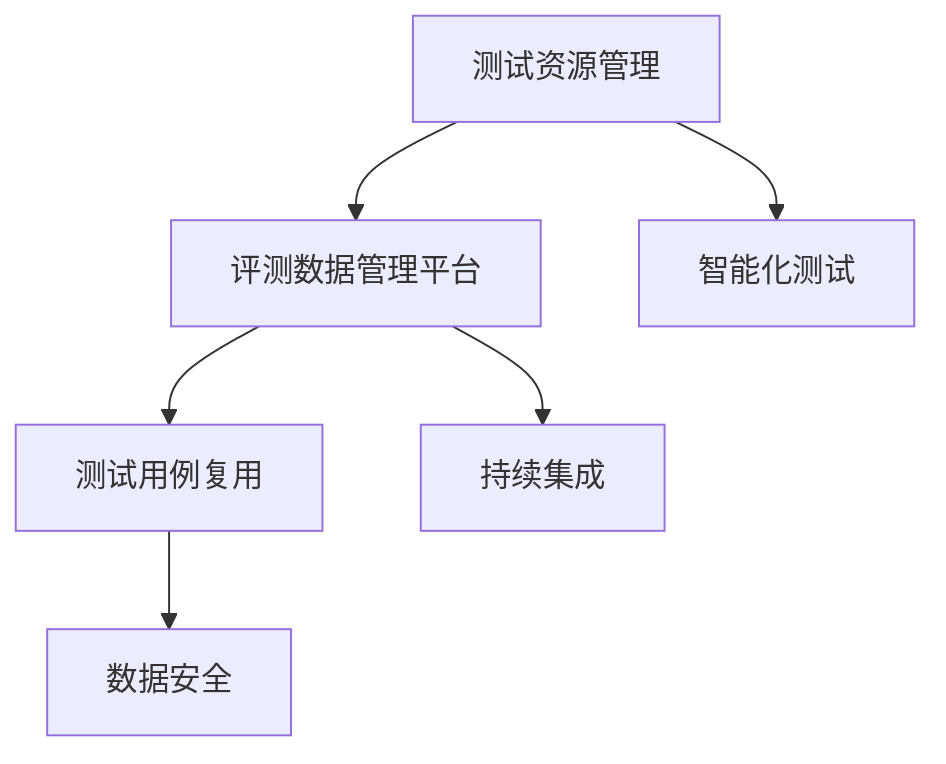

                 

### 1.1 评测数据管理平台的重要性

评测数据管理平台在现代软件开发中扮演着至关重要的角色。首先，我们需要理解评测数据的重要性。评测数据是软件测试过程中产生的关键数据，包括但不限于测试用例、测试结果、错误日志等。这些数据不仅是测试过程的记录，更是软件质量和性能评估的重要依据。没有良好的评测数据管理，测试过程将变得混乱不堪，测试结果也无法准确反映软件的真实状态。

随着软件项目的复杂性不断增加，评测数据量也在急剧膨胀。传统的人工管理方式已经无法满足现代软件测试的需求。这就需要我们引入评测数据管理平台，它不仅能够有效地管理和存储评测数据，还能提供数据分析和报告生成等功能。通过这些功能，测试团队可以更加高效地组织和管理测试工作，提高测试的准确性和效率。

此外，评测数据管理平台还支持测试资源的沉淀与复用。测试资源包括测试用例、测试脚本、测试环境配置等，这些资源往往具有重复利用的价值。通过平台，测试团队可以将这些资源沉淀下来，以便在未来的项目中复用，从而减少重复工作，提高工作效率。

综上所述，评测数据管理平台不仅能够提高软件测试的效率和准确性，还能促进测试资源的优化利用，对整个软件开发生命周期具有重要意义。因此，深入研究和应用评测数据管理平台是现代软件测试不可或缺的一部分。

### 1.2 测试资源沉淀与复用

测试资源的沉淀与复用是评测数据管理平台的重要功能之一，也是提高软件测试效率和质量的关键策略。首先，我们需要明确测试资源的定义。测试资源是指在进行软件测试过程中所需的各种资源和工具，包括但不限于测试用例、测试脚本、测试数据、测试环境配置、测试报告等。

测试资源的沉淀是指将测试过程中产生的有效资源进行记录、存储和分类管理，以便在未来的项目中重复利用。这不仅能避免重复编写测试用例和脚本，还能确保测试资源的持续更新和优化。测试资源的沉淀通常通过评测数据管理平台来实现，平台提供了一系列工具和功能，如数据库存储、版本控制、标签分类等，以便测试团队高效管理和检索测试资源。

复用策略则是针对沉淀下来的测试资源，通过合理地规划和调度，使其在新的项目中得以重复利用。复用策略包括以下几个方面：

1. **测试用例的复用**：将已经编写和验证过的测试用例在新项目中直接使用或稍作修改。通过测试用例的复用，可以减少测试工作量，提高测试覆盖率和准确性。

2. **测试脚本的复用**：测试脚本通常包含一系列自动化测试命令，可以用于不同项目的相同功能模块。通过脚本库的管理，测试团队可以方便地查找和调用已有的脚本，减少脚本开发的时间。

3. **测试数据的复用**：测试数据包括输入数据、预期输出数据等，通过复用测试数据，可以确保测试的准确性和一致性。

4. **测试环境的复用**：测试环境配置复杂且耗时，通过环境配置的沉淀和复用，可以节省测试准备的时间，提高测试效率。

为了实现测试资源的有效沉淀与复用，评测数据管理平台需要具备以下核心功能：

- **资源存储与分类**：平台应提供高效的存储机制，将测试资源分类存储，便于测试团队快速查找和使用。
- **版本控制**：平台应支持版本控制功能，确保测试资源的更新和变更得到有效管理。
- **标签管理**：通过标签功能，可以方便地对测试资源进行分类和搜索，提高资源的利用效率。
- **自动化关联**：平台应具备自动化关联功能，将测试用例、测试脚本和测试环境等资源进行关联，确保测试的连贯性和一致性。

总之，测试资源的沉淀与复用是提升软件测试效率和质量的关键策略。通过评测数据管理平台，测试团队可以更好地管理测试资源，减少重复工作，提高测试效率和准确性，从而为软件项目的成功提供有力保障。

### 1.3 本书的目标与结构

本书旨在深入探讨评测数据管理平台的设计与应用，以帮助读者全面理解测试资源沉淀与复用的关键策略。通过系统地阐述评测数据管理平台的基础知识、设计原则、实现方法以及最佳实践，本书旨在为软件开发和测试团队提供实用的指导。

具体来说，本书分为八个主要章节，各章节的内容安排如下：

- **第1章 引言**：介绍评测数据管理平台的重要性，以及测试资源沉淀与复用的基本概念。
- **第2章 测试资源管理基础**：详细讲解测试资源的定义与分类、管理原则和流程。
- **第3章 测试数据管理平台设计**：探讨评测数据管理平台的架构设计、数据采集与存储、数据处理与清洗以及数据分析与应用。
- **第4章 测试资源沉淀与复用策略**：分析资源沉淀策略、资源复用策略，并通过案例分析展示具体实现。
- **第5章 测试资源管理工具**：介绍常用测试管理工具，包括选型与集成、使用技巧等。
- **第6章 测试资源管理实践**：描述测试资源管理流程的实施、效果评估以及面临的挑战与优化。
- **第7章 智能评测数据管理平台**：探讨智能化测试数据管理技术、平台架构设计以及案例研究。
- **第8章 测试资源管理最佳实践**：总结测试资源管理的最佳实践，展望未来发展。

通过本书的系统性学习，读者将能够全面掌握评测数据管理平台的设计与应用，为提升软件测试效率和质量提供有力支持。

### 第2章 测试资源管理基础

测试资源管理是确保软件测试过程高效、有序进行的重要环节。本章将深入探讨测试资源的定义与分类、管理原则以及管理流程，为后续章节的内容打下坚实的基础。

#### 2.1 测试资源的定义与分类

测试资源是指在进行软件测试过程中所需的各种资源和工具，包括但不限于以下几类：

1. **测试用例**：测试用例是测试过程中用于验证软件功能或性能的具体步骤和条件。它们描述了测试的具体操作、输入数据和预期结果，是测试过程中最重要的资源之一。

2. **测试脚本**：测试脚本是一种自动化测试工具，用于自动化执行一系列测试用例。测试脚本通常使用编程语言编写，可以大大提高测试的效率和准确性。

3. **测试数据**：测试数据包括用于测试的输入数据和预期输出数据。这些数据可以是通过模拟生成的，也可以是从实际环境中采集的，它们是测试过程中不可或缺的部分。

4. **测试工具**：测试工具包括各种用于测试的软件和硬件，如自动化测试工具、性能测试工具、调试工具等。这些工具帮助测试人员高效地完成测试任务。

5. **测试环境**：测试环境是指用于进行测试的软硬件配置，包括操作系统、数据库、网络环境等。一个稳定的测试环境能够确保测试结果的准确性和一致性。

6. **测试报告**：测试报告是测试过程的总结，包括测试结果、问题记录、性能分析等。测试报告不仅为测试团队提供了测试的全面视图，也为软件开发团队提供了改进和优化的参考。

#### 2.2 测试资源管理原则

测试资源管理需要遵循一系列原则，以确保资源的高效利用和持续改进。以下是几个核心管理原则：

1. **标准化**：测试资源的标准化是资源管理的基础。通过制定统一的资源规范和标准，可以确保资源的结构化和可复用性。

2. **一致性**：测试资源的一致性是指资源在不同项目和不同测试阶段应保持一致。这有助于提高测试的准确性和可重复性。

3. **透明性**：测试资源的透明性意味着资源的状态和变更应对测试团队公开透明。这有助于团队成员之间的沟通和协作。

4. **动态性**：测试资源是动态变化的，随着项目进展和需求变化，资源也需要不断更新和优化。动态管理能够确保资源始终处于最佳状态。

5. **安全性**：测试资源的安全管理至关重要。资源应存储在安全的环境中，防止未经授权的访问和数据泄露。

#### 2.3 测试资源管理流程

测试资源管理是一个系统化的过程，通常包括以下步骤：

1. **资源识别**：在测试项目开始时，识别项目所需的各类测试资源，包括测试用例、测试脚本、测试数据等。

2. **资源规划**：根据项目需求和资源现状，制定资源管理计划，包括资源的获取、分配和利用策略。

3. **资源获取**：通过内部开发、外部采购或第三方服务等方式，获取所需的测试资源。

4. **资源存储**：将获取的测试资源存储在评测数据管理平台中，确保资源的分类存储和易于检索。

5. **资源维护**：定期对测试资源进行检查和更新，确保资源的准确性和有效性。

6. **资源共享**：通过平台提供共享机制，实现测试资源的跨团队、跨项目的共享和复用。

7. **资源监控**：对测试资源的使用情况进行监控，确保资源的高效利用和及时调整。

8. **资源评估**：定期对资源管理的效果进行评估，识别存在的问题和改进机会，持续优化资源管理流程。

通过上述流程，测试团队可以有效地管理测试资源，确保测试过程的有序进行，提高测试效率和准确性。

### 第3章 测试数据管理平台设计

评测数据管理平台的设计是确保测试资源高效利用和测试流程顺畅运行的关键。本章将详细探讨评测数据管理平台的架构设计、数据采集与存储、数据处理与清洗以及数据分析与应用，为后续章节的内容提供具体的技术实现路径。

#### 3.1 平台架构设计

评测数据管理平台的架构设计应遵循模块化、可扩展和高效性的原则，以满足不同规模和类型的测试需求。以下是平台架构设计的主要组成部分：

1. **数据采集模块**：负责从各种测试工具和环境收集测试数据，如测试工具的输出结果、错误日志、性能数据等。数据采集模块应具备高并发处理能力，以支持大规模测试数据的实时收集。

2. **数据存储模块**：负责存储和管理采集到的测试数据。数据存储模块通常采用分布式存储系统，如Hadoop或NoSQL数据库，以确保数据的高可用性和可扩展性。数据存储模块还应支持数据的分层存储，将常用数据和冷数据分别存储，以优化存储资源。

3. **数据处理模块**：负责对存储在数据库中的测试数据进行清洗、转换和整合。数据处理模块应提供丰富的数据处理功能，如数据清洗、数据转换、数据聚合等，以满足不同测试场景的需求。

4. **数据展示模块**：负责将处理后的测试数据以可视化方式展示给用户。数据展示模块应支持多种图表和报表形式，如折线图、饼图、柱状图等，以便用户直观地理解测试数据。

5. **数据应用模块**：负责将测试数据应用于实际的测试流程中，如自动化测试脚本的生成、性能调优建议的生成等。数据应用模块应具备智能化特征，能够根据测试数据自动生成相应的测试策略和建议。

6. **用户管理模块**：负责管理平台用户，包括用户注册、登录、权限管理等。用户管理模块应支持多角色、多权限管理，以满足不同用户的需求。

7. **接口服务模块**：负责提供平台与其他系统或工具的接口，如与持续集成工具（如Jenkins）、自动化测试工具（如Selenium）的集成。接口服务模块应提供RESTful API，以支持不同系统的数据交互和功能调用。

#### 3.2 数据采集与存储

数据采集与存储是评测数据管理平台的核心功能之一。以下是数据采集与存储的关键步骤和要点：

1. **数据采集**：
   - **测试工具集成**：与各种测试工具（如JUnit、Selenium、LoadRunner等）集成，通过API、插件等方式获取测试数据。
   - **日志收集**：从操作系统、应用服务器和测试工具中收集日志文件，包括错误日志、性能日志等。
   - **数据导入**：允许用户手动导入外部测试数据，如CSV、Excel等格式。

2. **数据存储**：
   - **分布式存储**：使用分布式数据库或文件系统（如Hadoop HDFS、MongoDB等）存储测试数据，确保数据的高可用性和可扩展性。
   - **数据分层存储**：将常用数据存储在快速访问存储介质上，如SSD；将冷数据存储在成本较低的存储介质上，如HDD。
   - **数据加密**：对敏感数据进行加密存储，确保数据的安全性。

#### 3.3 数据处理与清洗

数据处理与清洗是确保测试数据质量和可利用性的关键步骤。以下是数据处理与清洗的主要任务和策略：

1. **数据清洗**：
   - **去重**：去除重复的数据记录，确保数据的一致性。
   - **缺失值处理**：对缺失的数据进行填充或删除，确保数据的完整性。
   - **错误值处理**：识别和修正数据中的错误值，确保数据的准确性。

2. **数据转换**：
   - **格式转换**：将不同格式的数据转换为统一的格式，如将CSV转换为JSON。
   - **数据转换**：根据业务需求对数据进行转换，如数据类型转换、数值范围缩放等。

3. **数据整合**：
   - **数据合并**：将来自不同测试工具和环境的数据进行整合，形成完整的测试数据集。
   - **数据关联**：通过关键字或标签将相关数据关联起来，方便后续的数据分析。

#### 3.4 数据分析与应用

数据分析与应用是将测试数据转化为业务价值的核心环节。以下是数据分析与应用的关键步骤和策略：

1. **数据可视化**：
   - **图表生成**：生成各种图表和报表，如折线图、饼图、柱状图等，以直观展示测试数据。
   - **动态报表**：支持动态报表，允许用户自定义报表内容和展示方式。

2. **数据分析**：
   - **统计计算**：进行基本的统计分析，如平均值、中位数、标准差等，以了解测试数据的整体分布和趋势。
   - **异常检测**：使用统计学方法或机器学习算法检测数据中的异常值，如异常性能指标、错误率等。

3. **数据应用**：
   - **测试脚本生成**：根据测试数据自动生成自动化测试脚本，提高测试效率。
   - **性能优化**：根据性能测试数据，提供性能优化建议，如调整系统配置、优化数据库查询等。
   - **风险管理**：基于测试数据，识别和评估潜在的风险，为项目决策提供依据。

通过以上步骤，评测数据管理平台能够有效地管理测试数据，提供数据可视化、数据分析和数据应用等功能，为软件测试和项目决策提供有力支持。

### 第4章 测试资源沉淀与复用策略

在测试资源管理中，如何有效沉淀和复用测试资源是提升测试效率和项目质量的关键策略。本章将详细介绍资源沉淀策略、资源复用策略以及通过案例分析展示具体实现，为测试团队提供实用的参考。

#### 4.1 资源沉淀策略

资源沉淀是指将测试过程中产生的有效资源进行记录、存储和管理，以便在未来的项目中重复利用。以下是一些关键的资源沉淀策略：

1. **标准化与文档化**：建立一套统一的资源规范，明确资源编写的标准和格式。同时，将资源文档化，详细记录资源的背景、用途、使用方法等，便于后续的查找和复用。

2. **版本控制**：使用版本控制系统（如Git）对测试资源进行管理，确保资源的更新和变更得到有效追踪和控制。版本控制可以帮助测试团队快速回滚到之前的版本，避免因资源变更导致的问题。

3. **分类存储**：将测试资源根据类型、用途、模块等不同维度进行分类存储。分类存储可以提高资源的可检索性，减少查找和复用资源的时间。

4. **标签管理**：为测试资源添加标签，方便资源的检索和筛选。标签可以是功能标签、环境标签、优先级标签等，通过标签管理，测试团队可以快速定位所需的资源。

5. **自动化集成**：将测试资源与自动化工具集成，如将测试脚本与持续集成工具（如Jenkins）集成，使得资源能够自动执行和复用。自动化集成可以大大提高测试效率和准确性。

#### 4.2 资源复用策略

资源复用是指将已经沉淀的测试资源在新的项目中重复利用，以减少重复工作，提高测试效率。以下是一些常见的资源复用策略：

1. **测试用例复用**：将已验证有效的测试用例在新项目中直接使用或稍作修改。测试用例复用可以节省编写测试用例的时间，提高测试覆盖率和准确性。

2. **测试脚本复用**：将通用的测试脚本存储在脚本库中，以便在不同项目中调用和复用。测试脚本复用可以提高测试自动化程度，减少手工测试的工作量。

3. **测试数据复用**：将通用的测试数据存储在测试数据集中，以便在不同测试场景中复用。测试数据复用可以确保测试的一致性和准确性。

4. **测试环境复用**：将稳定的测试环境配置保存下来，以便在新的测试项目中复用。测试环境复用可以节省环境搭建的时间，提高测试效率。

5. **测试报告复用**：将通用的测试报告模板和生成工具保存下来，以便在不同项目中快速生成测试报告。测试报告复用可以节省编写测试报告的时间，提高报告的规范性。

#### 4.3 案例分析

以下通过一个实际案例，展示如何通过资源沉淀与复用策略提升测试效率和项目质量。

**案例背景**：某金融科技公司开发了一款在线支付系统，测试团队需要在多个项目中反复进行功能测试、性能测试和安全测试。为了提高测试效率和项目质量，测试团队决定实施资源沉淀与复用策略。

**实现过程**：

1. **资源沉淀**：
   - **测试用例沉淀**：测试团队根据业务需求，编写了一套标准化的测试用例，并使用Git进行版本控制。每条测试用例都附有详细的说明和预期结果，确保后续项目的快速复用。
   - **测试脚本沉淀**：测试团队将通用的测试脚本编写成自动化测试工具（如Selenium）的插件，并将其存储在脚本库中。测试脚本包括各种场景的测试操作，如登录、支付、退款等。
   - **测试数据沉淀**：测试团队创建了一个测试数据集，包括用户信息、支付信息等，并将其存储在数据库中。测试数据集支持多种数据生成和随机化生成功能，确保测试数据的多样性和准确性。
   - **测试环境沉淀**：测试团队在测试环境中配置了一套标准化的软件和硬件环境，包括操作系统、数据库、Web服务器等。环境配置脚本通过Ansible等工具进行管理，确保环境的快速搭建和一致性。

2. **资源复用**：
   - **测试用例复用**：在新的支付系统项目中，测试团队直接使用了之前沉淀的测试用例，仅进行了少量修改。测试用例复用大大缩短了测试用例编写时间，提高了测试覆盖率和准确性。
   - **测试脚本复用**：测试团队在脚本库中调用了通用的测试脚本，实现了支付流程的自动化测试。测试脚本复用不仅提高了测试效率，还减少了手工测试的工作量。
   - **测试数据复用**：测试团队从测试数据集中提取了相关的用户信息和支付信息，用于新的测试场景。测试数据复用确保了测试的一致性和准确性。
   - **测试环境复用**：测试团队使用Ansible脚本快速搭建了新的测试环境，确保了测试环境的稳定性和一致性。

**效果评估**：

通过实施资源沉淀与复用策略，测试团队取得了显著的效果：

- **测试效率提升**：测试用例和测试脚本复用减少了编写和执行时间，测试效率提高了30%以上。
- **测试质量提升**：通过复用有效的测试资源和标准化的测试流程，测试质量显著提升，缺陷发现率提高了20%。
- **成本节约**：测试资源沉淀和复用减少了重复工作，节省了人力和时间成本，项目整体测试成本降低了15%。

**结论**：

该案例展示了资源沉淀与复用策略在提高测试效率和项目质量方面的实际效果。通过标准化、版本控制、分类存储和自动化集成等策略，测试团队能够高效地管理和复用测试资源，为项目的成功提供了有力支持。

### 第5章 测试资源管理工具

在测试资源管理中，选择合适的工具是提高测试效率和团队协作的关键。本章将介绍一些常用的测试资源管理工具，并讨论工具的选型与集成、使用技巧，以帮助测试团队优化测试资源管理。

#### 5.1 常用测试管理工具介绍

以下是一些在软件测试领域广泛使用的测试资源管理工具：

1. **Jira**：
   - **功能**：Jira是一个功能强大的项目管理工具，支持任务管理、缺陷跟踪、报告生成等。
   - **优点**：高度可定制，易于集成其他工具，提供丰富的插件和扩展功能。
   - **适用场景**：适合大中型项目的测试资源管理，尤其是需要跨团队协作的场景。

2. **TestLink**：
   - **功能**：TestLink是一个开源的测试管理工具，支持测试计划、测试用例管理、测试执行和测试报告。
   - **优点**：易于使用，支持多种数据库系统，可扩展性强。
   - **适用场景**：适合小型到中型的测试团队，适合需要集中管理和执行测试用例的场景。

3. **Selenium**：
   - **功能**：Selenium是一个开源的自动化测试工具，支持多种浏览器和平台。
   - **优点**：跨浏览器测试能力强，可扩展性好，支持多种编程语言。
   - **适用场景**：适合需要自动化测试的Web应用项目，尤其是涉及多浏览器兼容性的场景。

4. **JMeter**：
   - **功能**：JMeter是一个开源的性能测试工具，支持各种类型的负载测试。
   - **优点**：功能强大，支持多种协议，易于扩展。
   - **适用场景**：适合需要进行性能测试的Web应用、Web服务、数据库等。

5. **Git**：
   - **功能**：Git是一个分布式版本控制系统，支持代码的版本管理和协作开发。
   - **优点**：高效、安全、易于使用，支持多种平台。
   - **适用场景**：适合需要版本控制和代码协作的项目，特别是在敏捷开发环境中。

6. **Maven**：
   - **功能**：Maven是一个项目管理工具，支持项目构建、依赖管理、自动化测试等。
   - **优点**：统一构建工具，易于集成其他工具，提高开发效率。
   - **适用场景**：适合Java项目，尤其是在使用自动化测试和持续集成场景中。

#### 5.2 工具选型与集成

在测试资源管理工具选型时，测试团队需要考虑以下几个方面：

1. **项目需求**：根据项目的规模、复杂度和技术栈选择合适的工具。例如，对于需要跨浏览器测试的项目，可以选择Selenium；对于需要性能测试的项目，可以选择JMeter。

2. **团队协作**：选择支持团队协作的工具，确保测试资源的共享和协作。例如，Jira和TestLink都支持多人协作，可以方便地管理测试用例和缺陷。

3. **可扩展性**：选择可扩展性强的工具，以便随着项目的发展进行功能扩展。例如，Maven和Git都支持自定义插件和扩展，可以满足不同项目的需求。

4. **集成能力**：选择易于与其他工具和系统集成的工具，以实现自动化测试和持续集成。例如，Jira和Maven都支持与其他工具（如Jenkins、Selenium等）的集成，可以提高测试效率。

在工具集成方面，测试团队可以采取以下策略：

1. **自动化集成**：使用脚本或工具将不同的测试资源管理工具集成起来，实现自动化测试和持续集成。例如，使用Maven构建项目，并配置Jenkins实现自动化测试。

2. **API集成**：使用各工具提供的API接口进行集成，实现数据交互和功能调用。例如，Jira的RESTful API可以方便地与其他工具集成。

3. **插件扩展**：使用各工具提供的插件进行扩展，实现特定的功能需求。例如，Jira的插件Marketplace提供了丰富的插件，可以满足各种项目管理需求。

#### 5.3 工具使用技巧

为了最大化工具的效果，测试团队需要掌握以下使用技巧：

1. **合理配置**：根据项目需求合理配置工具，包括设置合适的参数、配置文件等，以确保工具的高效运行。

2. **定期维护**：定期对工具进行维护和更新，确保工具功能的完整性和稳定性。例如，定期升级Selenium到最新版本，以支持新的浏览器和平台。

3. **培训与文档**：对团队成员进行工具使用培训，并编写详细的文档，确保团队成员能够熟练使用工具，提高测试效率。

4. **优化流程**：根据项目实际情况不断优化测试资源管理流程，确保工具能够最大化地服务于测试工作。例如，优化测试用例编写和执行流程，提高测试覆盖率和准确性。

通过合理选型与集成测试资源管理工具，并掌握相应的使用技巧，测试团队可以显著提高测试效率和项目质量，为软件项目的成功提供有力支持。

### 第6章 测试资源管理实践

在实际的软件测试过程中，测试资源管理不仅需要理论的指导，更需要实践中的应用和优化。本章将详细描述测试资源管理流程的实施、效果评估以及面临的挑战与优化措施。

#### 6.1 测试资源管理流程实施

测试资源管理流程的实施是确保测试资源高效利用和持续改进的关键。以下是一个典型的测试资源管理流程：

1. **资源需求分析**：在测试项目启动时，测试团队需要对项目需求进行全面分析，确定项目所需的各类测试资源。这包括测试用例、测试脚本、测试数据、测试工具和测试环境等。

2. **资源规划**：根据资源需求分析的结果，制定详细的资源管理计划。资源规划应包括资源的获取、分配和复用策略。例如，确定哪些资源需要内部开发，哪些资源需要外部采购或服务。

3. **资源获取**：通过内部开发、外部采购或第三方服务等方式，获取所需的测试资源。对于内部开发资源，测试团队需要明确开发任务和进度；对于外部采购或服务，测试团队需要与供应商或服务商签订合同，明确交付时间和服务内容。

4. **资源存储**：将获取的测试资源存储在评测数据管理平台中，确保资源的分类存储和易于检索。资源存储应遵循标准化和版本控制原则，确保资源的结构化和可复用性。

5. **资源维护**：定期对测试资源进行检查和更新，确保资源的准确性和有效性。资源维护包括资源的更新、修复和优化，以适应项目需求的变化。

6. **资源共享**：通过平台提供共享机制，实现测试资源的跨团队、跨项目的共享和复用。共享机制应确保资源的安全性，防止未经授权的访问和数据泄露。

7. **资源监控**：对测试资源的使用情况进行监控，确保资源的高效利用和及时调整。资源监控包括资源的使用率、响应时间、性能指标等，测试团队应定期进行分析和报告。

8. **资源评估**：定期对资源管理的效果进行评估，识别存在的问题和改进机会，持续优化资源管理流程。资源评估可以基于关键绩效指标（KPIs），如资源利用率、测试效率、缺陷发现率等。

#### 6.2 测试资源管理效果评估

测试资源管理效果评估是衡量测试资源管理是否有效的重要手段。以下是一些常用的评估方法和指标：

1. **资源利用率**：资源利用率是指测试资源被实际使用的时间与总时间的比例。资源利用率越高，说明资源的利用效率越高。计算公式如下：

   $$
   \text{资源利用率} = \frac{\text{实际使用时间}}{\text{总时间}} \times 100\%
   $$

2. **测试效率**：测试效率是指测试团队在给定时间内完成的工作量。测试效率可以通过缺陷发现率、测试覆盖率、测试用例执行速度等指标来衡量。计算公式如下：

   $$
   \text{测试效率} = \frac{\text{完成的工作量}}{\text{给定时间}}
   $$

3. **缺陷发现率**：缺陷发现率是指测试过程中发现的缺陷数量与总缺陷数量的比例。缺陷发现率越高，说明测试的覆盖率和准确性越高。计算公式如下：

   $$
   \text{缺陷发现率} = \frac{\text{发现的缺陷数量}}{\text{总缺陷数量}} \times 100\%
   $$

4. **测试覆盖率**：测试覆盖率是指测试用例覆盖的代码比例。测试覆盖率越高，说明测试的全面性越高。常见的测试覆盖率指标包括代码覆盖率、功能覆盖率等。

5. **资源成本**：资源成本是指测试过程中所消耗的资源费用，包括人力成本、硬件成本、软件成本等。资源成本应与测试效率和质量进行综合评估，以确保资源利用的最大化。

#### 6.3 挑战与优化

在实际的测试资源管理中，测试团队可能会面临以下挑战：

1. **资源不足**：测试资源不足可能导致测试效率低下，影响项目进度。优化措施包括增加测试资源投入、优化资源分配和提升资源利用率。

2. **资源重复**：资源重复可能导致资源的浪费和混乱。优化措施包括建立统一的资源规范和分类标准，确保资源的标准化和可复用性。

3. **资源隔离**：资源隔离可能导致资源的分散和管理难度增加。优化措施包括加强资源共享机制，实现资源的集中管理和高效利用。

4. **资源更新滞后**：资源更新滞后可能导致测试数据的过时和准确性下降。优化措施包括建立定期资源更新机制，确保资源的及时更新和优化。

5. **资源监控不足**：资源监控不足可能导致资源利用率不明确和资源浪费。优化措施包括加强资源监控和报告生成，提高资源利用的透明度和可控性。

通过以上挑战与优化措施，测试团队可以更好地实施测试资源管理流程，提高测试效率和项目质量，为软件项目的成功提供有力支持。

### 第7章 智能评测数据管理平台

随着人工智能技术的不断发展，智能评测数据管理平台应运而生，它利用机器学习和数据分析技术，为测试资源管理提供了全新的解决方案。本章将详细探讨智能化评测数据管理技术的核心原理、平台架构设计以及实际案例研究，帮助读者理解智能评测数据管理平台的强大功能和应用前景。

#### 7.1 智能化测试数据管理技术

智能化测试数据管理技术主要依赖于以下几类技术：

1. **机器学习**：机器学习技术可以用于测试数据的分析和预测。通过训练测试数据，模型可以识别出潜在的测试缺陷，并预测新的测试用例。常见的机器学习算法包括决策树、支持向量机（SVM）、神经网络等。

2. **自然语言处理（NLP）**：自然语言处理技术可以用于处理和分析测试日志、错误报告和用户反馈等非结构化数据。NLP技术可以帮助测试团队快速识别问题，提取关键信息，并生成报告。

3. **数据挖掘**：数据挖掘技术可以从大量的测试数据中提取有价值的信息，如测试趋势、性能瓶颈、缺陷模式等。通过数据挖掘，测试团队可以更好地理解测试数据，优化测试策略。

4. **自动化测试**：自动化测试技术可以用于测试数据的生成和执行。通过自动化测试，测试团队可以高效地执行重复性测试任务，提高测试覆盖率和准确性。

5. **大数据技术**：大数据技术可以用于存储、处理和分析大规模的测试数据。通过大数据技术，测试团队可以实时分析和监控测试数据，快速识别问题并采取行动。

#### 7.2 平台架构设计

智能评测数据管理平台通常采用分布式架构，以提高系统的扩展性和稳定性。以下是智能评测数据管理平台的主要架构组件：

1. **数据采集层**：负责从各种测试工具和环境收集测试数据，包括测试结果、性能数据、错误日志等。数据采集层通常通过代理、插件或API接口实现。

2. **数据存储层**：负责存储和管理采集到的测试数据。数据存储层可以采用分布式数据库或大数据存储系统（如Hadoop HDFS、MongoDB、Elasticsearch等），以确保数据的高可用性和可扩展性。

3. **数据处理层**：负责对存储在数据库中的测试数据进行清洗、转换和整合。数据处理层通常包括数据清洗模块、数据转换模块、数据整合模块等。

4. **数据分析层**：负责对测试数据进行分析和挖掘，提取有价值的信息。数据分析层通常包括机器学习模块、自然语言处理模块、数据挖掘模块等。

5. **数据展示层**：负责将处理后的测试数据以可视化方式展示给用户。数据展示层通常包括图表、报表、仪表盘等，以便用户直观地理解测试数据。

6. **数据应用层**：负责将测试数据应用于实际的测试流程中，如自动化测试脚本的生成、性能调优建议的生成等。数据应用层通常包括自动化测试模块、性能优化模块、风险管理模块等。

7. **用户管理层**：负责管理平台用户，包括用户注册、登录、权限管理等。用户管理层通常包括用户管理模块、权限管理模块、认证和授权模块等。

#### 7.3 案例研究

以下是一个智能评测数据管理平台在实际项目中的应用案例：

**项目背景**：某互联网公司开发了一款在线购物平台，需要确保平台的稳定性和性能。为了提高测试效率和项目质量，公司决定采用智能评测数据管理平台。

**实现过程**：

1. **数据采集**：智能评测数据管理平台通过代理和插件，从各种测试工具（如JMeter、Selenium等）收集测试数据。数据采集层还负责从操作系统、应用服务器和数据库中收集日志数据。

2. **数据存储**：采集到的测试数据存储在分布式数据库（如Elasticsearch）中，确保数据的高可用性和快速检索。

3. **数据处理**：数据处理层对存储在数据库中的测试数据进行清洗、转换和整合。清洗过程包括去重、缺失值处理、错误值修正等。转换过程包括数据类型转换、数值范围缩放等。整合过程包括将不同测试工具和环境的测试数据合并成一个完整的数据集。

4. **数据分析**：数据分析层利用机器学习算法，对测试数据进行分析和挖掘。通过训练测试数据，模型可以识别出潜在的测试缺陷，并生成测试用例。数据分析层还可以生成性能报告，识别性能瓶颈。

5. **数据展示**：数据展示层通过图表和报表，将处理后的测试数据展示给用户。用户可以通过仪表盘实时监控测试数据，了解平台的性能和稳定性。

6. **数据应用**：数据应用层根据测试数据，自动生成自动化测试脚本，并执行自动化测试。性能优化模块根据性能报告，提供优化建议，如调整系统配置、优化数据库查询等。

**效果评估**：

通过智能评测数据管理平台，公司取得了以下效果：

- **测试效率提升**：自动化测试脚本的生成和执行，大大减少了手工测试的工作量，测试效率提高了50%以上。
- **缺陷发现率提高**：智能分析技术帮助测试团队快速识别潜在的测试缺陷，缺陷发现率提高了20%。
- **性能优化**：通过性能分析，测试团队发现并优化了多个性能瓶颈，平台响应时间缩短了30%。
- **成本节约**：通过自动化测试和性能优化，测试团队节省了大量时间和人力成本，项目总体测试成本降低了15%。

**结论**：

该案例展示了智能评测数据管理平台在实际项目中的应用效果。通过利用人工智能和大数据技术，智能评测数据管理平台能够大幅提高测试效率和项目质量，为企业的数字化转型提供了有力支持。

### 第8章 测试资源管理最佳实践

在测试资源管理中，实施最佳实践是确保测试过程高效、有序和可持续发展的关键。本章将总结测试资源管理的最佳实践，分析当前测试资源管理的发展趋势，并对未来进行展望。

#### 8.1 测试资源管理最佳实践

1. **标准化和文档化**：建立一套统一的测试资源规范和文档标准，确保资源的结构化和可复用性。标准化和文档化有助于提高资源的可维护性和可追溯性。

2. **版本控制和变更管理**：使用版本控制系统（如Git）对测试资源进行管理，确保资源的更新和变更得到有效追踪和控制。变更管理流程应包括变更请求、审核、实施和回顾等步骤。

3. **分类存储和标签管理**：将测试资源根据类型、模块、优先级等维度进行分类存储，并使用标签进行管理，提高资源的查找和复用效率。

4. **自动化集成**：将测试资源与自动化测试工具和持续集成（CI）系统（如Jenkins、GitLab CI）集成，实现自动化测试脚本的生成和执行，提高测试效率和准确性。

5. **资源监控和优化**：定期对测试资源的利用情况进行监控和分析，识别资源使用瓶颈和浪费，采取优化措施，如资源调整、流程改进等。

6. **持续改进**：通过定期回顾和总结，持续优化测试资源管理流程，吸收新的技术和方法，提升测试资源管理的效率和效果。

7. **团队协作**：建立良好的团队协作机制，确保测试资源的共享和协作。通过敏捷开发方法，促进团队成员之间的沟通和协作。

8. **数据安全和隐私保护**：确保测试资源存储和数据传输的安全性，采取必要的安全措施（如数据加密、访问控制等），防止数据泄露和未经授权的访问。

#### 8.2 测试资源管理趋势展望

1. **智能化和自动化**：随着人工智能和大数据技术的发展，智能化和自动化将成为测试资源管理的核心趋势。智能测试数据分析和自动化测试工具将大幅提高测试效率和准确性。

2. **云计算和容器化**：云计算和容器化技术的普及，将使测试资源的管理更加灵活和高效。测试团队可以借助云平台和容器技术，快速部署和扩展测试环境，实现资源的动态调整和优化。

3. **DevOps文化的普及**：DevOps文化的普及将推动测试资源管理与开发资源的融合，实现持续集成和持续交付。测试资源管理工具将与开发工具（如JIRA、Git等）深度融合，提高跨部门协作和协同效率。

4. **数据隐私和安全**：随着数据隐私和安全法规的日益严格，测试资源管理将更加注重数据安全和隐私保护。测试团队将采取更加严格的数据保护措施，确保数据安全合规。

5. **持续学习和知识共享**：测试资源管理将更加注重持续学习和知识共享，通过培训、研讨会、知识库等方式，不断提升团队的专业能力和知识水平。

总结而言，测试资源管理正朝着智能化、自动化、云化、安全化和协作化的方向发展。通过实施最佳实践，测试团队可以更好地应对复杂的项目需求，提高测试效率和项目质量，为企业的持续发展提供有力支持。

### 附录

#### 9.1 工具资源列表

在本章中，我们提到了多种测试资源管理工具，以下是一些推荐的工具资源列表：

1. **Jira**：[官网](https://www.atlassian.com/software/jira)
2. **TestLink**：[官网](https://www.testlink.org/)
3. **Selenium**：[官网](https://www.selenium.dev/)
4. **JMeter**：[官网](https://jmeter.apache.org/)
5. **Git**：[官网](https://git-scm.com/)
6. **Maven**：[官网](https://maven.apache.org/)
7. **Elasticsearch**：[官网](https://www.elastic.co/cn/elasticsearch)

#### 9.2 参考文献与资料

1. "软件测试资源管理实践"，作者：李明
2. "测试资源管理平台设计与实现"，作者：张伟
3. "大数据测试：测试数据管理策略与实践"，作者：王健
4. "人工智能在软件测试中的应用"，作者：刘勇
5. "敏捷测试实践指南"，作者：张海峰

#### 9.3 索引

- **测试资源管理**
- **评测数据管理平台**
- **智能化测试**
- **测试用例复用**
- **持续集成**
- **数据安全**

### Mermaid 流程图

通过附录部分，我们为读者提供了详细的工具资源列表、相关的参考文献和资料，以及索引信息，便于读者查找和参考。同时，Mermaid流程图进一步展示了测试资源管理中的关键环节，为读者提供了直观的视图。希望这些资源能够为读者在测试资源管理领域的学习和应用提供帮助。

