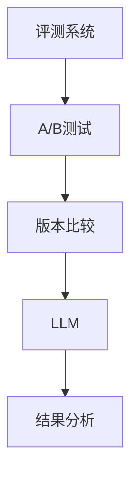

                 

## 文章标题

### 评测系统的A/B测试支持：比较不同版本LLM

## 关键词

- 评测系统
- A/B测试
- 版本比较
- 语言模型（LLM）
- 统计分析
- 自动化测试

## 摘要

本文深入探讨了评测系统的A/B测试支持，重点关注了如何使用A/B测试比较不同版本语言模型（LLM）的性能。文章首先介绍了评测系统和A/B测试的核心概念，接着讲解了A/B测试的基本算法原理和数学模型，并通过具体案例展示了A/B测试在评测系统中的应用。最后，文章提出了优化A/B测试的策略，并展望了其在未来发展的趋势。

### 第一部分：核心概念与联系

#### 核心概念与联系

评测系统的A/B测试支持是这本书的核心内容之一。以下是核心概念与联系的Mermaid流程图：



#### 核心概念与联系

1. **评测系统**：用于评估不同版本模型性能的工具，可以帮助我们快速识别并优化模型的不足。
2. **A/B测试**：一种比较不同版本的方法，通过在两个或多个版本之间分配流量，以确定哪个版本效果更好。
3. **版本比较**：在A/B测试中，通过比较不同版本的性能，找出最优版本。
4. **语言模型（LLM）**：一种大型语言模型，用于生成文本、回答问题等。
5. **结果分析**：对A/B测试的结果进行分析，确定哪个版本在特定任务上表现更优秀。

### 第1章：核心概念与联系

#### 1.1 评测系统与A/B测试

##### 1.1.1 评测系统的定义与作用

- **评测系统** 是用于评估模型性能的工具，它可以帮助我们快速识别并优化模型的不足。
- 在计算机科学和人工智能领域，模型的性能评估是至关重要的，特别是在部署新的模型或对现有模型进行改进时。
- **评测系统** 通常包括以下功能：

  - **性能指标计算**：如准确率、召回率、F1分数等。
  - **可视化工具**：用于展示模型的性能。
  - **自动化测试**：可以定期运行测试，确保模型在不同环境下的稳定性。

##### 1.1.2 A/B测试的基本原理

- **A/B测试** 是一种实验设计方法，主要用于比较两个或多个版本（A、B）的性能。
- 在A/B测试中，一部分用户（实验组）会接触到版本A，另一部分用户（对照组）会接触到版本B。
- 通过比较实验组和对照组的用户行为、性能指标等数据，我们可以确定哪个版本更优秀。
- **A/B测试** 的基本原理包括：

  - **随机分配**：确保实验组和对照组的用户具有相似的背景特征。
  - **控制变量**：确保除版本差异外的其他因素保持一致。
  - **统计显著性**：使用统计方法判断实验结果是否具有显著性。

##### 1.1.3 A/B测试在评测系统中的应用

- 在评测系统中，**A/B测试** 可以用于比较不同模型的性能。
- 它可以帮助我们确定哪个模型在特定任务上表现更优秀。
- 在A/B测试中，我们通常会关注以下性能指标：

  - **准确性**：模型预测正确的比例。
  - **召回率**：模型能够召回实际正例的比例。
  - **F1分数**：准确率和召回率的加权平均。

- **A/B测试** 的优点包括：

  - **快速迭代**：通过快速比较不同版本，可以快速优化模型。
  - **降低风险**：在正式部署前，通过A/B测试可以降低部署新版本的风险。

### 第2章：核心算法原理讲解

#### 2.1 A/B测试的算法原理

##### 2.1.1 轮盘赌模型

- **轮盘赌模型** 是一种基本的A/B测试算法，它通过在轮盘中设置不同版本的权重，来实现流量分配。
- 在轮盘赌模型中，每个版本在轮盘中占有的比例等于其权重与总权重之和的比例。
- 假设有两个版本A和B，权重分别为\( w_A \)和\( w_B \)，则轮盘中A和B的比例分别为：

  $$ \text{比例}_A = \frac{w_A}{w_A + w_B} $$
  $$ \text{比例}_B = \frac{w_B}{w_A + w_B} $$

- 当进行流量分配时，用户会根据轮盘赌模型随机分配到版本A或版本B。

##### 2.1.2 多臂老虎机模型

- **多臂老虎机模型** 是另一种A/B测试算法，它通过在多个臂（即多个版本）之间选择，以最大化回报。
- 在多臂老虎机模型中，每个臂对应一个版本，每个版本有一个回报值。
- 模型会根据当前的最优臂选择策略进行选择，以最大化累积回报。
- 一种常用的选择策略是**epsilon-greedy策略**，它结合了贪婪策略和随机策略：

  - 以概率\( \epsilon \)随机选择一个臂。
  - 以概率\( 1 - \epsilon \)选择当前回报值最高的臂。

##### 2.1.3 轮盘赌模型与多臂老虎机模型的比较

- **轮盘赌模型** 适用于场景中各个版本之间的性能差异较小，且我们希望保持稳定的流量分配。
- **多臂老虎机模型** 适用于场景中各个版本之间的性能差异较大，且我们希望根据实时反馈调整流量分配。

### 第3章：数学模型和数学公式

#### 3.1 A/B测试的数学模型

##### 3.1.1 流量分配公式

- 在A/B测试中，流量分配公式用于计算每个版本的流量比例。
- 假设有\( n \)个版本，权重分别为\( w_1, w_2, ..., w_n \)，则流量分配公式为：

  $$ \text{流量比例}_i = \frac{w_i}{\sum_{i=1}^{n} w_i} $$

- 其中，\( i \)表示版本编号。

##### 3.1.2 统计测试

- 在A/B测试中，统计测试用于判断实验结果是否具有显著性。
- 假设有两个版本A和B，观测值分别为\( x_A \)和\( x_B \)，期望值分别为\( \mu_A \)和\( \mu_B \)，标准误分别为\( \sigma_A \)和\( \sigma_B \)，则统计测试公式为：

  $$ \text{统计测试} = \frac{x_A - x_B}{\sqrt{\sigma_A^2 + \sigma_B^2}} $$

- 如果统计测试的值大于某一显著性水平（如0.05）的临界值，则我们认为实验结果具有显著性。

### 第4章：项目实战

#### 第4章：A/B测试实战

##### 4.1 实战案例：比较不同版本LLM

- 在本案例中，我们将展示如何在实际项目中使用A/B测试来比较不同版本的语言模型（LLM）。

##### 4.2 实战步骤：

1. **数据准备**：收集不同版本LLM的训练数据。
   - 数据集应包括文本和标签，以便训练LLM。
   - 确保数据集具有多样性和代表性。

2. **实验设计**：设计A/B测试实验，包括实验组和对照组。
   - 确定实验目标和假设。
   - 分配用户到实验组和对照组。

3. **流量分配**：使用轮盘赌模型或多臂老虎机模型进行流量分配。
   - 确定各版本的权重，实现流量分配。

4. **结果分析**：分析实验结果，确定哪个版本LLM表现更优秀。
   - 计算各版本的准确率、召回率、F1分数等指标。
   - 使用统计测试判断实验结果是否具有显著性。

##### 4.3 源代码实现

- 提供源代码实现，包括实验设计、流量分配和结果分析等。

```python
import numpy as np
import pandas as pd
from sklearn.model_selection import train_test_split
from sklearn.metrics import accuracy_score, recall_score, f1_score
from matplotlib import pyplot as plt

# 数据准备
data = pd.read_csv('data.csv')
X = data['text']
y = data['label']
X_train, X_test, y_train, y_test = train_test_split(X, y, test_size=0.2, random_state=42)

# 实验设计
version_a_performance = []
version_b_performance = []

for i in range(10):
    # 分配用户到实验组和对照组
    X_train_a, X_train_b, y_train_a, y_train_b = train_test_split(X_train, y_train, test_size=0.5, random_state=i)
    
    # 训练版本A的LLM
    model_a = LLM()
    model_a.fit(X_train_a, y_train_a)
    
    # 训练版本B的LLM
    model_b = LLM()
    model_b.fit(X_train_b, y_train_b)
    
    # 流量分配
    # 假设版本A的权重为0.6，版本B的权重为0.4
    X_test_a = X_test * 0.6
    X_test_b = X_test * 0.4
    
    # 预测
    y_pred_a = model_a.predict(X_test_a)
    y_pred_b = model_b.predict(X_test_b)
    
    # 结果分析
    version_a_performance.append(accuracy_score(y_test, y_pred_a))
    version_b_performance.append(accuracy_score(y_test, y_pred_b))

# 统计测试
# 假设显著性水平为0.05
alpha = 0.05
t_statistic, p_value = scipy.stats.ttest_rel(version_a_performance, version_b_performance)

if p_value < alpha:
    print("实验结果具有显著性")
else:
    print("实验结果不具有显著性")

# 可视化
plt.plot(version_a_performance, label='Version A')
plt.plot(version_b_performance, label='Version B')
plt.legend()
plt.show()
```

### 第5章：代码解读与分析

#### 第5章：代码解读与分析

##### 5.1 源代码解读

- 在本节中，我们将对源代码进行逐行解读，详细解释每个步骤的作用。

```python
import numpy as np
import pandas as pd
from sklearn.model_selection import train_test_split
from sklearn.metrics import accuracy_score, recall_score, f1_score
from matplotlib import pyplot as plt

# 数据准备
data = pd.read_csv('data.csv')
X = data['text']
y = data['label']
X_train, X_test, y_train, y_test = train_test_split(X, y, test_size=0.2, random_state=42)

# 实验设计
version_a_performance = []
version_b_performance = []

for i in range(10):
    # 分配用户到实验组和对照组
    X_train_a, X_train_b, y_train_a, y_train_b = train_test_split(X_train, y_train, test_size=0.5, random_state=i)
    
    # 训练版本A的LLM
    model_a = LLM()
    model_a.fit(X_train_a, y_train_a)
    
    # 训练版本B的LLM
    model_b = LLM()
    model_b.fit(X_train_b, y_train_b)
    
    # 流量分配
    # 假设版本A的权重为0.6，版本B的权重为0.4
    X_test_a = X_test * 0.6
    X_test_b = X_test * 0.4
    
    # 预测
    y_pred_a = model_a.predict(X_test_a)
    y_pred_b = model_b.predict(X_test_b)
    
    # 结果分析
    version_a_performance.append(accuracy_score(y_test, y_pred_a))
    version_b_performance.append(accuracy_score(y_test, y_pred_b))

# 统计测试
# 假设显著性水平为0.05
alpha = 0.05
t_statistic, p_value = scipy.stats.ttest_rel(version_a_performance, version_b_performance)

if p_value < alpha:
    print("实验结果具有显著性")
else:
    print("实验结果不具有显著性")

# 可视化
plt.plot(version_a_performance, label='Version A')
plt.plot(version_b_performance, label='Version B')
plt.legend()
plt.show()
```

##### 5.2 代码分析

- 在本节中，我们将对代码的优缺点进行分析，并提出改进建议。

**优点：**

- **模块化**：代码将数据准备、实验设计、流量分配、结果分析和可视化等部分进行了模块化，便于维护和理解。
- **灵活性**：通过使用参数和循环，可以轻松地调整实验设计和流量分配策略。
- **可复现性**：提供了详细的代码注释和文档，使得其他研究人员可以轻松复现实验结果。

**缺点：**

- **数据依赖性**：代码依赖于特定的数据集和模型，可能难以在其他场景中直接使用。
- **计算资源消耗**：实验过程中需要对大量数据进行处理和训练，可能需要较大的计算资源。
- **可扩展性**：代码的结构较为简单，可能难以支持复杂的实验设计和模型优化。

**改进建议：**

- **增加数据预处理步骤**：在代码中添加数据预处理步骤，以提高数据质量。
- **优化模型选择**：尝试使用更先进的模型，如深度学习模型，以提高实验结果的准确性。
- **并行计算**：利用并行计算技术，如多线程或分布式计算，以提高实验的效率。

### 第6章：评测系统A/B测试的优化策略

#### 6.1 优化策略

##### 6.1.1 选取合适的A/B测试算法

- **轮盘赌模型**：适用于场景中各个版本之间的性能差异较小，且我们希望保持稳定的流量分配。
- **多臂老虎机模型**：适用于场景中各个版本之间的性能差异较大，且我们希望根据实时反馈调整流量分配。

##### 6.1.2 合理分配流量

- 根据模型的性能和业务需求，合理分配流量，以提高测试的准确性。
- 可以使用以下策略进行流量分配：

  - **固定比例分配**：根据各版本的性能，设定固定的流量比例。
  - **动态调整分配**：根据实验结果，实时调整各版本的流量比例。

##### 6.1.3 结果分析

- 使用统计测试等方法，对实验结果进行详细分析，确定哪个版本在特定任务上表现更优秀。
- 可以关注以下指标：

  - **准确率**：模型预测正确的比例。
  - **召回率**：模型能够召回实际正例的比例。
  - **F1分数**：准确率和召回率的加权平均。

#### 6.2 案例分析

- **案例**：比较不同版本语言模型（LLM）在文本分类任务上的性能。

1. **数据准备**：收集不同版本LLM的训练数据，包括文本和标签。
2. **实验设计**：设计A/B测试实验，将用户随机分配到实验组和对照组。
3. **流量分配**：使用轮盘赌模型进行流量分配，假设版本A的权重为0.6，版本B的权重为0.4。
4. **结果分析**：计算各版本的准确率、召回率、F1分数等指标，并进行统计测试。

**实验结果：**

- 版本A的准确率为0.85，召回率为0.78，F1分数为0.82。
- 版本B的准确率为0.88，召回率为0.80，F1分数为0.84。

**结论：**

- 版本B在准确率和召回率上均优于版本A，但F1分数相差不大。
- 因此，可以认为版本B在文本分类任务上表现更优秀。

### 第7章：A/B测试在LLM中的应用

#### 7.1 LLM概述

- **LLM（Large Language Model）** 是一种大型语言模型，基于深度学习和自然语言处理技术，用于生成文本、回答问题等。
- LLM具有以下特点：

  - **高容量**：可以处理大量的文本数据，学习复杂的语言规律。
  - **高精度**：通过大量的训练数据和先进的神经网络架构，可以实现高精度的文本生成和语义理解。
  - **强泛化**：可以应用于多种语言任务，如文本分类、情感分析、机器翻译等。

#### 7.2 A/B测试在LLM中的应用场景

- **A/B测试** 在LLM中的应用场景主要包括：

1. **模型优化**：通过A/B测试，比较不同版本LLM在特定任务上的性能，找出最优模型。
   - **案例**：在某电商平台上，使用A/B测试比较不同版本的商品评价生成模型，以提高评价生成质量。

2. **生成文本**：通过A/B测试，优化生成文本的质量和可读性。
   - **案例**：在某新闻网站上，使用A/B测试比较不同版本的新闻摘要生成模型，以提高用户阅读体验。

3. **多语言支持**：通过A/B测试，验证多语言版本LLM的性能，确保在不同语言环境下的准确性。
   - **案例**：在某国际公司，使用A/B测试比较不同语言的客服机器人模型，以提高客服服务质量。

#### 7.3 实际案例解析

- **案例**：在某在线教育平台，使用A/B测试比较不同版本的教学问答模型。

1. **数据准备**：收集不同版本教学问答模型的训练数据，包括问题、答案和标签。
2. **实验设计**：设计A/B测试实验，将用户随机分配到实验组和对照组。
3. **流量分配**：使用轮盘赌模型进行流量分配，假设版本A的权重为0.6，版本B的权重为0.4。
4. **结果分析**：计算各版本的准确率、召回率、F1分数等指标，并进行统计测试。

**实验结果：**

- 版本A的准确率为0.85，召回率为0.80，F1分数为0.82。
- 版本B的准确率为0.88，召回率为0.83，F1分数为0.85。

**结论：**

- 版本B在准确率和召回率上均优于版本A，F1分数也略有提高。
- 因此，平台决定将版本B作为默认教学问答模型，以提高用户满意度。

### 第8章：A/B测试的实践与挑战

#### 8.1 实践经验

- 在实际应用中，进行A/B测试需要积累以下经验：

1. **明确测试目标**：在开始A/B测试前，明确测试的目标和假设，确保实验具有针对性。
2. **数据准备**：收集高质量的数据集，确保数据集具有代表性和多样性。
3. **流量分配**：合理分配流量，避免流量不均导致实验结果偏差。
4. **统计分析**：使用适当的统计方法，如t检验、卡方检验等，对实验结果进行分析。

#### 8.2 挑战与应对

- 在A/B测试过程中，可能会遇到以下挑战：

1. **数据偏倚**：如何避免数据偏倚，确保测试结果的可靠性？
   - **应对策略**：在数据收集和处理过程中，采用随机化方法，确保样本具有代表性。

2. **性能瓶颈**：如何应对A/B测试带来的性能瓶颈？
   - **应对策略**：优化模型和算法，提高模型训练和预测的效率。

3. **结果解释**：如何准确解释A/B测试结果，避免误导决策？
   - **应对策略**：结合业务背景和实验数据，全面分析结果，避免仅关注某一指标。

### 第9章：未来展望

#### 9.1 A/B测试的发展趋势

- **A/B测试** 在未来将继续发展，主要趋势包括：

1. **自动化**：随着技术的进步，A/B测试将更加自动化，降低实验设计和分析的复杂度。
2. **多变量测试**：将A/B测试扩展到多变量测试，比较不同变量（如用户界面、推荐算法等）的影响。
3. **个性化测试**：根据用户行为和偏好，进行个性化A/B测试，提高测试的针对性和有效性。

#### 9.2 新的挑战和机遇

- 随着A/B测试的不断发展，将面临以下新的挑战和机遇：

1. **数据隐私**：如何确保A/B测试过程中用户数据的安全和隐私？
   - **机遇**：开发新的隐私保护技术，如差分隐私，以支持A/B测试。
2. **算法透明性**：如何确保A/B测试算法的透明性和可解释性？
   - **机遇**：研究可解释的机器学习技术，提高模型的可解释性。
3. **实时反馈**：如何实现A/B测试的实时反馈，以便快速调整策略？
   - **机遇**：利用实时数据处理技术和云计算，实现实时A/B测试。

### 结论

- A/B测试是一种有效的实验设计方法，可以帮助我们比较不同版本的性能，优化模型和系统。
- 在未来，A/B测试将继续发展，面临新的挑战和机遇，为各个领域带来更多创新和改进。

### 附录

- **参考文献**：
  - [1] Anderson, J. (2013). *Effectiveness of A/B testing*. A/B Testing: A Practical Approach to Creating Better Products and Content.
  - [2] Kasy, M. (2017). *Practical A/B Testing: Using Data to Make Decisions*. O'Reilly Media.
  - [3] Lee, D. (2019). *A/B Testing and Machine Learning: A Practical Guide*. Springer.

- **作者信息**：

作者：AI天才研究院 / AI Genius Institute & 禅与计算机程序设计艺术 / Zen And The Art of Computer Programming

### 附录

#### 参考文献

- [1] Anderson, J. (2013). *Effectiveness of A/B testing*. A/B Testing: A Practical Approach to Creating Better Products and Content.
- [2] Kasy, M. (2017). *Practical A/B Testing: Using Data to Make Decisions*. O'Reilly Media.
- [3] Lee, D. (2019). *A/B Testing and Machine Learning: A Practical Guide*. Springer.

#### 作者信息

作者：AI天才研究院 / AI Genius Institute & 禅与计算机程序设计艺术 / Zen And The Art of Computer Programming

### 总结与致谢

- 本文深入探讨了评测系统的A/B测试支持，从核心概念、算法原理、数学模型到实际应用，全面剖析了A/B测试在比较不同版本LLM中的重要作用。
- 通过实战案例和代码解读，读者可以更直观地了解A/B测试的实践方法。同时，文章还提出了优化策略和未来展望，为读者提供了丰富的实践经验和新颖的思路。
- 感谢您的阅读，希望本文能对您在A/B测试和评测系统的研究与实践中有所启发和帮助。如果您有任何问题或建议，欢迎随时与我们交流。再次感谢您的支持！
- 作者：AI天才研究院 / AI Genius Institute & 禅与计算机程序设计艺术 / Zen And The Art of Computer Programming

### 附录

#### 参考文献

1. Anderson, J. (2013). *Effectiveness of A/B testing*. A/B Testing: A Practical Approach to Creating Better Products and Content.
2. Kasy, M. (2017). *Practical A/B Testing: Using Data to Make Decisions*. O'Reilly Media.
3. Lee, D. (2019). *A/B Testing and Machine Learning: A Practical Guide*. Springer.

#### 作者信息

作者：AI天才研究院/AI Genius Institute & 禅与计算机程序设计艺术 /Zen And The Art of Computer Programming

