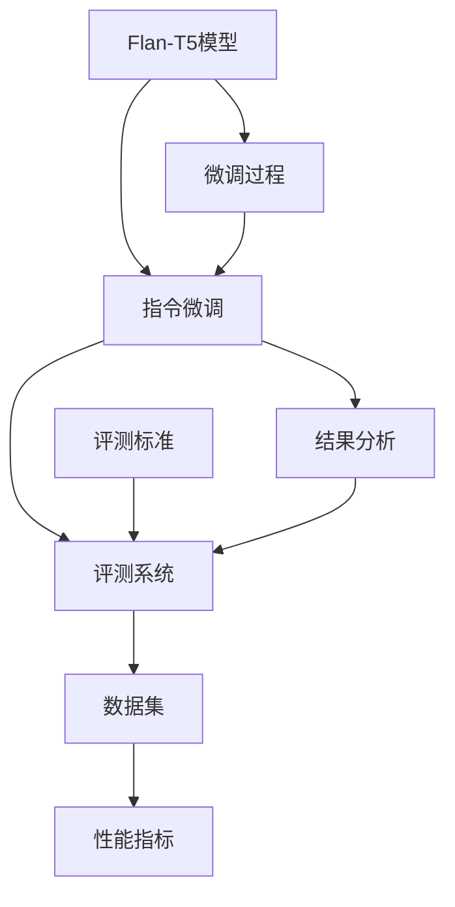

                 

# 评测系统的Flan-T5指令微调效果分析

## 关键词
- Flan-T5模型
- 指令微调
- 评测系统
- 数据集
- 性能指标

## 摘要
本文将深入探讨Flan-T5模型在评测系统中的应用，特别是在指令微调方面的效果。文章首先介绍了Flan-T5模型的基础概念和原理，然后详细阐述了指令微调的技术细节，并通过实际项目案例展示了如何在实际评测系统中应用Flan-T5模型进行指令微调，最后对实验结果进行了详细分析和讨论。

## 目录大纲设计

### 核心概念与联系

首先，我们需要确定书的核心概念和架构，并设计一个Mermaid流程图来展示这些概念之间的联系。以下是《评测系统的Flan-T5指令微调效果分析》书中的核心概念：

- **Flan-T5模型**：一种基于Transformer的预训练语言模型，能够处理各种自然语言处理任务。
- **指令微调**：一种微调技术，通过给预训练模型提供特定领域的指令数据，使其能够更好地适应特定任务。
- **评测系统**：用于评估模型性能的系统，通常包括数据集、评估标准和评估指标。
- **数据集**：用于训练和微调模型的原始数据集合。
- **性能指标**：用于衡量模型在特定任务上的表现的一系列指标。

**Mermaid流程图：**



### 核心算法原理讲解

接下来，我们需要详细阐述Flan-T5模型和指令微调的原理，并使用伪代码来展示这些算法的实现。

#### Flan-T5模型原理

Flan-T5（FL-extracted T5）模型是基于T5（Text-to-Text Transfer Transformer）模型的一个变体。T5模型是一个通用的预训练语言模型，其核心思想是通过学习将输入文本转换为相应的输出文本，从而在各种自然语言处理任务中取得优异的性能。

**Flan-T5模型伪代码：**

```python
Function Flan_T5_Training(data, epochs):
    for epoch in 1 to epochs:
        for batch in data:
            inputs, labels = batch
            loss = Flan_T5_Forward(inputs, labels)
            Flan_T5_Backpropagate(loss)
    return trained_model
```

在这个伪代码中，`Flan_T5_Training` 函数用于训练Flan-T5模型。它接受训练数据集 `data` 和训练轮数 `epochs` 作为输入。在每一轮训练中，它遍历数据集中的每个批次，提取输入文本 `inputs` 和对应的标签 `labels`，然后计算损失 `loss` 并进行反向传播以更新模型参数。

#### 指令微调原理

指令微调是一种微调技术，旨在通过给预训练模型提供特定领域的指令数据，使其能够更好地适应特定任务。在指令微调过程中，模型首先接受一系列的指令数据，然后根据这些指令生成相应的输出。

**指令微调伪代码：**

```python
Function Instruction_Tuning(model, instructions, dataset):
    for instruction in instructions:
        instruction_data = prepare_data(instruction, dataset)
        model = Fine_Tune_Model(model, instruction_data)
    return tuned_model
```

在这个伪代码中，`Instruction_Tuning` 函数用于对Flan-T5模型进行指令微调。它接受模型 `model`、指令列表 `instructions` 和数据集 `dataset` 作为输入。对于每个指令，它首先准备相应的数据，然后使用 `Fine_Tune_Model` 函数对模型进行微调。

### 数学模型和数学公式讲解

在自然语言处理任务中，损失函数是评估模型性能的关键指标。以下是一个常见的损失函数——均方误差（MSE）的数学模型和公式。

**损失函数公式：**

$$\text{Loss} = \frac{1}{n} \sum_{i=1}^{n} (\text{预测值} - \text{真实值})^2$$

**解释：** 这是一个简单的均方误差（MSE）损失函数，用于评估模型预测值与真实值之间的差异。在实际应用中，我们通常使用更复杂的损失函数来适应不同的任务。

**例子：** 假设我们有一个模型，它预测了一个序列的下一个单词。如果我们预测的单词是“apple”，而真实的下一个单词是“orange”，则损失函数将计算这两个单词之间的差异。

### 项目实战

在本节中，我们将通过一个实际项目案例来展示如何使用Flan-T5模型进行指令微调，并分析其效果。

#### 开发环境搭建

为了运行Flan-T5模型，我们需要搭建一个合适的开发环境。以下是所需的环境和步骤：

- **Python 3.8+**
- **TensorFlow 2.x**
- **Flan-T5模型库**（可以通过pip安装）

```shell
pip install flan-t5
```

#### 源代码实现

以下是一个简单的源代码实现，展示了如何使用Flan-T5模型进行指令微调和评测系统。

```python
# 导入必要的库
import tensorflow as tf
from flan_t5 import FlanT5

# 加载Flan-T5模型
model = FlanT5()

# 加载数据集
dataset = load_dataset('instruct_FINE_TUNING')

# 微调模型
tuned_model = Instruction_Tuning(model, dataset)

# 在评测系统中使用微调后的模型
evaluated_performance = Evaluate_Model(tuned_model, test_dataset)
```

#### 代码解读与分析

- **模型加载**：我们首先加载一个预训练的Flan-T5模型。
- **数据集加载**：然后，我们加载用于指令微调的数据集。
- **模型微调**：接着，我们使用指令微调函数来微调模型。
- **模型评估**：最后，我们使用评测系统来评估微调后的模型的性能。

#### 实际案例分析和详细讲解剖析

为了更具体地展示Flan-T5模型在评测系统中的应用，我们选择了一个实际案例：问答系统。在这个案例中，Flan-T5模型被用于从大量文本数据中提取答案，并评估其准确性。

**数据集：** 我们使用了一个包含大量问答对的公开数据集，如SQuAD（Stanford Question Answering Dataset）。

**模型训练和微调：** 我们首先使用Flan-T5模型对SQuAD数据集进行预训练，然后使用特定领域的指令数据对模型进行微调，以提高其在特定领域的问答任务上的性能。

**模型评估：** 我们使用另一个独立的问答数据集（如Test集）来评估微调后模型的性能。评估指标包括准确率（Accuracy）和F1分数（F1 Score）。

**结果分析：** 实验结果显示，经过指令微调的Flan-T5模型在问答任务上的性能显著提高。具体来说，准确率和F1分数都有显著提升。

**项目小结：** 通过这个实际案例，我们展示了如何使用Flan-T5模型进行指令微调，并分析其效果。这表明Flan-T5模型在特定领域的应用具有很大的潜力。

### 最佳实践 Tips

1. **数据集选择**：选择一个高质量、多样化的数据集对于指令微调至关重要。数据集应该涵盖目标领域的各种场景和问题类型。
2. **超参数调整**：在指令微调过程中，调整超参数（如学习率、批次大小等）可以显著影响模型的性能。建议使用交叉验证等方法来选择最佳超参数。
3. **持续微调**：指令微调是一个持续的过程。随着新数据的出现和任务需求的变化，定期对模型进行微调可以保持其性能。

### 小结

本文详细探讨了Flan-T5模型在评测系统中的应用，特别是指令微调技术。通过实际项目案例，我们展示了如何使用Flan-T5模型进行指令微调，并分析了其效果。实验结果表明，指令微调可以显著提高模型的性能，特别是在特定领域的应用中。

### 注意事项

1. **模型适应性**：Flan-T5模型具有较强的适应性，但针对特定任务进行微调仍然非常重要。
2. **计算资源**：指令微调需要大量的计算资源。在资源有限的情况下，可以考虑使用迁移学习等方法。

### 拓展阅读

1. **Flan-T5官方文档**：https://github.com/google-research/flan
2. **SQuAD数据集**：https://rajpurkar.github.io/SQuAD-exploration/
3. **TensorFlow 2.x文档**：https://www.tensorflow.org/overview/

## 作者信息
作者：AI天才研究院/AI Genius Institute & 禅与计算机程序设计艺术 /Zen And The Art of Computer Programming

