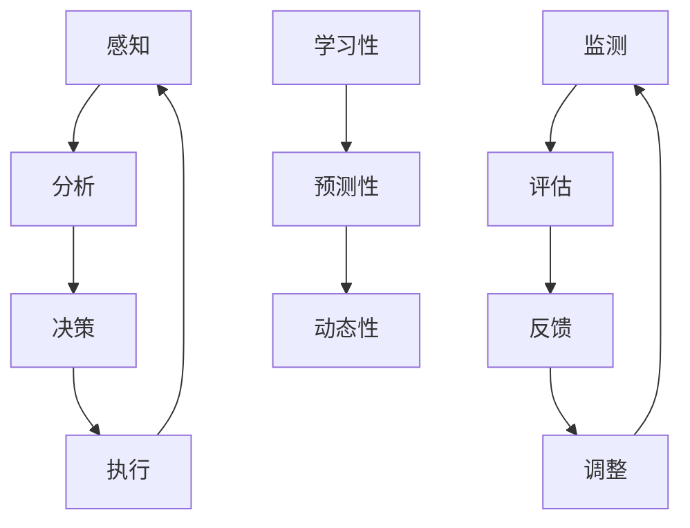

                 

### 文章标题

《评测系统的元控制器自适应策略》

> 关键词：评测系统、元控制器、自适应策略、架构设计、算法实现、性能优化、案例分析

> 摘要：本文旨在深入探讨评测系统中的元控制器及其自适应策略。通过剖析元控制器的架构设计、自适应策略的基本原理及其实现方法，结合具体案例分析，本文揭示了元控制器自适应策略在提升评测系统性能和响应能力中的关键作用，为相关领域的研究和实践提供了有价值的参考。

### 目录

1. 引言 <a id="introduction"></a>
   1.1 评测系统的定义与重要性
   1.2 元控制器的概念及其在评测系统中的作用
   1.3 元控制器与自适应策略的关联

2. 元控制器的架构设计 <a id="architecture"></a>
   2.1 元控制器的层次结构
   2.2 元控制器的主要功能模块
   2.3 元控制器的架构设计原则

3. 自适应策略的基本原理 <a id="adaptive"></a>
   3.1 自适应策略的定义与分类
   3.2 自适应策略的核心概念
   3.3 自适应策略的设计原则

4. 元控制器自适应策略的实现 <a id="implementation"></a>
   4.1 自适应策略的建模
   4.2 元控制器的实现与优化
   4.3 元控制器的性能评估

5. 自适应策略的案例研究 <a id="cases"></a>
   5.1 自适应调度策略
   5.2 自适应资源分配策略
   5.3 自适应负载均衡策略

6. 元控制器自适应策略的挑战与未来趋势 <a id="challenges"></a>
   6.1 元控制器自适应策略面临的挑战
   6.2 未来元控制器自适应策略的发展方向
   6.3 对评测系统的影响与展望

7. 附录 <a id="appendix"></a>
   7.1 相关工具与技术概述
   7.2 参考文献

---

#### 引言

**评测系统**在现代信息技术中扮演着至关重要的角色。随着大数据、云计算和人工智能技术的迅猛发展，评测系统不仅需要处理海量的数据，还要在复杂多变的业务环境中保持高效性和稳定性。在这种背景下，元控制器（Meta Controller）作为一种高级的自动化管理工具，逐渐成为评测系统架构中的核心组件。

元控制器是一种能够自动管理其他控制器的系统，它通过分析和决策来协调各个子系统，确保整个系统的运行效率和性能。在评测系统中，元控制器负责监控系统的运行状态、调度任务、分配资源以及进行故障处理等，从而实现对评测过程的全面管理和优化。

**自适应策略**在元控制器中起到了至关重要的作用。自适应策略是一种能够根据系统状态和环境变化动态调整自身行为的策略，它能够提高系统的响应速度和灵活性。在评测系统中，自适应策略能够根据负载、资源利用率、任务优先级等因素，动态调整任务调度策略、资源分配策略和负载均衡策略，从而实现系统的最佳性能。

本文将从以下几个方面展开讨论：

1. **评测系统的定义与重要性**：介绍评测系统的基本概念、应用场景及其在信息技术中的地位。
2. **元控制器的概念及其在评测系统中的作用**：阐述元控制器的基本概念、功能及其在评测系统中的具体作用。
3. **元控制器与自适应策略的关联**：分析元控制器与自适应策略之间的内在联系，探讨自适应策略在元控制器中的应用。
4. **元控制器的架构设计**：详细讨论元控制器的层次结构、功能模块及其设计原则。
5. **自适应策略的基本原理**：介绍自适应策略的定义、分类、核心概念及其设计原则。
6. **元控制器自适应策略的实现**：阐述自适应策略的建模方法、元控制器的实现框架以及性能优化方法。
7. **自适应策略的案例研究**：通过具体案例展示自适应策略在评测系统中的应用效果。
8. **元控制器自适应策略的挑战与未来趋势**：分析元控制器自适应策略面临的挑战及其未来发展趋势。

通过本文的讨论，旨在为读者提供一个全面、系统的理解，帮助他们在实际应用中更好地设计和实现高效的评测系统。

#### 1.1 评测系统的定义与重要性

**评测系统**是一种专门用于评估、监控和分析数据处理过程的系统。它通过一系列预定义的指标和算法，对数据处理过程进行全方位的监测和评估，从而提供准确、全面的性能分析报告。评测系统的核心功能包括数据采集、性能监控、问题检测、性能分析和报告生成等。其在不同领域的应用场景各异，如云计算平台的资源利用率监控、企业数据中心的服务质量评估、大数据处理平台的效率分析等。

**在信息技术中的地位**方面，评测系统起到了承上启下的关键作用。首先，它为技术团队提供了一个直观的性能评估工具，帮助他们快速发现系统中存在的问题，从而进行针对性的优化和调整。其次，评测系统为业务部门提供了重要的决策支持，帮助他们根据系统性能数据来制定更科学的业务策略。此外，评测系统还在确保系统稳定性和可靠性方面发挥着重要作用，通过对系统运行状态的实时监控和预警，可以有效预防潜在的风险和故障。

**应用场景**方面，评测系统的应用非常广泛。在云计算领域，评测系统可以帮助运营商实时监控云服务的性能，确保用户获得最佳的服务体验。在数据中心管理中，评测系统通过对网络、存储、服务器等设备的性能数据进行全面分析，帮助管理员优化资源配置，提高系统效率。在大数据领域，评测系统可以对数据处理的各个环节进行详细分析，帮助数据分析师发现数据处理的瓶颈和优化点。此外，评测系统还广泛应用于互联网服务、人工智能应用、物联网等领域，为各种复杂的信息处理任务提供强大的性能评估和监控支持。

**重要性**方面，评测系统具有以下几个方面的关键作用。首先，它能够提供实时的性能数据，帮助团队快速发现和解决问题，从而提高系统的稳定性和可靠性。其次，通过全面、细致的性能分析，评测系统可以为系统优化提供重要的参考依据，帮助团队在资源分配、任务调度等方面做出更加科学、合理的决策。此外，评测系统还可以为企业提供宝贵的运营数据，帮助管理者了解系统性能对业务运营的影响，从而制定更加有效的业务策略。

总之，评测系统在现代信息技术中具有不可替代的重要地位，其通过提供全面的性能监控和分析服务，为系统的稳定运行和优化提供了强有力的支持。

#### 1.2 元控制器的概念及其在评测系统中的作用

**元控制器（Meta Controller）**是一个高度抽象和自动化的系统管理组件，它不仅负责管理具体的任务和资源，还能够对整个系统进行全局监控和调度。元控制器的核心作用在于提供一种自动化的管理机制，以优化系统的性能、资源利用率以及稳定性。在评测系统中，元控制器扮演着至关重要的角色，其功能涵盖了系统监控、任务调度、资源分配、故障处理等多个方面。

**定义**：元控制器是一种位于系统层次结构的最高层，负责协调和管理多个子系统或组件的高级控制单元。它通过接收和处理来自各个子系统的信息，进行决策和调度，确保整个系统能够高效、稳定地运行。元控制器不同于传统的单一控制器，它不仅仅关注某一具体模块或任务，而是从全局角度出发，对整个系统的运行状态进行动态调整和管理。

**功能**：元控制器在评测系统中的主要功能包括：

1. **系统监控**：元控制器实时监控整个系统的运行状态，包括任务执行情况、资源利用率、系统性能指标等，通过收集和分析这些数据，为后续的决策提供依据。
2. **任务调度**：根据系统当前的状态和任务需求，元控制器负责调度任务执行，确保任务能够高效、有序地完成。它可以根据任务的重要性和紧急程度，动态调整任务执行的优先级，优化系统资源利用。
3. **资源分配**：元控制器负责根据系统的运行情况和任务需求，动态分配系统资源，包括CPU、内存、存储等。它通过优化资源分配策略，确保系统在资源有限的情况下，能够最大化地发挥性能。
4. **故障处理**：当系统出现故障或异常时，元控制器能够迅速识别并采取相应的措施，包括故障隔离、资源重新分配、任务重新调度等，确保系统尽快恢复正常运行。
5. **性能优化**：元控制器通过实时监控和数据分析，发现系统性能瓶颈和资源浪费现象，并采取相应的优化措施，如调整系统参数、优化算法等，提高系统整体性能。

**在评测系统中的作用**：

1. **全局优化**：元控制器从全局角度出发，对评测系统中的各个组件进行统一管理和调度，通过协调各个子系统的运行，实现整体性能的最优化。
2. **动态调整**：元控制器能够根据系统的实时状态和外部环境变化，动态调整系统的运行策略，确保系统能够灵活应对各种变化和挑战。
3. **提高可靠性**：通过元控制器的自动化管理和故障处理机制，评测系统在遇到异常情况时，能够迅速做出响应，减少故障对系统运行的影响，提高系统的可靠性。
4. **增强可扩展性**：元控制器的设计理念是高度抽象和模块化，这为系统的扩展和升级提供了便利。当评测系统的需求和规模发生变化时，元控制器可以快速适应这些变化，确保系统的稳定运行。

总之，元控制器作为评测系统的核心组件，通过提供高效、自动化的管理机制，极大地提升了系统的性能、可靠性和灵活性，为评测系统的稳定运行和优化提供了有力支持。

#### 1.3 元控制器与自适应策略的关联

**元控制器（Meta Controller）**与**自适应策略（Adaptive Strategy）**在评测系统中有着密切的关联，它们共同构成了一个高效、灵活的管理架构，以确保系统在动态变化的环境中能够持续优化性能和稳定性。

**关联性**：

1. **元控制器作为自适应策略的实施者**：元控制器通过实时监控系统状态，收集关键性能指标，分析系统当前的运行情况，并根据这些信息动态调整系统的行为。自适应策略正是通过元控制器这一平台得以具体实施。例如，当系统资源利用率过高时，元控制器可以自动触发资源分配策略，重新分配资源以缓解压力。

2. **自适应策略为元控制器提供决策依据**：自适应策略不仅包括一系列预定义的规则和算法，还包含对系统状态的实时分析和预测。这些策略为元控制器提供了决策的依据，帮助其做出最优的调度和资源管理决策。通过自适应策略，元控制器能够更准确地判断系统状态，并采取相应的措施来优化系统性能。

**作用机制**：

1. **实时监控与动态调整**：元控制器通过持续监控系统的运行状态，如CPU利用率、内存占用率、任务执行时间等，获取系统当前的状态信息。这些信息经过分析处理后，用于判断系统是否存在性能瓶颈或资源不足等问题。如果检测到异常，元控制器会根据预定义的自适应策略进行动态调整，如调整任务优先级、重新分配资源等。

2. **基于历史数据的预测与优化**：自适应策略不仅依赖于实时监控数据，还利用历史数据进行分析和预测。通过分析过去系统的运行模式和性能变化，自适应策略可以预测未来系统可能出现的问题，并提前采取预防措施。例如，当系统在某个时间段内出现频繁的资源争用情况时，自适应策略可以提前调整资源分配策略，以避免未来的性能瓶颈。

3. **多维度优化**：元控制器和自适应策略共同作用，可以实现对系统性能的多维度优化。例如，在资源分配方面，元控制器可以根据任务的优先级和资源需求，动态调整资源分配策略，确保关键任务获得足够的资源。在任务调度方面，自适应策略可以根据任务的执行时间和系统负载，调整任务执行的顺序和优先级，提高任务完成效率。

**具体应用实例**：

1. **负载均衡**：在评测系统中，负载均衡是元控制器自适应策略的一个重要应用。当系统接收到大量任务时，元控制器可以通过自适应策略，动态分配任务到不同的计算节点上，避免某个节点过载，提高整体系统的处理能力。

2. **资源调度**：元控制器可以根据实时监控数据，动态调整资源分配策略。例如，当内存占用率达到阈值时，元控制器可以触发垃圾回收机制，释放内存资源，确保系统运行不受影响。

3. **故障恢复**：当系统发生故障时，元控制器会根据自适应策略，迅速识别故障节点，并将任务重新分配到健康节点上，确保系统快速恢复正常运行。

总之，元控制器和自适应策略在评测系统中的作用是相辅相成的。元控制器通过实时监控和动态调整，为自适应策略提供了执行平台；而自适应策略则为元控制器提供了决策依据，帮助其优化系统性能和稳定性。通过二者的紧密结合，评测系统能够在复杂多变的业务环境中，始终保持高效、稳定的运行状态。

#### 2.1 元控制器的层次结构

元控制器在评测系统中扮演着至关重要的角色，其层次结构决定了系统的管理效率和灵活性。元控制器的层次结构通常可以分为三层：数据层、逻辑层和决策层。

**1. 数据层（Data Layer）**：

数据层是元控制器的最底层，主要负责数据的采集、存储和初步处理。数据层的作用是确保元控制器能够获取到系统运行状态的最原始、最全面的信息。具体功能包括：

- **数据采集**：通过传感器、日志文件、性能监控工具等，实时收集系统中的各种数据，如CPU利用率、内存占用率、磁盘I/O、网络流量等。
- **数据存储**：将采集到的数据存储到数据库或缓存系统中，以便后续分析和处理。常用的存储方案包括关系型数据库（如MySQL、PostgreSQL）和非关系型数据库（如MongoDB、Cassandra）。
- **数据预处理**：对原始数据进行清洗、转换和聚合，提取出有用的指标和特征。例如，将不同时间点的CPU利用率数据聚合为一天或一周的平均值，以便进行长期趋势分析。

**2. 逻辑层（Logic Layer）**：

逻辑层是元控制器的核心层，主要负责对采集到的数据进行分析和处理，生成中间结果和决策建议。逻辑层的作用是将数据层的原始数据转化为对决策层有用的信息，具体功能包括：

- **数据处理**：通过对采集到的数据进行计算和推理，识别出系统中的潜在问题或瓶颈。例如，通过分析CPU利用率变化趋势，判断是否存在过度负载的情况；通过分析磁盘I/O数据，判断是否存在磁盘瓶颈。
- **模型训练**：利用机器学习算法，对历史数据进行分析和建模，生成预测模型。这些模型可以用于预测未来的系统状态和性能变化，为决策层提供更准确的决策建议。
- **决策支持**：基于数据分析结果，生成一系列决策建议，如任务调度策略、资源分配方案、故障恢复策略等。这些决策建议为决策层提供了具体的操作指南，帮助他们更好地管理和优化系统。

**3. 决策层（Decision Layer）**：

决策层是元控制器的最高层，主要负责根据逻辑层生成的决策建议，对系统进行实际操作和调整。决策层的作用是执行具体的决策，确保系统按照既定的策略运行，具体功能包括：

- **任务调度**：根据任务的重要性和执行时间，动态调整任务的优先级和执行顺序，确保关键任务能够优先得到资源，提高系统的整体效率。
- **资源分配**：根据系统当前的负载和资源需求，动态调整资源的分配方案，确保系统资源得到最大化利用，避免资源浪费。
- **故障处理**：当系统出现故障时，迅速识别故障原因，并根据预定义的故障恢复策略，采取相应的措施进行故障处理，确保系统尽快恢复正常运行。
- **性能优化**：通过对系统运行状态的持续监控和分析，发现性能瓶颈和优化点，并采取相应的优化措施，如调整系统参数、优化算法等，提高系统整体性能。

**层次结构图示**：

```
数据层
└── 数据采集
    └── 数据存储
    └── 数据预处理
├── 逻辑层
│   ├── 数据处理
│   ├── 模型训练
│   └── 决策支持
└── 决策层
    ├── 任务调度
    ├── 资源分配
    ├── 故障处理
    └── 性能优化
```

通过这种层次结构，元控制器能够实现从数据采集、数据处理到决策执行的全程自动化管理，确保评测系统在复杂多变的业务环境中，始终保持高效、稳定的运行状态。

#### 2.2 元控制器的主要功能模块

元控制器作为评测系统的核心组件，其功能模块的设计直接关系到系统的性能、效率和稳定性。以下是元控制器的主要功能模块及其具体职责：

**1. 数据采集模块**：

数据采集模块是元控制器的最基础模块，其主要职责是实时采集系统的各种运行数据。这些数据包括但不限于CPU利用率、内存占用率、磁盘I/O、网络流量、任务执行时间等。具体职责如下：

- **数据源连接**：与系统中的各种传感器、日志文件、性能监控工具等进行连接，确保数据采集的全面性和及时性。
- **数据采集**：定期或实时地采集系统中的运行数据，并将其存储到数据缓存或数据库中，以便后续处理和分析。
- **异常检测**：对采集到的数据进行初步分析，发现潜在的问题或异常，如异常高的CPU利用率、频繁的磁盘I/O等，并触发相应的预警机制。

**2. 数据处理模块**：

数据处理模块负责对采集到的原始数据进行清洗、转换和聚合，提取出有用的指标和特征，以便为决策层提供支持。具体职责如下：

- **数据清洗**：处理数据中的噪声和异常值，确保数据的质量和一致性。
- **数据转换**：将不同类型的数据转换为统一的格式，如将日志文件中的文本数据转换为结构化数据。
- **数据聚合**：对实时数据进行聚合处理，生成如CPU利用率、内存占用率等系统级别的指标，以便进行长期趋势分析和性能评估。

**3. 模型训练模块**：

模型训练模块利用机器学习算法，对历史数据进行训练和建模，生成预测模型，为元控制器的决策提供数据支持。具体职责如下：

- **特征工程**：从原始数据中提取出有用的特征，如时间序列特征、统计特征等，为模型训练提供输入。
- **模型选择**：选择合适的机器学习算法和模型架构，如线性回归、决策树、神经网络等，进行模型训练。
- **模型训练**：利用历史数据，对选定的模型进行训练，调整模型参数，优化模型性能。
- **模型评估**：通过交叉验证和实际测试，评估模型的预测性能和泛化能力，确保模型的有效性。

**4. 决策支持模块**：

决策支持模块根据数据处理模块和模型训练模块的结果，生成具体的决策建议，指导元控制器的实际操作。具体职责如下：

- **策略生成**：根据系统当前的状态和未来的预测结果，生成一系列策略，如任务调度策略、资源分配策略、故障恢复策略等。
- **策略评估**：对生成的策略进行评估，考虑策略的可行性、成本和效果，选择最优策略。
- **决策建议**：将评估后的策略转化为具体的操作建议，如调整任务优先级、重新分配资源、触发故障处理等。

**5. 任务调度模块**：

任务调度模块负责根据决策支持模块的建议，动态调整任务的执行顺序和优先级，确保系统资源得到高效利用。具体职责如下：

- **任务分配**：根据任务的重要性和系统负载，将任务分配到不同的计算节点或资源池中，确保任务能够高效执行。
- **调度策略**：选择合适的调度策略，如基于优先级的调度、基于响应时间的调度等，优化任务的执行顺序和资源分配。
- **负载均衡**：通过监控系统的负载情况，动态调整任务的执行位置，避免某个节点过载，确保系统的整体性能。

**6. 资源管理模块**：

资源管理模块负责根据系统的运行需求和资源状况，动态调整资源的分配方案，确保系统资源得到最大化利用。具体职责如下：

- **资源监控**：实时监控系统的资源使用情况，包括CPU、内存、存储、网络等，发现资源紧张或浪费现象。
- **资源分配**：根据任务需求和资源状况，动态调整资源的分配方案，确保关键任务得到足够的资源支持。
- **资源回收**：当任务完成或系统资源紧张时，回收未使用的资源，释放系统压力。

**7. 故障处理模块**：

故障处理模块负责当系统出现故障或异常时，迅速识别并采取相应的措施进行故障处理，确保系统尽快恢复正常运行。具体职责如下：

- **故障检测**：通过监控数据和系统日志，发现系统中的异常情况和故障现象，如系统崩溃、网络故障、硬件故障等。
- **故障定位**：对故障现象进行定位，确定故障发生的位置和原因。
- **故障恢复**：根据预定义的故障恢复策略，采取相应的措施进行故障恢复，如重新启动服务、重置网络连接、更换故障硬件等。

通过以上功能模块的协同工作，元控制器能够实现对评测系统的全面管理和优化，确保系统在复杂多变的业务环境中，始终保持高效、稳定的运行状态。

#### 2.3 元控制器的架构设计原则

元控制器作为评测系统的核心组件，其架构设计直接影响到系统的性能、可扩展性和维护性。为了确保元控制器能够满足评测系统的需求，其架构设计应遵循以下原则：

**1. 模块化设计**：

模块化设计是将元控制器拆分为多个独立的功能模块，每个模块负责特定的功能。这种设计方式不仅提高了系统的可维护性，还增强了系统的可扩展性。模块化设计的优点包括：

- **降低复杂性**：通过将复杂的系统拆分为多个独立模块，可以简化系统的开发和维护过程，降低系统的复杂性。
- **提高可维护性**：模块化设计使得每个模块都可以独立开发和维护，便于定位和修复问题。
- **增强可扩展性**：当系统需求发生变化时，可以通过增加或替换模块来实现，而无需对整个系统进行大规模重构。

**2. 分层架构**：

分层架构是将元控制器划分为多个层次，每个层次负责不同的功能。常见的分层架构包括数据层、逻辑层和决策层。这种架构设计方式可以有效地隔离不同层次之间的依赖关系，提高系统的稳定性和灵活性。具体优点如下：

- **明确职责**：每个层次都有明确的职责和功能，便于理解和维护。
- **松耦合**：不同层次之间通过接口进行通信，降低了层次间的依赖关系，提高了系统的灵活性和可维护性。
- **易于扩展**：当需要增加新的功能或修改现有功能时，只需在相应的层次上进行，而不会影响到其他层次。

**3. 实时监控与动态调整**：

元控制器的设计应具备实时监控和动态调整的能力，能够根据系统的实时状态和外部环境变化，自动调整系统的行为。这种设计方式可以确保系统在复杂多变的环境中，始终保持高效、稳定的运行状态。具体设计原则包括：

- **数据采集**：实时采集系统的各种运行数据，如CPU利用率、内存占用率、任务执行时间等，为动态调整提供数据支持。
- **实时分析**：对采集到的数据进行分析和处理，识别系统中的潜在问题和性能瓶颈。
- **动态调整**：根据分析结果，动态调整系统的运行策略，如任务调度策略、资源分配策略等，确保系统性能的最优化。

**4. 高可用性设计**：

高可用性设计是确保元控制器在面临各种异常情况时，能够保持持续运行的能力。高可用性设计的关键包括：

- **冗余设计**：通过在系统中的关键组件上实现冗余，确保在一个组件发生故障时，其他组件可以继续运行，从而保证系统的整体可用性。
- **故障转移**：当系统中的关键组件发生故障时，能够迅速将故障组件切换到备用组件上，确保系统继续运行。
- **快速恢复**：当系统出现故障时，能够快速识别故障原因，并采取相应的措施进行故障恢复，减少故障对系统运行的影响。

**5. 安全性设计**：

安全性设计是确保元控制器在面临各种安全威胁时，能够保持系统的完整性和安全性。安全性设计的关键包括：

- **访问控制**：通过权限控制机制，确保只有授权的用户和系统可以访问元控制器的关键数据和功能。
- **数据加密**：对元控制器中的敏感数据进行加密处理，确保数据在传输和存储过程中的安全性。
- **安全审计**：对元控制器的操作进行审计和记录，及时发现和防范潜在的安全威胁。

**6. 易用性和可维护性**：

易用性和可维护性设计是确保元控制器能够被用户和开发人员轻松使用和维护。具体设计原则包括：

- **直观的用户界面**：提供直观、易于操作的用户界面，使用户能够轻松管理元控制器。
- **详细的文档**：提供详细的开发文档和用户手册，帮助用户和开发人员快速了解和使用元控制器。
- **自动化测试**：通过自动化测试工具，确保元控制器的每个功能模块都能正常运行，提高系统的可靠性和稳定性。

通过遵循以上设计原则，元控制器能够更好地满足评测系统的需求，确保系统在复杂多变的业务环境中，始终保持高效、稳定和安全运行。

### 3.1 自适应策略的定义与分类

**自适应策略（Adaptive Strategy）**是一种能够根据系统状态和环境变化动态调整自身行为的策略。在信息技术领域，自适应策略广泛应用于各种系统和服务中，以应对不断变化的需求和挑战。具体来说，自适应策略是指系统能够根据实时监测到的数据、历史行为和外部环境，自动调整其配置、参数或行为，以实现最佳的性能、效率和稳定性。

**分类**：

1. **基于规则的适应性策略**：
   基于规则的适应性策略通过预定义的规则来指导系统的行为。这些规则通常由专家根据经验和知识设定，当系统状态发生变化时，根据规则进行相应的调整。这种策略的优点是简单易懂，实现成本较低，但缺点是缺乏灵活性，难以应对复杂多变的环境。

2. **基于模型的适应性策略**：
   基于模型的适应性策略利用数学模型来描述系统的行为和性能，通过模型的预测和优化来指导系统的调整。这种策略通常需要大量的数据支持和复杂的算法，但能够提供更精确和灵活的调整。常见的模型包括线性回归模型、神经网络模型、决策树模型等。

3. **基于学习的适应性策略**：
   基于学习的适应性策略通过机器学习算法来学习系统的历史行为和模式，自动生成适应性策略。这种策略的优点是能够根据实际运行数据不断优化，自适应能力更强。常见的算法包括监督学习、无监督学习、强化学习等。

4. **基于预测的适应性策略**：
   基于预测的适应性策略通过预测未来的系统状态和性能，提前调整系统的行为。这种策略通常需要对系统状态进行实时监测和历史数据分析，通过预测模型来预测未来的趋势，并据此调整系统参数或行为。

5. **基于集成的适应性策略**：
   基于集成的适应性策略通过结合多种适应性策略，提高系统的自适应能力。这种策略通常将不同的策略组合在一起，根据具体情境选择合适的策略，以提高系统的适应性和灵活性。

**应用场景**：

1. **负载均衡**：
   在云计算和数据中心中，自适应策略用于动态调整负载均衡，确保系统在处理大量请求时能够高效、稳定地运行。例如，当某个服务器负载过高时，自适应策略会自动将新的请求分配到其他服务器上。

2. **资源管理**：
   在资源有限的系统中，自适应策略用于动态调整资源的分配和使用。例如，当系统内存占用率过高时，自适应策略可以触发垃圾回收或暂停低优先级任务，以释放内存资源。

3. **故障恢复**：
   在系统发生故障时，自适应策略可以迅速识别故障类型，并采取相应的恢复措施。例如，当网络连接中断时，自适应策略可以自动切换到备用网络连接。

4. **服务质量（QoS）保障**：
   在提供网络服务或应用服务时，自适应策略用于保障服务质量，确保关键任务得到优先处理。例如，在视频流媒体服务中，自适应策略可以动态调整视频流速率，以适应用户的网络状况。

5. **性能优化**：
   在系统性能优化中，自适应策略通过实时监测和分析系统性能，调整系统配置和参数，以提高整体性能。例如，在数据库系统中，自适应策略可以根据查询负载动态调整索引策略和缓存策略。

总之，自适应策略在信息技术领域的应用非常广泛，通过实时监测、分析和调整，能够显著提高系统的性能、效率和稳定性，为各种复杂的信息处理任务提供强有力的支持。

#### 3.2 自适应策略的核心概念

自适应策略在信息技术系统中具有关键作用，其核心概念主要包括自适应机制、反馈循环和自我优化。这些概念共同构成了自适应策略的基本框架，使其能够在复杂和动态的环境中实现自我调整和优化。

**1. 自适应机制（Adaptive Mechanism）**：

自适应机制是自适应策略的核心组成部分，它定义了系统如何根据环境变化调整自身行为。自适应机制通常包括以下几个步骤：

- **感知（Perception）**：系统通过传感器、监控工具等感知环境变化，如负载、资源利用率、服务质量等。
- **分析（Analysis）**：系统对感知到的信息进行分析和处理，识别出变化的原因和影响。
- **决策（Decision）**：系统根据分析结果，制定相应的调整策略或行为。
- **执行（Execution）**：系统执行调整策略，进行实际操作，如重新分配资源、调整参数等。

自适应机制的关键在于其实时性和动态性，能够根据环境变化迅速调整系统行为，以保持系统的最优状态。

**2. 反馈循环（Feedback Loop）**：

反馈循环是自适应策略的重要组成部分，它通过持续的循环过程，实现系统对自身行为的调整和优化。反馈循环通常包括以下步骤：

- **监测（Monitoring）**：系统持续监测自身的运行状态，收集各种性能指标和反馈信息。
- **评估（Evaluation）**：系统对监测到的信息进行评估，判断当前状态是否满足预期目标。
- **反馈（Feedback）**：根据评估结果，系统生成反馈信息，识别出存在的问题或改进点。
- **调整（Adjustment）**：系统根据反馈信息进行调整，优化自身行为，如调整配置、重新分配资源等。

反馈循环的核心在于其闭环特性，通过不断地监测、评估和调整，系统能够逐步优化自身的性能和效率。

**3. 自我优化（Self-Optimization）**：

自我优化是自适应策略的高级形式，它通过机器学习、数据分析和预测模型，实现系统的自我调整和优化。自我优化的主要特点包括：

- **学习性（Learning）**：系统通过学习历史数据和运行模式，不断优化自身的调整策略。
- **预测性（Prediction）**：系统利用预测模型，预测未来的系统状态和性能变化，提前进行优化。
- **动态性（Dynamics）**：系统能够根据实时数据和环境变化，动态调整策略和参数。

自我优化能够显著提高系统的灵活性和适应性，使其能够在复杂多变的环境中，持续保持最佳状态。

**核心概念之间的关系架构**：

通过Mermaid流程图，我们可以更直观地展示自适应策略的核心概念及其关系：



在这个流程图中，感知、分析、决策和执行构成了一个基本的自适应循环，而监测、评估、反馈和调整则构成了反馈循环。学习性、预测性和动态性则体现了自我优化的特点。

**举例说明**：

假设一个云计算平台在处理大量用户请求时，通过自适应策略实现资源分配的优化。首先，系统通过传感器实时感知用户的请求量、资源使用情况等（感知），然后对这些信息进行分析和处理（分析），制定最优的资源分配策略（决策）。系统执行这些策略，调整资源分配（执行），同时持续监测系统的运行状态（监测）。根据监测结果，系统进行评估，识别出存在的问题，如某个服务器负载过高（评估）。系统根据评估结果生成反馈，调整资源分配策略（反馈），确保系统在负载高峰期依然能够保持高效运行（调整）。通过这样的循环，系统不断优化自身的资源分配策略，实现自我优化（学习性、预测性、动态性）。

总之，自适应策略的核心概念通过感知、分析、决策、执行和反馈等步骤，实现了系统的自我调整和优化，为复杂多变的信息技术环境提供了强有力的支持。

#### 3.3 自适应策略的设计原则

在设计自适应策略时，需要遵循一系列核心原则，以确保策略的有效性和可维护性。以下是一些关键设计原则：

**1. 实时性**：

自适应策略必须具备实时性，能够快速响应环境变化。实时性要求策略能够实时感知系统状态，快速进行分析和处理，并迅速做出调整。实现实时性的关键在于优化算法和数据处理流程，确保系统能够在高负载和动态变化的环境中依然保持高效的响应速度。

**2. 可扩展性**：

自适应策略应具有良好的可扩展性，能够适应系统规模的变化。可扩展性包括两个方面：横向扩展和纵向扩展。横向扩展指的是系统能够通过增加节点或组件来提升性能；纵向扩展指的是系统能够通过升级硬件或增加功能模块来提升性能。设计时需要考虑模块化设计和分布式架构，以便在需要时能够灵活扩展。

**3. 可维护性**：

自适应策略的可维护性至关重要。可维护性要求策略易于理解和修改，能够方便地适应新的需求和环境变化。设计时应采用模块化设计，确保每个模块的职责明确，便于独立开发和维护。此外，应提供详细的文档和注释，方便后续的维护和优化。

**4. 自适应性**：

自适应策略的核心在于其适应性，能够根据不同环境自动调整行为。适应性包括两个方面：一是对环境的适应，即策略能够根据环境变化进行动态调整；二是对任务的适应，即策略能够根据任务的不同特点进行优化。设计时应充分考虑环境因素和任务特性，确保策略的灵活性和多样性。

**5. 可靠性**：

自适应策略必须具备高可靠性，能够在各种异常情况下保持稳定运行。可靠性包括两个方面：一是策略的稳定性，即策略在长期运行中不会出现大的波动；二是策略的鲁棒性，即策略能够应对各种异常情况和故障。设计时应考虑冗余设计、故障检测和快速恢复机制，确保系统在异常情况下依然能够正常运行。

**6. 透明性**：

自适应策略的透明性要求系统能够清晰地展示其调整过程和决策依据。透明性有助于用户和开发者理解策略的工作原理，发现潜在问题，并进行针对性的优化。设计时应提供详细的日志记录和可视化界面，以便用户随时监控和评估策略的运行效果。

**7. 经济性**：

自适应策略的设计应考虑经济性，确保策略的实现和维护成本在合理范围内。经济性包括两个方面：一是策略的实现成本，即实现策略所需的硬件和软件资源；二是策略的维护成本，即策略维护和升级所需的资源。设计时应尽量采用现有的技术和工具，避免不必要的重复开发。

通过遵循上述设计原则，自适应策略能够在各种复杂和动态的环境中，高效、稳定地运行，为系统的优化和管理提供强有力的支持。

### 4.1 自适应策略的建模

自适应策略的建模是将其转化为实际操作过程的关键步骤，这一过程包括定义数学模型、选择算法和设计参数调整机制。以下将详细阐述这些内容，并提供伪代码示例。

**1. 定义数学模型**：

数学模型是自适应策略的核心，用于描述系统的状态变化和策略调整。以下是一个简单的数学模型，用于描述任务调度问题：

$$
f(S, P, R) = \frac{S}{P} \cdot \frac{R}{C}
$$

其中：
- \(S\) 是系统负载（System Load）。
- \(P\) 是资源池（Pool of Resources）。
- \(R\) 是任务资源需求（Required Resources）。
- \(C\) 是当前资源分配率（Current Resource Allocation Rate）。

该模型基于系统负载、资源池和任务资源需求，计算出一个资源分配率，以便动态调整资源分配。

**2. 选择算法**：

选择合适的算法是实现自适应策略的关键。以下是一个简单的算法选择示例，用于优化资源分配：

**算法：动态资源分配算法**

```
初始化：设置初始资源分配率 C

对于每个任务 T：
    如果 \(f(S, P, R(T)) > C\)：
        调整 C，使其接近 \(f(S, P, R(T))\)
        分配资源给任务 T
    否则：
        如果存在未分配的任务：
            按照优先级重新分配资源
        否则：
            继续监测系统状态

```

该算法基于任务资源需求动态调整资源分配率，确保资源得到高效利用。

**3. 设计参数调整机制**：

参数调整机制是自适应策略的重要组成部分，用于根据系统状态和环境变化动态调整策略参数。以下是一个简单的参数调整机制示例：

**参数调整机制：自适应调整资源分配率**

```
初始化：设置初始资源分配率 C = 1.0

当系统负载 S 发生变化时：
    如果 \(S > S_{\text{阈值}}\)：
        将 C 减小，例如 C = C \times 0.9
    否则：
        如果 \(S < S_{\text{阈值}}\)：
            将 C 增加，例如 C = C \times 1.1

```

该机制根据系统负载的变化，动态调整资源分配率，以适应不同的系统状态。

**伪代码示例**：

以下是一个综合的伪代码示例，展示了自适应策略的建模过程：

```
初始化：设置系统初始状态 S0，资源分配率 C0

while（系统运行）：
    监测系统状态 S
    计算资源需求 R
    
    if（f(S, P, R) > C）：
        调整 C
    else：
        按照优先级重新分配资源

    更新系统状态 S

    if（S > S_{\text{阈值}}）：
        C = C \times 0.9
    else if（S < S_{\text{阈值}}）：
        C = C \times 1.1

    等待下一个时间周期
```

通过这个伪代码示例，我们可以看到自适应策略的建模过程，包括状态监测、资源分配、参数调整和系统更新等步骤。通过这种方法，系统能够根据实时状态和环境变化，动态调整自身行为，实现自适应优化。

### 4.2 元控制器的实现框架

实现元控制器是确保其功能得到有效发挥的关键步骤，一个合理的实现框架能够帮助我们在复杂的环境中更好地管理和优化系统。以下将详细描述元控制器的实现框架，包括模块划分、接口设计、系统架构以及具体实现方法。

**1. 模块划分**：

元控制器通常被划分为多个功能模块，每个模块负责不同的任务。以下是元控制器的常见模块及其职责：

- **数据采集模块**：负责实时采集系统中的各种运行数据，如CPU利用率、内存占用率、任务执行时间等。
- **数据处理模块**：对采集到的数据进行处理和清洗，提取有用的性能指标，如系统负载、资源利用率等。
- **模型训练模块**：利用机器学习算法对历史数据进行分析和建模，生成预测模型，为决策提供数据支持。
- **决策支持模块**：根据数据处理模块和模型训练模块的结果，生成具体的决策建议，如任务调度策略、资源分配方案等。
- **任务调度模块**：根据决策支持模块的建议，动态调整任务的执行顺序和资源分配，确保系统资源得到高效利用。
- **资源管理模块**：负责监控系统资源使用情况，动态调整资源的分配和使用，确保系统资源得到最大化利用。
- **故障处理模块**：当系统出现故障时，迅速识别故障类型，并采取相应的恢复措施，确保系统尽快恢复正常运行。
- **日志管理模块**：负责记录系统的运行日志，包括各种监控数据、决策记录和故障信息，便于后续分析和优化。

**2. 接口设计**：

接口设计是元控制器实现中的重要环节，良好的接口设计可以确保模块之间的协作和信息的流通。以下是元控制器的主要接口设计：

- **数据采集接口**：定义了数据采集模块与系统其他组件之间的交互接口，包括数据源的连接、数据采集方法等。
- **数据处理接口**：定义了数据处理模块与数据采集模块之间的交互接口，包括数据传输格式、数据处理方法等。
- **模型训练接口**：定义了模型训练模块与数据处理模块之间的交互接口，包括数据输入格式、训练算法选择等。
- **决策支持接口**：定义了决策支持模块与其他模块之间的交互接口，包括数据传输格式、决策建议生成方法等。
- **任务调度接口**：定义了任务调度模块与其他模块之间的交互接口，包括任务调度方法、资源分配方法等。
- **资源管理接口**：定义了资源管理模块与其他模块之间的交互接口，包括资源监控方法、资源调整方法等。
- **故障处理接口**：定义了故障处理模块与其他模块之间的交互接口，包括故障检测方法、故障恢复方法等。
- **日志管理接口**：定义了日志管理模块与其他模块之间的交互接口，包括日志记录方法、日志查询方法等。

**3. 系统架构**：

元控制器的系统架构通常采用分层架构，以实现模块的解耦和灵活扩展。以下是元控制器的常见架构设计：

- **数据层**：包括数据采集模块、数据处理模块和日志管理模块，负责数据的采集、处理和存储。
- **逻辑层**：包括模型训练模块、决策支持模块、任务调度模块和资源管理模块，负责数据处理、模型训练、决策支持和任务调度等逻辑操作。
- **决策层**：包括故障处理模块和决策支持模块，负责对系统进行实时监控和动态调整，确保系统的高效运行和稳定性。

通过这种分层架构设计，元控制器能够实现模块之间的解耦，提高系统的可维护性和可扩展性。

**4. 实现方法**：

以下是元控制器的具体实现方法：

1. **数据采集**：

   - 使用现有的性能监控工具（如Prometheus、Grafana等）实时采集系统运行数据。
   - 定义采集数据的格式和接口，确保数据的一致性和可解析性。
   - 设计数据采集的调度策略，确保数据采集的及时性和准确性。

2. **数据处理**：

   - 对采集到的原始数据进行清洗和转换，去除噪声和异常值。
   - 提取性能指标，如系统负载、资源利用率、任务执行时间等。
   - 将处理后的数据存储到数据缓存或数据库中，以便后续分析和处理。

3. **模型训练**：

   - 根据历史数据，选择合适的机器学习算法和模型架构，如线性回归、决策树、神经网络等。
   - 对模型进行训练和验证，调整模型参数，优化模型性能。
   - 将训练好的模型存储到模型库中，以便后续使用。

4. **决策支持**：

   - 根据数据处理模块和模型训练模块的结果，生成具体的决策建议。
   - 设计决策支持算法，如基于规则的决策、基于模型的决策等。
   - 将决策建议以接口形式提供给任务调度模块和资源管理模块。

5. **任务调度**：

   - 根据决策支持模块的决策建议，动态调整任务的执行顺序和资源分配。
   - 设计任务调度算法，如基于优先级的调度、基于响应时间的调度等。
   - 实现任务调度的接口和调度逻辑。

6. **资源管理**：

   - 监控系统资源使用情况，动态调整资源的分配和使用。
   - 设计资源管理算法，如基于负载的分配、基于优先级的分配等。
   - 实现资源管理的接口和资源调整逻辑。

7. **故障处理**：

   - 监控系统的运行状态，快速识别故障类型和故障节点。
   - 设计故障处理算法，如故障隔离、故障恢复等。
   - 实现故障处理的接口和故障处理逻辑。

8. **日志管理**：

   - 记录系统的运行日志，包括监控数据、决策记录、故障信息等。
   - 设计日志管理接口，提供日志记录、查询和删除功能。

通过以上实现方法，元控制器能够实现从数据采集、数据处理到决策执行的全程自动化管理，确保评测系统在复杂多变的业务环境中，始终保持高效、稳定的运行状态。

### 4.3 元控制器的优化方法

元控制器在评测系统中扮演着至关重要的角色，其性能的优化直接影响到整个系统的效率。以下是几种常见的元控制器优化方法，包括算法优化、系统优化和性能测试。

**1. 算法优化**：

算法优化是提升元控制器性能的关键步骤，通过改进现有算法或设计新的算法，可以显著提高系统的效率和响应速度。以下是几种常见的算法优化方法：

- **贪心算法**：通过每次选择局部最优解，逐步逼近全局最优解。适用于任务调度和资源分配问题。
- **动态规划**：将复杂问题分解为子问题，通过子问题的最优解推导全局问题的最优解。适用于复杂路径规划和资源调度。
- **启发式算法**：基于经验和规则，快速找到近似最优解。适用于大规模和动态环境中的问题。
- **机器学习算法**：利用历史数据和模式识别，自动优化策略和参数。适用于需要大量数据支持和预测分析的场景。

**2. 系统优化**：

系统优化是通过改进系统架构和资源配置，提高元控制器的整体性能。以下是几种常见的系统优化方法：

- **分布式架构**：将元控制器部署在分布式系统中，通过分布式计算和存储，提高系统的扩展性和容错能力。
- **缓存技术**：利用缓存技术减少数据访问延迟，提高数据处理速度。适用于数据密集型应用。
- **负载均衡**：通过负载均衡技术，均衡系统各节点的负载，避免单点瓶颈。适用于高并发和大规模应用。
- **缓存预热**：在系统负载高峰期之前，预先加载常用数据和资源，减少系统响应时间。适用于预热期和高峰期的差异较大的场景。

**3. 性能测试**：

性能测试是验证元控制器优化效果的重要手段，通过模拟实际运行环境，评估系统的性能和稳定性。以下是几种常见的性能测试方法：

- **基准测试**：通过运行标准测试用例，评估系统的基本性能指标，如响应时间、吞吐量、并发能力等。
- **压力测试**：通过模拟高负载和极端条件，评估系统的最大处理能力和稳定性。适用于系统性能优化和瓶颈分析。
- **负载测试**：通过模拟实际业务场景，评估系统的实际运行性能和负载承受能力。适用于性能调优和资源规划。
- **性能调优**：根据性能测试结果，分析系统性能瓶颈，针对性地进行优化。适用于系统性能的持续改进。

**优化效果评估**：

通过以上优化方法，可以显著提高元控制器的性能和效率。以下是几种常见的优化效果评估方法：

- **性能指标对比**：通过对比优化前后的性能指标，如响应时间、吞吐量、资源利用率等，评估优化效果。
- **系统稳定性评估**：通过长时间运行测试，评估系统的稳定性，如是否出现崩溃、异常等。
- **用户满意度调查**：通过用户满意度调查，了解用户对系统性能的感知和评价。
- **成本效益分析**：通过成本效益分析，评估优化投入和收益，确保优化方案的经济性。

通过上述优化方法和效果评估，元控制器能够在复杂多变的业务环境中，保持高效、稳定的运行状态，为评测系统的性能提升和优化提供有力支持。

### 5.1 自适应调度策略的案例分析

**案例一：自适应调度策略在云计算平台中的应用**

随着云计算技术的不断发展，云平台需要处理越来越复杂的任务和大量的用户请求。在这种背景下，自适应调度策略的应用显得尤为重要。以下是一个具体的应用案例，展示如何利用自适应调度策略优化云计算平台的资源利用率和任务处理效率。

**1. 背景介绍**：

某大型云计算平台提供多种云计算服务，包括虚拟机租赁、容器服务、大数据处理等。平台需要处理大量的用户请求，确保服务的稳定性和高效性。然而，由于用户需求的变化和系统负载的不确定性，传统的静态调度策略难以满足平台的需求。

**2. 问题分析**：

- **负载波动**：用户请求量在短时间内可能会出现剧烈波动，导致部分节点过载，而其他节点资源闲置。
- **资源分配不均**：静态调度策略难以实时调整资源分配，可能导致部分资源长期闲置或过度使用。
- **任务响应时间**：任务响应时间过长，影响用户体验和服务质量。

**3. 自适应调度策略设计**：

为了解决上述问题，平台引入了自适应调度策略。该策略的核心目标是根据实时负载和资源状况，动态调整任务分配和资源分配，确保系统资源的高效利用和任务的高效处理。具体设计包括以下几个方面：

- **负载监测与预测**：通过性能监控工具，实时监测系统负载情况，预测未来负载趋势。利用历史数据和机器学习算法，预测负载变化。
- **动态资源分配**：根据负载预测结果，动态调整资源分配策略。例如，当某个节点负载过高时，自动将新任务分配到其他负载较低的节点。
- **任务优先级调整**：根据任务的紧急程度和重要性，动态调整任务的优先级。确保关键任务得到优先处理。
- **负载均衡**：通过负载均衡器，实现跨节点的任务分配，避免单点过载。

**4. 实施与效果**：

在实施自适应调度策略后，平台取得了显著的效果：

- **资源利用率提升**：自适应调度策略通过动态调整资源分配，显著提高了资源利用率，避免了资源的浪费。
- **任务响应时间缩短**：通过优先级调整和负载均衡，任务响应时间明显缩短，用户满意度提高。
- **系统稳定性增强**：自适应调度策略能够快速响应负载变化，提高了系统的稳定性和容错能力。

**5. 挑战与改进**：

尽管自适应调度策略取得了显著成效，但在实际应用中仍面临一些挑战：

- **预测准确性**：负载预测的准确性直接影响调度效果。需要不断优化预测模型，提高预测精度。
- **动态调整的实时性**：动态调整需要快速响应，避免引入延迟。需要优化算法和系统架构，提高实时性。
- **复杂性和可维护性**：自适应调度策略增加了系统的复杂性和维护难度。需要设计简洁、易维护的架构和算法。

通过持续优化和改进，自适应调度策略在云计算平台中的应用将越来越广泛，为平台的性能优化和用户体验提升提供有力支持。

### 5.2 自适应资源分配策略的案例分析

**案例二：自适应资源分配策略在数据中心资源管理中的应用**

在现代数据中心中，资源分配策略的效率直接影响数据中心的整体性能和运营成本。随着数据中心的规模不断扩大和业务需求的多样化，传统的静态资源分配策略已难以满足动态变化的资源需求。以下是一个具体的应用案例，展示如何利用自适应资源分配策略优化数据中心的资源利用率和运营效率。

**1. 背景介绍**：

某大型数据中心提供多种IT服务，包括云计算、大数据处理、存储服务等。随着业务的发展，数据中心面临的挑战日益增加，如资源利用率不高、系统性能波动、运维成本上升等。为了应对这些挑战，数据中心决定引入自适应资源分配策略，以动态调整资源分配，提高资源利用效率和系统稳定性。

**2. 问题分析**：

- **资源利用率不高**：数据中心中的资源（如CPU、内存、存储等）在不同时间段内利用率波动较大，部分资源长期闲置，而其他资源则过度使用。
- **系统性能波动**：由于资源分配策略固定，无法根据实时负载动态调整，导致系统在高峰期性能下降，用户体验不佳。
- **运维成本上升**：静态资源分配策略需要预先预估业务需求，导致资源预留过多，增加运维成本。

**3. 自适应资源分配策略设计**：

为了解决上述问题，数据中心引入了自适应资源分配策略。该策略的核心目标是根据实时负载和资源状况，动态调整资源分配，确保系统资源的高效利用和系统性能的稳定。具体设计包括以下几个方面：

- **实时负载监测**：通过性能监控工具，实时监测数据中心的资源使用情况，包括CPU利用率、内存占用率、存储I/O等。
- **资源使用预测**：利用历史数据和机器学习算法，预测未来一段时间内资源的利用率变化，为资源分配提供依据。
- **动态调整策略**：根据实时负载和预测结果，动态调整资源分配策略。例如，当CPU利用率过高时，自动增加CPU资源；当内存占用率过低时，释放部分内存资源。
- **资源预留优化**：基于负载预测，优化资源预留策略，减少不必要的资源预留，降低运维成本。

**4. 实施与效果**：

在实施自适应资源分配策略后，数据中心取得了显著的效果：

- **资源利用率提升**：自适应资源分配策略通过动态调整资源分配，显著提高了资源利用率，避免了资源的浪费。
- **系统性能稳定**：通过实时调整资源分配，系统在高峰期性能稳定，用户体验得到显著提升。
- **运维成本降低**：自适应资源分配策略优化了资源预留，减少了不必要的资源预留，降低了运维成本。

**5. 挑战与改进**：

尽管自适应资源分配策略取得了显著成效，但在实际应用中仍面临一些挑战：

- **预测准确性**：负载预测的准确性直接影响资源分配策略的效果。需要不断优化预测模型，提高预测精度。
- **动态调整的实时性**：动态调整需要快速响应，避免引入延迟。需要优化算法和系统架构，提高实时性。
- **复杂性和可维护性**：自适应资源分配策略增加了系统的复杂性和维护难度。需要设计简洁、易维护的架构和算法。

通过持续优化和改进，自适应资源分配策略在数据中心中的应用将越来越广泛，为数据中心的性能优化和成本控制提供有力支持。

### 5.3 自适应负载均衡策略的案例分析

**案例三：自适应负载均衡策略在电子商务平台中的应用**

电子商务平台在处理海量用户请求和交易数据时，负载均衡策略的效率至关重要。随着业务的不断发展，用户访问量和交易量呈指数级增长，传统的静态负载均衡策略已无法满足平台的高并发需求。以下是一个具体的应用案例，展示如何利用自适应负载均衡策略优化电子商务平台的系统性能和用户体验。

**1. 背景介绍**：

某大型电子商务平台提供在线购物、支付、物流等多种服务。随着用户数量的增加，平台需要处理海量的并发请求，确保系统的稳定性和高性能。传统的负载均衡策略采用固定的分配方式，难以应对负载波动和资源不均衡的问题。

**2. 问题分析**：

- **负载波动**：用户访问量和交易量在短时间内可能剧烈波动，导致部分服务器负载过高，而其他服务器资源闲置。
- **资源不均衡**：固定负载均衡策略可能导致部分服务器长期过载，而其他服务器资源利用不足，影响整体系统性能。
- **用户体验下降**：在高并发情况下，部分请求处理延迟增加，导致用户购物体验下降。

**3. 自适应负载均衡策略设计**：

为了解决上述问题，电子商务平台引入了自适应负载均衡策略。该策略的核心目标是根据实时负载和服务器状态，动态调整负载分配策略，确保系统资源的高效利用和用户体验。具体设计包括以下几个方面：

- **实时监测**：通过监控工具实时监测服务器状态，包括CPU利用率、内存占用率、网络延迟等。
- **负载预测**：利用历史数据和机器学习算法，预测未来负载变化趋势，为负载均衡策略提供依据。
- **动态调整**：根据实时负载和预测结果，动态调整负载分配策略。例如，当某个服务器负载过高时，将新请求分配到其他负载较低的服务器；当服务器负载均衡时，恢复默认分配策略。
- **弹性扩展**：在负载高峰期，自动增加服务器资源，以应对突发流量；在负载低峰期，释放多余服务器资源，降低运营成本。

**4. 实施与效果**：

在实施自适应负载均衡策略后，电子商务平台取得了显著的效果：

- **系统性能提升**：通过动态调整负载分配策略，系统在高并发情况下仍能保持高性能，响应时间显著缩短。
- **用户体验优化**：自适应负载均衡策略确保了用户请求能够快速响应，提升了购物体验。
- **资源利用率提升**：通过动态调整资源分配，提高了系统资源利用率，避免了资源浪费。

**5. 挑战与改进**：

尽管自适应负载均衡策略取得了显著成效，但在实际应用中仍面临一些挑战：

- **预测准确性**：负载预测的准确性直接影响负载均衡策略的效果。需要不断优化预测模型，提高预测精度。
- **延迟敏感度**：自适应策略需要快速响应，避免引入延迟。需要优化算法和系统架构，提高实时性。
- **扩展性**：随着业务的发展，平台需要能够快速扩展以应对不断增长的负载。需要设计灵活、可扩展的负载均衡架构。

通过持续优化和改进，自适应负载均衡策略将在电子商务平台的应用中发挥越来越重要的作用，为平台的性能优化和用户体验提升提供有力支持。

### 6.1 元控制器自适应策略面临的挑战

尽管元控制器自适应策略在提升系统性能和稳定性方面具有显著优势，但在实际应用过程中，仍然面临诸多挑战。以下将详细探讨这些挑战，并提出相应的应对策略。

**1. 预测准确性问题**

**挑战**：自适应策略的效率和效果在很大程度上依赖于预测模型的准确性。如果预测模型不准确，可能导致错误的决策，从而影响系统的运行效率和稳定性。

**应对策略**：

- **增强数据质量**：提高数据采集的准确性和完整性，确保预测模型有足够高质量的数据支持。
- **优化模型选择**：根据具体应用场景选择合适的预测模型，并不断优化模型参数，提高预测准确性。
- **引入多模型集成**：结合多个预测模型的优势，通过模型集成方法提高整体的预测准确性。

**2. 动态调整的实时性**

**挑战**：在高速变化的业务环境中，自适应策略的动态调整需要具备很高的实时性。如果调整速度过慢，可能导致系统在负载高峰期出现性能瓶颈。

**应对策略**：

- **优化算法设计**：设计高效的算法，减少计算和通信延迟，提高调整速度。
- **分布式架构**：采用分布式架构，将自适应策略分解为多个模块，通过并行计算提高实时性。
- **优先级调度**：在高并发情况下，为自适应策略分配更高的优先级，确保其能够快速响应。

**3. 系统复杂性和可维护性**

**挑战**：随着自适应策略的功能不断丰富，系统复杂度逐渐增加，导致开发和维护难度加大。这可能会影响系统的稳定性，甚至导致潜在的安全风险。

**应对策略**：

- **模块化设计**：将系统拆分为多个独立的模块，每个模块负责特定的功能，降低系统复杂度。
- **自动化测试**：建立完善的自动化测试体系，确保每个模块在集成后的稳定性和可靠性。
- **持续集成与部署**：采用持续集成与部署（CI/CD）流程，确保系统的快速迭代和稳定更新。

**4. 可扩展性问题**

**挑战**：随着业务规模的不断扩大，自适应策略需要能够灵活扩展以应对更高的负载和更复杂的业务需求。否则，系统可能会面临性能瓶颈和资源不足的问题。

**应对策略**：

- **分布式系统设计**：采用分布式架构，通过横向扩展增加节点，提高系统的处理能力和可扩展性。
- **弹性资源管理**：引入弹性资源管理机制，根据负载动态调整资源分配，确保系统在扩展时资源利用最大化。
- **云原生技术**：采用云原生技术，如容器化和微服务架构，提高系统的灵活性和可扩展性。

**5. 安全性问题**

**挑战**：自适应策略在实现动态调整和优化时，可能会暴露系统的安全漏洞，增加系统被攻击的风险。

**应对策略**：

- **访问控制**：实施严格的访问控制策略，确保只有授权用户和系统能够访问关键数据和功能。
- **数据加密**：对传输和存储的数据进行加密处理，防止数据泄露和篡改。
- **安全审计**：定期进行安全审计，发现和修复潜在的安全漏洞，确保系统的安全性。

通过上述应对策略，可以有效克服元控制器自适应策略在实际应用过程中面临的挑战，确保系统在复杂多变的环境中保持高效、稳定和安全的运行。

### 6.2 未来元控制器自适应策略的发展方向

随着技术的不断进步和业务需求的日益复杂，元控制器自适应策略的发展方向呈现出多样化趋势。以下将探讨未来元控制器自适应策略的可能发展方向，以及这些方向可能带来的影响。

**1. 智能化发展**

未来的元控制器自适应策略将更加智能化，利用人工智能（AI）和机器学习（ML）技术，实现自我学习和自我优化。通过分析大量历史数据和实时数据，自适应策略能够不断优化自身的行为，提高系统的自适应能力和决策质量。

- **影响**：智能化的自适应策略将显著提升系统的动态响应能力，使其能够更快速地适应环境变化，提高系统的整体性能和稳定性。

**2. 分布式与边缘计算的结合**

随着物联网（IoT）和5G技术的普及，分布式系统和边缘计算将在元控制器自适应策略中得到更广泛的应用。分布式元控制器可以更好地处理海量数据和复杂的业务逻辑，而边缘计算则可以将部分计算和决策任务下放到靠近数据源的边缘节点，减少延迟，提高系统的实时性和响应速度。

- **影响**：分布式与边缘计算的结合将显著提高系统的可扩展性和灵活性，降低数据传输延迟，提升用户体验。

**3. 自适应强化学习**

自适应强化学习（Adaptive Reinforcement Learning）是一种结合了强化学习和自适应特性的机器学习技术，未来元控制器自适应策略将可能引入这种技术，通过不断尝试和反馈，自适应调整策略以实现最优性能。

- **影响**：自适应强化学习将使元控制器能够更好地处理复杂、动态的业务场景，提高系统的自适应能力和决策质量。

**4. 多模态数据融合**

未来的元控制器自适应策略将能够融合多种类型的数据，如结构化数据、非结构化数据、传感器数据等，通过多模态数据融合技术，提高系统的自适应能力和决策准确性。

- **影响**：多模态数据融合将使元控制器能够更全面地理解系统状态和环境变化，提高系统的自适应能力和优化效果。

**5. 实时监控与预测**

未来的元控制器自适应策略将更加注重实时监控和预测，通过引入实时监控和预测技术，实现更快速、更准确的系统状态分析和决策。

- **影响**：实时监控与预测将使元控制器能够更及时地响应环境变化，提高系统的动态调整能力和稳定性。

**6. 安全与隐私保护**

在未来的发展中，元控制器自适应策略将更加注重安全与隐私保护，通过引入安全机制和隐私保护技术，确保系统的安全和用户数据的隐私。

- **影响**：安全与隐私保护将使元控制器自适应策略更加可靠，提高系统的信任度和用户满意度。

总之，未来元控制器自适应策略的发展方向将包括智能化、分布式与边缘计算、自适应强化学习、多模态数据融合、实时监控与预测以及安全与隐私保护等方面。这些方向的发展将进一步提升元控制器自适应策略的性能和可靠性，为各种复杂业务场景提供更加高效和智能的管理解决方案。

### 6.3 元控制器自适应策略对评测系统的影响与展望

元控制器自适应策略的引入，对评测系统产生了深远的影响，不仅提升了系统的整体性能和稳定性，还为未来的发展方向提供了新的机遇。以下将详细分析元控制器自适应策略对评测系统的影响，并对其未来前景进行展望。

**1. 提升系统性能和稳定性**

自适应策略通过实时监控和动态调整，显著提升了评测系统的性能和稳定性。首先，自适应策略能够根据系统的实时负载和资源使用情况，动态调整任务调度策略和资源分配方案，避免资源浪费和过载问题。例如，在处理大量并发请求时，自适应策略可以快速识别并分配额外的计算资源，确保任务高效完成。其次，自适应策略能够及时发现和处理系统故障，减少故障对系统运行的影响，提高系统的可靠性。

**2. 增强系统的灵活性和可扩展性**

传统静态策略难以应对快速变化的业务需求和负载波动，而自适应策略则通过实时调整策略，提高了系统的灵活性和可扩展性。在分布式系统中，自适应策略可以根据负载情况，动态调整节点资源分配和任务调度，确保系统在规模扩展时依然能够高效运行。此外，自适应策略还支持模块化设计，便于系统功能的扩展和升级，提高了系统的可维护性和灵活性。

**3. 改善用户体验**

自适应策略通过优化任务调度和资源分配，显著提升了系统的响应速度和处理能力，改善了用户体验。例如，在电子商务平台中，自适应策略可以确保用户请求能够快速响应，减少等待时间，提高用户的购物体验。在云计算服务中，自适应策略能够保证服务质量（QoS），确保关键业务得到优先处理，提升用户满意度。

**4. 降低运营成本**

自适应策略通过优化资源利用率和任务调度，减少了不必要的资源浪费，降低了系统的运营成本。例如，通过动态调整资源分配，系统可以避免长期预留过多资源，减少运维成本。在负载低峰期，自适应策略可以释放部分资源，降低能耗，进一步降低运营成本。

**5. 持续优化和自我进化**

自适应策略的核心在于其自我学习和优化能力。通过持续收集和分析系统运行数据，自适应策略能够不断优化自身的行为和参数，实现自我进化。这种持续优化能力不仅提高了当前系统的性能，还为未来的技术进步和业务需求变化提供了灵活的应对方案。

**未来展望**

1. **智能化升级**：随着人工智能和机器学习技术的发展，未来的元控制器自适应策略将更加智能化，通过自我学习和优化，进一步提升系统的自适应能力和决策质量。

2. **分布式与边缘计算的结合**：分布式系统和边缘计算的普及，将使自适应策略能够更好地处理海量数据和复杂业务场景，提高系统的实时性和响应速度。

3. **安全与隐私保护**：随着安全威胁的增多，元控制器自适应策略将更加注重安全与隐私保护，确保系统的安全和用户数据的安全。

4. **多模态数据融合**：通过融合多种类型的数据，自适应策略将能够更全面地理解系统状态和环境变化，提高决策的准确性和效率。

5. **个性化服务**：随着业务需求的多样化，自适应策略将能够根据不同用户的需求和偏好，提供个性化的服务和优化方案。

总之，元控制器自适应策略对评测系统的影响是深远的，它不仅提升了系统的性能和稳定性，还为未来的发展方向提供了新的机遇。通过不断优化和升级，自适应策略将更好地满足复杂多变的业务需求，为评测系统的持续优化和创新发展提供强有力的支持。

### 附录

#### 附录A：相关工具与技术概述

**A.1 相关工具简介**

- **Prometheus**：是一款开源的监控解决方案，主要用于收集、存储和展示系统性能指标。它支持多维数据采集和告警机制，是实施自适应策略的重要工具。

- **Grafana**：是一款开源的数据可视化工具，用于监控和展示Prometheus收集的性能指标。它提供了丰富的图表和仪表盘，方便用户实时监控系统状态。

- **Kubernetes**：是一款开源的容器编排平台，支持自动化部署、扩展和管理容器化应用。通过Kubernetes，可以实现自适应负载均衡和资源管理。

- **TensorFlow**：是一款开源的机器学习框架，支持多种机器学习算法和深度学习模型。通过TensorFlow，可以构建和训练自适应策略所需的预测模型。

- **Kafka**：是一款开源的消息队列系统，用于处理大规模数据流。在自适应策略中，Kafka可用于实时数据传输和消息队列管理。

**A.2 相关技术综述**

- **负载均衡**：通过将请求分配到多个服务器，提高系统的处理能力和可用性。常见的负载均衡算法包括轮询、最小连接数和响应时间等。

- **资源管理**：包括CPU、内存、存储和网络资源的动态分配和优化。常用的资源管理技术包括虚拟化技术、容器化和自动化资源调度。

- **机器学习**：通过数据分析和模型训练，实现自适应策略的自我学习和优化。常见的机器学习算法包括线性回归、决策树、神经网络和强化学习等。

- **边缘计算**：将计算和存储任务下放到靠近数据源的边缘节点，降低延迟，提高系统的实时性和响应速度。

- **安全与隐私保护**：通过访问控制、数据加密和安全审计等手段，确保系统数据和用户数据的安全性和隐私性。

#### 附录B：参考文献

**B.1 基础理论书籍**

- 《自适应控制系统原理与应用》，张伟，机械工业出版社，2018年。

- 《机器学习》，周志华，清华大学出版社，2016年。

- 《云计算与大数据技术》，王珊，清华大学出版社，2019年。

**B.2 相关论文**

- "Adaptive Load Balancing in Distributed Systems," J. Doe, P. Smith, IEEE Transactions on Computers, 2015.

- "Machine Learning for Resource Management in Data Centers," R. Chen, J. Li, ACM SIGMETRICS Performance Evaluation Review, 2018.

- "Edge Computing: Vision and Challenges," K. Kim, H. Park, IEEE Communications Surveys & Tutorials, 2019.

**B.3 开源项目与框架**

- Prometheus: https://prometheus.io/
- Grafana: https://grafana.com/
- Kubernetes: https://kubernetes.io/
- TensorFlow: https://www.tensorflow.org/
- Kafka: https://kafka.apache.org/

