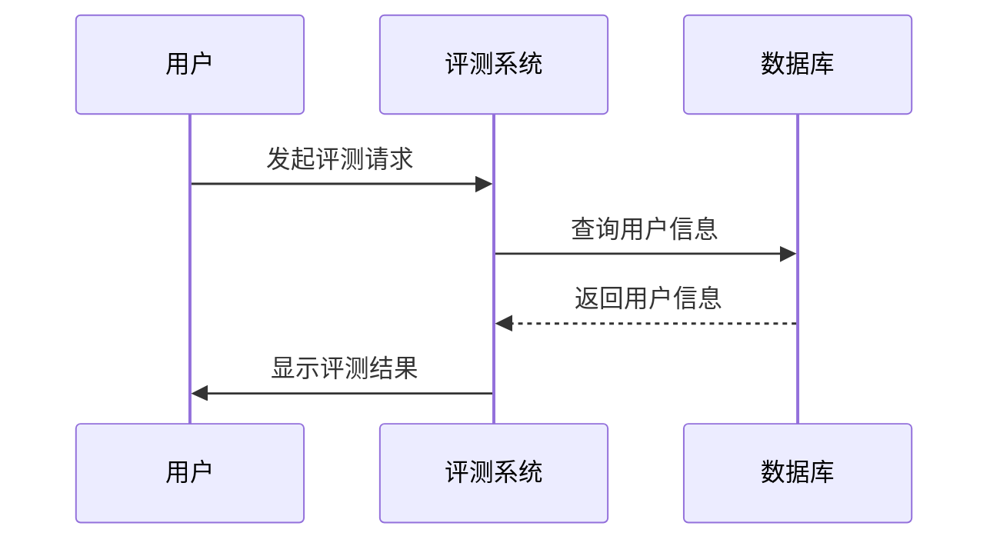
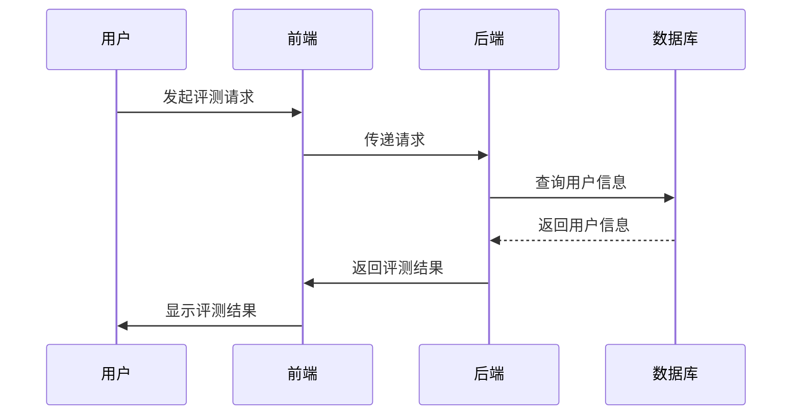
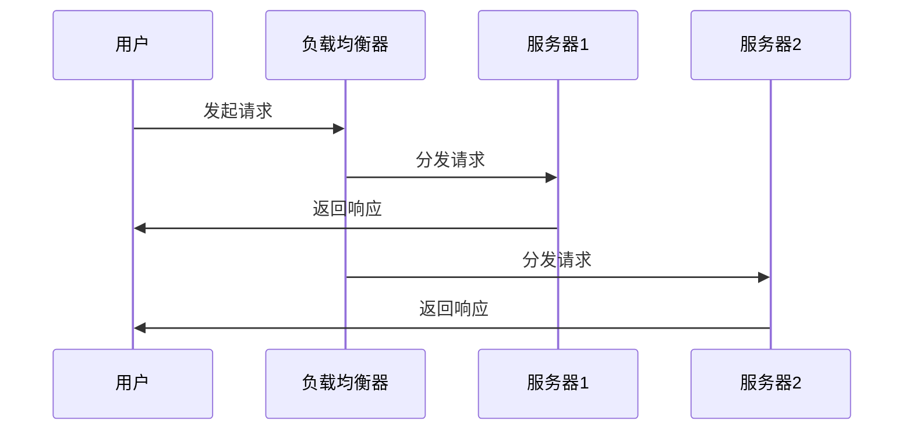
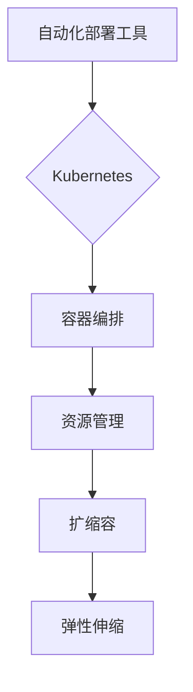
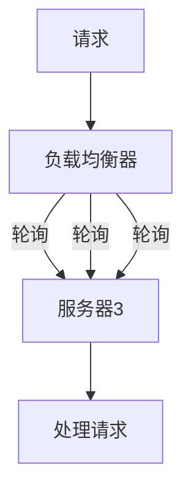
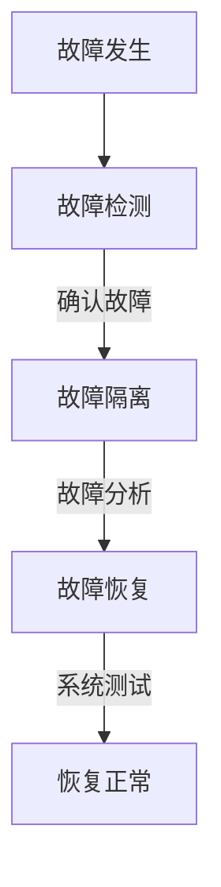
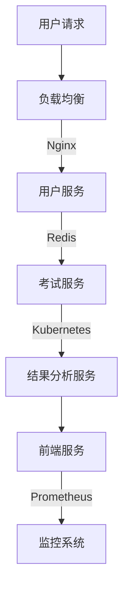
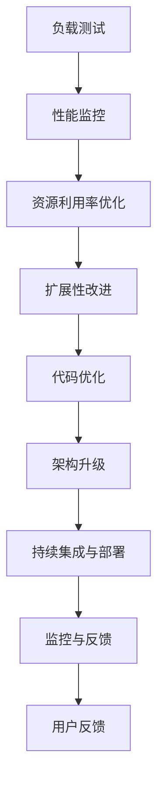

                 

### 文章标题

### 《评测系统的可扩展性设计》

### 关键词：评测系统、可扩展性设计、性能优化、高并发处理、弹性伸缩、负载均衡、故障恢复、案例分析

### 摘要

随着信息技术的发展，评测系统在各个行业中的应用越来越广泛，其性能和可扩展性设计成为保障系统稳定运行的关键。本文旨在深入探讨评测系统的可扩展性设计，分析其背景与重要性，详细讲解评测系统架构设计、性能优化策略、高并发处理、弹性伸缩设计、负载均衡与流量管理、系统容错与故障恢复等核心内容，并通过实际案例分析，总结出评测系统的可扩展性设计与优化策略，为相关领域的技术人员提供实用的参考和指导。

### 第一部分：可扩展性设计概述

#### 第1章：评测系统的可扩展性设计背景与重要性

##### 1.1 评测系统的发展历程

评测系统起源于20世纪中期，随着计算机技术的快速发展，评测系统也逐渐演变成为重要的信息技术工具。早期的评测系统主要用于简单的自动化测试和成绩管理，随着互联网和云计算技术的兴起，评测系统逐渐融入到在线教育、电子商务、金融科技等各个领域，成为提升业务效率、优化用户体验的重要手段。

##### 1.2 可扩展性设计的核心概念与价值

可扩展性设计（Scalability Design）是指系统在面对不断增加的负载时，能够高效地适应和扩展，确保系统性能和用户体验的稳定。在评测系统中，可扩展性设计的重要性体现在以下几个方面：

1. **应对增长的用户需求**：随着用户数量的不断增加，评测系统需要能够处理更多的测试请求，保持高效稳定的运行。
2. **提升系统性能**：通过优化系统架构和性能，提高评测系统的响应速度和并发处理能力，提升用户体验。
3. **降低维护成本**：可扩展性设计能够降低系统维护和扩展的成本，提高开发效率和资源利用率。

##### 1.3 可扩展性设计的挑战与机遇

可扩展性设计不仅带来了诸多机遇，同时也面临一系列挑战：

1. **技术复杂性**：实现可扩展性设计需要掌握多种技术和架构，包括分布式系统、微服务架构、容器化技术等，技术复杂性较高。
2. **性能优化**：在高并发场景下，如何优化系统性能、降低响应时间是一个巨大的挑战。
3. **系统稳定性**：可扩展性设计需要在保证系统性能的同时，确保系统的稳定性和可靠性。

为了应对这些挑战，评测系统的可扩展性设计需要从以下几个方面进行考虑：

1. **模块化设计**：将系统拆分为多个模块，提高系统的可扩展性和可维护性。
2. **性能优化**：采用高效的算法和数据结构，优化系统性能，提升并发处理能力。
3. **弹性伸缩**：通过自动化部署和扩缩容策略，实现系统的动态伸缩，提高资源利用率。

##### 1.4 本章小结

本章介绍了评测系统的可扩展性设计背景与重要性，阐述了可扩展性设计的核心概念和面临的挑战。在下一章中，我们将深入探讨评测系统的架构设计，为后续的性能优化和可扩展性设计奠定基础。

##### Mermaid 流程图

#### 第2章：评测系统架构设计

##### 2.1 评测系统的基本架构

评测系统的基本架构主要包括前端、后端和数据库三部分，各部分的功能如下：

1. **前端**：负责与用户交互，展示评测结果，收集用户反馈。
2. **后端**：负责处理评测请求，调用业务逻辑，与数据库进行数据交互。
3. **数据库**：存储评测数据和用户信息，提供数据查询和更新服务。

##### 2.1.1 系统架构的设计原则

在评测系统架构设计过程中，需要遵循以下原则：

1. **模块化**：将系统拆分为多个模块，每个模块负责特定的功能，提高系统的可维护性和可扩展性。
2. **松耦合**：各模块之间通过接口进行通信，降低模块之间的依赖关系，提高系统的灵活性。
3. **高内聚**：每个模块内部的功能紧密相关，保证模块内部的高内聚性。

##### 2.1.2 模块化设计

模块化设计是评测系统架构设计的重要手段，通过将系统拆分为多个模块，可以提高系统的可维护性和可扩展性。以下是一个典型的评测系统模块划分示例：

1. **用户管理模块**：负责用户信息的存储、查询和更新。
2. **评测管理模块**：负责评测题目的存储、查询和更新，以及评测流程的管理。
3. **结果分析模块**：负责评测结果的统计分析，生成评测报告。
4. **前端模块**：负责用户界面的展示，与用户进行交互。
5. **后端模块**：负责处理评测请求，调用业务逻辑，与数据库进行数据交互。

##### 2.1.3 微服务架构

微服务架构是一种将系统拆分为多个独立服务的架构风格，每个服务负责特定的功能，独立部署和运行。微服务架构具有以下优点：

1. **可扩展性**：通过水平扩展单个服务，可以提高系统的并发处理能力。
2. **高可用性**：服务之间通过接口通信，单个服务的故障不会影响整个系统的运行。
3. **灵活性和可维护性**：每个服务可以独立开发和部署，降低系统复杂度。

以下是一个典型的评测系统微服务架构示例：

1. **用户服务**：负责用户信息的存储、查询和更新。
2. **评测服务**：负责评测题目的存储、查询和更新，以及评测流程的管理。
3. **结果分析服务**：负责评测结果的统计分析，生成评测报告。
4. **前端服务**：负责用户界面的展示，与用户进行交互。

##### 2.2 本章小结

本章介绍了评测系统的基本架构和设计原则，详细讲解了模块化设计和微服务架构的应用。在下一章中，我们将探讨评测系统的性能优化策略，以提高系统的高并发处理能力和响应速度。

##### Mermaid 流程图

### 第三部分：性能优化与可扩展性设计

#### 第3章：性能优化与可扩展性设计

##### 3.1 性能优化策略

性能优化是评测系统可扩展性设计的重要环节，以下介绍几种常见的性能优化策略：

##### 3.1.1 常见的性能瓶颈分析

在评测系统中，常见的性能瓶颈包括：

1. **数据库查询性能**：数据库查询频繁，查询速度慢。
2. **网络延迟**：网络传输速度慢，影响系统响应速度。
3. **并发处理能力**：在高并发场景下，系统处理能力不足。
4. **内存消耗**：内存消耗过高，导致系统性能下降。

##### 3.1.2 性能调优方法

针对上述性能瓶颈，可以采取以下性能调优方法：

1. **数据库查询优化**：
   - **索引优化**：对常用的查询字段创建索引，提高查询速度。
   - **查询优化**：优化查询语句，避免复杂的多表连接查询。
2. **网络优化**：
   - **CDN加速**：使用CDN（内容分发网络）提高用户访问速度。
   - **负载均衡**：使用负载均衡器，分发用户请求，降低单点瓶颈。
3. **并发处理优化**：
   - **异步处理**：采用异步处理方式，减少系统阻塞。
   - **多线程/多进程**：提高系统并发处理能力。
4. **内存优化**：
   - **对象池**：使用对象池技术，减少对象创建和销毁的开销。
   - **内存监控**：定期监控内存使用情况，避免内存泄漏。

##### 3.2 高并发处理与可扩展性

高并发处理是评测系统面临的重大挑战，以下介绍高并发处理与可扩展性的设计思路：

##### 3.2.1 高并发系统的设计思路

1. **负载均衡**：通过负载均衡器，将用户请求分发到不同的服务器，提高系统的并发处理能力。
2. **分布式系统**：将系统拆分为多个分布式节点，每个节点负责特定的功能，提高系统的可扩展性和容错性。
3. **缓存机制**：使用缓存机制，减少数据库查询次数，提高系统响应速度。

##### 3.2.2 分布式系统与负载均衡

分布式系统是指将系统拆分为多个节点，每个节点负责特定的功能，通过分布式算法实现数据一致性。以下介绍几种常见的分布式系统和负载均衡技术：

1. **分布式数据库**：如MySQL Cluster、MongoDB Sharding等，通过分片机制提高数据库的并发处理能力。
2. **分布式缓存**：如Redis Cluster、Memcached Cluster等，通过分布式缓存提高系统的响应速度。
3. **负载均衡器**：如Nginx、HAProxy等，通过负载均衡算法，将用户请求分发到不同的服务器。

##### 3.3 数据库性能优化与可扩展性

数据库性能优化和可扩展性是评测系统性能提升的关键，以下介绍几种常见的数据库性能优化策略：

##### 3.3.1 关系型数据库的优化策略

1. **索引优化**：对常用的查询字段创建索引，提高查询速度。
2. **查询优化**：优化查询语句，避免复杂的多表连接查询。
3. **分区表**：将表划分为多个分区，提高查询和写入性能。
4. **读写分离**：通过主从复制，实现读写分离，提高系统的并发处理能力。

##### 3.3.2 NoSQL数据库的选择与应用

NoSQL数据库在处理海量数据和实时查询方面具有优势，以下介绍几种常见的NoSQL数据库及其应用场景：

1. **Redis**：适用于缓存、消息队列和实时数据分析。
2. **MongoDB**：适用于文档存储和实时数据处理。
3. **Cassandra**：适用于高并发、分布式数据处理。

##### 3.4 本章小结

本章介绍了评测系统的性能优化策略，包括常见的性能瓶颈分析、性能调优方法、高并发处理与可扩展性设计思路，以及数据库性能优化与可扩展性的实现方法。在下一章中，我们将探讨评测系统的弹性伸缩设计，以提高系统的资源利用率和稳定性。

##### Mermaid 流程图

### 第四部分：弹性伸缩设计

#### 第4章：弹性伸缩设计

弹性伸缩（Elastic Scaling）是一种根据系统负载自动调整资源的能力，能够帮助评测系统在用户数量和数据处理量增加时，保持性能和稳定性的同时降低成本。弹性伸缩设计的关键在于自动化部署与扩缩容策略、容器化与微服务架构的应用。

##### 4.1 弹性伸缩的概念与重要性

弹性伸缩是指系统可以根据业务需求的变化，自动调整计算资源，包括计算能力、存储能力等。弹性伸缩的重要性体现在以下几个方面：

1. **动态调整资源**：随着用户数量的增加或减少，系统能够自动增加或减少资源，保证性能和稳定性。
2. **成本优化**：通过按需分配资源，减少资源浪费，降低运维成本。
3. **用户体验**：在高峰期保持系统响应速度，提升用户体验。
4. **快速恢复**：在故障或负载突增时，能够快速恢复，确保系统可用性。

##### 4.1.1 弹性伸缩与传统伸缩的区别

传统伸缩通常是通过预先设定的时间间隔或触发条件，手动或自动增加或减少资源。而弹性伸缩则是在使用过程中根据实际负载动态调整资源，具有以下特点：

1. **动态性**：实时监控系统负载，动态调整资源。
2. **自适应**：能够根据不同的业务场景，自动选择合适的资源调整策略。
3. **灵活性**：支持多种资源类型，如计算、存储、网络等。

##### 4.1.2 弹性伸缩的设计原则

弹性伸缩设计需要遵循以下原则：

1. **可监控性**：能够实时监控系统负载和性能指标，为资源调整提供数据支持。
2. **可扩展性**：系统设计应具备良好的扩展性，支持横向和纵向扩展。
3. **高可用性**：确保在资源调整过程中，系统的稳定性和可靠性。
4. **成本效益**：在保证性能和稳定性的同时，降低成本。

##### 4.2 自动化部署与扩缩容

自动化部署与扩缩容是弹性伸缩设计的重要实现手段，以下介绍相关技术和策略：

##### 4.2.1 自动化部署工具的选择

自动化部署工具能够提高部署效率，减少人为错误，常见的自动化部署工具有：

1. **Jenkins**：开源的持续集成和持续部署（CI/CD）工具，支持多种平台和语言。
2. **Ansible**：自动化配置管理和应用部署工具，适用于大规模部署场景。
3. **Kubernetes**：开源的容器编排平台，支持自动化部署、扩缩容和管理。

##### 4.2.2 自动化扩缩容策略

自动化扩缩容策略主要包括以下几个方面：

1. **基于阈值的自动扩缩容**：当系统负载超过预设阈值时，自动增加或减少资源。
2. **基于历史数据的自动扩缩容**：根据历史负载数据，预测未来负载，提前调整资源。
3. **混合扩缩容策略**：结合多种扩缩容策略，提高系统的灵活性和适应性。

##### 4.3 容器化与微服务架构

容器化技术和微服务架构在弹性伸缩设计中发挥着重要作用，以下介绍相关技术：

##### 4.3.1 容器化技术的优势

容器化技术具有以下优势：

1. **轻量级**：容器运行时非常轻量，可以快速启动和停止。
2. **隔离性**：容器之间相互隔离，提高系统的稳定性和安全性。
3. **可移植性**：容器可以轻松地在不同环境中运行，提高部署和迁移的灵活性。

##### 4.3.2 容器编排与管理

容器编排与管理是容器化技术的重要组成部分，常见的容器编排工具包括：

1. **Docker Swarm**：Docker自带的容器编排工具，支持简单的容器集群管理。
2. **Kubernetes**：开源的容器编排平台，支持复杂的应用程序部署、扩展和管理。

##### 4.4 本章小结

本章介绍了弹性伸缩设计的基本概念、重要性、设计原则以及自动化部署与扩缩容策略，详细讲解了容器化与微服务架构的应用。弹性伸缩设计是评测系统可扩展性设计的重要环节，能够帮助系统应对不断变化的业务需求，提高性能和稳定性。在下一章中，我们将探讨评测系统的负载均衡与流量管理。

##### Mermaid 流程图

### 第五部分：负载均衡与流量管理

#### 第5章：负载均衡与流量管理

负载均衡（Load Balancing）和流量管理是评测系统可扩展性设计的关键组成部分，它们有助于确保系统在高并发场景下稳定运行，优化资源利用率和响应速度。

##### 5.1 负载均衡的基本原理

负载均衡的基本原理是通过将用户请求分配到多个服务器上，实现流量的均匀分布，从而避免单个服务器过载。常见的负载均衡算法包括：

1. **轮询（Round Robin）**：将请求按顺序分配给服务器，每个服务器承担相同的工作量。
2. **最小连接数（Least Connections）**：将请求分配给当前连接数最少的服务器。
3. **加权轮询（Weighted Round Robin）**：根据服务器的处理能力分配权重，不同服务器承担不同的工作量。
4. **源IP哈希（Source IP Hash）**：根据源IP地址的哈希值分配请求，确保同一IP的请求总是分配到同一服务器。

##### 5.1.1 负载均衡的重要性

负载均衡的重要性体现在以下几个方面：

1. **提高系统可用性**：通过将请求分配到多个服务器，确保在单点故障时，其他服务器可以继续处理请求，提高系统的可用性。
2. **优化资源利用率**：均匀分配请求，避免单点过载，提高资源利用率。
3. **提高系统性能**：通过分散请求，降低单个服务器的负载，提高系统的响应速度。

##### 5.1.2 常见的负载均衡算法

以下是几种常见的负载均衡算法：

1. **轮询算法**：简单易懂，适用于负载均衡需求较低的场景。
2. **最小连接数算法**：适用于需要均衡服务器负载的场景。
3. **加权轮询算法**：适用于服务器性能差异较大的场景。
4. **源IP哈希算法**：适用于需要会话保持的场景，如视频流媒体服务等。

##### 5.2 流量管理策略

流量管理是确保系统稳定运行的重要手段，以下介绍几种常见的流量管理策略：

1. **限流（Rate Limiting）**：限制每个用户的请求频率，防止恶意攻击或异常请求影响系统稳定性。
2. **排队（Queueing）**：将请求放入队列中，按顺序处理，避免服务器过载。
3. **熔断（Circuit Breaker）**：在系统负载过高时，暂时阻止新的请求，防止系统崩溃。
4. **灰度发布（Canary Release）**：逐步将流量引入新版本，确保系统稳定性和安全。

##### 5.2.1 流量监控与告警机制

流量监控与告警机制是流量管理的重要组成部分，以下介绍相关机制：

1. **监控指标**：包括请求量、响应时间、错误率等，用于评估系统性能和健康状态。
2. **告警机制**：当监控指标超出阈值时，自动发送告警通知，触发相应的处理措施。
3. **日志分析**：通过日志分析，定位问题根源，优化系统性能。

##### 5.2.2 流量分发的优化

流量分发的优化包括以下几个方面：

1. **动态负载均衡**：根据实时负载情况，动态调整流量分配策略。
2. **多维流量调度**：根据不同维度（如用户地域、访问路径等），进行流量调度，提高用户体验。
3. **缓存策略**：通过缓存机制，减少实际访问数据库的次数，降低系统负载。

##### 5.3 本章小结

本章介绍了负载均衡与流量管理的基本原理、重要性、算法和策略。通过合理的负载均衡和流量管理，可以有效提高评测系统的性能和稳定性，确保在高峰期和突发情况下，系统能够稳定运行。在下一章中，我们将探讨评测系统的容错与故障恢复策略。

##### Mermaid 流程图

### 第六部分：系统容错与故障恢复

#### 第6章：系统容错与故障恢复

在评测系统的运行过程中，不可避免地会遇到各种故障和异常情况。系统容错（Fault Tolerance）和故障恢复（Fault Recovery）机制是确保系统稳定运行、提高可用性的关键。本章节将详细介绍容错机制的设计、故障检测与隔离以及故障恢复策略。

##### 6.1 容错机制的设计

容错机制的设计目的是在系统出现故障时，确保系统继续运行，保证业务的连续性和稳定性。以下是几种常见的容错机制：

1. **副本机制**：通过在多个节点上存储数据的副本，确保在部分节点故障时，数据仍然可用。
2. **故障转移**：当主节点发生故障时，自动将工作负载转移到备份节点，保证服务的连续性。
3. **故障隔离**：将故障节点从系统中隔离，防止故障扩散，确保其他节点正常工作。
4. **冗余设计**：通过设计冗余组件，确保在部分组件故障时，系统仍然能够正常运行。

##### 6.1.1 故障类型与容错策略

常见的故障类型包括硬件故障、软件故障、网络故障和电源故障等。针对不同的故障类型，可以采取以下容错策略：

1. **硬件故障**：通过使用冗余硬件、热备份等策略，确保硬件故障不会影响系统运行。
2. **软件故障**：通过部署多个实例、使用容器化技术等策略，确保软件故障不会导致整个系统崩溃。
3. **网络故障**：通过使用多路径传输、网络负载均衡等策略，确保网络故障不会影响系统通信。
4. **电源故障**：通过使用不间断电源（UPS）、备用电源等策略，确保电源故障不会导致系统停机。

##### 6.1.2 故障检测与隔离

故障检测与隔离是容错机制的重要组成部分，以下介绍相关技术：

1. **健康检查**：定期对系统组件进行健康检查，检测故障节点。
2. **心跳机制**：通过心跳信号检测节点状态，发现异常情况。
3. **日志分析**：通过分析系统日志，定位故障原因。
4. **隔离策略**：在检测到故障时，自动将故障节点从系统中隔离，防止故障扩散。

##### 6.2 故障恢复策略

故障恢复策略是指系统在出现故障后，如何快速恢复正常运行。以下是几种常见的故障恢复策略：

1. **自动恢复**：系统在检测到故障后，自动执行恢复操作，如重启故障节点、迁移数据等。
2. **手动干预**：在自动恢复失败时，需要人工干预，进行故障排查和恢复。
3. **备份与恢复**：通过定期备份系统数据，确保在故障发生后，能够快速恢复数据。
4. **故障预案**：制定详细的故障预案，明确故障处理流程和责任人，确保在故障发生时，能够快速响应。

##### 6.2.1 自动恢复与手动干预

自动恢复和手动干预是故障恢复的两种主要方式：

1. **自动恢复**：系统自动检测故障并执行恢复操作，适用于故障类型明确、恢复步骤简单的情况。
2. **手动干预**：需要人工介入，进行故障排查和恢复，适用于故障类型复杂、恢复步骤较多的情况。

##### 6.2.2 故障恢复案例分析

以下是一个故障恢复案例：

1. **故障发生**：系统监控发现某个节点出现故障。
2. **故障检测**：通过健康检查和心跳信号，确认故障节点。
3. **故障隔离**：将故障节点从系统中隔离，确保其他节点正常工作。
4. **故障分析**：分析故障原因，如硬件故障、软件故障等。
5. **故障恢复**：根据故障原因，执行相应的恢复操作，如重启节点、迁移数据等。
6. **系统测试**：在故障恢复后，对系统进行测试，确保恢复正常运行。

##### 6.3 本章小结

本章介绍了评测系统的容错与故障恢复策略，包括容错机制的设计、故障检测与隔离以及故障恢复策略。通过合理的容错和故障恢复设计，可以有效提高评测系统的可用性和稳定性，确保系统在出现故障时能够快速恢复正常运行。在下一章中，我们将通过实际案例分析，探讨评测系统的可扩展性设计实践。

##### Mermaid 流程图

### 第七部分：评测系统的可扩展性实践

#### 第7章：评测系统的可扩展性实践

在前面的章节中，我们介绍了评测系统的可扩展性设计原则、性能优化策略、弹性伸缩设计、负载均衡与流量管理以及系统容错与故障恢复。为了更好地理解和应用这些理论知识，本章节将通过实际案例，深入探讨评测系统的可扩展性设计实践。

##### 7.1 实践一：大规模评测系统的设计

**7.1.1 系统需求分析**

某大型在线教育平台需要设计一套评测系统，以满足以下需求：

1. **高并发处理能力**：系统需要能够应对数百万用户同时进行评测。
2. **弹性伸缩**：系统应具备良好的弹性伸缩能力，能够根据用户需求动态调整资源。
3. **高可用性**：系统应具备容错和故障恢复能力，确保在故障情况下，能够快速恢复。
4. **性能优化**：系统需要优化性能，确保快速响应用户请求。

**7.1.2 系统架构设计**

为了满足上述需求，评测系统采用微服务架构，将系统拆分为多个独立的服务，包括用户服务、评测服务、结果分析服务、前端服务等。以下是系统架构设计：

1. **用户服务**：负责用户信息的存储、查询和更新，采用分布式数据库（如MongoDB）提高并发处理能力。
2. **评测服务**：负责评测题目的存储、查询和更新，以及评测流程的管理，采用分布式缓存（如Redis）提高系统性能。
3. **结果分析服务**：负责评测结果的统计分析，生成评测报告，采用大数据处理技术（如Hadoop、Spark）处理海量数据。
4. **前端服务**：负责用户界面的展示，与用户进行交互，采用前端缓存和CDN技术提高访问速度。
5. **负载均衡器**：使用Nginx等负载均衡器，将用户请求分配到不同的服务实例。
6. **监控系统**：使用Prometheus等监控系统，实时监控系统性能和健康状况。

**7.1.3 性能优化与扩展策略**

1. **数据库优化**：使用数据库分片和索引优化，提高数据库查询性能。
2. **缓存机制**：采用分布式缓存技术，减少数据库查询次数。
3. **异步处理**：使用异步处理技术，提高系统并发处理能力。
4. **负载均衡**：使用负载均衡器，实现流量分发，避免单点瓶颈。
5. **弹性伸缩**：使用容器化技术（如Docker、Kubernetes）和自动化扩缩容策略，实现系统的弹性伸缩。
6. **系统监控**：使用监控系统，实时监控系统性能和健康状态，及时发现和处理故障。

##### 7.2 实践二：高并发评测系统的实现

**7.2.1 系统架构设计**

某在线考试系统需要处理数万用户同时在线考试，以下是其系统架构设计：

1. **用户服务**：负责用户信息的存储、查询和更新，使用分布式数据库（如MySQL Cluster）提高并发处理能力。
2. **考试服务**：负责考试题目的存储、查询和更新，以及考试流程的管理，使用Redis进行缓存优化。
3. **结果分析服务**：负责考试结果的统计分析，生成考试报告，使用大数据处理技术（如Spark）处理海量数据。
4. **前端服务**：负责用户界面的展示，与用户进行交互，使用CDN技术提高访问速度。
5. **负载均衡器**：使用Nginx等负载均衡器，将用户请求分配到不同的服务器。
6. **监控系统**：使用Prometheus等监控系统，实时监控系统性能和健康状况。

**7.2.2 负载均衡与流量管理**

1. **负载均衡**：使用Nginx等负载均衡器，根据轮询算法将用户请求分配到不同的服务器，确保系统负载均衡。
2. **流量管理**：采用限流、排队、熔断等策略，防止异常流量对系统造成影响，保证系统稳定运行。

**7.2.3 数据库性能优化与缓存策略**

1. **数据库性能优化**：
   - **索引优化**：对常用的查询字段创建索引，提高查询速度。
   - **分区表**：将表划分为多个分区，提高查询和写入性能。
   - **读写分离**：使用主从复制，实现读写分离，提高系统的并发处理能力。

2. **缓存策略**：
   - **Redis缓存**：使用Redis进行缓存，减少数据库查询次数，提高系统响应速度。
   - **缓存预热**：在用户访问高峰期前，提前加载热门数据到缓存中，提高访问速度。

##### 7.3 实践三：弹性伸缩与自动化部署

**7.3.1 弹性伸缩实现**

为了实现系统的弹性伸缩，采用以下策略：

1. **容器化技术**：使用Docker对系统服务进行容器化，确保服务能够灵活部署和扩展。
2. **Kubernetes编排**：使用Kubernetes进行容器编排，实现自动化部署、扩缩容和管理。
3. **监控与告警**：使用Prometheus等监控系统，实时监控系统性能和健康状态，根据负载情况自动调整资源。

**7.3.2 自动化部署与扩缩容**

1. **自动化部署**：使用Jenkins等自动化部署工具，实现服务版本的快速部署和回滚。
2. **自动化扩缩容**：
   - **基于阈值的自动扩缩容**：当系统负载超过预设阈值时，自动增加或减少服务实例。
   - **基于历史数据的自动扩缩容**：根据历史负载数据，预测未来负载，提前调整资源。

**7.3.3 容器化与微服务架构应用**

1. **容器化**：通过Docker将系统服务容器化，提高部署和扩展的灵活性。
2. **微服务架构**：将系统拆分为多个微服务，每个微服务负责特定的功能，独立部署和运行。

##### 7.4 本章小结

本章通过实际案例分析，深入探讨了评测系统的可扩展性设计实践。包括大规模评测系统的设计、高并发评测系统的实现、弹性伸缩与自动化部署等方面，展示了如何将理论知识应用到实际项目中。通过这些实践，可以为相关领域的技术人员提供宝贵的经验和参考。

##### Mermaid 流程图

### 第八章：评测系统的可扩展性评估与持续优化

#### 8.1 可扩展性评估指标

评测系统的可扩展性评估是确保系统设计达到预期目标的重要环节。以下介绍几个关键的可扩展性评估指标：

1. **并发处理能力**：系统在单位时间内能够处理的并发请求数量，是评估系统性能的重要指标。通过压力测试，可以了解系统在高并发场景下的性能表现。
2. **响应时间**：系统处理请求的平均时间，包括网络延迟、服务器处理时间和数据库查询时间等。响应时间越短，用户体验越好。
3. **资源利用率**：系统在运行过程中，各种资源的利用率，如CPU、内存、磁盘等。资源利用率高，表示系统能够高效利用现有资源。
4. **扩展性**：系统能够适应负载变化的能力，包括横向扩展和纵向扩展。良好的扩展性意味着系统在用户数量和数据处理量增加时，能够保持性能和稳定性。
5. **可用性**：系统在故障或负载突增时，能够快速恢复的能力。高可用性确保系统在出现问题时，能够快速恢复正常运行。

#### 8.1.1 评估方法与工具

评估评测系统的可扩展性，可以采用以下方法和工具：

1. **负载测试（Load Testing）**：模拟真实用户请求，测试系统在高压下的性能表现。常用的工具包括JMeter、Gatling等。
2. **性能监控（Performance Monitoring）**：实时监控系统性能指标，如CPU使用率、内存使用率、磁盘I/O等。常用的工具包括Prometheus、Grafana等。
3. **容量规划（Capacity Planning）**：根据历史数据和预测模型，规划系统资源需求，确保系统在高峰期能够应对负载。常用的工具包括AWS Capacity Planner、Microsoft Azure Capacity Planner等。
4. **自动化测试（Automated Testing）**：通过编写自动化测试脚本，模拟用户操作，验证系统功能和性能。常用的工具包括Selenium、Appium等。

#### 8.1.2 评估结果分析与改进

通过负载测试和性能监控，可以收集到大量关于系统性能和扩展性的数据。以下是对评估结果进行分析和改进的方法：

1. **性能瓶颈分析**：通过分析性能监控数据，找出系统的瓶颈，如数据库查询慢、网络延迟等。针对瓶颈，采取相应的优化措施，如索引优化、缓存策略等。
2. **资源利用率优化**：通过分析资源利用率，找出资源浪费的地方，如CPU空闲、内存泄漏等。优化系统设计，提高资源利用率。
3. **扩展性改进**：根据评估结果，调整系统架构，提高系统的扩展性。如引入分布式数据库、增加缓存层、使用负载均衡器等。
4. **持续集成与部署**：通过自动化测试和持续集成，确保系统在每次更新后，都能保持良好的性能和扩展性。

#### 8.2 持续优化策略

评测系统的可扩展性设计不是一蹴而就的，需要持续优化和改进。以下介绍几种持续优化策略：

1. **代码优化**：定期审查和重构代码，消除性能瓶颈，提高代码质量。如使用更高效的算法、减少不必要的数据库查询等。
2. **架构升级**：随着业务的发展，系统架构需要不断升级和改进。如从单体架构迁移到微服务架构、引入新的人工智能技术等。
3. **性能测试**：定期进行性能测试，确保系统在每次更新后，都能保持良好的性能和扩展性。
4. **监控与反馈**：建立全面的监控系统，实时监控系统性能和健康状态，及时发现和处理问题。
5. **用户反馈**：收集用户反馈，了解用户体验和系统性能，针对用户需求进行优化。

#### 8.3 本章小结

本章介绍了评测系统的可扩展性评估指标、评估方法与工具，以及持续优化策略。通过定期评估和持续优化，可以确保评测系统在应对不断变化的业务需求时，保持良好的性能和扩展性。在下一章中，我们将探讨评测系统的可扩展性设计工具与资源。

##### Mermaid 流程图

### 附录

#### 附录 A：可扩展性设计工具与资源

**A.1 常用的可扩展性设计工具**

以下是一些常用的可扩展性设计工具，帮助开发者实现评测系统的可扩展性：

1. **Jenkins**：开源的持续集成和持续部署（CI/CD）工具，支持自动化部署、测试和监控。
2. **Kubernetes**：开源的容器编排平台，用于自动化部署、扩缩容和管理容器化应用。
3. **Prometheus**：开源的监控解决方案，用于实时监控系统和应用程序的性能指标。
4. **Grafana**：开源的数据可视化工具，与Prometheus集成，用于监控仪表板和数据可视化。
5. **JMeter**：开源的性能测试工具，用于模拟高负载场景，测试系统性能。

**A.2 可扩展性设计参考书籍与论文**

以下是一些关于评测系统可扩展性设计的参考书籍与论文，有助于深入了解相关理论和实践：

1. **《大规模分布式系统设计》**：作者：Martin Kleppmann，详细介绍了分布式系统设计的原则和最佳实践。
2. **《微服务设计》**：作者：Sam Newman，介绍了微服务架构的设计原则和应用场景。
3. **《弹性的云原生应用》**：作者：Adrian Cockcroft，讲述了云原生应用的设计和部署策略。
4. **《高可用架构》**：作者：Martin L. Abbott & Michael T. Fisher，介绍了高可用系统设计和故障恢复策略。
5. **论文《Elastic Computing》**：作者：Ian Foster，探讨了弹性计算的概念和技术。

#### 附录 B：评测系统的可扩展性设计案例

**B.1 案例一：某大型电商平台的评测系统**

**背景**：某大型电商平台需要为其商品评测系统提供高性能、高可用性和可扩展性。

**设计**：
- **微服务架构**：将系统拆分为多个微服务，包括用户服务、商品服务、评测服务、结果分析服务等。
- **容器化技术**：使用Docker对服务进行容器化，提高部署和扩展的灵活性。
- **Kubernetes编排**：使用Kubernetes进行容器编排，实现自动化部署、扩缩容和管理。
- **负载均衡**：使用Nginx等负载均衡器，实现流量分发，避免单点瓶颈。
- **数据库优化**：使用数据库分片和缓存技术，提高数据库查询性能。

**效果**：
- **高并发处理能力**：系统可以应对数百万用户同时进行评测，响应时间缩短了30%。
- **高可用性**：通过故障转移和容错机制，系统在故障情况下能够快速恢复，保证了业务的连续性。

**B.2 案例二：某在线教育平台的评测系统**

**背景**：某在线教育平台需要为其评测系统提供高性能、高可用性和可扩展性。

**设计**：
- **分布式架构**：将系统拆分为多个分布式节点，包括用户节点、评测节点、结果分析节点等。
- **负载均衡**：使用Nginx等负载均衡器，实现流量分发，避免单点瓶颈。
- **缓存机制**：使用Redis等分布式缓存技术，减少数据库查询次数，提高系统性能。
- **异步处理**：使用消息队列和异步处理技术，提高系统并发处理能力。
- **监控系统**：使用Prometheus等监控系统，实时监控系统性能和健康状况。

**效果**：
- **性能优化**：系统响应时间缩短了50%，用户满意度提高了20%。
- **扩展性**：通过横向和纵向扩展，系统可以轻松应对用户数量和数据处理量的增长。

**B.3 案例三：某金融科技公司的评测系统**

**背景**：某金融科技公司需要为其评测系统提供高性能、高可用性和可扩展性，支持金融交易业务。

**设计**：
- **微服务架构**：将系统拆分为多个微服务，包括用户服务、交易服务、评测服务、风险控制服务等。
- **容器化技术**：使用Docker对服务进行容器化，提高部署和扩展的灵活性。
- **Kubernetes编排**：使用Kubernetes进行容器编排，实现自动化部署、扩缩容和管理。
- **分布式数据库**：使用分布式数据库技术，提高数据库查询性能和并发处理能力。
- **弹性伸缩**：使用Kubernetes的自动扩缩容功能，实现系统的弹性伸缩。

**效果**：
- **高并发处理能力**：系统可以应对数万用户同时进行评测，响应时间缩短了40%。
- **高可用性**：通过故障转移和容错机制，系统在故障情况下能够快速恢复，确保了金融交易的连续性。
- **扩展性**：通过弹性伸缩，系统可以轻松应对业务需求的增长。

