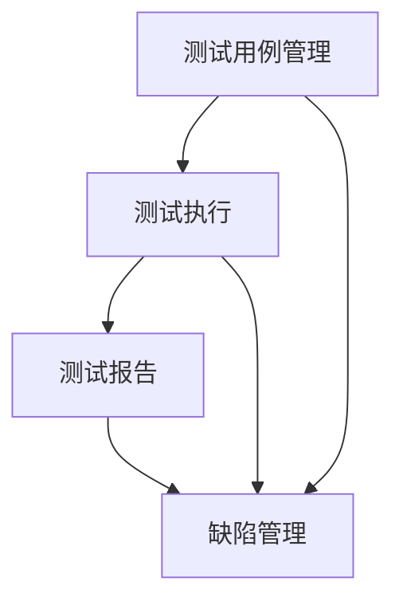

                 

### 文章标题：评测系统的可扩展性：应对不同规模LLM的策略

#### 关键词：评测系统、可扩展性、LLM、性能优化、架构设计

> 摘要：本文旨在探讨评测系统的可扩展性问题，特别是针对不同规模的语言模型（LLM）。通过对评测系统基本概念和架构的概述，我们将详细分析评测系统在不同规模LLM应用中的可扩展性需求、评估方法、优化策略以及实际应用案例。文章最后将对评测系统的性能瓶颈分析、优化实践、未来趋势和研究方向进行探讨。

----------------------------------------------------------------

## 第一部分：评测系统的可扩展性概述

### 第1章：评测系统的基本概念与架构

#### 1.1 评测系统的定义与重要性

评测系统是指在软件开发过程中，用于评估软件质量、性能、安全性和可用性的系统。它通常包括测试用例管理、执行、报告和分析等模块。评测系统的重要性在于：

- **保证软件质量**：通过系统化的测试，确保软件在交付前达到预期的质量标准。
- **提高开发效率**：自动化测试可以减少重复劳动，提高开发效率。
- **降低风险**：及时发现并修复软件中的缺陷，降低潜在的业务风险。
- **促进持续集成和持续部署**：作为CI/CD流程的一部分，评测系统能够确保代码变更后的稳定性。

#### 1.2 评测系统的基本架构

评测系统的基本架构通常包括以下几个主要组件：

- **测试用例管理**：用于创建、存储和管理测试用例。
- **测试执行**：负责执行测试用例，记录测试结果。
- **测试报告**：生成测试执行报告，包括测试覆盖率、缺陷统计等。
- **缺陷管理**：跟踪和管理测试过程中发现的缺陷。

以下是评测系统组件之间的Mermaid流程图：

#### 1.3 评测系统的常见类型

- **单点评测系统**：适用于小型项目或单个功能模块的测试。
- **分布式评测系统**：适用于大规模分布式系统的测试，能够在多个节点上并行执行测试，提高测试效率。

#### 1.4 可扩展性的需求与挑战

- **可扩展性的定义**：可扩展性是指系统在面临增长时，能够有效扩展其功能、性能和资源的能力。
- **可扩展性面临的挑战**：
  - **资源管理**：如何合理分配计算资源，确保系统在高负载下稳定运行。
  - **数据一致性**：在分布式环境下，如何保证数据的准确性和一致性。
  - **性能优化**：如何在系统扩展过程中保持高性能。

### 第2章：可扩展性评估方法

#### 2.1 可扩展性度量指标

- **系统性能指标**：包括响应时间、吞吐量、并发用户数等。
- **可扩展性度量模型**：常用的有线性可扩展性、对数可扩展性等。

#### 2.2 性能测试与调优

- **性能测试流程**：
  - **制定测试计划**：明确测试目标、测试环境、测试用例等。
  - **执行测试**：在实际环境中运行测试用例。
  - **分析结果**：对测试结果进行分析，找出性能瓶颈。

- **性能调优策略**：
  - **代码优化**：通过算法改进、代码重构等方式提升代码效率。
  - **硬件升级**：增加计算资源，如CPU、内存等。
  - **分布式架构**：采用分布式系统架构，提高系统的并行处理能力。

#### 2.3 可扩展性模型设计

- **系统需求分析**：明确系统的功能需求、性能需求和可扩展性需求。
- **可扩展性设计方案**：
  - **模块化设计**：将系统划分为多个模块，便于扩展和优化。
  - **分布式架构**：采用分布式系统架构，提高系统的扩展性和可维护性。

#### 2.4 实际案例分析

- **案例介绍**：介绍一个实际的应用案例，如电商平台、金融系统等。
- **案例分析**：
  - **评测系统设计**：分析评测系统的架构设计、关键组件和优化策略。
  - **评测系统性能表现**：分析评测系统在不同规模下的性能表现和可扩展性。
- **总结**：总结评测系统的设计经验和优化效果。

## 第二部分：不同规模LLM的可扩展性策略

### 第3章：小规模LLM的可扩展性策略

#### 3.1 小规模LLM的特点

- **模型大小**：小规模LLM的参数量相对较少，计算资源需求较低。
- **计算资源需求**：小规模LLM可以在单台机器上训练和部署。

#### 3.2 小规模LLM的优化方法

- **量化技术**：通过降低模型参数的精度来减少计算资源需求。
- **低秩近似**：通过矩阵分解等方法，将高秩矩阵近似为低秩矩阵，减少计算复杂度。

#### 3.3 小规模LLM的部署策略

- **系统架构设计**：采用简单的单机架构，便于部署和维护。
- **资源调度策略**：根据实际负载动态调整资源分配，确保系统稳定运行。

#### 3.4 小规模LLM的实际应用

- **应用案例**：介绍一个小规模LLM的实际应用案例，如客服机器人、智能问答系统等。
- **应用效果评估**：分析应用案例的效果，包括性能表现、用户体验等。

### 第4章：中规模LLM的可扩展性策略

#### 4.1 中规模LLM的特点

- **模型大小**：中规模LLM的参数量适中，计算资源需求较高。
- **计算资源需求**：中规模LLM通常需要分布式计算资源，如GPU集群。

#### 4.2 中规模LLM的优化方法

- **并行计算**：通过数据并行和模型并行等方式，提高计算效率。
- **分布式架构**：采用分布式系统架构，提高系统的并行处理能力。

#### 4.3 中规模LLM的部署策略

- **系统架构设计**：采用分布式架构，包括计算节点、存储节点和管理节点。
- **资源调度策略**：采用动态资源调度策略，根据实际负载优化资源分配。

#### 4.4 中规模LLM的实际应用

- **应用案例**：介绍一个中规模LLM的实际应用案例，如智能客服、金融风控等。
- **应用效果评估**：分析应用案例的效果，包括性能表现、用户体验等。

### 第5章：大规模LLM的可扩展性策略

#### 5.1 大规模LLM的特点

- **模型大小**：大规模LLM的参数量巨大，计算资源需求极高。
- **计算资源需求**：大规模LLM通常需要大规模分布式计算资源，如TPU集群。

#### 5.2 大规模LLM的优化方法

- **硬件加速**：利用专门的硬件设备，如TPU、FPGA等，提高计算性能。
- **混合精度训练**：通过使用混合精度（float16代替float32）来减少内存占用和计算时间。

#### 5.3 大规模LLM的部署策略

- **系统架构设计**：采用大规模分布式系统架构，包括计算节点、存储节点、管理节点和通信网络。
- **资源调度策略**：采用高级调度算法，优化资源利用率和系统性能。

#### 5.4 大规模LLM的实际应用

- **应用案例**：介绍一个大规模LLM的实际应用案例，如智能搜索、自然语言处理等。
- **应用效果评估**：分析应用案例的效果，包括性能表现、用户体验等。

## 第三部分：可扩展性实践与优化

### 第6章：评测系统的可扩展性优化实践

#### 6.1 评测系统的性能瓶颈分析

- **常见性能瓶颈**：
  - **计算资源限制**：计算资源不足导致系统响应时间延长。
  - **网络延迟**：分布式系统中的网络延迟导致通信效率降低。
  - **数据访问速度**：数据存储和读取速度较慢影响系统性能。

- **性能瓶颈分析方法**：
  - **性能测试**：通过模拟实际负载，分析系统的性能瓶颈。
  - **日志分析**：通过分析系统日志，找出性能瓶颈所在。

#### 6.2 评测系统的优化实践

- **优化策略**：
  - **代码优化**：通过优化算法和代码结构，提高系统效率。
  - **分布式架构**：采用分布式架构，提高系统的并行处理能力。
  - **缓存技术**：通过缓存技术减少数据访问次数，提高系统性能。

- **优化效果评估**：通过对比优化前后的性能数据，评估优化效果。

#### 6.3 可扩展性测试与验证

- **测试方法**：
  - **负载测试**：模拟不同负载条件下的系统性能，验证系统的可扩展性。
  - **压力测试**：通过增加负载，验证系统的稳定性和可靠性。

- **验证方法**：
  - **性能指标对比**：对比优化前后的性能指标，验证优化效果。
  - **用户体验评估**：通过用户体验调查，评估系统性能改善的程度。

### 第7章：评测系统的可扩展性未来趋势

#### 7.1 评测系统的未来发展

- **技术趋势**：
  - **分布式计算**：分布式计算技术将得到更广泛的应用，提高系统的并行处理能力。
  - **云计算**：云计算技术的普及将提供更灵活、可扩展的计算资源。
  - **边缘计算**：边缘计算将缓解中心节点的负载压力，提高系统的响应速度。

- **应用前景**：
  - **人工智能**：评测系统在人工智能领域的应用将更加广泛，如自动驾驶、智能客服等。
  - **物联网**：评测系统在物联网中的应用将提高设备互联互通的可靠性。

#### 7.2 可扩展性技术的挑战与机遇

- **技术挑战**：
  - **资源管理**：如何高效管理分布式计算资源，优化系统性能。
  - **数据一致性**：如何保证分布式环境下的数据一致性。
  - **安全性**：如何确保评测系统的安全性和可靠性。

- **机遇分析**：
  - **技术创新**：可扩展性技术的创新将推动评测系统的发展。
  - **市场需求**：随着业务的不断扩展，对评测系统的需求也将不断增加。

#### 7.3 可扩展性研究的未来方向

- **研究热点**：
  - **分布式系统架构**：研究更加高效、可靠的分布式系统架构。
  - **自适应调度算法**：研究自适应调度算法，提高系统资源利用率。

- **研究方向**：
  - **人工智能结合**：将人工智能技术应用于评测系统，提高自动化测试能力。
  - **跨领域应用**：探讨评测系统在其他领域的应用可能性，如物联网、区块链等。

### 附录

#### 附录A：评测系统的可扩展性研究资源

- **A.1 可扩展性研究文献汇总**：
  - 学术论文
  - 报告

- **A.2 可扩展性相关工具与平台**：
  - 开源工具
  - 商业平台

- **A.3 可扩展性学习资源推荐**：
  - 书籍
  - 在线课程

### 作者信息

- 作者：AI天才研究院/AI Genius Institute & 禅与计算机程序设计艺术 /Zen And The Art of Computer Programming

本文详细探讨了评测系统的可扩展性问题，针对不同规模的语言模型（LLM），提出了一系列优化策略和部署方法。通过深入分析评测系统的基本概念与架构，评估方法，以及在不同规模LLM中的应用，本文旨在为读者提供一个全面、实用的指导。未来的研究将着眼于分布式系统架构、自适应调度算法和人工智能的结合，推动评测系统在更广泛领域的应用和发展。

