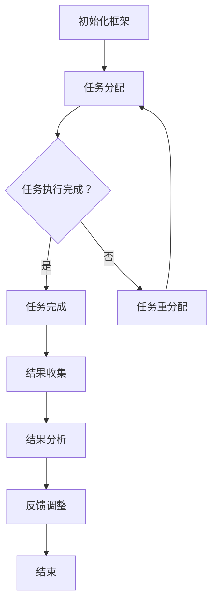

                 


### 《评测系统的多智能体协作评测框架》

#### 关键词：多智能体系统，评测系统，协作框架，智能体任务分配，协作算法，控制算法

#### 摘要：
本文旨在探讨评测系统中的多智能体协作评测框架的设计与实现。通过对多智能体系统的基本概念、评测系统的基本概念、多智能体协作评测框架的设计原理、算法实现、实际应用、性能评估与优化以及未来发展趋势的详细分析，本文将为读者提供一个全面深入的技术指南。

---

### 第一部分：引言与概述

#### 第1章：多智能体系统基础

##### 1.1 多智能体系统的定义与特点

**1.1.1 多智能体系统的定义**
多智能体系统（Multi-Agent System，MAS）是由多个智能体（Agent）通过交互合作完成任务的一种分布式计算系统。智能体是能够独立自主地完成特定任务的实体，具有感知环境、制定决策、执行动作和与其他智能体通信的能力。

**1.1.2 多智能体系统的特点**
- **分布式计算**：多智能体系统能够将复杂的任务分布在多个智能体上，通过分布式计算提高系统的效率。
- **协同工作**：智能体之间可以通过协作完成任务，共享资源和信息。
- **自适应能力**：智能体能够根据环境变化自主调整行为。
- **灵活性和可扩展性**：系统能够根据需求动态调整智能体的数量和角色。

**1.1.3 多智能体系统的研究背景与应用领域**
多智能体系统的研究起源于分布式人工智能（Distributed Artificial Intelligence，DAI），旨在通过多个智能体的协作来模拟人类社会的复杂行为。其应用领域广泛，包括供应链管理、智能交通系统、智能电网、游戏AI等。

##### 1.2 多智能体系统的体系结构

**1.2.1 个体智能体**
个体智能体是系统中的基本单元，具有独立完成任务的能力。它们通常具有自主性、反应性和主动性的特点。

**1.2.2 集体智能体**
集体智能体是由多个个体智能体组成的协同实体，能够完成更复杂的任务。它们具有合作性、共享性和协同性的特点。

**1.2.3 环境智能体**
环境智能体负责模拟和监控外部环境，为智能体提供必要的信息和反馈。

##### 1.3 多智能体系统中的通信机制

**1.3.1 直接通信机制**
直接通信机制是指智能体之间通过直接通信网络进行信息交换。这种机制适用于通信延迟较低的场景。

**1.3.2 间接通信机制**
间接通信机制是指智能体之间通过中间实体（如黑板）进行信息交换。这种机制适用于通信复杂度高、通信延迟较大的场景。

##### 1.4 多智能体系统的研究方法与框架

**1.4.1 分布式算法**
分布式算法是指将任务分布到多个智能体上，通过协同工作完成任务的算法。

**1.4.2 协同学习**
协同学习是指多个智能体通过相互协作，共同学习并优化行为策略的过程。

**1.4.3 自组织与自适应**
自组织与自适应是指智能体在没有中央控制的情况下，通过局部互动和调整行为，实现系统整体性能的提升。

#### 第2章：评测系统的基本概念

##### 2.1 评测系统的定义与目标

**2.1.1 评测系统的定义**
评测系统是一种用于评估和测量软件、系统、产品或服务性能和质量的工具。它可以通过自动化测试、性能测试、负载测试等多种方法，提供客观的评估结果。

**2.1.2 评测系统的目标**
评测系统的目标包括：提高产品质量、降低开发成本、优化系统性能、提高用户满意度等。

##### 2.2 评测系统的组成与功能

**2.2.1 评测系统的组成**
评测系统通常包括测试用例管理、测试执行、结果分析等模块。

**2.2.2 评测系统的功能模块**
- 测试用例管理：用于创建、存储和管理测试用例。
- 测试执行：用于执行测试用例，生成测试结果。
- 结果分析：用于分析测试结果，评估系统性能。

##### 2.3 评测系统的评价方法

**2.3.1 统计评价方法**
统计评价方法通过统计测试数据，计算评价指标，评估系统性能。

**2.3.2 主观评价方法**
主观评价方法通过专家评审或用户反馈，评估系统质量。

**2.3.3 混合评价方法**
混合评价方法结合统计评价方法和主观评价方法，提供更全面的评估结果。

---

在接下来的部分中，我们将深入探讨多智能体协作评测框架的设计原理、算法实现、实际应用、性能评估与优化以及未来发展趋势。通过逻辑清晰、结构紧凑的分析，我们将为读者提供一个全面的技术指南。敬请期待！ 

### 《评测系统的多智能体协作评测框架》

#### 第一部分：引言与概述

#### 第1章：多智能体系统基础

##### 1.1 多智能体系统的定义与特点

多智能体系统（MAS）是由多个智能体（Agent）通过交互合作完成任务的一种分布式计算系统。智能体是能够独立自主地完成特定任务的实体，具有感知环境、制定决策、执行动作和与其他智能体通信的能力。

**1.1.1 多智能体系统的定义**

多智能体系统（Multi-Agent System，MAS）是由多个智能体（Agent）通过交互合作完成任务的一种分布式计算系统。智能体是系统能够独立自主地完成特定任务的实体，它们具有感知环境、制定决策、执行动作和与其他智能体通信的能力。

在MAS中，智能体可以是个体智能体，也可以是集体智能体。个体智能体是MAS中的基本单元，具有独立完成任务的能力。它们通常具有自主性、反应性和主动性的特点。集体智能体是由多个个体智能体组成的协同实体，能够完成更复杂的任务。它们具有合作性、共享性和协同性的特点。

**1.1.2 多智能体系统的特点**

多智能体系统的特点主要包括：

1. **分布式计算**：多智能体系统能够将复杂的任务分布在多个智能体上，通过分布式计算提高系统的效率。这种分布式计算方式使得系统能够更好地适应大规模、复杂的问题。

2. **协同工作**：智能体之间可以通过协作完成任务，共享资源和信息。协同工作使得系统能够更高效地完成复杂任务，提高整体性能。

3. **自适应能力**：智能体能够根据环境变化自主调整行为。这种自适应能力使得系统能够更好地适应动态变化的环境。

4. **灵活性和可扩展性**：系统能够根据需求动态调整智能体的数量和角色。这种灵活性和可扩展性使得系统能够更好地适应不同的应用场景。

**1.1.3 多智能体系统的研究背景与应用领域**

多智能体系统的研究起源于分布式人工智能（Distributed Artificial Intelligence，DAI），旨在通过多个智能体的协作来模拟人类社会的复杂行为。其应用领域广泛，包括但不限于以下：

- **供应链管理**：通过多智能体系统实现供应链的智能化管理，优化库存、物流等环节。
- **智能交通系统**：通过多智能体系统实现交通流量控制、路况预测等，提高交通系统的运行效率。
- **智能电网**：通过多智能体系统实现电力系统的自动化管理，提高电力供应的稳定性和可靠性。
- **游戏AI**：通过多智能体系统实现游戏中的智能对手，提高游戏的趣味性和挑战性。
- **智能家居**：通过多智能体系统实现家居设备的智能化管理，提高生活便利性和舒适度。

##### 1.2 多智能体系统的体系结构

多智能体系统的体系结构主要包括个体智能体、集体智能体和环境智能体。

**1.2.1 个体智能体**

个体智能体是MAS中的基本单元，具有独立完成任务的能力。它们通常具有自主性、反应性和主动性的特点。

- **自主性**：个体智能体能够独立制定决策，自主执行任务。
- **反应性**：个体智能体能够根据环境变化做出响应，调整自身行为。
- **主动性**：个体智能体能够主动探索环境，寻找解决问题的方法。

**1.2.2 集体智能体**

集体智能体是由多个个体智能体组成的协同实体，能够完成更复杂的任务。它们具有合作性、共享性和协同性的特点。

- **合作性**：集体智能体之间能够相互协作，共同完成任务。
- **共享性**：集体智能体能够共享资源和信息，提高系统效率。
- **协同性**：集体智能体能够协同工作，实现系统整体性能的提升。

**1.2.3 环境智能体**

环境智能体负责模拟和监控外部环境，为智能体提供必要的信息和反馈。环境智能体可以是现实环境中的物理实体，也可以是虚拟环境中的抽象实体。

- **信息提供**：环境智能体为智能体提供环境信息，帮助智能体制定决策。
- **反馈机制**：环境智能体对智能体的行为进行反馈，帮助智能体调整自身行为。

##### 1.3 多智能体系统中的通信机制

多智能体系统中的通信机制主要包括直接通信机制和间接通信机制。

**1.3.1 直接通信机制**

直接通信机制是指智能体之间通过直接通信网络进行信息交换。这种机制适用于通信延迟较低的场景。

- **同步通信**：智能体之间按照固定的时间间隔进行通信，确保信息的一致性。
- **异步通信**：智能体之间不按照固定的时间间隔进行通信，根据需要实时进行通信。

**1.3.2 间接通信机制**

间接通信机制是指智能体之间通过中间实体（如黑板）进行信息交换。这种机制适用于通信复杂度高、通信延迟较大的场景。

- **黑板模型**：智能体将信息写入黑板，其他智能体从黑板上读取信息。
- **事件模型**：智能体通过事件机制进行通信，触发相应的事件处理。

##### 1.4 多智能体系统的研究方法与框架

多智能体系统的研究方法与框架主要包括分布式算法、协同学习、自组织与自适应。

**1.4.1 分布式算法**

分布式算法是指将任务分布到多个智能体上，通过协同工作完成任务的算法。分布式算法可以提高系统的效率，降低通信延迟。

- **任务分配算法**：将任务合理地分配到各个智能体上，确保任务的均衡性。
- **协调算法**：智能体之间通过通信和协调，确保任务的同步和一致性。

**1.4.2 协同学习**

协同学习是指多个智能体通过相互协作，共同学习并优化行为策略的过程。协同学习可以提高智能体的适应性和系统整体性能。

- **基于模型的协同学习**：通过构建模型，智能体之间进行信息共享和策略优化。
- **基于行为的协同学习**：通过观察和模仿其他智能体的行为，智能体之间进行策略优化。

**1.4.3 自组织与自适应**

自组织与自适应是指智能体在没有中央控制的情况下，通过局部互动和调整行为，实现系统整体性能的提升。自组织与自适应可以提高系统的灵活性和适应性。

- **自组织**：智能体通过局部互动，自发形成组织和结构。
- **自适应**：智能体根据环境变化，调整自身行为和策略。

---

在下一部分，我们将探讨评测系统的基本概念，包括其定义、目标、组成和功能，以及不同的评价方法。这将为我们理解多智能体协作评测框架提供基础。敬请期待！ 

### 《评测系统的多智能体协作评测框架》

#### 第二部分：评测系统的基本概念

#### 第2章：评测系统的基本概念

##### 2.1 评测系统的定义与目标

**2.1.1 评测系统的定义**

评测系统（Evaluation System）是一种用于评估和测量软件、系统、产品或服务性能和质量的工具。它通过自动化测试、性能测试、负载测试等多种方法，提供客观的评估结果。评测系统的目的是确保软件或系统的质量，提高用户体验，降低维护成本。

**2.1.2 评测系统的目标**

评测系统的目标主要包括以下几点：

1. **提高产品质量**：通过全面的评测，发现和修复缺陷，提高软件或系统的可靠性、稳定性和性能。
2. **降低开发成本**：通过自动化测试和性能优化，减少人工测试的时间和成本。
3. **优化系统性能**：通过性能测试，发现瓶颈和性能问题，提供优化建议。
4. **提高用户满意度**：通过客观的评测结果，确保软件或系统满足用户需求，提高用户满意度。
5. **支持决策制定**：提供评测数据，为项目管理和决策提供依据。

##### 2.2 评测系统的组成与功能

**2.2.1 评测系统的组成**

评测系统通常由以下模块组成：

1. **测试用例管理模块**：用于创建、存储和管理测试用例。测试用例是评测系统的核心，它定义了具体的测试操作和预期结果。
2. **测试执行模块**：用于执行测试用例，生成测试结果。测试执行模块通常包括自动化测试工具，能够自动执行测试用例，记录测试结果。
3. **结果分析模块**：用于分析测试结果，生成评估报告。结果分析模块可以对测试结果进行统计、分析和可视化，帮助开发团队了解软件或系统的质量状况。
4. **反馈机制**：用于将测试结果反馈给开发团队，促进问题的发现和修复。反馈机制可以是自动化的，也可以是人工的。

**2.2.2 评测系统的功能模块**

1. **测试用例管理**：测试用例管理模块负责创建、存储和管理测试用例。测试用例通常包括测试场景、输入数据、预期结果和执行步骤等。测试用例管理模块需要支持批量创建、修改和删除测试用例，并提供测试用例的版本控制功能。

2. **测试执行**：测试执行模块负责执行测试用例，生成测试结果。测试执行模块通常支持自动化测试，能够自动执行测试用例，记录测试结果。测试结果包括测试通过数、失败数、错误数等。测试执行模块还需要支持手动测试，允许测试人员手动执行测试用例。

3. **结果分析**：结果分析模块负责分析测试结果，生成评估报告。评估报告通常包括测试覆盖率、缺陷分布、性能指标等。结果分析模块需要能够对测试结果进行统计、分析和可视化，帮助开发团队了解软件或系统的质量状况。

4. **反馈机制**：反馈机制用于将测试结果反馈给开发团队，促进问题的发现和修复。反馈机制可以是自动化的，例如通过邮件或即时通讯工具发送测试结果；也可以是人工的，例如测试人员将测试结果报告给开发团队。

##### 2.3 评测系统的评价方法

**2.3.1 统计评价方法**

统计评价方法是通过统计测试数据，计算评价指标，评估系统性能的方法。常用的统计评价方法包括：

1. **缺陷密度**：缺陷密度是缺陷数与代码行数的比值，用于衡量软件或系统的质量。
2. **测试覆盖率**：测试覆盖率是测试用例执行数与总测试用例数的比值，用于衡量测试的全面性。
3. **响应时间**：响应时间是系统响应请求的时间，用于衡量系统性能。

**2.3.2 主观评价方法**

主观评价方法是通过专家评审或用户反馈，评估系统质量的方法。主观评价方法通常包括：

1. **专家评审**：专家评审是由专业的评审人员对软件或系统进行评估，根据评审标准给出评分。
2. **用户反馈**：用户反馈是通过用户使用软件或系统后的体验和评价，收集用户对软件或系统的满意度。

**2.3.3 混合评价方法**

混合评价方法是将统计评价方法和主观评价方法结合，提供更全面的评估结果。混合评价方法通常包括：

1. **缺陷密度与专家评审结合**：将缺陷密度作为客观指标，专家评审作为主观指标，综合评估软件或系统的质量。
2. **测试覆盖率和用户反馈结合**：将测试覆盖率作为客观指标，用户反馈作为主观指标，综合评估测试的全面性和用户的满意度。

---

在下一部分，我们将探讨多智能体协作评测框架的设计原理，包括协作机制、共识机制和调度机制的设计。这将为我们理解多智能体协作评测框架的核心思想提供基础。敬请期待！ 

### 《评测系统的多智能体协作评测框架》

#### 第三部分：多智能体协作评测框架的设计原理

#### 第3章：多智能体协作评测框架的设计原理

##### 3.1 多智能体协作评测框架的核心思想

多智能体协作评测框架的核心思想是通过多个智能体的协作，实现评测任务的自动化、高效化和智能化。其核心在于以下几个方面：

1. **分布式计算**：将评测任务分布到多个智能体上，通过分布式计算提高评测效率。
2. **协作机制**：智能体之间通过协作机制，共享信息和资源，共同完成任务。
3. **共识机制**：智能体之间通过共识机制，确保评测结果的一致性和可靠性。
4. **调度机制**：智能体之间通过调度机制，合理分配任务，优化资源利用。

**3.1.1 协作机制设计**

协作机制是智能体之间通过通信和协作，共同完成任务的关键。以下是协作机制设计的几个关键点：

1. **任务分配**：智能体之间通过任务分配机制，将评测任务分配到各个智能体上。任务分配可以根据智能体的能力和负载情况进行动态调整，确保任务的均衡性和高效性。

2. **信息共享**：智能体之间通过信息共享机制，共享评测过程中产生的数据和信息。信息共享可以提高智能体的协同工作能力，减少冗余信息和数据传输。

3. **通信协议**：智能体之间通过通信协议进行信息交换。通信协议可以选择直接通信或间接通信，根据具体场景进行选择。

**3.1.2 共识机制设计**

共识机制是确保智能体之间评测结果一致性和可靠性的关键。以下是共识机制设计的几个关键点：

1. **一致性算法**：智能体之间通过一致性算法，确保评测结果的正确性和一致性。一致性算法可以是基于分布式计算的一致性算法，如Paxos算法、Raft算法等。

2. **结果验证**：智能体之间通过结果验证机制，对评测结果进行验证。结果验证可以确保评测结果的准确性和可靠性，避免错误结果的传播。

**3.1.3 调度机制设计**

调度机制是智能体之间合理分配任务，优化资源利用的关键。以下是调度机制设计的几个关键点：

1. **任务调度策略**：智能体之间通过任务调度策略，根据智能体的能力和负载情况，合理分配任务。任务调度策略可以基于负载均衡、最小化响应时间等原则进行设计。

2. **资源分配**：智能体之间通过资源分配机制，确保任务的顺利执行。资源分配可以包括计算资源、存储资源、网络资源等。

3. **故障恢复**：智能体之间通过故障恢复机制，处理评测过程中出现的异常情况。故障恢复可以包括任务重启、资源重新分配等。

**3.2 多智能体协作评测框架的关键技术**

多智能体协作评测框架的关键技术包括智能体的任务分配与协同、状态监控与评估、信息共享与通信。

**3.2.1 智能体的任务分配与协同**

1. **任务分配算法**：智能体的任务分配算法用于将评测任务分配到各个智能体上。任务分配算法可以根据任务的性质、智能体的能力和负载情况等因素进行设计。常见的任务分配算法包括随机分配、最小化负载分配等。

2. **协同算法**：智能体的协同算法用于确保智能体之间能够高效协作，共同完成任务。协同算法可以根据任务的特点和智能体的协作需求进行设计。常见的协同算法包括分布式一致性算法、分布式搜索算法等。

**3.2.2 智能体的状态监控与评估**

1. **状态监控**：智能体的状态监控用于实时监控智能体的运行状态，包括资源使用情况、任务执行进度等。状态监控可以通过收集智能体的日志信息、性能指标等数据进行。

2. **评估指标**：智能体的评估指标用于评估智能体的性能和效率。评估指标可以包括任务完成时间、资源利用率、响应时间等。评估指标的设计需要考虑评测任务的特点和智能体的性能。

**3.2.3 智能体的信息共享与通信**

1. **信息共享机制**：智能体的信息共享机制用于确保智能体之间能够高效共享信息。信息共享机制可以包括分布式存储、分布式缓存等。

2. **通信协议**：智能体的通信协议用于智能体之间的通信。通信协议可以选择基于TCP/IP协议、WebSocket协议等。

---

在下一部分，我们将详细探讨多智能体协作评测框架的算法实现，包括任务分配算法、协作算法和控制算法的设计与实现。这将为我们理解多智能体协作评测框架的算法原理提供深入分析。敬请期待！ 

### 《评测系统的多智能体协作评测框架》

#### 第四部分：多智能体协作评测框架的算法实现

#### 第4章：多智能体协作评测框架的算法实现

##### 4.1 任务分配算法设计

任务分配算法是多智能体协作评测框架中的核心算法之一，它的主要目标是根据智能体的能力和负载情况，将评测任务合理地分配到各个智能体上，以确保任务的均衡性和高效性。

**4.1.1 任务分配算法原理**

任务分配算法的原理是基于每个智能体的能力（如处理速度、资源占用等）和当前负载情况（如正在处理的任务数、资源利用率等），动态地为智能体分配任务。任务分配算法可以分为以下几个步骤：

1. **智能体能力评估**：每个智能体定期向中心调度器报告其能力，如处理速度、内存占用、网络带宽等。中心调度器根据这些信息评估智能体的能力。

2. **任务需求评估**：每个智能体向中心调度器报告其当前的任务需求，如待处理的任务数、任务类型等。中心调度器根据这些信息评估任务需求。

3. **任务分配决策**：中心调度器根据智能体的能力和任务需求，动态地为智能体分配任务。任务分配决策可以基于最小化负载、最大化智能体利用等原则。

4. **任务分配执行**：智能体收到任务分配后，开始执行任务。执行过程中，智能体会实时报告任务进度和状态。

**4.1.2 任务分配算法伪代码**

以下是一个简单的任务分配算法伪代码示例：

```python
def task_assignment(agents, tasks):
    assigned_tasks = {}
    for task in tasks:
        best_agent = None
        best_score = float('inf')
        for agent in agents:
            score = agent.get_score()
            if score < best_score:
                best_score = score
                best_agent = agent
        assigned_tasks[task] = best_agent
        best_agent.assign_task(task)
    return assigned_tasks
```

**4.1.3 任务分配算法分析**

任务分配算法的时间复杂度主要取决于智能体的数量和任务的数量。在最坏情况下，任务分配算法需要遍历所有的智能体和任务，其时间复杂度为O(n*m)，其中n为智能体数量，m为任务数量。在实际应用中，可以通过优化算法和数据结构，降低时间复杂度。

##### 4.2 协作算法设计

协作算法是多智能体协作评测框架中的另一个关键算法，它的主要目标是确保智能体之间能够高效、协调地完成任务。

**4.2.1 协作算法原理**

协作算法的原理是基于每个智能体的任务进度和状态，动态地调整智能体的协作策略。协作算法可以分为以下几个步骤：

1. **任务进度监控**：每个智能体定期向中心调度器报告其任务进度和状态。

2. **协作决策**：中心调度器根据智能体的任务进度和状态，决定智能体之间的协作策略。协作策略可以包括任务共享、资源交换、任务优先级调整等。

3. **协作执行**：智能体根据协作策略调整自身的行为，以实现任务的高效协作。

**4.2.2 协作算法伪代码**

以下是一个简单的协作算法伪代码示例：

```python
def cooperation(agents):
    while True:
        for agent in agents:
            agent.report_progress()
        decisions = make_cooperation_decisions(agents)
        for agent in agents:
            agent.execute_decision(decisions[agent])
```

**4.2.3 协作算法分析**

协作算法的时间复杂度主要取决于智能体的数量和任务的数量。在最坏情况下，协作算法需要遍历所有的智能体，其时间复杂度为O(n)，其中n为智能体数量。在实际应用中，可以通过优化算法和数据结构，降低时间复杂度。

##### 4.3 控制算法设计

控制算法是多智能体协作评测框架中的最后一个关键算法，它的主要目标是确保智能体之间的协调和资源管理。

**4.3.1 控制算法原理**

控制算法的原理是基于中心调度器对整个系统的全局视图，动态地调整智能体的行为和资源分配，以确保系统的稳定性和高效性。控制算法可以分为以下几个步骤：

1. **系统状态监控**：中心调度器定期监控整个系统的状态，包括智能体的负载、任务进度、资源利用率等。

2. **控制决策**：中心调度器根据系统的状态，决定智能体的控制策略。控制策略可以包括任务重启、资源重新分配、智能体重启等。

3. **控制执行**：中心调度器向智能体发送控制指令，智能体根据指令调整自身行为。

**4.3.2 控制算法伪代码**

以下是一个简单的控制算法伪代码示例：

```python
def control(agents, scheduler):
    while True:
        system_state = scheduler.get_system_state(agents)
        control_decisions = make_control_decisions(system_state)
        for agent in agents:
            agent.execute_control_decision(control_decisions[agent])
```

**4.3.3 控制算法分析**

控制算法的时间复杂度主要取决于智能体的数量和系统的状态变化频率。在最坏情况下，控制算法需要遍历所有的智能体和系统状态，其时间复杂度为O(n*m)，其中n为智能体数量，m为系统状态变化的次数。在实际应用中，可以通过优化算法和数据结构，降低时间复杂度。

---

在下一部分，我们将探讨多智能体协作评测框架的实际应用，包括图像评测、文本评测和音频评测等。这将为我们了解多智能体协作评测框架在不同场景下的应用提供实际案例。敬请期待！ 

### 《评测系统的多智能体协作评测框架》

#### 第五部分：多智能体协作评测框架的实际应用

#### 第5章：多智能体协作评测框架的实际应用

##### 5.1 多智能体协作评测框架在评测系统中的应用场景

多智能体协作评测框架在评测系统中的应用场景非常广泛，包括但不限于图像评测、文本评测和音频评测。以下是对这些应用场景的详细介绍：

**5.1.1 图像评测**

在图像评测中，多智能体协作评测框架可以用于图像分类、目标检测、图像分割等任务。具体应用场景包括：

- **图像分类**：将图像分为不同的类别，如动物、植物、车辆等。多智能体协作评测框架可以通过多个智能体的协同工作，提高图像分类的准确性和效率。
- **目标检测**：识别图像中的目标对象，并标注其位置。多智能体协作评测框架可以优化目标检测的准确率和响应速度。
- **图像分割**：将图像划分为不同的区域，如前景和背景。多智能体协作评测框架可以提升图像分割的精度和实时性。

**5.1.2 文本评测**

在文本评测中，多智能体协作评测框架可以用于文本分类、情感分析、文本生成等任务。具体应用场景包括：

- **文本分类**：将文本分为不同的类别，如新闻、论坛、博客等。多智能体协作评测框架可以通过智能体的协同工作，提高文本分类的准确性和效率。
- **情感分析**：分析文本的情感倾向，如正面、负面、中性等。多智能体协作评测框架可以提升情感分析的准确性和稳定性。
- **文本生成**：根据输入的文本或关键词，生成相关的文本内容。多智能体协作评测框架可以优化文本生成的多样性和连贯性。

**5.1.3 音频评测**

在音频评测中，多智能体协作评测框架可以用于音频分类、语音识别、音频增强等任务。具体应用场景包括：

- **音频分类**：将音频分为不同的类别，如音乐、语音、噪声等。多智能体协作评测框架可以通过智能体的协同工作，提高音频分类的准确性和效率。
- **语音识别**：将语音信号转换为对应的文本内容。多智能体协作评测框架可以提升语音识别的准确率和响应速度。
- **音频增强**：对音频信号进行增强，如去噪、回声消除等。多智能体协作评测框架可以优化音频增强的效果和实时性。

##### 5.2 多智能体协作评测框架的开发环境搭建

为了在图像评测、文本评测和音频评测等场景中应用多智能体协作评测框架，需要搭建相应的开发环境。以下是开发环境的搭建步骤：

**5.2.1 开发环境需求**

- **操作系统**：Linux或Windows
- **编程语言**：Python
- **框架与库**：TensorFlow、PyTorch、Scikit-learn、SpeechRecognition等

**5.2.2 开发环境搭建步骤**

1. 安装操作系统：根据需求选择Linux或Windows操作系统，并进行安装。

2. 安装Python环境：在操作系统上安装Python环境，建议使用Python 3.8或更高版本。

3. 安装相关库和框架：使用pip工具安装TensorFlow、PyTorch、Scikit-learn、SpeechRecognition等库和框架。

   ```shell
   pip install tensorflow
   pip install torch
   pip install scikit-learn
   pip install SpeechRecognition
   ```

4. 配置开发环境：配置Python的虚拟环境，以便更好地管理和隔离项目依赖。

   ```shell
   python -m venv myenv
   source myenv/bin/activate
   ```

5. 测试开发环境：编写简单的测试代码，验证开发环境是否正常工作。

   ```python
   import tensorflow
   import torch
   import scikit_learn
   import SpeechRecognition
   ```

**5.2.3 开发环境配置**

在开发过程中，可能需要对环境进行进一步配置，以支持特定功能的开发和调试。以下是一些常见配置：

- **CUDA支持**：如果使用GPU进行深度学习模型的训练和推理，需要安装CUDA和相关驱动，并配置Python环境。

  ```shell
  pip install tensorflow-gpu
  ```

- **语音识别支持**：如果使用语音识别库（如SpeechRecognition），需要安装相应的语音识别引擎（如Google语音识别API）。

  ```shell
  pip install SpeechRecognition
  ```

- **其他配置**：根据项目的具体需求，可能需要安装其他库和框架，如OpenCV（图像处理）、NumPy（数值计算）等。

---

在下一部分，我们将详细探讨多智能体协作评测框架的源代码实现与解读，包括源代码结构、关键模块实现和代码解读与分析。这将为我们了解多智能体协作评测框架的实现细节提供深入分析。敬请期待！ 

### 《评测系统的多智能体协作评测框架》

#### 第六部分：多智能体协作评测框架的源代码实现与解读

#### 第5章：多智能体协作评测框架的源代码实现与解读

##### 5.3 多智能体协作评测框架的源代码实现与解读

**5.3.1 源代码结构**

多智能体协作评测框架的源代码结构主要包括以下几个部分：

1. **Agent类**：定义了智能体的基本属性和方法，包括任务分配、任务执行、状态监控等。
2. **Scheduler类**：定义了中心调度器的功能，包括任务分配、协作决策、控制决策等。
3. **Task类**：定义了评测任务的基本属性和方法，包括任务类型、任务状态、任务结果等。
4. **Communicator类**：定义了智能体之间的通信机制，包括直接通信和间接通信等。
5. **Evaluator类**：定义了评测系统的功能，包括测试用例管理、测试执行、结果分析等。

**5.3.2 关键模块实现**

以下是多智能体协作评测框架中的几个关键模块的实现：

**Agent类**

```python
class Agent:
    def __init__(self, id, capabilities):
        self.id = id
        self.capabilities = capabilities
        self.tasks = []
        self.state = "idle"

    def assign_task(self, task):
        self.tasks.append(task)
        self.state = "busy"

    def execute_task(self):
        for task in self.tasks:
            if task.status == "pending":
                task.execute()
                self.state = "idle"

    def monitor_state(self):
        for task in self.tasks:
            if task.status != "completed":
                self.state = "busy"
                break
        if self.state == "idle":
            self.search_for_new_task()

    def search_for_new_task(self):
        # Implement the logic to search for a new task
        pass
```

**Scheduler类**

```python
class Scheduler:
    def __init__(self):
        self.agents = []
        self.tasks = []

    def add_agent(self, agent):
        self.agents.append(agent)

    def assign_task(self, task):
        best_agent = None
        best_score = float('inf')
        for agent in self.agents:
            score = agent.get_score()
            if score < best_score:
                best_score = score
                best_agent = agent
        best_agent.assign_task(task)

    def make_cooperation_decisions(self, agents):
        # Implement the logic to make cooperation decisions
        pass

    def make_control_decisions(self, system_state):
        # Implement the logic to make control decisions
        pass
```

**Task类**

```python
class Task:
    def __init__(self, id, type, status):
        self.id = id
        self.type = type
        self.status = status

    def execute(self):
        # Implement the logic to execute the task
        pass

    def set_status(self, status):
        self.status = status
```

**Communicator类**

```python
class Communicator:
    def __init__(self, agents):
        self.agents = agents

    def send_message(self, sender, recipient, message):
        recipient.receive_message(sender, message)

    def receive_message(self, sender, message):
        # Implement the logic to receive messages
        pass
```

**Evaluator类**

```python
class Evaluator:
    def __init__(self):
        self.test_cases = []

    def add_test_case(self, test_case):
        self.test_cases.append(test_case)

    def execute_test_cases(self):
        for test_case in self.test_cases:
            test_case.execute()

    def analyze_results(self):
        # Implement the logic to analyze test results
        pass
```

**5.3.3 代码解读与分析**

1. **Agent类**：Agent类定义了智能体的基本功能，包括任务分配、任务执行和状态监控。在执行任务时，智能体会根据任务状态执行相应的操作。状态监控用于检测任务完成情况，并决定是否继续搜索新的任务。

2. **Scheduler类**：Scheduler类是中心调度器，负责智能体的任务分配和决策。任务分配基于智能体的能力和负载情况，以实现任务的均衡性。协作决策和控制决策用于调整智能体的协作策略和系统状态。

3. **Task类**：Task类定义了评测任务的基本属性和方法，包括任务类型、任务状态和任务结果。任务执行和状态设置用于更新任务的执行情况。

4. **Communicator类**：Communicator类定义了智能体之间的通信机制，包括发送消息和接收消息。通信机制用于实现智能体之间的信息交换。

5. **Evaluator类**：Evaluator类定义了评测系统的功能，包括测试用例管理和测试执行。测试用例管理和测试执行用于生成评测结果，并进行分析。

通过以上源代码实现与解读，我们可以了解到多智能体协作评测框架的基本架构和功能实现。在实际开发过程中，可以根据具体需求对代码进行扩展和优化，以实现更高效的评测系统。在下一部分，我们将探讨多智能体协作评测框架的性能评估与优化。敬请期待！ 

### 《评测系统的多智能体协作评测框架》

#### 第七部分：多智能体协作评测框架的性能评估与优化

#### 第6章：多智能体协作评测框架的性能评估与优化

##### 6.1 性能评估指标设计

性能评估是多智能体协作评测框架的重要环节，通过评估框架的性能，可以判断其是否满足实际需求。以下是一些常见的性能评估指标：

**6.1.1 评估指标定义**

1. **响应时间**：从接收到评测请求到完成评测的时间。响应时间越短，表示系统的性能越好。
2. **吞吐量**：单位时间内系统完成的评测任务数量。吞吐量越高，表示系统的性能越强。
3. **准确率**：评测结果与实际结果的一致性。准确率越高，表示系统的评测精度越高。
4. **资源利用率**：系统资源（如CPU、内存、网络等）的利用率。资源利用率越高，表示系统的资源利用效率越高。
5. **可扩展性**：系统在增加智能体或任务数量时的性能表现。可扩展性越好，表示系统越能适应大规模应用。

**6.1.2 评估指标计算方法**

1. **响应时间**：响应时间可以通过计时器记录评测任务的开始和结束时间，计算两者之间的差值得到。
2. **吞吐量**：吞吐量可以通过单位时间内的评测任务数量计算得到，例如每分钟完成的任务数量。
3. **准确率**：准确率可以通过比对评测结果与实际结果的匹配度计算得到，例如正确识别的图像数量与总图像数量的比值。
4. **资源利用率**：资源利用率可以通过系统监控工具实时获取CPU、内存、网络等资源的利用率数据。
5. **可扩展性**：可扩展性可以通过在不同规模的测试环境下运行系统，比较其性能表现来判断。

##### 6.2 性能评估实验设计

为了全面评估多智能体协作评测框架的性能，需要进行一系列实验。以下是一个典型的实验设计步骤：

**6.2.1 实验环境设置**

1. **硬件环境**：配置足够的计算资源，如服务器、GPU等。
2. **软件环境**：搭建多智能体协作评测框架的开发环境，包括Python、TensorFlow、PyTorch等。
3. **评测任务**：选择典型的评测任务，如图像分类、文本情感分析、语音识别等。

**6.2.2 实验数据集选择**

选择具有代表性的数据集进行实验，例如ImageNet、IMDB、LibriSpeech等。数据集应具有足够的规模和多样性，以测试框架在不同任务和场景下的性能。

**6.2.3 实验流程设计**

1. **准备阶段**：搭建实验环境，配置好硬件和软件资源。
2. **初始化阶段**：初始化智能体和任务分配，确保系统处于稳定状态。
3. **评测阶段**：运行评测任务，记录响应时间、吞吐量、准确率、资源利用率和可扩展性等性能指标。
4. **结果分析阶段**：分析实验数据，评估多智能体协作评测框架的性能。

##### 6.3 性能评估结果分析

通过对实验结果的分析，可以评估多智能体协作评测框架的性能。以下是一些关键分析点：

**6.3.1 评测精度分析**

评测精度是评估评测系统性能的重要指标。通过比较评测结果与实际结果的匹配度，可以判断框架的准确率。例如，在图像分类任务中，可以比较预测类别与实际类别的一致性。如果准确率较高，说明框架在评测任务上具有较好的性能。

**6.3.2 评测速度分析**

评测速度是评估系统响应能力的指标。通过记录响应时间，可以分析系统的处理速度。例如，在图像分类任务中，可以计算每个图像分类的响应时间。如果响应时间较短，说明系统具有较高的处理速度。

**6.3.3 稳健性分析**

评测系统的稳定性是其在实际应用中的关键因素。通过实验结果，可以评估系统在不同负载条件下的稳定性。例如，可以在不同数量的智能体和任务下运行系统，观察系统的响应时间和准确率。如果系统在负载变化时性能稳定，说明其具有较强的稳定性。

##### 6.4 性能优化策略探讨

为了提高多智能体协作评测框架的性能，可以采取以下优化策略：

**6.4.1 算法优化**

1. **任务分配算法优化**：通过改进任务分配算法，提高任务的均衡性和智能体利用率。
2. **协作算法优化**：优化智能体之间的协作策略，提高任务执行的效率。
3. **控制算法优化**：优化系统控制策略，提高系统的稳定性和响应速度。

**6.4.2 系统优化**

1. **资源优化**：合理分配系统资源，提高资源利用率，减少资源竞争。
2. **网络优化**：优化智能体之间的通信网络，减少通信延迟和带宽占用。
3. **分布式存储优化**：优化分布式存储系统，提高数据读写速度和可靠性。

**6.4.3 智能体优化**

1. **智能体能力提升**：通过提升智能体的计算能力和通信能力，提高系统的处理速度和稳定性。
2. **智能体适应性优化**：提高智能体的自适应能力，使其能够更好地应对不同的任务和环境变化。

通过以上性能评估与优化策略，可以显著提升多智能体协作评测框架的性能，满足实际应用需求。在下一部分，我们将探讨多智能体协作评测框架的展望与未来发展趋势。敬请期待！ 

### 《评测系统的多智能体协作评测框架》

#### 第八部分：多智能体协作评测框架的展望与未来发展趋势

#### 第7章：多智能体协作评测框架的展望与未来发展趋势

##### 7.1 多智能体协作评测框架的挑战与机遇

随着人工智能技术的不断发展，多智能体协作评测框架在评测系统中的应用前景十分广阔。然而，在推广和应用过程中，也面临着一系列挑战与机遇。

**7.1.1 技术挑战**

1. **智能体能力限制**：当前智能体的计算能力、存储能力和通信能力有限，制约了多智能体协作评测框架的性能和扩展性。
2. **分布式计算复杂性**：多智能体系统涉及大量的分布式计算和通信，如何高效地管理和调度智能体是一个技术难题。
3. **数据隐私与安全**：在多智能体协作评测过程中，涉及大量的敏感数据和隐私信息，如何确保数据的安全性和隐私性是一个重要挑战。
4. **实时性与准确性**：在高速率和高并发的环境下，如何确保评测结果的实时性和准确性是一个关键技术问题。

**7.1.2 应用机遇**

1. **大数据分析**：随着大数据技术的发展，多智能体协作评测框架可以应用于大规模数据的分析，提高数据处理的效率和准确性。
2. **智能交通系统**：在智能交通系统中，多智能体协作评测框架可以用于实时监控和分析交通流量，优化交通管理。
3. **智能制造**：在智能制造领域，多智能体协作评测框架可以用于实时监测和评估生产线的性能，提高生产效率和产品质量。
4. **智能医疗**：在智能医疗领域，多智能体协作评测框架可以用于实时分析和评估医疗数据，辅助医生进行诊断和治疗。

##### 7.2 多智能体协作评测框架的未来发展趋势

随着人工智能技术的不断进步，多智能体协作评测框架将迎来新的发展趋势。

**7.2.1 领域拓展**

1. **跨领域应用**：多智能体协作评测框架将不仅限于特定的领域，而是逐渐向更多领域拓展，如金融、物流、教育等。
2. **多模态融合**：多智能体协作评测框架将支持多模态数据的融合，如文本、图像、音频等，实现更全面的数据分析。
3. **自适应系统**：多智能体协作评测框架将具备自适应能力，能够根据任务和环境的变化，动态调整智能体的行为和策略。

**7.2.2 技术融合**

1. **深度学习与多智能体系统**：深度学习技术的引入将进一步提升多智能体协作评测框架的智能性和自学习能力。
2. **区块链技术**：区块链技术的应用将提高多智能体协作评测框架的数据安全性、隐私保护和可信度。
3. **边缘计算**：边缘计算技术的应用将降低多智能体协作评测框架的计算延迟，提高系统的实时性和响应速度。

**7.2.3 智能化提升**

1. **自动化决策**：通过引入先进的决策算法，多智能体协作评测框架将实现更智能的自动化决策。
2. **自组织能力**：多智能体协作评测框架将具备更强的自组织能力，能够在没有中央控制的情况下，自主地完成任务。
3. **个性化评测**：多智能体协作评测框架将支持个性化的评测需求，根据用户的特点和需求，提供定制化的评测服务。

通过以上展望与未来发展趋势，我们可以看到多智能体协作评测框架在评测系统中的应用前景十分广阔。随着技术的不断进步，多智能体协作评测框架将迎来更加广泛的应用，为各类评测任务提供高效的解决方案。在附录部分，我们将提供多智能体协作评测框架的相关资源，供读者进一步学习和研究。敬请期待！ 

### 附录 A：多智能体协作评测框架相关资源

为了帮助读者更深入地了解多智能体协作评测框架，本附录提供了以下相关资源：

**A.1 学术论文**

- **"Multi-Agent Systems: A Survey" by Michael Wooldridge**：这篇论文对多智能体系统的研究进行了全面的综述，包括系统结构、通信机制、算法和应用等。

- **"Distributed Artificial Intelligence: Decentralized Decision-Making in Multi-Agent Systems" by Nicklas Björnsson and Patrik Haslum**：该论文探讨了分布式人工智能中多智能体系统的决策机制，包括协同学习和自适应算法。

- **"A Survey on Multi-Agent Reinforcement Learning" by Vincent Balduzzi and W. John Spear**：这篇论文综述了多智能体强化学习的研究进展，包括协同策略、分布式训练和策略优化。

**A.2 开源框架与工具**

- **PyTorch**：一个流行的深度学习框架，支持多智能体系统的研究和开发。

- **TensorFlow**：另一个流行的深度学习框架，提供了丰富的工具和库，方便多智能体系统的开发。

- **Gazebo**：一个开源的模拟器，用于仿真多智能体系统在不同环境下的交互行为。

- **Rosetta**：一个用于多智能体系统研究的开源平台，提供了智能体建模、仿真和评估的工具。

**A.3 在线课程与教程**

- **"Multi-Agent Systems" by University of Yale**：耶鲁大学提供的一门在线课程，涵盖了多智能体系统的基本概念、算法和应用。

- **"Distributed Artificial Intelligence" by University of Edinbugh**：爱丁堡大学提供的一门在线课程，探讨了分布式人工智能的基础知识和应用。

- **"Introduction to Multi-Agent Systems" by MIT OpenCourseWare**：麻省理工学院提供的一门在线课程，介绍了多智能体系统的基础概念和关键技术。

通过以上资源，读者可以进一步学习多智能体协作评测框架的相关知识，为实际应用和研究提供指导。

### 附录 B：多智能体协作评测框架 Mermaid 流程图

以下是一个简单的 Mermaid 流程图，用于描述多智能体协作评测框架的基本工作流程：



这个流程图展示了多智能体协作评测框架的基本工作流程，包括任务分配、任务执行、结果收集、结果分析和反馈调整等关键步骤。通过这个流程图，可以直观地理解多智能体协作评测框架的工作原理。在实际开发过程中，可以根据需求对这个流程图进行扩展和优化。

