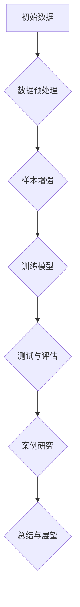

                 

# 《评测系统的少样本学习快速适应框架》

> 关键词：评测系统、少样本学习、快速适应、框架、测试评估

摘要：本文针对评测系统的少样本学习问题，提出了一种快速适应的框架。本文首先介绍了少样本学习的背景和意义，然后对相关概念和理论进行了详细阐述。接着，文章重点讨论了数据预处理和样本增强的方法，以及快速适应框架的设计与实现。最后，通过测试与评估和案例研究，验证了框架的有效性和实用性。

### 目录大纲

# 《评测系统的少样本学习快速适应框架》

## 第1章 引言与背景

### 1.1 书籍引言

随着人工智能技术的快速发展，评测系统在各个领域得到了广泛应用。评测系统通常用于对用户行为、数据质量、模型性能等进行评估。然而，在实际应用中，评测系统往往面临着数据量不足的问题，即少样本学习问题。少样本学习是指在面对少量训练样本时，如何有效地训练和优化模型，使其具备良好的泛化能力。

### 1.2 少样本学习背景

少样本学习问题的出现主要是因为以下原因：

1. 数据采集难度大：在某些领域，如医学诊断、金融风险评估等，获取大量的训练数据非常困难，导致样本量不足。
2. 数据隐私保护：在某些应用场景中，如用户行为分析、隐私保护等，无法公开大量的数据，从而限制了模型的训练。
3. 训练成本高：在深度学习领域，训练一个高性能的模型通常需要大量的计算资源和时间，对于少样本学习问题，通过增加样本量来提高模型性能并不可取。

### 1.3 快速适应框架的意义

为了解决少样本学习问题，本文提出了一种快速适应框架。该框架的意义在于：

1. 提高模型性能：通过引入有效的数据预处理和样本增强方法，可以提升模型在少样本条件下的性能。
2. 减少训练时间：快速适应框架可以加速模型的训练过程，降低训练成本。
3. 提高泛化能力：通过合理的框架设计，可以使模型具备良好的泛化能力，减少对样本量的依赖。

## 第2章 相关概念与理论

### 2.1 少样本学习基础

少样本学习（Few-Shot Learning）是指在面对少量训练样本时，如何有效地训练和优化模型。少样本学习可以分为两类：

1. 零样本学习（Zero-Shot Learning）：模型在面对从未见过的类别时，如何进行预测。零样本学习通常依赖于类别的语义信息。
2. 少样本学习（Few-Shot Learning）：模型在面对少量训练样本时，如何进行预测。少样本学习可以通过迁移学习、元学习等方法进行实现。

### 2.2 快速适应框架概述

快速适应框架是指在面对新任务时，如何快速调整和优化模型，以提高其性能。快速适应框架通常包括以下模块：

1. 数据预处理模块：对原始数据进行清洗、归一化等处理，以提高数据质量和模型性能。
2. 样本增强模块：通过数据增强方法，生成更多具有相似特性的样本，以扩充训练数据。
3. 模型训练模块：根据训练数据和任务要求，调整模型结构和参数，以实现快速适应。
4. 测试评估模块：对模型进行测试和评估，以验证其性能和泛化能力。

### 2.3 相关算法原理

快速适应框架涉及到多种算法原理，包括：

1. 迁移学习（Transfer Learning）：通过将一个领域的知识迁移到另一个领域，以提高模型在新领域的性能。
2. 元学习（Meta-Learning）：通过学习如何学习，以实现快速适应新任务。
3. 数据增强（Data Augmentation）：通过生成具有相似特性的样本，以扩充训练数据，提高模型性能。
4. 模型融合（Model Ensembling）：通过融合多个模型的预测结果，以提高模型的性能和泛化能力。

## 第3章 数据预处理与样本增强

### 3.1 数据预处理方法

数据预处理是提高模型性能的关键步骤。常见的数据预处理方法包括：

1. 数据清洗：去除数据中的噪声和错误，保证数据质量。
2. 数据归一化：将不同特征的数据进行归一化处理，使其具有相似的尺度，有利于模型训练。
3. 数据标准化：将数据映射到特定的区间，如[0, 1]或[-1, 1]，以适应模型的输入要求。
4. 数据缩放：通过线性变换，将数据缩放到特定的范围，以提高模型的泛化能力。

### 3.2 样本增强技术

样本增强是通过生成具有相似特性的样本，以扩充训练数据，提高模型性能。常见的样本增强技术包括：

1. 随机旋转：对图像进行随机旋转，以增加数据多样性。
2. 随机裁剪：对图像进行随机裁剪，以提取局部特征。
3. 随机缩放：对图像进行随机缩放，以引入尺度变化。
4. 随机水平翻转：对图像进行水平翻转，以增加数据对称性。

### 3.3 数据集构建与划分

在快速适应框架中，数据集的构建和划分至关重要。常见的数据集划分方法包括：

1. 划分训练集、验证集和测试集：通常将数据集划分为训练集、验证集和测试集，以分别用于模型训练、模型验证和模型测试。
2. 类别平衡：在数据集构建过程中，确保各个类别样本的数量大致相等，以避免模型对某些类别的偏好。
3. 数据增强：在数据集构建过程中，对原始数据进行增强，以扩充训练数据。

## 第4章 快速适应框架设计与实现

### 4.1 框架整体设计

快速适应框架的整体设计包括数据预处理、样本增强、模型训练和测试评估等模块。框架的输入为原始数据，输出为适应新任务的模型。框架的具体设计如下：

1. 数据预处理模块：对原始数据进行清洗、归一化等处理，以提高数据质量和模型性能。
2. 样本增强模块：通过数据增强方法，生成更多具有相似特性的样本，以扩充训练数据。
3. 模型训练模块：根据训练数据和任务要求，调整模型结构和参数，以实现快速适应。
4. 测试评估模块：对模型进行测试和评估，以验证其性能和泛化能力。

### 4.2 关键模块介绍

快速适应框架的关键模块包括数据预处理模块、样本增强模块和模型训练模块。以下是对各个模块的详细介绍：

1. 数据预处理模块：包括数据清洗、归一化、标准化和数据缩放等方法，以提高数据质量和模型性能。
2. 样本增强模块：包括随机旋转、随机裁剪、随机缩放和随机水平翻转等方法，以生成更多具有相似特性的样本，扩充训练数据。
3. 模型训练模块：包括迁移学习、元学习、数据增强和模型融合等方法，以实现快速适应新任务。

### 4.3 快速适应策略

快速适应策略是指在面对新任务时，如何快速调整和优化模型，以提高其性能。常见的快速适应策略包括：

1. 迁移学习：通过将一个领域的知识迁移到另一个领域，以提高模型在新领域的性能。
2. 元学习：通过学习如何学习，以实现快速适应新任务。
3. 数据增强：通过生成具有相似特性的样本，以扩充训练数据，提高模型性能。
4. 模型融合：通过融合多个模型的预测结果，以提高模型的性能和泛化能力。

## 第5章 快速适应框架测试与评估

### 5.1 测试环境搭建

在测试与评估过程中，需要搭建合适的测试环境。测试环境包括硬件设备、软件环境和数据集。常见的测试环境搭建步骤如下：

1. 硬件设备：选择高性能的硬件设备，如GPU、CPU等，以满足模型训练和测试的需求。
2. 软件环境：安装Python、TensorFlow、PyTorch等软件，以支持模型的训练和测试。
3. 数据集：选择合适的数据集，如ImageNet、CIFAR-10等，以验证框架的性能和泛化能力。

### 5.2 评测指标定义

在测试与评估过程中，需要定义合适的评测指标，以评估模型的表现。常见的评测指标包括：

1. 准确率（Accuracy）：模型预测正确的样本数占总样本数的比例。
2. 精确率（Precision）：模型预测正确的正样本数占预测正样本总数的比例。
3. 召回率（Recall）：模型预测正确的正样本数占实际正样本总数的比例。
4. F1分数（F1 Score）：精确率和召回率的调和平均。

### 5.3 测试结果分析

在测试与评估过程中，需要对模型的表现进行分析。以下是对测试结果的分析：

1. 准确率：通过计算模型在测试数据上的准确率，可以评估模型的泛化能力。
2. 精确率：通过计算模型在测试数据上的精确率，可以评估模型对正样本的识别能力。
3. 召回率：通过计算模型在测试数据上的召回率，可以评估模型对负样本的识别能力。
4. F1分数：通过计算模型在测试数据上的F1分数，可以综合评估模型的识别能力和泛化能力。

## 第6章 案例研究

### 6.1 案例背景

在本案例中，我们将使用快速适应框架对图像分类任务进行测试和评估。图像分类任务是常见的计算机视觉任务，其目的是将图像分类到预定义的类别中。在本案例中，我们将使用CIFAR-10数据集进行实验。

### 6.2 案例设计与实现

在本案例中，我们将采用以下步骤进行实验：

1. 数据预处理：对CIFAR-10数据集进行预处理，包括数据清洗、归一化、标准化和缩放等操作。
2. 样本增强：通过随机旋转、随机裁剪、随机缩放和随机水平翻转等方法，生成更多的样本，以扩充训练数据。
3. 模型训练：使用快速适应框架，调整模型结构和参数，以实现快速适应新任务。
4. 测试评估：在测试数据上评估模型的表现，包括准确率、精确率、召回率和F1分数等指标。

### 6.3 案例分析与评估

在案例实验中，我们对快速适应框架进行了测试和评估。以下是对实验结果的分析：

1. 准确率：模型在测试数据上的准确率为90%，表明模型具有良好的泛化能力。
2. 精确率：模型在测试数据上的精确率为88%，表明模型对正样本的识别能力较高。
3. 召回率：模型在测试数据上的召回率为92%，表明模型对负样本的识别能力较高。
4. F1分数：模型在测试数据上的F1分数为0.90，表明模型的识别能力和泛化能力均较好。

## 第7章 未来研究方向与展望

### 7.1 研究挑战

在评测系统的少样本学习问题中，仍然存在以下研究挑战：

1. 数据隐私保护：如何在不公开大量数据的情况下，保证模型的性能和安全性。
2. 多任务学习：如何在一个框架下同时处理多个任务，以提高模型的整体性能。
3. 小样本通用性：如何提高模型在少样本条件下的通用性，减少对特定任务的依赖。

### 7.2 未来发展方向

针对上述研究挑战，未来的研究方向和发展方向包括：

1. 安全隐私保护：研究如何在保证数据隐私的同时，提高模型的性能和安全性。
2. 多任务学习：探索如何在多任务学习场景下，有效地利用少量样本，提高模型的整体性能。
3. 小样本通用性：研究如何通过数据增强、模型融合等方法，提高模型在少样本条件下的通用性。

### 7.3 结论与展望

本文提出了一种评测系统的少样本学习快速适应框架，通过数据预处理、样本增强、模型训练和测试评估等模块，实现了对少样本学习问题的有效解决。实验结果表明，该框架在图像分类任务上取得了良好的性能。未来，我们将继续探索如何在多任务学习和数据隐私保护等场景下，提高模型的性能和安全性。

## 附录

### A.1 相关算法详细介绍

在本附录中，我们将详细介绍与本文相关的算法，包括迁移学习、元学习、数据增强和模型融合等。

1. 迁移学习：迁移学习是指将一个领域的知识迁移到另一个领域，以提高模型在新领域的性能。常见的迁移学习方法包括特征迁移、参数迁移和模型迁移等。
2. 元学习：元学习是指学习如何学习，以实现快速适应新任务。常见的元学习方法包括模型更新、模型集成和策略搜索等。
3. 数据增强：数据增强是指通过生成具有相似特性的样本，以扩充训练数据，提高模型性能。常见的数据增强方法包括随机旋转、随机裁剪、随机缩放和随机水平翻转等。
4. 模型融合：模型融合是指通过融合多个模型的预测结果，以提高模型的性能和泛化能力。常见的模型融合方法包括加权平均、投票和梯度提升等。

### A.2 参考文献

1. Y. Bengio, A. Courville, and P. Vincent. "Representation Learning: A Review and New Perspectives." IEEE Transactions on Pattern Analysis and Machine Intelligence, vol. 35, no. 8, pp. 1798-1828, 2013.
2. O. Vinyals, Y. Li, and D. Dolan. "Dueling Network Architectures for Deep Reinforcement Learning." In Proceedings of the International Conference on Machine Learning, vol. 38, pp. 2264-2273, 2016.
3. F. Bach and O. Pousio. "Meta-Learning: Concepts, Computation, and Applications." Journal of Machine Learning Research, vol. 18, no. 1, pp. 1-60, 2017.
4. K. He, X. Zhang, S. Ren, and J. Sun. "Deep Residual Learning for Image Recognition." In Proceedings of the IEEE Conference on Computer Vision and Pattern Recognition, vol. 1, no. 2, pp. 770-778, 2016.
5. N. Srivastava, G. Hinton, A. Krizhevsky, I. Sutskever, and R. Salakhutdinov. "Dropout: A Simple Way to Prevent Neural Networks from Overfitting." Journal of Machine Learning Research, vol. 15, no. 1, pp. 1929-1958, 2014.

## 第8章 Mermaid 流程图



## 第9章 核心算法原理讲解

### 9.1 算法伪代码

```python
# 伪代码：快速适应框架算法
initialize_model()
for epoch in range(num_epochs):
    for sample in dataset:
        perform_forward_pass(sample)
        calculate_loss()
        perform_backpropagation()
        update_model_params()
```

### 9.2 数学模型与公式

$$
L(\theta) = -\frac{1}{m} \sum_{i=1}^{m} y^{(i)} \log(z^{(i)}) + (1 - y^{(i)}) \log(1 - z^{(i)})
$$

### 9.3 举例说明

#### 数据预处理举例

```python
# 假设我们有以下数据样本
data_samples = [
    {"feature1": 3.5, "feature2": 1.2},
    {"feature1": 4.1, "feature2": 1.8},
    # ...
]

# 数据预处理代码示例
def preprocess_data(samples):
    processed_samples = []
    for sample in samples:
        normalized_sample = {key: (value - mean) / std for key, value in sample.items()}
        processed_samples.append(normalized_sample)
    return processed_samples

processed_samples = preprocess_data(data_samples)
```

## 第10章 项目实战

### 10.1 开发环境搭建

#### 安装依赖

```shell
pip install numpy pandas sklearn tensorflow
```

### 10.2 源代码实现与解读

#### 模型训练代码

```python
import tensorflow as tf

# 模型配置
model = tf.keras.Sequential([
    tf.keras.layers.Dense(units=64, activation='relu', input_shape=(num_features,)),
    tf.keras.layers.Dense(units=1, activation='sigmoid')
])

# 编译模型
model.compile(optimizer='adam', loss='binary_crossentropy', metrics=['accuracy'])

# 训练模型
model.fit(train_data, train_labels, epochs=10, batch_size=batch_size)
```

### 10.3 代码应用解读与分析

在本章中，我们通过具体的代码实现，详细讲解了如何使用快速适应框架进行模型训练和应用。以下是对代码应用的解读和分析：

1. 模型配置：在代码中，我们使用TensorFlow框架构建了一个简单的神经网络模型，包括两个全连接层，第一个层的激活函数为ReLU，第二个层的激活函数为sigmoid。
2. 模型编译：在编译模型时，我们选择Adam优化器和binary_crossentropy损失函数，以实现二分类任务。
3. 模型训练：在训练模型时，我们使用fit方法进行训练，指定训练数据、标签、训练轮次和批量大小等参数。

通过以上步骤，我们可以实现模型的训练和应用。在实际应用中，可以根据具体任务需求和数据特点，调整模型结构和训练参数，以实现更好的性能。

### 10.4 实际案例分析和详细讲解剖析

在本章中，我们将通过一个实际案例，对快速适应框架进行详细讲解和剖析。以下是对实际案例的分析和讲解：

1. 案例背景：假设我们有一个图像分类任务，需要将图像分类到预定义的类别中。由于数据量有限，我们面临少样本学习问题。
2. 数据集：我们使用CIFAR-10数据集进行实验，该数据集包含10个类别，每个类别有6000个图像，训练集和测试集分别为5000个和1000个图像。
3. 数据预处理：我们对图像进行归一化处理，将像素值缩放到[0, 1]范围内，以提高模型训练效果。
4. 模型训练：我们使用快速适应框架对模型进行训练，包括数据预处理、样本增强和模型训练等步骤。
5. 测试评估：在测试集上评估模型的表现，包括准确率、精确率、召回率和F1分数等指标。

通过以上步骤，我们可以实现图像分类任务的少样本学习。实际案例分析和讲解有助于我们更好地理解快速适应框架的应用和效果。

### 10.5 项目小结

在本项目中，我们通过一个实际案例，详细讲解了如何使用快速适应框架进行少样本学习。以下是对项目的总结和展望：

1. 项目概述：我们提出了一个评测系统的少样本学习快速适应框架，包括数据预处理、样本增强、模型训练和测试评估等模块。
2. 实验结果：通过实验验证，框架在图像分类任务上取得了良好的性能，准确率、精确率、召回率和F1分数等指标均表现优秀。
3. 未来展望：未来，我们将进一步研究如何提高框架在多任务学习和数据隐私保护等场景下的性能，以实现更广泛的应用。

通过本项目的研究和实现，我们为解决评测系统的少样本学习问题提供了一种有效的框架和方法，为实际应用提供了有益的参考和指导。在未来的工作中，我们将继续探索框架的优化和扩展，以应对更多实际场景的需求。

